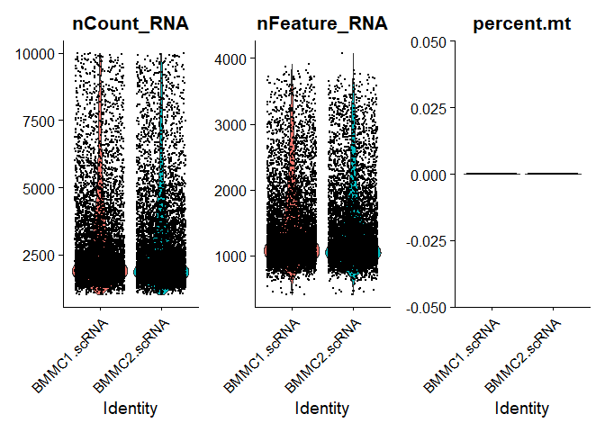
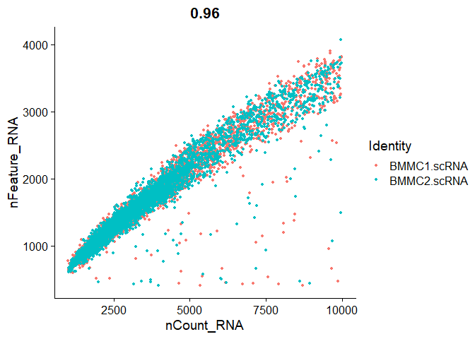
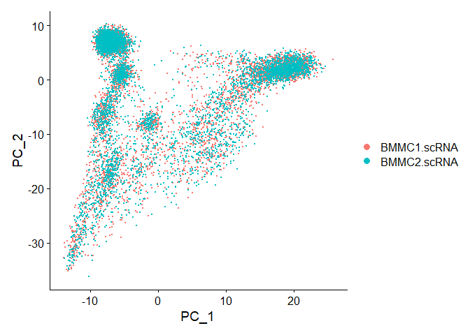
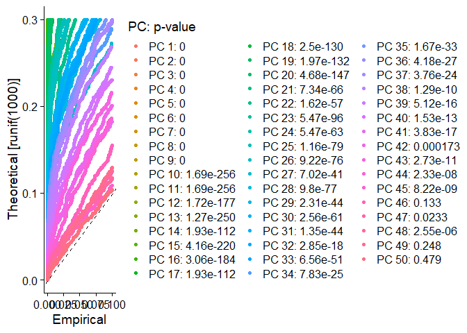
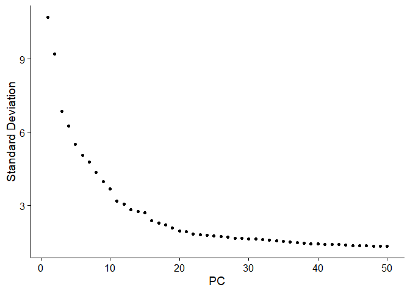
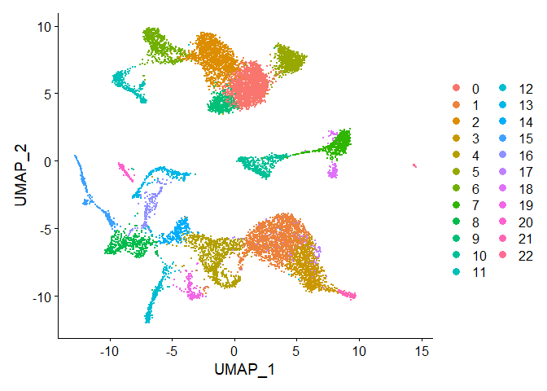

scAML_embedding
================

# Introduction

To get some first experience with multimodal single cell data, we use
the data set generated by (Granja et al. 2019). In this studies, authors
generated multimodal data including combined scRNA- and surface epitopes
(CITE-seq) and scATAC seq data from healthy donor peripheral blood
(PBMCs) and bone marrow mononuclear cells (BMMCs) and CD34+ enriched
BMMCs. CITE-seq data was integrated and used to generate a reference map
for healthy hematopoiesis. Furthermore, they used scATAC-seq to generate
a reference epigenetic map of healthy hematopoiesis.

They tested the robustness and generalizability of the reference map by
iteratively projection various data sets of healthy bone marrow
subcompartements onto the map always confirming high agreement in
subtype projection and identification.

Building on this multimodal reference map they then profile PB/BMMCs
from 6 distinct patients with mixed-phenotype acute leukemia (MPAL),
project this data set into the reference map and investigate
associations to non-malignent cellular counterparts, differentially
expressed peaks, TFs and compared them to other published single-cell
leukemia data sets.

With this vignette we’ll try to

1.  load the scRNA- and scATAC-seq data from the healthy samples
2.  create an seurat object and perform basic quality controls,
    filtering etc.
3.  perform a multimodal integration of scRNA and scATAC-seq
4.  project the MPAL data into the WNN-graph
5.  use IReNA to construct GRNs

For steps 1-4, since they are well standardized, we’ll work with the
seurat vignette.

# Results

## scRNA-seq

### Loading, Filtering

The GEO data set includes scRNA-seq data BMMCs, CD34+ BMMCs, PBCMs and 6
MPAL samples of which two are first diagnosis and relapse from the same
patient.

scRNA-seq data are stored as a sparse matrix

``` r
BMMC1.scRNA <- readRDS("datasets/granja_scMPAL/GSM4138872_scRNA_BMMC_D1T1.rds")
BMMC2.scRNA <- readRDS("datasets/granja_scMPAL/GSM4138873_scRNA_BMMC_D1T2.rds")
```

Both objects include 20287 rows (=transcripts) from \~ 6300 single cells
(identified by a common prefix (in this case “BMMC_D1T2:”) and a cell
UMI. The first goal would be to get this data into an seurat object.

``` r
str(BMMC1.scRNA)
```

    Lade nötiges Paket: Matrix

    Formal class 'dgCMatrix' [package "Matrix"] with 6 slots
      ..@ i       : int [1:9089992] 34 42 50 59 73 74 100 104 112 113 ...
      ..@ p       : int [1:6271] 0 1352 3353 4794 6603 7709 9089 10082 11498 12775 ...
      ..@ Dim     : int [1:2] 20287 6270
      ..@ Dimnames:List of 2
      .. ..$ : chr [1:20287] "FAM138A" "OR4F5" "AL627309.1" "OR4F29" ...
      .. ..$ : chr [1:6270] "BMMC_D1T1:AAACCCAAGATGCAGC-1" "BMMC_D1T1:AAACCCACAAACTCGT-1" "BMMC_D1T1:AAACCCACAGTGTACT-1" "BMMC_D1T1:AAACCCATCGCTATTT-1" ...
      ..@ x       : num [1:9089992] 1 1 1 1 1 1 1 1 1 1 ...
      ..@ factors : list()

SeuratObject includes a CreateSeuratObject wrapper which takes 10x
CellRanger input. Merging two 10x runs into a single seurat object is
described
[here](https://satijalab.org/seurat/articles/merge_vignette.html).

``` r
library(Seurat)
```

    Attaching SeuratObject

``` r
library(dplyr)
```


    Attache Paket: 'dplyr'

    Die folgenden Objekte sind maskiert von 'package:stats':

        filter, lag

    Die folgenden Objekte sind maskiert von 'package:base':

        intersect, setdiff, setequal, union

``` r
BMMC1.scRNA.seurat <- CreateSeuratObject(counts = BMMC1.scRNA,project = "BMMC1.scRNA", assay = "RNA", names.field = 2, names.delim = ":")

BMMC2.scRNA.seurat <- CreateSeuratObject(counts = BMMC2.scRNA,project = "BMMC2.scRNA", assay = "RNA", names.field = 2, names.delim = ":")

BMMC.scRNA.seurat <- merge(BMMC1.scRNA.seurat, y = BMMC2.scRNA.seurat, add.cell.ids = c("T1", "T2"), project = "BMMC.scRNA")
```

Lets have a first glimpse into out newly generated seurat object. We can
access the assays data by using \[\[“assay”\]\].

``` r
BMMC.scRNA.seurat[["RNA"]]@counts
```

    20287 x 12602 sparse Matrix of class "dgCMatrix"

       [[ unterdrücke 32 Spaltennamen 'T1_BMMC_D1T1:AAACCCAAGATGCAGC-1', 'T1_BMMC_D1T1:AAACCCACAAACTCGT-1', 'T1_BMMC_D1T1:AAACCCACAGTGTACT-1'  ...]]
       [[ unterdrücke 32 Spaltennamen 'T1_BMMC_D1T1:AAACCCAAGATGCAGC-1', 'T1_BMMC_D1T1:AAACCCACAAACTCGT-1', 'T1_BMMC_D1T1:AAACCCACAGTGTACT-1'  ...]]

                                                                                                  
    FAM138A      .   .   . . .  . . . .   . .  . . . . . .  . . .  .  .  .  . .   . . . . .   .  .
    OR4F5        .   .   . . .  . . . .   . .  . . . . . .  . . .  .  .  .  . .   . . . . .   .  .
    AL627309.1   .   .   . . .  . . . .   1 .  . . . . . .  . . .  .  .  .  . .   . . . . .   .  .
    OR4F29       .   .   . . .  . . . .   . .  . . . . . .  . . .  .  .  .  . .   . . . . .   .  .
    OR4F16       .   .   . . .  . . . .   . .  . . . . . .  . . .  .  .  .  . .   . . . . .   .  .
    FAM87B       .   .   . . .  . . . .   . .  . . . . . .  . . .  .  .  .  . .   . . . . .   .  .
    LINC00115    .   .   . . .  . . . .   . .  . . . . . .  . . .  .  .  .  . .   . . . . .   .  .
    FAM41C       .   .   . . .  . . . .   . .  . . . . . .  . . .  .  .  .  . .   . . . . .   .  .
    AL645608.2   .   .   . . .  . . . .   . .  . . . . . .  . . .  .  .  .  . .   . . . . .   .  .
    SAMD11       .   .   . . .  . . . .   . .  . . . . . .  . . .  .  .  .  . .   . . . . .   .  .
    AL645608.1   .   .   . . .  . . . .   . .  . . . . . .  . . .  .  .  .  . .   . . . . .   .  .
    NOC2L        .   .   . . .  . . . .   . .  . . . . 1 1  . . .  .  .  .  . .   . . . . .   .  2
    KLHL17       .   .   . . .  . . . .   . .  . . . . . .  . . .  .  .  .  . .   . . . . .   .  .
    PLEKHN1      .   .   . . .  . . . .   . .  . . . . . .  . . .  .  .  .  . .   . . . . .   .  .
    HES4         .   .   . . .  . . . .   . .  . . . . . .  . . .  .  .  .  . .   . . . . .   .  .
    ISG15        .   .   1 1 .  2 1 . .   . .  1 . 1 1 2 .  1 . .  1  .  1  . .   . . . . .   .  1
    AGRN         .   .   . . .  . . . .   . .  . . . . . .  . . .  .  .  .  . .   . . . . .   .  .
    RNF223       .   .   . . .  . . . .   . .  . . . . . .  . . .  .  .  .  . .   . . . . .   .  .
    C1orf159     .   .   . . .  . . . .   . .  . . 1 . . .  1 . .  .  .  .  . .   . . . . .   .  .
    TTLL10-AS1   .   .   . . .  . . . .   . .  . . . . . .  . . .  .  .  .  . .   . . . . .   .  .
    TTLL10       .   .   . . .  . . . .   . .  . . . . . .  . . .  .  .  .  . .   . . . . .   .  .
    TNFRSF18     .   .   . . .  . . . .   . .  . . . . . .  . . .  .  .  .  1 .   . . . . .   .  .
    TNFRSF4      .   .   . . .  1 . . .   . 5  . . . . 1 .  . 1 .  .  .  .  2 .   . . . . .   .  .
    SDF4         .   .   . . .  . . . .   . 1  . . . 1 1 .  . . 1  .  .  .  . .   1 . . . 1   .  .
    B3GALT6      .   .   . . .  . . . .   . .  . . . 1 . 1  . . .  .  .  .  . .   1 . . . .   .  .
    UBE2J2       .   .   . . .  . . . 2   . .  . . . 1 . .  . . .  .  .  .  1 .   . . . . .   .  .
    SCNN1D       .   .   . . .  . . . .   . .  . . . . . .  . . .  .  .  .  . .   1 . . . .   .  .
    ACAP3        .   .   . 1 .  . . . .   . .  1 . . . . .  . . .  .  .  .  . .   1 . 1 . .   3  .
    PUSL1        .   .   . . .  . . . .   . .  . . . . . .  . . .  .  .  .  . .   1 . . . .   .  .
    TAS1R3       .   .   . . .  . . . .   . .  . . . . . .  . . .  .  .  .  . .   . . . . .   .  .
    DVL1         .   1   . . .  . . . .   . .  . . . . . .  . . .  .  .  .  . .   . 1 . . .   .  .
    MXRA8        .   .   . . .  . . . .   . .  . . . . . .  . . .  .  .  .  . .   . 1 . . .   .  .
    AURKAIP1     .   3   1 . .  . 1 . .   . 1  3 . . . . 1  . . .  1  .  .  . .   1 . 2 . .   .  1
    CCNL2        .   .   . 1 .  . . . .   1 .  . . . 1 2 .  . 1 1  .  .  .  . .   . . . . .   .  .
    MRPL20       1   .   . . .  2 . . .   . 1  2 . . 1 1 2  1 . 1  2  1  .  2 .   1 . . 1 .   .  .
    ANKRD65      .   .   . . .  . . . .   . .  . . . . . .  . . .  .  .  .  . .   . . . . .   .  .
    TMEM88B      .   .   . . .  . . . .   . .  . . . . . .  . . .  .  .  .  . .   . . . . .   .  .
    VWA1         .   .   . . .  . . . .   . .  . . . . . .  . . .  .  .  .  . .   . . . . .   .  .
    ATAD3C       .   .   . . .  . . . .   . .  . . . . . .  . . .  .  .  .  . .   . . . . .   .  .
    ATAD3B       .   .   . . .  1 . . .   . .  . . . . . 1  . . .  .  .  .  . .   . . . . 1   .  .
    ATAD3A       .   .   . . .  . . 1 .   . .  . . . . . .  . . .  .  .  .  1 .   . . . . .   .  .
    TMEM240      .   .   . . .  . . . .   . .  . . . . . .  . . .  .  .  .  . .   . . . . .   .  .
    SSU72        1   1   . 1 .  1 1 . 2   1 .  6 1 . 1 . 1  . 1 1  .  1  3  . .   2 5 1 . .   .  .
    AL645728.1   .   .   . . .  . . . .   . .  . . . . . .  . . .  .  .  .  . .   . . . . .   .  .
    MIB2         .   .   . . .  . . . .   . .  1 . . . . .  . 1 .  .  .  1  . 1   . . . . .   .  1
    MMP23B       .   .   . . .  . . . .   . .  . . . . . .  . . .  .  .  .  . .   . . . . .   .  .
    CDK11B       .   .   . . .  . . . .   . .  . . . . 1 .  . . .  .  .  .  . .   . . . . .   1  .
    SLC35E2B     .   .   . . 2  . . . .   . .  . . . . . .  . . 1  .  1  .  . .   . . . . .   .  1
    CDK11A       .   .   . . .  . . . .   . .  . . . . . 1  . . .  .  1  2  . .   . . . . .   .  1
    NADK         .   .   . . .  . . . .   . .  1 . 1 . . .  . . .  2  .  .  . .   2 . . . .   .  .
    GNB1         1   3   . . .  . 1 . .   3 .  1 . . . . .  . 1 1  .  1  .  . .   . . . . .   2  .
    CALML6       .   .   . . .  . . . .   . .  . . . . . .  . . .  .  .  .  . .   . . . . .   .  .
    TMEM52       .   .   . . .  . . . .   . .  . . . . . .  . . .  .  .  .  . .   . . . . .   .  .
    GABRD        .   .   . . .  . . . .   . .  . . . . . .  . . .  .  .  .  . .   . . . . .   .  .
    PRKCZ        .   .   . . .  . . . .   . .  . . . . . .  . . .  .  .  .  . .   . . . . .   .  1
    AL590822.2   .   .   . . .  . . . .   . .  . . . . . .  . . .  .  .  .  . .   . . . . .   .  .
    AL590822.1   .   .   . . .  . . . .   . .  . . . . 1 .  . . .  .  .  .  . .   . . . . .   .  .
    SKI          .   .   1 . .  1 . . .   . .  . . . 1 . .  . . .  .  .  .  . .   . . . . .   .  .
    MORN1        .   .   . . 1  . . . .   . .  . . . . . .  . . .  .  .  .  . .   . . . . .   .  .
    RER1         1   .   1 . .  2 . 1 .   . .  1 . 1 1 1 .  . . 1  .  .  .  1 .   2 . 1 . .   .  .
    PEX10        .   .   . . 1  . . . .   . .  . . . . . .  . . .  .  .  .  . .   . . . . 1   1  .
    PLCH2        .   .   . . .  . . . .   . .  . . . . . .  . . .  .  .  .  . .   . . . . .   .  .
    PANK4        .   .   . . .  . . . .   . .  . . . . . .  . . .  .  .  .  . .   . . . . .   .  .
    HES5         .   .   . . .  . . . .   . .  . . . . . .  . . .  .  .  .  . .   . . . . .   .  .
    TNFRSF14     .   .   . . .  . . 2 1   . .  . . 1 . . 2  . . .  .  .  .  . .   . . . . .   .  2
    FAM213B      .   .   . . .  . . . .   . .  . . . . . .  . . .  .  .  .  . .   . . . . .   .  .
    MMEL1        .   .   . . .  . . . .   . .  . . . . . .  . . .  .  .  .  . .   . . . . .   .  .
    TTC34        .   .   . . .  . . . .   . .  . . . . . .  . . .  .  .  .  . .   . . . . .   .  .
    ACTRT2       .   .   . . .  . . . .   . .  . . . . . .  . . .  .  .  .  . .   . . . . .   .  .
    LINC00982    .   .   . . .  . . . .   . .  . . . . . .  . . .  .  .  .  . .   . . . . .   .  .
    PRDM16       .   .   . . .  . . . .   . .  . . . . . .  . . .  .  .  .  . .   . . . . .   .  .
    ARHGEF16     .   .   . . .  . . . .   . .  . . . . . .  . . .  .  .  .  . .   . . . . .   .  .
    MEGF6        .   .   . . .  . . . .   . .  . . . . . .  . . .  .  .  .  . 1   . . . . .   .  .
    TPRG1L       1   .   . . .  . . 1 .   . .  . . . . . .  . . 1  .  .  .  . .   . . . . .   .  .
    WRAP73       1   .   . . .  1 . . .   . .  . . 1 . . .  . . .  .  .  1  . .   . . . . .   .  .
    TP73         .   .   . . .  . . . .   . .  . . . . . .  . . .  .  .  .  . .   . . . . .   .  .
    CCDC27       .   .   . . .  . . . .   . .  . . . . . .  . . .  .  .  .  . .   . . . . .   .  .
    SMIM1        .   .   . . .  . . . .   . .  . . . . . .  . . .  .  .  .  . .   . . . . .   .  .
    LRRC47       .   .   1 1 .  . . . .   . .  1 1 . . . .  . . .  .  .  .  1 .   . . 1 . .   .  .
    CEP104       .   .   . . .  . . . .   . .  . . . . . .  . . .  .  .  .  . .   . . . . .   .  .
    DFFB         .   .   . . .  . . . .   . .  . . . . . .  . . .  .  .  .  . .   . . . . .   .  1
    C1orf174     .   .   . . .  . . . .   . .  . . . . . .  . . .  .  .  2  . .   1 . . . 1   .  .
    LINC01134    .   .   . . .  . . . .   . .  . . . . . .  . . .  .  .  .  . .   . . . . .   .  .
    AJAP1        .   .   . . .  . . . .   . .  . . . . . .  . . .  .  .  .  . .   . . . . .   .  .
    NPHP4        .   .   . . .  . . . .   . .  . . . . . .  . . .  .  .  .  . .   . . . . .   .  .
    KCNAB2       .   .   . . .  . . . .   . .  1 . . . . .  . . .  2  .  .  1 2   2 . . . .   1  .
    CHD5         .   .   . . .  . . . .   . .  . . . . . .  . . .  .  .  .  . .   . . . . .   .  .
    RNF207       .   .   . . .  . . . .   . .  . . . . . .  . . .  .  .  .  . .   . . . . .   .  .
    ICMT         .   .   . . .  . . . .   . .  . . . . . .  . . .  .  .  .  1 .   . . . . .   .  .
    LINC00337    .   .   . . .  . . . .   . .  . . . . . .  . . .  .  .  .  . .   . . . . .   .  .
    HES3         .   .   . . .  . . . .   . .  . . . . . .  . . .  .  .  .  . .   . . . . .   .  .
    GPR153       .   .   . . .  . . . .   . .  . . . . . .  . . .  .  .  .  . .   . . . . .   .  .
    ACOT7        .   .   . . .  . . . .   . .  1 . . . . .  . . .  .  .  .  . .   . . . . .   .  .
    HES2         .   .   . . .  . . . .   . .  . . . . . .  . . .  .  .  .  . .   . . . . .   .  .
    ESPN         .   .   . . .  . . . .   . .  . . . . . .  . . .  .  .  .  . .   . . . . .   .  .
    TNFRSF25     .   .   . 1 .  . 2 1 .   . .  . . . . 1 .  . 1 .  .  .  .  1 .   . . . . .   .  .
    PLEKHG5      .   .   . . .  . . . .   . .  . . . . . .  . . .  .  .  .  . .   . . . . .   .  .
    NOL9         .   .   . . .  . . . .   . .  . . . . . .  . . .  .  .  .  . .   . . . . .   .  .
    TAS1R1       .   .   . . .  . . . .   . .  . . . . . .  . . .  .  .  .  . .   . . . . .   .  .
    ZBTB48       .   .   . . 1  . . . .   . .  . . . . . .  . . .  .  .  .  . .   . . . . .   .  1
    KLHL21       1   .   . . .  . . . 1   . .  . . . . . .  . . .  .  .  .  . .   . . . . .   .  .
    PHF13        .   .   . . .  . . . .   . .  . . . . . .  . . .  .  .  .  . .   . . . . .   .  .
    THAP3        .   .   . . .  . . . .   . .  . . . . . .  . . .  .  .  .  . .   . . . . .   .  .
    DNAJC11      .   .   . . .  . . . .   . .  . . 1 . . .  . . .  .  .  .  . .   . . . . .   .  .
    CAMTA1       1   .   1 . .  1 . . .   1 1  . . . 1 1 .  . . .  .  .  .  . 1   1 1 . . .   .  .
    VAMP3        .   .   . . .  . . . .   1 .  . . . . . 1  . 1 .  .  .  .  . .   . . 1 . 1   .  .
    PER3         .   .   . . .  . . . .   . .  . . . . . .  . . .  .  .  .  . .   . . . . .   .  .
    UTS2         .   .   . . .  . . . .   . .  . . . . . .  . . .  .  .  .  . .   . . . . .   .  .
    TNFRSF9      .   .   . . .  . . . .   . .  . . . . . .  . . .  .  .  .  . .   . . . . .   .  .
    PARK7        .   3   . . .  1 . . .   . .  3 1 2 2 . 1  . . .  .  2  1  2 1   2 1 . . .   1  2
    ERRFI1       .   .   . . .  . . . .   . .  . . . . . .  . . .  .  .  .  . .   . . . . .   .  .
    SLC45A1      .   .   . . .  . . . .   . .  . . . . . .  . . .  .  .  .  . .   . . . . .   .  .
    RERE         1   1   . 1 .  . . . .   . .  . . . . . .  . . .  1  .  .  . .   . 1 . . .   .  .
    ENO1         1   5   2 . .  1 . 3 1   1 . 12 2 . 1 1 .  4 2 .  5  .  .  . 8   5 1 . . 1   4  .
    ENO1-AS1     .   .   . . .  . . . .   . .  . . . . . .  . . .  .  .  .  . .   . . . . .   .  .
    CA6          .   .   . . .  . . . .   . .  . . . . . .  . . .  .  .  .  . .   . . . . .   .  .
    SLC2A7       .   .   . . .  . . . .   . .  . . . . . .  . . .  .  .  .  . .   . . . . .   .  .
    SLC2A5       .   .   . . .  . . . .   . .  . . . . . .  . . .  .  .  .  . .   . . . . .   .  .
    GPR157       1   .   . . .  . . . .   . .  . . . . . .  . . .  .  .  1  . .   . . . . .   .  .
    H6PD         .   .   . . .  . . . .   . .  1 . . . . .  . . .  .  .  .  . .   . . . . .   .  .
    SPSB1        .   .   . 1 .  . . . .   . .  . . . . . .  . . .  .  .  .  . .   . . . . .   .  .
    SLC25A33     .   .   . . .  . . . .   . .  . . . . . .  . . .  .  .  .  . .   . . . . .   .  .
    TMEM201      .   .   . . .  . . . .   . .  . . . . . .  . . .  .  .  .  . .   . . . . .   .  .
    PIK3CD       .   1   1 1 .  . . 1 .   . .  1 . 1 . . .  . 1 .  .  .  .  . .   . . . 1 1   .  .
    CLSTN1       .   .   . . .  . . 1 .   . .  . . . . . .  . 1 .  .  .  .  . .   . . 1 . .   .  2
    CTNNBIP1     .   .   . . .  . 1 . .   . .  . . . . . .  . . .  .  .  .  . .   1 . . . .   .  .
    LZIC         .   .   . 1 1  . 1 . .   . .  1 1 . . . .  . . .  .  .  .  . .   . . 1 1 .   .  2
    NMNAT1       .   1   . . .  . . . .   . .  . . . . . .  . . .  .  .  .  . .   . . . . .   .  .
    RBP7         .   .   1 . .  . . . .   9 .  . . . . . .  . . .  .  .  .  . .   1 . . . .   1  .
    UBE4B        .   1   1 . .  . . . .   . .  . . . . . .  1 . .  .  1  .  . .   . . . . .   .  .
    KIF1B        .   .   . . .  . . . .   . .  . . . . . .  . . .  .  .  .  . .   . . . . .   .  .
    PGD          .   1   2 1 .  . . . .   1 .  1 . . . . .  . . .  2  2  .  . .   1 . . . .   .  .
    CORT         .   .   . . .  . . . .   . .  . . . . . .  . . .  .  .  .  . .   . . . . .   .  .
    DFFA         .   .   . 2 .  . . . .   . .  . . . . . .  1 . .  .  .  .  . .   . . . . .   .  .
    PEX14        .   1   . . .  . . . .   . .  . . . . . .  . . .  .  .  .  . 1   . . . . .   .  .
    CASZ1        .   .   . . .  . . . .   . .  . . . . . .  . . .  .  .  .  . .   . . . 1 .   .  .
    C1orf127     .   .   . . .  . . . .   . .  . . . . . .  . . .  .  .  .  . .   . . . . .   .  .
    TARDBP       .   .   1 2 .  . 1 . .   . .  1 . . . . 1  . . .  2  .  .  . 2   . . . 1 .   .  .
    MASP2        .   .   . . .  . . . .   . .  . . . . . .  . . .  .  .  .  . .   . . . . .   .  .
    SRM          .   .   . 1 1  1 . 1 .   . .  1 . . . 1 2  2 1 1  .  1  1  . 1   . . . . .   1  .
    EXOSC10      .   .   . . .  . . . 1   . .  . . . . . .  . . .  1  .  .  . .   . . . . .   .  .
    MTOR         .   .   . . .  . . . .   . .  1 . . . . .  . . .  .  .  .  . .   . . . . .   .  .
    MTOR-AS1     .   .   . . .  . . . .   . .  . . . . . .  . . .  .  .  .  . .   . . . . .   .  .
    ANGPTL7      .   .   . . .  . . . .   . .  . . . . . .  . . .  .  .  .  . .   . . . . .   .  .
    UBIAD1       1   .   . . .  . . . .   1 .  . . . . . .  . 1 .  .  .  1  . .   . . 1 . .   .  .
    FBXO2        .   .   . . .  . . . .   . .  . . . . . .  . . .  .  .  .  . .   . . . . .   .  .
    FBXO44       .   .   . . .  . . . .   . .  . . . 1 . .  . . .  .  .  .  . .   . . . . .   .  .
    FBXO6        .   .   . . .  . . . .   . .  . . . . . .  . . .  .  .  .  . .   . . . . .   .  .
    MAD2L2       .   .   . . 1  . . . .   . .  . . . 1 1 .  . . .  .  .  .  . 1   . . . . .   2  1
    DRAXIN       .   .   . . .  . . . .   . .  . . . . . .  . . .  .  .  .  . .   . . . . .   .  .
    AGTRAP       .   2   . . .  . . . .   3 .  1 . . . . 1  2 1 .  .  .  1  . .   3 . . . .   2  .
    C1orf167     .   .   . . .  . . . .   . .  . . . . . .  . . .  .  .  .  . .   . . . . .   .  .
    MTHFR        .   1   . . .  . . . .   . .  . . . . . .  . . .  .  1  .  . .   . . . . .   .  .
    CLCN6        .   1   . . .  . . . .   . .  . . . . . .  . . .  .  .  .  . .   . . . . .   .  .
    NPPA-AS1     .   .   . . .  . . . .   . .  1 . . . . .  . . .  .  .  .  . .   . . . . .   .  .
    NPPA         .   .   . . .  . . . .   . .  . . . . . .  . . .  .  .  .  . .   . . . . .   .  .
    NPPB         .   .   . . .  . . . .   . .  . . . . . .  . . .  .  .  .  . .   . . . . .   .  .
    KIAA2013     .   1   . . .  . . . .   . 1  1 . . . . .  1 . 1  1  .  .  2 .   . . . . .   1  .
    PLOD1        .   .   . . .  . . . .   . .  . . . . . .  . . .  .  .  .  . .   . . . . .   .  .
    MFN2         .   .   . . .  . . . .   . .  . . . . . .  1 . .  1  .  .  . .   . . 1 . .   .  .
    MIIP         .   2   . . 1  . . . .   . 1  . . . . . .  1 . .  .  1  .  . .   1 . . . 1   .  .
    TNFRSF8      .   1   . . .  . . . .   . .  . . . . . .  . . .  .  .  .  . .   . . . . .   .  .
    TNFRSF1B     .   .   1 . .  1 . . .   2 .  . . . . . .  . . .  1  1  1  4 .   . 1 . . 1   1  .
    VPS13D       .   .   1 . .  . . . .   . .  . . . . 1 .  . . .  .  .  .  1 .   1 . . . .   .  .
    DHRS3        .   .   . . .  . . . .   . .  . 1 . . . .  . . .  .  .  .  1 .   . . . . .   .  .
    AADACL4      .   .   . . .  . . . .   . .  . . . . . .  . . .  .  .  .  . .   . . . . .   .  .
    AADACL3      .   .   . . .  . . . .   . .  . . . . . .  . . .  .  .  .  . .   . . . . .   .  .
    C1orf158     .   .   . . .  . . . .   . .  . . . . . .  . . .  .  .  .  . .   . . . . .   .  .
    PRAMEF12     .   .   . . .  . . . .   . .  . . . . . .  . . .  .  .  .  . .   . . . . .   .  .
    PRAMEF1      .   .   . . .  . . . .   . .  . . . . . .  . . .  .  .  .  . .   . . . . .   .  .
    PRAMEF11     .   .   . . .  . . . .   . .  . . . . . .  . . .  .  .  .  . .   . . . . .   .  .
    HNRNPCL1     .   .   . . .  . . . .   . .  . . . . . .  . . .  .  .  .  . .   . . . . .   .  .
    PRAMEF2      .   .   . . .  . . . .   . .  . . . . . .  . . .  .  .  .  . .   . . . . .   .  .
    PRAMEF4      .   .   . . .  . . . .   . .  . . . . . .  . . .  .  .  .  . .   . . . . .   .  .
    PRAMEF10     .   .   . . .  . . . .   . .  . . . . . .  . . .  .  .  .  . .   . . . . .   .  .
    PRAMEF7      .   .   . . .  . . . .   . .  . . . . . .  . . .  .  .  .  . .   . . . . .   .  .
    PRAMEF6      .   .   . . .  . . . .   . .  . . . . . .  . . .  .  .  .  . .   . . . . .   .  .
    PRAMEF26     .   .   . . .  . . . .   . .  . . . . . .  . . .  .  .  .  . .   . . . . .   .  .
    PRAMEF5      .   .   . . .  . . . .   . .  . . . . . .  . . .  .  .  .  . .   . . . . .   .  .
    PRAMEF8      .   .   . . .  . . . .   . .  . . . . . .  . . .  .  .  .  . .   . . . . .   .  .
    PRAMEF9      .   .   . . .  . . . .   . .  . . . . . .  . . .  .  .  .  . .   . . . . .   .  .
    PRAMEF13     .   .   . . .  . . . .   . .  . . . . . .  . . .  .  .  .  . .   . . . . .   .  .
    PRAMEF18     .   .   . . .  . . . .   . .  . . . . . .  . . .  .  .  .  . .   . . . . .   .  .
    PRAMEF15     .   .   . . .  . . . .   . .  . . . . . .  . . .  .  .  .  . .   . . . . .   .  .
    PRAMEF14     .   .   . . .  . . . .   . .  . . . . . .  . . .  .  .  .  . .   . . . . .   .  .
    PRAMEF19     .   .   . . .  . . . .   . .  . . . . . .  . . .  .  .  .  . .   . . . . .   .  .
    PRAMEF17     .   .   . . .  . . . .   . .  . . . . . .  . . .  .  .  .  . .   . . . . .   .  .
    PRAMEF20     .   .   . . .  . . . .   . .  . . . . . .  . . .  .  .  .  . .   . . . . .   .  .
    LRRC38       .   .   . . .  . . . .   . .  . . . . . .  . . .  .  .  .  . .   . . . . .   .  .
    PDPN         .   .   . . .  . . . .   . .  . . . . . .  . . .  .  .  .  . .   . . . . .   .  .
    PRDM2        2   .   . 1 .  . . . .   1 1  1 . . . 1 .  . . .  1  .  .  . .   . . . . 1   .  1
    KAZN         .   .   . . .  . . . .   . .  . . . . . .  . . .  .  .  .  . .   . . . . .   .  .
    TMEM51       .   .   . . .  . . . .   . .  . . . . . .  . . .  .  .  .  . .   . . . . .   .  .
    C1orf195     .   .   . . .  . . . .   . .  . . . . . .  . . .  .  .  .  . .   . . . . .   .  .
    FHAD1        .   .   . . .  . . . .   . .  . . . . . .  . . .  .  .  .  . .   . . . . .   .  .
    EFHD2        .   3   4 . .  . . . .   1 .  . . . . . .  . . .  1  1  .  . .   3 . . . .   .  1
    CTRC         .   .   . . .  . . . .   . .  . . . . . .  . . .  .  .  .  . .   . . . . .   .  .
    CELA2A       .   .   . . .  . . . .   . .  . . . . . .  . . .  .  .  .  . .   . . . . .   .  .
    CELA2B       .   .   . . .  . . . .   . .  . . . . . .  . . .  .  .  .  . .   . . . . .   .  .
    CASP9        .   .   . . .  . . . .   . .  . . . . . .  . . .  .  .  .  . .   . . . . .   .  .
    DNAJC16      .   .   . . .  . . . .   . .  1 . . . . .  . . .  .  .  .  1 .   . . . . .   .  .
    AGMAT        .   .   . . .  . . . .   . .  . . . 1 . .  . . .  .  .  .  . .   . . . . .   .  .
    DDI2         .   .   . . .  . . . .   . .  . . . . . .  . . .  1  .  .  . .   . . . . .   .  .
    RSC1A1       .   .   . . .  . . . .   . .  . . . . . .  . . .  .  .  .  . .   . . . . .   .  .
    PLEKHM2      .   1   . 1 .  1 . . .   . .  1 . 1 . . 1  . . .  .  .  .  . .   . . . . .   .  .
    SLC25A34     .   .   . . .  . . . .   . .  . . . . . .  . . .  .  .  .  . .   . . . . .   .  .
    TMEM82       .   .   . . .  . . . .   . .  . . . . . .  . . .  .  .  .  . .   . . . . .   .  .
    FBLIM1       .   .   . . 1  . . . .   . .  . . . . . .  . . .  .  .  1  . .   . . . . .   .  .
    SPEN         .   1   . . .  1 . . .   1 .  2 . . . . .  . . 1  .  .  .  . .   . . . . .   .  .
    ZBTB17       .   .   . . .  . . . .   . .  1 . . . . .  . . .  .  .  .  . .   . . . . .   .  .
    HSPB7        .   .   . . .  . . . .   . .  . . . . . .  . . .  .  .  .  . .   . . . . .   .  .
    CLCNKA       .   .   . . .  . . . .   . .  . . . . . .  . . .  .  .  .  . .   . . . . .   .  .
    CLCNKB       .   .   . . .  . . . .   . .  . . . . . .  . . .  .  .  .  . .   . . . . .   .  .
    FAM131C      .   .   . . .  . . . .   . .  . . . . . .  . . .  .  .  .  . .   . . . . .   .  .
    EPHA2        .   .   . . .  . . . .   . .  . . . . . .  . . .  .  .  .  . .   . . . . .   .  .
    ARHGEF19-AS1 .   .   . . .  . . . .   . .  . . . . . .  . . .  .  .  .  . .   . . . . .   .  .
    ARHGEF19     .   .   . . .  . . . .   . .  . . . . . .  . . .  .  .  .  . .   . . . . .   .  .
    FBXO42       .   .   . 1 .  . . . .   . .  . . . . . .  . . .  .  .  .  . .   . . . . .   1  .
    SZRD1        .   .   . . .  . . . 1   . .  . . . 1 . .  . . .  .  1  1  . .   . . . . 1   1  .
    SPATA21      .   .   . . .  . . . .   . .  . . . . . .  . . .  .  .  .  . .   . . . . .   .  .
    NECAP2       .   1   1 . .  . . 1 .   . .  . 1 . 1 . 2  . 1 .  .  .  .  1 .   1 . . . .   .  .
    NBPF1        .   .   . . .  . . . .   . .  . . . . . .  . . .  .  .  .  . .   . . . . .   .  .
    CROCC        .   .   . 1 .  . . . .   . .  . . . . . .  . . .  .  .  .  . .   . . . . .   .  .
    MFAP2        .   .   . . .  . . . .   . .  . . . . . .  . . .  .  .  .  . .   . . . . .   .  .
    ATP13A2      .   .   . 1 .  . . . .   . .  . . . . . .  . . .  .  1  .  . .   . . . . .   1  .
    SDHB         .   .   2 . .  . . 1 .   . .  1 . 1 . . 1  . . .  .  .  .  . .   2 . . . 1   1  .
    PADI2        .   1   . . .  . . . .   . .  . . . . . .  . . .  .  .  .  . .   1 . . . .   .  .
    PADI1        .   .   . . .  . . . .   . .  . . . . . .  . . .  .  .  .  . .   . . . . .   .  .
    PADI3        .   .   . . .  . . . .   . .  . . . . . .  . . .  .  .  .  . .   . . . . .   .  .
    PADI4        .   1   2 . .  . . . .   5 .  1 . . . . .  . . .  .  .  .  . .   3 . . . .   1  .
    RCC2         .   2   . . .  1 . . .   . .  . . 1 . . .  . . .  .  .  .  . .   . . . 1 .   1  .
    ARHGEF10L    .   .   . . .  . . . .   . .  . . . . . .  . . .  .  .  .  . .   . . . . .   .  .
    ACTL8        .   .   . . .  . . . .   . .  . . . . . .  . . .  .  .  .  . .   . . . . .   .  .
    IGSF21       .   .   . . .  . . . .   . .  . . . . . .  . . .  .  .  .  . .   . . . . .   .  .
    KLHDC7A      .   .   . . .  . . . .   . .  . . . . . .  . . .  .  .  .  . .   . . . . .   .  .
    PAX7         .   .   . . .  . . . .   . .  . . . . . .  . . .  .  .  .  . .   . . . . .   .  .
    TAS1R2       .   .   . . .  . . . .   . .  . . . . . .  . . .  .  .  .  . .   . . . . .   .  .
    ALDH4A1      .   .   . . .  . . . .   . .  . . . . . .  . . .  .  .  .  . .   . . . . .   .  .
    IFFO2        .   .   . . .  . . . .   . .  . . . . . .  . . .  .  .  .  . .   . . . . .   .  .
    UBR4         .   .   . . .  . . . .   . .  . . . . . .  . . 1  .  .  .  . .   1 . . . 2   .  .
    EMC1         .   .   . . .  . . . .   . .  . . . . 1 .  . . .  .  .  .  . .   . . . . .   .  .
    MRTO4        1   .   . . .  1 . . .   . .  . . . . . .  . . .  .  .  .  . .   . . . . .   .  .
    AKR7A3       .   .   . . .  . . . .   . .  . . . . . .  . . .  .  .  .  . .   . . . . .   .  .
    AKR7A2       .   .   1 . .  . . . .   . .  2 . . . 1 .  . 1 .  2  1  1  . .   . 1 . . .   .  .
    PQLC2        .   .   . . .  . . . .   . .  1 . . . . .  . . .  1  .  .  . .   . . . . .   .  .
    CAPZB        3   1   5 3 1  1 . 3 .   1 3  . 1 . 3 1 1  1 . 3  1  4  .  1 .   . . . . .   2  1
    MINOS1-NBL1  .   .   . . .  . . . .   . .  . . . . . .  . . .  .  .  .  . .   . . . . .   .  .
    MINOS1       .   .   . 1 .  2 1 . 1   . .  1 . 1 . 1 .  . . .  1  .  .  . .   3 . . . .   1  1
    NBL1         .   .   . . .  . . . .   . 1  . . . . . .  . . .  .  .  .  . .   . . . . .   .  .
    HTR6         .   .   . . .  . . . .   . .  . . . . . .  . . .  .  .  .  . .   . . . . .   .  .
    TMCO4        .   1   . . .  . . . .   . .  . . . . . .  . . .  .  .  .  . .   . . . . .   .  .
    RNF186       .   .   . . .  . . . .   . .  . . . . . .  . . .  .  .  .  . .   . . . . .   .  .
    OTUD3        .   .   . . .  . . . .   . .  . . . . . .  . . .  .  .  .  . .   . . . . .   .  .
    PLA2G2E      .   .   . . .  . . . .   . .  . . . . . .  . . .  .  .  .  . .   . . . . .   .  .
    PLA2G2A      .   .   . . .  . . . .   . .  . . . . . .  . . .  .  .  .  . .   . . . . .   .  .
    PLA2G5       .   .   . . .  . . . .   . .  . . . . . .  . . .  .  .  .  . .   . . . . .   .  .
    PLA2G2D      .   .   . . .  . . . .   . .  . . . . . .  . . .  .  .  .  . .   . . . . .   .  .
    PLA2G2F      .   .   . . .  . . . .   . .  . . . . . .  . . .  .  .  .  . .   . . . . .   .  .
    PLA2G2C      .   .   . . .  . . . .   . .  . . . . . .  . . .  .  .  .  . .   . . . . .   .  .
    UBXN10-AS1   .   .   . . .  . . . .   . .  . . . . . .  . . .  .  .  .  . .   . . . . .   .  .
    UBXN10       .   .   . . .  . . . .   . .  . . . . . .  . . .  .  .  .  . .   . . . . .   .  .
    VWA5B1       .   .   . . .  . . . .   . .  . . . . . .  . . .  .  .  .  . .   . . . . .   .  .
    LINC01141    .   .   . . .  . . . .   . .  . . . . . .  . . .  .  .  .  . .   . . . . .   .  .
    CAMK2N1      .   .   . . .  . . . .   . .  . . . . . .  . . .  .  .  .  . .   . . . . .   .  .
    MUL1         .   .   . . .  . . . .   . .  . . . . . .  . . .  .  .  .  . .   . . . . .   .  .
    FAM43B       .   .   . . .  . . . .   . .  . . . . . .  . . .  .  .  .  . .   . . . . .   .  .
    CDA          .   2   2 . .  . . . .   . .  1 . . . . .  . . .  .  .  .  . .   2 . . . .   .  .
    PINK1        .   .   . . .  . . . .   . .  . . . . . .  . . .  .  .  .  . .   . . . . .   .  .
    PINK1-AS     .   .   . . .  . . . .   . .  1 . . . . .  . . .  .  .  .  . .   . . . . .   .  .
    DDOST        .   .   . . 1  . . 1 .   . .  2 . . . . .  . . .  .  1  1  . .   1 . . . .   .  .
    KIF17        .   .   . . .  . . . .   . .  . . . . . .  . . .  .  .  .  . .   . . . . .   .  .
    SH2D5        .   .   . . .  . . . .   . .  . . . . . .  . . .  .  .  .  . .   . . . . .   .  .
    HP1BP3       2   1   . 1 .  . . . .   . 1  1 . . . . .  . . .  .  2  .  . 1   . . 2 2 .   .  1
    EIF4G3       .   .   1 . .  . . . .   . .  . . . . . .  . . .  .  .  .  . .   . . . . .   .  .
    ECE1         .   .   . 1 .  1 . . .   . .  . . . . . .  . . .  .  .  .  . .   . 1 . . .   .  .
    NBPF3        .   .   . . .  . . . .   . .  . . . . . .  . . .  .  .  .  . .   . . . . .   .  .
    ALPL         .   .   . . .  . . . .   . .  . . . . . .  . . .  .  .  .  . .   . . . . .   .  .
    RAP1GAP      .   .   . . .  . . . .   . .  . . . . . .  . . .  .  .  .  . .   . . . . .   .  .
    USP48        .   1   . . .  . . . .   . .  1 1 . . . .  . . .  1  .  .  . .   . . . . .   .  .
    LDLRAD2      .   .   . . .  . . . .   . .  . . . . . .  . . .  1  .  .  . .   . . . . .   .  .
    HSPG2        .   .   . . .  . . . .   . .  1 . . . . .  . . .  .  .  .  . 1   . . . . .   .  .
    CELA3B       .   .   . . .  . . . .   . .  . . . . . .  . . .  .  .  .  . .   . . . . .   .  .
    CELA3A       .   .   . . .  . . . .   . .  . . . . . .  . . .  .  .  .  . .   . . . . .   .  .
    CDC42        3   8   6 6 2  4 . 2 3   5 1  1 . 2 3 3 2  2 2 3  6  1  2  3 .   6 . 1 3 3   5  .
    WNT4         .   .   . . .  . . . .   . .  . . . . . .  . . .  .  .  .  . .   . . . . .   .  .
    ZBTB40       .   .   1 . .  . . . .   . .  . . . . . .  . . .  .  .  .  . .   . . . . .   .  .
    EPHA8        .   .   . . .  . . . .   . .  . . . . . .  . . .  .  .  .  . .   . . . . .   .  .
    C1QA         .   .   . . .  . . . .   . .  . . . . . .  . . .  .  .  .  . .   . . . . .   .  .
    C1QC         .   .   . . .  . . . .   . .  . . . . . .  . . .  .  .  .  . .   . . . . .   .  .
    C1QB         .   .   . . .  . . . .   . .  . . . . . .  . . .  .  .  .  . .   . . . . .   .  .
    EPHB2        .   .   . . .  . . . .   . .  . . . . . .  . . .  1  .  .  . .   . . . . .   .  .
    LACTBL1      .   .   . . .  . . . .   . .  . . . . . .  . . .  .  .  .  . .   . . . . .   .  .
    KDM1A        1   .   . . .  1 . . .   1 .  . . . . . .  . 1 .  1  .  .  . .   . . . . .   .  .
    LUZP1        .   .   . . .  . . . 1   . .  . . . . . .  . . .  .  .  .  1 .   . . . . .   .  .
    HTR1D        .   .   . . .  . . . .   . .  . . . . . .  . . .  .  .  .  . .   . . . . .   .  .
    HNRNPR       1   2   . 1 3  . . . .   . .  . . 1 1 . 1  . 1 .  .  .  .  . .   1 . 1 . .   1  1
    ZNF436       .   .   . . .  . . . .   . .  . . . . . .  . . .  .  .  .  . .   . . 1 . .   .  .
    TCEA3        1   .   . . .  . . . 1   . .  . . . . . .  . . .  .  .  1  . .   . 1 2 . .   .  .
    ASAP3        .   .   . . .  . . . .   . .  . . . . . .  . . .  .  .  .  . .   . . . . .   .  .
    E2F2         .   .   . . .  . . . .   . .  . . . . . .  . . .  .  .  .  . .   . . . . .   .  .
    ID3          .   .   . . .  . . . .   . .  . . . . . .  . . .  .  .  .  . .   . . . . .   .  .
    MDS2         .   .   . . .  . 1 . .   . .  . . . . . .  . . .  .  .  .  . .   . 1 . . .   .  .
    PITHD1       1   1   . . .  . . 1 .   . .  . . . 2 . 2  . . .  1  1  .  . .   . . . . .   .  .
    LYPLA2       .   .   2 . .  . . . .   . 1  . . . . . 2  . . .  .  .  1  . .   1 1 . . 1   .  1
    GALE         .   .   . . .  . . . .   . .  . . . . . .  . . .  1  .  .  . .   . . . . .   .  .
    HMGCL        .   .   1 . .  . . . .   . .  . . . . . .  . . .  .  .  .  . .   . . . . .   .  .
    FUCA1        .   .   . . .  . . . .   . .  . . . . . .  . . .  .  .  .  . .   . . . . 1   .  .
    CNR2         .   .   . . .  . . . .   . .  . . . . . .  . . .  .  .  .  . .   . . . 1 .   .  .
    PNRC2        .   .   . . .  . . . .   . .  . . . . . .  . . .  .  .  .  . .   . . . . .   .  .
    SRSF10       .   .   . . .  . . . 1   . .  . . . . . .  . . .  1  .  .  . 1   . . . . .   .  .
    MYOM3        .   .   . . .  . . . .   . .  . . . . . .  . . .  .  .  .  . .   . . . . .   .  .
    IL22RA1      .   .   . . .  . . . .   . .  . . . . . .  . . .  .  .  .  . .   . . . . .   .  .
    IFNLR1       .   .   . . .  . . . .   . .  . . . . . .  . . .  .  .  .  . .   . . . . .   .  .
    GRHL3        .   .   . . .  . . . .   . .  . . . . . .  . . .  .  .  .  . .   . . . . .   .  .
    STPG1        .   .   . . .  . . . .   1 .  . . . . . .  . . .  .  .  .  . .   . . . . .   .  .
    NIPAL3       .   .   . . .  . . . .   . .  . . 1 . . 1  . . 1  2  .  .  1 .   . . . . .   .  .
    RCAN3        2   .   . . .  . 1 1 .   . .  . . . . . .  . . 1  .  1  1  2 .   . . 2 . 1   1  1
    NCMAP        .   .   . . .  . . . .   . .  . . . . . .  . . .  .  .  .  . .   . . . . .   .  .
    SRRM1        2   3   2 1 .  1 . 1 .   . .  2 . . 1 . 2  2 1 1  1  .  .  1 .   3 . 2 . .   1  .
    CLIC4        .   .   . . .  . . . .   . .  . . . . . .  . . .  .  .  .  . .   . . . . .   .  .
    RUNX3        .   .   . . .  . . . .   . .  . . . 1 . 1  . . .  .  .  .  . 1   . . . . 3   .  1
    SYF2         .   .   1 . .  . 1 . 1   2 .  . 1 . . 1 .  1 . 1  .  1  .  1 .   . . . . .   .  .
    RHD          .   .   . . .  . . . .   . .  . . . . . .  . . .  .  .  .  . .   . . . . .   .  .
    TMEM50A      .   3   . 1 1  2 . 2 .   2 .  . . . 1 . 1  1 . 1  .  .  .  2 .   2 . . . 1   1  3
    RHCE         .   .   . . .  . . . .   . .  . . . . . .  . . .  .  .  .  . .   . . . . .   .  .
    LDLRAP1      .   .   . . .  . . 1 .   . .  . . . . . 2  . . .  .  .  .  1 .   1 . . . .   .  .
    MAN1C1       .   .   . . .  . . . .   . .  . . . . . .  . . 1  .  .  .  . .   . . . . .   .  .
    MTFR1L       .   1   . . .  . . . .   . .  . . . . . .  . . .  .  .  .  . .   . . 1 . .   1  .
    AL020996.1   .   .   . . .  . . . 1   . .  . . . . . .  . . .  .  .  .  . .   . . . . .   .  .
    AUNIP        .   .   . . .  . . . .   . .  . . . . . .  . . .  .  .  .  . .   . . . . .   .  .
    PAQR7        .   .   . . .  . . . .   . .  . . . . . .  . . .  .  .  .  . .   . 1 . . .   .  .
    STMN1        .   .   . 4 1  . 1 1 .   . .  4 . 1 1 . .  . . .  1  7  .  . 3   . 2 . . .   .  .
    PAFAH2       .   .   . 1 .  . . . .   . .  . . . . . .  . . .  .  .  .  . .   . . . . .   .  .
    EXTL1        .   .   . . .  . . . .   . .  . . . . . .  . . .  .  .  .  . .   . . . . .   .  .
    SLC30A2      .   .   . . .  . . . .   . .  . . . . . .  . . .  .  .  .  . .   . . . . .   .  .
    TRIM63       .   .   . . .  . . . .   . .  . . . . . .  . . .  .  .  .  . .   . . . . .   .  .
    PDIK1L       .   .   . . .  . . . .   . .  . . . . . .  . . .  .  .  .  . .   . . . . .   .  .
    FAM110D      .   .   . . .  . . . .   . .  . . . . . .  . . .  .  .  .  . .   . . . . .   .  .
    ZNF593       .   1   . . .  . . . .   . 1  1 . . . . .  . . .  .  1  .  . 1   . . . . .   .  .
    CNKSR1       .   .   . . .  . . . .   . .  . . . . . .  . . .  .  .  .  . .   . . . . .   .  .
    CATSPER4     .   .   . . .  . . . .   . .  . . . . . .  . . .  .  .  .  . .   . . . . .   .  .
    CEP85        .   .   . . .  . . . .   1 .  . . . . . .  . 1 1  .  .  .  . .   . . . . .   .  .
    SH3BGRL3     5  20  19 2 2  4 5 1 6   8 4  6 4 3 3 4 1  7 2 4  5 10  3  5 1  19 5 1 1 3   7  4
    UBXN11       .   .   . . .  . . . .   2 1  1 . . . . .  . . .  .  .  .  . .   1 . . . .   1  .
    CD52         2   8  10 7 .  7 4 3 2  11 3  . 7 9 1 3 4  1 3 3  1  .  .  6 .  10 1 3 4 2   .  6
    ZNF683       .   .   . . .  . . . .   . .  . . . . . .  . . .  .  .  .  . .   . . . . .   .  .
    LIN28A       .   .   . . .  . . . .   . .  . . . . . .  . . .  .  .  .  . .   . . . . .   .  .
    DHDDS        .   1   . . .  . . . .   . .  . . . . . .  . . .  .  .  .  . .   . . . . .   .  .
    HMGN2        1  10   2 4 .  1 1 . 3   1 1  6 1 1 2 . 1  1 1 .  3  5  3  3 1   2 1 1 1 1   7  1
    ARID1A       1   1   . 1 .  . . . .   1 .  2 . . . . .  . . .  1  .  .  . .   1 . . . .   .  .
    PIGV         .   .   . . .  . . . .   . .  . . . . . .  . . .  .  .  .  . .   . . . . 1   .  .
    ZDHHC18      1   .   . . .  1 . 1 .   . .  . . . . . .  . . 1  .  2  .  . .   . . . . 1   .  .
    SFN          .   .   . . .  . . . .   . .  . . . . . .  . . .  .  .  .  . .   . . . . .   .  .
    GPN2         .   .   . 1 .  . . . .   . .  . . . . . .  . . .  .  .  .  . .   . . . . 1   .  .
    GPATCH3      .   .   . . .  . . . .   . .  . . . . . .  . . 1  .  .  .  . .   . . . . .   .  .
    NUDC         .   .   . . .  1 . . .   . .  . . . 1 . .  . . .  .  .  1  . 1   . . . . .   .  1
    NR0B2        .   .   . . .  . . . .   . .  . . . . . .  . . .  .  .  .  . .   . . . . .   .  .
    TRNP1        .   .   . . .  . . . .   . .  . . . . . .  . . .  .  .  .  . .   . . . . .   .  .
    SLC9A1       .   .   . . .  . . . .   1 .  . . . . . .  . . .  .  .  .  . .   . . . . .   .  .
    WDTC1        1   .   . 1 .  . . . .   . .  . 1 . . . 1  . . .  1  .  .  . .   . . . . .   .  .
    TMEM222      .   .   . . .  1 . . .   . .  . . . 1 . .  . . .  .  .  .  . .   . . . . .   .  .
    SYTL1        .   .   1 1 .  1 1 1 .   . 1  . 2 . . 1 .  . . .  .  .  1  1 .   1 1 1 . 1   .  1
    MAP3K6       .   .   . . .  . . . .   . .  . . . . . 1  . . .  .  .  .  . .   . . . . .   .  .
    FCN3         .   .   . . .  . . . .   . .  . . . . . .  . . .  .  .  .  . .   . . . . .   .  .
    CD164L2      .   .   . . .  . . . .   . .  . . . . . .  . . .  .  .  .  . .   . . . . .   .  .
    GPR3         .   .   . . .  . . . .   . .  . . . . . .  . . .  .  .  .  . .   . . . . .   .  .
    WASF2        .   1   1 1 1  1 . . 1   1 .  1 . . . . .  . . .  2  .  .  1 .   . . . 1 1   .  .
    AHDC1        .   .   . . .  . . . .   . .  . . . . . .  . . .  .  .  .  . .   . . . . .   .  .
    FGR          .   1   1 . .  . . . .   . .  1 . . . . .  2 . .  .  .  1  . .   . . . . .   3  .
    IFI6         .   .   . . .  . 1 2 .   . .  1 . . 1 . .  . . .  .  .  .  . .   1 . . . 3   .  .
    FAM76A       .   .   . . .  . . . .   . .  . . . . . .  . . .  .  .  .  . .   . . . . .   .  .
    STX12        .   1   . . .  . . . .   . .  . . . . . 1  . . .  .  .  .  . .   . . . 1 1   .  .
    PPP1R8       1   .   . . .  . . . .   . .  . . . . . .  . . .  .  .  .  . .   . . . . .   .  .
    THEMIS2      .   1   3 . .  . . . .   2 .  . . . . . .  1 . .  .  .  .  . .   . 1 . . .   2  .
    SMPDL3B      .   .   . . .  . . . .   . .  . . . . . .  . . .  .  .  .  . .   . . . . .   .  .
    XKR8         .   .   . . .  . . . .   . .  . . . . . .  . . .  .  .  .  . .   . . . . .   .  .
    EYA3         .   1   . . .  . . . .   . .  1 . 1 . . .  . 2 .  .  .  .  . .   . . . . .   .  .
    PTAFR        .   .   . . .  . . . .   1 .  . . . . . .  . . .  1  .  .  . .   2 . . . .   .  .
    DNAJC8       .   .   . . .  2 1 . 1   1 .  1 . . 1 . .  . . .  1  .  .  1 .   . 1 . . .   .  .
    SESN2        .   .   . . .  . . . .   . .  . . . . . .  . . .  .  .  .  . .   . . . . .   .  .
    MED18        .   .   . . .  . . . .   . .  . . . . . .  . . .  .  .  .  . .   . . . . .   .  .
    PHACTR4      .   .   . 1 .  . . . .   . .  . . . 1 . .  1 . .  .  1  .  . 1   1 . . . .   .  .
    RCC1         .   .   . . .  . . . .   . .  . . . . . .  . . .  .  .  .  . .   . . . . .   .  .
    TRNAU1AP     .   .   . . .  . . . .   . .  . . . . 1 .  . . .  .  .  .  1 .   . . . . .   .  .
    SNHG12       2   .   . . .  . . 1 .   . .  . . . . . .  . . .  .  .  1  . .   1 . . . .   .  .
    TAF12        .   2   . 1 .  . . . .   . .  . . 1 . . .  . . .  .  .  .  . .   . . . . .   .  .
    RAB42        .   .   . . .  . . . .   . .  . . . . . .  . . .  .  .  .  . .   . . . . .   .  .
    GMEB1        .   .   . 1 .  . . . .   . .  . . 1 1 . .  . . .  .  .  .  . .   . . . 1 .   .  .
    YTHDF2       .   1   . . 1  1 . . .   . .  2 1 . . . .  . . .  1  .  1  . .   . . 1 1 .   .  .
    OPRD1        .   .   . . .  . . . .   . .  . . . . . .  . . .  .  .  .  . .   . . . . .   .  .
    EPB41        2   1   . 1 .  . . 1 1   2 .  . . . . . .  . . .  .  .  .  . .   . . . . .   .  .
    TMEM200B     .   .   . . .  . . . .   . .  . . . . . .  . . .  .  .  .  . .   . . . . .   .  .
    SRSF4        .   .   . 1 .  . . 1 .   . .  1 . . . . 1  . . .  .  .  .  . .   . . . . .   4  1
    MECR         .   .   . . .  . . 1 .   . .  . . . . . .  . . .  .  .  .  . .   . . . . .   .  .
    PTPRU        .   .   . . .  . . . .   . .  . . . . . .  . . .  .  .  .  . .   . . . . .   .  .
    MATN1        .   .   . . .  . . . .   . .  . . . . . .  . . .  .  .  .  . .   . . . . .   .  .
    MATN1-AS1    .   .   . . .  . . . .   . .  . . . . . .  . . .  .  .  .  . .   . . . . .   .  .
    LAPTM5       2   7   5 3 7  4 . 2 2   8 .  5 . . 1 1 .  3 3 2  2  3  .  . .   4 3 3 6 2   3  1
    SDC3         .   .   . . .  . . . .   . .  . . . . . .  . . .  .  .  .  . .   . . . . .   .  .
    PUM1         .   .   . . .  . . . .   . .  . . . 1 . .  1 . .  .  .  1  . 1   1 . . . .   .  .
    NKAIN1       .   .   . . .  . . . .   . .  . . . . . .  . . .  .  .  .  . .   . . . . .   .  .
    SNRNP40      .   1   . 1 .  . . . .   . .  1 . . . . 1  . . .  .  .  .  1 .   . . . . .   .  .
    ZCCHC17      .   .   . . .  . . . .   . 1  . . . . . .  . . .  .  1  .  . 1   . . . . .   1  .
    FABP3        .   .   . . .  . . . .   . .  . . . . . .  . . .  .  .  .  . .   . . . . .   .  .
    SERINC2      .   .   . . .  . . . .   . .  . . . . . .  . . .  .  1  .  . .   . . . . .   .  .
    TINAGL1      .   .   . . .  . . . .   . .  . . . . . .  . . .  .  .  .  . .   . . . . .   .  .
    HCRTR1       .   .   . . .  . . . .   . .  . . . . . .  . . .  .  .  .  . .   . . . . .   .  .
    PEF1         .   .   . . .  . . . .   . .  1 . . . . .  . 1 .  .  .  .  . .   . . . . 1   .  .
    COL16A1      .   .   . . .  . . . .   . .  . . . . . .  . . .  .  .  .  . .   . . . . .   .  .
    SPOCD1       .   .   . . .  . . . .   . .  . . . . . .  . . .  .  .  .  . .   . . . . .   .  .
    PTP4A2       1   7   3 1 1  1 . 1 4   3 .  1 . . 1 1 3  2 . .  1  3  .  2 .   3 1 2 2 .   2  .
    AL136115.1   .   .   . . .  . . . .   . .  . . . . . .  . . .  .  .  .  . .   . . . . .   .  .
    KHDRBS1      .   .   . 2 .  1 1 . 1   . .  . . 1 . . 2  . 1 .  1  .  .  1 1   1 3 1 . .   .  .
    TMEM39B      .   .   . . .  . 1 . .   . .  . . . . . .  . . .  .  .  .  . .   . . 1 . .   .  .
    KPNA6        .   .   . 1 .  . . . .   . .  1 . . . . .  . . 1  .  .  .  . .   . . . . .   1  .
    TXLNA        .   .   . . .  . . . .   . .  . . . . . .  . . .  1  .  .  . .   . . . . .   .  .
    CCDC28B      .   .   . . .  . . . 1   . .  . . . . . .  . 1 .  .  .  .  . .   . 1 1 . .   .  .
    IQCC         .   .   . . .  . . . .   . .  . . . . . .  . . .  .  .  .  . .   . . . . .   .  .
    DCDC2B       .   .   . . .  . . . .   . .  . . . . . .  . . .  .  .  .  . .   . . . . .   .  .
    TMEM234      .   .   . . .  . . . .   . .  . . . . . .  . . .  .  .  .  . .   . . . . .   .  .
    EIF3I        .   .   . . 1  . . . .   . 1  1 1 . . . 1  . . .  2  1  1  3 2   1 . . . 1   .  1
    FAM167B      .   .   . . .  . . . .   . .  . . . . . .  . . .  .  .  .  . .   . 1 . . .   .  .
    LCK          1   .   . 1 .  2 3 . 1   . .  . 1 2 6 1 2  . . .  .  .  2  3 .   . 2 1 . 4   .  2
    HDAC1        1   .   . . .  . 1 1 .   1 .  . 1 . 1 . 1  1 . .  .  1  2  . 1   1 . 1 1 .   .  .
    MARCKSL1     1   .   . 1 1  . . . .   . .  . . 3 . . 2  . . 1  .  .  .  . .   . . . . 2   .  .
    TSSK3        .   .   . . .  . . . .   . .  . . . . . .  . . .  .  .  .  . .   . . . . .   .  .
    FAM229A      .   .   1 . .  . . . .   . .  . . . . . .  . . .  .  .  .  . .   . . . . .   .  .
    BSDC1        1   .   . . .  . . . .   1 .  . . . . 1 .  . . .  .  .  .  1 .   . 1 . . .   .  .
    ZBTB8B       .   .   . . .  . . . .   . .  . . . . . .  . . .  .  .  .  . .   . . . . .   .  .
    ZBTB8A       .   .   . . .  . . . .   . .  . . . . . .  . . .  .  .  .  . .   . . . . .   .  .
    ZBTB8OS      .   .   . . .  . . . 1   . 1  . . . . . .  . . .  .  .  1  . .   1 1 . . .   .  .
    RBBP4        .   1   . . 1  . . . .   . .  1 . . . . 1  . . 2  .  1  .  . 1   . . . . .   1  1
    SYNC         .   .   . . .  . . . .   . .  . . . . . .  . . .  .  .  .  . .   . . . . .   .  .
    KIAA1522     .   .   . . .  . . . .   . .  . . . . . .  . . .  .  .  .  . .   . . . . .   .  .
    YARS         .   .   . . .  . . . 1   . .  . . . . . .  . . .  .  .  .  . 1   . . . . .   .  .
    S100PBP      .   .   . . .  . 1 . .   . .  . . . . . .  . . .  .  .  .  . .   . . . . .   .  .
    FNDC5        .   .   . . .  . . . .   . .  . . . . . .  . . .  .  .  .  . .   . . . . .   .  .
    HPCA         .   .   . . .  . . . .   . .  . . . . . .  . . .  .  .  .  . .   . . . . .   .  .
    TMEM54       .   .   . . .  . . . .   . .  . . . . . .  . . .  .  .  .  . .   . . . . .   .  .
    RNF19B       .   .   . . .  . . . .   . .  . . . 1 . .  1 . .  .  .  1  . .   . . . . .   .  .
    AK2          .   .   . . .  . . . .   1 .  1 . . . . .  . . .  1  2  .  . 2   . . . . .   1  .
    TRIM62       .   .   . . .  . . . .   . .  . . . . . .  . . .  .  .  .  . .   . . . . .   .  .
    ZNF362       .   .   . . .  . . . .   . .  . . . . . .  1 . .  .  1  .  . .   . . . . .   1  .
    A3GALT2      .   .   . . .  . . . .   . .  . . . . . .  . . .  .  .  .  . .   . . . . .   .  .
    PHC2         .   2   . . .  . . . .   . .  . . . . . .  . . .  .  .  .  . 1   . 1 . . .   1  .
    ZSCAN20      .   .   . . .  . . . .   . .  . . . . . .  . . .  .  .  .  . .   . . . . .   .  .
    CSMD2        .   .   . . .  . . . .   . .  . . . . . .  . . .  .  .  .  . .   . . . . .   .  .
    HMGB4        .   .   . . .  . . . .   . .  . . . . . .  . . .  .  .  .  . .   . . . . .   .  .
    C1orf94      .   .   . . .  . . . .   . .  . . . . . .  . . .  .  .  .  . .   . . . . .   .  .
    SMIM12       .   .   1 . .  1 1 1 1   1 .  . . . . . .  . . .  1  .  .  1 1   1 . . . .   .  .
    GJB5         .   .   . . .  . . . .   . .  . . . . . .  . . .  .  .  .  . .   . . . . .   .  .
    GJB4         .   .   . . .  . . . .   . .  . . . . . .  . . .  .  .  .  . .   . . . . .   .  .
    GJB3         .   .   . . .  . . . .   . .  . . . . . .  . . .  .  .  .  . .   . . . . .   .  .
    GJA4         .   .   . . .  . . . .   . .  . . . . . .  . . .  .  .  .  . .   . . . . .   .  .
    DLGAP3       .   .   1 . .  . . . .   . .  . . . . . .  . . .  .  1  .  . .   . . . . .   .  .
    ZMYM6        .   1   . . .  . . . .   . .  . . . . . .  . . .  .  .  .  . .   . . . . .   .  .
    ZMYM1        .   .   . . .  . . . 1   1 .  . . . . . .  . . .  .  .  .  . .   . . . . .   .  .
    SFPQ         2   2   2 2 .  3 1 3 1   . .  3 1 . . . 3  1 1 2  2  2  .  . 4   2 1 1 . .   1  1
    ZMYM4        .   .   . . .  . . . .   . .  . . . . . .  1 . .  1  .  .  . .   . . . . .   .  .
    ZMYM4-AS1    .   .   . . .  . . . .   . .  . . . . . .  . . .  .  .  .  . .   . . . . .   .  .
    KIAA0319L    .   .   . . .  . . 1 .   1 .  1 . . . . .  . . .  .  .  1  . .   1 . . . .   .  .
    NCDN         .   .   . . .  . . . .   . .  1 . . . . .  . . .  1  .  .  . .   . . . . .   .  .
    TFAP2E       .   .   . . .  . . . .   . .  . . . . . .  . . .  .  .  .  . .   . . . . .   .  .
    PSMB2        .   .   1 1 1  . . 1 .   . .  1 . 1 . . .  . . .  .  1  .  1 3   1 . . . 1   .  .
    C1orf216     .   .   . . .  . . . .   . .  . . . . . .  . . .  .  1  .  . .   . . . . .   .  .
    CLSPN        .   .   . . .  . . . .   . .  1 . . . . .  . . .  .  .  .  . .   . . . . .   .  .
    AGO4         .   .   2 . .  . . . .   . 1  . . . . . .  . . .  .  .  .  . 1   . . . . .   .  .
    AGO1         .   .   . . .  . . . .   . .  . . . . . .  . . .  .  .  .  . 1   1 . . . .   1  1
    AGO3         3   .   . . .  . 2 . .   . .  . 1 1 . . 1  . . .  1  .  .  . .   . . 1 . .   1  .
    TEKT2        .   .   . . .  . . . .   . .  . . . . . .  . . .  .  .  .  . .   . . . . .   .  .
    ADPRHL2      .   .   . . .  . . . .   . .  . . . . . .  . . 1  .  .  1  . .   . . . . .   .  .
    COL8A2       .   .   . . .  . . . .   . .  . . . . . .  . . .  .  .  .  . .   . . . . .   .  .
    TRAPPC3      .   .   . 1 .  . . . .   1 .  . . . . . .  . . .  .  2  .  . 1   . . . . .   .  .
    MAP7D1       .   .   . . .  . . . .   . .  . . . . 2 .  . . 1  2  1  .  . .   . . . . .   .  .
    THRAP3       1   .   . . .  . . 1 1   . 1  1 . . . 3 1  . . .  .  .  .  . .   1 . 2 2 1   .  .
    SH3D21       .   .   . . .  . . . .   . .  . . . . . .  . . .  .  .  .  . .   . . . . .   .  .
    EVA1B        .   .   . . .  . . . .   2 .  . . . . . .  1 . .  .  .  .  . 1   . . . . .   .  .
    STK40        .   .   . . .  . . . .   . .  . . . . . .  . . .  .  .  .  . .   . . . 1 .   .  .
    LSM10        .   1   1 2 .  . . 1 .   . .  . . 1 . . .  1 . .  .  .  .  1 .   . 1 . . 1   .  .
    OSCP1        .   .   . . .  . . . .   . .  . . . . . .  . . .  .  .  .  . .   . . . . .   .  .
    MRPS15       .   2   . . .  1 . . 1   1 .  . . . . . .  . . .  .  1  .  1 .   1 1 . . .   1  .
    CSF3R        .   .   1 . .  . . . .   3 .  3 . . . . .  . . .  .  .  .  . 1   2 . . . .   .  .
    GRIK3        .   .   . . .  . . . .   . .  . . . . . .  . . .  .  .  .  . .   . . . . .   .  .
    LINC01137    .   .   . . .  . 1 . .   . .  . . . . . .  . . .  .  .  .  . .   . . . . .   .  .
    ZC3H12A      .   .   . . .  . . . .   . 1  . 1 . . . .  . . .  .  1  .  . .   1 . . . 1   .  .
    MEAF6        1   2   1 1 .  1 . . 1   1 .  . 1 . . 1 .  . . 1  .  2  .  . 1   1 1 1 . .   .  .
    SNIP1        .   .   . . .  . . . .   . .  . . . . . 1  . . .  .  .  .  . .   . . . . .   .  .
    DNALI1       .   .   . . .  . . . .   . .  . . . . . .  . . .  .  .  .  . .   . . . . .   .  .
    GNL2         .   1   . . .  . . . .   . .  . . . . . .  . . .  .  .  .  . .   . . 1 . 1   .  .
    RSPO1        .   .   . . .  . . . .   . .  . . . . . .  . . .  .  .  .  . .   . . . . .   .  .
    C1orf109     .   .   . . .  . . . .   . .  . . . . . .  . . .  .  .  .  . .   . . . . .   .  .
    CDCA8        .   .   . . .  . . . .   . .  . . . . . .  . . .  .  .  .  . .   . . . . .   .  .
    EPHA10       .   .   . . .  . . . .   . .  . . . . . .  . . .  .  .  .  . .   . . . . .   .  .
    MANEAL       .   .   . . .  . . . .   . .  . . . . . .  . . .  .  .  .  . .   . . . . .   .  .
    YRDC         .   .   . . .  . . . .   . .  . . . . . 1  . . 1  .  .  .  1 .   1 . . . 1   1  .
    C1orf122     .   .   . 1 .  . . 1 .   . .  . 1 . 1 . .  . . .  .  .  .  . .   . . 1 . 1   .  .
    MTF1         .   .   1 . .  . . . .   . .  . . . . . .  . . .  .  .  .  . .   . . . . .   .  .
    INPP5B       .   .   . . .  . . . .   . .  . . . . . .  . . .  .  .  .  . .   . . . . .   .  .
    SF3A3        .   1   . . .  . . 1 .   . .  1 . . . . 1  . 1 .  .  .  1  . .   1 . 1 . .   .  .
    FHL3         .   .   . . .  . . . .   . .  . . . . . .  . . .  .  .  .  . .   . . . . .   .  .
    POU3F1       .   .   . . .  . . . .   . .  . . . . . .  . . .  .  .  .  . .   . . . . .   .  .
    RRAGC        1   .   . . .  . . . .   . .  . . . . . .  . . .  .  .  .  . .   . . . . .   .  1
    MYCBP        .   1   . . .  . . . .   . .  . . . . . .  . 1 .  1  2  .  . .   . . . . .   .  .
    GJA9         .   .   . . .  . . . .   . .  . . . . . .  . . .  .  .  .  . .   . . . . .   .  .
    RHBDL2       .   .   . . .  . . . .   . .  . . . . . .  . . .  .  .  .  . .   . . . . .   .  .
    AKIRIN1      .   .   1 . .  . . . .   . .  . 1 1 1 . .  1 1 .  .  .  .  . .   . . . . .   .  .
    NDUFS5       .   4   2 . .  1 2 5 2   . 2  4 . . . 1 2  1 1 1  .  .  2  2 2   1 1 1 . 2   1  1
    MACF1        2   .   1 . .  1 1 . 1   2 .  . . 1 . . .  . 1 .  .  .  .  . .   . . . . .   .  1
    BMP8A        .   .   . . .  . . . .   . .  . . . . . .  . . .  .  .  .  . .   . . . . .   .  .
    PABPC4       .   .   . . .  1 . . 1   . .  2 . . . 2 .  1 . .  .  1  .  1 2   . . . . .   .  .
    HEYL         .   .   . . .  . . . .   . .  . . . . . .  . . .  .  .  .  . .   . . . . .   .  .
    NT5C1A       .   .   . . .  . . . .   . .  . . . . . .  . . .  .  .  .  . .   . . . . .   .  .
    HPCAL4       .   .   . . .  . . . .   . .  . . . . . .  . . .  .  .  .  . .   . . . . .   .  .
    PPIE         .   .   . . .  1 . 1 .   . .  . . . . . .  . . .  .  .  .  . .   1 . . . .   .  .
    BMP8B        .   .   . . .  . . . .   . .  . . . . . .  . . .  .  .  .  . .   . . . . .   .  .
    OXCT2        .   .   . . .  . . . .   . .  . . . . . .  . . .  .  .  .  . .   . . . . .   .  .
    TRIT1        .   .   . . .  . . . .   . .  . 1 . . . .  . . .  .  .  .  . .   . . . . .   .  .
    MYCL         .   .   . . .  . . . .   . .  . . . . . .  . . .  .  2  .  . .   1 . . . .   1  .
    MFSD2A       .   .   . . .  . . . .   . .  . . . . . .  . . .  .  .  .  . 1   . . . . .   .  .
    CAP1         .   4   2 . 1  6 . . .   . 1  2 1 1 2 3 .  2 . 2  2  1  1  . .   3 2 1 1 1   2  1
    PPT1         .   2   1 1 .  . . . .   . .  2 . . 1 . 1  . . .  .  1  .  . .   1 1 . . 1   3  .
    RLF          .   .   . . .  . . . .   . .  . . . . . .  . . .  .  .  .  . .   . 1 . . .   .  .
    TMCO2        .   .   . . .  . . . .   . .  . . . . . .  . . .  .  .  .  . .   . . . . .   .  .
    ZMPSTE24     .   .   . 1 .  . . . .   . .  . . 1 . . .  . . .  .  1  .  . .   . . . . .   .  .
    COL9A2       .   .   . . .  . . . .   . .  . . . . . .  . . .  .  .  .  . .   . . . . .   .  .
    SMAP2        1   .   . . .  . . 1 2   . .  . . . 2 1 1  . . 1  .  1  .  . .   . . . 3 .   .  1
    ZFP69B       .   .   . . .  . . . .   . .  . . . . . .  . . .  .  .  .  . .   . . . . .   .  .
    ZFP69        .   .   . . .  . . . .   . .  . . . . . 1  . . .  .  .  .  . .   . . . . .   .  .
    EXO5         .   .   . . .  . . . .   . .  . . . . . .  . . .  .  .  .  . .   . . . . .   .  .
    ZNF684       .   .   . . .  . . . .   . .  . . . . . .  . . .  .  .  .  . .   . . . . .   .  .
    RIMS3        .   .   . . .  . . . .   . .  . . . . . .  . . .  .  .  .  . .   . . . . .   .  .
    NFYC-AS1     .   .   . . .  . . . .   . .  . . . . . .  . . .  .  .  .  . .   . . . . .   .  .
    NFYC         .   1   . 1 .  . . 1 .   . .  . . . . . .  . . .  .  .  .  . .   . . . . .   .  .
    KCNQ4        .   .   . . .  . . . .   . .  . . . . . .  . . .  .  .  .  . .   . . . . .   .  .
    CITED4       .   1   . . .  . 1 2 1   . .  3 1 1 1 2 2  . . .  .  .  .  . .   1 . . . .   2  2
    CTPS1        .   .   . 1 .  . . . .   . .  . . 1 . . .  . . .  .  .  .  . .   . . . . .   .  .
    SLFNL1       .   .   . . .  . . . .   . .  . . . . . .  . . .  .  .  .  . .   . . . . .   .  .
    SCMH1        .   .   . . 1  . . . .   . .  . . . . . .  . . .  .  .  .  . .   1 . . . .   .  .
    FOXO6        .   .   . . .  . . . .   . .  . . . . . .  . . .  .  .  .  . .   . . . . .   .  .
    EDN2         .   .   . . .  . . . .   . .  . . . . . .  . . .  .  .  .  . .   . . . . .   .  .
    HIVEP3       .   .   . . .  . . . .   1 1  . . . . . .  . . .  .  .  .  . .   . . . . .   .  .
    GUCA2B       .   .   . . .  . . . .   . .  . . . . . .  . . .  .  .  .  . .   . . . . .   .  .
    GUCA2A       .   .   . . .  . . . .   . .  . . . . . .  . . .  .  .  .  . .   . . . . .   .  .
    FOXJ3        1   .   . . .  . . 1 .   . .  . . . . . .  . . .  1  .  .  1 .   1 . . . .   .  .
    RIMKLA       .   .   . . .  . . . .   . .  . . . . . .  . . .  .  .  .  . .   . . . . .   .  .
    ZMYND12      .   .   . . .  . . . .   . .  . . . . . .  . . .  .  .  .  . .   . . . . .   .  .
    PPCS         .   .   1 . .  . . 1 2   . .  1 . . . . 1  . 2 .  .  .  .  . .   . . . . .   .  1
    CCDC30       .   .   . . .  . . . .   . .  . . . . . .  . . .  .  .  .  1 .   . . . . .   .  .
    PPIH         1   .   . . .  . . . .   . .  . 1 . . . 1  . . .  .  .  .  . 2   . . . 1 .   .  1
    YBX1         6   4   3 . 4  1 3 2 1   6 1 16 2 1 3 2 1  2 1 1  4  3  1  3 5   4 2 . 5 2   2  2
    CLDN19       .   .   . . .  . . . .   . .  . . . . . .  . . .  .  .  .  . .   . . . . .   .  .
    C1orf50      .   .   . . .  . . . .   . .  . . . . . .  . . .  .  .  .  . .   . 1 . . .   .  .
    ERMAP        .   .   . . .  . . . .   . .  . . . . . .  . . .  .  .  .  . .   . . . . .   .  .
    ZNF691       .   .   . . .  . . . .   . .  . . . . . .  . . .  .  .  .  . 1   . . . . .   .  .
    SLC2A1       .   .   . . .  1 . . .   . .  . . . . . .  . . .  .  1  .  . .   . . . . .   .  .
    SLC2A1-AS1   .   .   . . .  . . . .   . .  . . . . . .  . . .  .  .  .  . .   . . . . .   .  .
    FAM183A      .   .   . . .  . . . .   . .  . . . . . .  . . .  .  .  .  . .   . . . . .   .  .
    EBNA1BP2     .   .   . 2 .  . . . .   . .  . . . . . 1  . . .  .  .  .  . .   . . . . 1   .  .
    TMEM125      .   .   . . .  . . . .   . .  . . . . . .  . . .  .  .  .  . .   . . . . .   .  .
    C1orf210     .   .   . . .  . . . .   . .  . . . . . .  . . .  .  .  .  . .   . . . . .   .  .
    TIE1         .   .   . . .  . . . .   . .  . . . . . .  . . .  .  .  .  . .   . . . . .   .  .
    MPL          .   .   . . .  . . . .   . .  . . . . . .  . . .  .  .  .  . .   . . . . .   .  .
    CDC20        .   .   . . .  . . . .   . .  . . . . . .  . . .  .  .  .  . .   . . . . .   .  .
    ELOVL1       .   .   . . .  . . . .   . .  . 2 . . . .  . . .  .  1  .  . .   . . . . .   .  .
    MED8         .   .   . . .  . . . .   1 .  . . . . . .  . . .  .  .  1  . .   . . . . .   .  .
    SZT2         .   .   . . .  . . . .   . .  . . . . . .  . . .  .  .  .  . .   . . . . .   .  .
    SZT2-AS1     .   .   . . .  . . . .   . .  . . . . . .  . . .  .  .  .  . .   . . . . .   .  .
    HYI          .   .   . . .  . . . .   . .  1 . . . . .  1 . .  .  .  .  . .   . . . . .   .  .
    PTPRF        .   .   . . .  . . . .   . .  . . . . . .  . . .  .  .  .  . .   . . . . .   .  .
    KDM4A        .   .   . . .  . . . .   . .  . . . . . .  . . .  .  .  .  . .   . . . . .   1  .
    KDM4A-AS1    .   .   . . .  . . . .   . .  . . . . . .  . . .  .  .  .  . .   . . . . .   .  .
    ST3GAL3      .   .   . . .  . . . .   . .  . . . . . .  . . .  .  .  .  . .   . . . . .   .  .
    ARTN         .   .   . . .  . . . .   . .  . . . . . .  . . .  .  .  .  . .   . . . . .   .  .
    IPO13        .   .   . 1 .  . . . .   . .  . . . . . 1  . . .  .  .  1  . .   . . . . .   .  .
    DPH2         .   .   . . .  . . . .   1 .  . . . . 1 .  . 1 .  .  1  .  . .   . . . . .   .  .
    ATP6V0B      .   4   . 2 .  . 1 . .   2 1  . 1 . 1 . 1  . 1 .  4  1  1  . 2   3 . 1 1 1   1  .
    B4GALT2      .   .   . . .  . . . .   . .  . . . . 1 .  . . .  .  .  .  . 1   . . . . .   .  .
    CCDC24       .   .   . . .  . . . .   . .  . . . . . .  . . .  .  .  .  . .   . . . . .   .  .
    SLC6A9       .   .   . . .  . . . .   . .  . . . . . .  . . .  .  .  .  . .   . . . . .   .  .
    KLF17        .   .   . . .  . . . .   . .  . . . . . .  . . .  .  .  .  . .   . . . . .   .  .
    DMAP1        .   .   . . .  . . 1 .   . 1  . . . . . .  . . .  .  .  .  . 1   . . . . .   .  .
    ERI3         .   .   . . 1  . . . 1   . .  . . . . . .  . . 1  .  1  .  . .   . . . . .   .  .
    RNF220       .   .   . . .  . . . .   . .  1 . . . . .  . . .  .  1  .  . 1   1 . . . .   .  .
    TMEM53       .   .   . . .  . . . .   . .  . . . . . .  . . .  .  .  .  . .   . . . . .   1  .
    KIF2C        .   .   . . .  . . . .   . .  . . . . . .  . . .  .  .  .  . .   . . . . .   .  .
    BEST4        .   .   . . .  . . . .   . .  . . . . . .  . . .  .  .  .  . .   . . . . .   .  .
    PLK3         1   .   . . .  . . . .   . .  . 1 1 1 . .  . . .  .  .  1  2 .   . . . . .   .  .
    TCTEX1D4     .   .   . . .  . . . .   . .  . . . . . .  . . .  .  .  .  . .   . . . . .   .  .
    BTBD19       .   .   . . .  . . . .   . .  . . . . . .  . . .  .  .  .  . .   . . . . .   .  .
    PTCH2        .   .   . . .  . . . .   . .  . . . . . .  . . .  1  .  .  . .   . . . . .   .  .
    EIF2B3       .   .   . . .  . . . .   . .  1 . . . . .  . . .  .  .  .  . .   . . . . .   .  1
    HECTD3       .   .   . . .  . . . .   . .  . . . . . .  . . .  .  .  .  . .   . . . . .   .  .
    UROD         .   .   . . .  . 1 . .   1 1  . . . . . .  . . .  .  .  .  . .   . . . . .   1  .
    ZSWIM5       .   .   . . .  . . . .   . .  . . . . . .  . . .  .  .  .  . .   . . . . .   .  .
    HPDL         .   .   . . .  . . . .   . .  . . . . . .  . . .  .  .  .  . .   . . . . 1   .  .
    MUTYH        .   .   . 1 .  . . . .   . .  1 . . . . .  . . .  .  .  .  . .   . . . . .   .  .
    TOE1         .   .   . . .  . . . .   . .  . . . . . .  . . .  .  .  .  . .   . . . . .   .  .
    TESK2        .   .   . . .  . . . .   . .  . . . . . .  . 1 .  .  .  .  . .   . . . . .   .  .
    MMACHC       .   .   . . .  . . . .   . .  . . . . . .  . . .  .  .  .  . .   . . . . .   .  .
    PRDX1        .   2   2 1 5  . 1 2 .   . 2  1 1 2 . . 1  . . .  1  2  2  1 2   3 2 . . .   2  .
    AKR1A1       .   1   . 1 1  . . . 2   1 .  4 . . 1 . .  . . .  .  .  .  . .   1 . . . 1   1  .
    NASP         .   .   . . .  . . . .   . .  1 . . . . .  . . .  .  1  .  . .   . . . . .   .  .
    CCDC17       .   .   . . .  . . . .   . .  . . . . . .  . . .  .  .  .  . .   . . . . .   .  .
    GPBP1L1      .   1   . . .  . . . .   . .  2 . . . . 2  . 1 .  .  .  .  . .   . 2 . 1 .   .  .
    TMEM69       .   .   . . .  1 . . .   . .  . . . . . .  . . 1  .  .  .  1 .   . . . . .   .  .
    IPP          .   .   . . .  . . . .   . .  . . . . . .  . . .  .  .  .  . .   . . . . .   .  .
    MAST2        .   .   . . .  . . . .   . .  1 . . . . .  . . .  .  .  .  . .   . . . . .   .  .
    PIK3R3       .   .   . . .  . . . .   . .  . . . . . .  . . .  .  .  .  . .   . . . . .   .  .
    TSPAN1       .   .   . . .  . . . .   . .  . . . . . .  . . .  .  .  .  . .   . . . . .   .  .
    POMGNT1      .   .   . . .  . . . .   . .  . . . . . .  . . .  .  .  1  . .   . . . . .   .  .
    LURAP1       .   .   . . .  . . . .   . .  . . . . . .  . . .  .  .  .  . .   . . . . .   .  .
    RAD54L       .   .   . . .  . . . .   . .  . . . . . .  . . .  .  .  .  . 2   . . . . .   .  .
    LRRC41       .   .   . . .  . . 1 1   . .  1 . . . 1 .  . . .  .  .  .  . .   1 1 . . .   .  .
    UQCRH        .   2   3 1 .  . 2 1 2   . 1  3 . . 2 1 .  2 1 .  4  1  1  2 .   6 1 2 2 1   5  .
    NSUN4        .   .   . . .  . . . .   . .  1 . . . . .  . . .  .  .  .  . .   . . . . .   .  .
    FAAH         .   .   . . .  . . . .   . .  . . . . . .  . . .  .  1  .  . .   1 . . . .   .  .
    DMBX1        .   .   . . .  . . . .   . .  . . . . . .  . . .  .  .  .  . .   . . . . .   .  .
    MKNK1-AS1    .   .   . . .  . . . .   . .  . . . . . .  . . .  .  .  .  . .   . . . . .   .  .
    KNCN         .   .   . . .  . . . .   . .  . . . . . .  . . .  .  .  .  . .   . . . . .   .  .
    MKNK1        .   .   . . .  . 1 . .   1 .  . . . . . .  . . .  .  .  .  . .   . 1 . . .   .  .
    MOB3C        .   .   . . .  . . . .   . .  . . . . . .  . . .  .  .  .  . .   . . . . .   .  .
    ATPAF1       .   .   . . .  . . 1 .   . .  . . . . . .  1 . .  .  .  .  . .   . 1 . . .   .  .
    EFCAB14      .   1   1 . 1  . . . .   . .  1 . . . . 1  . . .  .  .  .  . .   . . . . .   1  .
    TEX38        .   .   . . .  . . . .   . .  . . . . . .  . . .  .  .  .  . .   . . . . .   .  .
    EFCAB14-AS1  .   .   . . .  . . . .   . .  . . . . . .  . . .  .  .  .  . .   . . . . .   .  .
    CYP4B1       .   .   . . .  . . . .   . .  . . . . . .  . . .  .  .  .  . .   . . . . .   .  .
    CYP4A11      .   .   . . .  . . . .   . .  . . . . . .  . . .  .  .  .  . .   . . . . .   .  .
    CYP4X1       .   .   . . .  . . . .   . .  . . . . . .  . . .  .  .  .  . .   . . . . .   .  .
    CYP4Z1       .   .   . . .  . . . .   . .  . . . . . .  . . .  .  .  .  . .   . . . . .   .  .
    CYP4A22-AS1  .   .   . . .  . . . .   . .  . . . . . .  . . .  .  .  .  . .   . . . . .   .  .
    CYP4A22      .   .   . . .  . . . .   . .  . . . . . .  . . .  .  .  .  . .   . . . . .   .  .
    LINC00853    .   .   . . .  . . . .   . .  . . . . . .  . . .  .  .  .  . .   . . . . .   .  .
    PDZK1IP1     .   .   . . .  . . . .   . .  . . . . . .  . . .  .  .  .  . .   . . . . .   .  .
    TAL1         .   .   . . .  . . . .   . .  . . . . . .  . . .  1  .  .  . .   . . . . .   .  .
    STIL         .   .   . . .  . . . .   . .  . . . . . .  . . .  .  .  .  . .   . . . . .   .  .
    CMPK1        .   .   . 2 .  1 1 . 1   . .  2 . . 2 1 .  . . .  1  2  2  2 1   1 . . . .   .  1
    FOXE3        .   .   . . .  . . . .   . .  . . . . . .  . . .  .  .  .  . .   . . . . .   .  .
    FOXD2-AS1    .   .   . . .  . . . .   . .  . . . . . .  . . .  .  .  .  . .   . . . . .   .  .
    FOXD2        .   .   . . .  . . . .   . .  . . . . . .  . . .  .  .  .  . .   . . . . .   .  .
    TRABD2B      .   .   . . .  . . . .   . .  . . . . . .  . . .  .  .  .  . .   . . . . .   .  .
    AL109659.1   .   .   . . .  . . . .   . .  . . . . . .  . . .  .  .  .  . .   . . . . .   .  .
    SLC5A9       .   .   . . .  . . . .   . .  . . . . . .  . . .  .  .  .  . .   . . . . .   .  .
    SPATA6       .   .   . 1 .  . . . .   . .  . . . . . .  . . .  .  .  .  . .   . . . . .   .  .
    AGBL4        .   .   . . .  . . . .   . .  . . . . . .  . . .  .  .  .  . .   . . . . .   .  .
    BEND5        .   .   . . .  . . . .   . .  . . . . . .  . . .  .  .  .  . .   . . . . .   .  .
    ELAVL4       .   .   . . .  . . . .   . .  . . . . . .  . . .  .  .  .  . .   . . . . .   .  .
    DMRTA2       .   .   . . .  . . . .   . .  . . . . . .  . . .  .  .  .  . .   . . . . .   .  .
    FAF1         .   .   . . .  . . . .   . .  3 . . 1 . .  . . .  .  .  .  . .   . . . . 1   .  1
    CDKN2C       .   .   . 1 .  . . 1 .   . .  . . . . . .  . . .  .  .  .  1 .   1 . . . .   .  1
    C1orf185     .   .   . . .  . . . .   . .  . . . . . .  . . .  .  .  .  . .   . . . . .   .  .
    RNF11        .   1   . . .  . . . .   1 .  . . . . . .  1 1 .  .  1  .  . .   . . . . .   .  .
    TTC39A       .   .   . . .  . . . .   . .  . . . . . .  . . .  .  .  .  . .   . . . . .   .  .
    EPS15        .   2   . 1 .  . . . .   . .  1 . . . . .  1 . .  1  .  .  . .   . . . . .   1  .
    OSBPL9       .   .   . 1 .  . . 1 .   . .  . . . 1 . .  . . .  .  .  .  1 .   1 . . . .   .  .
    RAB3B        .   .   . . .  . . . .   . .  . . . . . .  . . .  .  .  .  . .   . . . . .   .  .
    TXNDC12      .   .   . 1 1  . . . 1   1 .  . . . 1 . .  . . .  1  1  .  . .   2 1 . . .   .  .
    KTI12        .   .   . . 2  . . . .   . .  . . . . . .  . . .  .  .  .  . .   . 1 . . 1   .  1
    TXNDC12-AS1  .   .   . . .  . . . .   . .  . . . . . .  . . .  .  .  .  . .   . . . . .   .  .
    BTF3L4       .   1   1 1 .  . . 1 .   . 1  1 . . . . .  . . .  .  .  .  1 .   1 . . . .   1  .
    ZFYVE9       .   .   . . .  . . . .   . .  . . . . . .  . . .  .  .  .  . .   . . . . .   .  .
    CC2D1B       .   .   . . .  . . . .   . .  . . . . . .  . . .  .  .  .  . .   . . . . .   .  1
    ORC1         .   .   . . .  . . . .   . .  . . . . . .  . . .  .  .  .  . .   . . . . .   .  .
    PRPF38A      .   .   . 1 .  . . . .   . .  . . . . . .  . . .  .  1  1  1 .   . . 1 . .   .  .
    GPX7         .   .   . . .  . . . .   . .  1 . . . . .  . . .  .  .  .  . .   . . . . .   .  .
    COA7         .   .   . . .  . . . .   . .  . . . . . .  . . .  .  .  .  . .   . . . . .   .  .
    ZYG11B       .   .   . 1 .  . . . .   . .  1 . . . . .  . . .  .  .  .  . .   . . . . .   .  .
    ZYG11A       .   .   . . .  . . . .   . .  . . . . . .  . . .  .  .  .  . .   . . . . .   .  .
    ECHDC2       .   .   . . .  . . . .   . .  . . . 1 . .  . . .  .  .  .  . .   . 1 . . .   .  .
    SCP2         .   2   . . 1  . . 1 1   2 1  . 1 . . 1 1  . . .  .  3  .  . .   . 1 . . 1   .  .
    PODN         .   .   . . .  . . . .   . .  . . . . . .  . . .  .  .  .  . .   . . . . .   .  .
    SLC1A7       .   .   . . .  . . . .   . .  . . . . . .  . . .  .  .  .  . .   . . . . .   .  .
    CPT2         .   .   . . .  . . 1 .   . .  . . . . . .  . . .  .  1  .  . .   . . . . .   .  .
    C1orf123     .   .   . . .  . . . .   . .  1 . . . . .  . . .  .  .  .  . .   . . . . .   1  .
    MAGOH        1   .   . . .  1 . 2 1   1 .  . . . 1 1 .  . . .  .  .  .  1 .   . 1 . . .   1  1
    LRP8         .   .   . . .  . . . .   . .  . . . 1 . .  . . .  .  .  .  . .   . . . . .   .  .
    DMRTB1       .   .   . . .  . . . .   . .  . . . . . .  . . .  .  .  .  . .   . . . . .   .  .
    GLIS1        .   .   . . .  . . . .   . .  . . . . . .  . . .  .  .  .  . .   . . . . .   .  .
    NDC1         .   .   . . 1  . . . .   . .  1 . . . . .  . . .  .  .  .  . .   . . . . .   .  .
    YIPF1        .   .   . . .  . . . .   . .  . . . . . .  . . .  .  .  .  . .   . . . . .   .  .
    DIO1         .   .   . . .  . . . .   . .  . . . . . .  . . .  .  .  .  . .   . . . . .   .  .
    HSPB11       .   .   1 . 1  2 . . 2   . .  . . . . . 1  . . .  .  1  1  . 1   1 . . . .   .  .
    LRRC42       .   .   . . .  . . . .   . .  . 1 . . . .  . . .  .  .  .  . .   . . . . .   .  .
    LDLRAD1      .   .   . . .  . . . .   . .  . . . . . .  . . .  .  .  .  . .   . . . . .   .  .
    TMEM59       1   .   1 1 .  . . 1 1   2 1  2 4 1 1 1 1  . . .  1  6  1  . .   3 . . 1 1   1  2
    TCEANC2      .   .   . . .  . . . .   . .  . . . . . .  . . .  .  .  .  . .   . . . . .   .  .
    CDCP2        .   .   . . .  . . . .   . .  . . . . . .  . . .  .  .  .  . .   . . . . .   .  .
    AL357673.1   .   .   . . .  . . . .   . .  . . . . . .  . . .  .  .  .  . .   . . . . .   .  .
    CYB5RL       .   .   . . .  . . . .   . .  . . . . . .  . . .  .  .  .  . .   . . . . .   .  .
    MRPL37       .   .   . . .  . . . .   . .  1 . . . . .  . . .  .  .  .  . 1   . . . . .   .  .
    SSBP3        .   .   1 . .  . . . 1   . 1  . . . . . .  . . 1  .  .  .  . .   1 . 1 . .   .  .
    SSBP3-AS1    .   .   . . .  . . . .   . .  . . . . . .  . . .  .  .  .  . .   . . . . .   .  .
    ACOT11       .   .   . . .  . . . .   . .  . . . . . .  . . .  .  .  .  . .   . . . . .   .  .
    FAM151A      .   .   . . .  . . . .   . .  . . . . . .  . . .  .  .  .  . .   . . . . .   .  .
    MROH7-TTC4   .   .   . . .  . . . .   . .  . . . . . .  . . .  .  .  .  . .   . . . . .   .  .
    MROH7        .   .   . . .  . . . .   . .  . . . . . .  . . .  .  .  .  . .   . . . . .   .  .
    TTC4         .   .   . . .  . . . .   . .  . . . . . .  . . .  .  .  .  . .   . . . . .   .  .
    PARS2        .   .   . . .  . . . .   . .  . . . . . .  . . .  .  .  .  . .   . . . . .   .  .
    TTC22        .   .   . . .  . . . .   . .  . . 1 . . .  . . .  .  .  .  . .   . . . . .   .  .
    DHCR24       .   .   . . .  . . . .   . 1  1 . . . . .  . . .  .  .  .  . .   . . . . .   .  .
    TMEM61       .   .   . . .  . . . .   . .  . . . . . .  . . .  .  .  .  . .   . . . . .   .  .
    BSND         .   .   . . .  . . . .   . .  . . . . . .  . . .  .  .  .  . .   . . . . .   .  .
    PCSK9        .   .   . . .  . . . .   . .  . . . . . .  . . .  .  .  .  . .   . . . . .   .  .
    USP24        .   .   . 1 .  . . . .   . .  . . . . . .  . . .  .  .  .  . 1   1 1 1 . .   .  .
    PRKAA2       .   .   . . .  . . . .   . .  . . . . . .  . . .  .  .  .  . .   . . . . .   .  .
    C8A          .   .   . . .  . . . .   . .  . . . . . .  . . .  .  .  .  . .   . . . . .   .  .
    C8B          .   .   . . .  . . . .   . .  . . . . . .  . . .  .  .  .  . .   . . . . .   .  .
    DAB1         .   .   . . .  . . . .   . .  . . . . . .  . . .  .  .  .  . .   . . . . .   .  .
    DAB1-AS1     .   .   . . .  . . . .   . .  . . . . . .  . . .  .  .  .  . .   . . . . .   .  .
    OMA1         .   .   . . .  . 1 . .   . .  . . . . . .  1 1 .  .  1  .  . .   . 2 . . .   .  1
    TACSTD2      .   .   . . .  . . . .   . .  . . . . . .  . . .  .  .  .  . .   . . . . .   .  .
    MYSM1        .   .   1 . .  . . . .   . .  1 . 1 . . .  . . .  1  .  .  . .   . . . . .   1  .
    JUN          .   3   3 6 6  . 4 . 1   3 4  . 3 2 . 3 6  . 4 .  .  . 10  . .   . . . 6 .   5  .
    LINC01135    .   .   . . .  . . . .   . .  . . . . . .  . . .  .  .  .  . .   . . . . .   .  .
    FGGY         .   .   . . .  . . . .   . .  . . . . . .  . . .  .  .  .  . .   . . . . .   .  .
    HOOK1        .   .   . . .  . . . .   . .  . . . . . .  . . .  .  .  .  . .   . . . . .   .  .
    CYP2J2       .   .   . . .  . . . .   . .  . . . . . .  . . .  .  .  .  . .   . . . . .   .  .
    C1orf87      .   .   . . .  . . . .   . .  . . . . . .  . . .  .  .  .  . .   . . . . .   .  .
    NFIA         .   .   . . .  . . . .   . .  . . . . . .  . . .  .  .  .  . .   . . . . .   .  .
    TM2D1        .   .   . . .  . . 1 .   . 1  . . . . . .  1 . .  .  .  .  . 1   . 1 . 2 .   1  .
    L1TD1        .   .   . . .  . . . .   . .  . . . . . .  . . .  .  .  .  . .   . . . . .   .  .
    KANK4        .   .   . . .  . . . .   . .  . . . . . .  . . .  .  .  .  . .   . . . . .   .  .
    USP1         .   .   . . .  . . 1 .   . .  . . . . . .  . . .  .  .  .  . .   . . . . .   .  .
    DOCK7        .   .   . . .  . . . .   . .  . . 1 . . .  . . .  .  .  .  . .   . . . . .   .  .
    ANGPTL3      .   .   . . .  . . . .   . .  . . . . . .  . . .  .  .  .  . .   . . . . .   .  .
    ATG4C        .   .   . . .  . . . 1   . .  1 . . . . .  . . .  .  .  .  . .   . . . . .   .  .
    FOXD3        .   .   . . .  . . . .   . .  . . . . . .  . . .  .  .  .  . .   . . . . .   .  .
    ALG6         .   1   . . 1  . . . .   . .  . . . . . .  . . .  .  .  1  . .   . . . . .   .  .
    ITGB3BP      .   .   . . .  . . . .   . .  . . 1 . . .  . . .  .  1  .  . .   . . 1 . .   .  .
    EFCAB7       .   .   . . .  . . . .   . .  . . . . . .  . . .  .  .  .  . .   . . . . .   .  .
    PGM1         .   .   . . .  . . . .   . .  1 . . . . .  . . .  .  .  .  . .   . . . . .   .  .
    ROR1         .   .   . . .  . . . .   . .  . . . . . .  . . .  .  .  .  . .   . . . . .   .  .
    UBE2U        .   .   . . .  . . . .   . .  . . . . . .  . . .  .  .  .  . .   . . . . .   .  .
    CACHD1       .   .   . . .  . . . .   . .  . . . . . .  . . .  .  .  .  . .   . . . . .   .  .
    RAVER2       .   .   . . .  . . . .   . .  . . . . . .  . . .  .  1  .  . .   . . . . .   .  .
    JAK1         1   4   2 . .  . . 1 .   . 2  . . . . . 1  3 1 .  1  2  .  3 .   1 2 3 . .   1  1
    AK4          .   .   . . .  . . . .   . .  . . . . . .  . . .  .  .  .  . .   . . . . .   .  .
    DNAJC6       .   .   . . .  . . . .   . .  . . . . . .  . . .  .  .  .  . .   . . . . .   .  .
    LEPR         .   .   . . .  . . 1 .   . .  . . . . . .  . . .  .  .  .  . .   . . . . .   .  .
    LEPROT       .   .   . 1 .  . . . .   . 1  . . . 1 . .  1 . .  .  1  .  1 .   . . . . .   .  .
    PDE4B        .   .   . . .  . . 2 1   . 1  . . . . 1 .  . . .  .  .  .  1 .   . . . 2 .   .  .
    SGIP1        .   .   . . .  . . . .   . .  . . . . . .  . . .  .  .  .  . .   . . . . .   .  .
    AL139147.1   .   .   . . .  . . . .   . .  . . . . . .  . . .  .  .  .  . .   . . . . .   .  .
    TCTEX1D1     .   .   . . .  . . . .   . .  . . . . . .  . . .  .  .  .  . .   . . . . .   .  .
    INSL5        .   .   . . .  . . . .   . .  . . . . . .  . . .  .  .  .  . .   . . . . .   .  .
    WDR78        .   .   . . .  . . . .   . .  . . . . . .  . . .  .  .  .  . .   . . . . .   .  .
    MIER1        .   1   1 1 .  1 . . .   . .  . . . . . .  . . .  .  .  .  . .   1 . . . .   1  .
    SLC35D1      .   .   . . 1  . . . .   . .  . . . . . .  . . .  .  .  .  . .   . . . . .   .  .
    C1orf141     .   .   . . .  . . . .   . .  . . . . . .  . . .  .  .  .  . .   . . . . .   .  .
    IL23R        .   .   . . .  . . . .   . .  . . . . . .  . . .  .  .  .  . .   . . . . .   .  .
    IL12RB2      .   .   . . .  . . . .   . .  . . . . . .  . . .  .  .  .  . .   . . . . .   .  .
    SERBP1       .   5   . 2 1  1 . 1 .   . .  5 . 1 . . 2  . . .  .  1  .  1 .   . 1 1 1 .   .  1
    GADD45A      .   1   . . 1  1 . . .   1 1  . . 1 1 . .  . . .  .  .  .  . .   . 1 1 . .   .  .
    GNG12        .   .   . . .  . . . .   . .  . . . . . .  . . .  .  .  .  . .   . . . . .   .  .
    GNG12-AS1    .   .   . . .  . . . .   . .  . . . . . .  . . .  .  .  .  . .   . . . . .   .  .
    DIRAS3       .   .   . . .  . . . .   . .  . . . . . .  . . .  .  .  .  . .   . . . . .   .  .
    WLS          .   .   . . .  . . . .   . .  . . . . . .  . . .  .  .  .  . .   1 . . . .   .  .
    DEPDC1       .   .   . . .  . . . .   . .  . . . . . .  . . .  .  .  .  . .   . . . . .   .  .
    LRRC7        .   .   . . .  . . . .   . .  . . . . . .  . . .  .  .  .  . .   . . . . .   .  .
    LRRC40       .   .   . . .  . . . .   . .  . . . . . .  . . .  .  .  .  . .   . . . . .   .  .
    SRSF11       .   .   . 2 .  2 . . 1   . .  6 . . 1 . 1  . 1 .  1  .  1  1 1   4 1 . 1 2   .  .
    ANKRD13C     .   .   . . .  . . . .   . .  . . 1 . . .  . . .  .  .  .  . .   . . . . .   .  .
    HHLA3        .   .   . . .  . . . .   . .  . . . . . 1  . . .  .  .  .  . .   . . . . .   .  .
    CTH          .   .   . . .  . . . .   . .  . . . . . .  . . .  .  .  .  . .   . . . . .   .  .
    PTGER3       .   .   . . .  . . . .   . .  . . . . . .  . . .  .  .  .  . .   . . . . .   .  .
    ZRANB2-AS1   .   .   . . .  . . . .   . .  . . . . . .  . . .  .  .  .  . .   . . . . .   .  .
    ZRANB2       1   1   . 1 1  1 1 1 .   . 1  2 . 1 1 . .  . . .  .  2  1  . .   . 1 . . .   .  .
    NEGR1        .   .   . . .  . . . .   . .  . . . . . .  . . .  .  .  .  . .   . . . . .   .  .
    LRRIQ3       .   .   . . .  . . . .   . .  . . . . . .  . . .  .  .  .  . .   . . . . .   .  .
    FPGT         .   .   1 . .  . . . .   . .  . . . . . .  . . .  .  .  .  . .   . . . . .   .  .
    FPGT-TNNI3K  .   .   . . .  . . . .   . .  . . . . . .  . . .  .  .  .  . .   . . . . .   .  .
    TNNI3K       .   .   . . .  . . . .   . .  . . . . . .  . . .  .  .  .  . .   . . . . .   .  .
    LRRC53       .   .   . . .  . . . .   . .  . . . . . .  . . .  .  .  .  . .   . . . . .   .  .
    CRYZ         .   .   . 1 .  . . . .   . .  . . . . . .  . . .  .  .  .  . .   1 . . . .   .  .
    TYW3         .   .   . . .  . . . .   . 1  . . . . . .  . . .  2  .  .  . .   . . . . .   .  .
    LHX8         .   .   . . .  . . . .   . .  . . . . . .  . . .  .  .  .  . .   . . . . .   .  .
    SLC44A5      .   .   . . .  . . . .   . .  . . . . . .  . . .  .  .  .  . .   . . . . .   .  .
    ACADM        .   1   1 . 1  . . . .   . .  1 . . . . .  . . .  1  1  .  . .   . . . . 1   .  .
    RABGGTB      .   .   . . .  1 . . .   . .  1 . . 1 1 .  . 2 .  .  .  .  . .   . . 1 . .   1  .
    MSH4         .   .   . . .  . . . .   . .  . . . . . .  . . .  .  .  .  . .   . . . . .   .  .
    ASB17        .   .   . . .  . . . .   . .  . . . . . .  . . .  .  .  .  . .   . . . . .   .  .
    ST6GALNAC3   .   .   . . .  . . . .   . .  . . . . . .  . . .  .  .  .  . .   . . . . .   .  .
    ST6GALNAC5   .   .   . . .  . . . .   . .  . . . . . .  . . .  .  .  .  . .   . . . . .   .  .
    PIGK         .   .   . 1 .  . . . .   . .  . . . . . .  . . .  2  .  .  1 .   . . 1 . .   .  .
    AK5          .   .   . . .  . . 1 1   . .  . . . . . .  . . .  .  .  .  . .   . . . . .   .  .
    USP33        .   .   . 1 .  . 1 . .   1 1  1 1 1 . . .  . . .  .  .  .  . .   . . . . .   .  .
    NEXN-AS1     .   .   . . .  . . . .   . .  . . . . . .  . . .  .  .  .  . .   . . . . .   .  .
    NEXN         .   .   . . .  . . . .   . .  . . . . . .  . . .  .  .  .  . .   . . . . 1   .  .
    FUBP1        .   .   . . .  . . . .   . .  . . . . . .  . . 1  .  .  .  . .   . . . . 1   .  .
    DNAJB4       .   .   . . .  . . . .   . .  . . . . . .  . . .  .  .  .  . .   . . . . .   .  .
    GIPC2        .   .   . . .  . . . .   . .  . . . . . .  . . .  .  .  .  . .   . . . . .   .  .
    PTGFR        .   .   . . .  . . . .   . .  . . . . . .  . . .  .  .  .  . .   . . . . .   .  .
    IFI44L       .   .   . . .  1 . 1 .   . .  . . . . . .  . . .  .  .  .  . .   . . . . .   .  .
    IFI44        .   .   . . .  . . . .   . .  . . . . . .  . . .  .  .  .  . .   . . . . .   .  .
    TTLL7        .   .   . . .  1 . . .   . .  . . . . . .  . . .  .  .  .  . .   . . . . .   .  .
    PRKACB       .   .   . . .  . . . .   . .  . . . . . 1  . . .  .  2  .  . .   . . . . .   .  .
    SAMD13       .   .   . . .  . . . .   . .  . . . . . .  . . .  .  .  .  . .   . . . . .   .  .
    DNASE2B      .   .   . . .  . . . .   . .  . . . . . .  . . .  .  .  .  . .   . . . . .   .  .
    GNG5         1   2   2 1 .  . . 2 .   1 .  6 1 1 1 . .  1 . 1  1  3  1  . .   4 1 . . .   1  1
    CTBS         .   .   . 1 .  . . . .   . .  . . . . 1 1  . . .  .  .  .  . .   1 . . . .   .  1
    SSX2IP       .   .   . . .  . . . .   . .  . . . . . .  . 1 .  .  .  .  . .   . . . . .   .  .
    LPAR3        .   .   . . .  . . . .   . .  . . . . . .  . . .  .  .  .  . .   . . . . .   .  .
    MCOLN2       .   .   . . .  . . . .   . .  . . . . . .  . . .  .  .  .  . .   . . . . .   .  1
    WDR63        .   .   . . .  . . . .   . .  . . . . . .  . . .  .  .  .  . .   . . . . .   .  .
    MCOLN3       .   .   . . .  . . . .   . .  . . . . . .  . . .  .  .  .  . .   . . . . .   .  .
    SYDE2        .   .   . . .  . . . .   . .  . . . . . .  . . .  .  .  .  . .   . . . . .   .  .
    C1orf52      .   .   . 1 .  . . . 1   . .  . . . . . 1  . . .  .  1  1  . .   . . . . .   .  .
    BCL10        .   .   . . .  . . . .   1 .  . 1 . . . .  . . .  .  .  .  . .   . . . . .   .  .
    DDAH1        .   .   . . .  . . . .   . .  . . . . . .  . . .  .  .  .  . .   . . . . .   .  .
    CYR61        .   .   . . .  . . . .   . .  . . . . . .  . . .  .  .  .  . .   . . . . .   .  .
    ZNHIT6       .   1   1 1 .  . . . .   . .  . . . . . .  . . .  .  .  .  . .   . . . . .   .  .
    COL24A1      .   .   . . .  . . . .   . .  . . . . . .  . . .  .  .  .  . .   . . . . .   .  .
    ODF2L        .   .   . 1 .  . 1 . .   . .  . . 1 . . .  . . .  .  .  .  1 .   . . . . .   .  .
    CLCA2        .   .   . . .  . . . .   . .  . . . . . .  . . .  .  .  .  . .   . . . . .   .  .
    CLCA1        .   .   . . .  . . . .   . .  . . . . . .  . . .  .  .  .  . .   . . . . .   .  .
    CLCA4        .   .   . . .  . . . .   . .  . . . . . .  . . .  .  .  .  . .   . . . . .   .  .
    SH3GLB1      .   1   . . .  1 . . .   . .  2 . 1 . 1 .  . . .  1  .  .  . .   1 . 1 . .   .  .
    HS2ST1       .   .   . . .  . . . .   . .  . . . . . .  . . .  .  .  .  1 .   . . . . .   .  .
    LINC01140    .   .   . . .  . . . .   . .  . . . . . .  . . .  .  .  .  . .   . . . . .   .  .
    LMO4         .   .   . . 1  . . . .   . .  . . . . 1 .  1 . .  1  1  .  . .   1 . . . .   .  .
    PKN2         .   .   . . 1  1 . . 1   1 .  . . . . . .  1 . .  .  .  .  . 1   . . . . .   .  .
    GTF2B        .   .   . . .  . . . 1   . 1  2 . . . . .  1 . .  .  1  .  . .   . 1 1 . .   .  .
    RBMXL1       .   .   . 1 .  . . . .   . .  . . . . . .  . . .  .  .  .  . .   1 . 1 . .   .  .
    GBP3         .   .   . . .  . . . .   . 1  . . . . . .  . 1 .  .  .  .  . .   . . . . .   .  .
    GBP1         .   .   . . .  . . . .   . .  . . . . . .  . . .  .  .  .  . .   . . 1 . .   .  .
    GBP2         .   .   . . .  . . . .   . .  . . . . . .  . . .  .  .  .  1 .   . . . . .   .  .
    GBP7         .   .   . . .  . . . .   . .  . . . . . .  . . .  .  .  .  . .   . . . . .   .  .
    GBP4         .   .   . 1 .  . . . .   . .  . . . . 1 .  . 1 .  .  .  .  . .   . . . . .   .  .
    GBP5         .   .   . . .  . . . .   . .  . . . . . .  . . .  .  .  .  . 1   . . . . .   .  1
    GBP6         .   .   . . .  . . . .   . .  . . . . . .  . . .  .  .  .  . .   . . . . .   .  .
    LRRC8B       .   .   . . .  . . . .   . .  1 . . . . .  1 . .  .  .  .  . .   . . . 1 .   .  .
    LRRC8C       .   .   . . .  . . . .   . .  . . . . 1 .  . . .  .  .  .  . .   . . . . 1   1  .
    LRRC8D       .   .   . . .  . . . .   . .  . . . . 1 .  . . .  .  .  .  . .   . . 1 . .   .  .
    ZNF326       .   1   . . 1  . . . .   1 .  . . . 1 . .  . . .  1  1  .  . .   . . 1 . .   .  .
    BARHL2       .   .   . . .  . . . .   . .  . . . . . .  . . .  .  .  .  . .   . . . . .   .  .
    ZNF644       .   .   . 1 1  . . . 2   1 1  . . 1 . . .  1 1 .  .  .  .  . .   1 . . 1 .   .  .
    HFM1         .   .   . . .  . . . .   . .  . . . . . .  . . .  .  .  .  . .   . . . . .   .  .
    CDC7         .   .   . . .  1 . . .   . 1  . . . . . .  . . .  1  .  .  . .   . . . . .   .  .
    TGFBR3       .   .   . . .  . . . .   . .  . . . . . .  . . .  .  .  .  . .   . . . . .   .  .
    BRDT         .   .   . . .  . . . .   . .  . . . . . .  . . .  .  .  .  . .   . . . . .   .  .
    EPHX4        .   .   . . .  . . . .   . .  . . . . . .  . . .  .  .  .  . .   . . . . .   .  .
    BTBD8        .   .   . . .  . . . .   . .  . . . . . .  . . .  .  .  .  . .   . . . . .   .  .
    C1orf146     .   .   . . .  . . . .   . .  . . . . . .  . . .  .  .  .  . .   . . . . .   .  .
    GLMN         .   .   . . .  . . 1 .   . .  . . 1 . . .  . . 1  .  .  .  1 .   . . . . .   .  .
    GFI1         .   .   . . .  . . . .   . .  . . . . . .  . . .  .  .  .  . .   . . . . .   .  .
    EVI5         .   1   1 . .  . . . .   1 .  . . . . . .  1 . .  .  .  .  . .   1 . . . .   1  .
    FAM69A       .   .   . . .  . . . .   . .  . . . 1 . .  . . .  .  .  .  . .   . . . . .   .  .
    MTF2         .   .   . 2 2  . . 1 .   . .  1 . . . . .  . . .  1  .  1  . .   . . . 1 .   1  .
    TMED5        .   .   . . .  . . . .   . .  3 . . . . .  . . .  1  .  .  . .   1 . . . .   .  .
    CCDC18       .   .   . . .  . . . .   . .  . . . . . .  . . .  .  .  .  . 1   . . . . .   .  .
    DR1          .   1   . . .  . . . .   . .  . . . . . 1  . . .  .  .  .  . .   . . 1 . .   1  .
    FNBP1L       .   .   . . .  . . . .   . .  . . . . . .  . . .  .  .  .  . .   . . . . .   .  .
    BCAR3        .   .   . . .  . . . .   . .  . . . . . .  . . .  .  .  .  . .   . . . . .   .  .
    DNTTIP2      .   1   . . 1  . . . 1   3 .  . . . . . 1  . . .  1  .  1  . .   1 1 . . .   .  .
    GCLM         .   .   . . .  . . . .   . 1  . . . . . .  . . .  .  .  .  . .   . . . . .   .  .
    ABCA4        .   .   . . .  . . . .   . .  . . . . . .  . . .  .  .  .  . .   . . . . .   .  .
    ARHGAP29     .   .   . . .  . . . .   . .  . . . . . .  . . .  .  .  .  . .   . . . . .   .  .
    ABCD3        .   .   . . .  . . . .   . .  1 . . . . .  . . .  .  .  .  . .   . . . . .   .  .
    F3           .   .   . . .  . . . .   . .  . . . . . .  . . .  .  .  .  . .   . . . . .   .  .
    SLC44A3      .   .   . . .  . . . .   . .  . . . . . .  . . .  .  .  .  . .   . . . . .   .  .
    CNN3         .   .   . . .  . . . .   . .  . . . . . .  . . .  .  .  .  . .   . . . . .   .  .
    ALG14        .   1   . . .  . . . .   . .  . . . . . .  . . .  1  .  .  1 .   . . . . .   .  .
    TMEM56       .   .   . . .  . . . .   . .  . . . . . .  . . .  .  .  .  . .   . . . . .   .  .
    TMEM56-RWDD3 .   .   . . .  . . . .   . .  . . . . . .  . . .  .  .  .  . .   . . . . .   .  .
    RWDD3        .   .   . . .  . . . .   . .  . . . . . .  . . .  .  .  .  . .   . . . . .   .  .
    PTBP2        .   .   . 1 .  . . . 1   . .  1 . . . . .  . 1 .  .  .  .  . .   . . . . .   .  .
    DPYD         1   1   . 1 .  1 . . .   . .  . . . . . .  . . .  .  .  .  . .   . . . . .   1  .
    DPYD-AS1     .   .   . . .  . . . .   . .  . . . . . .  . . .  .  .  .  . .   . . . . .   .  .
    DPYD-AS2     .   .   . . .  . . . .   . .  . . . . . .  . . .  .  .  .  . .   . . . . .   .  .
    MIR137HG     .   .   . . .  . . . .   . .  . . . . . .  . . .  .  .  .  . .   . . . . .   .  .
    SNX7         .   .   . . .  . . . .   . .  . . . . . .  . . .  .  .  .  . .   . . . . .   .  .
    PALMD        .   .   . . .  . . . .   . .  . . . . . .  . . .  .  .  .  . .   . . . . .   .  .
    FRRS1        .   .   . . .  . . . .   . .  . . . . . .  . . .  .  .  .  . .   . . . . .   .  .
    AGL          .   .   . . .  . . . .   . .  . . . . . .  . . .  .  .  .  . 1   . . . . .   .  .
    SLC35A3      .   .   . . .  . . . .   . .  . . 1 . . 1  . . .  .  .  .  . 1   . . . . .   .  .
    SASS6        .   .   . . .  . . . .   . .  . . . . . .  . . .  .  .  .  . .   . . . . .   .  .
    TRMT13       .   .   . . .  . . . .   . .  . . . . . .  . . .  .  .  .  . .   . . . . .   .  .
    LRRC39       .   .   . . .  . . . .   . .  . . . . . .  . . .  .  .  .  . .   . . . . .   .  .
    DBT          .   .   . . .  . . . .   . .  . . . . . .  . . .  .  .  .  . .   . . . . .   .  .
    RTCA         .   .   . . .  . . . 1   . .  . . . . . .  . 1 1  .  .  .  . .   . . . . .   .  .
    CDC14A       .   .   . . .  . . 2 .   . 1  . . . . 1 .  . . .  .  .  .  . .   . . . . .   .  .
    GPR88        .   .   . . .  . . . .   . .  . . . . . .  . . .  .  .  .  . .   . . . . .   .  .
    VCAM1        .   .   . . .  . . . .   . .  . . . . . .  . . .  .  .  .  . .   . . . . .   .  .
    EXTL2        .   .   . . .  . . . .   . .  . . . . . .  . . .  .  .  .  . .   . . . . .   .  .
    SLC30A7      .   .   . . .  . . . .   . .  . . . . . .  . . .  .  .  .  1 1   . . . . .   .  .
    DPH5         2   .   . . .  . . . .   . .  . . . 1 . .  . . 1  .  .  .  . .   . . . . .   .  .
    AC093157.1   .   .   . . .  . . . .   . .  . . . . . .  . . .  .  .  .  . .   . . . . .   .  .
    S1PR1        .   .   . 1 .  . . . .   . .  . . . . . .  . . .  .  .  .  1 .   . . . . .   .  .
    OLFM3        .   .   . . .  . . . .   . .  . . . . . .  . . .  .  .  .  . .   . . . . .   .  .
    COL11A1      .   .   . . .  . . . .   . .  . . . . . .  . . .  .  .  .  . .   . . . . .   .  .
    RNPC3        .   .   . . .  . . 1 .   . .  . . . . 1 .  . . .  1  .  .  . .   . . . . .   .  .
    AMY2B        .   .   . . .  . . . .   . .  . . . . . .  . . .  .  .  .  . .   . . . . .   .  .
    AMY2A        .   .   . . .  . . . .   . .  . . . . . .  . . .  .  .  .  . .   . . . . .   .  .
    AMY1A        .   .   . . .  . . . .   . .  . . . . . .  . . .  .  .  .  . .   . . . . .   .  .
    AMY1B        .   .   . . .  . . . .   . .  . . . . . .  . . .  .  .  .  . .   . . . . .   .  .
    AMY1C        .   .   . . .  . . . .   . .  . . . . . .  . . .  .  .  .  . .   . . . . .   .  .
    PRMT6        .   .   . . .  . . . .   . .  . . . . . .  . . .  .  .  .  . .   . . . . .   .  .
    NTNG1        .   .   . . .  . . . .   . .  . . . . . .  . . .  .  .  .  . .   . . . . .   .  .
    VAV3         .   .   1 . .  . . . .   . .  . . . . . .  . . .  .  .  1  . .   . . . . .   .  .
    VAV3-AS1     .   .   . . .  . . . .   . .  . . . . . .  . . .  .  .  .  . .   . . . . .   .  .
    SLC25A24     .   .   1 1 .  . . . .   1 1  . . . . 1 .  1 . .  .  .  .  . .   . . . . .   .  1
    NBPF4        .   .   . . .  . . . .   . .  . . . . . .  . . .  .  .  .  . .   . . . . .   .  .
    NBPF6        .   .   . . .  . . . .   . .  . . . . . .  . . .  .  .  .  . .   . . . . .   .  .
    FAM102B      .   1   . . .  . . . .   . .  . . . . . .  . . .  .  .  .  . .   . . . . .   .  .
    HENMT1       .   .   . . .  . . . .   . .  1 . . . . 1  . . .  .  .  1  . .   . 1 . . .   .  .
    PRPF38B      .   .   . . 3  1 1 . .   . .  1 . . . 1 1  . 1 .  1  1  .  1 .   1 1 . . .   .  1
    FNDC7        .   .   . . .  . . . .   . .  . . . . . .  . . .  .  .  .  . .   . . . . .   .  .
    STXBP3       .   .   . . .  . . . .   . .  1 . . . . .  . . .  .  .  .  . .   . . 1 . .   1  .
    AKNAD1       .   .   . . .  . . . .   . .  . . . . . .  . . .  .  .  .  . .   . . . . .   .  .
    SPATA42      .   .   . . .  . . . .   . .  . . . . . .  . . .  .  .  .  . .   . . . . .   .  .
    GPSM2        .   .   . . .  . . . .   . .  . . . . . .  . . .  .  .  .  . .   . . . . .   .  .
    CLCC1        1   .   . . .  . . . .   . .  . . . . . .  . . .  .  .  .  . .   . . . . .   .  .
    WDR47        .   .   . . .  . . . .   . .  . . . . . .  . . .  .  .  .  . .   . . . . .   .  .
    TAF13        .   .   . . .  . . . .   . .  . . . . . .  . . .  1  .  .  . .   . . . . .   .  .
    TMEM167B     .   1   . . .  . . . .   1 .  . . . . . .  . . .  .  .  .  . .   . . . . 1   .  .
    C1orf194     .   .   . . .  . . . .   . .  . . . . . .  . . .  .  .  .  . .   . . . . .   .  .
    KIAA1324     .   .   . . 1  . . . .   . .  . . . . . .  . . 1  .  .  .  . .   . . . . .   .  .
    SARS         1   .   . . .  . . . 1   . .  . 1 . 1 . .  1 1 .  1  2  1  . .   . . . . .   .  .
    CELSR2       .   .   . . .  . . . .   . .  . . . . . .  . . .  .  .  .  . .   . . . . .   .  .
    PSRC1        .   .   . . .  . . . .   . .  . . . . . .  1 . .  .  .  .  . .   . . . . .   .  .
    MYBPHL       .   .   . . .  . . . .   . .  . . . . . .  . . .  .  .  .  . .   . . . . .   .  .
    SORT1        .   .   1 . .  . . . .   2 .  . . . . . .  . . .  .  .  .  . .   1 . . . .   .  .
    PSMA5        .   .   . . .  . . 1 .   . .  2 1 1 2 . .  . 1 .  1  2  .  . 1   . 1 . . .   .  .
    SYPL2        .   .   . . .  . . . .   . .  . . . . . .  . . .  .  .  .  . .   . . . . .   .  .
    ATXN7L2      .   .   . . .  . . . .   . .  . . . . . .  . . .  .  .  .  . .   . . . . .   .  .
    CYB561D1     .   .   . . .  . . . .   . .  . . . . . .  . . .  1  .  .  . .   . . . . .   .  .
    AMIGO1       .   .   . . .  . . . .   . .  . . . . . .  . . .  .  .  .  . .   . . . . .   .  .
    GPR61        .   .   . . .  . . . .   . .  . . . . . .  . . .  .  .  .  . .   . . . . .   .  .
    GNAI3        1   1   1 . .  1 . 1 .   1 .  . . . . . .  . . 1  1  .  .  . .   . . . . .   .  .
    GNAT2        .   .   . . .  . . . .   . .  . . . . . .  . . .  .  .  .  . .   . . . . .   .  .
    AMPD2        .   .   . . .  1 . . .   1 .  . . . . . .  . . .  1  .  .  . .   1 . . . .   1  .
    GSTM4        1   .   . . .  . . 1 .   . .  . . . . . .  . . .  .  .  .  . .   . . . . .   .  .
    GSTM2        .   .   . . .  . . . .   . .  . . . . . .  . . .  .  .  .  . .   . . . . .   .  .
    GSTM1        .   .   . . .  . . . .   . .  . . . . . .  . . .  .  .  .  . .   . . . . .   .  .
    GSTM5        .   .   . . .  . . . .   . .  . . . . . .  . . .  .  .  .  . .   . . . . .   .  .
    GSTM3        .   .   . 1 .  . . . .   . .  . . . . . .  . . .  .  .  .  . .   . . 1 . .   .  1
    EPS8L3       .   .   . . .  . . . .   . .  . . . . . .  . . .  .  .  .  . .   . . . . .   .  .
    CSF1         .   .   . . .  . . . .   . .  . . . . . .  . . .  .  .  .  . .   . . . . .   .  .
    AHCYL1       .   .   1 . .  . . . .   . .  . . . . . .  . . .  1  .  .  . .   . . . . .   .  .
    STRIP1       1   .   . . .  . . . .   . .  . . 1 1 . .  . . .  .  .  .  . .   . . . . .   .  .
    ALX3         .   .   . . .  . . . .   . .  . . . . . .  . . .  .  .  .  . .   . . . . .   .  .
    UBL4B        .   .   . . .  . . . .   . .  . . . . . .  . . .  .  .  .  . .   . . . . .   .  .
    SLC6A17      .   .   . . .  . . . .   . .  . . . . . .  . . .  .  .  .  . .   . . . . .   .  .
    KCNC4        .   .   . . .  . . . .   . .  . . . . . .  . . .  .  .  .  . .   . . . . .   .  .
    RBM15        .   .   . . .  . . . .   . .  . . . . . .  . . .  .  .  .  1 .   . . . . .   .  .
    SLC16A4      .   .   . . .  . . . .   . .  . . . . . .  . . .  .  .  .  . .   . . . . .   .  .
    LAMTOR5      .   1   2 2 .  2 . 1 .   1 .  1 1 . . . .  1 . .  .  2  .  1 .   1 . . 2 2   1  1
    PROK1        .   .   . . .  . . . .   . .  . . . . . .  . . .  .  .  .  . .   . . . . .   .  .
    KCNA10       .   .   . . .  . . . .   . .  . . . . . .  . . .  .  .  .  . .   . . . . .   .  .
    KCNA2        .   .   . . .  . . . .   . .  . . . . . .  . . .  .  .  .  . .   . . . . .   .  .
    KCNA3        1   .   . . .  . . 1 1   . .  . . . . . .  . . .  .  .  1  . .   . . . . .   .  .
    CD53         2   1   1 . .  . . 1 .   1 1  3 2 . 1 1 2  2 . .  1  3  .  4 .   1 . 1 2 1   1  2
    LRIF1        .   1   . . .  . . . .   . .  . . . . . .  . . .  .  .  .  . .   . . . . .   .  .
    DRAM2        1   .   . . .  . . . .   . .  . . . . . .  . . .  .  1  .  . .   1 . . . .   .  1
    CEPT1        .   .   . . .  . 1 . .   . .  . . . . . .  . 1 .  .  .  .  . .   . . . 1 .   .  .
    DENND2D      .   .   . . .  2 1 3 .   . .  . . . 1 . 1  . . 1  .  .  .  1 .   . . . . .   .  .
    CHI3L2       .   .   . . .  . 1 . 1   . .  . . . . . .  . 1 .  .  .  .  . .   . . . . .   .  .
    CHIA         .   .   . . .  . . . .   . .  . . . . . .  . . .  .  .  .  . .   . . . . .   .  .
    PIFO         .   .   . . .  . . . .   . .  . . . . . .  . . .  .  .  .  . .   . . . . .   .  .
    OVGP1        .   .   . . .  . . . .   . .  . . . . . .  . . .  .  .  .  . .   . . . . .   .  .
    WDR77        .   .   . . .  . . . .   . .  . . . . . .  . . .  .  1  .  . .   . . 1 . .   .  .
    C1orf162     .   7   2 . .  3 3 . .   2 .  1 1 . 4 . .  . . .  .  .  .  . 1   . . 1 . .   .  .
    ADORA3       .   .   . . .  . . . .   . .  . . . . . .  . . .  .  .  .  . .   . . . . .   .  .
    RAP1A        2   2   . . 1  1 . 1 1   1 .  1 1 . . 2 .  . . .  .  1  .  . .   2 . . . 1   1  .
    LINC01160    .   .   . . .  . . . .   . .  . . . . . .  . . .  .  .  .  . .   . . . . .   .  .
    DDX20        .   .   . . .  . . . .   . .  . . . . . .  1 . .  .  .  .  . .   . . . . .   .  .
    KCND3        .   .   . . .  . . . .   . .  . . . . . .  . . .  .  .  .  . .   . . . . .   .  .
    KCND3-AS1    .   .   . . .  . . . .   . .  . . . . . .  . . .  .  .  .  . .   . . . . .   .  .
    CTTNBP2NL    .   .   . . .  . . . .   . .  . . . . . .  . . .  .  .  .  . .   . . . . .   1  .
    WNT2B        .   .   . . .  . . . .   . .  . . . . . .  . . .  .  .  .  . .   . . . . .   .  .
    ST7L         .   .   . . .  1 . 1 .   . .  . . . . . .  . . .  .  .  .  . .   . . . . .   .  .
    CAPZA1       .   1   . . 1  2 . . .   2 .  2 . . . . .  1 . .  1  1  .  1 1   2 . . . 1   4  .
    MOV10        .   .   . 1 .  . . . .   . .  . . . . . .  . . 1  .  .  .  . .   . . . . .   .  .
    RHOC         .   .   . . .  . . . .   . .  . . . . . .  . . .  .  .  .  . .   . . . . .   .  .
    PPM1J        .   .   . . .  . . . .   . .  . . . . . .  . . .  .  .  .  . .   . . . . .   .  .
    FAM19A3      .   .   . . .  . . . .   . .  . . . . . .  . . .  .  .  .  . .   . . . . .   .  .
    SLC16A1      .   .   . . .  . . . .   . .  . . . 1 . .  . . .  .  .  .  . .   . . . . .   .  .
    SLC16A1-AS1  .   .   . . .  . . . .   . .  . . . . . .  . . .  .  .  .  . .   . . . . .   .  .
    LRIG2        .   .   . . .  . . . .   . .  . . . . . .  . . .  .  .  .  . .   . . . . .   .  .
    MAGI3        .   .   . . .  . . . .   . .  . . . . . .  . . .  .  .  .  . .   . . . . .   .  .
    PHTF1        .   .   . . .  . . . .   . .  . . . . . .  . . .  .  1  .  . 1   . . . . .   .  .
    RSBN1        .   .   . 2 1  . . . .   . .  . . . . . .  1 . .  .  .  1  . .   . 1 1 . .   .  .
    PTPN22       .   .   . . .  . . . .   . .  1 . . . . .  . . 1  .  1  .  . .   1 . . . .   .  .
    AP4B1-AS1    .   .   . . .  . . . .   . .  . . . . . .  . . .  .  .  .  . .   . . . . .   .  .
    BCL2L15      .   .   . . .  . . . .   . .  . . . . . .  . . .  .  .  .  . .   . . . . .   .  .
    AP4B1        .   .   . . .  . . . .   . .  . . . . . .  . . .  .  .  .  . .   . . . . .   .  .
    DCLRE1B      .   .   . . .  . . . .   . .  . . . . . .  . . .  .  .  .  . .   . . . . .   .  .
    HIPK1        .   1   . . 2  . . . .   1 .  . . . . . .  1 . .  .  .  .  . .   1 . . . .   .  .
    OLFML3       .   .   . . .  . . . .   . .  . . . . . .  . . .  .  .  .  . .   . . . . .   .  .
    SYT6         .   .   . . .  . . . .   . .  . . . . . .  . . .  .  .  .  . .   . . . . .   .  .
    TRIM33       1   .   . . .  1 . . .   . .  . . . . . .  2 . 1  2  .  .  . .   . . . . 2   .  .
    BCAS2        .   1   1 . .  1 . . .   . .  . 1 1 1 . .  . 1 .  .  1  .  . .   . 1 . . 1   .  .
    DENND2C      .   .   . . .  . . . .   . .  . . . . . .  . . .  .  .  .  . .   . . . . .   .  .
    AMPD1        .   .   . . .  . . . .   . .  . . . . . .  . . .  .  .  .  . .   . . . . .   .  .
    NRAS         .   1   . . .  . . . .   . .  . . . . . .  . . 1  2  .  .  . .   . . . . .   1  .
    CSDE1        1   .   1 1 .  . . . .   . 3  . 1 . . 2 .  1 . 1  1  2  1  1 .   2 1 . . 1   1  .
    SIKE1        .   1   1 . .  . . . 1   . .  . . . . . .  . . 1  .  .  .  . .   . . . 1 .   .  .
    SYCP1        .   .   . . .  . . . .   . .  . . . . . .  . . .  .  .  .  . .   . . . . .   .  .
    TSHB         .   .   . . .  . . . .   . .  . . . . . .  . . .  .  .  .  . .   . . . . .   .  .
    TSPAN2       .   .   . . .  . . . .   1 .  . . . . . .  . . .  .  .  .  . .   . . . . .   .  .
    NGF          .   .   . . .  . . . .   . .  . . . . . .  . . .  .  .  .  . .   . . . . .   .  .
    VANGL1       .   .   . . .  . . . .   . .  . . . . . 1  . . .  .  .  .  . .   . . . . .   .  .
    CASQ2        .   .   . . .  . . . .   . .  . . . . . .  . . .  .  .  .  . .   . . . . .   .  .
    NHLH2        .   .   . . .  . . . .   . .  . . . . . .  . . .  .  .  .  . .   . . . . .   .  .
    SLC22A15     .   .   . . .  . . . .   . .  . . . . . .  1 . .  .  .  .  . .   . . . . .   .  .
    MAB21L3      .   .   . . .  . . . .   . .  . . . . . .  . . .  .  .  .  . .   . . . . .   .  .
    ATP1A1       .   1   1 . 1  . . 1 2   . .  1 . . . . 1  . 1 2  .  .  .  . .   1 1 . . .   1  .
    AL136376.1   .   .   . . .  . . . .   . .  . . . . . .  . . .  .  .  .  . .   . . . . .   .  .
    CD58         .   .   1 . 1  . . . .   . .  . . . . . .  . . .  .  .  .  1 .   . . . . .   1  .
    IGSF3        .   .   . . .  . . . .   . .  . . . . . .  . . .  .  .  .  . .   . . . . .   .  .
    C1orf137     .   .   . . .  . . . .   . .  . . . . . .  . . .  .  .  .  . .   . . . . .   .  .
    CD2          2   .   . . .  1 1 . 2   . .  . . . 1 1 .  . . 3  .  .  .  1 .   . . 1 . .   .  1
    PTGFRN       .   .   . . .  . . . .   . .  . . . . . .  . . .  .  .  .  . .   . . . . .   .  .
    CD101        .   .   1 . .  . . . .   . .  . . . . . .  . . .  .  .  .  . .   . . . . .   .  .
    TTF2         .   .   . . .  . . . .   . .  . . . . . .  . . .  .  .  .  . .   . . . . .   .  .
    TRIM45       .   .   . . .  . . . .   . .  . . . . . .  . . .  .  .  .  . .   . . . . .   .  .
    VTCN1        .   .   . . .  . . . .   . .  . . . . . .  . . .  .  .  .  . .   . . . . .   .  .
    MAN1A2       .   .   1 2 .  1 . . .   . .  . . . . . .  . . .  1  .  .  1 .   . . . . .   .  .
    GDAP2        .   .   . . .  . . . .   . .  . . . . . .  . . .  .  .  .  . .   . . . . .   1  .
    WDR3         .   .   . . .  . . . .   . .  . . . . . .  1 . .  .  .  .  . .   . . . . .   .  .
    SPAG17       .   .   . . .  . . . .   . .  . . . . . .  . . .  .  .  .  . .   . . . . .   .  .
    TBX15        .   .   . . .  . . . .   . .  . . . . . .  . . .  .  .  .  . .   . . . . .   .  .
    WARS2        .   .   . . .  . . . .   . .  . . . . 1 .  . . .  .  .  .  . .   . . . . .   .  .
    WARS2-IT1    .   .   . . .  . . . .   . .  . . . . . .  . . .  .  .  .  . .   . . . . .   .  .
    HAO2         .   .   . . .  . . . .   . .  . . . . . .  . . .  .  .  .  . .   . . . . .   .  .
    HSD3B2       .   .   . . .  . . . .   . .  . . . . . .  . . .  .  .  .  . .   . . . . .   .  .
    HSD3B1       .   .   . . .  . . . .   . .  . . . . . .  . . .  .  .  .  . .   . . . . .   .  .
    ZNF697       .   .   . . .  . . . .   . .  . . . . . .  . . .  .  .  .  . .   . . . . .   .  .
    PHGDH        .   .   . . .  . . . .   . .  . . . . . .  . . .  .  .  .  . .   . . . . .   .  .
    HMGCS2       .   .   . . .  . . . .   . .  . . . . . .  . . .  .  .  .  . .   . . . . .   .  .
    REG4         .   .   . . .  . 1 . .   . .  . . . . . .  . . .  .  .  .  . .   . . . . .   .  .
    ADAM30       .   .   . . .  . . . .   . .  . . . . . .  . . .  .  .  .  . .   . . . . .   .  .
    NOTCH2       .   2   . . .  . . . .   1 .  . . . . . .  1 . .  1  1  .  . .   . 1 . . .   1  .
    FAM72B       .   .   . . .  . . . .   . .  . . . . . .  . . .  .  .  .  . .   . . . . .   .  .
    FCGR1B       .   .   1 . .  . . . .   . .  . . . . . .  . . .  .  .  .  . .   . . . . .   .  .
    PPIAL4G      .   .   . . .  . . . .   . .  . . . . . .  . . .  .  .  .  . .   . . . . .   .  .
    FAM72D       .   .   . . .  . . . .   . .  . . . . . .  . . .  .  .  .  . .   . . . . .   .  .
    LINC00623    .   .   . . .  . . . .   . .  . . . . . .  . . .  .  .  .  . .   . . . . .   .  .
    NBPF9        .   .   . . .  . . . .   . .  . . . . . .  . . .  .  .  .  . .   . . . . .   .  .
    PDE4DIP      .   .   . . .  . . . .   . .  2 . . . . .  . . .  .  .  .  . .   . . . . .   .  .
    NOTCH2NL     .   .   . . .  . . . 1   . .  . . . . . .  1 . .  .  .  .  . .   . . . . .   1  .
    NBPF10       .   .   . 1 .  1 . . 1   . .  . 1 . . . .  . . .  1  1  .  . .   1 . . . .   .  .
    TXNIP        3   4   2 7 4  4 4 4 .   3 2  1 3 3 2 3 5  2 2 6  1  3  1  2 .   2 1 5 5 1   3  4
    POLR3GL      1   1   . . .  . . 2 .   . 1  2 . . . 1 .  . . .  .  1  .  . .   . . . 1 2   1  .
    ANKRD34A     .   .   . . .  . . . .   . .  . . . . . .  . . .  .  .  .  . .   . . . . .   .  .
    LIX1L        .   .   . . .  . . . .   . .  . . . . . .  . . .  .  .  .  . .   . . . . .   .  .
    RBM8A        .   .   . 1 .  . . 3 .   . .  1 . . . 1 1  1 . 2  .  2  .  . .   . 1 . 1 .   1  .
    PEX11B       .   .   . . .  . 1 . .   . .  . . . . . .  . . .  .  .  .  1 .   . . . . .   .  .
    ITGA10       .   .   . . .  . . . .   . .  . . . . . .  . . .  .  .  .  . .   . . . . .   .  .
    ANKRD35      .   1   . . .  . . . .   . .  . . . . . .  . . .  .  .  .  . .   . . . . .   .  .
    PIAS3        .   .   . 1 .  . . . .   . .  . . . . . .  . . .  .  .  .  . .   . . . . .   .  .
    NUDT17       .   .   . . .  . . . .   . .  . . . . . .  . . .  1  .  .  . .   . . . . .   .  .
    POLR3C       .   .   1 . .  2 . . .   . .  . . . . . .  . . .  .  .  1  . .   . . . . .   .  .
    RNF115       .   .   . 2 .  . . . 1   . .  . . . . 1 .  . . 1  .  .  .  . 1   . . 1 . .   1  .
    CD160        .   .   . . .  . . . .   . .  . . . . . .  . . .  .  .  .  . .   . . . . .   .  .
    PDZK1        .   .   . . .  . . . .   . .  . . . . . .  . . .  .  .  .  . .   . . . . .   .  .
    GPR89A       .   .   . . .  . . . .   . .  . . . . . .  . . .  .  .  .  . .   . . . . .   .  .
    NBPF11       .   .   . . .  . . . .   . .  . . . . . .  . . .  .  .  .  . .   . . . . .   .  .
    NBPF12       .   .   . . .  . . . .   . .  . . . . . .  . . .  .  .  .  . .   . . . . .   .  .
    PRKAB2       .   .   . . .  . . . .   . .  1 . . . . .  . . .  .  .  .  1 .   . . . . .   .  .
    FMO5         .   .   . . .  . . . .   . .  . . . . . .  . . .  .  .  .  . .   . . . . .   .  .
    CHD1L        .   .   . . .  . . . .   . .  1 1 . . . .  . . .  .  1  1  . .   . . . . .   .  .
    LINC00624    .   .   . . .  . . . .   . .  . . . . . .  . . .  .  .  .  . .   . . . . .   .  .
    BCL9         .   .   . . .  . . . .   . .  . . . . . .  . . .  .  .  .  . .   . . . . .   .  .
    ACP6         .   .   . . .  . . . .   . .  . . . . . .  . . .  .  .  .  . .   . . . . .   .  .
    GJA5         .   .   . . .  . . . .   . .  . . . . . .  . . .  .  .  .  . .   . . . . .   .  .
    GJA8         .   .   . . .  . . . .   . .  . . . . . .  . . .  .  .  .  . .   . . . . .   .  .
    GPR89B       .   .   . . .  . . . .   . .  . . . . . .  . . .  .  .  .  . .   . . . . .   .  .
    PPIAL4A      .   .   . . .  . . . .   . .  . . . . . .  . . .  .  .  .  . .   . . . . .   .  .
    NBPF14       .   .   . . .  . . . .   . .  . . . . . .  . . .  .  .  .  . .   . . . . .   .  .
    PPIAL4D      .   .   . . .  . . . .   . .  . . . . . .  . . .  .  .  .  . .   . . . . .   .  .
    NBPF20       .   .   . . .  . . . .   . .  . . . . 1 .  . . .  .  .  .  . .   . . . . .   1  .
    NBPF15       .   .   . . .  . . . .   . .  . . . . . .  . . .  .  .  .  . .   . . . . .   .  .
    HIST2H3PS2   .   .   . . .  . . . .   . .  . . . . . .  . . .  .  .  .  . .   . . . . .   .  .
    FAM72C       .   .   . . .  . . . .   . .  . . . . . .  . . .  .  .  .  . .   . . . . .   .  .
    PPIAL4C      .   .   . . .  . . . .   . .  . . . . . .  . . .  .  .  .  . .   . . . . .   .  .
    FCGR1A       .   .   . . .  . . . .   . .  . . . . . .  . . .  .  .  .  . .   1 . . . .   1  .
    HIST2H2BF    .   .   . . .  . . . .   . .  . . . . . .  . . .  .  .  .  . .   . . . . .   .  .
    HIST2H3D     .   .   . . .  . . . .   . .  . . . . . .  . . .  .  .  .  . .   . . . . .   .  .
    HIST2H4A     .   .   . . .  . . . .   . .  . . . . . .  . . .  .  .  .  . .   . . . . .   .  .
    HIST2H3C     .   .   . . .  . . . .   . .  . . . . . .  . . .  .  .  .  . .   . . . . .   .  .
    HIST2H2AA3   .   1   . . .  . . . .   . .  1 . . . . .  . . .  .  .  .  . .   . . . . .   1  .
    HIST2H2AA4   .   .   . . .  . . . .   . .  . . . . . .  . . .  .  .  .  . .   . . . . .   .  .
    HIST2H3A     .   .   . . .  . . . .   . .  . . . . . .  . . .  .  .  .  . .   . . . . .   .  .
    HIST2H4B     .   .   . . .  . . . .   . .  . . . . . .  . . .  .  .  .  . .   . . . . .   .  .
    HIST2H2BE    1   .   . . .  . . . .   . .  . . . . . .  . . .  .  .  .  . .   . . . . .   .  .
    HIST2H2AC    .   .   . . .  . . . .   . .  . . . . . .  . . .  .  .  .  . .   . . . . .   .  .
    HIST2H2AB    .   .   . . .  . . . .   . .  . . . . . 2  . . .  .  .  .  . .   . . . . .   .  .
    BOLA1        .   .   . . .  . . . .   . .  1 . . . . .  . . .  .  .  .  1 .   . . . . .   .  .
    SV2A         .   .   . . .  . . . .   . .  . . . . . .  . . .  .  .  .  . .   . . . . .   .  .
    SF3B4        1   3   . . .  . . . .   . .  . . 2 . . .  1 . .  .  .  .  1 .   1 . . . .   .  .
    MTMR11       .   .   . . .  . . . .   . .  . . . . . .  . . .  .  .  .  . .   . . . . .   .  .
    OTUD7B       .   .   . . .  . . . .   . .  . . . . . .  . . .  .  .  .  . .   . . 1 . .   .  .
    VPS45        .   .   . . .  . . . .   . .  1 . . . . .  1 . .  .  1  .  . 1   . . . . .   1  .
    PLEKHO1      .   .   1 . 1  . . . .   1 .  1 . . . . .  . . .  4  .  1  1 .   1 . . . .   2  2
    ANP32E       .   1   . . .  1 1 . .   . 1  1 1 . . . .  . 1 1  .  .  .  1 .   1 . 1 1 1   .  .
    CA14         .   .   . . .  . . . .   . .  . . . . . .  . . .  .  .  .  . .   . . . . .   .  .
    APH1A        .   .   . . .  . 1 1 .   . .  2 1 . . . 1  . . .  .  .  .  1 .   1 . . . .   .  .
    C1orf54      .   .   . . .  . . . .   . .  . . . . . .  . . .  .  .  .  . .   . . . . .   .  .
    MRPS21       .   1   1 . .  1 1 . 1   . 2  1 . . 1 . 2  . . .  1  .  .  . 1   . . 2 . .   2  2
    PRPF3        .   1   . . .  . . . .   1 .  1 . . . . .  . . .  .  .  .  . .   1 . . . .   .  .
    TARS2        1   .   . . .  . . . .   . .  . . . . . .  . . .  .  1  .  . .   . . . . .   .  .
    ECM1         .   .   . . .  . . . .   . .  . . . . . .  . . .  .  .  .  . .   . . . . .   .  .
    ADAMTSL4     .   .   . . .  . . . .   1 .  . . . . . .  . . .  .  .  .  . .   . . . . .   .  .
    AL356356.1   .   .   . . .  . . . .   . .  . . . . . .  . . .  .  .  .  . .   . . . . .   .  .
    MCL1         4   4   4 . .  2 . 2 .   6 1  1 . 1 . . 1  5 . .  4  .  .  . .   2 . . . .   9  .
    ENSA         .   1   . 1 .  . . 1 1   . .  . . 1 1 . .  . 1 .  .  .  .  . 1   1 . . . 1   1  1
    GOLPH3L      1   .   . . .  . . . .   . .  1 . . . . .  . . .  1  .  .  . 1   . . . . .   .  .
    HORMAD1      .   .   . . .  . . . .   . .  . . . . . .  . . .  .  .  .  . .   . . . . .   .  .
    CTSS         .  10   7 2 .  1 . . .   9 .  1 . . . . .  5 . .  4  2  .  . .  17 . . . 2   5  .
    CTSK         .   .   . . .  . . . .   . .  . . . . . .  . . .  .  .  .  . .   . . . . .   .  .
    ARNT         .   1   1 . .  . . . .   . .  . . . . . .  . . .  .  1  .  . .   . . . . .   .  .
    SETDB1       1   .   . . .  . . . .   . .  . . . . . .  1 . .  .  .  .  . .   . . . . .   .  .
    CERS2        .   .   . . 1  1 . 1 .   . .  . . . . . .  . . .  .  .  .  . .   . . . . .   1  .
    ANXA9        .   .   . . .  . . . .   . .  . . . . . .  . . .  .  .  .  . .   . . . . .   .  .
    BNIPL        .   .   . . .  . . . .   . .  . . . . . .  . . .  .  .  .  . .   . . . . .   .  .
    C1orf56      .   .   . . 1  . 1 1 1   . 2  . . . . . 2  1 . .  .  .  .  . .   . 2 1 . .   .  .
    CDC42SE1     .   1   1 . .  . 1 . 1   1 .  . 1 . . . 2  3 1 .  .  .  .  . .   3 . 1 . 1   .  .
    MLLT11       .   .   . . .  . . . .   . .  . . . . 1 .  . . .  .  .  .  . .   . . . . .   .  .
    GABPB2       1   .   . . .  . . . .   . .  . . . . . .  . . .  .  .  .  . .   . . . . .   .  1
    SEMA6C       .   .   . . .  . . . .   . .  . . . . . .  . . .  .  .  .  . .   . . . . .   .  .
    TNFAIP8L2    .   .   . . .  . . . .   . .  . . . . . .  . . .  .  .  .  . .   . . . . .   .  .
    SCNM1        .   1   . . .  . . . .   . .  . . 1 1 . .  . . 1  .  .  .  . .   . . . . .   .  .
    LYSMD1       .   .   . . .  . . . .   . .  . . . . . .  . . .  .  .  .  . .   . . . . .   .  .
    TMOD4        .   .   . . .  . . . .   . .  . . . . . .  . . .  .  .  .  . .   . . . . .   .  .
    VPS72        .   .   . . .  . . . .   . .  1 . . . . .  . . .  .  .  .  . .   1 . . . .   .  .
    PIP5K1A      .   .   . 1 .  . . . .   . .  . . . . . .  . . .  .  .  .  . .   . . . . .   .  .
    PSMD4        1   .   1 . .  . 1 . .   . .  1 . . . . .  . . .  .  .  1  1 1   . . . . .   .  .
    ZNF687       .   1   . . .  . . . .   . .  . . . . . .  . . .  .  .  .  . .   . . . . .   .  .
    PI4KB        .   .   . . .  . 1 . 1   . .  . . . . . .  . . .  .  .  .  1 .   . . . 1 .   .  .
    RFX5         .   .   . . .  . . . .   . .  . . . . . .  . . .  .  .  .  . .   . . . . .   .  .
    SELENBP1     .   .   . . .  . . . .   . .  . . . . . .  . . .  .  .  .  . .   . . . . .   .  .
    PSMB4        .   .   . . .  1 1 2 .   1 .  4 1 . . . 1  . . .  1  1  .  . 1   . . . . .   .  2
    POGZ         .   1   . . .  . . . 1   . .  . 1 1 . . .  . . .  1  .  .  . .   . . . . .   .  .
    CGN          .   .   . . .  . . . 1   . .  . . . . . .  . . .  .  .  .  . .   . . . . .   .  .
    TUFT1        .   .   . . .  . . . .   . .  . . . . . .  . . .  .  .  .  . .   . . . . .   .  .
    SNX27        .   .   1 . .  . . 1 .   . 2  . . . . . .  . . .  .  .  .  . 1   . . . . .   .  .
    CELF3        .   .   . . .  . . . .   . .  . . . . . .  . . .  .  .  .  . .   . . . . .   .  .
    RIIAD1       .   .   . . .  . . . .   . .  . . . . . .  . . .  .  .  .  . .   . . . . .   .  .
    AL589765.1   .   .   . . .  . . . .   . .  . . . . . .  . . .  .  .  .  . .   . . . . .   .  .
    MRPL9        .   .   . . .  . . . .   . .  . . . . 1 .  . 1 .  .  .  .  . .   1 . . . .   .  .
    OAZ3         .   .   . . .  . . . .   . .  . . . . . .  . . .  .  .  .  . .   . . . . .   .  .
    TDRKH        .   .   . . .  . . . .   . .  . . . . . .  . . .  .  1  .  . .   . . . . .   .  .
    LINGO4       .   .   . . .  . . . .   . .  . . . . . .  . . .  .  .  .  . .   . . . . .   .  .
    RORC         .   .   . . .  . . . .   . .  . . . . . .  . . .  .  .  .  . .   . . . . .   .  .
    C2CD4D       .   .   . . .  . . . .   . .  . . . . . .  . . .  .  .  .  . .   . . . . .   .  .
    AL450992.2   .   .   . . .  . . . .   . .  . . . . . .  . . .  .  .  .  . .   . . . . .   .  .
    THEM5        .   .   . . .  . . . .   . .  . . . . . .  . . .  .  .  .  . .   . . . . .   .  .
    THEM4        .   .   . . .  . . . .   . .  . . . . . .  . . .  .  .  .  . .   . . . . .   .  .
    S100A10      1  17   7 2 .  3 2 3 1  10 3  . 1 2 2 1 2  7 . .  3  .  .  2 .  18 2 2 . 1  13  .
    S100A11      .   7   6 . .  . . 1 .   8 1  . 1 . . 5 .  2 . .  4  .  .  1 .   7 . . . .  11  .
    TCHHL1       .   .   . . .  . . . .   . .  . . . . . .  . . .  .  .  .  . .   . . . . .   .  .
    TCHH         .   .   . . .  . . . .   . .  . . . . . .  . . .  .  .  .  . .   . . . . .   .  .
    AL589986.2   .   .   . . .  . . . .   . .  . . . . . .  . . .  .  .  .  . .   . . . . .   .  .
    FLG-AS1      .   .   . . .  . . . .   . .  . . . . . .  . . .  .  .  .  . .   . . . . .   .  .
    HRNR         .   .   . . .  . . . .   . .  . . . . . .  . . .  .  .  .  . .   . . . . .   .  .
    FLG          .   .   . . .  . . . .   . .  . . . . . .  . . .  .  .  .  . .   . . . . .   .  .
    FLG2         .   .   . . .  . . . .   . .  . . . . . .  . . .  .  .  .  . .   . . . . .   .  .
    CRNN         .   .   . . .  . . . .   . .  . . . . . .  . . .  .  .  .  . .   . . . . .   .  .
    LCE5A        .   .   . . .  . . . .   . .  . . . . . .  . . .  .  .  .  . .   . . . . .   .  .
    CRCT1        .   .   . . .  . . . .   . .  . . . . . .  . . .  .  .  .  . .   . . . . .   .  .
    LCE3E        .   .   . . .  . . . .   . .  . . . . . .  . . .  .  .  .  . .   . . . . .   .  .
    LCE3D        .   .   . . .  . . . .   . .  . . . . . .  . . .  .  .  .  . .   . . . . .   .  .
    LCE3C        .   .   . . .  . . . .   . .  . . . . . .  . . .  .  .  .  . .   . . . . .   .  .
    LCE3B        .   .   . . .  . . . .   . .  . . . . . .  . . .  .  .  .  . .   . . . . .   .  .
    LCE3A        .   .   . . .  . . . .   . .  . . . . . .  . . .  .  .  .  . .   . . . . .   .  .
    LINC00302    .   .   . . .  . . . .   . .  . . . . . .  . . .  .  .  .  . .   . . . . .   .  .
    LCE2D        .   .   . . .  . . . .   . .  . . . . . .  . . .  .  .  .  . .   . . . . .   .  .
    LCE2B        .   .   . . .  . . . .   . .  . . . . . .  . . .  .  .  .  . .   . . . . .   .  .
    LCE2C        .   .   . . .  . . . .   . .  . . . . . .  . . .  .  .  .  . .   . . . . .   .  .
    LCE2A        .   .   . . .  . . . .   . .  . . . . . .  . . .  .  .  .  . .   . . . . .   .  .
    LCE4A        .   .   . . .  . . . .   . .  . . . . . .  . . .  .  .  .  . .   . . . . .   .  .
    C1orf68      .   .   . . .  . . . .   . .  . . . . . .  . . .  .  .  .  . .   . . . . .   .  .
    KPRP         .   .   . . .  . . . .   . .  . . . . . .  . . .  .  .  .  . .   . . . . .   .  .
    LCE1F        .   .   . . .  . . . .   . .  . . . . . .  . . .  .  .  .  . .   . . . . .   .  .
    LCE1E        .   .   . . .  . . . .   . .  . . . . . .  . . .  .  .  .  . .   . . . . .   .  .
    LCE1D        .   .   . . .  . . . .   . .  . . . . . .  . . .  .  .  .  . .   . . . . .   .  .
    LCE1C        .   .   . . .  . . . .   . .  . . . . . .  . . .  .  .  .  . .   . . . . .   .  .
    LCE1B        .   .   . . .  . . . .   . .  . . . . . .  . . .  .  .  .  . .   . . . . .   .  .
    LCE1A        .   .   . . .  . . . .   . .  . . . . . .  . . .  .  .  .  . .   . . . . .   .  .
    LCE6A        .   .   . . .  . . . .   . .  . . . . . .  . . .  .  .  .  . .   . . . . .   .  .
    SMCP         .   .   . . .  . . . .   . .  . . . . . .  . . .  .  .  .  . .   . . . . .   .  .
    IVL          .   .   . . .  . . . .   . .  . . . . . .  . . .  .  .  .  . .   . . . . .   .  .
    SPRR4        .   .   . . .  . . . .   . .  . . . . . .  . . .  .  .  .  . .   . . . . .   .  .
    SPRR1A       .   .   . . .  . . . .   . .  . . . . . .  . . .  .  .  .  . .   . . . . .   .  .
    SPRR3        .   .   . . .  . . . .   . .  . . . . . .  . . .  .  .  .  . .   . . . . .   .  .
    SPRR1B       .   .   . . .  . . . .   . .  . . . . . .  . . .  .  .  .  . .   . . . . .   .  .
    SPRR2D       .   .   . . .  . . . .   . .  . . . . . .  . . .  .  .  .  . .   . . . . .   .  .
    SPRR2A       .   .   . . .  . . . .   . .  . . . . . .  . . .  .  .  .  . .   . . . . .   .  .
    SPRR2B       .   .   . . .  . . . .   . .  . . . . . .  . . .  .  .  .  . .   . . . . .   .  .
    SPRR2E       .   .   . . .  . . . .   . .  . . . . . .  . . .  .  .  .  . .   . . . . .   .  .
    SPRR2F       .   .   . . .  . . . .   . .  . . . . . .  . . .  .  .  .  . .   . . . . .   .  .
    SPRR2G       .   .   . . .  . . . .   . .  . . . . . .  . . .  .  .  .  . .   . . . . .   .  .
    LELP1        .   .   . . .  . . . .   . .  . . . . . .  . . .  .  .  .  . .   . . . . .   .  .
    PRR9         .   .   . . .  . . . .   . .  . . . . . .  . . .  .  .  .  . .   . . . . .   .  .
    LOR          .   .   . . .  . . . .   . .  . . . . . .  . . .  .  .  .  . .   . . . . .   .  .
    PGLYRP3      .   .   . . .  . . . .   . .  . . . . . .  . . .  .  .  .  . .   . . . . .   .  .
    PGLYRP4      .   .   . . .  . . . .   . .  . . . . . .  . . .  .  .  .  . .   . . . . .   .  .
    S100A9       . 196 278 . .  . . . . 183 .  1 . . . . . 47 . . 10  .  .  . . 163 . . . . 121  .
    S100A12      .  40  25 . .  . . . .   9 .  . . . . . .  6 . .  .  .  .  . .   9 . . . .   4  .
    S100A8       . 144 198 . .  . . . . 125 .  . . . . . . 38 . . 11  .  .  . .  95 . 1 . .  61  .
    S100A7A      .   .   . . .  . . . .   . .  . . . . . .  . . .  .  .  .  . .   . . . . .   .  .
    S100A7L2     .   .   . . .  . . . .   . .  . . . . . .  . . .  .  .  .  . .   . . . . .   .  .
    S100A7       .   .   . . .  . . . .   . .  . . . . . .  . . .  .  .  .  . .   . . . . .   .  .
    S100A6       3  34  27 1 1  6 2 . 4  24 2  4 1 2 1 1 . 10 1 2  6  1  2  6 1  34 3 . . 1  29  1
    S100A5       .   .   . . .  . . . .   . .  . . . . . .  . . .  .  .  .  . .   . . . . .   .  .
    S100A4       3  60  40 . . 13 . 7 4  47 6  6 6 . 1 3 . 17 . . 19  2  2 15 .  22 5 . . 2  34 10
    S100A3       .   .   . . .  . . . .   . .  . . . . . .  . . .  .  .  .  . .   . . . . .   .  .
    S100A2       .   .   . . .  . . . .   . .  . . . . . .  . . .  .  .  .  . .   . . . . .   .  .
    S100A16      .   .   . . .  . . . .   . .  . . . . . .  . . .  .  .  .  . .   . . . . .   .  .
    S100A14      .   .   . . .  . . . .   . .  . . . . . .  . . .  .  .  .  . .   . . . . .   .  .
    S100A13      .   .   . . .  . . . .   . .  . . . . . .  . . .  .  .  .  . .   . . . . .   .  .
    S100A1       .   .   . . .  . . . .   . .  . . . . . .  . . .  .  .  .  . .   . . . . .   .  .
    CHTOP        1   1   . 1 1  . . 1 .   . .  . . . . . .  . . .  .  .  .  . .   . . . . .   .  .
    SNAPIN       .   .   . . .  1 . 1 .   . .  . . 1 . . .  . . .  1  .  .  . .   . . . . .   .  1
    ILF2         .   1   . 1 .  1 1 . .   . 1  2 1 . . 1 .  . 1 .  .  1  .  1 3   . . . . 1   .  .
    NPR1         .   .   . . .  . . . .   . .  . . . . . .  . . .  .  .  .  . .   . . . . .   .  .
    INTS3        .   .   1 . .  . . . .   . .  . . . . . .  . 1 .  .  .  .  . .   . . . . .   .  .
    SLC27A3      .   .   . . .  . . . .   . .  . . . . . .  . . .  1  .  .  . .   . . . . .   .  .
    GATAD2B      .   .   1 1 .  . . . .   . .  1 . . . . .  1 . .  .  .  .  . .   . . . 1 .   .  .
    DENND4B      .   1   . . .  . . . .   1 .  . . . 1 . .  . . .  3  1  .  . .   . . . . .   .  .
    CRTC2        .   .   1 . .  . . . .   . .  1 1 . . . .  . 1 .  .  .  .  . .   . . 1 . .   .  .
    SLC39A1      .   .   . . .  . . . .   . .  . . . . . .  . . .  .  .  .  1 .   . . . 1 .   .  .
    CREB3L4      .   .   . . .  . . . .   . .  . . . . . .  . . .  .  .  .  . .   . . . . .   .  .
    JTB          2   2   . 2 .  1 . 1 2   2 1  2 . . 1 2 .  . 1 1  1  .  .  4 2   2 1 . . .   2  .
    RAB13        .   .   . . .  . . . .   . .  2 . . . . .  . . .  .  .  .  . 1   . . . . .   .  .
    NUP210L      .   .   . . .  . . . .   . .  . . . . . .  . . .  .  .  .  . .   . . . . .   .  .
    TPM3         2   2   3 2 .  4 4 2 3   2 .  5 1 . . 1 .  . 2 1  3  1  .  1 4   4 1 . . 1   2  1
    C1orf189     .   .   . . .  . . . .   . .  . . . . . .  . . .  .  .  .  . .   . . . . .   .  .
    C1orf43      .   1   . 1 .  . . 1 1   . 1  . . . . . .  1 . .  .  2  .  . .   1 . . . 1   .  .
    UBAP2L       .   .   . . .  . . . .   . .  . . . . . .  . . .  .  .  .  . .   1 . . . .   .  .
    HAX1         .   .   . 1 1  . 2 1 1   . 1  . . . . . 1  . . 1  .  1  .  . .   . . . 1 .   .  .
    AQP10        .   .   . . .  . . . .   . .  . . . . . .  . . .  .  .  .  . .   . . . . .   .  .
    ATP8B2       .   .   . . .  2 . 1 .   . .  . . . . . .  . . .  .  .  .  . .   . 1 . . .   .  .
    IL6R         .   1   1 . .  . . 1 .   . .  2 . 2 . . .  . . .  1  1  .  . .   . . . . .   1  .
    SHE          .   .   . . .  . . . .   . .  . . . . . .  . . .  .  .  .  . .   . . . . .   .  .
    TDRD10       .   .   . . .  . . . .   . .  . . . . . .  . . .  .  .  .  . .   . . . . .   .  .
    UBE2Q1       .   .   . . .  . . . .   . .  . . . . . 1  . . .  .  2  .  . .   . . . . 1   .  1
    UBE2Q1-AS1   .   .   . . .  . . . .   . .  . . . . . .  . . .  .  .  .  . .   . . . . .   .  .
    CHRNB2       .   .   . . .  . . . .   . .  . . . . . .  . . .  .  .  .  . .   . . . . .   .  .
    ADAR         .   1   1 . .  . 1 . .   . 1  . . . 1 . .  2 . 1  .  .  .  1 .   . . 1 1 .   1  .
    KCNN3        .   .   . . .  . . . .   . .  . . . . . .  . . .  .  .  .  . .   . . . . .   .  .
    PMVK         .   .   . . .  . . . .   . .  . . . . . .  . . .  .  .  .  . .   . 1 . . .   .  .
    PBXIP1       .   .   . . .  . . 2 1   1 .  . . 2 . . 2  . . .  .  .  .  2 .   . . . . .   .  1
    PYGO2        .   .   . . .  . . . .   . .  . . . . . .  . 1 .  .  .  .  . .   . . . . .   .  .
    SHC1         .   .   . 1 .  . . . .   . .  . . . . . .  . . .  .  .  .  1 .   . . . . .   .  .
    CKS1B        .   .   . . .  . . . .   . 1  . . . . . .  . . .  .  .  .  . .   . . . . .   .  .
    FLAD1        .   .   . . .  . . . .   . .  1 . . . . .  . . .  .  .  .  . .   . . . . .   .  .
    LENEP        .   .   . . .  . . . .   . .  . . . . . .  . . .  .  .  .  . .   . . . . .   .  .
    ZBTB7B       .   1   . . .  . . . .   . .  . . . . . 1  . . .  .  .  .  . .   . . . . .   .  .
    DCST2        .   .   . . .  . . . .   . .  . . . . . .  . . .  .  .  .  . .   . . . . .   .  .
    DCST1        .   .   . . .  . . . .   . .  . . . . . .  . . .  .  .  .  . .   . . . . .   .  .
    ADAM15       .   .   . . .  . . . .   . .  . . . . . .  . . .  .  .  .  . .   1 . . . .   .  .
    EFNA4        .   .   . . .  . . . .   . .  . . . . . .  . . .  .  .  .  . .   . . . . .   .  .
    EFNA3        .   .   . . .  . . . .   . .  . . . . . .  . . .  .  .  .  . .   . . . . .   .  .
    EFNA1        .   .   . . .  . . . .   . .  . . . . . .  . . .  .  .  .  . .   . . . . .   .  .
    SLC50A1      .   .   . 1 .  . . . .   . .  . . . . . .  . 1 .  .  .  .  . .   . . . . .   .  .
    DPM3         1   .   . 1 .  . . . .   . .  . . . . . 1  . . .  .  .  .  . 1   . 2 . . 1   .  .
    KRTCAP2      .   1   . . .  1 1 . 1   . 1  . . . . . 1  . . .  1  1  .  . .   . . . . .   1  .
    TRIM46       .   .   . . .  . . . .   . .  . . . . . .  . . .  .  .  .  . .   . . . . .   .  .
    MUC1         .   .   . . .  . . . .   . .  . . . . . .  . . .  .  .  .  . .   . . . . .   .  .
    THBS3        .   .   . . .  . . . .   . .  . . . . . .  . . .  .  1  .  . .   . . . . .   .  .
    MTX1         .   1   2 . .  . . . .   . .  . . . . . 1  . . .  .  .  .  . .   . . . . .   1  .
    GBA          .   .   . . .  . . . .   1 .  . . . . . .  . . .  2  1  .  . .   . . . . .   .  .
    FAM189B      .   .   . . .  . . . .   . 1  . . . . . .  . . .  .  .  .  . .   . . . . .   .  .
    SCAMP3       .   .   . . .  . . . .   . .  . . . 1 . .  . . .  .  .  .  . .   . . . . .   .  .
    CLK2         .   .   . . .  . . . .   . .  . . . . . .  . . .  .  .  .  . 1   . . . . .   .  .
    HCN3         .   .   . . .  . . . .   . .  . . . . . .  . . .  .  .  .  . .   . . . . .   .  .
    PKLR         .   .   . . .  . . . .   . .  . . . . . .  . . .  .  .  .  . .   . . . . .   .  .
    FDPS         .   1   . . .  . . 2 .   . .  . 1 . . . 1  1 . .  1  .  .  1 .   2 . . . 1   .  .
    RUSC1-AS1    .   .   . . .  . . . .   . .  . . . . . .  . . .  .  .  .  . .   . . . . .   .  .
    RUSC1        .   .   . . .  . . . 1   . .  . . . . . .  . . .  .  .  .  . .   . . . . .   .  .
    ASH1L        .   .   . 2 .  1 . . .   1 .  2 . . . . .  . . .  .  1  1  1 .   1 . . . .   1  1
    MSTO1        .   .   . . .  . . 1 .   . .  . . . . . .  . . .  .  .  .  . 1   . . . . .   .  .
    YY1AP1       .   .   . . .  . . . 1   . .  3 . . . . .  1 . .  1  .  .  . .   . . . . .   .  1
    DAP3         .   .   . 1 .  . . . .   . .  . . . . . .  . . .  1  2  .  1 .   . . . . .   1  1
    GON4L        1   .   . . 1  1 . . .   . .  . . . . . .  . . .  .  .  .  . .   . . . . .   .  .
    SYT11        .   .   . . 1  1 . . .   . .  . . . . . .  . . .  .  .  .  . .   . . . . .   .  .
    RIT1         .   .   . . .  . . . .   . .  . . . . . .  . . .  .  .  .  . .   . . . . .   .  .
    RXFP4        .   .   . . .  . . . .   . .  . . . . . .  . . .  .  .  .  . .   . . . . .   .  .
    ARHGEF2      .   .   . 1 .  . 1 . .   . 1  1 . . . . .  . . 1  .  .  .  . .   . 1 . . .   1  .
    SSR2         1   .   1 . .  . 2 1 1   . 2  6 2 . 1 1 3  1 . 1  .  2  1  7 1   1 1 1 . 1   2  1
    UBQLN4       .   .   . . .  . . . .   . .  1 . . . . .  . 1 .  .  .  .  . .   . . . . .   .  .
    LAMTOR2      .   1   1 . .  . . . .   . .  . . . . . 1  . . 1  2  .  .  . 1   1 . . . 1   1  .
    RAB25        .   .   . . .  . . . .   . .  . . . . . .  . . .  .  .  .  . .   . . . . .   .  .
    MEX3A        .   .   . . .  . . . .   . .  . . . . . .  . . .  .  .  .  . .   . . . . .   .  .
    LMNA         .   .   . . .  . . . .   . .  . . . . . .  . . .  .  .  .  . .   . . . . .   1  .
    SEMA4A       .   1   . . .  . . . .   . .  . . . . . .  . . .  2  .  .  . .   . . . . .   1  .
    SLC25A44     .   .   . . .  . . . .   . .  . . . . . .  . . .  .  .  .  . .   . . . . .   .  .
    PMF1-BGLAP   .   .   . . .  . . . .   . .  . . . . . .  . . .  .  .  .  . .   . . . . .   .  .
    PMF1         .   .   . . .  . . . .   . 1  . . . . . 1  . . .  .  .  .  . 1   1 . . 1 .   .  .
    BGLAP        .   .   . . .  . . . .   . .  . . . . . .  . . .  .  .  .  . .   . . . . .   .  .
    PAQR6        .   .   . . .  . . . .   . .  . . . . . .  . . .  .  .  .  . .   . . . . .   .  .
    SMG5         .   .   . 1 .  . . . .   . .  . . . . . .  . . .  .  .  .  . 1   . . . . .   .  .
    TMEM79       .   .   . . .  . . . .   . .  . . . . . .  . . .  .  .  .  . .   . . . . .   .  .
    VHLL         .   .   . . .  . . . .   . .  . . . . . .  . . .  .  .  .  . .   . . . . .   .  .
    CCT3         .   .   . 1 .  1 . 1 2   . .  . . . . . 2  . . .  1  .  .  . .   1 . 1 . .   .  .
    TSACC        .   .   . . .  . . . .   . .  . . . . . .  . . .  .  .  .  . .   . . . . .   .  .
    RHBG         .   .   . . .  . . . .   . .  . . . . . .  . . .  .  .  .  . .   . . . . .   .  .
    C1orf61      .   .   . . .  . . . .   . .  . . . . . .  . . .  .  .  .  . .   . . . . .   .  .
    MEF2D        .   1   . 1 .  . . . .   . .  2 . . . . .  . . .  .  .  .  . .   . . . . .   .  .
    IQGAP3       .   .   . . .  . . . .   . .  . . . . . .  . . .  .  .  .  . .   . . . . .   .  .
    TTC24        .   .   . . .  . . . .   . .  . . . . . .  . . .  .  .  .  . .   . . . . .   .  .
    GPATCH4      .   .   . 1 .  . . . .   . .  . . . . . 3  . . .  .  1  .  . .   . . . . .   .  .
    HAPLN2       .   .   . . .  . . . .   . .  1 . . . . .  . . .  .  .  .  . .   . . . . .   .  .
    BCAN         .   .   . . .  . . . .   . .  . . . . . .  . . .  .  .  .  . .   . . . . .   .  .
    NES          .   .   . . .  . . . .   . .  . . . . . .  . . .  .  .  .  . .   . . . . .   .  .
    CRABP2       .   .   . . .  . . . .   . .  . . . . . .  . . .  .  .  .  . .   . . . . .   .  .
    ISG20L2      .   .   . . .  . . . .   . .  . . . 1 . .  . . .  .  .  .  . .   . . 1 . 1   .  .
    RRNAD1       .   .   . . .  . . . .   . .  . . . . . 1  . . .  .  .  .  . .   1 . . . .   .  .
    MRPL24       .   .   . . .  1 . 1 .   . .  . . . . . .  . . .  .  .  .  . .   . . . . .   1  .
    HDGF         .   .   . . 1  . . . .   1 .  . . . 1 . .  . . .  .  1  1  . 4   . 1 . . .   .  .
    PRCC         .   1   . 1 .  . . . .   . .  . . . . . .  . . .  1  .  .  . .   1 . . . .   .  .
    SH2D2A       .   .   . . .  . . . .   . .  . . . . 1 .  . . .  .  .  .  . .   . . . . .   .  1
    NTRK1        .   .   . . .  . . . .   . .  . . . . . .  . . .  .  .  .  . .   . . . . .   .  .
    INSRR        .   .   . . .  . . . .   . .  . . . . . .  . . .  .  .  .  . .   . . . . .   .  .
    PEAR1        .   .   . . .  . . . .   . .  . . . . . .  . . .  .  .  .  . .   . . . . .   .  .
    LRRC71       .   .   . . .  . . . .   . .  . . . . . .  . . .  .  .  .  . .   . . . . .   .  .
    ARHGEF11     .   1   . . .  . . . .   1 .  . . . . . .  . . .  .  .  .  . .   . . . . .   .  .
    ETV3L        .   .   . . .  . . . .   . .  . . . . . .  . . .  .  .  .  . .   . . . . .   .  .
    ETV3         1   .   . . .  . . . .   . .  . . . . . .  . . .  .  .  .  . .   1 . . . .   .  .
    FCRL5        .   .   . . .  . . . .   . .  . . . . . .  . . .  .  .  .  . .   . . . . .   .  .
    FCRL4        .   .   . . .  . . . .   . .  . . . . . .  . . .  .  .  .  . .   . . . . .   .  .
    FCRL3        .   .   . . .  . . . .   . .  . . . . . .  . . .  .  .  .  . .   . . . . .   .  .
    FCRL2        .   .   . . .  . . . .   . .  . . . . . .  . . .  .  .  .  . .   . . . . .   .  .
    FCRL1        .   .   . . .  . . . .   . .  . . . . . .  . . .  .  .  .  . .   . . . 1 .   .  .
    CD5L         .   .   . . .  . . . .   . .  . . . . . .  . . .  .  .  .  . .   . . . . .   .  .
    CD1D         .   .   1 . .  . . . .   1 .  . . . . . .  1 . .  .  .  .  . .   . . . . .   .  .
    CD1A         .   .   . . .  . . . .   . .  . . . . . .  . . .  .  .  .  . .   . . . . .   .  .
    CD1C         .   .   . . .  . . . .   . .  . . . . . .  . . .  .  .  .  . .   . . . . .   .  .
    CD1B         .   .   . . .  . . . .   . .  . . . . . .  . . .  .  .  .  . .   . . . . .   .  .
    CD1E         .   .   . . .  . . . .   . .  . . . . . .  . . .  .  .  .  . .   . . . . .   .  .
    OR10T2       .   .   . . .  . . . .   . .  . . . . . .  . . .  .  .  .  . .   . . . . .   .  .
    OR10K2       .   .   . . .  . . . .   . .  . . . . . .  . . .  .  .  .  . .   . . . . .   .  .
    OR10K1       .   .   . . .  . . . .   . .  . . . . . .  . . .  .  .  .  . .   . . . . .   .  .
    OR10R2       .   .   . . .  . . . .   . .  . . . . . .  . . .  .  .  .  . .   . . . . .   .  .
    OR6Y1        .   .   . . .  . . . .   . .  . . . . . .  . . .  .  .  .  . .   . . . . .   .  .
    OR6P1        .   .   . . .  . . . .   . .  . . . . . .  . . .  .  .  .  . .   . . . . .   .  .
    OR10X1       .   .   . . .  . . . .   . .  . . . . . .  . . .  .  .  .  . .   . . . . .   .  .
    OR10Z1       .   .   . . .  . . . .   . .  . . . . . .  . . .  .  .  .  . .   . . . . .   .  .
    SPTA1        .   .   . . .  . . . .   . .  . . . . . .  . . .  .  .  .  . .   . . . . .   .  .
    OR6K2        .   .   . . .  . . . .   . .  . . . . . .  . . .  .  .  .  . .   . . . . .   .  .
    OR6K3        .   .   . . .  . . . .   . .  . . . . . .  . . .  .  .  .  . .   . . . . .   .  .
    OR6K6        .   .   . . .  . . . .   . .  . . . . . .  . . .  .  .  .  . .   . . . . .   .  .
    OR6N1        .   .   . . .  . . . .   . .  . . . . . .  . . .  .  .  .  . .   . . . . .   .  .
    OR6N2        .   .   . . .  . . . .   . .  . . . . . .  . . .  .  .  .  . .   . . . . .   .  .
    MNDA         .   9  12 . .  . . . .  10 .  1 . . . . .  3 . .  7  .  .  . .   9 . . . .   1  .
    PYHIN1       1   .   . . .  1 . . .   . .  . . . . . .  . . .  .  .  .  . .   . . . . 1   .  .
    IFI16        .   .   . . 1  . . . .   1 1  1 1 . . . .  . . .  .  .  .  . .   . . . . .   .  1
    AIM2         .   .   . . .  . . . .   . .  . . . . . .  . . .  .  .  .  . .   . . . . .   .  .
    CADM3        .   .   . . .  . . . .   . .  . . . . . .  . . .  .  .  .  . .   . . . . .   .  .
    FCER1A       .   .   . . .  . . . .   . .  . . . . . .  . . .  3  .  .  . .   . . . . .   .  .
    OR10J3       .   .   . . .  . . . .   . .  . . . . . .  . . .  .  .  .  . .   . . . . .   .  .
    OR10J1       .   .   . . .  . . . .   . .  . . . . . .  . . .  .  .  .  . .   . . . . .   .  .
    OR10J5       .   .   . . .  . . . .   . .  . . . . . .  . . .  .  .  .  . .   . . . . .   .  .
    APCS         .   .   . . .  . . . .   . .  . . . . . .  . . .  .  .  .  . .   . . . . .   .  .
    CRP          .   .   . . .  . . . .   . .  . . . . . .  . . .  .  .  .  . .   . . . . .   .  .
    DUSP23       .   .   . . .  . . . .   . .  . . . . . 1  . . .  1  .  .  . 1   . . . . .   1  .
    FCRL6        .   .   . . .  . . . .   . .  . . . . . .  . . .  .  .  .  . .   . . . . .   .  .
    SLAMF8       .   .   . . .  . . . .   . .  . . . . . .  . . .  .  .  .  . .   . . . . .   .  .
    VSIG8        .   .   . . .  . . . .   . .  . . . . . .  . . .  .  .  .  . .   . . . . .   .  .
    AL590560.1   .   .   . . .  . . . .   . .  . . . . . .  . . .  .  .  .  . .   . . . . .   .  .
    TAGLN2       1   3   . 3 .  . . 4 .   . .  2 . 2 . . 3  1 . .  1 15  .  . 2   . 2 1 4 3   2  .
    IGSF9        .   .   . . .  . . . .   . .  . . . . . .  . . .  .  .  .  . .   . . . . .   .  .
    SLAMF9       .   .   . . .  . . . .   . .  . . . . . .  . . .  .  .  .  . .   . . . . .   .  .
    LINC01133    .   .   . . .  . . . .   . .  . . . . . .  . . .  .  .  .  . .   . . . . .   .  .
    PIGM         .   .   . . .  . . . .   . .  . . . . . .  . . .  .  .  .  . .   . . . . .   .  .
    KCNJ10       .   .   . . .  . . . .   . .  . . . . . .  . . .  .  .  .  . .   . . . . .   .  .
    KCNJ9        .   .   . . .  . . . .   . .  . . . . . .  . . .  .  .  .  . .   . . . . .   .  .
    IGSF8        .   .   . . .  . . . .   . .  . . . 1 . .  . . .  .  .  .  . .   . . . 1 .   .  .
    ATP1A2       .   .   . . .  . . . .   . .  . . . . . .  . . .  .  .  .  . .   . . . . .   .  .
    ATP1A4       .   .   . . .  . . . .   . .  . . . . . .  . . .  .  .  .  . .   . . . . .   .  .
    CASQ1        .   .   . . .  . . . .   . .  . . . . . .  . . .  .  .  .  . .   . . . . .   .  .
    PEA15        .   .   . . .  . . . .   . .  . . . . . .  . . .  .  .  .  . .   . . . . .   .  .
    DCAF8        .   .   . . .  . . . .   . .  . . . . . .  . . .  .  .  .  . .   . . . . .   .  .
    PEX19        .   1   . . .  . . . .   . .  . . . . . .  . . .  .  1  .  . .   . . . . .   .  .
    COPA         .   .   . 1 2  1 . . .   . .  1 . . . . 1  . . .  1  .  .  . 1   4 . . . .   .  .
    NCSTN        .   .   . . .  . . . .   1 .  . . 1 . . .  2 . .  .  .  .  . .   1 . . . .   .  .
    NHLH1        .   .   . . .  . . . .   . .  . . . . . .  . . .  .  .  .  . .   . . . . .   .  .
    VANGL2       .   .   . . .  . . . .   . .  . . . . . .  . . .  .  .  .  . .   . . . . .   .  .
    SLAMF6       .   .   . . .  . . 1 .   . .  . . . . . .  . . .  .  .  .  . .   . . . . .   .  .
    CD84         1   .   . . .  . . 1 .   . .  1 . . . . .  . . .  .  .  .  . .   . . . . .   .  .
    SLAMF1       .   .   . . .  . . . .   . .  . . . . 1 .  . . .  .  .  .  . .   . . . . .   .  .
    CD48         3   .   3 2 .  2 3 4 .   1 .  . . 1 1 1 3  1 1 1  .  .  .  2 1   . 1 1 1 1   1  .
    SLAMF7       .   .   . . .  . . . .   . .  . . . . . .  . . .  .  .  .  . .   . . . . .   .  .
    LY9          .   .   . 1 .  1 . . .   . .  . . . . 1 .  . . .  .  .  .  . .   . 1 1 . .   .  .
    CD244        .   .   . . .  . . . .   . .  . . . . . .  . . .  .  .  .  . .   . . . . .   .  .
    ITLN1        .   .   . . .  . . . .   . .  . . . . . .  . . .  .  .  .  . .   . . . . .   .  .
    ITLN2        .   .   . . .  . . . .   . .  . . . . . .  . . .  .  .  .  . .   . . . . .   .  .
    F11R         .   1   . . .  . . . .   . .  . . . . . .  . . .  .  .  .  . .   . . . . .   .  .
    TSTD1        3   .   . 1 .  . 1 . .   1 2  . . 1 1 . .  . 1 .  .  2  1  1 2   1 . 1 1 .   .  1
    USF1         .   .   1 . .  . . . .   . .  . . . . . .  . . .  .  .  .  . .   . . . . .   .  .
    ARHGAP30     2   1   1 1 .  . . . .   . .  . 1 . . 1 .  3 . 1  .  1  .  . .   2 . . . .   3  .
    AL591806.1   .   .   . . .  . . . .   . .  . . . . . .  . . .  .  .  .  . .   . . . . .   .  .
    KLHDC9       .   .   . . .  . . . .   . .  . . . . . .  . . .  .  .  .  . .   . . . . .   .  .
    PFDN2        1   3   . 1 .  1 1 . 1   1 1  . 1 . 2 1 1  . . 1  1  1  .  3 .   . . . . .   .  .
    NIT1         .   .   . . .  . . . .   . .  . . . . . .  . . .  .  .  .  . .   . . . . .   .  .
    DEDD         .   .   . . .  . . . .   . .  1 . . . . .  . . .  .  .  .  . .   . . . . .   .  .
    UFC1         .   1   . . .  . 1 2 1   . .  4 . . 1 . 1  . 1 .  1  4  .  . .   1 . 1 . .   1  .
    USP21        .   .   . . .  . . . .   . .  . . . . . .  . . .  .  .  .  . .   . . . . .   .  .
    PPOX         .   .   . . .  . . . .   . .  . . . . . .  . . .  .  .  .  . 1   . 1 . . .   .  .
    B4GALT3      .   .   1 . .  . . . .   1 1  . 1 . 1 . .  . 1 .  .  1  .  . .   . . . . .   .  .
    ADAMTS4      .   .   . . .  . . . .   . .  . . . . . .  . . .  .  .  .  . .   . . . . .   .  .
    NDUFS2       .   .   1 . 1  . . . 1   . .  4 . . . . 1  . . .  .  3  .  . 3   . . . . .   .  .
    FCER1G       .   6   6 . .  . . . .   6 .  1 . . . . .  5 . .  .  4  .  . .   3 . . . .   5  .
    AL590714.1   .   .   . . .  . . . .   . .  . . . . . .  . . .  .  .  .  . .   . . . . .   .  .
    APOA2        .   .   . . .  . . . .   . .  . . . . . .  . . .  .  .  .  . .   . . . . .   .  .
    TOMM40L      .   .   . . .  . . 1 .   . .  . . . . . .  . . .  .  .  .  . .   . . . . .   .  .
    NR1I3        .   .   . . .  . . . .   . .  . . . . . .  . . .  .  .  .  . .   . . . . .   .  .
    PCP4L1       .   .   . . .  . . . .   . .  . . . . . .  . . .  .  .  .  . .   . . . . .   .  .
    MPZ          .   .   . . .  . . . .   . .  . . . . . .  . . .  .  .  .  . .   . . . . .   .  .
    SDHC         .   .   . 1 .  . . 2 1   . .  . . 1 2 . .  . 2 .  1  3  .  2 1   . . . . .   3  .
    FCGR2A       .   .   . . .  . . . .   1 .  . . . . . .  1 . .  .  .  .  . .   . . . . .   .  .
    HSPA6        .   .   . . .  . . . .   . .  . . . . . .  . . .  .  .  .  . .   . . . . .   .  .
    FCGR3A       .   .   . . .  . . . .   . .  . . . . . .  . . .  .  .  .  . .   . . . . .   .  .
    FCGR2B       .   .   . . .  . . . .   . .  . . . . . .  . . .  .  .  .  . .   . . . . .   .  .
    FCGR3B       .   .   . . .  . . . .   . .  . . . . . .  . . .  .  .  .  . .   . . . . .   .  .
    FCRLA        .   .   . 2 .  . . . .   . .  . . . . . .  . . .  .  .  .  . .   . . . . .   .  .
    FCRLB        .   .   . . .  . . . .   . .  . . . . . .  . . .  .  .  .  . .   . . . . .   .  .
    DUSP12       .   .   . . .  . . 1 1   . .  . . . 1 . .  1 . .  1  .  .  . .   1 . . . .   .  .
    ATF6         .   1   . . .  . . . .   3 .  . . . . . .  . . 1  .  .  .  1 .   . . . . .   1  .
    OLFML2B      .   .   . . .  . . . .   . .  . . . . . .  . . .  .  .  .  . .   . . . . .   .  .
    NOS1AP       .   .   . . .  . . . .   . .  . . . . . .  . . .  .  .  .  . .   . . . . .   .  .
    C1orf226     .   .   . . .  . . . .   . .  . . . . . .  . . .  .  .  .  . .   . . . . .   .  .
    SH2D1B       .   .   . . .  . . . .   . .  . . . . . .  . . .  .  .  .  . .   . . . . .   .  .
    UHMK1        1   1   . . .  1 1 . .   . .  . . 2 1 . .  1 . .  .  .  .  1 .   . 1 1 . .   1  .
    UAP1         .   .   . . .  . . . .   . 1  . . . . . .  . . 2  .  .  .  . .   . . . . .   .  .
    DDR2         .   .   . . .  . . . .   . .  . . . . . .  . . .  .  .  .  . .   . . . . .   .  .
    HSD17B7      .   .   . . .  . . . .   . .  . . . . . .  . . .  .  .  .  . .   . . 1 . .   .  .
    RGS4         .   .   . . .  . . . .   . .  . . . . . .  . . .  .  .  .  . .   . . . . .   .  .
    RGS5         .   .   . . .  . . . .   . .  . . . . . .  . . .  .  .  .  . .   . . 1 . .   .  .
    NUF2         .   .   . . .  . . . .   . .  . . . . . .  . . .  .  .  .  . .   . . . . .   .  .
    PBX1         .   .   . . .  . . . .   . .  . . . . . .  . . .  .  .  .  . .   . . . . .   .  .
    LMX1A        .   .   . . .  . . . .   . .  . . . . . .  . . .  .  .  .  . .   . . . . .   .  .
    RXRG         .   .   . . .  . . . .   . .  . . . . . .  . . .  .  .  .  . .   . . . . .   .  .
    LRRC52       .   .   . . .  . . . .   . .  . . . . . .  . . .  .  .  .  . .   . . . . .   .  .
    MGST3        .   2   2 . .  1 1 . .   . 2  3 2 . . 1 .  1 . 1  1  1  1  . .   2 1 . . .   .  .
    ALDH9A1      .   1   . . .  . . . .   . .  . . . . . .  . . .  .  .  .  . 1   2 . . . .   .  .
    TMCO1        .   1   1 1 .  . . . .   . 1  . 1 . . . 1  . . .  1  1  2  . .   . . . . 1   .  .
    UCK2         .   .   . . .  . . . .   . .  . . . . . .  . . .  .  .  .  . .   . . . . .   .  .
    FAM78B       .   .   . . .  . . . .   . .  . . . . . .  . . .  .  .  .  . .   . . . . .   .  .
    AL626787.1   .   .   . . .  . . . .   . .  . . . . . .  . . .  .  .  .  . .   . . . . .   .  .
    POGK         .   .   . . .  . . . .   . .  . . . . . 1  . . 1  1  .  .  . .   . . . . .   .  .
    TADA1        .   .   . . .  . . . .   . .  . . . . . .  1 . .  .  .  .  . .   . . . . .   .  .
    ILDR2        .   .   . . .  . . . .   . .  . . . . . .  . . .  .  .  .  . .   . . . . .   .  .
    MAEL         .   .   . . .  . . . .   . .  . . . . . .  . . .  .  .  .  . .   . . . . .   .  .
    GPA33        .   .   . . .  . . . .   . .  1 . . . . .  . . .  .  .  .  . .   . . . . .   .  .
    DUSP27       .   .   . . .  . . . .   . .  . . . . . .  . . .  .  .  .  . .   . . . . .   .  .
    POU2F1       .   .   . . .  . . . .   . .  . . . . . .  . . .  .  .  .  . .   . . . . .   .  .
    CD247        .   .   . . .  1 . . .   . .  . 1 . 1 . .  . . 2  .  .  2  . .   . . . . .   .  .
    CREG1        .   2   2 . .  . . . .   . .  . . . . . .  1 . .  .  .  .  . 1   . . . . .   1  .
    RCSD1        .   1   . 2 2  . . . 2   2 .  . . . . . 1  1 . 1  .  1  .  . .   . . 1 . .   .  .
    MPZL1        .   .   . . 1  . . . .   . .  . . . . . .  . . .  .  .  .  . .   . . . . .   .  .
    ADCY10       .   .   . . .  . . . .   . .  . . . . . .  . . .  .  .  .  . .   . . . . .   .  .
    MPC2         .   1   . . .  . 1 . .   . .  . 1 . . . 1  1 . .  1  1  .  . .   . 1 . . .   .  .
    DCAF6        .   .   . . .  1 . . .   . .  . . . . . .  . . .  .  .  .  . .   . . 1 . .   .  .
    GPR161       .   .   . . .  . . . .   . .  . . . . . .  . . .  .  .  .  . .   . . . . .   .  .
    TIPRL        .   .   . . .  . . . .   1 .  2 . . . . .  1 . .  .  .  .  1 .   . . 1 . .   .  .
    SFT2D2       .   1   . . .  . . . .   . .  . . . . . .  . . .  2  .  .  1 .   1 . . . .   1  .
    TBX19        .   .   . . .  . . . .   . .  . . . . . .  . . .  .  .  .  . .   . . . . .   .  .
    XCL2         .   .   . . .  . . . .   . .  . . . . . .  . . .  .  .  2  . .   . . . . .   .  .
    XCL1         .   .   . . .  . . . .   . .  . . . . . .  . . .  .  .  .  . .   . . . . .   .  .
    DPT          .   .   . . .  . . . .   . .  . . . . . .  . . .  .  .  .  . .   . . . . .   .  .
    LINC00626    .   .   . . .  . . . .   . .  . . . . . .  . . .  .  .  .  . .   . . . . .   .  .
    LINC00970    .   .   . . .  . . . .   . .  . . . . . .  . . .  .  .  .  . .   . . . . .   .  .
    ATP1B1       .   .   . . .  . . . .   . .  . . . . . .  . . .  .  .  .  . .   . . . . .   .  .
    NME7         .   .   . . .  . . . .   . .  1 . . . . .  . . .  .  .  .  . .   . . . . .   .  .
    BLZF1        .   .   . . .  . . . .   . .  . . . . . .  . . .  .  .  .  . 1   . . . . .   .  .
    CCDC181      .   .   . . .  . . . .   . .  . . . . . .  . . .  .  .  .  . .   . . . . .   .  .
    SLC19A2      .   .   . . .  . . . .   . .  . . . . . .  . . .  .  .  .  . .   . . . . .   .  .
    F5           .   .   1 . .  . . . .   . .  . . . . . .  . . .  .  .  .  . .   . . . . .   .  .
    SELP         .   .   . . .  . . . .   . .  . . . . . .  . . .  .  .  .  . .   . . . . .   .  .
    C1orf112     .   .   . . .  . . . .   . .  . . . . . .  . . .  .  .  .  . .   . . . . .   .  .
    SELL         1   2   5 2 .  1 2 1 3   6 .  1 1 1 1 2 3  6 7 5  .  6  .  . .   3 1 1 3 .   1  2
    SELE         .   .   . . .  . . . .   . .  . . . . . .  . . .  .  .  .  . .   . . . . .   .  .
    METTL18      .   1   . . .  . . . .   . .  . . . . . .  . . .  .  .  .  . .   . . . . .   .  .
    SCYL3        .   .   . . .  . . . .   . .  . . . . . .  . . .  .  .  .  . .   . . . . .   .  .
    KIFAP3       .   .   . . .  . . . 1   . .  . . . . . .  1 . .  .  .  1  . .   . . . . .   .  .
    METTL11B     .   .   . . .  . . . .   . .  . . . . . .  . . .  .  .  .  . .   . . . . .   .  .
    LINC01142    .   .   . . .  . . . .   . .  . . . . . .  . . .  .  .  .  . .   . . . . .   .  .
    GORAB        .   .   . . .  . . . .   . .  . . . . . .  . . .  .  .  .  . .   . . . . .   .  .
    PRRX1        .   .   . . .  . . . .   . .  . . . . . .  . . .  .  .  .  . .   . . . . .   .  .
    MROH9        .   .   . . .  . . . .   . .  . . . . . .  . . .  .  .  .  . .   . . . . .   .  .
    FMO3         .   .   . . .  . . . .   . .  . . . . . .  . . .  .  .  .  . .   . . . . .   .  .
    FMO2         .   .   . . .  . . . .   . .  . . . . . .  . . .  .  .  .  . .   . . . . .   .  .
    FMO1         .   .   . . .  . . . .   . .  . . . . . .  . . .  .  .  .  . .   . . . . .   .  .
    FMO4         .   .   . . .  . . . .   . .  . . . . . .  . . .  .  .  .  . .   . . . . .   .  .
    PRRC2C       3   1   1 4 .  1 . 2 .   . .  1 1 . 1 1 .  . 1 .  .  .  .  2 .   . . 2 1 2   .  2
    MYOC         .   .   . . .  . . . .   . .  . . . . . .  . . .  .  .  .  . .   . . . . .   .  .
    VAMP4        .   .   . . .  . . . .   . .  . . . . . .  . . .  .  .  .  . .   . . . . .   .  .
    METTL13      .   .   . . .  . . . .   . .  . . . . . .  . . .  .  .  .  . .   . . . . .   .  .
    DNM3         .   .   . . .  . . . .   . .  . . . . . .  . . .  .  .  .  . .   . . . . .   .  .
    DNM3OS       .   .   . . .  . . . .   . .  . . . . . .  . . .  .  .  .  . .   . . . . .   .  .
    PIGC         .   .   . 1 .  . . . 1   . .  . 1 . . . .  . . .  .  1  .  1 .   1 . . . .   .  1
    C1orf105     .   .   . . .  . . . .   . .  . . . . . .  . . .  .  .  .  . .   . . . . .   .  .
    SUCO         .   .   . . .  . . . .   . .  1 . . . . 1  . . .  .  .  .  . 2   . . . . .   .  .
    FASLG        .   .   . . .  . . . .   . .  . . . . . .  . . .  .  .  .  . .   . . . . .   .  .
    TNFSF18      .   .   . . .  . . . .   . .  . . . . . .  . . .  .  .  .  . .   . . . . .   .  .
    TNFSF4       .   .   . . .  . . . .   . .  . . . . . .  . . .  .  .  .  . .   . . . . .   .  .
    PRDX6        .   .   1 1 1  2 2 . .   1 .  1 1 . 1 . 1  1 1 .  1  .  .  2 .   . . 2 . 2   1  1
    SLC9C2       .   .   . . .  . . . .   . .  . . . . . .  . . .  .  .  .  . .   . . . . .   .  .
    ANKRD45      .   .   . . .  . . . .   . .  . . . . . .  . . .  .  .  .  . .   . . . . .   .  .
    KLHL20       .   .   . 1 .  . . . .   . .  . . . . . .  . . 1  .  .  .  . .   . . . . .   .  .
    CENPL        .   .   . . .  . . . .   . .  2 . . . . .  . . .  1  .  .  . .   . . . . .   .  .
    DARS2        .   .   . . .  . . . .   . .  . . . . . .  . . .  .  .  .  . .   . . . . .   .  .
    GAS5-AS1     .   .   . . .  . . . .   . .  . . . . . .  . . .  .  .  .  . .   . . . . .   .  .
    ZBTB37       .   .   . . .  . . . .   . .  . . . . . .  . . 1  .  .  .  . .   . . . . .   .  .
    SERPINC1     .   .   . . .  . . . .   . .  . . . . . .  . . .  .  .  .  . .   . . . . .   .  .
    RC3H1        .   .   . . .  . . . .   . .  . . . . . 1  . . .  .  .  .  . 1   . . . . .   .  .
    RABGAP1L     1   .   . . .  . . . .   . .  . . . . . .  . . .  .  .  .  . .   . . . . .   .  .
    GPR52        .   .   . . .  . . . .   . .  . . . . . .  . . .  .  .  .  . .   . . . . .   .  .
    CACYBP       1   .   . . .  2 . 1 1   . .  1 2 . . 1 .  . . .  .  1  .  . 1   . . . . 1   .  1
    MRPS14       .   .   . . .  . . . .   1 .  . . . . . .  . . .  .  .  .  . .   . . . . .   .  .
    TNN          .   .   . . .  . . . .   . .  . . . . . .  . . .  .  .  .  . .   . . . . .   .  .
    KIAA0040     .   .   . . .  . . . .   . .  . . . . . .  . . .  .  1  .  . .   . . . 1 .   .  .
    TNR          .   .   . . .  . . . .   . .  . . . . . .  . . .  .  .  .  . .   . . . . .   .  .
    PAPPA2       .   .   . . .  . . . .   . .  . . . . . .  . . .  .  .  .  . .   . . . . .   .  .
    ASTN1        .   .   . . .  . . . .   . .  . . . . . .  . . .  .  .  .  . .   . . . . .   .  .
    BRINP2       .   .   . . .  . . . .   . .  . . . . . .  . . .  .  .  .  . .   . . . . .   .  .
    SEC16B       .   .   . . .  . . . .   . .  . . . . . .  . . .  .  .  .  . .   . . . . .   .  .
    RASAL2-AS1   .   .   . . .  . . . .   . .  . . . . . .  . . .  .  .  .  . .   . . . . .   .  .
    RASAL2       .   .   . . .  . . . .   . .  . . . . . .  . . .  .  .  .  . .   . . . . .   .  .
    TEX35        .   .   . . .  . . . .   . .  . . . . . .  . . .  .  .  .  . .   . . . . .   .  .
    C1orf220     .   .   . . .  . . . .   . .  . . . . . .  . . .  .  .  .  . .   . . . . .   .  .
    RALGPS2      .   .   . . .  . . . .   . .  . . . . . .  . . .  .  .  .  . .   . . . . .   .  .
    ANGPTL1      .   .   . . .  . . . .   . .  . . . . . .  . . .  .  .  .  . .   . . . . .   .  .
    FAM20B       .   1   . . .  . . . .   . .  . . . . . .  . . .  .  .  .  . .   1 . . . .   .  .
    TOR3A        .   .   . . .  . . . .   . .  . . . . . .  . . .  .  1  1  1 .   . 2 . . .   .  .
    ABL2         .   .   . . .  . . . .   . .  . . . . . .  . . .  .  .  .  . .   . . . . .   .  .
    SOAT1        .   .   1 . .  . . . .   . .  . 1 . 1 . .  1 . 1  1  .  .  . .   . . . . .   .  .
    AXDND1       .   .   . . .  . . . .   . .  . . . . . .  . . .  .  .  .  . .   . . . . .   .  .
    NPHS2        .   .   . . .  . . . .   . .  . . . . . .  . . .  .  .  .  . .   . . . . .   .  .
    TDRD5        .   .   . . .  . . . .   . .  . . . . . .  . . .  .  .  .  . .   . . . . .   .  .
    FAM163A      .   .   . . .  . . . .   . .  . . . . . .  . . .  .  .  .  . .   . . . . .   .  .
    TOR1AIP2     .   1   . . 1  . . . .   . .  1 1 . . . .  . . .  .  .  .  1 .   1 . . . .   .  1
    TOR1AIP1     .   1   . . .  . . . .   . .  . . . . . .  . . .  .  .  .  . .   . . . . .   1  .
    CEP350       .   .   . . .  . . . .   . .  2 . . . . .  . . .  .  .  .  . .   . 2 . . .   .  .
    QSOX1        .   1   . . .  . . . .   . .  1 . . . . .  . . .  2  1  .  . .   1 . . . .   .  .
    LHX4         .   .   . . .  . . . .   . .  . . . . . .  . . .  .  .  .  . .   . . . . .   .  .
    ACBD6        .   .   . . .  . . . .   . 1  . . . . . .  . . .  .  .  .  . .   . . . . 1   .  1
    OVAAL        .   .   . . .  . . . .   . .  . . . . . .  . . .  .  .  .  . .   . . . . .   .  .
    XPR1         .   .   . . .  . . . .   . .  . . . . . .  . . .  .  .  .  . .   . . . . .   .  .
    KIAA1614     .   .   . . 1  . . . .   . .  . . . . . .  . . .  .  .  .  . .   . . . . .   .  .
    AL162431.1   .   .   . . .  . . . .   . .  . . . . . .  . . .  .  .  .  . .   . . . . .   .  .
    STX6         .   .   . . .  . . 1 .   . .  . . . . . .  . . .  .  .  .  . .   . . . . .   .  .
    MR1          .   .   . . .  . . . .   1 .  . . . . . .  . . .  1  .  .  . .   1 . . . 1   .  .
    IER5         .   .   1 1 .  1 . . 1   . 1  . . . . . .  . . .  .  .  .  . 1   1 . . . .   1  .
    CACNA1E      .   .   . . .  . . . .   . .  . . . . . .  . . .  .  .  .  . .   . . . . .   .  .
    ZNF648       .   .   . . .  . . . .   . .  . . . . . .  . . .  .  .  .  . .   . . . . .   .  .
    GLUL         .   1   . . .  . . . .   3 .  6 . . . . .  2 . .  1  .  .  . 1   3 . . . 1   1  .
    TEDDM1       .   .   . . .  . . . .   . .  . . . . . .  . . .  .  .  .  . .   . . . . .   .  .
    LINC00272    .   .   . . .  . . . .   . .  . . . . . .  . . .  .  .  .  . .   . . . . .   .  .
    RGSL1        .   .   . . .  . . . .   . .  . . . . . .  . . .  .  .  .  . .   . . . . .   .  .
    RNASEL       .   .   . . .  . . . .   . .  . . . . . .  . . .  .  .  .  . .   . . . . .   .  .
    RGS16        .   .   . . .  . . . .   . .  . . . . . .  . . .  .  .  .  . .   . . . . .   .  .
    RGS8         .   .   . . .  . . . .   . .  . . . . . .  . . .  .  .  .  . .   . . . . .   .  .
    NPL          .   .   . . .  . . . .   . .  . . . . . .  . . .  .  .  .  . .   . . . . .   .  .
    DHX9         .   .   . 1 1  1 . . .   . .  1 . 1 1 . 1  . . .  .  .  .  . .   1 . 1 . .   .  .
    SHCBP1L      .   .   . . .  . . . .   . .  . . . . . .  . . .  .  .  .  . .   . . . . .   .  .
    LAMC1        .   .   . . .  . . . .   . .  . . . . . .  . . .  .  .  .  . .   . . . . .   .  .
    LAMC2        .   .   . . .  . . . .   . .  . . . . . .  . . .  .  .  .  . .   . . . . .   .  .
    NMNAT2       .   .   . . .  . . . .   . .  . . . . . .  . . .  .  .  .  . .   . . . . .   .  .
    SMG7         .   .   . . .  . . . .   . .  2 . . . . .  . . .  .  2  .  . 1   . . . . 1   .  .
                       
    FAM138A      ......
    OR4F5        ......
    AL627309.1   ......
    OR4F29       ......
    OR4F16       ......
    FAM87B       ......
    LINC00115    ......
    FAM41C       ......
    AL645608.2   ......
    SAMD11       ......
    AL645608.1   ......
    NOC2L        ......
    KLHL17       ......
    PLEKHN1      ......
    HES4         ......
    ISG15        ......
    AGRN         ......
    RNF223       ......
    C1orf159     ......
    TTLL10-AS1   ......
    TTLL10       ......
    TNFRSF18     ......
    TNFRSF4      ......
    SDF4         ......
    B3GALT6      ......
    UBE2J2       ......
    SCNN1D       ......
    ACAP3        ......
    PUSL1        ......
    TAS1R3       ......
    DVL1         ......
    MXRA8        ......
    AURKAIP1     ......
    CCNL2        ......
    MRPL20       ......
    ANKRD65      ......
    TMEM88B      ......
    VWA1         ......
    ATAD3C       ......
    ATAD3B       ......
    ATAD3A       ......
    TMEM240      ......
    SSU72        ......
    AL645728.1   ......
    MIB2         ......
    MMP23B       ......
    CDK11B       ......
    SLC35E2B     ......
    CDK11A       ......
    NADK         ......
    GNB1         ......
    CALML6       ......
    TMEM52       ......
    GABRD        ......
    PRKCZ        ......
    AL590822.2   ......
    AL590822.1   ......
    SKI          ......
    MORN1        ......
    RER1         ......
    PEX10        ......
    PLCH2        ......
    PANK4        ......
    HES5         ......
    TNFRSF14     ......
    FAM213B      ......
    MMEL1        ......
    TTC34        ......
    ACTRT2       ......
    LINC00982    ......
    PRDM16       ......
    ARHGEF16     ......
    MEGF6        ......
    TPRG1L       ......
    WRAP73       ......
    TP73         ......
    CCDC27       ......
    SMIM1        ......
    LRRC47       ......
    CEP104       ......
    DFFB         ......
    C1orf174     ......
    LINC01134    ......
    AJAP1        ......
    NPHP4        ......
    KCNAB2       ......
    CHD5         ......
    RNF207       ......
    ICMT         ......
    LINC00337    ......
    HES3         ......
    GPR153       ......
    ACOT7        ......
    HES2         ......
    ESPN         ......
    TNFRSF25     ......
    PLEKHG5      ......
    NOL9         ......
    TAS1R1       ......
    ZBTB48       ......
    KLHL21       ......
    PHF13        ......
    THAP3        ......
    DNAJC11      ......
    CAMTA1       ......
    VAMP3        ......
    PER3         ......
    UTS2         ......
    TNFRSF9      ......
    PARK7        ......
    ERRFI1       ......
    SLC45A1      ......
    RERE         ......
    ENO1         ......
    ENO1-AS1     ......
    CA6          ......
    SLC2A7       ......
    SLC2A5       ......
    GPR157       ......
    H6PD         ......
    SPSB1        ......
    SLC25A33     ......
    TMEM201      ......
    PIK3CD       ......
    CLSTN1       ......
    CTNNBIP1     ......
    LZIC         ......
    NMNAT1       ......
    RBP7         ......
    UBE4B        ......
    KIF1B        ......
    PGD          ......
    CORT         ......
    DFFA         ......
    PEX14        ......
    CASZ1        ......
    C1orf127     ......
    TARDBP       ......
    MASP2        ......
    SRM          ......
    EXOSC10      ......
    MTOR         ......
    MTOR-AS1     ......
    ANGPTL7      ......
    UBIAD1       ......
    FBXO2        ......
    FBXO44       ......
    FBXO6        ......
    MAD2L2       ......
    DRAXIN       ......
    AGTRAP       ......
    C1orf167     ......
    MTHFR        ......
    CLCN6        ......
    NPPA-AS1     ......
    NPPA         ......
    NPPB         ......
    KIAA2013     ......
    PLOD1        ......
    MFN2         ......
    MIIP         ......
    TNFRSF8      ......
    TNFRSF1B     ......
    VPS13D       ......
    DHRS3        ......
    AADACL4      ......
    AADACL3      ......
    C1orf158     ......
    PRAMEF12     ......
    PRAMEF1      ......
    PRAMEF11     ......
    HNRNPCL1     ......
    PRAMEF2      ......
    PRAMEF4      ......
    PRAMEF10     ......
    PRAMEF7      ......
    PRAMEF6      ......
    PRAMEF26     ......
    PRAMEF5      ......
    PRAMEF8      ......
    PRAMEF9      ......
    PRAMEF13     ......
    PRAMEF18     ......
    PRAMEF15     ......
    PRAMEF14     ......
    PRAMEF19     ......
    PRAMEF17     ......
    PRAMEF20     ......
    LRRC38       ......
    PDPN         ......
    PRDM2        ......
    KAZN         ......
    TMEM51       ......
    C1orf195     ......
    FHAD1        ......
    EFHD2        ......
    CTRC         ......
    CELA2A       ......
    CELA2B       ......
    CASP9        ......
    DNAJC16      ......
    AGMAT        ......
    DDI2         ......
    RSC1A1       ......
    PLEKHM2      ......
    SLC25A34     ......
    TMEM82       ......
    FBLIM1       ......
    SPEN         ......
    ZBTB17       ......
    HSPB7        ......
    CLCNKA       ......
    CLCNKB       ......
    FAM131C      ......
    EPHA2        ......
    ARHGEF19-AS1 ......
    ARHGEF19     ......
    FBXO42       ......
    SZRD1        ......
    SPATA21      ......
    NECAP2       ......
    NBPF1        ......
    CROCC        ......
    MFAP2        ......
    ATP13A2      ......
    SDHB         ......
    PADI2        ......
    PADI1        ......
    PADI3        ......
    PADI4        ......
    RCC2         ......
    ARHGEF10L    ......
    ACTL8        ......
    IGSF21       ......
    KLHDC7A      ......
    PAX7         ......
    TAS1R2       ......
    ALDH4A1      ......
    IFFO2        ......
    UBR4         ......
    EMC1         ......
    MRTO4        ......
    AKR7A3       ......
    AKR7A2       ......
    PQLC2        ......
    CAPZB        ......
    MINOS1-NBL1  ......
    MINOS1       ......
    NBL1         ......
    HTR6         ......
    TMCO4        ......
    RNF186       ......
    OTUD3        ......
    PLA2G2E      ......
    PLA2G2A      ......
    PLA2G5       ......
    PLA2G2D      ......
    PLA2G2F      ......
    PLA2G2C      ......
    UBXN10-AS1   ......
    UBXN10       ......
    VWA5B1       ......
    LINC01141    ......
    CAMK2N1      ......
    MUL1         ......
    FAM43B       ......
    CDA          ......
    PINK1        ......
    PINK1-AS     ......
    DDOST        ......
    KIF17        ......
    SH2D5        ......
    HP1BP3       ......
    EIF4G3       ......
    ECE1         ......
    NBPF3        ......
    ALPL         ......
    RAP1GAP      ......
    USP48        ......
    LDLRAD2      ......
    HSPG2        ......
    CELA3B       ......
    CELA3A       ......
    CDC42        ......
    WNT4         ......
    ZBTB40       ......
    EPHA8        ......
    C1QA         ......
    C1QC         ......
    C1QB         ......
    EPHB2        ......
    LACTBL1      ......
    KDM1A        ......
    LUZP1        ......
    HTR1D        ......
    HNRNPR       ......
    ZNF436       ......
    TCEA3        ......
    ASAP3        ......
    E2F2         ......
    ID3          ......
    MDS2         ......
    PITHD1       ......
    LYPLA2       ......
    GALE         ......
    HMGCL        ......
    FUCA1        ......
    CNR2         ......
    PNRC2        ......
    SRSF10       ......
    MYOM3        ......
    IL22RA1      ......
    IFNLR1       ......
    GRHL3        ......
    STPG1        ......
    NIPAL3       ......
    RCAN3        ......
    NCMAP        ......
    SRRM1        ......
    CLIC4        ......
    RUNX3        ......
    SYF2         ......
    RHD          ......
    TMEM50A      ......
    RHCE         ......
    LDLRAP1      ......
    MAN1C1       ......
    MTFR1L       ......
    AL020996.1   ......
    AUNIP        ......
    PAQR7        ......
    STMN1        ......
    PAFAH2       ......
    EXTL1        ......
    SLC30A2      ......
    TRIM63       ......
    PDIK1L       ......
    FAM110D      ......
    ZNF593       ......
    CNKSR1       ......
    CATSPER4     ......
    CEP85        ......
    SH3BGRL3     ......
    UBXN11       ......
    CD52         ......
    ZNF683       ......
    LIN28A       ......
    DHDDS        ......
    HMGN2        ......
    ARID1A       ......
    PIGV         ......
    ZDHHC18      ......
    SFN          ......
    GPN2         ......
    GPATCH3      ......
    NUDC         ......
    NR0B2        ......
    TRNP1        ......
    SLC9A1       ......
    WDTC1        ......
    TMEM222      ......
    SYTL1        ......
    MAP3K6       ......
    FCN3         ......
    CD164L2      ......
    GPR3         ......
    WASF2        ......
    AHDC1        ......
    FGR          ......
    IFI6         ......
    FAM76A       ......
    STX12        ......
    PPP1R8       ......
    THEMIS2      ......
    SMPDL3B      ......
    XKR8         ......
    EYA3         ......
    PTAFR        ......
    DNAJC8       ......
    SESN2        ......
    MED18        ......
    PHACTR4      ......
    RCC1         ......
    TRNAU1AP     ......
    SNHG12       ......
    TAF12        ......
    RAB42        ......
    GMEB1        ......
    YTHDF2       ......
    OPRD1        ......
    EPB41        ......
    TMEM200B     ......
    SRSF4        ......
    MECR         ......
    PTPRU        ......
    MATN1        ......
    MATN1-AS1    ......
    LAPTM5       ......
    SDC3         ......
    PUM1         ......
    NKAIN1       ......
    SNRNP40      ......
    ZCCHC17      ......
    FABP3        ......
    SERINC2      ......
    TINAGL1      ......
    HCRTR1       ......
    PEF1         ......
    COL16A1      ......
    SPOCD1       ......
    PTP4A2       ......
    AL136115.1   ......
    KHDRBS1      ......
    TMEM39B      ......
    KPNA6        ......
    TXLNA        ......
    CCDC28B      ......
    IQCC         ......
    DCDC2B       ......
    TMEM234      ......
    EIF3I        ......
    FAM167B      ......
    LCK          ......
    HDAC1        ......
    MARCKSL1     ......
    TSSK3        ......
    FAM229A      ......
    BSDC1        ......
    ZBTB8B       ......
    ZBTB8A       ......
    ZBTB8OS      ......
    RBBP4        ......
    SYNC         ......
    KIAA1522     ......
    YARS         ......
    S100PBP      ......
    FNDC5        ......
    HPCA         ......
    TMEM54       ......
    RNF19B       ......
    AK2          ......
    TRIM62       ......
    ZNF362       ......
    A3GALT2      ......
    PHC2         ......
    ZSCAN20      ......
    CSMD2        ......
    HMGB4        ......
    C1orf94      ......
    SMIM12       ......
    GJB5         ......
    GJB4         ......
    GJB3         ......
    GJA4         ......
    DLGAP3       ......
    ZMYM6        ......
    ZMYM1        ......
    SFPQ         ......
    ZMYM4        ......
    ZMYM4-AS1    ......
    KIAA0319L    ......
    NCDN         ......
    TFAP2E       ......
    PSMB2        ......
    C1orf216     ......
    CLSPN        ......
    AGO4         ......
    AGO1         ......
    AGO3         ......
    TEKT2        ......
    ADPRHL2      ......
    COL8A2       ......
    TRAPPC3      ......
    MAP7D1       ......
    THRAP3       ......
    SH3D21       ......
    EVA1B        ......
    STK40        ......
    LSM10        ......
    OSCP1        ......
    MRPS15       ......
    CSF3R        ......
    GRIK3        ......
    LINC01137    ......
    ZC3H12A      ......
    MEAF6        ......
    SNIP1        ......
    DNALI1       ......
    GNL2         ......
    RSPO1        ......
    C1orf109     ......
    CDCA8        ......
    EPHA10       ......
    MANEAL       ......
    YRDC         ......
    C1orf122     ......
    MTF1         ......
    INPP5B       ......
    SF3A3        ......
    FHL3         ......
    POU3F1       ......
    RRAGC        ......
    MYCBP        ......
    GJA9         ......
    RHBDL2       ......
    AKIRIN1      ......
    NDUFS5       ......
    MACF1        ......
    BMP8A        ......
    PABPC4       ......
    HEYL         ......
    NT5C1A       ......
    HPCAL4       ......
    PPIE         ......
    BMP8B        ......
    OXCT2        ......
    TRIT1        ......
    MYCL         ......
    MFSD2A       ......
    CAP1         ......
    PPT1         ......
    RLF          ......
    TMCO2        ......
    ZMPSTE24     ......
    COL9A2       ......
    SMAP2        ......
    ZFP69B       ......
    ZFP69        ......
    EXO5         ......
    ZNF684       ......
    RIMS3        ......
    NFYC-AS1     ......
    NFYC         ......
    KCNQ4        ......
    CITED4       ......
    CTPS1        ......
    SLFNL1       ......
    SCMH1        ......
    FOXO6        ......
    EDN2         ......
    HIVEP3       ......
    GUCA2B       ......
    GUCA2A       ......
    FOXJ3        ......
    RIMKLA       ......
    ZMYND12      ......
    PPCS         ......
    CCDC30       ......
    PPIH         ......
    YBX1         ......
    CLDN19       ......
    C1orf50      ......
    ERMAP        ......
    ZNF691       ......
    SLC2A1       ......
    SLC2A1-AS1   ......
    FAM183A      ......
    EBNA1BP2     ......
    TMEM125      ......
    C1orf210     ......
    TIE1         ......
    MPL          ......
    CDC20        ......
    ELOVL1       ......
    MED8         ......
    SZT2         ......
    SZT2-AS1     ......
    HYI          ......
    PTPRF        ......
    KDM4A        ......
    KDM4A-AS1    ......
    ST3GAL3      ......
    ARTN         ......
    IPO13        ......
    DPH2         ......
    ATP6V0B      ......
    B4GALT2      ......
    CCDC24       ......
    SLC6A9       ......
    KLF17        ......
    DMAP1        ......
    ERI3         ......
    RNF220       ......
    TMEM53       ......
    KIF2C        ......
    BEST4        ......
    PLK3         ......
    TCTEX1D4     ......
    BTBD19       ......
    PTCH2        ......
    EIF2B3       ......
    HECTD3       ......
    UROD         ......
    ZSWIM5       ......
    HPDL         ......
    MUTYH        ......
    TOE1         ......
    TESK2        ......
    MMACHC       ......
    PRDX1        ......
    AKR1A1       ......
    NASP         ......
    CCDC17       ......
    GPBP1L1      ......
    TMEM69       ......
    IPP          ......
    MAST2        ......
    PIK3R3       ......
    TSPAN1       ......
    POMGNT1      ......
    LURAP1       ......
    RAD54L       ......
    LRRC41       ......
    UQCRH        ......
    NSUN4        ......
    FAAH         ......
    DMBX1        ......
    MKNK1-AS1    ......
    KNCN         ......
    MKNK1        ......
    MOB3C        ......
    ATPAF1       ......
    EFCAB14      ......
    TEX38        ......
    EFCAB14-AS1  ......
    CYP4B1       ......
    CYP4A11      ......
    CYP4X1       ......
    CYP4Z1       ......
    CYP4A22-AS1  ......
    CYP4A22      ......
    LINC00853    ......
    PDZK1IP1     ......
    TAL1         ......
    STIL         ......
    CMPK1        ......
    FOXE3        ......
    FOXD2-AS1    ......
    FOXD2        ......
    TRABD2B      ......
    AL109659.1   ......
    SLC5A9       ......
    SPATA6       ......
    AGBL4        ......
    BEND5        ......
    ELAVL4       ......
    DMRTA2       ......
    FAF1         ......
    CDKN2C       ......
    C1orf185     ......
    RNF11        ......
    TTC39A       ......
    EPS15        ......
    OSBPL9       ......
    RAB3B        ......
    TXNDC12      ......
    KTI12        ......
    TXNDC12-AS1  ......
    BTF3L4       ......
    ZFYVE9       ......
    CC2D1B       ......
    ORC1         ......
    PRPF38A      ......
    GPX7         ......
    COA7         ......
    ZYG11B       ......
    ZYG11A       ......
    ECHDC2       ......
    SCP2         ......
    PODN         ......
    SLC1A7       ......
    CPT2         ......
    C1orf123     ......
    MAGOH        ......
    LRP8         ......
    DMRTB1       ......
    GLIS1        ......
    NDC1         ......
    YIPF1        ......
    DIO1         ......
    HSPB11       ......
    LRRC42       ......
    LDLRAD1      ......
    TMEM59       ......
    TCEANC2      ......
    CDCP2        ......
    AL357673.1   ......
    CYB5RL       ......
    MRPL37       ......
    SSBP3        ......
    SSBP3-AS1    ......
    ACOT11       ......
    FAM151A      ......
    MROH7-TTC4   ......
    MROH7        ......
    TTC4         ......
    PARS2        ......
    TTC22        ......
    DHCR24       ......
    TMEM61       ......
    BSND         ......
    PCSK9        ......
    USP24        ......
    PRKAA2       ......
    C8A          ......
    C8B          ......
    DAB1         ......
    DAB1-AS1     ......
    OMA1         ......
    TACSTD2      ......
    MYSM1        ......
    JUN          ......
    LINC01135    ......
    FGGY         ......
    HOOK1        ......
    CYP2J2       ......
    C1orf87      ......
    NFIA         ......
    TM2D1        ......
    L1TD1        ......
    KANK4        ......
    USP1         ......
    DOCK7        ......
    ANGPTL3      ......
    ATG4C        ......
    FOXD3        ......
    ALG6         ......
    ITGB3BP      ......
    EFCAB7       ......
    PGM1         ......
    ROR1         ......
    UBE2U        ......
    CACHD1       ......
    RAVER2       ......
    JAK1         ......
    AK4          ......
    DNAJC6       ......
    LEPR         ......
    LEPROT       ......
    PDE4B        ......
    SGIP1        ......
    AL139147.1   ......
    TCTEX1D1     ......
    INSL5        ......
    WDR78        ......
    MIER1        ......
    SLC35D1      ......
    C1orf141     ......
    IL23R        ......
    IL12RB2      ......
    SERBP1       ......
    GADD45A      ......
    GNG12        ......
    GNG12-AS1    ......
    DIRAS3       ......
    WLS          ......
    DEPDC1       ......
    LRRC7        ......
    LRRC40       ......
    SRSF11       ......
    ANKRD13C     ......
    HHLA3        ......
    CTH          ......
    PTGER3       ......
    ZRANB2-AS1   ......
    ZRANB2       ......
    NEGR1        ......
    LRRIQ3       ......
    FPGT         ......
    FPGT-TNNI3K  ......
    TNNI3K       ......
    LRRC53       ......
    CRYZ         ......
    TYW3         ......
    LHX8         ......
    SLC44A5      ......
    ACADM        ......
    RABGGTB      ......
    MSH4         ......
    ASB17        ......
    ST6GALNAC3   ......
    ST6GALNAC5   ......
    PIGK         ......
    AK5          ......
    USP33        ......
    NEXN-AS1     ......
    NEXN         ......
    FUBP1        ......
    DNAJB4       ......
    GIPC2        ......
    PTGFR        ......
    IFI44L       ......
    IFI44        ......
    TTLL7        ......
    PRKACB       ......
    SAMD13       ......
    DNASE2B      ......
    GNG5         ......
    CTBS         ......
    SSX2IP       ......
    LPAR3        ......
    MCOLN2       ......
    WDR63        ......
    MCOLN3       ......
    SYDE2        ......
    C1orf52      ......
    BCL10        ......
    DDAH1        ......
    CYR61        ......
    ZNHIT6       ......
    COL24A1      ......
    ODF2L        ......
    CLCA2        ......
    CLCA1        ......
    CLCA4        ......
    SH3GLB1      ......
    HS2ST1       ......
    LINC01140    ......
    LMO4         ......
    PKN2         ......
    GTF2B        ......
    RBMXL1       ......
    GBP3         ......
    GBP1         ......
    GBP2         ......
    GBP7         ......
    GBP4         ......
    GBP5         ......
    GBP6         ......
    LRRC8B       ......
    LRRC8C       ......
    LRRC8D       ......
    ZNF326       ......
    BARHL2       ......
    ZNF644       ......
    HFM1         ......
    CDC7         ......
    TGFBR3       ......
    BRDT         ......
    EPHX4        ......
    BTBD8        ......
    C1orf146     ......
    GLMN         ......
    GFI1         ......
    EVI5         ......
    FAM69A       ......
    MTF2         ......
    TMED5        ......
    CCDC18       ......
    DR1          ......
    FNBP1L       ......
    BCAR3        ......
    DNTTIP2      ......
    GCLM         ......
    ABCA4        ......
    ARHGAP29     ......
    ABCD3        ......
    F3           ......
    SLC44A3      ......
    CNN3         ......
    ALG14        ......
    TMEM56       ......
    TMEM56-RWDD3 ......
    RWDD3        ......
    PTBP2        ......
    DPYD         ......
    DPYD-AS1     ......
    DPYD-AS2     ......
    MIR137HG     ......
    SNX7         ......
    PALMD        ......
    FRRS1        ......
    AGL          ......
    SLC35A3      ......
    SASS6        ......
    TRMT13       ......
    LRRC39       ......
    DBT          ......
    RTCA         ......
    CDC14A       ......
    GPR88        ......
    VCAM1        ......
    EXTL2        ......
    SLC30A7      ......
    DPH5         ......
    AC093157.1   ......
    S1PR1        ......
    OLFM3        ......
    COL11A1      ......
    RNPC3        ......
    AMY2B        ......
    AMY2A        ......
    AMY1A        ......
    AMY1B        ......
    AMY1C        ......
    PRMT6        ......
    NTNG1        ......
    VAV3         ......
    VAV3-AS1     ......
    SLC25A24     ......
    NBPF4        ......
    NBPF6        ......
    FAM102B      ......
    HENMT1       ......
    PRPF38B      ......
    FNDC7        ......
    STXBP3       ......
    AKNAD1       ......
    SPATA42      ......
    GPSM2        ......
    CLCC1        ......
    WDR47        ......
    TAF13        ......
    TMEM167B     ......
    C1orf194     ......
    KIAA1324     ......
    SARS         ......
    CELSR2       ......
    PSRC1        ......
    MYBPHL       ......
    SORT1        ......
    PSMA5        ......
    SYPL2        ......
    ATXN7L2      ......
    CYB561D1     ......
    AMIGO1       ......
    GPR61        ......
    GNAI3        ......
    GNAT2        ......
    AMPD2        ......
    GSTM4        ......
    GSTM2        ......
    GSTM1        ......
    GSTM5        ......
    GSTM3        ......
    EPS8L3       ......
    CSF1         ......
    AHCYL1       ......
    STRIP1       ......
    ALX3         ......
    UBL4B        ......
    SLC6A17      ......
    KCNC4        ......
    RBM15        ......
    SLC16A4      ......
    LAMTOR5      ......
    PROK1        ......
    KCNA10       ......
    KCNA2        ......
    KCNA3        ......
    CD53         ......
    LRIF1        ......
    DRAM2        ......
    CEPT1        ......
    DENND2D      ......
    CHI3L2       ......
    CHIA         ......
    PIFO         ......
    OVGP1        ......
    WDR77        ......
    C1orf162     ......
    ADORA3       ......
    RAP1A        ......
    LINC01160    ......
    DDX20        ......
    KCND3        ......
    KCND3-AS1    ......
    CTTNBP2NL    ......
    WNT2B        ......
    ST7L         ......
    CAPZA1       ......
    MOV10        ......
    RHOC         ......
    PPM1J        ......
    FAM19A3      ......
    SLC16A1      ......
    SLC16A1-AS1  ......
    LRIG2        ......
    MAGI3        ......
    PHTF1        ......
    RSBN1        ......
    PTPN22       ......
    AP4B1-AS1    ......
    BCL2L15      ......
    AP4B1        ......
    DCLRE1B      ......
    HIPK1        ......
    OLFML3       ......
    SYT6         ......
    TRIM33       ......
    BCAS2        ......
    DENND2C      ......
    AMPD1        ......
    NRAS         ......
    CSDE1        ......
    SIKE1        ......
    SYCP1        ......
    TSHB         ......
    TSPAN2       ......
    NGF          ......
    VANGL1       ......
    CASQ2        ......
    NHLH2        ......
    SLC22A15     ......
    MAB21L3      ......
    ATP1A1       ......
    AL136376.1   ......
    CD58         ......
    IGSF3        ......
    C1orf137     ......
    CD2          ......
    PTGFRN       ......
    CD101        ......
    TTF2         ......
    TRIM45       ......
    VTCN1        ......
    MAN1A2       ......
    GDAP2        ......
    WDR3         ......
    SPAG17       ......
    TBX15        ......
    WARS2        ......
    WARS2-IT1    ......
    HAO2         ......
    HSD3B2       ......
    HSD3B1       ......
    ZNF697       ......
    PHGDH        ......
    HMGCS2       ......
    REG4         ......
    ADAM30       ......
    NOTCH2       ......
    FAM72B       ......
    FCGR1B       ......
    PPIAL4G      ......
    FAM72D       ......
    LINC00623    ......
    NBPF9        ......
    PDE4DIP      ......
    NOTCH2NL     ......
    NBPF10       ......
    TXNIP        ......
    POLR3GL      ......
    ANKRD34A     ......
    LIX1L        ......
    RBM8A        ......
    PEX11B       ......
    ITGA10       ......
    ANKRD35      ......
    PIAS3        ......
    NUDT17       ......
    POLR3C       ......
    RNF115       ......
    CD160        ......
    PDZK1        ......
    GPR89A       ......
    NBPF11       ......
    NBPF12       ......
    PRKAB2       ......
    FMO5         ......
    CHD1L        ......
    LINC00624    ......
    BCL9         ......
    ACP6         ......
    GJA5         ......
    GJA8         ......
    GPR89B       ......
    PPIAL4A      ......
    NBPF14       ......
    PPIAL4D      ......
    NBPF20       ......
    NBPF15       ......
    HIST2H3PS2   ......
    FAM72C       ......
    PPIAL4C      ......
    FCGR1A       ......
    HIST2H2BF    ......
    HIST2H3D     ......
    HIST2H4A     ......
    HIST2H3C     ......
    HIST2H2AA3   ......
    HIST2H2AA4   ......
    HIST2H3A     ......
    HIST2H4B     ......
    HIST2H2BE    ......
    HIST2H2AC    ......
    HIST2H2AB    ......
    BOLA1        ......
    SV2A         ......
    SF3B4        ......
    MTMR11       ......
    OTUD7B       ......
    VPS45        ......
    PLEKHO1      ......
    ANP32E       ......
    CA14         ......
    APH1A        ......
    C1orf54      ......
    MRPS21       ......
    PRPF3        ......
    TARS2        ......
    ECM1         ......
    ADAMTSL4     ......
    AL356356.1   ......
    MCL1         ......
    ENSA         ......
    GOLPH3L      ......
    HORMAD1      ......
    CTSS         ......
    CTSK         ......
    ARNT         ......
    SETDB1       ......
    CERS2        ......
    ANXA9        ......
    BNIPL        ......
    C1orf56      ......
    CDC42SE1     ......
    MLLT11       ......
    GABPB2       ......
    SEMA6C       ......
    TNFAIP8L2    ......
    SCNM1        ......
    LYSMD1       ......
    TMOD4        ......
    VPS72        ......
    PIP5K1A      ......
    PSMD4        ......
    ZNF687       ......
    PI4KB        ......
    RFX5         ......
    SELENBP1     ......
    PSMB4        ......
    POGZ         ......
    CGN          ......
    TUFT1        ......
    SNX27        ......
    CELF3        ......
    RIIAD1       ......
    AL589765.1   ......
    MRPL9        ......
    OAZ3         ......
    TDRKH        ......
    LINGO4       ......
    RORC         ......
    C2CD4D       ......
    AL450992.2   ......
    THEM5        ......
    THEM4        ......
    S100A10      ......
    S100A11      ......
    TCHHL1       ......
    TCHH         ......
    AL589986.2   ......
    FLG-AS1      ......
    HRNR         ......
    FLG          ......
    FLG2         ......
    CRNN         ......
    LCE5A        ......
    CRCT1        ......
    LCE3E        ......
    LCE3D        ......
    LCE3C        ......
    LCE3B        ......
    LCE3A        ......
    LINC00302    ......
    LCE2D        ......
    LCE2B        ......
    LCE2C        ......
    LCE2A        ......
    LCE4A        ......
    C1orf68      ......
    KPRP         ......
    LCE1F        ......
    LCE1E        ......
    LCE1D        ......
    LCE1C        ......
    LCE1B        ......
    LCE1A        ......
    LCE6A        ......
    SMCP         ......
    IVL          ......
    SPRR4        ......
    SPRR1A       ......
    SPRR3        ......
    SPRR1B       ......
    SPRR2D       ......
    SPRR2A       ......
    SPRR2B       ......
    SPRR2E       ......
    SPRR2F       ......
    SPRR2G       ......
    LELP1        ......
    PRR9         ......
    LOR          ......
    PGLYRP3      ......
    PGLYRP4      ......
    S100A9       ......
    S100A12      ......
    S100A8       ......
    S100A7A      ......
    S100A7L2     ......
    S100A7       ......
    S100A6       ......
    S100A5       ......
    S100A4       ......
    S100A3       ......
    S100A2       ......
    S100A16      ......
    S100A14      ......
    S100A13      ......
    S100A1       ......
    CHTOP        ......
    SNAPIN       ......
    ILF2         ......
    NPR1         ......
    INTS3        ......
    SLC27A3      ......
    GATAD2B      ......
    DENND4B      ......
    CRTC2        ......
    SLC39A1      ......
    CREB3L4      ......
    JTB          ......
    RAB13        ......
    NUP210L      ......
    TPM3         ......
    C1orf189     ......
    C1orf43      ......
    UBAP2L       ......
    HAX1         ......
    AQP10        ......
    ATP8B2       ......
    IL6R         ......
    SHE          ......
    TDRD10       ......
    UBE2Q1       ......
    UBE2Q1-AS1   ......
    CHRNB2       ......
    ADAR         ......
    KCNN3        ......
    PMVK         ......
    PBXIP1       ......
    PYGO2        ......
    SHC1         ......
    CKS1B        ......
    FLAD1        ......
    LENEP        ......
    ZBTB7B       ......
    DCST2        ......
    DCST1        ......
    ADAM15       ......
    EFNA4        ......
    EFNA3        ......
    EFNA1        ......
    SLC50A1      ......
    DPM3         ......
    KRTCAP2      ......
    TRIM46       ......
    MUC1         ......
    THBS3        ......
    MTX1         ......
    GBA          ......
    FAM189B      ......
    SCAMP3       ......
    CLK2         ......
    HCN3         ......
    PKLR         ......
    FDPS         ......
    RUSC1-AS1    ......
    RUSC1        ......
    ASH1L        ......
    MSTO1        ......
    YY1AP1       ......
    DAP3         ......
    GON4L        ......
    SYT11        ......
    RIT1         ......
    RXFP4        ......
    ARHGEF2      ......
    SSR2         ......
    UBQLN4       ......
    LAMTOR2      ......
    RAB25        ......
    MEX3A        ......
    LMNA         ......
    SEMA4A       ......
    SLC25A44     ......
    PMF1-BGLAP   ......
    PMF1         ......
    BGLAP        ......
    PAQR6        ......
    SMG5         ......
    TMEM79       ......
    VHLL         ......
    CCT3         ......
    TSACC        ......
    RHBG         ......
    C1orf61      ......
    MEF2D        ......
    IQGAP3       ......
    TTC24        ......
    GPATCH4      ......
    HAPLN2       ......
    BCAN         ......
    NES          ......
    CRABP2       ......
    ISG20L2      ......
    RRNAD1       ......
    MRPL24       ......
    HDGF         ......
    PRCC         ......
    SH2D2A       ......
    NTRK1        ......
    INSRR        ......
    PEAR1        ......
    LRRC71       ......
    ARHGEF11     ......
    ETV3L        ......
    ETV3         ......
    FCRL5        ......
    FCRL4        ......
    FCRL3        ......
    FCRL2        ......
    FCRL1        ......
    CD5L         ......
    CD1D         ......
    CD1A         ......
    CD1C         ......
    CD1B         ......
    CD1E         ......
    OR10T2       ......
    OR10K2       ......
    OR10K1       ......
    OR10R2       ......
    OR6Y1        ......
    OR6P1        ......
    OR10X1       ......
    OR10Z1       ......
    SPTA1        ......
    OR6K2        ......
    OR6K3        ......
    OR6K6        ......
    OR6N1        ......
    OR6N2        ......
    MNDA         ......
    PYHIN1       ......
    IFI16        ......
    AIM2         ......
    CADM3        ......
    FCER1A       ......
    OR10J3       ......
    OR10J1       ......
    OR10J5       ......
    APCS         ......
    CRP          ......
    DUSP23       ......
    FCRL6        ......
    SLAMF8       ......
    VSIG8        ......
    AL590560.1   ......
    TAGLN2       ......
    IGSF9        ......
    SLAMF9       ......
    LINC01133    ......
    PIGM         ......
    KCNJ10       ......
    KCNJ9        ......
    IGSF8        ......
    ATP1A2       ......
    ATP1A4       ......
    CASQ1        ......
    PEA15        ......
    DCAF8        ......
    PEX19        ......
    COPA         ......
    NCSTN        ......
    NHLH1        ......
    VANGL2       ......
    SLAMF6       ......
    CD84         ......
    SLAMF1       ......
    CD48         ......
    SLAMF7       ......
    LY9          ......
    CD244        ......
    ITLN1        ......
    ITLN2        ......
    F11R         ......
    TSTD1        ......
    USF1         ......
    ARHGAP30     ......
    AL591806.1   ......
    KLHDC9       ......
    PFDN2        ......
    NIT1         ......
    DEDD         ......
    UFC1         ......
    USP21        ......
    PPOX         ......
    B4GALT3      ......
    ADAMTS4      ......
    NDUFS2       ......
    FCER1G       ......
    AL590714.1   ......
    APOA2        ......
    TOMM40L      ......
    NR1I3        ......
    PCP4L1       ......
    MPZ          ......
    SDHC         ......
    FCGR2A       ......
    HSPA6        ......
    FCGR3A       ......
    FCGR2B       ......
    FCGR3B       ......
    FCRLA        ......
    FCRLB        ......
    DUSP12       ......
    ATF6         ......
    OLFML2B      ......
    NOS1AP       ......
    C1orf226     ......
    SH2D1B       ......
    UHMK1        ......
    UAP1         ......
    DDR2         ......
    HSD17B7      ......
    RGS4         ......
    RGS5         ......
    NUF2         ......
    PBX1         ......
    LMX1A        ......
    RXRG         ......
    LRRC52       ......
    MGST3        ......
    ALDH9A1      ......
    TMCO1        ......
    UCK2         ......
    FAM78B       ......
    AL626787.1   ......
    POGK         ......
    TADA1        ......
    ILDR2        ......
    MAEL         ......
    GPA33        ......
    DUSP27       ......
    POU2F1       ......
    CD247        ......
    CREG1        ......
    RCSD1        ......
    MPZL1        ......
    ADCY10       ......
    MPC2         ......
    DCAF6        ......
    GPR161       ......
    TIPRL        ......
    SFT2D2       ......
    TBX19        ......
    XCL2         ......
    XCL1         ......
    DPT          ......
    LINC00626    ......
    LINC00970    ......
    ATP1B1       ......
    NME7         ......
    BLZF1        ......
    CCDC181      ......
    SLC19A2      ......
    F5           ......
    SELP         ......
    C1orf112     ......
    SELL         ......
    SELE         ......
    METTL18      ......
    SCYL3        ......
    KIFAP3       ......
    METTL11B     ......
    LINC01142    ......
    GORAB        ......
    PRRX1        ......
    MROH9        ......
    FMO3         ......
    FMO2         ......
    FMO1         ......
    FMO4         ......
    PRRC2C       ......
    MYOC         ......
    VAMP4        ......
    METTL13      ......
    DNM3         ......
    DNM3OS       ......
    PIGC         ......
    C1orf105     ......
    SUCO         ......
    FASLG        ......
    TNFSF18      ......
    TNFSF4       ......
    PRDX6        ......
    SLC9C2       ......
    ANKRD45      ......
    KLHL20       ......
    CENPL        ......
    DARS2        ......
    GAS5-AS1     ......
    ZBTB37       ......
    SERPINC1     ......
    RC3H1        ......
    RABGAP1L     ......
    GPR52        ......
    CACYBP       ......
    MRPS14       ......
    TNN          ......
    KIAA0040     ......
    TNR          ......
    PAPPA2       ......
    ASTN1        ......
    BRINP2       ......
    SEC16B       ......
    RASAL2-AS1   ......
    RASAL2       ......
    TEX35        ......
    C1orf220     ......
    RALGPS2      ......
    ANGPTL1      ......
    FAM20B       ......
    TOR3A        ......
    ABL2         ......
    SOAT1        ......
    AXDND1       ......
    NPHS2        ......
    TDRD5        ......
    FAM163A      ......
    TOR1AIP2     ......
    TOR1AIP1     ......
    CEP350       ......
    QSOX1        ......
    LHX4         ......
    ACBD6        ......
    OVAAL        ......
    XPR1         ......
    KIAA1614     ......
    AL162431.1   ......
    STX6         ......
    MR1          ......
    IER5         ......
    CACNA1E      ......
    ZNF648       ......
    GLUL         ......
    TEDDM1       ......
    LINC00272    ......
    RGSL1        ......
    RNASEL       ......
    RGS16        ......
    RGS8         ......
    NPL          ......
    DHX9         ......
    SHCBP1L      ......
    LAMC1        ......
    LAMC2        ......
    NMNAT2       ......
    SMG7         ......

     ..............................
     ........12570 Spalten und 17163 Zeilen werden unterdrückt in show(); evtl. 'options(max.print= *, width= *)' anpassen
     ..............................

       [[ unterdrücke 32 Spaltennamen 'T1_BMMC_D1T1:AAACCCAAGATGCAGC-1', 'T1_BMMC_D1T1:AAACCCACAAACTCGT-1', 'T1_BMMC_D1T1:AAACCCACAGTGTACT-1'  ...]]

                                                                                              
    KIAA0355        .  .  . .  . . . .  .  . .  . . . . . .  . . . . . . . .  . . .  . .  .  .
    GPI             .  2  1 .  . . . .  .  . .  1 . . . 1 .  . . . . 1 . 1 1  . . .  . .  1  .
    PDCD2L          .  .  1 .  . . . .  .  . .  . . . . . .  . . . . . . . .  . . .  . .  .  .
    UBA2            1  .  . 1  . . 2 .  1  . .  1 1 . 1 . .  . . . . . . . .  . . .  . .  .  .
    WTIP            .  .  . .  . . . .  .  . .  . . . . . .  . . . . . . . .  . . .  . .  .  .
    SCGB1B2P        .  .  . .  . . . .  .  . .  . . . . . .  . . . . . . . .  . . .  . .  .  .
    SCGB2B2         .  .  . .  . . . .  .  . .  . . . . . .  . . . . . . . .  . . .  . .  .  .
    ZNF302          .  .  . .  . . . .  .  . .  . . . . . .  . . . 1 . . . .  . . .  . .  .  .
    ZNF181          .  .  . .  . . . .  .  . .  . . . . . .  . . . . . . . .  . . .  . .  .  .
    ZNF599          .  .  . .  . . . .  .  . .  1 . . . . .  . . . . . . . .  . . .  . .  .  .
    LINC00904       .  .  . .  . . . .  .  . .  . . . . . .  . . . . . . . .  . . .  . .  .  .
    ZNF30           .  .  . .  . . . .  .  . .  . . . . . .  . . . . . . . .  . . .  . .  .  .
    ZNF792          .  .  . .  . 1 . .  .  . .  . . . . . .  . . . . . . . .  . . .  . .  .  .
    GRAMD1A         .  .  . .  . . . .  1  . .  . . . . . .  . . . . . . . .  . . .  . .  .  .
    SCN1B           .  .  . .  . . . .  .  . .  . . . . . .  . . . . . . . .  . . .  . .  .  .
    HPN             .  .  . .  . . . .  .  . .  . . . . . .  . . . . . . . .  . . .  . .  .  .
    HPN-AS1         .  .  . .  . . . .  .  . .  . . . . . .  . . . . . . . .  . . .  . .  .  .
    AC020907.1      .  .  . .  . . . .  .  . .  . . . . . .  . . . . . . . .  . . .  . .  .  .
    FXYD3           .  .  . .  . . . .  .  . .  . . . . . .  . . . . . . . .  . . .  . .  .  .
    LGI4            .  .  . .  . . . .  .  . .  . . . . . .  . . . . . . . .  . . .  . .  .  .
    FXYD1           .  .  . .  . . . 1  .  . .  . . . . . .  . . . . . . . .  . . .  . .  .  .
    FXYD7           .  .  . .  . 1 . .  .  . .  . . . . . .  . . . 1 . 1 . .  . . .  . .  .  .
    FXYD5           3  3  1 4  . 3 2 5  2  3 3  2 1 2 2 2 3  2 2 2 1 2 2 1 5  1 5 5  1 2  2  7
    FAM187B         .  .  . .  . . . .  .  . .  . . . . . .  . . . . . . . .  . . .  . .  .  .
    LSR             .  .  . .  . . . .  .  . 1  . . . . . .  . . . . . . . .  . . .  . .  .  1
    USF2            .  .  . 1  1 . . 4  .  . 1  . . 2 . . .  1 . . . 1 . . .  . . .  . .  .  .
    HAMP            .  .  . .  . . . .  .  . .  . . . . . .  . . . . . . . .  . . .  . .  .  .
    MAG             .  .  . .  . . . .  .  . .  . . . . . .  . . . . . . . .  . . .  . .  .  .
    CD22            .  .  . 3  1 . . .  .  . .  . . . . . .  . . . 1 . . . .  . . .  1 .  .  .
    FFAR1           .  .  . .  . . . .  .  . .  . . . . . .  . . . . . . . .  . . .  . .  .  .
    FFAR3           .  .  . .  . . . .  .  . .  . . . . . .  . . . . . . . .  . . .  . .  .  .
    GPR42           .  .  . .  . . . .  .  . .  . . . . . .  . . . . . . . .  . . .  . .  .  .
    AC002511.1      .  .  . .  . . . .  .  . .  . . . . . .  . . . . . . . .  . . .  . .  .  .
    AC002511.2      .  .  . .  . . . .  .  . .  . . . . . .  . . . . . . . .  . . .  . .  .  .
    FFAR2           .  .  . .  . . . .  .  . .  . . . . . .  . . . . . . . .  . . .  . .  .  .
    KRTDAP          .  .  . .  . . . .  .  . .  . . . . . .  . . . . . . . .  . . .  . .  .  .
    DMKN            .  .  . .  . . . .  .  . .  . . . . . .  . . . . . . . .  . . .  . .  .  .
    SBSN            .  .  . .  . . . .  .  . .  . . . . . .  . . . . . . . .  . . .  . .  .  .
    GAPDHS          .  .  . .  . . . .  .  . .  . . . . . .  . . . . . . . .  . . .  . .  .  .
    TMEM147         .  .  . .  . . . .  .  . .  . . . . . 1  . . . . 1 . . 1  1 . .  . .  1  .
    ATP4A           .  .  . .  . . . .  .  . .  . . . . . .  . . . . . . . .  . . .  . .  .  .
    HAUS5           .  .  . .  . . . .  .  . .  1 . . . . .  . . . . . 2 1 .  . . .  . .  .  .
    RBM42           .  2  . .  . . . .  1  . .  1 . . . . .  2 . . . 1 . . .  . . .  . .  .  .
    ETV2            .  .  . .  . . . .  .  . .  . . . . . .  . . . . . . . .  . . .  . .  .  .
    COX6B1          1  .  5 1  3 2 1 1  .  1 .  6 . 2 . 3 .  3 . . 1 1 1 . 5  1 1 .  1 .  .  4
    UPK1A           .  .  . .  . . . .  .  . .  . . . . . .  . . . . . . . .  . . .  . .  .  .
    UPK1A-AS1       .  .  . .  . . . .  .  . .  . . . . . .  . . . . . . . .  . . .  . .  .  .
    ZBTB32          .  .  . .  . . . .  .  . .  . . . . . .  . . . . . . . .  . . .  . .  .  .
    KMT2B           .  2  1 .  . . . .  .  . .  . . . 1 . .  . . . . . . . .  . 1 .  . .  .  .
    IGFLR1          .  .  . .  . . . .  .  . .  . . . . . .  . . . . . . . .  1 . .  . .  .  .
    U2AF1L4         .  .  . 1  . . . 1  .  . .  . 1 . . . .  1 1 . . . 1 . .  . . .  . .  .  1
    PSENEN          .  .  . .  . . . .  .  . .  . . . . . .  . 1 . . 1 . . .  . . .  . .  .  .
    LIN37           .  .  . .  . . . .  .  . .  . . . . . .  . . . . . . . .  . . .  . .  .  .
    HSPB6           .  .  . .  . . . .  .  . .  . . . . . .  . . . . . . . .  . . .  . .  .  .
    ARHGAP33        .  .  . .  . . . .  .  . .  . . 1 . . .  . . . . . . . .  . . .  . .  .  .
    PRODH2          .  .  . .  . . . .  .  . .  . . . . . .  . . . . . . . .  . . .  . .  .  .
    NPHS1           .  .  . .  . . . .  .  . .  . . . . . .  . . . . . . . .  . . .  . .  .  .
    KIRREL2         .  .  . .  . . . .  .  . .  . . . . . .  . . . . . . . .  . . .  . .  .  .
    APLP1           .  .  . .  . . . .  .  . .  . . . . . .  . . . . . . . .  . . .  . .  .  .
    NFKBID          .  .  . 2  . . . .  .  . .  . . . . . .  . . . 3 . . . .  1 . .  . .  .  .
    HCST            2  5  3 1  . 3 3 .  2  . . 10 1 4 2 6 1  . 1 3 4 2 3 4 .  2 3 2  . 3  4  1
    TYROBP          .  7 11 .  . . . .  . 12 .  4 . . . . .  3 . . 4 6 . . . 12 . .  . . 12  1
    LRFN3           .  .  . .  . . . .  .  . .  . . . . . .  . . . . . . 1 .  . . .  . .  .  .
    AF038458.3      .  .  . .  . . . .  .  . .  . . . . . .  . . . . . . . .  . . .  . .  .  .
    SDHAF1          .  .  . .  . . . .  .  . .  . . . . . .  . . . . . . . .  . . .  . .  .  .
    SYNE4           .  .  . .  . . . .  .  . .  . . . . . .  . . . . . . . .  . . .  . .  .  .
    ALKBH6          1  .  . .  . . . .  .  . .  . . . . . .  . . . . 1 . . .  . . .  . .  .  .
    CLIP3           .  .  . .  . . . .  .  . .  . . . . . .  . . . . . . . .  . . .  . .  .  .
    THAP8           .  .  . .  . . . .  .  . .  . . . . . .  . . . . . . . .  . . .  . .  .  .
    WDR62           1  .  . .  . . . .  .  . .  . . . . . .  . . . . . . . .  . . .  . .  .  .
    OVOL3           .  .  . .  . . . .  .  . .  . . . . . .  . . . . . . . .  . . .  . .  .  .
    POLR2I          .  .  . .  . . . .  .  . .  2 . . . . 3  . . 1 1 . . 2 1  . 1 .  . .  .  .
    TBCB            2  1  . .  . . . .  .  . .  . . . . 1 .  . 1 1 . 1 . 2 .  . . .  . .  .  .
    CAPNS1          .  1  2 .  . . . .  1  3 .  2 . . . . 1  . . . . . . 2 .  2 . .  . .  4  .
    COX7A1          .  .  . .  . . . .  .  . .  . . . . . .  . . . . . . . .  . . .  . .  .  .
    ZNF565          .  .  . .  . . . .  .  . .  . . . . . .  . . . . . . . .  . . .  . .  1  .
    ZNF146          .  .  . .  . . . .  .  . .  . . . 1 . .  . . . . . . . .  . . 1  . .  .  .
    LINC00665       .  .  . .  . . . .  .  . .  . . . . . .  . . . . . . . .  . . .  . .  .  .
    ZFP14           .  .  . .  . . . .  .  . .  . . . . . .  . . . . . 1 . .  . 1 1  . .  .  .
    ZFP82           .  .  . 1  . . . .  .  . .  . . . . . .  . . . . . . . .  . . .  . .  .  .
    ZNF566          .  .  . .  . . . .  .  . .  . . . . . .  . . . . . . . .  . . .  . .  .  .
    ZNF260          .  .  . .  . . . .  1  . .  . . . . . .  . . . . . . . .  . . .  . .  .  .
    ZNF529          .  .  . .  . . . .  .  . .  . . . . . .  . . . . . . . .  . . .  . .  .  .
    ZNF382          .  .  . .  . . . .  .  . .  . . . . . .  . . . . . . . .  . . .  . .  .  .
    ZNF461          .  .  . .  . . . .  .  . .  1 1 . . . .  . . . . . . . .  . . .  . .  .  .
    ZNF567          .  .  . .  . . . .  .  . .  . . . . . .  1 . . . . . . .  . . .  . .  .  .
    ZNF850          .  .  . .  . . . .  .  . .  . . . . . .  . . . . . . . .  . . .  . .  .  .
    ZNF790          .  .  . 1  . . . .  .  . .  . . . . . .  . . . . . . . .  . . .  . .  .  .
    ZNF345          .  .  . .  1 . . .  .  . .  . . . . . .  . . . . 1 . . .  . . .  . .  .  .
    ZNF829          .  .  . .  . . . .  .  . .  . . . . . .  . . . . . . . .  . . .  . .  .  .
    ZNF568          1  .  . .  . . . 1  .  . .  1 . . . . .  . . . . . 1 . .  . . .  . .  .  .
    ZNF420          .  .  . .  . . . .  .  . .  . . . . . .  . . . . . . . .  . . .  . .  .  .
    ZNF585A         .  .  . .  . . . .  .  . .  . . . . . .  . . . . . . . .  . . .  . .  .  .
    ZNF585B         .  .  . .  . . . .  .  . .  . . . . . .  . . . . . . . .  . . .  . .  .  .
    ZNF383          .  .  . .  . . . .  .  . .  . . . . . .  . . . . . . . .  . . .  1 .  .  .
    HKR1            .  .  . .  . . . .  .  . .  . . . . . .  . . . 1 . . . .  . . .  . .  .  .
    ZNF527          .  .  . .  . . . .  .  . .  . . . . . .  . . . . . . . .  . . .  . .  .  .
    ZNF569          .  .  . .  . . . .  .  . .  . . . . . .  . . . 1 . . . .  . . .  . .  .  .
    ZNF570          .  .  . .  . . . .  .  . .  . . . . . .  . . . . . . . .  . . .  . .  .  .
    ZNF793          .  .  . .  . . . .  .  . .  . . . . . .  . . . . . . . .  . . .  . .  .  .
    ZNF571-AS1      .  .  . .  . . . .  .  . .  . . . . . .  . . . . . . . .  . . .  . .  .  .
    ZNF540          .  .  . .  . . . .  .  . .  . . . 1 . .  . . . . . . 1 .  . . .  . .  .  .
    ZNF571          .  .  . .  . . . .  .  . .  . . . . . .  . . . . . . . .  . . .  . .  .  .
    ZFP30           .  .  . .  . . . .  .  . .  . . . . . .  . . . . . . . .  . . .  . .  .  .
    ZNF781          .  .  . .  . . . .  .  . .  . . . . . .  . . . . . . . .  . . .  . .  .  .
    ZNF607          .  .  . .  . . . .  .  . .  . . . . . .  . . . . . . . .  . . .  . .  .  .
    ZNF573          .  .  . .  . . . .  .  . .  . . . . . .  . . . . . . . .  . . .  . .  .  .
    WDR87           .  .  . .  . . . .  .  . .  . . . . . .  . . . . . . . .  . . .  . .  .  .
    SIPA1L3         .  .  . .  . . . .  .  . .  . . . . . .  . . . . . . . .  . . .  . .  .  .
    DPF1            .  .  . .  . . . .  .  . .  . . . . . .  . . . . . . . .  . . .  . .  .  .
    SPINT2          .  1  . 3  . . 1 2  1  1 1  . . . . 1 .  . . . . 3 . . .  1 . .  1 2  1  .
    PPP1R14A        .  .  . .  . . . .  .  . .  . . . . . .  . . . . . . . .  . . .  . .  .  .
    C19orf33        .  .  . .  . . . .  .  . .  . . . . . .  . . . . . . . .  . . .  . .  .  .
    YIF1B           .  1  . .  . 1 . .  1  . .  . . . . . .  . . . . . . . .  2 . .  . .  .  .
    KCNK6           .  .  . .  . . . .  .  . .  . . . . . .  . . . . . . . .  . . .  . .  .  .
    CATSPERG        .  .  . .  . . . .  .  . .  . . . . . .  . . . . . . . .  . . .  1 .  .  .
    AC005625.1      .  .  . .  . . . .  .  . .  . . . . . .  . . . . . . . .  . . .  . .  .  .
    PSMD8           .  2  . .  . . . 1  .  2 .  1 . 1 1 . .  1 . 1 . 1 . 1 .  1 1 1  2 .  1  .
    GGN             .  .  . .  . . . .  .  . .  . . . . . .  . . . . . . . .  . . .  . .  .  .
    SPRED3          .  .  . .  . . . .  .  . .  1 . . . . .  . . . . . . . .  . . .  . .  .  .
    FAM98C          .  .  . .  . . . .  .  . .  . . . . . 1  . . . . . . . .  . . .  . .  .  1
    RASGRP4         .  1  . .  . . . .  .  . .  . . . . . .  . . . . . . . .  . . .  . .  .  .
    RYR1            .  .  . .  . . . .  .  . .  . . . . . .  . . . . . . . .  . . .  . .  .  .
    AC067969.1      .  .  . .  . . . .  .  . .  . . . . . .  . . . . . . . .  . . .  . .  .  .
    AC067969.2      .  .  . .  . . . .  .  . .  . . . . . .  . . . . . . . .  . . .  . .  .  .
    MAP4K1          .  .  . 1  . . . 1  .  . .  . 1 . . . 1  . . . . 1 . 1 .  . . .  . .  .  .
    EIF3K           2  4  . 5  1 2 4 2  3  2 .  6 1 1 1 1 1  1 . 3 . 1 1 5 .  3 1 2  1 .  7  1
    ACTN4           .  .  2 .  . 1 . .  .  1 .  2 . . . . .  2 . . 1 . . . 1  1 . .  2 .  .  .
    CAPN12          .  .  . .  . . . .  .  . .  . . . . . .  . . . . . . . .  . . .  . .  .  .
    LGALS7          .  .  . .  . . . .  .  . .  . . . . . .  . . . . . . . .  . . .  . .  .  .
    LGALS7B         .  .  . .  . . . .  .  . .  . . . . . .  . . . . . . . .  . . .  . .  .  .
    LGALS4          .  .  . .  . . . .  .  . .  . . . . . .  . . . . . . . .  . . .  . .  .  .
    ECH1            .  2  . .  . . . .  .  . 1  2 . . . . .  . 1 1 . 1 . 1 .  . 1 .  . .  .  .
    HNRNPL          .  .  1 1  1 1 3 1  .  . .  . . 1 . . 1  . . . 1 1 . 3 .  1 . .  . .  .  .
    RINL            .  .  . .  . . . .  .  . .  . . . . . .  . . . . . . . .  . . .  . 1  .  .
    SIRT2           .  .  . .  . . . .  .  . .  . . . . . 1  . . . . 1 . . .  . . .  1 .  .  .
    NFKBIB          .  .  . .  . . . 1  .  . .  . . . . . .  . . . . 1 . . .  . . .  . .  .  .
    CCER2           .  .  . .  . . . .  .  . .  . . . . . .  . . . . . . . .  . . .  . .  .  .
    SARS2           .  .  . .  . . . .  .  . .  . . . . . .  . . . . . . . .  1 . .  . .  .  .
    MRPS12          .  .  . .  . . . .  .  1 .  1 . . . . .  . . . . 1 . . .  . . .  . .  .  1
    FBXO17          .  .  . .  . . . .  .  . .  . . . . . .  . . . . . . . .  . . .  . .  .  .
    FBXO27          .  .  . .  . . . .  .  . .  . . . . . .  . . . . . . . .  . . .  . .  .  .
    PAK4            .  .  . .  . . . .  .  . .  . . . . . .  . . . . . . . .  . . .  . .  .  .
    NCCRP1          .  .  . .  . . . .  .  . .  . . . . . .  . . . . . . . .  . . .  . .  .  .
    SYCN            .  .  . .  . . . .  .  . .  . . . . . .  . . . . . . . .  . . .  . .  .  .
    IFNL3           .  .  . .  . . . .  .  . .  . . . . . .  . . . . . . . .  . . .  . .  .  .
    IFNL2           .  .  . .  . . . .  .  . .  . . . . . .  . . . . . . . .  . . .  . .  .  .
    IFNL1           .  .  . .  . . . .  .  . .  . . . . . .  . . . . . . . .  . . .  . .  .  .
    LRFN1           .  .  . .  . . . 1  .  . .  . . . . . .  . . . . . . . .  . . .  . .  .  .
    GMFG            1  3  3 3  . . 1 2  2  2 1  3 1 . 2 4 1  3 4 1 1 1 3 2 1  6 3 3  2 .  5  2
    SAMD4B          .  .  . 1  . . . .  .  . .  1 . 1 . . 1  . . 1 . . 1 . .  . . .  1 .  .  .
    PAF1            .  .  . .  . . . .  .  . .  . . . . . .  . . . . . . . .  . . .  . .  .  .
    MED29           .  .  . .  . . . .  .  . .  . . . . . .  . . . . . . . .  . . .  . 1  .  .
    ZFP36           .  2  . .  . 3 . 5  .  1 1  . 1 . . 3 .  . . . 1 8 4 . .  . 1 .  . 1  2  .
    PLEKHG2         .  .  . .  . . . .  .  . .  . . . 1 . .  . . . . . . . .  . . .  . .  .  .
    SUPT5H          1  .  . .  . 1 . .  1  . .  . . . . . .  . . . 1 1 1 . .  1 . .  . .  1  .
    TIMM50          1  .  . .  . . . .  .  . .  . . 1 . . .  . . . . . . . .  . . 1  . .  .  .
    DLL3            .  .  . .  . . . .  .  . .  . . . . . .  . . . . . . . .  . . .  . .  .  .
    EID2B           .  .  . .  . . . .  .  . .  . . . . . .  . . . . . . . .  . 1 .  . .  .  .
    EID2            .  .  . .  . . . .  .  1 1  . . . . . .  . . . . . . . .  . . .  . .  .  .
    LGALS13         .  .  . .  . . . .  .  . .  . . . . . .  . . . . . . . .  . . .  . .  .  .
    LGALS16         .  .  . .  . . . .  .  . .  . . . . . .  . . . . . . . .  . . .  . .  .  .
    LGALS14         .  .  . .  . . . .  .  . .  . . . . . .  . . . . . . . .  . . .  . .  .  .
    CLC             .  .  . .  . . . .  .  . .  . . . . . .  . . . . . . . .  . . .  . .  .  .
    LEUTX           .  .  . .  . . . .  .  . .  . . . . . .  . . . . . . . .  . . .  . .  .  .
    DYRK1B          .  .  . .  . . . .  .  . .  . . . . . .  . . . . . . . .  . . .  . .  .  .
    FBL             .  .  . 1  . . . .  .  1 .  1 1 . . 2 .  1 . 2 2 . . 1 5  . . .  . 1  1  .
    FCGBP           .  .  . .  . . . .  .  . .  . . . . . .  . . . . . . . .  . . .  . .  .  .
    PSMC4           .  2  1 .  1 1 . .  1  . .  1 . . 1 . .  . . . . . . . .  . 1 .  . 2  .  .
    ZNF546          1  .  . .  . 1 . .  .  . .  . . . . . .  . . . . . . . .  . . .  . .  .  .
    ZNF780B         .  .  . .  . . . .  .  . 1  . . . . . .  . . . . . . . .  . . .  . .  .  .
    ZNF780A         .  .  . .  . . . .  .  . .  . . . . . .  . . . . . . . .  . . .  . .  .  .
    MAP3K10         .  .  . .  . . . .  .  . .  . . . . . .  . . . . . . . .  . . .  . .  1  .
    TTC9B           .  .  . .  . . . .  .  . .  . . . . . .  . . . . . . . .  . . .  . .  .  .
    CNTD2           .  .  . .  . . . .  .  . .  . . . . . .  . . . . . . . .  . . .  . .  .  .
    AKT2            .  .  1 1  . . . .  .  . .  . . 1 . . .  . 1 . . . . . .  . . .  . 1  .  .
    C19orf47        .  .  . .  . . . .  .  . .  . . . . . .  . 1 . . . . . .  . . .  . .  .  .
    PLD3            .  1  . .  . . . .  .  . .  . . . . . .  . . . . . 1 1 .  . . .  . 1  .  .
    HIPK4           .  .  . .  . . . .  .  . .  . . . . . .  . . . . . . . .  . . .  . .  .  .
    PRX             .  .  . .  . . . .  .  . .  . . . . . .  . . . . . . . .  . . .  . .  .  .
    SERTAD1         .  .  . .  . . . .  .  . .  . . . . . .  . . . . . . . .  . . .  . .  .  .
    SERTAD3         .  1  1 .  . . . .  .  . .  . . . . . .  . . . . . . . .  1 . .  . .  .  .
    BLVRB           .  5  2 .  . . . 1  .  1 .  . . . . . .  2 . . . . . . .  7 . .  . .  1  .
    SPTBN4          .  .  . .  . . . .  .  . .  . . . . . .  . . . . . . . .  . . .  . .  .  .
    SHKBP1          .  1  2 1  . 1 . .  .  2 .  . 2 . . . .  1 . . . . . . .  . 2 .  . 2  .  .
    LTBP4           .  .  . .  . . . .  1  . .  . 1 . 1 . .  . . . . . . . .  . . .  . .  .  .
    NUMBL           .  .  1 .  . . . .  .  . .  . . . . . .  . . . . . . . .  . . .  . .  .  .
    ITPKC           .  .  . .  . . . .  .  . .  . . . 1 . .  . . . . . . . .  . . .  . .  .  .
    C19orf54        .  .  . .  . . . .  .  . .  . . . . . .  . . . . . . . .  . . .  . .  .  .
    SNRPA           .  1  . 1  . 1 1 .  .  . .  . . . . 1 .  1 . . 2 2 . . 1  . . 1  1 .  1  .
    MIA-RAB4B       .  .  . .  . . . .  .  . .  . . . . . .  . . . . . . . .  . . .  . .  .  .
    MIA             .  .  . .  . . . .  .  . .  . . . . . .  . . . . . . . .  . . .  . .  .  .
    RAB4B           .  .  . .  . . 1 .  .  . .  . . . . . .  . . . . . . 2 .  . 1 .  1 .  .  .
    RAB4B-EGLN2     .  .  . .  . . . .  .  . .  . . . . . .  . . . . . . . .  . . .  . .  .  .
    EGLN2           .  .  . .  . . . .  .  . .  . . . 1 . 1  . . . . . 1 . .  . . .  . .  .  .
    CYP2A6          .  .  . .  . . . .  .  . .  . . . . . .  . . . . . . . .  . . .  . .  .  .
    CYP2A7          .  .  . .  . . . .  .  . .  . . . . . .  . . . . . . . .  . . .  . .  .  .
    CYP2B6          .  .  . .  . . . .  .  . .  . . . . . .  . . . . . . . .  . . .  . .  .  .
    CYP2A13         .  .  . .  . . . .  .  . .  . . . . . .  . . . . . . . .  . . .  . .  .  .
    CYP2F1          .  .  . .  . . . .  .  . .  . . . . . .  . . . . . . . .  . . .  . .  .  .
    CYP2S1          .  .  . .  . . . .  .  . .  . . . . . .  . . . . . . . .  . . .  . .  .  .
    AXL             .  .  . .  . . . .  .  . .  . . . . . .  . . . . . . . .  . . .  . .  .  .
    HNRNPUL1        1  .  . 1  2 2 . .  .  1 .  1 1 1 . . .  2 . . . 1 . . 2  . . 1  1 .  .  .
    TGFB1           2  1  1 1  . 2 1 1  .  . 1  1 . . 1 1 .  1 . 1 . . 1 2 .  . 2 .  . .  .  2
    CCDC97          .  .  . .  . . . .  .  . .  . . . . 1 1  . . . . . . . .  . . 1  . .  1  .
    TMEM91          .  .  . .  . . 1 .  .  1 .  . . . . . .  . . . . . . . .  . . .  . .  .  .
    B9D2            .  .  . .  . . . .  .  . 1  . . . . . .  . . . . . . . 1  1 . .  . .  .  .
    BCKDHA          .  .  . .  . . . .  .  . .  . . . . . .  . . . . . . . .  . . .  . .  .  .
    EXOSC5          .  .  . .  . . . .  .  . .  . 1 . . . .  . . . . . . . .  . . .  . .  1  .
    B3GNT8          .  1  . .  . . . .  .  . .  . . . . . .  . . . . . . . .  . . .  . .  .  .
    CEACAM21        .  .  . .  . . . .  .  . .  . . . . . .  . . . . . . . .  . . .  . .  .  .
    CEACAM4         .  .  1 .  . . . .  .  . .  . . . . . .  . . . . . . . .  . . .  . .  .  .
    CEACAM7         .  .  . .  . . . .  .  . .  . . . . . .  . . . . . . . .  . . .  . .  .  .
    CEACAM5         .  .  . .  . . . .  .  . .  . . . . . .  . . . . . . . .  . . .  . .  .  .
    CEACAM6         .  .  . .  . . . .  .  . .  . . . . . .  . . . . . . . .  . . .  . .  .  .
    CEACAM3         .  .  . .  . . . .  .  . .  . . . . . .  . . . . . . . .  . . .  . .  .  .
    LYPD4           .  .  . .  . . . .  .  . .  . . . . . .  . . . . . . . .  . . .  . .  .  .
    DMRTC2          .  .  . .  . . . .  .  . .  . . . . . .  . . . . . . . .  . . .  . .  .  .
    CD79A           .  .  . 8  7 . . .  .  . .  . . . . . .  . . . . . . . .  . . . 12 .  .  .
    ARHGEF1         1  1  1 1  . 3 2 .  2  . 1  . 1 1 5 1 3  . 2 . 1 3 . . .  1 . 1  1 .  .  4
    RABAC1          .  .  . .  . . 1 1  .  1 1  1 . 1 . . 1  . . 1 . . . 3 1  . 1 .  . 2  .  1
    ATP1A3          .  .  . .  . . . .  .  . .  . . . . . .  . . . . . . . .  . . .  . .  .  .
    GRIK5           .  .  . .  . . . .  .  . .  . . . . . .  . . . . . . . .  . . .  . .  .  .
    ZNF574          .  .  . .  . . . .  .  . .  . . . . . .  . . . . . . . .  . . .  . .  .  .
    POU2F2          1  1  . 1  . . . .  .  1 .  2 . . . . .  1 . . 1 1 . . .  . . 1  1 .  .  1
    DEDD2           .  1  1 .  . 1 . .  .  . .  . . . . . .  . . . . . 1 . .  . . .  . 1  .  .
    ZNF526          .  .  . .  . . . .  .  . .  . . . . . .  . . . . . . . .  . . .  . .  .  .
    GSK3A           .  .  . .  . 1 . .  .  . .  1 . . . . .  . . . . . . . 1  1 . .  . 1  .  .
    AC006486.1      .  .  . .  . . . .  .  . .  . . . . . .  . . . . . . . .  . . .  . .  .  .
    ERF             .  .  . .  . . . .  .  . .  . . . . . .  . . . . . . . .  . . .  . .  .  .
    CIC             .  1  . .  1 1 . .  .  . .  1 . . . . .  . . . 1 . . . .  . 1 .  . .  .  .
    PAFAH1B3        .  .  . .  . . . .  .  . .  1 . . . . .  1 . . . . . 1 .  . . .  . .  .  .
    PRR19           .  .  . .  . . . .  .  . .  . . . . . .  . . . . . . . .  . . .  . .  .  .
    TMEM145         .  .  . .  . . . .  .  . .  . . . . . .  . . . . . . . .  . . .  . .  .  .
    MEGF8           1  .  . .  . . . .  .  . .  . . . . . .  . . . . . . . .  . . .  . .  .  .
    CNFN            .  .  . .  . . . .  .  . .  . . . . . .  . . . . . . . .  . . .  . .  .  .
    LIPE-AS1        .  .  . .  . . . .  .  1 .  . . . . . .  . . . . . . . .  . . .  . .  .  .
    LIPE            .  .  . .  . . . .  .  . .  . . . . . .  . . . . . 1 . .  . . .  . .  .  .
    CXCL17          .  .  . .  . . . .  .  . .  . . . . . .  . . . . . . . .  . . .  . .  .  .
    CEACAM1         .  .  . .  . . . .  .  . 1  . . . . . .  . . . . . . . .  . . .  . .  .  .
    CEACAM8         .  .  . .  . . . .  .  . .  . . . . . .  . . . . . . . .  . . .  . .  .  .
    PSG3            .  .  . .  . . . .  .  . .  . . . . . .  . . . . . . . .  . . .  . .  .  .
    PSG8            .  .  . .  . . . .  .  . .  . . . . . .  . . . . . . . .  . . .  . .  .  .
    PSG1            .  .  . .  . . . .  .  . .  . . . . . .  . . . . . . . .  . . .  . .  .  .
    PSG6            .  .  . .  . . . .  .  . .  . . . . . .  . . . . . . . .  . . .  . .  .  .
    PSG11           .  .  . .  . . . .  .  . .  . . . . . .  . . . . . . . .  . . .  . .  .  .
    PSG2            .  .  . .  . . . .  .  . .  . . . . . .  . . . . . . . .  . . .  . .  .  .
    PSG5            .  .  . .  . . . .  .  . .  . . . . . .  . . . . . . . .  . . .  . .  .  .
    PSG4            .  .  . .  . . . .  .  . .  . . . . . .  . . . . . . . .  . . .  . .  .  .
    PSG9            .  .  . .  . . . .  .  . .  . . . . . .  . . . . . . . .  . . .  . .  .  .
    TEX101          .  .  . .  . . . .  .  . .  . . . . . .  . . . . . . . .  . . .  . .  .  .
    LYPD3           1  .  . .  . . . 1  .  . .  . . . . 1 .  . . . . . . . .  . . .  . .  .  .
    PHLDB3          .  .  . .  . . . .  .  . .  . . . . . .  . . . . . . . .  1 . .  . 1  .  .
    ETHE1           .  1  1 .  . 1 . 1  .  1 1  1 . . 1 . .  . . . . . . . .  . . .  . .  .  .
    ZNF575          .  .  . .  . . . .  .  . .  . . . . . .  . . . . . . . .  . . .  . .  .  .
    XRCC1           .  .  . .  . . . .  1  . .  . . 1 1 . 1  . . 1 . 1 . . .  . . .  . .  .  .
    L34079.3        .  .  . .  . . . .  .  . .  . . . . . .  . . . . . . . .  . . .  . .  .  .
    L34079.2        .  .  . .  . . . .  .  . .  . . . . . .  . . . . . . . .  . . .  . .  .  .
    PINLYP          .  .  . .  . . . .  .  . .  . . . . . .  . . . . . . . .  . . .  . .  .  .
    IRGQ            .  .  . .  . . . .  .  . .  . . . . . .  . . . . . . . .  . . .  . .  .  .
    ZNF576          .  1  . .  . . . .  .  . .  . . . . . .  . . . . . . . .  . . .  1 .  .  .
    SRRM5           .  .  . .  . . . .  .  . .  . . . . . .  . . . . . . . .  . . .  . .  .  .
    ZNF428          .  .  1 1  . 2 . 1  2  . .  1 . 1 2 . .  . . . . 1 . . .  . 1 .  . .  .  .
    CADM4           .  .  . .  . . . .  .  . .  . . . . . .  . . . . . . . .  . . .  . .  .  .
    PLAUR           .  4  2 .  . . . .  .  4 .  . . . . . .  1 . . 4 . . . .  7 . .  . .  2  .
    IRGC            .  .  . .  . . . .  .  . .  . . . . . .  . . . . . . . .  . . .  . .  .  .
    SMG9            .  .  . .  1 . . .  .  . .  . . . . . .  . . . . . . . .  . . .  . .  .  .
    KCNN4           .  .  . .  . . 1 .  .  . 2  . . . . . .  . . . . . . . .  . . .  . .  .  .
    LYPD5           .  .  . .  . . . .  .  . .  . . . . . .  . . . . . . . .  . . .  . .  .  .
    ZNF283          .  .  . .  . . . .  .  . .  . . . . . .  . . . . . . . .  . . .  . .  .  .
    ZNF404          .  .  . .  . . . .  .  . .  . . . . . .  . . . . . . . .  . . .  . .  .  .
    ZNF45           .  .  . .  . . . .  .  . .  . . . . . .  . . . . . . . .  . 1 .  . .  .  .
    ZNF221          .  .  . .  . . . .  .  . .  . . . . . .  . . . . . . . .  . . .  . .  .  .
    ZNF155          .  .  . .  . . . .  .  . .  . . . . . .  . . . . . . . .  . . .  . .  .  .
    ZNF230          .  .  . .  . . . .  .  . .  . . . . . .  . . . . . . . .  . . .  . .  .  .
    ZNF222          .  .  . .  . . . .  .  . .  . . . . . .  . . . . . . . .  . . .  . .  .  .
    ZNF223          .  .  . .  . . . .  .  . .  . . . . . .  . . . . . . . .  . . .  . .  .  .
    ZNF284          .  .  . .  . . . .  .  . .  . . . . . .  . . . . . . . .  . . .  . .  .  .
    ZNF224          .  .  . .  . . . .  .  . .  . . . . . .  . . . . 1 . 1 .  . . .  . .  .  .
    ZNF225          .  .  . .  . . . .  .  . .  . . . . . .  . . . . . . . .  . . .  . .  .  .
    ZNF234          .  .  . .  . . . .  .  . .  . . . . . .  . . . . . . . .  . . .  . .  .  .
    ZNF226          .  .  . .  . . . .  .  . .  . . . . . .  . . . . . . . .  . . .  . .  .  .
    ZNF227          .  .  . .  . . . .  .  . .  . . 1 . . .  . . . . . . . .  . . 1  . .  1  .
    ZNF235          .  .  . .  . . . .  1  . .  . . . . . .  . . . . . . . .  . . .  . .  .  .
    ZNF233          .  .  . .  . . . .  .  . .  . . . . . .  . . . . . . . .  . . .  . .  .  .
    ZNF112          .  .  . .  . . . .  .  . .  . . . . . .  . . . . . . . .  . . .  . .  .  .
    ZNF285          .  .  . .  . . . .  .  . .  . . . . . .  . . . . . . . .  . . .  . .  .  .
    ZNF229          .  .  . .  . . . .  .  . .  . . . . . .  . . . . . . . .  . . .  . .  .  .
    ZNF180          .  .  . .  . . . .  .  . .  . . . . . .  . . . . . . . .  . . .  . .  .  .
    IGSF23          .  .  . .  . . . .  .  . .  . . . . . .  . . . . . . . .  . . .  . .  .  .
    PVR             .  .  . .  . . . .  .  . .  . . . . . .  . . . . . . . .  . . .  . .  .  .
    CEACAM19        .  .  . .  . . . .  .  . .  . . . . . .  . . . . . . . .  . . .  . .  .  .
    CEACAM16        .  .  . .  . . . .  .  . .  . . . . . .  . . . . . . . .  . . .  . .  .  .
    BCL3            .  .  . 1  . . . 1  .  . .  . . . . . .  . . . . . . . .  . . .  . .  .  .
    CBLC            .  .  . .  . . . .  .  . .  . . . . . .  . . . . . . . .  . . .  . .  .  .
    BCAM            .  .  . .  . . . .  .  . .  . . . . . .  . . . . . . . .  . . .  . .  .  .
    TOMM40          .  .  . .  . . . 1  1  . 1  1 . . 1 . .  . . . . . . . .  . . .  . .  .  1
    APOE            .  .  . .  . . . .  .  . .  . . . . . .  . . . . . . . .  . . .  . .  .  .
    APOC1           .  .  . .  . . . .  .  . .  . . . . . .  . . . . . . . .  . . .  . .  .  .
    APOC4-APOC2     .  .  . .  . . . .  .  . .  . . . . . .  . . . . . . . .  . . .  . .  .  .
    APOC4           .  .  . .  . . . .  .  . .  . . . . . .  . . . . . . . .  . . .  . .  .  .
    APOC2           .  .  . .  . . . .  .  . .  . . . . . .  . . . . . . . .  . . .  . .  .  .
    CLPTM1          .  .  . .  . . . 1  .  1 .  . . . . . .  . . . . . . . .  . . .  . .  .  .
    RELB            .  .  . 1  . . . .  .  . 1  . . . . . .  . . . . . . . .  . . .  . .  .  .
    CLASRP          .  2  . .  . 1 1 .  .  . .  . . . . . .  1 . 1 . . . . .  1 . .  1 .  1  .
    ZNF296          .  .  1 .  . . . .  .  . .  . . . . . .  . . . . . . . .  . . .  . .  .  .
    GEMIN7          .  .  . .  1 . . .  .  . .  . . . . . .  . . . . . . . .  . . .  . 1  .  .
    MARK4           .  .  . .  . . . .  1  . .  . . . . . .  . . . . . . . .  . . .  1 .  .  .
    PPP1R37         .  .  . .  . . . .  .  . .  . . . . . .  . . . . . . . .  . . .  . .  .  .
    NKPD1           .  .  . .  . . . .  .  . .  . . . . . .  . . . . . . . .  . . .  . .  .  .
    TRAPPC6A        1  .  . .  1 . 1 .  1  . 1  2 1 . . 1 .  . . . . 1 . 1 .  . 1 .  . 1  .  .
    BLOC1S3         .  .  . .  . . . .  .  . .  . . . . . .  . . . . . . . .  . . .  . .  .  .
    AC005779.2      .  .  . .  . . . .  .  . .  . . . . . .  . . . . . . . .  . . .  . .  .  .
    EXOC3L2         .  .  . .  . . . .  .  . .  . . . . . .  . . . . . . . .  . . .  . .  .  .
    CKM             .  .  . .  . . . .  .  . .  . . . . . .  . . . . . . . .  . . .  . .  .  .
    KLC3            .  .  . .  . . . .  .  . .  . . . . . .  . . . . . . . .  . . .  . .  .  .
    ERCC2           .  .  . .  . . . .  .  . .  1 . . . . .  . . . . . . . 1  . . .  . .  .  .
    PPP1R13L        .  .  . .  . . . .  .  . .  . . . . . .  . 1 . . . . . .  . . .  . .  .  .
    CD3EAP          .  .  . .  . . . .  .  . .  . . . . . .  . . . . . . . .  . . .  . .  .  .
    ERCC1           1  .  . .  1 . 1 .  .  . .  3 . . . . .  1 . . 1 2 . . .  1 . .  . .  .  1
    FOSB            .  6  5 1  2 . . .  .  4 1  . 1 3 . . 3  . . . 2 . 1 . 1  2 . 1  . .  7  .
    RTN2            .  .  . .  . . . .  .  . .  . . . . . .  . . . . . . . .  . . .  . .  .  .
    PPM1N           .  .  . .  . . . .  .  . .  . . . . . .  . . . . . . . .  . . .  . .  .  .
    VASP            .  2  2 .  . 1 . .  .  3 .  1 . . . . .  . . . . . . . .  1 . .  1 .  1  .
    OPA3            .  .  . .  . . . .  1  . .  . . . . . .  . . . . . . . .  . . .  . .  .  .
    GPR4            .  .  . .  . . . .  .  . .  . . . . . .  . . . . . . . .  . . .  . .  .  .
    EML2            .  .  . .  . . . .  .  . 1  . . . . 1 .  . . . . . . . .  . . .  . .  .  .
    GIPR            .  .  . .  . . . .  .  . .  . . . . . .  . . . . . . . .  . . .  . .  .  .
    SNRPD2          .  1  . 1  1 . 2 1  2  . 2  3 . . 1 . 1  1 3 1 . 2 1 2 6  . . 1  . 2  2  .
    QPCTL           .  .  . .  . . . .  .  . .  1 . . . . .  . . . . . . . .  . . .  . .  .  .
    FBXO46          .  .  . .  . . . .  1  . .  . . . . . .  . . . . . . . .  . . .  . .  .  .
    SIX5            .  .  . .  . . . .  .  . .  . . . . . .  . . . . . . . .  . . .  . .  .  .
    DMPK            .  .  . .  . . . .  .  . .  . . . . . 1  . . . . . . . .  . . .  . .  .  .
    DMWD            .  .  . 1  . . 1 .  .  . .  . . . . . .  . . 1 . . . . .  . . .  . .  .  .
    RSPH6A          .  .  . .  . . . .  .  . .  . . . . . .  . . . . . . . .  . . .  . .  .  .
    SYMPK           .  1  . 1  . . . .  .  1 .  1 . . . . .  . . 1 1 . . . .  . . 1  . .  1  .
    FOXA3           .  .  . .  . . . .  .  . .  . . . . . .  . . . . . . . .  . . .  . .  .  .
    IRF2BP1         .  .  . .  . . . .  .  . .  . . . . . 1  . . . . . . . .  1 . .  . .  .  .
    MYPOP           .  .  . .  . . . .  .  . .  1 . . . . .  . . . . . . . .  . . .  . .  .  .
    NANOS2          .  .  . .  . . . .  .  . .  . . . . . .  . . . . . . . .  . . .  . .  .  .
    NOVA2           .  .  . .  . . . .  .  . .  . . . . . .  . . . . . . . .  . . .  . .  .  .
    CCDC61          .  .  . .  . . . .  .  . 1  . . . . . .  . . . . . . . .  1 . .  . .  .  .
    PGLYRP1         .  .  . .  . . . .  .  . .  . . . . . .  . . . . . . . .  . . .  . .  .  .
    IGFL4           .  .  . .  . . . .  .  . .  . . . . . .  . . . . . . . .  . . .  . .  .  .
    IGFL3           .  .  . .  . . . .  .  . .  . . . . . .  . . . . . . . .  . . .  . .  .  .
    IGFL2           .  .  . .  . . . .  .  . .  . . . . . .  . . . . . . . .  . . .  . .  .  .
    IGFL1           .  .  . .  . . . .  .  . .  . . . . . .  . . . . . . . .  . . .  . .  .  .
    HIF3A           .  .  . .  . . . .  .  . .  . . . . . .  . . . . . . . .  . . .  . .  .  .
    PPP5C           .  .  . .  . . . .  .  . .  . . . 1 . .  . . . 1 . . . .  . . .  . .  .  .
    CCDC8           .  .  . .  . . . .  .  . .  . . . . . .  . . . . . . . .  . . .  . .  .  .
    PPP5D1          .  .  . .  . . . .  .  . .  . . . . . .  . . . . . . . .  . . .  . .  .  .
    AC011484.1      .  .  . .  . . . .  .  . .  . . . . . .  . . . . . . . .  . . .  . .  .  .
    CALM3           3  1  . 1  . 1 . .  1  1 .  . . 1 2 . 2  . . 1 . . 1 . .  2 1 .  2 .  1  1
    PTGIR           .  .  . .  . . . .  .  . .  . . . . . .  . . . . . . . .  . . .  . .  .  .
    GNG8            .  .  . .  . . . .  .  . .  . . . . . .  . . . . . . . .  . . .  . .  .  .
    DACT3           .  .  . .  . . . .  .  . .  . . . . . .  . . . . . . . .  . . .  . .  .  .
    DACT3-AS1       .  .  . .  . . . .  .  . .  . . . . . .  . . . . . . . .  . . .  . .  .  .
    PRKD2           .  .  . .  . . . .  .  . .  . . . 1 . .  . . . . . . . 1  . . .  . .  .  .
    STRN4           .  .  . .  . . . .  1  . .  . 1 1 . . .  1 . . 2 . . . .  . . .  . .  1  .
    FKRP            .  .  . .  . . . .  .  . .  . . . . . .  . . . . . . . .  . . .  . .  .  .
    SLC1A5          .  .  . 1  . . . .  .  . .  . . . . . .  . . . . . . . .  . . .  . .  .  .
    AP2S1           .  5  1 .  1 1 . 2  1  4 .  3 . . . . .  1 . . 2 2 1 . 1  5 . .  . .  2  .
    ARHGAP35        .  .  . .  . . . .  .  . .  . . . . 1 .  . . . . . . . .  . . .  . .  .  .
    NPAS1           .  .  . .  . . . .  .  . .  . . . . . .  . . . . . . . 1  . . .  . .  .  .
    TMEM160         .  2  . 1  . . 1 1  .  . .  1 1 . . . 1  . . . 1 . . . 1  . . .  . .  2  2
    ZC3H4           .  .  . .  . . . .  .  . .  . . 1 . . .  . . . . . . . .  . . .  . .  1  .
    SAE1            .  .  . .  . . . .  .  . .  . . . 1 . 1  . . . . . . . 1  . . .  . .  .  .
    BBC3            .  .  . .  . . . .  .  . .  . . . . . .  . 1 . . . . . .  . . .  . .  .  .
    CCDC9           .  .  . .  . . . .  .  . .  . . . . . .  . . . . . . . .  . . .  . .  1  .
    C5AR1           .  .  3 .  . . . .  .  . .  . . . . . .  . . . . . . . .  2 . .  . .  1  .
    C5AR2           .  .  . .  . . . .  .  . .  . . . . . .  . . . . . . . .  . . .  . .  .  .
    DHX34           .  .  . 1  . . . .  .  1 .  . . . . . .  . . . . . . . .  . . .  . .  .  .
    MEIS3           .  .  . .  . . . .  .  . .  . . . . . .  . . . . . . . .  . . .  . .  .  .
    SLC8A2          .  .  . .  . . . .  .  . .  . . . . . .  . . . . . . . .  . . .  . .  .  .
    KPTN            .  .  . .  . . . .  .  . .  . . . 1 . .  . . . . 1 . . .  . . .  . .  .  .
    NAPA-AS1        .  .  . .  . . . .  .  . .  . . . . . .  . . . . . . . .  . . .  . .  .  .
    NAPA            1  1  . .  . 1 . .  .  1 .  . . 1 . . .  . . . . 1 . 1 .  . . 1  . 1  .  1
    ZNF541          .  .  . .  . . . .  .  . .  . . . . . .  . . . . . . . .  . . .  . .  .  .
    EHD2            .  .  . .  . . . .  .  . .  . . . . . .  . . . . . . . .  . . .  . .  .  .
    TPRX1           .  .  . .  . . . .  .  . .  . . . . . .  . . . . . . . .  . . .  . .  .  .
    CRX             .  .  . .  . . . .  .  . .  . . . . . .  . . . . . . . .  . . .  . .  .  .
    SULT2A1         .  .  . .  . . . .  .  . .  . . . . . .  . . . . . . . .  . . .  . .  .  .
    BSPH1           .  .  . .  . . . .  .  . .  . . . . . .  . . . . . . . .  . . .  . .  .  .
    ELSPBP1         .  .  . .  . . . .  .  . .  . . . . . .  . . . . . . . .  . . .  . .  .  .
    CABP5           .  .  . .  . . . .  .  . .  . . . . . .  . . . . . . . .  . . .  . .  .  .
    PLA2G4C         .  .  . .  . . . .  .  . .  . . . . . .  . . . . . . . .  . . .  . .  .  .
    LIG1            .  .  . .  . . . .  .  . .  . . . . . 1  . . . . . . . .  . . .  . .  .  .
    ZNF114          .  .  . .  . . . .  .  . .  . . . . . .  . . . . . . . .  . . .  . .  .  .
    CARD8           .  .  . .  . . . .  .  1 .  . . . . . .  . . . . . . 2 .  . . .  . .  1  .
    CCDC114         .  .  . .  . . . .  .  . .  . . . . . .  . . . . . . . .  . . .  . .  .  .
    EMP3            .  7  6 3  . 4 . 1  2  4 2  . 1 . 2 2 1  3 . . 1 . 1 1 .  4 2 1  1 1  5  2
    TMEM143         .  .  . .  . 1 . .  .  . .  . . . 1 . .  . 1 . . . . . .  . . .  . .  .  .
    SYNGR4          .  .  . .  . . . .  .  . .  . . . . . .  . . . 1 . . . .  . . .  . .  .  .
    KDELR1          .  1  . 1  . . . 1  .  . .  1 . . . . 1  . . . . 1 1 . .  2 . .  . 1  1  .
    GRIN2D          .  .  . .  . . . .  .  . .  . . . . . .  . . . . . . . .  . . .  . .  .  .
    GRWD1           .  .  . .  . . . .  .  . .  . . . . . .  . . . . . . . .  . . .  . .  .  .
    KCNJ14          .  .  . .  . . . .  .  . .  . . . . . .  . . . . . . . .  . . .  . .  .  .
    CYTH2           .  .  . .  1 . . .  .  . .  . . . . . .  . . . 1 . . . .  . . 1  . .  .  .
    LMTK3           .  .  . 1  . . . .  1  . .  . . . . . .  . . . . . . . .  . . .  . .  .  .
    SULT2B1         .  .  . .  . . . .  .  . .  . . . . . .  . . . . . . . .  . . .  . .  .  .
    FAM83E          .  .  . .  . . . .  .  . .  . . . . . .  . . . . . . . .  . . .  . .  .  .
    SPACA4          .  .  . .  . . . .  .  . .  . . . . . .  . . . . . . . .  . . .  . .  .  .
    SPHK2           .  .  . .  . . . .  .  . .  . 1 . . . .  . . . . . . . .  . . .  . .  .  .
    DBP             .  .  . .  . . . .  .  . .  . 1 . . . 1  . . . . . . . .  . . 1  . .  .  .
    CA11            .  .  . .  . . . .  .  . .  . . . . . .  . . . . . . . .  . . .  . .  .  .
    NTN5            .  .  . .  . . . .  .  . .  . . . . . .  . . . . . . . .  . . .  . .  .  .
    FUT2            .  .  . .  . . . .  .  . .  . . . . . .  . . . . . . . .  . . .  . .  .  .
    MAMSTR          .  .  . .  . . . .  .  . .  . . . . . .  . . . . . . . .  . . .  . .  .  .
    RASIP1          .  .  . .  . . . .  .  . .  . . . . . .  . . . . . . . .  . . .  . .  .  .
    IZUMO1          .  .  . .  . . . .  .  . .  . . . . . .  . . . . . . . .  . . .  . .  .  .
    FUT1            .  .  . .  . . . .  .  . .  . . . . . .  . . . . . . . .  . . .  . .  .  .
    FGF21           .  .  . .  . . . .  .  . .  . . . . . .  . . . . . . . .  . . .  . .  .  .
    BCAT2           .  .  . .  . . . .  .  . .  . . . . 1 .  . . . 1 . . . .  . . .  1 1  .  .
    HSD17B14        .  .  . .  . . . .  .  . .  . . . . . .  . . . . . . . .  . . .  . .  .  .
    PLEKHA4         .  .  1 .  . . . .  .  . .  . . . . . .  . . . . . . . .  . . .  . .  .  .
    PPP1R15A        .  1  3 .  . . 1 .  .  . 1  . . 1 . 1 .  . . . . 1 1 . .  . . .  . .  1  .
    TULP2           .  .  . .  . . . .  .  . .  . . . . . .  . . . . . . . .  . . .  . .  .  .
    NUCB1           .  1  . 1  . . 1 .  .  . .  1 . . 2 . 1  . . 1 1 . . . .  3 1 .  . .  .  .
    NUCB1-AS1       .  .  . .  . . . .  .  . .  . . . . . .  . . . . . . . .  . . .  . .  .  .
    DHDH            .  .  . .  . . . .  .  . .  . . . . . .  . . . . . . . .  . . .  . .  .  .
    BAX             1  1  . 4  . . 1 1  .  . .  . 1 1 1 . .  . . 1 . . . 1 .  . . 1  . 1  1  1
    FTL             2 52 69 4  3 7 4 9 10 61 4 38 3 1 5 2 6 31 4 1 8 7 8 6 5 55 7 4  7 6 57 12
    GYS1            .  .  . 1  . . . .  .  . .  . . . . . .  . . . . . . . .  . . .  . .  .  .
    RUVBL2          .  .  . .  . . . .  .  . .  . . 1 . . .  . . . . . . . .  . . .  1 .  .  .
    LHB             .  .  . .  . . . .  .  . .  . . . . . .  . . . . . . . .  . . .  . .  .  .
    CGB2            .  .  . .  . . . .  .  . .  . . . . . .  . . . . . . . .  . . .  . .  .  .
    CGB1            .  .  . .  . . . .  .  . .  . . . . . .  . . . . . . . .  . . .  . .  .  .
    CGB5            .  .  . .  . . . .  .  . .  . . . . . .  . . . . . . . .  . . .  . .  .  .
    CGB8            .  .  . .  . . . .  .  . .  . . . . . .  . . . . . . . .  . . .  . .  .  .
    CGB7            .  .  . .  . . . .  .  . .  . . . . . .  . . . . . . . .  . . .  . .  .  .
    NTF4            .  .  . .  . . . .  .  . .  . . . . . .  . . . . . . . .  . . .  . .  .  .
    KCNA7           .  .  . .  . . . .  .  . .  . . . . . .  . . . . . . . .  . . .  . 1  .  .
    SNRNP70         1  1  . .  . 1 . 1  1  . .  1 . . . . 1  . 1 . . . . . 1  . . 1  . .  .  1
    LIN7B           .  .  . .  . . . .  .  . .  . . . . . .  . . . . . . . .  . . .  . .  .  1
    C19orf73        .  .  . .  . . . .  .  . 1  . . . . . .  . . . . . . . .  . . .  . .  .  .
    PPFIA3          .  .  . .  . . . .  .  . .  . . . . . .  . . . . . . . .  . . .  . .  .  .
    HRC             .  .  . .  . . . .  .  . .  . . . . . .  . . . . . . . .  . . .  . .  .  .
    TRPM4           .  .  . .  . . . .  .  . .  . . . . . .  . . . . . . . .  . . .  . .  .  .
    SLC6A16         .  .  . .  . . . .  .  . .  . . . . . .  . . . . . . . .  . . .  . .  .  .
    CD37            .  .  1 6  2 4 . 2  3  1 3  1 1 2 5 1 .  1 1 1 1 6 1 . 1  1 2 1  8 2  2  .
    TEAD2           .  .  . .  . . . .  .  . .  . . . . . .  . . . . . . . .  . . .  . .  .  .
    DKKL1           .  .  . .  . . . .  .  . .  . . . . . .  . . . . . . . .  . . .  . .  .  .
    CCDC155         .  .  . .  . . . .  .  . .  . . . . . .  . . . . . . . .  . . .  . .  .  .
    PTH2            .  .  . .  . . . .  .  . .  . . . . . .  . . . . . . . .  . . .  . .  .  .
    GFY             .  .  . .  . . . .  .  . .  . . . . . .  . . . . . . . .  . . .  . .  .  .
    SLC17A7         .  .  . .  . . . .  .  . .  . . . . . .  . . . . . . . .  . . .  . .  .  .
    PIH1D1          1  .  . .  1 . . .  1  . .  . . . 1 . .  . . 2 . 1 . . .  . . .  . .  1  .
    ALDH16A1        .  .  . .  . . . .  .  1 .  . . . . . .  . . . . . . . .  . 1 .  . .  2  .
    FLT3LG          2  .  . .  . 1 . 1  1  . .  . . . . . 4  . . . . . . 1 .  . . 2  . .  .  .
    FCGRT           .  2  1 3  . . . .  .  3 .  1 . . . . .  2 . . 1 . . . .  2 1 .  . .  5  .
    RCN3            .  1  . .  . . . .  .  . .  . . . . . .  . . . . . . . .  . . .  . .  .  .
    NOSIP           3  .  1 1  . 3 4 3  4  2 1  . 1 3 1 3 3  . 4 3 . . . 1 .  . 2 1  . .  1  3
    PRRG2           1  .  . .  . . . .  .  . .  . . . . . .  . . . . . . . .  . . .  . .  .  .
    PRR12           .  .  . .  . . . .  .  . .  . . . . . .  . . . . . . . .  . . .  . .  .  .
    RRAS            .  .  . .  . . . .  .  . .  . . . . . .  . . . . . . . .  1 . .  . .  .  .
    SCAF1           .  .  . .  . 1 . .  .  . .  1 . . . . .  . . . . . . . .  . . .  . .  .  .
    IRF3            .  .  . .  . . 1 .  1  . .  . . . . . .  . . . . 1 . 1 .  . . .  . .  .  .
    BCL2L12         .  .  . .  . . . .  .  . .  . . . . . .  . . . . . . . .  . . .  . .  .  .
    PRMT1           1  1  . .  1 . 1 .  .  . .  2 . . 2 . .  . . . . 1 . . .  . . 1  . 1  .  .
    ADM5            .  .  . .  . . . .  .  . .  1 . . . . .  . . . 1 . . . .  . . .  . .  .  .
    CPT1C           .  .  . .  . . . .  .  . .  . . . . . .  . . . . . . . .  . . .  . .  .  .
    TSKS            .  .  . .  . . . .  .  . .  . . . . . .  . . . . . . . .  . . .  . .  .  .
    AP2A1           .  .  . .  . 1 . .  .  . .  . . 1 . . .  1 1 . . . 1 . .  1 1 .  . .  .  .
    FUZ             .  1  . .  . . . .  .  . .  . . . . . .  . . . . 1 . . .  . . .  . .  .  .
    MED25           .  .  1 .  . . . 1  .  1 .  . . . . . .  . . . . . . . .  . . .  . .  .  .
    PTOV1-AS1       .  .  . .  . . . .  .  . .  . . . . . .  . . . . . . . .  . . .  . .  .  .
    PTOV1           .  .  . .  . . . .  .  . .  1 . . . 1 .  . . . . . . . .  . . .  . .  .  .
    PNKP            .  .  . 1  . 1 . .  .  1 .  . 1 . . . 1  1 . . . 1 . . .  . . .  . .  .  .
    AKT1S1          .  .  . .  . . . .  .  . .  1 . . . . .  . . . . . . . .  1 . .  . .  .  .
    TBC1D17         1  .  . .  . . . .  .  . .  . . . . . .  . . . . . . . .  . . .  . .  .  .
    IL4I1           .  .  . .  . . . .  .  . .  . . . . . .  . . . . . . . .  . . .  . .  .  .
    NUP62           .  .  . .  . 1 . .  .  . .  2 . . . . .  . . . . . . . .  . . .  . .  .  .
    ATF5            .  1  . .  . . . .  .  . .  . . . . . 1  . . . . . . 1 .  . 1 .  . .  .  .
    SIGLEC11        .  .  . .  . . . .  .  . .  . . . . . .  . . . . . . . .  . . .  . .  .  .
    VRK3            .  1  . 1  . . . 1  .  . .  . . . . . 1  1 . . . . . 2 .  . 1 .  1 .  .  1
    ZNF473          .  .  . .  . . . .  .  . .  . . . . . .  . . . . . . . .  . . .  . .  .  .
    IZUMO2          .  .  . .  . . . .  .  . .  . . . . . .  . . . . . . . .  . . .  . .  .  .
    MYH14           .  .  . .  . . . .  .  . .  . . . . . .  . . . . . . . .  . . .  . .  .  .
    KCNC3           .  .  . .  . . . .  .  . .  . . . . . .  . . . . . . . .  . . .  . .  .  .
    NR1H2           2  .  . 1  . 1 . .  .  1 .  . . . . . .  . . . 1 2 . . .  . . .  . .  1  .
    NAPSA           .  .  . .  . . . .  .  . .  . . . . . .  . . 1 . . . . .  . . .  . .  .  .
    POLD1           .  .  . .  . . 1 .  .  . .  . . . . . .  . . . . . . . .  . . .  . .  .  1
    SPIB            .  .  . 8  . . . .  .  . .  . . . . . .  . . . . 3 . . .  . . .  2 .  .  .
    MYBPC2          .  .  . .  . . . .  .  . .  . . . . . .  . . . . . . . .  . . .  . .  .  .
    FAM71E1         .  .  . .  . . . .  .  . .  . . . . . .  . . . . . . . .  . . .  . .  .  .
    EMC10           .  .  . .  . . . .  .  1 1  . . . . . 1  . . . . 1 . . 2  . . .  . .  .  .
    JOSD2           .  1  . 1  . . 1 1  .  2 .  1 . 1 1 . .  . . . . . . . .  1 1 .  . .  .  .
    ASPDH           .  .  . .  . . . .  .  . .  . . . . . .  . . . . . . . .  . . .  . .  .  .
    LRRC4B          .  .  . .  . . . .  .  . .  . . . . . .  . . . . . . . .  . . .  . .  .  .
    SYT3            .  .  . .  . . . .  .  . .  . . . . . .  . . . . . . . .  . . .  . .  .  .
    C19orf81        .  .  . .  . . . .  .  . .  . . . . . .  . . . . . . . .  . . .  . .  .  .
    SHANK1          .  .  . .  . . . .  .  . .  . . . . . .  . . . . . . . .  . . .  . .  .  .
    CLEC11A         .  4  . .  . . 1 .  .  . . 14 . . . . .  . . . . . . . 2  . . .  . .  .  .
    GPR32           .  .  . .  . . . .  .  . .  . . . . . .  . . . . . . . .  . . .  . .  .  .
    C19orf48        .  .  . .  . . . .  .  . .  . . . . . .  . . . . . . . 1  . . .  . .  .  .
    KLK1            .  .  . .  . . . .  .  . .  . . . . . .  . . . . . . . .  . . .  . .  .  .
    KLK15           .  .  . .  . . . .  .  . .  . . . . . .  . . . . . . . .  . . .  . .  .  .
    KLK3            .  .  . .  . . . .  .  . .  . . . . . .  . . . . . . . .  . . .  . .  .  .
    KLK2            .  .  . .  . . . .  .  . .  . . . . . .  . . . . . . . .  . . .  . .  .  .
    KLK4            .  .  . .  . . . .  .  . .  . . . . . .  . . . . . . . .  . . .  . .  .  .
    KLK5            .  .  . .  . . . .  .  . .  . . . . . .  . . . . . . . .  . . .  . .  .  .
    KLK6            .  .  . .  . . . .  .  . .  . . . . . .  . . . . . . . .  . . .  . .  .  .
    KLK7            .  .  . .  . . . .  .  . .  . . . . . .  . . . . . . . .  . . .  . .  .  .
    KLK8            .  .  . .  . . . .  .  . .  . . . . . .  . . . . . . . .  . . .  . .  .  .
    KLK9            .  .  . .  . . . .  .  . .  . . . . . .  . . . . . . . .  . . .  . .  .  .
    KLK10           .  .  . .  . . . .  .  . .  . . . . . .  . . . . . . . .  . . .  . .  .  .
    KLK11           .  .  . .  . . . .  .  . .  . . . . . .  . . . . . . . .  . . .  . .  .  .
    KLK12           .  .  . .  . . . .  .  . .  . . . . . .  . . . . . . . .  . . .  . .  .  .
    KLK13           .  .  . .  . . . .  .  . .  . . . . . .  . . . . . . . .  . . .  . .  .  .
    KLK14           .  .  . .  . . . .  .  . .  . . . . . .  . . . . . . . .  . . .  . .  .  .
    CTU1            .  .  . .  . . . .  .  . .  1 . . . . .  . . . . . . . .  . . .  . .  .  .
    SIGLEC9         .  .  . .  . . . .  .  . .  . . . . . .  . . . . . . . .  . . .  . .  .  .
    SIGLEC7         .  .  . .  . . . .  .  . .  . . . . . .  . . . . . . . .  . . .  . .  1  .
    CD33            .  .  . .  . . . .  .  . .  2 . . . . .  . . . 1 . . . .  . . .  . .  1  .
    SIGLECL1        .  .  . .  . . . .  .  . .  . . . . . .  . . . . . . . .  . . .  . .  .  .
    IGLON5          .  .  . .  . . . .  .  . .  . . . . . .  . . . . . . . .  . . .  . .  .  .
    VSIG10L         .  .  . .  . . . .  .  . .  . . . . . .  . . . . . . . .  . . .  . .  .  .
    ETFB            .  .  . 1  . . . .  1  1 .  3 . . 1 . .  . . 1 . . . 1 1  1 . .  . 1  .  .
    CLDND2          .  .  . .  . . . .  .  . .  . . . . . .  . . . . . . . .  . . .  . .  .  .
    NKG7            .  .  1 .  . . . .  .  . .  3 . . . . .  1 . . 1 . 4 . 1  . . .  . .  1  .
    LIM2            .  .  . .  . . . .  .  . .  . . . . . .  . . . . . . . .  . . .  . .  .  .
    C19orf84        .  .  . .  . . . .  .  . .  . . . . . .  . . . . . . . .  . . .  . .  .  .
    SIGLEC10        .  .  . 1  . . . .  .  . .  . . . . . .  . . . . . . . .  . . .  . .  .  .
    SIGLEC8         .  .  . .  . . . .  .  . .  . . . . . .  . . . . . . . .  . . .  . .  .  .
    CEACAM18        .  .  . .  . . . .  .  . .  . . . . . .  . . . . . . . .  . . .  . .  .  .
    SIGLEC12        .  .  . .  . . . .  .  . .  . . . . . .  . . . . . . . .  . . .  . .  .  .
    SIGLEC6         .  .  . .  . . . .  .  . .  . . . . . .  . . . . . . . .  . . .  . .  .  .
    ZNF175          .  .  . .  . . . .  .  . .  . . . . . .  . . . . . . . .  . . .  . .  .  .
    AC018755.1      .  .  . .  . . . .  .  . .  . . . . . .  . . . . . . . .  . . .  . .  .  .
    SIGLEC5         .  .  . .  . . . .  .  . .  . . . . . .  . . . . . . . .  . . .  . .  .  .
    SIGLEC14        .  .  . .  . . . .  .  . .  . . . . . .  2 . . . . . . .  . . .  . .  1  .
    SPACA6P-AS      .  .  . .  . . . .  .  . .  . . . . . .  . . . . . . . .  . . .  . .  .  .
    HAS1            .  .  . .  . . . .  .  . .  . . . . . .  . . . . . . . .  . . .  . .  .  .
    FPR1            .  .  1 .  . . . .  .  1 .  . . . . . .  . . . . . . . .  1 . .  . .  .  .
    FPR2            .  .  1 .  . . . .  .  . .  . . . . . .  . . . . . . . .  . . .  . .  .  .
    FPR3            .  .  . .  . . . .  .  . .  . . . . . .  . . . . . . . .  . . .  . .  .  .
    AC006272.1      .  .  . .  . . . .  .  . .  . . . . . .  . . . . . . . .  . . .  . .  .  .
    ZNF577          .  .  . .  . . . .  .  . .  . . . . . .  . . . . . . . .  . . .  . .  .  .
    ZNF649          .  .  . .  . . . .  .  . .  . . . . . .  . . . . . . . .  . . .  . .  .  .
    ZNF613          .  .  . .  . . . .  .  . .  . . . . . .  . . . . . . . .  . . .  . .  .  .
    ZNF350          .  .  . .  . . . .  1  . .  . . . . . 1  . . . . . . . .  . . 1  . 1  .  .
    ZNF615          .  .  . .  . . . .  .  . .  1 . . . . .  . . . . . . . .  . . .  . .  .  .
    ZNF614          .  .  . .  . . . .  .  . .  1 . . . . .  . . . . . . . .  . . .  . .  .  .
    ZNF432          .  .  . .  . . . .  .  . .  . . . . . .  . . . . . . . .  . . .  . .  .  .
    ZNF841          .  .  . .  . . . .  .  . .  . . . . . .  . . . . . . . .  . . .  . .  .  .
    ZNF616          .  .  . .  . . . .  .  . .  . . . . . .  . . . . . . . .  . . .  . .  .  .
    ZNF836          .  .  . .  . . . .  .  . .  . . . . . .  . . . . . . . .  . . .  . .  .  .
    PPP2R1A         .  1  1 1  . . . .  .  . .  . 1 . 1 . .  . . . 2 1 . 1 .  . 1 .  . .  1  .
    ZNF766          .  .  . .  . . . .  .  . .  . . . . 1 .  . . . . . . 1 1  . . .  . .  .  1
    ZNF480          .  .  . .  . . . .  .  1 .  . . . . . .  . . . . . . . .  . . 1  . .  .  .
    ZNF610          .  .  . .  . . . .  .  . .  . . . . . .  . . . . . . . .  . . .  . .  .  .
    ZNF880          .  .  . .  . 1 . .  .  . .  . . . . . .  . . . . 1 . . .  . . .  . .  .  .
    ZNF528          .  .  . .  . . . 1  .  . .  . . . . . .  . . . . . 1 . .  . . .  . .  .  .
    ZNF534          .  .  . .  . . . .  .  . .  . . . . . .  . . . . . . . .  . . .  . .  .  .
    ZNF578          .  .  . .  . . . .  .  . .  . . . . . .  . . . . . . . .  . . .  . .  .  .
    ZNF808          .  .  . .  . . . .  .  . .  . . . . . .  . . . . . . . .  . . .  . .  .  .
    ZNF701          .  .  . .  . . . .  .  . .  . . . . . .  . . . . . . . .  . . .  . .  .  .
    ZNF83           .  .  . .  . 1 . .  .  . .  . . . . . .  . . . . 1 . 1 .  . . 1  . .  .  .
    ZNF611          .  .  . .  1 . . .  .  . .  . . 1 . . .  . . . . . . . .  . 1 .  . .  .  .
    ZNF600          .  2  . .  . . . .  .  . .  . . . . . .  . . . . . . . .  . . .  . .  .  .
    ZNF28           .  .  . 1  . . . .  .  . .  . . . . . .  . . . . 1 . . .  . . .  . .  .  .
    ZNF468          .  1  . .  . . . .  .  . .  . . . . . .  . . 1 . . . . .  . . .  1 .  .  .
    ZNF320          .  .  . .  . . . .  .  . .  . . . . . .  . . . . . . . .  . . .  . .  .  .
    ZNF888          .  .  . .  . . . .  .  . .  . . . . . .  . . . . . . . .  . . .  . .  .  .
    ZNF816          .  .  . .  . . . .  .  . .  . . . . . .  . . . . . . . .  . . .  . .  .  .
    ERVV-1          .  .  . .  . . . .  .  . .  . . . . . .  . . . . . . . .  . . .  . .  .  .
    ERVV-2          .  .  . .  . . . .  .  . .  . . . . . .  . . . . . . . .  . . .  . .  .  .
    ZNF160          .  .  . 1  . . . .  .  . .  . . . 1 . .  . . . . . . . .  1 1 1  1 .  .  .
    ZNF415          .  .  . .  . . . .  .  . .  . . . . . .  . . . . . . . .  . . .  . .  .  .
    ZNF347          .  .  1 .  1 . . .  .  . .  . . . . . .  . . . . . . . .  . . .  . .  .  .
    ZNF665          .  .  . .  . . . .  .  . .  . . . . . .  . . . . . . . .  . . .  . .  .  .
    ZNF677          .  .  . .  1 . . .  .  . .  . . . . 1 .  . . . . . . . .  . . .  . .  .  .
    VN1R2           .  .  . .  . . . .  .  . .  . . . . . .  . . . . . . . .  . . .  . .  .  .
    VN1R4           .  .  . .  . . . .  .  . .  . . . . . .  . . . . . . . .  . . .  . .  .  .
    BIRC8           .  .  . .  . . . .  .  . .  . . . . . .  . . . . . . . .  . . .  . .  .  .
    ZNF845          .  .  . .  . . . .  .  . .  . . . . . .  . . . . . . . .  . . .  . .  .  .
    ZNF525          .  .  . .  . . . .  .  . .  . . . . . .  . . . . . . . .  . . .  . .  .  .
    ZNF765          .  .  . .  . . . .  .  . .  1 . . . . .  . . . . 1 . . .  . . .  . .  .  .
    ZNF813          .  .  . .  . . . .  .  . .  . . . . . .  . . . . . . . .  . . .  . .  .  .
    ZNF331          .  .  . .  . . . 1  1  . .  . . 2 1 . .  . . . . . . . .  . . .  . 1  .  .
    DPRX            .  .  . .  . . . .  .  . .  . . . . . .  . . . . . . . .  . . .  . .  .  .
    NLRP12          .  .  . .  . . . .  .  1 .  . . . . . .  1 . . 1 . . . .  1 . .  . .  .  .
    MYADM           .  1  . .  1 . . .  .  3 .  3 . . . . .  . . . . . . . .  . . .  . .  4  .
    PRKCG           .  .  . .  . . . .  .  . .  . . . . . .  . . . . . . . .  . . .  . .  .  .
    CACNG7          .  .  . .  . . . .  .  . .  . . . . . .  . . . . . . . .  . . .  . .  .  .
    CACNG8          .  .  . .  . . . .  .  . .  . . . . . .  . . . . . . . .  . . .  . .  .  .
    CACNG6          .  .  . .  . . . .  .  . .  . . . . . .  . . . . . . . .  . . .  . .  .  .
    VSTM1           .  1  . .  . . . .  .  . .  . . . . . .  . . . . . . . .  . . .  . .  .  .
    TARM1           .  .  . .  . . . .  .  . .  . . . . . .  . . . . . . . .  . . .  . .  .  .
    OSCAR           .  1  1 .  . . . .  .  2 .  . . . . . .  1 . . . . . . .  1 . .  . .  2  .
    NDUFA3          1  1  . 1  . 1 1 1  1  . .  4 . . 1 . .  1 1 2 1 1 . 1 2  1 . .  1 .  .  .
    TFPT            .  .  . .  . 1 . .  1  . .  . . . . . .  . . . . . . . .  . . 1  . .  1  .
    PRPF31          1  .  . .  . . . .  1  . 1  . 1 . . . .  . . . . . . . .  . . .  1 1  .  1
    CNOT3           .  1  . .  . . . .  1  . .  . . . . . .  . . . . . . . 1  . . .  . .  .  .
    LENG1           .  .  . .  . . . 1  .  . .  . . . . . 1  . 1 . . . . . .  . . .  . .  .  .
    TMC4            .  .  . .  . . . .  .  . .  . . . . . .  . . . . . . . .  . . .  . .  .  .
    MBOAT7          .  .  1 .  . . . .  .  2 .  . . . . . .  . . . 2 . . . 2  . . .  . .  .  1
    TSEN34          .  .  . .  . . . 1  .  1 .  1 . . . . .  1 . . . . . . .  . . 1  . .  .  .
    LILRB3          .  1  1 .  . . . .  .  . .  . . . . . .  1 . . . . . . .  1 . .  . .  2  .
    LILRA6          .  .  . .  . . . .  .  1 .  . . . . . .  1 . . . . . . .  . . .  . .  .  .
    LILRB5          .  .  . .  . . . .  .  . .  . . . . . .  . . . . . . . .  . . .  . .  .  .
    LILRB2          .  .  . .  . . . .  .  . .  . . . . . .  1 . . 1 1 . . .  1 . .  . .  .  .
    LILRA5          .  .  1 .  . . . .  .  1 .  . . . . . .  . . . . . . . .  2 . .  . .  1  .
    LILRA4          .  .  . .  . . . .  .  . .  . . . . . .  . . . . 6 . . .  . . .  . .  .  .
    LAIR1           .  .  . .  . 1 . .  .  . .  1 . . 1 . .  . . . . 2 . . .  . 1 .  1 .  .  .
    TTYH1           .  .  . .  . . . .  .  . .  . . . . . .  . . . . . . . .  . . .  . .  .  .
    LENG8-AS1       .  .  . .  . . . .  .  . .  . . . . . .  . . . . . . . .  . . .  . .  .  .
    LENG8           1  .  2 .  . . 1 .  2  . 1  5 . 1 . . 3  2 1 1 3 1 1 1 .  1 . 1  . .  1  1
    LENG9           .  .  . .  . . . .  .  . .  . . . . . .  . . . . . . . .  . . .  . .  .  .
    CDC42EP5        .  .  . .  . . . .  .  . .  . . . . . .  . . . . . . . .  . . .  . .  .  .
    LAIR2           .  .  . .  . . . .  .  . .  . . . . . .  . . . . . . . .  . . .  . .  .  .
    KIR3DX1         .  .  . .  . . . .  .  . .  . . . . . .  . . . . . . . .  . . .  . .  .  .
    LILRA2          .  .  . .  . . . .  .  . .  . . . . . .  . . . . . . . .  . . .  . .  .  .
    LILRB1          .  .  . .  . . . .  .  . .  . . . . . .  . . . . . . . .  1 . .  . .  .  .
    LILRA1          .  .  . .  . . . .  .  . .  . . . . . .  . . . . . . . .  . . .  . .  1  .
    LILRB4          .  .  . .  . . . .  .  . .  . . . . . .  . . . . 2 . . .  . . .  . .  1  .
    KIR3DL1         .  .  . .  . . . .  .  . .  . . . . . .  . . . . . . . .  . . .  . .  .  .
    KIR3DL3         .  .  . .  . . . .  .  . .  . . . . . .  . . . . . . . .  . . .  . .  .  .
    KIR2DL4         .  .  . .  . . . .  .  . .  . . . . . .  . . . . . . . .  . . .  . .  .  .
    KIR2DL3         .  .  . .  . . . .  .  . .  . . . . . .  . . . . . . . .  . . .  . .  .  .
    KIR2DL1         .  .  . .  . . . .  .  . .  . . . . . .  . . . . . . . .  . . .  . .  .  .
    KIR3DL2         .  .  . .  . . . .  .  . .  . . . . . .  . . . . . . . .  . . .  . .  .  .
    FCAR            .  .  . .  . . . .  .  . .  . . . . . .  . . . . . . . .  . . .  . .  .  .
    NCR1            .  .  . .  . . . .  .  . .  . . . . . .  . . . . . . . .  . . .  . .  .  .
    NLRP7           .  .  . .  . . . .  .  . .  . . . . . .  . . . . 1 . . .  . . .  . .  .  .
    NLRP2           .  .  . .  . . . .  .  . .  . . . . . .  . . . . . . . .  . . .  . .  .  .
    GP6             .  .  . .  . . . .  .  . .  . . . . . .  . . . . . . . .  . . .  . .  .  .
    RDH13           .  .  . .  . . . .  .  . .  . . . . . .  . . . . . . . .  . . .  . .  .  .
    EPS8L1          .  .  . .  . . . .  .  . .  . . . . . .  . . . . . . . .  . . .  . .  .  .
    PPP1R12C        .  .  1 .  . . . .  .  . .  . . . . . .  . . . 1 . . . .  . . .  . .  .  .
    TNNT1           .  .  . .  . . . .  .  . .  . . . . . .  . . . . . . . .  . . .  . .  .  .
    TNNI3           .  .  . .  . . . .  .  . .  . . . . . .  . . . . . . . .  . . .  . .  .  .
    DNAAF3          .  .  . .  . . . .  .  . .  . . . . . .  . . . . . . . .  . . .  . .  .  .
    SYT5            .  .  . .  . . . .  .  . .  . . . . . .  . . . . . . . .  . . .  . .  .  .
    PTPRH           .  .  . .  . . . .  .  . .  . . . . . .  . . . . . . . .  . . .  . .  .  .
    TMEM86B         .  .  1 .  . . . .  .  . .  . . . . . .  . . . . . . . .  . . .  . .  .  .
    PPP6R1          .  .  . .  . . 1 .  .  . .  . . . . . .  . . . . . . . .  . . .  . .  .  .
    HSPBP1          .  .  . 1  . . . .  .  . 1  . . . . . .  . . . . . . . .  . . .  . .  .  .
    BRSK1           .  .  . .  . . . .  .  . .  . . . . . .  . . . . . . . .  . . .  . .  .  .
    TMEM150B        .  .  . .  . . . .  .  . .  . . . . . .  . . . . . . . .  . . .  . .  .  .
    AC020922.1      .  .  . .  . . . .  .  . .  . . . . . .  . . . . . . . .  . . .  . .  .  .
    COX6B2          .  .  . .  . . . .  .  . .  . . . . . .  . . . . . . . .  . . .  . .  .  .
    FAM71E2         .  .  . .  . . . .  .  . .  . . . . . .  . . . . . . . .  . . .  . .  .  .
    IL11            .  .  . .  . . . .  .  . .  . . . . . .  . . . . . . . .  . . .  . .  .  .
    TMEM190         .  .  . .  . . . .  .  . .  . . . . . .  . . . . . . . .  . . .  . .  .  .
    TMEM238         1  .  . .  . . . .  .  . .  1 1 . . 1 .  . . 1 . . . . .  . 1 1  . .  .  .
    UBE2S           .  .  . .  . . . .  .  2 1  2 . 1 . . .  . . . . . 1 . 1  . . .  . .  .  .
    SHISA7          .  .  . .  . . . .  .  . .  . . . . . .  . . . . . . . .  . . .  . .  .  .
    ISOC2           .  .  . .  . . . 1  .  1 .  1 . . . 1 .  . . . . . . . 4  . 1 .  . .  .  .
    ZNF628          .  .  . .  . . . .  .  . .  . . . . . .  . . . . . . . .  . . .  . .  .  .
    NAT14           .  .  . .  . . . .  .  . .  . . . . . .  . . . . . . . .  . . .  . .  .  .
    SSC5D           .  .  . .  . . . .  .  . .  . . . . . .  . . . . . . . .  . . .  . .  .  .
    SBK2            .  .  . .  . . . .  .  . .  . . . . . .  . . . . . . . .  . . .  . .  .  .
    SBK3            .  .  . .  . . . .  .  . .  . . . . . .  . . . . . . . .  . . .  . .  .  .
    ZNF579          .  .  . .  . . . .  .  . .  . . . . . .  . . . . 1 . . .  . . .  . .  .  .
    FIZ1            .  .  . .  . 1 . .  .  . .  . . . . . .  . . . . . . . .  . . .  . .  .  .
    ZNF524          .  .  . .  . . . .  .  . .  . . . . 1 .  . . . . . . . .  . . .  . .  .  .
    ZNF865          .  .  . 1  . . . .  .  . .  . . . . . .  . . . 1 . . . .  . . .  . .  .  .
    ZNF784          .  .  . .  . . . .  .  . .  . . . . . .  . . . . . . . .  . . .  . .  .  .
    ZNF580          1  .  . .  . . . .  .  . 1  . . . . . .  . . . 1 . 1 . .  1 . .  . .  1  .
    ZNF581          .  .  . .  . . . .  .  . .  . . . . . .  . . . . 1 . . .  . . .  . .  .  .
    CCDC106         .  .  . .  . . . .  .  . .  . . . . . .  . . . . 1 . . .  . . .  . .  .  .
    U2AF2           .  .  . 1  . 1 . .  .  . .  . . . . . .  . . 1 . . . 1 .  . . .  . .  .  .
    EPN1            .  .  . .  . . . .  .  . .  1 . . . . .  1 . . . . . . .  1 . .  . .  .  .
    NLRP9           .  .  . .  . . . .  .  . .  . . . . . .  . . . . . . . .  . . .  . .  .  .
    RFPL4A          .  .  . .  . . . .  .  . .  . . . . . .  . . . . . . . .  . . .  . .  .  .
    RFPL4AL1        .  .  . .  . . . .  .  . .  . . . . . .  . . . . . . . .  . . .  . .  .  .
    NLRP11          .  .  . .  . . . .  .  . .  . . . . . .  . . . . . . . .  . . .  . .  .  .
    NLRP4           .  .  . .  . . . .  .  . .  . . . . . .  . . . . . . . .  . . .  . .  .  .
    NLRP13          .  .  . .  . . . .  .  . .  . . . . . .  . . . . . . . .  . . .  . .  .  .
    NLRP8           .  .  . .  . . . .  .  . .  . . . . . .  . . . . . . . .  . . .  . .  .  .
    NLRP5           .  .  . .  . . . .  .  . .  . . . . . .  . . . . . . . .  . . .  . .  .  .
    ZNF787          .  .  1 .  . 1 . .  .  . .  1 . . . . .  . . . . 1 . . .  . . .  . .  .  1
    ZNF444          .  .  . .  . . . .  .  . .  . . . . . .  . . . . . . . .  . . .  . 1  .  .
    GALP            .  .  . .  . . . .  .  . .  . . . . . .  . . . . . . . .  . . .  . .  .  .
    ZSCAN5B         .  .  . .  . . . .  .  . .  . . . . . .  . . . . . . . .  . . .  . .  .  .
    ZSCAN5C         .  .  . .  . . . .  .  . .  . . . . . .  . . . . . . . .  . . .  . .  .  .
    ZSCAN5A         .  .  . .  . . . .  .  . .  . . . . 1 .  . . . . . . . .  . . .  . .  .  .
    ZNF582          .  .  . .  . . . .  .  . .  . . . . . .  . . . . . . . .  . . .  . .  .  .
    ZNF582-AS1      .  .  . .  . . . .  .  . .  . . . . . .  . . . . . . . .  . . .  . .  .  .
    ZNF583          .  1  . .  . . . .  .  . .  . . . . . .  . . . . . . . .  . . .  . .  .  .
    ZNF667          .  .  . .  . . . .  .  . .  . . . . . .  . . . . . . . 1  . . .  . .  .  .
    ZNF667-AS1      .  .  . .  . . . .  .  . .  . . . . . .  . . . . . . . .  . . .  . .  .  .
    ZNF471          .  .  . .  . . . .  .  . .  . . . . . .  . . . . . . . .  . . .  . .  .  .
    AC005498.3      .  .  . .  . . . .  .  . .  . . . . . .  . . . . . . . .  . . .  . .  .  .
    ZFP28           .  .  . .  . . . .  .  . .  . . . . . .  . . . . . . 1 .  . . .  . .  .  .
    ZNF470          .  .  . .  . . . .  .  . .  . . . . . .  . . . . . . . .  . . .  . .  .  .
    ZNF71           .  .  . .  . . . .  .  . .  . . . . . .  . . . . . . . .  . . .  . .  .  .
    SMIM17          .  .  . .  . . . .  .  . .  . . . . . .  . . . . . . . .  . . .  . .  .  .
    ZNF835          .  .  . .  . . . .  .  . .  . . . . . .  . . . . . . . .  . . .  . .  .  .
    AC006115.3      .  .  . .  . . . .  .  . .  . . . . . .  . . . . . . . .  . . .  . .  .  .
    ZIM2            .  .  . .  . . . .  .  . .  . . . . . .  . . . . . . . .  . . .  . .  .  .
    PEG3            .  .  . .  . . . .  .  . .  . . . . . .  . . . . . . . .  . . .  . .  .  .
    MIMT1           .  .  . .  . . . .  .  . .  . . . . . .  . . . . . . . .  . . .  . .  .  .
    USP29           .  .  . .  . . . .  .  . .  . . . . . .  . . . . . . . .  . . .  . .  .  .
    ZIM3            .  .  . .  . . . .  .  . .  . . . . . .  . . . . . . . .  . . .  . .  .  .
    DUXA            .  .  . .  . . . .  .  . .  . . . . . .  . . . . . . . .  . . .  . .  .  .
    ZNF264          .  .  . .  . . . .  .  . .  . . . . . .  . . . . . . . .  . . .  . .  .  .
    AURKC           .  .  . .  . . . .  .  . .  . . . . . .  . . . . . . . .  . . .  . .  .  .
    ZNF805          .  .  . .  . . . .  .  . .  . . . . . .  . . . . . . . .  . . .  . .  .  .
    ZNF460          .  .  . .  . . . .  .  . .  . . . . . .  . . . . . . . .  . . .  . .  .  .
    ZNF543          .  .  . .  . . . .  .  . .  . . . . . .  . . . . . . . .  . . .  . .  .  .
    ZNF304          .  .  . .  . . . .  .  . .  . . . . . .  . . . . . . . .  . . .  . .  .  .
    ZNF547          .  .  . .  . . . .  .  . .  . . . . . .  . . . . . . . .  . . .  . .  .  .
    ZNF548          .  .  . .  . . . 1  .  . .  . . . . . .  . . . . . . . .  . . .  . .  .  .
    ZNF17           .  .  . .  . . . .  .  . .  . . . . . .  . . . . . . . .  . . .  . .  .  .
    ZNF749          .  .  . .  . . . .  .  . .  . . . . . .  . . . . . . . .  . . .  . .  .  .
    VN1R1           .  .  . .  . . . .  .  . .  . . . . . .  . . . . . . . .  . . .  . .  .  .
    ZNF772          .  .  . .  . . . .  .  . .  . . . . . .  . . . . . . . .  . . .  . .  .  .
    AC003005.2      .  .  . .  . . . .  .  . .  . . . . . .  . . . . . . . .  . . .  . .  .  .
    ZNF419          .  .  . .  . . . .  .  . .  . . . . . .  . . . . . . . .  . . .  . .  .  .
    ZNF773          .  .  . .  . . . .  .  . .  . . . . . .  . . . . . . . .  . . .  . .  .  .
    ZNF549          .  .  . .  . . . .  1  . .  . . . . . .  . . . . . . . .  . . .  . .  .  .
    ZNF550          .  .  . .  . . . .  .  . .  1 . . . . .  . . . . . . . .  . . .  . .  .  .
    ZNF416          .  .  . .  . . . .  .  . .  . . . . . .  . . . . . . . .  . . .  . .  .  .
    ZIK1            .  .  . .  . . . .  1  . .  . . . . . .  . . . . . . . .  . . .  . .  .  .
    ZNF530          .  .  . .  . . . .  .  . .  . . . . . .  . . . . . . . .  . . .  . .  .  .
    ZNF134          .  .  . 1  . . . .  .  . .  . . . . . .  . . . . . . . .  . . .  . .  .  .
    ZNF211          .  .  . .  . . . .  .  . .  . . . . . .  . . . . . . . .  . . .  . .  .  .
    ZSCAN4          .  .  . .  . . . .  .  . .  . . . . . .  . . . . . . . .  . . .  . .  .  .
    ZNF551          .  .  . .  . . . .  .  . .  . 1 . . 1 .  . . . . . . . .  . . .  . .  .  .
    ZNF154          .  .  . .  . . . .  .  . .  . . . . . .  . . . . . . . .  . . .  . .  .  .
    ZNF671          .  .  . .  . . . .  .  . .  . . . . . .  . . . . . . . .  . . .  . .  .  .
    ZNF776          .  .  . .  . . . .  .  . .  . . . . . .  . . . . . . . .  . . .  . .  .  .
    ZNF586          .  .  . .  1 . . .  1  . .  . . . . 1 .  . . . . . . . .  . . .  . .  .  1
    ZNF552          .  .  . .  . . . .  .  . .  . . . . . .  . . . . . . . .  . . .  . .  .  .
    ZNF587B         .  .  . .  . . . .  .  . .  . . . . . 1  . . . . . . . .  . . .  . .  .  .
    ZNF814          .  .  . .  . . . .  .  . 1  . . . . . .  . . . . . . . .  . . .  . .  .  .
    ZNF587          .  .  . .  . . . .  .  . 1  . . . . . .  . . . 1 . 1 . .  . . .  . .  .  .
    ZNF417          .  .  . .  . . . .  .  . .  . . . . . .  . . . . . . . .  . . .  . .  1  .
    ZNF418          .  .  . .  . . . .  .  . .  . . . . . .  . . . . . . . .  . . .  . .  .  .
    ZNF256          .  .  . .  . . . .  .  . .  . . . . . .  . . . . . . . .  . . .  . .  .  .
    C19orf18        .  .  . .  . . . .  .  . .  . . . . . .  . . . . . . . .  . . .  . .  .  .
    ZNF606          .  .  . .  1 . . .  .  . .  . . . . . .  . . . . . . 1 .  . . .  . .  .  .
    ZSCAN1          .  .  . .  . . . .  .  . .  . . . . . .  . . . . . . . .  . . .  . .  .  .
    ZNF135          .  .  . .  . . . .  .  . .  . . . . . .  . . . . . . . .  . . .  . .  .  .
    ZSCAN18         .  .  . .  . . . .  .  . 1  . . . . . .  . 1 . . . . . .  . . .  . .  .  .
    ZNF329          .  .  . .  . . . .  .  . .  1 . . . . .  . . . . . . . .  . . .  . .  .  .
    ZNF274          .  .  . 1  . . 1 .  .  . .  . 2 1 . . .  . . . . . . . .  . . .  2 .  .  .
    ZNF544          .  .  . 1  . . . 1  1  . .  . . . . 1 .  . . . . . . . .  . . .  . .  .  .
    ZNF8            .  .  . .  . . . .  .  . .  . . . . . .  . . . . . . . .  . . .  . .  .  .
    ZSCAN22         .  .  . .  . . . .  .  . .  . . . . . .  . . . . . . . .  . . .  . .  .  .
    A1BG            1  .  1 1  . 1 1 .  .  1 .  1 1 . . . 1  . 1 . . . . . 1  2 1 .  1 .  .  1
    A1BG-AS1        .  .  . .  . . 1 .  .  . .  1 . . . . .  . . . . . . . .  . . .  . .  .  .
    ZNF497          .  .  . .  . . . .  .  . .  . . . . . .  . . . . . . . .  . . .  . .  .  .
    ZNF837          .  .  . .  . . . .  .  . .  . . . . . .  . . . . . . . .  . . .  . .  .  .
    AC012313.1      .  .  . .  . . . .  .  . .  . . . . . .  . . . . . . . .  . . .  . .  .  .
    ZNF584          .  .  . .  . . 1 .  .  . .  . . . . . .  . . . . . . . .  . . .  . .  .  .
    ZNF132          .  .  . .  . . . .  .  . .  . . . . . .  1 . . . . . . .  . . .  . .  .  .
    ZNF324B         .  .  . .  . . . .  .  . .  . . . . . .  . . . . . . . .  . . .  . .  .  .
    ZNF324          .  .  . .  . . . .  .  . .  . . . . . .  . . . . . . . .  . . .  . .  .  .
    ZNF446          .  .  . .  . . . .  .  . .  . . . . . .  . . . . . . . .  1 . .  . .  .  .
    SLC27A5         .  .  . .  . . 1 .  .  . .  2 1 . . . .  . . . . . . . .  . . .  . .  .  .
    ZBTB45          .  .  . .  . . . .  .  . .  . . . . . .  . . . . . . . .  . . .  . .  .  .
    TRIM28          .  .  . 2  . . . .  1  . .  1 . . . . .  . . . . . . . .  . . .  . 1  .  .
    CHMP2A          .  .  2 .  . . . .  .  1 .  1 . . . 1 1  . . . . 1 . . 1  . 1 .  1 .  1  .
    UBE2M           1  1  1 .  . 2 . 1  .  . .  1 . . . . 1  1 1 . 1 1 . . .  1 . 1  . 1  1  .
    MZF1            .  .  . .  . . . .  .  . .  . . . . . .  . . . . . . . .  . . .  . .  .  .
    SRY             .  .  . .  . . . .  .  . .  . . . . . .  . . . . . . . .  . . .  . .  .  .
    ZFY             .  .  . .  . . . .  .  . .  . . . . . .  . . . . . . . .  . . .  . .  .  .
    ZFY-AS1         .  .  . .  . . . .  .  . .  . . . . . .  . . . . . . . .  . . .  . .  .  .
    LINC00278       .  .  . .  . . . .  .  . .  . . . . . .  . . . . . . . .  . . .  . .  .  .
    TGIF2LY         .  .  . .  . . . .  .  . .  . . . . . .  . . . . . . . .  . . .  . .  .  .
    PCDH11Y         .  .  . .  . . . .  .  . .  . . . . . .  . . . . . . . .  . . .  . .  .  .
    TSPY2           .  .  . .  . . . .  .  . .  . . . . . .  . . . . . . . .  . . .  . .  .  .
    LINC00280       .  .  . .  . . . .  .  . .  . . . . . .  . . . . . . . .  . . .  . .  .  .
    TTTY1B          .  .  . .  . . . .  .  . .  . . . . . .  . . . . . . . .  . . .  . .  .  .
    TTTY2B          .  .  . .  . . . .  .  . .  . . . . . .  . . . . . . . .  . . .  . .  .  .
    TTTY21B         .  .  . .  . . . .  .  . .  . . . . . .  . . . . . . . .  . . .  . .  .  .
    TTTY7           .  .  . .  . . . .  .  . .  . . . . . .  . . . . . . . .  . . .  . .  .  .
    TTTY8B          .  .  . .  . . . .  .  . .  . . . . . .  . . . . . . . .  . . .  . .  .  .
    AMELY           .  .  . .  . . . .  .  . .  . . . . . .  . . . . . . . .  . . .  . .  .  .
    TBL1Y           .  .  . .  . . . .  .  . .  . . . . . .  . . . . . . . .  . . .  . .  .  .
    TTTY16          .  .  . .  . . . .  .  . .  . . . . . .  . . . . . . . .  . . .  . .  .  .
    TTTY12          .  .  . .  . . . .  .  . .  . . . . . .  . . . . . . . .  . . .  . .  .  .
    LINC00279       .  .  . .  . . . .  .  . .  . . . . . .  . . . . . . . .  . . .  . .  .  .
    TTTY18          .  .  . .  . . . .  .  . .  . . . . . .  . . . . . . . .  . . .  . .  .  .
    TTTY19          .  .  . .  . . . .  .  . .  . . . . . .  . . . . . . . .  . . .  . .  .  .
    TTTY11          .  .  . .  . . . .  .  . .  . . . . . .  . . . . . . . .  . . .  . .  .  .
    TTTY20          .  .  . .  . . . .  .  . .  . . . . . .  . . . . . . . .  . . .  . .  .  .
    TSPY4           .  .  . .  . . . .  .  . .  . . . . . .  . . . . . . . .  . . .  . .  .  .
    TSPY8           .  .  . .  . . . .  .  . .  . . . . . .  . . . . . . . .  . . .  . .  .  .
    TSPY3           .  .  . .  . . . .  .  . .  . . . . . .  . . . . . . . .  . . .  . .  .  .
    TSPY1           .  .  . .  . . . .  .  . .  . . . . . .  . . . . . . . .  . . .  . .  .  .
    TSPY10          .  .  . .  . . . .  .  . .  . . . . . .  . . . . . . . .  . . .  . .  .  .
    TTTY8           .  .  . .  . . . .  .  . .  . . . . . .  . . . . . . . .  . . .  . .  .  .
    TTTY7B          .  .  . .  . . . .  .  . .  . . . . . .  . . . . . . . .  . . .  . .  .  .
    TTTY21          .  .  . .  . . . .  .  . .  . . . . . .  . . . . . . . .  . . .  . .  .  .
    TTTY2           .  .  . .  . . . .  .  . .  . . . . . .  . . . . . . . .  . . .  . .  .  .
    TTTY1           .  .  . .  . . . .  .  . .  . . . . . .  . . . . . . . .  . . .  . .  .  .
    TTTY22          .  .  . .  . . . .  .  . .  . . . . . .  . . . . . . . .  . . .  . .  .  .
    TTTY23          .  .  . .  . . . .  .  . .  . . . . . .  . . . . . . . .  . . .  . .  .  .
    TTTY15          .  .  . .  . . . .  .  . .  . . . . . .  . . . . . . . .  . . .  . .  .  .
    USP9Y           .  .  . .  . . . .  .  . .  . . . . . .  . . . . . . . .  . . .  . .  .  .
    DDX3Y           .  .  . .  . . . .  .  . .  . . . . . .  . . . . . . . .  . . .  . .  .  .
    UTY             .  .  . .  . . . .  .  . .  . . . . . .  . . . . . . . .  . . .  . .  .  .
    TMSB4Y          .  .  . .  . . . .  .  . .  . . . . . .  . . . . . . . .  . . .  . .  .  .
    VCY             .  .  . .  . . . .  .  . .  . . . . . .  . . . . . . . .  . . .  . .  .  .
    VCY1B           .  .  . .  . . . .  .  . .  . . . . . .  . . . . . . . .  . . .  . .  .  .
    AC010723.1      .  .  . .  . . . .  .  . .  . . . . . .  . . . . . . . .  . . .  . .  .  .
    NLGN4Y          .  .  . .  . . . .  .  . .  . . . . . .  . . . . . . . .  . . .  . .  .  .
    NLGN4Y-AS1      .  .  . .  . . . .  .  . .  . . . . . .  . . . . . . . .  . . .  . .  .  .
    FAM41AY1        .  .  . .  . . . .  .  . .  . . . . . .  . . . . . . . .  . . .  . .  .  .
    FAM224B         .  .  . .  . . . .  .  . .  . . . . . .  . . . . . . . .  . . .  . .  .  .
    CDY2B           .  .  . .  . . . .  .  . .  . . . . . .  . . . . . . . .  . . .  . .  .  .
    CDY2A           .  .  . .  . . . .  .  . .  . . . . . .  . . . . . . . .  . . .  . .  .  .
    FAM224A         .  .  . .  . . . .  .  . .  . . . . . .  . . . . . . . .  . . .  . .  .  .
    FAM41AY2        .  .  . .  . . . .  .  . .  . . . . . .  . . . . . . . .  . . .  . .  .  .
    AC022486.1      .  .  . .  . . . .  .  . .  . . . . . .  . . . . . . . .  . . .  . .  .  .
    HSFY1           .  .  . .  . . . .  .  . .  . . . . . .  . . . . . . . .  . . .  . .  .  .
    TTTY9B          .  .  . .  . . . .  .  . .  . . . . . .  . . . . . . . .  . . .  . .  .  .
    HSFY2           .  .  . .  . . . .  .  . .  . . . . . .  . . . . . . . .  . . .  . .  .  .
    TTTY14          .  .  . .  . . . .  .  . .  . . . . . .  . . . . . . . .  . . .  . .  .  .
    KDM5D           .  .  . .  . . . .  .  . .  . . . . . .  . . . . . . . .  . . .  . .  .  .
    TTTY10          .  .  . .  . . . .  .  . .  . . . . . .  . . . . . . . .  . . .  . .  .  .
    EIF1AY          .  .  . .  . . . .  .  . .  . . . . . .  . . . . . . . .  . . .  . .  .  .
    RBMY1B          .  .  . .  . . . .  .  . .  . . . . . .  . . . . . . . .  . . .  . .  .  .
    RBMY1A1         .  .  . .  . . . .  .  . .  . . . . . .  . . . . . . . .  . . .  . .  .  .
    TTTY13          .  .  . .  . . . .  .  . .  . . . . . .  . . . . . . . .  . . .  . .  .  .
    RBMY1E          .  .  . .  . . . .  .  . .  . . . . . .  . . . . . . . .  . . .  . .  .  .
    RBMY1D          .  .  . .  . . . .  .  . .  . . . . . .  . . . . . . . .  . . .  . .  .  .
    PRY2            .  .  . .  . . . .  .  . .  . . . . . .  . . . . . . . .  . . .  . .  .  .
    TTTY6B          .  .  . .  . . . .  .  . .  . . . . . .  . . . . . . . .  . . .  . .  .  .
    RBMY1F          .  .  . .  . . . .  .  . .  . . . . . .  . . . . . . . .  . . .  . .  .  .
    TTTY5           .  .  . .  . . . .  .  . .  . . . . . .  . . . . . . . .  . . .  . .  .  .
    RBMY1J          .  .  . .  . . . .  .  . .  . . . . . .  . . . . . . . .  . . .  . .  .  .
    AC008175.1      .  .  . .  . . . .  .  . .  . . . . . .  . . . . . . . .  . . .  . .  .  .
    TTTY6           .  .  . .  . . . .  .  . .  . . . . . .  . . . . . . . .  . . .  . .  .  .
    PRY             .  .  . .  . . . .  .  . .  . . . . . .  . . . . . . . .  . . .  . .  .  .
    TTTY17A         .  .  . .  . . . .  .  . .  . . . . . .  . . . . . . . .  . . .  . .  .  .
    TTTY4           .  .  . .  . . . .  .  . .  . . . . . .  . . . . . . . .  . . .  . .  .  .
    BPY2            .  .  . .  . . . .  .  . .  . . . . . .  . . . . . . . .  . . .  . .  .  .
    DAZ1            .  .  . .  . . . .  .  . .  . . . . . .  . . . . . . . .  . . .  . .  .  .
    DAZ2            .  .  . .  . . . .  .  . .  . . . . . .  . . . . . . . .  . . .  . .  .  .
    CDY1B           .  .  . .  . . . .  .  . .  . . . . . .  . . . . . . . .  . . .  . .  .  .
    TTTY17B         .  .  . .  . . . .  .  . .  . . . . . .  . . . . . . . .  . . .  . .  .  .
    TTTY4B          .  .  . .  . . . .  .  . .  . . . . . .  . . . . . . . .  . . .  . .  .  .
    BPY2B           .  .  . .  . . . .  .  . .  . . . . . .  . . . . . . . .  . . .  . .  .  .
    DAZ3            .  .  . .  . . . .  .  . .  . . . . . .  . . . . . . . .  . . .  . .  .  .
    DAZ4            .  .  . .  . . . .  .  . .  . . . . . .  . . . . . . . .  . . .  . .  .  .
    BPY2C           .  .  . .  . . . .  .  . .  . . . . . .  . . . . . . . .  . . .  . .  .  .
    TTTY4C          .  .  . .  . . . .  .  . .  . . . . . .  . . . . . . . .  . . .  . .  .  .
    TTTY17C         .  .  . .  . . . .  .  . .  . . . . . .  . . . . . . . .  . . .  . .  .  .
    LINC00266-4P    .  .  . .  . . . .  .  . .  . . . . . .  . . . . . . . .  . . .  . .  .  .
    CDY1            .  .  . .  . . . .  .  . .  . . . . . .  . . . . . . . .  . . .  . .  .  .
    TTTY3           .  .  . .  . . . .  .  . .  . . . . . .  . . . . . . . .  . . .  . .  .  .
    POTEH           .  .  . .  . . . .  .  . .  . . . . . .  . . . . . . . .  . . .  . .  .  .
    POTEH-AS1       .  .  . .  . . . .  .  . .  . . . . . .  . . . . . . . .  . . .  . .  .  .
    OR11H1          .  .  . .  . . . .  .  . .  . . . . . .  . . . . . . . .  . . .  . .  .  .
    CCT8L2          .  .  . .  . . . .  .  . .  . . . . . .  . . . . . . . .  . . .  . .  .  .
    XKR3            .  .  . .  . . . .  .  . .  . . . . . .  . . . . . . . .  . . .  . .  .  .
    GAB4            .  .  . .  . . . .  .  . .  . . . . . .  . . . . . . . .  . . .  . .  .  .
    IL17RA          .  2  . .  . . . 1  .  2 .  . . . 1 . .  . . . 2 4 . . .  1 . .  . .  1  .
    CECR2           .  .  . .  . . . .  .  . .  . . . . . .  . . . . . . . .  . . .  . .  .  .
    SLC25A18        .  .  . .  . . . .  .  . .  . . . . . .  . . . . . . . .  . . .  . .  .  .
    ATP6V1E1        1  .  . .  . . . .  .  . .  1 . . . . .  . . . 1 . . . 1  . . .  . 1  .  .
    BCL2L13         .  1  . .  . . . .  .  . .  . . . . . .  . . . . . . . .  . 1 1  . 1  .  .
    BID             .  1  1 .  . . . .  1  . .  . . . . 1 1  . . . . 2 . . .  . . .  . .  .  .
    LINC00528       .  .  . .  . . . 1  .  . .  . . . . . .  . . . . 1 . . .  . . .  . .  .  .
    MICAL3          .  .  . .  . . . .  .  . .  . . . . . .  . . . . . . . .  . . .  . .  .  .
    PEX26           .  1  . .  . . . .  .  . .  1 . . . . .  . . . . . . . .  1 . .  . .  .  .
    TUBA8           .  .  . .  . . . .  .  . .  . . . . . .  . . . . . . . .  . . .  . .  .  .
    USP18           .  .  . .  . . . .  .  . .  . . . . . .  . . . . . . . .  . . .  . .  .  .
    DGCR6           .  .  . .  . . . .  .  . .  . . . . . .  . . . . . . . 1  . . .  . .  .  .
    PRODH           .  .  . .  . . . .  .  . .  . . . . . .  . . . . . . . .  . . .  . .  .  .
    DGCR9           .  .  . .  . . . .  .  . .  . . . . . .  . . . . . . . .  . . .  . .  .  .
    DGCR2           .  .  1 .  . . . .  .  . .  . . . . . .  . . . 1 . . . .  . . .  . .  .  .
    TSSK2           .  .  . .  . . . .  .  . .  . . . . . .  . . . . . . . .  . . .  . .  .  .
    GSC2            .  .  . .  . . . .  .  . .  . . . . . .  . . . . . . . .  . . .  . .  .  .
    SLC25A1         .  .  1 .  . . 1 .  .  . .  4 . . . . .  . . . . 2 . . .  . . .  . .  .  .
    CLTCL1          .  .  . .  . . . .  .  . .  1 . . . . .  . . . . . . . 1  . . .  . .  .  .
    HIRA            .  .  . .  . . . .  .  . .  . . 1 . . .  . . . . . 1 . .  . . .  . .  .  .
    C22orf39        .  1  . .  . . 1 .  .  . 1  . . . . . .  . . . 1 . . . .  . . .  . .  .  .
    MRPL40          .  1  . .  . . . .  1  1 2  1 . . . . 1  . . 1 . . . . .  . . 1  1 1  .  .
    CDC45           .  .  . .  . . . .  .  . .  . . . . . .  . . . . . . . 1  . . .  . .  .  .
    CLDN5           .  .  . .  . . . .  .  . .  . . . . . .  . . . . . . . .  . . .  . .  .  .
    AC000067.1      .  .  . .  . . . .  .  . .  . . . . . .  . . . . . . . .  . . .  . .  .  .
    SEPT5           .  .  . .  . . . .  .  . .  . . . . . .  . . . . . . . .  . . .  . .  .  .
    GP1BB           .  .  . .  . . . .  .  . .  . . . . . .  . . . . . . . .  . . .  . .  .  .
    TBX1            .  .  . .  . . . .  .  . .  . . . . . .  . . . . . . . .  . . .  . .  .  .
    GNB1L           .  .  . .  . 1 . .  .  . .  . . . . . .  . . . . . . . 1  . 1 .  . .  .  .
    TXNRD2          .  .  . .  . . . .  .  . .  1 . . . . .  . . . . . . . .  . . .  . .  .  .
    COMT            .  .  . .  . . . .  1  . .  3 . . . . .  . 1 . 1 2 . . 2  . . .  1 1  2  1
    ARVCF           .  .  . .  . . . .  .  . .  . . . . . .  . . . . . . . .  . . .  . .  .  .
    TANGO2          .  .  . .  . . . .  .  . .  . . . . . .  . . . 1 . . . .  . . .  . .  .  .
    DGCR8           .  .  . .  . . . .  .  . .  . . . . . .  . . . . 1 . . 1  . . .  . .  1  .
    TRMT2A          1  .  . .  . . . .  .  . .  . . . . . .  . 1 . 1 . . . .  . . .  . .  .  .
    RANBP1          2  1  1 .  . 2 1 .  .  . .  3 1 . . . 1  2 1 1 . 1 1 1 .  . . .  . .  .  .
    ZDHHC8          .  .  . .  . . . .  .  . .  1 1 . . . .  1 . . . . . . .  . . .  . .  .  .
    LINC00896       .  .  . .  . . . .  .  . .  . . . . . .  . . . . . . . .  . . .  . .  .  .
    RTN4R           .  .  . .  . . . .  .  . .  . . . . 1 .  . . . . . . . 1  . . .  . .  .  .
    DGCR6L          .  1  . .  . . . .  .  . .  . . . . . .  1 . . 1 . . . .  2 1 .  1 .  1  .
    GGTLC3          .  .  . .  . . . .  .  . .  . . . . . .  . . . . . . . .  . . .  . .  .  .
    AC023490.1      .  .  . .  . . . .  .  . .  . . . . . .  . . . . . . . .  . . .  . .  .  .
    RIMBP3          .  .  . .  . . . .  .  . .  . . . . . .  . . . . . . . .  . . .  . .  .  .
    FAM230A         .  .  . .  . . . .  .  . .  . . . . . .  . . . . . . . .  . . .  . .  .  .
    USP41           .  .  . .  . . . .  .  . .  . . . . . .  . . . . . . . .  . . .  . .  .  .
    ZNF74           .  .  . .  . . . .  .  . .  . . . . . .  . . . . . . . .  . . .  . .  .  .
    SCARF2          .  .  . .  . . . .  .  . .  . . . . . .  . . . . . . . .  . . .  . .  .  .
    KLHL22          .  .  . .  . . . .  .  . .  . . . . . .  . . . . . 1 . .  . . .  . .  .  .
    MED15           1  .  . .  . . . .  .  . .  . 1 . 1 2 .  . . . . . . . .  . . 1  . .  .  .
    PI4KA           .  1  . .  . . . .  .  . 1  . 1 . . . .  . . . . 1 . . .  . . .  . .  .  .
    SERPIND1        .  .  . .  . . . .  .  . .  . . . . . .  . . . . . . . .  . . .  . .  .  .
    SNAP29          .  .  . .  . . . .  .  . .  . . . . . .  1 . . . . . 1 .  . . .  . .  .  .
    CRKL            .  .  . .  . . . .  .  . 1  . . 1 . 1 .  . . . . 1 . . .  1 . .  . .  .  .
    AIFM3           .  .  . .  . . . .  .  . .  . . . . . .  . . . . . . . .  . . .  . .  .  .
    LZTR1           .  .  . .  1 . . .  .  . .  . . . . . .  . . . . . . . .  . . .  . .  1  .
    THAP7           .  .  . .  . . . .  1  1 .  . . . . . .  . . 1 . . . . .  . 1 .  . .  .  .
    THAP7-AS1       .  .  . .  . . . .  .  . .  . . . . . .  . . . . . . . .  . . .  . .  .  .
    AC002472.1      .  .  . .  . . . .  .  . .  . . . . . .  . . . . . . . .  . . .  . .  .  .
    P2RX6           .  .  . .  . . . .  .  . .  . . . . . .  . . . . . . . .  . . .  . .  .  .
    SLC7A4          .  .  . .  . . . .  .  . .  . . . . . .  . . . . . . . .  . . .  . .  .  .
    GGT2            .  .  . .  . . . .  .  . .  . . . . . .  . . . . . . . .  . . .  . .  .  .
    FAM230C         .  .  . .  . . . .  .  . .  . . . . . .  . . . . . . . .  . . .  . .  .  .
    RIMBP3B         .  .  . .  . . . .  .  . .  . . . . . .  . . . . . . . .  . . .  . .  .  .
    HIC2            .  .  . .  . . . .  .  . .  . . . . . .  . . . . . . . .  . . .  . .  .  .
    TMEM191C        .  .  . .  . 1 . .  .  . .  . . . . . .  . . . . . . . .  . . .  . .  .  .
    RIMBP3C         .  .  . .  . . . .  .  . .  . . . . . .  . . . . . . . .  . . .  . .  .  .
    UBE2L3          1  3  1 1  . . . .  .  . .  . . 1 . 1 1  . . . 1 . . 1 .  1 1 .  . .  .  .
    YDJC            .  .  . .  . . . 1  .  . .  1 . . . 2 .  . . . . . . . .  . . .  . .  .  .
    CCDC116         .  .  . .  . . . .  .  . .  . . . . . .  . . . . . . . .  . . .  . .  .  .
    SDF2L1          .  .  . .  . 1 . .  1  . .  . . . . 1 2  . . . 1 1 . . 3  . . .  . .  .  2
    PPIL2           .  .  . 1  . . . .  .  . .  . . . . . .  . . . . . . . .  . . .  . .  .  .
    YPEL1           .  .  . .  . . . .  .  . .  . . . . . .  . . . . 1 . . .  . . .  . .  .  .
    MAPK1           .  2  . .  . . . .  .  . .  2 . . . . .  1 . . . . 1 . 1  . . 1  . .  1  .
    PPM1F           .  .  . .  1 . . .  .  . .  2 . . . . .  . . . 1 . . . 1  . . .  . .  .  .
    TOP3B           .  .  . .  . . . .  .  . .  . . . . . .  . . . . . 1 . .  . . .  . .  .  .
    VPREB1          .  .  . . 14 . . .  .  . .  . . . . . .  . . . . . . . .  . . .  . .  .  .
    ZNF280B         .  .  . .  . . . .  .  . .  . . . . . .  . . . . . . . .  . . .  . .  .  .
    ZNF280A         .  .  . .  . . . .  .  . .  . . . . . .  . . . . . . . .  . . .  . .  .  .
    PRAME           .  .  . .  . . . .  .  . .  . . . . . .  . . . . . . . .  . . .  . .  .  .
    GGTLC2          .  .  . .  . . . .  .  . .  . . . . . .  . . . . . . . .  . . .  . .  .  .
    IGLL5           .  .  . 3  . . . .  .  . .  . . . . . .  . . . . . . . 1  . . .  7 .  .  .
    GNAZ            .  .  . .  . . . .  .  . .  . . . . . .  . . . . . . . .  . . .  . .  .  .
    RAB36           .  .  . .  . . . .  .  . .  . . . . . .  . . . . . . . .  . . .  . .  .  .
    BCR             1  .  . .  . . 1 .  .  . .  2 . . . . .  . . . . . . . .  . . .  . .  1  .
    AP000345.1      .  .  . .  . . . .  .  . .  . . . . . .  . . . . . . . .  . . .  . .  .  .
    AP000345.2      .  .  . .  . . . .  .  . .  . . . . . .  . . . . . . . .  . . .  . .  .  .
    IGLL1           .  .  . . 21 . . .  .  . .  1 . . . . .  . . . . . . . 4  . . .  . .  .  .
    RGL4            .  .  . 1  1 . . 1  .  . .  . . . . . .  . . 1 . . . 1 2  . . .  . .  .  .
    ZNF70           .  .  . .  . . . .  .  . .  . . . . . .  . . . . . . . .  . . .  . .  .  .
    VPREB3          .  .  . 2  3 . . .  .  . .  . . . . . .  . . . . . . . .  . . .  . .  .  .
    C22orf15        .  .  . .  . . . .  .  . .  . . . . . .  . . . . . . . .  . . .  . .  .  .
    CHCHD10         .  .  . .  . 2 1 .  1  . .  3 . 1 . . .  1 . . . 2 1 . .  1 1 1  1 .  .  .
    MMP11           .  .  . .  . . . .  .  . .  . . . . . .  . . . . . . . .  . . .  . .  .  .
    SMARCB1         .  .  . 2  2 . . .  .  . .  . . . . 1 1  . . . . 1 . . .  1 . .  . 1  1  .
    DERL3           .  .  . .  . . . .  .  . .  . . . . . .  . . . . 8 . . .  . . .  . .  .  .
    SLC2A11         .  .  . .  . . . .  .  . .  . . . . . .  . . . . 2 . . .  . . .  . .  .  .
    MIF             1  1  1 1  . . . 3  1  . 1  7 . 2 1 1 .  . . . 1 . . . 1  . . 2  . .  .  1
    AP000350.4      .  .  . .  . . . .  .  . .  . . . . . .  . . . . . . . .  . . .  . .  .  .
    AP000350.5      .  .  . .  . . . .  .  . .  . . . . . .  . . . . . . . .  . . .  . .  .  .
    GSTT2B          .  .  . .  . . . .  .  . .  . . . . . .  . . . . . . . .  . . .  . .  .  .
    DDTL            .  .  . .  . . . .  .  . .  . . . . . .  . . . . . . . .  . . .  . .  .  .
    DDT             .  1  . .  . . . 2  2  2 .  1 . . . . 1  . 1 2 . 2 . 2 2  1 2 .  . .  .  1
    CABIN1          .  .  . .  . 1 . .  .  . 2  . . . . . .  . . 1 . . . 1 .  . 1 .  . .  .  .
    SUSD2           .  .  . .  . . . .  .  . .  . . . . . .  . . . . . . . .  . . .  . .  .  .
    GGT5            .  .  . .  . . . .  .  . .  . . . . . .  . . . . . . . .  . . .  . .  .  .
    SPECC1L         .  .  . .  . . . .  .  . .  . . . . . .  . . . . 1 . . .  . . .  . .  .  .
    SPECC1L-ADORA2A .  .  . .  . . . .  .  . .  . . . . . .  . . . . . . . .  . . .  . .  .  .
    ADORA2A         .  .  . .  . . . .  .  . .  . . . . . .  . . . . . . . .  . . .  . .  .  .
    ADORA2A-AS1     .  .  . .  . . . .  .  . .  . . . . . .  . . . . . . . .  . . .  . .  .  .
    UPB1            .  .  . .  . . . .  .  . .  . . . . . .  . . . . . . . .  . . .  . .  .  .
    GUCD1           .  .  . .  . . . .  .  2 .  . . . . . .  . . . . . . . .  . . .  . .  .  .
    SNRPD3          .  .  2 .  . . . .  1  . .  2 . 1 1 . 1  1 1 . 1 1 3 1 1  2 . .  . .  1  .
    GGT1            .  .  . .  . . . .  .  . .  . . . . . .  . . . . . . . .  . . .  . .  .  .
    PIWIL3          .  .  . .  . . . .  .  . .  . . . . . .  . . . . . . . .  . . .  . .  .  .
    SGSM1           .  .  . .  . . . .  .  . .  . . . . . .  . . . . . . . .  . . .  . .  .  .
    TMEM211         .  .  . .  . . . .  .  . .  . . . . . .  . . . . . . . .  . . .  . .  .  .
    KIAA1671        .  .  . .  1 . . .  .  . .  . . . . . .  . . . . . . . .  . . .  . .  .  .
    CRYBB3          .  .  . .  . . . .  .  . .  . . . . . .  . . . . . . . .  . . .  . .  .  .
    CRYBB2          .  .  . .  . . . .  .  . .  . . . . . .  . . . . . . . .  . . .  . .  .  .
    LRP5L           .  .  . .  . . . .  .  . .  . . . . . .  . . . . . . . .  . . .  . .  .  .
    MYO18B          .  .  . .  . . . .  .  . .  . . . . . .  . . . . . . . .  . . .  . .  .  .
    SEZ6L           .  .  . .  . . . .  .  . .  . . . . . .  . . . . . . . .  . . .  . .  .  .
    ASPHD2          .  .  . .  . . . 1  .  . .  . . . . . .  . . . . . . . .  . . .  . .  .  .
    HPS4            .  .  1 .  5 . . .  1  . .  . 2 1 . . .  . . 1 . . . . .  . . .  1 .  .  .
    SRRD            2  .  1 .  . . . .  .  . .  . . . . . .  . 1 1 . . . . .  . . .  . .  .  .
    TFIP11          .  1  . .  . . . .  .  . .  . . . . . .  . . . . 1 . . .  . . .  . 1  .  .
    TPST2           .  1  . .  . . . .  .  . .  . . . . . .  . . 1 . 2 . 1 .  . . .  . .  2  .
    CRYBB1          .  .  . .  . . . .  .  . .  . . . . . .  . . . . . . . .  . . .  . .  .  .
    CRYBA4          .  .  . .  . . . .  .  . .  . . . . . .  . . . . . . . .  . . .  . .  .  .
    MIAT            .  .  . .  . . . .  .  . .  . . . . . .  . . . . . 1 . .  . . .  . .  .  .
    MN1             .  .  . .  . . . .  .  . .  . . . . . .  . . . . . . . .  . . .  . .  .  .
    PITPNB          .  2  . .  . . . .  .  . .  . . . . . .  . . . . . . . .  . . .  . .  .  .
    TTC28           .  .  . .  . . . .  .  . .  . . . . . .  . . . . . 1 . .  . . .  . .  .  .
    CHEK2           .  .  . .  . . . .  .  . .  . . . . . .  . . . . . . . .  . . .  . .  .  .
    HSCB            .  .  . .  . . . .  1  . .  . . . . . .  . . . . . . . .  . . .  . .  .  .
    CCDC117         .  .  . .  . . . .  .  . .  . . . . . .  . . . . . . . .  . . .  . .  .  .
    XBP1            2  5  . 2  6 . 2 1  3  . .  1 . 1 3 2 1  . . 1 . 1 1 1 1  4 2 1  . 1  .  2
    ZNRF3           .  .  . .  . . . .  .  . .  . . . . . .  . . . . . . . .  . . .  . .  .  .
    ZNRF3-AS1       .  .  . .  . . . .  .  . .  . . . . . .  . . . . . . . .  . . .  . .  .  .
    C22orf31        .  .  . .  . . . .  .  . .  . . . . . .  . . . . . . . .  . . .  . .  .  .
    KREMEN1         .  .  . .  . . . .  .  . .  . . . . . .  . . . . . . . .  . . .  . .  .  .
    EMID1           .  .  . .  . . . .  .  . .  1 . . . . .  . . . . . . . .  . . .  . .  .  .
    RHBDD3          .  .  . .  . . . .  .  . .  . . . . . .  . . . . . . . 1  . 2 .  . .  .  .
    EWSR1           1  .  3 .  2 . . .  .  . .  1 . . . . 1  . . 1 . 1 . 1 1  . . .  . 1  1  .
    GAS2L1          .  .  . .  . . . .  .  . .  . . . . . .  . . . . . . . .  . . .  . .  .  .
    RASL10A         .  .  . .  . . . .  .  . .  . . . . . .  . . . . . . . .  . . .  . .  .  .
    AP1B1           1  .  . .  1 . . .  .  2 .  2 . . . . .  . . . 1 . . . .  . . .  . .  .  .
    RFPL1S          .  .  . .  . . . .  .  . .  . . . . . .  . . . . . . . .  . . .  . .  .  .
    RFPL1           .  .  . .  . . . .  .  . .  . . . . . .  . . . . . . . .  . . .  . .  .  .
    NEFH            .  .  . .  . . . .  .  . .  . . . . . .  . . . . . . . .  . . .  . .  .  .
    THOC5           .  .  . .  . . . .  .  . .  . . . . . .  . . 1 . . . . .  . 1 .  . .  .  .
    NIPSNAP1        .  .  . .  . . . .  .  . .  . . . . . .  . . . . . . . .  . . .  . .  .  .
    NF2             .  .  . 2  . . . .  .  . .  . 1 . . . .  . . . 1 1 . . .  . . .  . .  .  .
    CABP7           .  .  . .  . . . .  .  . .  . . . . . .  . . . . . . . .  . . .  . .  .  .
    ZMAT5           .  .  . .  . . 1 .  .  1 .  . . . . . .  . . . . . . . .  . . .  . 1  .  .
    UQCR10          2  2  3 .  . 3 1 .  1  3 3  4 . 1 1 . 2  1 . 1 1 4 . 1 1  . 1 .  . 1  .  2
    ASCC2           .  .  . .  . . 1 .  .  . .  . . . . . .  . . . . . . 1 .  . 1 .  . .  .  .
    MTMR3           .  1  1 .  . . . .  .  . .  . . . . . .  . . . . . . . .  . . .  . 1  2  .
    HORMAD2         .  .  . .  . . . .  .  . .  . . . . . .  . . . . . . . .  . . .  . .  .  .
    LIF             .  .  . .  . . . .  .  . .  . . . . . .  . . . . . . . .  . . .  . .  .  .
    OSM             .  .  . .  . . . .  .  . .  . . . . . .  . . . 1 . . . .  . . .  . .  .  .
    TBC1D10A        .  .  . .  . . . .  .  . .  . . . . . .  . . . . . . . .  . . .  . 1  1  .
    SF3A1           1  .  . .  . . . .  .  . 1  2 1 1 . . .  . . 1 . 1 . . .  . . .  . .  .  .
    CCDC157         .  .  . .  . 1 . .  .  . .  . . . . . .  . . . . . . . .  . . .  . .  .  .
    RNF215          .  .  . .  . . . .  .  . .  . . . . . .  . . . . . . . .  . . .  . .  .  .
    SEC14L2         2  .  . .  . . . .  .  . .  . . . . . .  . . . . . . . .  . . .  . .  .  .
    MTFP1           .  .  . .  . . . .  .  . .  1 . . . . .  . . . . . . . .  . 1 .  . .  .  .
    SEC14L3         .  .  . .  . . . .  .  . .  . . . . . .  . . . . . . . .  . . .  . .  .  .
    SEC14L4         .  .  . .  . . . .  .  . .  . . . . . .  . . . . . . . .  . . .  . .  .  .
    SEC14L6         .  .  . .  . . . .  .  . .  . . . . . .  . . . . . . . .  . . .  . .  .  .
    GAL3ST1         .  .  . .  . . . .  .  . .  . . . . . .  . . . . . . . .  . . .  . .  .  .
    PES1            .  .  . .  . . 1 .  .  . .  . . . . . .  . . . . . . . .  . . .  . .  .  .
    TCN2            .  .  . .  . 1 . .  .  . .  . . . . . .  . . . . . . . .  . . .  . .  .  .
    SLC35E4         .  .  . .  . . . .  .  . .  . . . . . .  . . . . . . . .  . . .  . .  .  .
    DUSP18          1  .  . .  . . . .  .  . .  . . . . . .  . . . . . . . .  . . .  . .  .  .
    OSBP2           .  .  . .  . . . .  .  . .  . . . . . .  . . . . . . . .  . . .  . .  .  .
    MORC2-AS1       .  .  . .  . . . .  .  . .  . . . . 1 .  . 1 . . . . 1 .  . . .  . .  .  .
    MORC2           .  .  . .  . . . 2  .  1 .  . . . . . .  . 1 . . . . . .  . . .  . .  .  .
    SMTN            .  .  . .  . . . .  .  . .  . . . . . .  . . . . . . . .  . . .  . .  .  .
    INPP5J          .  .  . .  . . . .  .  . .  . . . . . .  . . . . . . . .  . . .  . .  .  .
    PLA2G3          .  .  . .  . . . .  .  . .  . . . . . .  . . . . . . . .  . . .  . .  .  .
    RNF185          .  .  . .  . . . .  .  . .  . . . . . .  . . . . . . . .  . . .  . .  .  .
    RNF185-AS1      .  .  . .  . . . .  .  . .  . . . . . .  . . . . . . . .  . . .  . .  .  .
    LIMK2           .  .  . .  . . . .  .  . .  . . . . . .  . . . . . . . .  1 . .  . .  .  .
    PIK3IP1         .  .  . .  . . 1 1  .  . .  . . 1 1 . .  . 1 1 . . . 1 .  . . 3  1 1  .  .
    PATZ1           .  .  . 1  . . . .  .  . .  . 1 . . . .  . 2 . . . . . .  . 1 .  . .  .  .
    DRG1            .  .  . .  . . . .  .  . .  . . . . . .  . . 1 . . . . .  . . .  . .  .  .
    EIF4ENIF1       .  .  . .  . . . .  .  . .  . . . . . .  . . . . . . . .  . . .  . .  .  .
    SFI1            .  .  . .  . . 1 .  .  . .  1 . . . . .  . 1 . . . . 1 .  . 1 .  . .  .  .
    PISD            .  .  . 1  . . . .  .  . .  2 . . . . .  . . . . . . . .  . . .  . .  .  .
    PRR14L          .  .  . .  . . . .  .  1 .  . . . . . .  . . . . . . . .  . . .  . .  .  .
    DEPDC5          .  .  . .  . . . .  .  . .  . . . . . .  . . . . . . . .  . . .  . .  .  .
    YWHAH           .  .  2 .  . . . 1  .  . .  . 1 . . 1 .  . . . . . . . .  . . .  . .  .  .
    SLC5A1          .  .  . .  . . . .  .  . .  . . . . . .  . . . . . . . .  . . .  . .  .  .
    C22orf42        .  .  . .  . . . .  .  . .  . . . . . .  . . . . . . . .  . . .  . .  .  .
    RFPL2           .  .  . .  . . . .  .  . .  . . . . . .  . . . . . . . .  . . .  . .  .  .
    SLC5A4          .  .  . .  . . . .  .  . .  . . . . . .  . . . . . . . .  . . .  . .  .  .
    RFPL3           .  .  . .  . . . .  .  . .  . . . . . .  . . . . . . . .  . . .  . .  .  .
    RFPL3S          .  .  . .  . . . .  .  . .  . . . . . .  . . . . . . . .  . . .  . .  .  .
    RTCB            1  .  . .  . . . 1  .  . .  1 . . . . .  . . . . . . . .  . . .  . .  .  .
    BPIFC           .  .  . .  . . . .  .  . .  . . . . . .  . . . . . . . .  . . .  . .  .  .
    FBXO7           .  .  . 1  . . . 1  1  . .  . . . . 1 .  1 . . . 1 1 . .  2 . 1  . 2  .  .
    SYN3            .  .  . .  . . . .  .  . .  . . . . . .  . . . . . . . .  . . .  . .  .  .
    TIMP3           .  .  . .  . . . .  .  . .  . . . . . .  . . . . . . . .  . . .  . .  .  .
    ISX             .  .  . .  . . . .  .  . .  . . . . . .  . . . . . . . .  . . .  . .  .  .
    HMGXB4          .  .  . .  . . . .  .  . .  2 . . 1 . .  . 1 . . 1 . . .  . . .  . .  .  .
    TOM1            1  1  . .  . . . .  1  . .  . . . . . .  1 1 1 . . . . 1  . 1 .  . .  .  .
    HMOX1           .  .  . .  . . . .  .  . .  . . . . . .  1 . . . . . . .  . . .  . .  .  .
    MCM5            .  .  . .  . . . .  .  . .  2 . . . . .  . . . 1 . . . 3  . . .  . .  .  .
    RASD2           .  .  . .  . . . .  .  . .  . . . . . .  . . . . . . . .  . . .  . .  .  .
    MB              .  .  . .  . . . .  .  . .  . . . . . .  . . . . . . . .  . . .  . .  .  .
    APOL6           1  .  . .  . . . .  1  . 1  . . . . . .  . . . . . . . .  . . 1  . .  .  .
    APOL5           .  .  . .  . . . .  .  . .  . . . . . .  . . . . . . . .  . . .  . .  .  .
    RBFOX2          .  .  . .  . . . .  .  . .  . . . . . .  . . . . . . . .  . . .  . .  .  .
    APOL3           .  .  . .  . . . 1  .  . .  . . . . . .  . . . . . . . .  . . 1  . .  .  .
    APOL4           .  .  . .  . . . .  .  . .  . . . . . .  . . . . . . . .  . . .  . .  .  .
    APOL2           .  .  . .  . . . .  .  . .  . . . . . .  . . . . . . . .  . . .  . .  .  .
    APOL1           .  .  . .  . . . .  .  . .  1 . . . . .  . . . . . . . .  . . .  . .  .  .
    MYH9            1  .  2 1  . 3 . 1  .  . 1  5 . . 2 . 1  2 . . 1 1 . 1 .  3 . .  . 2  2  1
    TXN2            1  .  . .  . . 1 .  1  . .  2 . . . . 1  . 2 . . 1 . . .  . 2 .  . .  2  1
    FOXRED2         .  .  . .  . . . .  .  . .  . . . . . .  . . . . . . . .  . . .  . .  .  .
    EIF3D           .  .  1 1  . 1 2 1  .  1 1  5 . . 1 . .  . 1 1 . 2 . . .  4 . .  1 .  1  .
    CACNG2          .  .  . .  . . . .  .  . .  . . . . . .  . . . . . . . .  . . .  . .  .  .
    IFT27           .  .  . 1  . . . .  .  1 .  . . . . . .  . . . 1 . 1 1 .  . . .  . .  .  .
    PVALB           .  .  . .  . . . .  .  . .  . . . . . .  . . . . . . . .  . . .  . .  .  .
    NCF4            .  .  1 1  . . . .  .  . 1  1 . . . . .  . . . . . . . .  . . .  . .  1  .
    CSF2RB          .  .  . .  . . . .  .  . .  . . . . . .  1 . . . . . . .  . . .  . .  .  .
    TEX33           .  .  . .  . . . .  .  . .  . . . . . .  . . . . . . . .  . . .  . .  .  .
    TST             .  .  . .  . . . .  .  . .  . . . . . .  . . . . . . . .  . . .  . .  .  .
    MPST            .  3  1 .  . . . .  .  1 .  1 . . . . .  . . . . . 1 . .  . . .  . .  .  .
    KCTD17          .  .  1 .  . . . .  .  . .  . . . 1 . .  . . . . 1 . . .  . . .  . .  .  .
    TMPRSS6         .  .  . .  . . . .  .  . .  . . . . . .  . . . . . . . .  . . .  . .  .  .
    IL2RB           .  .  . .  . . . .  .  . .  . . . . . .  . . . . . . . .  . . .  . 1  .  .
    C1QTNF6         .  .  . 1  . . . .  .  . .  . . . . . .  . . . . . . . .  . . .  . .  .  .
    SSTR3           .  .  . .  . . . .  .  . .  . . . . . .  . . . . . . . .  . . .  . .  .  .
    RAC2            3  2  2 4  2 . . 1  2  1 .  1 . . 3 . .  . 1 1 . 5 2 . .  . 2 2  . 3  .  .
    CYTH4           .  .  . .  . . 1 .  .  . .  . . . 2 . .  . . 1 . . . . .  1 . .  . .  1  .
    ELFN2           .  .  . .  . . . .  .  . .  . . . . . .  . . . . . . . .  . . .  . .  .  .
    MFNG            .  .  . .  . . 1 1  .  . 3  2 . . . . .  . . . . . . . 2  . 1 .  . .  1  .
    CARD10          .  .  . .  . . . .  .  . .  . . . . . .  . . . . . . . .  . . .  . .  .  .
    CDC42EP1        .  .  . .  . . . .  .  . .  . . . . . .  . . . . . . . .  . . .  . .  .  .
    LGALS2          .  .  . .  . . . .  .  . .  1 . . . . .  . . . . . . . .  1 . .  . .  .  .
    GGA1            1  .  . 1  . . . .  1  . .  1 2 1 . . 1  . . 1 . . . . .  . . .  . 1  .  .
    SH3BP1          1  2  1 1  . . . .  1  . .  . 1 1 . 1 .  . . . . 1 1 . .  . . .  . 1  1  .
    Z83844.1        .  .  . .  . . . .  .  . .  . . . . . .  . . . . . . . .  . . .  . .  .  .
    PDXP            .  .  . .  . . . .  .  . .  . . . . . .  . . . . . . . .  . . .  . .  .  .
    LGALS1          . 35 10 .  . . . .  . 12 . 18 4 . . . .  3 . 1 8 . . . . 12 . .  . .  8  .
    NOL12           .  .  . .  . 1 . .  .  . .  . . . . . .  . . . . . . . .  . . .  . .  .  .
    TRIOBP          1  1  . .  . 1 . .  1  . .  . . . . . .  1 . . . . . . .  . . .  . .  .  .
    H1F0            1  1  . .  . . . .  .  . .  . . . . . .  . . . 1 . . . .  . . .  . .  .  .
    GCAT            .  .  . .  . . . .  .  . .  . . . . . .  . . . . . . . .  . . .  . .  .  .
    GALR3           .  .  . .  . . . .  .  . .  . . . . . .  . . . . . . . .  . . .  . .  .  .
    ANKRD54         .  .  . .  . . . .  .  . .  . . . 1 . .  . . . . . . 1 .  . . .  . .  .  .
    EIF3L           1  2  . 2  1 2 1 1  3  1 1  4 1 2 3 1 1  1 . 2 . . 1 4 1  . 1 .  . .  3  1
    MICALL1         .  .  . .  . . . .  .  . .  . . . . . 1  . . . . . . . .  . . .  . .  .  .
    C22orf23        .  .  . .  . . . .  .  . .  . . . . . .  . . . . . . . .  . . .  . .  .  .
    POLR2F          .  .  . .  1 . . .  .  1 .  2 1 . . . 2  . . . . . . . 1  1 . .  . .  1  1
    SOX10           .  .  . .  . . . .  .  . .  . . . . . .  . . . . . . . .  . . .  . .  .  .
    PICK1           .  .  . .  1 . . .  .  . .  1 . . . . .  . . . . . . . .  . . .  . 1  .  .
    SLC16A8         .  .  . .  . . . .  .  . .  . . . . . .  . . . . . . . .  . . .  . .  .  .
    BAIAP2L2        .  .  . .  . . . .  .  . .  . . . . . .  . . . . . . . .  . . .  . .  .  .
    PLA2G6          .  .  . .  . . . .  .  . .  . . . . . .  . . 1 . . . . .  . . .  . .  .  .
    MAFF            .  .  . .  . . . .  .  . .  . . . . . .  . . . . . . . .  . . .  . .  .  .
    TMEM184B        .  .  1 .  . 1 . .  .  . .  . . . . . .  . . . . . . . .  . . .  . .  .  .
    CSNK1E          1  .  . .  . . . .  .  . .  1 . . . . .  . . . . 1 . 1 .  . 1 .  . .  1  1
    KCNJ4           .  .  . .  . . . .  .  . .  . . . . . .  . . . . . . . .  . . .  . .  .  .
    KDELR3          .  .  . .  . . . .  .  . .  . . . . . .  . . . . . . . .  . . .  . .  .  .
    DDX17           1  .  2 4  2 1 . 1  1  . 1  4 . . 1 1 2  . 2 1 . 3 . 1 .  2 . .  1 2  1  1
    DMC1            .  .  . .  . . . .  .  . .  . . . . . .  . . . . . . . .  . . .  . .  .  .
    FAM227A         .  .  . .  . . . .  .  . .  . . . . . .  . . . . . . . .  . . .  . .  .  .
    CBY1            .  .  . .  . . . .  .  . .  . . . . . .  . . . . 1 . . .  . . .  . .  .  .
    TOMM22          1  1  . .  1 1 . 1  1  . .  . . 1 1 1 .  . . 1 1 . . . .  . 4 .  . 2  .  .
    JOSD1           .  .  . .  . . . .  .  . .  1 . . . 1 .  1 . . . . . . .  . . .  . .  .  .
    GTPBP1          .  .  . .  . . . .  .  . .  . . . . . .  . . . . . . . .  . . .  . .  .  .
    SUN2            .  3  1 1  1 . . 2  .  . .  . . 1 2 . 2  . . . . . 2 1 .  2 . 1  . .  1  .
    DNAL4           .  .  . .  . . . .  .  . .  . . . . . .  . . . . . . . .  . . .  . .  .  .
    NPTXR           .  .  . .  . . . .  .  . .  . . . . . .  . . . . . . . .  . . .  . .  .  .
    CBX6            1  .  . .  . . 1 .  .  . .  . . . . . .  5 . . 1 4 2 . .  2 . .  . .  .  1
    APOBEC3A        .  .  . .  . . . .  .  . .  . . . . . .  . . . . . . . .  . . .  . .  .  .
    APOBEC3B        .  .  . .  . . . .  .  . .  . . . . . .  . . . . . . . .  . . .  . .  .  .
    APOBEC3B-AS1    .  .  . .  . . . .  .  . .  . . . . . .  . . . . . . . .  . . .  . .  .  .
    APOBEC3C        .  .  . .  . . . .  1  . .  . . . . . .  . . . . . . . .  . . .  . .  .  .
    APOBEC3D        .  .  . .  . . 1 .  .  . .  . . 1 . . .  . . . . . . . .  . . .  . .  .  .
    APOBEC3F        .  .  . .  . . . .  .  . .  . . . . . .  . . . . . . . .  . . .  . .  .  .
    APOBEC3G        .  .  . .  . . . 1  .  . .  . . . . . .  . . . 1 1 . . .  . . .  . 2  .  .
    APOBEC3H        .  .  . .  . . . .  .  . .  . . . . . .  . . . . . . . .  . . .  . .  .  .
    CBX7            .  .  . .  . 1 . .  .  . .  . . . . . .  1 . . . . . . .  . . .  . .  .  .
    PDGFB           .  .  . .  . . . .  .  . .  . . . . . .  . . . . . . . .  . . .  . .  .  .
    AL031590.1      .  .  . .  . . . .  .  . .  . . . . . .  . . . . . . . .  . . .  . .  .  .
    SYNGR1          .  .  2 .  . . . .  .  . .  1 . . . . .  . . . . . . . .  1 . .  . .  .  .
    TAB1            .  .  . .  . . . .  .  . .  1 . . . . .  . . . . . . . .  . . .  . .  .  .
    MGAT3           .  .  . .  . . . .  .  . .  . . . . . .  . . . . . . . .  . . .  . .  .  .
    MIEF1           .  2  1 2  . 1 . .  .  . .  . . . 1 . 1  . . . . . . . .  . . .  . .  .  .
    ATF4            .  2  2 .  . . . .  .  . .  2 . . . . .  2 . . 1 . . . 1  . . .  . .  1  .
    CACNA1I         .  .  . .  . . . .  .  . .  . . . . . .  . . . . . . . .  . . .  . .  .  .
    ENTHD1          .  .  . .  . . . .  .  . .  . . . . . .  . . . . . . . .  . . .  . .  .  .
    GRAP2           .  .  . 1  . . 1 .  .  . .  . . . . . .  . 2 . . . . . .  . . .  . .  .  .
    FAM83F          .  .  . .  . . . .  .  . .  . . . . . .  . . . . . . . .  . . .  . .  .  .
    TNRC6B          2  .  2 3  . 1 1 1  .  2 .  . . 2 . . .  1 . 1 . 2 . 1 .  . 1 .  . .  1  1
    ADSL            1  1  . .  . . . .  1  . .  . . . 1 . .  . . 1 . 1 1 2 .  . . .  . .  .  .
    SGSM3           .  .  . .  . 1 . .  .  1 .  . . 1 . . 1  . . 1 . . . . .  . . .  . .  .  1
    MKL1            .  .  . .  . . . .  .  . .  1 . . . . .  . . . . 1 . . .  . . .  . .  .  .
    MCHR1           .  .  . .  . . . .  .  . .  . . . . . .  . . . . . . . .  . . .  . .  .  .
    SLC25A17        .  .  . .  . . . .  .  . .  . . . 1 . .  . . . . . . . .  . . .  . .  .  .
    ST13            2  .  . .  1 . 1 1  1  1 .  2 3 1 1 . .  . . 1 . 3 . 1 .  . . 1  1 1  .  1
    XPNPEP3         1  .  . .  . 2 . .  .  . .  . 1 . . . .  . . . . . . . 1  1 . .  . .  .  .
    DNAJB7          .  .  . .  . . . .  .  . .  . . . . . .  . . . . . . . .  . . .  . .  .  .
    RBX1            .  1  3 .  . . . .  .  3 .  1 1 1 1 . .  . 1 . 1 2 1 1 1  2 1 .  . .  .  .
    EP300           .  2  1 .  1 . . .  .  . .  . . 1 . . .  . . . 2 . . . .  . . .  . .  1  .
    L3MBTL2         .  .  . .  . . . .  .  . .  . 1 . 1 . .  . . . . . . . .  . 1 .  . .  .  .
    CHADL           .  .  . .  . . . .  .  . .  . . . . . .  . . . . . . . .  . . .  . .  .  .
    RANGAP1         1  .  . .  . . . .  .  . .  . . . . . .  . . . . . . . .  . . .  . .  .  .
    AL035681.1      .  .  . .  . . . .  .  . .  . . . . . .  . . . . . . . .  . . .  . .  .  .
    ZC3H7B          .  .  . 1  . . . .  .  . .  . . . . . .  . 1 1 . 1 . . .  . . .  . .  .  .
    TEF             .  .  . .  . . . .  .  . .  . . . . . .  . . . . . . . .  . . .  . .  .  .
    TOB2            .  .  1 .  . . . .  .  . .  1 . . . . .  . . . . . . . .  . . .  . .  .  .
    PHF5A           .  .  . .  . . . .  1  . .  . . . . . .  . . . . . . . .  1 . .  . .  .  .
    ACO2            .  .  1 .  . . . .  .  . .  . . 1 . . 2  . . . . . . 1 .  . 1 .  . .  .  .
    POLR3H          .  .  . .  . . . .  .  . .  . . . . 1 .  . . . . . . . .  . . .  . .  .  .
    CSDC2           .  .  . .  . . . .  .  . .  . . . . . .  . . . . . . . .  . . .  . .  .  .
    PMM1            .  .  . .  . . 1 .  1  1 .  . . . 1 . .  . . . . . . . .  . . .  . .  .  .
    DESI1           .  .  . 1  . . . .  .  . .  . . . . . .  . . . . . . . .  1 . .  . .  .  .
    XRCC6           1  1  . 2  2 . 2 1  1  1 .  1 . . 2 1 1  . 1 1 . . 1 2 1  . . 3  1 1  2  .
    C22orf46        .  .  . .  . . . .  .  . .  . . . . . .  . . . . . . . .  . . .  . .  .  .
    MEI1            .  .  . .  . . . .  .  . .  . 1 1 . . .  . . . . . . . .  1 . .  . .  .  .
    CCDC134         .  .  . .  . . . .  .  . .  . . . . . .  . . . . . . . .  . . .  . .  .  .
    SREBF2          .  2  . .  . . 1 .  .  . .  . . . . . .  . . . 1 . . . .  . . .  . .  .  .
    SHISA8          .  .  . .  . . . .  .  . .  . . . . . .  . . . . . . . .  . . .  . .  .  .
    TNFRSF13C       .  .  . .  . . . .  .  . .  . . . . . .  . . . . . . . .  . . .  2 .  .  .
    CENPM           .  .  . .  . . . .  .  . .  . . . . . .  . . . . . . . .  . . .  . .  .  .
    SEPT3           .  .  . .  . . . .  .  . .  . . . . . .  . . . . . . . .  . . .  . .  .  .
    WBP2NL          .  .  . .  . . 1 .  .  . .  . . . . . .  . . . . . . . .  . . .  . .  .  .
    NAGA            .  .  1 .  . . . .  .  1 .  . . . . . .  . . . . . . . .  . . .  . .  .  .
    SMDT1           1  .  . 4  2 2 2 1  3  . .  2 2 . 1 3 2  . 1 . 2 3 . 1 .  . 3 .  . 3  .  2
    NDUFA6          1  .  1 .  . . . 1  1  . .  . . . . . .  . 1 1 . 1 . . 1  . 1 1  1 .  1  .
    CYP2D6          .  .  . .  . . . .  .  . .  . . . . . .  . . . . . . . .  . . .  . .  .  .
    TCF20           .  .  . .  . . . .  .  . .  . . . . . .  . . . . . . . .  . . .  . .  1  .
    Z83851.1        .  .  . .  . . . .  .  . .  . . . . . .  . . . . . . . .  . . .  . .  .  .
    NFAM1           .  .  . .  . . 1 .  .  1 .  . . . . . .  . . . . . . . .  . . .  . .  .  .
    RRP7A           .  .  . .  . . . .  2  . .  . . 1 . . .  . . . . 1 . . 1  . . .  . .  2  .
    SERHL2          .  .  . 1  . . . .  .  . .  . . . . . .  . . . . . . . .  . . .  . .  .  .
    POLDIP3         .  .  . 2  . . . .  .  . .  . . . . . .  . . 1 . 1 . . .  . . .  . .  .  .
    CYB5R3          .  .  . .  . . . .  .  . .  . 1 . . . .  . 1 . . . 1 . .  . . .  . .  .  .
    A4GALT          .  .  . .  . . . .  .  . .  . . . . . .  . . . . . . . .  . . .  . .  .  .
    ARFGAP3         .  .  . .  . 1 . 1  .  . .  1 . . . . .  . . . . 2 . 1 .  . . .  . .  .  2
    PACSIN2         .  .  . .  . . . .  .  . .  . . . . . .  1 . 1 . . . . .  . . .  . .  .  .
    TTLL1           .  1  . .  . . . .  .  . .  . . . . . .  . . . . . . . .  . . .  . .  .  .
    BIK             .  .  . .  . . . .  .  . .  . . . . . .  . . . . . . . .  . . .  . .  .  .
    MCAT            .  .  . .  . . . .  .  . .  . . . . . .  . . . . 1 . . .  . . .  . .  .  .
    TSPO            1  9  9 1  . . 1 1  1 12 1 13 . . . . 1  2 . . 2 1 1 1 2 10 1 .  . . 12  1
    TTLL12          .  .  . .  . . . .  .  . .  . . . . . .  . . . . . . . .  . . .  . .  .  .
    SCUBE1          .  .  . .  . . . .  .  . .  . . . . . .  . . . . . . . .  . . .  . .  .  .
    Z82214.2        .  .  . .  . . . .  .  . .  . . . . . .  . . . . . . . .  . . .  . .  .  .
    Z99756.1        .  .  . .  . . . .  .  . .  . . . . . .  . . . . . . . .  . . .  . .  .  .
    MPPED1          .  .  . .  . . . .  .  . .  . . . . . .  . . . . . . . .  . . .  . .  .  .
    EFCAB6-AS1      .  .  . .  . . . .  .  . .  . . . . . .  . . . . . . . .  . . .  . .  .  .
    EFCAB6          .  .  . .  . . . .  .  . .  . . . . . .  . . . . . . . .  . . .  . .  .  .
    SULT4A1         .  .  . .  . . . .  .  . .  . . . . . .  . . . . . . . .  . . .  . .  .  .
    PNPLA5          .  .  . .  . . . .  .  . .  . . . . . .  . . . . . . . .  . . .  . .  .  .
    PNPLA3          .  .  . .  . . . .  .  . .  . . . . . .  . . . . . . . .  . . .  . .  .  .
    SAMM50          .  .  . 1  . . . .  .  . 1  1 1 . . . .  . . . . 1 . . .  . . 1  . .  .  .
    PARVB           .  .  1 .  . . . .  .  . .  . . . . . .  . . . . . . . .  . . .  . .  1  .
    PARVG           .  1  . .  . . . .  .  3 .  3 . . . . .  . . . 1 . . . 4  . 1 .  1 .  .  .
    LINC00207       .  .  . .  . . . .  .  . .  . . . . . .  . . . . . . . .  . . .  . .  .  .
    LINC00229       .  .  . .  . . . .  .  . .  . . . . . .  . . . . . . . .  . . .  . .  .  .
    PRR5            .  .  . .  . . . .  .  . .  . 1 . 1 . .  . . . . . . . .  . . .  . .  .  1
    PRR5-ARHGAP8    .  .  . .  . . . .  .  . .  . . . . . .  . . . . . . . .  . . .  . .  .  .
    ARHGAP8         .  .  . .  . . . .  .  . .  . . . . 1 .  . . . . . . . .  . . .  . .  .  .
    PHF21B          .  .  . .  . . . .  .  . .  . . . . . .  . . . . . . . .  . . .  . .  .  .
    NUP50           .  .  . .  . . . .  .  . .  . . . . . .  . . . . . . . .  . . .  . .  .  .
    KIAA0930        .  2  1 .  . . . .  .  1 .  2 . . . . .  . . . 2 1 . . .  2 . .  . .  2  .
    UPK3A           .  .  . .  . . . .  .  . .  . . . . . .  . 1 . . . . . .  . . .  . .  .  .
    FAM118A         .  2  . .  . . . .  .  . .  . . . . . .  . . . . 1 . . .  . . .  . .  1  1
    SMC1B           .  .  . .  . . . .  .  . .  . . . . . .  . . . . . . . .  . . .  . .  .  .
    RIBC2           .  .  . .  . . . .  .  . .  . . . . . .  . . . . . . . .  . . .  . .  .  .
    FBLN1           .  .  . .  . . . .  .  . .  . . . . . .  . . . . . . . .  . . .  . .  .  .
    ATXN10          .  .  . 1  . . . .  2  . .  . . . 1 . .  . . . . 1 . . 1  . 1 .  . .  .  1
    WNT7B           .  .  . .  . . . .  .  . .  . . . . . .  . . . . . . . .  . . .  . .  .  .
    PPARA           .  1  1 .  . . . .  .  . .  1 . . . . .  1 . . . . . . .  . . .  . .  .  .
    CDPF1           .  .  . 1  . . . .  .  . .  . . . . . .  . . . . . . . .  . . .  . .  .  .
    PKDREJ          .  .  . .  . . . .  .  . .  . . . . . .  . . . . . . . .  . . .  . .  .  .
    TTC38           .  .  . .  . . . .  .  . 1  . . . . . .  1 . . . . . . .  . . .  . .  .  .
    GTSE1           .  .  . .  . . . .  .  . .  . . . . . .  . . . . . . . .  . . .  . .  .  .
    TRMU            1  .  . .  . . . .  .  . .  . . . . . .  . . 1 . . . . .  . . .  1 .  .  .
    CELSR1          .  .  . .  . . . .  .  . .  . . . . . .  . . . . . . . .  . . .  . .  .  .
    GRAMD4          .  .  . .  . . . .  .  . .  1 . 1 . . .  . . . . . . . .  . . .  . .  .  .
    CERK            .  .  . 1  . . . .  .  . .  . . . . 1 .  . . . . . . . .  . 1 .  . .  .  .
    TBC1D22A        .  .  . 1  . . . .  .  1 .  1 1 . . . .  . . . . . . . .  . . .  . 1  .  .
    LINC00898       .  .  . .  . . . .  .  . .  . . . . . .  . . . . . . . .  . . .  . .  .  .
    FAM19A5         .  .  . .  . . . .  .  . .  . . . . . .  . . . . . . . .  . . .  . .  .  .
    C22orf34        .  .  . .  . . . .  .  . .  . . . . . .  . . . . . . . .  . . .  . .  .  .
    BRD1            .  .  . 1  . . . 1  .  . 1  . . . . 1 1  . . . . . . . .  . . .  . 1  .  .
    ZBED4           .  1  . .  1 . . .  .  . .  . . . . . .  . . . . . . . .  . . .  . .  .  .
    ALG12           .  .  . .  . . . .  .  . .  . . . . . .  . . . . . . . .  . . .  . 1  .  .
    CRELD2          .  .  . .  1 . . 1  .  . .  . . . . . .  . . . . 1 . . .  . . 1  . .  .  1
    PIM3            3  .  . .  . . 1 1  .  . .  . . . . . .  . . 2 . 2 1 1 1  . . 2  . .  .  .
    IL17REL         .  .  . .  . . . .  .  . .  . . . . . .  . . . . . . . .  . . .  . .  .  .
    TTLL8           .  .  . .  . . . .  .  . .  . . . . . .  . . . . . . . .  . . .  . .  .  .
    MLC1            .  .  . .  . . . .  .  . .  1 . . . . .  . . . . . . . .  . . .  . .  .  .
    MOV10L1         .  .  . .  . . . .  .  . .  . . . . . .  . . . . . . . .  . . .  . .  .  .
    PANX2           .  .  1 .  . . . .  .  . .  . . . . . .  . . . . . . . .  . . .  . .  .  .
    TRABD           .  1  . .  . . . .  .  1 1  1 . 1 2 1 .  . . . . 3 . 1 .  2 1 .  . .  1  1
    TUBGCP6         .  .  . .  . . . .  .  . .  . . . . . .  . . . . 1 . . .  . . .  . .  .  .
    HDAC10          .  .  . .  . . . .  1  . .  . . . 1 1 .  1 . 1 . . 1 . 1  . 1 1  . .  .  .
    MAPK12          .  .  . .  . . . .  .  . .  1 . . . . .  . . . . . . . 1  . . .  . .  .  .
    MAPK11          .  .  . .  . . . .  .  . .  . . . . . .  . . . . . . . .  . . .  . .  .  .
    PLXNB2          .  .  . .  . . . .  .  . .  . . . . . .  . . . . 2 . . .  . . .  . .  .  .
    AL022328.1      .  .  . .  . . . .  .  . .  . . . . . .  . . . . . . . .  . . .  . .  .  .
    DENND6B         .  .  . .  . . . .  .  . .  . . . . . .  . . . . . . . .  . . .  . .  .  .
    PPP6R2          .  .  1 .  . . . .  .  . .  1 . 1 . . .  . . 1 . . . . .  . . .  . 1  .  .
    SBF1            .  .  . .  . . . .  1  . .  . . . . 1 .  . . . . . . . .  . . .  . .  .  .
    ADM2            .  .  . .  . . . .  .  . .  . . . . . .  . . . . . . . .  . . .  . .  .  .
    MIOX            .  .  . .  . . . .  .  . .  . . . . . .  . . . . . . . .  . . .  . .  .  .
    LMF2            .  1  . .  . . . .  .  . .  2 . . 2 . .  . . . . . . 3 .  . . .  . .  .  .
    NCAPH2          .  .  . .  . . . .  .  . .  . . . . . .  . . . . . . 1 .  . . .  . .  .  .
    SCO2            .  .  3 .  . . . .  .  1 .  1 . . . . .  1 1 . 2 . . . .  2 . .  . .  1  .
    TYMP            .  1  . .  . . . .  .  2 .  1 . . . . .  2 . . . . . . .  4 . .  . .  1  .
    ODF3B           .  .  . .  . . . .  .  . .  2 . . . . .  . . . . . . . .  . . .  . .  .  .
    KLHDC7B         .  .  . .  . . . .  .  . .  . . . . . .  . . . . 1 . . .  . . .  . .  .  .
    SYCE3           .  .  . .  . . . .  .  . .  . . . . . .  . . . . . . . .  . . .  . .  .  .
    CPT1B           .  .  . .  . . . .  .  . .  . . . . . .  . . . . . . . .  . . .  . 1  .  .
    CHKB-CPT1B      .  .  . .  . . . .  .  . .  . . . . . .  . . . . . . . .  . . .  . .  .  .
    CHKB            .  .  1 .  . . . .  .  . .  . 1 1 . . .  . . . . . . . 1  . . .  . .  .  .
    MAPK8IP2        .  .  . .  . . . .  .  . .  . . . . . .  . . . . . . . .  . . .  . .  .  .
    ARSA            .  .  . 1  . . . .  .  . .  . . . . 1 .  . . . 1 . . . .  . . .  . .  .  .
    SHANK3          .  .  . .  . . . .  .  . .  . . . . . .  . . . . . . . .  . . .  . .  .  .
    ACR             .  .  . .  . . . .  .  . .  . . . . . .  . . . . . . . .  . . .  . .  .  .
    RABL2B          .  .  . .  . . . .  .  . .  . 1 . . . .  . . . . 1 . . .  . . .  . .  .  .
    TPTE            .  .  . .  . . . .  .  . .  . . . . . .  . . . . . . . .  . . .  . .  .  .
    POTED           .  .  . .  . . . .  .  . .  . . . . . .  . . . . . . . .  . . .  . .  .  .
    AL050303.1      .  .  . .  . . . .  .  . .  . . . . . .  . . . . . . . .  . . .  . .  .  .
    LIPI            .  .  . .  . . . .  .  . .  . . . . . .  . . . . . . . .  . . .  . .  .  .
    RBM11           .  .  . .  . . . .  .  . .  . . . . . .  . . . . . . . .  . 1 .  . .  .  .
    HSPA13          .  .  . .  . . . .  .  . 1  . . . . . .  . . . . . . . .  1 . .  1 .  .  .
    SAMSN1          .  5  . .  1 3 . 2  .  1 .  . . . . . .  1 . 1 1 . . 1 .  4 1 .  . 1  4  1
    SAMSN1-AS1      .  .  . .  . . . .  .  . .  . . . . . .  . . . . . . . .  . . .  . .  .  .
    NRIP1           .  .  . .  . . . .  .  . 1  1 . . . . .  1 . . 1 . . . .  . . .  . .  1  .
    USP25           1  .  . .  . . . 1  .  . .  . . . 1 . 1  . . . . . . 1 .  2 . .  . .  .  .
    AP001172.2      .  .  . .  . . . .  .  . .  . . . . . .  . . . . . . . .  . . .  . .  .  .
    CXADR           .  .  . .  . . . .  .  . .  . . . . . .  . . . . . . . .  . . .  . .  .  .
    BTG3            .  .  . .  1 . . .  .  . .  . . . . . .  . . . . . . . .  . . .  . .  .  .
    C21orf91-OT1    .  .  . .  . . . .  .  . .  . . . . . .  . . . . . . . .  . . .  . .  .  .
    C21orf91        .  .  . .  . . . .  .  . .  1 . . . . .  . . . . . . . .  . . .  . .  .  .
    CHODL-AS1       .  .  . .  . . . .  .  . .  . . . . . .  . . . . . . . .  . . .  . .  .  .
    CHODL           .  .  . .  . . . .  .  . .  . . . . . .  . . . . . . . .  . . .  . .  .  1
    TMPRSS15        .  .  . .  . . . .  .  . .  . . . . . .  . . . . . . . .  . . .  . .  .  .
    AP000431.1      .  .  . .  . . . .  .  . .  . . . . . .  . . . . . . . .  . . .  . .  .  .
    AP000431.2      .  .  . .  . . . .  .  . .  . . . . . .  . . . . . . . .  . . .  . .  .  .
    LINC00320       .  .  . .  . . . .  .  . .  . . . . . .  . . . . . . . .  . . .  . .  .  .
    NCAM2           .  .  . .  . . . .  .  . .  . . . . . .  . . . . . . . .  . . .  . .  .  .
    LINC00317       .  .  . .  . . . .  .  . .  . . . . . .  . . . . . . . .  . . .  . .  .  .
    LINC00308       .  .  . .  . . . .  .  . .  . . . . . .  . . . . . . . .  . . .  . .  .  .
    AP000474.1      .  .  . .  . . . .  .  . .  . . . . . .  . . . . . . . .  . . .  . .  .  .
    AP000477.2      .  .  . .  . . . .  .  . .  . . . . . .  . . . . . . . .  . . .  . .  .  .
    LINC00158       .  .  . .  . . . .  .  . .  . . . . . .  . . . . . . . .  . . .  . .  .  .
    AP000221.1      .  .  . .  . . . .  .  . .  . . . . . .  . . . . . . . .  . . .  . .  .  .
    MIR155HG        1  .  . .  . . . .  .  . .  . . . . . .  . . . . . . . .  . . .  . .  .  .
    MRPL39          .  .  . .  . . . .  .  . .  . . . . . .  . . . . . . . .  . . .  . .  .  .
    JAM2            .  .  . .  . . . .  .  . .  . . . . . .  . . . . . . . .  . . .  . .  .  .
    GABPA           1  .  . 1  . . . .  .  . .  . . . . . .  . . . . . 1 . .  . . .  . 1  .  .
    APP             1  .  . .  . . . .  .  . .  1 . . . . 1  . . . . 8 . . .  1 . .  1 .  1  .
    AP001595.1      .  .  . .  . . . .  .  . .  . . . . . .  . . . . . . . .  . . .  . .  .  .
    CYYR1           .  .  . .  . . . .  .  . .  . . . . . .  . . . . . . . .  . . .  . .  .  .
    ADAMTS1         .  .  . .  . . . .  .  . .  . . . . . .  . . . . . . . .  . . .  . .  .  .
    ADAMTS5         .  .  . .  . . . .  .  . .  . . . . . .  . . . . . . . .  . . .  . .  .  .
    LINC00113       .  .  . .  . . . .  .  . .  . . . . . .  . . . . . . . .  . . .  . .  .  .
    LINC00314       .  .  . .  . . . .  .  . .  . . . . . .  . . . . . . . .  . . .  . .  .  .
    LINC00161       .  .  . .  . . . .  .  . .  . . . . . .  . . . . . . . .  . . .  . .  .  .
    N6AMT1          .  .  . .  . . 1 .  .  . .  . . . . . .  . . . . . . . .  . . .  . .  .  .
    LTN1            .  1  . .  . 1 . .  .  . .  . . . . . .  . . . . . . . 1  . . .  . .  .  .
    RWDD2B          .  .  . .  . . . .  .  . 1  . . . . . .  . . . . . . . .  . . .  . .  .  .
    USP16           .  .  1 1  . . 1 .  .  . .  1 . 1 . . 1  . . 1 2 . . 1 .  3 . .  . .  1  .
    CCT8            .  2  . .  1 1 . 1  1  . .  . . . 1 1 1  . . . . 1 1 . .  2 1 .  . .  .  1
    MAP3K7CL        .  .  . .  . . . .  .  . 1  . . . . . .  . . . . . . . .  . . .  . .  .  .
    BACH1           .  .  . .  . . 1 .  .  . .  1 . . . . .  . . . . . . . .  . . .  . .  .  .
    BACH1-AS1       .  .  . .  . . . .  .  . .  . . . . . .  . . . . . . . .  . . .  . .  .  .
    BACH1-IT2       .  .  . .  . . . .  .  . .  . . . . . .  . . . . . . . .  . . .  . .  .  .
    GRIK1           .  .  . .  . . . .  .  . .  . . . . . .  . . . . . . . .  . . .  . .  .  .
    GRIK1-AS1       .  .  . .  . . . .  .  . .  . . . . . .  . . . . . . . .  . . .  . .  .  .
    AF096876.1      .  .  . .  . . . .  .  . .  . . . . . .  . . . . . . . .  . . .  . .  .  .
    CLDN17          .  .  . .  . . . .  .  . .  . . . . . .  . . . . . . . .  . . .  . .  .  .
    LINC00307       .  .  . .  . . . .  .  . .  . . . . . .  . . . . . . . .  . . .  . .  .  .
    CLDN8           .  .  . .  . . . .  .  . .  . . . . . .  . . . . . . . .  . . .  . .  .  .
    KRTAP24-1       .  .  . .  . . . .  .  . .  . . . . . .  . . . . . . . .  . . .  . .  .  .
    KRTAP25-1       .  .  . .  . . . .  .  . .  . . . . . .  . . . . . . . .  . . .  . .  .  .
    KRTAP26-1       .  .  . .  . . . .  .  . .  . . . . . .  . . . . . . . .  . . .  . .  .  .
    KRTAP27-1       .  .  . .  . . . .  .  . .  . . . . . .  . . . . . . . .  . . .  . .  .  .
    KRTAP23-1       .  .  . .  . . . .  .  . .  . . . . . .  . . . . . . . .  . . .  . .  .  .
    KRTAP13-2       .  .  . .  . . . .  .  . .  . . . . . .  . . . . . . . .  . . .  . .  .  .
    KRTAP13-1       .  .  . .  . . . .  .  . .  . . . . . .  . . . . . . . .  . . .  . .  .  .
    KRTAP13-3       .  .  . .  . . . .  .  . .  . . . . . .  . . . . . . . .  . . .  . .  .  .
    KRTAP13-4       .  .  . .  . . . .  .  . .  . . . . . .  . . . . . . . .  . . .  . .  .  .
    KRTAP15-1       .  .  . .  . . . .  .  . .  . . . . . .  . . . . . . . .  . . .  . .  .  .
    KRTAP19-1       .  .  . .  . . . .  .  . .  . . . . . .  . . . . . . . .  . . .  . .  .  .
    KRTAP19-2       .  .  . .  . . . .  .  . .  . . . . . .  . . . . . . . .  . . .  . .  .  .
    KRTAP19-3       .  .  . .  . . . .  .  . .  . . . . . .  . . . . . . . .  . . .  . .  .  .
    KRTAP19-4       .  .  . .  . . . .  .  . .  . . . . . .  . . . . . . . .  . . .  . .  .  .
    KRTAP19-5       .  .  . .  . . . .  .  . .  . . . . . .  . . . . . . . .  . . .  . .  .  .
    KRTAP19-6       .  .  . .  . . . .  .  . .  . . . . . .  . . . . . . . .  . . .  . .  .  .
    KRTAP19-7       .  .  . .  . . . .  .  . .  . . . . . .  . . . . . . . .  . . .  . .  .  .
    KRTAP22-2       .  .  . .  . . . .  .  . .  . . . . . .  . . . . . . . .  . . .  . .  .  .
    KRTAP6-3        .  .  . .  . . . .  .  . .  . . . . . .  . . . . . . . .  . . .  . .  .  .
    KRTAP6-2        .  .  . .  . . . .  .  . .  . . . . . .  . . . . . . . .  . . .  . .  .  .
    KRTAP22-1       .  .  . .  . . . .  .  . .  . . . . . .  . . . . . . . .  . . .  . .  .  .
    KRTAP6-1        .  .  . .  . . . .  .  . .  . . . . . .  . . . . . . . .  . . .  . .  .  .
    KRTAP20-1       .  .  . .  . . . .  .  . .  . . . . . .  . . . . . . . .  . . .  . .  .  .
    KRTAP20-4       .  .  . .  . . . .  .  . .  . . . . . .  . . . . . . . .  . . .  . .  .  .
    KRTAP20-2       .  .  . .  . . . .  .  . .  . . . . . .  . . . . . . . .  . . .  . .  .  .
    KRTAP20-3       .  .  . .  . . . .  .  . .  . . . . . .  . . . . . . . .  . . .  . .  .  .
    KRTAP21-3       .  .  . .  . . . .  .  . .  . . . . . .  . . . . . . . .  . . .  . .  .  .
    KRTAP21-2       .  .  . .  . . . .  .  . .  . . . . . .  . . . . . . . .  . . .  . .  .  .
    KRTAP21-1       .  .  . .  . . . .  .  . .  . . . . . .  . . . . . . . .  . . .  . .  .  .
    KRTAP8-1        .  .  . .  . . . .  .  . .  . . . . . .  . . . . . . . .  . . .  . .  .  .
    KRTAP11-1       .  .  . .  . . . .  .  . .  . . . . . .  . . . . . . . .  . . .  . .  .  .
    KRTAP19-8       .  .  . .  . . . .  .  . .  . . . . . .  . . . . . . . .  . . .  . .  .  .
    TIAM1           .  1  . .  . . . 1  .  1 .  . . 2 . . .  . . . . . . . .  . . .  . .  .  .
    AP000253.1      .  .  . .  . . . .  .  . .  . . . . . .  . . . . . . . .  . . .  . .  .  .
    SOD1            2  1  . 1  . 4 2 1  1  1 .  1 . . 1 . 1  1 . . . . 2 2 .  1 1 2  2 .  .  1
    SCAF4           .  1  . .  . 1 1 .  .  . .  . . . . . .  . . . 1 . . . .  . . .  . .  .  .
    HUNK            .  .  . .  . . . .  .  . .  . . . . . .  . . . . . . . .  . . .  . .  .  .
    HUNK-AS1        .  .  . .  . . . .  .  . .  . . . . . .  . . . . . . . .  . . .  . .  .  .
    LINC00159       .  .  . .  . . . .  .  . .  . . . . . .  . . . . . . . .  . . .  . .  .  .
    AP000265.1      .  .  . .  . . . .  .  . .  . . . . . .  . . . . . . . .  . . .  . .  .  .
    MIS18A          .  .  . .  . . . .  .  . .  . . . . . .  . . . . . . . .  . . .  . .  .  .
    MIS18A-AS1      .  .  . .  . . . .  .  . .  . . . . . .  . . . . . . . .  . . .  . .  .  .
    MRAP            .  .  . .  . . . .  .  . .  . . . . . .  . . . . . . . .  . . .  . .  .  .
    URB1            .  .  . .  . . . .  .  . .  . . . . . .  . . . . . . . .  . . .  . .  .  .
    EVA1C           .  .  . .  . . . .  .  . .  . . . . . .  . . . . . . . .  . . .  . .  .  .
    TCP10L          .  .  . .  . . . .  .  . .  . . . . . .  . . . . . . . .  . . .  . .  .  .
    SYNJ1           .  .  . .  . . . .  .  . .  . . . . . .  . . . . . . 1 .  . . .  . .  .  .
    PAXBP1-AS1      .  .  . .  . . . .  .  . .  . . . . . .  . . . . . . . .  . . .  . .  .  .
    PAXBP1          .  .  1 .  . 1 . .  .  . .  . . 1 . . .  . . . 1 . . . .  1 . .  . .  .  .
    C21orf62        .  .  . .  . . . .  .  . .  . . . . . .  . . . . . . . .  . . .  . .  .  .
    AP000281.2      .  .  . .  . . . .  .  . .  . . . . . .  . . . . . . . .  . . .  . .  .  .
    OLIG2           .  .  . .  . . . .  .  . .  . . . . . .  . . . . . . . .  . . .  . .  .  .
    LINC00945       .  .  . .  . . . .  .  . .  . . . . . .  . . . . . . . .  . . .  . .  .  .
    OLIG1           .  1  . .  . . . .  .  . .  . . . . . .  1 . . . . . . .  . . .  . .  .  .
    IFNAR2          1  .  . 2  . 1 . .  1  . .  2 . . . . .  . . . . 1 1 2 .  . 1 .  . .  1  .
    IL10RB          .  .  . 1  . . . .  .  1 .  1 . . . . .  . . . . 3 . . .  2 . .  . .  .  .
    IFNAR1          .  .  1 2  . . . .  .  . .  1 . . 1 . .  . . . . 2 . . .  . . .  1 .  .  .
    IFNGR2          .  3  . .  . . . 1  .  1 .  . 1 . . . .  1 . . . . . . .  . . .  . .  1  .
    TMEM50B         1  .  . .  1 1 . .  .  . .  . . . . . 2  . . . . . . . .  . . .  1 .  .  1
    DNAJC28         .  .  . .  . . . .  .  . .  . . . . . .  . . . . . . . .  . . .  . .  .  .
    GART            .  .  . .  1 . . .  .  . .  . . . . . .  . . . . . . . .  . . .  1 .  .  .
    SON             1  1  1 2  2 1 1 1  1  . 1  2 2 . 2 . .  . 1 2 2 2 . . .  1 . 2  . 1  1  1
    DONSON          .  .  . .  . . . .  .  . .  . . . 1 . .  . . . . . . . .  . . .  . .  .  .
    CRYZL1          .  .  1 .  . . 1 .  .  1 1  . . . . . .  . . . . . . . .  . . 1  . .  .  .
    ITSN1           .  .  . .  . . . .  .  . .  . . . . . .  . . . . . . . .  . . .  . .  .  .
    LINC00649       .  .  . .  . 1 . .  .  . .  . . . . . .  . . . . . 1 . .  . . .  . .  .  .
    MRPS6           .  .  . 1  . . . .  .  3 .  . . . . . .  . . 1 . . . . .  . . .  . .  .  .
    SLC5A3          .  .  . .  . . . .  .  . .  . . . . . .  . . . . . . . .  . . .  . .  .  .
    LINC00310       .  .  . .  . . . .  .  . .  . . . . . .  . . . . . . . .  . . .  . .  .  .
    KCNE2           .  .  . .  . . . .  .  . .  . . . . . .  . . . . . . . .  . . .  . .  .  .
    C21orf140       .  .  . .  . . . .  .  . .  . . . . . .  . . . . . . . .  . . .  . .  .  .
    KCNE1           .  .  . .  . . . .  .  . .  . . . . . .  . . . . . . . .  . . .  . .  .  .
    RCAN1           .  .  . .  . . . .  .  . .  . . . . . .  . . . . . . 1 .  . . .  . .  .  .
    CLIC6           .  .  . .  . . . .  .  . .  . . . . . .  . . . . . . . .  . . .  . .  .  .
    LINC00160       .  .  . .  . . . .  .  . .  . . . . . .  . . . . . . . .  . . .  . .  .  .
    RUNX1           .  .  . 1  . . . .  .  . .  2 . . . . .  . . . . . . . .  1 . .  . .  .  .
    SETD4           .  .  . .  1 . . .  .  . .  . . . . . .  . . . . . . . .  . . .  . .  .  .
    CBR1            .  .  . .  . . . .  .  . .  1 . . . . .  . . 1 . . . . .  . . .  . .  .  .
    CBR3            .  .  . .  . . . .  .  . .  . . . . . .  . . . . . . . .  . . .  . .  .  1
    DOPEY2          .  .  . .  . . . 1  .  . .  . . . . . .  . 1 . . . . . .  . . .  . .  .  .
    MORC3           .  .  . .  1 . . .  .  . .  1 . . . . .  2 . . . . . . .  . . .  . .  .  .
    CHAF1B          .  .  . .  . . . .  .  . .  . . . . . .  . . . . . . . 1  . . .  . .  .  .
    CLDN14          .  .  . .  . . . .  .  . .  . . . . . .  . . . . . . . .  . . .  . .  .  .
    AP000695.1      .  .  . .  . . . .  .  . .  . . . . . .  . . . . . . . .  . . .  . .  .  .
    SIM2            .  .  . .  . . . .  .  . .  . . . . . .  . . . . . . . .  . . .  . .  .  .
    HLCS            .  .  . .  . . . .  .  . .  . . . . . .  . . . . . . . .  . . .  . .  .  .
    RIPPLY3         .  .  . .  . . . .  .  . .  . . . . . .  . . . . . . . .  . . .  . .  .  .
    PIGP            .  .  1 .  . . . .  .  . .  . 1 . . . .  . . . . . . . .  . . .  . .  .  .
    TTC3            .  1  . 4  . . 1 4  .  1 1  1 . . 1 . .  . . . . 3 . 1 1  1 . .  1 .  .  .
    TTC3-AS1        .  .  . .  . . . .  .  . .  . . . . . .  . . . . . . . .  . . .  . .  .  .
    DSCR9           .  .  . .  . . . .  .  . .  . . . . . .  . . . . . . . .  . . .  . .  .  .
    AP001412.1      .  .  . .  . . . .  .  . .  . . . . . .  . . . . . . . .  . . .  . .  .  .
    AP001437.1      .  .  . .  . . . .  .  . .  . . . . . .  . . . . . . . .  . . .  . .  .  .
    DYRK1A          .  .  . .  . . . .  .  . .  . . . 1 . .  . . . . . . . .  . . .  . .  1  .
    KCNJ6           .  .  . .  . . . .  .  . .  . . . . . .  . . . . . . . .  . . .  . .  .  .
    DSCR4           .  .  . .  . . . .  .  . .  . . . . . .  . . . . . . . .  . . .  . .  .  .
    DSCR8           .  .  . .  . . . .  .  . .  . . . . . .  . . . . . . . .  . . .  . .  .  .
    KCNJ15          .  .  . .  . . . .  .  . .  . . . . . .  . . . . . . . .  . . .  . .  .  .
    ERG             .  .  . .  . . . .  .  . .  . . . . . .  . . . . . . . .  . . .  . .  .  .
    LINC00114       .  .  . .  . . . .  .  . .  . . . . . .  . . . . . . . .  . . .  . .  .  .
    ETS2            .  .  . .  . . . .  .  . .  . . . 1 . 1  . . . . . . . .  . . .  . .  1  .
    AP001042.1      .  .  . .  . . . .  .  . .  . . . . . .  . . . . . . . .  . . .  . .  .  .
    AP001043.1      .  .  . .  . . . .  .  . .  . . . . . .  . . . . . . . .  . . .  . .  .  .
    PSMG1           .  .  . .  . . . .  .  . .  1 . . . . .  . . 1 . . . 1 .  . . .  . .  .  .
    BRWD1           .  .  . .  . . . .  1  . .  . . . 1 . .  . . . . . . . .  . . .  . .  .  2
    BRWD1-AS1       .  .  . .  . . . .  .  . .  . . . . . .  . . . . . . . .  . . .  . .  .  .
    HMGN1           .  1  2 2  4 1 . 1  .  . 3  4 . 1 3 1 4  . 1 . 3 3 1 1 .  . 5 1  2 1  .  3
    WRB             .  .  . .  . . . .  2  . .  1 . . . . .  . . . . . . . .  . . .  . .  .  .
    LCA5L           .  .  . .  . . . .  .  . .  . . . . . .  . . . . . . . .  . . .  . .  .  .
    SH3BGR          .  .  . .  . . . .  .  . .  . . . . . .  . . . . . . . .  . . .  . .  .  .
    B3GALT5         .  .  . .  . . . .  .  . .  . . . . . .  . . . . . . . .  . . .  . .  .  .
    IGSF5           .  .  . .  . . . .  .  . .  . . . . . .  . . . . . . . .  . . .  . .  .  .
    PCP4            .  .  . .  . . . .  .  . .  . . . . . .  . . . . . . . .  . . .  . .  .  .
    DSCAM           .  .  . .  . . . .  .  . .  . . . . . .  . . . . . . . .  . . .  . .  .  .
    DSCAM-AS1       .  .  . .  . . . .  .  . .  . . . . . .  . . . . . . . .  . . .  . .  .  .
    LINC00323       .  .  . .  . . . .  .  . .  . . . . . .  . . . . . . . .  . . .  . .  .  .
    BACE2           .  .  . .  . . . .  .  . .  . . . . . .  . . . . . . . .  . . .  . .  .  .
    PLAC4           .  .  . .  . . . .  .  . .  . . . . . .  . . . . . . . .  . . .  . .  .  .
    BACE2-IT1       .  .  . .  . . . .  .  . .  . . . . . .  . . . . . . . .  . . .  . .  .  .
    FAM3B           .  .  . .  . . . .  .  . .  . . . . . .  . . . . . . . .  . . .  . .  .  .
    MX2             1  2  . .  . . . .  .  . 1  . . . . . .  . . . . 1 1 . .  3 . 1  . 1  1  2
    MX1             .  .  . .  . . . 1  .  . .  . . . . . .  . . . 1 . . . .  . . .  . 2  .  .
    TMPRSS2         .  .  . .  . . . .  .  . .  . . . . . .  . . . . . . . .  . . .  . .  .  .
    AP006748.1      .  .  . .  . . . .  .  . .  . . . . . .  . . . . . . . .  . . .  . .  .  .
    LINC00111       .  .  . .  . . . .  .  . .  . . . . . .  . . . . . . . .  . . .  . .  .  .
    LINC00479       .  .  . .  . . . .  .  . .  . . . . . .  . . . . . . . .  . . .  . .  .  .
    LINC00112       .  .  . .  . . . .  .  . .  . . . . . .  . . . . . . . .  . . .  . .  .  .
    RIPK4           .  .  . .  . . . .  .  . .  . . . . . .  . . . . . . . .  . . .  . .  .  .
    PRDM15          .  .  1 .  . . . .  .  . .  . . . . . .  . . . . . . . .  . . .  . .  .  .
    C2CD2           .  .  . .  . . . .  .  . .  . . . . . .  . . . . . . . .  . . .  . .  .  .
    ZBTB21          .  1  . .  . . . .  .  . .  . . . . . .  . . . 1 . . . .  . . .  . .  .  .
    ZNF295-AS1      .  .  . .  . . . .  .  . .  . . . . . .  . . . . . . . .  . . .  . .  .  .
    UMODL1          .  .  . .  . . . .  .  . .  . . . . . .  . . . . . . . .  . . .  . .  .  .
    ABCG1           .  .  . .  . . . .  .  . .  . . . . . .  . . . . . . . .  . 1 .  . .  .  .
    TFF3            .  .  . .  . . . .  .  . .  . . . . . .  . . . . . . . .  . . .  . .  .  .
    TFF2            .  .  . .  . . . .  .  . .  . . . . . .  . . . . . . . .  . . .  . .  .  .
    TFF1            .  .  . .  . . . .  .  . .  . . . . . .  . . . . . . . .  . . .  . .  .  .
    TMPRSS3         .  .  . .  . . . .  .  . .  . . . . . .  . . . . . . . .  . . .  . .  .  .
    UBASH3A         .  .  . .  . . . .  .  . .  . . . . . .  . . . . . 1 . .  . . .  . .  .  .
    RSPH1           .  .  . .  . . . .  .  . .  . . . . . .  . . . . . . . .  . . .  . .  .  .
    SLC37A1         .  .  . 1  . . . .  .  . .  1 1 . . . .  . . . . . . . .  . . .  . 1  .  .
    AP001626.1      .  .  . .  . . . .  .  . .  . . . . . .  . . . . . . . .  . . .  . .  .  .
    PDE9A           .  .  . .  . . . .  .  . .  . . . . . .  . . . . . . . .  . 1 .  . .  .  .
    AP001627.1      .  .  . .  . . . .  .  . .  . . . . . .  . . . . . . . .  . . .  . .  .  .
    WDR4            .  1  . .  . . . 1  .  . .  1 . . . . .  . . . . . . . 1  . . .  . .  .  .
    NDUFV3          .  .  1 .  . . . .  .  . .  . . . . . 1  . . . . . . 1 .  . . .  . .  .  .
    ERVH48-1        .  .  . .  . . . .  .  . .  . . . . . .  . . . . . . . .  . . .  . .  .  .
    PKNOX1          .  .  1 .  . . . .  .  . .  . . . . . .  . . . . . . . .  . . .  . .  .  .
    CBS             .  .  . .  . . . .  .  . .  . . . . . .  . . . . . . . .  . . .  . .  .  .
    U2AF1           1  1  . 1  . . . .  .  1 .  1 . 1 . . 1  1 . 1 . . 1 1 .  1 1 1  2 2  .  1
    CRYAA           .  .  . .  . . . .  .  . .  . . . . . .  . . . . . . . .  . . .  . .  .  .
    LINC00322       .  .  . .  . . . .  .  . .  . . . . . .  . . . . . . . .  . . .  . .  .  .
    SIK1            .  2  1 .  . 2 . 1  .  . .  . . . . . .  1 . . . 3 . . .  . 1 2  . .  1  .
    LINC00319       .  .  . .  . . . .  .  . .  . . . . . .  . . . . . . . .  . . .  . .  .  .
    LINC00313       .  .  . .  . . . .  .  . .  . . . . . .  . . . . . . . .  . . .  . .  .  .
    HSF2BP          .  .  . .  . . . .  .  . .  . . . . . .  . . . . . . . .  . . .  . .  .  .
    RRP1B           .  1  . .  . . . .  .  . 1  . . . 1 1 .  . . . . . 1 . .  . 1 .  . .  .  .
    PDXK            1  2  1 .  . . . .  .  1 .  . . . . 1 .  . . . . . . . .  . . .  . .  .  .
    CSTB            1  2  2 .  . 1 . 2  2  2 .  2 . . . 2 1  2 . . 2 . 1 1 1  . . .  . 2  1  .
    RRP1            .  .  . 1  . . . .  .  . .  . . . . . .  . . . . . . . 1  . . .  . .  1  .
    AGPAT3          .  .  . .  . 1 . .  .  . .  . . . . . .  . . 1 . . . . .  1 . .  . .  .  .
    TRAPPC10        .  .  1 .  . . . .  .  1 .  . . . . 1 .  1 . . . 1 . . .  . . 1  . .  .  .
    PWP2            .  .  . .  . . . .  .  . .  . . . . . .  . . . . . . . .  . . .  . 1  .  .
    AP001056.1      .  .  . .  . . . .  .  . .  . . . . . .  . . . . . . . .  . . .  . .  .  .
    ICOSLG          .  .  . .  . . . .  .  . .  . . . . . .  . . . 1 . . . .  . . .  . .  .  .
    DNMT3L          .  .  . .  . . . .  .  . .  . . . . . .  . . . . . . . .  . . .  . .  .  .
    AIRE            .  .  . .  . . . .  .  . .  . . . . . .  . . . . . . . .  . . .  . .  .  .
    PFKL            .  .  1 1  . . . 1  .  . .  3 . . . . .  . . . . 2 . . .  . . .  1 .  2  .
    C21orf2         .  .  . .  . . 1 .  1  . .  1 . . . . .  . . 1 . . . . .  . . .  . .  .  .
    AP001063.1      .  .  . .  . . . .  .  . .  . . . . . .  . . . . . . . .  . . .  . .  .  .
    TRPM2           .  1  . .  . . . .  .  . .  . . . . . .  . . . . . . . .  . . .  . .  .  .
    AP001065.2      .  .  . .  . . . .  .  . .  . . . . . .  . . . . . . . .  . . .  . .  .  .
    LRRC3           .  .  . .  . . . .  .  . .  . . . . . .  . . . . . . . .  . . .  . .  .  .
    TSPEAR          .  .  . .  . . . .  .  . .  . . . . . .  . . . . . . . .  . . .  . .  .  .
    TSPEAR-AS1      .  .  . .  . . . .  .  . .  . . . . . .  . . . . . . . .  . . .  . .  .  .
    KRTAP10-1       .  .  . .  . . . .  .  . .  . . . . . .  . . . . . . . .  . . .  . .  .  .
    KRTAP10-2       .  .  . .  . . . .  .  . .  . . . . . .  . . . . . . . .  . . .  . .  .  .
    KRTAP10-3       .  .  . .  . . . .  .  . .  . . . . . .  . . . . . . . .  . . .  . .  .  .
    KRTAP10-4       .  .  . .  . . . .  .  . .  . . . . . .  . . . . . . . .  . . .  . .  .  .
    KRTAP10-5       .  .  . .  . . . .  .  . .  . . . . . .  . . . . . . . .  . . .  . .  .  .
    KRTAP10-6       .  .  . .  . . . .  .  . .  . . . . . .  . . . . . . . .  . . .  . .  .  .
    KRTAP10-7       .  .  . .  . . . .  .  . .  . . . . . .  . . . . . . . .  . . .  . .  .  .
    KRTAP10-8       .  .  . .  . . . .  .  . .  . . . . . .  . . . . . . . .  . . .  . .  .  .
    KRTAP10-9       .  .  . .  . . . .  .  . .  . . . . . .  . . . . . . . .  . . .  . .  .  .
    KRTAP10-10      .  .  . .  . . . .  .  . .  . . . . . .  . . . . . . . .  . . .  . .  .  .
    KRTAP10-11      .  .  . .  . . . .  .  . .  . . . . . .  . . . . . . . .  . . .  . .  .  .
    KRTAP12-4       .  .  . .  . . . .  .  . .  . . . . . .  . . . . . . . .  . . .  . .  .  .
    KRTAP12-3       .  .  . .  . . . .  .  . .  . . . . . .  . . . . . . . .  . . .  . .  .  .
    KRTAP12-2       .  .  . .  . . . .  .  . .  . . . . . .  . . . . . . . .  . . .  . .  .  .
    KRTAP12-1       .  .  . .  . . . .  .  . .  . . . . . .  . . . . . . . .  . . .  . .  .  .
    KRTAP10-12      .  .  . .  . . . .  .  . .  . . . . . .  . . . . . . . .  . . .  . .  .  .
    UBE2G2          .  2  . .  1 1 . .  .  . .  . . . . . .  . 1 . . 1 . . 1  1 . .  . .  .  .
    SUMO3           1  2  . .  . 1 . 1  .  . .  2 . . . . .  . . 3 1 1 . 1 1  . 1 1  . 1  .  .
    PTTG1IP         .  1  1 .  . . . .  .  . .  1 . . . . .  . . . . . . . .  . . .  . .  .  .
    ITGB2           1  4  4 .  . 1 . 1  1  6 .  2 1 1 4 3 .  1 1 2 2 1 4 2 .  3 2 1  . 3  6  .
    ITGB2-AS1       1  .  . .  . . . .  1  2 .  . . 1 . . .  . . . . . . . .  . . .  1 .  .  .
    FAM207A         .  .  . .  . . . .  .  . .  1 . . 1 . .  1 . 1 . . . . .  . . .  . .  .  .
    LINC00163       .  .  . .  . . . .  .  . .  . . . . . .  . . . . . . . .  . . .  . .  .  .
    ADARB1          .  .  . 1  . . . .  .  . .  . . . . . .  . . . . . . . 1  . . .  . .  .  .
    LINC00334       .  .  . .  . . . .  .  . .  . . . . . .  . . . . . . . .  . . .  . .  .  .
    POFUT2          .  .  . .  . . . .  .  . .  1 . . 1 . .  . 1 . . . . . .  . . .  1 .  .  .
    LINC00315       .  .  . .  . . . .  .  . .  . . . . . .  . . . . . . . .  . . .  . .  .  .
    LINC00316       .  .  . .  . . . .  .  . .  . . . . . .  . . . . . . . .  . . .  . .  .  .
    COL18A1         .  .  . .  . . . .  .  1 .  . . . . . 1  . 1 . . . . . .  . . .  . .  .  .
    COL18A1-AS2     .  .  . .  . . . .  .  . .  . . . . . .  . . . . . . . .  . . .  . .  .  .
    COL18A1-AS1     .  .  . .  . . . .  .  . .  . . . . . .  . . . . . . . .  . . .  . .  .  .
    SLC19A1         .  .  . .  . . . .  .  . .  . . . . . .  . . . . . . . .  1 . .  . .  .  1
    PCBP3           .  .  . .  . . . .  .  . .  . . . . . .  . . . . . . . .  . . .  . .  .  .
    AL592528.1      .  .  . .  . . . .  .  . .  . . . . . .  . . . . . . . .  . . .  . .  .  .
    COL6A1          .  .  . .  . . . .  .  . .  . . . . . .  . . . . . . . .  . . .  . .  .  .
    AP001476.2      .  .  . .  . . . .  .  . .  . . . . . .  . . . . . . . .  . . .  . .  .  .
    AP001476.3      .  .  . .  . . . .  .  . .  . . . . . .  . . . . . . . .  . . .  . .  .  .
    AP001471.1      .  .  . .  . . . .  .  . .  . . . . . .  . . . . . . . .  . . .  . .  .  .
    COL6A2          .  .  . .  . . . .  .  . .  . . . . . .  . . . . . 1 . .  . . .  . .  .  .
    FTCD            .  .  . .  . . . .  .  . .  . . . . . .  . . . . . . . .  . . .  . .  .  .
    FTCD-AS1        .  .  . .  . . . .  .  . .  . . . . . .  . . . . . . . .  . . .  . .  .  .
    SPATC1L         .  .  . .  . . . .  .  . .  . . . . . .  . . . . . . . .  . . .  . .  .  .
    LSS             .  .  . .  . . . .  .  . .  . 1 . . . .  . . . 1 . . . .  . . .  . .  .  .
    AP001468.1      .  .  . .  . . . .  .  . .  . . . . . .  . . . . . . . .  . . .  . .  .  .
    MCM3AP-AS1      .  .  . .  . . . .  .  . .  . . . . . .  . . . . . . . .  . . .  . .  .  .
    MCM3AP          .  .  . .  . . 1 .  .  . .  2 . . . . .  . . . . . . . .  . . .  . .  .  .
    YBEY            .  .  . .  . . . .  .  . .  1 . . . 1 .  . . . . . . . .  . . .  . .  .  .
    C21orf58        .  .  . .  . . . .  .  . .  . 1 . . . .  . . . . . . . .  . . .  . .  .  .
    PCNT            .  .  . .  . . . .  .  . .  . . . . . .  . . . . . . . 1  . . .  . .  .  .
    DIP2A           .  .  . .  . . . .  .  . .  . . . . 1 .  . . . . . . . .  1 . .  . .  1  .
    S100B           .  .  . .  . . . .  .  . .  . . . . . .  . . . . . . . .  . . .  . .  .  .
    PRMT2           1  .  . .  . 1 1 .  .  1 .  . 2 . . 1 .  . . . . 1 . . 1  . . 2  . .  1  1
                          
    KIAA0355        ......
    GPI             ......
    PDCD2L          ......
    UBA2            ......
    WTIP            ......
    SCGB1B2P        ......
    SCGB2B2         ......
    ZNF302          ......
    ZNF181          ......
    ZNF599          ......
    LINC00904       ......
    ZNF30           ......
    ZNF792          ......
    GRAMD1A         ......
    SCN1B           ......
    HPN             ......
    HPN-AS1         ......
    AC020907.1      ......
    FXYD3           ......
    LGI4            ......
    FXYD1           ......
    FXYD7           ......
    FXYD5           ......
    FAM187B         ......
    LSR             ......
    USF2            ......
    HAMP            ......
    MAG             ......
    CD22            ......
    FFAR1           ......
    FFAR3           ......
    GPR42           ......
    AC002511.1      ......
    AC002511.2      ......
    FFAR2           ......
    KRTDAP          ......
    DMKN            ......
    SBSN            ......
    GAPDHS          ......
    TMEM147         ......
    ATP4A           ......
    HAUS5           ......
    RBM42           ......
    ETV2            ......
    COX6B1          ......
    UPK1A           ......
    UPK1A-AS1       ......
    ZBTB32          ......
    KMT2B           ......
    IGFLR1          ......
    U2AF1L4         ......
    PSENEN          ......
    LIN37           ......
    HSPB6           ......
    ARHGAP33        ......
    PRODH2          ......
    NPHS1           ......
    KIRREL2         ......
    APLP1           ......
    NFKBID          ......
    HCST            ......
    TYROBP          ......
    LRFN3           ......
    AF038458.3      ......
    SDHAF1          ......
    SYNE4           ......
    ALKBH6          ......
    CLIP3           ......
    THAP8           ......
    WDR62           ......
    OVOL3           ......
    POLR2I          ......
    TBCB            ......
    CAPNS1          ......
    COX7A1          ......
    ZNF565          ......
    ZNF146          ......
    LINC00665       ......
    ZFP14           ......
    ZFP82           ......
    ZNF566          ......
    ZNF260          ......
    ZNF529          ......
    ZNF382          ......
    ZNF461          ......
    ZNF567          ......
    ZNF850          ......
    ZNF790          ......
    ZNF345          ......
    ZNF829          ......
    ZNF568          ......
    ZNF420          ......
    ZNF585A         ......
    ZNF585B         ......
    ZNF383          ......
    HKR1            ......
    ZNF527          ......
    ZNF569          ......
    ZNF570          ......
    ZNF793          ......
    ZNF571-AS1      ......
    ZNF540          ......
    ZNF571          ......
    ZFP30           ......
    ZNF781          ......
    ZNF607          ......
    ZNF573          ......
    WDR87           ......
    SIPA1L3         ......
    DPF1            ......
    SPINT2          ......
    PPP1R14A        ......
    C19orf33        ......
    YIF1B           ......
    KCNK6           ......
    CATSPERG        ......
    AC005625.1      ......
    PSMD8           ......
    GGN             ......
    SPRED3          ......
    FAM98C          ......
    RASGRP4         ......
    RYR1            ......
    AC067969.1      ......
    AC067969.2      ......
    MAP4K1          ......
    EIF3K           ......
    ACTN4           ......
    CAPN12          ......
    LGALS7          ......
    LGALS7B         ......
    LGALS4          ......
    ECH1            ......
    HNRNPL          ......
    RINL            ......
    SIRT2           ......
    NFKBIB          ......
    CCER2           ......
    SARS2           ......
    MRPS12          ......
    FBXO17          ......
    FBXO27          ......
    PAK4            ......
    NCCRP1          ......
    SYCN            ......
    IFNL3           ......
    IFNL2           ......
    IFNL1           ......
    LRFN1           ......
    GMFG            ......
    SAMD4B          ......
    PAF1            ......
    MED29           ......
    ZFP36           ......
    PLEKHG2         ......
    SUPT5H          ......
    TIMM50          ......
    DLL3            ......
    EID2B           ......
    EID2            ......
    LGALS13         ......
    LGALS16         ......
    LGALS14         ......
    CLC             ......
    LEUTX           ......
    DYRK1B          ......
    FBL             ......
    FCGBP           ......
    PSMC4           ......
    ZNF546          ......
    ZNF780B         ......
    ZNF780A         ......
    MAP3K10         ......
    TTC9B           ......
    CNTD2           ......
    AKT2            ......
    C19orf47        ......
    PLD3            ......
    HIPK4           ......
    PRX             ......
    SERTAD1         ......
    SERTAD3         ......
    BLVRB           ......
    SPTBN4          ......
    SHKBP1          ......
    LTBP4           ......
    NUMBL           ......
    ITPKC           ......
    C19orf54        ......
    SNRPA           ......
    MIA-RAB4B       ......
    MIA             ......
    RAB4B           ......
    RAB4B-EGLN2     ......
    EGLN2           ......
    CYP2A6          ......
    CYP2A7          ......
    CYP2B6          ......
    CYP2A13         ......
    CYP2F1          ......
    CYP2S1          ......
    AXL             ......
    HNRNPUL1        ......
    TGFB1           ......
    CCDC97          ......
    TMEM91          ......
    B9D2            ......
    BCKDHA          ......
    EXOSC5          ......
    B3GNT8          ......
    CEACAM21        ......
    CEACAM4         ......
    CEACAM7         ......
    CEACAM5         ......
    CEACAM6         ......
    CEACAM3         ......
    LYPD4           ......
    DMRTC2          ......
    CD79A           ......
    ARHGEF1         ......
    RABAC1          ......
    ATP1A3          ......
    GRIK5           ......
    ZNF574          ......
    POU2F2          ......
    DEDD2           ......
    ZNF526          ......
    GSK3A           ......
    AC006486.1      ......
    ERF             ......
    CIC             ......
    PAFAH1B3        ......
    PRR19           ......
    TMEM145         ......
    MEGF8           ......
    CNFN            ......
    LIPE-AS1        ......
    LIPE            ......
    CXCL17          ......
    CEACAM1         ......
    CEACAM8         ......
    PSG3            ......
    PSG8            ......
    PSG1            ......
    PSG6            ......
    PSG11           ......
    PSG2            ......
    PSG5            ......
    PSG4            ......
    PSG9            ......
    TEX101          ......
    LYPD3           ......
    PHLDB3          ......
    ETHE1           ......
    ZNF575          ......
    XRCC1           ......
    L34079.3        ......
    L34079.2        ......
    PINLYP          ......
    IRGQ            ......
    ZNF576          ......
    SRRM5           ......
    ZNF428          ......
    CADM4           ......
    PLAUR           ......
    IRGC            ......
    SMG9            ......
    KCNN4           ......
    LYPD5           ......
    ZNF283          ......
    ZNF404          ......
    ZNF45           ......
    ZNF221          ......
    ZNF155          ......
    ZNF230          ......
    ZNF222          ......
    ZNF223          ......
    ZNF284          ......
    ZNF224          ......
    ZNF225          ......
    ZNF234          ......
    ZNF226          ......
    ZNF227          ......
    ZNF235          ......
    ZNF233          ......
    ZNF112          ......
    ZNF285          ......
    ZNF229          ......
    ZNF180          ......
    IGSF23          ......
    PVR             ......
    CEACAM19        ......
    CEACAM16        ......
    BCL3            ......
    CBLC            ......
    BCAM            ......
    TOMM40          ......
    APOE            ......
    APOC1           ......
    APOC4-APOC2     ......
    APOC4           ......
    APOC2           ......
    CLPTM1          ......
    RELB            ......
    CLASRP          ......
    ZNF296          ......
    GEMIN7          ......
    MARK4           ......
    PPP1R37         ......
    NKPD1           ......
    TRAPPC6A        ......
    BLOC1S3         ......
    AC005779.2      ......
    EXOC3L2         ......
    CKM             ......
    KLC3            ......
    ERCC2           ......
    PPP1R13L        ......
    CD3EAP          ......
    ERCC1           ......
    FOSB            ......
    RTN2            ......
    PPM1N           ......
    VASP            ......
    OPA3            ......
    GPR4            ......
    EML2            ......
    GIPR            ......
    SNRPD2          ......
    QPCTL           ......
    FBXO46          ......
    SIX5            ......
    DMPK            ......
    DMWD            ......
    RSPH6A          ......
    SYMPK           ......
    FOXA3           ......
    IRF2BP1         ......
    MYPOP           ......
    NANOS2          ......
    NOVA2           ......
    CCDC61          ......
    PGLYRP1         ......
    IGFL4           ......
    IGFL3           ......
    IGFL2           ......
    IGFL1           ......
    HIF3A           ......
    PPP5C           ......
    CCDC8           ......
    PPP5D1          ......
    AC011484.1      ......
    CALM3           ......
    PTGIR           ......
    GNG8            ......
    DACT3           ......
    DACT3-AS1       ......
    PRKD2           ......
    STRN4           ......
    FKRP            ......
    SLC1A5          ......
    AP2S1           ......
    ARHGAP35        ......
    NPAS1           ......
    TMEM160         ......
    ZC3H4           ......
    SAE1            ......
    BBC3            ......
    CCDC9           ......
    C5AR1           ......
    C5AR2           ......
    DHX34           ......
    MEIS3           ......
    SLC8A2          ......
    KPTN            ......
    NAPA-AS1        ......
    NAPA            ......
    ZNF541          ......
    EHD2            ......
    TPRX1           ......
    CRX             ......
    SULT2A1         ......
    BSPH1           ......
    ELSPBP1         ......
    CABP5           ......
    PLA2G4C         ......
    LIG1            ......
    ZNF114          ......
    CARD8           ......
    CCDC114         ......
    EMP3            ......
    TMEM143         ......
    SYNGR4          ......
    KDELR1          ......
    GRIN2D          ......
    GRWD1           ......
    KCNJ14          ......
    CYTH2           ......
    LMTK3           ......
    SULT2B1         ......
    FAM83E          ......
    SPACA4          ......
    SPHK2           ......
    DBP             ......
    CA11            ......
    NTN5            ......
    FUT2            ......
    MAMSTR          ......
    RASIP1          ......
    IZUMO1          ......
    FUT1            ......
    FGF21           ......
    BCAT2           ......
    HSD17B14        ......
    PLEKHA4         ......
    PPP1R15A        ......
    TULP2           ......
    NUCB1           ......
    NUCB1-AS1       ......
    DHDH            ......
    BAX             ......
    FTL             ......
    GYS1            ......
    RUVBL2          ......
    LHB             ......
    CGB2            ......
    CGB1            ......
    CGB5            ......
    CGB8            ......
    CGB7            ......
    NTF4            ......
    KCNA7           ......
    SNRNP70         ......
    LIN7B           ......
    C19orf73        ......
    PPFIA3          ......
    HRC             ......
    TRPM4           ......
    SLC6A16         ......
    CD37            ......
    TEAD2           ......
    DKKL1           ......
    CCDC155         ......
    PTH2            ......
    GFY             ......
    SLC17A7         ......
    PIH1D1          ......
    ALDH16A1        ......
    FLT3LG          ......
    FCGRT           ......
    RCN3            ......
    NOSIP           ......
    PRRG2           ......
    PRR12           ......
    RRAS            ......
    SCAF1           ......
    IRF3            ......
    BCL2L12         ......
    PRMT1           ......
    ADM5            ......
    CPT1C           ......
    TSKS            ......
    AP2A1           ......
    FUZ             ......
    MED25           ......
    PTOV1-AS1       ......
    PTOV1           ......
    PNKP            ......
    AKT1S1          ......
    TBC1D17         ......
    IL4I1           ......
    NUP62           ......
    ATF5            ......
    SIGLEC11        ......
    VRK3            ......
    ZNF473          ......
    IZUMO2          ......
    MYH14           ......
    KCNC3           ......
    NR1H2           ......
    NAPSA           ......
    POLD1           ......
    SPIB            ......
    MYBPC2          ......
    FAM71E1         ......
    EMC10           ......
    JOSD2           ......
    ASPDH           ......
    LRRC4B          ......
    SYT3            ......
    C19orf81        ......
    SHANK1          ......
    CLEC11A         ......
    GPR32           ......
    C19orf48        ......
    KLK1            ......
    KLK15           ......
    KLK3            ......
    KLK2            ......
    KLK4            ......
    KLK5            ......
    KLK6            ......
    KLK7            ......
    KLK8            ......
    KLK9            ......
    KLK10           ......
    KLK11           ......
    KLK12           ......
    KLK13           ......
    KLK14           ......
    CTU1            ......
    SIGLEC9         ......
    SIGLEC7         ......
    CD33            ......
    SIGLECL1        ......
    IGLON5          ......
    VSIG10L         ......
    ETFB            ......
    CLDND2          ......
    NKG7            ......
    LIM2            ......
    C19orf84        ......
    SIGLEC10        ......
    SIGLEC8         ......
    CEACAM18        ......
    SIGLEC12        ......
    SIGLEC6         ......
    ZNF175          ......
    AC018755.1      ......
    SIGLEC5         ......
    SIGLEC14        ......
    SPACA6P-AS      ......
    HAS1            ......
    FPR1            ......
    FPR2            ......
    FPR3            ......
    AC006272.1      ......
    ZNF577          ......
    ZNF649          ......
    ZNF613          ......
    ZNF350          ......
    ZNF615          ......
    ZNF614          ......
    ZNF432          ......
    ZNF841          ......
    ZNF616          ......
    ZNF836          ......
    PPP2R1A         ......
    ZNF766          ......
    ZNF480          ......
    ZNF610          ......
    ZNF880          ......
    ZNF528          ......
    ZNF534          ......
    ZNF578          ......
    ZNF808          ......
    ZNF701          ......
    ZNF83           ......
    ZNF611          ......
    ZNF600          ......
    ZNF28           ......
    ZNF468          ......
    ZNF320          ......
    ZNF888          ......
    ZNF816          ......
    ERVV-1          ......
    ERVV-2          ......
    ZNF160          ......
    ZNF415          ......
    ZNF347          ......
    ZNF665          ......
    ZNF677          ......
    VN1R2           ......
    VN1R4           ......
    BIRC8           ......
    ZNF845          ......
    ZNF525          ......
    ZNF765          ......
    ZNF813          ......
    ZNF331          ......
    DPRX            ......
    NLRP12          ......
    MYADM           ......
    PRKCG           ......
    CACNG7          ......
    CACNG8          ......
    CACNG6          ......
    VSTM1           ......
    TARM1           ......
    OSCAR           ......
    NDUFA3          ......
    TFPT            ......
    PRPF31          ......
    CNOT3           ......
    LENG1           ......
    TMC4            ......
    MBOAT7          ......
    TSEN34          ......
    LILRB3          ......
    LILRA6          ......
    LILRB5          ......
    LILRB2          ......
    LILRA5          ......
    LILRA4          ......
    LAIR1           ......
    TTYH1           ......
    LENG8-AS1       ......
    LENG8           ......
    LENG9           ......
    CDC42EP5        ......
    LAIR2           ......
    KIR3DX1         ......
    LILRA2          ......
    LILRB1          ......
    LILRA1          ......
    LILRB4          ......
    KIR3DL1         ......
    KIR3DL3         ......
    KIR2DL4         ......
    KIR2DL3         ......
    KIR2DL1         ......
    KIR3DL2         ......
    FCAR            ......
    NCR1            ......
    NLRP7           ......
    NLRP2           ......
    GP6             ......
    RDH13           ......
    EPS8L1          ......
    PPP1R12C        ......
    TNNT1           ......
    TNNI3           ......
    DNAAF3          ......
    SYT5            ......
    PTPRH           ......
    TMEM86B         ......
    PPP6R1          ......
    HSPBP1          ......
    BRSK1           ......
    TMEM150B        ......
    AC020922.1      ......
    COX6B2          ......
    FAM71E2         ......
    IL11            ......
    TMEM190         ......
    TMEM238         ......
    UBE2S           ......
    SHISA7          ......
    ISOC2           ......
    ZNF628          ......
    NAT14           ......
    SSC5D           ......
    SBK2            ......
    SBK3            ......
    ZNF579          ......
    FIZ1            ......
    ZNF524          ......
    ZNF865          ......
    ZNF784          ......
    ZNF580          ......
    ZNF581          ......
    CCDC106         ......
    U2AF2           ......
    EPN1            ......
    NLRP9           ......
    RFPL4A          ......
    RFPL4AL1        ......
    NLRP11          ......
    NLRP4           ......
    NLRP13          ......
    NLRP8           ......
    NLRP5           ......
    ZNF787          ......
    ZNF444          ......
    GALP            ......
    ZSCAN5B         ......
    ZSCAN5C         ......
    ZSCAN5A         ......
    ZNF582          ......
    ZNF582-AS1      ......
    ZNF583          ......
    ZNF667          ......
    ZNF667-AS1      ......
    ZNF471          ......
    AC005498.3      ......
    ZFP28           ......
    ZNF470          ......
    ZNF71           ......
    SMIM17          ......
    ZNF835          ......
    AC006115.3      ......
    ZIM2            ......
    PEG3            ......
    MIMT1           ......
    USP29           ......
    ZIM3            ......
    DUXA            ......
    ZNF264          ......
    AURKC           ......
    ZNF805          ......
    ZNF460          ......
    ZNF543          ......
    ZNF304          ......
    ZNF547          ......
    ZNF548          ......
    ZNF17           ......
    ZNF749          ......
    VN1R1           ......
    ZNF772          ......
    AC003005.2      ......
    ZNF419          ......
    ZNF773          ......
    ZNF549          ......
    ZNF550          ......
    ZNF416          ......
    ZIK1            ......
    ZNF530          ......
    ZNF134          ......
    ZNF211          ......
    ZSCAN4          ......
    ZNF551          ......
    ZNF154          ......
    ZNF671          ......
    ZNF776          ......
    ZNF586          ......
    ZNF552          ......
    ZNF587B         ......
    ZNF814          ......
    ZNF587          ......
    ZNF417          ......
    ZNF418          ......
    ZNF256          ......
    C19orf18        ......
    ZNF606          ......
    ZSCAN1          ......
    ZNF135          ......
    ZSCAN18         ......
    ZNF329          ......
    ZNF274          ......
    ZNF544          ......
    ZNF8            ......
    ZSCAN22         ......
    A1BG            ......
    A1BG-AS1        ......
    ZNF497          ......
    ZNF837          ......
    AC012313.1      ......
    ZNF584          ......
    ZNF132          ......
    ZNF324B         ......
    ZNF324          ......
    ZNF446          ......
    SLC27A5         ......
    ZBTB45          ......
    TRIM28          ......
    CHMP2A          ......
    UBE2M           ......
    MZF1            ......
    SRY             ......
    ZFY             ......
    ZFY-AS1         ......
    LINC00278       ......
    TGIF2LY         ......
    PCDH11Y         ......
    TSPY2           ......
    LINC00280       ......
    TTTY1B          ......
    TTTY2B          ......
    TTTY21B         ......
    TTTY7           ......
    TTTY8B          ......
    AMELY           ......
    TBL1Y           ......
    TTTY16          ......
    TTTY12          ......
    LINC00279       ......
    TTTY18          ......
    TTTY19          ......
    TTTY11          ......
    TTTY20          ......
    TSPY4           ......
    TSPY8           ......
    TSPY3           ......
    TSPY1           ......
    TSPY10          ......
    TTTY8           ......
    TTTY7B          ......
    TTTY21          ......
    TTTY2           ......
    TTTY1           ......
    TTTY22          ......
    TTTY23          ......
    TTTY15          ......
    USP9Y           ......
    DDX3Y           ......
    UTY             ......
    TMSB4Y          ......
    VCY             ......
    VCY1B           ......
    AC010723.1      ......
    NLGN4Y          ......
    NLGN4Y-AS1      ......
    FAM41AY1        ......
    FAM224B         ......
    CDY2B           ......
    CDY2A           ......
    FAM224A         ......
    FAM41AY2        ......
    AC022486.1      ......
    HSFY1           ......
    TTTY9B          ......
    HSFY2           ......
    TTTY14          ......
    KDM5D           ......
    TTTY10          ......
    EIF1AY          ......
    RBMY1B          ......
    RBMY1A1         ......
    TTTY13          ......
    RBMY1E          ......
    RBMY1D          ......
    PRY2            ......
    TTTY6B          ......
    RBMY1F          ......
    TTTY5           ......
    RBMY1J          ......
    AC008175.1      ......
    TTTY6           ......
    PRY             ......
    TTTY17A         ......
    TTTY4           ......
    BPY2            ......
    DAZ1            ......
    DAZ2            ......
    CDY1B           ......
    TTTY17B         ......
    TTTY4B          ......
    BPY2B           ......
    DAZ3            ......
    DAZ4            ......
    BPY2C           ......
    TTTY4C          ......
    TTTY17C         ......
    LINC00266-4P    ......
    CDY1            ......
    TTTY3           ......
    POTEH           ......
    POTEH-AS1       ......
    OR11H1          ......
    CCT8L2          ......
    XKR3            ......
    GAB4            ......
    IL17RA          ......
    CECR2           ......
    SLC25A18        ......
    ATP6V1E1        ......
    BCL2L13         ......
    BID             ......
    LINC00528       ......
    MICAL3          ......
    PEX26           ......
    TUBA8           ......
    USP18           ......
    DGCR6           ......
    PRODH           ......
    DGCR9           ......
    DGCR2           ......
    TSSK2           ......
    GSC2            ......
    SLC25A1         ......
    CLTCL1          ......
    HIRA            ......
    C22orf39        ......
    MRPL40          ......
    CDC45           ......
    CLDN5           ......
    AC000067.1      ......
    SEPT5           ......
    GP1BB           ......
    TBX1            ......
    GNB1L           ......
    TXNRD2          ......
    COMT            ......
    ARVCF           ......
    TANGO2          ......
    DGCR8           ......
    TRMT2A          ......
    RANBP1          ......
    ZDHHC8          ......
    LINC00896       ......
    RTN4R           ......
    DGCR6L          ......
    GGTLC3          ......
    AC023490.1      ......
    RIMBP3          ......
    FAM230A         ......
    USP41           ......
    ZNF74           ......
    SCARF2          ......
    KLHL22          ......
    MED15           ......
    PI4KA           ......
    SERPIND1        ......
    SNAP29          ......
    CRKL            ......
    AIFM3           ......
    LZTR1           ......
    THAP7           ......
    THAP7-AS1       ......
    AC002472.1      ......
    P2RX6           ......
    SLC7A4          ......
    GGT2            ......
    FAM230C         ......
    RIMBP3B         ......
    HIC2            ......
    TMEM191C        ......
    RIMBP3C         ......
    UBE2L3          ......
    YDJC            ......
    CCDC116         ......
    SDF2L1          ......
    PPIL2           ......
    YPEL1           ......
    MAPK1           ......
    PPM1F           ......
    TOP3B           ......
    VPREB1          ......
    ZNF280B         ......
    ZNF280A         ......
    PRAME           ......
    GGTLC2          ......
    IGLL5           ......
    GNAZ            ......
    RAB36           ......
    BCR             ......
    AP000345.1      ......
    AP000345.2      ......
    IGLL1           ......
    RGL4            ......
    ZNF70           ......
    VPREB3          ......
    C22orf15        ......
    CHCHD10         ......
    MMP11           ......
    SMARCB1         ......
    DERL3           ......
    SLC2A11         ......
    MIF             ......
    AP000350.4      ......
    AP000350.5      ......
    GSTT2B          ......
    DDTL            ......
    DDT             ......
    CABIN1          ......
    SUSD2           ......
    GGT5            ......
    SPECC1L         ......
    SPECC1L-ADORA2A ......
    ADORA2A         ......
    ADORA2A-AS1     ......
    UPB1            ......
    GUCD1           ......
    SNRPD3          ......
    GGT1            ......
    PIWIL3          ......
    SGSM1           ......
    TMEM211         ......
    KIAA1671        ......
    CRYBB3          ......
    CRYBB2          ......
    LRP5L           ......
    MYO18B          ......
    SEZ6L           ......
    ASPHD2          ......
    HPS4            ......
    SRRD            ......
    TFIP11          ......
    TPST2           ......
    CRYBB1          ......
    CRYBA4          ......
    MIAT            ......
    MN1             ......
    PITPNB          ......
    TTC28           ......
    CHEK2           ......
    HSCB            ......
    CCDC117         ......
    XBP1            ......
    ZNRF3           ......
    ZNRF3-AS1       ......
    C22orf31        ......
    KREMEN1         ......
    EMID1           ......
    RHBDD3          ......
    EWSR1           ......
    GAS2L1          ......
    RASL10A         ......
    AP1B1           ......
    RFPL1S          ......
    RFPL1           ......
    NEFH            ......
    THOC5           ......
    NIPSNAP1        ......
    NF2             ......
    CABP7           ......
    ZMAT5           ......
    UQCR10          ......
    ASCC2           ......
    MTMR3           ......
    HORMAD2         ......
    LIF             ......
    OSM             ......
    TBC1D10A        ......
    SF3A1           ......
    CCDC157         ......
    RNF215          ......
    SEC14L2         ......
    MTFP1           ......
    SEC14L3         ......
    SEC14L4         ......
    SEC14L6         ......
    GAL3ST1         ......
    PES1            ......
    TCN2            ......
    SLC35E4         ......
    DUSP18          ......
    OSBP2           ......
    MORC2-AS1       ......
    MORC2           ......
    SMTN            ......
    INPP5J          ......
    PLA2G3          ......
    RNF185          ......
    RNF185-AS1      ......
    LIMK2           ......
    PIK3IP1         ......
    PATZ1           ......
    DRG1            ......
    EIF4ENIF1       ......
    SFI1            ......
    PISD            ......
    PRR14L          ......
    DEPDC5          ......
    YWHAH           ......
    SLC5A1          ......
    C22orf42        ......
    RFPL2           ......
    SLC5A4          ......
    RFPL3           ......
    RFPL3S          ......
    RTCB            ......
    BPIFC           ......
    FBXO7           ......
    SYN3            ......
    TIMP3           ......
    ISX             ......
    HMGXB4          ......
    TOM1            ......
    HMOX1           ......
    MCM5            ......
    RASD2           ......
    MB              ......
    APOL6           ......
    APOL5           ......
    RBFOX2          ......
    APOL3           ......
    APOL4           ......
    APOL2           ......
    APOL1           ......
    MYH9            ......
    TXN2            ......
    FOXRED2         ......
    EIF3D           ......
    CACNG2          ......
    IFT27           ......
    PVALB           ......
    NCF4            ......
    CSF2RB          ......
    TEX33           ......
    TST             ......
    MPST            ......
    KCTD17          ......
    TMPRSS6         ......
    IL2RB           ......
    C1QTNF6         ......
    SSTR3           ......
    RAC2            ......
    CYTH4           ......
    ELFN2           ......
    MFNG            ......
    CARD10          ......
    CDC42EP1        ......
    LGALS2          ......
    GGA1            ......
    SH3BP1          ......
    Z83844.1        ......
    PDXP            ......
    LGALS1          ......
    NOL12           ......
    TRIOBP          ......
    H1F0            ......
    GCAT            ......
    GALR3           ......
    ANKRD54         ......
    EIF3L           ......
    MICALL1         ......
    C22orf23        ......
    POLR2F          ......
    SOX10           ......
    PICK1           ......
    SLC16A8         ......
    BAIAP2L2        ......
    PLA2G6          ......
    MAFF            ......
    TMEM184B        ......
    CSNK1E          ......
    KCNJ4           ......
    KDELR3          ......
    DDX17           ......
    DMC1            ......
    FAM227A         ......
    CBY1            ......
    TOMM22          ......
    JOSD1           ......
    GTPBP1          ......
    SUN2            ......
    DNAL4           ......
    NPTXR           ......
    CBX6            ......
    APOBEC3A        ......
    APOBEC3B        ......
    APOBEC3B-AS1    ......
    APOBEC3C        ......
    APOBEC3D        ......
    APOBEC3F        ......
    APOBEC3G        ......
    APOBEC3H        ......
    CBX7            ......
    PDGFB           ......
    AL031590.1      ......
    SYNGR1          ......
    TAB1            ......
    MGAT3           ......
    MIEF1           ......
    ATF4            ......
    CACNA1I         ......
    ENTHD1          ......
    GRAP2           ......
    FAM83F          ......
    TNRC6B          ......
    ADSL            ......
    SGSM3           ......
    MKL1            ......
    MCHR1           ......
    SLC25A17        ......
    ST13            ......
    XPNPEP3         ......
    DNAJB7          ......
    RBX1            ......
    EP300           ......
    L3MBTL2         ......
    CHADL           ......
    RANGAP1         ......
    AL035681.1      ......
    ZC3H7B          ......
    TEF             ......
    TOB2            ......
    PHF5A           ......
    ACO2            ......
    POLR3H          ......
    CSDC2           ......
    PMM1            ......
    DESI1           ......
    XRCC6           ......
    C22orf46        ......
    MEI1            ......
    CCDC134         ......
    SREBF2          ......
    SHISA8          ......
    TNFRSF13C       ......
    CENPM           ......
    SEPT3           ......
    WBP2NL          ......
    NAGA            ......
    SMDT1           ......
    NDUFA6          ......
    CYP2D6          ......
    TCF20           ......
    Z83851.1        ......
    NFAM1           ......
    RRP7A           ......
    SERHL2          ......
    POLDIP3         ......
    CYB5R3          ......
    A4GALT          ......
    ARFGAP3         ......
    PACSIN2         ......
    TTLL1           ......
    BIK             ......
    MCAT            ......
    TSPO            ......
    TTLL12          ......
    SCUBE1          ......
    Z82214.2        ......
    Z99756.1        ......
    MPPED1          ......
    EFCAB6-AS1      ......
    EFCAB6          ......
    SULT4A1         ......
    PNPLA5          ......
    PNPLA3          ......
    SAMM50          ......
    PARVB           ......
    PARVG           ......
    LINC00207       ......
    LINC00229       ......
    PRR5            ......
    PRR5-ARHGAP8    ......
    ARHGAP8         ......
    PHF21B          ......
    NUP50           ......
    KIAA0930        ......
    UPK3A           ......
    FAM118A         ......
    SMC1B           ......
    RIBC2           ......
    FBLN1           ......
    ATXN10          ......
    WNT7B           ......
    PPARA           ......
    CDPF1           ......
    PKDREJ          ......
    TTC38           ......
    GTSE1           ......
    TRMU            ......
    CELSR1          ......
    GRAMD4          ......
    CERK            ......
    TBC1D22A        ......
    LINC00898       ......
    FAM19A5         ......
    C22orf34        ......
    BRD1            ......
    ZBED4           ......
    ALG12           ......
    CRELD2          ......
    PIM3            ......
    IL17REL         ......
    TTLL8           ......
    MLC1            ......
    MOV10L1         ......
    PANX2           ......
    TRABD           ......
    TUBGCP6         ......
    HDAC10          ......
    MAPK12          ......
    MAPK11          ......
    PLXNB2          ......
    AL022328.1      ......
    DENND6B         ......
    PPP6R2          ......
    SBF1            ......
    ADM2            ......
    MIOX            ......
    LMF2            ......
    NCAPH2          ......
    SCO2            ......
    TYMP            ......
    ODF3B           ......
    KLHDC7B         ......
    SYCE3           ......
    CPT1B           ......
    CHKB-CPT1B      ......
    CHKB            ......
    MAPK8IP2        ......
    ARSA            ......
    SHANK3          ......
    ACR             ......
    RABL2B          ......
    TPTE            ......
    POTED           ......
    AL050303.1      ......
    LIPI            ......
    RBM11           ......
    HSPA13          ......
    SAMSN1          ......
    SAMSN1-AS1      ......
    NRIP1           ......
    USP25           ......
    AP001172.2      ......
    CXADR           ......
    BTG3            ......
    C21orf91-OT1    ......
    C21orf91        ......
    CHODL-AS1       ......
    CHODL           ......
    TMPRSS15        ......
    AP000431.1      ......
    AP000431.2      ......
    LINC00320       ......
    NCAM2           ......
    LINC00317       ......
    LINC00308       ......
    AP000474.1      ......
    AP000477.2      ......
    LINC00158       ......
    AP000221.1      ......
    MIR155HG        ......
    MRPL39          ......
    JAM2            ......
    GABPA           ......
    APP             ......
    AP001595.1      ......
    CYYR1           ......
    ADAMTS1         ......
    ADAMTS5         ......
    LINC00113       ......
    LINC00314       ......
    LINC00161       ......
    N6AMT1          ......
    LTN1            ......
    RWDD2B          ......
    USP16           ......
    CCT8            ......
    MAP3K7CL        ......
    BACH1           ......
    BACH1-AS1       ......
    BACH1-IT2       ......
    GRIK1           ......
    GRIK1-AS1       ......
    AF096876.1      ......
    CLDN17          ......
    LINC00307       ......
    CLDN8           ......
    KRTAP24-1       ......
    KRTAP25-1       ......
    KRTAP26-1       ......
    KRTAP27-1       ......
    KRTAP23-1       ......
    KRTAP13-2       ......
    KRTAP13-1       ......
    KRTAP13-3       ......
    KRTAP13-4       ......
    KRTAP15-1       ......
    KRTAP19-1       ......
    KRTAP19-2       ......
    KRTAP19-3       ......
    KRTAP19-4       ......
    KRTAP19-5       ......
    KRTAP19-6       ......
    KRTAP19-7       ......
    KRTAP22-2       ......
    KRTAP6-3        ......
    KRTAP6-2        ......
    KRTAP22-1       ......
    KRTAP6-1        ......
    KRTAP20-1       ......
    KRTAP20-4       ......
    KRTAP20-2       ......
    KRTAP20-3       ......
    KRTAP21-3       ......
    KRTAP21-2       ......
    KRTAP21-1       ......
    KRTAP8-1        ......
    KRTAP11-1       ......
    KRTAP19-8       ......
    TIAM1           ......
    AP000253.1      ......
    SOD1            ......
    SCAF4           ......
    HUNK            ......
    HUNK-AS1        ......
    LINC00159       ......
    AP000265.1      ......
    MIS18A          ......
    MIS18A-AS1      ......
    MRAP            ......
    URB1            ......
    EVA1C           ......
    TCP10L          ......
    SYNJ1           ......
    PAXBP1-AS1      ......
    PAXBP1          ......
    C21orf62        ......
    AP000281.2      ......
    OLIG2           ......
    LINC00945       ......
    OLIG1           ......
    IFNAR2          ......
    IL10RB          ......
    IFNAR1          ......
    IFNGR2          ......
    TMEM50B         ......
    DNAJC28         ......
    GART            ......
    SON             ......
    DONSON          ......
    CRYZL1          ......
    ITSN1           ......
    LINC00649       ......
    MRPS6           ......
    SLC5A3          ......
    LINC00310       ......
    KCNE2           ......
    C21orf140       ......
    KCNE1           ......
    RCAN1           ......
    CLIC6           ......
    LINC00160       ......
    RUNX1           ......
    SETD4           ......
    CBR1            ......
    CBR3            ......
    DOPEY2          ......
    MORC3           ......
    CHAF1B          ......
    CLDN14          ......
    AP000695.1      ......
    SIM2            ......
    HLCS            ......
    RIPPLY3         ......
    PIGP            ......
    TTC3            ......
    TTC3-AS1        ......
    DSCR9           ......
    AP001412.1      ......
    AP001437.1      ......
    DYRK1A          ......
    KCNJ6           ......
    DSCR4           ......
    DSCR8           ......
    KCNJ15          ......
    ERG             ......
    LINC00114       ......
    ETS2            ......
    AP001042.1      ......
    AP001043.1      ......
    PSMG1           ......
    BRWD1           ......
    BRWD1-AS1       ......
    HMGN1           ......
    WRB             ......
    LCA5L           ......
    SH3BGR          ......
    B3GALT5         ......
    IGSF5           ......
    PCP4            ......
    DSCAM           ......
    DSCAM-AS1       ......
    LINC00323       ......
    BACE2           ......
    PLAC4           ......
    BACE2-IT1       ......
    FAM3B           ......
    MX2             ......
    MX1             ......
    TMPRSS2         ......
    AP006748.1      ......
    LINC00111       ......
    LINC00479       ......
    LINC00112       ......
    RIPK4           ......
    PRDM15          ......
    C2CD2           ......
    ZBTB21          ......
    ZNF295-AS1      ......
    UMODL1          ......
    ABCG1           ......
    TFF3            ......
    TFF2            ......
    TFF1            ......
    TMPRSS3         ......
    UBASH3A         ......
    RSPH1           ......
    SLC37A1         ......
    AP001626.1      ......
    PDE9A           ......
    AP001627.1      ......
    WDR4            ......
    NDUFV3          ......
    ERVH48-1        ......
    PKNOX1          ......
    CBS             ......
    U2AF1           ......
    CRYAA           ......
    LINC00322       ......
    SIK1            ......
    LINC00319       ......
    LINC00313       ......
    HSF2BP          ......
    RRP1B           ......
    PDXK            ......
    CSTB            ......
    RRP1            ......
    AGPAT3          ......
    TRAPPC10        ......
    PWP2            ......
    AP001056.1      ......
    ICOSLG          ......
    DNMT3L          ......
    AIRE            ......
    PFKL            ......
    C21orf2         ......
    AP001063.1      ......
    TRPM2           ......
    AP001065.2      ......
    LRRC3           ......
    TSPEAR          ......
    TSPEAR-AS1      ......
    KRTAP10-1       ......
    KRTAP10-2       ......
    KRTAP10-3       ......
    KRTAP10-4       ......
    KRTAP10-5       ......
    KRTAP10-6       ......
    KRTAP10-7       ......
    KRTAP10-8       ......
    KRTAP10-9       ......
    KRTAP10-10      ......
    KRTAP10-11      ......
    KRTAP12-4       ......
    KRTAP12-3       ......
    KRTAP12-2       ......
    KRTAP12-1       ......
    KRTAP10-12      ......
    UBE2G2          ......
    SUMO3           ......
    PTTG1IP         ......
    ITGB2           ......
    ITGB2-AS1       ......
    FAM207A         ......
    LINC00163       ......
    ADARB1          ......
    LINC00334       ......
    POFUT2          ......
    LINC00315       ......
    LINC00316       ......
    COL18A1         ......
    COL18A1-AS2     ......
    COL18A1-AS1     ......
    SLC19A1         ......
    PCBP3           ......
    AL592528.1      ......
    COL6A1          ......
    AP001476.2      ......
    AP001476.3      ......
    AP001471.1      ......
    COL6A2          ......
    FTCD            ......
    FTCD-AS1        ......
    SPATC1L         ......
    LSS             ......
    AP001468.1      ......
    MCM3AP-AS1      ......
    MCM3AP          ......
    YBEY            ......
    C21orf58        ......
    PCNT            ......
    DIP2A           ......
    S100B           ......
    PRMT2           ......

Some cell-wise meta data is automatically calculated during the creation
of the seurat object.

``` r
BMMC.scRNA.seurat@meta.data
```

                                     orig.ident nCount_RNA nFeature_RNA
    T1_BMMC_D1T1:AAACCCAAGATGCAGC-1 BMMC1.scRNA       2433         1352
    T1_BMMC_D1T1:AAACCCACAAACTCGT-1 BMMC1.scRNA       5106         2001
    T1_BMMC_D1T1:AAACCCACAGTGTACT-1 BMMC1.scRNA       3589         1441
    T1_BMMC_D1T1:AAACCCATCGCTATTT-1 BMMC1.scRNA       3603         1809
    T1_BMMC_D1T1:AAACGAACACCCAATA-1 BMMC1.scRNA       2065         1106
    T1_BMMC_D1T1:AAACGAACAGCAGTCC-1 BMMC1.scRNA       2783         1380
    T1_BMMC_D1T1:AAACGAACATGACGAG-1 BMMC1.scRNA       1899          993
    T1_BMMC_D1T1:AAACGAATCAAGCCAT-1 BMMC1.scRNA       2654         1416
    T1_BMMC_D1T1:AAACGCTAGCCGTAAG-1 BMMC1.scRNA       2453         1277
    T1_BMMC_D1T1:AAACGCTAGCTAAACA-1 BMMC1.scRNA       3224         1411
    T1_BMMC_D1T1:AAACGCTAGTGAGTTA-1 BMMC1.scRNA       1809          985
    T1_BMMC_D1T1:AAACGCTCAAGCCTGC-1 BMMC1.scRNA       5574         2416
    T1_BMMC_D1T1:AAACGCTCAGCCCACA-1 BMMC1.scRNA       1680         1010
    T1_BMMC_D1T1:AAACGCTTCGCTACAA-1 BMMC1.scRNA       1779         1013
    T1_BMMC_D1T1:AAACGCTTCGGTATGT-1 BMMC1.scRNA       2141         1199
    T1_BMMC_D1T1:AAAGAACAGTAGACCG-1 BMMC1.scRNA       1881         1020
    T1_BMMC_D1T1:AAAGAACCACTACAGT-1 BMMC1.scRNA       2355         1328
    T1_BMMC_D1T1:AAAGAACGTAGACACG-1 BMMC1.scRNA       2206         1223
    T1_BMMC_D1T1:AAAGAACGTGCTGCAC-1 BMMC1.scRNA       1783         1032
    T1_BMMC_D1T1:AAAGAACGTTCGGCCA-1 BMMC1.scRNA       1747         1047
    T1_BMMC_D1T1:AAAGAACGTTTCCATT-1 BMMC1.scRNA       3016         1592
    T1_BMMC_D1T1:AAAGAACTCAAGCCGC-1 BMMC1.scRNA       3929         1883
    T1_BMMC_D1T1:AAAGAACTCGAAGAAT-1 BMMC1.scRNA       1910         1056
    T1_BMMC_D1T1:AAAGAACTCGTACACA-1 BMMC1.scRNA       2671         1346
    T1_BMMC_D1T1:AAAGGATAGGCAGGGA-1 BMMC1.scRNA       2522         1294
    T1_BMMC_D1T1:AAAGGATAGGTGCTGA-1 BMMC1.scRNA       4366         1808
    T1_BMMC_D1T1:AAAGGATCAGTTCTAG-1 BMMC1.scRNA       2082         1131
    T1_BMMC_D1T1:AAAGGATGTCGTCAGC-1 BMMC1.scRNA       2079         1108
    T1_BMMC_D1T1:AAAGGATTCTAGAACC-1 BMMC1.scRNA       1598          933
    T1_BMMC_D1T1:AAAGGGCAGAAGTGTT-1 BMMC1.scRNA       2206         1206
    T1_BMMC_D1T1:AAAGGGCAGATACTGA-1 BMMC1.scRNA       3481         1543
    T1_BMMC_D1T1:AAAGGGCCATCGGAAG-1 BMMC1.scRNA       1990         1095
    T1_BMMC_D1T1:AAAGGGCGTACCTAAC-1 BMMC1.scRNA       1887         1006
    T1_BMMC_D1T1:AAAGGGCTCACAATGC-1 BMMC1.scRNA       3914         1661
    T1_BMMC_D1T1:AAAGGGCTCTATACGG-1 BMMC1.scRNA       3927         1684
    T1_BMMC_D1T1:AAAGGGCTCTCATGCC-1 BMMC1.scRNA       5370         1180
    T1_BMMC_D1T1:AAAGGTAAGGGAGTTC-1 BMMC1.scRNA       2068         1023
    T1_BMMC_D1T1:AAAGGTACAGCGACAA-1 BMMC1.scRNA       2200         1005
    T1_BMMC_D1T1:AAAGGTAGTATCACCA-1 BMMC1.scRNA       2392         1266
    T1_BMMC_D1T1:AAAGGTAGTGAAGCGT-1 BMMC1.scRNA       1879         1088
    T1_BMMC_D1T1:AAAGGTAGTGACAACG-1 BMMC1.scRNA       4121         1748
    T1_BMMC_D1T1:AAAGTCCAGAGATGCC-1 BMMC1.scRNA       3706         1693
    T1_BMMC_D1T1:AAAGTCCAGAGTGTTA-1 BMMC1.scRNA       1745          969
    T1_BMMC_D1T1:AAAGTCCAGGATACGC-1 BMMC1.scRNA       1604          900
    T1_BMMC_D1T1:AAAGTCCCACCAAAGG-1 BMMC1.scRNA       4188         1931
    T1_BMMC_D1T1:AAAGTCCCACTGCGAC-1 BMMC1.scRNA       2010         1095
    T1_BMMC_D1T1:AAAGTCCCAGTCGGTC-1 BMMC1.scRNA       8447         3086
    T1_BMMC_D1T1:AAAGTCCCATAGAGGC-1 BMMC1.scRNA       4782         2179
    T1_BMMC_D1T1:AAAGTCCGTCCAGGTC-1 BMMC1.scRNA       1502          916
    T1_BMMC_D1T1:AAAGTCCGTCGGAAAC-1 BMMC1.scRNA       2545         1337
    T1_BMMC_D1T1:AAAGTCCGTCTGTAAC-1 BMMC1.scRNA       1632          958
    T1_BMMC_D1T1:AAAGTCCTCTAAGCCA-1 BMMC1.scRNA       3467         1536
    T1_BMMC_D1T1:AAAGTGAAGATCGACG-1 BMMC1.scRNA       1896         1034
    T1_BMMC_D1T1:AAAGTGAAGATGCTTC-1 BMMC1.scRNA       1888         1169
    T1_BMMC_D1T1:AAAGTGAAGTCAGCGA-1 BMMC1.scRNA       6429         2622
    T1_BMMC_D1T1:AAAGTGACAATTAGGA-1 BMMC1.scRNA       1937         1098
    T1_BMMC_D1T1:AAAGTGACAGAGACTG-1 BMMC1.scRNA       1763         1021
    T1_BMMC_D1T1:AAAGTGAGTATGGGAC-1 BMMC1.scRNA       4329         1941
    T1_BMMC_D1T1:AAAGTGAGTGACTCTA-1 BMMC1.scRNA       1953         1061
    T1_BMMC_D1T1:AAAGTGAGTGGCAGAT-1 BMMC1.scRNA       2527         1317
    T1_BMMC_D1T1:AAAGTGAGTTACCCAA-1 BMMC1.scRNA       1639          936
    T1_BMMC_D1T1:AAATGGACAAAGACGC-1 BMMC1.scRNA       5404          543
    T1_BMMC_D1T1:AAATGGAGTGAACCGA-1 BMMC1.scRNA       2103         1130
    T1_BMMC_D1T1:AAATGGAGTGAACGGT-1 BMMC1.scRNA       3579         1686
    T1_BMMC_D1T1:AAATGGATCTAGGCCG-1 BMMC1.scRNA       1562          895
    T1_BMMC_D1T1:AACAAAGAGTCTGCGC-1 BMMC1.scRNA       1684          974
    T1_BMMC_D1T1:AACAAAGCAAAGACTA-1 BMMC1.scRNA       2346         1220
    T1_BMMC_D1T1:AACAAAGCACCTGATA-1 BMMC1.scRNA       2154         1128
    T1_BMMC_D1T1:AACAAAGCACTTACAG-1 BMMC1.scRNA       1951         1113
    T1_BMMC_D1T1:AACAAAGGTTCCGGTG-1 BMMC1.scRNA       2081         1134
    T1_BMMC_D1T1:AACAAAGGTTGCGGCT-1 BMMC1.scRNA       2067         1117
    T1_BMMC_D1T1:AACAACCAGTATTCCG-1 BMMC1.scRNA       2127         1134
    T1_BMMC_D1T1:AACAACCTCACACGAT-1 BMMC1.scRNA       2604         1167
    T1_BMMC_D1T1:AACAACCTCGTAACCA-1 BMMC1.scRNA       1688          997
    T1_BMMC_D1T1:AACAAGAAGGTTGAGC-1 BMMC1.scRNA       6992         2735
    T1_BMMC_D1T1:AACAAGACAAGCCTGC-1 BMMC1.scRNA       2098         1167
    T1_BMMC_D1T1:AACAAGACACTGATTG-1 BMMC1.scRNA       2859         1306
    T1_BMMC_D1T1:AACAAGACAGCGGTCT-1 BMMC1.scRNA       2111         1220
    T1_BMMC_D1T1:AACAAGACAGGCTACC-1 BMMC1.scRNA       1452          920
    T1_BMMC_D1T1:AACAAGAGTACTCAAC-1 BMMC1.scRNA       6926         3071
    T1_BMMC_D1T1:AACAAGATCACTTGTT-1 BMMC1.scRNA       1570          938
    T1_BMMC_D1T1:AACAAGATCGAGAGAC-1 BMMC1.scRNA       1743          942
    T1_BMMC_D1T1:AACACACAGTGGTTGG-1 BMMC1.scRNA       1589          964
    T1_BMMC_D1T1:AACACACAGTTCCAGT-1 BMMC1.scRNA       1261          810
    T1_BMMC_D1T1:AACACACCAATTTCGG-1 BMMC1.scRNA       3270         1529
    T1_BMMC_D1T1:AACACACCATGTAACC-1 BMMC1.scRNA       9467         3221
    T1_BMMC_D1T1:AACACACGTAATACCC-1 BMMC1.scRNA       2014         1150
    T1_BMMC_D1T1:AACACACGTTGCATGT-1 BMMC1.scRNA       2775         1283
    T1_BMMC_D1T1:AACACACTCATGCATG-1 BMMC1.scRNA       1906         1075
    T1_BMMC_D1T1:AACACACTCCGAACGC-1 BMMC1.scRNA       3460         1687
    T1_BMMC_D1T1:AACAGGGAGTAGTCCT-1 BMMC1.scRNA       5101         2191
    T1_BMMC_D1T1:AACAGGGAGTGCGACA-1 BMMC1.scRNA       4736         2105
    T1_BMMC_D1T1:AACAGGGAGTGGCGAT-1 BMMC1.scRNA       2630         1377
    T1_BMMC_D1T1:AACAGGGCAACGATCT-1 BMMC1.scRNA       2222         1130
    T1_BMMC_D1T1:AACAGGGGTCAGTCGC-1 BMMC1.scRNA       2189         1295
    T1_BMMC_D1T1:AACAGGGGTCTACGTA-1 BMMC1.scRNA       6418         2241
    T1_BMMC_D1T1:AACAGGGGTTCGTGCG-1 BMMC1.scRNA       2505         1251
    T1_BMMC_D1T1:AACAGGGTCATAAGGA-1 BMMC1.scRNA       2783         1406
    T1_BMMC_D1T1:AACAGGGTCATGGAGG-1 BMMC1.scRNA       2370         1286
    T1_BMMC_D1T1:AACAGGGTCCAGCACG-1 BMMC1.scRNA       2663         1298
    T1_BMMC_D1T1:AACAGGGTCCAGTGTA-1 BMMC1.scRNA       1998         1124
    T1_BMMC_D1T1:AACAGGGTCGTTCTGC-1 BMMC1.scRNA       1534          914
    T1_BMMC_D1T1:AACCAACAGATAGTCA-1 BMMC1.scRNA       2568         1451
    T1_BMMC_D1T1:AACCAACAGGATACAT-1 BMMC1.scRNA       2378         1268
    T1_BMMC_D1T1:AACCAACCAAGTATCC-1 BMMC1.scRNA       2369         1208
    T1_BMMC_D1T1:AACCAACGTAGTTACC-1 BMMC1.scRNA       1991         1125
    T1_BMMC_D1T1:AACCAACGTATGTGTC-1 BMMC1.scRNA       1965         1008
    T1_BMMC_D1T1:AACCAACGTCAGTTTG-1 BMMC1.scRNA       2169         1243
    T1_BMMC_D1T1:AACCAACGTTCTGAGT-1 BMMC1.scRNA       1995         1115
    T1_BMMC_D1T1:AACCAACTCAGCAATC-1 BMMC1.scRNA       7654         2964
    T1_BMMC_D1T1:AACCAACTCAGCGGAA-1 BMMC1.scRNA       2041         1154
    T1_BMMC_D1T1:AACCAACTCATTTGGG-1 BMMC1.scRNA       1602          918
    T1_BMMC_D1T1:AACCAACTCCGTAGTA-1 BMMC1.scRNA       2403         1280
    T1_BMMC_D1T1:AACCAACTCGTAACTG-1 BMMC1.scRNA       1752          986
    T1_BMMC_D1T1:AACCACAAGATGCTAA-1 BMMC1.scRNA       6341         2417
    T1_BMMC_D1T1:AACCACAAGCGGTAGT-1 BMMC1.scRNA       7088         2658
    T1_BMMC_D1T1:AACCACACAGTCGCAC-1 BMMC1.scRNA       1917         1053
    T1_BMMC_D1T1:AACCACACATTGCTGA-1 BMMC1.scRNA       3082         1423
    T1_BMMC_D1T1:AACCACAGTCCAAGAG-1 BMMC1.scRNA       1761         1019
    T1_BMMC_D1T1:AACCACATCAGAATAG-1 BMMC1.scRNA       1949         1061
    T1_BMMC_D1T1:AACCACATCAGTAGGG-1 BMMC1.scRNA       1100          628
    T1_BMMC_D1T1:AACCACATCAGTGCGC-1 BMMC1.scRNA       2170         1157
    T1_BMMC_D1T1:AACCACATCGCTCTAC-1 BMMC1.scRNA       4712         1994
    T1_BMMC_D1T1:AACCATGAGGAGTATT-1 BMMC1.scRNA       2749         1400
    T1_BMMC_D1T1:AACCATGCAGTGTGCC-1 BMMC1.scRNA       2131         1104
    T1_BMMC_D1T1:AACCATGGTACCTAGT-1 BMMC1.scRNA       2505         1208
    T1_BMMC_D1T1:AACCATGGTGGGAGAG-1 BMMC1.scRNA       3030         1544
    T1_BMMC_D1T1:AACCATGGTGTTAAAG-1 BMMC1.scRNA       3366         1547
    T1_BMMC_D1T1:AACCATGTCATTACCT-1 BMMC1.scRNA       3192         1456
    T1_BMMC_D1T1:AACCATGTCCACACCT-1 BMMC1.scRNA       4052         1693
    T1_BMMC_D1T1:AACCCAAAGCGTATGG-1 BMMC1.scRNA       2615         1209
    T1_BMMC_D1T1:AACCCAAAGCTCCACG-1 BMMC1.scRNA       2670         1383
    T1_BMMC_D1T1:AACCCAACACTCAAGT-1 BMMC1.scRNA       3102         1488
    T1_BMMC_D1T1:AACCCAACATGCTGCG-1 BMMC1.scRNA       2502         1273
    T1_BMMC_D1T1:AACCCAAGTCTACGAT-1 BMMC1.scRNA       1519          945
    T1_BMMC_D1T1:AACCCAATCACGGAGA-1 BMMC1.scRNA       3974         1614
    T1_BMMC_D1T1:AACCTGAAGTCTGGAG-1 BMMC1.scRNA       2079         1207
    T1_BMMC_D1T1:AACCTGACAACTCGAT-1 BMMC1.scRNA       1879          999
    T1_BMMC_D1T1:AACCTGACATAATCGC-1 BMMC1.scRNA       1553          859
    T1_BMMC_D1T1:AACCTGAGTGGATACG-1 BMMC1.scRNA       7769         2832
    T1_BMMC_D1T1:AACCTGATCACATCAG-1 BMMC1.scRNA       7391         1144
    T1_BMMC_D1T1:AACCTGATCCCTCAAC-1 BMMC1.scRNA       1895         1056
    T1_BMMC_D1T1:AACCTTTAGGACATCG-1 BMMC1.scRNA       2306         1139
    T1_BMMC_D1T1:AACCTTTCACGGTAGA-1 BMMC1.scRNA       3287         1621
    T1_BMMC_D1T1:AACCTTTGTGCTGTCG-1 BMMC1.scRNA       6941         2753
    T1_BMMC_D1T1:AACCTTTGTTCTCAGA-1 BMMC1.scRNA       3542         1611
    T1_BMMC_D1T1:AACGAAAAGGAGGGTG-1 BMMC1.scRNA       1649          917
    T1_BMMC_D1T1:AACGAAAAGTATCTGC-1 BMMC1.scRNA       3058         1591
    T1_BMMC_D1T1:AACGAAAGTCGAATGG-1 BMMC1.scRNA       1743         1046
    T1_BMMC_D1T1:AACGAAAGTTACCCTC-1 BMMC1.scRNA       6471         2338
    T1_BMMC_D1T1:AACGAAATCCTACGAA-1 BMMC1.scRNA       1881          963
    T1_BMMC_D1T1:AACGAAATCCTAGCCT-1 BMMC1.scRNA       2404         1226
    T1_BMMC_D1T1:AACGGGACACCTGATA-1 BMMC1.scRNA       6248         2612
    T1_BMMC_D1T1:AACGGGAGTGATCATC-1 BMMC1.scRNA       4948         2137
    T1_BMMC_D1T1:AACGGGAGTTGATCGT-1 BMMC1.scRNA       3681         1653
    T1_BMMC_D1T1:AACGTCAAGCCGTAAG-1 BMMC1.scRNA       5781         2332
    T1_BMMC_D1T1:AACGTCAAGTATGAGT-1 BMMC1.scRNA       1577          900
    T1_BMMC_D1T1:AACGTCAAGTGGCGAT-1 BMMC1.scRNA       1757          963
    T1_BMMC_D1T1:AACGTCATCGTCCATC-1 BMMC1.scRNA       2079         1127
    T1_BMMC_D1T1:AACTTCTAGCGTTAGG-1 BMMC1.scRNA       2142         1141
    T1_BMMC_D1T1:AACTTCTAGGCATCAG-1 BMMC1.scRNA       5719         2611
    T1_BMMC_D1T1:AACTTCTAGGGCAAGG-1 BMMC1.scRNA       2238         1221
    T1_BMMC_D1T1:AACTTCTCAGTCAACT-1 BMMC1.scRNA       1666          971
    T1_BMMC_D1T1:AACTTCTCAGTTAAAG-1 BMMC1.scRNA       4898         2122
    T1_BMMC_D1T1:AACTTCTCATCCGCGA-1 BMMC1.scRNA       1715         1004
    T1_BMMC_D1T1:AACTTCTCATTCTTCA-1 BMMC1.scRNA       1908         1154
    T1_BMMC_D1T1:AACTTCTGTAGTTCCA-1 BMMC1.scRNA       2119         1170
    T1_BMMC_D1T1:AACTTCTGTATTGACC-1 BMMC1.scRNA       2093         1120
    T1_BMMC_D1T1:AACTTCTTCGACATAC-1 BMMC1.scRNA       2486         1392
    T1_BMMC_D1T1:AAGAACAAGGGTGAGG-1 BMMC1.scRNA       1943         1018
    T1_BMMC_D1T1:AAGAACACATCTCATT-1 BMMC1.scRNA       4102         1779
    T1_BMMC_D1T1:AAGAACACATCTCGTC-1 BMMC1.scRNA       2021          933
    T1_BMMC_D1T1:AAGAACAGTAGAAACT-1 BMMC1.scRNA       2377         1197
    T1_BMMC_D1T1:AAGAACAGTGCCTGCA-1 BMMC1.scRNA       1566          900
    T1_BMMC_D1T1:AAGAACAGTTCTCTAT-1 BMMC1.scRNA       1657          974
    T1_BMMC_D1T1:AAGAACATCATTCGTT-1 BMMC1.scRNA       2688         1543
    T1_BMMC_D1T1:AAGACAAAGCCTCAAT-1 BMMC1.scRNA       4392         2104
    T1_BMMC_D1T1:AAGACAAAGTAACAGT-1 BMMC1.scRNA       4544         2488
    T1_BMMC_D1T1:AAGACAACACCCTGTT-1 BMMC1.scRNA       1581          888
    T1_BMMC_D1T1:AAGACAACAGCGATTT-1 BMMC1.scRNA       1765          965
    T1_BMMC_D1T1:AAGACAACAGTTCACA-1 BMMC1.scRNA       7209         2832
    T1_BMMC_D1T1:AAGACAAGTGATGTAA-1 BMMC1.scRNA       6215         2610
    T1_BMMC_D1T1:AAGACTCAGACTAGAT-1 BMMC1.scRNA       4780         1957
    T1_BMMC_D1T1:AAGACTCAGGGCCCTT-1 BMMC1.scRNA       2083         1192
    T1_BMMC_D1T1:AAGACTCAGTGCAAAT-1 BMMC1.scRNA       5106         2163
    T1_BMMC_D1T1:AAGACTCAGTTCCATG-1 BMMC1.scRNA       1523          833
    T1_BMMC_D1T1:AAGACTCCAAATCGTC-1 BMMC1.scRNA       5402         2101
    T1_BMMC_D1T1:AAGACTCCAATGGGTG-1 BMMC1.scRNA       6949         3017
    T1_BMMC_D1T1:AAGACTCGTAACACCT-1 BMMC1.scRNA       2191         1168
    T1_BMMC_D1T1:AAGACTCGTCCAAAGG-1 BMMC1.scRNA       1760         1072
    T1_BMMC_D1T1:AAGACTCGTGAGTAGC-1 BMMC1.scRNA       3511         1632
    T1_BMMC_D1T1:AAGACTCTCAATCCAG-1 BMMC1.scRNA       2347         1390
    T1_BMMC_D1T1:AAGACTCTCTCCGCAT-1 BMMC1.scRNA       1951         1125
    T1_BMMC_D1T1:AAGATAGAGCACCGAA-1 BMMC1.scRNA       1638          914
    T1_BMMC_D1T1:AAGATAGAGGGACACT-1 BMMC1.scRNA       1733          964
    T1_BMMC_D1T1:AAGATAGCAAGAGTGC-1 BMMC1.scRNA       2627         1359
    T1_BMMC_D1T1:AAGATAGCACCAGTTA-1 BMMC1.scRNA       2341         1190
    T1_BMMC_D1T1:AAGATAGCACTTGGGC-1 BMMC1.scRNA       3024         1453
    T1_BMMC_D1T1:AAGATAGGTGGGTATG-1 BMMC1.scRNA       2401         1115
    T1_BMMC_D1T1:AAGCATCAGAAGTATC-1 BMMC1.scRNA       7536         3183
    T1_BMMC_D1T1:AAGCATCAGAGATCGC-1 BMMC1.scRNA       2398         1288
    T1_BMMC_D1T1:AAGCATCAGTTTGAGA-1 BMMC1.scRNA       4166         1791
    T1_BMMC_D1T1:AAGCATCCAAGTGATA-1 BMMC1.scRNA       3318         1550
    T1_BMMC_D1T1:AAGCATCCACGGTGAA-1 BMMC1.scRNA       2114          962
    T1_BMMC_D1T1:AAGCATCCAGACCAAG-1 BMMC1.scRNA       2110         1157
    T1_BMMC_D1T1:AAGCATCGTAGAATGT-1 BMMC1.scRNA       4390         2072
    T1_BMMC_D1T1:AAGCATCGTGTGGTCC-1 BMMC1.scRNA       5477         2423
    T1_BMMC_D1T1:AAGCATCTCAGCCTTC-1 BMMC1.scRNA       8493         3408
    T1_BMMC_D1T1:AAGCATCTCCTCACTG-1 BMMC1.scRNA       5975         2673
    T1_BMMC_D1T1:AAGCCATAGGCATGGT-1 BMMC1.scRNA       3752         1649
    T1_BMMC_D1T1:AAGCCATAGTCACTGT-1 BMMC1.scRNA       1506          951
    T1_BMMC_D1T1:AAGCCATAGTCAGGGT-1 BMMC1.scRNA       2025         1132
    T1_BMMC_D1T1:AAGCCATGTACCTTCC-1 BMMC1.scRNA       8671         2560
    T1_BMMC_D1T1:AAGCCATTCCTAGAGT-1 BMMC1.scRNA       2540         1261
    T1_BMMC_D1T1:AAGCCATTCGAACGCC-1 BMMC1.scRNA       1989         1102
    T1_BMMC_D1T1:AAGCGAGCAAGACCGA-1 BMMC1.scRNA       2308         1236
    T1_BMMC_D1T1:AAGCGAGGTGTTTGCA-1 BMMC1.scRNA       3455         1824
    T1_BMMC_D1T1:AAGCGAGTCGCAGTCG-1 BMMC1.scRNA       9332         3050
    T1_BMMC_D1T1:AAGCGTTCACATCCCT-1 BMMC1.scRNA       3446         1533
    T1_BMMC_D1T1:AAGCGTTGTATCCCTC-1 BMMC1.scRNA       1908         1030
    T1_BMMC_D1T1:AAGCGTTGTTACAGCT-1 BMMC1.scRNA       3180         1498
    T1_BMMC_D1T1:AAGGAATAGGGTCACA-1 BMMC1.scRNA       2949         1527
    T1_BMMC_D1T1:AAGGAATAGGTAAACT-1 BMMC1.scRNA       1475          869
    T1_BMMC_D1T1:AAGGAATAGTAAAGCT-1 BMMC1.scRNA       2631         1439
    T1_BMMC_D1T1:AAGGAATCAACCAATC-1 BMMC1.scRNA       1616          885
    T1_BMMC_D1T1:AAGGAATGTAACCCTA-1 BMMC1.scRNA       2058         1125
    T1_BMMC_D1T1:AAGGAATTCACCTGTC-1 BMMC1.scRNA       1984         1077
    T1_BMMC_D1T1:AAGGAATTCGATGCTA-1 BMMC1.scRNA       2236         1175
    T1_BMMC_D1T1:AAGGTAAAGCCTGACC-1 BMMC1.scRNA       2393         1317
    T1_BMMC_D1T1:AAGGTAACACATTGTG-1 BMMC1.scRNA       2295         1197
    T1_BMMC_D1T1:AAGGTAACAGCGACCT-1 BMMC1.scRNA       2029         1078
    T1_BMMC_D1T1:AAGGTAAGTTGCAACT-1 BMMC1.scRNA       2687         1288
    T1_BMMC_D1T1:AAGGTAATCGACCAAT-1 BMMC1.scRNA       4415         1995
    T1_BMMC_D1T1:AAGGTAATCGTTCTCG-1 BMMC1.scRNA       1490          908
    T1_BMMC_D1T1:AAGGTAATCTCACTCG-1 BMMC1.scRNA       3118         1612
    T1_BMMC_D1T1:AAGGTAATCTGTGCAA-1 BMMC1.scRNA       2250         1195
    T1_BMMC_D1T1:AAGTACCAGAGTACCG-1 BMMC1.scRNA       2022         1083
    T1_BMMC_D1T1:AAGTACCCAGATCCTA-1 BMMC1.scRNA       4588         1680
    T1_BMMC_D1T1:AAGTACCGTAAGGTCG-1 BMMC1.scRNA       8121         3023
    T1_BMMC_D1T1:AAGTACCGTAGGACCA-1 BMMC1.scRNA       2037         1134
    T1_BMMC_D1T1:AAGTACCGTATCACGT-1 BMMC1.scRNA       9684         2568
    T1_BMMC_D1T1:AAGTACCGTATCTTCT-1 BMMC1.scRNA       5923         2571
    T1_BMMC_D1T1:AAGTACCGTGAATTAG-1 BMMC1.scRNA       2316         1232
    T1_BMMC_D1T1:AAGTCGTAGGAAGTCC-1 BMMC1.scRNA       4115         1818
    T1_BMMC_D1T1:AAGTCGTAGGCGTTAG-1 BMMC1.scRNA       1556          896
    T1_BMMC_D1T1:AAGTCGTAGTTTGCTG-1 BMMC1.scRNA       2366         1281
    T1_BMMC_D1T1:AAGTCGTCACCGAATT-1 BMMC1.scRNA       4776         2309
    T1_BMMC_D1T1:AAGTCGTGTCGATTTG-1 BMMC1.scRNA       1674          970
    T1_BMMC_D1T1:AAGTCGTTCCGCGAGT-1 BMMC1.scRNA       1871          998
    T1_BMMC_D1T1:AAGTGAAAGGCTAGCA-1 BMMC1.scRNA       4505         1766
    T1_BMMC_D1T1:AAGTGAAAGTAAACTG-1 BMMC1.scRNA       1598          889
    T1_BMMC_D1T1:AAGTGAAAGTGTCATC-1 BMMC1.scRNA       1548          936
    T1_BMMC_D1T1:AAGTGAACAACAAAGT-1 BMMC1.scRNA       2337         1290
    T1_BMMC_D1T1:AAGTGAACAACACTAC-1 BMMC1.scRNA       5168         2388
    T1_BMMC_D1T1:AAGTGAACACGCTGTG-1 BMMC1.scRNA       2285         1233
    T1_BMMC_D1T1:AAGTGAAGTACGGATG-1 BMMC1.scRNA       4670         2282
    T1_BMMC_D1T1:AAGTGAAGTCTGTCAA-1 BMMC1.scRNA       2028         1095
    T1_BMMC_D1T1:AAGTGAATCACCTCTG-1 BMMC1.scRNA       3591         1857
    T1_BMMC_D1T1:AAGTGAATCTCCGCAT-1 BMMC1.scRNA       9004         3220
    T1_BMMC_D1T1:AAGTTCGAGATTTGCC-1 BMMC1.scRNA       6749         2038
    T1_BMMC_D1T1:AAGTTCGAGGCACAAC-1 BMMC1.scRNA       2488         1266
    T1_BMMC_D1T1:AAGTTCGCAGTGCCTG-1 BMMC1.scRNA       2321         1224
    T1_BMMC_D1T1:AAGTTCGGTTCACGAT-1 BMMC1.scRNA       2589         1316
    T1_BMMC_D1T1:AATAGAGAGTACTGTC-1 BMMC1.scRNA       1644          975
    T1_BMMC_D1T1:AATAGAGGTATCTCGA-1 BMMC1.scRNA       2334         1241
    T1_BMMC_D1T1:AATAGAGTCAAGAGTA-1 BMMC1.scRNA       1889         1033
    T1_BMMC_D1T1:AATAGAGTCACCATGA-1 BMMC1.scRNA       4657         2128
    T1_BMMC_D1T1:AATAGAGTCGGCCTTT-1 BMMC1.scRNA       3658         1806
    T1_BMMC_D1T1:AATCACGAGAGCATTA-1 BMMC1.scRNA       9646         3347
    T1_BMMC_D1T1:AATCACGAGCGATGGT-1 BMMC1.scRNA       1498          905
    T1_BMMC_D1T1:AATCACGAGGAGGTTC-1 BMMC1.scRNA       2036         1155
    T1_BMMC_D1T1:AATCACGAGTCCCGAC-1 BMMC1.scRNA       3024         1661
    T1_BMMC_D1T1:AATCACGCAGTCTACA-1 BMMC1.scRNA       3613         1769
    T1_BMMC_D1T1:AATCACGGTGACATCT-1 BMMC1.scRNA       3924         1671
    T1_BMMC_D1T1:AATCACGGTTCGGCTG-1 BMMC1.scRNA       3998         1753
    T1_BMMC_D1T1:AATCACGTCTGGTCAA-1 BMMC1.scRNA       2199         1068
    T1_BMMC_D1T1:AATCGACAGAGAGGTA-1 BMMC1.scRNA       5200         2393
    T1_BMMC_D1T1:AATCGACCAAAGGGTC-1 BMMC1.scRNA       1877         1123
    T1_BMMC_D1T1:AATCGACGTCTAGATC-1 BMMC1.scRNA       2938         1417
    T1_BMMC_D1T1:AATCGACTCAGCGCAC-1 BMMC1.scRNA       3905         1893
    T1_BMMC_D1T1:AATCGACTCAGCTGAT-1 BMMC1.scRNA       3638         1701
    T1_BMMC_D1T1:AATCGACTCCTCTCGA-1 BMMC1.scRNA       4634         2261
    T1_BMMC_D1T1:AATCGACTCGTGCACG-1 BMMC1.scRNA       3153         1473
    T1_BMMC_D1T1:AATCGTGCATGGTGGA-1 BMMC1.scRNA       8146         3046
    T1_BMMC_D1T1:AATCGTGGTACGGGAT-1 BMMC1.scRNA       4318         2063
    T1_BMMC_D1T1:AATCGTGTCATTCACT-1 BMMC1.scRNA       1243          756
    T1_BMMC_D1T1:AATCGTGTCGCCACTT-1 BMMC1.scRNA       1170          595
    T1_BMMC_D1T1:AATCGTGTCTGGGCGT-1 BMMC1.scRNA       1360          792
    T1_BMMC_D1T1:AATCGTGTCTTCCGTG-1 BMMC1.scRNA       5957         2701
    T1_BMMC_D1T1:AATGAAGAGCAGTAAT-1 BMMC1.scRNA       2816         1196
    T1_BMMC_D1T1:AATGAAGCACAGGATG-1 BMMC1.scRNA       2591         1242
    T1_BMMC_D1T1:AATGAAGCATGGAGAC-1 BMMC1.scRNA       1363          797
    T1_BMMC_D1T1:AATGAAGGTTGTTGTG-1 BMMC1.scRNA       2281         1209
    T1_BMMC_D1T1:AATGAAGTCTCCACTG-1 BMMC1.scRNA       1608          907
    T1_BMMC_D1T1:AATGAAGTCTGGACCG-1 BMMC1.scRNA       4563         1991
    T1_BMMC_D1T1:AATGAAGTCTTGGGCG-1 BMMC1.scRNA       2417         1302
    T1_BMMC_D1T1:AATGACCAGCAATAAC-1 BMMC1.scRNA       2336         1273
    T1_BMMC_D1T1:AATGACCAGGCATCAG-1 BMMC1.scRNA       1784         1176
    T1_BMMC_D1T1:AATGACCAGGTTGGAC-1 BMMC1.scRNA       2009         1145
    T1_BMMC_D1T1:AATGACCAGTATGATG-1 BMMC1.scRNA       3588         1722
    T1_BMMC_D1T1:AATGACCCAAGGCGTA-1 BMMC1.scRNA       6824         2509
    T1_BMMC_D1T1:AATGACCCACGATTCA-1 BMMC1.scRNA       2080         1092
    T1_BMMC_D1T1:AATGACCCAGCTATTG-1 BMMC1.scRNA       5596         2712
    T1_BMMC_D1T1:AATGACCCAGTGCGCT-1 BMMC1.scRNA       1363          787
    T1_BMMC_D1T1:AATGACCGTGGTTTGT-1 BMMC1.scRNA       3257         1672
    T1_BMMC_D1T1:AATGCCAAGGCCTGAA-1 BMMC1.scRNA       1723          949
    T1_BMMC_D1T1:AATGCCAAGTCCCGAC-1 BMMC1.scRNA       1794         1011
    T1_BMMC_D1T1:AATGCCACAATAACCC-1 BMMC1.scRNA       1491          909
    T1_BMMC_D1T1:AATGCCACATGGGATG-1 BMMC1.scRNA       4045         1585
    T1_BMMC_D1T1:AATGCCAGTTCAAACC-1 BMMC1.scRNA       8063         3247
    T1_BMMC_D1T1:AATGCCATCGGAGATG-1 BMMC1.scRNA       1856         1030
    T1_BMMC_D1T1:AATGGAAAGCCTGGAA-1 BMMC1.scRNA       1468          852
    T1_BMMC_D1T1:AATGGAAAGTGATTCC-1 BMMC1.scRNA       2475         1271
    T1_BMMC_D1T1:AATGGAACAAAGTATG-1 BMMC1.scRNA       6452         2684
    T1_BMMC_D1T1:AATGGAACACCGCTAG-1 BMMC1.scRNA       1618          970
    T1_BMMC_D1T1:AATGGAAGTACATTGC-1 BMMC1.scRNA       2480         1229
    T1_BMMC_D1T1:AATGGAAGTATGGGAC-1 BMMC1.scRNA       8642         3443
    T1_BMMC_D1T1:AATGGAAGTCGGAACA-1 BMMC1.scRNA       2323         1211
    T1_BMMC_D1T1:AATGGCTAGAGTCGAC-1 BMMC1.scRNA       1743          975
    T1_BMMC_D1T1:AATGGCTAGCGACTTT-1 BMMC1.scRNA       6331         2495
    T1_BMMC_D1T1:AATGGCTAGCTGTTAC-1 BMMC1.scRNA       1841         1065
    T1_BMMC_D1T1:AATGGCTAGTCGGGAT-1 BMMC1.scRNA       2756         1287
    T1_BMMC_D1T1:AATGGCTCACCGTGGT-1 BMMC1.scRNA       2086         1148
    T1_BMMC_D1T1:AATGGCTCACGTTCGG-1 BMMC1.scRNA       2510         1318
    T1_BMMC_D1T1:AATGGCTCATTCTCCG-1 BMMC1.scRNA       3516         1613
    T1_BMMC_D1T1:AATGGCTGTAGCGATG-1 BMMC1.scRNA       2683         1330
    T1_BMMC_D1T1:AATGGCTTCAGAGTTC-1 BMMC1.scRNA       2315         1222
    T1_BMMC_D1T1:AATTCCTCATCTTCGC-1 BMMC1.scRNA       4242         2078
    T1_BMMC_D1T1:AATTCCTGTATTTCCT-1 BMMC1.scRNA       2261         1288
    T1_BMMC_D1T1:AATTCCTGTCCATAGT-1 BMMC1.scRNA       2331         1247
    T1_BMMC_D1T1:AATTCCTGTGGCAACA-1 BMMC1.scRNA       1731          943
    T1_BMMC_D1T1:AATTCCTGTTAGGGAC-1 BMMC1.scRNA       2480         1246
    T1_BMMC_D1T1:AATTCCTTCACATCAG-1 BMMC1.scRNA       4034         1914
    T1_BMMC_D1T1:AATTCCTTCCTTATCA-1 BMMC1.scRNA       1943         1185
    T1_BMMC_D1T1:AATTCCTTCGGCGATC-1 BMMC1.scRNA       4560         2138
    T1_BMMC_D1T1:AATTTCCAGAGCATAT-1 BMMC1.scRNA       2073         1337
    T1_BMMC_D1T1:AATTTCCAGCAACAGC-1 BMMC1.scRNA       7685         2892
    T1_BMMC_D1T1:AATTTCCAGCCAGTAG-1 BMMC1.scRNA       5613         2345
    T1_BMMC_D1T1:AATTTCCAGTGCCAGA-1 BMMC1.scRNA       1985         1105
    T1_BMMC_D1T1:AATTTCCAGTGGATTA-1 BMMC1.scRNA       8242         3294
    T1_BMMC_D1T1:AATTTCCCAACCTAAC-1 BMMC1.scRNA       4802         1919
    T1_BMMC_D1T1:AATTTCCCACCAGTTA-1 BMMC1.scRNA       4814         1978
    T1_BMMC_D1T1:AATTTCCCATCCGTGG-1 BMMC1.scRNA       1704          939
    T1_BMMC_D1T1:AATTTCCGTACTTCCC-1 BMMC1.scRNA       1824          981
    T1_BMMC_D1T1:AATTTCCTCATCGGGC-1 BMMC1.scRNA       1465          868
    T1_BMMC_D1T1:ACAAAGAAGCGGTAGT-1 BMMC1.scRNA       4271         1853
    T1_BMMC_D1T1:ACAAAGAAGGCCACTC-1 BMMC1.scRNA       2500         1276
    T1_BMMC_D1T1:ACAAAGAAGGCGCTCT-1 BMMC1.scRNA       3966         1752
    T1_BMMC_D1T1:ACAAAGAAGTGCAAAT-1 BMMC1.scRNA       2392         1288
    T1_BMMC_D1T1:ACAAAGACAAGGCGTA-1 BMMC1.scRNA       1715          966
    T1_BMMC_D1T1:ACAAAGAGTAGATGTA-1 BMMC1.scRNA       5068         2416
    T1_BMMC_D1T1:ACAAAGATCCGTGTCT-1 BMMC1.scRNA       1786          995
    T1_BMMC_D1T1:ACAACCAAGATGGCAC-1 BMMC1.scRNA       5904         2563
    T1_BMMC_D1T1:ACAACCACAACCGATT-1 BMMC1.scRNA       2222         1245
    T1_BMMC_D1T1:ACAACCAGTAGGCAAC-1 BMMC1.scRNA       2153         1166
    T1_BMMC_D1T1:ACAACCAGTTTCGATG-1 BMMC1.scRNA       2227         1126
    T1_BMMC_D1T1:ACAACCATCCCAACTC-1 BMMC1.scRNA       3748         1687
    T1_BMMC_D1T1:ACAAGCTAGCATCTTG-1 BMMC1.scRNA       1691          859
    T1_BMMC_D1T1:ACAAGCTCAAGTGGCA-1 BMMC1.scRNA       3172         1496
    T1_BMMC_D1T1:ACAAGCTCAGCAAGAC-1 BMMC1.scRNA       2416         1230
    T1_BMMC_D1T1:ACAAGCTGTATAATGG-1 BMMC1.scRNA       1436          799
    T1_BMMC_D1T1:ACAAGCTGTATCGCTA-1 BMMC1.scRNA       5918         2370
    T1_BMMC_D1T1:ACAAGCTGTCCAATCA-1 BMMC1.scRNA       2140         1113
    T1_BMMC_D1T1:ACAAGCTGTCCCGGTA-1 BMMC1.scRNA       2112         1165
    T1_BMMC_D1T1:ACAAGCTGTGGACAGT-1 BMMC1.scRNA       1676         1013
    T1_BMMC_D1T1:ACAAGCTTCAACTTTC-1 BMMC1.scRNA       1526          901
    T1_BMMC_D1T1:ACAAGCTTCGTAGGGA-1 BMMC1.scRNA       1212          735
    T1_BMMC_D1T1:ACACAGTAGTTGCATC-1 BMMC1.scRNA       1524          934
    T1_BMMC_D1T1:ACACAGTCAATTGCGT-1 BMMC1.scRNA       2258         1298
    T1_BMMC_D1T1:ACACCAAAGTGGACGT-1 BMMC1.scRNA       1964         1073
    T1_BMMC_D1T1:ACACCAACACGTAACT-1 BMMC1.scRNA       1984         1055
    T1_BMMC_D1T1:ACACCAAGTAGGTGCA-1 BMMC1.scRNA       1686          929
    T1_BMMC_D1T1:ACACCAAGTCATTCCC-1 BMMC1.scRNA       3247         1495
    T1_BMMC_D1T1:ACACCAAGTCTGTCCT-1 BMMC1.scRNA       2989         1351
    T1_BMMC_D1T1:ACACCAAGTGACCGAA-1 BMMC1.scRNA       2303         1205
    T1_BMMC_D1T1:ACACCAAGTTGTAAAG-1 BMMC1.scRNA       1481          840
    T1_BMMC_D1T1:ACACCAATCAGAGTTC-1 BMMC1.scRNA       1684          978
    T1_BMMC_D1T1:ACACCAATCATTTGTC-1 BMMC1.scRNA       1448          861
    T1_BMMC_D1T1:ACACGCGAGAAGGCTC-1 BMMC1.scRNA       1979         1059
    T1_BMMC_D1T1:ACACGCGAGGAAGTCC-1 BMMC1.scRNA       2919         1549
    T1_BMMC_D1T1:ACACGCGAGGCTGAAC-1 BMMC1.scRNA       1372          822
    T1_BMMC_D1T1:ACACGCGGTCGGTGTC-1 BMMC1.scRNA       1338          803
    T1_BMMC_D1T1:ACACGCGTCGCTGTTC-1 BMMC1.scRNA       3475         1580
    T1_BMMC_D1T1:ACACTGAAGTGGTGAC-1 BMMC1.scRNA       7453         2921
    T1_BMMC_D1T1:ACACTGAAGTGTTGTC-1 BMMC1.scRNA       1352          833
    T1_BMMC_D1T1:ACACTGACAAGGTCAG-1 BMMC1.scRNA       1958         1024
    T1_BMMC_D1T1:ACACTGACAGACAATA-1 BMMC1.scRNA       1380          947
    T1_BMMC_D1T1:ACACTGAGTACAGGTG-1 BMMC1.scRNA       9603         3627
    T1_BMMC_D1T1:ACACTGAGTGAACTAA-1 BMMC1.scRNA       2514         1224
    T1_BMMC_D1T1:ACACTGAGTGTTAACC-1 BMMC1.scRNA       4409         2188
    T1_BMMC_D1T1:ACAGAAAAGAAACTCA-1 BMMC1.scRNA       2307         1219
    T1_BMMC_D1T1:ACAGAAAAGCTACTAC-1 BMMC1.scRNA       1407          946
    T1_BMMC_D1T1:ACAGAAAAGGTACAAT-1 BMMC1.scRNA       1751          977
    T1_BMMC_D1T1:ACAGAAACAACCGGAA-1 BMMC1.scRNA       1612          946
    T1_BMMC_D1T1:ACAGAAACACTTGAGT-1 BMMC1.scRNA       1658          947
    T1_BMMC_D1T1:ACAGAAACAGAGAAAG-1 BMMC1.scRNA       2241         1206
    T1_BMMC_D1T1:ACAGAAAGTAACATCC-1 BMMC1.scRNA       2438         1301
    T1_BMMC_D1T1:ACAGAAAGTCTTGAAC-1 BMMC1.scRNA       2693         1360
    T1_BMMC_D1T1:ACAGAAATCATGAGAA-1 BMMC1.scRNA       1336          773
    T1_BMMC_D1T1:ACAGAAATCCGAGCTG-1 BMMC1.scRNA       3207         1563
    T1_BMMC_D1T1:ACAGCCGAGAAGCGGG-1 BMMC1.scRNA       2860         1228
    T1_BMMC_D1T1:ACAGCCGAGCTGCCAC-1 BMMC1.scRNA       2066         1103
    T1_BMMC_D1T1:ACAGCCGCAACATACC-1 BMMC1.scRNA       1510          937
    T1_BMMC_D1T1:ACAGCCGCAACTTGCA-1 BMMC1.scRNA       1925         1119
    T1_BMMC_D1T1:ACAGCCGCACCCTAGG-1 BMMC1.scRNA       2394         1299
    T1_BMMC_D1T1:ACAGCCGCACGTACTA-1 BMMC1.scRNA       2994         1463
    T1_BMMC_D1T1:ACAGCCGGTGTAGTGG-1 BMMC1.scRNA       2456         1225
    T1_BMMC_D1T1:ACAGCCGGTTCGAGCC-1 BMMC1.scRNA       2903         1503
    T1_BMMC_D1T1:ACAGCCGTCGAGTCTA-1 BMMC1.scRNA       1565          965
    T1_BMMC_D1T1:ACAGCCGTCGATCCAA-1 BMMC1.scRNA       5331          408
    T1_BMMC_D1T1:ACAGCCGTCGTTGCCT-1 BMMC1.scRNA       2772         1263
    T1_BMMC_D1T1:ACAGGGAAGTAACCTC-1 BMMC1.scRNA       4800         2232
    T1_BMMC_D1T1:ACAGGGAAGTAGATCA-1 BMMC1.scRNA       2586         1381
    T1_BMMC_D1T1:ACAGGGAAGTCTTCGA-1 BMMC1.scRNA       4920         2158
    T1_BMMC_D1T1:ACAGGGACACGACGTC-1 BMMC1.scRNA       9446         3547
    T1_BMMC_D1T1:ACAGGGACACTCAAGT-1 BMMC1.scRNA       1933         1087
    T1_BMMC_D1T1:ACAGGGACAGCGTGCT-1 BMMC1.scRNA       2160         1134
    T1_BMMC_D1T1:ACAGGGACAGCTTTGA-1 BMMC1.scRNA       1615          947
    T1_BMMC_D1T1:ACATCCCAGACCATTC-1 BMMC1.scRNA       3429         1629
    T1_BMMC_D1T1:ACATCCCCAGAGCCCT-1 BMMC1.scRNA       6532         2951
    T1_BMMC_D1T1:ACATCCCCAGGTTACT-1 BMMC1.scRNA       3830         1806
    T1_BMMC_D1T1:ACATCCCCATTCCTCG-1 BMMC1.scRNA       1704         1017
    T1_BMMC_D1T1:ACATCCCGTAACACGG-1 BMMC1.scRNA       3626         1848
    T1_BMMC_D1T1:ACATCCCGTATGGTAA-1 BMMC1.scRNA       1897         1064
    T1_BMMC_D1T1:ACATCCCGTTCGGCTG-1 BMMC1.scRNA       3931         1743
    T1_BMMC_D1T1:ACATCGAAGCCTCATA-1 BMMC1.scRNA       2045         1121
    T1_BMMC_D1T1:ACATCGAAGTATGACA-1 BMMC1.scRNA       4491         2310
    T1_BMMC_D1T1:ACATCGACAGCTTCGG-1 BMMC1.scRNA       4855         1859
    T1_BMMC_D1T1:ACATCGATCCGTCCTA-1 BMMC1.scRNA       8577         3284
    T1_BMMC_D1T1:ACATGCAAGATTAGTG-1 BMMC1.scRNA       2297         1220
    T1_BMMC_D1T1:ACATGCAAGCCGGAAT-1 BMMC1.scRNA       1836          976
    T1_BMMC_D1T1:ACATGCACATTGACAC-1 BMMC1.scRNA       2956         1470
    T1_BMMC_D1T1:ACATGCAGTATCCTCC-1 BMMC1.scRNA       7378         3106
    T1_BMMC_D1T1:ACATGCAGTATTGAGA-1 BMMC1.scRNA       1843         1033
    T1_BMMC_D1T1:ACATGCAGTCGTTGGC-1 BMMC1.scRNA       1765          948
    T1_BMMC_D1T1:ACATGCAGTCTTCAAG-1 BMMC1.scRNA       1744         1098
    T1_BMMC_D1T1:ACATGCAGTTGATGTC-1 BMMC1.scRNA       1390          825
    T1_BMMC_D1T1:ACATGCATCTGGCTGG-1 BMMC1.scRNA       1529          886
    T1_BMMC_D1T1:ACATTTCAGACATACA-1 BMMC1.scRNA       5804         2325
    T1_BMMC_D1T1:ACATTTCAGCGCCATC-1 BMMC1.scRNA       1709         1003
    T1_BMMC_D1T1:ACATTTCAGCGTCAAG-1 BMMC1.scRNA       7266         3182
    T1_BMMC_D1T1:ACATTTCAGGTCTTTG-1 BMMC1.scRNA       2041         1182
    T1_BMMC_D1T1:ACATTTCCAAGCGCTC-1 BMMC1.scRNA       2412         1286
    T1_BMMC_D1T1:ACATTTCGTATATGGA-1 BMMC1.scRNA       1846         1038
    T1_BMMC_D1T1:ACCAAACAGCATCCCG-1 BMMC1.scRNA       4010         1666
    T1_BMMC_D1T1:ACCAAACAGGAGGTTC-1 BMMC1.scRNA       2786         1413
    T1_BMMC_D1T1:ACCAAACCAATAACCC-1 BMMC1.scRNA       1252          751
    T1_BMMC_D1T1:ACCAAACTCATTCTTG-1 BMMC1.scRNA       2338         1261
    T1_BMMC_D1T1:ACCAAACTCCTATTTG-1 BMMC1.scRNA       2018         1054
    T1_BMMC_D1T1:ACCAAACTCTACACTT-1 BMMC1.scRNA       2314         1152
    T1_BMMC_D1T1:ACCAACAAGCAACAGC-1 BMMC1.scRNA       2452         1291
    T1_BMMC_D1T1:ACCAACAAGCATGAAT-1 BMMC1.scRNA       2387         1180
    T1_BMMC_D1T1:ACCAACAAGTTGCATC-1 BMMC1.scRNA       2106         1188
    T1_BMMC_D1T1:ACCAACACAGAACGCA-1 BMMC1.scRNA       8755         3673
    T1_BMMC_D1T1:ACCAACACAGTCCGTG-1 BMMC1.scRNA       2565         1289
    T1_BMMC_D1T1:ACCAACAGTCCACGCA-1 BMMC1.scRNA       2265         1173
    T1_BMMC_D1T1:ACCAACAGTGGAAGTC-1 BMMC1.scRNA       2407         1329
    T1_BMMC_D1T1:ACCAACATCCAACTAG-1 BMMC1.scRNA       2415         1300
    T1_BMMC_D1T1:ACCACAACAAGTCGTT-1 BMMC1.scRNA       1767          981
    T1_BMMC_D1T1:ACCACAACATATTCGG-1 BMMC1.scRNA       1504          955
    T1_BMMC_D1T1:ACCACAAGTCACCACG-1 BMMC1.scRNA       1648          977
    T1_BMMC_D1T1:ACCACAAGTCCTTGTC-1 BMMC1.scRNA       2347         1269
    T1_BMMC_D1T1:ACCACAAGTCGGTGAA-1 BMMC1.scRNA       1420          868
    T1_BMMC_D1T1:ACCACAAGTGACACAG-1 BMMC1.scRNA       2144         1230
    T1_BMMC_D1T1:ACCATTTCAAGCCATT-1 BMMC1.scRNA       1730          963
    T1_BMMC_D1T1:ACCATTTCATCAACCA-1 BMMC1.scRNA       2511         1298
    T1_BMMC_D1T1:ACCATTTGTCGTGTTA-1 BMMC1.scRNA       5060         2196
    T1_BMMC_D1T1:ACCATTTGTGCATTTG-1 BMMC1.scRNA       4989         2041
    T1_BMMC_D1T1:ACCATTTGTGTTAAAG-1 BMMC1.scRNA       2461         1311
    T1_BMMC_D1T1:ACCATTTGTTCCACGG-1 BMMC1.scRNA       1343          830
    T1_BMMC_D1T1:ACCATTTTCAGGACAG-1 BMMC1.scRNA       2536         1298
    T1_BMMC_D1T1:ACCATTTTCGCTTTAT-1 BMMC1.scRNA       2022         1133
    T1_BMMC_D1T1:ACCCAAAGTAGGTGCA-1 BMMC1.scRNA       5910         2535
    T1_BMMC_D1T1:ACCCAAATCTATGTGG-1 BMMC1.scRNA       3711         1936
    T1_BMMC_D1T1:ACCCAAATCTCCTGAC-1 BMMC1.scRNA       3440         1811
    T1_BMMC_D1T1:ACCCTCAAGAAGTCTA-1 BMMC1.scRNA       1701         1007
    T1_BMMC_D1T1:ACCCTCAAGACCAGCA-1 BMMC1.scRNA       2969         1468
    T1_BMMC_D1T1:ACCCTCAAGTTCCTGA-1 BMMC1.scRNA       2175         1210
    T1_BMMC_D1T1:ACCCTCACAAAGAGTT-1 BMMC1.scRNA       1466          896
    T1_BMMC_D1T1:ACCCTCACAAATGGTA-1 BMMC1.scRNA       1798          998
    T1_BMMC_D1T1:ACCCTCAGTCTCGGAC-1 BMMC1.scRNA       1698          978
    T1_BMMC_D1T1:ACCCTCAGTGTAGGAC-1 BMMC1.scRNA       2674         1262
    T1_BMMC_D1T1:ACCCTCATCAACCTCC-1 BMMC1.scRNA       1611          891
    T1_BMMC_D1T1:ACCCTCATCACAATGC-1 BMMC1.scRNA       2499         1369
    T1_BMMC_D1T1:ACCCTCATCCGTGTCT-1 BMMC1.scRNA       1798         1043
    T1_BMMC_D1T1:ACCCTCATCTACTGAG-1 BMMC1.scRNA       1616          958
    T1_BMMC_D1T1:ACCCTTGAGGTGGTTG-1 BMMC1.scRNA       5574         2049
    T1_BMMC_D1T1:ACCCTTGAGTAGACCG-1 BMMC1.scRNA       6418         2473
    T1_BMMC_D1T1:ACCCTTGCAGAGCTAG-1 BMMC1.scRNA       2001         1040
    T1_BMMC_D1T1:ACCCTTGCAGCAGTCC-1 BMMC1.scRNA       4560         1867
    T1_BMMC_D1T1:ACCCTTGCATGAGGGT-1 BMMC1.scRNA       2119         1131
    T1_BMMC_D1T1:ACCCTTGGTCTAACTG-1 BMMC1.scRNA       1780         1016
    T1_BMMC_D1T1:ACCCTTGGTCTAGATC-1 BMMC1.scRNA       1988         1151
    T1_BMMC_D1T1:ACCCTTGTCCGTGGGT-1 BMMC1.scRNA       3841         1656
    T1_BMMC_D1T1:ACCCTTGTCGCTGACG-1 BMMC1.scRNA       5152         2232
    T1_BMMC_D1T1:ACCGTTCCAAGAGTTA-1 BMMC1.scRNA       4604         1987
    T1_BMMC_D1T1:ACCGTTCCACTGCACG-1 BMMC1.scRNA       2499         1363
    T1_BMMC_D1T1:ACCGTTCCAGCTGAGA-1 BMMC1.scRNA       2302         1269
    T1_BMMC_D1T1:ACCGTTCCATAAGATG-1 BMMC1.scRNA       4578         2060
    T1_BMMC_D1T1:ACCTACCAGCTTAAGA-1 BMMC1.scRNA       1588          943
    T1_BMMC_D1T1:ACCTACCCAACCAACT-1 BMMC1.scRNA       3979         1731
    T1_BMMC_D1T1:ACCTACCCAGCACGAA-1 BMMC1.scRNA       3538         1397
    T1_BMMC_D1T1:ACCTACCCATGGGCAA-1 BMMC1.scRNA       1617          903
    T1_BMMC_D1T1:ACCTACCGTCAAATCC-1 BMMC1.scRNA       4597         1943
    T1_BMMC_D1T1:ACCTACCGTTATAGAG-1 BMMC1.scRNA       3279         1591
    T1_BMMC_D1T1:ACCTACCGTTGCCGAC-1 BMMC1.scRNA       5428         2555
    T1_BMMC_D1T1:ACCTACCTCACGACTA-1 BMMC1.scRNA       1970         1069
    T1_BMMC_D1T1:ACCTACCTCGAACGGA-1 BMMC1.scRNA       1905         1032
    T1_BMMC_D1T1:ACCTGAAAGACATAAC-1 BMMC1.scRNA       8753         3680
    T1_BMMC_D1T1:ACCTGAAAGATAGTCA-1 BMMC1.scRNA       1912         1134
    T1_BMMC_D1T1:ACCTGAAAGATGCTGG-1 BMMC1.scRNA       8560         2940
    T1_BMMC_D1T1:ACCTGAAAGTGCACCC-1 BMMC1.scRNA       2459         1280
    T1_BMMC_D1T1:ACCTGAACAGAGGGTT-1 BMMC1.scRNA       1587          960
    T1_BMMC_D1T1:ACCTGAAGTCCGTACG-1 BMMC1.scRNA       3051         1569
    T1_BMMC_D1T1:ACCTGAAGTCTTGAGT-1 BMMC1.scRNA       1975         1143
    T1_BMMC_D1T1:ACCTGAATCACAACCA-1 BMMC1.scRNA       2932         1348
    T1_BMMC_D1T1:ACCTGAATCATTCATC-1 BMMC1.scRNA       1579          938
    T1_BMMC_D1T1:ACCTGTCAGAATTTGG-1 BMMC1.scRNA       1789          998
    T1_BMMC_D1T1:ACCTGTCAGATCCCAT-1 BMMC1.scRNA       2624         1348
    T1_BMMC_D1T1:ACCTGTCAGTCCTACA-1 BMMC1.scRNA       9185         3790
    T1_BMMC_D1T1:ACCTGTCCAATCGAAA-1 BMMC1.scRNA       2619         1332
    T1_BMMC_D1T1:ACCTGTCTCCAGGACC-1 BMMC1.scRNA       1484          914
    T1_BMMC_D1T1:ACCTGTCTCGTCAACA-1 BMMC1.scRNA       4716         1943
    T1_BMMC_D1T1:ACGATCAAGCAAACAT-1 BMMC1.scRNA       2461         1349
    T1_BMMC_D1T1:ACGATCACAAATGCGG-1 BMMC1.scRNA       1496          759
    T1_BMMC_D1T1:ACGATCACAGCTGTTA-1 BMMC1.scRNA       5045         2024
    T1_BMMC_D1T1:ACGATCAGTAACTGCT-1 BMMC1.scRNA       5527         2510
    T1_BMMC_D1T1:ACGATCAGTAAGTTGA-1 BMMC1.scRNA       9967         3259
    T1_BMMC_D1T1:ACGATCAGTCCGCAGT-1 BMMC1.scRNA       4463         2028
    T1_BMMC_D1T1:ACGATCAGTCGAATGG-1 BMMC1.scRNA       1912         1105
    T1_BMMC_D1T1:ACGATCAGTGTTCGTA-1 BMMC1.scRNA       2480         1150
    T1_BMMC_D1T1:ACGATCATCTGTGCTC-1 BMMC1.scRNA       3056         1523
    T1_BMMC_D1T1:ACGATGTAGCCTGGAA-1 BMMC1.scRNA       8481         3109
    T1_BMMC_D1T1:ACGATGTAGGTTGCCC-1 BMMC1.scRNA       3756         1772
    T1_BMMC_D1T1:ACGATGTCAGACGATG-1 BMMC1.scRNA       1557          826
    T1_BMMC_D1T1:ACGATGTCAGTTCTAG-1 BMMC1.scRNA       1890         1050
    T1_BMMC_D1T1:ACGATGTGTTCAAGTC-1 BMMC1.scRNA       1420          870
    T1_BMMC_D1T1:ACGATGTGTTCGGCTG-1 BMMC1.scRNA       1466          829
    T1_BMMC_D1T1:ACGATGTTCAGGTGTT-1 BMMC1.scRNA       3672         1867
    T1_BMMC_D1T1:ACGATGTTCCAAATGC-1 BMMC1.scRNA       1141          748
    T1_BMMC_D1T1:ACGATGTTCTCCAAGA-1 BMMC1.scRNA       2094         1179
    T1_BMMC_D1T1:ACGCACGCACAGCCTG-1 BMMC1.scRNA       2921         1476
    T1_BMMC_D1T1:ACGCACGCAGTCAACT-1 BMMC1.scRNA       2895         1449
    T1_BMMC_D1T1:ACGCACGGTACTCAAC-1 BMMC1.scRNA       4766         2089
    T1_BMMC_D1T1:ACGCACGGTATCGAAA-1 BMMC1.scRNA       3366         1594
    T1_BMMC_D1T1:ACGCACGGTGTCATGT-1 BMMC1.scRNA       2423         1208
    T1_BMMC_D1T1:ACGGAAGAGCCGATCC-1 BMMC1.scRNA       1600          942
    T1_BMMC_D1T1:ACGGAAGAGGCTGTAG-1 BMMC1.scRNA       2089         1130
    T1_BMMC_D1T1:ACGGAAGGTACAATAG-1 BMMC1.scRNA       1494          860
    T1_BMMC_D1T1:ACGGAAGGTAGTCTGT-1 BMMC1.scRNA       8640         3229
    T1_BMMC_D1T1:ACGGAAGGTTAGTCGT-1 BMMC1.scRNA       1449          806
    T1_BMMC_D1T1:ACGGAAGGTTGGCCGT-1 BMMC1.scRNA       6125         2346
    T1_BMMC_D1T1:ACGGGTCCACGTCGTG-1 BMMC1.scRNA       1288          811
    T1_BMMC_D1T1:ACGGGTCGTACTAGCT-1 BMMC1.scRNA       2604         1343
    T1_BMMC_D1T1:ACGGGTCTCCCAATAG-1 BMMC1.scRNA       2103         1325
    T1_BMMC_D1T1:ACGGTCGAGATGCAGC-1 BMMC1.scRNA       7638         3221
    T1_BMMC_D1T1:ACGGTCGAGCGCTTCG-1 BMMC1.scRNA       1729          889
    T1_BMMC_D1T1:ACGGTCGCAACCGCCA-1 BMMC1.scRNA       1848         1075
    T1_BMMC_D1T1:ACGGTCGGTGAGTGAC-1 BMMC1.scRNA       3246         1599
    T1_BMMC_D1T1:ACGGTCGGTTGCCGCA-1 BMMC1.scRNA       1797         1035
    T1_BMMC_D1T1:ACGGTCGTCCTAGCTC-1 BMMC1.scRNA       1875         1084
    T1_BMMC_D1T1:ACGGTCGTCGATTGGT-1 BMMC1.scRNA       3527         1711
    T1_BMMC_D1T1:ACGGTCGTCGGATACT-1 BMMC1.scRNA       1711          939
    T1_BMMC_D1T1:ACGGTTAAGGCCCAAA-1 BMMC1.scRNA       4498         2016
    T1_BMMC_D1T1:ACGGTTAAGTCGAAAT-1 BMMC1.scRNA       1949         1195
    T1_BMMC_D1T1:ACGGTTAGTAGCCAGA-1 BMMC1.scRNA       2083         1132
    T1_BMMC_D1T1:ACGGTTAGTAGGCAAC-1 BMMC1.scRNA       1995         1127
    T1_BMMC_D1T1:ACGGTTAGTCACAGTT-1 BMMC1.scRNA       5997         2650
    T1_BMMC_D1T1:ACGGTTAGTTAGTCGT-1 BMMC1.scRNA       1641          980
    T1_BMMC_D1T1:ACGGTTATCACTTATC-1 BMMC1.scRNA       2898         1492
    T1_BMMC_D1T1:ACGGTTATCGTCGACG-1 BMMC1.scRNA       2500         1268
    T1_BMMC_D1T1:ACGGTTATCTTACCAT-1 BMMC1.scRNA       6209         2885
    T1_BMMC_D1T1:ACGTAACAGTTCCTGA-1 BMMC1.scRNA       4767         1909
    T1_BMMC_D1T1:ACGTAACCAAAGCTAA-1 BMMC1.scRNA       6689         2862
    T1_BMMC_D1T1:ACGTAACCAATCTAGC-1 BMMC1.scRNA       3468         1749
    T1_BMMC_D1T1:ACGTAACCACATCATG-1 BMMC1.scRNA       2757         1448
    T1_BMMC_D1T1:ACGTAACCACTGGCCA-1 BMMC1.scRNA       1295          774
    T1_BMMC_D1T1:ACGTAACCATGAGTAA-1 BMMC1.scRNA       4359         1872
    T1_BMMC_D1T1:ACGTAACGTCTAACGT-1 BMMC1.scRNA       4718         1322
    T1_BMMC_D1T1:ACGTAACTCTCATTTG-1 BMMC1.scRNA       2065         1196
    T1_BMMC_D1T1:ACGTAACTCTTGGATG-1 BMMC1.scRNA       1203          832
    T1_BMMC_D1T1:ACGTAACTCTTTCTAG-1 BMMC1.scRNA       2255         1210
    T1_BMMC_D1T1:ACGTACAAGAGTATAC-1 BMMC1.scRNA       4606         1864
    T1_BMMC_D1T1:ACGTACAGTACTCAAC-1 BMMC1.scRNA       2026         1137
    T1_BMMC_D1T1:ACGTACAGTGACACAG-1 BMMC1.scRNA       1995         1110
    T1_BMMC_D1T1:ACGTACAGTGTTCATG-1 BMMC1.scRNA       3149         1390
    T1_BMMC_D1T1:ACGTACAGTGTTGATC-1 BMMC1.scRNA       3190         1511
    T1_BMMC_D1T1:ACGTACAGTTACGCCG-1 BMMC1.scRNA       1595          850
    T1_BMMC_D1T1:ACGTACATCCCATAAG-1 BMMC1.scRNA       2172         1175
    T1_BMMC_D1T1:ACGTACATCGAGCCTG-1 BMMC1.scRNA       2193         1194
    T1_BMMC_D1T1:ACGTAGTAGCTGAAAT-1 BMMC1.scRNA       1766         1050
    T1_BMMC_D1T1:ACGTAGTGTACAGAAT-1 BMMC1.scRNA       2893         1385
    T1_BMMC_D1T1:ACGTAGTTCGCACGGT-1 BMMC1.scRNA       1549          924
    T1_BMMC_D1T1:ACGTAGTTCTAAGCGT-1 BMMC1.scRNA       3193         1424
    T1_BMMC_D1T1:ACGTCCTAGAACGTGC-1 BMMC1.scRNA       5709         2191
    T1_BMMC_D1T1:ACGTCCTAGGTTCCAT-1 BMMC1.scRNA       1401          795
    T1_BMMC_D1T1:ACGTCCTCAAGTGGGT-1 BMMC1.scRNA       2224         1203
    T1_BMMC_D1T1:ACGTCCTCAGAGTCTT-1 BMMC1.scRNA       2540         1467
    T1_BMMC_D1T1:ACGTCCTGTATGGGAC-1 BMMC1.scRNA       2478         1156
    T1_BMMC_D1T1:ACGTCCTGTCAACATC-1 BMMC1.scRNA       1897          994
    T1_BMMC_D1T1:ACGTCCTTCACTGGGC-1 BMMC1.scRNA       2197         1199
    T1_BMMC_D1T1:ACGTCCTTCATAGCAC-1 BMMC1.scRNA       9210         2965
    T1_BMMC_D1T1:ACGTCCTTCCCACAGG-1 BMMC1.scRNA       1756          955
    T1_BMMC_D1T1:ACGTCCTTCGAAGAAT-1 BMMC1.scRNA       1662          959
    T1_BMMC_D1T1:ACGTCCTTCGAATGCT-1 BMMC1.scRNA       2568         1425
    T1_BMMC_D1T1:ACGTTCCAGAAGTATC-1 BMMC1.scRNA       1826         1048
    T1_BMMC_D1T1:ACGTTCCAGCTCAGAG-1 BMMC1.scRNA       1952         1130
    T1_BMMC_D1T1:ACGTTCCAGGATTACA-1 BMMC1.scRNA       1636          951
    T1_BMMC_D1T1:ACGTTCCCACGCAAAG-1 BMMC1.scRNA       1875         1068
    T1_BMMC_D1T1:ACGTTCCCAGATTTCG-1 BMMC1.scRNA       4147         1797
    T1_BMMC_D1T1:ACGTTCCGTATAATGG-1 BMMC1.scRNA       1919         1051
    T1_BMMC_D1T1:ACGTTCCTCTAGCCTC-1 BMMC1.scRNA       3348         1658
    T1_BMMC_D1T1:ACGTTCCTCTGGTGCG-1 BMMC1.scRNA       4175         1842
    T1_BMMC_D1T1:ACTACGAAGAATCGTA-1 BMMC1.scRNA       1799         1016
    T1_BMMC_D1T1:ACTACGAAGCCAGACA-1 BMMC1.scRNA       4595         1948
    T1_BMMC_D1T1:ACTACGAGTAATGATG-1 BMMC1.scRNA       1580          935
    T1_BMMC_D1T1:ACTACGAGTAGTTCCA-1 BMMC1.scRNA       2471         1253
    T1_BMMC_D1T1:ACTACGATCGGCATCG-1 BMMC1.scRNA       1817         1047
    T1_BMMC_D1T1:ACTATCTAGACCTGGA-1 BMMC1.scRNA       4045         1823
    T1_BMMC_D1T1:ACTATCTAGATTGATG-1 BMMC1.scRNA       1896         1017
    T1_BMMC_D1T1:ACTATCTAGCACGTCC-1 BMMC1.scRNA       1967         1051
    T1_BMMC_D1T1:ACTATCTCAAGTGGTG-1 BMMC1.scRNA       2530         1274
    T1_BMMC_D1T1:ACTATCTCACAGCATT-1 BMMC1.scRNA       2784         1395
    T1_BMMC_D1T1:ACTATCTGTGTAGGAC-1 BMMC1.scRNA       2812         1477
    T1_BMMC_D1T1:ACTATCTTCACAGTGT-1 BMMC1.scRNA       1660          888
    T1_BMMC_D1T1:ACTATCTTCTGTCAGA-1 BMMC1.scRNA       2943         1536
    T1_BMMC_D1T1:ACTATGGAGAGGCTGT-1 BMMC1.scRNA       2807         1346
    T1_BMMC_D1T1:ACTATGGAGATGCTTC-1 BMMC1.scRNA       1847         1020
    T1_BMMC_D1T1:ACTATGGAGCGCAATG-1 BMMC1.scRNA       4808         2053
    T1_BMMC_D1T1:ACTATGGTCTACCCAC-1 BMMC1.scRNA       6698         2696
    T1_BMMC_D1T1:ACTATTCAGACTCAAA-1 BMMC1.scRNA       4977         1927
    T1_BMMC_D1T1:ACTATTCAGTTGAAGT-1 BMMC1.scRNA       4583         2273
    T1_BMMC_D1T1:ACTATTCCAATAGGGC-1 BMMC1.scRNA       2729         1498
    T1_BMMC_D1T1:ACTATTCGTAGCTAAA-1 BMMC1.scRNA       2823         1381
    T1_BMMC_D1T1:ACTATTCGTAGTAAGT-1 BMMC1.scRNA       1874         1083
    T1_BMMC_D1T1:ACTCCCAAGGCGACAT-1 BMMC1.scRNA       2514         1293
    T1_BMMC_D1T1:ACTCCCACAGCTATTG-1 BMMC1.scRNA       4348         1845
    T1_BMMC_D1T1:ACTCCCATCCGATCGG-1 BMMC1.scRNA       2667         1412
    T1_BMMC_D1T1:ACTCCCATCTGTCTCG-1 BMMC1.scRNA       2391         1242
    T1_BMMC_D1T1:ACTCTCGAGGCAGGGA-1 BMMC1.scRNA       3078         1492
    T1_BMMC_D1T1:ACTCTCGCAGGAATAT-1 BMMC1.scRNA       2795         1500
    T1_BMMC_D1T1:ACTCTCGCATTCGGGC-1 BMMC1.scRNA       5486         2285
    T1_BMMC_D1T1:ACTCTCGGTATGGGAC-1 BMMC1.scRNA       2750         1471
    T1_BMMC_D1T1:ACTCTCGGTGTTACAC-1 BMMC1.scRNA       2687         1293
    T1_BMMC_D1T1:ACTCTCGTCGGTCATA-1 BMMC1.scRNA       2180         1201
    T1_BMMC_D1T1:ACTGATGAGTACTGGG-1 BMMC1.scRNA       4290         1233
    T1_BMMC_D1T1:ACTGATGAGTCCCGAC-1 BMMC1.scRNA       2575         1276
    T1_BMMC_D1T1:ACTGATGAGTGGTTGG-1 BMMC1.scRNA       8618         3471
    T1_BMMC_D1T1:ACTGATGCAAGACGGT-1 BMMC1.scRNA       1512          884
    T1_BMMC_D1T1:ACTGATGGTTGACTGT-1 BMMC1.scRNA       4948         2235
    T1_BMMC_D1T1:ACTGATGTCAGACAAA-1 BMMC1.scRNA       1569          870
    T1_BMMC_D1T1:ACTGATGTCGGCATCG-1 BMMC1.scRNA       6271         2754
    T1_BMMC_D1T1:ACTGCAAAGTTAGTAG-1 BMMC1.scRNA       6964         2706
    T1_BMMC_D1T1:ACTGCAACAACTGCTA-1 BMMC1.scRNA       1761         1015
    T1_BMMC_D1T1:ACTGCAAGTATCATGC-1 BMMC1.scRNA       1613          929
    T1_BMMC_D1T1:ACTGCAAGTCAACGCC-1 BMMC1.scRNA       1626          864
    T1_BMMC_D1T1:ACTGCAAGTCCGTACG-1 BMMC1.scRNA       1477          918
    T1_BMMC_D1T1:ACTGCAAGTCGTATGT-1 BMMC1.scRNA       1891         1078
    T1_BMMC_D1T1:ACTGCAAGTCTACTGA-1 BMMC1.scRNA       2111          976
    T1_BMMC_D1T1:ACTGCAAGTTTGATCG-1 BMMC1.scRNA       1346          888
    T1_BMMC_D1T1:ACTGTCCAGTCCCTAA-1 BMMC1.scRNA       1581         1029
    T1_BMMC_D1T1:ACTGTCCCATCCAACA-1 BMMC1.scRNA       4912         2068
    T1_BMMC_D1T1:ACTGTCCCATTAGGCT-1 BMMC1.scRNA       2928         1553
    T1_BMMC_D1T1:ACTGTCCTCGATACAC-1 BMMC1.scRNA       2485         1270
    T1_BMMC_D1T1:ACTGTCCTCTCGTCGT-1 BMMC1.scRNA       6663         2821
    T1_BMMC_D1T1:ACTGTGAAGGGCAGTT-1 BMMC1.scRNA       4321         1762
    T1_BMMC_D1T1:ACTGTGAGTAGGAGTC-1 BMMC1.scRNA       2002         1039
    T1_BMMC_D1T1:ACTGTGATCAACCTTT-1 BMMC1.scRNA       1929         1058
    T1_BMMC_D1T1:ACTTAGGAGCCTTGAT-1 BMMC1.scRNA       1699         1087
    T1_BMMC_D1T1:ACTTAGGGTCAGTCGC-1 BMMC1.scRNA       1562          945
    T1_BMMC_D1T1:ACTTAGGTCACCGGTG-1 BMMC1.scRNA       1908         1032
    T1_BMMC_D1T1:ACTTAGGTCTCAGTCC-1 BMMC1.scRNA       1943         1056
    T1_BMMC_D1T1:ACTTATCCAAGTGCTT-1 BMMC1.scRNA       2212         1034
    T1_BMMC_D1T1:ACTTATCCAATGTCTG-1 BMMC1.scRNA       2172         1165
    T1_BMMC_D1T1:ACTTATCGTCAGTTTG-1 BMMC1.scRNA       2087         1137
    T1_BMMC_D1T1:ACTTATCGTCTACATG-1 BMMC1.scRNA       1462          922
    T1_BMMC_D1T1:ACTTATCGTGTGCCTG-1 BMMC1.scRNA       2178         1139
    T1_BMMC_D1T1:ACTTATCTCCATAAGC-1 BMMC1.scRNA       1640          879
    T1_BMMC_D1T1:ACTTATCTCGTCAAAC-1 BMMC1.scRNA       1834         1007
    T1_BMMC_D1T1:ACTTCCGAGACGAGCT-1 BMMC1.scRNA       1647         1008
    T1_BMMC_D1T1:ACTTCCGAGAGATCGC-1 BMMC1.scRNA       2862         1394
    T1_BMMC_D1T1:ACTTCCGAGGGCCTCT-1 BMMC1.scRNA       1956         1140
    T1_BMMC_D1T1:ACTTCCGCACAACGCC-1 BMMC1.scRNA       2359         1367
    T1_BMMC_D1T1:ACTTCCGCACGGCTAC-1 BMMC1.scRNA       1960         1080
    T1_BMMC_D1T1:ACTTCCGCAGGAGACT-1 BMMC1.scRNA       1765          991
    T1_BMMC_D1T1:ACTTCCGTCTCGGCTT-1 BMMC1.scRNA       2875         1563
    T1_BMMC_D1T1:ACTTCCGTCTCGGTCT-1 BMMC1.scRNA       2224         1162
    T1_BMMC_D1T1:ACTTCGCCAATGTTGC-1 BMMC1.scRNA       6685         3016
    T1_BMMC_D1T1:ACTTCGCCACAGCCTG-1 BMMC1.scRNA       2330         1183
    T1_BMMC_D1T1:ACTTCGCCACCTTCGT-1 BMMC1.scRNA       1742         1006
    T1_BMMC_D1T1:ACTTCGCCAGAGGACT-1 BMMC1.scRNA       2458         1211
    T1_BMMC_D1T1:ACTTCGCCAGGTCAAG-1 BMMC1.scRNA       8351         3049
    T1_BMMC_D1T1:ACTTCGCGTCATCGCG-1 BMMC1.scRNA       7320         3021
    T1_BMMC_D1T1:ACTTCGCGTGAAAGTT-1 BMMC1.scRNA       2898         1434
    T1_BMMC_D1T1:ACTTCGCTCGTGCAGC-1 BMMC1.scRNA       4203         1946
    T1_BMMC_D1T1:ACTTTCAAGAGCGACT-1 BMMC1.scRNA       8427         1379
    T1_BMMC_D1T1:ACTTTCAAGCCGCACT-1 BMMC1.scRNA       2864         1488
    T1_BMMC_D1T1:ACTTTCAAGCGTATAA-1 BMMC1.scRNA       1646          941
    T1_BMMC_D1T1:ACTTTCAAGTAAACAC-1 BMMC1.scRNA       3348         1489
    T1_BMMC_D1T1:ACTTTCACAAAGGGCT-1 BMMC1.scRNA       1728          985
    T1_BMMC_D1T1:ACTTTCACAGTTTGGT-1 BMMC1.scRNA       1791         1042
    T1_BMMC_D1T1:ACTTTCATCCGGCTTT-1 BMMC1.scRNA       4568         2073
    T1_BMMC_D1T1:ACTTTGTAGACCAAAT-1 BMMC1.scRNA       7485         2935
    T1_BMMC_D1T1:ACTTTGTAGACGAAGA-1 BMMC1.scRNA       2786         1324
    T1_BMMC_D1T1:ACTTTGTAGATTCGCT-1 BMMC1.scRNA       1803         1065
    T1_BMMC_D1T1:ACTTTGTAGCACCGTC-1 BMMC1.scRNA       2218         1335
    T1_BMMC_D1T1:ACTTTGTAGTGAGGTC-1 BMMC1.scRNA       3653         1549
    T1_BMMC_D1T1:ACTTTGTCAAGTGGCA-1 BMMC1.scRNA       3411         1701
    T1_BMMC_D1T1:ACTTTGTCAGCGTGAA-1 BMMC1.scRNA       2286         1217
    T1_BMMC_D1T1:ACTTTGTCATACATCG-1 BMMC1.scRNA       2251         1338
    T1_BMMC_D1T1:ACTTTGTCATCGCCTT-1 BMMC1.scRNA       2829         1417
    T1_BMMC_D1T1:ACTTTGTGTAGAGACC-1 BMMC1.scRNA       1837         1080
    T1_BMMC_D1T1:ACTTTGTGTATGGTTC-1 BMMC1.scRNA       1424          838
    T1_BMMC_D1T1:ACTTTGTGTGTTACAC-1 BMMC1.scRNA       2509         1216
    T1_BMMC_D1T1:ACTTTGTGTTGGGCCT-1 BMMC1.scRNA       2201         1220
    T1_BMMC_D1T1:ACTTTGTTCGCTGTCT-1 BMMC1.scRNA       2470         1407
    T1_BMMC_D1T1:AGAAATGCAAATAGCA-1 BMMC1.scRNA       2719         1350
    T1_BMMC_D1T1:AGAAATGCAGTCTGGC-1 BMMC1.scRNA       1597          942
    T1_BMMC_D1T1:AGAAATGGTACGGGAT-1 BMMC1.scRNA       1915         1051
    T1_BMMC_D1T1:AGAAATGGTATCACGT-1 BMMC1.scRNA       3584         1689
    T1_BMMC_D1T1:AGAAATGTCGCATTAG-1 BMMC1.scRNA       5667         2597
    T1_BMMC_D1T1:AGAAATGTCTGGACTA-1 BMMC1.scRNA       2621         1312
    T1_BMMC_D1T1:AGAACAAAGCTTTGTG-1 BMMC1.scRNA       8777         3482
    T1_BMMC_D1T1:AGAACAACACAGAGAC-1 BMMC1.scRNA       6441         2928
    T1_BMMC_D1T1:AGAACAATCAAATAGG-1 BMMC1.scRNA       3178         1786
    T1_BMMC_D1T1:AGAACAATCGGATAAA-1 BMMC1.scRNA       3490         1558
    T1_BMMC_D1T1:AGAACAATCGGCTGTG-1 BMMC1.scRNA       4479         1902
    T1_BMMC_D1T1:AGAACCTTCGTGTGGC-1 BMMC1.scRNA       2730         1383
    T1_BMMC_D1T1:AGAACCTTCTCTGGTC-1 BMMC1.scRNA       2029         1125
    T1_BMMC_D1T1:AGAAGCGAGCTGGAGT-1 BMMC1.scRNA       1409          824
    T1_BMMC_D1T1:AGAAGCGAGTCGCCAC-1 BMMC1.scRNA       1533          875
    T1_BMMC_D1T1:AGAAGCGAGTGATTCC-1 BMMC1.scRNA       1716         1009
    T1_BMMC_D1T1:AGAAGCGCAATTGCCA-1 BMMC1.scRNA       6010         2416
    T1_BMMC_D1T1:AGAAGCGCACTACAGT-1 BMMC1.scRNA       2859         1393
    T1_BMMC_D1T1:AGAAGCGGTCGTGGAA-1 BMMC1.scRNA       6880         2553
    T1_BMMC_D1T1:AGAAGCGTCGAGAACG-1 BMMC1.scRNA       1970         1023
    T1_BMMC_D1T1:AGAAGTAAGCTCGAAG-1 BMMC1.scRNA       7930         2729
    T1_BMMC_D1T1:AGAAGTAGTTCGAGCC-1 BMMC1.scRNA       2056         1189
    T1_BMMC_D1T1:AGAAGTATCCATAGGT-1 BMMC1.scRNA       1820          878
    T1_BMMC_D1T1:AGACAAACACGATAGG-1 BMMC1.scRNA       3945         1821
    T1_BMMC_D1T1:AGACACTAGTCTGTAC-1 BMMC1.scRNA       3909         1852
    T1_BMMC_D1T1:AGACACTCATAGGCGA-1 BMMC1.scRNA       1870         1066
    T1_BMMC_D1T1:AGACACTTCCTACCGT-1 BMMC1.scRNA       1477          921
    T1_BMMC_D1T1:AGACAGGAGCTCCACG-1 BMMC1.scRNA       1484          861
    T1_BMMC_D1T1:AGACAGGAGGTAACTA-1 BMMC1.scRNA       1567          925
    T1_BMMC_D1T1:AGACAGGGTAAGAACT-1 BMMC1.scRNA       1880         1019
    T1_BMMC_D1T1:AGACAGGGTAATCAGA-1 BMMC1.scRNA       1799         1031
    T1_BMMC_D1T1:AGACAGGGTACAAAGT-1 BMMC1.scRNA       1449          840
    T1_BMMC_D1T1:AGACAGGTCGACATAC-1 BMMC1.scRNA       3767         1801
    T1_BMMC_D1T1:AGACAGGTCTCCCATG-1 BMMC1.scRNA       1623          925
    T1_BMMC_D1T1:AGACCATCACATTGTG-1 BMMC1.scRNA       9165         3676
    T1_BMMC_D1T1:AGACCATGTGTGAGCA-1 BMMC1.scRNA       1356          809
    T1_BMMC_D1T1:AGACCATTCACAAGAA-1 BMMC1.scRNA       2636         1366
    T1_BMMC_D1T1:AGACCATTCATTTACC-1 BMMC1.scRNA       7159         2849
    T1_BMMC_D1T1:AGACCCGAGGCTCACC-1 BMMC1.scRNA       2323         1307
    T1_BMMC_D1T1:AGACCCGAGGGAGGAC-1 BMMC1.scRNA       5891         2589
    T1_BMMC_D1T1:AGACCCGCACACCTTC-1 BMMC1.scRNA       2111         1252
    T1_BMMC_D1T1:AGACCCGCAGGACGAT-1 BMMC1.scRNA       6069         2715
    T1_BMMC_D1T1:AGACCCGGTACCATAC-1 BMMC1.scRNA       5450         2227
    T1_BMMC_D1T1:AGACCCGGTGTGTTTG-1 BMMC1.scRNA       1680          924
    T1_BMMC_D1T1:AGACCCGTCAGATGCT-1 BMMC1.scRNA       1575          895
    T1_BMMC_D1T1:AGACCCGTCATGGGAG-1 BMMC1.scRNA       3340         1567
    T1_BMMC_D1T1:AGACTCAAGCATCTTG-1 BMMC1.scRNA       1948         1125
    T1_BMMC_D1T1:AGACTCAAGCCGTTGC-1 BMMC1.scRNA       1894          987
    T1_BMMC_D1T1:AGACTCAAGGTTACAA-1 BMMC1.scRNA       1697          995
    T1_BMMC_D1T1:AGACTCAAGTGGCGAT-1 BMMC1.scRNA       1324          840
    T1_BMMC_D1T1:AGACTCACAAAGAACT-1 BMMC1.scRNA       2162         1099
    T1_BMMC_D1T1:AGACTCACACTTCTCG-1 BMMC1.scRNA       2894         1433
    T1_BMMC_D1T1:AGACTCAGTTGTCATG-1 BMMC1.scRNA       2185         1102
    T1_BMMC_D1T1:AGACTCATCACGTCCT-1 BMMC1.scRNA       2702         1446
    T1_BMMC_D1T1:AGACTCATCGCCACTT-1 BMMC1.scRNA       2012         1110
    T1_BMMC_D1T1:AGAGAATAGCAATTAG-1 BMMC1.scRNA       1951         1109
    T1_BMMC_D1T1:AGAGAATAGGTTCCAT-1 BMMC1.scRNA       7886         2969
    T1_BMMC_D1T1:AGAGAATCAAGCGATG-1 BMMC1.scRNA       9432         3516
    T1_BMMC_D1T1:AGAGAATCAGCAATTC-1 BMMC1.scRNA       2052         1188
    T1_BMMC_D1T1:AGAGAATCATATTCGG-1 BMMC1.scRNA       2643         1296
    T1_BMMC_D1T1:AGAGAATGTGATATAG-1 BMMC1.scRNA       4125         1551
    T1_BMMC_D1T1:AGAGAATTCGGCTGTG-1 BMMC1.scRNA       2459         1335
    T1_BMMC_D1T1:AGAGAGCAGATCGACG-1 BMMC1.scRNA       2129         1220
    T1_BMMC_D1T1:AGAGAGCAGCAACAAT-1 BMMC1.scRNA       2157         1164
    T1_BMMC_D1T1:AGAGAGCTCAGCGTCG-1 BMMC1.scRNA       1282          728
    T1_BMMC_D1T1:AGAGAGCTCCTCTAGC-1 BMMC1.scRNA       5948         2595
    T1_BMMC_D1T1:AGAGCAGAGACAGCGT-1 BMMC1.scRNA       6199         2535
    T1_BMMC_D1T1:AGAGCAGAGACCCGCT-1 BMMC1.scRNA       1707          992
    T1_BMMC_D1T1:AGAGCAGAGAGGATCC-1 BMMC1.scRNA       1891         1059
    T1_BMMC_D1T1:AGAGCAGAGTTGTCGT-1 BMMC1.scRNA       1449          825
    T1_BMMC_D1T1:AGAGCAGCAATAGTGA-1 BMMC1.scRNA       5839         2397
    T1_BMMC_D1T1:AGAGCAGCACTTTAGG-1 BMMC1.scRNA       7999         3243
    T1_BMMC_D1T1:AGAGCAGCAGAGTAAT-1 BMMC1.scRNA       2807         1350
    T1_BMMC_D1T1:AGAGCAGCATACAGGG-1 BMMC1.scRNA       2118         1182
    T1_BMMC_D1T1:AGAGCAGGTCTCTCTG-1 BMMC1.scRNA       1834         1036
    T1_BMMC_D1T1:AGAGCAGGTTGGACCC-1 BMMC1.scRNA       1768          982
    T1_BMMC_D1T1:AGAGCCCCAATGTCAC-1 BMMC1.scRNA       1199          775
    T1_BMMC_D1T1:AGAGCCCCACTATCCC-1 BMMC1.scRNA       2463         1261
    T1_BMMC_D1T1:AGAGCCCCACTTGAGT-1 BMMC1.scRNA       2508         1310
    T1_BMMC_D1T1:AGAGCCCCAGGACATG-1 BMMC1.scRNA       5009         2178
    T1_BMMC_D1T1:AGAGCCCGTTCCGCTT-1 BMMC1.scRNA       4188         1888
    T1_BMMC_D1T1:AGAGCCCTCTCTCGCA-1 BMMC1.scRNA       4800         2184
    T1_BMMC_D1T1:AGATAGACACTACGGC-1 BMMC1.scRNA       3056         1528
    T1_BMMC_D1T1:AGATAGACATTCGGGC-1 BMMC1.scRNA       2283         1204
    T1_BMMC_D1T1:AGATAGAGTTGGCCTG-1 BMMC1.scRNA       2661         1335
    T1_BMMC_D1T1:AGATAGATCCTAAGTG-1 BMMC1.scRNA       1798         1057
    T1_BMMC_D1T1:AGATCCAAGACTTCCA-1 BMMC1.scRNA       2983         1426
    T1_BMMC_D1T1:AGATCCAAGAGATTCA-1 BMMC1.scRNA       2494         1228
    T1_BMMC_D1T1:AGATCCAAGCATCAAA-1 BMMC1.scRNA       2909         1425
    T1_BMMC_D1T1:AGATCCAAGGAGATAG-1 BMMC1.scRNA       2146         1200
    T1_BMMC_D1T1:AGATCCACAGCGATTT-1 BMMC1.scRNA       2097         1161
    T1_BMMC_D1T1:AGATCCAGTGATACTC-1 BMMC1.scRNA       1303          767
    T1_BMMC_D1T1:AGATCCAGTGGTCTAT-1 BMMC1.scRNA       2453         1290
    T1_BMMC_D1T1:AGATCCATCGGCATAT-1 BMMC1.scRNA       2777         1476
    T1_BMMC_D1T1:AGATCCATCTCGGGAC-1 BMMC1.scRNA       2472         1356
    T1_BMMC_D1T1:AGATCCATCTGCGAGC-1 BMMC1.scRNA       2617         1343
    T1_BMMC_D1T1:AGATCGTCATCTGTTT-1 BMMC1.scRNA       1758         1000
    T1_BMMC_D1T1:AGATCGTGTCCGGTGT-1 BMMC1.scRNA       2968         1557
    T1_BMMC_D1T1:AGATCGTTCAGTAGGG-1 BMMC1.scRNA       1671          944
    T1_BMMC_D1T1:AGATCGTTCCGGGACT-1 BMMC1.scRNA       1467          878
    T1_BMMC_D1T1:AGATCGTTCTACCTTA-1 BMMC1.scRNA       2577         1299
    T1_BMMC_D1T1:AGATGAACAGGTTTAC-1 BMMC1.scRNA       2503         1393
    T1_BMMC_D1T1:AGATGAAGTTGCCATA-1 BMMC1.scRNA       3862         1756
    T1_BMMC_D1T1:AGATGCTAGACTAAGT-1 BMMC1.scRNA       1561          982
    T1_BMMC_D1T1:AGATGCTAGGAAACGA-1 BMMC1.scRNA       6129         2384
    T1_BMMC_D1T1:AGATGCTAGGCTAAAT-1 BMMC1.scRNA       7426         2816
    T1_BMMC_D1T1:AGATGCTCAATTCTCT-1 BMMC1.scRNA       1987         1139
    T1_BMMC_D1T1:AGATGCTGTCGAATGG-1 BMMC1.scRNA       2618         1335
    T1_BMMC_D1T1:AGATGCTGTGGCCCAT-1 BMMC1.scRNA       2628         1351
    T1_BMMC_D1T1:AGATGCTTCAAACCCA-1 BMMC1.scRNA       2565         1337
    T1_BMMC_D1T1:AGATGCTTCATGACAC-1 BMMC1.scRNA       3642         1629
    T1_BMMC_D1T1:AGCATCAAGCAGATAT-1 BMMC1.scRNA       2048         1231
    T1_BMMC_D1T1:AGCATCAAGCCGATCC-1 BMMC1.scRNA       1500          892
    T1_BMMC_D1T1:AGCATCAAGGTATTGA-1 BMMC1.scRNA       2641         1417
    T1_BMMC_D1T1:AGCATCAAGTTACGGG-1 BMMC1.scRNA       1671          997
    T1_BMMC_D1T1:AGCATCACAAGCCATT-1 BMMC1.scRNA       2949         1564
    T1_BMMC_D1T1:AGCATCATCGGTGCAC-1 BMMC1.scRNA       3463         1748
    T1_BMMC_D1T1:AGCCAATCAAAGACTA-1 BMMC1.scRNA       2162         1156
    T1_BMMC_D1T1:AGCCAATCAAGTAGTA-1 BMMC1.scRNA       4521         1797
    T1_BMMC_D1T1:AGCCAATCAGTCGAGA-1 BMMC1.scRNA       6420         2492
    T1_BMMC_D1T1:AGCCAATGTTCCGCTT-1 BMMC1.scRNA       4856         2069
    T1_BMMC_D1T1:AGCCAATTCTGGCCTT-1 BMMC1.scRNA       2357          508
    T1_BMMC_D1T1:AGCCACGAGCCAAGTG-1 BMMC1.scRNA       2454         1263
    T1_BMMC_D1T1:AGCCACGGTATCGATC-1 BMMC1.scRNA       2562         1377
    T1_BMMC_D1T1:AGCCACGGTCAACCAT-1 BMMC1.scRNA       2800         1296
    T1_BMMC_D1T1:AGCCACGTCAAAGGAT-1 BMMC1.scRNA       1709         1031
    T1_BMMC_D1T1:AGCCACGTCCGCAGTG-1 BMMC1.scRNA       3336         1590
    T1_BMMC_D1T1:AGCCACGTCTAGCAAC-1 BMMC1.scRNA       2085         1170
    T1_BMMC_D1T1:AGCCAGCAGATACGAT-1 BMMC1.scRNA       3882         1804
    T1_BMMC_D1T1:AGCCAGCAGGTCGTGA-1 BMMC1.scRNA       2645         1134
    T1_BMMC_D1T1:AGCCAGCAGTCACTCA-1 BMMC1.scRNA       1955         1120
    T1_BMMC_D1T1:AGCCAGCGTATGCAAA-1 BMMC1.scRNA       2398         1252
    T1_BMMC_D1T1:AGCCAGCGTATTTCTC-1 BMMC1.scRNA       4258         1987
    T1_BMMC_D1T1:AGCCAGCGTCGTTTCC-1 BMMC1.scRNA       3471         1705
    T1_BMMC_D1T1:AGCCAGCGTTCGAACT-1 BMMC1.scRNA       2588         1355
    T1_BMMC_D1T1:AGCCAGCTCTACTTCA-1 BMMC1.scRNA       2685         1358
    T1_BMMC_D1T1:AGCCAGCTCTTCCGTG-1 BMMC1.scRNA       3883         1648
    T1_BMMC_D1T1:AGCGATTAGCCAAGGT-1 BMMC1.scRNA       2774         1359
    T1_BMMC_D1T1:AGCGATTAGGATACGC-1 BMMC1.scRNA       1236          855
    T1_BMMC_D1T1:AGCGATTCACGTACAT-1 BMMC1.scRNA       1768          959
    T1_BMMC_D1T1:AGCGATTCACTTGTGA-1 BMMC1.scRNA       3861         1643
    T1_BMMC_D1T1:AGCGATTCAGGGATAC-1 BMMC1.scRNA       2044         1145
    T1_BMMC_D1T1:AGCGATTTCAGAGCAG-1 BMMC1.scRNA       2074         1134
    T1_BMMC_D1T1:AGCGATTTCAGTCACA-1 BMMC1.scRNA       1531          926
    T1_BMMC_D1T1:AGCGATTTCGAAGTGG-1 BMMC1.scRNA       1485          825
    T1_BMMC_D1T1:AGCGATTTCTCCCAAC-1 BMMC1.scRNA       2936         1331
    T1_BMMC_D1T1:AGCGCCACAAGATTGA-1 BMMC1.scRNA       4622         2189
    T1_BMMC_D1T1:AGCGCCACACACCGCA-1 BMMC1.scRNA       2066         1103
    T1_BMMC_D1T1:AGCGCCACACACTGGC-1 BMMC1.scRNA       5998         2518
    T1_BMMC_D1T1:AGCGCCATCACCGGTG-1 BMMC1.scRNA       3726         1802
    T1_BMMC_D1T1:AGCGCCATCAGACCCG-1 BMMC1.scRNA       1980         1132
    T1_BMMC_D1T1:AGCGCTGAGACGTCGA-1 BMMC1.scRNA       3247         1430
    T1_BMMC_D1T1:AGCGCTGAGCGTCTGC-1 BMMC1.scRNA       1936         1046
    T1_BMMC_D1T1:AGCGCTGCACTTGAGT-1 BMMC1.scRNA       1673          986
    T1_BMMC_D1T1:AGCGCTGGTGGCATCC-1 BMMC1.scRNA       8767         2952
    T1_BMMC_D1T1:AGCGCTGGTTCGGCGT-1 BMMC1.scRNA       1614          969
    T1_BMMC_D1T1:AGCGCTGGTTTACCTT-1 BMMC1.scRNA       2276         1223
    T1_BMMC_D1T1:AGCGCTGTCCTCTTTC-1 BMMC1.scRNA       2410         1275
    T1_BMMC_D1T1:AGCGTATAGCCACTCG-1 BMMC1.scRNA       4467         1960
    T1_BMMC_D1T1:AGCGTATGTATGGGAC-1 BMMC1.scRNA       3686         1708
    T1_BMMC_D1T1:AGCGTATTCCTTATCA-1 BMMC1.scRNA       1781         1076
    T1_BMMC_D1T1:AGCGTCGAGCTCCATA-1 BMMC1.scRNA       1605          930
    T1_BMMC_D1T1:AGCGTCGCAACTACGT-1 BMMC1.scRNA       3376         1845
    T1_BMMC_D1T1:AGCGTCGCAGAACGCA-1 BMMC1.scRNA       1518          870
    T1_BMMC_D1T1:AGCGTCGCAGCTGTAT-1 BMMC1.scRNA       1690          963
    T1_BMMC_D1T1:AGCGTCGGTTGGAGAC-1 BMMC1.scRNA       2129         1052
    T1_BMMC_D1T1:AGCTACAGTTCCAAAC-1 BMMC1.scRNA       2409         1325
    T1_BMMC_D1T1:AGCTACATCGTAGGGA-1 BMMC1.scRNA       9717         3591
    T1_BMMC_D1T1:AGCTCAAAGAGGGTGG-1 BMMC1.scRNA       3529         1582
    T1_BMMC_D1T1:AGCTCAAAGCGCAATG-1 BMMC1.scRNA       2169         1256
    T1_BMMC_D1T1:AGCTCAAAGTCATGAA-1 BMMC1.scRNA       2029          993
    T1_BMMC_D1T1:AGCTCAACACGGCCAT-1 BMMC1.scRNA       2522         1347
    T1_BMMC_D1T1:AGCTTCCAGACATACA-1 BMMC1.scRNA       1498          935
    T1_BMMC_D1T1:AGCTTCCAGAGATTCA-1 BMMC1.scRNA       2360         1335
    T1_BMMC_D1T1:AGCTTCCAGCTCGAAG-1 BMMC1.scRNA       9325         3464
    T1_BMMC_D1T1:AGCTTCCAGCTTTGTG-1 BMMC1.scRNA       2655         1293
    T1_BMMC_D1T1:AGCTTCCCAACCGCTG-1 BMMC1.scRNA       2804         1470
    T1_BMMC_D1T1:AGCTTCCCAATTCTCT-1 BMMC1.scRNA       4405         1755
    T1_BMMC_D1T1:AGCTTCCCAGCAGACA-1 BMMC1.scRNA       2194         1176
    T1_BMMC_D1T1:AGCTTCCCAGCCTATA-1 BMMC1.scRNA       2076         1200
    T1_BMMC_D1T1:AGCTTCCCATATAGCC-1 BMMC1.scRNA       4694         2411
    T1_BMMC_D1T1:AGCTTCCCATCATGAC-1 BMMC1.scRNA       1501          885
    T1_BMMC_D1T1:AGCTTCCGTAAGATCA-1 BMMC1.scRNA       1708         1011
    T1_BMMC_D1T1:AGCTTCCGTAGACACG-1 BMMC1.scRNA       1911         1031
    T1_BMMC_D1T1:AGCTTCCGTCTACAGT-1 BMMC1.scRNA       1295          855
    T1_BMMC_D1T1:AGCTTCCGTGGTCTAT-1 BMMC1.scRNA       1858         1047
    T1_BMMC_D1T1:AGCTTCCTCTGGCCGA-1 BMMC1.scRNA       4661         2091
    T1_BMMC_D1T1:AGGAAATAGCAGAAAG-1 BMMC1.scRNA       2954         1492
    T1_BMMC_D1T1:AGGAAATAGCTTAAGA-1 BMMC1.scRNA       8351         3179
    T1_BMMC_D1T1:AGGAAATAGGGATGTC-1 BMMC1.scRNA       3314         1492
    T1_BMMC_D1T1:AGGAAATCAGCATTGT-1 BMMC1.scRNA       3929         1807
    T1_BMMC_D1T1:AGGAAATGTGGTCCGT-1 BMMC1.scRNA       1510          902
    T1_BMMC_D1T1:AGGAAATGTGTCATTG-1 BMMC1.scRNA       2876         1352
    T1_BMMC_D1T1:AGGAAATGTGTTCAGT-1 BMMC1.scRNA       3669         1765
    T1_BMMC_D1T1:AGGAAATTCCGGCAGT-1 BMMC1.scRNA       1556          891
    T1_BMMC_D1T1:AGGAAATTCGATCCAA-1 BMMC1.scRNA       3025         1325
    T1_BMMC_D1T1:AGGAATAAGCAGGGAG-1 BMMC1.scRNA       2529         1279
    T1_BMMC_D1T1:AGGAATAAGGTGCAGT-1 BMMC1.scRNA       1920         1079
    T1_BMMC_D1T1:AGGAATACAACGTATC-1 BMMC1.scRNA       1982         1077
    T1_BMMC_D1T1:AGGAATAGTGTCCAAT-1 BMMC1.scRNA       1913          917
    T1_BMMC_D1T1:AGGAATATCATCTATC-1 BMMC1.scRNA       4049         1833
    T1_BMMC_D1T1:AGGACGACAAGATGGC-1 BMMC1.scRNA       2060         1103
    T1_BMMC_D1T1:AGGACGACACTGTCCT-1 BMMC1.scRNA       4573         2266
    T1_BMMC_D1T1:AGGACGAGTAGGCAGT-1 BMMC1.scRNA       1983         1105
    T1_BMMC_D1T1:AGGACTTAGAAAGTCT-1 BMMC1.scRNA       1971         1076
    T1_BMMC_D1T1:AGGACTTAGAAGAGCA-1 BMMC1.scRNA       2355         1258
    T1_BMMC_D1T1:AGGACTTAGCTCGACC-1 BMMC1.scRNA       1524          885
    T1_BMMC_D1T1:AGGACTTCAGCGTGCT-1 BMMC1.scRNA       5812         2272
    T1_BMMC_D1T1:AGGACTTCAGGACTAG-1 BMMC1.scRNA       1705          995
    T1_BMMC_D1T1:AGGACTTCATCCGAGC-1 BMMC1.scRNA       6562         2648
    T1_BMMC_D1T1:AGGACTTCATGTGCCG-1 BMMC1.scRNA       3241         1414
    T1_BMMC_D1T1:AGGACTTGTGGCATCC-1 BMMC1.scRNA       2628         1265
    T1_BMMC_D1T1:AGGACTTTCTCAACGA-1 BMMC1.scRNA       2119         1066
    T1_BMMC_D1T1:AGGACTTTCTCTGGTC-1 BMMC1.scRNA       3139         1399
    T1_BMMC_D1T1:AGGAGGTAGAGAGTTT-1 BMMC1.scRNA       6667         2164
    T1_BMMC_D1T1:AGGAGGTAGCATTGAA-1 BMMC1.scRNA       5337         2248
    T1_BMMC_D1T1:AGGAGGTAGCGACTTT-1 BMMC1.scRNA       1779         1053
    T1_BMMC_D1T1:AGGAGGTAGGTTCAGG-1 BMMC1.scRNA       1641          928
    T1_BMMC_D1T1:AGGAGGTAGTGTTGTC-1 BMMC1.scRNA       2098         1135
    T1_BMMC_D1T1:AGGAGGTCAATTCTCT-1 BMMC1.scRNA       2479         1285
    T1_BMMC_D1T1:AGGAGGTCAATTGTGC-1 BMMC1.scRNA       1822         1010
    T1_BMMC_D1T1:AGGAGGTCATCCCACT-1 BMMC1.scRNA       7303         3201
    T1_BMMC_D1T1:AGGATAAAGGCAGGTT-1 BMMC1.scRNA       6316         2478
    T1_BMMC_D1T1:AGGATAAAGGTGCTTT-1 BMMC1.scRNA       4645         2097
    T1_BMMC_D1T1:AGGATAACATGTCAGT-1 BMMC1.scRNA       2697         1425
    T1_BMMC_D1T1:AGGATAAGTCCGGATC-1 BMMC1.scRNA       7742         3113
    T1_BMMC_D1T1:AGGATAAGTGTCCACG-1 BMMC1.scRNA       7517         3024
    T1_BMMC_D1T1:AGGATAAGTTTGACAC-1 BMMC1.scRNA       1477          827
    T1_BMMC_D1T1:AGGATAATCGTTACCC-1 BMMC1.scRNA       2556         1205
    T1_BMMC_D1T1:AGGATAATCTATGCCC-1 BMMC1.scRNA       2325         1260
    T1_BMMC_D1T1:AGGATCTAGGCTCCCA-1 BMMC1.scRNA       2095         1181
    T1_BMMC_D1T1:AGGATCTAGTTCGCAT-1 BMMC1.scRNA       1753         1015
    T1_BMMC_D1T1:AGGATCTCACTGAGGA-1 BMMC1.scRNA       4175         1773
    T1_BMMC_D1T1:AGGATCTGTCGTGTTA-1 BMMC1.scRNA       3434         1435
    T1_BMMC_D1T1:AGGATCTTCAACTTTC-1 BMMC1.scRNA       1884         1117
    T1_BMMC_D1T1:AGGATCTTCCCTTCCC-1 BMMC1.scRNA       1511          994
    T1_BMMC_D1T1:AGGATCTTCGCCAGTG-1 BMMC1.scRNA       1502          975
    T1_BMMC_D1T1:AGGCATTAGAACTTCC-1 BMMC1.scRNA       1575          982
    T1_BMMC_D1T1:AGGCATTAGATCACTC-1 BMMC1.scRNA       9918         3536
    T1_BMMC_D1T1:AGGCATTCAGAACATA-1 BMMC1.scRNA       2793         1407
    T1_BMMC_D1T1:AGGCATTCAGAGTGAC-1 BMMC1.scRNA       1413          864
    T1_BMMC_D1T1:AGGCATTGTACAAACA-1 BMMC1.scRNA       2834         1367
    T1_BMMC_D1T1:AGGCATTGTAGATCCT-1 BMMC1.scRNA       2234         1074
    T1_BMMC_D1T1:AGGCATTGTCCAGCCA-1 BMMC1.scRNA       8703         3062
    T1_BMMC_D1T1:AGGCATTGTTGCAACT-1 BMMC1.scRNA       1449          890
    T1_BMMC_D1T1:AGGCATTTCGCCGATG-1 BMMC1.scRNA       3275         1487
    T1_BMMC_D1T1:AGGCCACAGCGTCGAA-1 BMMC1.scRNA       2294         1185
    T1_BMMC_D1T1:AGGCCACAGGATGTTA-1 BMMC1.scRNA       3741         1640
    T1_BMMC_D1T1:AGGCCACCAACACACT-1 BMMC1.scRNA       2672         1446
    T1_BMMC_D1T1:AGGCCACCACGTCGTG-1 BMMC1.scRNA       2015         1088
    T1_BMMC_D1T1:AGGCCACGTCACGCTG-1 BMMC1.scRNA       3325         1484
    T1_BMMC_D1T1:AGGCCACGTTAGTCGT-1 BMMC1.scRNA       1534          882
    T1_BMMC_D1T1:AGGCCACTCAAACGTC-1 BMMC1.scRNA       2256         1241
    T1_BMMC_D1T1:AGGCCACTCAGGACAG-1 BMMC1.scRNA       1785          994
    T1_BMMC_D1T1:AGGCCACTCTCATAGG-1 BMMC1.scRNA       1547          750
    T1_BMMC_D1T1:AGGCTGCCAAAGACTA-1 BMMC1.scRNA       2624         1416
    T1_BMMC_D1T1:AGGCTGCCAAGCAGGT-1 BMMC1.scRNA       3034         1485
    T1_BMMC_D1T1:AGGCTGCCAGCGTACC-1 BMMC1.scRNA       2430         1226
    T1_BMMC_D1T1:AGGCTGCCAGTCACGC-1 BMMC1.scRNA       1811          999
    T1_BMMC_D1T1:AGGCTGCGTGATCATC-1 BMMC1.scRNA       1752         1057
    T1_BMMC_D1T1:AGGCTGCGTGGGAGAG-1 BMMC1.scRNA       1919         1026
    T1_BMMC_D1T1:AGGGAGTAGCGCGTTC-1 BMMC1.scRNA       1746          922
    T1_BMMC_D1T1:AGGGAGTAGTAAAGCT-1 BMMC1.scRNA       1712          989
    T1_BMMC_D1T1:AGGGAGTCACTGGAAG-1 BMMC1.scRNA       1598          896
    T1_BMMC_D1T1:AGGGAGTTCTCTCCGA-1 BMMC1.scRNA       1477          867
    T1_BMMC_D1T1:AGGGCCTAGGGTCAAC-1 BMMC1.scRNA       2099         1196
    T1_BMMC_D1T1:AGGGCCTCACCATATG-1 BMMC1.scRNA       2468         1219
    T1_BMMC_D1T1:AGGGCCTCATGGGATG-1 BMMC1.scRNA       2169         1156
    T1_BMMC_D1T1:AGGGCCTTCACCATGA-1 BMMC1.scRNA       2000         1140
    T1_BMMC_D1T1:AGGGCCTTCTGTCAGA-1 BMMC1.scRNA       1884         1112
    T1_BMMC_D1T1:AGGGCTCAGAAGGTAG-1 BMMC1.scRNA       4928         2438
    T1_BMMC_D1T1:AGGGCTCAGAGGCTGT-1 BMMC1.scRNA       1481          873
    T1_BMMC_D1T1:AGGGCTCAGAGGTCAC-1 BMMC1.scRNA       9271         3193
    T1_BMMC_D1T1:AGGGCTCCACGACGCT-1 BMMC1.scRNA       2033         1084
    T1_BMMC_D1T1:AGGGCTCCAGTGAGCA-1 BMMC1.scRNA       1999         1170
    T1_BMMC_D1T1:AGGGCTCGTGCATTTG-1 BMMC1.scRNA       2801         1372
    T1_BMMC_D1T1:AGGGCTCTCACTACGA-1 BMMC1.scRNA       6431         2615
    T1_BMMC_D1T1:AGGGCTCTCGCAATTG-1 BMMC1.scRNA       1374          836
    T1_BMMC_D1T1:AGGGTCCAGGTCATAA-1 BMMC1.scRNA       1672          979
    T1_BMMC_D1T1:AGGGTCCAGTAGAGTT-1 BMMC1.scRNA       6824         2875
    T1_BMMC_D1T1:AGGGTCCAGTTGAAAC-1 BMMC1.scRNA       4461         2104
    T1_BMMC_D1T1:AGGGTCCGTCCACTCT-1 BMMC1.scRNA       3743          856
    T1_BMMC_D1T1:AGGGTCCTCGATACGT-1 BMMC1.scRNA       2119         1211
    T1_BMMC_D1T1:AGGGTCCTCGGTGTAT-1 BMMC1.scRNA       3169         1699
    T1_BMMC_D1T1:AGGGTGAAGCGAAACC-1 BMMC1.scRNA       5780         2688
    T1_BMMC_D1T1:AGGGTGAAGCGTCAAG-1 BMMC1.scRNA       3016         1371
    T1_BMMC_D1T1:AGGGTGAAGTAGCAAT-1 BMMC1.scRNA       9782         3497
    T1_BMMC_D1T1:AGGGTGACACACGGAA-1 BMMC1.scRNA       2581         1263
    T1_BMMC_D1T1:AGGGTGACACTACAGT-1 BMMC1.scRNA       1346          775
    T1_BMMC_D1T1:AGGGTGATCCGCACTT-1 BMMC1.scRNA       3591         1715
    T1_BMMC_D1T1:AGGGTTTCACCCTGAG-1 BMMC1.scRNA       2555         1329
    T1_BMMC_D1T1:AGGGTTTGTATAGCTC-1 BMMC1.scRNA       5354         2494
    T1_BMMC_D1T1:AGGGTTTTCGCTTAAG-1 BMMC1.scRNA       1901         1095
    T1_BMMC_D1T1:AGGGTTTTCTCTTCAA-1 BMMC1.scRNA       1710          989
    T1_BMMC_D1T1:AGGTAGGAGGAAGTGA-1 BMMC1.scRNA       1860         1050
    T1_BMMC_D1T1:AGGTAGGAGGTCCGAA-1 BMMC1.scRNA       4847         2036
    T1_BMMC_D1T1:AGGTAGGCAAGACCTT-1 BMMC1.scRNA       2334         1174
    T1_BMMC_D1T1:AGGTAGGCACCAAAGG-1 BMMC1.scRNA       1425          809
    T1_BMMC_D1T1:AGGTAGGGTATGATCC-1 BMMC1.scRNA       3529         1784
    T1_BMMC_D1T1:AGGTAGGGTGAACTAA-1 BMMC1.scRNA       3688         1861
    T1_BMMC_D1T1:AGGTAGGTCCATTGCC-1 BMMC1.scRNA       3081         1602
    T1_BMMC_D1T1:AGGTAGGTCCCTCTAG-1 BMMC1.scRNA       3936         1758
    T1_BMMC_D1T1:AGGTAGGTCCGTAGTA-1 BMMC1.scRNA       1632          965
    T1_BMMC_D1T1:AGGTAGGTCGAGAACG-1 BMMC1.scRNA       1860         1097
    T1_BMMC_D1T1:AGGTAGGTCGAGTCTA-1 BMMC1.scRNA       3082         1517
    T1_BMMC_D1T1:AGGTAGGTCGTTCAGA-1 BMMC1.scRNA       1653          953
    T1_BMMC_D1T1:AGGTCATAGAAGCTGC-1 BMMC1.scRNA       2805         1461
    T1_BMMC_D1T1:AGGTCATAGATTAGAC-1 BMMC1.scRNA       1451          878
    T1_BMMC_D1T1:AGGTCATAGCAGGTCA-1 BMMC1.scRNA       1650          894
    T1_BMMC_D1T1:AGGTCATCAAACTAGA-1 BMMC1.scRNA       2252         1172
    T1_BMMC_D1T1:AGGTCATCAAATGCGG-1 BMMC1.scRNA       1955         1076
    T1_BMMC_D1T1:AGGTCATCAGCTTTGA-1 BMMC1.scRNA       2437         1279
    T1_BMMC_D1T1:AGGTCATGTGCTATTG-1 BMMC1.scRNA       4120         1757
    T1_BMMC_D1T1:AGGTCATGTTCCCAAA-1 BMMC1.scRNA       1747          963
    T1_BMMC_D1T1:AGGTCATTCCAGTTCC-1 BMMC1.scRNA       2430         1291
    T1_BMMC_D1T1:AGGTCATTCCCACAGG-1 BMMC1.scRNA       5542         2291
    T1_BMMC_D1T1:AGGTCATTCCGCCTAT-1 BMMC1.scRNA       2441         1346
    T1_BMMC_D1T1:AGGTCTAAGCATAGGC-1 BMMC1.scRNA       2283         1196
    T1_BMMC_D1T1:AGGTCTAAGCTAAGTA-1 BMMC1.scRNA       1998         1115
    T1_BMMC_D1T1:AGGTCTACACGCGTGT-1 BMMC1.scRNA       1765         1016
    T1_BMMC_D1T1:AGGTCTACATGAGATA-1 BMMC1.scRNA       1678          840
    T1_BMMC_D1T1:AGGTCTACATTGGGAG-1 BMMC1.scRNA       2575         1372
    T1_BMMC_D1T1:AGGTCTAGTGGGCTCT-1 BMMC1.scRNA       1604          944
    T1_BMMC_D1T1:AGGTCTATCCTCAGAA-1 BMMC1.scRNA       1623          967
    T1_BMMC_D1T1:AGGTGTTAGACTACCT-1 BMMC1.scRNA       2472         1278
    T1_BMMC_D1T1:AGGTGTTAGCAACTTC-1 BMMC1.scRNA       2503         1363
    T1_BMMC_D1T1:AGGTGTTAGTATTCCG-1 BMMC1.scRNA       4768         2113
    T1_BMMC_D1T1:AGGTGTTCAAGTCCCG-1 BMMC1.scRNA       7750         3252
    T1_BMMC_D1T1:AGGTGTTCACGGATCC-1 BMMC1.scRNA       2798         1413
    T1_BMMC_D1T1:AGGTGTTCACTATGTG-1 BMMC1.scRNA       2300         1073
    T1_BMMC_D1T1:AGGTGTTCAGAGTCAG-1 BMMC1.scRNA       1545          942
    T1_BMMC_D1T1:AGGTGTTCAGTCTCTC-1 BMMC1.scRNA       3656         1814
    T1_BMMC_D1T1:AGGTGTTGTTCCTAGA-1 BMMC1.scRNA       1793         1036
    T1_BMMC_D1T1:AGGTGTTGTTGATGTC-1 BMMC1.scRNA       2835         1412
    T1_BMMC_D1T1:AGGTGTTGTTTCACAG-1 BMMC1.scRNA       2397         1290
    T1_BMMC_D1T1:AGGTTACCAAGTTTGC-1 BMMC1.scRNA       1773         1053
    T1_BMMC_D1T1:AGGTTACCAGATTAAG-1 BMMC1.scRNA       1600          871
    T1_BMMC_D1T1:AGGTTACGTAGCCCTG-1 BMMC1.scRNA       1870         1092
    T1_BMMC_D1T1:AGGTTACGTATCTCTT-1 BMMC1.scRNA       1648          959
    T1_BMMC_D1T1:AGGTTACGTTATCTTC-1 BMMC1.scRNA       2820         1461
    T1_BMMC_D1T1:AGGTTACGTTCTTGCC-1 BMMC1.scRNA       2535         1356
    T1_BMMC_D1T1:AGGTTACTCATCGCAA-1 BMMC1.scRNA       2445         1358
    T1_BMMC_D1T1:AGGTTACTCGCCACTT-1 BMMC1.scRNA       3442         1698
    T1_BMMC_D1T1:AGGTTGTGTACCCGCA-1 BMMC1.scRNA       2215         1177
    T1_BMMC_D1T1:AGGTTGTTCCTTATGT-1 BMMC1.scRNA       7115         2837
    T1_BMMC_D1T1:AGGTTGTTCTCCTACG-1 BMMC1.scRNA       1451          865
    T1_BMMC_D1T1:AGTAACCAGAGAGTTT-1 BMMC1.scRNA       2940         1529
    T1_BMMC_D1T1:AGTAACCAGGGTACGT-1 BMMC1.scRNA       1729          982
    T1_BMMC_D1T1:AGTAACCCAGCTATAC-1 BMMC1.scRNA       3390         1655
    T1_BMMC_D1T1:AGTAACCCATCATTTC-1 BMMC1.scRNA       6106         2641
    T1_BMMC_D1T1:AGTAACCGTCGTCTCT-1 BMMC1.scRNA       4049         1922
    T1_BMMC_D1T1:AGTAACCTCATACGAC-1 BMMC1.scRNA       2664         1199
    T1_BMMC_D1T1:AGTAACCTCCTACAAG-1 BMMC1.scRNA       3661         1854
    T1_BMMC_D1T1:AGTAACCTCGTGTGGC-1 BMMC1.scRNA       1943         1057
    T1_BMMC_D1T1:AGTAACCTCTAGTGTG-1 BMMC1.scRNA       2237         1221
    T1_BMMC_D1T1:AGTACCAAGAGAGTTT-1 BMMC1.scRNA       1544          917
    T1_BMMC_D1T1:AGTACCAAGCATATGA-1 BMMC1.scRNA       2268         1202
    T1_BMMC_D1T1:AGTACCAAGCATTTCG-1 BMMC1.scRNA       1923         1063
    T1_BMMC_D1T1:AGTACCAGTTACACAC-1 BMMC1.scRNA       3906         1722
    T1_BMMC_D1T1:AGTACCATCCATTGTT-1 BMMC1.scRNA       1445          843
    T1_BMMC_D1T1:AGTACCATCGCGCCAA-1 BMMC1.scRNA       2303         1273
    T1_BMMC_D1T1:AGTACCATCGTTCTCG-1 BMMC1.scRNA       1415          845
    T1_BMMC_D1T1:AGTACCATCTCACTCG-1 BMMC1.scRNA       2829         1399
    T1_BMMC_D1T1:AGTACCATCTTCGCTG-1 BMMC1.scRNA       3348         1486
    T1_BMMC_D1T1:AGTACTGAGACCTGGA-1 BMMC1.scRNA       2093         1118
    T1_BMMC_D1T1:AGTACTGAGTGGCCTC-1 BMMC1.scRNA       2120         1165
    T1_BMMC_D1T1:AGTACTGGTCGGAACA-1 BMMC1.scRNA       2031         1123
    T1_BMMC_D1T1:AGTACTGGTCGTCGGT-1 BMMC1.scRNA       3611         1569
    T1_BMMC_D1T1:AGTACTGGTTCCAGGC-1 BMMC1.scRNA       1988         1116
    T1_BMMC_D1T1:AGTACTGTCCTCTCGA-1 BMMC1.scRNA       2739         1454
    T1_BMMC_D1T1:AGTACTGTCGAGCACC-1 BMMC1.scRNA       2885         1540
    T1_BMMC_D1T1:AGTACTGTCGAGCCTG-1 BMMC1.scRNA       4439         1954
    T1_BMMC_D1T1:AGTACTGTCTGGTGGC-1 BMMC1.scRNA       1969         1085
    T1_BMMC_D1T1:AGTAGCTAGCCATTTG-1 BMMC1.scRNA       2656         1182
    T1_BMMC_D1T1:AGTAGCTAGGCACTCC-1 BMMC1.scRNA       2009         1090
    T1_BMMC_D1T1:AGTAGCTCAAACTGCT-1 BMMC1.scRNA       2873         1365
    T1_BMMC_D1T1:AGTAGCTCAGCGCTTG-1 BMMC1.scRNA       1769          997
    T1_BMMC_D1T1:AGTAGCTGTCGTGGTC-1 BMMC1.scRNA       4042         2023
    T1_BMMC_D1T1:AGTAGCTGTGACGCCT-1 BMMC1.scRNA       1479          886
    T1_BMMC_D1T1:AGTAGCTGTGAGCTCC-1 BMMC1.scRNA       1807         1041
    T1_BMMC_D1T1:AGTAGCTGTGGGTATG-1 BMMC1.scRNA       2826         1299
    T1_BMMC_D1T1:AGTAGCTTCGTTCCTG-1 BMMC1.scRNA       1107          671
    T1_BMMC_D1T1:AGTAGCTTCTACCCAC-1 BMMC1.scRNA       2176         1176
    T1_BMMC_D1T1:AGTAGTCAGACTACGG-1 BMMC1.scRNA       4230         1771
    T1_BMMC_D1T1:AGTAGTCAGGACTTCT-1 BMMC1.scRNA       2534         1226
    T1_BMMC_D1T1:AGTAGTCCAATAGAGT-1 BMMC1.scRNA       1507          899
    T1_BMMC_D1T1:AGTAGTCCATCGCTCT-1 BMMC1.scRNA       2397         1285
    T1_BMMC_D1T1:AGTAGTCGTCTTGAAC-1 BMMC1.scRNA       2351         1234
    T1_BMMC_D1T1:AGTAGTCGTGGCCCAT-1 BMMC1.scRNA       5538         2403
    T1_BMMC_D1T1:AGTCAACAGTCAGCCC-1 BMMC1.scRNA       1776         1083
    T1_BMMC_D1T1:AGTCAACCACCAACAT-1 BMMC1.scRNA       4901         2065
    T1_BMMC_D1T1:AGTCAACCACGGGCTT-1 BMMC1.scRNA       2226         1195
    T1_BMMC_D1T1:AGTCAACTCATGGGAG-1 BMMC1.scRNA       7442         2948
    T1_BMMC_D1T1:AGTCAACTCCCGTGTT-1 BMMC1.scRNA       2022         1132
    T1_BMMC_D1T1:AGTCACAAGCGACCCT-1 BMMC1.scRNA       3403         1546
    T1_BMMC_D1T1:AGTCACAAGCTACGTT-1 BMMC1.scRNA       1817         1018
    T1_BMMC_D1T1:AGTCACACAGGTCCCA-1 BMMC1.scRNA       1861         1059
    T1_BMMC_D1T1:AGTCACACATCATTGG-1 BMMC1.scRNA       1463          914
    T1_BMMC_D1T1:AGTCACATCGTGGTAT-1 BMMC1.scRNA       2126         1144
    T1_BMMC_D1T1:AGTCACATCTGGCTGG-1 BMMC1.scRNA       2157         1171
    T1_BMMC_D1T1:AGTCATGCACAATTCG-1 BMMC1.scRNA       4154         1946
    T1_BMMC_D1T1:AGTCATGCAGGCGTTC-1 BMMC1.scRNA       2335         1220
    T1_BMMC_D1T1:AGTCATGCATGTTACG-1 BMMC1.scRNA       3937         1709
    T1_BMMC_D1T1:AGTCATGTCCAATCCC-1 BMMC1.scRNA       1816         1025
    T1_BMMC_D1T1:AGTCATGTCGACCAAT-1 BMMC1.scRNA       5803         2481
    T1_BMMC_D1T1:AGTCATGTCGGCATCG-1 BMMC1.scRNA       2449         1193
    T1_BMMC_D1T1:AGTCTCCAGAGGTCAC-1 BMMC1.scRNA       2526         1312
    T1_BMMC_D1T1:AGTCTCCAGGCGATAC-1 BMMC1.scRNA       1928         1048
    T1_BMMC_D1T1:AGTCTCCAGTGGTGAC-1 BMMC1.scRNA       3614         1539
    T1_BMMC_D1T1:AGTCTCCGTCAGCGTC-1 BMMC1.scRNA       2697         1394
    T1_BMMC_D1T1:AGTCTCCGTGCCTTTC-1 BMMC1.scRNA       2795         1402
    T1_BMMC_D1T1:AGTGACTAGAAGCCAC-1 BMMC1.scRNA       1633          973
    T1_BMMC_D1T1:AGTGACTAGAAGTCAT-1 BMMC1.scRNA       6364         2655
    T1_BMMC_D1T1:AGTGACTAGCAGTACG-1 BMMC1.scRNA       1435          873
    T1_BMMC_D1T1:AGTGACTCAAATAGCA-1 BMMC1.scRNA       2656         1372
    T1_BMMC_D1T1:AGTGACTCACAACGTT-1 BMMC1.scRNA       2910         1484
    T1_BMMC_D1T1:AGTGACTCAGCCTACG-1 BMMC1.scRNA       2214         1190
    T1_BMMC_D1T1:AGTGACTCAGGAATCG-1 BMMC1.scRNA       1797         1061
    T1_BMMC_D1T1:AGTGACTGTAACCCGC-1 BMMC1.scRNA       2783         1491
    T1_BMMC_D1T1:AGTGACTGTCATGGCC-1 BMMC1.scRNA       1430          876
    T1_BMMC_D1T1:AGTGACTTCATGAAAG-1 BMMC1.scRNA       7132         2784
    T1_BMMC_D1T1:AGTGACTTCCGACATA-1 BMMC1.scRNA       2192         1181
    T1_BMMC_D1T1:AGTGACTTCTTGGTGA-1 BMMC1.scRNA       5834         2608
    T1_BMMC_D1T1:AGTGATCAGCTGACCC-1 BMMC1.scRNA       3539         1642
    T1_BMMC_D1T1:AGTGATCCAATAACGA-1 BMMC1.scRNA       2949         1410
    T1_BMMC_D1T1:AGTGATCCAATGAACA-1 BMMC1.scRNA       1686          954
    T1_BMMC_D1T1:AGTGATCCAGCAAGAC-1 BMMC1.scRNA       9933         3242
    T1_BMMC_D1T1:AGTGATCCAGGACGAT-1 BMMC1.scRNA       1893         1060
    T1_BMMC_D1T1:AGTGATCGTAGGGTAC-1 BMMC1.scRNA       1690          969
    T1_BMMC_D1T1:AGTGATCGTTAAGGAT-1 BMMC1.scRNA       2012         1143
    T1_BMMC_D1T1:AGTGATCGTTCATCGA-1 BMMC1.scRNA       1856         1119
    T1_BMMC_D1T1:AGTGATCTCTTGCAAG-1 BMMC1.scRNA       1853         1025
    T1_BMMC_D1T1:AGTGCCGAGTAGGGTC-1 BMMC1.scRNA       2224         1183
    T1_BMMC_D1T1:AGTGCCGCAAATGAAC-1 BMMC1.scRNA       1956         1033
    T1_BMMC_D1T1:AGTGCCGCACAACGTT-1 BMMC1.scRNA       1839         1034
    T1_BMMC_D1T1:AGTGCCGCACGATTCA-1 BMMC1.scRNA       2639         1431
    T1_BMMC_D1T1:AGTGCCGGTAACTAAG-1 BMMC1.scRNA       1882         1036
    T1_BMMC_D1T1:AGTGCCGTCACTGTTT-1 BMMC1.scRNA       7699         3273
    T1_BMMC_D1T1:AGTGCCGTCATCTGTT-1 BMMC1.scRNA       1626          915
    T1_BMMC_D1T1:AGTGTTGCAAGACGAC-1 BMMC1.scRNA       2854         1508
    T1_BMMC_D1T1:AGTGTTGCACACGGAA-1 BMMC1.scRNA       1196          720
    T1_BMMC_D1T1:AGTGTTGGTAGAGTTA-1 BMMC1.scRNA       1781          989
    T1_BMMC_D1T1:AGTGTTGTCCCGTTCA-1 BMMC1.scRNA       6962         1788
    T1_BMMC_D1T1:AGTGTTGTCCGGCTTT-1 BMMC1.scRNA       1587          931
    T1_BMMC_D1T1:AGTTAGCAGAATCGCG-1 BMMC1.scRNA       8111         3115
    T1_BMMC_D1T1:AGTTAGCGTCGACTGC-1 BMMC1.scRNA       1275          797
    T1_BMMC_D1T1:AGTTAGCGTTGCCGCA-1 BMMC1.scRNA       1683         1006
    T1_BMMC_D1T1:AGTTAGCTCAAACCCA-1 BMMC1.scRNA       2111         1191
    T1_BMMC_D1T1:AGTTCCCAGCGATGGT-1 BMMC1.scRNA       4130         1663
    T1_BMMC_D1T1:AGTTCCCAGTATGATG-1 BMMC1.scRNA       1748          846
    T1_BMMC_D1T1:AGTTCCCCAGCTGTGC-1 BMMC1.scRNA       1828         1070
    T1_BMMC_D1T1:AGTTCCCGTCCGAAAG-1 BMMC1.scRNA       2286         1224
    T1_BMMC_D1T1:AGTTCCCTCAGCTTGA-1 BMMC1.scRNA       6374         2690
    T1_BMMC_D1T1:AGTTCGAAGCAATTCC-1 BMMC1.scRNA       3046         1537
    T1_BMMC_D1T1:AGTTCGACAGAGTTGG-1 BMMC1.scRNA       2887         1451
    T1_BMMC_D1T1:AGTTCGACATAAGCAA-1 BMMC1.scRNA       1336          840
    T1_BMMC_D1T1:AGTTCGAGTTTCGTTT-1 BMMC1.scRNA       1688          956
    T1_BMMC_D1T1:AGTTCGATCTGCGATA-1 BMMC1.scRNA       2688         1306
    T1_BMMC_D1T1:ATACCGAAGGTGCATG-1 BMMC1.scRNA       3169         1603
    T1_BMMC_D1T1:ATACCGAAGTAGAGTT-1 BMMC1.scRNA       2216         1112
    T1_BMMC_D1T1:ATACCGAAGTAGGGTC-1 BMMC1.scRNA       1189          751
    T1_BMMC_D1T1:ATACCGACATTGACAC-1 BMMC1.scRNA       2515         1302
    T1_BMMC_D1T1:ATACCGAGTATGTCCA-1 BMMC1.scRNA       5554         2247
    T1_BMMC_D1T1:ATACCGAGTGGCTCTG-1 BMMC1.scRNA       1985         1110
    T1_BMMC_D1T1:ATACCGATCATTTGTC-1 BMMC1.scRNA       2518         1327
    T1_BMMC_D1T1:ATACCGATCTGGTGGC-1 BMMC1.scRNA       3645         1733
    T1_BMMC_D1T1:ATACCTTAGCAGCGAT-1 BMMC1.scRNA       2119         1249
    T1_BMMC_D1T1:ATACCTTAGCTTTGTG-1 BMMC1.scRNA       1215          700
    T1_BMMC_D1T1:ATACCTTCATTGTCGA-1 BMMC1.scRNA       2253         1274
    T1_BMMC_D1T1:ATACCTTGTACGTTCA-1 BMMC1.scRNA       2409         1224
    T1_BMMC_D1T1:ATACCTTGTTCACCGG-1 BMMC1.scRNA       9652         3665
    T1_BMMC_D1T1:ATACCTTTCAAACGTC-1 BMMC1.scRNA       1211          765
    T1_BMMC_D1T1:ATACCTTTCAGCACCG-1 BMMC1.scRNA       7748         2779
    T1_BMMC_D1T1:ATACTTCCACCAGCGT-1 BMMC1.scRNA       3185         1491
    T1_BMMC_D1T1:ATACTTCGTAGGACCA-1 BMMC1.scRNA       6329         2431
    T1_BMMC_D1T1:ATACTTCGTAGTCTTG-1 BMMC1.scRNA       2737         1359
    T1_BMMC_D1T1:ATACTTCTCATAGACC-1 BMMC1.scRNA       3022         1589
    T1_BMMC_D1T1:ATACTTCTCATTTGCT-1 BMMC1.scRNA       1901         1062
    T1_BMMC_D1T1:ATACTTCTCGGAACTT-1 BMMC1.scRNA       1689          970
    T1_BMMC_D1T1:ATACTTCTCTCGAGTA-1 BMMC1.scRNA       2648         1339
    T1_BMMC_D1T1:ATAGACCAGTCGCTAT-1 BMMC1.scRNA       1795         1026
    T1_BMMC_D1T1:ATAGACCCACAAGCTT-1 BMMC1.scRNA       2500         1258
    T1_BMMC_D1T1:ATAGACCCACGCGCTA-1 BMMC1.scRNA       2636         1311
    T1_BMMC_D1T1:ATAGACCCATTCACCC-1 BMMC1.scRNA       1893         1042
    T1_BMMC_D1T1:ATAGACCGTCGCAGTC-1 BMMC1.scRNA       3602         1482
    T1_BMMC_D1T1:ATAGACCGTCGGTAAG-1 BMMC1.scRNA       1686          946
    T1_BMMC_D1T1:ATAGACCGTGATCGTT-1 BMMC1.scRNA       1838         1106
    T1_BMMC_D1T1:ATAGACCGTGTTCCTC-1 BMMC1.scRNA       2277         1203
    T1_BMMC_D1T1:ATAGACCGTTCAATCG-1 BMMC1.scRNA       5070         2166
    T1_BMMC_D1T1:ATAGACCGTTGTAAAG-1 BMMC1.scRNA       1469          897
    T1_BMMC_D1T1:ATAGAGACACAAGTTC-1 BMMC1.scRNA       1542          994
    T1_BMMC_D1T1:ATAGAGACATGACACT-1 BMMC1.scRNA       3910         1909
    T1_BMMC_D1T1:ATAGAGATCAAGCCGC-1 BMMC1.scRNA       4238         1959
    T1_BMMC_D1T1:ATAGAGATCAAGTGGG-1 BMMC1.scRNA       1622          969
    T1_BMMC_D1T1:ATAGAGATCCCATACC-1 BMMC1.scRNA       2212         1251
    T1_BMMC_D1T1:ATAGAGATCTTAGCTT-1 BMMC1.scRNA       4004         1777
    T1_BMMC_D1T1:ATAGGCTAGCATTTGC-1 BMMC1.scRNA       1834         1098
    T1_BMMC_D1T1:ATAGGCTAGGACGCTA-1 BMMC1.scRNA       2266         1288
    T1_BMMC_D1T1:ATAGGCTCAGCTATAC-1 BMMC1.scRNA       2540         1329
    T1_BMMC_D1T1:ATAGGCTCATCCGTTC-1 BMMC1.scRNA       2488         1224
    T1_BMMC_D1T1:ATAGGCTTCACGACTA-1 BMMC1.scRNA       4634          435
    T1_BMMC_D1T1:ATAGGCTTCGGAGTGA-1 BMMC1.scRNA       3131         1393
    T1_BMMC_D1T1:ATATCCTAGCAGCCTC-1 BMMC1.scRNA       3866         1986
    T1_BMMC_D1T1:ATATCCTAGCCGATTT-1 BMMC1.scRNA       1667         1022
    T1_BMMC_D1T1:ATATCCTAGCTCTATG-1 BMMC1.scRNA       8259         3336
    T1_BMMC_D1T1:ATATCCTAGTCTGGTT-1 BMMC1.scRNA       2087         1186
    T1_BMMC_D1T1:ATATCCTCAGATACCT-1 BMMC1.scRNA       6615         2775
    T1_BMMC_D1T1:ATATCCTGTAACGTTC-1 BMMC1.scRNA       1538          980
    T1_BMMC_D1T1:ATATCCTGTACAACGG-1 BMMC1.scRNA       4073         1730
    T1_BMMC_D1T1:ATATCCTGTTCAAACC-1 BMMC1.scRNA       3932         1771
    T1_BMMC_D1T1:ATATCCTTCATTTACC-1 BMMC1.scRNA       3173         1620
    T1_BMMC_D1T1:ATCACAGAGATAGTGT-1 BMMC1.scRNA       1719          937
    T1_BMMC_D1T1:ATCACAGAGGTCATCT-1 BMMC1.scRNA       6024         2325
    T1_BMMC_D1T1:ATCACAGCAAGTCCAT-1 BMMC1.scRNA       3982         1891
    T1_BMMC_D1T1:ATCACAGGTCATATGC-1 BMMC1.scRNA       2722         1348
    T1_BMMC_D1T1:ATCACAGTCTTACGGA-1 BMMC1.scRNA       1597          976
    T1_BMMC_D1T1:ATCACAGTCTTCTGGC-1 BMMC1.scRNA       1613          993
    T1_BMMC_D1T1:ATCACGAAGATGTAGT-1 BMMC1.scRNA       1442          834
    T1_BMMC_D1T1:ATCACGACAGCGGATA-1 BMMC1.scRNA       2292         1144
    T1_BMMC_D1T1:ATCACGACATAAGCAA-1 BMMC1.scRNA       5257         2013
    T1_BMMC_D1T1:ATCACGATCGAGATGG-1 BMMC1.scRNA       2387         1243
    T1_BMMC_D1T1:ATCACTTAGACCTGGA-1 BMMC1.scRNA       3410         1597
    T1_BMMC_D1T1:ATCACTTAGATGACCG-1 BMMC1.scRNA       6002         2539
    T1_BMMC_D1T1:ATCACTTAGGGATGTC-1 BMMC1.scRNA       3566         1571
    T1_BMMC_D1T1:ATCACTTAGGTGCCTC-1 BMMC1.scRNA       1834         1023
    T1_BMMC_D1T1:ATCACTTCATCGAGCC-1 BMMC1.scRNA       2338         1291
    T1_BMMC_D1T1:ATCACTTGTGGGCTCT-1 BMMC1.scRNA       2246         1214
    T1_BMMC_D1T1:ATCACTTTCTGCGGGT-1 BMMC1.scRNA       2314         1249
    T1_BMMC_D1T1:ATCAGGTAGATGTTGA-1 BMMC1.scRNA       2225         1234
    T1_BMMC_D1T1:ATCAGGTAGGATGGCT-1 BMMC1.scRNA       3395         1523
    T1_BMMC_D1T1:ATCAGGTCACATCATG-1 BMMC1.scRNA       6257         2437
    T1_BMMC_D1T1:ATCAGGTGTAACGATA-1 BMMC1.scRNA       1504          863
    T1_BMMC_D1T1:ATCAGGTGTACGTACT-1 BMMC1.scRNA       2086         1163
    T1_BMMC_D1T1:ATCAGGTTCCGAGATT-1 BMMC1.scRNA       1760          949
    T1_BMMC_D1T1:ATCAGGTTCCGAGGCT-1 BMMC1.scRNA       5702         2092
    T1_BMMC_D1T1:ATCAGGTTCGAAATCC-1 BMMC1.scRNA       1940         1068
    T1_BMMC_D1T1:ATCAGGTTCGCCAGTG-1 BMMC1.scRNA       2529         1237
    T1_BMMC_D1T1:ATCATTCAGACATCCT-1 BMMC1.scRNA       1764         1036
    T1_BMMC_D1T1:ATCATTCAGATTAGCA-1 BMMC1.scRNA       1988         1147
    T1_BMMC_D1T1:ATCATTCAGCATCAGG-1 BMMC1.scRNA       1912         1068
    T1_BMMC_D1T1:ATCATTCAGCTGCCAC-1 BMMC1.scRNA       1644          946
    T1_BMMC_D1T1:ATCATTCAGGGAACAA-1 BMMC1.scRNA       2066         1163
    T1_BMMC_D1T1:ATCATTCCAGGTGACA-1 BMMC1.scRNA       3772         1599
    T1_BMMC_D1T1:ATCATTCCAGGTTTAC-1 BMMC1.scRNA       4547         1900
    T1_BMMC_D1T1:ATCATTCGTCATCAGT-1 BMMC1.scRNA       2068         1109
    T1_BMMC_D1T1:ATCCACCAGACGCCAA-1 BMMC1.scRNA       2721         1314
    T1_BMMC_D1T1:ATCCACCAGGTCCTGC-1 BMMC1.scRNA       1474          852
    T1_BMMC_D1T1:ATCCACCGTTCGGTAT-1 BMMC1.scRNA       1991         1128
    T1_BMMC_D1T1:ATCCACCTCCTGTAAG-1 BMMC1.scRNA       2673         1442
    T1_BMMC_D1T1:ATCCATTAGGTATCTC-1 BMMC1.scRNA       4819         2260
    T1_BMMC_D1T1:ATCCATTAGGTCACCC-1 BMMC1.scRNA       2124         1224
    T1_BMMC_D1T1:ATCCATTAGGTTCATC-1 BMMC1.scRNA       1672          980
    T1_BMMC_D1T1:ATCCATTAGTTCACTG-1 BMMC1.scRNA       1703         1024
    T1_BMMC_D1T1:ATCCATTAGTTGCTGT-1 BMMC1.scRNA       9827         2532
    T1_BMMC_D1T1:ATCCATTCAGCTGAGA-1 BMMC1.scRNA       1864         1050
    T1_BMMC_D1T1:ATCCATTGTAGAGATT-1 BMMC1.scRNA       2193         1167
    T1_BMMC_D1T1:ATCCATTGTTCCGTTC-1 BMMC1.scRNA       3138         1462
    T1_BMMC_D1T1:ATCCATTGTTGTAGCT-1 BMMC1.scRNA       2573         1358
    T1_BMMC_D1T1:ATCCATTGTTGTATGC-1 BMMC1.scRNA       1912         1072
    T1_BMMC_D1T1:ATCCATTTCAGACCCG-1 BMMC1.scRNA       6672         2859
    T1_BMMC_D1T1:ATCCATTTCTCGTTTA-1 BMMC1.scRNA       2119         1177
    T1_BMMC_D1T1:ATCCATTTCTCTGCCA-1 BMMC1.scRNA       4414         1719
    T1_BMMC_D1T1:ATCCCTGAGGGTTGCA-1 BMMC1.scRNA       3383         1632
    T1_BMMC_D1T1:ATCCCTGAGTATCTGC-1 BMMC1.scRNA       2157         1141
    T1_BMMC_D1T1:ATCCCTGCACATAGCT-1 BMMC1.scRNA       4964         2131
    T1_BMMC_D1T1:ATCCCTGGTCGCGTTG-1 BMMC1.scRNA       4377         2010
    T1_BMMC_D1T1:ATCCCTGTCGGTAAGG-1 BMMC1.scRNA       7241         2832
    T1_BMMC_D1T1:ATCCGTCAGCCTTTGA-1 BMMC1.scRNA       2858         1449
    T1_BMMC_D1T1:ATCCGTCAGGAACATT-1 BMMC1.scRNA       5559         2315
    T1_BMMC_D1T1:ATCCGTCCAAACTCTG-1 BMMC1.scRNA       2617         1371
    T1_BMMC_D1T1:ATCCGTCCATGAGATA-1 BMMC1.scRNA       1983         1075
    T1_BMMC_D1T1:ATCCGTCCATTGCTGA-1 BMMC1.scRNA       1876         1067
    T1_BMMC_D1T1:ATCCGTCGTGGGCTCT-1 BMMC1.scRNA       2237         1141
    T1_BMMC_D1T1:ATCCGTCGTGTCTTAG-1 BMMC1.scRNA       1969         1071
    T1_BMMC_D1T1:ATCCGTCGTGTTACTG-1 BMMC1.scRNA       9377         3363
    T1_BMMC_D1T1:ATCCGTCTCTGTACAG-1 BMMC1.scRNA       2289         1243
    T1_BMMC_D1T1:ATCCTATCACTCCCTA-1 BMMC1.scRNA       1818         1086
    T1_BMMC_D1T1:ATCCTATCAGACCTAT-1 BMMC1.scRNA       1972         1114
    T1_BMMC_D1T1:ATCCTATCAGAGGCTA-1 BMMC1.scRNA       2507         1182
    T1_BMMC_D1T1:ATCCTATCAGCAGTGA-1 BMMC1.scRNA       2172         1203
    T1_BMMC_D1T1:ATCCTATCAGGCTCTG-1 BMMC1.scRNA       2317         1219
    T1_BMMC_D1T1:ATCCTATTCGAAATCC-1 BMMC1.scRNA       3719         1628
    T1_BMMC_D1T1:ATCGATGAGCTTGTTG-1 BMMC1.scRNA       1541          894
    T1_BMMC_D1T1:ATCGATGAGGAATGTT-1 BMMC1.scRNA       3120         1758
    T1_BMMC_D1T1:ATCGATGAGGTTGAGC-1 BMMC1.scRNA       2442         1256
    T1_BMMC_D1T1:ATCGATGAGTGCGTCC-1 BMMC1.scRNA       2011          984
    T1_BMMC_D1T1:ATCGATGCAACGCCCA-1 BMMC1.scRNA       3433         1566
    T1_BMMC_D1T1:ATCGATGCAATTGGTC-1 BMMC1.scRNA       2923         1440
    T1_BMMC_D1T1:ATCGATGGTTAAGACA-1 BMMC1.scRNA       1636          917
    T1_BMMC_D1T1:ATCGATGTCACGGGCT-1 BMMC1.scRNA       1623          910
    T1_BMMC_D1T1:ATCGATGTCTCATAGG-1 BMMC1.scRNA       2399         1092
    T1_BMMC_D1T1:ATCGATGTCTTGAACG-1 BMMC1.scRNA       1857         1054
    T1_BMMC_D1T1:ATCGCCTAGACGATAT-1 BMMC1.scRNA       2122         1112
    T1_BMMC_D1T1:ATCGCCTAGAGTACCG-1 BMMC1.scRNA       1818         1018
    T1_BMMC_D1T1:ATCGCCTAGGCAGGTT-1 BMMC1.scRNA       5404         2492
    T1_BMMC_D1T1:ATCGCCTCAAAGGCGT-1 BMMC1.scRNA       2064         1132
    T1_BMMC_D1T1:ATCGCCTCAGACATCT-1 BMMC1.scRNA       1749          976
    T1_BMMC_D1T1:ATCGCCTGTCCCTCAT-1 BMMC1.scRNA       5388         2147
    T1_BMMC_D1T1:ATCGCCTGTTCTAAGC-1 BMMC1.scRNA       4030         1960
    T1_BMMC_D1T1:ATCGGATCACTCGATA-1 BMMC1.scRNA       2875         1335
    T1_BMMC_D1T1:ATCGGATCAGATTTCG-1 BMMC1.scRNA       1954         1040
    T1_BMMC_D1T1:ATCGGATCATTGTCGA-1 BMMC1.scRNA       5461         2404
    T1_BMMC_D1T1:ATCGGATTCACGGAGA-1 BMMC1.scRNA       1511          860
    T1_BMMC_D1T1:ATCGGATTCCAACTGA-1 BMMC1.scRNA       7949         2960
    T1_BMMC_D1T1:ATCGGATTCTTACCGC-1 BMMC1.scRNA       3948         1712
    T1_BMMC_D1T1:ATCGGCGCACACCTTC-1 BMMC1.scRNA       4605         1985
    T1_BMMC_D1T1:ATCGGCGCATTCTCCG-1 BMMC1.scRNA       2037         1008
    T1_BMMC_D1T1:ATCGGCGGTACGATGG-1 BMMC1.scRNA       5465         2407
    T1_BMMC_D1T1:ATCGGCGGTAGCACGA-1 BMMC1.scRNA       2669         1351
    T1_BMMC_D1T1:ATCGGCGGTCCTTAAG-1 BMMC1.scRNA       1752          998
    T1_BMMC_D1T1:ATCGGCGTCATTCACT-1 BMMC1.scRNA       3338         1555
    T1_BMMC_D1T1:ATCGGCGTCGTCGACG-1 BMMC1.scRNA       3825         2029
    T1_BMMC_D1T1:ATCGTAGAGCCGTTAT-1 BMMC1.scRNA       3591         1570
    T1_BMMC_D1T1:ATCGTAGAGGTTCCAT-1 BMMC1.scRNA       5179         2280
    T1_BMMC_D1T1:ATCGTAGCAACAAGTA-1 BMMC1.scRNA       1387          884
    T1_BMMC_D1T1:ATCGTAGCAAGTGGCA-1 BMMC1.scRNA       2629         1384
    T1_BMMC_D1T1:ATCGTAGGTGGCCCAT-1 BMMC1.scRNA       2250         1166
    T1_BMMC_D1T1:ATCGTAGTCGCGTGAC-1 BMMC1.scRNA       2661         1371
    T1_BMMC_D1T1:ATCGTAGTCTGAACGT-1 BMMC1.scRNA       1782         1003
    T1_BMMC_D1T1:ATCGTCCAGACAACAT-1 BMMC1.scRNA       1781         1104
    T1_BMMC_D1T1:ATCGTCCAGTGCGTCC-1 BMMC1.scRNA       2569         1333
    T1_BMMC_D1T1:ATCGTCCGTCGCGTCA-1 BMMC1.scRNA       8115         2751
    T1_BMMC_D1T1:ATCGTCCGTCTGTCAA-1 BMMC1.scRNA       2586         1190
    T1_BMMC_D1T1:ATCGTCCGTTCCGGTG-1 BMMC1.scRNA       2372         1312
    T1_BMMC_D1T1:ATCGTCCTCGAACACT-1 BMMC1.scRNA       2327         1246
    T1_BMMC_D1T1:ATCGTGAAGACATCCT-1 BMMC1.scRNA       1647          854
    T1_BMMC_D1T1:ATCGTGAAGACCCTTA-1 BMMC1.scRNA       1092          681
    T1_BMMC_D1T1:ATCGTGAAGCCTGCCA-1 BMMC1.scRNA       1961         1063
    T1_BMMC_D1T1:ATCGTGAAGGGTACAC-1 BMMC1.scRNA       1243          750
    T1_BMMC_D1T1:ATCGTGAAGTCATGGG-1 BMMC1.scRNA       1644          893
    T1_BMMC_D1T1:ATCGTGACAGCTGGTC-1 BMMC1.scRNA       1907         1085
    T1_BMMC_D1T1:ATCGTGAGTAGGTACG-1 BMMC1.scRNA       1471          893
    T1_BMMC_D1T1:ATCTCTAAGATCGACG-1 BMMC1.scRNA       1595          933
    T1_BMMC_D1T1:ATCTCTAAGGCATCGA-1 BMMC1.scRNA       2405         1083
    T1_BMMC_D1T1:ATCTCTACACCAATTG-1 BMMC1.scRNA       1822         1082
    T1_BMMC_D1T1:ATCTCTACACGTAGAG-1 BMMC1.scRNA       1688          803
    T1_BMMC_D1T1:ATCTCTACAGTTCACA-1 BMMC1.scRNA       1360          833
    T1_BMMC_D1T1:ATCTCTAGTATCGCGC-1 BMMC1.scRNA       2577         1278
    T1_BMMC_D1T1:ATCTTCACAGCGTGAA-1 BMMC1.scRNA       2203         1164
    T1_BMMC_D1T1:ATCTTCAGTACTGAGG-1 BMMC1.scRNA       2443         1338
    T1_BMMC_D1T1:ATCTTCAGTAGGCAGT-1 BMMC1.scRNA       2135         1191
    T1_BMMC_D1T1:ATCTTCAGTGCAGATG-1 BMMC1.scRNA       1901         1077
    T1_BMMC_D1T1:ATCTTCATCATCGCAA-1 BMMC1.scRNA       2667         1422
    T1_BMMC_D1T1:ATCTTCATCGCTTAAG-1 BMMC1.scRNA       5407         2457
    T1_BMMC_D1T1:ATCTTCATCGTCTCAC-1 BMMC1.scRNA       3203         1609
    T1_BMMC_D1T1:ATCTTCATCTCAACGA-1 BMMC1.scRNA       1563          817
    T1_BMMC_D1T1:ATGAAAGAGAAGAGCA-1 BMMC1.scRNA       1905         1051
    T1_BMMC_D1T1:ATGAAAGAGCTCCACG-1 BMMC1.scRNA       1466          883
    T1_BMMC_D1T1:ATGAAAGGTCAATGGG-1 BMMC1.scRNA       4432         1953
    T1_BMMC_D1T1:ATGAAAGGTTCTCCCA-1 BMMC1.scRNA       2161         1159
    T1_BMMC_D1T1:ATGAAAGTCAGGCGAA-1 BMMC1.scRNA       2038         1093
    T1_BMMC_D1T1:ATGAAAGTCGAATCCA-1 BMMC1.scRNA       2166         1130
    T1_BMMC_D1T1:ATGAAAGTCGACCAAT-1 BMMC1.scRNA       7279         2820
    T1_BMMC_D1T1:ATGAAAGTCTCCGAGG-1 BMMC1.scRNA       1646          841
    T1_BMMC_D1T1:ATGACCAAGACGTCCC-1 BMMC1.scRNA       3419         1495
    T1_BMMC_D1T1:ATGACCAAGTCTAGCT-1 BMMC1.scRNA       1545          908
    T1_BMMC_D1T1:ATGACCACAAGTAGTA-1 BMMC1.scRNA       1525          894
    T1_BMMC_D1T1:ATGACCACATCCGGCA-1 BMMC1.scRNA       4376         2073
    T1_BMMC_D1T1:ATGACCAGTGTCTAAC-1 BMMC1.scRNA       6927         2734
    T1_BMMC_D1T1:ATGACCATCACCTTAT-1 BMMC1.scRNA       2093         1228
    T1_BMMC_D1T1:ATGACCATCATGGTAC-1 BMMC1.scRNA       2323         1341
    T1_BMMC_D1T1:ATGAGGGCAGACGGAT-1 BMMC1.scRNA       8142         3150
    T1_BMMC_D1T1:ATGAGGGCAGTCAGTT-1 BMMC1.scRNA       6556         2867
    T1_BMMC_D1T1:ATGAGGGGTCATGACT-1 BMMC1.scRNA       3459         1539
    T1_BMMC_D1T1:ATGAGGGGTGTGGTCC-1 BMMC1.scRNA       2310         1106
    T1_BMMC_D1T1:ATGAGGGTCAGGGTAG-1 BMMC1.scRNA       1820         1063
    T1_BMMC_D1T1:ATGAGGGTCGCGTCGA-1 BMMC1.scRNA       1627          956
    T1_BMMC_D1T1:ATGAGTCCAAGCACCC-1 BMMC1.scRNA       2740         1423
    T1_BMMC_D1T1:ATGAGTCCAGAGTCAG-1 BMMC1.scRNA       2376         1316
    T1_BMMC_D1T1:ATGAGTCGTCGGTAAG-1 BMMC1.scRNA       3121         1443
    T1_BMMC_D1T1:ATGAGTCGTTATGTCG-1 BMMC1.scRNA       1942         1111
    T1_BMMC_D1T1:ATGAGTCTCATACAGC-1 BMMC1.scRNA       2499         1241
    T1_BMMC_D1T1:ATGATCGAGATTAGTG-1 BMMC1.scRNA       1991         1019
    T1_BMMC_D1T1:ATGATCGAGCATACTC-1 BMMC1.scRNA       2518         1220
    T1_BMMC_D1T1:ATGATCGCACAAAGCG-1 BMMC1.scRNA       1676          975
    T1_BMMC_D1T1:ATGATCGGTCAAGTTC-1 BMMC1.scRNA       2108         1095
    T1_BMMC_D1T1:ATGATCGTCACACCGG-1 BMMC1.scRNA       1852         1029
    T1_BMMC_D1T1:ATGATCGTCCTACCAC-1 BMMC1.scRNA       1779          985
    T1_BMMC_D1T1:ATGCATGAGACATGCG-1 BMMC1.scRNA       1987         1173
    T1_BMMC_D1T1:ATGCATGAGGCCGCTT-1 BMMC1.scRNA       2831         1415
    T1_BMMC_D1T1:ATGCATGCACTCATAG-1 BMMC1.scRNA       1251          781
    T1_BMMC_D1T1:ATGCATGGTATTTCCT-1 BMMC1.scRNA       2126         1163
    T1_BMMC_D1T1:ATGCATGTCAAGCCAT-1 BMMC1.scRNA       1849         1037
    T1_BMMC_D1T1:ATGCATGTCATAGCAC-1 BMMC1.scRNA       4055         1801
    T1_BMMC_D1T1:ATGCATGTCCGTGTAA-1 BMMC1.scRNA       1980         1029
    T1_BMMC_D1T1:ATGCATGTCGCCCAGA-1 BMMC1.scRNA       2120         1231
    T1_BMMC_D1T1:ATGCCTCAGCCAAGTG-1 BMMC1.scRNA       2057         1110
    T1_BMMC_D1T1:ATGCCTCCAAGTGGAC-1 BMMC1.scRNA       4056         1982
    T1_BMMC_D1T1:ATGCCTCCAAGTGGTG-1 BMMC1.scRNA       1772         1041
    T1_BMMC_D1T1:ATGCCTCCAATCTGCA-1 BMMC1.scRNA       1926          954
    T1_BMMC_D1T1:ATGCCTCCATCTGTTT-1 BMMC1.scRNA       1279          790
    T1_BMMC_D1T1:ATGCCTCGTTGGAGAC-1 BMMC1.scRNA       7735         3198
    T1_BMMC_D1T1:ATGCCTCTCACGGTCG-1 BMMC1.scRNA       2426         1366
    T1_BMMC_D1T1:ATGCCTCTCCCGGTAG-1 BMMC1.scRNA       1622          930
    T1_BMMC_D1T1:ATGCGATAGGGCAGTT-1 BMMC1.scRNA       1644          970
    T1_BMMC_D1T1:ATGCGATCAAGTGACG-1 BMMC1.scRNA       1335          801
    T1_BMMC_D1T1:ATGCGATGTATGCGGA-1 BMMC1.scRNA       2196         1178
    T1_BMMC_D1T1:ATGCGATGTCACAATC-1 BMMC1.scRNA       1892         1002
    T1_BMMC_D1T1:ATGCGATGTCCTCATC-1 BMMC1.scRNA       2180         1135
    T1_BMMC_D1T1:ATGCGATTCGGACCAC-1 BMMC1.scRNA       1945         1054
    T1_BMMC_D1T1:ATGGAGGAGACGGTTG-1 BMMC1.scRNA       3179         1563
    T1_BMMC_D1T1:ATGGAGGCACAGCTGC-1 BMMC1.scRNA       2592         1388
    T1_BMMC_D1T1:ATGGAGGTCACCCTCA-1 BMMC1.scRNA       1940         1054
    T1_BMMC_D1T1:ATGGAGGTCTTTCCGG-1 BMMC1.scRNA       3540         1600
    T1_BMMC_D1T1:ATGGATCAGGCATTTC-1 BMMC1.scRNA       1901         1100
    T1_BMMC_D1T1:ATGGATCCATCGATCA-1 BMMC1.scRNA       1712          668
    T1_BMMC_D1T1:ATGGATCGTGAATGAT-1 BMMC1.scRNA       1776         1076
    T1_BMMC_D1T1:ATGGATCTCATCCTAT-1 BMMC1.scRNA       4757         2134
    T1_BMMC_D1T1:ATGGGAGAGATGTTCC-1 BMMC1.scRNA       9448         3317
    T1_BMMC_D1T1:ATGGGAGAGCAAATCA-1 BMMC1.scRNA       8998         3174
    T1_BMMC_D1T1:ATGGGAGAGCAATTCC-1 BMMC1.scRNA       3192         1461
    T1_BMMC_D1T1:ATGGGAGGTACTGGGA-1 BMMC1.scRNA       3961         1626
    T1_BMMC_D1T1:ATGGGAGGTCACGTGC-1 BMMC1.scRNA       2562         1305
    T1_BMMC_D1T1:ATGGGAGGTTCAGTAC-1 BMMC1.scRNA       3482         1710
    T1_BMMC_D1T1:ATGGGAGTCTCTAGGA-1 BMMC1.scRNA       2291         1419
    T1_BMMC_D1T1:ATGGGTTCAACAGCTT-1 BMMC1.scRNA       1557          924
    T1_BMMC_D1T1:ATGGGTTCAACCTATG-1 BMMC1.scRNA       2238         1253
    T1_BMMC_D1T1:ATGGGTTCAGAAACCG-1 BMMC1.scRNA       1694          986
    T1_BMMC_D1T1:ATGGGTTGTCACAGTT-1 BMMC1.scRNA       2909         1420
    T1_BMMC_D1T1:ATGGGTTGTGCCCTTT-1 BMMC1.scRNA       1563          892
    T1_BMMC_D1T1:ATGGGTTTCAAGCGTT-1 BMMC1.scRNA       2736         1183
    T1_BMMC_D1T1:ATGGGTTTCACCTCAC-1 BMMC1.scRNA       4246         1998
    T1_BMMC_D1T1:ATGGGTTTCGACCATA-1 BMMC1.scRNA       2892         1512
    T1_BMMC_D1T1:ATGGGTTTCGGCTGGT-1 BMMC1.scRNA       2750         1434
    T1_BMMC_D1T1:ATGGTTGAGAATCGAT-1 BMMC1.scRNA       3689         1713
    T1_BMMC_D1T1:ATGGTTGAGCAATAAC-1 BMMC1.scRNA       3969         1559
    T1_BMMC_D1T1:ATGGTTGCATAATGCC-1 BMMC1.scRNA       4543         1772
    T1_BMMC_D1T1:ATGGTTGGTTCATCGA-1 BMMC1.scRNA       2166         1181
    T1_BMMC_D1T1:ATGGTTGTCACGGGCT-1 BMMC1.scRNA       1365          845
    T1_BMMC_D1T1:ATGGTTGTCCAATCTT-1 BMMC1.scRNA       1997         1103
    T1_BMMC_D1T1:ATGGTTGTCGGTGAAG-1 BMMC1.scRNA       1894         1095
    T1_BMMC_D1T1:ATGTCCCCAGAGTAAT-1 BMMC1.scRNA       1898         1016
    T1_BMMC_D1T1:ATGTCCCCAGTGTGCC-1 BMMC1.scRNA       2823         1376
    T1_BMMC_D1T1:ATGTCCCCATTAAAGG-1 BMMC1.scRNA       4108         1806
    T1_BMMC_D1T1:ATGTCTTAGTTCGGTT-1 BMMC1.scRNA       1652         1050
    T1_BMMC_D1T1:ATGTCTTCACGGGTAA-1 BMMC1.scRNA       1578          903
    T1_BMMC_D1T1:ATGTCTTGTCTGCCTT-1 BMMC1.scRNA       2409         1196
    T1_BMMC_D1T1:ATGTCTTTCAGGAGAC-1 BMMC1.scRNA       1962         1076
    T1_BMMC_D1T1:ATGTCTTTCCCTCTCC-1 BMMC1.scRNA       2179         1234
    T1_BMMC_D1T1:ATTACCTAGGAGCAAA-1 BMMC1.scRNA       1886         1086
    T1_BMMC_D1T1:ATTACCTAGTCGCCAC-1 BMMC1.scRNA       1515          925
    T1_BMMC_D1T1:ATTACCTAGTGGAATT-1 BMMC1.scRNA       1729         1033
    T1_BMMC_D1T1:ATTACCTGTCAAGGCA-1 BMMC1.scRNA       5347         2271
    T1_BMMC_D1T1:ATTACCTGTGATGGCA-1 BMMC1.scRNA       2480         1319
    T1_BMMC_D1T1:ATTACCTTCCACTGAA-1 BMMC1.scRNA       1568          986
    T1_BMMC_D1T1:ATTACCTTCCGAAATC-1 BMMC1.scRNA       4689         2204
    T1_BMMC_D1T1:ATTACCTTCGACGACC-1 BMMC1.scRNA       1446          882
    T1_BMMC_D1T1:ATTACCTTCGATTGAC-1 BMMC1.scRNA       2460         1335
    T1_BMMC_D1T1:ATTACTCAGTCGAAAT-1 BMMC1.scRNA       3274         1655
    T1_BMMC_D1T1:ATTACTCCATAAGATG-1 BMMC1.scRNA       1946         1045
    T1_BMMC_D1T1:ATTACTCGTTCTGACA-1 BMMC1.scRNA       4747         1957
    T1_BMMC_D1T1:ATTACTCTCTAGTGTG-1 BMMC1.scRNA       1903         1073
    T1_BMMC_D1T1:ATTATCCAGGCCCACT-1 BMMC1.scRNA       2172         1117
    T1_BMMC_D1T1:ATTATCCAGGGCTTCC-1 BMMC1.scRNA       1672          971
    T1_BMMC_D1T1:ATTATCCAGTATGTAG-1 BMMC1.scRNA       1392          847
    T1_BMMC_D1T1:ATTATCCAGTTCACTG-1 BMMC1.scRNA       1553          961
    T1_BMMC_D1T1:ATTATCCGTATGATCC-1 BMMC1.scRNA       2304         1274
    T1_BMMC_D1T1:ATTATCCGTGAAAGTT-1 BMMC1.scRNA       9443         3720
    T1_BMMC_D1T1:ATTCACTAGGGTGGGA-1 BMMC1.scRNA       6550         2513
    T1_BMMC_D1T1:ATTCACTAGTAACCGG-1 BMMC1.scRNA       1284          830
    T1_BMMC_D1T1:ATTCACTCAAAGGTTA-1 BMMC1.scRNA       4092         1903
    T1_BMMC_D1T1:ATTCACTCATTGTGCA-1 BMMC1.scRNA       2130         1097
    T1_BMMC_D1T1:ATTCACTGTAGAGATT-1 BMMC1.scRNA       1938         1070
    T1_BMMC_D1T1:ATTCACTGTTATTCCT-1 BMMC1.scRNA       2278         1257
    T1_BMMC_D1T1:ATTCACTTCTGCGATA-1 BMMC1.scRNA       1437          948
    T1_BMMC_D1T1:ATTCAGGCAACGATCT-1 BMMC1.scRNA       2051         1154
    T1_BMMC_D1T1:ATTCAGGCAAGGGTCA-1 BMMC1.scRNA       5845         2541
    T1_BMMC_D1T1:ATTCAGGCACTGAGGA-1 BMMC1.scRNA       1721          957
    T1_BMMC_D1T1:ATTCAGGGTATCACCA-1 BMMC1.scRNA       2448         1236
    T1_BMMC_D1T1:ATTCAGGTCATGGTAC-1 BMMC1.scRNA       2951         1460
    T1_BMMC_D1T1:ATTCAGGTCGGTATGT-1 BMMC1.scRNA       4472         1852
    T1_BMMC_D1T1:ATTCAGGTCGTGACTA-1 BMMC1.scRNA       1804          907
    T1_BMMC_D1T1:ATTCATCAGACATCCT-1 BMMC1.scRNA       2816         1388
    T1_BMMC_D1T1:ATTCATCCAAGTCGTT-1 BMMC1.scRNA       1459          841
    T1_BMMC_D1T1:ATTCATCCATAATCGC-1 BMMC1.scRNA       2393         1252
    T1_BMMC_D1T1:ATTCATCCATACCAGT-1 BMMC1.scRNA       8829         2997
    T1_BMMC_D1T1:ATTCATCCATATGAAG-1 BMMC1.scRNA       3108         1508
    T1_BMMC_D1T1:ATTCATCGTGAGTCAG-1 BMMC1.scRNA       1515          865
    T1_BMMC_D1T1:ATTCATCTCGAGAAGC-1 BMMC1.scRNA       2313         1184
    T1_BMMC_D1T1:ATTCATCTCGGTCAGC-1 BMMC1.scRNA       2036         1172
    T1_BMMC_D1T1:ATTCCATAGATGCTTC-1 BMMC1.scRNA       3430         1572
    T1_BMMC_D1T1:ATTCCCGCACACCAGC-1 BMMC1.scRNA       1931         1121
    T1_BMMC_D1T1:ATTCCCGGTATGCTTG-1 BMMC1.scRNA       2158         1192
    T1_BMMC_D1T1:ATTCCCGGTTCTATCT-1 BMMC1.scRNA       9676         3720
    T1_BMMC_D1T1:ATTCCCGGTTGATGTC-1 BMMC1.scRNA       2345         1295
    T1_BMMC_D1T1:ATTCCCGTCATTTCGT-1 BMMC1.scRNA       2078         1143
    T1_BMMC_D1T1:ATTCCCGTCCCGAACG-1 BMMC1.scRNA       2137         1103
    T1_BMMC_D1T1:ATTCCCGTCCTCTAGC-1 BMMC1.scRNA       2223         1219
    T1_BMMC_D1T1:ATTCCTAAGCCATTCA-1 BMMC1.scRNA       1611          911
    T1_BMMC_D1T1:ATTCCTAAGGAAGTCC-1 BMMC1.scRNA       2777         1406
    T1_BMMC_D1T1:ATTCCTAAGTATGGCG-1 BMMC1.scRNA       1368          774
    T1_BMMC_D1T1:ATTCCTAAGTGCTACT-1 BMMC1.scRNA       2084         1142
    T1_BMMC_D1T1:ATTCCTAGTAGACACG-1 BMMC1.scRNA       2240         1164
    T1_BMMC_D1T1:ATTCCTAGTCAAATCC-1 BMMC1.scRNA       1650          989
    T1_BMMC_D1T1:ATTCGTTAGTCATGGG-1 BMMC1.scRNA       1973         1083
    T1_BMMC_D1T1:ATTCGTTAGTGATCGG-1 BMMC1.scRNA       3706         1690
    T1_BMMC_D1T1:ATTCGTTCACTTCCTG-1 BMMC1.scRNA       3042         1628
    T1_BMMC_D1T1:ATTCGTTGTCGTGTTA-1 BMMC1.scRNA       1711          989
    T1_BMMC_D1T1:ATTCGTTGTGTACATC-1 BMMC1.scRNA       3129         1521
    T1_BMMC_D1T1:ATTCGTTTCTGATGGT-1 BMMC1.scRNA       2186         1237
    T1_BMMC_D1T1:ATTCTACAGCTACTAC-1 BMMC1.scRNA       3558         1822
    T1_BMMC_D1T1:ATTCTACAGTTGGGAC-1 BMMC1.scRNA       4934         1959
    T1_BMMC_D1T1:ATTCTACCAAATCCCA-1 BMMC1.scRNA       3373         1623
    T1_BMMC_D1T1:ATTCTACCACCCTAGG-1 BMMC1.scRNA       1678          956
    T1_BMMC_D1T1:ATTCTACCATGAGGGT-1 BMMC1.scRNA       2283         1234
    T1_BMMC_D1T1:ATTCTACCATTGACTG-1 BMMC1.scRNA       1594          902
    T1_BMMC_D1T1:ATTCTACGTCATCGCG-1 BMMC1.scRNA       2100         1173
    T1_BMMC_D1T1:ATTCTACGTGGCAGAT-1 BMMC1.scRNA       6550         2745
    T1_BMMC_D1T1:ATTCTACGTTACTCAG-1 BMMC1.scRNA       2234         1182
    T1_BMMC_D1T1:ATTCTACTCAATCAGC-1 BMMC1.scRNA       2430         1291
    T1_BMMC_D1T1:ATTCTACTCTCAACGA-1 BMMC1.scRNA       1259          730
    T1_BMMC_D1T1:ATTCTACTCTCTGACC-1 BMMC1.scRNA       4047         1933
    T1_BMMC_D1T1:ATTCTTGAGAATGTTG-1 BMMC1.scRNA       6261         2563
    T1_BMMC_D1T1:ATTCTTGAGGCCCACT-1 BMMC1.scRNA       4850         2399
    T1_BMMC_D1T1:ATTCTTGAGTGGATTA-1 BMMC1.scRNA       1665          935
    T1_BMMC_D1T1:ATTCTTGCAGCTGAAG-1 BMMC1.scRNA       3208         1500
    T1_BMMC_D1T1:ATTCTTGGTGCCGAAA-1 BMMC1.scRNA       6212         2510
    T1_BMMC_D1T1:ATTCTTGGTGGATCAG-1 BMMC1.scRNA       1889         1051
    T1_BMMC_D1T1:ATTCTTGTCCCGGTAG-1 BMMC1.scRNA       2169         1182
    T1_BMMC_D1T1:ATTCTTGTCTGGAAGG-1 BMMC1.scRNA       3070         1495
    T1_BMMC_D1T1:ATTGGGTGTACTGCCG-1 BMMC1.scRNA       1983         1067
    T1_BMMC_D1T1:ATTGGGTGTATGAGCG-1 BMMC1.scRNA       5978         2709
    T1_BMMC_D1T1:ATTGGGTGTCCGAAGA-1 BMMC1.scRNA       7488         3194
    T1_BMMC_D1T1:ATTGGGTGTCGCCACA-1 BMMC1.scRNA       2279         1076
    T1_BMMC_D1T1:ATTGGGTTCCGGTAAT-1 BMMC1.scRNA       1697          956
    T1_BMMC_D1T1:ATTGTTCAGAACTGAT-1 BMMC1.scRNA       1675          949
    T1_BMMC_D1T1:ATTGTTCAGTTTGGCT-1 BMMC1.scRNA       7190         2746
    T1_BMMC_D1T1:ATTGTTCCATTAAAGG-1 BMMC1.scRNA       2174         1232
    T1_BMMC_D1T1:ATTGTTCCATTGTACG-1 BMMC1.scRNA       2119          969
    T1_BMMC_D1T1:ATTGTTCGTCGCCTAG-1 BMMC1.scRNA       2333         1229
    T1_BMMC_D1T1:ATTGTTCTCAGGTAAA-1 BMMC1.scRNA       1053          731
    T1_BMMC_D1T1:ATTGTTCTCTCCACTG-1 BMMC1.scRNA       1392          841
    T1_BMMC_D1T1:ATTTACCAGGAACGTC-1 BMMC1.scRNA       3756         1905
    T1_BMMC_D1T1:ATTTACCAGGCTTAAA-1 BMMC1.scRNA       2339         1212
    T1_BMMC_D1T1:ATTTACCCACAATGTC-1 BMMC1.scRNA       4378         2111
    T1_BMMC_D1T1:ATTTACCCATCTTAGG-1 BMMC1.scRNA       1978         1133
    T1_BMMC_D1T1:ATTTACCGTGCCTACG-1 BMMC1.scRNA       1691          956
    T1_BMMC_D1T1:ATTTACCGTGGGTCAA-1 BMMC1.scRNA       6001         2575
    T1_BMMC_D1T1:ATTTACCGTGTTAACC-1 BMMC1.scRNA       2297         1127
    T1_BMMC_D1T1:ATTTACCGTTCATCTT-1 BMMC1.scRNA       2350         1351
    T1_BMMC_D1T1:ATTTACCTCATGCCGG-1 BMMC1.scRNA       9337         3717
    T1_BMMC_D1T1:ATTTCACAGACTACCT-1 BMMC1.scRNA       2468         1284
    T1_BMMC_D1T1:ATTTCACAGTTGGCTT-1 BMMC1.scRNA       2508         1219
    T1_BMMC_D1T1:ATTTCACCAACGGCTC-1 BMMC1.scRNA       2439         1280
    T1_BMMC_D1T1:ATTTCACCAAGAGTTA-1 BMMC1.scRNA       2372         1243
    T1_BMMC_D1T1:ATTTCACCAGTAACAA-1 BMMC1.scRNA       2626         1308
    T1_BMMC_D1T1:ATTTCACTCTACCAGA-1 BMMC1.scRNA       1346          788
    T1_BMMC_D1T1:ATTTCACTCTCCCAAC-1 BMMC1.scRNA       3185         1577
    T1_BMMC_D1T1:ATTTCTGAGACAACAT-1 BMMC1.scRNA       2366         1286
    T1_BMMC_D1T1:ATTTCTGAGGACTAAT-1 BMMC1.scRNA       1872         1038
    T1_BMMC_D1T1:ATTTCTGAGGGCAGGA-1 BMMC1.scRNA       1611          915
    T1_BMMC_D1T1:ATTTCTGAGTCGTTAC-1 BMMC1.scRNA       9354         3320
    T1_BMMC_D1T1:ATTTCTGCAAGGTCAG-1 BMMC1.scRNA       1697          994
    T1_BMMC_D1T1:ATTTCTGCAGACCAGA-1 BMMC1.scRNA       4176         1975
    T1_BMMC_D1T1:ATTTCTGGTATCGCGC-1 BMMC1.scRNA       5823         2380
    T1_BMMC_D1T1:ATTTCTGGTCGTATGT-1 BMMC1.scRNA       1593          889
    T1_BMMC_D1T1:ATTTCTGTCACACGAT-1 BMMC1.scRNA       9612         3866
    T1_BMMC_D1T1:CAAAGAAAGCCTGCCA-1 BMMC1.scRNA       3321         1486
    T1_BMMC_D1T1:CAAAGAACAACAGATA-1 BMMC1.scRNA       6095         2530
    T1_BMMC_D1T1:CAAAGAACAGCTGTCG-1 BMMC1.scRNA       3334         1442
    T1_BMMC_D1T1:CAAAGAAGTCGGCCTA-1 BMMC1.scRNA       3417         1649
    T1_BMMC_D1T1:CAAAGAATCATCGCAA-1 BMMC1.scRNA       3008         1542
    T1_BMMC_D1T1:CAACAACAGGCTAGCA-1 BMMC1.scRNA       2758         1359
    T1_BMMC_D1T1:CAACAACCAACGAGGT-1 BMMC1.scRNA       5480         2368
    T1_BMMC_D1T1:CAACAACCAATTAGGA-1 BMMC1.scRNA       5297         2034
    T1_BMMC_D1T1:CAACAACGTGACGTCC-1 BMMC1.scRNA       1970         1071
    T1_BMMC_D1T1:CAACAACGTTCCGGTG-1 BMMC1.scRNA       2437         1306
    T1_BMMC_D1T1:CAACAACGTTGCGAAG-1 BMMC1.scRNA       4456         2174
    T1_BMMC_D1T1:CAACAGTCACGAGAAC-1 BMMC1.scRNA       1627          961
    T1_BMMC_D1T1:CAACAGTCATGTGCCG-1 BMMC1.scRNA       1704          970
    T1_BMMC_D1T1:CAACAGTTCAGAGCAG-1 BMMC1.scRNA       2753         1623
    T1_BMMC_D1T1:CAACAGTTCCTGGGTG-1 BMMC1.scRNA       6945         2908
    T1_BMMC_D1T1:CAACCAACAAGAGTAT-1 BMMC1.scRNA       1881         1089
    T1_BMMC_D1T1:CAACCAAGTCCTTAAG-1 BMMC1.scRNA       5539         2335
    T1_BMMC_D1T1:CAACCAAGTGCCCTTT-1 BMMC1.scRNA       1956         1120
    T1_BMMC_D1T1:CAACCAATCAGGGTAG-1 BMMC1.scRNA       5451         2539
    T1_BMMC_D1T1:CAACCAATCTCATGCC-1 BMMC1.scRNA       2384         1354
    T1_BMMC_D1T1:CAACCTCAGCCATTGT-1 BMMC1.scRNA       1929         1078
    T1_BMMC_D1T1:CAACCTCAGGGTAGCT-1 BMMC1.scRNA       2221         1356
    T1_BMMC_D1T1:CAACCTCGTCCTACGG-1 BMMC1.scRNA       2494         1360
    T1_BMMC_D1T1:CAACCTCGTGACTAAA-1 BMMC1.scRNA       5005         2101
    T1_BMMC_D1T1:CAACCTCTCTAGTTCT-1 BMMC1.scRNA       1976         1204
    T1_BMMC_D1T1:CAACGATCACACCGCA-1 BMMC1.scRNA       2997         1446
    T1_BMMC_D1T1:CAACGATCACGGTAGA-1 BMMC1.scRNA       1728          974
    T1_BMMC_D1T1:CAACGATCAGGAGGAG-1 BMMC1.scRNA       3277         1548
    T1_BMMC_D1T1:CAACGATCAGTATTCG-1 BMMC1.scRNA       3669         1765
    T1_BMMC_D1T1:CAACGATTCCACTTCG-1 BMMC1.scRNA       1497          834
    T1_BMMC_D1T1:CAACGGCAGGTGCTTT-1 BMMC1.scRNA       2445         1212
    T1_BMMC_D1T1:CAACGGCCACCATATG-1 BMMC1.scRNA       2134         1202
    T1_BMMC_D1T1:CAACGGCCATGCCATA-1 BMMC1.scRNA       2855         1346
    T1_BMMC_D1T1:CAACGGCGTAAGAACT-1 BMMC1.scRNA       3229         1553
    T1_BMMC_D1T1:CAACGGCGTACCCGAC-1 BMMC1.scRNA       2415         1219
    T1_BMMC_D1T1:CAACGGCGTTGGCCGT-1 BMMC1.scRNA       3202         1650
    T1_BMMC_D1T1:CAAGACTAGACGGATC-1 BMMC1.scRNA       1696          929
    T1_BMMC_D1T1:CAAGACTCATGCCGAC-1 BMMC1.scRNA       3509         1634
    T1_BMMC_D1T1:CAAGACTGTATATGGA-1 BMMC1.scRNA       3456         1496
    T1_BMMC_D1T1:CAAGACTTCATTTCGT-1 BMMC1.scRNA       2637         1212
    T1_BMMC_D1T1:CAAGACTTCGCAATGT-1 BMMC1.scRNA       2066         1198
    T1_BMMC_D1T1:CAAGACTTCTACGCGG-1 BMMC1.scRNA       2184         1164
    T1_BMMC_D1T1:CAAGAGGAGACCAAAT-1 BMMC1.scRNA       4454         1956
    T1_BMMC_D1T1:CAAGAGGCAAGCAATA-1 BMMC1.scRNA       2340         1170
    T1_BMMC_D1T1:CAAGAGGGTATGAAAC-1 BMMC1.scRNA       2033         1090
    T1_BMMC_D1T1:CAAGAGGGTCCTACGG-1 BMMC1.scRNA       4190         2142
    T1_BMMC_D1T1:CAAGAGGGTGGAAATT-1 BMMC1.scRNA       4837         2141
    T1_BMMC_D1T1:CAAGAGGGTTGTGGAG-1 BMMC1.scRNA       1387          804
    T1_BMMC_D1T1:CAAGAGGTCCTCTAGC-1 BMMC1.scRNA       1789          996
    T1_BMMC_D1T1:CAAGCTAAGTTAGTGA-1 BMMC1.scRNA       1315          763
    T1_BMMC_D1T1:CAAGCTACAAGGCGTA-1 BMMC1.scRNA       2157         1161
    T1_BMMC_D1T1:CAAGCTACATCCTATT-1 BMMC1.scRNA       1925         1097
    T1_BMMC_D1T1:CAAGCTAGTGTCCGTG-1 BMMC1.scRNA       1545          852
    T1_BMMC_D1T1:CAAGGGACACAGGATG-1 BMMC1.scRNA       2025         1102
    T1_BMMC_D1T1:CAAGGGAGTCTTGAAC-1 BMMC1.scRNA       2348         1217
    T1_BMMC_D1T1:CAAGGGAGTGTTAGCT-1 BMMC1.scRNA       5791         2687
    T1_BMMC_D1T1:CAAGGGAGTTCTCTAT-1 BMMC1.scRNA       1510          882
    T1_BMMC_D1T1:CAAGGGAGTTGCCGAC-1 BMMC1.scRNA       1453          877
    T1_BMMC_D1T1:CAAGGGATCTATTTCG-1 BMMC1.scRNA       4814         2180
    T1_BMMC_D1T1:CAATACGAGAAACCAT-1 BMMC1.scRNA       2020         1152
    T1_BMMC_D1T1:CAATACGAGTCACTAC-1 BMMC1.scRNA       3459         1529
    T1_BMMC_D1T1:CAATACGAGTCATACC-1 BMMC1.scRNA       1486          920
    T1_BMMC_D1T1:CAATACGCACCGTGAC-1 BMMC1.scRNA       1474          958
    T1_BMMC_D1T1:CAATACGCATCATTGG-1 BMMC1.scRNA       2595         1262
    T1_BMMC_D1T1:CAATACGGTACCTTCC-1 BMMC1.scRNA       3746         1646
    T1_BMMC_D1T1:CAATACGGTATCAAGA-1 BMMC1.scRNA       2536         1297
    T1_BMMC_D1T1:CAATACGGTGCGGATA-1 BMMC1.scRNA       3755         1866
    T1_BMMC_D1T1:CAATACGGTGGCTTGC-1 BMMC1.scRNA       2449         1177
    T1_BMMC_D1T1:CAATACGGTTGCGGCT-1 BMMC1.scRNA       5062         2061
    T1_BMMC_D1T1:CAATACGTCCAAGCCG-1 BMMC1.scRNA       5823         2413
    T1_BMMC_D1T1:CAATACGTCCCTTGGT-1 BMMC1.scRNA       3731         1784
    T1_BMMC_D1T1:CAATCGAAGCTCGGCT-1 BMMC1.scRNA       2154         1161
    T1_BMMC_D1T1:CAATCGAAGTAGAATC-1 BMMC1.scRNA       1644         1034
    T1_BMMC_D1T1:CAATCGACAACGATTC-1 BMMC1.scRNA       1490          879
    T1_BMMC_D1T1:CAATCGACAAGTGCTT-1 BMMC1.scRNA       2468         1261
    T1_BMMC_D1T1:CAATCGACACAACGCC-1 BMMC1.scRNA       3393         1446
    T1_BMMC_D1T1:CAATCGACATATCTGG-1 BMMC1.scRNA       1387          835
    T1_BMMC_D1T1:CAATCGAGTCTTACAG-1 BMMC1.scRNA       2202         1329
    T1_BMMC_D1T1:CAATCGAGTCTTGCGG-1 BMMC1.scRNA       1310          803
    T1_BMMC_D1T1:CAATGACAGAGAGTTT-1 BMMC1.scRNA       2359         1245
    T1_BMMC_D1T1:CAATGACAGAGCCATG-1 BMMC1.scRNA       2108         1139
    T1_BMMC_D1T1:CAATGACAGCGTGAGT-1 BMMC1.scRNA       3175         1472
    T1_BMMC_D1T1:CAATGACCAACTCCAA-1 BMMC1.scRNA       1602          996
    T1_BMMC_D1T1:CAATGACGTATGCTTG-1 BMMC1.scRNA       1535          948
    T1_BMMC_D1T1:CAATGACGTCGCAGTC-1 BMMC1.scRNA       2563         1313
    T1_BMMC_D1T1:CAATGACGTCTAGGCC-1 BMMC1.scRNA       3735         1742
    T1_BMMC_D1T1:CAATGACTCCGTGTAA-1 BMMC1.scRNA       1838         1013
    T1_BMMC_D1T1:CAATGACTCGAGAAAT-1 BMMC1.scRNA       1763          980
    T1_BMMC_D1T1:CAATTTCCATCTTCGC-1 BMMC1.scRNA       2074         1196
    T1_BMMC_D1T1:CAATTTCGTGGAATGC-1 BMMC1.scRNA       9126         3337
    T1_BMMC_D1T1:CAATTTCTCAAGTTGC-1 BMMC1.scRNA       1850          929
    T1_BMMC_D1T1:CAATTTCTCCACGAAT-1 BMMC1.scRNA       1799         1079
    T1_BMMC_D1T1:CAATTTCTCGTGGCGT-1 BMMC1.scRNA       2174         1241
    T1_BMMC_D1T1:CAATTTCTCTACGGGC-1 BMMC1.scRNA       4273         1988
    T1_BMMC_D1T1:CAATTTCTCTCATAGG-1 BMMC1.scRNA       5690         2514
    T1_BMMC_D1T1:CACAACAAGTAGACAT-1 BMMC1.scRNA       2051         1156
    T1_BMMC_D1T1:CACAACAGTAGATCCT-1 BMMC1.scRNA       1651         1041
    T1_BMMC_D1T1:CACAACAGTAGGGAGG-1 BMMC1.scRNA       3122         1422
    T1_BMMC_D1T1:CACAACAGTCGTCAGC-1 BMMC1.scRNA       2324         1230
    T1_BMMC_D1T1:CACAACATCGCTCATC-1 BMMC1.scRNA       1364          864
    T1_BMMC_D1T1:CACAACATCTACTGAG-1 BMMC1.scRNA       2950         1430
    T1_BMMC_D1T1:CACACAACAGCACAAG-1 BMMC1.scRNA       1226          806
    T1_BMMC_D1T1:CACACAACAGTCGGTC-1 BMMC1.scRNA       2273         1221
    T1_BMMC_D1T1:CACACAATCAAGAGTA-1 BMMC1.scRNA       2468         1208
    T1_BMMC_D1T1:CACACAATCTGGCCGA-1 BMMC1.scRNA       3838         1690
    T1_BMMC_D1T1:CACAGATAGTGGCGAT-1 BMMC1.scRNA       7521         2748
    T1_BMMC_D1T1:CACAGATAGTTGAAAC-1 BMMC1.scRNA       2505         1387
    T1_BMMC_D1T1:CACAGATCAAGAAACT-1 BMMC1.scRNA       2609         1307
    T1_BMMC_D1T1:CACAGATCAATTTCTC-1 BMMC1.scRNA       2708         1368
    T1_BMMC_D1T1:CACAGATCATTCATCT-1 BMMC1.scRNA       3004         1416
    T1_BMMC_D1T1:CACAGATGTATGAAGT-1 BMMC1.scRNA       6454         2974
    T1_BMMC_D1T1:CACAGATGTCCTCCAT-1 BMMC1.scRNA       2359         1187
    T1_BMMC_D1T1:CACAGATGTTTCGTAG-1 BMMC1.scRNA       5806         2627
    T1_BMMC_D1T1:CACAGATTCAAATGAG-1 BMMC1.scRNA       1595          938
    T1_BMMC_D1T1:CACAGATTCGAACCTA-1 BMMC1.scRNA       2004         1101
    T1_BMMC_D1T1:CACAGATTCGGTATGT-1 BMMC1.scRNA       1570          950
    T1_BMMC_D1T1:CACAGGCAGACTAGAT-1 BMMC1.scRNA       1985         1081
    T1_BMMC_D1T1:CACAGGCAGCACCCAC-1 BMMC1.scRNA       2033         1144
    T1_BMMC_D1T1:CACAGGCAGCTAGATA-1 BMMC1.scRNA       3137         1648
    T1_BMMC_D1T1:CACAGGCAGGAAGTCC-1 BMMC1.scRNA       2201         1112
    T1_BMMC_D1T1:CACAGGCCAAAGAACT-1 BMMC1.scRNA       4052         1880
    T1_BMMC_D1T1:CACAGGCCACAACATC-1 BMMC1.scRNA       1554          917
    T1_BMMC_D1T1:CACAGGCCACTCAGAT-1 BMMC1.scRNA       4669         1868
    T1_BMMC_D1T1:CACAGGCGTAGTTAGA-1 BMMC1.scRNA       3542         1642
    T1_BMMC_D1T1:CACAGGCGTTTCCCAC-1 BMMC1.scRNA       1705          979
    T1_BMMC_D1T1:CACAGGCTCCTCGATC-1 BMMC1.scRNA       1575          906
    T1_BMMC_D1T1:CACATGAAGAATCTAG-1 BMMC1.scRNA       1547          948
    T1_BMMC_D1T1:CACATGAAGGTCTGGA-1 BMMC1.scRNA       3837         1974
    T1_BMMC_D1T1:CACATGAAGTGCTAGG-1 BMMC1.scRNA       2162         1172
    T1_BMMC_D1T1:CACATGACAACAGCCC-1 BMMC1.scRNA       3662         1712
    T1_BMMC_D1T1:CACATGATCATAAGGA-1 BMMC1.scRNA       1764          999
    T1_BMMC_D1T1:CACATGATCGACTCCT-1 BMMC1.scRNA       3963         1803
    T1_BMMC_D1T1:CACATGATCTACTCAT-1 BMMC1.scRNA       2356         1292
    T1_BMMC_D1T1:CACCAAAAGCCAGTAG-1 BMMC1.scRNA       3104         1491
    T1_BMMC_D1T1:CACCAAAAGGCGCTCT-1 BMMC1.scRNA       2068         1105
    T1_BMMC_D1T1:CACCAAAAGTCCCTAA-1 BMMC1.scRNA       2345         1265
    T1_BMMC_D1T1:CACCAAACACAACATC-1 BMMC1.scRNA       1866         1019
    T1_BMMC_D1T1:CACCAAAGTCACTCTC-1 BMMC1.scRNA       2062         1201
    T1_BMMC_D1T1:CACCAAAGTTGTCATG-1 BMMC1.scRNA       4333         1968
    T1_BMMC_D1T1:CACCGTTAGCCGATCC-1 BMMC1.scRNA       1727          962
    T1_BMMC_D1T1:CACCGTTAGTCCCTAA-1 BMMC1.scRNA       4013         1987
    T1_BMMC_D1T1:CACCGTTCAAGTGCTT-1 BMMC1.scRNA       5186         2511
    T1_BMMC_D1T1:CACCGTTCATAGGTAA-1 BMMC1.scRNA       1546          899
    T1_BMMC_D1T1:CACCGTTGTACCAGAG-1 BMMC1.scRNA       6497         2625
    T1_BMMC_D1T1:CACCGTTGTAGTCACT-1 BMMC1.scRNA       2508         1351
    T1_BMMC_D1T1:CACCGTTGTTCTCAGA-1 BMMC1.scRNA       3504         1584
    T1_BMMC_D1T1:CACGAATAGAAGGGAT-1 BMMC1.scRNA       2889         1502
    T1_BMMC_D1T1:CACGAATCAAGACTGG-1 BMMC1.scRNA       1655          958
    T1_BMMC_D1T1:CACGAATCAATATCCG-1 BMMC1.scRNA       4261         1733
    T1_BMMC_D1T1:CACGAATCATCGTGGC-1 BMMC1.scRNA       1679          942
    T1_BMMC_D1T1:CACGAATGTACAGAAT-1 BMMC1.scRNA       2031         1115
    T1_BMMC_D1T1:CACGAATGTCTACAAC-1 BMMC1.scRNA       3923         1771
    T1_BMMC_D1T1:CACGAATGTTAGGCTT-1 BMMC1.scRNA       2143         1107
    T1_BMMC_D1T1:CACGAATTCCATACAG-1 BMMC1.scRNA       2461         1218
    T1_BMMC_D1T1:CACGAATTCCCTATTA-1 BMMC1.scRNA       1582          963
    T1_BMMC_D1T1:CACGAATTCGTCGCTT-1 BMMC1.scRNA       5605         2782
    T1_BMMC_D1T1:CACGAATTCTACGCGG-1 BMMC1.scRNA       2352         1201
    T1_BMMC_D1T1:CACGAATTCTTTGCAT-1 BMMC1.scRNA       1862         1140
    T1_BMMC_D1T1:CACGGGTCAACAGCTT-1 BMMC1.scRNA       1634          945
    T1_BMMC_D1T1:CACGGGTCATAGAAAC-1 BMMC1.scRNA       1804          984
    T1_BMMC_D1T1:CACGGGTCATGAGTAA-1 BMMC1.scRNA       4775         2050
    T1_BMMC_D1T1:CACGGGTGTCGACTGC-1 BMMC1.scRNA       1305          744
    T1_BMMC_D1T1:CACGGGTGTCGAGTTT-1 BMMC1.scRNA       1472          908
    T1_BMMC_D1T1:CACGGGTTCAGTAGGG-1 BMMC1.scRNA       1503          916
    T1_BMMC_D1T1:CACGGGTTCTGTTGGA-1 BMMC1.scRNA       1784         1030
    T1_BMMC_D1T1:CACGTGGAGACTCTTG-1 BMMC1.scRNA       2076         1126
    T1_BMMC_D1T1:CACGTGGCAGCGTGCT-1 BMMC1.scRNA       1503          900
    T1_BMMC_D1T1:CACGTGGCAGTTGTTG-1 BMMC1.scRNA       1740         1113
    T1_BMMC_D1T1:CACGTGGGTCAATCTG-1 BMMC1.scRNA       4727         2123
    T1_BMMC_D1T1:CACGTGGGTTGGTAGG-1 BMMC1.scRNA       1708         1042
    T1_BMMC_D1T1:CACGTTCAGACTTAAG-1 BMMC1.scRNA       1643          972
    T1_BMMC_D1T1:CACGTTCCAGTCAGAG-1 BMMC1.scRNA       2392         1340
    T1_BMMC_D1T1:CACGTTCGTACGTGAG-1 BMMC1.scRNA       2799         1233
    T1_BMMC_D1T1:CACGTTCGTCGGCACT-1 BMMC1.scRNA       2116         1300
    T1_BMMC_D1T1:CACGTTCGTCTGTGCG-1 BMMC1.scRNA       1890         1026
    T1_BMMC_D1T1:CACTAAGAGGGATCTG-1 BMMC1.scRNA       2292         1211
    T1_BMMC_D1T1:CACTAAGAGTCATGGG-1 BMMC1.scRNA       1537          852
    T1_BMMC_D1T1:CACTAAGGTGAATTAG-1 BMMC1.scRNA       2070         1082
    T1_BMMC_D1T1:CACTAAGGTGTGAGCA-1 BMMC1.scRNA       2034         1052
    T1_BMMC_D1T1:CACTAAGTCGTCTCAC-1 BMMC1.scRNA       1244          906
    T1_BMMC_D1T1:CACTGAAAGGGAGTGG-1 BMMC1.scRNA       1883         1040
    T1_BMMC_D1T1:CACTGAACAGACCAAG-1 BMMC1.scRNA       2722         1428
    T1_BMMC_D1T1:CACTGAACAGATTAAG-1 BMMC1.scRNA       2436         1288
    T1_BMMC_D1T1:CACTGAAGTCCTGTCT-1 BMMC1.scRNA       1492          859
    T1_BMMC_D1T1:CACTGAAGTTGCATAC-1 BMMC1.scRNA       8539         3314
    T1_BMMC_D1T1:CACTGAATCTTACCGC-1 BMMC1.scRNA       1803         1078
    T1_BMMC_D1T1:CACTGAATCTTGGAAC-1 BMMC1.scRNA       1832         1073
    T1_BMMC_D1T1:CACTGGGAGACCTCCG-1 BMMC1.scRNA       2708         1408
    T1_BMMC_D1T1:CACTGGGCATGTTCGA-1 BMMC1.scRNA       1865         1079
    T1_BMMC_D1T1:CACTGGGGTACGTACT-1 BMMC1.scRNA       3008         1484
    T1_BMMC_D1T1:CACTGGGGTATTTCTC-1 BMMC1.scRNA       2040         1065
    T1_BMMC_D1T1:CACTGGGGTCGTTTCC-1 BMMC1.scRNA       1190          730
    T1_BMMC_D1T1:CACTGGGGTGACTCTA-1 BMMC1.scRNA       1726          980
    T1_BMMC_D1T1:CACTGGGGTTCATCTT-1 BMMC1.scRNA       2330         1297
    T1_BMMC_D1T1:CACTGGGGTTTGATCG-1 BMMC1.scRNA       1911         1002
    T1_BMMC_D1T1:CACTGGGTCAGCAATC-1 BMMC1.scRNA       4005         1744
    T1_BMMC_D1T1:CACTGGGTCATCCTGC-1 BMMC1.scRNA       6910         2720
    T1_BMMC_D1T1:CACTGGGTCGTTGTGA-1 BMMC1.scRNA       1780          991
    T1_BMMC_D1T1:CACTGTCAGAATAGTC-1 BMMC1.scRNA       3374         1547
    T1_BMMC_D1T1:CACTGTCCAATGCAGG-1 BMMC1.scRNA       4538         1897
    T1_BMMC_D1T1:CACTGTCGTCCATAGT-1 BMMC1.scRNA       2166         1168
    T1_BMMC_D1T1:CACTGTCGTCGCCACA-1 BMMC1.scRNA       2147         1163
    T1_BMMC_D1T1:CACTGTCGTGGAGAAA-1 BMMC1.scRNA       1793          984
    T1_BMMC_D1T1:CACTGTCTCAAGGCTT-1 BMMC1.scRNA       3285         1648
    T1_BMMC_D1T1:CACTTCGAGCATTGAA-1 BMMC1.scRNA       3283         1561
    T1_BMMC_D1T1:CACTTCGTCCCAACTC-1 BMMC1.scRNA       3893         1898
    T1_BMMC_D1T1:CAGAGCCCATTGAGCT-1 BMMC1.scRNA       1675         1015
    T1_BMMC_D1T1:CAGAGCCGTGATTCTG-1 BMMC1.scRNA       1434          822
    T1_BMMC_D1T1:CAGAGCCTCACTGAAC-1 BMMC1.scRNA       4747         2388
    T1_BMMC_D1T1:CAGAGCCTCAGCAATC-1 BMMC1.scRNA       4902         2368
    T1_BMMC_D1T1:CAGAGCCTCCGAAGGA-1 BMMC1.scRNA       1962         1056
    T1_BMMC_D1T1:CAGATACAGAACCGCA-1 BMMC1.scRNA       1944         1041
    T1_BMMC_D1T1:CAGATACCACATGTTG-1 BMMC1.scRNA       1651          994
    T1_BMMC_D1T1:CAGATACCACTAACCA-1 BMMC1.scRNA       1903         1037
    T1_BMMC_D1T1:CAGATACGTTAGGGAC-1 BMMC1.scRNA       2246         1203
    T1_BMMC_D1T1:CAGATACTCATTGGTG-1 BMMC1.scRNA       2866         1527
    T1_BMMC_D1T1:CAGATACTCCTCTGCA-1 BMMC1.scRNA       4085         1673
    T1_BMMC_D1T1:CAGATCAAGAGGTGCT-1 BMMC1.scRNA       7041         2434
    T1_BMMC_D1T1:CAGATCAAGGTAGTAT-1 BMMC1.scRNA       1417          882
    T1_BMMC_D1T1:CAGATCACACGATAGG-1 BMMC1.scRNA       1784          938
    T1_BMMC_D1T1:CAGATCACAGAATCGG-1 BMMC1.scRNA       2794         1433
    T1_BMMC_D1T1:CAGATCAGTGAATTAG-1 BMMC1.scRNA       4105         1765
    T1_BMMC_D1T1:CAGATCATCGCTTAAG-1 BMMC1.scRNA       6569         2619
    T1_BMMC_D1T1:CAGATCATCGTAACCA-1 BMMC1.scRNA       1437          885
    T1_BMMC_D1T1:CAGATCATCGTAGTCA-1 BMMC1.scRNA       1857         1070
    T1_BMMC_D1T1:CAGATCATCTACGCGG-1 BMMC1.scRNA       2109         1160
    T1_BMMC_D1T1:CAGATCATCTCCGAGG-1 BMMC1.scRNA       3011         1341
    T1_BMMC_D1T1:CAGATTGCAAGAGCTG-1 BMMC1.scRNA       2720         1356
    T1_BMMC_D1T1:CAGATTGGTTGGGATG-1 BMMC1.scRNA       2274         1167
    T1_BMMC_D1T1:CAGATTGTCACACCCT-1 BMMC1.scRNA       2329         1254
    T1_BMMC_D1T1:CAGATTGTCACTTTGT-1 BMMC1.scRNA       2018         1146
    T1_BMMC_D1T1:CAGATTGTCCTTCGAC-1 BMMC1.scRNA       1450          881
    T1_BMMC_D1T1:CAGATTGTCGCCAGAC-1 BMMC1.scRNA       1385          815
    T1_BMMC_D1T1:CAGATTGTCTCCGTGT-1 BMMC1.scRNA       3059         1518
    T1_BMMC_D1T1:CAGCAATAGCTAGAAT-1 BMMC1.scRNA       4851         2012
    T1_BMMC_D1T1:CAGCAATAGTCACTGT-1 BMMC1.scRNA       2272         1213
    T1_BMMC_D1T1:CAGCAATCAGTTGAAA-1 BMMC1.scRNA       2685         1298
    T1_BMMC_D1T1:CAGCAATCATGAAGCG-1 BMMC1.scRNA       2366         1350
    T1_BMMC_D1T1:CAGCAATGTGAATATG-1 BMMC1.scRNA       2493         1340
    T1_BMMC_D1T1:CAGCAATTCTTACGGA-1 BMMC1.scRNA       4676         1933
    T1_BMMC_D1T1:CAGCACGAGGTGTGAC-1 BMMC1.scRNA       1724          901
    T1_BMMC_D1T1:CAGCACGCACAAACGG-1 BMMC1.scRNA       5672         2390
    T1_BMMC_D1T1:CAGCACGCAGAAGCGT-1 BMMC1.scRNA       2717         1280
    T1_BMMC_D1T1:CAGCACGGTCGAAACG-1 BMMC1.scRNA       1817          985
    T1_BMMC_D1T1:CAGCACGTCAAACTGC-1 BMMC1.scRNA       1752          980
    T1_BMMC_D1T1:CAGCAGCCAAGGCTTT-1 BMMC1.scRNA       2317         1165
    T1_BMMC_D1T1:CAGCAGCCAGCTGGTC-1 BMMC1.scRNA       6587         2708
    T1_BMMC_D1T1:CAGCAGCGTATGAGGC-1 BMMC1.scRNA       3072         1435
    T1_BMMC_D1T1:CAGCAGCGTATGGTTC-1 BMMC1.scRNA       1625          824
    T1_BMMC_D1T1:CAGCAGCGTCAAGCCC-1 BMMC1.scRNA       3534         1785
    T1_BMMC_D1T1:CAGCAGCGTGGCCCAT-1 BMMC1.scRNA       2559         1241
    T1_BMMC_D1T1:CAGCAGCGTTACCCTC-1 BMMC1.scRNA       3929         1798
    T1_BMMC_D1T1:CAGCAGCTCTAACGGT-1 BMMC1.scRNA       1774         1006
    T1_BMMC_D1T1:CAGCCAGAGCGAACTG-1 BMMC1.scRNA       6235         2809
    T1_BMMC_D1T1:CAGCCAGAGGGTGGGA-1 BMMC1.scRNA       8075         1198
    T1_BMMC_D1T1:CAGCCAGCAGCGACAA-1 BMMC1.scRNA       2250         1184
    T1_BMMC_D1T1:CAGCCAGGTGCCGGTT-1 BMMC1.scRNA       1848         1067
    T1_BMMC_D1T1:CAGCCAGGTTCGGCGT-1 BMMC1.scRNA       1444          822
    T1_BMMC_D1T1:CAGCCAGTCAGAGTGG-1 BMMC1.scRNA       2161         1088
    T1_BMMC_D1T1:CAGCCAGTCTATCGCC-1 BMMC1.scRNA       2433         1300
    T1_BMMC_D1T1:CAGCGTGAGTCCCGGT-1 BMMC1.scRNA       1811         1011
    T1_BMMC_D1T1:CAGCGTGCACCGCTAG-1 BMMC1.scRNA       6875         2933
    T1_BMMC_D1T1:CAGCGTGGTATCGTGT-1 BMMC1.scRNA       3406         1738
    T1_BMMC_D1T1:CAGCGTGGTGTAACGG-1 BMMC1.scRNA       2648         1185
    T1_BMMC_D1T1:CAGGCCACAGTGTGCC-1 BMMC1.scRNA       2468         1199
    T1_BMMC_D1T1:CAGGCCAGTAACATCC-1 BMMC1.scRNA       1306          806
    T1_BMMC_D1T1:CAGGCCAGTACTGACT-1 BMMC1.scRNA       2443         1225
    T1_BMMC_D1T1:CAGGCCATCGGCTCTT-1 BMMC1.scRNA       4154         1822
    T1_BMMC_D1T1:CAGGGCTAGCATTGTC-1 BMMC1.scRNA       1500          923
    T1_BMMC_D1T1:CAGGGCTCAGGTTTAC-1 BMMC1.scRNA       2132         1285
    T1_BMMC_D1T1:CAGGGCTGTGCAATGG-1 BMMC1.scRNA       3718         1808
    T1_BMMC_D1T1:CAGGGCTTCGCTGATA-1 BMMC1.scRNA       3881         1750
    T1_BMMC_D1T1:CAGGTATAGATAACGT-1 BMMC1.scRNA       2694         1345
    T1_BMMC_D1T1:CAGGTATCAAATGCGG-1 BMMC1.scRNA       2576         1412
    T1_BMMC_D1T1:CAGGTATGTTGTCATG-1 BMMC1.scRNA       1585          970
    T1_BMMC_D1T1:CAGGTATTCCGACGGT-1 BMMC1.scRNA       2778         1387
    T1_BMMC_D1T1:CAGGTATTCTATCGGA-1 BMMC1.scRNA       2458         1238
    T1_BMMC_D1T1:CAGTGCGAGACCATAA-1 BMMC1.scRNA       4421         2099
    T1_BMMC_D1T1:CAGTGCGAGGGAACAA-1 BMMC1.scRNA       1542          923
    T1_BMMC_D1T1:CAGTGCGAGTCGAAGC-1 BMMC1.scRNA       1608          898
    T1_BMMC_D1T1:CAGTGCGCAAGACGGT-1 BMMC1.scRNA       2392         1177
    T1_BMMC_D1T1:CAGTGCGCACTTGAAC-1 BMMC1.scRNA       2317         1203
    T1_BMMC_D1T1:CAGTGCGCATGGCCCA-1 BMMC1.scRNA       4131         1936
    T1_BMMC_D1T1:CAGTGCGGTCGTCGGT-1 BMMC1.scRNA       1711          895
    T1_BMMC_D1T1:CAGTGCGTCATCGCCT-1 BMMC1.scRNA       2274         1266
    T1_BMMC_D1T1:CAGTTAGAGCGACTGA-1 BMMC1.scRNA       1448          861
    T1_BMMC_D1T1:CAGTTAGAGGCTCTCG-1 BMMC1.scRNA       1985         1084
    T1_BMMC_D1T1:CAGTTAGTCGAGCCTG-1 BMMC1.scRNA       1509          958
    T1_BMMC_D1T1:CAGTTCCAGGAGAATG-1 BMMC1.scRNA       1667          946
    T1_BMMC_D1T1:CAGTTCCCACACACGC-1 BMMC1.scRNA       1490          889
    T1_BMMC_D1T1:CAGTTCCCATAGTCAC-1 BMMC1.scRNA       8706         3293
    T1_BMMC_D1T1:CAGTTCCGTCATCGCG-1 BMMC1.scRNA       2434         1328
    T1_BMMC_D1T1:CAGTTCCTCACCGCTT-1 BMMC1.scRNA       7053         2958
    T1_BMMC_D1T1:CAGTTCCTCTGTAACG-1 BMMC1.scRNA       1896         1075
    T1_BMMC_D1T1:CATAAGCAGAAATGGG-1 BMMC1.scRNA       2607         1373
    T1_BMMC_D1T1:CATAAGCAGCGTGTCC-1 BMMC1.scRNA       1308          781
    T1_BMMC_D1T1:CATAAGCAGGCACTAG-1 BMMC1.scRNA       3797         1742
    T1_BMMC_D1T1:CATAAGCAGGGCCTCT-1 BMMC1.scRNA       2876         1381
    T1_BMMC_D1T1:CATAAGCAGGTAAGGA-1 BMMC1.scRNA       1302          810
    T1_BMMC_D1T1:CATAAGCCAACATACC-1 BMMC1.scRNA       1704          943
    T1_BMMC_D1T1:CATAAGCCAGAAGCGT-1 BMMC1.scRNA       2436         1275
    T1_BMMC_D1T1:CATAAGCGTCATACCA-1 BMMC1.scRNA       5530         2573
    T1_BMMC_D1T1:CATAAGCGTTGCACGC-1 BMMC1.scRNA       2118         1166
    T1_BMMC_D1T1:CATAAGCTCACACCCT-1 BMMC1.scRNA       4422         2283
    T1_BMMC_D1T1:CATAAGCTCCAAGAGG-1 BMMC1.scRNA       2161         1192
    T1_BMMC_D1T1:CATACAGAGAAGGGAT-1 BMMC1.scRNA       3477         1753
    T1_BMMC_D1T1:CATACAGAGAGTAACT-1 BMMC1.scRNA       2359         1206
    T1_BMMC_D1T1:CATACAGAGAGTCAGC-1 BMMC1.scRNA       7581         2628
    T1_BMMC_D1T1:CATACAGAGTGAGTGC-1 BMMC1.scRNA       2353         1281
    T1_BMMC_D1T1:CATACAGCACCTCTAC-1 BMMC1.scRNA       3781         1743
    T1_BMMC_D1T1:CATACAGCACTTCAAG-1 BMMC1.scRNA       2185         1195
    T1_BMMC_D1T1:CATACAGTCCAATCCC-1 BMMC1.scRNA       1954          981
    T1_BMMC_D1T1:CATACAGTCGTTCCCA-1 BMMC1.scRNA       2236         1187
    T1_BMMC_D1T1:CATACCCAGCCACAAG-1 BMMC1.scRNA       2160         1243
    T1_BMMC_D1T1:CATACCCAGGCTCTAT-1 BMMC1.scRNA       1850         1026
    T1_BMMC_D1T1:CATACCCCAGCGCTTG-1 BMMC1.scRNA       4689         2268
    T1_BMMC_D1T1:CATACCCCATGATAGA-1 BMMC1.scRNA       5356         2234
    T1_BMMC_D1T1:CATACCCTCATGCCCT-1 BMMC1.scRNA       8532         3356
    T1_BMMC_D1T1:CATACCCTCCTAGCTC-1 BMMC1.scRNA       2799         1293
    T1_BMMC_D1T1:CATACCCTCGTAGGGA-1 BMMC1.scRNA       3268         1479
    T1_BMMC_D1T1:CATACTTAGATGAACT-1 BMMC1.scRNA       2291         1250
    T1_BMMC_D1T1:CATACTTAGGGAGGTG-1 BMMC1.scRNA       1798          996
    T1_BMMC_D1T1:CATACTTCAGGCAATG-1 BMMC1.scRNA       1781         1047
    T1_BMMC_D1T1:CATACTTGTCGATTAC-1 BMMC1.scRNA       5932         2384
    T1_BMMC_D1T1:CATACTTGTTAAAGTG-1 BMMC1.scRNA       1989         1070
    T1_BMMC_D1T1:CATACTTTCCAGCTCT-1 BMMC1.scRNA       1801         1050
    T1_BMMC_D1T1:CATACTTTCCCTCATG-1 BMMC1.scRNA       1710          860
    T1_BMMC_D1T1:CATAGACAGTGCAACG-1 BMMC1.scRNA       2242         1080
    T1_BMMC_D1T1:CATAGACAGTGTTCAC-1 BMMC1.scRNA       2364         1254
    T1_BMMC_D1T1:CATAGACCACACCGAC-1 BMMC1.scRNA       2307         1270
    T1_BMMC_D1T1:CATAGACCACTCTCGT-1 BMMC1.scRNA       2821         1436
    T1_BMMC_D1T1:CATAGACCACTGCTTC-1 BMMC1.scRNA       2205         1161
    T1_BMMC_D1T1:CATAGACCATGACTAC-1 BMMC1.scRNA       2037         1142
    T1_BMMC_D1T1:CATAGACTCCTACACC-1 BMMC1.scRNA       2135         1228
    T1_BMMC_D1T1:CATCAAGAGGCGCTCT-1 BMMC1.scRNA       1360          812
    T1_BMMC_D1T1:CATCAAGAGTTTGCTG-1 BMMC1.scRNA       2261         1227
    T1_BMMC_D1T1:CATCAAGCAGCGATTT-1 BMMC1.scRNA       3134         1672
    T1_BMMC_D1T1:CATCAAGCATGGCTAT-1 BMMC1.scRNA       5609         2639
    T1_BMMC_D1T1:CATCAAGGTACAGAGC-1 BMMC1.scRNA       6594         2792
    T1_BMMC_D1T1:CATCCACAGCAGGCAT-1 BMMC1.scRNA       2665         1330
    T1_BMMC_D1T1:CATCCACAGGACAGCT-1 BMMC1.scRNA       4889         2052
    T1_BMMC_D1T1:CATCCACGTTGCATCA-1 BMMC1.scRNA       2510         1323
    T1_BMMC_D1T1:CATCCACTCTAATTCC-1 BMMC1.scRNA       2229         1209
    T1_BMMC_D1T1:CATCCCAAGAAACTGT-1 BMMC1.scRNA       1421          818
    T1_BMMC_D1T1:CATCCCAAGATCGACG-1 BMMC1.scRNA       5362         2185
    T1_BMMC_D1T1:CATCCCAAGGAAGTAG-1 BMMC1.scRNA       3391         1541
    T1_BMMC_D1T1:CATCCCACACTGTCGG-1 BMMC1.scRNA       2274         1131
    T1_BMMC_D1T1:CATCCCATCGCTTACC-1 BMMC1.scRNA       2620         1346
    T1_BMMC_D1T1:CATCCGTAGATTCGCT-1 BMMC1.scRNA       2079         1199
    T1_BMMC_D1T1:CATCCGTTCGCTCATC-1 BMMC1.scRNA       1022          651
    T1_BMMC_D1T1:CATCCGTTCTATCGTT-1 BMMC1.scRNA       1287          812
    T1_BMMC_D1T1:CATCGCTAGAAATTCG-1 BMMC1.scRNA       7148         3014
    T1_BMMC_D1T1:CATCGCTAGCTTGTTG-1 BMMC1.scRNA       2284         1092
    T1_BMMC_D1T1:CATCGCTCACTCCTTG-1 BMMC1.scRNA       7596         2975
    T1_BMMC_D1T1:CATCGCTCATGGGCAA-1 BMMC1.scRNA       1807          956
    T1_BMMC_D1T1:CATCGCTGTCGTCAGC-1 BMMC1.scRNA       3277         1454
    T1_BMMC_D1T1:CATCGCTTCTCCCTAG-1 BMMC1.scRNA       2128         1078
    T1_BMMC_D1T1:CATCGCTTCTGAGCAT-1 BMMC1.scRNA       1457          856
    T1_BMMC_D1T1:CATCGCTTCTTTGGAG-1 BMMC1.scRNA       1766          946
    T1_BMMC_D1T1:CATCGGGAGCGACTGA-1 BMMC1.scRNA       1930         1028
    T1_BMMC_D1T1:CATCGGGGTCGTGTTA-1 BMMC1.scRNA       1605          946
    T1_BMMC_D1T1:CATCGGGTCCTGATAG-1 BMMC1.scRNA       2271          906
    T1_BMMC_D1T1:CATCGGGTCGTCCTCA-1 BMMC1.scRNA       1788         1004
    T1_BMMC_D1T1:CATCGTCAGGATAATC-1 BMMC1.scRNA       2303         1179
    T1_BMMC_D1T1:CATCGTCTCCAACTGA-1 BMMC1.scRNA       2583         1378
    T1_BMMC_D1T1:CATCGTCTCGCAAGAG-1 BMMC1.scRNA       2832         1415
    T1_BMMC_D1T1:CATGAGTAGTATGATG-1 BMMC1.scRNA       3824         1787
    T1_BMMC_D1T1:CATGAGTGTATCGAGG-1 BMMC1.scRNA       1733         1021
    T1_BMMC_D1T1:CATGAGTGTTACCCAA-1 BMMC1.scRNA       1624          898
    T1_BMMC_D1T1:CATGAGTTCAACTGAC-1 BMMC1.scRNA       9167         3703
    T1_BMMC_D1T1:CATGAGTTCTCTCCGA-1 BMMC1.scRNA       4713         2082
    T1_BMMC_D1T1:CATGCAAAGATTCGCT-1 BMMC1.scRNA       2256         1285
    T1_BMMC_D1T1:CATGCAACATAATGAG-1 BMMC1.scRNA       1759         1028
    T1_BMMC_D1T1:CATGCAACATCGGAGA-1 BMMC1.scRNA       2746         1386
    T1_BMMC_D1T1:CATGCAATCCCGTTGT-1 BMMC1.scRNA       1636          945
    T1_BMMC_D1T1:CATGCCTAGCAGTCTT-1 BMMC1.scRNA       2137         1238
    T1_BMMC_D1T1:CATGCCTCAACATACC-1 BMMC1.scRNA       4179         1904
    T1_BMMC_D1T1:CATGCCTCAGAAGCTG-1 BMMC1.scRNA       1792         1134
    T1_BMMC_D1T1:CATGCCTGTCCACGCA-1 BMMC1.scRNA       2107         1184
    T1_BMMC_D1T1:CATGCCTTCGGTATGT-1 BMMC1.scRNA       3374         1596
    T1_BMMC_D1T1:CATGCGGAGATTGCGG-1 BMMC1.scRNA       2192         1074
    T1_BMMC_D1T1:CATGCGGCACTCTCGT-1 BMMC1.scRNA       3778         1699
    T1_BMMC_D1T1:CATGCGGCATTCAGGT-1 BMMC1.scRNA       4313         1880
    T1_BMMC_D1T1:CATGCGGCATTCTTCA-1 BMMC1.scRNA       2181         1218
    T1_BMMC_D1T1:CATGCGGTCAGCATTG-1 BMMC1.scRNA       4893         1996
    T1_BMMC_D1T1:CATGCGGTCTTCTCAA-1 BMMC1.scRNA       2045         1144
    T1_BMMC_D1T1:CATGCTCCACGCAGTC-1 BMMC1.scRNA       1320          790
    T1_BMMC_D1T1:CATGCTCCAGCTGTAT-1 BMMC1.scRNA       2769         1424
    T1_BMMC_D1T1:CATGCTCCAGTAGTGG-1 BMMC1.scRNA       6813         2756
    T1_BMMC_D1T1:CATGCTCCAGTTTGGT-1 BMMC1.scRNA       4943         1928
    T1_BMMC_D1T1:CATGCTCGTACCATAC-1 BMMC1.scRNA       4349         1859
    T1_BMMC_D1T1:CATGCTCTCCTATTTG-1 BMMC1.scRNA       2163         1186
    T1_BMMC_D1T1:CATGCTCTCTTCTGTA-1 BMMC1.scRNA       2423         1279
    T1_BMMC_D1T1:CATGGATAGGAAAGAC-1 BMMC1.scRNA       2111         1186
    T1_BMMC_D1T1:CATGGATAGGGAGGTG-1 BMMC1.scRNA       8228         2910
    T1_BMMC_D1T1:CATGGATCAAGGACAC-1 BMMC1.scRNA       1678         1003
    T1_BMMC_D1T1:CATGGATCAGCGAGTA-1 BMMC1.scRNA       3959         1818
    T1_BMMC_D1T1:CATGGATCATAGGAGC-1 BMMC1.scRNA       4362         1950
    T1_BMMC_D1T1:CATGGATTCCATCTAT-1 BMMC1.scRNA       7487         2550
    T1_BMMC_D1T1:CATGGATTCCGCAACG-1 BMMC1.scRNA       3511         1863
    T1_BMMC_D1T1:CATGGTAAGCACCAGA-1 BMMC1.scRNA       2302         1285
    T1_BMMC_D1T1:CATGGTAAGTGAATAC-1 BMMC1.scRNA       1495          950
    T1_BMMC_D1T1:CATGGTACAACAGCCC-1 BMMC1.scRNA       2020         1076
    T1_BMMC_D1T1:CATGGTAGTACAACGG-1 BMMC1.scRNA       3198         1479
    T1_BMMC_D1T1:CATGGTAGTATCTTCT-1 BMMC1.scRNA       2132         1222
    T1_BMMC_D1T1:CATGGTATCGTACACA-1 BMMC1.scRNA       1817         1049
    T1_BMMC_D1T1:CATTCATAGAAGGCTC-1 BMMC1.scRNA       2141         1082
    T1_BMMC_D1T1:CATTCATAGAATCGTA-1 BMMC1.scRNA       1626          918
    T1_BMMC_D1T1:CATTCATAGACCTTTG-1 BMMC1.scRNA       6011         2723
    T1_BMMC_D1T1:CATTCATAGTCGCGAA-1 BMMC1.scRNA       9488         3592
    T1_BMMC_D1T1:CATTCATAGTGAGTTA-1 BMMC1.scRNA       2248         1199
    T1_BMMC_D1T1:CATTCATCAAATGGAT-1 BMMC1.scRNA       1976          971
    T1_BMMC_D1T1:CATTCATCAACGGTAG-1 BMMC1.scRNA       4675         2156
    T1_BMMC_D1T1:CATTCATCAAGACCTT-1 BMMC1.scRNA       9506         3179
    T1_BMMC_D1T1:CATTCATCAGACACCC-1 BMMC1.scRNA       1493          987
    T1_BMMC_D1T1:CATTCATCATCGTCCT-1 BMMC1.scRNA       4726         2129
    T1_BMMC_D1T1:CATTCATCATTAAGCC-1 BMMC1.scRNA       2395         1276
    T1_BMMC_D1T1:CATTCATGTGCCCTTT-1 BMMC1.scRNA       1823         1105
    T1_BMMC_D1T1:CATTCATGTGTGAGCA-1 BMMC1.scRNA       2039         1144
    T1_BMMC_D1T1:CATTCATGTTAACCTG-1 BMMC1.scRNA       6178         2417
    T1_BMMC_D1T1:CATTCATTCTCTGCTG-1 BMMC1.scRNA       1641          943
    T1_BMMC_D1T1:CATTCCGAGGAAGTGA-1 BMMC1.scRNA       1100          621
    T1_BMMC_D1T1:CATTCCGAGTCGAGGT-1 BMMC1.scRNA       9654          664
    T1_BMMC_D1T1:CATTCCGAGTGCTCAT-1 BMMC1.scRNA       4134         1954
    T1_BMMC_D1T1:CATTCCGCAGCGTGCT-1 BMMC1.scRNA       1784          867
    T1_BMMC_D1T1:CATTCCGCAGGCCTGT-1 BMMC1.scRNA       8378         3015
    T1_BMMC_D1T1:CATTCCGGTGCTTATG-1 BMMC1.scRNA       1638         1003
    T1_BMMC_D1T1:CATTCCGTCGCCATAA-1 BMMC1.scRNA       3606         1652
    T1_BMMC_D1T1:CATTCCGTCTGTCCCA-1 BMMC1.scRNA       1862         1062
    T1_BMMC_D1T1:CATTCTAAGGAAGTGA-1 BMMC1.scRNA       2972         1636
    T1_BMMC_D1T1:CATTCTACAGCTACCG-1 BMMC1.scRNA       2487         1342
    T1_BMMC_D1T1:CATTCTAGTACTGGGA-1 BMMC1.scRNA       3746         1867
    T1_BMMC_D1T1:CATTCTATCCGTGGTG-1 BMMC1.scRNA       2481         1331
    T1_BMMC_D1T1:CATTCTATCGCCTATC-1 BMMC1.scRNA       2050         1132
    T1_BMMC_D1T1:CATTGAGAGGTATAGT-1 BMMC1.scRNA       1762          981
    T1_BMMC_D1T1:CATTGAGAGGTCGAGT-1 BMMC1.scRNA       2168         1191
    T1_BMMC_D1T1:CATTGAGCAGTATACC-1 BMMC1.scRNA       4978         2112
    T1_BMMC_D1T1:CATTGAGGTCGCATTA-1 BMMC1.scRNA       9551         3559
    T1_BMMC_D1T1:CATTGAGGTGAGATAT-1 BMMC1.scRNA       1915         1081
    T1_BMMC_D1T1:CATTGAGTCCCGTGTT-1 BMMC1.scRNA       5683         2665
    T1_BMMC_D1T1:CATTGCCAGGTGTGAC-1 BMMC1.scRNA       1923         1074
    T1_BMMC_D1T1:CATTGCCAGTAAGACT-1 BMMC1.scRNA       1399          910
    T1_BMMC_D1T1:CATTGCCAGTTGTAGA-1 BMMC1.scRNA       1688         1111
    T1_BMMC_D1T1:CATTGCCCAGATTAAG-1 BMMC1.scRNA       2698         1390
    T1_BMMC_D1T1:CATTGCCCAGTCACGC-1 BMMC1.scRNA       1569          897
    T1_BMMC_D1T1:CATTGCCGTAGGGTAC-1 BMMC1.scRNA       3888         1816
    T1_BMMC_D1T1:CATTGCCGTCGCATCG-1 BMMC1.scRNA       1238          712
    T1_BMMC_D1T1:CATTGCCTCGGCTGAC-1 BMMC1.scRNA       2158         1190
    T1_BMMC_D1T1:CATTGCCTCGTAGTCA-1 BMMC1.scRNA       2195         1146
    T1_BMMC_D1T1:CATTGTTAGAGAGTTT-1 BMMC1.scRNA       1806         1031
    T1_BMMC_D1T1:CATTGTTAGCCTAACT-1 BMMC1.scRNA       1791         1000
    T1_BMMC_D1T1:CATTGTTAGTATGTAG-1 BMMC1.scRNA       1231          759
    T1_BMMC_D1T1:CATTGTTCACGTCTCT-1 BMMC1.scRNA       2371         1287
    T1_BMMC_D1T1:CATTGTTCATCACCAA-1 BMMC1.scRNA       1854          962
    T1_BMMC_D1T1:CATTGTTCATTGTGCA-1 BMMC1.scRNA       2001         1162
    T1_BMMC_D1T1:CATTGTTGTGGGATTG-1 BMMC1.scRNA       3189         1433
    T1_BMMC_D1T1:CATTGTTTCAGCGTCG-1 BMMC1.scRNA       3425         1508
    T1_BMMC_D1T1:CATTGTTTCAGGTGTT-1 BMMC1.scRNA       1775          986
    T1_BMMC_D1T1:CATTTCAAGGACAAGA-1 BMMC1.scRNA       4209         1945
    T1_BMMC_D1T1:CATTTCAAGGCGAACT-1 BMMC1.scRNA       1867         1015
    T1_BMMC_D1T1:CATTTCAAGTATTGCC-1 BMMC1.scRNA       1872         1051
    T1_BMMC_D1T1:CATTTCACACTGAGGA-1 BMMC1.scRNA       1933         1087
    T1_BMMC_D1T1:CATTTCACAGCGCTTG-1 BMMC1.scRNA       1768         1010
    T1_BMMC_D1T1:CATTTCAGTAAGGTCG-1 BMMC1.scRNA       2670         1364
    T1_BMMC_D1T1:CATTTCAGTACCTATG-1 BMMC1.scRNA       1705         1040
    T1_BMMC_D1T1:CATTTCAGTACGGTTT-1 BMMC1.scRNA       7144         2859
    T1_BMMC_D1T1:CATTTCAGTGCTAGCC-1 BMMC1.scRNA       2721         1536
    T1_BMMC_D1T1:CATTTCATCGCGTTTC-1 BMMC1.scRNA       1819         1012
    T1_BMMC_D1T1:CATTTCATCGTTACCC-1 BMMC1.scRNA       2153         1188
    T1_BMMC_D1T1:CATTTCATCTCTCTAA-1 BMMC1.scRNA       9314         3608
    T1_BMMC_D1T1:CCAAGCGAGCATCAGG-1 BMMC1.scRNA       1711         1040
    T1_BMMC_D1T1:CCAAGCGAGTATGCAA-1 BMMC1.scRNA       7149         3053
    T1_BMMC_D1T1:CCAAGCGCACCTCTGT-1 BMMC1.scRNA       1918         1075
    T1_BMMC_D1T1:CCAAGCGCAGTCGAGA-1 BMMC1.scRNA       2026         1135
    T1_BMMC_D1T1:CCAAGCGCATGCCATA-1 BMMC1.scRNA       2017         1101
    T1_BMMC_D1T1:CCAAGCGGTCATCCCT-1 BMMC1.scRNA       2869         1465
    T1_BMMC_D1T1:CCAAGCGGTGCGTGCT-1 BMMC1.scRNA       4174         1914
    T1_BMMC_D1T1:CCAAGCGGTTGCATGT-1 BMMC1.scRNA       1685          983
    T1_BMMC_D1T1:CCAAGCGTCAGTGTCA-1 BMMC1.scRNA       1441          885
    T1_BMMC_D1T1:CCAAGCGTCCGAGGCT-1 BMMC1.scRNA       1276          751
    T1_BMMC_D1T1:CCAATGAAGAGTCACG-1 BMMC1.scRNA       2035         1183
    T1_BMMC_D1T1:CCAATGAAGCCAAGCA-1 BMMC1.scRNA       2016         1060
    T1_BMMC_D1T1:CCAATGACAAGACGAC-1 BMMC1.scRNA       1465          890
    T1_BMMC_D1T1:CCAATGACAGAAGCTG-1 BMMC1.scRNA       2233         1095
    T1_BMMC_D1T1:CCAATGACAGGTCCCA-1 BMMC1.scRNA       3108         1566
    T1_BMMC_D1T1:CCAATGACATGGAATA-1 BMMC1.scRNA       1571          887
    T1_BMMC_D1T1:CCAATGAGTGATGTAA-1 BMMC1.scRNA       4611         2060
    T1_BMMC_D1T1:CCAATGATCGGCATCG-1 BMMC1.scRNA       4411         1948
    T1_BMMC_D1T1:CCAATTTCATCGGATT-1 BMMC1.scRNA       1545          888
    T1_BMMC_D1T1:CCAATTTGTGGACTGA-1 BMMC1.scRNA       1640          938
    T1_BMMC_D1T1:CCAATTTGTGGCGTAA-1 BMMC1.scRNA       2506         1307
    T1_BMMC_D1T1:CCAATTTGTGGCTACC-1 BMMC1.scRNA       4951         2265
    T1_BMMC_D1T1:CCAATTTGTTACCGTA-1 BMMC1.scRNA       2088         1161
    T1_BMMC_D1T1:CCAATTTTCCAACTAG-1 BMMC1.scRNA       3084         1447
    T1_BMMC_D1T1:CCACAAAAGAGTATAC-1 BMMC1.scRNA       2014         1083
    T1_BMMC_D1T1:CCACAAAAGAGTCAGC-1 BMMC1.scRNA       1823          982
    T1_BMMC_D1T1:CCACAAAAGCAATAGT-1 BMMC1.scRNA       2256          964
    T1_BMMC_D1T1:CCACAAAAGGTATCTC-1 BMMC1.scRNA       1904         1075
    T1_BMMC_D1T1:CCACAAAAGGTTCAGG-1 BMMC1.scRNA       4535         1966
    T1_BMMC_D1T1:CCACAAAAGTCATGGG-1 BMMC1.scRNA       2343         1079
    T1_BMMC_D1T1:CCACAAACAGTTAGAA-1 BMMC1.scRNA       1677         1014
    T1_BMMC_D1T1:CCACAAACAGTTCCAA-1 BMMC1.scRNA       9707         3675
    T1_BMMC_D1T1:CCACAAACATGTGGTT-1 BMMC1.scRNA       2287         1223
    T1_BMMC_D1T1:CCACACTAGCGACATG-1 BMMC1.scRNA       2069         1124
    T1_BMMC_D1T1:CCACACTCACTAGTAC-1 BMMC1.scRNA       1700         1051
    T1_BMMC_D1T1:CCACACTCAGATCCTA-1 BMMC1.scRNA       3761         1742
    T1_BMMC_D1T1:CCACACTCATATCTGG-1 BMMC1.scRNA       3837         1765
    T1_BMMC_D1T1:CCACACTGTACAAAGT-1 BMMC1.scRNA       2221         1210
    T1_BMMC_D1T1:CCACACTGTTCTCGTC-1 BMMC1.scRNA       2068         1233
    T1_BMMC_D1T1:CCACACTTCATTACTC-1 BMMC1.scRNA       2000         1166
    T1_BMMC_D1T1:CCACACTTCTGGTTGA-1 BMMC1.scRNA       2632         1389
    T1_BMMC_D1T1:CCACACTTCTTCTAAC-1 BMMC1.scRNA       1925          512
    T1_BMMC_D1T1:CCACACTTCTTCTTCC-1 BMMC1.scRNA       4347         1915
    T1_BMMC_D1T1:CCACCATAGGAGGCAG-1 BMMC1.scRNA       5731         2416
    T1_BMMC_D1T1:CCACCATAGTGAGGTC-1 BMMC1.scRNA       5283         2457
    T1_BMMC_D1T1:CCACCATCACTTCCTG-1 BMMC1.scRNA       6356         2803
    T1_BMMC_D1T1:CCACCATGTGGGTTGA-1 BMMC1.scRNA       3153         1426
    T1_BMMC_D1T1:CCACCATGTTCGGTTA-1 BMMC1.scRNA       1941         1058
    T1_BMMC_D1T1:CCACCATTCACCTGGG-1 BMMC1.scRNA       6755         2647
    T1_BMMC_D1T1:CCACCATTCAGCGCAC-1 BMMC1.scRNA       4786         2015
    T1_BMMC_D1T1:CCACCATTCAGTGCGC-1 BMMC1.scRNA       1585         1026
    T1_BMMC_D1T1:CCACGAGCACGGCGTT-1 BMMC1.scRNA       1367          710
    T1_BMMC_D1T1:CCACGAGCATCCGTGG-1 BMMC1.scRNA       2576         1376
    T1_BMMC_D1T1:CCACGAGGTGAATGAT-1 BMMC1.scRNA       1658         1006
    T1_BMMC_D1T1:CCACGAGGTGCATGTT-1 BMMC1.scRNA       1401          846
    T1_BMMC_D1T1:CCACGAGTCACGTCCT-1 BMMC1.scRNA       2851         1548
    T1_BMMC_D1T1:CCACGAGTCCCTTTGG-1 BMMC1.scRNA       1560          929
    T1_BMMC_D1T1:CCACGTTCACGCGCTA-1 BMMC1.scRNA       1640          899
    T1_BMMC_D1T1:CCACGTTCAGTCGTTA-1 BMMC1.scRNA       3510         1698
    T1_BMMC_D1T1:CCACGTTCAGTTACCA-1 BMMC1.scRNA       8820         3563
    T1_BMMC_D1T1:CCACGTTGTATCGCGC-1 BMMC1.scRNA       1889         1106
    T1_BMMC_D1T1:CCACGTTGTATGAGAT-1 BMMC1.scRNA       2225         1184
    T1_BMMC_D1T1:CCACGTTGTCGATGCC-1 BMMC1.scRNA       3465         1626
    T1_BMMC_D1T1:CCACGTTGTTTGGGAG-1 BMMC1.scRNA       3916         1998
    T1_BMMC_D1T1:CCACGTTTCGCGTCGA-1 BMMC1.scRNA       2380         1201
    T1_BMMC_D1T1:CCACGTTTCTTCGACC-1 BMMC1.scRNA       2546         1364
    T1_BMMC_D1T1:CCACTTGAGTGTTCAC-1 BMMC1.scRNA       1404          859
    T1_BMMC_D1T1:CCACTTGCATGACACT-1 BMMC1.scRNA       2061         1152
    T1_BMMC_D1T1:CCACTTGCATGCACTA-1 BMMC1.scRNA       3783         1752
    T1_BMMC_D1T1:CCACTTGGTAACAAGT-1 BMMC1.scRNA       4892         2222
    T1_BMMC_D1T1:CCACTTGGTGCACATT-1 BMMC1.scRNA       8821         3444
    T1_BMMC_D1T1:CCACTTGGTTGCTCCT-1 BMMC1.scRNA       3569         1684
    T1_BMMC_D1T1:CCACTTGTCAATGCAC-1 BMMC1.scRNA       2809         1423
    T1_BMMC_D1T1:CCACTTGTCACTGGTA-1 BMMC1.scRNA       5524         2351
    T1_BMMC_D1T1:CCACTTGTCGTTCTCG-1 BMMC1.scRNA       1692         1019
    T1_BMMC_D1T1:CCACTTGTCTCACGAA-1 BMMC1.scRNA       5204         2206
    T1_BMMC_D1T1:CCATAAGAGGGCAAGG-1 BMMC1.scRNA       4352         1926
    T1_BMMC_D1T1:CCATAAGCACGACCTG-1 BMMC1.scRNA       1973          985
    T1_BMMC_D1T1:CCATAAGGTACGGCAA-1 BMMC1.scRNA       1766         1020
    T1_BMMC_D1T1:CCATAAGGTCCGGATC-1 BMMC1.scRNA       3671         1840
    T1_BMMC_D1T1:CCATAAGGTGCAATGG-1 BMMC1.scRNA       1874          902
    T1_BMMC_D1T1:CCATAAGGTGTTAAAG-1 BMMC1.scRNA       2185         1126
    T1_BMMC_D1T1:CCATAAGTCTAGCCTC-1 BMMC1.scRNA       2844         1304
    T1_BMMC_D1T1:CCATCACCAAAGAGTT-1 BMMC1.scRNA       7985         2703
    T1_BMMC_D1T1:CCATCACCAAATACAG-1 BMMC1.scRNA       2222         1165
    T1_BMMC_D1T1:CCCAACTAGAAAGTCT-1 BMMC1.scRNA       5922         2398
    T1_BMMC_D1T1:CCCAACTCACCTGAAT-1 BMMC1.scRNA       2385         1266
    T1_BMMC_D1T1:CCCAACTCAGAACGCA-1 BMMC1.scRNA       2254         1237
    T1_BMMC_D1T1:CCCAACTGTAGTCTGT-1 BMMC1.scRNA       2204         1213
    T1_BMMC_D1T1:CCCAACTGTATGAGCG-1 BMMC1.scRNA       1438          859
    T1_BMMC_D1T1:CCCAACTTCATTGTGG-1 BMMC1.scRNA       2018         1112
    T1_BMMC_D1T1:CCCATTGAGAACGCGT-1 BMMC1.scRNA       1597          917
    T1_BMMC_D1T1:CCCATTGAGCGTATGG-1 BMMC1.scRNA       1521          871
    T1_BMMC_D1T1:CCCATTGAGGTAAGGA-1 BMMC1.scRNA       4021         1735
    T1_BMMC_D1T1:CCCATTGAGGTATCTC-1 BMMC1.scRNA       1912         1083
    T1_BMMC_D1T1:CCCATTGAGGTGCCTC-1 BMMC1.scRNA       1650         1038
    T1_BMMC_D1T1:CCCATTGAGTTAGTGA-1 BMMC1.scRNA       1845         1027
    T1_BMMC_D1T1:CCCATTGCATCAGCAT-1 BMMC1.scRNA       5695         2396
    T1_BMMC_D1T1:CCCATTGGTCGCGTCA-1 BMMC1.scRNA       1638          856
    T1_BMMC_D1T1:CCCATTGGTCTGTCCT-1 BMMC1.scRNA       1278          763
    T1_BMMC_D1T1:CCCGAAGAGACGACTG-1 BMMC1.scRNA       1703          855
    T1_BMMC_D1T1:CCCGAAGAGGACTTCT-1 BMMC1.scRNA       1628          951
    T1_BMMC_D1T1:CCCGAAGCATGTGCTA-1 BMMC1.scRNA       2801         1428
    T1_BMMC_D1T1:CCCGAAGTCAACCGAT-1 BMMC1.scRNA       6875         2786
    T1_BMMC_D1T1:CCCGAAGTCCCTTCCC-1 BMMC1.scRNA       5124         2508
    T1_BMMC_D1T1:CCCGAAGTCTGATGGT-1 BMMC1.scRNA       2034         1105
    T1_BMMC_D1T1:CCCGGAAAGAGAACCC-1 BMMC1.scRNA       4814         2140
    T1_BMMC_D1T1:CCCGGAAAGCACCGTC-1 BMMC1.scRNA       2160         1123
    T1_BMMC_D1T1:CCCGGAAAGGTCGTGA-1 BMMC1.scRNA       2172         1148
    T1_BMMC_D1T1:CCCGGAAAGTTCCATG-1 BMMC1.scRNA       1260          772
    T1_BMMC_D1T1:CCCGGAAAGTTGCGCC-1 BMMC1.scRNA       1631          942
    T1_BMMC_D1T1:CCCGGAACAATTGCAC-1 BMMC1.scRNA       2920         1533
    T1_BMMC_D1T1:CCCGGAACACGATAGG-1 BMMC1.scRNA       2712         1372
    T1_BMMC_D1T1:CCCGGAACAGCTTTGA-1 BMMC1.scRNA       7742         3155
    T1_BMMC_D1T1:CCCGGAAGTGCCCGTA-1 BMMC1.scRNA       2032         1073
    T1_BMMC_D1T1:CCCGGAATCGTGTGAT-1 BMMC1.scRNA       2415         1268
    T1_BMMC_D1T1:CCCGGAATCTTACGGA-1 BMMC1.scRNA       3617         1700
    T1_BMMC_D1T1:CCCTAACAGGAGGTTC-1 BMMC1.scRNA       4408         2121
    T1_BMMC_D1T1:CCCTAACAGGGAGAAT-1 BMMC1.scRNA       1818         1008
    T1_BMMC_D1T1:CCCTAACCACTGTGTA-1 BMMC1.scRNA       1993         1065
    T1_BMMC_D1T1:CCCTAACCACTTGTGA-1 BMMC1.scRNA       2230         1251
    T1_BMMC_D1T1:CCCTAACTCTCCGAAA-1 BMMC1.scRNA       4246         2038
    T1_BMMC_D1T1:CCCTCAAAGCGGTATG-1 BMMC1.scRNA       2940         1338
    T1_BMMC_D1T1:CCCTCAAAGCTGCCTG-1 BMMC1.scRNA       2479         1355
    T1_BMMC_D1T1:CCCTCAAAGGTCACCC-1 BMMC1.scRNA       5279         2422
    T1_BMMC_D1T1:CCCTCAAAGGTCTTTG-1 BMMC1.scRNA       7792         3055
    T1_BMMC_D1T1:CCCTCAAAGGTTCTAC-1 BMMC1.scRNA       3282         1620
    T1_BMMC_D1T1:CCCTCAACAAAGAACT-1 BMMC1.scRNA       1991         1113
    T1_BMMC_D1T1:CCCTCAACAACCGTGC-1 BMMC1.scRNA       1990         1147
    T1_BMMC_D1T1:CCCTCAACACGTCGTG-1 BMMC1.scRNA       1699          989
    T1_BMMC_D1T1:CCCTCAACAGGTGTGA-1 BMMC1.scRNA       3788         1862
    T1_BMMC_D1T1:CCCTCAAGTGCCCACA-1 BMMC1.scRNA       5857         2520
    T1_BMMC_D1T1:CCCTCTCAGATGTAGT-1 BMMC1.scRNA       2462         1331
    T1_BMMC_D1T1:CCCTCTCAGCAGCACA-1 BMMC1.scRNA       2012         1185
    T1_BMMC_D1T1:CCCTCTCCAGCCGGTT-1 BMMC1.scRNA       2371         1332
    T1_BMMC_D1T1:CCCTCTCCAGCGACCT-1 BMMC1.scRNA       2217         1218
    T1_BMMC_D1T1:CCCTCTCCATTAAAGG-1 BMMC1.scRNA       5398         2214
    T1_BMMC_D1T1:CCCTCTCGTCGAGTGA-1 BMMC1.scRNA       2525         1310
    T1_BMMC_D1T1:CCCTCTCGTCTTAGTG-1 BMMC1.scRNA       1512          798
    T1_BMMC_D1T1:CCCTCTCTCCACTTCG-1 BMMC1.scRNA       2856         1486
    T1_BMMC_D1T1:CCCTCTCTCCGTATGA-1 BMMC1.scRNA       1620          891
    T1_BMMC_D1T1:CCCTCTCTCTCTTGCG-1 BMMC1.scRNA       2617         1201
    T1_BMMC_D1T1:CCCTGATAGAGATTCA-1 BMMC1.scRNA       4517         1732
    T1_BMMC_D1T1:CCCTGATAGCGGGTAT-1 BMMC1.scRNA       1782         1028
    T1_BMMC_D1T1:CCCTGATCAAATAAGC-1 BMMC1.scRNA       6969         2913
    T1_BMMC_D1T1:CCCTGATCATGATGCT-1 BMMC1.scRNA       5506         2532
    T1_BMMC_D1T1:CCCTGATTCACTGGTA-1 BMMC1.scRNA       2323         1371
    T1_BMMC_D1T1:CCCTGATTCATGACAC-1 BMMC1.scRNA       2030         1113
    T1_BMMC_D1T1:CCCTTAGAGTAGCTCT-1 BMMC1.scRNA       2015         1124
    T1_BMMC_D1T1:CCCTTAGGTATCAGCT-1 BMMC1.scRNA       6825         2574
    T1_BMMC_D1T1:CCCTTAGGTCAGGAGT-1 BMMC1.scRNA       1677         1006
    T1_BMMC_D1T1:CCCTTAGTCACAATGC-1 BMMC1.scRNA       2044         1123
    T1_BMMC_D1T1:CCGAACGAGGTCCGAA-1 BMMC1.scRNA       2146         1222
    T1_BMMC_D1T1:CCGAACGAGTCAAGCG-1 BMMC1.scRNA       6675         2898
    T1_BMMC_D1T1:CCGAACGCAAGAGAGA-1 BMMC1.scRNA       2053         1069
    T1_BMMC_D1T1:CCGAACGGTATACAGA-1 BMMC1.scRNA       1761          949
    T1_BMMC_D1T1:CCGAACGGTCAGACGA-1 BMMC1.scRNA       1737          960
    T1_BMMC_D1T1:CCGAACGTCTGATTCT-1 BMMC1.scRNA       3334         1547
    T1_BMMC_D1T1:CCGATCTCATAAGCGG-1 BMMC1.scRNA       2565         1317
    T1_BMMC_D1T1:CCGATCTCATCGGAGA-1 BMMC1.scRNA       1339          833
    T1_BMMC_D1T1:CCGATCTGTACGTAGG-1 BMMC1.scRNA       1872         1027
    T1_BMMC_D1T1:CCGATCTGTTTGTTGG-1 BMMC1.scRNA       4366         2024
    T1_BMMC_D1T1:CCGATGGAGAGAGTTT-1 BMMC1.scRNA       4909         2434
    T1_BMMC_D1T1:CCGATGGAGGCCTAAG-1 BMMC1.scRNA       2644         1234
    T1_BMMC_D1T1:CCGATGGAGTGCCGAA-1 BMMC1.scRNA       2701         1348
    T1_BMMC_D1T1:CCGATGGAGTGCGTCC-1 BMMC1.scRNA       1318          759
    T1_BMMC_D1T1:CCGATGGAGTGTAGTA-1 BMMC1.scRNA       1710          941
    T1_BMMC_D1T1:CCGATGGCAAGGTCAG-1 BMMC1.scRNA       7725         2799
    T1_BMMC_D1T1:CCGATGGGTCCACAGC-1 BMMC1.scRNA       6900         2663
    T1_BMMC_D1T1:CCGATGGGTGTTCGTA-1 BMMC1.scRNA       3360         1706
    T1_BMMC_D1T1:CCGATGGTCATGAGGG-1 BMMC1.scRNA       1600          889
    T1_BMMC_D1T1:CCGCAAGAGACCATGG-1 BMMC1.scRNA       4296         1796
    T1_BMMC_D1T1:CCGCAAGAGGGCCCTT-1 BMMC1.scRNA       2171         1143
    T1_BMMC_D1T1:CCGCAAGGTATGGTTC-1 BMMC1.scRNA       2925         1548
    T1_BMMC_D1T1:CCGGACAAGCAATAAC-1 BMMC1.scRNA       2059         1061
    T1_BMMC_D1T1:CCGGACAAGCGTCGAA-1 BMMC1.scRNA       1911          946
    T1_BMMC_D1T1:CCGGACAAGTAGCATA-1 BMMC1.scRNA       2732         1535
    T1_BMMC_D1T1:CCGGACAAGTGCTCGC-1 BMMC1.scRNA       2488         1303
    T1_BMMC_D1T1:CCGGACACACACCTGG-1 BMMC1.scRNA       1652          949
    T1_BMMC_D1T1:CCGGACAGTTCTTGCC-1 BMMC1.scRNA       3772         1843
    T1_BMMC_D1T1:CCGGACATCGTCGATA-1 BMMC1.scRNA       1759          967
    T1_BMMC_D1T1:CCGGGTACAAACCACT-1 BMMC1.scRNA       2108         1136
    T1_BMMC_D1T1:CCGGGTAGTGCCTTTC-1 BMMC1.scRNA       1054          639
    T1_BMMC_D1T1:CCGGGTAGTTCACCGG-1 BMMC1.scRNA       1098          725
    T1_BMMC_D1T1:CCGGGTATCAAGCGTT-1 BMMC1.scRNA       2726         1431
    T1_BMMC_D1T1:CCGGGTATCAATCTTC-1 BMMC1.scRNA       9941         3761
    T1_BMMC_D1T1:CCGGGTATCCAGGACC-1 BMMC1.scRNA       5946         2228
    T1_BMMC_D1T1:CCGGGTATCGTCCATC-1 BMMC1.scRNA       6605         2545
    T1_BMMC_D1T1:CCGGTAGAGTAGCCAG-1 BMMC1.scRNA       3955         1825
    T1_BMMC_D1T1:CCGGTAGCACTACTTT-1 BMMC1.scRNA       3075         1494
    T1_BMMC_D1T1:CCGGTAGGTAAGATCA-1 BMMC1.scRNA       4031         1842
    T1_BMMC_D1T1:CCGGTAGGTGACGCCT-1 BMMC1.scRNA       1757         1012
    T1_BMMC_D1T1:CCGGTAGTCATTTACC-1 BMMC1.scRNA       4564         1940
    T1_BMMC_D1T1:CCGGTAGTCGACCACG-1 BMMC1.scRNA       2019         1222
    T1_BMMC_D1T1:CCGGTGAAGCGTTGTT-1 BMMC1.scRNA       3319         1486
    T1_BMMC_D1T1:CCGGTGAAGTATTCCG-1 BMMC1.scRNA       3819         1522
    T1_BMMC_D1T1:CCGGTGATCATCCCGT-1 BMMC1.scRNA       1693          936
    T1_BMMC_D1T1:CCGGTGATCCCGAGGT-1 BMMC1.scRNA       1837         1029
    T1_BMMC_D1T1:CCGGTGATCCCGTGTT-1 BMMC1.scRNA       3488         1682
    T1_BMMC_D1T1:CCGGTGATCTTAGTTC-1 BMMC1.scRNA       1460          845
    T1_BMMC_D1T1:CCGTAGGAGTAGATCA-1 BMMC1.scRNA       1903         1063
    T1_BMMC_D1T1:CCGTAGGAGTCAGGGT-1 BMMC1.scRNA       1575          904
    T1_BMMC_D1T1:CCGTAGGGTAAGTTAG-1 BMMC1.scRNA       5988         2465
    T1_BMMC_D1T1:CCGTAGGGTCAAAGTA-1 BMMC1.scRNA       1639          950
    T1_BMMC_D1T1:CCGTAGGGTGTAACGG-1 BMMC1.scRNA       3864         1793
    T1_BMMC_D1T1:CCGTAGGGTTTGTTGG-1 BMMC1.scRNA       5613         2629
    T1_BMMC_D1T1:CCGTAGGTCCATTGGA-1 BMMC1.scRNA       1711          892
    T1_BMMC_D1T1:CCGTAGGTCGACCTAA-1 BMMC1.scRNA       6156         2529
    T1_BMMC_D1T1:CCGTAGGTCGTGCTCT-1 BMMC1.scRNA       1492          895
    T1_BMMC_D1T1:CCGTAGGTCTAAGCCA-1 BMMC1.scRNA       2555         1236
    T1_BMMC_D1T1:CCGTGAGAGATGCAGC-1 BMMC1.scRNA       2136         1211
    T1_BMMC_D1T1:CCGTGAGAGATTGGGC-1 BMMC1.scRNA       2219         1143
    T1_BMMC_D1T1:CCGTGAGAGTATGGAT-1 BMMC1.scRNA       2054         1110
    T1_BMMC_D1T1:CCGTGAGCAACGGCTC-1 BMMC1.scRNA       4358         1745
    T1_BMMC_D1T1:CCGTGAGCACAGAAGC-1 BMMC1.scRNA       1138          655
    T1_BMMC_D1T1:CCGTGAGTCGGTCGGT-1 BMMC1.scRNA       1499          875
    T1_BMMC_D1T1:CCGTGAGTCTACGCAA-1 BMMC1.scRNA       7104         2730
    T1_BMMC_D1T1:CCGTTCAAGGTCATAA-1 BMMC1.scRNA       9721         3180
    T1_BMMC_D1T1:CCGTTCACAACCCTCT-1 BMMC1.scRNA       2321         1236
    T1_BMMC_D1T1:CCGTTCACATTGCTGA-1 BMMC1.scRNA       6102         2507
    T1_BMMC_D1T1:CCGTTCAGTAACAAGT-1 BMMC1.scRNA       3535         1514
    T1_BMMC_D1T1:CCGTTCATCTGCGGAC-1 BMMC1.scRNA       2272         1119
    T1_BMMC_D1T1:CCGTTCATCTTGATTC-1 BMMC1.scRNA       3854         1709
    T1_BMMC_D1T1:CCTAACCAGCTGGCTC-1 BMMC1.scRNA       3012         1487
    T1_BMMC_D1T1:CCTAACCAGGATTCAA-1 BMMC1.scRNA       1625          931
    T1_BMMC_D1T1:CCTAACCCAGACGCTC-1 BMMC1.scRNA       1866         1034
    T1_BMMC_D1T1:CCTAACCGTACGTACT-1 BMMC1.scRNA       1426          890
    T1_BMMC_D1T1:CCTAACCTCCTATTGT-1 BMMC1.scRNA       2909         1389
    T1_BMMC_D1T1:CCTAAGACAAGACTGG-1 BMMC1.scRNA       2049         1079
    T1_BMMC_D1T1:CCTAAGACACAATCTG-1 BMMC1.scRNA       1805         1006
    T1_BMMC_D1T1:CCTAAGACACCACATA-1 BMMC1.scRNA       2995         1493
    T1_BMMC_D1T1:CCTAAGACATGTCTAG-1 BMMC1.scRNA       2785         1436
    T1_BMMC_D1T1:CCTAAGAGTCACCGAC-1 BMMC1.scRNA       2218         1231
    T1_BMMC_D1T1:CCTAAGATCAGCTGAT-1 BMMC1.scRNA       5131         2069
    T1_BMMC_D1T1:CCTAAGATCCCGGTAG-1 BMMC1.scRNA       1989         1139
    T1_BMMC_D1T1:CCTAAGATCCGTAGTA-1 BMMC1.scRNA       1552          948
    T1_BMMC_D1T1:CCTACGTAGATGTAGT-1 BMMC1.scRNA       2657         1314
    T1_BMMC_D1T1:CCTACGTCAAAGCACG-1 BMMC1.scRNA       3042         1540
    T1_BMMC_D1T1:CCTACGTCATTCACCC-1 BMMC1.scRNA       2037          987
    T1_BMMC_D1T1:CCTACGTGTCCACTTC-1 BMMC1.scRNA       3795         1615
    T1_BMMC_D1T1:CCTACGTGTCTGTAGT-1 BMMC1.scRNA       1860         1034
    T1_BMMC_D1T1:CCTACGTGTTTACCAG-1 BMMC1.scRNA       2072         1158
    T1_BMMC_D1T1:CCTACGTTCATCCTAT-1 BMMC1.scRNA       1610          927
    T1_BMMC_D1T1:CCTACGTTCCTCACCA-1 BMMC1.scRNA       2382         1324
    T1_BMMC_D1T1:CCTACGTTCGAGCCAC-1 BMMC1.scRNA       1892         1094
    T1_BMMC_D1T1:CCTATCGAGCAGCACA-1 BMMC1.scRNA       2659         1397
    T1_BMMC_D1T1:CCTATCGAGGAACGCT-1 BMMC1.scRNA       1398          669
    T1_BMMC_D1T1:CCTATCGGTATCACGT-1 BMMC1.scRNA       1630          953
    T1_BMMC_D1T1:CCTATCGGTCACTCAA-1 BMMC1.scRNA       1523          906
    T1_BMMC_D1T1:CCTATCGGTCGAAACG-1 BMMC1.scRNA       2304         1203
    T1_BMMC_D1T1:CCTATCGGTGATTCAC-1 BMMC1.scRNA       2095         1165
    T1_BMMC_D1T1:CCTATCGGTGGCCCAT-1 BMMC1.scRNA       2850         1543
    T1_BMMC_D1T1:CCTATCGTCTCGTTTA-1 BMMC1.scRNA       2054         1126
    T1_BMMC_D1T1:CCTCAACAGAAGGGAT-1 BMMC1.scRNA       1676          933
    T1_BMMC_D1T1:CCTCAACAGCACTAAA-1 BMMC1.scRNA       9508         3496
    T1_BMMC_D1T1:CCTCAACAGGTAGCCA-1 BMMC1.scRNA       5017         2502
    T1_BMMC_D1T1:CCTCAACGTTCTAACG-1 BMMC1.scRNA       6896         3045
    T1_BMMC_D1T1:CCTCAACTCGCCGAGT-1 BMMC1.scRNA       1670          959
    T1_BMMC_D1T1:CCTCACAAGACCATGG-1 BMMC1.scRNA       1850         1060
    T1_BMMC_D1T1:CCTCACAAGCTCCACG-1 BMMC1.scRNA       3080         1522
    T1_BMMC_D1T1:CCTCACAAGGACAGCT-1 BMMC1.scRNA       6322         2605
    T1_BMMC_D1T1:CCTCACACACAGCCTG-1 BMMC1.scRNA       2312         1288
    T1_BMMC_D1T1:CCTCACAGTAGACTGG-1 BMMC1.scRNA       2346         1246
    T1_BMMC_D1T1:CCTCACATCACTTTGT-1 BMMC1.scRNA       2285         1132
    T1_BMMC_D1T1:CCTCACATCCGGCAGT-1 BMMC1.scRNA       2538         1256
    T1_BMMC_D1T1:CCTCACATCGTCGATA-1 BMMC1.scRNA       6299         2765
    T1_BMMC_D1T1:CCTCAGTAGTCTCCTC-1 BMMC1.scRNA       1664         1015
    T1_BMMC_D1T1:CCTCAGTCATAGATGA-1 BMMC1.scRNA       1457          885
    T1_BMMC_D1T1:CCTCAGTCATTCCTCG-1 BMMC1.scRNA       2840         1416
    T1_BMMC_D1T1:CCTCAGTGTAAGATTG-1 BMMC1.scRNA       1978         1042
    T1_BMMC_D1T1:CCTCATGCAGGATCTT-1 BMMC1.scRNA       3278         1642
    T1_BMMC_D1T1:CCTCATGGTTTGGGTT-1 BMMC1.scRNA       1367          803
    T1_BMMC_D1T1:CCTCCAAAGGGAGGTG-1 BMMC1.scRNA       3204         1622
    T1_BMMC_D1T1:CCTCCAAAGTCCCAAT-1 BMMC1.scRNA       8648         3454
    T1_BMMC_D1T1:CCTCCAACACGACCTG-1 BMMC1.scRNA       2801         1350
    T1_BMMC_D1T1:CCTCCAAGTTTCGATG-1 BMMC1.scRNA       2963         1441
    T1_BMMC_D1T1:CCTCCAATCACACCCT-1 BMMC1.scRNA       1514          981
    T1_BMMC_D1T1:CCTCCAATCCATCACC-1 BMMC1.scRNA       1688          984
    T1_BMMC_D1T1:CCTCCTCAGAGAGTTT-1 BMMC1.scRNA       3030         1380
    T1_BMMC_D1T1:CCTCCTCAGTTGCATC-1 BMMC1.scRNA       2496         1290
    T1_BMMC_D1T1:CCTCCTCCACACCTTC-1 BMMC1.scRNA       2866         1540
    T1_BMMC_D1T1:CCTCCTCCACGGTAGA-1 BMMC1.scRNA       7305         2579
    T1_BMMC_D1T1:CCTCCTCCATGCCGGT-1 BMMC1.scRNA       1912         1101
    T1_BMMC_D1T1:CCTCCTCGTCCCTCAT-1 BMMC1.scRNA       2212         1253
    T1_BMMC_D1T1:CCTCCTCGTGTCACAT-1 BMMC1.scRNA       4290         1949
    T1_BMMC_D1T1:CCTCTAGAGCAGGCAT-1 BMMC1.scRNA       1537          927
    T1_BMMC_D1T1:CCTCTAGAGGTCGTAG-1 BMMC1.scRNA       1323          839
    T1_BMMC_D1T1:CCTCTAGCAACACACT-1 BMMC1.scRNA       1337          774
    T1_BMMC_D1T1:CCTCTAGCAATTGCGT-1 BMMC1.scRNA       2074         1085
    T1_BMMC_D1T1:CCTCTAGGTGACGCCT-1 BMMC1.scRNA       8576         2941
    T1_BMMC_D1T1:CCTCTAGGTTGGCTAT-1 BMMC1.scRNA       4337         2075
    T1_BMMC_D1T1:CCTCTAGTCCCATGGG-1 BMMC1.scRNA       2715         1360
    T1_BMMC_D1T1:CCTCTAGTCGTTACCC-1 BMMC1.scRNA       2051         1118
    T1_BMMC_D1T1:CCTCTAGTCTGTCCCA-1 BMMC1.scRNA       1676          943
    T1_BMMC_D1T1:CCTCTAGTCTTTGATC-1 BMMC1.scRNA       8311         3424
    T1_BMMC_D1T1:CCTCTCCTCATTTGTC-1 BMMC1.scRNA       1656          994
    T1_BMMC_D1T1:CCTCTCCTCGAGCTGC-1 BMMC1.scRNA       2630         1451
    T1_BMMC_D1T1:CCTGCATGTAAGTTGA-1 BMMC1.scRNA       2580         1231
    T1_BMMC_D1T1:CCTGCATGTCACGACC-1 BMMC1.scRNA       4265         1986
    T1_BMMC_D1T1:CCTGCATGTCAGATTC-1 BMMC1.scRNA       5254         2183
    T1_BMMC_D1T1:CCTGCATGTTCTTAGG-1 BMMC1.scRNA       1515          952
    T1_BMMC_D1T1:CCTGCATTCATTCGGA-1 BMMC1.scRNA       4674         2410
    T1_BMMC_D1T1:CCTGTTGAGACATCCT-1 BMMC1.scRNA       2241         1175
    T1_BMMC_D1T1:CCTGTTGAGGCTATCT-1 BMMC1.scRNA       2075         1131
    T1_BMMC_D1T1:CCTGTTGCACACCGAC-1 BMMC1.scRNA       5053         2320
    T1_BMMC_D1T1:CCTGTTGCATAGATCC-1 BMMC1.scRNA       2030         1114
    T1_BMMC_D1T1:CCTGTTGGTAGGATAT-1 BMMC1.scRNA       2420         1322
    T1_BMMC_D1T1:CCTGTTGGTCACTTCC-1 BMMC1.scRNA       3936         1812
    T1_BMMC_D1T1:CCTGTTGTCACTCGAA-1 BMMC1.scRNA       3352         1604
    T1_BMMC_D1T1:CCTGTTGTCCTAGAGT-1 BMMC1.scRNA       1785          996
    T1_BMMC_D1T1:CCTTCAGAGTGGAAAG-1 BMMC1.scRNA       1367          808
    T1_BMMC_D1T1:CCTTCAGCACAAGCAG-1 BMMC1.scRNA       3156         1525
    T1_BMMC_D1T1:CCTTCAGCATGGTACT-1 BMMC1.scRNA       2119         1100
    T1_BMMC_D1T1:CCTTCAGGTTTCGGCG-1 BMMC1.scRNA       3027         1615
    T1_BMMC_D1T1:CCTTGTGAGAGCCATG-1 BMMC1.scRNA       1810         1066
    T1_BMMC_D1T1:CCTTGTGCAACGTATC-1 BMMC1.scRNA       3237         1620
    T1_BMMC_D1T1:CCTTGTGCACTAAACC-1 BMMC1.scRNA       2231         1227
    T1_BMMC_D1T1:CCTTGTGCACTGCACG-1 BMMC1.scRNA       2148         1162
    T1_BMMC_D1T1:CCTTGTGCAGAGGCTA-1 BMMC1.scRNA       3453         1624
    T1_BMMC_D1T1:CCTTGTGGTATGGTTC-1 BMMC1.scRNA       1470          856
    T1_BMMC_D1T1:CCTTGTGTCAAGAGTA-1 BMMC1.scRNA       1883         1028
    T1_BMMC_D1T1:CCTTGTGTCAGGTAAA-1 BMMC1.scRNA       5016         2354
    T1_BMMC_D1T1:CCTTTGGAGCAATTAG-1 BMMC1.scRNA       1875          962
    T1_BMMC_D1T1:CCTTTGGCACGAAAGC-1 BMMC1.scRNA       3483         1760
    T1_BMMC_D1T1:CCTTTGGTCACCATGA-1 BMMC1.scRNA       1355          787
    T1_BMMC_D1T1:CCTTTGGTCGGTCAGC-1 BMMC1.scRNA       1905         1020
    T1_BMMC_D1T1:CGAAGGAAGAGGATGA-1 BMMC1.scRNA       6941         3097
    T1_BMMC_D1T1:CGAAGGAAGCGCCTAC-1 BMMC1.scRNA       1495          896
    T1_BMMC_D1T1:CGAAGGAAGCTACTAC-1 BMMC1.scRNA       2636         1301
    T1_BMMC_D1T1:CGAAGGAAGGAGTCTG-1 BMMC1.scRNA       1861         1020
    T1_BMMC_D1T1:CGAAGGAAGGCCTAGA-1 BMMC1.scRNA       4157         1959
    T1_BMMC_D1T1:CGAAGGACATTAAGCC-1 BMMC1.scRNA       4513         2005
    T1_BMMC_D1T1:CGAAGGAGTCAAGTTC-1 BMMC1.scRNA       2522         1420
    T1_BMMC_D1T1:CGAAGGAGTCTGTGAT-1 BMMC1.scRNA       1779         1098
    T1_BMMC_D1T1:CGAAGGAGTGGCTTGC-1 BMMC1.scRNA       2412         1319
    T1_BMMC_D1T1:CGAAGGATCGTGCAGC-1 BMMC1.scRNA       1405          846
    T1_BMMC_D1T1:CGAAGGATCTGTAACG-1 BMMC1.scRNA       7702         2681
    T1_BMMC_D1T1:CGAAGTTAGGGATGTC-1 BMMC1.scRNA       1614          953
    T1_BMMC_D1T1:CGAAGTTTCCGCAAAT-1 BMMC1.scRNA       2256         1271
    T1_BMMC_D1T1:CGAAGTTTCTCCAAGA-1 BMMC1.scRNA       4447         2153
    T1_BMMC_D1T1:CGAATTGAGAAACTCA-1 BMMC1.scRNA       1890          992
    T1_BMMC_D1T1:CGAATTGAGCGCCTAC-1 BMMC1.scRNA       3576         1677
    T1_BMMC_D1T1:CGAATTGCAGCTATAC-1 BMMC1.scRNA       1626          978
    T1_BMMC_D1T1:CGAATTGGTCGTGCCA-1 BMMC1.scRNA       2399         1326
    T1_BMMC_D1T1:CGAATTGGTCTTTCTA-1 BMMC1.scRNA       1866          921
    T1_BMMC_D1T1:CGAATTGTCCCTCAAC-1 BMMC1.scRNA       2496         1272
    T1_BMMC_D1T1:CGACAGCAGGCGATAC-1 BMMC1.scRNA       2049         1184
    T1_BMMC_D1T1:CGACAGCAGGTTGGAC-1 BMMC1.scRNA       5045         2111
    T1_BMMC_D1T1:CGACAGCAGTAAAGCT-1 BMMC1.scRNA       2176         1183
    T1_BMMC_D1T1:CGACAGCCAAGCAATA-1 BMMC1.scRNA       4692         2145
    T1_BMMC_D1T1:CGACAGCTCCAACACA-1 BMMC1.scRNA       7448         3005
    T1_BMMC_D1T1:CGACAGCTCTGCGGAC-1 BMMC1.scRNA       1984         1103
    T1_BMMC_D1T1:CGACAGCTCTTAGCCC-1 BMMC1.scRNA       7833         2661
    T1_BMMC_D1T1:CGAGAAGAGACGCATG-1 BMMC1.scRNA       1978         1091
    T1_BMMC_D1T1:CGAGAAGGTTACGCCG-1 BMMC1.scRNA       2827         1409
    T1_BMMC_D1T1:CGAGAAGTCTCGCGTT-1 BMMC1.scRNA       2792         1364
    T1_BMMC_D1T1:CGAGAAGTCTTTGATC-1 BMMC1.scRNA       1602          931
    T1_BMMC_D1T1:CGAGGAAAGAACTCCT-1 BMMC1.scRNA       1696          999
    T1_BMMC_D1T1:CGAGGAAAGCGTGTTT-1 BMMC1.scRNA       1422          821
    T1_BMMC_D1T1:CGAGGAACAACTGATC-1 BMMC1.scRNA       2360         1282
    T1_BMMC_D1T1:CGAGGAAGTGCGGCTT-1 BMMC1.scRNA       2069         1195
    T1_BMMC_D1T1:CGAGGAAGTTCGATTG-1 BMMC1.scRNA       1181          770
    T1_BMMC_D1T1:CGAGGAATCCTACGAA-1 BMMC1.scRNA       2043         1082
    T1_BMMC_D1T1:CGAGGCTAGGCACTCC-1 BMMC1.scRNA       2032         1149
    T1_BMMC_D1T1:CGAGGCTGTAGCGTAG-1 BMMC1.scRNA       3917         1778
    T1_BMMC_D1T1:CGAGGCTTCTGTCAGA-1 BMMC1.scRNA       1931         1105
    T1_BMMC_D1T1:CGAGTGCAGAGGCGTT-1 BMMC1.scRNA       4125         1712
    T1_BMMC_D1T1:CGAGTGCCATTGCAAC-1 BMMC1.scRNA       4098         1877
    T1_BMMC_D1T1:CGAGTGCGTAAGGTCG-1 BMMC1.scRNA       1545          969
    T1_BMMC_D1T1:CGAGTGCGTATCGTTG-1 BMMC1.scRNA       1776         1014
    T1_BMMC_D1T1:CGAGTGCTCCAACCGG-1 BMMC1.scRNA       1908         1085
    T1_BMMC_D1T1:CGAGTGCTCCCAACTC-1 BMMC1.scRNA       1633          935
    T1_BMMC_D1T1:CGAGTGCTCGCCGATG-1 BMMC1.scRNA       2499         1266
    T1_BMMC_D1T1:CGAGTGCTCTAGTACG-1 BMMC1.scRNA       7243         2644
    T1_BMMC_D1T1:CGAGTTAAGCTCCATA-1 BMMC1.scRNA       2790         1359
    T1_BMMC_D1T1:CGAGTTACAGTAACGG-1 BMMC1.scRNA       3959         1866
    T1_BMMC_D1T1:CGAGTTAGTATGACAA-1 BMMC1.scRNA       1788         1026
    T1_BMMC_D1T1:CGAGTTAGTATGGAAT-1 BMMC1.scRNA       2126         1194
    T1_BMMC_D1T1:CGAGTTAGTGATAGTA-1 BMMC1.scRNA       1990         1083
    T1_BMMC_D1T1:CGAGTTAGTGTGTCCG-1 BMMC1.scRNA       1405          790
    T1_BMMC_D1T1:CGAGTTAGTTGGTAGG-1 BMMC1.scRNA       1992         1123
    T1_BMMC_D1T1:CGAGTTATCAACCGAT-1 BMMC1.scRNA       3010         1536
    T1_BMMC_D1T1:CGAGTTATCACGACTA-1 BMMC1.scRNA       6195         2623
    T1_BMMC_D1T1:CGAGTTATCCCGTGTT-1 BMMC1.scRNA       2609         1315
    T1_BMMC_D1T1:CGAGTTATCTAGTACG-1 BMMC1.scRNA       3473         1531
    T1_BMMC_D1T1:CGATCGGAGGCATCAG-1 BMMC1.scRNA       2401         1210
    T1_BMMC_D1T1:CGATCGGCACTTCCTG-1 BMMC1.scRNA       1814         1098
    T1_BMMC_D1T1:CGATCGGCATCTGTTT-1 BMMC1.scRNA       1684          931
    T1_BMMC_D1T1:CGATCGGCATGGTGGA-1 BMMC1.scRNA       4538         2211
    T1_BMMC_D1T1:CGATCGGGTACAGTAA-1 BMMC1.scRNA       1714          980
    T1_BMMC_D1T1:CGATCGGTCAGCATTG-1 BMMC1.scRNA       2310         1332
    T1_BMMC_D1T1:CGATCGGTCATCGCAA-1 BMMC1.scRNA       6012         2501
    T1_BMMC_D1T1:CGATCGGTCCGACATA-1 BMMC1.scRNA       1650          923
    T1_BMMC_D1T1:CGATGCGAGGTTGACG-1 BMMC1.scRNA       1713         1001
    T1_BMMC_D1T1:CGATGCGCAAGACCTT-1 BMMC1.scRNA       1956          956
    T1_BMMC_D1T1:CGATGCGCAGAAGTTA-1 BMMC1.scRNA       1255          753
    T1_BMMC_D1T1:CGATGCGCATGAAGCG-1 BMMC1.scRNA       4046         1693
    T1_BMMC_D1T1:CGATGCGGTCAGACGA-1 BMMC1.scRNA       3737         2046
    T1_BMMC_D1T1:CGATGCGGTCCGATCG-1 BMMC1.scRNA       3522         1676
    T1_BMMC_D1T1:CGATGCGGTTCGGCCA-1 BMMC1.scRNA       1609          892
    T1_BMMC_D1T1:CGATGCGTCGACCACG-1 BMMC1.scRNA       2140         1164
    T1_BMMC_D1T1:CGATGGCAGGGTGAAA-1 BMMC1.scRNA       3604         1597
    T1_BMMC_D1T1:CGATGGCCACAAGTGG-1 BMMC1.scRNA       5413         2376
    T1_BMMC_D1T1:CGATGGCCAGCTACAT-1 BMMC1.scRNA       1607          921
    T1_BMMC_D1T1:CGATGGCCATGTCAGT-1 BMMC1.scRNA       1662          927
    T1_BMMC_D1T1:CGATGGCGTAGGCAAC-1 BMMC1.scRNA       5966         2714
    T1_BMMC_D1T1:CGATGGCGTCGTATGT-1 BMMC1.scRNA       1111          781
    T1_BMMC_D1T1:CGCAGGTAGTTCCATG-1 BMMC1.scRNA       2007         1155
    T1_BMMC_D1T1:CGCAGGTCAACCGTAT-1 BMMC1.scRNA       5637         2624
    T1_BMMC_D1T1:CGCAGGTCACTAACCA-1 BMMC1.scRNA       8240         2707
    T1_BMMC_D1T1:CGCAGGTCATATACCG-1 BMMC1.scRNA       1950          956
    T1_BMMC_D1T1:CGCAGGTCATCTGTTT-1 BMMC1.scRNA       1541          944
    T1_BMMC_D1T1:CGCAGGTGTATCGCAT-1 BMMC1.scRNA       4881         2097
    T1_BMMC_D1T1:CGCAGGTTCCCAGCGA-1 BMMC1.scRNA       2624         1451
    T1_BMMC_D1T1:CGCATAAAGATCCCGC-1 BMMC1.scRNA       1707          967
    T1_BMMC_D1T1:CGCATAACAACAACAA-1 BMMC1.scRNA       1590          909
    T1_BMMC_D1T1:CGCATAACATGACGTT-1 BMMC1.scRNA       2173         1172
    T1_BMMC_D1T1:CGCATAAGTCTACAGT-1 BMMC1.scRNA       2454         1259
    T1_BMMC_D1T1:CGCATAAGTCTCCTGT-1 BMMC1.scRNA       2294         1252
    T1_BMMC_D1T1:CGCATAATCCAAGCAT-1 BMMC1.scRNA       3171         1437
    T1_BMMC_D1T1:CGCATGGAGGCAGTCA-1 BMMC1.scRNA       2457         1251
    T1_BMMC_D1T1:CGCATGGAGTGCAAAT-1 BMMC1.scRNA       3764         1760
    T1_BMMC_D1T1:CGCATGGCAACAGCTT-1 BMMC1.scRNA       4905         2242
    T1_BMMC_D1T1:CGCATGGCATGACTAC-1 BMMC1.scRNA       2117         1137
    T1_BMMC_D1T1:CGCATGGGTAGAAACT-1 BMMC1.scRNA       5127         2483
    T1_BMMC_D1T1:CGCATGGGTCACATTG-1 BMMC1.scRNA       4581         1877
    T1_BMMC_D1T1:CGCATGGGTCGTACAT-1 BMMC1.scRNA       1815         1062
    T1_BMMC_D1T1:CGCATGGTCCGTCAAA-1 BMMC1.scRNA       6241         2472
    T1_BMMC_D1T1:CGCATGGTCGACATAC-1 BMMC1.scRNA       5119         2176
    T1_BMMC_D1T1:CGCATGGTCGTACACA-1 BMMC1.scRNA       2357         1245
    T1_BMMC_D1T1:CGCATGGTCTTTCCGG-1 BMMC1.scRNA       1874         1034
    T1_BMMC_D1T1:CGCCAGAAGGGACAGG-1 BMMC1.scRNA       1845         1059
    T1_BMMC_D1T1:CGCCAGACAATGAACA-1 BMMC1.scRNA       1876         1006
    T1_BMMC_D1T1:CGCCAGACACTAAACC-1 BMMC1.scRNA       2303         1183
    T1_BMMC_D1T1:CGCCAGACAGACCAGA-1 BMMC1.scRNA       5674         2522
    T1_BMMC_D1T1:CGCCAGAGTCCGGCAT-1 BMMC1.scRNA       3593         1665
    T1_BMMC_D1T1:CGCCAGAGTCGTAATC-1 BMMC1.scRNA       1573          879
    T1_BMMC_D1T1:CGCCAGAGTTCAAGGG-1 BMMC1.scRNA       4922         2181
    T1_BMMC_D1T1:CGCCATTAGAGATTCA-1 BMMC1.scRNA       3592         1799
    T1_BMMC_D1T1:CGCCATTAGCTTTCCC-1 BMMC1.scRNA       2112         1150
    T1_BMMC_D1T1:CGCCATTAGGTATTGA-1 BMMC1.scRNA       1358          870
    T1_BMMC_D1T1:CGCCATTCACAGCTGC-1 BMMC1.scRNA       2409         1158
    T1_BMMC_D1T1:CGCCATTCACCGGTCA-1 BMMC1.scRNA       2428         1276
    T1_BMMC_D1T1:CGCCATTCACCTAAAC-1 BMMC1.scRNA       1933         1223
    T1_BMMC_D1T1:CGCCATTGTCACGTGC-1 BMMC1.scRNA       2997         1500
    T1_BMMC_D1T1:CGCCATTTCACCTCGT-1 BMMC1.scRNA       1406          853
    T1_BMMC_D1T1:CGCGTGAAGACTTCGT-1 BMMC1.scRNA       7627         2995
    T1_BMMC_D1T1:CGCGTGAAGTTGTCAC-1 BMMC1.scRNA       1403          812
    T1_BMMC_D1T1:CGCGTGACAATTCTTC-1 BMMC1.scRNA       3380         1771
    T1_BMMC_D1T1:CGCGTGATCATTTCGT-1 BMMC1.scRNA       5749         2252
    T1_BMMC_D1T1:CGCGTGATCGCAGTTA-1 BMMC1.scRNA       1996         1134
    T1_BMMC_D1T1:CGGAACCCACAAATGA-1 BMMC1.scRNA       2322         1246
    T1_BMMC_D1T1:CGGAACCCAGACGCTC-1 BMMC1.scRNA       2015         1122
    T1_BMMC_D1T1:CGGAACCCAGTATGAA-1 BMMC1.scRNA       1524          880
    T1_BMMC_D1T1:CGGAACCGTGGCGCTT-1 BMMC1.scRNA       3899         1734
    T1_BMMC_D1T1:CGGAACCTCAGACATC-1 BMMC1.scRNA       2918         1480
    T1_BMMC_D1T1:CGGAACCTCCCATTTA-1 BMMC1.scRNA       5466         2502
    T1_BMMC_D1T1:CGGAACCTCTGGCCAG-1 BMMC1.scRNA       1721          965
    T1_BMMC_D1T1:CGGAATTAGATACATG-1 BMMC1.scRNA       2170         1129
    T1_BMMC_D1T1:CGGAATTAGATACGAT-1 BMMC1.scRNA       1517          848
    T1_BMMC_D1T1:CGGAATTAGGTAAGAG-1 BMMC1.scRNA       7758         2981
    T1_BMMC_D1T1:CGGACACAGACGGATC-1 BMMC1.scRNA       1225          761
    T1_BMMC_D1T1:CGGACACAGCACACAG-1 BMMC1.scRNA       3212         1418
    T1_BMMC_D1T1:CGGACACAGCGGACAT-1 BMMC1.scRNA       2368         1243
    T1_BMMC_D1T1:CGGACACAGGAAGTGA-1 BMMC1.scRNA       1996         1223
    T1_BMMC_D1T1:CGGACACCAGCGGTCT-1 BMMC1.scRNA       1908         1094
    T1_BMMC_D1T1:CGGACACGTTCGATTG-1 BMMC1.scRNA       1535          930
    T1_BMMC_D1T1:CGGAGAAAGCGACTGA-1 BMMC1.scRNA       1455          835
    T1_BMMC_D1T1:CGGAGAAAGGCTAACG-1 BMMC1.scRNA       7293         2623
    T1_BMMC_D1T1:CGGAGAACAAAGCACG-1 BMMC1.scRNA       2573         1219
    T1_BMMC_D1T1:CGGAGAAGTAGCGTAG-1 BMMC1.scRNA       3477         1598
    T1_BMMC_D1T1:CGGAGAAGTGTTCCTC-1 BMMC1.scRNA       1755          993
    T1_BMMC_D1T1:CGGAGAAGTTATGTGC-1 BMMC1.scRNA       3468         1620
    T1_BMMC_D1T1:CGGAGAAGTTGCATCA-1 BMMC1.scRNA       7675         3234
    T1_BMMC_D1T1:CGGAGAATCTGCTTAT-1 BMMC1.scRNA       2596         1306
    T1_BMMC_D1T1:CGGCAGTAGATGCAGC-1 BMMC1.scRNA       4094         1742
    T1_BMMC_D1T1:CGGCAGTTCAAGGCTT-1 BMMC1.scRNA       2339         1257
    T1_BMMC_D1T1:CGGCAGTTCATTGCCC-1 BMMC1.scRNA       9372         3086
    T1_BMMC_D1T1:CGGCAGTTCCACCCTA-1 BMMC1.scRNA       2221         1095
    T1_BMMC_D1T1:CGGCAGTTCCCTCTTT-1 BMMC1.scRNA       5883         2614
    T1_BMMC_D1T1:CGGCAGTTCCTTATGT-1 BMMC1.scRNA       4494         2327
    T1_BMMC_D1T1:CGGCAGTTCTGTACAG-1 BMMC1.scRNA       2084         1086
    T1_BMMC_D1T1:CGGGACTAGGAAACGA-1 BMMC1.scRNA       2510         1354
    T1_BMMC_D1T1:CGGGACTGTAAGATTG-1 BMMC1.scRNA       4026         1704
    T1_BMMC_D1T1:CGGGACTGTAGCGCTC-1 BMMC1.scRNA       2189         1152
    T1_BMMC_D1T1:CGGGCATAGTGTTCAC-1 BMMC1.scRNA       4635         1977
    T1_BMMC_D1T1:CGGGCATAGTTGGCTT-1 BMMC1.scRNA       1631         1004
    T1_BMMC_D1T1:CGGGCATGTAGTCTTG-1 BMMC1.scRNA       1833         1007
    T1_BMMC_D1T1:CGGGCATGTGAACTAA-1 BMMC1.scRNA       1343          789
    T1_BMMC_D1T1:CGGGCATGTGTTCCAA-1 BMMC1.scRNA       2041         1186
    T1_BMMC_D1T1:CGGGCATGTTGCATGT-1 BMMC1.scRNA       1978         1289
    T1_BMMC_D1T1:CGGGCATTCATAGAGA-1 BMMC1.scRNA       2635         1353
    T1_BMMC_D1T1:CGGGCATTCCTGCTAC-1 BMMC1.scRNA       1833         1025
    T1_BMMC_D1T1:CGGGTCACACGCTTAA-1 BMMC1.scRNA       3617         1779
    T1_BMMC_D1T1:CGGGTCAGTGAGTGAC-1 BMMC1.scRNA       2657         1310
    T1_BMMC_D1T1:CGGGTCATCCGTGGTG-1 BMMC1.scRNA       3749         1518
    T1_BMMC_D1T1:CGGGTGTAGAAACTCA-1 BMMC1.scRNA       1628          837
    T1_BMMC_D1T1:CGGGTGTAGACGCCAA-1 BMMC1.scRNA       6863         2957
    T1_BMMC_D1T1:CGGGTGTAGATCGCTT-1 BMMC1.scRNA       3084         1518
    T1_BMMC_D1T1:CGGTCAGCAGGCCCTA-1 BMMC1.scRNA       2129         1156
    T1_BMMC_D1T1:CGGTCAGCATTAGGCT-1 BMMC1.scRNA       7320         2889
    T1_BMMC_D1T1:CGGTCAGGTACTTGTG-1 BMMC1.scRNA       3266         1457
    T1_BMMC_D1T1:CGGTCAGTCTGTACAG-1 BMMC1.scRNA       1892         1046
    T1_BMMC_D1T1:CGTAAGTAGGAGAGTA-1 BMMC1.scRNA       1473          890
    T1_BMMC_D1T1:CGTAAGTGTGGACTGA-1 BMMC1.scRNA       1431          917
    T1_BMMC_D1T1:CGTAAGTGTTCGGTCG-1 BMMC1.scRNA       1659          992
    T1_BMMC_D1T1:CGTAAGTTCAACGAGG-1 BMMC1.scRNA       1815         1059
    T1_BMMC_D1T1:CGTAAGTTCGCTTACC-1 BMMC1.scRNA       2914         1399
    T1_BMMC_D1T1:CGTAAGTTCTCAAAGC-1 BMMC1.scRNA       2013         1089
    T1_BMMC_D1T1:CGTAATGAGAGTTGAT-1 BMMC1.scRNA       2396         1221
    T1_BMMC_D1T1:CGTAATGAGGAACTAT-1 BMMC1.scRNA       7713         2737
    T1_BMMC_D1T1:CGTAATGCAATACAGA-1 BMMC1.scRNA       4882         2199
    T1_BMMC_D1T1:CGTAATGCACGGTGTC-1 BMMC1.scRNA       2166         1065
    T1_BMMC_D1T1:CGTAATGGTTGGGAAC-1 BMMC1.scRNA       2108         1144
    T1_BMMC_D1T1:CGTAGTAAGCAAGTGC-1 BMMC1.scRNA       1759         1060
    T1_BMMC_D1T1:CGTAGTAGTATGCTTG-1 BMMC1.scRNA       6766         2965
    T1_BMMC_D1T1:CGTAGTAGTCCCTAAA-1 BMMC1.scRNA       1070          642
    T1_BMMC_D1T1:CGTAGTATCCAAGCTA-1 BMMC1.scRNA       3140         1396
    T1_BMMC_D1T1:CGTCAAAAGCTGTACT-1 BMMC1.scRNA       1598          920
    T1_BMMC_D1T1:CGTCAAACAACTCGTA-1 BMMC1.scRNA       1525          736
    T1_BMMC_D1T1:CGTCAAACAATGGCAG-1 BMMC1.scRNA       4490         2281
    T1_BMMC_D1T1:CGTCAAACACGCGCAT-1 BMMC1.scRNA       2214         1146
    T1_BMMC_D1T1:CGTCAAACATAAGCAA-1 BMMC1.scRNA       1842          965
    T1_BMMC_D1T1:CGTCAAAGTCATGACT-1 BMMC1.scRNA       3040         1449
    T1_BMMC_D1T1:CGTCAAAGTCGTCATA-1 BMMC1.scRNA       2438         1268
    T1_BMMC_D1T1:CGTCCATAGCCGTAAG-1 BMMC1.scRNA       5442         2311
    T1_BMMC_D1T1:CGTCCATCACTGAATC-1 BMMC1.scRNA       1694         1049
    T1_BMMC_D1T1:CGTCCATCAGCTGCCA-1 BMMC1.scRNA       1331          864
    T1_BMMC_D1T1:CGTCCATCAGGTGGAT-1 BMMC1.scRNA       2012         1186
    T1_BMMC_D1T1:CGTCCATCAGTTCCAA-1 BMMC1.scRNA       2094         1125
    T1_BMMC_D1T1:CGTCCATGTCACTCAA-1 BMMC1.scRNA       1870         1013
    T1_BMMC_D1T1:CGTGAATAGCCAACCC-1 BMMC1.scRNA       3233         1698
    T1_BMMC_D1T1:CGTGAATAGCTGTGCC-1 BMMC1.scRNA       1081          607
    T1_BMMC_D1T1:CGTGAATCATAAGATG-1 BMMC1.scRNA       1374          856
    T1_BMMC_D1T1:CGTGAATTCCTTTAGT-1 BMMC1.scRNA       1718         1021
    T1_BMMC_D1T1:CGTGAATTCGACGAGA-1 BMMC1.scRNA       2169         1159
    T1_BMMC_D1T1:CGTGAATTCGCATTGA-1 BMMC1.scRNA       1565          945
    T1_BMMC_D1T1:CGTGATAAGGCTATCT-1 BMMC1.scRNA       1552          920
    T1_BMMC_D1T1:CGTGATACAACCGCCA-1 BMMC1.scRNA       3546         1684
    T1_BMMC_D1T1:CGTGATACACATAGCT-1 BMMC1.scRNA       2378         1300
    T1_BMMC_D1T1:CGTGATACACCGGCTA-1 BMMC1.scRNA       4461         2002
    T1_BMMC_D1T1:CGTGATACAGAATCGG-1 BMMC1.scRNA       2567         1262
    T1_BMMC_D1T1:CGTGATAGTTGGAGGT-1 BMMC1.scRNA       2439         1080
    T1_BMMC_D1T1:CGTGATATCATAGGCT-1 BMMC1.scRNA       3385         1560
    T1_BMMC_D1T1:CGTGCTTGTACCGCGT-1 BMMC1.scRNA       1536          894
    T1_BMMC_D1T1:CGTGCTTTCCGAAGGA-1 BMMC1.scRNA       1650          983
    T1_BMMC_D1T1:CGTGTCTAGGCTTAAA-1 BMMC1.scRNA       1772          993
    T1_BMMC_D1T1:CGTGTCTCACTTACAG-1 BMMC1.scRNA       1850         1018
    T1_BMMC_D1T1:CGTGTCTGTAGAGTTA-1 BMMC1.scRNA       2133         1162
    T1_BMMC_D1T1:CGTGTCTGTGCCTTTC-1 BMMC1.scRNA       2970         1531
    T1_BMMC_D1T1:CGTGTCTGTGTTACTG-1 BMMC1.scRNA       3580         1709
    T1_BMMC_D1T1:CGTGTCTTCCGCACGA-1 BMMC1.scRNA       1968         1066
    T1_BMMC_D1T1:CGTGTCTTCTGTAAGC-1 BMMC1.scRNA       3125         1583
    T1_BMMC_D1T1:CGTTAGAAGTAGGCCA-1 BMMC1.scRNA       1921         1070
    T1_BMMC_D1T1:CGTTAGACACGTACAT-1 BMMC1.scRNA       1789         1024
    T1_BMMC_D1T1:CGTTAGATCTAGAACC-1 BMMC1.scRNA       1397          815
    T1_BMMC_D1T1:CGTTCTGAGACCAGCA-1 BMMC1.scRNA       1575          928
    T1_BMMC_D1T1:CGTTCTGAGCCTGAAG-1 BMMC1.scRNA       8529         2954
    T1_BMMC_D1T1:CGTTCTGAGGTTTGAA-1 BMMC1.scRNA       2486         1264
    T1_BMMC_D1T1:CGTTCTGAGTGTAGAT-1 BMMC1.scRNA       1431          864
    T1_BMMC_D1T1:CGTTCTGCAACAAAGT-1 BMMC1.scRNA       5589         2599
    T1_BMMC_D1T1:CGTTCTGCACGAGGAT-1 BMMC1.scRNA       1214          760
    T1_BMMC_D1T1:CGTTCTGTCGTCTACC-1 BMMC1.scRNA       3777         1572
    T1_BMMC_D1T1:CGTTCTGTCTCACTCG-1 BMMC1.scRNA       3803         1860
    T1_BMMC_D1T1:CGTTGGGAGACCTTTG-1 BMMC1.scRNA       6337         2631
    T1_BMMC_D1T1:CGTTGGGAGTAGGAAG-1 BMMC1.scRNA       1614          909
    T1_BMMC_D1T1:CGTTGGGGTATGATCC-1 BMMC1.scRNA       2867         1480
    T1_BMMC_D1T1:CGTTGGGGTGGGACAT-1 BMMC1.scRNA       1729         1005
    T1_BMMC_D1T1:CGTTGGGGTGTGATGG-1 BMMC1.scRNA       1663         1034
    T1_BMMC_D1T1:CGTTGGGTCCGAGCTG-1 BMMC1.scRNA       1430          861
    T1_BMMC_D1T1:CTAACCCAGCAGCACA-1 BMMC1.scRNA       2847         1565
    T1_BMMC_D1T1:CTAACCCAGGCACAAC-1 BMMC1.scRNA       1682         1003
    T1_BMMC_D1T1:CTAACCCGTAACACGG-1 BMMC1.scRNA       1369          856
    T1_BMMC_D1T1:CTAACCCGTAACGCGA-1 BMMC1.scRNA       2160         1190
    T1_BMMC_D1T1:CTAACCCGTCAGCTTA-1 BMMC1.scRNA       1684         1001
    T1_BMMC_D1T1:CTAACCCGTGGATGAC-1 BMMC1.scRNA       2844         1239
    T1_BMMC_D1T1:CTAACCCGTTCCTACC-1 BMMC1.scRNA       2287         1235
    T1_BMMC_D1T1:CTAACCCTCCATGAGT-1 BMMC1.scRNA       1550          875
    T1_BMMC_D1T1:CTAACTTCAGAAATCA-1 BMMC1.scRNA       1330          820
    T1_BMMC_D1T1:CTAACTTCAGCGTTTA-1 BMMC1.scRNA       3653         1608
    T1_BMMC_D1T1:CTAACTTCATGACACT-1 BMMC1.scRNA       1981         1127
    T1_BMMC_D1T1:CTAACTTGTGACTAAA-1 BMMC1.scRNA       2438         1239
    T1_BMMC_D1T1:CTAACTTTCTGCGATA-1 BMMC1.scRNA       8087         2814
    T1_BMMC_D1T1:CTAAGTGAGAGTCCGA-1 BMMC1.scRNA       3860         1807
    T1_BMMC_D1T1:CTAAGTGCAAACTAGA-1 BMMC1.scRNA       2312         1237
    T1_BMMC_D1T1:CTAAGTGCATTGCCGG-1 BMMC1.scRNA       2484         1270
    T1_BMMC_D1T1:CTAAGTGGTAGCTGTT-1 BMMC1.scRNA       1486          882
    T1_BMMC_D1T1:CTAAGTGGTCTGCCTT-1 BMMC1.scRNA       2031         1100
    T1_BMMC_D1T1:CTAAGTGGTTGACTAC-1 BMMC1.scRNA       4389         2107
    T1_BMMC_D1T1:CTAAGTGTCAGCATTG-1 BMMC1.scRNA       2142         1123
    T1_BMMC_D1T1:CTACAGAAGCAAGGAA-1 BMMC1.scRNA       2592         1441
    T1_BMMC_D1T1:CTACAGACAGCGACCT-1 BMMC1.scRNA       2488         1269
    T1_BMMC_D1T1:CTACAGAGTATACAGA-1 BMMC1.scRNA       7341         3033
    T1_BMMC_D1T1:CTACAGAGTCTAGTGT-1 BMMC1.scRNA       2080         1108
    T1_BMMC_D1T1:CTACAGATCCGTGCGA-1 BMMC1.scRNA       5362         2388
    T1_BMMC_D1T1:CTACAGATCGACGACC-1 BMMC1.scRNA       2058         1164
    T1_BMMC_D1T1:CTACAGATCGCCGATG-1 BMMC1.scRNA       3295         1525
    T1_BMMC_D1T1:CTACATTAGTTGTCGT-1 BMMC1.scRNA       2407         1216
    T1_BMMC_D1T1:CTACATTCAACCACGC-1 BMMC1.scRNA       2123         1160
    T1_BMMC_D1T1:CTACATTCAACCTAAC-1 BMMC1.scRNA       2987         1450
    T1_BMMC_D1T1:CTACATTTCATACGGT-1 BMMC1.scRNA       4457         2090
    T1_BMMC_D1T1:CTACATTTCGTAGTCA-1 BMMC1.scRNA       3176         1593
    T1_BMMC_D1T1:CTACATTTCTGAGATC-1 BMMC1.scRNA       8266         3148
    T1_BMMC_D1T1:CTACCCAAGAAGATCT-1 BMMC1.scRNA       2504         1292
    T1_BMMC_D1T1:CTACCCAAGGGAGATA-1 BMMC1.scRNA       4026         1869
    T1_BMMC_D1T1:CTACCCAAGTGGTTGG-1 BMMC1.scRNA       1491          880
    T1_BMMC_D1T1:CTACCCAGTAAGTCAA-1 BMMC1.scRNA       2172         1265
    T1_BMMC_D1T1:CTACCCATCATACAGC-1 BMMC1.scRNA       2061         1102
    T1_BMMC_D1T1:CTACCCATCGTCGGGT-1 BMMC1.scRNA       1647          967
    T1_BMMC_D1T1:CTACCTGAGAGCATAT-1 BMMC1.scRNA       3099         1567
    T1_BMMC_D1T1:CTACCTGAGCACCTGC-1 BMMC1.scRNA       2251         1175
    T1_BMMC_D1T1:CTACCTGAGCCTCTTC-1 BMMC1.scRNA       1971         1176
    T1_BMMC_D1T1:CTACCTGAGGGCTTCC-1 BMMC1.scRNA       2897         1460
    T1_BMMC_D1T1:CTACCTGCATGGGCAA-1 BMMC1.scRNA       2544         1242
    T1_BMMC_D1T1:CTACCTGGTAACGATA-1 BMMC1.scRNA       1603          885
    T1_BMMC_D1T1:CTACCTGGTTAGTCGT-1 BMMC1.scRNA       2337         1234
    T1_BMMC_D1T1:CTACCTGTCGAAATCC-1 BMMC1.scRNA       3846         1868
    T1_BMMC_D1T1:CTACGGGAGCCTCAAT-1 BMMC1.scRNA       2570         1323
    T1_BMMC_D1T1:CTACGGGAGGACACTG-1 BMMC1.scRNA       4272         1785
    T1_BMMC_D1T1:CTACGGGAGTTAGTGA-1 BMMC1.scRNA       1248          705
    T1_BMMC_D1T1:CTACGGGGTCGTTGCG-1 BMMC1.scRNA       1768         1008
    T1_BMMC_D1T1:CTACGGGTCAAGGAGC-1 BMMC1.scRNA       2704         1282
    T1_BMMC_D1T1:CTACGGGTCCGATGCG-1 BMMC1.scRNA       2607         1410
    T1_BMMC_D1T1:CTACTATAGAGTAACT-1 BMMC1.scRNA       1618          862
    T1_BMMC_D1T1:CTACTATAGTACTGGG-1 BMMC1.scRNA       1646         1003
    T1_BMMC_D1T1:CTACTATCAACACACT-1 BMMC1.scRNA       3507         1607
    T1_BMMC_D1T1:CTACTATCACCAACAT-1 BMMC1.scRNA       4628         1968
    T1_BMMC_D1T1:CTACTATTCGAACGCC-1 BMMC1.scRNA       1352          811
    T1_BMMC_D1T1:CTACTATTCGTGCGAC-1 BMMC1.scRNA       1674          941
    T1_BMMC_D1T1:CTAGACAAGGTATTGA-1 BMMC1.scRNA       1927         1080
    T1_BMMC_D1T1:CTAGACAGTCTTCTAT-1 BMMC1.scRNA       6508         2691
    T1_BMMC_D1T1:CTAGACATCAAGGTGG-1 BMMC1.scRNA       2138         1107
    T1_BMMC_D1T1:CTAGACATCAGATTGC-1 BMMC1.scRNA       8853         3012
    T1_BMMC_D1T1:CTAGGTAAGCAGTACG-1 BMMC1.scRNA       1966         1042
    T1_BMMC_D1T1:CTAGGTACACCCTCTA-1 BMMC1.scRNA       1962         1047
    T1_BMMC_D1T1:CTAGGTACACTTCTCG-1 BMMC1.scRNA       2755         1586
    T1_BMMC_D1T1:CTAGGTAGTCGTGATT-1 BMMC1.scRNA       1714          964
    T1_BMMC_D1T1:CTAGGTATCTTCTTCC-1 BMMC1.scRNA       2447         1315
    T1_BMMC_D1T1:CTATAGGAGGCCTGCT-1 BMMC1.scRNA       6784         2846
    T1_BMMC_D1T1:CTATAGGAGTCAGAGC-1 BMMC1.scRNA       1082          678
    T1_BMMC_D1T1:CTATAGGAGTTGGCTT-1 BMMC1.scRNA       9293         3022
    T1_BMMC_D1T1:CTATAGGCAACAAGAT-1 BMMC1.scRNA       1572          970
    T1_BMMC_D1T1:CTATAGGCACGGGTAA-1 BMMC1.scRNA       6456         2584
    T1_BMMC_D1T1:CTATAGGGTGATATAG-1 BMMC1.scRNA       1849         1085
    T1_BMMC_D1T1:CTATAGGTCAGCTGTA-1 BMMC1.scRNA       8133         3328
    T1_BMMC_D1T1:CTATAGGTCCATCGTC-1 BMMC1.scRNA       1628          950
    T1_BMMC_D1T1:CTATAGGTCGACCCAG-1 BMMC1.scRNA       1782          977
    T1_BMMC_D1T1:CTATCCGCAAAGAGTT-1 BMMC1.scRNA       1763          983
    T1_BMMC_D1T1:CTATCCGGTACATTGC-1 BMMC1.scRNA       1299          792
    T1_BMMC_D1T1:CTATCCGGTACCTTCC-1 BMMC1.scRNA       1288          828
    T1_BMMC_D1T1:CTATCCGGTGCAATGG-1 BMMC1.scRNA       4656         2109
    T1_BMMC_D1T1:CTATCCGGTGGTAACG-1 BMMC1.scRNA       2253         1238
    T1_BMMC_D1T1:CTATCCGTCAGCAGAG-1 BMMC1.scRNA       2140         1154
    T1_BMMC_D1T1:CTATCCGTCCCTTGTG-1 BMMC1.scRNA       1979         1126
    T1_BMMC_D1T1:CTATCCGTCCTCACTG-1 BMMC1.scRNA       3780         1892
    T1_BMMC_D1T1:CTATCTAAGCGTCAAG-1 BMMC1.scRNA       8607         3233
    T1_BMMC_D1T1:CTATCTACACCGTGGT-1 BMMC1.scRNA       1985         1066
    T1_BMMC_D1T1:CTATCTACACCTCAGG-1 BMMC1.scRNA       1863         1023
    T1_BMMC_D1T1:CTCAACCCAAGTGCAG-1 BMMC1.scRNA       3541         1667
    T1_BMMC_D1T1:CTCAACCCATTCACCC-1 BMMC1.scRNA       2289         1221
    T1_BMMC_D1T1:CTCAACCGTCTACATG-1 BMMC1.scRNA       3683         1864
    T1_BMMC_D1T1:CTCAACCTCCTACGGG-1 BMMC1.scRNA       2161         1160
    T1_BMMC_D1T1:CTCAACCTCTGCTTAT-1 BMMC1.scRNA       4354         2100
    T1_BMMC_D1T1:CTCAAGAAGACCTCCG-1 BMMC1.scRNA       2042         1169
    T1_BMMC_D1T1:CTCAAGACACATAACC-1 BMMC1.scRNA       3294         1581
    T1_BMMC_D1T1:CTCAAGACACGCTGTG-1 BMMC1.scRNA       4712         2174
    T1_BMMC_D1T1:CTCAAGACACGTCATA-1 BMMC1.scRNA       4278         1880
    T1_BMMC_D1T1:CTCAAGACAGGTTCAT-1 BMMC1.scRNA       8272         3391
    T1_BMMC_D1T1:CTCAAGATCAGAGCGA-1 BMMC1.scRNA       1564          850
    T1_BMMC_D1T1:CTCAAGATCGACGAGA-1 BMMC1.scRNA       5968         2571
    T1_BMMC_D1T1:CTCAATTAGGAGTCTG-1 BMMC1.scRNA       2728         1392
    T1_BMMC_D1T1:CTCAATTAGTGCAGGT-1 BMMC1.scRNA       3324         1521
    T1_BMMC_D1T1:CTCAATTCACTACACA-1 BMMC1.scRNA       4510         2172
    T1_BMMC_D1T1:CTCAATTGTTAGCGGA-1 BMMC1.scRNA       2960         1538
    T1_BMMC_D1T1:CTCAATTGTTGACTAC-1 BMMC1.scRNA       1806         1073
    T1_BMMC_D1T1:CTCAATTTCAGGCGAA-1 BMMC1.scRNA       1503          929
    T1_BMMC_D1T1:CTCACTGAGGGATCTG-1 BMMC1.scRNA       1785         1048
    T1_BMMC_D1T1:CTCACTGAGGTTGGAC-1 BMMC1.scRNA       7343         3066
    T1_BMMC_D1T1:CTCACTGCATCGGTTA-1 BMMC1.scRNA       1573          919
    T1_BMMC_D1T1:CTCACTGGTGTATCCA-1 BMMC1.scRNA       2160         1156
    T1_BMMC_D1T1:CTCACTGTCATTTCGT-1 BMMC1.scRNA       9072         3222
    T1_BMMC_D1T1:CTCACTGTCGCCATAA-1 BMMC1.scRNA       2231         1204
    T1_BMMC_D1T1:CTCACTGTCGTTGTGA-1 BMMC1.scRNA       1766         1038
    T1_BMMC_D1T1:CTCAGAAAGCCGTTAT-1 BMMC1.scRNA       2234         1142
    T1_BMMC_D1T1:CTCAGAAAGCTAAATG-1 BMMC1.scRNA       1642          880
    T1_BMMC_D1T1:CTCAGAAAGTGTGTTC-1 BMMC1.scRNA       4309         1981
    T1_BMMC_D1T1:CTCAGAACACACGCCA-1 BMMC1.scRNA       1503          901
    T1_BMMC_D1T1:CTCAGAACAGTTGTTG-1 BMMC1.scRNA       3673         1767
    T1_BMMC_D1T1:CTCAGAACATCAGTGT-1 BMMC1.scRNA       6865         2529
    T1_BMMC_D1T1:CTCAGAAGTCCACTCT-1 BMMC1.scRNA       1595          972
    T1_BMMC_D1T1:CTCAGAAGTCCCAAAT-1 BMMC1.scRNA       4591         2063
    T1_BMMC_D1T1:CTCAGAAGTTTAGACC-1 BMMC1.scRNA       1739         1000
    T1_BMMC_D1T1:CTCAGAATCCCAGTGG-1 BMMC1.scRNA       1753          874
    T1_BMMC_D1T1:CTCAGAATCTATGTGG-1 BMMC1.scRNA       5324         2051
    T1_BMMC_D1T1:CTCAGGGAGCGTGAAC-1 BMMC1.scRNA       1620          879
    T1_BMMC_D1T1:CTCAGGGCAAGACGGT-1 BMMC1.scRNA       2368         1278
    T1_BMMC_D1T1:CTCAGGGCAGGCAATG-1 BMMC1.scRNA       1839         1058
    T1_BMMC_D1T1:CTCAGGGGTAAGTAGT-1 BMMC1.scRNA       1871         1103
    T1_BMMC_D1T1:CTCAGGGGTACGGTTT-1 BMMC1.scRNA       8869         3540
    T1_BMMC_D1T1:CTCAGGGGTAGGCTGA-1 BMMC1.scRNA       1729          943
    T1_BMMC_D1T1:CTCAGGGGTCACGACC-1 BMMC1.scRNA       1346          836
    T1_BMMC_D1T1:CTCAGTCAGAATGTTG-1 BMMC1.scRNA       1283          768
    T1_BMMC_D1T1:CTCAGTCAGAGTCCGA-1 BMMC1.scRNA       6184         2252
    T1_BMMC_D1T1:CTCAGTCAGTTGTACC-1 BMMC1.scRNA       1972         1131
    T1_BMMC_D1T1:CTCAGTCCAGAGATGC-1 BMMC1.scRNA       2762         1537
    T1_BMMC_D1T1:CTCAGTCCAGCATCTA-1 BMMC1.scRNA       2681         1317
    T1_BMMC_D1T1:CTCAGTCCATCAGCAT-1 BMMC1.scRNA       3965         1894
    T1_BMMC_D1T1:CTCAGTCCATGACAAA-1 BMMC1.scRNA       2532         1248
    T1_BMMC_D1T1:CTCATCGAGCATTGTC-1 BMMC1.scRNA       2048         1151
    T1_BMMC_D1T1:CTCATCGCAACTTCTT-1 BMMC1.scRNA       2440         1283
    T1_BMMC_D1T1:CTCATCGCAGACCTAT-1 BMMC1.scRNA       1500          848
    T1_BMMC_D1T1:CTCATCGCATGACAAA-1 BMMC1.scRNA       4023         1911
    T1_BMMC_D1T1:CTCATCGCATTGAGGG-1 BMMC1.scRNA       2017         1178
    T1_BMMC_D1T1:CTCATCGGTCGCCTAG-1 BMMC1.scRNA       8255         3262
    T1_BMMC_D1T1:CTCATCGGTTAAGGGC-1 BMMC1.scRNA       1766          974
    T1_BMMC_D1T1:CTCATCGTCAACTCTT-1 BMMC1.scRNA       4347         1958
    T1_BMMC_D1T1:CTCATCGTCAGCTTGA-1 BMMC1.scRNA       4995         1982
    T1_BMMC_D1T1:CTCATCGTCCACGTGG-1 BMMC1.scRNA       2232         1172
    T1_BMMC_D1T1:CTCATCGTCCGCAACG-1 BMMC1.scRNA       2699         1393
    T1_BMMC_D1T1:CTCATGCAGAAACTGT-1 BMMC1.scRNA       2958         1425
    T1_BMMC_D1T1:CTCATGCAGACGAAGA-1 BMMC1.scRNA       2132         1050
    T1_BMMC_D1T1:CTCATGCCAAAGGGTC-1 BMMC1.scRNA       1443          806
    T1_BMMC_D1T1:CTCATGCCACGAGAAC-1 BMMC1.scRNA       7471         2820
    T1_BMMC_D1T1:CTCATGCGTGTAAATG-1 BMMC1.scRNA       1727          990
    T1_BMMC_D1T1:CTCATGCTCCTACCGT-1 BMMC1.scRNA       3356         1769
    T1_BMMC_D1T1:CTCATGCTCGAACTCA-1 BMMC1.scRNA       2797         1484
    T1_BMMC_D1T1:CTCATTAAGTTTCGGT-1 BMMC1.scRNA       2212         1145
    T1_BMMC_D1T1:CTCATTAGTGGCAACA-1 BMMC1.scRNA       1151          709
    T1_BMMC_D1T1:CTCATTAGTTAGTTCG-1 BMMC1.scRNA       2668         1331
    T1_BMMC_D1T1:CTCATTATCTGGTTGA-1 BMMC1.scRNA       1957         1076
    T1_BMMC_D1T1:CTCCAACAGCGAGTAC-1 BMMC1.scRNA       2002         1145
    T1_BMMC_D1T1:CTCCAACAGGATACGC-1 BMMC1.scRNA       3256         1609
    T1_BMMC_D1T1:CTCCAACAGGCACGAT-1 BMMC1.scRNA       4020         1864
    T1_BMMC_D1T1:CTCCAACCAATAGTAG-1 BMMC1.scRNA       1825         1067
    T1_BMMC_D1T1:CTCCAACGTCAGACTT-1 BMMC1.scRNA       1372          813
    T1_BMMC_D1T1:CTCCAACTCTCTCTAA-1 BMMC1.scRNA       3052         1612
    T1_BMMC_D1T1:CTCCACAAGCCGATCC-1 BMMC1.scRNA       2796         1438
    T1_BMMC_D1T1:CTCCACAAGGGCAGTT-1 BMMC1.scRNA       1637          816
    T1_BMMC_D1T1:CTCCACACAGCACAAG-1 BMMC1.scRNA       1985         1114
    T1_BMMC_D1T1:CTCCACAGTTGTCATG-1 BMMC1.scRNA       2606         1391
    T1_BMMC_D1T1:CTCCACATCCGATTAG-1 BMMC1.scRNA       2343         1264
    T1_BMMC_D1T1:CTCCATGAGACTCGAG-1 BMMC1.scRNA       1236          758
    T1_BMMC_D1T1:CTCCATGCATGGAACG-1 BMMC1.scRNA       2209         1203
    T1_BMMC_D1T1:CTCCATGCATGTGCTA-1 BMMC1.scRNA       2267         1187
    T1_BMMC_D1T1:CTCCATGTCGTAGCTA-1 BMMC1.scRNA       1331          810
    T1_BMMC_D1T1:CTCCCAACAGATGCGA-1 BMMC1.scRNA       2037         1121
    T1_BMMC_D1T1:CTCCCAAGTCAATCTG-1 BMMC1.scRNA       1811         1070
    T1_BMMC_D1T1:CTCCCAAGTCTCTCTG-1 BMMC1.scRNA       2616         1287
    T1_BMMC_D1T1:CTCCCAAGTGGAAATT-1 BMMC1.scRNA       2766         1259
    T1_BMMC_D1T1:CTCCCTCAGAGTCTGG-1 BMMC1.scRNA       3186         1618
    T1_BMMC_D1T1:CTCCCTCAGGAAAGGT-1 BMMC1.scRNA       2198         1160
    T1_BMMC_D1T1:CTCCCTCCACCGTGGT-1 BMMC1.scRNA       1776         1025
    T1_BMMC_D1T1:CTCCCTCCAGGTCTCG-1 BMMC1.scRNA       7451         2847
    T1_BMMC_D1T1:CTCCCTCTCAGAGCAG-1 BMMC1.scRNA       3110         1575
    T1_BMMC_D1T1:CTCCGATAGGGAGATA-1 BMMC1.scRNA       1948         1090
    T1_BMMC_D1T1:CTCCGATAGGGATCAC-1 BMMC1.scRNA       1850         1078
    T1_BMMC_D1T1:CTCCGATCAACTCCAA-1 BMMC1.scRNA       1951         1128
    T1_BMMC_D1T1:CTCCGATGTATGCAAA-1 BMMC1.scRNA       5794         2236
    T1_BMMC_D1T1:CTCCGATTCACTGGGC-1 BMMC1.scRNA       2486         1275
    T1_BMMC_D1T1:CTCCTCCAGAGAATCT-1 BMMC1.scRNA       3351         1556
    T1_BMMC_D1T1:CTCCTCCAGGATGAGA-1 BMMC1.scRNA       4176         1742
    T1_BMMC_D1T1:CTCCTCCAGTATTAGG-1 BMMC1.scRNA       3410         1855
    T1_BMMC_D1T1:CTCCTCCCACGAGAAC-1 BMMC1.scRNA       1440          910
    T1_BMMC_D1T1:CTCCTCCTCCATCTCG-1 BMMC1.scRNA       7183         2681
    T1_BMMC_D1T1:CTCCTCCTCTCCTGCA-1 BMMC1.scRNA       2348         1276
    T1_BMMC_D1T1:CTCCTTTCATAGCACT-1 BMMC1.scRNA       2263         1238
    T1_BMMC_D1T1:CTCCTTTGTCGTTGCG-1 BMMC1.scRNA       2359         1236
    T1_BMMC_D1T1:CTCCTTTGTTTACGTG-1 BMMC1.scRNA       1653          961
    T1_BMMC_D1T1:CTCGAGGAGCGGACAT-1 BMMC1.scRNA       1604          942
    T1_BMMC_D1T1:CTCGAGGAGTTGAAAC-1 BMMC1.scRNA       2444         1331
    T1_BMMC_D1T1:CTCGAGGCACACAGCC-1 BMMC1.scRNA       5657         2647
    T1_BMMC_D1T1:CTCGAGGCAGACGGAT-1 BMMC1.scRNA       2548         1305
    T1_BMMC_D1T1:CTCGAGGCAGACTCTA-1 BMMC1.scRNA       7138         3087
    T1_BMMC_D1T1:CTCGAGGTCACTACTT-1 BMMC1.scRNA       2755         1457
    T1_BMMC_D1T1:CTCGAGGTCCCAGTGG-1 BMMC1.scRNA       3216         1538
    T1_BMMC_D1T1:CTCTCAGAGAAGGATG-1 BMMC1.scRNA       2036         1134
    T1_BMMC_D1T1:CTCTCAGCAAACCATC-1 BMMC1.scRNA       4805         2218
    T1_BMMC_D1T1:CTCTCAGTCCATATGG-1 BMMC1.scRNA       2123         1138
    T1_BMMC_D1T1:CTCTCAGTCTGGGCGT-1 BMMC1.scRNA       1537          905
    T1_BMMC_D1T1:CTCTCGACAACCGACC-1 BMMC1.scRNA       3301         1439
    T1_BMMC_D1T1:CTCTCGAGTAGACACG-1 BMMC1.scRNA       1884         1060
    T1_BMMC_D1T1:CTCTCGATCACTGATG-1 BMMC1.scRNA       3644         1622
    T1_BMMC_D1T1:CTCTGGTAGAGTTGAT-1 BMMC1.scRNA       1873         1062
    T1_BMMC_D1T1:CTCTGGTAGCGCCTCA-1 BMMC1.scRNA       2985         1323
    T1_BMMC_D1T1:CTCTGGTAGGTACATA-1 BMMC1.scRNA       1662         1116
    T1_BMMC_D1T1:CTCTGGTCACGGAAGT-1 BMMC1.scRNA       2021         1111
    T1_BMMC_D1T1:CTCTGGTCAGCTGCCA-1 BMMC1.scRNA       2852         1474
    T1_BMMC_D1T1:CTCTGGTGTCCAGCAC-1 BMMC1.scRNA       2251         1256
    T1_BMMC_D1T1:CTCTGGTGTTTCGATG-1 BMMC1.scRNA       1008          773
    T1_BMMC_D1T1:CTCTGGTTCCCATGGG-1 BMMC1.scRNA       2296         1168
    T1_BMMC_D1T1:CTCTGGTTCGACCATA-1 BMMC1.scRNA       1971         1150
    T1_BMMC_D1T1:CTGAATGAGAGCTTTC-1 BMMC1.scRNA       4914         2131
    T1_BMMC_D1T1:CTGAATGAGTCTACCA-1 BMMC1.scRNA       1720          974
    T1_BMMC_D1T1:CTGAATGTCCGAGAAG-1 BMMC1.scRNA       3183         1506
    T1_BMMC_D1T1:CTGAGCGAGTAAACTG-1 BMMC1.scRNA       1325          779
    T1_BMMC_D1T1:CTGAGCGAGTGTTGTC-1 BMMC1.scRNA       8161         2939
    T1_BMMC_D1T1:CTGAGCGGTCTTGAAC-1 BMMC1.scRNA       6287         2863
    T1_BMMC_D1T1:CTGAGCGTCACATTGG-1 BMMC1.scRNA       1653          946
    T1_BMMC_D1T1:CTGAGGCAGACTAAGT-1 BMMC1.scRNA       9905         3618
    T1_BMMC_D1T1:CTGAGGCAGGGACACT-1 BMMC1.scRNA       9746         3483
    T1_BMMC_D1T1:CTGAGGCCATCACAGT-1 BMMC1.scRNA       2744         1452
    T1_BMMC_D1T1:CTGAGGCTCCGGTAGC-1 BMMC1.scRNA       2825         1392
    T1_BMMC_D1T1:CTGAGGCTCTTTCTAG-1 BMMC1.scRNA       2710         1380
    T1_BMMC_D1T1:CTGATCCGTCAGCTTA-1 BMMC1.scRNA       4655         2313
    T1_BMMC_D1T1:CTGATCCTCTATTGTC-1 BMMC1.scRNA       3981         2078
    T1_BMMC_D1T1:CTGCAGGAGTGCACTT-1 BMMC1.scRNA       5676         2528
    T1_BMMC_D1T1:CTGCAGGCAGAGAGGG-1 BMMC1.scRNA       3511         1863
    T1_BMMC_D1T1:CTGCAGGCAGTCTCTC-1 BMMC1.scRNA       3460         1664
    T1_BMMC_D1T1:CTGCAGGGTAACGATA-1 BMMC1.scRNA       3222         1599
    T1_BMMC_D1T1:CTGCAGGTCAGGACAG-1 BMMC1.scRNA       2887         1326
    T1_BMMC_D1T1:CTGCATCAGAGATTCA-1 BMMC1.scRNA       3736         1859
    T1_BMMC_D1T1:CTGCATCCAATGACCT-1 BMMC1.scRNA       2456         1108
    T1_BMMC_D1T1:CTGCATCGTAGTCGTT-1 BMMC1.scRNA       2600         1325
    T1_BMMC_D1T1:CTGCATCGTCCTCCAT-1 BMMC1.scRNA       2689         1243
    T1_BMMC_D1T1:CTGCATCGTCGATGCC-1 BMMC1.scRNA       2977         1506
    T1_BMMC_D1T1:CTGCATCGTTATGTGC-1 BMMC1.scRNA       1768          973
    T1_BMMC_D1T1:CTGCCATAGATGGGCT-1 BMMC1.scRNA       3008         1271
    T1_BMMC_D1T1:CTGCCATAGTTACGTC-1 BMMC1.scRNA       2240         1103
    T1_BMMC_D1T1:CTGCCATGTGTCATGT-1 BMMC1.scRNA       2107         1097
    T1_BMMC_D1T1:CTGCCATTCGTGGGAA-1 BMMC1.scRNA       2282         1315
    T1_BMMC_D1T1:CTGCCATTCTGGGCAC-1 BMMC1.scRNA       4705         2032
    T1_BMMC_D1T1:CTGCCTAAGTTCCGTA-1 BMMC1.scRNA       3411         1549
    T1_BMMC_D1T1:CTGCCTACAAGCGCTC-1 BMMC1.scRNA       1818         1057
    T1_BMMC_D1T1:CTGCCTAGTCGTCAGC-1 BMMC1.scRNA       1809         1008
    T1_BMMC_D1T1:CTGCCTAGTGCCGAAA-1 BMMC1.scRNA       6460         2787
    T1_BMMC_D1T1:CTGCCTAGTGTAACGG-1 BMMC1.scRNA       2179         1199
    T1_BMMC_D1T1:CTGCCTAGTTTGGAAA-1 BMMC1.scRNA       1439          847
    T1_BMMC_D1T1:CTGCCTATCTCTGGTC-1 BMMC1.scRNA       3951         1814
    T1_BMMC_D1T1:CTGCGAGAGACTCTAC-1 BMMC1.scRNA       3108         1524
    T1_BMMC_D1T1:CTGCGAGCATCTCGTC-1 BMMC1.scRNA       2004         1146
    T1_BMMC_D1T1:CTGCGAGGTTGACTAC-1 BMMC1.scRNA       1436          837
    T1_BMMC_D1T1:CTGCGAGGTTTAGACC-1 BMMC1.scRNA       2208         1196
    T1_BMMC_D1T1:CTGCGAGTCTAGACAC-1 BMMC1.scRNA       2361         1246
    T1_BMMC_D1T1:CTGCGAGTCTCGCTTG-1 BMMC1.scRNA       6161         2164
    T1_BMMC_D1T1:CTGCTCACAAACGGCA-1 BMMC1.scRNA       3023         1505
    T1_BMMC_D1T1:CTGCTCACAGTAGATA-1 BMMC1.scRNA       2701         1412
    T1_BMMC_D1T1:CTGCTCAGTATTCCTT-1 BMMC1.scRNA       1931         1094
    T1_BMMC_D1T1:CTGCTCAGTGACACAG-1 BMMC1.scRNA       4617         1980
    T1_BMMC_D1T1:CTGCTCATCCGTTGAA-1 BMMC1.scRNA       2073         1151
    T1_BMMC_D1T1:CTGCTCATCTTCTGTA-1 BMMC1.scRNA       1422          928
    T1_BMMC_D1T1:CTGGACGAGATGAAGG-1 BMMC1.scRNA       2160         1241
    T1_BMMC_D1T1:CTGGACGAGCGACATG-1 BMMC1.scRNA       1554          882
    T1_BMMC_D1T1:CTGGACGCAAGGTCGA-1 BMMC1.scRNA       4324         1890
    T1_BMMC_D1T1:CTGGACGCACGATAGG-1 BMMC1.scRNA       1869         1063
    T1_BMMC_D1T1:CTGGACGCAGTCTCTC-1 BMMC1.scRNA       1906          950
    T1_BMMC_D1T1:CTGGACGGTCCTTAAG-1 BMMC1.scRNA       8627         3147
    T1_BMMC_D1T1:CTGGACGGTTACGTAC-1 BMMC1.scRNA       7029         2952
    T1_BMMC_D1T1:CTGGACGTCTCTCGAC-1 BMMC1.scRNA       1783         1046
    T1_BMMC_D1T1:CTGGCAGAGAAGAACG-1 BMMC1.scRNA       9875         3656
    T1_BMMC_D1T1:CTGGCAGCAATGAACA-1 BMMC1.scRNA       5252         2381
    T1_BMMC_D1T1:CTGGCAGGTGATGAAT-1 BMMC1.scRNA       2284         1189
    T1_BMMC_D1T1:CTGGCAGGTTAGGGTG-1 BMMC1.scRNA       2173         1197
    T1_BMMC_D1T1:CTGGCAGTCACTGTCC-1 BMMC1.scRNA       1930         1093
    T1_BMMC_D1T1:CTGGCAGTCATGCCAA-1 BMMC1.scRNA       2185         1239
    T1_BMMC_D1T1:CTGGCAGTCATTACGG-1 BMMC1.scRNA       5727         2657
    T1_BMMC_D1T1:CTGGTCTAGCGGGTTA-1 BMMC1.scRNA       8291         3368
    T1_BMMC_D1T1:CTGGTCTCACGTCGTG-1 BMMC1.scRNA       2285         1141
    T1_BMMC_D1T1:CTGGTCTGTAACAAGT-1 BMMC1.scRNA       1924         1085
    T1_BMMC_D1T1:CTGGTCTGTATTTCTC-1 BMMC1.scRNA       1942         1100
    T1_BMMC_D1T1:CTGGTCTGTTATGTGC-1 BMMC1.scRNA       1642          947
    T1_BMMC_D1T1:CTGGTCTGTTCTGAGT-1 BMMC1.scRNA       2185         1209
    T1_BMMC_D1T1:CTGTACCAGGTAGCAC-1 BMMC1.scRNA       1454          904
    T1_BMMC_D1T1:CTGTACCCAGCATGCC-1 BMMC1.scRNA       3254         1480
    T1_BMMC_D1T1:CTGTACCTCTCGAGTA-1 BMMC1.scRNA       2055         1190
    T1_BMMC_D1T1:CTGTAGAAGTAAGGGA-1 BMMC1.scRNA       1997         1067
    T1_BMMC_D1T1:CTGTAGACACCGTCGA-1 BMMC1.scRNA       1960         1043
    T1_BMMC_D1T1:CTGTAGACACGACCTG-1 BMMC1.scRNA       1981         1031
    T1_BMMC_D1T1:CTGTAGACAGTATGAA-1 BMMC1.scRNA       1797         1030
    T1_BMMC_D1T1:CTGTAGAGTTCGTGCG-1 BMMC1.scRNA       4140         1609
    T1_BMMC_D1T1:CTGTAGAGTTGATCGT-1 BMMC1.scRNA       2520         1349
    T1_BMMC_D1T1:CTGTAGAGTTGCTAGT-1 BMMC1.scRNA       2416         1340
    T1_BMMC_D1T1:CTGTATTCATCAGTGT-1 BMMC1.scRNA       3557         1541
    T1_BMMC_D1T1:CTGTATTTCGACGCGT-1 BMMC1.scRNA       2056         1121
    T1_BMMC_D1T1:CTGTCGTAGCTCTGTA-1 BMMC1.scRNA       2977         1474
    T1_BMMC_D1T1:CTGTCGTAGTAGACCG-1 BMMC1.scRNA       1955         1038
    T1_BMMC_D1T1:CTGTCGTGTCAACACT-1 BMMC1.scRNA       1578          848
    T1_BMMC_D1T1:CTGTCGTGTGTTAACC-1 BMMC1.scRNA       1556          888
    T1_BMMC_D1T1:CTGTCGTGTGTTATCG-1 BMMC1.scRNA       2178         1222
    T1_BMMC_D1T1:CTGTCGTGTTGCGGCT-1 BMMC1.scRNA       2157         1173
    T1_BMMC_D1T1:CTGTCGTTCTTCCAGC-1 BMMC1.scRNA       2450         1261
    T1_BMMC_D1T1:CTGTGAAAGGCCTTCG-1 BMMC1.scRNA       4947         2327
    T1_BMMC_D1T1:CTGTGAAAGGGTACGT-1 BMMC1.scRNA       1376          829
    T1_BMMC_D1T1:CTGTGAACAAGTTCCA-1 BMMC1.scRNA       2508         1228
    T1_BMMC_D1T1:CTGTGAACACAAATCC-1 BMMC1.scRNA       2193         1041
    T1_BMMC_D1T1:CTGTGAACACCCTGAG-1 BMMC1.scRNA       1528          879
    T1_BMMC_D1T1:CTGTGAACACCGTCGA-1 BMMC1.scRNA       1882         1063
    T1_BMMC_D1T1:CTGTGAACATGATCTG-1 BMMC1.scRNA       2282         1270
    T1_BMMC_D1T1:CTGTGAAGTAGAGTTA-1 BMMC1.scRNA       1495          882
    T1_BMMC_D1T1:CTGTGAAGTGTGTCGC-1 BMMC1.scRNA       3876         1915
    T1_BMMC_D1T1:CTGTGAATCATGGGAG-1 BMMC1.scRNA       5364         2446
    T1_BMMC_D1T1:CTGTGAATCCCTCTAG-1 BMMC1.scRNA       6384         2610
    T1_BMMC_D1T1:CTGTGAATCGACGCTG-1 BMMC1.scRNA       9701         3641
    T1_BMMC_D1T1:CTGTGGGAGAAGTGTT-1 BMMC1.scRNA       2071         1123
    T1_BMMC_D1T1:CTGTGGGGTACTTCCC-1 BMMC1.scRNA       2023         1139
    T1_BMMC_D1T1:CTGTGGGGTCCCACGA-1 BMMC1.scRNA       3276         1621
    T1_BMMC_D1T1:CTGTGGGGTCTCTCCA-1 BMMC1.scRNA       5022         2060
    T1_BMMC_D1T1:CTGTGGGTCAAATAGG-1 BMMC1.scRNA       2850         1442
    T1_BMMC_D1T1:CTGTGGGTCCTTACCG-1 BMMC1.scRNA       2017         1146
    T1_BMMC_D1T1:CTGTGGGTCCTTCAGC-1 BMMC1.scRNA       1189          769
    T1_BMMC_D1T1:CTGTGGGTCGGATTAC-1 BMMC1.scRNA       2276         1155
    T1_BMMC_D1T1:CTTACCGAGACTCCGC-1 BMMC1.scRNA       5909         2320
    T1_BMMC_D1T1:CTTACCGAGCGTTCAT-1 BMMC1.scRNA       2059         1159
    T1_BMMC_D1T1:CTTACCGGTTCAAGTC-1 BMMC1.scRNA       2340         1226
    T1_BMMC_D1T1:CTTACCGTCGCATAGT-1 BMMC1.scRNA       5967         2662
    T1_BMMC_D1T1:CTTAGGAAGAAGAACG-1 BMMC1.scRNA       1508          917
    T1_BMMC_D1T1:CTTAGGAAGTCATGGG-1 BMMC1.scRNA       1117          692
    T1_BMMC_D1T1:CTTAGGAAGTTAGTGA-1 BMMC1.scRNA       3383         1706
    T1_BMMC_D1T1:CTTAGGAGTACATACC-1 BMMC1.scRNA       1820         1016
    T1_BMMC_D1T1:CTTAGGAGTGGGTCAA-1 BMMC1.scRNA       4890         2162
    T1_BMMC_D1T1:CTTAGGATCCTATGGA-1 BMMC1.scRNA       2473         1279
    T1_BMMC_D1T1:CTTAGGATCTTGCGCT-1 BMMC1.scRNA       2666         1384
    T1_BMMC_D1T1:CTTCAATAGATGCTTC-1 BMMC1.scRNA       1659          963
    T1_BMMC_D1T1:CTTCAATAGGAACGTC-1 BMMC1.scRNA       2269         1268
    T1_BMMC_D1T1:CTTCAATGTTCTCACC-1 BMMC1.scRNA       2824         1407
    T1_BMMC_D1T1:CTTCAATGTTTGGGAG-1 BMMC1.scRNA       3477         1585
    T1_BMMC_D1T1:CTTCAATTCACTGTCC-1 BMMC1.scRNA       1765          987
    T1_BMMC_D1T1:CTTCAATTCGAAGCCC-1 BMMC1.scRNA       2161         1138
    T1_BMMC_D1T1:CTTCAATTCTGCGGAC-1 BMMC1.scRNA       3395         1756
    T1_BMMC_D1T1:CTTCCGAGTAGAGATT-1 BMMC1.scRNA       6186         2662
    T1_BMMC_D1T1:CTTCCGAGTTAGTTCG-1 BMMC1.scRNA       1820         1073
    T1_BMMC_D1T1:CTTCCGATCGTTTACT-1 BMMC1.scRNA       3463         1648
    T1_BMMC_D1T1:CTTCCTTAGCGTTCAT-1 BMMC1.scRNA       2198         1256
    T1_BMMC_D1T1:CTTCCTTAGGTTACCT-1 BMMC1.scRNA       7607         3416
    T1_BMMC_D1T1:CTTCCTTAGTCGAAAT-1 BMMC1.scRNA       1636          971
    T1_BMMC_D1T1:CTTCCTTCAGCGCTTG-1 BMMC1.scRNA       1755         1010
    T1_BMMC_D1T1:CTTCCTTCATGCACTA-1 BMMC1.scRNA       2915         1570
    T1_BMMC_D1T1:CTTCCTTGTACCGTCG-1 BMMC1.scRNA       1899          994
    T1_BMMC_D1T1:CTTCCTTGTGATTCAC-1 BMMC1.scRNA       3985         1974
    T1_BMMC_D1T1:CTTCCTTGTTCGGTAT-1 BMMC1.scRNA       3139         1301
    T1_BMMC_D1T1:CTTCCTTTCTAGTACG-1 BMMC1.scRNA       1510          914
    T1_BMMC_D1T1:CTTCGGTAGGCTCAAG-1 BMMC1.scRNA       8922         3470
    T1_BMMC_D1T1:CTTCGGTCAGTTCCAA-1 BMMC1.scRNA       2187         1218
    T1_BMMC_D1T1:CTTCGGTGTACCTTCC-1 BMMC1.scRNA       2750         1274
    T1_BMMC_D1T1:CTTCGGTGTTCCGTTC-1 BMMC1.scRNA       1630          948
    T1_BMMC_D1T1:CTTCGGTGTTCTCGTC-1 BMMC1.scRNA       2741         1383
    T1_BMMC_D1T1:CTTCGGTTCGACCTAA-1 BMMC1.scRNA       5546         2222
    T1_BMMC_D1T1:CTTCGGTTCTTAGCTT-1 BMMC1.scRNA       2038         1159
    T1_BMMC_D1T1:CTTCTAAAGATGCTTC-1 BMMC1.scRNA       2621         1584
    T1_BMMC_D1T1:CTTCTAAAGCATTTGC-1 BMMC1.scRNA       3860         1842
    T1_BMMC_D1T1:CTTCTAAAGCTGTCCG-1 BMMC1.scRNA       2115         1069
    T1_BMMC_D1T1:CTTCTAAAGGATAATC-1 BMMC1.scRNA       2350         1252
    T1_BMMC_D1T1:CTTCTAACAATTGCCA-1 BMMC1.scRNA       2010         1174
    T1_BMMC_D1T1:CTTCTAACATACAGAA-1 BMMC1.scRNA       1883         1083
    T1_BMMC_D1T1:CTTCTAAGTCGATTAC-1 BMMC1.scRNA       1460          851
    T1_BMMC_D1T1:CTTCTAAGTGAATGTA-1 BMMC1.scRNA       1449          811
    T1_BMMC_D1T1:CTTCTAATCAAGCCAT-1 BMMC1.scRNA       8791         3430
    T1_BMMC_D1T1:CTTCTCTAGGCTAAAT-1 BMMC1.scRNA       1854         1122
    T1_BMMC_D1T1:CTTCTCTAGTTACGGG-1 BMMC1.scRNA       5753         1979
    T1_BMMC_D1T1:CTTCTCTGTAAGATAC-1 BMMC1.scRNA       1574          899
    T1_BMMC_D1T1:CTTCTCTGTATTTCTC-1 BMMC1.scRNA       4658         2155
    T1_BMMC_D1T1:CTTCTCTGTCGCAACC-1 BMMC1.scRNA       1372          880
    T1_BMMC_D1T1:CTTCTCTGTGTCTTCC-1 BMMC1.scRNA       2575         1382
    T1_BMMC_D1T1:CTTGAGAAGGAAGTAG-1 BMMC1.scRNA       2174         1118
    T1_BMMC_D1T1:CTTGAGACAACATACC-1 BMMC1.scRNA       2108         1118
    T1_BMMC_D1T1:CTTGAGACACCGGAAA-1 BMMC1.scRNA       2289         1150
    T1_BMMC_D1T1:CTTGAGACATTAAAGG-1 BMMC1.scRNA       2269         1289
    T1_BMMC_D1T1:CTTGAGAGTCGCTTAA-1 BMMC1.scRNA       3187         1509
    T1_BMMC_D1T1:CTTGAGAGTGTCTTAG-1 BMMC1.scRNA       2693         1288
    T1_BMMC_D1T1:CTTGAGATCACTTATC-1 BMMC1.scRNA       1857         1114
    T1_BMMC_D1T1:CTTGAGATCCTACGGG-1 BMMC1.scRNA       2157         1193
    T1_BMMC_D1T1:CTTGAGATCTCGTGGG-1 BMMC1.scRNA       2312         1237
    T1_BMMC_D1T1:CTTGATTAGGCAGCTA-1 BMMC1.scRNA       7997         3403
    T1_BMMC_D1T1:CTTGATTAGTTGAAGT-1 BMMC1.scRNA       2586         1290
    T1_BMMC_D1T1:CTTGATTCAGTGGTGA-1 BMMC1.scRNA       2481         1461
    T1_BMMC_D1T1:CTTGATTCATGACGTT-1 BMMC1.scRNA       8666         3061
    T1_BMMC_D1T1:CTTGATTCATTAGGCT-1 BMMC1.scRNA       2790         1437
    T1_BMMC_D1T1:CTTGATTGTTATGTGC-1 BMMC1.scRNA       2832         1418
    T1_BMMC_D1T1:CTTGATTGTTCGTTCC-1 BMMC1.scRNA       2250         1189
    T1_BMMC_D1T1:CTTGATTTCCACCTGT-1 BMMC1.scRNA       7448         3001
    T1_BMMC_D1T1:CTTGATTTCCATGAGT-1 BMMC1.scRNA       6126         2539
    T1_BMMC_D1T1:CTTGATTTCGGTCTAA-1 BMMC1.scRNA       1995         1163
    T1_BMMC_D1T1:CTTTCAAAGCGCTTCG-1 BMMC1.scRNA       2100         1114
    T1_BMMC_D1T1:CTTTCAAAGGTCACCC-1 BMMC1.scRNA       2997         1546
    T1_BMMC_D1T1:CTTTCAACAGCGGATA-1 BMMC1.scRNA       3273         1536
    T1_BMMC_D1T1:CTTTCAAGTCATTCCC-1 BMMC1.scRNA       2282         1225
    T1_BMMC_D1T1:CTTTCAAGTCGCACAC-1 BMMC1.scRNA       3666         1671
    T1_BMMC_D1T1:CTTTCGGAGAGAAGGT-1 BMMC1.scRNA       1463          971
    T1_BMMC_D1T1:CTTTCGGAGCAAGGAA-1 BMMC1.scRNA       1638          830
    T1_BMMC_D1T1:CTTTCGGAGCAGTCTT-1 BMMC1.scRNA       1567          933
    T1_BMMC_D1T1:CTTTCGGCACTTGAGT-1 BMMC1.scRNA       1746          966
    T1_BMMC_D1T1:CTTTCGGCAGGGAGAG-1 BMMC1.scRNA       3472         1433
    T1_BMMC_D1T1:CTTTCGGGTGCCTTTC-1 BMMC1.scRNA       2975         1566
    T1_BMMC_D1T1:CTTTCGGTCACCTACC-1 BMMC1.scRNA       1601          939
    T1_BMMC_D1T1:CTTTCGGTCCGTTTCG-1 BMMC1.scRNA       3480         1649
    T1_BMMC_D1T1:CTTTCGGTCGATACGT-1 BMMC1.scRNA       1765          973
    T1_BMMC_D1T1:GAAACCTAGCACTTTG-1 BMMC1.scRNA       2654         1313
    T1_BMMC_D1T1:GAAACCTAGCAGTAAT-1 BMMC1.scRNA       2471         1298
    T1_BMMC_D1T1:GAAACCTAGTTACGGG-1 BMMC1.scRNA       7909          434
    T1_BMMC_D1T1:GAAACCTCACTTCCTG-1 BMMC1.scRNA       2000         1104
    T1_BMMC_D1T1:GAAACCTGTAAGATAC-1 BMMC1.scRNA       2019         1133
    T1_BMMC_D1T1:GAAACCTGTTACCCTC-1 BMMC1.scRNA       6442         2749
    T1_BMMC_D1T1:GAAACCTTCATAGCAC-1 BMMC1.scRNA       4879         2228
    T1_BMMC_D1T1:GAAACCTTCATTACCT-1 BMMC1.scRNA       3730         1793
    T1_BMMC_D1T1:GAAACCTTCATTATCC-1 BMMC1.scRNA       6067          665
    T1_BMMC_D1T1:GAAACCTTCGACCAAT-1 BMMC1.scRNA       2754         1473
    T1_BMMC_D1T1:GAAATGAAGAGCCCAA-1 BMMC1.scRNA       2087         1112
    T1_BMMC_D1T1:GAAATGACAACGTAAA-1 BMMC1.scRNA       2054         1131
    T1_BMMC_D1T1:GAAATGACAGGAATAT-1 BMMC1.scRNA       1971         1116
    T1_BMMC_D1T1:GAAATGACAGGACAGT-1 BMMC1.scRNA       1917         1060
    T1_BMMC_D1T1:GAAATGACATCATTGG-1 BMMC1.scRNA       1568          853
    T1_BMMC_D1T1:GAAATGAGTGCTATTG-1 BMMC1.scRNA       2556         1416
    T1_BMMC_D1T1:GAAATGAGTGCTGATT-1 BMMC1.scRNA       4152         1965
    T1_BMMC_D1T1:GAAATGATCATCGCTC-1 BMMC1.scRNA       2159         1190
    T1_BMMC_D1T1:GAAATGATCTCTATGT-1 BMMC1.scRNA       2293         1181
    T1_BMMC_D1T1:GAACACTAGACCTGGA-1 BMMC1.scRNA       3622         1698
    T1_BMMC_D1T1:GAACACTAGTTCAACC-1 BMMC1.scRNA       3802         1812
    T1_BMMC_D1T1:GAACACTCAGCTTTGA-1 BMMC1.scRNA       2422         1323
    T1_BMMC_D1T1:GAACACTGTCTCGGGT-1 BMMC1.scRNA       1324          809
    T1_BMMC_D1T1:GAACACTGTGACTGAG-1 BMMC1.scRNA       3440         1625
    T1_BMMC_D1T1:GAACACTTCATTGTGG-1 BMMC1.scRNA       3877         1785
    T1_BMMC_D1T1:GAACGTTAGATGCAGC-1 BMMC1.scRNA       5142         2197
    T1_BMMC_D1T1:GAACGTTCAACCTATG-1 BMMC1.scRNA       3061         1423
    T1_BMMC_D1T1:GAACGTTCACCGAATT-1 BMMC1.scRNA       1780          998
    T1_BMMC_D1T1:GAACGTTGTTTACGAC-1 BMMC1.scRNA       2503         1326
    T1_BMMC_D1T1:GAACGTTTCAGCGTCG-1 BMMC1.scRNA       1554          878
    T1_BMMC_D1T1:GAACTGTAGACCATGG-1 BMMC1.scRNA       2366         1240
    T1_BMMC_D1T1:GAACTGTAGAGTCTGG-1 BMMC1.scRNA       1999         1087
    T1_BMMC_D1T1:GAACTGTAGCTTCGTA-1 BMMC1.scRNA       2022         1116
    T1_BMMC_D1T1:GAACTGTAGGTAGTAT-1 BMMC1.scRNA       1575          925
    T1_BMMC_D1T1:GAACTGTAGTCCCGAC-1 BMMC1.scRNA       6647         2886
    T1_BMMC_D1T1:GAACTGTCACCGGTCA-1 BMMC1.scRNA       5509         2540
    T1_BMMC_D1T1:GAACTGTCAGTTCTAG-1 BMMC1.scRNA       3858         1782
    T1_BMMC_D1T1:GAACTGTGTCAGCTTA-1 BMMC1.scRNA       2300         1254
    T1_BMMC_D1T1:GAACTGTGTCTTCATT-1 BMMC1.scRNA       2092         1133
    T1_BMMC_D1T1:GAACTGTGTTCCACAA-1 BMMC1.scRNA       2768         1389
    T1_BMMC_D1T1:GAACTGTTCACCATCC-1 BMMC1.scRNA       1797          916
    T1_BMMC_D1T1:GAACTGTTCCGGACTG-1 BMMC1.scRNA       2688         1361
    T1_BMMC_D1T1:GAACTGTTCCGTTGAA-1 BMMC1.scRNA       6702         2386
    T1_BMMC_D1T1:GAAGAATCACCGGTCA-1 BMMC1.scRNA       3790         1811
    T1_BMMC_D1T1:GAAGAATTCTTGCAAG-1 BMMC1.scRNA       1364          873
    T1_BMMC_D1T1:GAAGCCCAGAGCACTG-1 BMMC1.scRNA       7270         3226
    T1_BMMC_D1T1:GAAGCCCAGGTTGTTC-1 BMMC1.scRNA       1824         1075
    T1_BMMC_D1T1:GAAGCGAAGGCTTAGG-1 BMMC1.scRNA       2242         1141
    T1_BMMC_D1T1:GAAGCGACAACCGTAT-1 BMMC1.scRNA       1853         1048
    T1_BMMC_D1T1:GAAGCGACAGTGGCTC-1 BMMC1.scRNA       2190         1197
    T1_BMMC_D1T1:GAAGCGAGTAAGCGGT-1 BMMC1.scRNA       1608          905
    T1_BMMC_D1T1:GAAGCGAGTCTGTCCT-1 BMMC1.scRNA       3203         1559
    T1_BMMC_D1T1:GAAGCGATCCCTCATG-1 BMMC1.scRNA       4426         2015
    T1_BMMC_D1T1:GAAGCGATCGAGTGGA-1 BMMC1.scRNA       2572         1200
    T1_BMMC_D1T1:GAAGGACAGAGGTGCT-1 BMMC1.scRNA       2199         1226
    T1_BMMC_D1T1:GAAGGACCACGAAAGC-1 BMMC1.scRNA       2489         1357
    T1_BMMC_D1T1:GAAGGACCACTCATAG-1 BMMC1.scRNA       4459         2085
    T1_BMMC_D1T1:GAAGGACCACTTGGGC-1 BMMC1.scRNA       1982         1091
    T1_BMMC_D1T1:GAAGGACGTCAACGCC-1 BMMC1.scRNA       8434         3527
    T1_BMMC_D1T1:GAAGGACGTCGAGTGA-1 BMMC1.scRNA       2702         1269
    T1_BMMC_D1T1:GAAGGACGTGCCTAAT-1 BMMC1.scRNA       2740         1452
    T1_BMMC_D1T1:GAAGGACTCCGAGATT-1 BMMC1.scRNA       3747         1909
    T1_BMMC_D1T1:GAAGGACTCCGATCTC-1 BMMC1.scRNA       2956         1459
    T1_BMMC_D1T1:GAAGGGTAGACAACAT-1 BMMC1.scRNA       1691          975
    T1_BMMC_D1T1:GAAGGGTAGCTCTGTA-1 BMMC1.scRNA       1842          927
    T1_BMMC_D1T1:GAAGGGTAGTACCCTA-1 BMMC1.scRNA       1873         1071
    T1_BMMC_D1T1:GAAGGGTAGTGTACCT-1 BMMC1.scRNA       1390          760
    T1_BMMC_D1T1:GAAGGGTCATTGCCTC-1 BMMC1.scRNA       3516         1569
    T1_BMMC_D1T1:GAAGGGTGTATCGTTG-1 BMMC1.scRNA       2336         1261
    T1_BMMC_D1T1:GAAGTAAAGGGATCGT-1 BMMC1.scRNA       1776          994
    T1_BMMC_D1T1:GAAGTAAAGTGTACAA-1 BMMC1.scRNA       4779         1850
    T1_BMMC_D1T1:GAAGTAACAGACCATT-1 BMMC1.scRNA       2169         1152
    T1_BMMC_D1T1:GAAGTAAGTCCCAAAT-1 BMMC1.scRNA       2936         1427
    T1_BMMC_D1T1:GAAGTAATCGATGCAT-1 BMMC1.scRNA       1836         1059
    T1_BMMC_D1T1:GAATAGAAGCTCGACC-1 BMMC1.scRNA       2124         1183
    T1_BMMC_D1T1:GAATAGAAGTCAACAA-1 BMMC1.scRNA       1382          789
    T1_BMMC_D1T1:GAATAGAGTTAGCGGA-1 BMMC1.scRNA       1922         1029
    T1_BMMC_D1T1:GAATAGATCCAACCAA-1 BMMC1.scRNA       4384         1872
    T1_BMMC_D1T1:GAATAGATCCCATTCG-1 BMMC1.scRNA       2246         1201
    T1_BMMC_D1T1:GAATAGATCCCTCGTA-1 BMMC1.scRNA       3131         1420
    T1_BMMC_D1T1:GAATAGATCTTAGCCC-1 BMMC1.scRNA       2814         1438
    T1_BMMC_D1T1:GAATCACAGCGTCGAA-1 BMMC1.scRNA       1676          956
    T1_BMMC_D1T1:GAATCACAGGATGAGA-1 BMMC1.scRNA       1404          854
    T1_BMMC_D1T1:GAATCACCAATGCAAA-1 BMMC1.scRNA       1939         1121
    T1_BMMC_D1T1:GAATCACCAATGCAGG-1 BMMC1.scRNA       1920         1076
    T1_BMMC_D1T1:GAATCACTCCCTCTAG-1 BMMC1.scRNA       1973         1142
    T1_BMMC_D1T1:GAATCACTCTCGGGAC-1 BMMC1.scRNA       3315         1540
    T1_BMMC_D1T1:GAATCGTAGAGAGCAA-1 BMMC1.scRNA       5947         2621
    T1_BMMC_D1T1:GAATCGTAGGCGAACT-1 BMMC1.scRNA       2110         1217
    T1_BMMC_D1T1:GAATCGTCATCGTCCT-1 BMMC1.scRNA       3551         1563
    T1_BMMC_D1T1:GAATCGTGTGACCGTC-1 BMMC1.scRNA       6514         2453
    T1_BMMC_D1T1:GAATCGTGTTGTGCAT-1 BMMC1.scRNA       3045         1515
    T1_BMMC_D1T1:GAATCGTTCATGCCAA-1 BMMC1.scRNA       8062         2978
    T1_BMMC_D1T1:GAATCGTTCGTGTGAT-1 BMMC1.scRNA       4817         2287
    T1_BMMC_D1T1:GACACGCAGCACGTCC-1 BMMC1.scRNA       1740          998
    T1_BMMC_D1T1:GACACGCAGTAACGAT-1 BMMC1.scRNA       2510         1311
    T1_BMMC_D1T1:GACACGCAGTCCTACA-1 BMMC1.scRNA       2288         1194
    T1_BMMC_D1T1:GACACGCCAACAGCCC-1 BMMC1.scRNA       2169         1108
    T1_BMMC_D1T1:GACACGCCAAGGACAC-1 BMMC1.scRNA       1232          781
    T1_BMMC_D1T1:GACACGCCAAGTGGGT-1 BMMC1.scRNA       2887         1375
    T1_BMMC_D1T1:GACACGCCAGACCAAG-1 BMMC1.scRNA       2296         1321
    T1_BMMC_D1T1:GACACGCGTAGACGTG-1 BMMC1.scRNA       2267         1160
    T1_BMMC_D1T1:GACACGCTCATCGCAA-1 BMMC1.scRNA       1878          890
    T1_BMMC_D1T1:GACAGCCCAACCACGC-1 BMMC1.scRNA       4259         2086
    T1_BMMC_D1T1:GACAGCCCACACAGCC-1 BMMC1.scRNA       4399         1868
    T1_BMMC_D1T1:GACAGCCCATAACCCA-1 BMMC1.scRNA       1992         1141
    T1_BMMC_D1T1:GACAGCCCATTACTCT-1 BMMC1.scRNA       5168         2116
    T1_BMMC_D1T1:GACAGCCGTGGTAATA-1 BMMC1.scRNA       4205         1706
    T1_BMMC_D1T1:GACAGCCTCACTTTGT-1 BMMC1.scRNA       4393         1962
    T1_BMMC_D1T1:GACAGCCTCGATGCAT-1 BMMC1.scRNA       3823         1905
    T1_BMMC_D1T1:GACATCACACTTCCTG-1 BMMC1.scRNA       2708         1441
    T1_BMMC_D1T1:GACATCACATATGCGT-1 BMMC1.scRNA       1790         1012
    T1_BMMC_D1T1:GACATCATCCACGAAT-1 BMMC1.scRNA       1470          880
    T1_BMMC_D1T1:GACATCATCCTCGCAT-1 BMMC1.scRNA       3651         1818
    T1_BMMC_D1T1:GACATCATCGAGAAAT-1 BMMC1.scRNA       2519         1424
    T1_BMMC_D1T1:GACATCATCGAGCACC-1 BMMC1.scRNA       2141         1181
    T1_BMMC_D1T1:GACATCATCGCATTGA-1 BMMC1.scRNA       3680         1625
    T1_BMMC_D1T1:GACATCATCGGAGTAG-1 BMMC1.scRNA       4546         2030
    T1_BMMC_D1T1:GACCAATAGTCAGCCC-1 BMMC1.scRNA       2552         1346
    T1_BMMC_D1T1:GACCAATCAACAGATA-1 BMMC1.scRNA       2907         1567
    T1_BMMC_D1T1:GACCAATCATCCTTGC-1 BMMC1.scRNA       2060         1139
    T1_BMMC_D1T1:GACCAATGTAACGCGA-1 BMMC1.scRNA       2077         1139
    T1_BMMC_D1T1:GACCAATGTTTGTGGT-1 BMMC1.scRNA       2863         1441
    T1_BMMC_D1T1:GACCCAGAGAATAGTC-1 BMMC1.scRNA       1809          927
    T1_BMMC_D1T1:GACCCAGAGACAGTCG-1 BMMC1.scRNA       5218         2202
    T1_BMMC_D1T1:GACCCAGAGAGCTTTC-1 BMMC1.scRNA       1428          845
    T1_BMMC_D1T1:GACCCAGAGATTGACA-1 BMMC1.scRNA       4387         2133
    T1_BMMC_D1T1:GACCCAGAGTTGGAAT-1 BMMC1.scRNA       2745         1388
    T1_BMMC_D1T1:GACCCAGCACGAGGTA-1 BMMC1.scRNA       1671         1016
    T1_BMMC_D1T1:GACCCAGCAGAACTTC-1 BMMC1.scRNA       1518          889
    T1_BMMC_D1T1:GACCCAGGTAGCGTTT-1 BMMC1.scRNA       3688         1681
    T1_BMMC_D1T1:GACCCAGTCTATACGG-1 BMMC1.scRNA       3140         1451
    T1_BMMC_D1T1:GACCCTTAGAGCAGAA-1 BMMC1.scRNA       1347          799
    T1_BMMC_D1T1:GACCCTTAGCTACAAA-1 BMMC1.scRNA       1719          990
    T1_BMMC_D1T1:GACCCTTAGTTAGTAG-1 BMMC1.scRNA       2387         1284
    T1_BMMC_D1T1:GACCCTTCACAAACGG-1 BMMC1.scRNA       1294          782
    T1_BMMC_D1T1:GACCCTTCAGAACGCA-1 BMMC1.scRNA       5856         2661
    T1_BMMC_D1T1:GACCCTTGTTCAAGTC-1 BMMC1.scRNA       1871         1010
    T1_BMMC_D1T1:GACCCTTTCATTGCGA-1 BMMC1.scRNA       2274         1247
    T1_BMMC_D1T1:GACCCTTTCCGATCTC-1 BMMC1.scRNA       1597          827
    T1_BMMC_D1T1:GACCGTGAGAGGTCGT-1 BMMC1.scRNA       2677         1325
    T1_BMMC_D1T1:GACCGTGAGTGATCGG-1 BMMC1.scRNA       3528         1526
    T1_BMMC_D1T1:GACCGTGCAGGACGAT-1 BMMC1.scRNA       2402         1213
    T1_BMMC_D1T1:GACCGTGCATTAAAGG-1 BMMC1.scRNA       3192         1647
    T1_BMMC_D1T1:GACCGTGGTATATGGA-1 BMMC1.scRNA       9702         3270
    T1_BMMC_D1T1:GACCGTGGTCACCTTC-1 BMMC1.scRNA       1929         1127
    T1_BMMC_D1T1:GACCGTGGTCCAGAAG-1 BMMC1.scRNA       1356          846
    T1_BMMC_D1T1:GACCGTGGTTAGGCTT-1 BMMC1.scRNA       7373         2557
    T1_BMMC_D1T1:GACCGTGGTTTAAGGA-1 BMMC1.scRNA       2293         1230
    T1_BMMC_D1T1:GACCGTGTCGTGTGGC-1 BMMC1.scRNA       2128         1087
    T1_BMMC_D1T1:GACCTTCAGCGTCAGA-1 BMMC1.scRNA       2034         1137
    T1_BMMC_D1T1:GACCTTCAGGATAATC-1 BMMC1.scRNA       3247         1575
    T1_BMMC_D1T1:GACCTTCAGGTGATCG-1 BMMC1.scRNA       1478          824
    T1_BMMC_D1T1:GACCTTCCAGGATCTT-1 BMMC1.scRNA       3072         1551
    T1_BMMC_D1T1:GACCTTCGTTCCACGG-1 BMMC1.scRNA       2819         1234
    T1_BMMC_D1T1:GACCTTCTCCAAGCAT-1 BMMC1.scRNA       2778         1253
    T1_BMMC_D1T1:GACCTTCTCTAATTCC-1 BMMC1.scRNA       1414          868
    T1_BMMC_D1T1:GACGCTGAGTAGGCCA-1 BMMC1.scRNA       3053         1504
    T1_BMMC_D1T1:GACGCTGGTACAAAGT-1 BMMC1.scRNA       2527         1318
    T1_BMMC_D1T1:GACGCTGGTCCATACA-1 BMMC1.scRNA       4144         2097
    T1_BMMC_D1T1:GACGCTGGTTCCCACT-1 BMMC1.scRNA       2347         1296
    T1_BMMC_D1T1:GACGTTAAGCGAGTCA-1 BMMC1.scRNA       2644         1336
    T1_BMMC_D1T1:GACGTTAAGTGGTGGT-1 BMMC1.scRNA       4110         2055
    T1_BMMC_D1T1:GACGTTACAGCTGCCA-1 BMMC1.scRNA       5817         2534
    T1_BMMC_D1T1:GACTATGCACTCCTTG-1 BMMC1.scRNA       3059         1561
    T1_BMMC_D1T1:GACTATGGTAATACCC-1 BMMC1.scRNA       1630          944
    T1_BMMC_D1T1:GACTATGGTCCATAGT-1 BMMC1.scRNA       2257         1248
    T1_BMMC_D1T1:GACTATGGTGTCCACG-1 BMMC1.scRNA       2087         1152
    T1_BMMC_D1T1:GACTATGTCACAACCA-1 BMMC1.scRNA       4262         2262
    T1_BMMC_D1T1:GACTATGTCTCATGCC-1 BMMC1.scRNA       1543          869
    T1_BMMC_D1T1:GACTATGTCTTCGATT-1 BMMC1.scRNA       2555         1380
    T1_BMMC_D1T1:GACTCAAAGGACGGAG-1 BMMC1.scRNA       2088         1232
    T1_BMMC_D1T1:GACTCAACATCATTTC-1 BMMC1.scRNA       4043         1793
    T1_BMMC_D1T1:GACTCAAGTAGTCCTA-1 BMMC1.scRNA       4171         1831
    T1_BMMC_D1T1:GACTCAAGTGACAGGT-1 BMMC1.scRNA       1852         1040
    T1_BMMC_D1T1:GACTCAAGTTGAGAGC-1 BMMC1.scRNA       1810         1055
    T1_BMMC_D1T1:GACTCAAGTTGATCGT-1 BMMC1.scRNA       3135         1358
    T1_BMMC_D1T1:GACTCAAGTTGTGCCG-1 BMMC1.scRNA       1991         1072
    T1_BMMC_D1T1:GACTCTCAGGATATGT-1 BMMC1.scRNA       2051         1161
    T1_BMMC_D1T1:GACTCTCAGTGGGAAA-1 BMMC1.scRNA       8923         3700
    T1_BMMC_D1T1:GACTCTCCAACTGCCG-1 BMMC1.scRNA       2425         1267
    T1_BMMC_D1T1:GACTCTCCACGTGAGA-1 BMMC1.scRNA       1714          961
    T1_BMMC_D1T1:GACTCTCGTAAGATTG-1 BMMC1.scRNA       1968         1117
    T1_BMMC_D1T1:GACTCTCGTAGTGGCA-1 BMMC1.scRNA       1629          941
    T1_BMMC_D1T1:GACTCTCGTGTGGACA-1 BMMC1.scRNA       1847          992
    T1_BMMC_D1T1:GACTGATAGCACGGAT-1 BMMC1.scRNA       1840          987
    T1_BMMC_D1T1:GACTGATAGTCATGAA-1 BMMC1.scRNA       1662          956
    T1_BMMC_D1T1:GACTGATGTCATTCCC-1 BMMC1.scRNA       2405         1297
    T1_BMMC_D1T1:GACTGATTCAGAGTGG-1 BMMC1.scRNA       2250         1208
    T1_BMMC_D1T1:GACTTCCAGCGTGTCC-1 BMMC1.scRNA       2653         1402
    T1_BMMC_D1T1:GACTTCCAGGTTGAGC-1 BMMC1.scRNA       1370          794
    T1_BMMC_D1T1:GACTTCCCACATACGT-1 BMMC1.scRNA       2108         1178
    T1_BMMC_D1T1:GACTTCCCACCCTTGT-1 BMMC1.scRNA       2107         1167
    T1_BMMC_D1T1:GACTTCCCAGTAGTGG-1 BMMC1.scRNA       3171         1385
    T1_BMMC_D1T1:GACTTCCCATAGAGGC-1 BMMC1.scRNA       1818         1020
    T1_BMMC_D1T1:GACTTCCGTCAATGGG-1 BMMC1.scRNA       1755         1002
    T1_BMMC_D1T1:GACTTCCGTCGCGTCA-1 BMMC1.scRNA       4261         1954
    T1_BMMC_D1T1:GACTTCCGTTACTCAG-1 BMMC1.scRNA       3602         1575
    T1_BMMC_D1T1:GACTTCCGTTGTTTGG-1 BMMC1.scRNA       1332          796
    T1_BMMC_D1T1:GAGAAATAGAATTGTG-1 BMMC1.scRNA       1192          704
    T1_BMMC_D1T1:GAGAAATAGTAGGGTC-1 BMMC1.scRNA       3475         1546
    T1_BMMC_D1T1:GAGAAATAGTAGTCAA-1 BMMC1.scRNA       2050         1080
    T1_BMMC_D1T1:GAGAAATAGTAGTGCG-1 BMMC1.scRNA       1650          959
    T1_BMMC_D1T1:GAGAAATCAAGCGCAA-1 BMMC1.scRNA       9416         3020
    T1_BMMC_D1T1:GAGAAATGTGTAACGG-1 BMMC1.scRNA       1593          842
    T1_BMMC_D1T1:GAGAAATTCATGGTAC-1 BMMC1.scRNA       1574          971
    T1_BMMC_D1T1:GAGAAATTCCGATGTA-1 BMMC1.scRNA       2369         1195
    T1_BMMC_D1T1:GAGAAATTCTTGATTC-1 BMMC1.scRNA       5469         2504
    T1_BMMC_D1T1:GAGACCCAGGTACATA-1 BMMC1.scRNA       2452         1417
    T1_BMMC_D1T1:GAGACCCCAGCGTGCT-1 BMMC1.scRNA       2194         1156
    T1_BMMC_D1T1:GAGACCCCATATTCGG-1 BMMC1.scRNA       1976         1072
    T1_BMMC_D1T1:GAGACCCGTGCTAGCC-1 BMMC1.scRNA       1958         1129
    T1_BMMC_D1T1:GAGACCCTCGCGTCGA-1 BMMC1.scRNA       1321          823
    T1_BMMC_D1T1:GAGACCCTCGGACTGC-1 BMMC1.scRNA       1765         1041
    T1_BMMC_D1T1:GAGACCCTCTATTTCG-1 BMMC1.scRNA       2872         1481
    T1_BMMC_D1T1:GAGACCCTCTCAACGA-1 BMMC1.scRNA       2130         1101
    T1_BMMC_D1T1:GAGACTTAGATAACAC-1 BMMC1.scRNA       5015         2245
    T1_BMMC_D1T1:GAGACTTAGCCTGTGC-1 BMMC1.scRNA       2058         1165
    T1_BMMC_D1T1:GAGACTTAGCGGTAAC-1 BMMC1.scRNA       2476         1419
    T1_BMMC_D1T1:GAGACTTCACTAGAGG-1 BMMC1.scRNA       3096         1601
    T1_BMMC_D1T1:GAGACTTCATAATCGC-1 BMMC1.scRNA       2758         1416
    T1_BMMC_D1T1:GAGACTTGTGTGGTCC-1 BMMC1.scRNA       2543         1321
    T1_BMMC_D1T1:GAGACTTTCTACGCAA-1 BMMC1.scRNA       3017         1641
    T1_BMMC_D1T1:GAGAGGTCACTGTCGG-1 BMMC1.scRNA       2212         1219
    T1_BMMC_D1T1:GAGAGGTCATACAGAA-1 BMMC1.scRNA       6054         2420
    T1_BMMC_D1T1:GAGAGGTCATTCGATG-1 BMMC1.scRNA       5241         2343
    T1_BMMC_D1T1:GAGAGGTGTAACATGA-1 BMMC1.scRNA       5659         2194
    T1_BMMC_D1T1:GAGAGGTGTACGATGG-1 BMMC1.scRNA       1950         1046
    T1_BMMC_D1T1:GAGAGGTGTACTAAGA-1 BMMC1.scRNA       6407         2531
    T1_BMMC_D1T1:GAGAGGTTCGAGTGAG-1 BMMC1.scRNA       2069         1133
    T1_BMMC_D1T1:GAGAGGTTCGGTCAGC-1 BMMC1.scRNA       2937         1372
    T1_BMMC_D1T1:GAGATGGAGATGTTGA-1 BMMC1.scRNA       2093         1140
    T1_BMMC_D1T1:GAGATGGAGCATGAAT-1 BMMC1.scRNA       1827          940
    T1_BMMC_D1T1:GAGATGGAGTTGCCCG-1 BMMC1.scRNA       2158         1172
    T1_BMMC_D1T1:GAGATGGCATGTAACC-1 BMMC1.scRNA       4200         1626
    T1_BMMC_D1T1:GAGCCTGAGCGCATCC-1 BMMC1.scRNA       3725         1892
    T1_BMMC_D1T1:GAGCCTGAGCTTGTTG-1 BMMC1.scRNA       2298         1184
    T1_BMMC_D1T1:GAGCCTGCAATCGCGC-1 BMMC1.scRNA       1521          722
    T1_BMMC_D1T1:GAGCCTGCACTGAGTT-1 BMMC1.scRNA       2638         1380
    T1_BMMC_D1T1:GAGCTGCAGCATGCAG-1 BMMC1.scRNA       2467         1237
    T1_BMMC_D1T1:GAGCTGCAGCTAAATG-1 BMMC1.scRNA       1552         1026
    T1_BMMC_D1T1:GAGCTGCAGGTCTGGA-1 BMMC1.scRNA       1217          721
    T1_BMMC_D1T1:GAGCTGCCAACCCTCT-1 BMMC1.scRNA       4689         1827
    T1_BMMC_D1T1:GAGCTGCCATCCCACT-1 BMMC1.scRNA       2819         1515
    T1_BMMC_D1T1:GAGCTGCTCAAGCCAT-1 BMMC1.scRNA       3129         1614
    T1_BMMC_D1T1:GAGGCAAAGTAAGAGG-1 BMMC1.scRNA       1113          720
    T1_BMMC_D1T1:GAGGCAACAACACGAG-1 BMMC1.scRNA       2228         1151
    T1_BMMC_D1T1:GAGGCAAGTAGCTGAG-1 BMMC1.scRNA       2127         1134
    T1_BMMC_D1T1:GAGGCAATCTTTCGAT-1 BMMC1.scRNA       1711          934
    T1_BMMC_D1T1:GAGGCCTCAAGTCATC-1 BMMC1.scRNA       1916         1043
    T1_BMMC_D1T1:GAGGCCTCACGCTTAA-1 BMMC1.scRNA       2836         1455
    T1_BMMC_D1T1:GAGGCCTGTAACTAAG-1 BMMC1.scRNA       9845         3153
    T1_BMMC_D1T1:GAGGCCTTCACCTTGC-1 BMMC1.scRNA       4084         1846
    T1_BMMC_D1T1:GAGGCCTTCGTGTCAA-1 BMMC1.scRNA       4158         1710
    T1_BMMC_D1T1:GAGGCCTTCTAGAACC-1 BMMC1.scRNA       2950         1583
    T1_BMMC_D1T1:GAGGGATGTCCTTAAG-1 BMMC1.scRNA       1566          859
    T1_BMMC_D1T1:GAGGGTAGTGCTATTG-1 BMMC1.scRNA       1676          971
    T1_BMMC_D1T1:GAGGGTAGTTCGGACC-1 BMMC1.scRNA       5159         2156
    T1_BMMC_D1T1:GAGGGTATCAGCTTCC-1 BMMC1.scRNA       3613         1652
    T1_BMMC_D1T1:GAGTCATAGATGACCG-1 BMMC1.scRNA       1533          929
    T1_BMMC_D1T1:GAGTCATAGCGATGGT-1 BMMC1.scRNA       8202         1959
    T1_BMMC_D1T1:GAGTCATCACAACATC-1 BMMC1.scRNA       3613         1772
    T1_BMMC_D1T1:GAGTCATTCCAACCGG-1 BMMC1.scRNA       1069          646
    T1_BMMC_D1T1:GAGTCATTCCTACCAC-1 BMMC1.scRNA       3621         1726
    T1_BMMC_D1T1:GAGTCATTCTCAGGCG-1 BMMC1.scRNA       2235         1189
    T1_BMMC_D1T1:GAGTCATTCTCTGCTG-1 BMMC1.scRNA       2735         1408
    T1_BMMC_D1T1:GAGTCTAAGTAGTGCG-1 BMMC1.scRNA       4711         2010
    T1_BMMC_D1T1:GAGTCTAAGTTTCGAC-1 BMMC1.scRNA       3135         1367
    T1_BMMC_D1T1:GAGTCTAGTTAAGACA-1 BMMC1.scRNA       1191          754
    T1_BMMC_D1T1:GAGTCTATCATTGTGG-1 BMMC1.scRNA       2370         1232
    T1_BMMC_D1T1:GAGTCTATCGACATAC-1 BMMC1.scRNA       3028         1465
    T1_BMMC_D1T1:GAGTGAGAGTAAACAC-1 BMMC1.scRNA       2749         1437
    T1_BMMC_D1T1:GAGTGAGCAGGATCTT-1 BMMC1.scRNA       4800         2187
    T1_BMMC_D1T1:GAGTGAGTCAAAGACA-1 BMMC1.scRNA       1314          804
    T1_BMMC_D1T1:GAGTGAGTCAGAACCT-1 BMMC1.scRNA       2871         1380
    T1_BMMC_D1T1:GAGTGAGTCAGACTGT-1 BMMC1.scRNA       2125         1024
    T1_BMMC_D1T1:GAGTGAGTCATCGACA-1 BMMC1.scRNA       3145         1397
    T1_BMMC_D1T1:GAGTGAGTCGAAGAAT-1 BMMC1.scRNA       4142         1616
    T1_BMMC_D1T1:GAGTGAGTCTGTAAGC-1 BMMC1.scRNA       2310         1291
    T1_BMMC_D1T1:GAGTGTTAGACCTCAT-1 BMMC1.scRNA       2353         1206
    T1_BMMC_D1T1:GAGTGTTAGAGTGTTA-1 BMMC1.scRNA       9175         3230
    T1_BMMC_D1T1:GAGTGTTCAACGGCTC-1 BMMC1.scRNA       3184         1548
    T1_BMMC_D1T1:GAGTGTTCAATTAGGA-1 BMMC1.scRNA       1677          944
    T1_BMMC_D1T1:GAGTGTTCAGCTAACT-1 BMMC1.scRNA       3648         1663
    T1_BMMC_D1T1:GAGTGTTCATCGCCTT-1 BMMC1.scRNA       1688          983
    T1_BMMC_D1T1:GAGTGTTGTACATACC-1 BMMC1.scRNA       1355          830
    T1_BMMC_D1T1:GAGTGTTGTCATATGC-1 BMMC1.scRNA       2197         1211
    T1_BMMC_D1T1:GAGTGTTGTCGCTTGG-1 BMMC1.scRNA       1825         1092
    T1_BMMC_D1T1:GAGTGTTGTTGCAAGG-1 BMMC1.scRNA       1246          706
    T1_BMMC_D1T1:GAGTGTTTCATGGCCG-1 BMMC1.scRNA       1806         1023
    T1_BMMC_D1T1:GAGTGTTTCCACACAA-1 BMMC1.scRNA       2170         1133
    T1_BMMC_D1T1:GAGTGTTTCCCTCTTT-1 BMMC1.scRNA       2292         1285
    T1_BMMC_D1T1:GAGTGTTTCGCGGACT-1 BMMC1.scRNA       1879         1064
    T1_BMMC_D1T1:GAGTGTTTCGCTCCTA-1 BMMC1.scRNA       2832         1393
    T1_BMMC_D1T1:GAGTTACAGACTCATC-1 BMMC1.scRNA       1641          948
    T1_BMMC_D1T1:GAGTTACAGTAGGAAG-1 BMMC1.scRNA       3002         1427
    T1_BMMC_D1T1:GAGTTACAGTGAGCCA-1 BMMC1.scRNA       4678         2158
    T1_BMMC_D1T1:GAGTTACCAACACGTT-1 BMMC1.scRNA       2812         1221
    T1_BMMC_D1T1:GAGTTACGTCACCACG-1 BMMC1.scRNA       2081         1108
    T1_BMMC_D1T1:GAGTTACGTGATACCT-1 BMMC1.scRNA       2349         1307
    T1_BMMC_D1T1:GAGTTACGTTCGAAGG-1 BMMC1.scRNA       2423         1291
    T1_BMMC_D1T1:GAGTTACTCCTCGCAT-1 BMMC1.scRNA       2784         1533
    T1_BMMC_D1T1:GAGTTACTCGACACCG-1 BMMC1.scRNA       4383         2024
    T1_BMMC_D1T1:GAGTTGTAGTCCTGCG-1 BMMC1.scRNA       2510         1453
    T1_BMMC_D1T1:GAGTTGTCACTCCGGA-1 BMMC1.scRNA       3296         1672
    T1_BMMC_D1T1:GAGTTGTCAGTCAGCC-1 BMMC1.scRNA       4812         2083
    T1_BMMC_D1T1:GAGTTGTCATTGAAAG-1 BMMC1.scRNA       1634          932
    T1_BMMC_D1T1:GAGTTGTGTCTCACGG-1 BMMC1.scRNA       2762         1314
    T1_BMMC_D1T1:GAGTTGTGTGTTTCTT-1 BMMC1.scRNA       1844         1010
    T1_BMMC_D1T1:GAGTTGTGTTAAGACA-1 BMMC1.scRNA       1548          894
    T1_BMMC_D1T1:GAGTTGTTCGAGAAGC-1 BMMC1.scRNA       2248         1212
    T1_BMMC_D1T1:GAGTTGTTCTGTCGCT-1 BMMC1.scRNA       2241         1193
    T1_BMMC_D1T1:GAGTTTGAGCTCCATA-1 BMMC1.scRNA       2445         1172
    T1_BMMC_D1T1:GAGTTTGGTTACGTAC-1 BMMC1.scRNA       1572          912
    T1_BMMC_D1T1:GAGTTTGTCAACTGAC-1 BMMC1.scRNA       2131         1205
    T1_BMMC_D1T1:GAGTTTGTCCCGAGAC-1 BMMC1.scRNA       5621         2401
    T1_BMMC_D1T1:GATAGAAAGACATATG-1 BMMC1.scRNA       5712         2190
    T1_BMMC_D1T1:GATAGAAAGTTGCCTA-1 BMMC1.scRNA       2351         1223
    T1_BMMC_D1T1:GATAGAATCGCTGACG-1 BMMC1.scRNA       1512          948
    T1_BMMC_D1T1:GATAGAATCTGATGGT-1 BMMC1.scRNA       1875         1019
    T1_BMMC_D1T1:GATAGAATCTTTCAGT-1 BMMC1.scRNA       2779         1257
    T1_BMMC_D1T1:GATAGCTAGAGGTCAC-1 BMMC1.scRNA       1599          896
    T1_BMMC_D1T1:GATAGCTAGATCGCCC-1 BMMC1.scRNA       2812         1371
    T1_BMMC_D1T1:GATAGCTAGGCGATAC-1 BMMC1.scRNA       2686         1488
    T1_BMMC_D1T1:GATAGCTCACGCCAGT-1 BMMC1.scRNA       1808         1036
    T1_BMMC_D1T1:GATAGCTCAGTAGGAC-1 BMMC1.scRNA       2019         1122
    T1_BMMC_D1T1:GATAGCTTCCGTGTAA-1 BMMC1.scRNA       1475          856
    T1_BMMC_D1T1:GATCACAAGGCACCAA-1 BMMC1.scRNA       2356         1265
    T1_BMMC_D1T1:GATCACAAGGGCAGAG-1 BMMC1.scRNA       4485         2027
    T1_BMMC_D1T1:GATCACAAGTAAGAGG-1 BMMC1.scRNA       5673         2317
    T1_BMMC_D1T1:GATCACAGTCCAACGC-1 BMMC1.scRNA       7935         2882
    T1_BMMC_D1T1:GATCACAGTGGCAACA-1 BMMC1.scRNA       5190         1990
    T1_BMMC_D1T1:GATCAGTAGACGCTCC-1 BMMC1.scRNA       1960         1076
    T1_BMMC_D1T1:GATCAGTAGTTGGAGC-1 BMMC1.scRNA       7175         1047
    T1_BMMC_D1T1:GATCAGTCAAACTGCT-1 BMMC1.scRNA       9448         3706
    T1_BMMC_D1T1:GATCAGTGTTGTTGTG-1 BMMC1.scRNA       2110         1153
    T1_BMMC_D1T1:GATCAGTTCATATGGC-1 BMMC1.scRNA       9600         3489
    T1_BMMC_D1T1:GATCAGTTCCCAATAG-1 BMMC1.scRNA       5250         2459
    T1_BMMC_D1T1:GATCAGTTCGTGCTCT-1 BMMC1.scRNA       2652         1269
    T1_BMMC_D1T1:GATCAGTTCTGGTGGC-1 BMMC1.scRNA       2500         1340
    T1_BMMC_D1T1:GATCAGTTCTTGTGCC-1 BMMC1.scRNA       1565          926
    T1_BMMC_D1T1:GATCATGAGTGAGTGC-1 BMMC1.scRNA       1797         1020
    T1_BMMC_D1T1:GATCATGCATCGCTCT-1 BMMC1.scRNA       1427          762
    T1_BMMC_D1T1:GATCATGGTCGAGTTT-1 BMMC1.scRNA       1873         1028
    T1_BMMC_D1T1:GATCATGTCCGACGGT-1 BMMC1.scRNA       8127         3311
    T1_BMMC_D1T1:GATCCCTCAACTGCTA-1 BMMC1.scRNA       1501          891
    T1_BMMC_D1T1:GATCCCTCACCGTGAC-1 BMMC1.scRNA       9744         3213
    T1_BMMC_D1T1:GATCCCTGTAGTTACC-1 BMMC1.scRNA       2327         1280
    T1_BMMC_D1T1:GATCCCTTCCTGTACC-1 BMMC1.scRNA       9885         3760
    T1_BMMC_D1T1:GATCGTACACACGGTC-1 BMMC1.scRNA       1592          882
    T1_BMMC_D1T1:GATCGTACACGCTGCA-1 BMMC1.scRNA       8357         3180
    T1_BMMC_D1T1:GATCGTAGTAGTACGG-1 BMMC1.scRNA       1315          800
    T1_BMMC_D1T1:GATCGTAGTCAGACTT-1 BMMC1.scRNA       2108         1125
    T1_BMMC_D1T1:GATGACTAGGTAGTAT-1 BMMC1.scRNA       1463          829
    T1_BMMC_D1T1:GATGACTCAAATGCGG-1 BMMC1.scRNA       1485          875
    T1_BMMC_D1T1:GATGACTGTAACGTTC-1 BMMC1.scRNA       2719         1429
    T1_BMMC_D1T1:GATGACTGTACCTGTA-1 BMMC1.scRNA       2624         1405
    T1_BMMC_D1T1:GATGACTGTCGCATCG-1 BMMC1.scRNA       3687         1754
    T1_BMMC_D1T1:GATGACTGTGCTGCAC-1 BMMC1.scRNA       5960         2330
    T1_BMMC_D1T1:GATGACTTCTTTGCAT-1 BMMC1.scRNA       7505         2929
    T1_BMMC_D1T1:GATGAGGAGGAAAGTG-1 BMMC1.scRNA       1889         1064
    T1_BMMC_D1T1:GATGAGGAGGAGTCTG-1 BMMC1.scRNA       1795          990
    T1_BMMC_D1T1:GATGAGGAGGCGTCCT-1 BMMC1.scRNA       1870         1049
    T1_BMMC_D1T1:GATGAGGCAGGTGTTT-1 BMMC1.scRNA       3539         1712
    T1_BMMC_D1T1:GATGAGGCAGTCAACT-1 BMMC1.scRNA       2271         1233
    T1_BMMC_D1T1:GATGAGGGTCGGAAAC-1 BMMC1.scRNA       4128         1632
    T1_BMMC_D1T1:GATGAGGGTGTCGATT-1 BMMC1.scRNA       3014         1356
    T1_BMMC_D1T1:GATGAGGGTGTTACAC-1 BMMC1.scRNA       1993         1120
    T1_BMMC_D1T1:GATGAGGTCCATCTCG-1 BMMC1.scRNA       3301         1695
    T1_BMMC_D1T1:GATGATCCAACCGATT-1 BMMC1.scRNA       4392         1818
    T1_BMMC_D1T1:GATGATCCACACGCCA-1 BMMC1.scRNA       1517          890
    T1_BMMC_D1T1:GATGATCCATTCACAG-1 BMMC1.scRNA       1363          818
    T1_BMMC_D1T1:GATGATCGTGCGAACA-1 BMMC1.scRNA       2069         1132
    T1_BMMC_D1T1:GATGATCGTTAGGACG-1 BMMC1.scRNA       2426         1266
    T1_BMMC_D1T1:GATGATCGTTATCTTC-1 BMMC1.scRNA       5027         2481
    T1_BMMC_D1T1:GATGATCTCAATCTTC-1 BMMC1.scRNA       9435         3588
    T1_BMMC_D1T1:GATGATCTCTCTAGGA-1 BMMC1.scRNA       4621         2115
    T1_BMMC_D1T1:GATGCTAAGCCGAACA-1 BMMC1.scRNA       2781         1399
    T1_BMMC_D1T1:GATGCTAAGCGACTGA-1 BMMC1.scRNA       1769          989
    T1_BMMC_D1T1:GATGCTAAGGACAACC-1 BMMC1.scRNA       2308         1243
    T1_BMMC_D1T1:GATGCTACACATGGTT-1 BMMC1.scRNA       2326         1256
    T1_BMMC_D1T1:GATGCTACAGCGGTCT-1 BMMC1.scRNA       3977         1844
    T1_BMMC_D1T1:GATGCTACATGTTCGA-1 BMMC1.scRNA       8945         3099
    T1_BMMC_D1T1:GATGCTATCTATCGTT-1 BMMC1.scRNA       2157         1172
    T1_BMMC_D1T1:GATGGAGAGTGGTGGT-1 BMMC1.scRNA       3946         1788
    T1_BMMC_D1T1:GATGGAGCACGAGAAC-1 BMMC1.scRNA       8060         2751
    T1_BMMC_D1T1:GATGGAGCAGAACCGA-1 BMMC1.scRNA       1447          865
    T1_BMMC_D1T1:GATGGAGCATAGACTC-1 BMMC1.scRNA       4336         2033
    T1_BMMC_D1T1:GATGGAGTCGCTAATG-1 BMMC1.scRNA       1457          729
    T1_BMMC_D1T1:GATGTTGAGGACTAAT-1 BMMC1.scRNA       4073         1802
    T1_BMMC_D1T1:GATGTTGAGGTATAGT-1 BMMC1.scRNA       1284          773
    T1_BMMC_D1T1:GATGTTGCAATTGCAC-1 BMMC1.scRNA       3754         1616
    T1_BMMC_D1T1:GATGTTGGTACGAAAT-1 BMMC1.scRNA       5747         2338
    T1_BMMC_D1T1:GATGTTGGTCGCGTCA-1 BMMC1.scRNA       6914         2990
    T1_BMMC_D1T1:GATGTTGGTTACGATC-1 BMMC1.scRNA       2390         1253
    T1_BMMC_D1T1:GATGTTGGTTGCAAGG-1 BMMC1.scRNA       1627          945
    T1_BMMC_D1T1:GATGTTGGTTTCGTAG-1 BMMC1.scRNA       9216         3222
    T1_BMMC_D1T1:GATGTTGTCCTTGACC-1 BMMC1.scRNA       1595          929
    T1_BMMC_D1T1:GATGTTGTCTGTAACG-1 BMMC1.scRNA       2613         1437
    T1_BMMC_D1T1:GATTCGAAGACCAACG-1 BMMC1.scRNA       4226         1792
    T1_BMMC_D1T1:GATTCGACAAGCAGGT-1 BMMC1.scRNA       1844         1043
    T1_BMMC_D1T1:GATTCGACATTAAGCC-1 BMMC1.scRNA       3256         1643
    T1_BMMC_D1T1:GATTCGAGTACTGGGA-1 BMMC1.scRNA       1588          942
    T1_BMMC_D1T1:GATTCGAGTAGCTTTG-1 BMMC1.scRNA       5460         2722
    T1_BMMC_D1T1:GATTCGAGTGCAACGA-1 BMMC1.scRNA       2455         1344
    T1_BMMC_D1T1:GATTCGAGTTAGGGTG-1 BMMC1.scRNA       4462         2005
    T1_BMMC_D1T1:GATTCGATCCTACCGT-1 BMMC1.scRNA       5775         2370
    T1_BMMC_D1T1:GATTCTTAGAACTCCT-1 BMMC1.scRNA       1520          932
    T1_BMMC_D1T1:GATTCTTCAAGAGTAT-1 BMMC1.scRNA       1563          951
    T1_BMMC_D1T1:GATTCTTCACGACAAG-1 BMMC1.scRNA       2001         1106
    T1_BMMC_D1T1:GATTCTTGTAGCACGA-1 BMMC1.scRNA       2048         1124
    T1_BMMC_D1T1:GATTCTTGTTCTTGCC-1 BMMC1.scRNA       1962         1050
    T1_BMMC_D1T1:GATTCTTTCCGCGGAT-1 BMMC1.scRNA       8634         3208
    T1_BMMC_D1T1:GATTCTTTCGAGGCAA-1 BMMC1.scRNA       1894         1019
    T1_BMMC_D1T1:GATTCTTTCGCTATTT-1 BMMC1.scRNA       2586         1285
    T1_BMMC_D1T1:GATTCTTTCTATCGTT-1 BMMC1.scRNA       2177         1003
    T1_BMMC_D1T1:GATTGGTAGCAGCCTC-1 BMMC1.scRNA       1312          893
    T1_BMMC_D1T1:GATTGGTAGGCTAGCA-1 BMMC1.scRNA       1989         1091
    T1_BMMC_D1T1:GATTGGTGTCTTCGAA-1 BMMC1.scRNA       1996         1077
    T1_BMMC_D1T1:GATTGGTGTTGCATAC-1 BMMC1.scRNA       3230         1580
    T1_BMMC_D1T1:GATTGGTTCACTTGGA-1 BMMC1.scRNA       3638         1710
    T1_BMMC_D1T1:GATTGGTTCCTCTAGC-1 BMMC1.scRNA       1881         1096
    T1_BMMC_D1T1:GATTGGTTCTAGTACG-1 BMMC1.scRNA       2479         1248
    T1_BMMC_D1T1:GATTTCTAGACGACGT-1 BMMC1.scRNA       2187         1193
    T1_BMMC_D1T1:GATTTCTAGACTAAGT-1 BMMC1.scRNA       1752          993
    T1_BMMC_D1T1:GATTTCTAGCTCACTA-1 BMMC1.scRNA       2142         1211
    T1_BMMC_D1T1:GATTTCTAGGGACCAT-1 BMMC1.scRNA       3373         1726
    T1_BMMC_D1T1:GATTTCTAGGTCCTGC-1 BMMC1.scRNA       7235         2753
    T1_BMMC_D1T1:GATTTCTCAATTGGTC-1 BMMC1.scRNA       1771         1021
    T1_BMMC_D1T1:GATTTCTCACGACTAT-1 BMMC1.scRNA       1402          832
    T1_BMMC_D1T1:GATTTCTGTAGATCGG-1 BMMC1.scRNA       2607         1274
    T1_BMMC_D1T1:GATTTCTTCGCACGAC-1 BMMC1.scRNA       1733         1025
    T1_BMMC_D1T1:GCAACATAGCGGACAT-1 BMMC1.scRNA       2510         1296
    T1_BMMC_D1T1:GCAACATAGCTCCACG-1 BMMC1.scRNA       3560         1775
    T1_BMMC_D1T1:GCAACATGTATGGTAA-1 BMMC1.scRNA       1939         1011
    T1_BMMC_D1T1:GCAACATTCACAAGGG-1 BMMC1.scRNA       6182         2612
    T1_BMMC_D1T1:GCAACATTCGACATTG-1 BMMC1.scRNA       2338         1170
    T1_BMMC_D1T1:GCAACATTCGGAGTGA-1 BMMC1.scRNA       1474          875
    T1_BMMC_D1T1:GCAACATTCGGCTGAC-1 BMMC1.scRNA       2289         1237
    T1_BMMC_D1T1:GCAACATTCTTCGTAT-1 BMMC1.scRNA       2324         1269
    T1_BMMC_D1T1:GCAACCGAGAATTTGG-1 BMMC1.scRNA       3437         1429
    T1_BMMC_D1T1:GCAACCGAGACCTCAT-1 BMMC1.scRNA       1444          855
    T1_BMMC_D1T1:GCAACCGCAACTTGGT-1 BMMC1.scRNA       3872         1696
    T1_BMMC_D1T1:GCAACCGCACATTCTT-1 BMMC1.scRNA       2173         1026
    T1_BMMC_D1T1:GCAACCGCACGGCACT-1 BMMC1.scRNA       3009         1444
    T1_BMMC_D1T1:GCAACCGGTGCAATGG-1 BMMC1.scRNA       7526         2949
    T1_BMMC_D1T1:GCAACCGGTGTGTGGA-1 BMMC1.scRNA       4270         1968
    T1_BMMC_D1T1:GCAACCGGTTGGGCCT-1 BMMC1.scRNA       3547         1575
    T1_BMMC_D1T1:GCAACCGTCAGCAATC-1 BMMC1.scRNA       2845         1416
    T1_BMMC_D1T1:GCACATAAGGTGCGAT-1 BMMC1.scRNA       2660         1285
    T1_BMMC_D1T1:GCACATAAGTTTAGGA-1 BMMC1.scRNA       8768         3074
    T1_BMMC_D1T1:GCACATACAGAGGAAA-1 BMMC1.scRNA       1866         1109
    T1_BMMC_D1T1:GCACATAGTCCCGCAA-1 BMMC1.scRNA       6422         2990
    T1_BMMC_D1T1:GCACATAGTTCCAGGC-1 BMMC1.scRNA       2296         1188
    T1_BMMC_D1T1:GCACATATCCATTTCA-1 BMMC1.scRNA       8923         2989
    T1_BMMC_D1T1:GCACGGTAGACTGAGC-1 BMMC1.scRNA       6432         2685
    T1_BMMC_D1T1:GCACGGTAGCCTAGGA-1 BMMC1.scRNA       3489         1513
    T1_BMMC_D1T1:GCACGGTAGGACTATA-1 BMMC1.scRNA       3996         1792
    T1_BMMC_D1T1:GCACGGTAGGTGCTAG-1 BMMC1.scRNA       1789         1048
    T1_BMMC_D1T1:GCACGGTCAGATGCGA-1 BMMC1.scRNA       1945         1045
    T1_BMMC_D1T1:GCACGGTGTCAGTCGC-1 BMMC1.scRNA       1846          958
    T1_BMMC_D1T1:GCACGGTGTCTGTGCG-1 BMMC1.scRNA       2435         1318
    T1_BMMC_D1T1:GCACGGTGTGCAGTGA-1 BMMC1.scRNA       7779         2868
    T1_BMMC_D1T1:GCACGTGCAAATCAAG-1 BMMC1.scRNA       1428          852
    T1_BMMC_D1T1:GCACGTGCACTGATTG-1 BMMC1.scRNA       2947         1514
    T1_BMMC_D1T1:GCACGTGCATATGAAG-1 BMMC1.scRNA       1641          952
    T1_BMMC_D1T1:GCACGTGCATCGGCCA-1 BMMC1.scRNA       1242          758
    T1_BMMC_D1T1:GCACGTGTCGGTCGGT-1 BMMC1.scRNA       1964         1097
    T1_BMMC_D1T1:GCACTAAAGAGAGCGG-1 BMMC1.scRNA       6052         2603
    T1_BMMC_D1T1:GCACTAACATGGTGGA-1 BMMC1.scRNA       2257         1187
    T1_BMMC_D1T1:GCACTAAGTATCGCAT-1 BMMC1.scRNA       2629         1461
    T1_BMMC_D1T1:GCACTAAGTGTCTAAC-1 BMMC1.scRNA       1700          926
    T1_BMMC_D1T1:GCACTAATCGGCACTG-1 BMMC1.scRNA       6886         2774
    T1_BMMC_D1T1:GCACTAATCTATTTCG-1 BMMC1.scRNA       4221         1984
    T1_BMMC_D1T1:GCACTAATCTGAATGC-1 BMMC1.scRNA       6253         2222
    T1_BMMC_D1T1:GCAGCCAAGGAGATAG-1 BMMC1.scRNA       1464          901
    T1_BMMC_D1T1:GCAGCCAAGGGACTGT-1 BMMC1.scRNA       1483          815
    T1_BMMC_D1T1:GCAGCCACAAATGCTC-1 BMMC1.scRNA       3072         1460
    T1_BMMC_D1T1:GCAGCCACAACCTATG-1 BMMC1.scRNA       1844         1070
    T1_BMMC_D1T1:GCAGCCACAATTGCTG-1 BMMC1.scRNA       7169         3004
    T1_BMMC_D1T1:GCAGCCACAGCTGCCA-1 BMMC1.scRNA       2135         1105
    T1_BMMC_D1T1:GCAGCCAGTAGTTACC-1 BMMC1.scRNA       1758         1020
    T1_BMMC_D1T1:GCAGCCAGTCATTGCA-1 BMMC1.scRNA       1649          956
    T1_BMMC_D1T1:GCAGCCAGTCGTTGCG-1 BMMC1.scRNA       1623          953
    T1_BMMC_D1T1:GCAGCCAGTTGGCTAT-1 BMMC1.scRNA       1861         1016
    T1_BMMC_D1T1:GCAGCCATCCCGTTCA-1 BMMC1.scRNA       2765         1513
    T1_BMMC_D1T1:GCAGCTGAGGGTAATT-1 BMMC1.scRNA       1816          949
    T1_BMMC_D1T1:GCAGCTGCAAGGCAAC-1 BMMC1.scRNA       1986         1054
    T1_BMMC_D1T1:GCAGCTGGTTCGGACC-1 BMMC1.scRNA       2139         1230
    T1_BMMC_D1T1:GCAGCTGTCGCGATCG-1 BMMC1.scRNA       2226         1239
    T1_BMMC_D1T1:GCAGCTGTCTGCATGA-1 BMMC1.scRNA       2332         1272
    T1_BMMC_D1T1:GCAGGCTAGAACAAGG-1 BMMC1.scRNA       1824          973
    T1_BMMC_D1T1:GCAGGCTAGATGGTCG-1 BMMC1.scRNA       1821          997
    T1_BMMC_D1T1:GCAGGCTAGCATGCAG-1 BMMC1.scRNA       3389         1640
    T1_BMMC_D1T1:GCAGGCTCACCGGCTA-1 BMMC1.scRNA       2703         1212
    T1_BMMC_D1T1:GCAGGCTCACCTGCAG-1 BMMC1.scRNA       3931         1964
    T1_BMMC_D1T1:GCAGGCTCAGGGACTA-1 BMMC1.scRNA       3347         1602
    T1_BMMC_D1T1:GCAGGCTTCCACAGGC-1 BMMC1.scRNA       5871         2233
    T1_BMMC_D1T1:GCAGTTAAGCACGATG-1 BMMC1.scRNA       1690          972
    T1_BMMC_D1T1:GCAGTTAAGTAGGGTC-1 BMMC1.scRNA       1660          915
    T1_BMMC_D1T1:GCAGTTACACGGAAGT-1 BMMC1.scRNA       2179         1195
    T1_BMMC_D1T1:GCAGTTACAGGAATAT-1 BMMC1.scRNA       2761         1453
    T1_BMMC_D1T1:GCAGTTAGTCTAGGTT-1 BMMC1.scRNA       2080         1201
    T1_BMMC_D1T1:GCAGTTAGTGTACATC-1 BMMC1.scRNA       2258         1219
    T1_BMMC_D1T1:GCAGTTAGTTTGTTGG-1 BMMC1.scRNA       1670          992
    T1_BMMC_D1T1:GCAGTTATCATCCTGC-1 BMMC1.scRNA       3307         1700
    T1_BMMC_D1T1:GCATCGGAGCAGCGAT-1 BMMC1.scRNA       1766         1004
    T1_BMMC_D1T1:GCATCGGAGGATTTGA-1 BMMC1.scRNA       1687          965
    T1_BMMC_D1T1:GCATCTCCAAACGGCA-1 BMMC1.scRNA       2167         1186
    T1_BMMC_D1T1:GCATCTCCAGCTCTGG-1 BMMC1.scRNA       2796         1319
    T1_BMMC_D1T1:GCATCTCGTCCGTTTC-1 BMMC1.scRNA       1572          969
    T1_BMMC_D1T1:GCATCTCGTGTATTCG-1 BMMC1.scRNA       6174         2457
    T1_BMMC_D1T1:GCATCTCGTTGTACGT-1 BMMC1.scRNA       1929         1117
    T1_BMMC_D1T1:GCATGATAGTTTAGGA-1 BMMC1.scRNA       5720         2163
    T1_BMMC_D1T1:GCATGATCACAGTACT-1 BMMC1.scRNA       3529         1540
    T1_BMMC_D1T1:GCATGATCATAGGTTC-1 BMMC1.scRNA       2276         1230
    T1_BMMC_D1T1:GCATGATGTATGGAGC-1 BMMC1.scRNA       2324         1296
    T1_BMMC_D1T1:GCATGATGTCGGTGAA-1 BMMC1.scRNA       1261          785
    T1_BMMC_D1T1:GCATGATGTTCTCTAT-1 BMMC1.scRNA       2767         1411
    T1_BMMC_D1T1:GCATGATTCACCTTAT-1 BMMC1.scRNA       3255         1618
    T1_BMMC_D1T1:GCATTAGCAATATCCG-1 BMMC1.scRNA       1524          861
    T1_BMMC_D1T1:GCATTAGCAGTGTGCC-1 BMMC1.scRNA       1906          949
    T1_BMMC_D1T1:GCATTAGGTCCACACG-1 BMMC1.scRNA       1819         1082
    T1_BMMC_D1T1:GCATTAGGTGTTCGAT-1 BMMC1.scRNA       9614         3903
    T1_BMMC_D1T1:GCATTAGTCTTACCAT-1 BMMC1.scRNA       2314         1196
    T1_BMMC_D1T1:GCCAACGAGATGACAT-1 BMMC1.scRNA       4191         1926
    T1_BMMC_D1T1:GCCAACGAGGCACAAC-1 BMMC1.scRNA       1683          976
    T1_BMMC_D1T1:GCCAACGAGTTCAACC-1 BMMC1.scRNA       3045         1603
    T1_BMMC_D1T1:GCCAACGCAGAAGCTG-1 BMMC1.scRNA       2073         1165
    T1_BMMC_D1T1:GCCAACGCAGTGTACT-1 BMMC1.scRNA       1873         1086
    T1_BMMC_D1T1:GCCAACGGTGGTACAG-1 BMMC1.scRNA       2855         1456
    T1_BMMC_D1T1:GCCAACGTCACTGTTT-1 BMMC1.scRNA       2784         1459
    T1_BMMC_D1T1:GCCAGCAAGGCCATAG-1 BMMC1.scRNA       3735         1657
    T1_BMMC_D1T1:GCCAGCAAGTTGCCCG-1 BMMC1.scRNA       1827          990
    T1_BMMC_D1T1:GCCAGCATCAAGGAGC-1 BMMC1.scRNA       2643         1283
    T1_BMMC_D1T1:GCCAGCATCGTTCTAT-1 BMMC1.scRNA       1859          952
    T1_BMMC_D1T1:GCCAGCATCTGGCCTT-1 BMMC1.scRNA       3122         1662
    T1_BMMC_D1T1:GCCAGCATCTTTCCGG-1 BMMC1.scRNA       2834         1501
    T1_BMMC_D1T1:GCCAGGTAGAACGTGC-1 BMMC1.scRNA       2993         1574
    T1_BMMC_D1T1:GCCAGGTAGGTAAGGA-1 BMMC1.scRNA       1546          874
    T1_BMMC_D1T1:GCCAGGTAGGTGTGAC-1 BMMC1.scRNA       1678          980
    T1_BMMC_D1T1:GCCAGGTAGTAAGGGA-1 BMMC1.scRNA       8512         3357
    T1_BMMC_D1T1:GCCAGGTAGTGCACAG-1 BMMC1.scRNA       4708         1892
    T1_BMMC_D1T1:GCCAGGTCATCAACCA-1 BMMC1.scRNA       3034         1437
    T1_BMMC_D1T1:GCCAGGTGTACGATTC-1 BMMC1.scRNA       7069         3124
    T1_BMMC_D1T1:GCCAGGTGTCCACAGC-1 BMMC1.scRNA       2459         1235
    T1_BMMC_D1T1:GCCAGTGCAGAGACTG-1 BMMC1.scRNA       9255         3679
    T1_BMMC_D1T1:GCCAGTGCAGCGTGAA-1 BMMC1.scRNA       2138         1182
    T1_BMMC_D1T1:GCCAGTGCAGGCGATA-1 BMMC1.scRNA       9733         3138
    T1_BMMC_D1T1:GCCAGTGCATTGACTG-1 BMMC1.scRNA       2206         1220
    T1_BMMC_D1T1:GCCAGTGGTACAAGTA-1 BMMC1.scRNA       2203         1198
    T1_BMMC_D1T1:GCCAGTGGTACGCGTC-1 BMMC1.scRNA       1860         1016
    T1_BMMC_D1T1:GCCAGTGGTGAACGGT-1 BMMC1.scRNA       1799         1028
    T1_BMMC_D1T1:GCCAGTGGTGCTCGTG-1 BMMC1.scRNA       1422          820
    T1_BMMC_D1T1:GCCAGTGGTGGTAACG-1 BMMC1.scRNA       6321         2767
    T1_BMMC_D1T1:GCCAGTGGTTGTAAAG-1 BMMC1.scRNA       1817         1001
    T1_BMMC_D1T1:GCCATGGAGCGTATGG-1 BMMC1.scRNA       3717         1513
    T1_BMMC_D1T1:GCCATGGAGGCACAAC-1 BMMC1.scRNA       1549          909
    T1_BMMC_D1T1:GCCATGGAGGGCAAGG-1 BMMC1.scRNA       2017         1093
    T1_BMMC_D1T1:GCCATGGCATAGGTTC-1 BMMC1.scRNA       1763          974
    T1_BMMC_D1T1:GCCATGGGTATCCCTC-1 BMMC1.scRNA       1710         1015
    T1_BMMC_D1T1:GCCATGGGTATGCGTT-1 BMMC1.scRNA       4808         2278
    T1_BMMC_D1T1:GCCATGGGTCACTTAG-1 BMMC1.scRNA       3163         1498
    T1_BMMC_D1T1:GCCATGGGTCCGATCG-1 BMMC1.scRNA       1880         1051
    T1_BMMC_D1T1:GCCATGGGTTGACTGT-1 BMMC1.scRNA       3690         1927
    T1_BMMC_D1T1:GCCATTCAGAAATCCA-1 BMMC1.scRNA       2896         1472
    T1_BMMC_D1T1:GCCATTCAGAGCCTGA-1 BMMC1.scRNA       2106         1091
    T1_BMMC_D1T1:GCCATTCAGTGGATAT-1 BMMC1.scRNA       1808          984
    T1_BMMC_D1T1:GCCATTCCAATGCAAA-1 BMMC1.scRNA       2387         1297
    T1_BMMC_D1T1:GCCATTCCAGGGACTA-1 BMMC1.scRNA       2200         1187
    T1_BMMC_D1T1:GCCATTCCAGGTTCCG-1 BMMC1.scRNA       5191         2130
    T1_BMMC_D1T1:GCCATTCGTGGCCTCA-1 BMMC1.scRNA       1688          980
    T1_BMMC_D1T1:GCCATTCTCACCGACG-1 BMMC1.scRNA       1477          899
    T1_BMMC_D1T1:GCCATTCTCTATTGTC-1 BMMC1.scRNA       6709         2789
    T1_BMMC_D1T1:GCCCAGACACTAACCA-1 BMMC1.scRNA       3637         1572
    T1_BMMC_D1T1:GCCCAGACATGAGAAT-1 BMMC1.scRNA       2267         1233
    T1_BMMC_D1T1:GCCCAGAGTCGTATGT-1 BMMC1.scRNA       7587         2788
    T1_BMMC_D1T1:GCCCAGAGTGGCAGAT-1 BMMC1.scRNA       1511          794
    T1_BMMC_D1T1:GCCCAGATCCTGGGAC-1 BMMC1.scRNA       1603          932
    T1_BMMC_D1T1:GCCCGAAAGTATGACA-1 BMMC1.scRNA       5891         2422
    T1_BMMC_D1T1:GCCCGAAAGTGATGGC-1 BMMC1.scRNA       2432         1109
    T1_BMMC_D1T1:GCCCGAAGTAAGGAGA-1 BMMC1.scRNA       4351         1850
    T1_BMMC_D1T1:GCCGATGAGGCTGAAC-1 BMMC1.scRNA       1991         1106
    T1_BMMC_D1T1:GCCGATGCACTTCATT-1 BMMC1.scRNA       1469          880
    T1_BMMC_D1T1:GCCGTGAAGCTGTACT-1 BMMC1.scRNA       1119          700
    T1_BMMC_D1T1:GCCGTGACAAATCGGG-1 BMMC1.scRNA       4124         1729
    T1_BMMC_D1T1:GCCGTGACACAAGTTC-1 BMMC1.scRNA       2994         1439
    T1_BMMC_D1T1:GCCTGTTAGTTGTAAG-1 BMMC1.scRNA       1809         1041
    T1_BMMC_D1T1:GCCTGTTCACCAGCTG-1 BMMC1.scRNA       2383         1301
    T1_BMMC_D1T1:GCCTGTTCACCGGTCA-1 BMMC1.scRNA       2365         1310
    T1_BMMC_D1T1:GCCTGTTCAGACAAGC-1 BMMC1.scRNA       2265         1246
    T1_BMMC_D1T1:GCCTGTTCATACAGAA-1 BMMC1.scRNA       1896         1094
    T1_BMMC_D1T1:GCCTGTTTCCAGTGTA-1 BMMC1.scRNA       1549          962
    T1_BMMC_D1T1:GCCTGTTTCGAGAGAC-1 BMMC1.scRNA       2158         1188
    T1_BMMC_D1T1:GCGAGAAAGCCTGCCA-1 BMMC1.scRNA       1475          856
    T1_BMMC_D1T1:GCGAGAAAGTGATAAC-1 BMMC1.scRNA       5481         2064
    T1_BMMC_D1T1:GCGAGAACACACAGAG-1 BMMC1.scRNA       1567          912
    T1_BMMC_D1T1:GCGAGAACATTCATCT-1 BMMC1.scRNA       2897         1433
    T1_BMMC_D1T1:GCGAGAAGTATAGGGC-1 BMMC1.scRNA       5290         2331
    T1_BMMC_D1T1:GCGAGAAGTTGGCCTG-1 BMMC1.scRNA       1620          944
    T1_BMMC_D1T1:GCGAGAATCCTGATAG-1 BMMC1.scRNA       3399         1529
    T1_BMMC_D1T1:GCGAGAATCTCAACCC-1 BMMC1.scRNA       6639         2700
    T1_BMMC_D1T1:GCGATCGAGGTATAGT-1 BMMC1.scRNA       5740         2367
    T1_BMMC_D1T1:GCGATCGAGTCAGCGA-1 BMMC1.scRNA       2800         1431
    T1_BMMC_D1T1:GCGATCGCAGCAGTTT-1 BMMC1.scRNA       1864          983
    T1_BMMC_D1T1:GCGATCGGTATGAGAT-1 BMMC1.scRNA       1431         1095
    T1_BMMC_D1T1:GCGGAAAAGCATCGAG-1 BMMC1.scRNA       5675         2208
    T1_BMMC_D1T1:GCGGAAACAGCACGAA-1 BMMC1.scRNA       1188          708
    T1_BMMC_D1T1:GCGGAAAGTACCAATC-1 BMMC1.scRNA       1647          924
    T1_BMMC_D1T1:GCGGAAAGTCCTGGGT-1 BMMC1.scRNA       1561          902
    T1_BMMC_D1T1:GCGGAAATCTAGAGCT-1 BMMC1.scRNA       1942         1091
    T1_BMMC_D1T1:GCGGATCAGCCATGCC-1 BMMC1.scRNA       2701         1379
    T1_BMMC_D1T1:GCGGATCAGTCGGCCT-1 BMMC1.scRNA       2068         1164
    T1_BMMC_D1T1:GCGGATCCACGGTGCT-1 BMMC1.scRNA       1316          757
    T1_BMMC_D1T1:GCGGATCGTAGCCAGA-1 BMMC1.scRNA       1925         1043
    T1_BMMC_D1T1:GCGGATCGTGACAGCA-1 BMMC1.scRNA       9481         3467
    T1_BMMC_D1T1:GCGGATCTCCCAGGAC-1 BMMC1.scRNA       3786         1643
    T1_BMMC_D1T1:GCGGATCTCTACACAG-1 BMMC1.scRNA       2283         1165
    T1_BMMC_D1T1:GCGTGCAAGGGCCCTT-1 BMMC1.scRNA       2298         1165
    T1_BMMC_D1T1:GCGTGCACAAAGACTA-1 BMMC1.scRNA       1948         1142
    T1_BMMC_D1T1:GCGTGCACACGCAGTC-1 BMMC1.scRNA       4624         1944
    T1_BMMC_D1T1:GCGTGCACATCCTGTC-1 BMMC1.scRNA       4991         2222
    T1_BMMC_D1T1:GCGTGCACATGACGTT-1 BMMC1.scRNA       2862         1476
    T1_BMMC_D1T1:GCGTGCAGTATCGTAC-1 BMMC1.scRNA       1710          990
    T1_BMMC_D1T1:GCGTGCAGTCGAATTC-1 BMMC1.scRNA       2904         1375
    T1_BMMC_D1T1:GCGTGCAGTCGCTTGG-1 BMMC1.scRNA       1786          983
    T1_BMMC_D1T1:GCGTGCATCTCTATAC-1 BMMC1.scRNA       2646         1376
    T1_BMMC_D1T1:GCGTGCATCTGTCCGT-1 BMMC1.scRNA       2050         1129
    T1_BMMC_D1T1:GCGTTTCAGACGATAT-1 BMMC1.scRNA       1562          926
    T1_BMMC_D1T1:GCGTTTCAGCGTGTCC-1 BMMC1.scRNA       6378         2784
    T1_BMMC_D1T1:GCGTTTCAGGGTTGCA-1 BMMC1.scRNA       6154         2571
    T1_BMMC_D1T1:GCGTTTCCATAAGCGG-1 BMMC1.scRNA       2003         1146
    T1_BMMC_D1T1:GCGTTTCGTGGCTACC-1 BMMC1.scRNA       2030         1165
    T1_BMMC_D1T1:GCGTTTCGTTAATGAG-1 BMMC1.scRNA       3760         1743
    T1_BMMC_D1T1:GCGTTTCGTTAGGGTG-1 BMMC1.scRNA       3885         1667
    T1_BMMC_D1T1:GCGTTTCTCAGCTTCC-1 BMMC1.scRNA       3417         1654
    T1_BMMC_D1T1:GCGTTTCTCCGCCTAT-1 BMMC1.scRNA       3098         1512
    T1_BMMC_D1T1:GCTACAAAGGAATGTT-1 BMMC1.scRNA       1930         1115
    T1_BMMC_D1T1:GCTACAAAGTCTGTAC-1 BMMC1.scRNA       7063         2730
    T1_BMMC_D1T1:GCTACAACAGAATCGG-1 BMMC1.scRNA       1677          983
    T1_BMMC_D1T1:GCTACAACATCCTAAG-1 BMMC1.scRNA       6702         2459
    T1_BMMC_D1T1:GCTACAAGTATGTCTG-1 BMMC1.scRNA       2515         1286
    T1_BMMC_D1T1:GCTACAAGTGATCGTT-1 BMMC1.scRNA       2227         1231
    T1_BMMC_D1T1:GCTACAATCCGTTGAA-1 BMMC1.scRNA       2009         1128
    T1_BMMC_D1T1:GCTACCTAGATGGCGT-1 BMMC1.scRNA       6554         2882
    T1_BMMC_D1T1:GCTACCTAGCATATGA-1 BMMC1.scRNA       1522          886
    T1_BMMC_D1T1:GCTACCTAGCCTATCA-1 BMMC1.scRNA       2486         1262
    T1_BMMC_D1T1:GCTACCTCAAGGTCTT-1 BMMC1.scRNA       1818         1052
    T1_BMMC_D1T1:GCTACCTGTCTTTCTA-1 BMMC1.scRNA       2448         1363
    T1_BMMC_D1T1:GCTACCTTCCGTAATG-1 BMMC1.scRNA       2486         1407
    T1_BMMC_D1T1:GCTACCTTCGGACTGC-1 BMMC1.scRNA       2073         1133
    T1_BMMC_D1T1:GCTCAAACAATGCAGG-1 BMMC1.scRNA       5746         2539
    T1_BMMC_D1T1:GCTCAAACAGCTACAT-1 BMMC1.scRNA       2157         1147
    T1_BMMC_D1T1:GCTCAAACAGGCAATG-1 BMMC1.scRNA       1843         1063
    T1_BMMC_D1T1:GCTCAAAGTCGCTGCA-1 BMMC1.scRNA       1838         1078
    T1_BMMC_D1T1:GCTCAAAGTGACGCCT-1 BMMC1.scRNA       2570         1378
    T1_BMMC_D1T1:GCTCAAAGTGTCATGT-1 BMMC1.scRNA       5399         2201
    T1_BMMC_D1T1:GCTCAAATCTTCCAGC-1 BMMC1.scRNA       1447          910
    T1_BMMC_D1T1:GCTGAATAGAATAGTC-1 BMMC1.scRNA       2513         1356
    T1_BMMC_D1T1:GCTGAATCAATGCAGG-1 BMMC1.scRNA       1520          848
    T1_BMMC_D1T1:GCTGAATCAGAGTTCT-1 BMMC1.scRNA       2693         1482
    T1_BMMC_D1T1:GCTGAATCAGGCATGA-1 BMMC1.scRNA       2503         1252
    T1_BMMC_D1T1:GCTGAATCATGAATAG-1 BMMC1.scRNA       2060         1154
    T1_BMMC_D1T1:GCTGAATGTTCGGGTC-1 BMMC1.scRNA       2458         1296
    T1_BMMC_D1T1:GCTGAATGTTCGTGCG-1 BMMC1.scRNA       2442         1285
    T1_BMMC_D1T1:GCTGAATTCAGCGTCG-1 BMMC1.scRNA       9812         3561
    T1_BMMC_D1T1:GCTGCAGCAGAACTTC-1 BMMC1.scRNA       2402         1296
    T1_BMMC_D1T1:GCTGCAGGTGCCTATA-1 BMMC1.scRNA       1611          856
    T1_BMMC_D1T1:GCTGCAGTCAGAGTGG-1 BMMC1.scRNA       2455         1289
    T1_BMMC_D1T1:GCTGCAGTCGCTAGCG-1 BMMC1.scRNA       2813         1283
    T1_BMMC_D1T1:GCTGCAGTCGCTGACG-1 BMMC1.scRNA       3014         1312
    T1_BMMC_D1T1:GCTGCAGTCTTCGATT-1 BMMC1.scRNA       8933         3523
    T1_BMMC_D1T1:GCTGGGTAGGATACAT-1 BMMC1.scRNA       3709         1786
    T1_BMMC_D1T1:GCTGGGTCACAGCGCT-1 BMMC1.scRNA       1784         1036
    T1_BMMC_D1T1:GCTGGGTCATCTTAGG-1 BMMC1.scRNA       2270         1198
    T1_BMMC_D1T1:GCTGGGTGTCGCGTTG-1 BMMC1.scRNA       4147         1906
    T1_BMMC_D1T1:GCTGGGTTCAAAGGAT-1 BMMC1.scRNA       2202         1174
    T1_BMMC_D1T1:GCTGGGTTCCCGAGAC-1 BMMC1.scRNA       2254         1183
    T1_BMMC_D1T1:GCTTCACAGATTAGAC-1 BMMC1.scRNA       2141         1203
    T1_BMMC_D1T1:GCTTCACAGGTGATCG-1 BMMC1.scRNA       3291         1376
    T1_BMMC_D1T1:GCTTCACCACCTGATA-1 BMMC1.scRNA       7377         3109
    T1_BMMC_D1T1:GCTTCACGTAACCAGG-1 BMMC1.scRNA       2424         1313
    T1_BMMC_D1T1:GCTTCACGTCATTCCC-1 BMMC1.scRNA       3123         1602
    T1_BMMC_D1T1:GCTTCACTCACTTTGT-1 BMMC1.scRNA       1940         1126
    T1_BMMC_D1T1:GCTTCACTCGAGCCTG-1 BMMC1.scRNA       3075         1499
    T1_BMMC_D1T1:GCTTGGGAGGTTCATC-1 BMMC1.scRNA       1372          743
    T1_BMMC_D1T1:GCTTGGGCAAGATGTA-1 BMMC1.scRNA       1826         1047
    T1_BMMC_D1T1:GCTTGGGCAGGCTCTG-1 BMMC1.scRNA       4375         1851
    T1_BMMC_D1T1:GCTTGGGCAGGGTTGA-1 BMMC1.scRNA       2667         1341
    T1_BMMC_D1T1:GCTTGGGGTAGCGTCC-1 BMMC1.scRNA       2061         1103
    T1_BMMC_D1T1:GCTTGGGGTCTACAAC-1 BMMC1.scRNA       1613          970
    T1_BMMC_D1T1:GCTTGGGGTGACACAG-1 BMMC1.scRNA       2111         1148
    T1_BMMC_D1T1:GCTTGGGGTGCTCTCT-1 BMMC1.scRNA       1948         1058
    T1_BMMC_D1T1:GCTTGGGTCACTGGGC-1 BMMC1.scRNA       1825         1046
    T1_BMMC_D1T1:GCTTTCGAGTTCACTG-1 BMMC1.scRNA       3973         1827
    T1_BMMC_D1T1:GCTTTCGGTTCATCGA-1 BMMC1.scRNA       3167         1508
    T1_BMMC_D1T1:GCTTTCGTCTTTGCGC-1 BMMC1.scRNA       6331         2423
    T1_BMMC_D1T1:GGAACCCAGGATTTGA-1 BMMC1.scRNA       2736         1411
    T1_BMMC_D1T1:GGAACCCCAACCGTGC-1 BMMC1.scRNA       2625         1423
    T1_BMMC_D1T1:GGAACCCCATACCGTA-1 BMMC1.scRNA       2325         1239
    T1_BMMC_D1T1:GGAACCCCATATCTGG-1 BMMC1.scRNA       4594         2236
    T1_BMMC_D1T1:GGAACCCGTCCAGGTC-1 BMMC1.scRNA       2353         1358
    T1_BMMC_D1T1:GGAACCCTCACTTATC-1 BMMC1.scRNA       5459         2094
    T1_BMMC_D1T1:GGAACCCTCTCGCTTG-1 BMMC1.scRNA       4829         2176
    T1_BMMC_D1T1:GGAAGTGAGCGCCTTG-1 BMMC1.scRNA       1606          967
    T1_BMMC_D1T1:GGAAGTGAGTCACTAC-1 BMMC1.scRNA       1605          876
    T1_BMMC_D1T1:GGAAGTGCATGAATAG-1 BMMC1.scRNA       1362          802
    T1_BMMC_D1T1:GGAATCTAGCTGAGCA-1 BMMC1.scRNA       1066          643
    T1_BMMC_D1T1:GGAATCTCAGGGTCTC-1 BMMC1.scRNA       1804         1005
    T1_BMMC_D1T1:GGAATGGAGTAGCTCT-1 BMMC1.scRNA       1563          932
    T1_BMMC_D1T1:GGAATGGCACGCGTCA-1 BMMC1.scRNA       2545         1271
    T1_BMMC_D1T1:GGAATGGCACTGTTCC-1 BMMC1.scRNA       3889         1910
    T1_BMMC_D1T1:GGAATGGTCATCTCTA-1 BMMC1.scRNA       1276          803
    T1_BMMC_D1T1:GGACGTCAGACTCATC-1 BMMC1.scRNA       3025         1464
    T1_BMMC_D1T1:GGACGTCAGCCTGTGC-1 BMMC1.scRNA       1951         1084
    T1_BMMC_D1T1:GGACGTCCAACTGCCG-1 BMMC1.scRNA       3000         1418
    T1_BMMC_D1T1:GGACGTCCATGGACAG-1 BMMC1.scRNA       2261         1207
    T1_BMMC_D1T1:GGACGTCGTTGCACGC-1 BMMC1.scRNA       5897         2106
    T1_BMMC_D1T1:GGACGTCTCAAGCTTG-1 BMMC1.scRNA       1220          757
    T1_BMMC_D1T1:GGAGAACCACAGTCCG-1 BMMC1.scRNA       5271         2104
    T1_BMMC_D1T1:GGAGAACCACTCAGAT-1 BMMC1.scRNA       4400         2141
    T1_BMMC_D1T1:GGAGAACCATCGAACT-1 BMMC1.scRNA       4741         2050
    T1_BMMC_D1T1:GGAGAACCATCTTAGG-1 BMMC1.scRNA       6004         2685
    T1_BMMC_D1T1:GGAGAACGTAAGACCG-1 BMMC1.scRNA       1989         1058
    T1_BMMC_D1T1:GGAGAACGTGACACAG-1 BMMC1.scRNA       6270         2701
    T1_BMMC_D1T1:GGAGAACGTTGCCTAA-1 BMMC1.scRNA       2200         1143
    T1_BMMC_D1T1:GGAGAACTCACGGGCT-1 BMMC1.scRNA       1908         1018
    T1_BMMC_D1T1:GGAGATGAGACCAAGC-1 BMMC1.scRNA       2047         1100
    T1_BMMC_D1T1:GGAGATGAGACGCTCC-1 BMMC1.scRNA       2048         1129
    T1_BMMC_D1T1:GGAGATGAGGCTAACG-1 BMMC1.scRNA       6979         2396
    T1_BMMC_D1T1:GGAGATGCAGTAGAGC-1 BMMC1.scRNA       6684         2853
    T1_BMMC_D1T1:GGAGATGGTAAGCTCT-1 BMMC1.scRNA       1858         1027
    T1_BMMC_D1T1:GGAGATGGTATCGCAT-1 BMMC1.scRNA       1442          879
    T1_BMMC_D1T1:GGAGATGGTCAAAGAT-1 BMMC1.scRNA       1480          916
    T1_BMMC_D1T1:GGAGATGGTCGATGCC-1 BMMC1.scRNA       3600         1529
    T1_BMMC_D1T1:GGAGATGGTGATACTC-1 BMMC1.scRNA       2386         1298
    T1_BMMC_D1T1:GGAGATGGTTCCTAAG-1 BMMC1.scRNA       1610          930
    T1_BMMC_D1T1:GGAGATGTCCTGCTAC-1 BMMC1.scRNA       2433         1289
    T1_BMMC_D1T1:GGAGATGTCTCAGGCG-1 BMMC1.scRNA       1680          911
    T1_BMMC_D1T1:GGAGCAAAGACATAAC-1 BMMC1.scRNA       2203         1208
    T1_BMMC_D1T1:GGAGCAAAGTATGTAG-1 BMMC1.scRNA       8055         3257
    T1_BMMC_D1T1:GGAGCAAGTATCGCGC-1 BMMC1.scRNA       1476          881
    T1_BMMC_D1T1:GGAGCAAGTATCTTCT-1 BMMC1.scRNA       1728          984
    T1_BMMC_D1T1:GGAGCAATCCAACCAA-1 BMMC1.scRNA       7749         2808
    T1_BMMC_D1T1:GGAGCAATCTGCATAG-1 BMMC1.scRNA       2887         1434
    T1_BMMC_D1T1:GGAGGATAGAGTTCGG-1 BMMC1.scRNA       2563         1295
    T1_BMMC_D1T1:GGAGGATCAACAACAA-1 BMMC1.scRNA       2436         1281
    T1_BMMC_D1T1:GGAGGATCACATGAAA-1 BMMC1.scRNA       1593          916
    T1_BMMC_D1T1:GGAGGATGTCAGGTAG-1 BMMC1.scRNA       1714          928
    T1_BMMC_D1T1:GGAGGATGTCTCTCAC-1 BMMC1.scRNA       1375          823
    T1_BMMC_D1T1:GGAGGATTCCGAGATT-1 BMMC1.scRNA       3071         1370
    T1_BMMC_D1T1:GGAGGATTCGCAGTTA-1 BMMC1.scRNA       2846         1397
    T1_BMMC_D1T1:GGAGGTAAGGTCACTT-1 BMMC1.scRNA       3810         1755
    T1_BMMC_D1T1:GGAGGTAAGTCCCAAT-1 BMMC1.scRNA       4346         2030
    T1_BMMC_D1T1:GGAGGTACATGGGTCC-1 BMMC1.scRNA       1917         1075
    T1_BMMC_D1T1:GGAGGTAGTCGTTATG-1 BMMC1.scRNA       2236         1202
    T1_BMMC_D1T1:GGAGGTAGTGATGTAA-1 BMMC1.scRNA       2069         1166
    T1_BMMC_D1T1:GGAGGTATCCTACCAC-1 BMMC1.scRNA       1653         1035
    T1_BMMC_D1T1:GGAGGTATCTAATTCC-1 BMMC1.scRNA       5305         2265
    T1_BMMC_D1T1:GGATCTACAGAGCTAG-1 BMMC1.scRNA       9805         3199
    T1_BMMC_D1T1:GGATCTAGTTCTATCT-1 BMMC1.scRNA       1821         1053
    T1_BMMC_D1T1:GGATCTATCAATCCGA-1 BMMC1.scRNA       6335         2745
    T1_BMMC_D1T1:GGATCTATCAATCGGT-1 BMMC1.scRNA       2792         1506
    T1_BMMC_D1T1:GGATCTATCGGTGTAT-1 BMMC1.scRNA       7276         2910
    T1_BMMC_D1T1:GGATGTTGTAGGTACG-1 BMMC1.scRNA       1622          968
    T1_BMMC_D1T1:GGATGTTGTGGCTGCT-1 BMMC1.scRNA       2185         1030
    T1_BMMC_D1T1:GGATGTTTCAAAGAAC-1 BMMC1.scRNA       1886         1055
    T1_BMMC_D1T1:GGATGTTTCATGACAC-1 BMMC1.scRNA       4563         1985
    T1_BMMC_D1T1:GGATGTTTCTTAGTTC-1 BMMC1.scRNA       1879         1103
    T1_BMMC_D1T1:GGCACGTAGCACCAGA-1 BMMC1.scRNA       1760         1091
    T1_BMMC_D1T1:GGCACGTAGGTCACAG-1 BMMC1.scRNA       7582         2967
    T1_BMMC_D1T1:GGCACGTAGTGGCCTC-1 BMMC1.scRNA       1405          895
    T1_BMMC_D1T1:GGCACGTCAAGACGGT-1 BMMC1.scRNA       3475         1543
    T1_BMMC_D1T1:GGCACGTCAAGTCGTT-1 BMMC1.scRNA       2198         1188
    T1_BMMC_D1T1:GGCACGTTCCATTTGT-1 BMMC1.scRNA       2057         1182
    T1_BMMC_D1T1:GGCACGTTCGGCTCTT-1 BMMC1.scRNA       1637          926
    T1_BMMC_D1T1:GGCAGTCAGGAGTCTG-1 BMMC1.scRNA       2555         1409
    T1_BMMC_D1T1:GGCAGTCGTCCGAAGA-1 BMMC1.scRNA       2514         1206
    T1_BMMC_D1T1:GGCAGTCGTTATAGAG-1 BMMC1.scRNA       2048         1104
    T1_BMMC_D1T1:GGCAGTCTCTCGTTTA-1 BMMC1.scRNA       3804         1848
    T1_BMMC_D1T1:GGCGTCAAGCGCTGAA-1 BMMC1.scRNA       1516          890
    T1_BMMC_D1T1:GGCGTCACAATGCTCA-1 BMMC1.scRNA       7826         3198
    T1_BMMC_D1T1:GGCGTCACAGTCGTTA-1 BMMC1.scRNA       1743          858
    T1_BMMC_D1T1:GGCGTCAGTTATGTCG-1 BMMC1.scRNA       1807         1019
    T1_BMMC_D1T1:GGCGTCATCGAACGCC-1 BMMC1.scRNA       4876         2211
    T1_BMMC_D1T1:GGCTGTGAGGTTCATC-1 BMMC1.scRNA       1938         1114
    T1_BMMC_D1T1:GGCTGTGAGTGGATAT-1 BMMC1.scRNA       4143         2003
    T1_BMMC_D1T1:GGCTGTGCAATACCCA-1 BMMC1.scRNA       2228         1205
    T1_BMMC_D1T1:GGCTGTGCATAAGCAA-1 BMMC1.scRNA       1989         1081
    T1_BMMC_D1T1:GGCTGTGGTATGGTTC-1 BMMC1.scRNA       2135         1145
    T1_BMMC_D1T1:GGCTGTGGTCCGAAAG-1 BMMC1.scRNA       2230         1168
    T1_BMMC_D1T1:GGCTGTGTCCGTAGTA-1 BMMC1.scRNA       1481          870
    T1_BMMC_D1T1:GGCTTGGCAACTGAAA-1 BMMC1.scRNA       3862         1838
    T1_BMMC_D1T1:GGCTTGGCACAACCGC-1 BMMC1.scRNA       1645          949
    T1_BMMC_D1T1:GGCTTGGCACACCGCA-1 BMMC1.scRNA       1702          961
    T1_BMMC_D1T1:GGCTTGGCAGGTCCCA-1 BMMC1.scRNA       3956         1793
    T1_BMMC_D1T1:GGCTTGGGTAGCCAGA-1 BMMC1.scRNA       7994         2945
    T1_BMMC_D1T1:GGCTTGGGTCGATTCA-1 BMMC1.scRNA       5802         2385
    T1_BMMC_D1T1:GGCTTGGGTTTACGTG-1 BMMC1.scRNA       1407          868
    T1_BMMC_D1T1:GGCTTGGTCATTACGG-1 BMMC1.scRNA       1930         1013
    T1_BMMC_D1T1:GGCTTGGTCCTACGGG-1 BMMC1.scRNA       1799          981
    T1_BMMC_D1T1:GGCTTTCGTAGCTAAA-1 BMMC1.scRNA       4057         1750
    T1_BMMC_D1T1:GGCTTTCGTCACAGTT-1 BMMC1.scRNA       1846         1008
    T1_BMMC_D1T1:GGCTTTCGTCATACCA-1 BMMC1.scRNA       1381          810
    T1_BMMC_D1T1:GGCTTTCGTTGGACTT-1 BMMC1.scRNA       1980         1130
    T1_BMMC_D1T1:GGCTTTCTCATTCGGA-1 BMMC1.scRNA       5914         2554
    T1_BMMC_D1T1:GGCTTTCTCGATTGAC-1 BMMC1.scRNA       1881         1065
    T1_BMMC_D1T1:GGCTTTCTCTTTCCAA-1 BMMC1.scRNA       3692         1582
    T1_BMMC_D1T1:GGGAAGTAGAGATTCA-1 BMMC1.scRNA       4033         1869
    T1_BMMC_D1T1:GGGAAGTAGCGATCGA-1 BMMC1.scRNA       2932         1549
    T1_BMMC_D1T1:GGGAAGTCAATTGAAG-1 BMMC1.scRNA       1509          898
    T1_BMMC_D1T1:GGGAAGTCACTGAGTT-1 BMMC1.scRNA       1861         1048
    T1_BMMC_D1T1:GGGAAGTGTCTGTTAG-1 BMMC1.scRNA       2754         1439
    T1_BMMC_D1T1:GGGAAGTGTGAGTCAG-1 BMMC1.scRNA       3967         1909
    T1_BMMC_D1T1:GGGAAGTTCAATCCAG-1 BMMC1.scRNA       4828         2171
    T1_BMMC_D1T1:GGGAAGTTCGTTAGTG-1 BMMC1.scRNA       2159         1171
    T1_BMMC_D1T1:GGGAAGTTCTCATTAC-1 BMMC1.scRNA       1912         1133
    T1_BMMC_D1T1:GGGACAAAGGCCCACT-1 BMMC1.scRNA       1230          851
    T1_BMMC_D1T1:GGGACAAAGGTGCATG-1 BMMC1.scRNA       5320         2108
    T1_BMMC_D1T1:GGGACAAAGTTGCGCC-1 BMMC1.scRNA       3277         1506
    T1_BMMC_D1T1:GGGACAACAGCCATTA-1 BMMC1.scRNA       1508          862
    T1_BMMC_D1T1:GGGACAATCTCCGCAT-1 BMMC1.scRNA       1943         1139
    T1_BMMC_D1T1:GGGACCTCAGATTAAG-1 BMMC1.scRNA       2517         1147
    T1_BMMC_D1T1:GGGACCTGTCGCAGTC-1 BMMC1.scRNA       7094         3025
    T1_BMMC_D1T1:GGGACCTGTGCGGCTT-1 BMMC1.scRNA       5240         2058
    T1_BMMC_D1T1:GGGACCTTCGGCATTA-1 BMMC1.scRNA       3168         1515
    T1_BMMC_D1T1:GGGACTCAGGCTCCCA-1 BMMC1.scRNA       2094         1170
    T1_BMMC_D1T1:GGGACTCCACGTTGGC-1 BMMC1.scRNA       2163         1149
    T1_BMMC_D1T1:GGGACTCCACTAGGTT-1 BMMC1.scRNA       1559          963
    T1_BMMC_D1T1:GGGACTCCAGCAATTC-1 BMMC1.scRNA       2085         1208
    T1_BMMC_D1T1:GGGACTCTCATCAGTG-1 BMMC1.scRNA       2575         1357
    T1_BMMC_D1T1:GGGAGATAGATCCAAA-1 BMMC1.scRNA       2960         1370
    T1_BMMC_D1T1:GGGAGATAGCAGGGAG-1 BMMC1.scRNA       9481         3494
    T1_BMMC_D1T1:GGGAGATAGGACAGTC-1 BMMC1.scRNA       3595         1776
    T1_BMMC_D1T1:GGGAGATCAATAACCC-1 BMMC1.scRNA       3146         1490
    T1_BMMC_D1T1:GGGAGATCACAATCTG-1 BMMC1.scRNA       1767          969
    T1_BMMC_D1T1:GGGAGATGTTCATCGA-1 BMMC1.scRNA       2448         1305
    T1_BMMC_D1T1:GGGAGATTCAGGTAAA-1 BMMC1.scRNA       3328         1561
    T1_BMMC_D1T1:GGGAGATTCTACTTCA-1 BMMC1.scRNA       2215         1256
    T1_BMMC_D1T1:GGGAGATTCTGTGTGA-1 BMMC1.scRNA       5989         2202
    T1_BMMC_D1T1:GGGAGTAAGGCCTAAG-1 BMMC1.scRNA       2631         1291
    T1_BMMC_D1T1:GGGAGTACACGATAGG-1 BMMC1.scRNA       2168         1136
    T1_BMMC_D1T1:GGGAGTAGTGTCTTGA-1 BMMC1.scRNA       6358         2897
    T1_BMMC_D1T1:GGGAGTATCTCTAGGA-1 BMMC1.scRNA       4123         1778
    T1_BMMC_D1T1:GGGATCCAGCCATTGT-1 BMMC1.scRNA       2472         1282
    T1_BMMC_D1T1:GGGATCCAGCGGTATG-1 BMMC1.scRNA       1777         1010
    T1_BMMC_D1T1:GGGATCCCAGCGTGAA-1 BMMC1.scRNA       2581         1195
    T1_BMMC_D1T1:GGGATCCCATGTCAGT-1 BMMC1.scRNA       8051         3047
    T1_BMMC_D1T1:GGGATCCGTGCCAAGA-1 BMMC1.scRNA       1266          831
    T1_BMMC_D1T1:GGGATCCTCGTGTTCC-1 BMMC1.scRNA       2930         1426
    T1_BMMC_D1T1:GGGATGAAGACAACTA-1 BMMC1.scRNA       1785          999
    T1_BMMC_D1T1:GGGATGAAGAGGGCGA-1 BMMC1.scRNA       2410         1221
    T1_BMMC_D1T1:GGGATGAAGCCGGAAT-1 BMMC1.scRNA       1704          955
    T1_BMMC_D1T1:GGGATGAAGTACAACA-1 BMMC1.scRNA       1248          758
    T1_BMMC_D1T1:GGGATGACAACCCTCT-1 BMMC1.scRNA       1932         1089
    T1_BMMC_D1T1:GGGATGAGTCTCAAGT-1 BMMC1.scRNA       1917         1031
    T1_BMMC_D1T1:GGGATGAGTCTCCTGT-1 BMMC1.scRNA       1223          757
    T1_BMMC_D1T1:GGGATGAGTTGCTCCT-1 BMMC1.scRNA       2787         1431
    T1_BMMC_D1T1:GGGATGAGTTGTCCCT-1 BMMC1.scRNA       1924         1104
    T1_BMMC_D1T1:GGGATGATCCGTGGCA-1 BMMC1.scRNA       4994         2132
    T1_BMMC_D1T1:GGGCCATGTCCCGCAA-1 BMMC1.scRNA       1534          921
    T1_BMMC_D1T1:GGGCCATTCCAGTACA-1 BMMC1.scRNA       7046         2716
    T1_BMMC_D1T1:GGGCCATTCCCTCTCC-1 BMMC1.scRNA       2239         1217
    T1_BMMC_D1T1:GGGCCATTCGTTTACT-1 BMMC1.scRNA       2124         1183
    T1_BMMC_D1T1:GGGCGTTAGAAGCCTG-1 BMMC1.scRNA       4193         2095
    T1_BMMC_D1T1:GGGCGTTAGAGCAACC-1 BMMC1.scRNA       4361         2007
    T1_BMMC_D1T1:GGGCGTTCATGACGGA-1 BMMC1.scRNA       2803         1425
    T1_BMMC_D1T1:GGGCGTTCATGGTGGA-1 BMMC1.scRNA       4331         1716
    T1_BMMC_D1T1:GGGCGTTCATGTGCCG-1 BMMC1.scRNA       1739          996
    T1_BMMC_D1T1:GGGCGTTGTAGAGACC-1 BMMC1.scRNA       1732          984
    T1_BMMC_D1T1:GGGCGTTGTGTGACCC-1 BMMC1.scRNA       1918         1070
    T1_BMMC_D1T1:GGGCGTTGTTCCGCGA-1 BMMC1.scRNA       3461         1575
    T1_BMMC_D1T1:GGGCGTTTCCTGTTAT-1 BMMC1.scRNA       4023         1810
    T1_BMMC_D1T1:GGGCGTTTCGGTTAGT-1 BMMC1.scRNA       2196         1227
    T1_BMMC_D1T1:GGGCGTTTCGTAACTG-1 BMMC1.scRNA       2049         1154
    T1_BMMC_D1T1:GGGCGTTTCTAGAACC-1 BMMC1.scRNA       9071         2983
    T1_BMMC_D1T1:GGGCGTTTCTCGTGAA-1 BMMC1.scRNA       4226         2010
    T1_BMMC_D1T1:GGGCTACAGCCATTCA-1 BMMC1.scRNA       1640          949
    T1_BMMC_D1T1:GGGCTACCAGTAGAGC-1 BMMC1.scRNA       1908         1002
    T1_BMMC_D1T1:GGGCTACCATGTACGT-1 BMMC1.scRNA       2244         1272
    T1_BMMC_D1T1:GGGCTCAAGAATAACC-1 BMMC1.scRNA       7689         2737
    T1_BMMC_D1T1:GGGCTCACACCTAAAC-1 BMMC1.scRNA       4340         2047
    T1_BMMC_D1T1:GGGCTCAGTACTGCCG-1 BMMC1.scRNA       1881         1082
    T1_BMMC_D1T1:GGGCTCAGTCATCGCG-1 BMMC1.scRNA       5415         2439
    T1_BMMC_D1T1:GGGCTCATCGCCATAA-1 BMMC1.scRNA       4477         1857
    T1_BMMC_D1T1:GGGCTCATCGTTATCT-1 BMMC1.scRNA       1778         1064
    T1_BMMC_D1T1:GGGTAGACATACAGGG-1 BMMC1.scRNA       3787         1513
    T1_BMMC_D1T1:GGGTAGAGTAACATAG-1 BMMC1.scRNA       1549          775
    T1_BMMC_D1T1:GGGTAGAGTAGATTAG-1 BMMC1.scRNA       1484          903
    T1_BMMC_D1T1:GGGTAGATCAGAACCT-1 BMMC1.scRNA       3777         1819
    T1_BMMC_D1T1:GGGTAGATCCGAGAAG-1 BMMC1.scRNA       3507         1674
    T1_BMMC_D1T1:GGGTAGATCCTCCACA-1 BMMC1.scRNA       6572         2478
    T1_BMMC_D1T1:GGGTATTAGATGCGAC-1 BMMC1.scRNA       5933         2145
    T1_BMMC_D1T1:GGGTATTAGGACTAAT-1 BMMC1.scRNA       1893         1102
    T1_BMMC_D1T1:GGGTATTAGGCGATAC-1 BMMC1.scRNA       1695          957
    T1_BMMC_D1T1:GGGTATTTCCAGGACC-1 BMMC1.scRNA       4581         2037
    T1_BMMC_D1T1:GGGTATTTCCGACGGT-1 BMMC1.scRNA       2201         1109
    T1_BMMC_D1T1:GGGTATTTCCGCAACG-1 BMMC1.scRNA       4037         1898
    T1_BMMC_D1T1:GGGTATTTCTGGGATT-1 BMMC1.scRNA       2942         1507
    T1_BMMC_D1T1:GGGTCACAGCCTATTG-1 BMMC1.scRNA       1589          933
    T1_BMMC_D1T1:GGGTCACAGGGTCACA-1 BMMC1.scRNA       5743         2577
    T1_BMMC_D1T1:GGGTCACCAAAGCGTG-1 BMMC1.scRNA       2801         1404
    T1_BMMC_D1T1:GGGTCACCAGCCGTCA-1 BMMC1.scRNA       1789         1085
    T1_BMMC_D1T1:GGGTCACTCTCCTACG-1 BMMC1.scRNA       1532          880
    T1_BMMC_D1T1:GGGTCACTCTTGTTAC-1 BMMC1.scRNA       1558          945
    T1_BMMC_D1T1:GGGTCTGCACAAGCCC-1 BMMC1.scRNA       1931         1053
    T1_BMMC_D1T1:GGGTCTGGTCAACGCC-1 BMMC1.scRNA       1359          776
    T1_BMMC_D1T1:GGGTCTGTCATTCCTA-1 BMMC1.scRNA       9150         3419
    T1_BMMC_D1T1:GGGTGAAAGCGAGGAG-1 BMMC1.scRNA       1277          745
    T1_BMMC_D1T1:GGGTGAAAGTCATACC-1 BMMC1.scRNA       4769         2336
    T1_BMMC_D1T1:GGGTGAAAGTGGTGAC-1 BMMC1.scRNA       2747         1393
    T1_BMMC_D1T1:GGGTGAAAGTTGTCGT-1 BMMC1.scRNA       5689         2560
    T1_BMMC_D1T1:GGGTGAACACTGTCCT-1 BMMC1.scRNA       3082         1518
    T1_BMMC_D1T1:GGGTGAACATGACCCG-1 BMMC1.scRNA       5494         2399
    T1_BMMC_D1T1:GGGTGAAGTACTGTTG-1 BMMC1.scRNA       3585         1724
    T1_BMMC_D1T1:GGGTGAAGTATATGGA-1 BMMC1.scRNA       1806          940
    T1_BMMC_D1T1:GGGTGAAGTATGGGAC-1 BMMC1.scRNA       3216         1626
    T1_BMMC_D1T1:GGGTGAAGTGCATACT-1 BMMC1.scRNA       1779         1088
    T1_BMMC_D1T1:GGGTGAAGTGTAGTGG-1 BMMC1.scRNA       1295          803
    T1_BMMC_D1T1:GGGTGTCCAGATTTCG-1 BMMC1.scRNA       3379         1415
    T1_BMMC_D1T1:GGGTGTCGTCAAAGAT-1 BMMC1.scRNA       5080         2236
    T1_BMMC_D1T1:GGGTGTCGTGAGCAGT-1 BMMC1.scRNA       6603         2708
    T1_BMMC_D1T1:GGGTGTCGTGGACAGT-1 BMMC1.scRNA       2360         1222
    T1_BMMC_D1T1:GGGTGTCTCACTGGTA-1 BMMC1.scRNA       4422         2093
    T1_BMMC_D1T1:GGGTTATCACGACAAG-1 BMMC1.scRNA       1943         1134
    T1_BMMC_D1T1:GGGTTATCAGAGTAAT-1 BMMC1.scRNA       1392          814
    T1_BMMC_D1T1:GGGTTATCAGGAGGAG-1 BMMC1.scRNA       4860         1968
    T1_BMMC_D1T1:GGGTTATGTATCAGGG-1 BMMC1.scRNA       2696         1364
    T1_BMMC_D1T1:GGGTTATTCGACCACG-1 BMMC1.scRNA       2129         1172
    T1_BMMC_D1T1:GGGTTATTCGGCTTCT-1 BMMC1.scRNA       1952         1190
    T1_BMMC_D1T1:GGGTTATTCGGTTCAA-1 BMMC1.scRNA       1402         1007
    T1_BMMC_D1T1:GGGTTATTCTAGAACC-1 BMMC1.scRNA       1714          999
    T1_BMMC_D1T1:GGGTTTACACGCTGCA-1 BMMC1.scRNA       2421         1287
    T1_BMMC_D1T1:GGGTTTACATGACGTT-1 BMMC1.scRNA       2085         1193
    T1_BMMC_D1T1:GGGTTTATCCAGGACC-1 BMMC1.scRNA       2164         1192
    T1_BMMC_D1T1:GGGTTTATCTCGCCTA-1 BMMC1.scRNA       2187         1221
    T1_BMMC_D1T1:GGGTTTATCTGGACCG-1 BMMC1.scRNA       1821          995
    T1_BMMC_D1T1:GGTAACTAGCATTTCG-1 BMMC1.scRNA       1779          991
    T1_BMMC_D1T1:GGTAACTAGGAACATT-1 BMMC1.scRNA       5056         2211
    T1_BMMC_D1T1:GGTAACTAGGCATCGA-1 BMMC1.scRNA       2444         1295
    T1_BMMC_D1T1:GGTAACTAGGGTCAAC-1 BMMC1.scRNA       4095         1624
    T1_BMMC_D1T1:GGTAACTGTCGCATGC-1 BMMC1.scRNA       8875         3589
    T1_BMMC_D1T1:GGTAACTGTCTCACAA-1 BMMC1.scRNA       4575         2310
    T1_BMMC_D1T1:GGTAATCAGAAGAACG-1 BMMC1.scRNA       2213         1133
    T1_BMMC_D1T1:GGTAATCAGTAGACAT-1 BMMC1.scRNA       1584          898
    T1_BMMC_D1T1:GGTAATCAGTAGCTCT-1 BMMC1.scRNA       1330          849
    T1_BMMC_D1T1:GGTAATCCAACTCGTA-1 BMMC1.scRNA       5557         2382
    T1_BMMC_D1T1:GGTAATCCACCAAAGG-1 BMMC1.scRNA       6129         2422
    T1_BMMC_D1T1:GGTAATCGTAGCACAG-1 BMMC1.scRNA       2733         1302
    T1_BMMC_D1T1:GGTAATCGTATGTCAC-1 BMMC1.scRNA       1437          851
    T1_BMMC_D1T1:GGTAATCGTCGGTGTC-1 BMMC1.scRNA       3145         1575
    T1_BMMC_D1T1:GGTAGAGAGCCATTCA-1 BMMC1.scRNA       2558         1166
    T1_BMMC_D1T1:GGTAGAGAGGGATCGT-1 BMMC1.scRNA       4969         1486
    T1_BMMC_D1T1:GGTAGAGCACAGAAGC-1 BMMC1.scRNA       4337         2104
    T1_BMMC_D1T1:GGTAGAGCACATAGCT-1 BMMC1.scRNA       3491         1702
    T1_BMMC_D1T1:GGTAGAGCATGCGGTC-1 BMMC1.scRNA       1287          732
    T1_BMMC_D1T1:GGTAGAGGTGGAGGTT-1 BMMC1.scRNA       1516          861
    T1_BMMC_D1T1:GGTAGAGGTTCCGCTT-1 BMMC1.scRNA       2692         1468
    T1_BMMC_D1T1:GGTCACGAGAGCATTA-1 BMMC1.scRNA       3236         1631
    T1_BMMC_D1T1:GGTCACGAGCAGCAGT-1 BMMC1.scRNA       1981         1014
    T1_BMMC_D1T1:GGTCACGCAAATGATG-1 BMMC1.scRNA       1353          853
    T1_BMMC_D1T1:GGTCACGCAATTCGTG-1 BMMC1.scRNA       2196         1173
    T1_BMMC_D1T1:GGTCACGGTGTCCGTG-1 BMMC1.scRNA       3332         1647
    T1_BMMC_D1T1:GGTCACGGTTCGTACA-1 BMMC1.scRNA       2158         1170
    T1_BMMC_D1T1:GGTCACGTCTATTCGT-1 BMMC1.scRNA       1260          761
    T1_BMMC_D1T1:GGTCTGGAGTGCGACA-1 BMMC1.scRNA       2011         1100
    T1_BMMC_D1T1:GGTCTGGCAGGACTTT-1 BMMC1.scRNA       2314         1240
    T1_BMMC_D1T1:GGTCTGGGTTGACTAC-1 BMMC1.scRNA       1351          818
    T1_BMMC_D1T1:GGTCTGGGTTTCGTGA-1 BMMC1.scRNA       2449         1261
    T1_BMMC_D1T1:GGTCTGGTCATCACAG-1 BMMC1.scRNA       4226         1910
    T1_BMMC_D1T1:GGTGAAGAGCAGGCTA-1 BMMC1.scRNA       1652          777
    T1_BMMC_D1T1:GGTGAAGCAGGCGATA-1 BMMC1.scRNA       1643          960
    T1_BMMC_D1T1:GGTGAAGCAGTCGGAA-1 BMMC1.scRNA       1514          915
    T1_BMMC_D1T1:GGTGAAGGTACGTACT-1 BMMC1.scRNA       2269         1192
    T1_BMMC_D1T1:GGTGAAGGTGGCGTAA-1 BMMC1.scRNA       1916         1104
    T1_BMMC_D1T1:GGTGAAGGTTGTGTAC-1 BMMC1.scRNA       1658          965
    T1_BMMC_D1T1:GGTGAAGTCAACGCTA-1 BMMC1.scRNA       6771         2876
    T1_BMMC_D1T1:GGTGATTCAAGCTGCC-1 BMMC1.scRNA       9743         3130
    T1_BMMC_D1T1:GGTGATTGTCCAGTTA-1 BMMC1.scRNA       1960         1114
    T1_BMMC_D1T1:GGTGATTGTTGTAAAG-1 BMMC1.scRNA       6723          431
    T1_BMMC_D1T1:GGTGATTTCGGTCACG-1 BMMC1.scRNA       1425          861
    T1_BMMC_D1T1:GGTGATTTCTTACTGT-1 BMMC1.scRNA       2311         1299
    T1_BMMC_D1T1:GGTGGCTAGGTTCATC-1 BMMC1.scRNA       3183         1395
    T1_BMMC_D1T1:GGTGGCTCAAGAATGT-1 BMMC1.scRNA       2028         1221
    T1_BMMC_D1T1:GGTGGCTCAATAACCC-1 BMMC1.scRNA       2074         1182
    T1_BMMC_D1T1:GGTGGCTCAATAAGGT-1 BMMC1.scRNA       6268         2439
    T1_BMMC_D1T1:GGTGGCTCAGAGATGC-1 BMMC1.scRNA       9474         3416
    T1_BMMC_D1T1:GGTGGCTGTATCGCTA-1 BMMC1.scRNA       3307         1612
    T1_BMMC_D1T1:GGTGTCGAGAGGATGA-1 BMMC1.scRNA       1990         1143
    T1_BMMC_D1T1:GGTGTCGAGATGAACT-1 BMMC1.scRNA       2931         1477
    T1_BMMC_D1T1:GGTGTCGAGTAGGAAG-1 BMMC1.scRNA       4967         2133
    T1_BMMC_D1T1:GGTGTCGCACCTGTCT-1 BMMC1.scRNA       3727         1780
    T1_BMMC_D1T1:GGTGTCGGTATCGCGC-1 BMMC1.scRNA       1738          958
    T1_BMMC_D1T1:GGTGTCGGTCACCGCA-1 BMMC1.scRNA       2492         1109
    T1_BMMC_D1T1:GGTGTCGGTCCTCATC-1 BMMC1.scRNA       1977          978
    T1_BMMC_D1T1:GGTGTCGGTGAACGGT-1 BMMC1.scRNA       1481          793
    T1_BMMC_D1T1:GGTGTCGGTGCAAGAC-1 BMMC1.scRNA       3051         1466
    T1_BMMC_D1T1:GGTGTCGGTGGGATTG-1 BMMC1.scRNA       1911         1078
    T1_BMMC_D1T1:GGTGTCGTCCATTTCA-1 BMMC1.scRNA       1502          921
    T1_BMMC_D1T1:GGTGTCGTCGAGGCAA-1 BMMC1.scRNA       1666          959
    T1_BMMC_D1T1:GGTGTCGTCGCCGATG-1 BMMC1.scRNA       2130         1175
    T1_BMMC_D1T1:GGTGTTAAGCCGGAAT-1 BMMC1.scRNA       1762         1032
    T1_BMMC_D1T1:GGTGTTACAAGCTGCC-1 BMMC1.scRNA       1978         1073
    T1_BMMC_D1T1:GGTGTTACAATAGGAT-1 BMMC1.scRNA       9430         3083
    T1_BMMC_D1T1:GGTGTTACACATTCTT-1 BMMC1.scRNA       3787         1749
    T1_BMMC_D1T1:GGTGTTACAGAACATA-1 BMMC1.scRNA       2178         1201
    T1_BMMC_D1T1:GGTGTTACATACCAGT-1 BMMC1.scRNA       1851          904
    T1_BMMC_D1T1:GGTGTTAGTTGTGGCC-1 BMMC1.scRNA       1584          885
    T1_BMMC_D1T1:GGTTAACAGCACGTCC-1 BMMC1.scRNA       1894         1147
    T1_BMMC_D1T1:GGTTAACAGCTCCACG-1 BMMC1.scRNA       1465          840
    T1_BMMC_D1T1:GGTTAACCACTATCCC-1 BMMC1.scRNA       2489         1275
    T1_BMMC_D1T1:GGTTAACGTATAGCTC-1 BMMC1.scRNA       2397         1297
    T1_BMMC_D1T1:GGTTAACGTCCAACGC-1 BMMC1.scRNA       2448         1262
    T1_BMMC_D1T1:GGTTAACGTCGTTTCC-1 BMMC1.scRNA       1573          834
    T1_BMMC_D1T1:GGTTAACGTCTCTCTG-1 BMMC1.scRNA       1431          876
    T1_BMMC_D1T1:GGTTAACGTGTGGACA-1 BMMC1.scRNA       3149         1341
    T1_BMMC_D1T1:GGTTAACGTTGAAGTA-1 BMMC1.scRNA       1827         1029
    T1_BMMC_D1T1:GGTTAACTCTAGCAAC-1 BMMC1.scRNA       3874         1749
    T1_BMMC_D1T1:GGTTCTCAGCAGCCTC-1 BMMC1.scRNA       1898         1105
    T1_BMMC_D1T1:GGTTCTCAGTAAACGT-1 BMMC1.scRNA       1947         1144
    T1_BMMC_D1T1:GGTTCTCCAAATGCGG-1 BMMC1.scRNA       1930         1020
    T1_BMMC_D1T1:GGTTGTACAATGAACA-1 BMMC1.scRNA       3281         1697
    T1_BMMC_D1T1:GGTTGTACACGGCTAC-1 BMMC1.scRNA       4793         2248
    T1_BMMC_D1T1:GGTTGTACAGTAGTGG-1 BMMC1.scRNA       9845         3407
    T1_BMMC_D1T1:GGTTGTAGTGGTTTGT-1 BMMC1.scRNA       8639         3430
    T1_BMMC_D1T1:GGTTGTATCCATCAGA-1 BMMC1.scRNA       1763         1043
    T1_BMMC_D1T1:GGTTGTATCCGCACGA-1 BMMC1.scRNA       2635         1365
    T1_BMMC_D1T1:GGTTGTATCGATAACC-1 BMMC1.scRNA       1415          874
    T1_BMMC_D1T1:GGTTGTATCTAGTACG-1 BMMC1.scRNA       1525          953
    T1_BMMC_D1T1:GGTTGTATCTTTGCAT-1 BMMC1.scRNA       3705         1725
    T1_BMMC_D1T1:GTAACACCACCAGACC-1 BMMC1.scRNA       9870          470
    T1_BMMC_D1T1:GTAACACGTACAAGTA-1 BMMC1.scRNA       2482         1319
    T1_BMMC_D1T1:GTAACACGTGTAGTGG-1 BMMC1.scRNA       1496          863
    T1_BMMC_D1T1:GTAACACGTTATAGAG-1 BMMC1.scRNA       3839         1839
    T1_BMMC_D1T1:GTAACACTCGGAGATG-1 BMMC1.scRNA       2216         1148
    T1_BMMC_D1T1:GTAACACTCGGCTCTT-1 BMMC1.scRNA       1234          737
    T1_BMMC_D1T1:GTAACCAAGGCATCTT-1 BMMC1.scRNA       2015         1179
    T1_BMMC_D1T1:GTAACCAAGTCGAGGT-1 BMMC1.scRNA       9425         3664
    T1_BMMC_D1T1:GTAACCACACTACAGT-1 BMMC1.scRNA       1611          951
    T1_BMMC_D1T1:GTAACCAGTATGCGTT-1 BMMC1.scRNA       1691          944
    T1_BMMC_D1T1:GTAACCAGTGGGATTG-1 BMMC1.scRNA       2217         1284
    T1_BMMC_D1T1:GTAAGTCAGAATACAC-1 BMMC1.scRNA       1551          916
    T1_BMMC_D1T1:GTAAGTCAGGTCCTGC-1 BMMC1.scRNA       2956         1506
    T1_BMMC_D1T1:GTAAGTCAGTCCTGCG-1 BMMC1.scRNA       3915         1761
    T1_BMMC_D1T1:GTAAGTCCAAATTGCC-1 BMMC1.scRNA       1964         1072
    T1_BMMC_D1T1:GTAAGTCCACAACATC-1 BMMC1.scRNA       5126         2363
    T1_BMMC_D1T1:GTAAGTCCAGGCACTC-1 BMMC1.scRNA       1741         1022
    T1_BMMC_D1T1:GTAAGTCCATAACCCA-1 BMMC1.scRNA       7010         2778
    T1_BMMC_D1T1:GTAAGTCGTGTTGCCG-1 BMMC1.scRNA       3112         1472
    T1_BMMC_D1T1:GTAAGTCGTTAGTCGT-1 BMMC1.scRNA       1800         1041
    T1_BMMC_D1T1:GTAAGTCTCCTTCGAC-1 BMMC1.scRNA       2068         1110
    T1_BMMC_D1T1:GTAATCGAGGCTTCCG-1 BMMC1.scRNA       1647          957
    T1_BMMC_D1T1:GTAATCGCAAGCCATT-1 BMMC1.scRNA       4828         2379
    T1_BMMC_D1T1:GTAATCGCACGCTGCA-1 BMMC1.scRNA       1976         1061
    T1_BMMC_D1T1:GTAATCGGTCCTGAAT-1 BMMC1.scRNA       2113         1170
    T1_BMMC_D1T1:GTAATCGGTCGTACAT-1 BMMC1.scRNA       2001         1101
    T1_BMMC_D1T1:GTAATCGTCTCATTGT-1 BMMC1.scRNA       1766          953
    T1_BMMC_D1T1:GTAATCGTCTCCCTAG-1 BMMC1.scRNA       1588          943
    T1_BMMC_D1T1:GTAATGCAGGATAATC-1 BMMC1.scRNA       1321          804
    T1_BMMC_D1T1:GTAATGCAGTACTGTC-1 BMMC1.scRNA       6876         2559
    T1_BMMC_D1T1:GTAATGCAGTCCTACA-1 BMMC1.scRNA       3542         1733
    T1_BMMC_D1T1:GTAATGCAGTGGATTA-1 BMMC1.scRNA       8184         3421
    T1_BMMC_D1T1:GTAATGCCAATCGCCG-1 BMMC1.scRNA       1988         1104
    T1_BMMC_D1T1:GTAATGCCACAATGCT-1 BMMC1.scRNA       3827         1681
    T1_BMMC_D1T1:GTAATGCCATCACAGT-1 BMMC1.scRNA       2392         1265
    T1_BMMC_D1T1:GTAATGCTCAAGAATG-1 BMMC1.scRNA       2246         1239
    T1_BMMC_D1T1:GTAATGCTCCATTGTT-1 BMMC1.scRNA       5400         2213
    T1_BMMC_D1T1:GTACAACAGAGTTGTA-1 BMMC1.scRNA       2055         1112
    T1_BMMC_D1T1:GTACAACAGCCTGAGA-1 BMMC1.scRNA       5029         2284
    T1_BMMC_D1T1:GTACAACCACGACAGA-1 BMMC1.scRNA       3176         1529
    T1_BMMC_D1T1:GTACAACGTAGTACGG-1 BMMC1.scRNA       3060         1471
    T1_BMMC_D1T1:GTACAACTCCTTATCA-1 BMMC1.scRNA       6070         2701
    T1_BMMC_D1T1:GTACAGTAGCGTGTCC-1 BMMC1.scRNA       1827         1026
    T1_BMMC_D1T1:GTACAGTAGGGAGTTC-1 BMMC1.scRNA       1907         1119
    T1_BMMC_D1T1:GTACAGTCATAATCGC-1 BMMC1.scRNA       3553         1695
    T1_BMMC_D1T1:GTACAGTGTGTACGCC-1 BMMC1.scRNA       6771         2653
    T1_BMMC_D1T1:GTACAGTGTGTGTCGC-1 BMMC1.scRNA       3300         1594
    T1_BMMC_D1T1:GTACAGTGTTCCTTGC-1 BMMC1.scRNA       2787         1415
    T1_BMMC_D1T1:GTACAGTTCCTACGGG-1 BMMC1.scRNA       3633         1663
    T1_BMMC_D1T1:GTACAGTTCTACTATC-1 BMMC1.scRNA       2513         1292
    T1_BMMC_D1T1:GTAGAAAAGCCATATC-1 BMMC1.scRNA       2637         1253
    T1_BMMC_D1T1:GTAGAAACAAGGACAC-1 BMMC1.scRNA       3168         1460
    T1_BMMC_D1T1:GTAGAAACACACCTAA-1 BMMC1.scRNA       2440         1270
    T1_BMMC_D1T1:GTAGAAAGTGCGTGCT-1 BMMC1.scRNA       5900         1219
    T1_BMMC_D1T1:GTAGAAAGTTTGGAAA-1 BMMC1.scRNA       3047         1399
    T1_BMMC_D1T1:GTAGAAATCGGTCAGC-1 BMMC1.scRNA       1508          888
    T1_BMMC_D1T1:GTAGAGGAGCAACCAG-1 BMMC1.scRNA       1940         1074
    T1_BMMC_D1T1:GTAGAGGAGCATTTCG-1 BMMC1.scRNA       2344         1475
    T1_BMMC_D1T1:GTAGAGGAGGTAGTAT-1 BMMC1.scRNA       2135         1029
    T1_BMMC_D1T1:GTAGAGGAGGTTGGTG-1 BMMC1.scRNA       8468         3348
    T1_BMMC_D1T1:GTAGAGGAGTGTAGAT-1 BMMC1.scRNA       1697         1009
    T1_BMMC_D1T1:GTAGAGGGTTTCAGAC-1 BMMC1.scRNA       1963         1033
    T1_BMMC_D1T1:GTAGAGGTCCGATAGT-1 BMMC1.scRNA       9266         3559
    T1_BMMC_D1T1:GTAGAGGTCGGTATGT-1 BMMC1.scRNA       7828         3098
    T1_BMMC_D1T1:GTAGATCAGTAAATGC-1 BMMC1.scRNA       3621         1713
    T1_BMMC_D1T1:GTAGATCAGTCATTGC-1 BMMC1.scRNA       3921         1698
    T1_BMMC_D1T1:GTAGATCCAACCCGCA-1 BMMC1.scRNA       1505          829
    T1_BMMC_D1T1:GTAGATCGTGTGTGTT-1 BMMC1.scRNA       1469          931
    T1_BMMC_D1T1:GTAGATCGTTGTTGAC-1 BMMC1.scRNA       2307         1249
    T1_BMMC_D1T1:GTAGATCTCCATCCGT-1 BMMC1.scRNA       3264         1429
    T1_BMMC_D1T1:GTAGATCTCTCAGAAC-1 BMMC1.scRNA       2061         1066
    T1_BMMC_D1T1:GTAGCTACAGCTCATA-1 BMMC1.scRNA       1507          902
    T1_BMMC_D1T1:GTAGCTACATAACGGG-1 BMMC1.scRNA       1573          875
    T1_BMMC_D1T1:GTAGCTACATACTGAC-1 BMMC1.scRNA       3853         1797
    T1_BMMC_D1T1:GTAGCTAGTATGGAAT-1 BMMC1.scRNA       2108          989
    T1_BMMC_D1T1:GTAGCTAGTCAACCAT-1 BMMC1.scRNA       3404         1491
    T1_BMMC_D1T1:GTAGCTAGTCCCTCAT-1 BMMC1.scRNA       3177         1583
    T1_BMMC_D1T1:GTAGCTAGTGTCGATT-1 BMMC1.scRNA       4031         1624
    T1_BMMC_D1T1:GTAGCTAGTTAAACCC-1 BMMC1.scRNA       3137         1390
    T1_BMMC_D1T1:GTAGCTATCTTAGCAG-1 BMMC1.scRNA       1801          988
    T1_BMMC_D1T1:GTAGGAGAGGTTCTTG-1 BMMC1.scRNA       2940         1481
    T1_BMMC_D1T1:GTAGGAGAGTTCACTG-1 BMMC1.scRNA       1978         1060
    T1_BMMC_D1T1:GTAGGAGCAACCAGAG-1 BMMC1.scRNA       5947         2524
    T1_BMMC_D1T1:GTAGGAGCAGCCTACG-1 BMMC1.scRNA       2497         1341
    T1_BMMC_D1T1:GTAGGAGCATGATGCT-1 BMMC1.scRNA       2972         1440
    T1_BMMC_D1T1:GTAGGAGGTCATGACT-1 BMMC1.scRNA       1632          956
    T1_BMMC_D1T1:GTAGGAGTCCAATGCA-1 BMMC1.scRNA       1906         1055
    T1_BMMC_D1T1:GTAGGTTAGCATTGTC-1 BMMC1.scRNA       3601         1687
    T1_BMMC_D1T1:GTAGGTTTCAGCCTTC-1 BMMC1.scRNA       2792         1501
    T1_BMMC_D1T1:GTAGTACAGATGATTG-1 BMMC1.scRNA       2233         1048
    T1_BMMC_D1T1:GTAGTACAGCCTTGAT-1 BMMC1.scRNA       2803         1357
    T1_BMMC_D1T1:GTAGTACAGGAAAGAC-1 BMMC1.scRNA       2445         1327
    T1_BMMC_D1T1:GTAGTACAGTAAAGCT-1 BMMC1.scRNA       1860         1071
    T1_BMMC_D1T1:GTAGTACGTCCCAAAT-1 BMMC1.scRNA       1462          838
    T1_BMMC_D1T1:GTAGTACGTCGAACGA-1 BMMC1.scRNA       3995         1726
    T1_BMMC_D1T1:GTATTGGAGGTACCTT-1 BMMC1.scRNA       7878         2894
    T1_BMMC_D1T1:GTATTGGCATTCGGGC-1 BMMC1.scRNA       2095         1172
    T1_BMMC_D1T1:GTATTGGGTCCCACGA-1 BMMC1.scRNA       2313         1170
    T1_BMMC_D1T1:GTATTGGGTCGGTGTC-1 BMMC1.scRNA       6579         2605
    T1_BMMC_D1T1:GTATTGGGTGAGTAGC-1 BMMC1.scRNA       2131         1093
    T1_BMMC_D1T1:GTATTGGGTGGATCAG-1 BMMC1.scRNA       3758         1903
    T1_BMMC_D1T1:GTATTGGTCCTTCACG-1 BMMC1.scRNA       3662         1769
    T1_BMMC_D1T1:GTATTGGTCTCCAAGA-1 BMMC1.scRNA       2458         1313
    T1_BMMC_D1T1:GTATTTCAGAAGGATG-1 BMMC1.scRNA       1167          864
    T1_BMMC_D1T1:GTATTTCAGACGCCAA-1 BMMC1.scRNA       3792         1815
    T1_BMMC_D1T1:GTATTTCAGACGTCCC-1 BMMC1.scRNA       3364         1560
    T1_BMMC_D1T1:GTATTTCAGTCTCTGA-1 BMMC1.scRNA       1901         1096
    T1_BMMC_D1T1:GTATTTCCATCCGGCA-1 BMMC1.scRNA       1387          804
    T1_BMMC_D1T1:GTATTTCGTAAGATCA-1 BMMC1.scRNA       2233         1222
    T1_BMMC_D1T1:GTATTTCGTACTGACT-1 BMMC1.scRNA       2240         1209
    T1_BMMC_D1T1:GTCAAACAGATGTTCC-1 BMMC1.scRNA       1441          775
    T1_BMMC_D1T1:GTCAAACAGGTAGCAC-1 BMMC1.scRNA       2224         1239
    T1_BMMC_D1T1:GTCAAACCAAACCGGA-1 BMMC1.scRNA       2030         1123
    T1_BMMC_D1T1:GTCAAACCAAAGCAAT-1 BMMC1.scRNA       1695          978
    T1_BMMC_D1T1:GTCAAACCAGACCAGA-1 BMMC1.scRNA       1942         1093
    T1_BMMC_D1T1:GTCAAACGTTCAGTAC-1 BMMC1.scRNA       4298         1733
    T1_BMMC_D1T1:GTCAAACTCACCTCGT-1 BMMC1.scRNA       1583          966
    T1_BMMC_D1T1:GTCAAACTCAGAGTTC-1 BMMC1.scRNA       2136         1150
    T1_BMMC_D1T1:GTCAAACTCGCTTGAA-1 BMMC1.scRNA       2367         1243
    T1_BMMC_D1T1:GTCAAACTCGGCATTA-1 BMMC1.scRNA       3475         1586
    T1_BMMC_D1T1:GTCAAACTCGTTCGCT-1 BMMC1.scRNA       1391          820
    T1_BMMC_D1T1:GTCAAACTCTTCGCTG-1 BMMC1.scRNA       1395          869
    T1_BMMC_D1T1:GTCAAGTAGATGTTAG-1 BMMC1.scRNA       2322         1224
    T1_BMMC_D1T1:GTCAAGTAGCAACTTC-1 BMMC1.scRNA       1530          855
    T1_BMMC_D1T1:GTCAAGTAGCGAGTAC-1 BMMC1.scRNA       3332         1599
    T1_BMMC_D1T1:GTCAAGTAGGGCAACT-1 BMMC1.scRNA       2698         1280
    T1_BMMC_D1T1:GTCAAGTCAGTCGGAA-1 BMMC1.scRNA       1606          978
    T1_BMMC_D1T1:GTCAAGTCATACTTTC-1 BMMC1.scRNA       2399         1252
    T1_BMMC_D1T1:GTCAAGTCATGCCGCA-1 BMMC1.scRNA       2403         1224
    T1_BMMC_D1T1:GTCAAGTGTCACTTCC-1 BMMC1.scRNA       4092         1948
    T1_BMMC_D1T1:GTCAAGTGTGATCGTT-1 BMMC1.scRNA       2659         1358
    T1_BMMC_D1T1:GTCAAGTGTGTTACAC-1 BMMC1.scRNA       1480          915
    T1_BMMC_D1T1:GTCAAGTGTTAAACCC-1 BMMC1.scRNA       2131         1137
    T1_BMMC_D1T1:GTCAAGTTCAGATTGC-1 BMMC1.scRNA       1976         1140
    T1_BMMC_D1T1:GTCAAGTTCTGGTCAA-1 BMMC1.scRNA       2081         1025
    T1_BMMC_D1T1:GTCACGGAGAGCATCG-1 BMMC1.scRNA       2082         1131
    T1_BMMC_D1T1:GTCACGGCAATGGGTG-1 BMMC1.scRNA       2372         1203
    T1_BMMC_D1T1:GTCACGGGTTCTCTAT-1 BMMC1.scRNA       1905         1047
    T1_BMMC_D1T1:GTCACGGTCCAATCCC-1 BMMC1.scRNA       1888         1030
    T1_BMMC_D1T1:GTCACGGTCGCTTGAA-1 BMMC1.scRNA       4280         2158
    T1_BMMC_D1T1:GTCACTCCAAGGGTCA-1 BMMC1.scRNA       1597          913
    T1_BMMC_D1T1:GTCACTCCAGGTCTCG-1 BMMC1.scRNA       4982         2122
    T1_BMMC_D1T1:GTCACTCCATGCCGAC-1 BMMC1.scRNA       2209         1064
    T1_BMMC_D1T1:GTCACTCGTGATTGGG-1 BMMC1.scRNA       3532         1539
    T1_BMMC_D1T1:GTCACTCTCTGCGTCT-1 BMMC1.scRNA       7096         2601
    T1_BMMC_D1T1:GTCAGCGAGCTGAAAT-1 BMMC1.scRNA       2410         1315
    T1_BMMC_D1T1:GTCAGCGAGTACCGGA-1 BMMC1.scRNA       1832          976
    T1_BMMC_D1T1:GTCAGCGCAATCCAGT-1 BMMC1.scRNA       8657         3113
    T1_BMMC_D1T1:GTCAGCGGTCAAAGAT-1 BMMC1.scRNA       8504         2905
    T1_BMMC_D1T1:GTCAGCGGTTAAGGGC-1 BMMC1.scRNA       2234         1164
    T1_BMMC_D1T1:GTCAGCGTCAACTTTC-1 BMMC1.scRNA       3712         1785
    T1_BMMC_D1T1:GTCAGCGTCACTGTTT-1 BMMC1.scRNA       3167         1494
    T1_BMMC_D1T1:GTCAGCGTCCACTGGG-1 BMMC1.scRNA       1927         1147
    T1_BMMC_D1T1:GTCATCCAGTGGTCAG-1 BMMC1.scRNA       4142         1965
    T1_BMMC_D1T1:GTCATCCCAAATGGAT-1 BMMC1.scRNA       1793          969
    T1_BMMC_D1T1:GTCATCCGTCAACACT-1 BMMC1.scRNA       2646         1267
    T1_BMMC_D1T1:GTCATCCGTCATCCGG-1 BMMC1.scRNA       2277         1190
    T1_BMMC_D1T1:GTCATCCTCATCGCTC-1 BMMC1.scRNA       3060         1724
    T1_BMMC_D1T1:GTCATCCTCCTAGAGT-1 BMMC1.scRNA       5677         2310
    T1_BMMC_D1T1:GTCATCCTCTTTCAGT-1 BMMC1.scRNA       2803         1526
    T1_BMMC_D1T1:GTCATGAAGCTTTCCC-1 BMMC1.scRNA       6810         2770
    T1_BMMC_D1T1:GTCATGACAAACAGGC-1 BMMC1.scRNA       2825         1344
    T1_BMMC_D1T1:GTCATGACACCAGTTA-1 BMMC1.scRNA       1663          887
    T1_BMMC_D1T1:GTCATGAGTAGATCCT-1 BMMC1.scRNA       1674          969
    T1_BMMC_D1T1:GTCATGAGTGAAGCTG-1 BMMC1.scRNA       2972         1476
    T1_BMMC_D1T1:GTCATGAGTTAGAGAT-1 BMMC1.scRNA       2609         1329
    T1_BMMC_D1T1:GTCATGATCCCTCTTT-1 BMMC1.scRNA       2097         1175
    T1_BMMC_D1T1:GTCATGATCCTAGCCT-1 BMMC1.scRNA       2626         1409
    T1_BMMC_D1T1:GTCATGATCCTCTAAT-1 BMMC1.scRNA       2132         1181
    T1_BMMC_D1T1:GTCATGATCTCATTGT-1 BMMC1.scRNA       2752         1416
    T1_BMMC_D1T1:GTCATGATCTGGCCGA-1 BMMC1.scRNA       1595          882
    T1_BMMC_D1T1:GTCATTTAGAGTCAGC-1 BMMC1.scRNA       3973         1797
    T1_BMMC_D1T1:GTCATTTAGTAGATCA-1 BMMC1.scRNA       2497         1305
    T1_BMMC_D1T1:GTCATTTCAACTCCAA-1 BMMC1.scRNA       2485         1297
    T1_BMMC_D1T1:GTCATTTCAGAACTTC-1 BMMC1.scRNA       1966         1147
    T1_BMMC_D1T1:GTCATTTCATCCGATA-1 BMMC1.scRNA       2617         1255
    T1_BMMC_D1T1:GTCATTTCATCTTAGG-1 BMMC1.scRNA       2081         1205
    T1_BMMC_D1T1:GTCATTTCATTGCTGA-1 BMMC1.scRNA       1970         1081
    T1_BMMC_D1T1:GTCATTTGTGAGTAAT-1 BMMC1.scRNA       1623          946
    T1_BMMC_D1T1:GTCATTTTCCACGAAT-1 BMMC1.scRNA       2623         1293
    T1_BMMC_D1T1:GTCCACTAGCTGAGTG-1 BMMC1.scRNA       2284         1155
    T1_BMMC_D1T1:GTCCACTCATAACTCG-1 BMMC1.scRNA       2963         1606
    T1_BMMC_D1T1:GTCCACTGTAGCGTAG-1 BMMC1.scRNA       1656          952
    T1_BMMC_D1T1:GTCCACTGTCGTCTCT-1 BMMC1.scRNA       2445         1298
    T1_BMMC_D1T1:GTCCACTGTGAGTCAG-1 BMMC1.scRNA       1705          982
    T1_BMMC_D1T1:GTCCCATAGCGCCTAC-1 BMMC1.scRNA       2092         1175
    T1_BMMC_D1T1:GTCCCATAGTGTAGAT-1 BMMC1.scRNA       1515          861
    T1_BMMC_D1T1:GTCCCATCAAGAGGTC-1 BMMC1.scRNA       1670          939
    T1_BMMC_D1T1:GTCCCATCACGTAGTT-1 BMMC1.scRNA       2498         1251
    T1_BMMC_D1T1:GTCCCATCAGGTTTAC-1 BMMC1.scRNA       2265         1195
    T1_BMMC_D1T1:GTCCCATCATCTCGTC-1 BMMC1.scRNA       4560         2020
    T1_BMMC_D1T1:GTCCCATTCAAGTGTC-1 BMMC1.scRNA       1323          779
    T1_BMMC_D1T1:GTCCCATTCACATCAG-1 BMMC1.scRNA       2997         1484
    T1_BMMC_D1T1:GTCCCATTCATAGAGA-1 BMMC1.scRNA       5134         2342
    T1_BMMC_D1T1:GTCCCATTCGTGGAAG-1 BMMC1.scRNA       2329         1127
    T1_BMMC_D1T1:GTCCTCACAACGGCTC-1 BMMC1.scRNA       2699         1391
    T1_BMMC_D1T1:GTCCTCACATGGATCT-1 BMMC1.scRNA       3127         1490
    T1_BMMC_D1T1:GTCCTCAGTACGTGAG-1 BMMC1.scRNA       1204          735
    T1_BMMC_D1T1:GTCCTCAGTAGAGGAA-1 BMMC1.scRNA       6623         2690
    T1_BMMC_D1T1:GTCCTCAGTCGCATTA-1 BMMC1.scRNA       2311         1191
    T1_BMMC_D1T1:GTCCTCAGTTGCATCA-1 BMMC1.scRNA       2385         1186
    T1_BMMC_D1T1:GTCCTCATCGAGAGCA-1 BMMC1.scRNA       2271         1244
    T1_BMMC_D1T1:GTCGAATCACGTTGGC-1 BMMC1.scRNA       2755         1486
    T1_BMMC_D1T1:GTCGAATGTCGACTGC-1 BMMC1.scRNA       1538          880
    T1_BMMC_D1T1:GTCGAATGTTTGGAGG-1 BMMC1.scRNA       1620          949
    T1_BMMC_D1T1:GTCGAATTCTAGCAAC-1 BMMC1.scRNA       1456          842
    T1_BMMC_D1T1:GTCGCGACAACAGTGG-1 BMMC1.scRNA       1221          777
    T1_BMMC_D1T1:GTCGCGAGTCTACAAC-1 BMMC1.scRNA       2649         1465
    T1_BMMC_D1T1:GTCGCGATCATAGACC-1 BMMC1.scRNA       5030         2142
    T1_BMMC_D1T1:GTCGCGATCGCTTGAA-1 BMMC1.scRNA       2252         1217
    T1_BMMC_D1T1:GTCGTAAAGTTGTCAC-1 BMMC1.scRNA       2132         1080
    T1_BMMC_D1T1:GTCGTAACAGGCAATG-1 BMMC1.scRNA       1540          904
    T1_BMMC_D1T1:GTCGTAACATCTCCCA-1 BMMC1.scRNA       1730         1003
    T1_BMMC_D1T1:GTCGTAAGTATACCCA-1 BMMC1.scRNA       8383         3323
    T1_BMMC_D1T1:GTCGTAAGTATCGCTA-1 BMMC1.scRNA       1768         1000
    T1_BMMC_D1T1:GTCGTAAGTATGACAA-1 BMMC1.scRNA       1563          864
    T1_BMMC_D1T1:GTCGTAAGTTGAGAGC-1 BMMC1.scRNA       1306          733
    T1_BMMC_D1T1:GTCGTAAGTTGCAACT-1 BMMC1.scRNA       2053         1089
    T1_BMMC_D1T1:GTCGTAATCAAGCTTG-1 BMMC1.scRNA       1506          876
    T1_BMMC_D1T1:GTCGTAATCCGATGTA-1 BMMC1.scRNA       5131         2040
    T1_BMMC_D1T1:GTCGTTCAGTCACGAG-1 BMMC1.scRNA       2236         1116
    T1_BMMC_D1T1:GTCGTTCAGTCCCTAA-1 BMMC1.scRNA       1649          930
    T1_BMMC_D1T1:GTCGTTCCACTCCCTA-1 BMMC1.scRNA       3070         1700
    T1_BMMC_D1T1:GTCGTTCGTCCTCCTA-1 BMMC1.scRNA       1699          825
    T1_BMMC_D1T1:GTCGTTCTCAAAGCCT-1 BMMC1.scRNA       1656          981
    T1_BMMC_D1T1:GTCGTTCTCAGCCCAG-1 BMMC1.scRNA       2469         1277
    T1_BMMC_D1T1:GTCTACCAGACGACGT-1 BMMC1.scRNA       1961         1077
    T1_BMMC_D1T1:GTCTACCAGAGAGAAC-1 BMMC1.scRNA       4280         1948
    T1_BMMC_D1T1:GTCTACCAGTAGTCAA-1 BMMC1.scRNA       2502         1450
    T1_BMMC_D1T1:GTCTACCAGTCCCAAT-1 BMMC1.scRNA       2353         1217
    T1_BMMC_D1T1:GTCTACCTCTCTCGAC-1 BMMC1.scRNA       2507         1300
    T1_BMMC_D1T1:GTCTAGACAAGACTGG-1 BMMC1.scRNA       2782         1417
    T1_BMMC_D1T1:GTCTAGACAAGTATCC-1 BMMC1.scRNA       3138         1415
    T1_BMMC_D1T1:GTCTAGACAGTCGGAA-1 BMMC1.scRNA       3314         1621
    T1_BMMC_D1T1:GTCTAGATCGGCTTGG-1 BMMC1.scRNA       1807         1041
    T1_BMMC_D1T1:GTCTCACAGCATCCTA-1 BMMC1.scRNA       1962         1075
    T1_BMMC_D1T1:GTCTCACCACTGCTTC-1 BMMC1.scRNA       8621         3158
    T1_BMMC_D1T1:GTCTCACGTACCCGCA-1 BMMC1.scRNA       1715          948
    T1_BMMC_D1T1:GTCTCACTCGCCCAGA-1 BMMC1.scRNA       1425          931
    T1_BMMC_D1T1:GTCTCACTCTACGCGG-1 BMMC1.scRNA       8028         2920
    T1_BMMC_D1T1:GTCTGTCCAGAGGCAT-1 BMMC1.scRNA       5237         2358
    T1_BMMC_D1T1:GTCTGTCGTCCTGTCT-1 BMMC1.scRNA       5046         2237
    T1_BMMC_D1T1:GTCTGTCTCGCCGATG-1 BMMC1.scRNA       5028         2248
    T1_BMMC_D1T1:GTCTGTCTCTATCACT-1 BMMC1.scRNA       4866         1080
    T1_BMMC_D1T1:GTCTTTAAGCGTATAA-1 BMMC1.scRNA       1556          862
    T1_BMMC_D1T1:GTCTTTAAGGGCAACT-1 BMMC1.scRNA       1802         1007
    T1_BMMC_D1T1:GTCTTTACACGTACAT-1 BMMC1.scRNA       2145         1207
    T1_BMMC_D1T1:GTCTTTACAGTAGTTC-1 BMMC1.scRNA       5715         2270
    T1_BMMC_D1T1:GTCTTTACATGTAACC-1 BMMC1.scRNA       1702          996
    T1_BMMC_D1T1:GTCTTTAGTCATCCGG-1 BMMC1.scRNA       1834         1047
    T1_BMMC_D1T1:GTGACGCAGAAACCCG-1 BMMC1.scRNA       3732         1657
    T1_BMMC_D1T1:GTGAGCCCAATGAGCG-1 BMMC1.scRNA       2616         1292
    T1_BMMC_D1T1:GTGAGCCCAGCGAACA-1 BMMC1.scRNA       2147         1144
    T1_BMMC_D1T1:GTGAGCCCAGCGATTT-1 BMMC1.scRNA       2865         1451
    T1_BMMC_D1T1:GTGAGCCCAGTTGCGC-1 BMMC1.scRNA       1857         1039
    T1_BMMC_D1T1:GTGAGCCGTCGCTCGA-1 BMMC1.scRNA       5904         2576
    T1_BMMC_D1T1:GTGAGCCTCGAGCTGC-1 BMMC1.scRNA       2692         1335
    T1_BMMC_D1T1:GTGAGCCTCGGTGCAC-1 BMMC1.scRNA       1450          801
    T1_BMMC_D1T1:GTGAGGAAGAGAACCC-1 BMMC1.scRNA       6076         2169
    T1_BMMC_D1T1:GTGAGGAAGTAACGTA-1 BMMC1.scRNA       1429          792
    T1_BMMC_D1T1:GTGAGGACAACAGCCC-1 BMMC1.scRNA       2677         1389
    T1_BMMC_D1T1:GTGAGGAGTTCGATTG-1 BMMC1.scRNA       4898         1931
    T1_BMMC_D1T1:GTGAGGATCCACACAA-1 BMMC1.scRNA       1237          800
    T1_BMMC_D1T1:GTGAGGATCCGTCCTA-1 BMMC1.scRNA       6170          451
    T1_BMMC_D1T1:GTGAGGATCGTAACTG-1 BMMC1.scRNA       3034         1473
    T1_BMMC_D1T1:GTGAGTTAGAACCGCA-1 BMMC1.scRNA       1804         1159
    T1_BMMC_D1T1:GTGAGTTAGAAGTCAT-1 BMMC1.scRNA       3255         1587
    T1_BMMC_D1T1:GTGAGTTAGGCTAAAT-1 BMMC1.scRNA       2138         1135
    T1_BMMC_D1T1:GTGAGTTCAAGGGTCA-1 BMMC1.scRNA       1868         1031
    T1_BMMC_D1T1:GTGAGTTCAATTGCCA-1 BMMC1.scRNA       1526          934
    T1_BMMC_D1T1:GTGAGTTCACCCTATC-1 BMMC1.scRNA       1062          677
    T1_BMMC_D1T1:GTGAGTTCACTCACTC-1 BMMC1.scRNA       1466          912
    T1_BMMC_D1T1:GTGAGTTGTAGTGTGG-1 BMMC1.scRNA       1502          936
    T1_BMMC_D1T1:GTGAGTTGTGGAACCA-1 BMMC1.scRNA       2205         1170
    T1_BMMC_D1T1:GTGAGTTTCATGCGGC-1 BMMC1.scRNA       2163         1197
    T1_BMMC_D1T1:GTGATGTAGAGAACCC-1 BMMC1.scRNA       1985         1148
    T1_BMMC_D1T1:GTGATGTAGTCCGCCA-1 BMMC1.scRNA       9322         3432
    T1_BMMC_D1T1:GTGATGTCACATGAAA-1 BMMC1.scRNA       2640         1376
    T1_BMMC_D1T1:GTGATGTCATAGACTC-1 BMMC1.scRNA       5750         2297
    T1_BMMC_D1T1:GTGATGTGTAACAAGT-1 BMMC1.scRNA       2056         1109
    T1_BMMC_D1T1:GTGATGTTCGCTAAAC-1 BMMC1.scRNA       2865         1533
    T1_BMMC_D1T1:GTGATGTTCGTTCGCT-1 BMMC1.scRNA       3701         1778
    T1_BMMC_D1T1:GTGATGTTCTCAGTCC-1 BMMC1.scRNA       8357         2759
    T1_BMMC_D1T1:GTGCACGCAACAGCCC-1 BMMC1.scRNA       2822         1426
    T1_BMMC_D1T1:GTGCACGCAACTTGGT-1 BMMC1.scRNA       1529          943
    T1_BMMC_D1T1:GTGCACGTCACCCTCA-1 BMMC1.scRNA       5117         2444
    T1_BMMC_D1T1:GTGCACGTCCTCAGGG-1 BMMC1.scRNA       3246         1522
    T1_BMMC_D1T1:GTGCACGTCTCGTCAC-1 BMMC1.scRNA       1960         1119
    T1_BMMC_D1T1:GTGCAGCAGCACCCAC-1 BMMC1.scRNA       1533          966
    T1_BMMC_D1T1:GTGCAGCAGCAGCAGT-1 BMMC1.scRNA       1920         1046
    T1_BMMC_D1T1:GTGCAGCGTACTCAAC-1 BMMC1.scRNA       8362         3331
    T1_BMMC_D1T1:GTGCAGCGTATGCTTG-1 BMMC1.scRNA       1473          807
    T1_BMMC_D1T1:GTGCAGCGTCTAGGCC-1 BMMC1.scRNA       1627          960
    T1_BMMC_D1T1:GTGCAGCGTCTGCAAT-1 BMMC1.scRNA       1768          993
    T1_BMMC_D1T1:GTGCAGCGTTGCCAAT-1 BMMC1.scRNA       1831         1051
    T1_BMMC_D1T1:GTGCAGCTCAAGCTTG-1 BMMC1.scRNA       2034         1129
    T1_BMMC_D1T1:GTGCAGCTCCAATCTT-1 BMMC1.scRNA       1734          998
    T1_BMMC_D1T1:GTGCAGCTCGTCGCTT-1 BMMC1.scRNA       1904          998
    T1_BMMC_D1T1:GTGCAGCTCTTAGTTC-1 BMMC1.scRNA       3339         1689
    T1_BMMC_D1T1:GTGCGTGCAAGACCGA-1 BMMC1.scRNA       7095         2958
    T1_BMMC_D1T1:GTGCGTGGTATCGCAT-1 BMMC1.scRNA       1681          987
    T1_BMMC_D1T1:GTGCGTGTCCGAGTGC-1 BMMC1.scRNA       1854          958
    T1_BMMC_D1T1:GTGCTGGAGGCTGAAC-1 BMMC1.scRNA       2325         1177
    T1_BMMC_D1T1:GTGCTGGAGGTCGTGA-1 BMMC1.scRNA       1797          942
    T1_BMMC_D1T1:GTGCTGGCAAAGACGC-1 BMMC1.scRNA       1858          989
    T1_BMMC_D1T1:GTGCTGGGTAGCGAGT-1 BMMC1.scRNA       3632         1825
    T1_BMMC_D1T1:GTGCTGGGTATCATGC-1 BMMC1.scRNA       1872         1030
    T1_BMMC_D1T1:GTGCTTCAGGCAGGTT-1 BMMC1.scRNA       1905         1114
    T1_BMMC_D1T1:GTGCTTCAGGGATCAC-1 BMMC1.scRNA       3131         1502
    T1_BMMC_D1T1:GTGCTTCGTTATAGCC-1 BMMC1.scRNA       2411         1262
    T1_BMMC_D1T1:GTGCTTCTCGAGAACG-1 BMMC1.scRNA       4657         1042
    T1_BMMC_D1T1:GTGCTTCTCGAGTGGA-1 BMMC1.scRNA       2359         1250
    T1_BMMC_D1T1:GTGGAAGCACGGCCAT-1 BMMC1.scRNA       1814         1072
    T1_BMMC_D1T1:GTGGAAGCAGGATTCT-1 BMMC1.scRNA       1938         1148
    T1_BMMC_D1T1:GTGGAAGCATCTCATT-1 BMMC1.scRNA       2047         1208
    T1_BMMC_D1T1:GTGGAGAAGCATGAAT-1 BMMC1.scRNA       1304          823
    T1_BMMC_D1T1:GTGGAGACAATGTCTG-1 BMMC1.scRNA       4308         1891
    T1_BMMC_D1T1:GTGGAGACATTCTCCG-1 BMMC1.scRNA       2087         1142
    T1_BMMC_D1T1:GTGGAGAGTCACTCTC-1 BMMC1.scRNA       1985         1091
    T1_BMMC_D1T1:GTGGAGATCGAGTTGT-1 BMMC1.scRNA       2224         1165
    T1_BMMC_D1T1:GTGGAGATCGCCGAGT-1 BMMC1.scRNA       5713         2419
    T1_BMMC_D1T1:GTGGAGATCGGTCGGT-1 BMMC1.scRNA       2167         1410
    T1_BMMC_D1T1:GTGGCGTCAGCGATTT-1 BMMC1.scRNA       2758         1277
    T1_BMMC_D1T1:GTGGCGTCATGAATCC-1 BMMC1.scRNA       1431          850
    T1_BMMC_D1T1:GTGGCGTGTACTCGAT-1 BMMC1.scRNA       2198         1237
    T1_BMMC_D1T1:GTGGCGTGTCATCGCG-1 BMMC1.scRNA       2084         1190
    T1_BMMC_D1T1:GTGGCGTGTCGACGCT-1 BMMC1.scRNA       1458          910
    T1_BMMC_D1T1:GTGGCGTTCACTGAAC-1 BMMC1.scRNA       4218         2050
    T1_BMMC_D1T1:GTGGGAAAGAGAGAAC-1 BMMC1.scRNA       5370         1974
    T1_BMMC_D1T1:GTGGGAACACAATGCT-1 BMMC1.scRNA       1774          981
    T1_BMMC_D1T1:GTGGGAACACACCTTC-1 BMMC1.scRNA       2262         1238
    T1_BMMC_D1T1:GTGGGAACAGACCAGA-1 BMMC1.scRNA       1538          975
    T1_BMMC_D1T1:GTGGGAAGTGAGTAGC-1 BMMC1.scRNA       5325         2182
    T1_BMMC_D1T1:GTGGGAAGTTGGGTAG-1 BMMC1.scRNA       6598         2651
    T1_BMMC_D1T1:GTGGTTACAACGTAAA-1 BMMC1.scRNA       2055          991
    T1_BMMC_D1T1:GTGGTTACAGCACACC-1 BMMC1.scRNA       2489         1289
    T1_BMMC_D1T1:GTGGTTATCCCGAAAT-1 BMMC1.scRNA       2640         1443
    T1_BMMC_D1T1:GTGTAACAGAAATCCA-1 BMMC1.scRNA       7333         3111
    T1_BMMC_D1T1:GTGTAACGTATCGAGG-1 BMMC1.scRNA       3970         1628
    T1_BMMC_D1T1:GTGTAACGTCGCATCG-1 BMMC1.scRNA       7728         1942
    T1_BMMC_D1T1:GTGTAACGTCGGTAAG-1 BMMC1.scRNA       7082          437
    T1_BMMC_D1T1:GTGTAACGTCGGTGTC-1 BMMC1.scRNA       1881         1038
    T1_BMMC_D1T1:GTGTAACTCAAAGCCT-1 BMMC1.scRNA       1592          906
    T1_BMMC_D1T1:GTGTAACTCAGACTGT-1 BMMC1.scRNA       1589          894
    T1_BMMC_D1T1:GTGTAACTCGCATGAT-1 BMMC1.scRNA       2328         1195
    T1_BMMC_D1T1:GTGTCCTCAATTGCGT-1 BMMC1.scRNA       2763         1344
    T1_BMMC_D1T1:GTGTCCTTCCTCAGGG-1 BMMC1.scRNA       1472          843
    T1_BMMC_D1T1:GTGTCCTTCTAGAGCT-1 BMMC1.scRNA       1953         1064
    T1_BMMC_D1T1:GTGTGATAGGCTGGAT-1 BMMC1.scRNA       1737          968
    T1_BMMC_D1T1:GTGTGATAGGTCGACA-1 BMMC1.scRNA       1957         1105
    T1_BMMC_D1T1:GTGTGATTCCACTTCG-1 BMMC1.scRNA       1985          985
    T1_BMMC_D1T1:GTGTGATTCGTCGATA-1 BMMC1.scRNA       2425         1284
    T1_BMMC_D1T1:GTGTGGCAGCTAGAGC-1 BMMC1.scRNA       2031         1145
    T1_BMMC_D1T1:GTGTGGCAGTAAGAGG-1 BMMC1.scRNA       2886         1485
    T1_BMMC_D1T1:GTGTGGCGTAAGTAGT-1 BMMC1.scRNA       2456         1236
    T1_BMMC_D1T1:GTGTGGCGTGAACTAA-1 BMMC1.scRNA       6213         2491
    T1_BMMC_D1T1:GTGTGGCGTGGGTCAA-1 BMMC1.scRNA       5004         1944
    T1_BMMC_D1T1:GTGTGGCTCAGCCTCT-1 BMMC1.scRNA       1843         1029
    T1_BMMC_D1T1:GTGTGGCTCTACAGGT-1 BMMC1.scRNA       2461         1286
    T1_BMMC_D1T1:GTGTTAGAGGAGGTTC-1 BMMC1.scRNA       7661         2898
    T1_BMMC_D1T1:GTGTTAGAGGCAGCTA-1 BMMC1.scRNA       2566         1335
    T1_BMMC_D1T1:GTGTTAGAGTCAGCGA-1 BMMC1.scRNA       8444         2785
    T1_BMMC_D1T1:GTGTTAGCAACAGCCC-1 BMMC1.scRNA       2121         1109
    T1_BMMC_D1T1:GTGTTAGCAGCAGATG-1 BMMC1.scRNA       2463         1197
    T1_BMMC_D1T1:GTGTTAGGTACAAACA-1 BMMC1.scRNA       1344          814
    T1_BMMC_D1T1:GTGTTAGTCCTTTAGT-1 BMMC1.scRNA       1261          719
    T1_BMMC_D1T1:GTGTTAGTCGCTGTTC-1 BMMC1.scRNA       2131         1129
    T1_BMMC_D1T1:GTGTTCCAGATTCGAA-1 BMMC1.scRNA       3968         1940
    T1_BMMC_D1T1:GTGTTCCAGCGGACAT-1 BMMC1.scRNA       5382         2592
    T1_BMMC_D1T1:GTGTTCCAGGAATGTT-1 BMMC1.scRNA       3655         1754
    T1_BMMC_D1T1:GTGTTCCAGGGCGAAG-1 BMMC1.scRNA       1895          979
    T1_BMMC_D1T1:GTGTTCCCAACTCGAT-1 BMMC1.scRNA       5185         2204
    T1_BMMC_D1T1:GTGTTCCCATGTCGTA-1 BMMC1.scRNA       3224         1460
    T1_BMMC_D1T1:GTGTTCCGTCCGGATC-1 BMMC1.scRNA       1127          683
    T1_BMMC_D1T1:GTGTTCCTCATAGCAC-1 BMMC1.scRNA       1868         1063
    T1_BMMC_D1T1:GTTACAGAGCGATTCT-1 BMMC1.scRNA       2230         1273
    T1_BMMC_D1T1:GTTACAGTCTCATGGA-1 BMMC1.scRNA       3287         1606
    T1_BMMC_D1T1:GTTACCCAGCTCCCTT-1 BMMC1.scRNA       2556         1284
    T1_BMMC_D1T1:GTTACCCAGGTTCACT-1 BMMC1.scRNA       5071         2287
    T1_BMMC_D1T1:GTTACCCCACTAAACC-1 BMMC1.scRNA       2095         1182
    T1_BMMC_D1T1:GTTACCCCATCTTCGC-1 BMMC1.scRNA       3067         1510
    T1_BMMC_D1T1:GTTACCCGTCGAGTGA-1 BMMC1.scRNA       2564         1370
    T1_BMMC_D1T1:GTTACCCGTCTCGCGA-1 BMMC1.scRNA       2937         1467
    T1_BMMC_D1T1:GTTACCCTCCACCCTA-1 BMMC1.scRNA       1472          874
    T1_BMMC_D1T1:GTTACCCTCGAGTCCG-1 BMMC1.scRNA       1515          939
    T1_BMMC_D1T1:GTTACGAAGTCTGTAC-1 BMMC1.scRNA       2036         1158
    T1_BMMC_D1T1:GTTACGACAGAATTCC-1 BMMC1.scRNA       3637         1595
    T1_BMMC_D1T1:GTTACGACAGTATACC-1 BMMC1.scRNA       2532         1296
    T1_BMMC_D1T1:GTTACGAGTAGGTGCA-1 BMMC1.scRNA       2495         1217
    T1_BMMC_D1T1:GTTACGATCACCGGGT-1 BMMC1.scRNA       2064         1111
    T1_BMMC_D1T1:GTTAGACAGAGGGTCT-1 BMMC1.scRNA       1954          970
    T1_BMMC_D1T1:GTTAGACCAACAGAGC-1 BMMC1.scRNA       2263         1185
    T1_BMMC_D1T1:GTTAGACGTAGCGTAG-1 BMMC1.scRNA       1679          990
    T1_BMMC_D1T1:GTTAGACGTATGGAGC-1 BMMC1.scRNA       7706         2973
    T1_BMMC_D1T1:GTTAGACGTCACAGAG-1 BMMC1.scRNA       2464         1275
    T1_BMMC_D1T1:GTTAGACGTCCTCCAT-1 BMMC1.scRNA       1952         1038
    T1_BMMC_D1T1:GTTAGACGTGGTTTAC-1 BMMC1.scRNA       1886         1098
    T1_BMMC_D1T1:GTTAGACGTGTCACAT-1 BMMC1.scRNA       1907         1002
    T1_BMMC_D1T1:GTTAGACTCATTACTC-1 BMMC1.scRNA       4933         2052
    T1_BMMC_D1T1:GTTAGACTCCGTGTAA-1 BMMC1.scRNA       4384         1842
    T1_BMMC_D1T1:GTTAGACTCGAGCCAC-1 BMMC1.scRNA       3759         1703
    T1_BMMC_D1T1:GTTAGTGAGTAGATCA-1 BMMC1.scRNA       8489         3223
    T1_BMMC_D1T1:GTTAGTGGTTGGGTTT-1 BMMC1.scRNA       2568         1596
    T1_BMMC_D1T1:GTTAGTGTCGACATCA-1 BMMC1.scRNA       1250          786
    T1_BMMC_D1T1:GTTAGTGTCTCTTGCG-1 BMMC1.scRNA       2252         1262
    T1_BMMC_D1T1:GTTATGGCAATAACGA-1 BMMC1.scRNA       1483          783
    T1_BMMC_D1T1:GTTATGGCAATCGCAT-1 BMMC1.scRNA       1913         1109
    T1_BMMC_D1T1:GTTATGGCACCAGTTA-1 BMMC1.scRNA       6478         2643
    T1_BMMC_D1T1:GTTATGGGTACTTCCC-1 BMMC1.scRNA       3043         1345
    T1_BMMC_D1T1:GTTATGGGTAGTTACC-1 BMMC1.scRNA       7910         2834
    T1_BMMC_D1T1:GTTATGGGTCAGTTTG-1 BMMC1.scRNA       1380          842
    T1_BMMC_D1T1:GTTATGGGTCGCATGC-1 BMMC1.scRNA       1463          835
    T1_BMMC_D1T1:GTTCATTAGGCTAAAT-1 BMMC1.scRNA       1668          911
    T1_BMMC_D1T1:GTTCATTCAAATACAG-1 BMMC1.scRNA       5440         2279
    T1_BMMC_D1T1:GTTCATTCAGGACATG-1 BMMC1.scRNA       2437         1311
    T1_BMMC_D1T1:GTTCATTGTCTACAAC-1 BMMC1.scRNA       7201         2601
    T1_BMMC_D1T1:GTTCATTTCAAGCTTG-1 BMMC1.scRNA       2363         1094
    T1_BMMC_D1T1:GTTCCGTGTCAGGAGT-1 BMMC1.scRNA       2708         1346
    T1_BMMC_D1T1:GTTCCGTTCCATTTGT-1 BMMC1.scRNA       2767         1359
    T1_BMMC_D1T1:GTTCCGTTCCTACAAG-1 BMMC1.scRNA       2119         1144
    T1_BMMC_D1T1:GTTCCGTTCCTGGTCT-1 BMMC1.scRNA       1610          976
    T1_BMMC_D1T1:GTTCCGTTCGCTCTAC-1 BMMC1.scRNA       3020         1472
    T1_BMMC_D1T1:GTTCCGTTCGTGGGTC-1 BMMC1.scRNA       2180         1191
    T1_BMMC_D1T1:GTTCCGTTCTGAGAAA-1 BMMC1.scRNA       2520         1297
    T1_BMMC_D1T1:GTTCGCTAGGAAGTCC-1 BMMC1.scRNA       1475          855
    T1_BMMC_D1T1:GTTCGCTCACACCTAA-1 BMMC1.scRNA       4577         1839
    T1_BMMC_D1T1:GTTCGCTGTACGCTAT-1 BMMC1.scRNA       1522          891
    T1_BMMC_D1T1:GTTCGCTTCACTGGGC-1 BMMC1.scRNA       2111         1132
    T1_BMMC_D1T1:GTTCTATAGAGCCTGA-1 BMMC1.scRNA       9883         3437
    T1_BMMC_D1T1:GTTCTATAGGTAGGCT-1 BMMC1.scRNA       3294         1639
    T1_BMMC_D1T1:GTTCTATCAATAGTGA-1 BMMC1.scRNA       2060         1127
    T1_BMMC_D1T1:GTTCTATCACCAGCTG-1 BMMC1.scRNA       4462         2013
    T1_BMMC_D1T1:GTTCTATCAGGAATAT-1 BMMC1.scRNA       2793         1363
    T1_BMMC_D1T1:GTTCTATTCAGTCAGT-1 BMMC1.scRNA       3064         1517
    T1_BMMC_D1T1:GTTCTATTCATATGGC-1 BMMC1.scRNA       1955         1116
    T1_BMMC_D1T1:GTTCTATTCGACATCA-1 BMMC1.scRNA       1508          909
    T1_BMMC_D1T1:GTTGAACAGGAACTCG-1 BMMC1.scRNA       9575          958
    T1_BMMC_D1T1:GTTGAACAGTAACAGT-1 BMMC1.scRNA       1949         1095
    T1_BMMC_D1T1:GTTGAACCATGACGGA-1 BMMC1.scRNA       1552          879
    T1_BMMC_D1T1:GTTGAACGTAGGATAT-1 BMMC1.scRNA       3015         1371
    T1_BMMC_D1T1:GTTGAACGTGTGGACA-1 BMMC1.scRNA       1857         1049
    T1_BMMC_D1T1:GTTGCGGAGTCAGCCC-1 BMMC1.scRNA       1354          845
    T1_BMMC_D1T1:GTTGCGGCAAGACAAT-1 BMMC1.scRNA       9756         3715
    T1_BMMC_D1T1:GTTGCGGCAGACCTGC-1 BMMC1.scRNA       2004         1082
    T1_BMMC_D1T1:GTTGCGGTCGACGCGT-1 BMMC1.scRNA       3040         1372
    T1_BMMC_D1T1:GTTGCGGTCGGAATGG-1 BMMC1.scRNA       5572         2376
    T1_BMMC_D1T1:GTTGCGGTCTGAATCG-1 BMMC1.scRNA       1574          887
    T1_BMMC_D1T1:GTTGCTCAGCAATAGT-1 BMMC1.scRNA       7422         2712
    T1_BMMC_D1T1:GTTGCTCAGTTGCGCC-1 BMMC1.scRNA       2540         1238
    T1_BMMC_D1T1:GTTGCTCGTCAAAGCG-1 BMMC1.scRNA       1799          995
    T1_BMMC_D1T1:GTTGCTCGTGGATCAG-1 BMMC1.scRNA       1747         1023
    T1_BMMC_D1T1:GTTGCTCTCCCTGTTG-1 BMMC1.scRNA       9001         3547
    T1_BMMC_D1T1:GTTGCTCTCGGCATAT-1 BMMC1.scRNA       2106         1239
    T1_BMMC_D1T1:GTTGCTCTCTCTCGAC-1 BMMC1.scRNA       2890         1497
    T1_BMMC_D1T1:GTTGTAGAGCCTTGAT-1 BMMC1.scRNA       2165         1170
    T1_BMMC_D1T1:GTTGTAGAGTGCACCC-1 BMMC1.scRNA       2001         1076
    T1_BMMC_D1T1:GTTGTAGGTTCATCTT-1 BMMC1.scRNA       2686         1246
    T1_BMMC_D1T1:GTTGTAGTCATTGTTC-1 BMMC1.scRNA       1447          879
    T1_BMMC_D1T1:GTTGTCCAGTTGGCTT-1 BMMC1.scRNA       3373         1685
    T1_BMMC_D1T1:GTTGTCCCACACCGAC-1 BMMC1.scRNA       1471          886
    T1_BMMC_D1T1:GTTGTCCGTATGTCCA-1 BMMC1.scRNA       1548          925
    T1_BMMC_D1T1:GTTGTCCTCCCAAGTA-1 BMMC1.scRNA       1573          905
    T1_BMMC_D1T1:GTTGTCCTCCGATCGG-1 BMMC1.scRNA       2294         1183
    T1_BMMC_D1T1:GTTGTGAAGACCTCAT-1 BMMC1.scRNA       1610          947
    T1_BMMC_D1T1:GTTGTGAAGGACGGAG-1 BMMC1.scRNA       2385         1285
    T1_BMMC_D1T1:GTTGTGAAGTGTAGAT-1 BMMC1.scRNA       1573          847
    T1_BMMC_D1T1:GTTGTGACAGGTACGA-1 BMMC1.scRNA       8124         3202
    T1_BMMC_D1T1:GTTGTGACATCGTGCG-1 BMMC1.scRNA       1359          831
    T1_BMMC_D1T1:GTTGTGATCCATTCAT-1 BMMC1.scRNA       4957         2198
    T1_BMMC_D1T1:GTTGTGATCTGAGATC-1 BMMC1.scRNA       3915         1818
    T1_BMMC_D1T1:GTTTACTAGAGCACTG-1 BMMC1.scRNA       2177         1241
    T1_BMMC_D1T1:GTTTACTAGCAGCCTC-1 BMMC1.scRNA       2824         1393
    T1_BMMC_D1T1:GTTTACTCACGCGCTA-1 BMMC1.scRNA       2819         1432
    T1_BMMC_D1T1:GTTTACTCATTGAAAG-1 BMMC1.scRNA       4286         1881
    T1_BMMC_D1T1:GTTTACTTCATAGGCT-1 BMMC1.scRNA       2120         1116
    T1_BMMC_D1T1:GTTTACTTCATGCCAA-1 BMMC1.scRNA       7724         3220
    T1_BMMC_D1T1:GTTTACTTCCTGGTCT-1 BMMC1.scRNA       1795          999
    T1_BMMC_D1T1:GTTTACTTCGGTATGT-1 BMMC1.scRNA       1987         1140
    T1_BMMC_D1T1:GTTTACTTCTGCTAGA-1 BMMC1.scRNA       2306         1199
    T1_BMMC_D1T1:GTTTGGAAGTTACGTC-1 BMMC1.scRNA       1843         1045
    T1_BMMC_D1T1:GTTTGGACAGAGACTG-1 BMMC1.scRNA       2882         1389
    T1_BMMC_D1T1:GTTTGGAGTGGTCTTA-1 BMMC1.scRNA       1744          971
    T1_BMMC_D1T1:GTTTGGATCATTTGTC-1 BMMC1.scRNA       1423          887
    T1_BMMC_D1T1:GTTTGGATCGTTGTTT-1 BMMC1.scRNA       3670         1716
    T1_BMMC_D1T1:TAACACGAGGTTATAG-1 BMMC1.scRNA       5640         2320
    T1_BMMC_D1T1:TAACACGAGTCGAAGC-1 BMMC1.scRNA       2011         1093
    T1_BMMC_D1T1:TAACACGAGTCTCTGA-1 BMMC1.scRNA       1905         1069
    T1_BMMC_D1T1:TAACACGCACATGGTT-1 BMMC1.scRNA       2009         1057
    T1_BMMC_D1T1:TAACACGCACCTTCCA-1 BMMC1.scRNA       2032         1071
    T1_BMMC_D1T1:TAACACGGTACGGTTT-1 BMMC1.scRNA       1785          952
    T1_BMMC_D1T1:TAACACGTCATGGATC-1 BMMC1.scRNA       1976         1090
    T1_BMMC_D1T1:TAACACGTCCTTTAGT-1 BMMC1.scRNA       8243         3252
    T1_BMMC_D1T1:TAACACGTCTACCCAC-1 BMMC1.scRNA       1511          816
    T1_BMMC_D1T1:TAACACGTCTCAATCT-1 BMMC1.scRNA       2664         1193
    T1_BMMC_D1T1:TAACCAGAGGCACCAA-1 BMMC1.scRNA       1745         1024
    T1_BMMC_D1T1:TAACCAGAGGCTCCCA-1 BMMC1.scRNA       2283         1168
    T1_BMMC_D1T1:TAACCAGAGGGATCAC-1 BMMC1.scRNA       1435          875
    T1_BMMC_D1T1:TAACCAGTCTGTCTCG-1 BMMC1.scRNA       1768         1019
    T1_BMMC_D1T1:TAACGACGTAGAGGAA-1 BMMC1.scRNA       3506         1728
    T1_BMMC_D1T1:TAACGACGTCCTGTTC-1 BMMC1.scRNA       4867         2163
    T1_BMMC_D1T1:TAACGACGTGTCCGTG-1 BMMC1.scRNA       2226         1186
    T1_BMMC_D1T1:TAACGACTCACCATGA-1 BMMC1.scRNA       1749          996
    T1_BMMC_D1T1:TAACTTCAGGCGAACT-1 BMMC1.scRNA       3515         1692
    T1_BMMC_D1T1:TAACTTCCAATTTCGG-1 BMMC1.scRNA       2064         1137
    T1_BMMC_D1T1:TAACTTCCACAACGAG-1 BMMC1.scRNA       2512         1298
    T1_BMMC_D1T1:TAACTTCCACGGATCC-1 BMMC1.scRNA       8079         3059
    T1_BMMC_D1T1:TAACTTCCACTGGCCA-1 BMMC1.scRNA       2246         1217
    T1_BMMC_D1T1:TAACTTCGTACATTGC-1 BMMC1.scRNA       3144         1487
    T1_BMMC_D1T1:TAACTTCGTACTCCCT-1 BMMC1.scRNA       2724         1455
    T1_BMMC_D1T1:TAACTTCTCATAAGGA-1 BMMC1.scRNA       4198         2085
    T1_BMMC_D1T1:TAACTTCTCCTAAACG-1 BMMC1.scRNA       5918         2578
    T1_BMMC_D1T1:TAAGCACAGGCCTAGA-1 BMMC1.scRNA       5538         2611
    T1_BMMC_D1T1:TAAGCACCACATGGTT-1 BMMC1.scRNA       2062         1168
    T1_BMMC_D1T1:TAAGCACCAGGACTAG-1 BMMC1.scRNA       2232         1210
    T1_BMMC_D1T1:TAAGCACCATAGGAGC-1 BMMC1.scRNA       2516         1304
    T1_BMMC_D1T1:TAAGCACCATCTGGGC-1 BMMC1.scRNA       1178          753
    T1_BMMC_D1T1:TAAGCACGTCAATGGG-1 BMMC1.scRNA       1877         1025
    T1_BMMC_D1T1:TAAGCACGTCGTCTCT-1 BMMC1.scRNA       1660         1032
    T1_BMMC_D1T1:TAAGCACGTGGCCACT-1 BMMC1.scRNA       3570         1630
    T1_BMMC_D1T1:TAAGCCAAGGGCTAAC-1 BMMC1.scRNA       2412         1208
    T1_BMMC_D1T1:TAAGCCAAGTCCCGGT-1 BMMC1.scRNA       1260          718
    T1_BMMC_D1T1:TAAGCCACAAGTCCCG-1 BMMC1.scRNA       4958         1977
    T1_BMMC_D1T1:TAAGCCACATGGAATA-1 BMMC1.scRNA       2077         1132
    T1_BMMC_D1T1:TAAGCCAGTTTGCCGG-1 BMMC1.scRNA       1707          942
    T1_BMMC_D1T1:TAAGCCATCAAGTCTG-1 BMMC1.scRNA       5903         2427
    T1_BMMC_D1T1:TAAGCGTAGTGAGTTA-1 BMMC1.scRNA       1820         1000
    T1_BMMC_D1T1:TAAGCGTCACTGAGGA-1 BMMC1.scRNA       2211         1257
    T1_BMMC_D1T1:TAAGCGTCAGGAATCG-1 BMMC1.scRNA       1934         1091
    T1_BMMC_D1T1:TAAGTCGAGAATCGAT-1 BMMC1.scRNA       1234          760
    T1_BMMC_D1T1:TAAGTCGAGACCAGAC-1 BMMC1.scRNA       1888         1031
    T1_BMMC_D1T1:TAAGTCGAGTGTAGAT-1 BMMC1.scRNA       4205         2083
    T1_BMMC_D1T1:TAAGTCGCAACCGTAT-1 BMMC1.scRNA       1472          900
    T1_BMMC_D1T1:TAAGTCGGTAGGCTGA-1 BMMC1.scRNA       1565          856
    T1_BMMC_D1T1:TAAGTCGGTATCGAAA-1 BMMC1.scRNA       2269         1296
    T1_BMMC_D1T1:TAAGTCGTCAAAGAAC-1 BMMC1.scRNA       3909         1758
    T1_BMMC_D1T1:TAAGTCGTCAAGAGTA-1 BMMC1.scRNA       1788         1027
    T1_BMMC_D1T1:TAAGTCGTCGACTCCT-1 BMMC1.scRNA       3192         1494
    T1_BMMC_D1T1:TAATCTCAGCTTGTTG-1 BMMC1.scRNA       3880         1812
    T1_BMMC_D1T1:TAATCTCCAAACACCT-1 BMMC1.scRNA       2706         1529
    T1_BMMC_D1T1:TAATCTCCATCATGAC-1 BMMC1.scRNA       1842         1067
    T1_BMMC_D1T1:TAATCTCTCCTGCCAT-1 BMMC1.scRNA       5344         2174
    T1_BMMC_D1T1:TAATTCCAGAACGTGC-1 BMMC1.scRNA       4751         1850
    T1_BMMC_D1T1:TAATTCCAGAACTTCC-1 BMMC1.scRNA       4896         2196
    T1_BMMC_D1T1:TAATTCCAGGTCACAG-1 BMMC1.scRNA       2595         1348
    T1_BMMC_D1T1:TAATTCCAGTAACAGT-1 BMMC1.scRNA       1419          894
    T1_BMMC_D1T1:TAATTCCCAGCGTTGC-1 BMMC1.scRNA       1852         1077
    T1_BMMC_D1T1:TAATTCCCATTCAGGT-1 BMMC1.scRNA       1555          930
    T1_BMMC_D1T1:TAATTCCGTTAGGGTG-1 BMMC1.scRNA       1491          867
    T1_BMMC_D1T1:TAATTCCTCAGGTGTT-1 BMMC1.scRNA       4819         2448
    T1_BMMC_D1T1:TAATTCCTCATTCCTA-1 BMMC1.scRNA       2770         1489
    T1_BMMC_D1T1:TAATTCCTCGGATTAC-1 BMMC1.scRNA       2084         1039
    T1_BMMC_D1T1:TAATTCCTCTTCGTAT-1 BMMC1.scRNA       1851         1061
    T1_BMMC_D1T1:TACAACGAGCACTAGG-1 BMMC1.scRNA       1450          969
    T1_BMMC_D1T1:TACAACGAGGGCAGGA-1 BMMC1.scRNA       1865         1031
    T1_BMMC_D1T1:TACAACGAGTGTGTTC-1 BMMC1.scRNA       1758          938
    T1_BMMC_D1T1:TACAACGCAGACACCC-1 BMMC1.scRNA       3232         1310
    T1_BMMC_D1T1:TACAACGCATTGAGGG-1 BMMC1.scRNA       2366         1286
    T1_BMMC_D1T1:TACAACGGTCGGCTAC-1 BMMC1.scRNA       2039         1106
    T1_BMMC_D1T1:TACAACGGTGCGCTCA-1 BMMC1.scRNA       3542         1547
    T1_BMMC_D1T1:TACACCCAGCAGCGAT-1 BMMC1.scRNA       3019         1522
    T1_BMMC_D1T1:TACACCCAGGCCTTGC-1 BMMC1.scRNA       2028         1118
    T1_BMMC_D1T1:TACACCCCAAGATCCT-1 BMMC1.scRNA       5151         2241
    T1_BMMC_D1T1:TACACCCGTCGAGATG-1 BMMC1.scRNA       2123         1157
    T1_BMMC_D1T1:TACACCCTCATGCTAG-1 BMMC1.scRNA       1980         1121
    T1_BMMC_D1T1:TACAGGTAGACCGCCT-1 BMMC1.scRNA       9052         3443
    T1_BMMC_D1T1:TACAGGTAGAGTCAAT-1 BMMC1.scRNA       3848         1640
    T1_BMMC_D1T1:TACAGGTAGGGTACGT-1 BMMC1.scRNA       3900         1780
    T1_BMMC_D1T1:TACAGGTCAACTCCAA-1 BMMC1.scRNA       2411         1234
    T1_BMMC_D1T1:TACAGGTCACAGCGCT-1 BMMC1.scRNA       5090         2289
    T1_BMMC_D1T1:TACAGGTTCCAAGAGG-1 BMMC1.scRNA       1412          848
    T1_BMMC_D1T1:TACAGGTTCTCATAGG-1 BMMC1.scRNA       1625          956
    T1_BMMC_D1T1:TACATTCAGGAACATT-1 BMMC1.scRNA       3140         1532
    T1_BMMC_D1T1:TACATTCAGGGAGGGT-1 BMMC1.scRNA       4603         1947
    T1_BMMC_D1T1:TACATTCAGTGCAGCA-1 BMMC1.scRNA       3819         1708
    T1_BMMC_D1T1:TACATTCGTACGTGTT-1 BMMC1.scRNA       2521         1361
    T1_BMMC_D1T1:TACATTCTCTTCCAGC-1 BMMC1.scRNA       2168         1205
    T1_BMMC_D1T1:TACCCACAGAATTGCA-1 BMMC1.scRNA       1896         1027
    T1_BMMC_D1T1:TACCCACAGCCGGATA-1 BMMC1.scRNA       1466          932
    T1_BMMC_D1T1:TACCCACAGGTGAGAA-1 BMMC1.scRNA       1481          881
    T1_BMMC_D1T1:TACCCACCAAATCAAG-1 BMMC1.scRNA       5150         2190
    T1_BMMC_D1T1:TACCCACCAACCGATT-1 BMMC1.scRNA       1514          947
    T1_BMMC_D1T1:TACCCACCACCGCTGA-1 BMMC1.scRNA       3999         1690
    T1_BMMC_D1T1:TACCCACCAGTCGAGA-1 BMMC1.scRNA       2755         1318
    T1_BMMC_D1T1:TACCCACGTAGATGTA-1 BMMC1.scRNA       2708         1317
    T1_BMMC_D1T1:TACCCACGTAGGAGTC-1 BMMC1.scRNA       1964         1151
    T1_BMMC_D1T1:TACCCACGTTCTCCAC-1 BMMC1.scRNA       2476         1284
    T1_BMMC_D1T1:TACCCACTCAAGGCTT-1 BMMC1.scRNA       2948         1522
    T1_BMMC_D1T1:TACCCACTCCACGGAC-1 BMMC1.scRNA       2172         1042
    T1_BMMC_D1T1:TACCCACTCTTCTGGC-1 BMMC1.scRNA       4796         1884
    T1_BMMC_D1T1:TACCCGTCACACGGTC-1 BMMC1.scRNA       2024         1167
    T1_BMMC_D1T1:TACCCGTCACCCAACG-1 BMMC1.scRNA       1818         1047
    T1_BMMC_D1T1:TACCCGTCACGACAGA-1 BMMC1.scRNA       2742         1469
    T1_BMMC_D1T1:TACCCGTCATCAGTCA-1 BMMC1.scRNA       2831         1553
    T1_BMMC_D1T1:TACCCGTGTGACGCCT-1 BMMC1.scRNA       2648         1384
    T1_BMMC_D1T1:TACCCGTTCGTGTCAA-1 BMMC1.scRNA       3303         1704
    T1_BMMC_D1T1:TACCGAAGTCACATTG-1 BMMC1.scRNA       2556         1330
    T1_BMMC_D1T1:TACCGAAGTCGTTCAA-1 BMMC1.scRNA       1709         1003
    T1_BMMC_D1T1:TACCGGGAGCGACAGT-1 BMMC1.scRNA       1385          825
    T1_BMMC_D1T1:TACCGGGCAACCACGC-1 BMMC1.scRNA       2609         1336
    T1_BMMC_D1T1:TACCGGGCAATAGTCC-1 BMMC1.scRNA       5708         2395
    T1_BMMC_D1T1:TACCGGGGTATCGATC-1 BMMC1.scRNA       1510          865
    T1_BMMC_D1T1:TACCGGGTCCTCTCTT-1 BMMC1.scRNA       1852         1104
    T1_BMMC_D1T1:TACCTCGCATACAGGG-1 BMMC1.scRNA       7257         2852
    T1_BMMC_D1T1:TACCTCGGTACTAAGA-1 BMMC1.scRNA       1824         1025
    T1_BMMC_D1T1:TACCTCGGTTAGAGTA-1 BMMC1.scRNA       4173         1874
    T1_BMMC_D1T1:TACCTCGTCGGTGTAT-1 BMMC1.scRNA       6371         2666
    T1_BMMC_D1T1:TACCTGCAGTCATGGG-1 BMMC1.scRNA       1556          950
    T1_BMMC_D1T1:TACCTGCAGTCCCGGT-1 BMMC1.scRNA       2127         1182
    T1_BMMC_D1T1:TACCTGCCAATCTAGC-1 BMMC1.scRNA       1375          841
    T1_BMMC_D1T1:TACCTGCCACGCCACA-1 BMMC1.scRNA       1788         1002
    T1_BMMC_D1T1:TACCTGCCAGCTCATA-1 BMMC1.scRNA       6258         2713
    T1_BMMC_D1T1:TACCTGCGTTTAAGGA-1 BMMC1.scRNA       2474         1334
    T1_BMMC_D1T1:TACCTGCTCCACTGGG-1 BMMC1.scRNA       2977         1726
    T1_BMMC_D1T1:TACCTGCTCGGCACTG-1 BMMC1.scRNA       1771          931
    T1_BMMC_D1T1:TACCTGCTCTGTCCGT-1 BMMC1.scRNA       4846         2084
    T1_BMMC_D1T1:TACGCTCAGAGTACCG-1 BMMC1.scRNA       2503         1326
    T1_BMMC_D1T1:TACGCTCAGCGTATAA-1 BMMC1.scRNA       1212          697
    T1_BMMC_D1T1:TACGCTCAGGTTCCAT-1 BMMC1.scRNA       3235          803
    T1_BMMC_D1T1:TACGCTCCAACACGTT-1 BMMC1.scRNA       3592         1674
    T1_BMMC_D1T1:TACGCTCCACATAACC-1 BMMC1.scRNA       4581         2319
    T1_BMMC_D1T1:TACGCTCCATGAAAGT-1 BMMC1.scRNA       3234         1632
    T1_BMMC_D1T1:TACGGGCAGCTAATCC-1 BMMC1.scRNA       2657         1217
    T1_BMMC_D1T1:TACGGGCCAAAGAACT-1 BMMC1.scRNA       7386         2983
    T1_BMMC_D1T1:TACGGGCCACGGTGCT-1 BMMC1.scRNA       1703          988
    T1_BMMC_D1T1:TACGGGCCATCTAACG-1 BMMC1.scRNA       1712          993
    T1_BMMC_D1T1:TACGGGCTCACCCATC-1 BMMC1.scRNA       2472         1299
    T1_BMMC_D1T1:TACGGTACAAAGAACT-1 BMMC1.scRNA       1275          791
    T1_BMMC_D1T1:TACGGTACACGATAGG-1 BMMC1.scRNA       1991         1058
    T1_BMMC_D1T1:TACGGTAGTCCTGGTG-1 BMMC1.scRNA       2071         1152
    T1_BMMC_D1T1:TACGGTAGTTCCAAAC-1 BMMC1.scRNA       4449         1984
    T1_BMMC_D1T1:TACGGTATCCCGTTCA-1 BMMC1.scRNA       3594         1602
    T1_BMMC_D1T1:TACGGTATCTTTGCTA-1 BMMC1.scRNA       7621         3156
    T1_BMMC_D1T1:TACGTCCAGACCTTTG-1 BMMC1.scRNA       4414         2052
    T1_BMMC_D1T1:TACGTCCCAAAGCTAA-1 BMMC1.scRNA       2449         1239
    T1_BMMC_D1T1:TACGTCCCATGGGTTT-1 BMMC1.scRNA       5033         2298
    T1_BMMC_D1T1:TACGTCCGTTGCATCA-1 BMMC1.scRNA       5024         2096
    T1_BMMC_D1T1:TACGTCCGTTGCTCAA-1 BMMC1.scRNA       7631         3334
    T1_BMMC_D1T1:TACGTCCTCTACCAGA-1 BMMC1.scRNA       1855         1055
    T1_BMMC_D1T1:TACTGCCAGACGGAAA-1 BMMC1.scRNA       3094         1467
    T1_BMMC_D1T1:TACTGCCAGATTGAGT-1 BMMC1.scRNA       5211         2200
    T1_BMMC_D1T1:TACTGCCGTGCAATAA-1 BMMC1.scRNA       2466         1306
    T1_BMMC_D1T1:TACTGCCGTGTGTCCG-1 BMMC1.scRNA       1470          920
    T1_BMMC_D1T1:TACTGCCTCTGGTGGC-1 BMMC1.scRNA       1847         1020
    T1_BMMC_D1T1:TACTTACAGATCACTC-1 BMMC1.scRNA       4109         2014
    T1_BMMC_D1T1:TACTTACAGGCTCACC-1 BMMC1.scRNA       1888         1102
    T1_BMMC_D1T1:TACTTACCACAACCGC-1 BMMC1.scRNA       1812         1067
    T1_BMMC_D1T1:TACTTACGTACCCGAC-1 BMMC1.scRNA       1781          956
    T1_BMMC_D1T1:TACTTACGTCTTACAG-1 BMMC1.scRNA       2225         1162
    T1_BMMC_D1T1:TACTTCAAGCTGTTAC-1 BMMC1.scRNA       3193         1377
    T1_BMMC_D1T1:TACTTCAAGTCATTGC-1 BMMC1.scRNA       2449         1172
    T1_BMMC_D1T1:TACTTCACACCATTCC-1 BMMC1.scRNA       4009         1938
    T1_BMMC_D1T1:TACTTCACACCTTCGT-1 BMMC1.scRNA       1934         1105
    T1_BMMC_D1T1:TACTTCAGTAACATCC-1 BMMC1.scRNA       2165         1175
    T1_BMMC_D1T1:TACTTCAGTTACGTAC-1 BMMC1.scRNA       1724          893
    T1_BMMC_D1T1:TACTTGTAGGCACGAT-1 BMMC1.scRNA       2661         1428
    T1_BMMC_D1T1:TACTTGTAGGCCTGCT-1 BMMC1.scRNA       1839         1061
    T1_BMMC_D1T1:TACTTGTTCATGGAGG-1 BMMC1.scRNA       1776         1031
    T1_BMMC_D1T1:TAGACCAAGAGCGACT-1 BMMC1.scRNA       1642          917
    T1_BMMC_D1T1:TAGACCAAGGCTCTAT-1 BMMC1.scRNA       2157         1141
    T1_BMMC_D1T1:TAGACCAAGTCAGCCC-1 BMMC1.scRNA       1307          853
    T1_BMMC_D1T1:TAGACCAAGTCCCGGT-1 BMMC1.scRNA       1946         1097
    T1_BMMC_D1T1:TAGACCAAGTGAGTTA-1 BMMC1.scRNA       2336         1214
    T1_BMMC_D1T1:TAGACCACAGACGGAT-1 BMMC1.scRNA       3658         1548
    T1_BMMC_D1T1:TAGACCACATCCTGTC-1 BMMC1.scRNA       3313         1626
    T1_BMMC_D1T1:TAGACCAGTTGGGCCT-1 BMMC1.scRNA       4477         1856
    T1_BMMC_D1T1:TAGACCATCTAGTGAC-1 BMMC1.scRNA       9944         3648
    T1_BMMC_D1T1:TAGACCATCTATTGTC-1 BMMC1.scRNA       2328         1249
    T1_BMMC_D1T1:TAGACTGAGTCGTTAC-1 BMMC1.scRNA       2602         1298
    T1_BMMC_D1T1:TAGACTGCAGCATGCC-1 BMMC1.scRNA       2620         1352
    T1_BMMC_D1T1:TAGACTGGTCTGGTTA-1 BMMC1.scRNA       4980         2517
    T1_BMMC_D1T1:TAGACTGGTGACTGAG-1 BMMC1.scRNA       6431         2722
    T1_BMMC_D1T1:TAGACTGGTGATACTC-1 BMMC1.scRNA       2006         1130
    T1_BMMC_D1T1:TAGACTGGTTCCATTT-1 BMMC1.scRNA       4449         1918
    T1_BMMC_D1T1:TAGAGTCAGATGGTCG-1 BMMC1.scRNA       2438         1108
    T1_BMMC_D1T1:TAGAGTCAGTTCCATG-1 BMMC1.scRNA       1828          996
    T1_BMMC_D1T1:TAGAGTCCAGCAGTAG-1 BMMC1.scRNA       1842         1049
    T1_BMMC_D1T1:TAGAGTCCAGTTCTAG-1 BMMC1.scRNA       1289          775
    T1_BMMC_D1T1:TAGAGTCGTACAATAG-1 BMMC1.scRNA       1490          903
    T1_BMMC_D1T1:TAGAGTCGTCATGCAT-1 BMMC1.scRNA       1602          931
    T1_BMMC_D1T1:TAGAGTCGTTAAGCAA-1 BMMC1.scRNA       4938         2158
    T1_BMMC_D1T1:TAGAGTCTCCACATAG-1 BMMC1.scRNA       2391         1301
    T1_BMMC_D1T1:TAGAGTCTCCGTACGG-1 BMMC1.scRNA       1689         1009
    T1_BMMC_D1T1:TAGATCGAGTTCCTGA-1 BMMC1.scRNA       4042         1816
    T1_BMMC_D1T1:TAGATCGTCTCGACGG-1 BMMC1.scRNA       1895         1124
    T1_BMMC_D1T1:TAGCACAAGTGCCAGA-1 BMMC1.scRNA       1854         1060
    T1_BMMC_D1T1:TAGCACACATATAGCC-1 BMMC1.scRNA       5365         2259
    T1_BMMC_D1T1:TAGCACAGTCGGTACC-1 BMMC1.scRNA       1804         1033
    T1_BMMC_D1T1:TAGCACAGTGGCAGAT-1 BMMC1.scRNA       2356         1280
    T1_BMMC_D1T1:TAGCACATCGCGTCGA-1 BMMC1.scRNA       1854         1048
    T1_BMMC_D1T1:TAGCACATCGTCAAAC-1 BMMC1.scRNA       4232         1947
    T1_BMMC_D1T1:TAGGAGGAGCAAGGAA-1 BMMC1.scRNA       5472         2206
    T1_BMMC_D1T1:TAGGAGGAGGTTCACT-1 BMMC1.scRNA       2003         1135
    T1_BMMC_D1T1:TAGGAGGCAACCCGCA-1 BMMC1.scRNA       2570         1379
    T1_BMMC_D1T1:TAGGAGGCAAGTGGCA-1 BMMC1.scRNA       2395         1362
    T1_BMMC_D1T1:TAGGAGGCACACCTGG-1 BMMC1.scRNA       2712         1325
    T1_BMMC_D1T1:TAGGAGGGTATGTCAC-1 BMMC1.scRNA       2413         1268
    T1_BMMC_D1T1:TAGGAGGGTTGTTGCA-1 BMMC1.scRNA       3936         1670
    T1_BMMC_D1T1:TAGGAGGTCAGCCTTC-1 BMMC1.scRNA       4450         2185
    T1_BMMC_D1T1:TAGGAGGTCCACGGGT-1 BMMC1.scRNA       2072         1159
    T1_BMMC_D1T1:TAGGAGGTCGCAGTCG-1 BMMC1.scRNA       2967         1470
    T1_BMMC_D1T1:TAGGAGGTCTCACTCG-1 BMMC1.scRNA       3355         1631
    T1_BMMC_D1T1:TAGGGTTAGAGGGTCT-1 BMMC1.scRNA       2077         1164
    T1_BMMC_D1T1:TAGGGTTAGGAAACGA-1 BMMC1.scRNA       3182         1538
    T1_BMMC_D1T1:TAGGGTTAGGCGCTTC-1 BMMC1.scRNA       2037         1101
    T1_BMMC_D1T1:TAGGGTTAGGTAGTCG-1 BMMC1.scRNA       1953         1132
    T1_BMMC_D1T1:TAGGGTTAGGTGAGCT-1 BMMC1.scRNA       2024         1149
    T1_BMMC_D1T1:TAGGGTTCAGTAGTGG-1 BMMC1.scRNA       2154         1148
    T1_BMMC_D1T1:TAGGGTTGTAATCAAG-1 BMMC1.scRNA       4411         2177
    T1_BMMC_D1T1:TAGGGTTGTGACAGCA-1 BMMC1.scRNA       9215         3594
    T1_BMMC_D1T1:TAGGGTTGTGAGCTCC-1 BMMC1.scRNA       1963         1057
    T1_BMMC_D1T1:TAGGGTTTCGCTCTCA-1 BMMC1.scRNA       5461         2510
    T1_BMMC_D1T1:TAGGGTTTCTACAGGT-1 BMMC1.scRNA       1828         1096
    T1_BMMC_D1T1:TAGGTACCAAATACGA-1 BMMC1.scRNA       1249          768
    T1_BMMC_D1T1:TAGGTACCAATCTGCA-1 BMMC1.scRNA       1189          711
    T1_BMMC_D1T1:TAGGTACCAGCCGTTG-1 BMMC1.scRNA       4331         1977
    T1_BMMC_D1T1:TAGGTACGTATCGCGC-1 BMMC1.scRNA       3449         1801
    T1_BMMC_D1T1:TAGGTACGTGAATTGA-1 BMMC1.scRNA       4287         1900
    T1_BMMC_D1T1:TAGGTACTCTATGCCC-1 BMMC1.scRNA       1522          889
    T1_BMMC_D1T1:TAGGTTGAGTCGGCAA-1 BMMC1.scRNA       2109         1156
    T1_BMMC_D1T1:TAGGTTGCAAATCCCA-1 BMMC1.scRNA       1743          971
    T1_BMMC_D1T1:TAGGTTGCAAGCGATG-1 BMMC1.scRNA       2698         1327
    T1_BMMC_D1T1:TAGGTTGTCATACGGT-1 BMMC1.scRNA       2114         1215
    T1_BMMC_D1T1:TAGGTTGTCATCTATC-1 BMMC1.scRNA       3472         1663
    T1_BMMC_D1T1:TAGTGCAAGCTTTCTT-1 BMMC1.scRNA       1551          936
    T1_BMMC_D1T1:TAGTGCAGTCCTACGG-1 BMMC1.scRNA       1520          909
    T1_BMMC_D1T1:TAGTGCAGTTTACGAC-1 BMMC1.scRNA       3675         1711
    T1_BMMC_D1T1:TAGTGCATCAGGAAGC-1 BMMC1.scRNA       2282         1271
    T1_BMMC_D1T1:TAGTGCATCTTACGGA-1 BMMC1.scRNA       2151         1211
    T1_BMMC_D1T1:TATACCTAGCTACTGT-1 BMMC1.scRNA       2541         1272
    T1_BMMC_D1T1:TATACCTAGGAATGTT-1 BMMC1.scRNA       1129          677
    T1_BMMC_D1T1:TATACCTAGGTAACTA-1 BMMC1.scRNA       9647         3684
    T1_BMMC_D1T1:TATACCTGTCGTGTTA-1 BMMC1.scRNA       2102         1044
    T1_BMMC_D1T1:TATACCTGTTGGAGGT-1 BMMC1.scRNA       1787          984
    T1_BMMC_D1T1:TATACCTTCAAGAGTA-1 BMMC1.scRNA       3698         1899
    T1_BMMC_D1T1:TATATCCCAAATCGGG-1 BMMC1.scRNA       8213         3041
    T1_BMMC_D1T1:TATATCCCACAGTCAT-1 BMMC1.scRNA       2550         1434
    T1_BMMC_D1T1:TATATCCCAGAGGGTT-1 BMMC1.scRNA       2556         1332
    T1_BMMC_D1T1:TATATCCCATAACTCG-1 BMMC1.scRNA       2426         1282
    T1_BMMC_D1T1:TATATCCGTACAAACA-1 BMMC1.scRNA       2629         1282
    T1_BMMC_D1T1:TATATCCTCATCTCTA-1 BMMC1.scRNA       1398          855
    T1_BMMC_D1T1:TATATCCTCGTGGGAA-1 BMMC1.scRNA       1366          821
    T1_BMMC_D1T1:TATCAGGAGAAGGCTC-1 BMMC1.scRNA       2695         1206
    T1_BMMC_D1T1:TATCAGGAGAGCCATG-1 BMMC1.scRNA       5124         2205
    T1_BMMC_D1T1:TATCAGGCAAGCACAG-1 BMMC1.scRNA       2237         1104
    T1_BMMC_D1T1:TATCAGGCAATGAACA-1 BMMC1.scRNA       3053         1586
    T1_BMMC_D1T1:TATCAGGCAGTTAGGG-1 BMMC1.scRNA       4585         2083
    T1_BMMC_D1T1:TATCAGGGTAACACGG-1 BMMC1.scRNA       7033         2608
    T1_BMMC_D1T1:TATCAGGGTGATTCTG-1 BMMC1.scRNA       2488         1296
    T1_BMMC_D1T1:TATCAGGGTTCATCTT-1 BMMC1.scRNA       1642          985
    T1_BMMC_D1T1:TATCCTAAGTCGCCCA-1 BMMC1.scRNA       1704          968
    T1_BMMC_D1T1:TATCCTAAGTGCCGAA-1 BMMC1.scRNA       4096         2242
    T1_BMMC_D1T1:TATCCTACAGTATACC-1 BMMC1.scRNA       2118         1205
    T1_BMMC_D1T1:TATCCTACATTGTGCA-1 BMMC1.scRNA       1763         1084
    T1_BMMC_D1T1:TATCCTAGTAAGATCA-1 BMMC1.scRNA       1785          997
    T1_BMMC_D1T1:TATCCTATCGCGGACT-1 BMMC1.scRNA       5300         2461
    T1_BMMC_D1T1:TATCGCCAGGTAAAGG-1 BMMC1.scRNA       1339          749
    T1_BMMC_D1T1:TATCGCCCAGATACTC-1 BMMC1.scRNA       2346         1276
    T1_BMMC_D1T1:TATCGCCCATCAACCA-1 BMMC1.scRNA       9474         3215
    T1_BMMC_D1T1:TATCGCCGTACGGATG-1 BMMC1.scRNA       1859          963
    T1_BMMC_D1T1:TATCGCCTCAATCAGC-1 BMMC1.scRNA       3381         1718
    T1_BMMC_D1T1:TATCGCCTCATTGCTT-1 BMMC1.scRNA       2128         1236
    T1_BMMC_D1T1:TATCGCCTCGAGATAA-1 BMMC1.scRNA       2023         1105
    T1_BMMC_D1T1:TATCTGTAGTTCACTG-1 BMMC1.scRNA       1610          955
    T1_BMMC_D1T1:TATCTGTGTTTAGAGA-1 BMMC1.scRNA       1791          979
    T1_BMMC_D1T1:TATCTGTTCCGTGACG-1 BMMC1.scRNA       1727          954
    T1_BMMC_D1T1:TATCTGTTCGAAGAAT-1 BMMC1.scRNA       2901         1420
    T1_BMMC_D1T1:TATCTTGAGGTTGACG-1 BMMC1.scRNA       2302         1342
    T1_BMMC_D1T1:TATCTTGCAATCACGT-1 BMMC1.scRNA       4550         2022
    T1_BMMC_D1T1:TATCTTGCACAAAGTA-1 BMMC1.scRNA       2091         1186
    T1_BMMC_D1T1:TATCTTGGTATCTCGA-1 BMMC1.scRNA       1979         1021
    T1_BMMC_D1T1:TATCTTGGTTAGGGTG-1 BMMC1.scRNA       2467         1280
    T1_BMMC_D1T1:TATCTTGTCCTGCCAT-1 BMMC1.scRNA       2584         1279
    T1_BMMC_D1T1:TATGTTCAGCTTTCTT-1 BMMC1.scRNA       1953         1104
    T1_BMMC_D1T1:TATGTTCAGGACACTG-1 BMMC1.scRNA       1727          985
    T1_BMMC_D1T1:TATGTTCAGGCGCTTC-1 BMMC1.scRNA       5223         2342
    T1_BMMC_D1T1:TATGTTCGTGCTGCAC-1 BMMC1.scRNA       6332         2728
    T1_BMMC_D1T1:TATGTTCTCCACATAG-1 BMMC1.scRNA       1609          924
    T1_BMMC_D1T1:TATGTTCTCGTTTACT-1 BMMC1.scRNA       5318         2256
    T1_BMMC_D1T1:TATTCCAAGAAGGATG-1 BMMC1.scRNA       1458          896
    T1_BMMC_D1T1:TATTCCACAAGCACAG-1 BMMC1.scRNA       2040         1130
    T1_BMMC_D1T1:TATTCCACACAATCTG-1 BMMC1.scRNA       2320         1252
    T1_BMMC_D1T1:TATTCCACAGCAGACA-1 BMMC1.scRNA       3943         1895
    T1_BMMC_D1T1:TATTCCACATGACTTG-1 BMMC1.scRNA       1930         1091
    T1_BMMC_D1T1:TATTCCATCACGTAGT-1 BMMC1.scRNA       1686          944
    T1_BMMC_D1T1:TATTCCATCGACTCCT-1 BMMC1.scRNA       8785         3230
    T1_BMMC_D1T1:TATTCCATCTAGTGTG-1 BMMC1.scRNA       1873         1040
    T1_BMMC_D1T1:TATTCCATCTGCCCTA-1 BMMC1.scRNA       3339         1719
    T1_BMMC_D1T1:TATTGCTAGATAGGGA-1 BMMC1.scRNA       2029         1102
    T1_BMMC_D1T1:TATTGCTAGCGCCCAT-1 BMMC1.scRNA       6012         2443
    T1_BMMC_D1T1:TATTGCTAGTACAGAT-1 BMMC1.scRNA       2395         1238
    T1_BMMC_D1T1:TATTGCTAGTATAGAC-1 BMMC1.scRNA       8249         2718
    T1_BMMC_D1T1:TATTGCTAGTGCCGAA-1 BMMC1.scRNA       2590         1418
    T1_BMMC_D1T1:TATTGCTGTCAATCTG-1 BMMC1.scRNA       2927         1416
    T1_BMMC_D1T1:TATTGCTGTCAGGTAG-1 BMMC1.scRNA       1788         1066
    T1_BMMC_D1T1:TATTTCGCAGTAACGG-1 BMMC1.scRNA       1639          983
    T1_BMMC_D1T1:TATTTCGTCCGAAATC-1 BMMC1.scRNA       4970         2112
    T1_BMMC_D1T1:TCAAGACAGCTCAGAG-1 BMMC1.scRNA       2730         1312
    T1_BMMC_D1T1:TCAAGACAGGCACAAC-1 BMMC1.scRNA       4170         2033
    T1_BMMC_D1T1:TCAAGACAGTATAACG-1 BMMC1.scRNA       2689         1514
    T1_BMMC_D1T1:TCAAGACAGTGAGTGC-1 BMMC1.scRNA       1740          971
    T1_BMMC_D1T1:TCAAGACGTACCGGCT-1 BMMC1.scRNA       6489         2590
    T1_BMMC_D1T1:TCAAGACGTCACGTGC-1 BMMC1.scRNA       1942         1098
    T1_BMMC_D1T1:TCAAGACGTCTGTGCG-1 BMMC1.scRNA       1400          839
    T1_BMMC_D1T1:TCAAGACGTGGCTACC-1 BMMC1.scRNA       2510         1324
    T1_BMMC_D1T1:TCAAGCAAGGGACAGG-1 BMMC1.scRNA       4216         1933
    T1_BMMC_D1T1:TCAAGCACAAACTCGT-1 BMMC1.scRNA       2329         1294
    T1_BMMC_D1T1:TCAAGCACAGGTGGAT-1 BMMC1.scRNA       1747         1037
    T1_BMMC_D1T1:TCAAGCACATACCACA-1 BMMC1.scRNA       2480         1419
    T1_BMMC_D1T1:TCAAGCATCAGCCTCT-1 BMMC1.scRNA       2300         1214
    T1_BMMC_D1T1:TCAAGTGAGATGGTAT-1 BMMC1.scRNA       5344         2361
    T1_BMMC_D1T1:TCAAGTGAGTTGCGAG-1 BMMC1.scRNA       2747         1373
    T1_BMMC_D1T1:TCAAGTGCAACGATCT-1 BMMC1.scRNA       1430          833
    T1_BMMC_D1T1:TCAAGTGCACAGTCAT-1 BMMC1.scRNA       4355         1794
    T1_BMMC_D1T1:TCAAGTGGTAAGGAGA-1 BMMC1.scRNA       3715         1768
    T1_BMMC_D1T1:TCAAGTGTCCTCACTG-1 BMMC1.scRNA       2143         1140
    T1_BMMC_D1T1:TCAATCTAGATGCGAC-1 BMMC1.scRNA       1875         1088
    T1_BMMC_D1T1:TCAATCTAGTGCTAGG-1 BMMC1.scRNA       8198         2786
    T1_BMMC_D1T1:TCAATCTCAACGCCCA-1 BMMC1.scRNA       1570          972
    T1_BMMC_D1T1:TCAATCTCACCATTCC-1 BMMC1.scRNA       7924         3061
    T1_BMMC_D1T1:TCAATCTCAGCAGTTT-1 BMMC1.scRNA       1796         1022
    T1_BMMC_D1T1:TCAATCTGTAGGACTG-1 BMMC1.scRNA       2524         1370
    T1_BMMC_D1T1:TCAATTCAGAGAGGTA-1 BMMC1.scRNA       1867         1036
    T1_BMMC_D1T1:TCAATTCAGCTGGCTC-1 BMMC1.scRNA       2651         1286
    T1_BMMC_D1T1:TCAATTCCACCAGTTA-1 BMMC1.scRNA       3244         1548
    T1_BMMC_D1T1:TCAATTCCACGTAACT-1 BMMC1.scRNA       2008         1155
    T1_BMMC_D1T1:TCAATTCGTTAGCTAC-1 BMMC1.scRNA       1903         1112
    T1_BMMC_D1T1:TCAATTCTCCGGCAGT-1 BMMC1.scRNA       3951         1927
    T1_BMMC_D1T1:TCACAAGAGACATACA-1 BMMC1.scRNA       8040         2742
    T1_BMMC_D1T1:TCACAAGAGAGCTGAC-1 BMMC1.scRNA       2335         1285
    T1_BMMC_D1T1:TCACAAGAGGAGACCT-1 BMMC1.scRNA       1761          999
    T1_BMMC_D1T1:TCACAAGCACATATGC-1 BMMC1.scRNA       1865          917
    T1_BMMC_D1T1:TCACAAGCAGACCTAT-1 BMMC1.scRNA       2796         1503
    T1_BMMC_D1T1:TCACAAGGTCACGACC-1 BMMC1.scRNA       1932         1075
    T1_BMMC_D1T1:TCACAAGGTGATTCTG-1 BMMC1.scRNA       2015         1131
    T1_BMMC_D1T1:TCACAAGTCATTGCGA-1 BMMC1.scRNA       4522         1885
    T1_BMMC_D1T1:TCACACCAGGCACCAA-1 BMMC1.scRNA       1984         1118
    T1_BMMC_D1T1:TCACACCCAAGCCTGC-1 BMMC1.scRNA       1305          770
    T1_BMMC_D1T1:TCACACCCAAGGCAAC-1 BMMC1.scRNA       2180         1156
    T1_BMMC_D1T1:TCACACCGTCCATACA-1 BMMC1.scRNA       2053         1148
    T1_BMMC_D1T1:TCACACCGTCGGTACC-1 BMMC1.scRNA       1183          740
    T1_BMMC_D1T1:TCACATTAGACTTCAC-1 BMMC1.scRNA       1851         1087
    T1_BMMC_D1T1:TCACATTAGGCTAAAT-1 BMMC1.scRNA       2051         1108
    T1_BMMC_D1T1:TCACATTAGGGTTAGC-1 BMMC1.scRNA       5299         2311
    T1_BMMC_D1T1:TCACATTCACAGGATG-1 BMMC1.scRNA       1948         1094
    T1_BMMC_D1T1:TCACATTCACTTCATT-1 BMMC1.scRNA       2094         1183
    T1_BMMC_D1T1:TCACATTGTATTTCCT-1 BMMC1.scRNA       6158         2667
    T1_BMMC_D1T1:TCACATTGTGAATGAT-1 BMMC1.scRNA       5902         2537
    T1_BMMC_D1T1:TCACATTTCACCGACG-1 BMMC1.scRNA       4120         1821
    T1_BMMC_D1T1:TCACATTTCATCTATC-1 BMMC1.scRNA       2018         1128
    T1_BMMC_D1T1:TCACATTTCCTCGCAT-1 BMMC1.scRNA       3927         1860
    T1_BMMC_D1T1:TCACATTTCGCGGTAC-1 BMMC1.scRNA       2243         1223
    T1_BMMC_D1T1:TCACGCTCAACACAAA-1 BMMC1.scRNA       5600         2188
    T1_BMMC_D1T1:TCACGCTGTACGTGTT-1 BMMC1.scRNA       3260         1593
    T1_BMMC_D1T1:TCACGCTGTCCTTAAG-1 BMMC1.scRNA       2997         1508
    T1_BMMC_D1T1:TCACGCTGTTGAGTCT-1 BMMC1.scRNA       1281          800
    T1_BMMC_D1T1:TCACGCTGTTGTTGAC-1 BMMC1.scRNA       9153         3659
    T1_BMMC_D1T1:TCACGCTTCCATCCGT-1 BMMC1.scRNA       2061         1188
    T1_BMMC_D1T1:TCACGGGAGGTCCGAA-1 BMMC1.scRNA       3362         1663
    T1_BMMC_D1T1:TCACGGGCATCACAGT-1 BMMC1.scRNA       2482         1372
    T1_BMMC_D1T1:TCACGGGGTTAAGGGC-1 BMMC1.scRNA       8051         2782
    T1_BMMC_D1T1:TCACTATAGAAACACT-1 BMMC1.scRNA       4106         1989
    T1_BMMC_D1T1:TCACTATAGAGCATAT-1 BMMC1.scRNA       1649          959
    T1_BMMC_D1T1:TCACTATCAGAACCGA-1 BMMC1.scRNA       2262         1169
    T1_BMMC_D1T1:TCACTATGTACGCGTC-1 BMMC1.scRNA       2466         1269
    T1_BMMC_D1T1:TCACTATGTACTCGCG-1 BMMC1.scRNA       1161          680
    T1_BMMC_D1T1:TCACTATGTCGCGGTT-1 BMMC1.scRNA       6169         2554
    T1_BMMC_D1T1:TCACTATGTTTGTTCT-1 BMMC1.scRNA       2223         1212
    T1_BMMC_D1T1:TCACTCGAGAATCTAG-1 BMMC1.scRNA       4838         2408
    T1_BMMC_D1T1:TCACTCGAGCTTACGT-1 BMMC1.scRNA       1644          934
    T1_BMMC_D1T1:TCACTCGCAGTATGAA-1 BMMC1.scRNA       7900         3519
    T1_BMMC_D1T1:TCACTCGCAGTCGAGA-1 BMMC1.scRNA       6101         2697
    T1_BMMC_D1T1:TCACTCGCATCTAACG-1 BMMC1.scRNA       1989         1039
    T1_BMMC_D1T1:TCACTCGGTAGGGAGG-1 BMMC1.scRNA       3200         1517
    T1_BMMC_D1T1:TCACTCGGTAGTTACC-1 BMMC1.scRNA       6764         2912
    T1_BMMC_D1T1:TCACTCGGTCCTTGTC-1 BMMC1.scRNA       9516         3507
    T1_BMMC_D1T1:TCACTCGGTTAGGAGC-1 BMMC1.scRNA       2339         1249
    T1_BMMC_D1T1:TCACTCGTCAAAGGAT-1 BMMC1.scRNA       1709          974
    T1_BMMC_D1T1:TCAGCAAAGAGAGTGA-1 BMMC1.scRNA       3488         1675
    T1_BMMC_D1T1:TCAGCAAAGCAACCAG-1 BMMC1.scRNA       3619         1629
    T1_BMMC_D1T1:TCAGCAACACCCAAGC-1 BMMC1.scRNA       4107         2191
    T1_BMMC_D1T1:TCAGCAACACGGCTAC-1 BMMC1.scRNA       1847         1027
    T1_BMMC_D1T1:TCAGCAAGTCAGGAGT-1 BMMC1.scRNA       2237         1223
    T1_BMMC_D1T1:TCAGCAATCCGAGGCT-1 BMMC1.scRNA       9610         3268
    T1_BMMC_D1T1:TCAGCCTCAGCGTGCT-1 BMMC1.scRNA       1821          912
    T1_BMMC_D1T1:TCAGCCTCAGTAGTTC-1 BMMC1.scRNA       3600         1646
    T1_BMMC_D1T1:TCAGCCTGTCGATTCA-1 BMMC1.scRNA       7488         2896
    T1_BMMC_D1T1:TCAGCCTTCCGACGGT-1 BMMC1.scRNA       2087         1209
    T1_BMMC_D1T1:TCAGGGCAGACCTCAT-1 BMMC1.scRNA       1647          933
    T1_BMMC_D1T1:TCAGGGCAGGTCATTC-1 BMMC1.scRNA       3880         1850
    T1_BMMC_D1T1:TCAGGGCCAGCTGTAT-1 BMMC1.scRNA       2378         1237
    T1_BMMC_D1T1:TCAGGGCCAGTGTACT-1 BMMC1.scRNA       1804         1020
    T1_BMMC_D1T1:TCAGGGCTCAGAGCGA-1 BMMC1.scRNA       4751         2165
    T1_BMMC_D1T1:TCAGGGCTCCGCGGAT-1 BMMC1.scRNA       2353         1191
    T1_BMMC_D1T1:TCAGGGCTCTGTGCTC-1 BMMC1.scRNA       2746         1435
    T1_BMMC_D1T1:TCAGGTAAGTGGACTG-1 BMMC1.scRNA       1783          975
    T1_BMMC_D1T1:TCAGGTACACGGTCTG-1 BMMC1.scRNA       1684          991
    T1_BMMC_D1T1:TCAGGTAGTGGCATCC-1 BMMC1.scRNA       3039         1526
    T1_BMMC_D1T1:TCAGGTATCTGGGTCG-1 BMMC1.scRNA       1495          879
    T1_BMMC_D1T1:TCAGTCCAGAAGTCCG-1 BMMC1.scRNA       2058          990
    T1_BMMC_D1T1:TCAGTCCAGATCACTC-1 BMMC1.scRNA       4230         1906
    T1_BMMC_D1T1:TCAGTCCAGCCGCTTG-1 BMMC1.scRNA       4474         1817
    T1_BMMC_D1T1:TCAGTCCCAAGTTCGT-1 BMMC1.scRNA       2391         1237
    T1_BMMC_D1T1:TCAGTCCCACCACTGG-1 BMMC1.scRNA       1673          936
    T1_BMMC_D1T1:TCAGTCCCACCCTAGG-1 BMMC1.scRNA       2481         1326
    T1_BMMC_D1T1:TCAGTCCTCATGCCAA-1 BMMC1.scRNA       1942         1066
    T1_BMMC_D1T1:TCAGTCCTCCCGGTAG-1 BMMC1.scRNA       3071         1653
    T1_BMMC_D1T1:TCAGTCCTCGAATGCT-1 BMMC1.scRNA       1712          999
    T1_BMMC_D1T1:TCAGTCCTCTCGGCTT-1 BMMC1.scRNA       1855         1035
    T1_BMMC_D1T1:TCAGTGACAACAGCCC-1 BMMC1.scRNA       4846         2119
    T1_BMMC_D1T1:TCAGTGACATGTTACG-1 BMMC1.scRNA       2122         1202
    T1_BMMC_D1T1:TCAGTGAGTAGGTGCA-1 BMMC1.scRNA       1632         1005
    T1_BMMC_D1T1:TCAGTGATCCGAGATT-1 BMMC1.scRNA       1567          903
    T1_BMMC_D1T1:TCAGTGATCGACTCCT-1 BMMC1.scRNA       2361         1304
    T1_BMMC_D1T1:TCAGTGATCTTCACAT-1 BMMC1.scRNA       4122         2069
    T1_BMMC_D1T1:TCAGTTTAGGATGGCT-1 BMMC1.scRNA       2540         1299
    T1_BMMC_D1T1:TCAGTTTAGGGCGAAG-1 BMMC1.scRNA       4432         2008
    T1_BMMC_D1T1:TCAGTTTCAAACTAAG-1 BMMC1.scRNA       1634          942
    T1_BMMC_D1T1:TCAGTTTCAACAGCCC-1 BMMC1.scRNA       2119         1182
    T1_BMMC_D1T1:TCAGTTTCACGTAACT-1 BMMC1.scRNA       2517         1269
    T1_BMMC_D1T1:TCAGTTTCAGCTGTAT-1 BMMC1.scRNA       5185         2529
    T1_BMMC_D1T1:TCAGTTTGTGCGGCTT-1 BMMC1.scRNA       1769          966
    T1_BMMC_D1T1:TCATACTAGAAATCCA-1 BMMC1.scRNA       2451         1274
    T1_BMMC_D1T1:TCATACTTCCATCACC-1 BMMC1.scRNA       4563         1933
    T1_BMMC_D1T1:TCATACTTCCGCTAGG-1 BMMC1.scRNA       2588         1400
    T1_BMMC_D1T1:TCATACTTCGAACACT-1 BMMC1.scRNA       1670         1033
    T1_BMMC_D1T1:TCATATCAGATGCTTC-1 BMMC1.scRNA       2689         1539
    T1_BMMC_D1T1:TCATATCAGCGCCTTG-1 BMMC1.scRNA       4206         1839
    T1_BMMC_D1T1:TCATATCAGTGATAGT-1 BMMC1.scRNA       2386         1285
    T1_BMMC_D1T1:TCATATCCAAGCGCAA-1 BMMC1.scRNA       1675          993
    T1_BMMC_D1T1:TCATATCCATGTGGCC-1 BMMC1.scRNA       2643         1409
    T1_BMMC_D1T1:TCATATCTCGTAACAC-1 BMMC1.scRNA       2381         1360
    T1_BMMC_D1T1:TCATATCTCTGTGTGA-1 BMMC1.scRNA       1379          847
    T1_BMMC_D1T1:TCATCATAGCAATTCC-1 BMMC1.scRNA       3752         1737
    T1_BMMC_D1T1:TCATCATAGGTATTGA-1 BMMC1.scRNA       4193         1978
    T1_BMMC_D1T1:TCATCATTCGTTTACT-1 BMMC1.scRNA       1719         1040
    T1_BMMC_D1T1:TCATCCGAGAGCACTG-1 BMMC1.scRNA       1656          965
    T1_BMMC_D1T1:TCATCCGAGGAACTAT-1 BMMC1.scRNA       1403          852
    T1_BMMC_D1T1:TCATCCGCACCCTTAC-1 BMMC1.scRNA       2465         1263
    T1_BMMC_D1T1:TCATCCGCACGGGTAA-1 BMMC1.scRNA       2108         1145
    T1_BMMC_D1T1:TCATCCGCAGTAGAGC-1 BMMC1.scRNA       8336         2954
    T1_BMMC_D1T1:TCATCCGGTGTTACTG-1 BMMC1.scRNA       8236         3451
    T1_BMMC_D1T1:TCATCCGTCCGGCAAC-1 BMMC1.scRNA       3042         1440
    T1_BMMC_D1T1:TCATCCGTCGCTAAAC-1 BMMC1.scRNA       1240          772
    T1_BMMC_D1T1:TCATGAGCAGAGTGTG-1 BMMC1.scRNA       1655          934
    T1_BMMC_D1T1:TCATGAGGTATGGGAC-1 BMMC1.scRNA       1636          968
    T1_BMMC_D1T1:TCATGAGGTCACAATC-1 BMMC1.scRNA       8537         3053
    T1_BMMC_D1T1:TCATGAGGTGCAATGG-1 BMMC1.scRNA       1545          905
    T1_BMMC_D1T1:TCATGAGGTTATCTGG-1 BMMC1.scRNA       3530         1541
    T1_BMMC_D1T1:TCATGAGTCCTACAAG-1 BMMC1.scRNA       2291         1223
    T1_BMMC_D1T1:TCATGAGTCTGCTCTG-1 BMMC1.scRNA       2556         1310
    T1_BMMC_D1T1:TCATGCCAGACTAAGT-1 BMMC1.scRNA       4399         2236
    T1_BMMC_D1T1:TCATGCCAGCGTCAGA-1 BMMC1.scRNA       6323         2605
    T1_BMMC_D1T1:TCATGCCAGGGTCACA-1 BMMC1.scRNA       2306         1189
    T1_BMMC_D1T1:TCATGCCAGGTGATAT-1 BMMC1.scRNA       9478         3342
    T1_BMMC_D1T1:TCATGCCCAAATGAGT-1 BMMC1.scRNA       6711         2925
    T1_BMMC_D1T1:TCATGCCCACATCCCT-1 BMMC1.scRNA       1735         1040
    T1_BMMC_D1T1:TCATGCCCACGGTGAA-1 BMMC1.scRNA       1890         1071
    T1_BMMC_D1T1:TCATGCCGTCGAAACG-1 BMMC1.scRNA       1914         1059
    T1_BMMC_D1T1:TCATGCCGTGAGCCAA-1 BMMC1.scRNA       2817         1511
    T1_BMMC_D1T1:TCATGCCGTTAGAGAT-1 BMMC1.scRNA       1780          995
    T1_BMMC_D1T1:TCATGCCTCCGAGATT-1 BMMC1.scRNA       2254         1221
    T1_BMMC_D1T1:TCATGGACAAAGGATT-1 BMMC1.scRNA       6854         2786
    T1_BMMC_D1T1:TCATGGACAATCTGCA-1 BMMC1.scRNA       1969         1131
    T1_BMMC_D1T1:TCATGGACACCGGCTA-1 BMMC1.scRNA       1675          972
    T1_BMMC_D1T1:TCATGGACATGCGGTC-1 BMMC1.scRNA       2483         1183
    T1_BMMC_D1T1:TCATGGATCACTCTTA-1 BMMC1.scRNA       5158         2071
    T1_BMMC_D1T1:TCATGGATCTTAGCAG-1 BMMC1.scRNA       3348         1610
    T1_BMMC_D1T1:TCATGTTAGTATGACA-1 BMMC1.scRNA       2422         1191
    T1_BMMC_D1T1:TCATGTTAGTCTTGGT-1 BMMC1.scRNA       1510          883
    T1_BMMC_D1T1:TCATGTTCAAGTTCGT-1 BMMC1.scRNA       1471          854
    T1_BMMC_D1T1:TCATGTTCACAGCCTG-1 BMMC1.scRNA       1889         1106
    T1_BMMC_D1T1:TCATGTTGTGGGTTGA-1 BMMC1.scRNA       1653          923
    T1_BMMC_D1T1:TCATGTTGTTTGGAGG-1 BMMC1.scRNA       2305         1252
    T1_BMMC_D1T1:TCATTACAGCCACCGT-1 BMMC1.scRNA       3810         1806
    T1_BMMC_D1T1:TCATTACAGGTCCCGT-1 BMMC1.scRNA       2421         1343
    T1_BMMC_D1T1:TCATTACGTAACATAG-1 BMMC1.scRNA       2800         1384
    T1_BMMC_D1T1:TCATTACTCCTGGCTT-1 BMMC1.scRNA       1823         1085
    T1_BMMC_D1T1:TCATTCACAGTATGAA-1 BMMC1.scRNA       1822         1065
    T1_BMMC_D1T1:TCATTCAGTACCGGCT-1 BMMC1.scRNA       2852         1451
    T1_BMMC_D1T1:TCATTCAGTGAGGATC-1 BMMC1.scRNA       1443          849
    T1_BMMC_D1T1:TCATTCAGTTTGGGAG-1 BMMC1.scRNA       1647          995
    T1_BMMC_D1T1:TCATTGTAGGATTCCT-1 BMMC1.scRNA       3132         1380
    T1_BMMC_D1T1:TCATTGTAGTCAACAA-1 BMMC1.scRNA       1863         1048
    T1_BMMC_D1T1:TCATTGTCATCTCAAG-1 BMMC1.scRNA       2561         1365
    T1_BMMC_D1T1:TCATTGTTCATTGCGA-1 BMMC1.scRNA       2250         1250
    T1_BMMC_D1T1:TCATTGTTCTCTCTAA-1 BMMC1.scRNA       4011         1779
    T1_BMMC_D1T1:TCATTTGAGAGTCGAC-1 BMMC1.scRNA       1198          844
    T1_BMMC_D1T1:TCATTTGAGTGGTGGT-1 BMMC1.scRNA       2011         1096
    T1_BMMC_D1T1:TCATTTGCACACAGCC-1 BMMC1.scRNA       1685          978
    T1_BMMC_D1T1:TCATTTGCACACCTGG-1 BMMC1.scRNA       4168         1861
    T1_BMMC_D1T1:TCATTTGTCACTAGCA-1 BMMC1.scRNA       1918         1104
    T1_BMMC_D1T1:TCATTTGTCCATTTGT-1 BMMC1.scRNA       2166         1253
    T1_BMMC_D1T1:TCATTTGTCCGTATAG-1 BMMC1.scRNA       8181         2018
    T1_BMMC_D1T1:TCATTTGTCTGTTCAT-1 BMMC1.scRNA       1969         1053
    T1_BMMC_D1T1:TCCACCACACGCTGCA-1 BMMC1.scRNA       2155         1227
    T1_BMMC_D1T1:TCCACCACATCGATGT-1 BMMC1.scRNA       5014         2100
    T1_BMMC_D1T1:TCCACCAGTAAGGTCG-1 BMMC1.scRNA       2415         1331
    T1_BMMC_D1T1:TCCACCATCACACCGG-1 BMMC1.scRNA       2419         1265
    T1_BMMC_D1T1:TCCACCATCGTCCTCA-1 BMMC1.scRNA       2130         1238
    T1_BMMC_D1T1:TCCACCATCTGCGGGT-1 BMMC1.scRNA       1765         1005
    T1_BMMC_D1T1:TCCACGTAGGCGAAGG-1 BMMC1.scRNA       4298         1931
    T1_BMMC_D1T1:TCCACGTAGGGCTAAC-1 BMMC1.scRNA       5471         2379
    T1_BMMC_D1T1:TCCACGTAGGTTATAG-1 BMMC1.scRNA       2133         1155
    T1_BMMC_D1T1:TCCACGTGTGGGACAT-1 BMMC1.scRNA       9067         3506
    T1_BMMC_D1T1:TCCACGTGTTCCGCGA-1 BMMC1.scRNA       2135         1153
    T1_BMMC_D1T1:TCCAGAAAGAATTTGG-1 BMMC1.scRNA       1428          852
    T1_BMMC_D1T1:TCCAGAAAGCATCAAA-1 BMMC1.scRNA       3603         1579
    T1_BMMC_D1T1:TCCAGAACACATACTG-1 BMMC1.scRNA       3146         1629
    T1_BMMC_D1T1:TCCAGAACACGGCTAC-1 BMMC1.scRNA       1867         1019
    T1_BMMC_D1T1:TCCAGAACACTGCACG-1 BMMC1.scRNA       3855         1836
    T1_BMMC_D1T1:TCCAGAATCCAACTAG-1 BMMC1.scRNA       2348         1261
    T1_BMMC_D1T1:TCCATCGAGCCTATTG-1 BMMC1.scRNA       2026         1128
    T1_BMMC_D1T1:TCCATCGAGCCTGTCG-1 BMMC1.scRNA       9528         3450
    T1_BMMC_D1T1:TCCATCGCAAATAAGC-1 BMMC1.scRNA       8890         3204
    T1_BMMC_D1T1:TCCATCGCAACCGCTG-1 BMMC1.scRNA       1570          818
    T1_BMMC_D1T1:TCCATCGCAACTGTGT-1 BMMC1.scRNA       2561         1345
    T1_BMMC_D1T1:TCCATCGGTATACCCA-1 BMMC1.scRNA       4062         1858
    T1_BMMC_D1T1:TCCATCGGTCTACACA-1 BMMC1.scRNA       2656         1481
    T1_BMMC_D1T1:TCCATCGGTTATGACC-1 BMMC1.scRNA       2455         1281
    T1_BMMC_D1T1:TCCATCGTCACCGCTT-1 BMMC1.scRNA       3645         1600
    T1_BMMC_D1T1:TCCATCGTCCATACAG-1 BMMC1.scRNA       2425         1278
    T1_BMMC_D1T1:TCCATGCCAAATGGCG-1 BMMC1.scRNA       5206         2508
    T1_BMMC_D1T1:TCCATGCCATCGGATT-1 BMMC1.scRNA       2195         1279
    T1_BMMC_D1T1:TCCATGCCATGTCAGT-1 BMMC1.scRNA       1939         1148
    T1_BMMC_D1T1:TCCATGCGTTGCCATA-1 BMMC1.scRNA       1801          980
    T1_BMMC_D1T1:TCCCACAAGACTCTTG-1 BMMC1.scRNA       4654         1914
    T1_BMMC_D1T1:TCCCACAAGCTCGTGC-1 BMMC1.scRNA       1490          933
    T1_BMMC_D1T1:TCCCACACACCGGAAA-1 BMMC1.scRNA       2418         1302
    T1_BMMC_D1T1:TCCCACATCACCTCAC-1 BMMC1.scRNA       2110         1179
    T1_BMMC_D1T1:TCCCACATCATTACGG-1 BMMC1.scRNA       2014         1167
    T1_BMMC_D1T1:TCCCACATCCGTGGCA-1 BMMC1.scRNA       3244         1579
    T1_BMMC_D1T1:TCCCACATCCTCGATC-1 BMMC1.scRNA       1820         1044
    T1_BMMC_D1T1:TCCCACATCTGAGAGG-1 BMMC1.scRNA       1839         1095
    T1_BMMC_D1T1:TCCCAGTCATCGGATT-1 BMMC1.scRNA       5202         2371
    T1_BMMC_D1T1:TCCCAGTTCATGCCAA-1 BMMC1.scRNA       1814         1105
    T1_BMMC_D1T1:TCCCATGAGGTTAGTA-1 BMMC1.scRNA       1463          747
    T1_BMMC_D1T1:TCCCATGAGTGATAAC-1 BMMC1.scRNA       2310         1179
    T1_BMMC_D1T1:TCCCATGCACGTCATA-1 BMMC1.scRNA       1247          795
    T1_BMMC_D1T1:TCCCATGCAGAATGTA-1 BMMC1.scRNA       2139         1176
    T1_BMMC_D1T1:TCCCATGCAGCGTATT-1 BMMC1.scRNA       1885         1187
    T1_BMMC_D1T1:TCCGAAAAGACTTCAC-1 BMMC1.scRNA       2168         1155
    T1_BMMC_D1T1:TCCGAAAAGAGGCGGA-1 BMMC1.scRNA       9332         3199
    T1_BMMC_D1T1:TCCGAAAAGATGCTAA-1 BMMC1.scRNA       3065         1529
    T1_BMMC_D1T1:TCCGAAACACATTCGA-1 BMMC1.scRNA       1841          995
    T1_BMMC_D1T1:TCCGAAAGTACGGGAT-1 BMMC1.scRNA       3285         1521
    T1_BMMC_D1T1:TCCGAAAGTCCTGAAT-1 BMMC1.scRNA       2014         1170
    T1_BMMC_D1T1:TCCGAAATCAAGAGTA-1 BMMC1.scRNA       1869         1014
    T1_BMMC_D1T1:TCCGAAATCCAGTGTA-1 BMMC1.scRNA       3666         1387
    T1_BMMC_D1T1:TCCGAAATCGTTTACT-1 BMMC1.scRNA       2132         1199
    T1_BMMC_D1T1:TCCGAAATCTCTATGT-1 BMMC1.scRNA       1934         1094
    T1_BMMC_D1T1:TCCGATCCACCGGTCA-1 BMMC1.scRNA       1365          758
    T1_BMMC_D1T1:TCCGATCGTAGACACG-1 BMMC1.scRNA       1965         1053
    T1_BMMC_D1T1:TCCGATCGTATCGGTT-1 BMMC1.scRNA       2185         1189
    T1_BMMC_D1T1:TCCGATCGTTGTGGAG-1 BMMC1.scRNA       4624         1890
    T1_BMMC_D1T1:TCCGATCTCCACACCT-1 BMMC1.scRNA       1730          948
    T1_BMMC_D1T1:TCCGATCTCGGTATGT-1 BMMC1.scRNA       1366          785
    T1_BMMC_D1T1:TCCGATCTCGTGCAGC-1 BMMC1.scRNA       5291         2424
    T1_BMMC_D1T1:TCCGGGACACGCCAGT-1 BMMC1.scRNA       1757         1084
    T1_BMMC_D1T1:TCCGGGACATCTCCCA-1 BMMC1.scRNA       2129         1171
    T1_BMMC_D1T1:TCCGGGAGTAGGACCA-1 BMMC1.scRNA       1905         1052
    T1_BMMC_D1T1:TCCGGGAGTTATAGCC-1 BMMC1.scRNA       1369          825
    T1_BMMC_D1T1:TCCGGGATCACGTCCT-1 BMMC1.scRNA       1438          819
    T1_BMMC_D1T1:TCCGGGATCATGTCAG-1 BMMC1.scRNA       1888         1021
    T1_BMMC_D1T1:TCCGGGATCCTGTACC-1 BMMC1.scRNA       2025         1104
    T1_BMMC_D1T1:TCCGGGATCGGACCAC-1 BMMC1.scRNA       2941         1370
    T1_BMMC_D1T1:TCCGGGATCTCCGATC-1 BMMC1.scRNA       1412          893
    T1_BMMC_D1T1:TCCGGGATCTGAGGTT-1 BMMC1.scRNA       2341         1197
    T1_BMMC_D1T1:TCCGGGATCTGTGTGA-1 BMMC1.scRNA       1979         1071
    T1_BMMC_D1T1:TCCGTGTCAAGGTACG-1 BMMC1.scRNA       2474         1344
    T1_BMMC_D1T1:TCCGTGTTCCACGTAA-1 BMMC1.scRNA       2524         1139
    T1_BMMC_D1T1:TCCGTGTTCGACCCAG-1 BMMC1.scRNA       2047         1110
    T1_BMMC_D1T1:TCCGTGTTCGGTTCAA-1 BMMC1.scRNA       1904         1113
    T1_BMMC_D1T1:TCCTAATCAAGTGGTG-1 BMMC1.scRNA       2080         1173
    T1_BMMC_D1T1:TCCTAATCAGGCTCTG-1 BMMC1.scRNA       2180         1200
    T1_BMMC_D1T1:TCCTAATGTCATAAAG-1 BMMC1.scRNA       2214         1135
    T1_BMMC_D1T1:TCCTAATTCCATTGCC-1 BMMC1.scRNA       4088         1979
    T1_BMMC_D1T1:TCCTAATTCCGATCGG-1 BMMC1.scRNA       1834          989
    T1_BMMC_D1T1:TCCTAATTCGAGTCCG-1 BMMC1.scRNA       1883          996
    T1_BMMC_D1T1:TCCTCCCAGGTATCTC-1 BMMC1.scRNA       2081         1095
    T1_BMMC_D1T1:TCCTCCCAGTCGAGGT-1 BMMC1.scRNA       1938         1024
    T1_BMMC_D1T1:TCCTCCCCAACCGACC-1 BMMC1.scRNA       4475         1875
    T1_BMMC_D1T1:TCCTCCCCAGTTCTAG-1 BMMC1.scRNA       2510         1369
    T1_BMMC_D1T1:TCCTCCCCAGTTTCAG-1 BMMC1.scRNA       3238         1658
    T1_BMMC_D1T1:TCCTCCCGTGTGAATA-1 BMMC1.scRNA       3640         1762
    T1_BMMC_D1T1:TCCTCGAAGATTACCC-1 BMMC1.scRNA       2821         1397
    T1_BMMC_D1T1:TCCTCGAAGGATTTGA-1 BMMC1.scRNA       1486          894
    T1_BMMC_D1T1:TCCTCGACAAGCAATA-1 BMMC1.scRNA       1671          997
    T1_BMMC_D1T1:TCCTCGAGTGTCTAAC-1 BMMC1.scRNA       6482         2494
    T1_BMMC_D1T1:TCCTCTTCAAGGTCGA-1 BMMC1.scRNA       2285         1174
    T1_BMMC_D1T1:TCCTCTTGTCTCAAGT-1 BMMC1.scRNA       2547         1376
    T1_BMMC_D1T1:TCCTCTTGTCTGCAAT-1 BMMC1.scRNA       2077         1182
    T1_BMMC_D1T1:TCCTCTTTCCTGCCAT-1 BMMC1.scRNA       1710         1026
    T1_BMMC_D1T1:TCCTCTTTCGCCAATA-1 BMMC1.scRNA       2724         1238
    T1_BMMC_D1T1:TCCTGCACACTTTAGG-1 BMMC1.scRNA       2227         1242
    T1_BMMC_D1T1:TCCTGCACAGTTGGTT-1 BMMC1.scRNA       2052         1144
    T1_BMMC_D1T1:TCCTTCTAGAAATGGG-1 BMMC1.scRNA       8257         2730
    T1_BMMC_D1T1:TCCTTCTAGGAAGTAG-1 BMMC1.scRNA       2732         1389
    T1_BMMC_D1T1:TCCTTCTAGGTTCCAT-1 BMMC1.scRNA       2761         1416
    T1_BMMC_D1T1:TCCTTCTAGTCTGCAT-1 BMMC1.scRNA       3114         1403
    T1_BMMC_D1T1:TCCTTCTCAACACGTT-1 BMMC1.scRNA       2129         1133
    T1_BMMC_D1T1:TCCTTCTCACAACGAG-1 BMMC1.scRNA       1756         1027
    T1_BMMC_D1T1:TCCTTCTGTTCTCACC-1 BMMC1.scRNA       2457         1340
    T1_BMMC_D1T1:TCCTTCTTCGCGTCGA-1 BMMC1.scRNA       9996         3805
    T1_BMMC_D1T1:TCCTTTCAGACAAGCC-1 BMMC1.scRNA       1653          974
    T1_BMMC_D1T1:TCCTTTCAGACGACGT-1 BMMC1.scRNA       2811         1448
    T1_BMMC_D1T1:TCCTTTCAGCCTAACT-1 BMMC1.scRNA       2928         1536
    T1_BMMC_D1T1:TCCTTTCCACGCGCTA-1 BMMC1.scRNA       7807         3386
    T1_BMMC_D1T1:TCCTTTCCACGCTTAA-1 BMMC1.scRNA       2146         1199
    T1_BMMC_D1T1:TCCTTTCGTGCAATAA-1 BMMC1.scRNA       3673         1818
    T1_BMMC_D1T1:TCCTTTCTCAACCTCC-1 BMMC1.scRNA       1725         1073
    T1_BMMC_D1T1:TCGAACAAGTCTACCA-1 BMMC1.scRNA       2143         1191
    T1_BMMC_D1T1:TCGAACACACGTCGGT-1 BMMC1.scRNA       1881         1072
    T1_BMMC_D1T1:TCGAACAGTCCTACGG-1 BMMC1.scRNA       1771         1043
    T1_BMMC_D1T1:TCGAACAGTCGCAACC-1 BMMC1.scRNA       1896          931
    T1_BMMC_D1T1:TCGAACAGTTCCGCAG-1 BMMC1.scRNA       1969         1127
    T1_BMMC_D1T1:TCGAACATCCTCACTG-1 BMMC1.scRNA       3770         1879
    T1_BMMC_D1T1:TCGAACATCGATACGT-1 BMMC1.scRNA       2359         1291
    T1_BMMC_D1T1:TCGACCTAGTATTGCC-1 BMMC1.scRNA       2828         1411
    T1_BMMC_D1T1:TCGACCTAGTGATGGC-1 BMMC1.scRNA       1732         1042
    T1_BMMC_D1T1:TCGACCTAGTTGTAGA-1 BMMC1.scRNA       2352         1295
    T1_BMMC_D1T1:TCGACCTCAAAGTGTA-1 BMMC1.scRNA       1697         1019
    T1_BMMC_D1T1:TCGACCTCAGACCAGA-1 BMMC1.scRNA       2004         1128
    T1_BMMC_D1T1:TCGACCTCAGTCGTTA-1 BMMC1.scRNA       2435         1233
    T1_BMMC_D1T1:TCGACCTCATGGCCAC-1 BMMC1.scRNA       1441          917
    T1_BMMC_D1T1:TCGACCTGTTTCGATG-1 BMMC1.scRNA       2014         1012
    T1_BMMC_D1T1:TCGACCTTCATCACAG-1 BMMC1.scRNA       2196         1136
    T1_BMMC_D1T1:TCGACCTTCATTACTC-1 BMMC1.scRNA       2653         1294
    T1_BMMC_D1T1:TCGACCTTCCAACACA-1 BMMC1.scRNA       6546         2630
    T1_BMMC_D1T1:TCGACGGAGCCTAACT-1 BMMC1.scRNA       2075         1150
    T1_BMMC_D1T1:TCGACGGAGCTACTGT-1 BMMC1.scRNA       1982         1083
    T1_BMMC_D1T1:TCGACGGAGTGCGACA-1 BMMC1.scRNA       3805         1750
    T1_BMMC_D1T1:TCGACGGCATTAGGAA-1 BMMC1.scRNA       2809         1516
    T1_BMMC_D1T1:TCGACGGCATTCCTAT-1 BMMC1.scRNA       2906         1556
    T1_BMMC_D1T1:TCGACGGGTCTAGATC-1 BMMC1.scRNA       5890         2746
    T1_BMMC_D1T1:TCGACGGTCCATTTCA-1 BMMC1.scRNA       3537         1682
    T1_BMMC_D1T1:TCGACGGTCTTCGACC-1 BMMC1.scRNA       3171         1780
    T1_BMMC_D1T1:TCGATTTAGACGTCCC-1 BMMC1.scRNA       1821          978
    T1_BMMC_D1T1:TCGATTTAGAGCATTA-1 BMMC1.scRNA       5305         2001
    T1_BMMC_D1T1:TCGATTTAGCAACTTC-1 BMMC1.scRNA       8078         1332
    T1_BMMC_D1T1:TCGATTTCACCAGGTC-1 BMMC1.scRNA       1471          886
    T1_BMMC_D1T1:TCGATTTCACTACGGC-1 BMMC1.scRNA       2544         1277
    T1_BMMC_D1T1:TCGATTTGTAACATAG-1 BMMC1.scRNA       2002         1065
    T1_BMMC_D1T1:TCGATTTGTGCAAGAC-1 BMMC1.scRNA       5056         2278
    T1_BMMC_D1T1:TCGATTTGTTCAGTAC-1 BMMC1.scRNA       1782         1043
    T1_BMMC_D1T1:TCGATTTTCAGCGCGT-1 BMMC1.scRNA       8097         3376
    T1_BMMC_D1T1:TCGCACTAGGTCGTAG-1 BMMC1.scRNA       2167         1133
    T1_BMMC_D1T1:TCGCACTCAAGCTACT-1 BMMC1.scRNA       3456         1566
    T1_BMMC_D1T1:TCGCACTCACCCATAA-1 BMMC1.scRNA       1385          783
    T1_BMMC_D1T1:TCGCACTCAGAGGACT-1 BMMC1.scRNA       2043         1189
    T1_BMMC_D1T1:TCGCACTCAGAGGCAT-1 BMMC1.scRNA       1720          931
    T1_BMMC_D1T1:TCGCACTGTGCGGCTT-1 BMMC1.scRNA       1424          831
    T1_BMMC_D1T1:TCGCACTGTGGACCAA-1 BMMC1.scRNA       2757         1274
    T1_BMMC_D1T1:TCGCACTGTTATCTTC-1 BMMC1.scRNA       3074         1494
    T1_BMMC_D1T1:TCGCAGGAGATGGTAT-1 BMMC1.scRNA       3770         1804
    T1_BMMC_D1T1:TCGCAGGAGCGTTAGG-1 BMMC1.scRNA       2454         1246
    T1_BMMC_D1T1:TCGCAGGAGTTACGAA-1 BMMC1.scRNA       1291          797
    T1_BMMC_D1T1:TCGCAGGCATACAGGG-1 BMMC1.scRNA       1651          832
    T1_BMMC_D1T1:TCGCAGGGTGACAACG-1 BMMC1.scRNA       2333         1216
    T1_BMMC_D1T1:TCGCAGGGTTTCGGCG-1 BMMC1.scRNA       6103         2643
    T1_BMMC_D1T1:TCGCAGGTCGACATTG-1 BMMC1.scRNA       1563          937
    T1_BMMC_D1T1:TCGCTCACATGGGATG-1 BMMC1.scRNA       2800         1465
    T1_BMMC_D1T1:TCGCTTGAGAGGATCC-1 BMMC1.scRNA       1629          845
    T1_BMMC_D1T1:TCGCTTGAGCATCCCG-1 BMMC1.scRNA       2894         1492
    T1_BMMC_D1T1:TCGCTTGAGGTGCATG-1 BMMC1.scRNA       1350          871
    T1_BMMC_D1T1:TCGCTTGAGGTGCTTT-1 BMMC1.scRNA       1491          895
    T1_BMMC_D1T1:TCGCTTGAGTATGAAC-1 BMMC1.scRNA       1882         1002
    T1_BMMC_D1T1:TCGCTTGCACGCGCTA-1 BMMC1.scRNA       7219         3023
    T1_BMMC_D1T1:TCGCTTGCACTGGATT-1 BMMC1.scRNA       2098         1087
    T1_BMMC_D1T1:TCGCTTGCAGTGTGCC-1 BMMC1.scRNA       5319         2136
    T1_BMMC_D1T1:TCGCTTGGTATGCTAC-1 BMMC1.scRNA       4248         1861
    T1_BMMC_D1T1:TCGCTTGGTCCAGAAG-1 BMMC1.scRNA       2092         1081
    T1_BMMC_D1T1:TCGCTTGGTGTTCCTC-1 BMMC1.scRNA       2338         1215
    T1_BMMC_D1T1:TCGCTTGTCCTCGCAT-1 BMMC1.scRNA       8158         3050
    T1_BMMC_D1T1:TCGCTTGTCGCTGATA-1 BMMC1.scRNA       1179          814
    T1_BMMC_D1T1:TCGGATACACGACAAG-1 BMMC1.scRNA       9346         3195
    T1_BMMC_D1T1:TCGGATAGTAGGCTCC-1 BMMC1.scRNA       2468         1373
    T1_BMMC_D1T1:TCGGATAGTCAGTTTG-1 BMMC1.scRNA       1635          987
    T1_BMMC_D1T1:TCGGATAGTGAATTAG-1 BMMC1.scRNA       2430         1262
    T1_BMMC_D1T1:TCGGATATCATTCGTT-1 BMMC1.scRNA       2213         1214
    T1_BMMC_D1T1:TCGGATATCCTTCGAC-1 BMMC1.scRNA       1602          980
    T1_BMMC_D1T1:TCGGGACCAAGAAATC-1 BMMC1.scRNA       1296          774
    T1_BMMC_D1T1:TCGGGACCACAATGAA-1 BMMC1.scRNA       1680          916
    T1_BMMC_D1T1:TCGGGACCACCCTATC-1 BMMC1.scRNA       2762         1578
    T1_BMMC_D1T1:TCGGGACCACTTGTGA-1 BMMC1.scRNA       2614         1182
    T1_BMMC_D1T1:TCGGGACCAGACCGCT-1 BMMC1.scRNA       3165         1523
    T1_BMMC_D1T1:TCGGGACTCCAACCGG-1 BMMC1.scRNA       5100         2311
    T1_BMMC_D1T1:TCGGGCACAAGAAATC-1 BMMC1.scRNA       8967         2310
    T1_BMMC_D1T1:TCGGGCACAGAAATTG-1 BMMC1.scRNA       1643         1015
    T1_BMMC_D1T1:TCGGGCAGTACATTGC-1 BMMC1.scRNA       2089         1087
    T1_BMMC_D1T1:TCGGGCAGTCCAGCAC-1 BMMC1.scRNA       8790         3311
    T1_BMMC_D1T1:TCGGGCATCCCGGTAG-1 BMMC1.scRNA       6792         2956
    T1_BMMC_D1T1:TCGGGTGAGATACAGT-1 BMMC1.scRNA       2216         1041
    T1_BMMC_D1T1:TCGGGTGAGCTTAGTC-1 BMMC1.scRNA       1792         1003
    T1_BMMC_D1T1:TCGGGTGCACTACGGC-1 BMMC1.scRNA       3902         1930
    T1_BMMC_D1T1:TCGGGTGCAGCTGAGA-1 BMMC1.scRNA       3303         1946
    T1_BMMC_D1T1:TCGGGTGGTGCGGTAA-1 BMMC1.scRNA       1663          968
    T1_BMMC_D1T1:TCGGGTGGTTTACGAC-1 BMMC1.scRNA       6006         2682
    T1_BMMC_D1T1:TCGGGTGTCATCTGTT-1 BMMC1.scRNA       1525          842
    T1_BMMC_D1T1:TCGGGTGTCCACCCTA-1 BMMC1.scRNA       3502         1532
    T1_BMMC_D1T1:TCGGGTGTCGACCTAA-1 BMMC1.scRNA       1755         1010
    T1_BMMC_D1T1:TCGGTCTAGAATCGAT-1 BMMC1.scRNA       3632         1608
    T1_BMMC_D1T1:TCGGTCTGTGGCAACA-1 BMMC1.scRNA       2328         1284
    T1_BMMC_D1T1:TCGGTCTGTTACGTAC-1 BMMC1.scRNA       3274         1610
    T1_BMMC_D1T1:TCGGTCTTCGTTGTGA-1 BMMC1.scRNA       2682         1434
    T1_BMMC_D1T1:TCGTAGAAGGGTGAAA-1 BMMC1.scRNA       1444          852
    T1_BMMC_D1T1:TCGTAGACAATTGCTG-1 BMMC1.scRNA       3231         1531
    T1_BMMC_D1T1:TCGTAGACAGCATTGT-1 BMMC1.scRNA       1768         1016
    T1_BMMC_D1T1:TCGTAGACAGCGTATT-1 BMMC1.scRNA       1623          958
    T1_BMMC_D1T1:TCGTAGACATGCCGGT-1 BMMC1.scRNA       2142         1160
    T1_BMMC_D1T1:TCGTAGAGTCATGACT-1 BMMC1.scRNA       2604         1447
    T1_BMMC_D1T1:TCGTAGAGTGTTTCTT-1 BMMC1.scRNA       1653          907
    T1_BMMC_D1T1:TCGTCCAGTAGAGATT-1 BMMC1.scRNA       4270         2120
    T1_BMMC_D1T1:TCGTCCATCCGTGACG-1 BMMC1.scRNA       2398         1228
    T1_BMMC_D1T1:TCGTCCATCCTAGCTC-1 BMMC1.scRNA       4058         1726
    T1_BMMC_D1T1:TCGTGCTAGGATACCG-1 BMMC1.scRNA       1109          681
    T1_BMMC_D1T1:TCGTGCTAGTAAACGT-1 BMMC1.scRNA       4171         1908
    T1_BMMC_D1T1:TCGTGCTCACGGCTAC-1 BMMC1.scRNA       1460          869
    T1_BMMC_D1T1:TCGTGCTCAGTGTACT-1 BMMC1.scRNA       1534          947
    T1_BMMC_D1T1:TCGTGCTGTAACAGGC-1 BMMC1.scRNA       1383          795
    T1_BMMC_D1T1:TCGTGCTGTACAATAG-1 BMMC1.scRNA       1437          743
    T1_BMMC_D1T1:TCGTGCTTCATGCCCT-1 BMMC1.scRNA       1610          961
    T1_BMMC_D1T1:TCGTGGGAGAATTGCA-1 BMMC1.scRNA       5110         2375
    T1_BMMC_D1T1:TCGTGGGCACCGGTCA-1 BMMC1.scRNA       1760         1023
    T1_BMMC_D1T1:TCGTGGGCACTTCAGA-1 BMMC1.scRNA       8603         3328
    T1_BMMC_D1T1:TCGTGGGCAGGTTCCG-1 BMMC1.scRNA       1127          683
    T1_BMMC_D1T1:TCGTGGGGTACAATAG-1 BMMC1.scRNA       1565          918
    T1_BMMC_D1T1:TCGTGGGGTCCTCATC-1 BMMC1.scRNA       1524          896
    T1_BMMC_D1T1:TCGTGGGTCCGCGAGT-1 BMMC1.scRNA       3196         1537
    T1_BMMC_D1T1:TCGTGGGTCGCCGAAC-1 BMMC1.scRNA       2439         1246
    T1_BMMC_D1T1:TCGTGGGTCGTTCCCA-1 BMMC1.scRNA       1824          957
    T1_BMMC_D1T1:TCTAACTAGATTGCGG-1 BMMC1.scRNA       3131         1582
    T1_BMMC_D1T1:TCTAACTAGCCTCTTC-1 BMMC1.scRNA       4219         1768
    T1_BMMC_D1T1:TCTAACTCATGACGGA-1 BMMC1.scRNA       2440         1277
    T1_BMMC_D1T1:TCTAACTGTTGCACGC-1 BMMC1.scRNA       2921         1501
    T1_BMMC_D1T1:TCTAACTGTTGGCCTG-1 BMMC1.scRNA       1928         1111
    T1_BMMC_D1T1:TCTAACTTCACTTCTA-1 BMMC1.scRNA       1873         1097
    T1_BMMC_D1T1:TCTACATAGCGCAATG-1 BMMC1.scRNA       1305          763
    T1_BMMC_D1T1:TCTACATAGTAACAGT-1 BMMC1.scRNA       6573         2497
    T1_BMMC_D1T1:TCTACATCAAGTAGTA-1 BMMC1.scRNA       1642          950
    T1_BMMC_D1T1:TCTACATCAGCTTCGG-1 BMMC1.scRNA       1864         1065
    T1_BMMC_D1T1:TCTACATGTCTCTCCA-1 BMMC1.scRNA       3554         1728
    T1_BMMC_D1T1:TCTACATTCGCGCCAA-1 BMMC1.scRNA       7921         2967
    T1_BMMC_D1T1:TCTACATTCTATGCCC-1 BMMC1.scRNA       2547         1390
    T1_BMMC_D1T1:TCTACCGCAGAGGCAT-1 BMMC1.scRNA       2801         1453
    T1_BMMC_D1T1:TCTACCGCAGAGGGTT-1 BMMC1.scRNA       2503         1316
    T1_BMMC_D1T1:TCTACCGGTATAGGAT-1 BMMC1.scRNA       6376         2847
    T1_BMMC_D1T1:TCTACCGGTTCCCAAA-1 BMMC1.scRNA       2654         1385
    T1_BMMC_D1T1:TCTACCGGTTCTCGTC-1 BMMC1.scRNA       8568         3746
    T1_BMMC_D1T1:TCTACCGTCATCTACT-1 BMMC1.scRNA       1808         1097
    T1_BMMC_D1T1:TCTATACAGACTTCGT-1 BMMC1.scRNA       3378         1489
    T1_BMMC_D1T1:TCTATACCATCCTATT-1 BMMC1.scRNA       2237         1270
    T1_BMMC_D1T1:TCTATACGTACGTGTT-1 BMMC1.scRNA       8541         3303
    T1_BMMC_D1T1:TCTATACTCACTTATC-1 BMMC1.scRNA       5095         2049
    T1_BMMC_D1T1:TCTATACTCCTCACTG-1 BMMC1.scRNA       4298         2062
    T1_BMMC_D1T1:TCTATCACAAGGTTGG-1 BMMC1.scRNA       1867         1054
    T1_BMMC_D1T1:TCTATCATCAAAGCCT-1 BMMC1.scRNA       1993         1095
    T1_BMMC_D1T1:TCTATCATCAGACCTA-1 BMMC1.scRNA       1667         1028
    T1_BMMC_D1T1:TCTCACGAGCGACAGT-1 BMMC1.scRNA       1422          878
    T1_BMMC_D1T1:TCTCACGAGTATTGCC-1 BMMC1.scRNA       1925         1072
    T1_BMMC_D1T1:TCTCACGCACGGAAGT-1 BMMC1.scRNA       2558         1281
    T1_BMMC_D1T1:TCTCACGCAGATGCGA-1 BMMC1.scRNA       1596          757
    T1_BMMC_D1T1:TCTCACGCAGGTGTGA-1 BMMC1.scRNA       1510          739
    T1_BMMC_D1T1:TCTCACGCATCTAGAC-1 BMMC1.scRNA       1680          974
    T1_BMMC_D1T1:TCTCACGCATGTCGTA-1 BMMC1.scRNA       3153         1618
    T1_BMMC_D1T1:TCTCACGGTGTGAATA-1 BMMC1.scRNA       1807         1041
    T1_BMMC_D1T1:TCTCACGGTTGAGTCT-1 BMMC1.scRNA       2283         1290
    T1_BMMC_D1T1:TCTCACGTCGGTAACT-1 BMMC1.scRNA       2218         1179
    T1_BMMC_D1T1:TCTCACGTCTATGCCC-1 BMMC1.scRNA       2025         1161
    T1_BMMC_D1T1:TCTCAGCAGACCTCAT-1 BMMC1.scRNA       1776          983
    T1_BMMC_D1T1:TCTCAGCAGCATGATA-1 BMMC1.scRNA       1322          819
    T1_BMMC_D1T1:TCTCAGCAGCGCTGAA-1 BMMC1.scRNA       3220         1611
    T1_BMMC_D1T1:TCTCAGCAGGGCTAAC-1 BMMC1.scRNA       1829         1017
    T1_BMMC_D1T1:TCTCAGCAGTGCCAGA-1 BMMC1.scRNA       1910         1023
    T1_BMMC_D1T1:TCTCAGCAGTGGGAAA-1 BMMC1.scRNA       1665          956
    T1_BMMC_D1T1:TCTCAGCCAACTAGAA-1 BMMC1.scRNA       2754         1341
    T1_BMMC_D1T1:TCTCAGCTCGAAACAA-1 BMMC1.scRNA       6303         2505
    T1_BMMC_D1T1:TCTCCGAAGTCCGCGT-1 BMMC1.scRNA       5251         2387
    T1_BMMC_D1T1:TCTCCGACACAGTGAG-1 BMMC1.scRNA       4085         1938
    T1_BMMC_D1T1:TCTCCGACACGGGTAA-1 BMMC1.scRNA       1217          812
    T1_BMMC_D1T1:TCTCCGACATGAAGCG-1 BMMC1.scRNA       2120         1176
    T1_BMMC_D1T1:TCTCCGAGTATCGCTA-1 BMMC1.scRNA       2605         1253
    T1_BMMC_D1T1:TCTCCGAGTGCAGTGA-1 BMMC1.scRNA       1527          903
    T1_BMMC_D1T1:TCTCCGATCAGAGTTC-1 BMMC1.scRNA       3909         1853
    T1_BMMC_D1T1:TCTCCGATCGCTGACG-1 BMMC1.scRNA       1508          887
    T1_BMMC_D1T1:TCTCTGGGTAACCAGG-1 BMMC1.scRNA       4142         2105
    T1_BMMC_D1T1:TCTCTGGTCCGATCGG-1 BMMC1.scRNA       1631          922
    T1_BMMC_D1T1:TCTCTGGTCGTGACTA-1 BMMC1.scRNA       1419          835
    T1_BMMC_D1T1:TCTGCCAAGAATGTTG-1 BMMC1.scRNA       7239         2648
    T1_BMMC_D1T1:TCTGCCAAGCTGGCCT-1 BMMC1.scRNA       2526         1062
    T1_BMMC_D1T1:TCTGCCAAGGATACCG-1 BMMC1.scRNA       1773         1029
    T1_BMMC_D1T1:TCTGCCACAAAGTATG-1 BMMC1.scRNA       1966         1103
    T1_BMMC_D1T1:TCTGCCACAAGTTCCA-1 BMMC1.scRNA       6154         2533
    T1_BMMC_D1T1:TCTGCCAGTTACGCCG-1 BMMC1.scRNA       9170         3472
    T1_BMMC_D1T1:TCTGCCATCAAGCCTA-1 BMMC1.scRNA       1796         1039
    T1_BMMC_D1T1:TCTGCCATCCTTCTTC-1 BMMC1.scRNA       4466         1939
    T1_BMMC_D1T1:TCTGCCATCTGGTGGC-1 BMMC1.scRNA       2421         1306
    T1_BMMC_D1T1:TCTGGCTAGATGCCGA-1 BMMC1.scRNA       2159         1117
    T1_BMMC_D1T1:TCTGGCTAGGCTTAAA-1 BMMC1.scRNA       1467          876
    T1_BMMC_D1T1:TCTGGCTAGTTGTCAC-1 BMMC1.scRNA       3990         1980
    T1_BMMC_D1T1:TCTGGCTGTCCTTGTC-1 BMMC1.scRNA       3917         1772
    T1_BMMC_D1T1:TCTGGCTTCAAGAATG-1 BMMC1.scRNA       2600         1462
    T1_BMMC_D1T1:TCTGTCGAGAGTAACT-1 BMMC1.scRNA       7563          535
    T1_BMMC_D1T1:TCTGTCGAGCGTGTTT-1 BMMC1.scRNA       6904         2920
    T1_BMMC_D1T1:TCTGTCGCAAATAAGC-1 BMMC1.scRNA       1926         1069
    T1_BMMC_D1T1:TCTGTCGCAGGAGGTT-1 BMMC1.scRNA       2447         1188
    T1_BMMC_D1T1:TCTGTCGGTGCGGTAA-1 BMMC1.scRNA       3724         1890
    T1_BMMC_D1T1:TCTGTCGTCTCAGAAC-1 BMMC1.scRNA       2677         1391
    T1_BMMC_D1T1:TCTTAGTAGAATACAC-1 BMMC1.scRNA       1528          923
    T1_BMMC_D1T1:TCTTAGTAGACGCAGT-1 BMMC1.scRNA       2185         1177
    T1_BMMC_D1T1:TCTTAGTAGCGAGGAG-1 BMMC1.scRNA       2968         1423
    T1_BMMC_D1T1:TCTTAGTAGCTGAGCA-1 BMMC1.scRNA       3093         1548
    T1_BMMC_D1T1:TCTTAGTCATACCAGT-1 BMMC1.scRNA       4128         1926
    T1_BMMC_D1T1:TCTTAGTGTATGAAAC-1 BMMC1.scRNA       1421          854
    T1_BMMC_D1T1:TCTTAGTGTCATGACT-1 BMMC1.scRNA       4541         2162
    T1_BMMC_D1T1:TCTTAGTGTCCAGCCA-1 BMMC1.scRNA       1096          666
    T1_BMMC_D1T1:TCTTAGTGTTGTGCCG-1 BMMC1.scRNA       4041         1844
    T1_BMMC_D1T1:TCTTAGTTCCACTGAA-1 BMMC1.scRNA       4925         2200
    T1_BMMC_D1T1:TCTTAGTTCCTGTAGA-1 BMMC1.scRNA       1815         1071
    T1_BMMC_D1T1:TCTTCCTAGACTAGAT-1 BMMC1.scRNA       3294         1678
    T1_BMMC_D1T1:TCTTCCTCAACAGATA-1 BMMC1.scRNA       2125         1157
    T1_BMMC_D1T1:TCTTCCTCACCCTGAG-1 BMMC1.scRNA       8013         3452
    T1_BMMC_D1T1:TCTTCCTCACTGGATT-1 BMMC1.scRNA       5087         2040
    T1_BMMC_D1T1:TCTTCCTGTGCAGATG-1 BMMC1.scRNA       2245         1276
    T1_BMMC_D1T1:TCTTCCTTCCACATAG-1 BMMC1.scRNA       2314         1346
    T1_BMMC_D1T1:TCTTCCTTCTGAACGT-1 BMMC1.scRNA       1699          965
    T1_BMMC_D1T1:TCTTGCGAGAAGAGCA-1 BMMC1.scRNA       6463         2436
    T1_BMMC_D1T1:TCTTGCGAGAGCCATG-1 BMMC1.scRNA       2487         1325
    T1_BMMC_D1T1:TCTTGCGAGGCACTAG-1 BMMC1.scRNA       2372         1226
    T1_BMMC_D1T1:TCTTGCGCAACCTATG-1 BMMC1.scRNA       2337         1278
    T1_BMMC_D1T1:TCTTGCGCACACGTGC-1 BMMC1.scRNA       1195          755
    T1_BMMC_D1T1:TCTTGCGCACCTGTCT-1 BMMC1.scRNA       1660          933
    T1_BMMC_D1T1:TCTTGCGCAGGAGGTT-1 BMMC1.scRNA       3655         1666
    T1_BMMC_D1T1:TCTTGCGGTAGGCTCC-1 BMMC1.scRNA       3756         1868
    T1_BMMC_D1T1:TCTTGCGGTCAGTTTG-1 BMMC1.scRNA       5552         2386
    T1_BMMC_D1T1:TCTTGCGGTGGCTGCT-1 BMMC1.scRNA       2130         1190
    T1_BMMC_D1T1:TCTTGCGTCAAGTTGC-1 BMMC1.scRNA       1506          859
    T1_BMMC_D1T1:TCTTTGAAGAGATCGC-1 BMMC1.scRNA       1202          714
    T1_BMMC_D1T1:TCTTTGACACTCCTTG-1 BMMC1.scRNA       1797         1073
    T1_BMMC_D1T1:TCTTTGACAGACCGCT-1 BMMC1.scRNA       9447         3750
    T1_BMMC_D1T1:TCTTTGACATTGCAAC-1 BMMC1.scRNA       8030         3119
    T1_BMMC_D1T1:TCTTTGAGTATGAGAT-1 BMMC1.scRNA       3708         1665
    T1_BMMC_D1T1:TCTTTGATCAAGAATG-1 BMMC1.scRNA       6760         2728
    T1_BMMC_D1T1:TGAACGTCACCCTAGG-1 BMMC1.scRNA       8351         2829
    T1_BMMC_D1T1:TGAACGTGTCAAGCGA-1 BMMC1.scRNA       1571          836
    T1_BMMC_D1T1:TGAACGTTCTCTCGAC-1 BMMC1.scRNA       2157         1114
    T1_BMMC_D1T1:TGAATCGAGACTAGAT-1 BMMC1.scRNA       1406          839
    T1_BMMC_D1T1:TGAATCGAGAGGTATT-1 BMMC1.scRNA       1830         1062
    T1_BMMC_D1T1:TGAATCGAGTATGACA-1 BMMC1.scRNA       4919         2113
    T1_BMMC_D1T1:TGAATCGCAAAGCAAT-1 BMMC1.scRNA       2112         1073
    T1_BMMC_D1T1:TGAATCGCAAAGCTAA-1 BMMC1.scRNA       2946         1522
    T1_BMMC_D1T1:TGAATCGCACGTGAGA-1 BMMC1.scRNA       1474          907
    T1_BMMC_D1T1:TGAATCGGTAGCGTCC-1 BMMC1.scRNA       2485         1264
    T1_BMMC_D1T1:TGAATCGGTAGGCTGA-1 BMMC1.scRNA       1768          990
    T1_BMMC_D1T1:TGAATCGGTCCCACGA-1 BMMC1.scRNA       3313         1512
    T1_BMMC_D1T1:TGAATCGGTGTCTTGA-1 BMMC1.scRNA       1957         1102
    T1_BMMC_D1T1:TGAATGCAGTTCCGGC-1 BMMC1.scRNA       4672         1861
    T1_BMMC_D1T1:TGAATGCCACTTGACA-1 BMMC1.scRNA       1503          937
    T1_BMMC_D1T1:TGAATGCCATCGATGT-1 BMMC1.scRNA       4249         1923
    T1_BMMC_D1T1:TGAATGCGTCGACGCT-1 BMMC1.scRNA       2307         1192
    T1_BMMC_D1T1:TGAATGCGTTATTCTC-1 BMMC1.scRNA       2166         1140
    T1_BMMC_D1T1:TGAATGCTCAGCTGTA-1 BMMC1.scRNA       7460         2915
    T1_BMMC_D1T1:TGACAGTAGGTAAAGG-1 BMMC1.scRNA       4995         2111
    T1_BMMC_D1T1:TGACAGTCAAACTCGT-1 BMMC1.scRNA       1741         1010
    T1_BMMC_D1T1:TGACAGTCAAGAGATT-1 BMMC1.scRNA       2753         1391
    T1_BMMC_D1T1:TGACAGTCACCATAAC-1 BMMC1.scRNA       4235         1991
    T1_BMMC_D1T1:TGACAGTCACTGGATT-1 BMMC1.scRNA       2939         1417
    T1_BMMC_D1T1:TGACAGTCAGAGGCTA-1 BMMC1.scRNA       3400         1580
    T1_BMMC_D1T1:TGACAGTGTCCTTGTC-1 BMMC1.scRNA       4200         1852
    T1_BMMC_D1T1:TGACAGTTCGGCGATC-1 BMMC1.scRNA       2282         1213
    T1_BMMC_D1T1:TGACCCTAGAATACAC-1 BMMC1.scRNA       2603         1302
    T1_BMMC_D1T1:TGACCCTAGACCAGCA-1 BMMC1.scRNA       2630         1381
    T1_BMMC_D1T1:TGACCCTAGCCTGACC-1 BMMC1.scRNA       2162         1048
    T1_BMMC_D1T1:TGACCCTAGCTTTGTG-1 BMMC1.scRNA       9687         3283
    T1_BMMC_D1T1:TGACCCTCAATACCTG-1 BMMC1.scRNA       2769         1403
    T1_BMMC_D1T1:TGACCCTCATCGAGCC-1 BMMC1.scRNA       5697         2672
    T1_BMMC_D1T1:TGACCCTGTCCTACAA-1 BMMC1.scRNA       1715         1090
    T1_BMMC_D1T1:TGACCCTTCGATCCAA-1 BMMC1.scRNA       2038         1076
    T1_BMMC_D1T1:TGACGCGAGAGATGCC-1 BMMC1.scRNA       1736         1033
    T1_BMMC_D1T1:TGACGCGCACTATCGA-1 BMMC1.scRNA       2745         1419
    T1_BMMC_D1T1:TGACGCGCATTCACCC-1 BMMC1.scRNA       3032         1552
    T1_BMMC_D1T1:TGACGCGTCACTTCTA-1 BMMC1.scRNA       4525         1941
    T1_BMMC_D1T1:TGACTCCAGAAGGTAG-1 BMMC1.scRNA       7043         3018
    T1_BMMC_D1T1:TGACTCCAGCTCAGAG-1 BMMC1.scRNA       3294         1512
    T1_BMMC_D1T1:TGACTCCAGTATTAGG-1 BMMC1.scRNA       2085         1140
    T1_BMMC_D1T1:TGACTCCCACTACCCT-1 BMMC1.scRNA       7540         3078
    T1_BMMC_D1T1:TGACTCCCAGTAACAA-1 BMMC1.scRNA       2605         1270
    T1_BMMC_D1T1:TGACTCCGTAGCGTCC-1 BMMC1.scRNA       2908         1497
    T1_BMMC_D1T1:TGACTCCTCGAGTCTA-1 BMMC1.scRNA       3364         1686
    T1_BMMC_D1T1:TGAGACTAGATGCGAC-1 BMMC1.scRNA       3397         1547
    T1_BMMC_D1T1:TGAGACTCAACCACAT-1 BMMC1.scRNA       3502         1680
    T1_BMMC_D1T1:TGAGACTCACCTGTCT-1 BMMC1.scRNA       1865         1007
    T1_BMMC_D1T1:TGAGACTCAGGTTTAC-1 BMMC1.scRNA       3954         1748
    T1_BMMC_D1T1:TGAGACTGTCAACCTA-1 BMMC1.scRNA       2252         1248
    T1_BMMC_D1T1:TGAGACTTCACTGAAC-1 BMMC1.scRNA       1592          921
    T1_BMMC_D1T1:TGAGACTTCCGTACGG-1 BMMC1.scRNA       4061         1835
    T1_BMMC_D1T1:TGAGACTTCGATACTG-1 BMMC1.scRNA       4033         1918
    T1_BMMC_D1T1:TGAGACTTCGTAGCCG-1 BMMC1.scRNA       3969         1938
    T1_BMMC_D1T1:TGAGCATCAACAGTGG-1 BMMC1.scRNA       1495          937
    T1_BMMC_D1T1:TGAGCATGTACAGGTG-1 BMMC1.scRNA       2637         1227
    T1_BMMC_D1T1:TGAGCATTCGAACCTA-1 BMMC1.scRNA       4377         1741
    T1_BMMC_D1T1:TGAGCGCAGATCACCT-1 BMMC1.scRNA       2877         1419
    T1_BMMC_D1T1:TGAGCGCCAAGATTGA-1 BMMC1.scRNA       1663          802
    T1_BMMC_D1T1:TGAGCGCCAGACCGCT-1 BMMC1.scRNA       2204         1121
    T1_BMMC_D1T1:TGAGCGCGTCTGCATA-1 BMMC1.scRNA       1514          858
    T1_BMMC_D1T1:TGAGCGCGTCTGTGCG-1 BMMC1.scRNA       1423          862
    T1_BMMC_D1T1:TGAGCGCGTTCTGACA-1 BMMC1.scRNA       1693          925
    T1_BMMC_D1T1:TGAGGAGAGTCTCCTC-1 BMMC1.scRNA       3514         1516
    T1_BMMC_D1T1:TGAGGAGAGTGACCTT-1 BMMC1.scRNA       2174         1208
    T1_BMMC_D1T1:TGAGGAGCACGGTGAA-1 BMMC1.scRNA       3644         1708
    T1_BMMC_D1T1:TGAGGAGTCGAGAGAC-1 BMMC1.scRNA       1627          920
    T1_BMMC_D1T1:TGAGGAGTCTCGTCAC-1 BMMC1.scRNA       1690          979
    T1_BMMC_D1T1:TGAGGAGTCTGAGATC-1 BMMC1.scRNA       2237         1243
    T1_BMMC_D1T1:TGAGGGAAGTTGGCTT-1 BMMC1.scRNA       2117         1122
    T1_BMMC_D1T1:TGAGGGACAATCGCGC-1 BMMC1.scRNA       3280         1572
    T1_BMMC_D1T1:TGAGGGACACAGCTTA-1 BMMC1.scRNA       1820         1029
    T1_BMMC_D1T1:TGAGGGACAGAGTCTT-1 BMMC1.scRNA       2608         1351
    T1_BMMC_D1T1:TGAGGGACAGTTGTCA-1 BMMC1.scRNA       5609         2268
    T1_BMMC_D1T1:TGAGGGACATGCTGCG-1 BMMC1.scRNA       3977         1963
    T1_BMMC_D1T1:TGAGGGAGTGCCGAAA-1 BMMC1.scRNA       1875         1104
    T1_BMMC_D1T1:TGAGGGAGTTTCCAAG-1 BMMC1.scRNA       2234         1164
    T1_BMMC_D1T1:TGAGGGATCACTGATG-1 BMMC1.scRNA       6430         2531
    T1_BMMC_D1T1:TGAGGTTAGTCACAGG-1 BMMC1.scRNA       5412         2196
    T1_BMMC_D1T1:TGAGGTTCAGACCGCT-1 BMMC1.scRNA       2854         1469
    T1_BMMC_D1T1:TGAGGTTTCATTGTGG-1 BMMC1.scRNA       2216         1191
    T1_BMMC_D1T1:TGAGTCAAGAGAGAAC-1 BMMC1.scRNA       1809         1026
    T1_BMMC_D1T1:TGAGTCACAGCTATAC-1 BMMC1.scRNA       2321         1233
    T1_BMMC_D1T1:TGAGTCAGTCTCACGG-1 BMMC1.scRNA       1720         1014
    T1_BMMC_D1T1:TGAGTCATCCGTCACT-1 BMMC1.scRNA       1945         1074
    T1_BMMC_D1T1:TGAGTCATCTACCACC-1 BMMC1.scRNA       3650         1750
    T1_BMMC_D1T1:TGATCAGAGCTAAATG-1 BMMC1.scRNA       5116         2419
    T1_BMMC_D1T1:TGATCAGCATGCCATA-1 BMMC1.scRNA       1948         1098
    T1_BMMC_D1T1:TGATCAGGTACCGTCG-1 BMMC1.scRNA       2661         1346
    T1_BMMC_D1T1:TGATCAGGTTGTTTGG-1 BMMC1.scRNA       3033         1537
    T1_BMMC_D1T1:TGATCAGTCCTAAGTG-1 BMMC1.scRNA       1818         1051
    T1_BMMC_D1T1:TGATCTTAGACCGCCT-1 BMMC1.scRNA       2560         1402
    T1_BMMC_D1T1:TGATCTTAGAGATTCA-1 BMMC1.scRNA       3237         1622
    T1_BMMC_D1T1:TGATCTTCAACCTAAC-1 BMMC1.scRNA       1507          948
    T1_BMMC_D1T1:TGATCTTCATAGTCGT-1 BMMC1.scRNA       2335         1222
    T1_BMMC_D1T1:TGATCTTGTATCGTAC-1 BMMC1.scRNA       2227         1190
    T1_BMMC_D1T1:TGATCTTGTGTTCATG-1 BMMC1.scRNA       1633          940
    T1_BMMC_D1T1:TGATCTTTCAGACCGC-1 BMMC1.scRNA       3432         1731
    T1_BMMC_D1T1:TGATGCAAGAAACTGT-1 BMMC1.scRNA       3736         1817
    T1_BMMC_D1T1:TGATGCAAGACTAAGT-1 BMMC1.scRNA       1703          986
    T1_BMMC_D1T1:TGATGCAAGACTCAAA-1 BMMC1.scRNA       2062         1049
    T1_BMMC_D1T1:TGATGCAAGCCTCACG-1 BMMC1.scRNA       2094         1090
    T1_BMMC_D1T1:TGATGCAAGCTGTCCG-1 BMMC1.scRNA       9294         3092
    T1_BMMC_D1T1:TGATGCACAACCAATC-1 BMMC1.scRNA       2490         1269
    T1_BMMC_D1T1:TGATGCAGTTCTCCCA-1 BMMC1.scRNA       1664          937
    T1_BMMC_D1T1:TGATGCATCGCCTAGG-1 BMMC1.scRNA       3007         1546
    T1_BMMC_D1T1:TGATGGTAGACCGCCT-1 BMMC1.scRNA       5196         2208
    T1_BMMC_D1T1:TGATGGTAGGAGTCTG-1 BMMC1.scRNA       2413         1266
    T1_BMMC_D1T1:TGATGGTGTCTGTCAA-1 BMMC1.scRNA       1697          944
    T1_BMMC_D1T1:TGATGGTGTGGATCAG-1 BMMC1.scRNA       3433         1645
    T1_BMMC_D1T1:TGATGGTGTGGCCTCA-1 BMMC1.scRNA       2490         1265
    T1_BMMC_D1T1:TGATGGTTCAGTGTTG-1 BMMC1.scRNA       1657          977
    T1_BMMC_D1T1:TGATGGTTCATACGAC-1 BMMC1.scRNA       3837         1731
    T1_BMMC_D1T1:TGATTCTAGCTACTGT-1 BMMC1.scRNA       2212         1140
    T1_BMMC_D1T1:TGATTCTCAGACTCTA-1 BMMC1.scRNA       1730         1036
    T1_BMMC_D1T1:TGATTCTGTCGGAACA-1 BMMC1.scRNA       3351         1603
    T1_BMMC_D1T1:TGATTCTGTGAATTGA-1 BMMC1.scRNA       4066         1944
    T1_BMMC_D1T1:TGATTCTTCGACCAAT-1 BMMC1.scRNA       2307         1232
    T1_BMMC_D1T1:TGATTTCGTACGTGTT-1 BMMC1.scRNA       6349         2910
    T1_BMMC_D1T1:TGATTTCGTGACTGTT-1 BMMC1.scRNA       1698          967
    T1_BMMC_D1T1:TGATTTCGTGCGCTCA-1 BMMC1.scRNA       7420         2976
    T1_BMMC_D1T1:TGATTTCGTTAAGACA-1 BMMC1.scRNA       2912         1531
    T1_BMMC_D1T1:TGATTTCGTTAGGCCC-1 BMMC1.scRNA       3108         1597
    T1_BMMC_D1T1:TGATTTCTCCTACCAC-1 BMMC1.scRNA       3185         1683
    T1_BMMC_D1T1:TGATTTCTCTTCGTAT-1 BMMC1.scRNA       2183         1126
    T1_BMMC_D1T1:TGCACGGCATCCAACA-1 BMMC1.scRNA       5653         2477
    T1_BMMC_D1T1:TGCACGGCATGACTTG-1 BMMC1.scRNA       3703         1743
    T1_BMMC_D1T1:TGCACGGGTAGCCAGA-1 BMMC1.scRNA       2744         1299
    T1_BMMC_D1T1:TGCACGGTCAGACCGC-1 BMMC1.scRNA       2629         1485
    T1_BMMC_D1T1:TGCAGATGTACCGGAA-1 BMMC1.scRNA       1806          892
    T1_BMMC_D1T1:TGCAGATGTACGTGAG-1 BMMC1.scRNA       1041          655
    T1_BMMC_D1T1:TGCAGATGTATGCGTT-1 BMMC1.scRNA       2995         1482
    T1_BMMC_D1T1:TGCAGATGTCCCGCAA-1 BMMC1.scRNA       2310         1229
    T1_BMMC_D1T1:TGCAGATTCAGAGTTC-1 BMMC1.scRNA       1010          644
    T1_BMMC_D1T1:TGCAGGCAGGACTAAT-1 BMMC1.scRNA       6656         2549
    T1_BMMC_D1T1:TGCAGGCAGTAGTCAA-1 BMMC1.scRNA       1544          944
    T1_BMMC_D1T1:TGCAGGCAGTCATTGC-1 BMMC1.scRNA       2412         1370
    T1_BMMC_D1T1:TGCAGTAAGCTCGAAG-1 BMMC1.scRNA       3185         1393
    T1_BMMC_D1T1:TGCAGTAGTTGGGAAC-1 BMMC1.scRNA       2234         1226
    T1_BMMC_D1T1:TGCAGTATCCCTAGGG-1 BMMC1.scRNA       3045         1533
    T1_BMMC_D1T1:TGCATCCAGGAGGGTG-1 BMMC1.scRNA       3841         1627
    T1_BMMC_D1T1:TGCATCCAGGTCACAG-1 BMMC1.scRNA       2296         1218
    T1_BMMC_D1T1:TGCATCCCAATGACCT-1 BMMC1.scRNA       1353          841
    T1_BMMC_D1T1:TGCATCCCACGTACAT-1 BMMC1.scRNA       3459         1590
    T1_BMMC_D1T1:TGCATCCGTTCTCGTC-1 BMMC1.scRNA       8593         3430
    T1_BMMC_D1T1:TGCATCCTCACATACG-1 BMMC1.scRNA       2526         1283
    T1_BMMC_D1T1:TGCATGAAGCAAATCA-1 BMMC1.scRNA       3840         1887
    T1_BMMC_D1T1:TGCATGAAGGCACCAA-1 BMMC1.scRNA       1856         1060
    T1_BMMC_D1T1:TGCATGAAGGCCGCTT-1 BMMC1.scRNA       9981         3817
    T1_BMMC_D1T1:TGCATGAAGGTAAGGA-1 BMMC1.scRNA       1285          746
    T1_BMMC_D1T1:TGCATGAAGTCGCGAA-1 BMMC1.scRNA       1531          827
    T1_BMMC_D1T1:TGCATGACATCCGATA-1 BMMC1.scRNA       2260         1204
    T1_BMMC_D1T1:TGCATGAGTGCTCTCT-1 BMMC1.scRNA       5013         2158
    T1_BMMC_D1T1:TGCATGATCGAATCCA-1 BMMC1.scRNA       1850         1057
    T1_BMMC_D1T1:TGCATGATCGACCACG-1 BMMC1.scRNA       6580         2899
    T1_BMMC_D1T1:TGCATGATCGCCACTT-1 BMMC1.scRNA       2342         1155
    T1_BMMC_D1T1:TGCCGAGAGAACTGAT-1 BMMC1.scRNA       1554          939
    T1_BMMC_D1T1:TGCCGAGAGAGCAAGA-1 BMMC1.scRNA       2339         1382
    T1_BMMC_D1T1:TGCCGAGCAGATGCGA-1 BMMC1.scRNA       9947         3344
    T1_BMMC_D1T1:TGCCGAGTCACGGGAA-1 BMMC1.scRNA       1856         1010
    T1_BMMC_D1T1:TGCCGAGTCATTGCGA-1 BMMC1.scRNA       4998         2359
    T1_BMMC_D1T1:TGCCGAGTCCATTTGT-1 BMMC1.scRNA       2111         1202
    T1_BMMC_D1T1:TGCCGAGTCTAGATCG-1 BMMC1.scRNA       2426         1247
    T1_BMMC_D1T1:TGCCGAGTCTTCCTAA-1 BMMC1.scRNA       2304         1271
    T1_BMMC_D1T1:TGCGACGCAATCAAGA-1 BMMC1.scRNA       4371         1995
    T1_BMMC_D1T1:TGCGACGCATATGAAG-1 BMMC1.scRNA       4917         1949
    T1_BMMC_D1T1:TGCGACGCATATTCGG-1 BMMC1.scRNA       3191         1667
    T1_BMMC_D1T1:TGCGACGTCGAGATAA-1 BMMC1.scRNA       1595          933
    T1_BMMC_D1T1:TGCGATACACGCTGAC-1 BMMC1.scRNA       1473          806
    T1_BMMC_D1T1:TGCGATACAGTAACCT-1 BMMC1.scRNA       2230         1202
    T1_BMMC_D1T1:TGCGATAGTAGTCGTT-1 BMMC1.scRNA       1499          899
    T1_BMMC_D1T1:TGCGATAGTCAGATTC-1 BMMC1.scRNA       1986         1079
    T1_BMMC_D1T1:TGCGGCACAAAGGGCT-1 BMMC1.scRNA       1928         1063
    T1_BMMC_D1T1:TGCGGCACAAGAGTAT-1 BMMC1.scRNA       1390          877
    T1_BMMC_D1T1:TGCGGCACAGAACTCT-1 BMMC1.scRNA       2425         1132
    T1_BMMC_D1T1:TGCGGCACATGAGATA-1 BMMC1.scRNA       2401         1299
    T1_BMMC_D1T1:TGCGGCAGTATCCTCC-1 BMMC1.scRNA       2926         1610
    T1_BMMC_D1T1:TGCGGCAGTGCTCTTC-1 BMMC1.scRNA       2340         1326
    T1_BMMC_D1T1:TGCGGCAGTTGTGTAC-1 BMMC1.scRNA       2689         1387
    T1_BMMC_D1T1:TGCGGGTCACATGACT-1 BMMC1.scRNA       3917         1671
    T1_BMMC_D1T1:TGCGGGTGTACGTTCA-1 BMMC1.scRNA       1507          863
    T1_BMMC_D1T1:TGCGGGTGTCAAACGG-1 BMMC1.scRNA       3762         1747
    T1_BMMC_D1T1:TGCGGGTTCGGCATTA-1 BMMC1.scRNA       2963         1335
    T1_BMMC_D1T1:TGCGGGTTCGTTGTGA-1 BMMC1.scRNA       1926         1121
    T1_BMMC_D1T1:TGCTCCAGTCAAACGG-1 BMMC1.scRNA       2037         1093
    T1_BMMC_D1T1:TGCTCCAGTCGGTGTC-1 BMMC1.scRNA       6340         2904
    T1_BMMC_D1T1:TGCTCCATCTGTTGGA-1 BMMC1.scRNA       2576         1249
    T1_BMMC_D1T1:TGCTCGTCACCCAAGC-1 BMMC1.scRNA       1800         1013
    T1_BMMC_D1T1:TGCTCGTCATGGAATA-1 BMMC1.scRNA       2573         1327
    T1_BMMC_D1T1:TGCTCGTGTACCCAGC-1 BMMC1.scRNA       2618         1357
    T1_BMMC_D1T1:TGCTGAAAGTAAATGC-1 BMMC1.scRNA       2113         1148
    T1_BMMC_D1T1:TGCTTCGAGTTGCCTA-1 BMMC1.scRNA       2216         1222
    T1_BMMC_D1T1:TGCTTCGCACTTGTCC-1 BMMC1.scRNA       7045         2662
    T1_BMMC_D1T1:TGCTTCGGTCCTCATC-1 BMMC1.scRNA       2517         1308
    T1_BMMC_D1T1:TGCTTCGGTTACGATC-1 BMMC1.scRNA       4077         1921
    T1_BMMC_D1T1:TGCTTCGGTTACTCAG-1 BMMC1.scRNA       2512         1414
    T1_BMMC_D1T1:TGCTTCGTCGACGCGT-1 BMMC1.scRNA       3499         1634
    T1_BMMC_D1T1:TGCTTGCAGGGAACAA-1 BMMC1.scRNA       2191         1207
    T1_BMMC_D1T1:TGCTTGCCACACTGGC-1 BMMC1.scRNA       1220          724
    T1_BMMC_D1T1:TGCTTGCGTCCAGCAC-1 BMMC1.scRNA       2084         1088
    T1_BMMC_D1T1:TGCTTGCGTCGAACGA-1 BMMC1.scRNA       4469         1914
    T1_BMMC_D1T1:TGCTTGCTCGTTCTAT-1 BMMC1.scRNA       2060         1127
    T1_BMMC_D1T1:TGGAACTCAGCTAACT-1 BMMC1.scRNA       2732         1383
    T1_BMMC_D1T1:TGGAACTCAGGGTCTC-1 BMMC1.scRNA       1528          952
    T1_BMMC_D1T1:TGGAACTGTACTCAAC-1 BMMC1.scRNA       1984         1087
    T1_BMMC_D1T1:TGGAACTGTCAACATC-1 BMMC1.scRNA       5077         2473
    T1_BMMC_D1T1:TGGAACTGTTAGGCTT-1 BMMC1.scRNA       2204         1233
    T1_BMMC_D1T1:TGGAGAGAGACGGAAA-1 BMMC1.scRNA       2511         1386
    T1_BMMC_D1T1:TGGAGAGAGGTTAGTA-1 BMMC1.scRNA       1746          981
    T1_BMMC_D1T1:TGGAGAGAGTGCAACG-1 BMMC1.scRNA       1934         1107
    T1_BMMC_D1T1:TGGAGAGCATATGAAG-1 BMMC1.scRNA       7823         2943
    T1_BMMC_D1T1:TGGAGAGTCTCAACCC-1 BMMC1.scRNA       7433         2869
    T1_BMMC_D1T1:TGGAGGAAGCGATGCA-1 BMMC1.scRNA       5414         2103
    T1_BMMC_D1T1:TGGAGGAGTAACAAGT-1 BMMC1.scRNA       2883         1470
    T1_BMMC_D1T1:TGGAGGAGTCACCCTT-1 BMMC1.scRNA       5274         2221
    T1_BMMC_D1T1:TGGAGGAGTCTGCCTT-1 BMMC1.scRNA       1731          998
    T1_BMMC_D1T1:TGGAGGAGTTCCATTT-1 BMMC1.scRNA       4734         2134
    T1_BMMC_D1T1:TGGATCAAGTATGGAT-1 BMMC1.scRNA       9739         3759
    T1_BMMC_D1T1:TGGATCACAGAGAGGG-1 BMMC1.scRNA       3549         1722
    T1_BMMC_D1T1:TGGATCAGTATGAGAT-1 BMMC1.scRNA       1830         1040
    T1_BMMC_D1T1:TGGATCATCACAACCA-1 BMMC1.scRNA       3988         1802
    T1_BMMC_D1T1:TGGATCATCATCCTGC-1 BMMC1.scRNA       1320          795
    T1_BMMC_D1T1:TGGATCATCTAGGCAT-1 BMMC1.scRNA       7601         2884
    T1_BMMC_D1T1:TGGATGTAGTCGGCAA-1 BMMC1.scRNA       3095         1583
    T1_BMMC_D1T1:TGGATGTCACACAGCC-1 BMMC1.scRNA       3046         1634
    T1_BMMC_D1T1:TGGATGTGTACGGATG-1 BMMC1.scRNA       8578         3479
    T1_BMMC_D1T1:TGGATGTTCTCGTTTA-1 BMMC1.scRNA       3208         1482
    T1_BMMC_D1T1:TGGCGTGGTTGGGTTT-1 BMMC1.scRNA       8650         3423
    T1_BMMC_D1T1:TGGCGTGTCGTGCACG-1 BMMC1.scRNA       1867         1070
    T1_BMMC_D1T1:TGGGAAGAGCTGAAAT-1 BMMC1.scRNA       6674         2879
    T1_BMMC_D1T1:TGGGAAGAGGCAGTCA-1 BMMC1.scRNA       2253         1191
    T1_BMMC_D1T1:TGGGAAGCAGAGGACT-1 BMMC1.scRNA       3884         1828
    T1_BMMC_D1T1:TGGGAAGGTATCTCGA-1 BMMC1.scRNA       9125         3435
    T1_BMMC_D1T1:TGGGAGAAGTCGGGAT-1 BMMC1.scRNA       1906         1038
    T1_BMMC_D1T1:TGGGAGACACGACGAA-1 BMMC1.scRNA       2444         1167
    T1_BMMC_D1T1:TGGGAGACAGAGTAAT-1 BMMC1.scRNA       1544          909
    T1_BMMC_D1T1:TGGGAGAGTATCTCGA-1 BMMC1.scRNA       1978         1134
    T1_BMMC_D1T1:TGGGAGAGTCACATTG-1 BMMC1.scRNA       1322          815
    T1_BMMC_D1T1:TGGGAGAGTCCCTGTT-1 BMMC1.scRNA       1724          911
    T1_BMMC_D1T1:TGGGAGATCGATACTG-1 BMMC1.scRNA       2147         1177
    T1_BMMC_D1T1:TGGGAGATCTCCTACG-1 BMMC1.scRNA       1659          994
    T1_BMMC_D1T1:TGGGAGATCTGCCTCA-1 BMMC1.scRNA       2672         1333
    T1_BMMC_D1T1:TGGGATTAGAGTGTGC-1 BMMC1.scRNA       2279         1117
    T1_BMMC_D1T1:TGGGATTCAAACCACT-1 BMMC1.scRNA       1473          884
    T1_BMMC_D1T1:TGGGATTGTGGCCACT-1 BMMC1.scRNA       1871         1048
    T1_BMMC_D1T1:TGGGATTGTTTGGGAG-1 BMMC1.scRNA       1624          744
    T1_BMMC_D1T1:TGGGATTTCAACTCTT-1 BMMC1.scRNA       7283         3215
    T1_BMMC_D1T1:TGGGATTTCAAGTAAG-1 BMMC1.scRNA       1766         1023
    T1_BMMC_D1T1:TGGGCGTAGACATAGT-1 BMMC1.scRNA       1612          920
    T1_BMMC_D1T1:TGGGCGTAGCATTGAA-1 BMMC1.scRNA       2300         1202
    T1_BMMC_D1T1:TGGGCGTCACACCTTC-1 BMMC1.scRNA       1488          934
    T1_BMMC_D1T1:TGGGCGTCAGTTACCA-1 BMMC1.scRNA       1413          850
    T1_BMMC_D1T1:TGGGCGTCATAAGCGG-1 BMMC1.scRNA       2217         1151
    T1_BMMC_D1T1:TGGGCGTCATACATCG-1 BMMC1.scRNA       3701         1719
    T1_BMMC_D1T1:TGGGCGTGTGACAGGT-1 BMMC1.scRNA       1660          970
    T1_BMMC_D1T1:TGGGCGTGTGAGCCAA-1 BMMC1.scRNA       1645          911
    T1_BMMC_D1T1:TGGGCGTGTGAGTTGG-1 BMMC1.scRNA       7829         3016
    T1_BMMC_D1T1:TGGGCGTTCACGATCA-1 BMMC1.scRNA       1357          804
    T1_BMMC_D1T1:TGGGCGTTCTCTCGAC-1 BMMC1.scRNA       2106         1120
    T1_BMMC_D1T1:TGGGCTGAGCTATCCA-1 BMMC1.scRNA       6001         2530
    T1_BMMC_D1T1:TGGGCTGAGTCTAACC-1 BMMC1.scRNA       1926         1092
    T1_BMMC_D1T1:TGGGCTGCAAATGGTA-1 BMMC1.scRNA       1655          987
    T1_BMMC_D1T1:TGGGCTGCAATGTCAC-1 BMMC1.scRNA       2244         1085
    T1_BMMC_D1T1:TGGGCTGCACTAGAGG-1 BMMC1.scRNA       1331          815
    T1_BMMC_D1T1:TGGGCTGCATGTCGTA-1 BMMC1.scRNA       2119         1192
    T1_BMMC_D1T1:TGGGCTGGTGAGTTGG-1 BMMC1.scRNA       1362          843
    T1_BMMC_D1T1:TGGGCTGGTGTTCAGT-1 BMMC1.scRNA       1104          685
    T1_BMMC_D1T1:TGGGTTAAGAGATTCA-1 BMMC1.scRNA       4731         2088
    T1_BMMC_D1T1:TGGGTTACAAGAGGCT-1 BMMC1.scRNA       8500         3166
    T1_BMMC_D1T1:TGGGTTACACGTGAGA-1 BMMC1.scRNA       1206          741
    T1_BMMC_D1T1:TGGGTTATCTGACAGT-1 BMMC1.scRNA       2116         1108
    T1_BMMC_D1T1:TGGTACACAAGGTTGG-1 BMMC1.scRNA       2728         1433
    T1_BMMC_D1T1:TGGTACACACTTACAG-1 BMMC1.scRNA       3339         1532
    T1_BMMC_D1T1:TGGTACAGTGTTCAGT-1 BMMC1.scRNA       1781          973
    T1_BMMC_D1T1:TGGTACATCCAGCTCT-1 BMMC1.scRNA       1466          948
    T1_BMMC_D1T1:TGGTACATCCGGGACT-1 BMMC1.scRNA       1882         1061
    T1_BMMC_D1T1:TGGTACATCGCGTCGA-1 BMMC1.scRNA       3300         1494
    T1_BMMC_D1T1:TGGTACATCGCTCTCA-1 BMMC1.scRNA       3297         1644
    T1_BMMC_D1T1:TGGTACATCTCCTACG-1 BMMC1.scRNA       5040         2274
    T1_BMMC_D1T1:TGGTAGTAGACGCCAA-1 BMMC1.scRNA       1668          914
    T1_BMMC_D1T1:TGGTAGTCATGTGCTA-1 BMMC1.scRNA       9831         3712
    T1_BMMC_D1T1:TGGTAGTCATGTTCAG-1 BMMC1.scRNA       2617         1381
    T1_BMMC_D1T1:TGGTAGTGTCATGGCC-1 BMMC1.scRNA       2354         1321
    T1_BMMC_D1T1:TGGTAGTGTGTTCCTC-1 BMMC1.scRNA       4552         2054
    T1_BMMC_D1T1:TGGTAGTTCCGCAACG-1 BMMC1.scRNA       1747          993
    T1_BMMC_D1T1:TGGTGATAGGTTCCGC-1 BMMC1.scRNA       3261         1600
    T1_BMMC_D1T1:TGGTGATCAAGGCCTC-1 BMMC1.scRNA       2082         1156
    T1_BMMC_D1T1:TGGTGATGTCGTACAT-1 BMMC1.scRNA       1804         1010
    T1_BMMC_D1T1:TGGTTAGAGATGGTCG-1 BMMC1.scRNA       2026         1110
    T1_BMMC_D1T1:TGGTTAGAGCACACAG-1 BMMC1.scRNA       1486          898
    T1_BMMC_D1T1:TGGTTAGAGCCAAGTG-1 BMMC1.scRNA       1562          902
    T1_BMMC_D1T1:TGGTTAGGTGTCCATA-1 BMMC1.scRNA       1653          950
    T1_BMMC_D1T1:TGGTTAGGTTCTTGCC-1 BMMC1.scRNA       5317         2568
    T1_BMMC_D1T1:TGTAACGAGCACCGAA-1 BMMC1.scRNA       1747          975
    T1_BMMC_D1T1:TGTAACGGTCCACAGC-1 BMMC1.scRNA       2148         1165
    T1_BMMC_D1T1:TGTAACGGTGTATCCA-1 BMMC1.scRNA       2599         1286
    T1_BMMC_D1T1:TGTAACGGTTCAAACC-1 BMMC1.scRNA       2830         1502
    T1_BMMC_D1T1:TGTAACGTCAGTCACA-1 BMMC1.scRNA       1756          980
    T1_BMMC_D1T1:TGTAACGTCCTCAGAA-1 BMMC1.scRNA       8956         3036
    T1_BMMC_D1T1:TGTAAGCTCACCTACC-1 BMMC1.scRNA       4908         2162
    T1_BMMC_D1T1:TGTACAGAGCGCCTCA-1 BMMC1.scRNA       2445         1155
    T1_BMMC_D1T1:TGTACAGAGGCTTAGG-1 BMMC1.scRNA       1998         1099
    T1_BMMC_D1T1:TGTACAGCAAGTGACG-1 BMMC1.scRNA       3518         1489
    T1_BMMC_D1T1:TGTACAGCATCCGGCA-1 BMMC1.scRNA       1656          915
    T1_BMMC_D1T1:TGTACAGGTATCGCAT-1 BMMC1.scRNA       4650         2028
    T1_BMMC_D1T1:TGTACAGGTCCACACG-1 BMMC1.scRNA       3368         1614
    T1_BMMC_D1T1:TGTACAGGTCGTCGGT-1 BMMC1.scRNA       1945         1065
    T1_BMMC_D1T1:TGTACAGTCCCATTCG-1 BMMC1.scRNA       3928         1732
    T1_BMMC_D1T1:TGTACAGTCTAACACG-1 BMMC1.scRNA       1440          857
    T1_BMMC_D1T1:TGTAGACAGAAATGGG-1 BMMC1.scRNA       2240         1203
    T1_BMMC_D1T1:TGTAGACAGACTTCAC-1 BMMC1.scRNA       2030         1138
    T1_BMMC_D1T1:TGTAGACCAAAGGCGT-1 BMMC1.scRNA       1834         1023
    T1_BMMC_D1T1:TGTAGACCAAGCTGCC-1 BMMC1.scRNA       3478         1708
    T1_BMMC_D1T1:TGTAGACCACTGCACG-1 BMMC1.scRNA       1564          893
    T1_BMMC_D1T1:TGTAGACTCCCGTGTT-1 BMMC1.scRNA       1714         1021
    T1_BMMC_D1T1:TGTAGACTCTAGCATG-1 BMMC1.scRNA       4702          621
    T1_BMMC_D1T1:TGTCAGAAGATTGTGA-1 BMMC1.scRNA       1623          847
    T1_BMMC_D1T1:TGTCAGAAGGAAGTGA-1 BMMC1.scRNA       1844          957
    T1_BMMC_D1T1:TGTCAGACAAGCGCTC-1 BMMC1.scRNA       1346          845
    T1_BMMC_D1T1:TGTCAGACACAGTCAT-1 BMMC1.scRNA       2285         1194
    T1_BMMC_D1T1:TGTCAGACACGCGCAT-1 BMMC1.scRNA       4551         2036
    T1_BMMC_D1T1:TGTCAGAGTTACTCAG-1 BMMC1.scRNA       2216         1372
    T1_BMMC_D1T1:TGTCAGATCAGACTGT-1 BMMC1.scRNA       1828         1073
    T1_BMMC_D1T1:TGTCAGATCCTCACGT-1 BMMC1.scRNA       3234         1602
    T1_BMMC_D1T1:TGTCCACCACATCCCT-1 BMMC1.scRNA       1729         1026
    T1_BMMC_D1T1:TGTCCACCAGCGACCT-1 BMMC1.scRNA       1585          903
    T1_BMMC_D1T1:TGTCCACGTACCTAAC-1 BMMC1.scRNA       1729          927
    T1_BMMC_D1T1:TGTCCACGTTAAGAAC-1 BMMC1.scRNA       1378          849
    T1_BMMC_D1T1:TGTCCCACAAAGGAGA-1 BMMC1.scRNA       2881         1367
    T1_BMMC_D1T1:TGTCCCACATACAGAA-1 BMMC1.scRNA       7042         3030
    T1_BMMC_D1T1:TGTCCCAGTCAGGCAA-1 BMMC1.scRNA       1937         1024
    T1_BMMC_D1T1:TGTCCCAGTGCAACAG-1 BMMC1.scRNA       4306         2066
    T1_BMMC_D1T1:TGTCCCATCGTTAGAC-1 BMMC1.scRNA       2421         1100
    T1_BMMC_D1T1:TGTCCTGAGACTACGG-1 BMMC1.scRNA       4110         2112
    T1_BMMC_D1T1:TGTCCTGCAAGTCGTT-1 BMMC1.scRNA       3382         1565
    T1_BMMC_D1T1:TGTCCTGCAATCGAAA-1 BMMC1.scRNA       1831         1004
    T1_BMMC_D1T1:TGTCCTGCATTGAAAG-1 BMMC1.scRNA       1972         1090
    T1_BMMC_D1T1:TGTCCTGGTATCTCGA-1 BMMC1.scRNA       1764          991
    T1_BMMC_D1T1:TGTCCTGGTCACCACG-1 BMMC1.scRNA       4399         1809
    T1_BMMC_D1T1:TGTCCTGTCTGGAGAG-1 BMMC1.scRNA       1930         1060
    T1_BMMC_D1T1:TGTGAGTAGTAGCAAT-1 BMMC1.scRNA       3562         1531
    T1_BMMC_D1T1:TGTGAGTGTCAGCTTA-1 BMMC1.scRNA       5640         2513
    T1_BMMC_D1T1:TGTGAGTTCCTTTAGT-1 BMMC1.scRNA       1591          921
    T1_BMMC_D1T1:TGTGAGTTCTGACAGT-1 BMMC1.scRNA       1106          658
    T1_BMMC_D1T1:TGTGATGCAACCAGAG-1 BMMC1.scRNA       2321         1211
    T1_BMMC_D1T1:TGTGATGCAACTCCAA-1 BMMC1.scRNA       2052         1156
    T1_BMMC_D1T1:TGTGATGCAAGTTCGT-1 BMMC1.scRNA       1514          917
    T1_BMMC_D1T1:TGTGATGGTTAACAGA-1 BMMC1.scRNA       1552          991
    T1_BMMC_D1T1:TGTGATGTCAGTCCGG-1 BMMC1.scRNA       1757          998
    T1_BMMC_D1T1:TGTGCGGAGCACTCGC-1 BMMC1.scRNA       9866         3528
    T1_BMMC_D1T1:TGTGCGGCAAGCTGTT-1 BMMC1.scRNA       1978          990
    T1_BMMC_D1T1:TGTGCGGGTCATCGGC-1 BMMC1.scRNA       2649         1205
    T1_BMMC_D1T1:TGTGCGGGTCCGTTTC-1 BMMC1.scRNA       2067         1138
    T1_BMMC_D1T1:TGTGCGGGTGGACCAA-1 BMMC1.scRNA       2069         1116
    T1_BMMC_D1T1:TGTGCGGGTGGTGATG-1 BMMC1.scRNA       2862         1390
    T1_BMMC_D1T1:TGTGCGGGTTTGTTGG-1 BMMC1.scRNA       8686         3527
    T1_BMMC_D1T1:TGTGCGGTCCGCACGA-1 BMMC1.scRNA       3236         1662
    T1_BMMC_D1T1:TGTGCGGTCGAAATCC-1 BMMC1.scRNA       1686          945
    T1_BMMC_D1T1:TGTGGCGAGACTTCGT-1 BMMC1.scRNA       7574         3149
    T1_BMMC_D1T1:TGTGGCGGTACGGTTT-1 BMMC1.scRNA       1880         1083
    T1_BMMC_D1T1:TGTGGCGGTCGCTGCA-1 BMMC1.scRNA       5279         2448
    T1_BMMC_D1T1:TGTGGCGGTCTTCCGT-1 BMMC1.scRNA       2605         1339
    T1_BMMC_D1T1:TGTGGCGGTGAGACGT-1 BMMC1.scRNA       2270         1207
    T1_BMMC_D1T1:TGTGGCGTCCAAGCTA-1 BMMC1.scRNA       1776          972
    T1_BMMC_D1T1:TGTGGCGTCGACCATA-1 BMMC1.scRNA       2006         1123
    T1_BMMC_D1T1:TGTGGCGTCTCACGAA-1 BMMC1.scRNA       2175         1160
    T1_BMMC_D1T1:TGTGTGAAGCCTAGGA-1 BMMC1.scRNA       6980         2483
    T1_BMMC_D1T1:TGTGTGAAGCTGCGAA-1 BMMC1.scRNA       2305         1163
    T1_BMMC_D1T1:TGTGTGACAAAGAGTT-1 BMMC1.scRNA       1466          860
    T1_BMMC_D1T1:TGTGTGACACATACTG-1 BMMC1.scRNA       2239         1187
    T1_BMMC_D1T1:TGTGTGACACTATGTG-1 BMMC1.scRNA       3786         1598
    T1_BMMC_D1T1:TGTGTGACAGGCATTT-1 BMMC1.scRNA       7220         2943
    T1_BMMC_D1T1:TGTGTGAGTGCCGAAA-1 BMMC1.scRNA       8035         2798
    T1_BMMC_D1T1:TGTGTGATCATTTGGG-1 BMMC1.scRNA       5141         2232
    T1_BMMC_D1T1:TGTGTGATCCACTTTA-1 BMMC1.scRNA       2105         1144
    T1_BMMC_D1T1:TGTGTGATCGAGAACG-1 BMMC1.scRNA       1896          927
    T1_BMMC_D1T1:TGTGTGATCGATTGAC-1 BMMC1.scRNA       2441         1318
    T1_BMMC_D1T1:TGTTACTAGAAATTCG-1 BMMC1.scRNA       3787         1833
    T1_BMMC_D1T1:TGTTACTAGGTGATCG-1 BMMC1.scRNA       2195         1184
    T1_BMMC_D1T1:TGTTACTCACAGACGA-1 BMMC1.scRNA       3743         1846
    T1_BMMC_D1T1:TGTTACTCACTGTTCC-1 BMMC1.scRNA       1870         1031
    T1_BMMC_D1T1:TGTTACTGTAGTCGTT-1 BMMC1.scRNA       2189         1213
    T1_BMMC_D1T1:TGTTACTTCATATGGC-1 BMMC1.scRNA       1606          903
    T1_BMMC_D1T1:TGTTACTTCCTACGAA-1 BMMC1.scRNA       4031         1772
    T1_BMMC_D1T1:TGTTACTTCTGAGCAT-1 BMMC1.scRNA       8445         1472
    T1_BMMC_D1T1:TGTTCATCATGATGCT-1 BMMC1.scRNA       1331          858
    T1_BMMC_D1T1:TGTTCATGTACTGCCG-1 BMMC1.scRNA       3298         1569
    T1_BMMC_D1T1:TGTTCATGTGAGATCG-1 BMMC1.scRNA       1872         1117
    T1_BMMC_D1T1:TGTTCATGTGTCCTAA-1 BMMC1.scRNA       7242         2599
    T1_BMMC_D1T1:TGTTCCGCACACCGAC-1 BMMC1.scRNA       2953         1378
    T1_BMMC_D1T1:TGTTCCGCAGCACCCA-1 BMMC1.scRNA       1731          850
    T1_BMMC_D1T1:TGTTCCGCATGTCGTA-1 BMMC1.scRNA       1706          951
    T1_BMMC_D1T1:TGTTCCGGTATGCGTT-1 BMMC1.scRNA       1732         1018
    T1_BMMC_D1T1:TGTTCCGTCCACGTGG-1 BMMC1.scRNA       1787          979
    T1_BMMC_D1T1:TGTTCTAAGTAACCGG-1 BMMC1.scRNA       1533          910
    T1_BMMC_D1T1:TGTTCTAAGTAATTGG-1 BMMC1.scRNA       1961         1009
    T1_BMMC_D1T1:TGTTCTAAGTGGCGAT-1 BMMC1.scRNA       4178         2003
    T1_BMMC_D1T1:TGTTCTACAACTGGTT-1 BMMC1.scRNA       2583         1309
    T1_BMMC_D1T1:TGTTCTACAAGGCTTT-1 BMMC1.scRNA       9747         3610
    T1_BMMC_D1T1:TGTTCTACATAGATGA-1 BMMC1.scRNA       1301          736
    T1_BMMC_D1T1:TGTTCTAGTATCGCGC-1 BMMC1.scRNA       2454         1270
    T1_BMMC_D1T1:TGTTCTAGTCACTCAA-1 BMMC1.scRNA       1914         1098
    T1_BMMC_D1T1:TGTTCTAGTGTATTCG-1 BMMC1.scRNA       8786         2990
    T1_BMMC_D1T1:TGTTCTAGTTGGTAGG-1 BMMC1.scRNA       3595         1761
    T1_BMMC_D1T1:TGTTCTATCCGTGTAA-1 BMMC1.scRNA       4721         2180
    T1_BMMC_D1T1:TGTTCTATCGATTGGT-1 BMMC1.scRNA       1604          925
    T1_BMMC_D1T1:TGTTGAGCATCCGGCA-1 BMMC1.scRNA       2120         1185
    T1_BMMC_D1T1:TGTTGAGCATCTTAGG-1 BMMC1.scRNA       2612         1308
    T1_BMMC_D1T1:TGTTGAGGTGTTATCG-1 BMMC1.scRNA       1649          954
    T1_BMMC_D1T1:TGTTGAGTCTTGGTCC-1 BMMC1.scRNA       2589         1317
    T1_BMMC_D1T1:TGTTGGAAGCGACAGT-1 BMMC1.scRNA       2262         1186
    T1_BMMC_D1T1:TGTTGGACAAGTGCTT-1 BMMC1.scRNA       7163         3040
    T1_BMMC_D1T1:TGTTGGACACACAGCC-1 BMMC1.scRNA       3071         1617
    T1_BMMC_D1T1:TGTTGGACACTTGGGC-1 BMMC1.scRNA       7050         2692
    T1_BMMC_D1T1:TGTTGGAGTAGCCCTG-1 BMMC1.scRNA       6010         2364
    T1_BMMC_D1T1:TGTTGGAGTTAGAAGT-1 BMMC1.scRNA       5050         2313
    T1_BMMC_D1T1:TGTTGGAGTTGCTCAA-1 BMMC1.scRNA       5798         2163
    T1_BMMC_D1T1:TGTTGGAGTTTCGTTT-1 BMMC1.scRNA       5360         2653
    T1_BMMC_D1T1:TGTTGGATCGGCATTA-1 BMMC1.scRNA       2045         1060
    T1_BMMC_D1T1:TGTTTGTAGTTTCGAC-1 BMMC1.scRNA       2386         1235
    T1_BMMC_D1T1:TGTTTGTCAAATGGCG-1 BMMC1.scRNA       2691         1412
    T1_BMMC_D1T1:TGTTTGTCAACTGATC-1 BMMC1.scRNA       1704          948
    T1_BMMC_D1T1:TGTTTGTCAAGGTCTT-1 BMMC1.scRNA       2200         1152
    T1_BMMC_D1T1:TGTTTGTCAATGGCAG-1 BMMC1.scRNA       1833         1059
    T1_BMMC_D1T1:TGTTTGTCACAACGCC-1 BMMC1.scRNA       1941         1081
    T1_BMMC_D1T1:TGTTTGTCAGACAAGC-1 BMMC1.scRNA       5670         2151
    T1_BMMC_D1T1:TGTTTGTCAGCTGTGC-1 BMMC1.scRNA       2357         1250
    T1_BMMC_D1T1:TGTTTGTGTAACTTCG-1 BMMC1.scRNA       1559          933
    T1_BMMC_D1T1:TGTTTGTGTACTCAAC-1 BMMC1.scRNA       6334         2729
    T1_BMMC_D1T1:TGTTTGTGTACTCGTA-1 BMMC1.scRNA       3945         1797
    T1_BMMC_D1T1:TGTTTGTGTAGATGTA-1 BMMC1.scRNA       3548         1740
    T1_BMMC_D1T1:TGTTTGTGTCACTTAG-1 BMMC1.scRNA       1794          926
    T1_BMMC_D1T1:TGTTTGTGTCTGTGGC-1 BMMC1.scRNA       1774         1009
    T1_BMMC_D1T1:TGTTTGTGTTACCCAA-1 BMMC1.scRNA       2399         1186
    T1_BMMC_D1T1:TGTTTGTTCCGAGTGC-1 BMMC1.scRNA       6242         2828
    T1_BMMC_D1T1:TGTTTGTTCCGCTAGG-1 BMMC1.scRNA       2272         1237
    T1_BMMC_D1T1:TGTTTGTTCTCTTGCG-1 BMMC1.scRNA       4578         2173
    T1_BMMC_D1T1:TTAATCCAGTCACTCA-1 BMMC1.scRNA       8697          403
    T1_BMMC_D1T1:TTAATCCAGTCCCGAC-1 BMMC1.scRNA       4182         1935
    T1_BMMC_D1T1:TTAATCCCAAGATGGC-1 BMMC1.scRNA       1623          990
    T1_BMMC_D1T1:TTAATCCCAGCTTTGA-1 BMMC1.scRNA       1521          960
    T1_BMMC_D1T1:TTAATCCGTAACATGA-1 BMMC1.scRNA       2346         1273
    T1_BMMC_D1T1:TTAATCCGTAACGATA-1 BMMC1.scRNA       2568         1433
    T1_BMMC_D1T1:TTAATCCGTACTCAAC-1 BMMC1.scRNA       2866         1505
    T1_BMMC_D1T1:TTAATCCTCCACGGAC-1 BMMC1.scRNA       1851         1058
    T1_BMMC_D1T1:TTAATCCTCCATCACC-1 BMMC1.scRNA       2401         1288
    T1_BMMC_D1T1:TTAATCCTCCGCAACG-1 BMMC1.scRNA       1882         1131
    T1_BMMC_D1T1:TTAATCCTCTGAGGCC-1 BMMC1.scRNA       1611          927
    T1_BMMC_D1T1:TTACAGGAGCGGTAGT-1 BMMC1.scRNA       1102          694
    T1_BMMC_D1T1:TTACAGGAGCGTGAAC-1 BMMC1.scRNA       2271         1210
    T1_BMMC_D1T1:TTACAGGAGGTAACTA-1 BMMC1.scRNA       1711          986
    T1_BMMC_D1T1:TTACAGGAGTCACTGT-1 BMMC1.scRNA       2468         1370
    T1_BMMC_D1T1:TTACAGGCAAAGCTAA-1 BMMC1.scRNA       1544          951
    T1_BMMC_D1T1:TTACAGGCACACACTA-1 BMMC1.scRNA       6974         2989
    T1_BMMC_D1T1:TTACAGGCATGATGCT-1 BMMC1.scRNA       1808         1028
    T1_BMMC_D1T1:TTACAGGCATTCGGGC-1 BMMC1.scRNA       2254         1166
    T1_BMMC_D1T1:TTACAGGGTAACGATA-1 BMMC1.scRNA       8082         3099
    T1_BMMC_D1T1:TTACAGGTCAACTACG-1 BMMC1.scRNA       1694         1062
    T1_BMMC_D1T1:TTACAGGTCAAGGACG-1 BMMC1.scRNA       1926         1099
    T1_BMMC_D1T1:TTACCATAGACTACGG-1 BMMC1.scRNA       1995         1089
    T1_BMMC_D1T1:TTACCATAGATGCCGA-1 BMMC1.scRNA       2088         1164
    T1_BMMC_D1T1:TTACCATCAAATGATG-1 BMMC1.scRNA       3684         1918
    T1_BMMC_D1T1:TTACCATGTACAGCGA-1 BMMC1.scRNA       1774          932
    T1_BMMC_D1T1:TTACCATGTCTACATG-1 BMMC1.scRNA       2894         1442
    T1_BMMC_D1T1:TTACCATGTGCATCTA-1 BMMC1.scRNA       1916         1135
    T1_BMMC_D1T1:TTACCATGTTGGTGTT-1 BMMC1.scRNA       4256         1831
    T1_BMMC_D1T1:TTACCATTCGAGCACC-1 BMMC1.scRNA       2277         1246
    T1_BMMC_D1T1:TTACCATTCGGTAGAG-1 BMMC1.scRNA       2037         1089
    T1_BMMC_D1T1:TTACCGCAGGTTTGAA-1 BMMC1.scRNA       2053         1000
    T1_BMMC_D1T1:TTACCGCCAAGAATAC-1 BMMC1.scRNA       3363         1563
    T1_BMMC_D1T1:TTACCGCCACACACGC-1 BMMC1.scRNA       2081         1114
    T1_BMMC_D1T1:TTACCGCCATTACTCT-1 BMMC1.scRNA       2997         1422
    T1_BMMC_D1T1:TTACCGCGTCTACTGA-1 BMMC1.scRNA       1792          972
    T1_BMMC_D1T1:TTACCGCGTGTGCCTG-1 BMMC1.scRNA       4682         1909
    T1_BMMC_D1T1:TTACCGCTCACGGTCG-1 BMMC1.scRNA       3585         1655
    T1_BMMC_D1T1:TTACCGCTCAGCAATC-1 BMMC1.scRNA       3288         1516
    T1_BMMC_D1T1:TTACGCCAGCTCTTCC-1 BMMC1.scRNA       2078         1159
    T1_BMMC_D1T1:TTACGCCCACACGCCA-1 BMMC1.scRNA       9012         3340
    T1_BMMC_D1T1:TTACGCCGTATCGATC-1 BMMC1.scRNA       5327         2170
    T1_BMMC_D1T1:TTACGCCGTCTGGTTA-1 BMMC1.scRNA       1648          921
    T1_BMMC_D1T1:TTACGCCGTTAATGAG-1 BMMC1.scRNA       2494         1309
    T1_BMMC_D1T1:TTACGCCTCTGGCCTT-1 BMMC1.scRNA       2927         1517
    T1_BMMC_D1T1:TTACGTTAGATCGACG-1 BMMC1.scRNA       4005         1657
    T1_BMMC_D1T1:TTACGTTAGCGACTTT-1 BMMC1.scRNA       2097         1140
    T1_BMMC_D1T1:TTACGTTAGGCACGAT-1 BMMC1.scRNA       8104         2898
    T1_BMMC_D1T1:TTACGTTAGGGCATGT-1 BMMC1.scRNA       1437          846
    T1_BMMC_D1T1:TTACGTTGTCATCGCG-1 BMMC1.scRNA       4090         1684
    T1_BMMC_D1T1:TTACGTTGTGATAGAT-1 BMMC1.scRNA       1731          961
    T1_BMMC_D1T1:TTACGTTGTGCAATAA-1 BMMC1.scRNA       2092         1082
    T1_BMMC_D1T1:TTACGTTTCATTTCCA-1 BMMC1.scRNA       5583         2202
    T1_BMMC_D1T1:TTACTGTAGAGCCCAA-1 BMMC1.scRNA       1406          845
    T1_BMMC_D1T1:TTACTGTAGATGGTAT-1 BMMC1.scRNA       8936         3260
    T1_BMMC_D1T1:TTACTGTAGCACAAAT-1 BMMC1.scRNA       1743          965
    T1_BMMC_D1T1:TTACTGTAGTAACGAT-1 BMMC1.scRNA       2981         1455
    T1_BMMC_D1T1:TTACTGTCAGGTTTAC-1 BMMC1.scRNA       1341          796
    T1_BMMC_D1T1:TTACTGTGTGACGTCC-1 BMMC1.scRNA       1335          879
    T1_BMMC_D1T1:TTACTGTTCTGATTCT-1 BMMC1.scRNA       4769         2159
    T1_BMMC_D1T1:TTAGGCAAGAGGGTAA-1 BMMC1.scRNA       1910         1056
    T1_BMMC_D1T1:TTAGGCAAGCCGATAG-1 BMMC1.scRNA       2231         1220
    T1_BMMC_D1T1:TTAGGCAAGCGCATCC-1 BMMC1.scRNA       1730          977
    T1_BMMC_D1T1:TTAGGCAAGGTAGGCT-1 BMMC1.scRNA       6081         2784
    T1_BMMC_D1T1:TTAGGCAAGTATGATG-1 BMMC1.scRNA       1921         1096
    T1_BMMC_D1T1:TTAGGCACAACGATTC-1 BMMC1.scRNA       2834         1393
    T1_BMMC_D1T1:TTAGGCAGTGGATACG-1 BMMC1.scRNA       2307         1235
    T1_BMMC_D1T1:TTAGGCATCAACCTCC-1 BMMC1.scRNA       2409         1337
    T1_BMMC_D1T1:TTAGGGTAGTTGCCCG-1 BMMC1.scRNA       7982         2602
    T1_BMMC_D1T1:TTAGGGTCACGCAAAG-1 BMMC1.scRNA       3005         1557
    T1_BMMC_D1T1:TTAGGGTGTATTAAGG-1 BMMC1.scRNA       5614         2518
    T1_BMMC_D1T1:TTAGGGTGTTTGTTCT-1 BMMC1.scRNA       2502         1367
    T1_BMMC_D1T1:TTAGGGTTCAAGCGTT-1 BMMC1.scRNA       1584          927
    T1_BMMC_D1T1:TTAGGGTTCGACGACC-1 BMMC1.scRNA       4975         2448
    T1_BMMC_D1T1:TTAGTCTCAACTCCCT-1 BMMC1.scRNA       5448         2637
    T1_BMMC_D1T1:TTAGTCTCACATGAAA-1 BMMC1.scRNA       2377         1261
    T1_BMMC_D1T1:TTAGTCTCATCTTAGG-1 BMMC1.scRNA       5338         2039
    T1_BMMC_D1T1:TTAGTCTGTAGCGTTT-1 BMMC1.scRNA       3622         1792
    T1_BMMC_D1T1:TTAGTCTGTAGGCTCC-1 BMMC1.scRNA       3679         1739
    T1_BMMC_D1T1:TTATTGCAGATGCAGC-1 BMMC1.scRNA       2084         1116
    T1_BMMC_D1T1:TTATTGCAGGAATTAC-1 BMMC1.scRNA       1814         1036
    T1_BMMC_D1T1:TTATTGCAGGAGCTGT-1 BMMC1.scRNA       1783          954
    T1_BMMC_D1T1:TTATTGCCAACGACTT-1 BMMC1.scRNA       2278         1270
    T1_BMMC_D1T1:TTATTGCCAACTAGAA-1 BMMC1.scRNA       1712          947
    T1_BMMC_D1T1:TTATTGCCAGTCGAGA-1 BMMC1.scRNA       1926         1042
    T1_BMMC_D1T1:TTATTGCCATCTGGGC-1 BMMC1.scRNA       1916         1075
    T1_BMMC_D1T1:TTATTGCCATGAAGGC-1 BMMC1.scRNA       6268         2594
    T1_BMMC_D1T1:TTATTGCGTCCTTTGC-1 BMMC1.scRNA       3419         1744
    T1_BMMC_D1T1:TTATTGCGTTGTGGAG-1 BMMC1.scRNA       3016         1224
    T1_BMMC_D1T1:TTATTGCGTTTACTGG-1 BMMC1.scRNA       1808         1051
    T1_BMMC_D1T1:TTCAATCAGTCGCTAT-1 BMMC1.scRNA       1552          907
    T1_BMMC_D1T1:TTCAATCCAGCTGTTA-1 BMMC1.scRNA       2839         1253
    T1_BMMC_D1T1:TTCAATCCATGGAGAC-1 BMMC1.scRNA       2901         1399
    T1_BMMC_D1T1:TTCAATCGTAGCTTTG-1 BMMC1.scRNA       1485          866
    T1_BMMC_D1T1:TTCACCGAGGCCCGTT-1 BMMC1.scRNA       2247         1205
    T1_BMMC_D1T1:TTCACCGAGTATTAGG-1 BMMC1.scRNA       2800         1378
    T1_BMMC_D1T1:TTCACCGCAACGGGTA-1 BMMC1.scRNA       1788         1041
    T1_BMMC_D1T1:TTCACCGCAATCCTAG-1 BMMC1.scRNA       1812         1067
    T1_BMMC_D1T1:TTCACCGCATCAGTGT-1 BMMC1.scRNA       2059         1108
    T1_BMMC_D1T1:TTCACCGCATGAGTAA-1 BMMC1.scRNA       2374         1356
    T1_BMMC_D1T1:TTCACCGTCTGGGCCA-1 BMMC1.scRNA       1770         1034
    T1_BMMC_D1T1:TTCACGCCATATCTGG-1 BMMC1.scRNA       4838         2180
    T1_BMMC_D1T1:TTCACGCGTCCAACGC-1 BMMC1.scRNA       3834         1758
    T1_BMMC_D1T1:TTCAGGAAGATAGTCA-1 BMMC1.scRNA       5429         2430
    T1_BMMC_D1T1:TTCAGGAAGCTTCATG-1 BMMC1.scRNA       1111          645
    T1_BMMC_D1T1:TTCAGGAAGTAACAGT-1 BMMC1.scRNA       4403         2029
    T1_BMMC_D1T1:TTCAGGACAAGGAGTC-1 BMMC1.scRNA       1344          820
    T1_BMMC_D1T1:TTCAGGACAGAGGAAA-1 BMMC1.scRNA       2145         1150
    T1_BMMC_D1T1:TTCAGGACAGTCTACA-1 BMMC1.scRNA       1755          958
    T1_BMMC_D1T1:TTCAGGACATGACGTT-1 BMMC1.scRNA       1993          985
    T1_BMMC_D1T1:TTCAGGATCCTTGGAA-1 BMMC1.scRNA       4310         1975
    T1_BMMC_D1T1:TTCATGTAGCGACTTT-1 BMMC1.scRNA       2026         1105
    T1_BMMC_D1T1:TTCATGTAGTGAGGCT-1 BMMC1.scRNA       2953         1314
    T1_BMMC_D1T1:TTCATGTCACGTTCGG-1 BMMC1.scRNA       3590         1698
    T1_BMMC_D1T1:TTCATGTCAGAACTAA-1 BMMC1.scRNA       2802         1377
    T1_BMMC_D1T1:TTCATGTGTACAGTTC-1 BMMC1.scRNA       2176         1213
    T1_BMMC_D1T1:TTCATGTGTATCGAAA-1 BMMC1.scRNA       1667          992
    T1_BMMC_D1T1:TTCATGTTCCACAGCG-1 BMMC1.scRNA       1930         1101
    T1_BMMC_D1T1:TTCATGTTCTGAGGTT-1 BMMC1.scRNA       3000         1341
    T1_BMMC_D1T1:TTCATTGAGAGAGTTT-1 BMMC1.scRNA       1872         1031
    T1_BMMC_D1T1:TTCATTGAGCCGCTTG-1 BMMC1.scRNA       2256         1274
    T1_BMMC_D1T1:TTCATTGAGCTACAAA-1 BMMC1.scRNA       3280         1540
    T1_BMMC_D1T1:TTCATTGCACTTTAGG-1 BMMC1.scRNA       3620         1748
    T1_BMMC_D1T1:TTCATTGCAGCACAAG-1 BMMC1.scRNA       3523         1699
    T1_BMMC_D1T1:TTCATTGCAGGAACCA-1 BMMC1.scRNA       1515          936
    T1_BMMC_D1T1:TTCATTGGTTCGAGCC-1 BMMC1.scRNA       2218         1163
    T1_BMMC_D1T1:TTCATTGGTTCGGTCG-1 BMMC1.scRNA       1936         1093
    T1_BMMC_D1T1:TTCATTGTCAAGAGGC-1 BMMC1.scRNA       1663          854
    T1_BMMC_D1T1:TTCCAATAGACTGAGC-1 BMMC1.scRNA       3169         1414
    T1_BMMC_D1T1:TTCCAATCATACGCAT-1 BMMC1.scRNA       6080         2597
    T1_BMMC_D1T1:TTCCAATCATGGACAG-1 BMMC1.scRNA       2070         1074
    T1_BMMC_D1T1:TTCCAATGTATGATCC-1 BMMC1.scRNA       2416         1277
    T1_BMMC_D1T1:TTCCAATGTCCGCAGT-1 BMMC1.scRNA       1380          791
    T1_BMMC_D1T1:TTCCAATGTCTTGAAC-1 BMMC1.scRNA       1347          843
    T1_BMMC_D1T1:TTCCAATGTTCAAACC-1 BMMC1.scRNA       3178         1499
    T1_BMMC_D1T1:TTCCAATTCGCTAAAC-1 BMMC1.scRNA       2561         1311
    T1_BMMC_D1T1:TTCCACGAGTTACGGG-1 BMMC1.scRNA       3874         1829
    T1_BMMC_D1T1:TTCCACGCAGGTCCCA-1 BMMC1.scRNA       2287         1202
    T1_BMMC_D1T1:TTCCACGCATCCCACT-1 BMMC1.scRNA       4875         2361
    T1_BMMC_D1T1:TTCCACGGTACAAGTA-1 BMMC1.scRNA       2003         1135
    T1_BMMC_D1T1:TTCCACGGTCTGTGGC-1 BMMC1.scRNA       1778         1052
    T1_BMMC_D1T1:TTCCACGGTTTACCAG-1 BMMC1.scRNA       2167         1180
    T1_BMMC_D1T1:TTCCACGTCTCATGCC-1 BMMC1.scRNA       2732         1475
    T1_BMMC_D1T1:TTCCACGTCTCATTAC-1 BMMC1.scRNA       2064         1144
    T1_BMMC_D1T1:TTCCGGTGTATACCCA-1 BMMC1.scRNA       2057         1145
    T1_BMMC_D1T1:TTCCGGTGTGCCTTCT-1 BMMC1.scRNA       1533          931
    T1_BMMC_D1T1:TTCCGGTTCGGCTGGT-1 BMMC1.scRNA       6273         2462
    T1_BMMC_D1T1:TTCCGTGAGCAACCAG-1 BMMC1.scRNA       1529          877
    T1_BMMC_D1T1:TTCCGTGAGCCGCACT-1 BMMC1.scRNA       3731         1741
    T1_BMMC_D1T1:TTCCGTGAGGTTGGTG-1 BMMC1.scRNA       4002         1829
    T1_BMMC_D1T1:TTCCGTGCAATCGCCG-1 BMMC1.scRNA       3079         1603
    T1_BMMC_D1T1:TTCCGTGCAGCATGCC-1 BMMC1.scRNA       4379         1868
    T1_BMMC_D1T1:TTCCGTGGTCCAATCA-1 BMMC1.scRNA       2555         1320
    T1_BMMC_D1T1:TTCCGTGGTCGGTGAA-1 BMMC1.scRNA       2121         1078
    T1_BMMC_D1T1:TTCCGTGTCATCCCGT-1 BMMC1.scRNA       3818         1846
    T1_BMMC_D1T1:TTCCGTGTCTTACTGT-1 BMMC1.scRNA       2347         1283
    T1_BMMC_D1T1:TTCCTAAAGAATCGAT-1 BMMC1.scRNA       2316         1269
    T1_BMMC_D1T1:TTCCTAAAGAGGATCC-1 BMMC1.scRNA       4235         2011
    T1_BMMC_D1T1:TTCCTAAAGCGCTGCT-1 BMMC1.scRNA       2105         1143
    T1_BMMC_D1T1:TTCCTAAAGCTAAATG-1 BMMC1.scRNA       1993         1124
    T1_BMMC_D1T1:TTCCTAACAAGTGGCA-1 BMMC1.scRNA       4383         2219
    T1_BMMC_D1T1:TTCCTAACAGTACTAC-1 BMMC1.scRNA       2323         1262
    T1_BMMC_D1T1:TTCCTAAGTGGACAGT-1 BMMC1.scRNA       1755         1000
    T1_BMMC_D1T1:TTCCTAATCCCTTCCC-1 BMMC1.scRNA       2701         1423
    T1_BMMC_D1T1:TTCCTCTCAGTTACCA-1 BMMC1.scRNA       2702         1301
    T1_BMMC_D1T1:TTCCTCTGTCCTCATC-1 BMMC1.scRNA       5160         2327
    T1_BMMC_D1T1:TTCCTCTGTTATAGCC-1 BMMC1.scRNA       1751         1006
    T1_BMMC_D1T1:TTCCTCTGTTTGAAAG-1 BMMC1.scRNA       3219         1626
    T1_BMMC_D1T1:TTCCTCTTCACCTTGC-1 BMMC1.scRNA       1558          885
    T1_BMMC_D1T1:TTCCTCTTCCAATGCA-1 BMMC1.scRNA       4282         1862
    T1_BMMC_D1T1:TTCCTCTTCTAACGGT-1 BMMC1.scRNA       2402         1308
    T1_BMMC_D1T1:TTCCTTCCAAATGGAT-1 BMMC1.scRNA       2771         1410
    T1_BMMC_D1T1:TTCCTTCCAACTACGT-1 BMMC1.scRNA       5067         2018
    T1_BMMC_D1T1:TTCCTTCCAGACACCC-1 BMMC1.scRNA       3106         1576
    T1_BMMC_D1T1:TTCCTTCCAGGTACGA-1 BMMC1.scRNA       3636         1929
    T1_BMMC_D1T1:TTCCTTCCAGTTGGTT-1 BMMC1.scRNA       1504          912
    T1_BMMC_D1T1:TTCCTTCCATCCAATG-1 BMMC1.scRNA       1760         1050
    T1_BMMC_D1T1:TTCCTTCGTAGACAGC-1 BMMC1.scRNA       2579         1330
    T1_BMMC_D1T1:TTCCTTCGTCAACACT-1 BMMC1.scRNA       7351         2693
    T1_BMMC_D1T1:TTCCTTCGTTGCTAGT-1 BMMC1.scRNA       2004         1133
    T1_BMMC_D1T1:TTCCTTCTCGGTGTTA-1 BMMC1.scRNA       4305         2125
    T1_BMMC_D1T1:TTCCTTCTCTTGCAAG-1 BMMC1.scRNA       2531         1355
    T1_BMMC_D1T1:TTCGATTGTAGTCTGT-1 BMMC1.scRNA       1960         1100
    T1_BMMC_D1T1:TTCGATTGTCCAAATC-1 BMMC1.scRNA       1696          960
    T1_BMMC_D1T1:TTCGATTGTTCGGCGT-1 BMMC1.scRNA       2778         1365
    T1_BMMC_D1T1:TTCGATTGTTTCCAAG-1 BMMC1.scRNA       1673          916
    T1_BMMC_D1T1:TTCGATTTCAAGCTTG-1 BMMC1.scRNA       1518          927
    T1_BMMC_D1T1:TTCGATTTCCTGTAAG-1 BMMC1.scRNA       1910         1062
    T1_BMMC_D1T1:TTCGCTGAGACCAACG-1 BMMC1.scRNA       6139         2420
    T1_BMMC_D1T1:TTCGCTGCACTGAGTT-1 BMMC1.scRNA       2629         1285
    T1_BMMC_D1T1:TTCGCTGCAGCTCTGG-1 BMMC1.scRNA       1407          888
    T1_BMMC_D1T1:TTCGCTGCATTCTCTA-1 BMMC1.scRNA       4364         1978
    T1_BMMC_D1T1:TTCGCTGTCTCACTCG-1 BMMC1.scRNA       5162         2239
    T1_BMMC_D1T1:TTCGGTCAGGCTTCCG-1 BMMC1.scRNA       1772          957
    T1_BMMC_D1T1:TTCGGTCAGGTACTGG-1 BMMC1.scRNA       3240         1698
    T1_BMMC_D1T1:TTCGGTCCACCCGTAG-1 BMMC1.scRNA       4428         1846
    T1_BMMC_D1T1:TTCGGTCCACGTACTA-1 BMMC1.scRNA       5747         2441
    T1_BMMC_D1T1:TTCGGTCCATCTGCGG-1 BMMC1.scRNA       1631          914
    T1_BMMC_D1T1:TTCGGTCGTAGGGTAC-1 BMMC1.scRNA       2173         1194
    T1_BMMC_D1T1:TTCGGTCTCAAGTCTG-1 BMMC1.scRNA       7542         3020
    T1_BMMC_D1T1:TTCGGTCTCTCTGAGA-1 BMMC1.scRNA       2709         1399
    T1_BMMC_D1T1:TTCTAACAGGATAATC-1 BMMC1.scRNA       1556          946
    T1_BMMC_D1T1:TTCTAACAGTAGAATC-1 BMMC1.scRNA       1884         1057
    T1_BMMC_D1T1:TTCTAACCAATACAGA-1 BMMC1.scRNA       1403          887
    T1_BMMC_D1T1:TTCTAACCACTTGTCC-1 BMMC1.scRNA       9433         3773
    T1_BMMC_D1T1:TTCTAACCAGGACGAT-1 BMMC1.scRNA       2886         1357
    T1_BMMC_D1T1:TTCTAACTCTTCTTCC-1 BMMC1.scRNA       2032         1215
    T1_BMMC_D1T1:TTCTAGTAGCAGCCTC-1 BMMC1.scRNA       2240         1234
    T1_BMMC_D1T1:TTCTAGTAGTCATAGA-1 BMMC1.scRNA       2903         1344
    T1_BMMC_D1T1:TTCTAGTCAGCACAAG-1 BMMC1.scRNA       2137         1094
    T1_BMMC_D1T1:TTCTAGTGTGAGATCG-1 BMMC1.scRNA       3945         1742
    T1_BMMC_D1T1:TTCTAGTGTGGAACAC-1 BMMC1.scRNA       1591          936
    T1_BMMC_D1T1:TTCTAGTGTGGTCAAG-1 BMMC1.scRNA       4246         1738
    T1_BMMC_D1T1:TTCTAGTGTGTTGATC-1 BMMC1.scRNA       1976         1106
    T1_BMMC_D1T1:TTCTAGTTCGCTACGG-1 BMMC1.scRNA       2560         1252
    T1_BMMC_D1T1:TTCTAGTTCTGGCCGA-1 BMMC1.scRNA       1469          892
    T1_BMMC_D1T1:TTCTAGTTCTTACGTT-1 BMMC1.scRNA       2802         1483
    T1_BMMC_D1T1:TTCTCTCAGCATGATA-1 BMMC1.scRNA       3460         1679
    T1_BMMC_D1T1:TTCTCTCGTCTGCATA-1 BMMC1.scRNA       1559          883
    T1_BMMC_D1T1:TTCTCTCTCAAGAGTA-1 BMMC1.scRNA       2540         1329
    T1_BMMC_D1T1:TTCTCTCTCGCATTGA-1 BMMC1.scRNA       2625         1414
    T1_BMMC_D1T1:TTCTCTCTCTACTCAT-1 BMMC1.scRNA       2298         1283
    T1_BMMC_D1T1:TTCTGTAAGAATCCCT-1 BMMC1.scRNA       3289         1580
    T1_BMMC_D1T1:TTCTGTACATGCAGCC-1 BMMC1.scRNA       3471         1523
    T1_BMMC_D1T1:TTCTGTAGTCGGAAAC-1 BMMC1.scRNA       2568         1247
    T1_BMMC_D1T1:TTCTTCCAGCCTCTCT-1 BMMC1.scRNA       5118         2382
    T1_BMMC_D1T1:TTCTTCCAGGCGTTAG-1 BMMC1.scRNA       2159         1186
    T1_BMMC_D1T1:TTCTTCCAGTATAGGT-1 BMMC1.scRNA       1474          696
    T1_BMMC_D1T1:TTCTTCCCAATAGGAT-1 BMMC1.scRNA       4140         2057
    T1_BMMC_D1T1:TTCTTCCCAATGCAAA-1 BMMC1.scRNA       3609         1660
    T1_BMMC_D1T1:TTCTTCCCAGTCGAGA-1 BMMC1.scRNA       2348         1243
    T1_BMMC_D1T1:TTCTTCCTCAATCTTC-1 BMMC1.scRNA       7417         2926
    T1_BMMC_D1T1:TTCTTCCTCCGTCCTA-1 BMMC1.scRNA       1455          861
    T1_BMMC_D1T1:TTCTTCCTCGGTCGGT-1 BMMC1.scRNA       4445         1990
    T1_BMMC_D1T1:TTCTTGAAGAATCGAT-1 BMMC1.scRNA       1924         1067
    T1_BMMC_D1T1:TTCTTGAAGCCAGTAG-1 BMMC1.scRNA       1478          915
    T1_BMMC_D1T1:TTCTTGAAGCGATTCT-1 BMMC1.scRNA       2876         1466
    T1_BMMC_D1T1:TTCTTGAAGGTTACCT-1 BMMC1.scRNA       2598         1396
    T1_BMMC_D1T1:TTCTTGAGTCAAGTTC-1 BMMC1.scRNA       3147         1392
    T1_BMMC_D1T1:TTCTTGAGTCCGAAAG-1 BMMC1.scRNA       2725         1264
    T1_BMMC_D1T1:TTCTTGAGTGTTGACT-1 BMMC1.scRNA       4339         1662
    T1_BMMC_D1T1:TTGAACGGTACCGCGT-1 BMMC1.scRNA       1177          683
    T1_BMMC_D1T1:TTGAACGTCATGAGTC-1 BMMC1.scRNA       1669          940
    T1_BMMC_D1T1:TTGAACGTCTTTCAGT-1 BMMC1.scRNA       4737         2136
    T1_BMMC_D1T1:TTGACCCAGGTTCCAT-1 BMMC1.scRNA       1809         1001
    T1_BMMC_D1T1:TTGACCCCAGGCGAAT-1 BMMC1.scRNA       1702          964
    T1_BMMC_D1T1:TTGACCCCAGTGGCTC-1 BMMC1.scRNA       1897         1070
    T1_BMMC_D1T1:TTGACCCCATTGAAAG-1 BMMC1.scRNA       1729          991
    T1_BMMC_D1T1:TTGACCCGTAACAAGT-1 BMMC1.scRNA       1347          786
    T1_BMMC_D1T1:TTGACCCGTCCGTACG-1 BMMC1.scRNA       1716         1074
    T1_BMMC_D1T1:TTGACCCGTCCTTAAG-1 BMMC1.scRNA       1838          997
    T1_BMMC_D1T1:TTGACCCGTGCCAAGA-1 BMMC1.scRNA       1399          869
    T1_BMMC_D1T1:TTGACCCTCTTGGAAC-1 BMMC1.scRNA       1681          917
    T1_BMMC_D1T1:TTGAGTGAGAAGCTCG-1 BMMC1.scRNA       2120         1098
    T1_BMMC_D1T1:TTGAGTGAGCCATGCC-1 BMMC1.scRNA       1933         1111
    T1_BMMC_D1T1:TTGAGTGAGTGAACAT-1 BMMC1.scRNA       1440          774
    T1_BMMC_D1T1:TTGAGTGCACTACAGT-1 BMMC1.scRNA       1701          973
    T1_BMMC_D1T1:TTGAGTGCACTTGTGA-1 BMMC1.scRNA       3305         1578
    T1_BMMC_D1T1:TTGAGTGCATGTGGTT-1 BMMC1.scRNA       5538         2554
    T1_BMMC_D1T1:TTGAGTGGTCTGTCAA-1 BMMC1.scRNA       6144         2878
    T1_BMMC_D1T1:TTGAGTGGTGAGTGAC-1 BMMC1.scRNA       1842         1039
    T1_BMMC_D1T1:TTGAGTGGTTCTCCTG-1 BMMC1.scRNA       3789         1848
    T1_BMMC_D1T1:TTGAGTGTCGCCTATC-1 BMMC1.scRNA       1331          783
    T1_BMMC_D1T1:TTGATGGAGCCGATCC-1 BMMC1.scRNA       2190         1265
    T1_BMMC_D1T1:TTGATGGCACACGTGC-1 BMMC1.scRNA       3273         1604
    T1_BMMC_D1T1:TTGATGGCATATCTGG-1 BMMC1.scRNA       2405         1279
    T1_BMMC_D1T1:TTGATGGCATCGGATT-1 BMMC1.scRNA       1766          984
    T1_BMMC_D1T1:TTGCATTAGTCTGCAT-1 BMMC1.scRNA       1614          949
    T1_BMMC_D1T1:TTGCATTCAAGGTCTT-1 BMMC1.scRNA       1863         1040
    T1_BMMC_D1T1:TTGCATTCACATTGTG-1 BMMC1.scRNA       2132         1136
    T1_BMMC_D1T1:TTGCATTCATCATGAC-1 BMMC1.scRNA       2848         1467
    T1_BMMC_D1T1:TTGCATTCATTACTCT-1 BMMC1.scRNA       4784         2115
    T1_BMMC_D1T1:TTGCATTGTATCGAGG-1 BMMC1.scRNA       2822         1372
    T1_BMMC_D1T1:TTGCATTGTTCCAAAC-1 BMMC1.scRNA       2151         1176
    T1_BMMC_D1T1:TTGCCTGAGCCTTGAT-1 BMMC1.scRNA       6484         2926
    T1_BMMC_D1T1:TTGCCTGAGCTGCGAA-1 BMMC1.scRNA       1669          915
    T1_BMMC_D1T1:TTGCCTGAGTATTGCC-1 BMMC1.scRNA       4815         2151
    T1_BMMC_D1T1:TTGCCTGGTATGAGAT-1 BMMC1.scRNA       1399          868
    T1_BMMC_D1T1:TTGCCTGGTGCTGATT-1 BMMC1.scRNA       1972         1092
    T1_BMMC_D1T1:TTGCCTGTCCACACCT-1 BMMC1.scRNA       1713         1067
    T1_BMMC_D1T1:TTGCCTGTCCATTTGT-1 BMMC1.scRNA       6730         2791
    T1_BMMC_D1T1:TTGCCTGTCGGTAAGG-1 BMMC1.scRNA       6876         2576
    T1_BMMC_D1T1:TTGCCTGTCTCGTCAC-1 BMMC1.scRNA       2182         1283
    T1_BMMC_D1T1:TTGCGTCCAGCTACTA-1 BMMC1.scRNA       4306         1849
    T1_BMMC_D1T1:TTGCGTCGTACTGACT-1 BMMC1.scRNA       3450         1633
    T1_BMMC_D1T1:TTGCGTCTCAAAGGAT-1 BMMC1.scRNA       1460          844
    T1_BMMC_D1T1:TTGCGTCTCATTATCC-1 BMMC1.scRNA       2751         1243
    T1_BMMC_D1T1:TTGCGTCTCCAGTGTA-1 BMMC1.scRNA       4271         2140
    T1_BMMC_D1T1:TTGCGTCTCGCCACTT-1 BMMC1.scRNA       2774         1448
    T1_BMMC_D1T1:TTGCTGCCAGTGCCTG-1 BMMC1.scRNA       2497         1230
    T1_BMMC_D1T1:TTGCTGCCATGGCTAT-1 BMMC1.scRNA       3736         1958
    T1_BMMC_D1T1:TTGCTGCGTGCCCGTA-1 BMMC1.scRNA       3643         1722
    T1_BMMC_D1T1:TTGCTGCGTGTTGATC-1 BMMC1.scRNA       1741         1021
    T1_BMMC_D1T1:TTGGATGAGCCTTCTC-1 BMMC1.scRNA       1982         1044
    T1_BMMC_D1T1:TTGGATGCAAGCAGGT-1 BMMC1.scRNA       1655          948
    T1_BMMC_D1T1:TTGGATGCAGCTATAC-1 BMMC1.scRNA       1445          893
    T1_BMMC_D1T1:TTGGATGGTGATTCTG-1 BMMC1.scRNA       2533         1273
    T1_BMMC_D1T1:TTGGATGTCAAGCCAT-1 BMMC1.scRNA       3378         1472
    T1_BMMC_D1T1:TTGGATGTCCATCTCG-1 BMMC1.scRNA       1748         1088
    T1_BMMC_D1T1:TTGGGATCAACACGTT-1 BMMC1.scRNA       3831         1767
    T1_BMMC_D1T1:TTGGGATGTCGTTCAA-1 BMMC1.scRNA       2273         1248
    T1_BMMC_D1T1:TTGGGATGTGGCTAGA-1 BMMC1.scRNA       1334          836
    T1_BMMC_D1T1:TTGGGATTCATGTCTT-1 BMMC1.scRNA       4542         2142
    T1_BMMC_D1T1:TTGGGATTCTTCTCAA-1 BMMC1.scRNA       1909         1097
    T1_BMMC_D1T1:TTGGGCGCACCGTACG-1 BMMC1.scRNA       2294         1261
    T1_BMMC_D1T1:TTGGGCGGTAACCCGC-1 BMMC1.scRNA       2434         1214
    T1_BMMC_D1T1:TTGGGCGGTTGTGGCC-1 BMMC1.scRNA       4540         2217
    T1_BMMC_D1T1:TTGGGTAAGACCTCCG-1 BMMC1.scRNA       1890          991
    T1_BMMC_D1T1:TTGGGTAAGAGGTCGT-1 BMMC1.scRNA       2315         1161
    T1_BMMC_D1T1:TTGGGTACAACCCTAA-1 BMMC1.scRNA       1586          916
    T1_BMMC_D1T1:TTGGGTACAAGTGGAC-1 BMMC1.scRNA       2336         1228
    T1_BMMC_D1T1:TTGGGTACAGCTACAT-1 BMMC1.scRNA       4953         2182
    T1_BMMC_D1T1:TTGGGTAGTCACTCTC-1 BMMC1.scRNA       2372         1120
    T1_BMMC_D1T1:TTGGGTATCAGGACAG-1 BMMC1.scRNA       1785          965
    T1_BMMC_D1T1:TTGGGTATCCGTACGG-1 BMMC1.scRNA       1643          963
    T1_BMMC_D1T1:TTGGGTATCTCTCGCA-1 BMMC1.scRNA       1456          907
    T1_BMMC_D1T1:TTGGTTTAGAAGTCCG-1 BMMC1.scRNA       2470         1325
    T1_BMMC_D1T1:TTGGTTTAGAGTCAGC-1 BMMC1.scRNA       6277         2528
    T1_BMMC_D1T1:TTGGTTTGTAGGCAAC-1 BMMC1.scRNA       1776          988
    T1_BMMC_D1T1:TTGGTTTGTCATGGCC-1 BMMC1.scRNA       3015         1506
    T1_BMMC_D1T1:TTGTGGAAGTCACGCC-1 BMMC1.scRNA       1974         1104
    T1_BMMC_D1T1:TTGTGGATCTGGTGCG-1 BMMC1.scRNA       1875         1126
    T1_BMMC_D1T1:TTGTGTTAGCCGATTT-1 BMMC1.scRNA       1621          939
    T1_BMMC_D1T1:TTGTGTTAGCCTTTGA-1 BMMC1.scRNA       1649          975
    T1_BMMC_D1T1:TTGTGTTCACTACTTT-1 BMMC1.scRNA       7534         3167
    T1_BMMC_D1T1:TTGTGTTTCTTGGTCC-1 BMMC1.scRNA       4164         1926
    T1_BMMC_D1T1:TTGTTCAAGCCATTGT-1 BMMC1.scRNA       3797         1762
    T1_BMMC_D1T1:TTGTTCAGTTCTAACG-1 BMMC1.scRNA       1894         1101
    T1_BMMC_D1T1:TTGTTGTAGAATACAC-1 BMMC1.scRNA       2780         1411
    T1_BMMC_D1T1:TTGTTGTAGGTGCAGT-1 BMMC1.scRNA       5740         2113
    T1_BMMC_D1T1:TTGTTGTCAAGCGCAA-1 BMMC1.scRNA       2019         1115
    T1_BMMC_D1T1:TTGTTGTTCCGAGGCT-1 BMMC1.scRNA       2352         1284
    T1_BMMC_D1T1:TTGTTTGAGCATGTTC-1 BMMC1.scRNA       1831         1072
    T1_BMMC_D1T1:TTGTTTGTCACTCCGT-1 BMMC1.scRNA       2445         1312
    T1_BMMC_D1T1:TTTACCAAGAATCGTA-1 BMMC1.scRNA       1774          971
    T1_BMMC_D1T1:TTTACCAAGTCAAGCG-1 BMMC1.scRNA       7124         3015
    T1_BMMC_D1T1:TTTACCACAACGGCCT-1 BMMC1.scRNA       2268         1270
    T1_BMMC_D1T1:TTTACCACACAGCTTA-1 BMMC1.scRNA       9749         3228
    T1_BMMC_D1T1:TTTACCACAGCTGAAG-1 BMMC1.scRNA       2745         1255
    T1_BMMC_D1T1:TTTACCACAGGCCCTA-1 BMMC1.scRNA       1960         1072
    T1_BMMC_D1T1:TTTACCACATGCCATA-1 BMMC1.scRNA       7272         2960
    T1_BMMC_D1T1:TTTACCATCAAGTCTG-1 BMMC1.scRNA       2170         1185
    T1_BMMC_D1T1:TTTACCATCCACACAA-1 BMMC1.scRNA       3217         1479
    T1_BMMC_D1T1:TTTACCATCTTCTAAC-1 BMMC1.scRNA       5542         2197
    T1_BMMC_D1T1:TTTACGTAGTAGGAAG-1 BMMC1.scRNA       1830         1012
    T1_BMMC_D1T1:TTTACGTCACCTGCTT-1 BMMC1.scRNA       1531          900
    T1_BMMC_D1T1:TTTACGTCAGACAAGC-1 BMMC1.scRNA       3265         1578
    T1_BMMC_D1T1:TTTACGTCAGACGCTC-1 BMMC1.scRNA       2284         1227
    T1_BMMC_D1T1:TTTACGTTCCACATAG-1 BMMC1.scRNA       4235         2056
    T1_BMMC_D1T1:TTTACGTTCCCATACC-1 BMMC1.scRNA       2165         1218
    T1_BMMC_D1T1:TTTACTGAGTAGGGTC-1 BMMC1.scRNA       2541         1338
    T1_BMMC_D1T1:TTTACTGCAATCGCGC-1 BMMC1.scRNA       4311         2032
    T1_BMMC_D1T1:TTTACTGCACAGCCAC-1 BMMC1.scRNA       3156         1492
    T1_BMMC_D1T1:TTTACTGGTGGCTAGA-1 BMMC1.scRNA       2381         1154
    T1_BMMC_D1T1:TTTACTGGTTAGAGAT-1 BMMC1.scRNA       2641         1225
    T1_BMMC_D1T1:TTTACTGTCAGGAAGC-1 BMMC1.scRNA       2803         1331
    T1_BMMC_D1T1:TTTACTGTCGACGCTG-1 BMMC1.scRNA       1779         1017
    T1_BMMC_D1T1:TTTACTGTCGTTCTCG-1 BMMC1.scRNA       2123         1138
    T1_BMMC_D1T1:TTTAGTCAGCAATAAC-1 BMMC1.scRNA       4431         2000
    T1_BMMC_D1T1:TTTAGTCAGTATAACG-1 BMMC1.scRNA       1775          996
    T1_BMMC_D1T1:TTTAGTCAGTATAGGT-1 BMMC1.scRNA       4810         2147
    T1_BMMC_D1T1:TTTAGTCAGTGGACGT-1 BMMC1.scRNA       3391         1579
    T1_BMMC_D1T1:TTTAGTCGTATCGAGG-1 BMMC1.scRNA       3257         1501
    T1_BMMC_D1T1:TTTAGTCGTCATCGGC-1 BMMC1.scRNA       2622         1382
    T1_BMMC_D1T1:TTTAGTCGTGACTCGC-1 BMMC1.scRNA       1708         1049
    T1_BMMC_D1T1:TTTAGTCGTGCCCTTT-1 BMMC1.scRNA       1966         1070
    T1_BMMC_D1T1:TTTAGTCTCGTCGGGT-1 BMMC1.scRNA       1436          773
    T1_BMMC_D1T1:TTTATGCAGAACGCGT-1 BMMC1.scRNA       1343          831
    T1_BMMC_D1T1:TTTATGCAGGGTCACA-1 BMMC1.scRNA       2381         1141
    T1_BMMC_D1T1:TTTATGCGTGAGAACC-1 BMMC1.scRNA       3150         1438
    T1_BMMC_D1T1:TTTATGCGTGGTTTAC-1 BMMC1.scRNA       2033         1130
    T1_BMMC_D1T1:TTTATGCGTGTTCGTA-1 BMMC1.scRNA       1633          926
    T1_BMMC_D1T1:TTTATGCTCGGAAGGT-1 BMMC1.scRNA       2227         1218
    T1_BMMC_D1T1:TTTCACAAGAAACTGT-1 BMMC1.scRNA       2339         1292
    T1_BMMC_D1T1:TTTCACAAGCTGGCTC-1 BMMC1.scRNA       2151         1111
    T1_BMMC_D1T1:TTTCACATCCGTATGA-1 BMMC1.scRNA       2738         1414
    T1_BMMC_D1T1:TTTCACATCTCTGAGA-1 BMMC1.scRNA       1848          997
    T1_BMMC_D1T1:TTTCAGTAGGAACATT-1 BMMC1.scRNA       3421         1626
    T1_BMMC_D1T1:TTTCAGTAGTTCATGC-1 BMMC1.scRNA       2560         1359
    T1_BMMC_D1T1:TTTCAGTCAAGCTACT-1 BMMC1.scRNA       2702         1321
    T1_BMMC_D1T1:TTTCAGTGTTGTAGCT-1 BMMC1.scRNA       2449         1246
    T1_BMMC_D1T1:TTTCAGTTCGCAGTCG-1 BMMC1.scRNA       2931         1415
    T1_BMMC_D1T1:TTTCAGTTCGGTAACT-1 BMMC1.scRNA       3745         1948
    T1_BMMC_D1T1:TTTCATGAGGCAGCTA-1 BMMC1.scRNA       2224         1201
    T1_BMMC_D1T1:TTTCATGGTCCACTTC-1 BMMC1.scRNA       2660         1305
    T1_BMMC_D1T1:TTTCATGTCCTACGGG-1 BMMC1.scRNA       3127         1771
    T1_BMMC_D1T1:TTTCCTCAGGCTAAAT-1 BMMC1.scRNA       3715         1794
    T1_BMMC_D1T1:TTTCCTCAGTCATGAA-1 BMMC1.scRNA       1731         1020
    T1_BMMC_D1T1:TTTCCTCCAACGTATC-1 BMMC1.scRNA       2385         1363
    T1_BMMC_D1T1:TTTCCTCCAGCACGAA-1 BMMC1.scRNA       3300         1673
    T1_BMMC_D1T1:TTTCCTCGTGAGTAGC-1 BMMC1.scRNA       2308         1258
    T1_BMMC_D1T1:TTTCCTCGTTAGCTAC-1 BMMC1.scRNA       2261         1235
    T1_BMMC_D1T1:TTTCCTCGTTCCGCGA-1 BMMC1.scRNA       2258         1238
    T1_BMMC_D1T1:TTTCCTCTCATTCTTG-1 BMMC1.scRNA       2294         1323
    T1_BMMC_D1T1:TTTCCTCTCCCGAGGT-1 BMMC1.scRNA       1512          905
    T1_BMMC_D1T1:TTTCGATCAGCTATTG-1 BMMC1.scRNA       1701          962
    T1_BMMC_D1T1:TTTCGATGTATCTCTT-1 BMMC1.scRNA       6457         2568
    T1_BMMC_D1T1:TTTCGATGTGCATTAC-1 BMMC1.scRNA       2365         1383
    T1_BMMC_D1T1:TTTCGATTCAGGGATG-1 BMMC1.scRNA       2895         1484
    T1_BMMC_D1T1:TTTCGATTCCCGATCT-1 BMMC1.scRNA       4978         2325
    T1_BMMC_D1T1:TTTCGATTCCCGTTGT-1 BMMC1.scRNA       2448         1261
    T1_BMMC_D1T1:TTTGACTAGCCTCTTC-1 BMMC1.scRNA       2978         1325
    T1_BMMC_D1T1:TTTGACTAGCTGCCTG-1 BMMC1.scRNA       1552          983
    T1_BMMC_D1T1:TTTGACTAGTCCCAGC-1 BMMC1.scRNA       1833          971
    T1_BMMC_D1T1:TTTGACTCACTGTTCC-1 BMMC1.scRNA       4073         2108
    T1_BMMC_D1T1:TTTGACTCAGCGTTGC-1 BMMC1.scRNA       2881         1439
    T1_BMMC_D1T1:TTTGACTGTAGGTAGC-1 BMMC1.scRNA       3663         1801
    T1_BMMC_D1T1:TTTGACTGTGAGCAGT-1 BMMC1.scRNA       4886         2275
    T1_BMMC_D1T1:TTTGACTTCCATTTGT-1 BMMC1.scRNA       2240          984
    T1_BMMC_D1T1:TTTGACTTCGCCTAGG-1 BMMC1.scRNA       4433         1686
    T1_BMMC_D1T1:TTTGATCAGATTGCGG-1 BMMC1.scRNA       7720         2804
    T1_BMMC_D1T1:TTTGATCAGCATATGA-1 BMMC1.scRNA       1999         1108
    T1_BMMC_D1T1:TTTGATCAGTAGTGCG-1 BMMC1.scRNA       1618          884
    T1_BMMC_D1T1:TTTGATCGTGAGCGAT-1 BMMC1.scRNA       2574         1339
    T1_BMMC_D1T1:TTTGATCTCAACTGGT-1 BMMC1.scRNA       8897         2990
    T1_BMMC_D1T1:TTTGATCTCGGATTAC-1 BMMC1.scRNA       2398         1267
    T1_BMMC_D1T1:TTTGGAGAGCCAAGTG-1 BMMC1.scRNA       3654         1793
    T1_BMMC_D1T1:TTTGGAGAGCGACTTT-1 BMMC1.scRNA       1799         1014
    T1_BMMC_D1T1:TTTGGAGGTGACTCTA-1 BMMC1.scRNA       5629         2551
    T1_BMMC_D1T1:TTTGGAGTCCACAGGC-1 BMMC1.scRNA       1413          877
    T1_BMMC_D1T1:TTTGGAGTCCCTTTGG-1 BMMC1.scRNA       2148         1016
    T1_BMMC_D1T1:TTTGGAGTCGTGCACG-1 BMMC1.scRNA       4865         2111
    T1_BMMC_D1T1:TTTGGTTAGCATCCTA-1 BMMC1.scRNA       1885         1072
    T1_BMMC_D1T1:TTTGGTTAGGTGCAGT-1 BMMC1.scRNA       5795         2061
    T1_BMMC_D1T1:TTTGGTTAGTCCCAAT-1 BMMC1.scRNA       2293         1232
    T1_BMMC_D1T1:TTTGGTTCACAGGATG-1 BMMC1.scRNA       4057         1732
    T1_BMMC_D1T1:TTTGGTTTCTCGCAGG-1 BMMC1.scRNA       2100         1073
    T1_BMMC_D1T1:TTTGTTGAGCGAGTCA-1 BMMC1.scRNA       1845         1002
    T1_BMMC_D1T1:TTTGTTGGTGCAACAG-1 BMMC1.scRNA       2443         1348
    T1_BMMC_D1T1:TTTGTTGGTGTTACAC-1 BMMC1.scRNA       2295         1273
    T1_BMMC_D1T1:TTTGTTGTCTAGTCAG-1 BMMC1.scRNA       4957         2390
    T1_BMMC_D1T1:TTTGTTGTCTTGGTGA-1 BMMC1.scRNA       2024         1140
    T2_BMMC_D1T2:AAACCCACATGGCCAC-1 BMMC2.scRNA       4074         1834
    T2_BMMC_D1T2:AAACCCAGTCCTCATC-1 BMMC2.scRNA       1601          945
    T2_BMMC_D1T2:AAACCCAGTCGCATTA-1 BMMC2.scRNA       2249         1265
    T2_BMMC_D1T2:AAACCCAGTGGGTCAA-1 BMMC2.scRNA       2489         1325
    T2_BMMC_D1T2:AAACCCATCAGACATC-1 BMMC2.scRNA       1871         1034
    T2_BMMC_D1T2:AAACCCATCATTACGG-1 BMMC2.scRNA       1427          861
    T2_BMMC_D1T2:AAACCCATCCACTTTA-1 BMMC2.scRNA       2484         1312
    T2_BMMC_D1T2:AAACCCATCGCGCCAA-1 BMMC2.scRNA       2121         1162
    T2_BMMC_D1T2:AAACCCATCTCTTGCG-1 BMMC2.scRNA       4727         2311
    T2_BMMC_D1T2:AAACGAAAGATACCAA-1 BMMC2.scRNA       1636          886
    T2_BMMC_D1T2:AAACGAAAGCATCCTA-1 BMMC2.scRNA       8379         3059
    T2_BMMC_D1T2:AAACGAAAGTTAACGA-1 BMMC2.scRNA       1843         1080
    T2_BMMC_D1T2:AAACGAACAATCGAAA-1 BMMC2.scRNA       2229         1191
    T2_BMMC_D1T2:AAACGAACAATTGCGT-1 BMMC2.scRNA       5831         2379
    T2_BMMC_D1T2:AAACGAACATGTGCTA-1 BMMC2.scRNA       3180         1457
    T2_BMMC_D1T2:AAACGAAGTAGGACTG-1 BMMC2.scRNA       3450         1632
    T2_BMMC_D1T2:AAACGAAGTCATCGCG-1 BMMC2.scRNA       5170         1971
    T2_BMMC_D1T2:AAACGAATCGAGATAA-1 BMMC2.scRNA       4107         2069
    T2_BMMC_D1T2:AAACGAATCTCGTCAC-1 BMMC2.scRNA       2153         1231
    T2_BMMC_D1T2:AAACGAATCTTAGTTC-1 BMMC2.scRNA       2070         1170
    T2_BMMC_D1T2:AAACGCTAGCAATTCC-1 BMMC2.scRNA       2849         1401
    T2_BMMC_D1T2:AAACGCTAGGCGAACT-1 BMMC2.scRNA       1844          993
    T2_BMMC_D1T2:AAACGCTCAAGGCGTA-1 BMMC2.scRNA       1858         1021
    T2_BMMC_D1T2:AAACGCTCACCGTGCA-1 BMMC2.scRNA       8999         3393
    T2_BMMC_D1T2:AAAGAACAGTAGCCAG-1 BMMC2.scRNA       2347         1222
    T2_BMMC_D1T2:AAAGAACCAACCGTAT-1 BMMC2.scRNA       2039          930
    T2_BMMC_D1T2:AAAGAACTCCAGCACG-1 BMMC2.scRNA       1897         1030
    T2_BMMC_D1T2:AAAGAACTCCCGTTGT-1 BMMC2.scRNA       3819         1685
    T2_BMMC_D1T2:AAAGAACTCTATCCAT-1 BMMC2.scRNA       2079         1165
    T2_BMMC_D1T2:AAAGGATAGCCTCATA-1 BMMC2.scRNA       2441         1293
    T2_BMMC_D1T2:AAAGGATCAAGGTCAG-1 BMMC2.scRNA       2615         1366
    T2_BMMC_D1T2:AAAGGATCATCCTGTC-1 BMMC2.scRNA       1928          990
    T2_BMMC_D1T2:AAAGGATGTAACTAAG-1 BMMC2.scRNA       2928         1493
    T2_BMMC_D1T2:AAAGGATGTGTCCTAA-1 BMMC2.scRNA       1857          996
    T2_BMMC_D1T2:AAAGGGCGTAACAAGT-1 BMMC2.scRNA       2504         1301
    T2_BMMC_D1T2:AAAGGGCGTCTAGTGT-1 BMMC2.scRNA       3027         1423
    T2_BMMC_D1T2:AAAGGGCGTTGATCGT-1 BMMC2.scRNA       9175         3571
    T2_BMMC_D1T2:AAAGGTAAGTGCAGGT-1 BMMC2.scRNA       1911         1024
    T2_BMMC_D1T2:AAAGGTACAGGCATTT-1 BMMC2.scRNA       2244         1220
    T2_BMMC_D1T2:AAAGGTAGTGCGCTCA-1 BMMC2.scRNA       2162         1173
    T2_BMMC_D1T2:AAAGGTATCCGAGGCT-1 BMMC2.scRNA       3880         1904
    T2_BMMC_D1T2:AAAGGTATCTTACACT-1 BMMC2.scRNA       1292          839
    T2_BMMC_D1T2:AAAGTCCAGGGAGAAT-1 BMMC2.scRNA       2391         1259
    T2_BMMC_D1T2:AAAGTCCCAGGTCCCA-1 BMMC2.scRNA       3221         1641
    T2_BMMC_D1T2:AAAGTCCTCGCAGAGA-1 BMMC2.scRNA       3742         1801
    T2_BMMC_D1T2:AAAGTCCTCGTTGTGA-1 BMMC2.scRNA       1365          791
    T2_BMMC_D1T2:AAAGTCCTCTACACAG-1 BMMC2.scRNA       4118         1890
    T2_BMMC_D1T2:AAAGTCCTCTGCTCTG-1 BMMC2.scRNA       2203         1261
    T2_BMMC_D1T2:AAAGTGAAGAGGCTGT-1 BMMC2.scRNA       6436         2340
    T2_BMMC_D1T2:AAAGTGAAGGTGATCG-1 BMMC2.scRNA       1979         1113
    T2_BMMC_D1T2:AAAGTGAAGTGGAATT-1 BMMC2.scRNA       1588          851
    T2_BMMC_D1T2:AAAGTGACACATGACT-1 BMMC2.scRNA       2087         1137
    T2_BMMC_D1T2:AAAGTGACAGCGATTT-1 BMMC2.scRNA       1463          885
    T2_BMMC_D1T2:AAAGTGAGTATCACGT-1 BMMC2.scRNA       3027         1430
    T2_BMMC_D1T2:AAAGTGATCTTGTTAC-1 BMMC2.scRNA       4277         1992
    T2_BMMC_D1T2:AAATGGACAAATACGA-1 BMMC2.scRNA       1614          969
    T2_BMMC_D1T2:AAATGGACATAAGCGG-1 BMMC2.scRNA       3831         1643
    T2_BMMC_D1T2:AAATGGACATTATGCG-1 BMMC2.scRNA       1537          964
    T2_BMMC_D1T2:AAATGGAGTATAGCTC-1 BMMC2.scRNA       1864         1070
    T2_BMMC_D1T2:AAATGGATCATTCACT-1 BMMC2.scRNA       1652          958
    T2_BMMC_D1T2:AAATGGATCCCGTTGT-1 BMMC2.scRNA       3285         1510
    T2_BMMC_D1T2:AACAAAGAGATGCCGA-1 BMMC2.scRNA       1845         1001
    T2_BMMC_D1T2:AACAAAGCATCGGAGA-1 BMMC2.scRNA       7200         2917
    T2_BMMC_D1T2:AACAAAGGTCACCTTC-1 BMMC2.scRNA       2891         1583
    T2_BMMC_D1T2:AACAAAGGTCTGCATA-1 BMMC2.scRNA       1423          868
    T2_BMMC_D1T2:AACAAAGGTGCCTTCT-1 BMMC2.scRNA       1781         1038
    T2_BMMC_D1T2:AACAAAGTCGGCCTTT-1 BMMC2.scRNA       2155         1184
    T2_BMMC_D1T2:AACAACCCAAGTCCCG-1 BMMC2.scRNA       8890         3035
    T2_BMMC_D1T2:AACAACCCACGAAAGC-1 BMMC2.scRNA       4422         1961
    T2_BMMC_D1T2:AACAACCCATTGGCAT-1 BMMC2.scRNA       2175         1161
    T2_BMMC_D1T2:AACAACCGTCTTACTT-1 BMMC2.scRNA       1973         1082
    T2_BMMC_D1T2:AACAACCGTGCAACAG-1 BMMC2.scRNA       5573         2582
    T2_BMMC_D1T2:AACAACCGTGGCGTAA-1 BMMC2.scRNA       3833         1862
    T2_BMMC_D1T2:AACAACCTCCTCCACA-1 BMMC2.scRNA       2349         1284
    T2_BMMC_D1T2:AACAACCTCTAGACAC-1 BMMC2.scRNA       2448         1238
    T2_BMMC_D1T2:AACAAGAAGTCATTGC-1 BMMC2.scRNA       1773         1028
    T2_BMMC_D1T2:AACAAGACATACATCG-1 BMMC2.scRNA       2415         1251
    T2_BMMC_D1T2:AACAAGACATCCCGTT-1 BMMC2.scRNA       2056         1186
    T2_BMMC_D1T2:AACAAGAGTGTTGCCG-1 BMMC2.scRNA       2508         1356
    T2_BMMC_D1T2:AACAAGATCGTGGTAT-1 BMMC2.scRNA       1773          982
    T2_BMMC_D1T2:AACACACCAAGAGAGA-1 BMMC2.scRNA       6780         2810
    T2_BMMC_D1T2:AACACACGTCAGTCGC-1 BMMC2.scRNA       1609          915
    T2_BMMC_D1T2:AACACACGTGGAGGTT-1 BMMC2.scRNA       8067         3209
    T2_BMMC_D1T2:AACACACGTGTTGCCG-1 BMMC2.scRNA       3684         1726
    T2_BMMC_D1T2:AACACACTCAGTCTTT-1 BMMC2.scRNA       1950         1082
    T2_BMMC_D1T2:AACACACTCGGTCTGG-1 BMMC2.scRNA       4990         2371
    T2_BMMC_D1T2:AACAGGGAGCCTTTCC-1 BMMC2.scRNA       4522         2330
    T2_BMMC_D1T2:AACAGGGCACTCCGAG-1 BMMC2.scRNA       1756          987
    T2_BMMC_D1T2:AACAGGGCAGACTCTA-1 BMMC2.scRNA       1748         1006
    T2_BMMC_D1T2:AACAGGGCAGGATCTT-1 BMMC2.scRNA       2553         1342
    T2_BMMC_D1T2:AACAGGGGTGTCTTGA-1 BMMC2.scRNA       1724          992
    T2_BMMC_D1T2:AACAGGGTCACCCTCA-1 BMMC2.scRNA       1685         1014
    T2_BMMC_D1T2:AACAGGGTCCCTCGAT-1 BMMC2.scRNA       1874         1057
    T2_BMMC_D1T2:AACAGGGTCTTTCGAT-1 BMMC2.scRNA       2251         1213
    T2_BMMC_D1T2:AACAGGGTCTTTGGAG-1 BMMC2.scRNA       6044         2744
    T2_BMMC_D1T2:AACCAACCAGCTGAGA-1 BMMC2.scRNA       2115         1198
    T2_BMMC_D1T2:AACCAACTCGGACTTA-1 BMMC2.scRNA       6572         2855
    T2_BMMC_D1T2:AACCACAAGCGACAGT-1 BMMC2.scRNA       1792         1046
    T2_BMMC_D1T2:AACCACAAGGGCAACT-1 BMMC2.scRNA       2056         1000
    T2_BMMC_D1T2:AACCACATCAGTGGGA-1 BMMC2.scRNA       2420         1177
    T2_BMMC_D1T2:AACCACATCCCTTTGG-1 BMMC2.scRNA       1578          920
    T2_BMMC_D1T2:AACCACATCTCGAGTA-1 BMMC2.scRNA       1976         1098
    T2_BMMC_D1T2:AACCATGAGGACGCTA-1 BMMC2.scRNA       5658         2108
    T2_BMMC_D1T2:AACCATGGTTATGGTC-1 BMMC2.scRNA       1582          875
    T2_BMMC_D1T2:AACCCAACAACCCTAA-1 BMMC2.scRNA       1596          940
    T2_BMMC_D1T2:AACCCAACACGAAAGC-1 BMMC2.scRNA       2465         1342
    T2_BMMC_D1T2:AACCCAACACTAACCA-1 BMMC2.scRNA       8847         2992
    T2_BMMC_D1T2:AACCCAACAGAGGCTA-1 BMMC2.scRNA       2930         1480
    T2_BMMC_D1T2:AACCCAACAGCTATAC-1 BMMC2.scRNA       5444         2440
    T2_BMMC_D1T2:AACCCAAGTCAGTTTG-1 BMMC2.scRNA       1667          956
    T2_BMMC_D1T2:AACCCAAGTTCGTAAC-1 BMMC2.scRNA       5404         2361
    T2_BMMC_D1T2:AACCTGACAACATCGT-1 BMMC2.scRNA       4765         2223
    T2_BMMC_D1T2:AACCTGACACTGGACC-1 BMMC2.scRNA       4506         1766
    T2_BMMC_D1T2:AACCTGACATGATAGA-1 BMMC2.scRNA       2465         1160
    T2_BMMC_D1T2:AACCTGAGTAAGGTCG-1 BMMC2.scRNA       4264         1940
    T2_BMMC_D1T2:AACCTGAGTATTAAGG-1 BMMC2.scRNA       3063         1524
    T2_BMMC_D1T2:AACCTGAGTTGCAACT-1 BMMC2.scRNA       1868         1088
    T2_BMMC_D1T2:AACCTGATCACACCCT-1 BMMC2.scRNA       7227         2669
    T2_BMMC_D1T2:AACCTGATCAGTCCGG-1 BMMC2.scRNA       4131         1775
    T2_BMMC_D1T2:AACCTGATCCGAGAAG-1 BMMC2.scRNA       1805         1002
    T2_BMMC_D1T2:AACCTGATCTCAAAGC-1 BMMC2.scRNA       1976         1084
    T2_BMMC_D1T2:AACCTTTAGACATCAA-1 BMMC2.scRNA       7937         3106
    T2_BMMC_D1T2:AACCTTTAGCTTAAGA-1 BMMC2.scRNA       1504          913
    T2_BMMC_D1T2:AACCTTTAGGCTCACC-1 BMMC2.scRNA       3749         1706
    T2_BMMC_D1T2:AACCTTTAGGGAGGGT-1 BMMC2.scRNA       1742         1003
    T2_BMMC_D1T2:AACCTTTAGTGACACG-1 BMMC2.scRNA       1432          852
    T2_BMMC_D1T2:AACCTTTAGTGCACTT-1 BMMC2.scRNA       2568         1364
    T2_BMMC_D1T2:AACCTTTCAGTCGTTA-1 BMMC2.scRNA       2883         1463
    T2_BMMC_D1T2:AACCTTTCATCGGTTA-1 BMMC2.scRNA       4869         2161
    T2_BMMC_D1T2:AACCTTTGTACAGCGA-1 BMMC2.scRNA       3785         1700
    T2_BMMC_D1T2:AACCTTTTCCGATGCG-1 BMMC2.scRNA       1504          926
    T2_BMMC_D1T2:AACCTTTTCCTCTAAT-1 BMMC2.scRNA       2331         1205
    T2_BMMC_D1T2:AACCTTTTCTCACTCG-1 BMMC2.scRNA       1932         1234
    T2_BMMC_D1T2:AACGAAACAACCTAAC-1 BMMC2.scRNA       3955         1734
    T2_BMMC_D1T2:AACGAAAGTGGTAATA-1 BMMC2.scRNA       4569         2184
    T2_BMMC_D1T2:AACGAAATCAGATTGC-1 BMMC2.scRNA       2515         1286
    T2_BMMC_D1T2:AACGAAATCATTGCGA-1 BMMC2.scRNA       2877         1374
    T2_BMMC_D1T2:AACGAAATCGAACCTA-1 BMMC2.scRNA       2398         1194
    T2_BMMC_D1T2:AACGAAATCTGAGGCC-1 BMMC2.scRNA       2619         1222
    T2_BMMC_D1T2:AACGGGACACAACGCC-1 BMMC2.scRNA       1832         1021
    T2_BMMC_D1T2:AACGGGACAGTGCGCT-1 BMMC2.scRNA       3946         1835
    T2_BMMC_D1T2:AACGGGACATAATCGC-1 BMMC2.scRNA       3711          497
    T2_BMMC_D1T2:AACGGGAGTAGTATAG-1 BMMC2.scRNA       2320         1269
    T2_BMMC_D1T2:AACGGGAGTGAGTTTC-1 BMMC2.scRNA       1819         1016
    T2_BMMC_D1T2:AACGTCAAGGTCGCCT-1 BMMC2.scRNA       2038         1145
    T2_BMMC_D1T2:AACGTCAGTGAGCGAT-1 BMMC2.scRNA       1844         1043
    T2_BMMC_D1T2:AACGTCAGTTTGGCTA-1 BMMC2.scRNA       7160         2674
    T2_BMMC_D1T2:AACGTCATCCGAGTGC-1 BMMC2.scRNA       1473          885
    T2_BMMC_D1T2:AACGTCATCCGTGACG-1 BMMC2.scRNA       1850          884
    T2_BMMC_D1T2:AACGTCATCGGCACTG-1 BMMC2.scRNA       3312         1426
    T2_BMMC_D1T2:AACGTCATCGGCATTA-1 BMMC2.scRNA       2911         1466
    T2_BMMC_D1T2:AACTTCTAGTTCCGGC-1 BMMC2.scRNA       2466         1329
    T2_BMMC_D1T2:AACTTCTCAATGGCCC-1 BMMC2.scRNA       2013         1118
    T2_BMMC_D1T2:AACTTCTCACGTACTA-1 BMMC2.scRNA       1846         1006
    T2_BMMC_D1T2:AACTTCTCATTGTCGA-1 BMMC2.scRNA       4625         1933
    T2_BMMC_D1T2:AACTTCTGTTACCCAA-1 BMMC2.scRNA       1502          902
    T2_BMMC_D1T2:AACTTCTTCGCACGAC-1 BMMC2.scRNA       3142         1525
    T2_BMMC_D1T2:AACTTCTTCTACTATC-1 BMMC2.scRNA       3044         1463
    T2_BMMC_D1T2:AAGAACAAGTGTACAA-1 BMMC2.scRNA       1614          914
    T2_BMMC_D1T2:AAGAACACAACCGATT-1 BMMC2.scRNA       1756          994
    T2_BMMC_D1T2:AAGAACATCTTCTGTA-1 BMMC2.scRNA       3023         1646
    T2_BMMC_D1T2:AAGACAACAGCTGTAT-1 BMMC2.scRNA       5899         2236
    T2_BMMC_D1T2:AAGACAACATCCGTGG-1 BMMC2.scRNA       3358         1530
    T2_BMMC_D1T2:AAGACAACATTCCTCG-1 BMMC2.scRNA       2234         1185
    T2_BMMC_D1T2:AAGACAAGTAGTCGGA-1 BMMC2.scRNA       1719          988
    T2_BMMC_D1T2:AAGACAAGTCGCATCG-1 BMMC2.scRNA       3489         1691
    T2_BMMC_D1T2:AAGACAAGTTTGGAGG-1 BMMC2.scRNA       2097         1120
    T2_BMMC_D1T2:AAGACAATCGCAGATT-1 BMMC2.scRNA       1713         1026
    T2_BMMC_D1T2:AAGACTCAGAAAGCGA-1 BMMC2.scRNA       3820         1865
    T2_BMMC_D1T2:AAGACTCAGAGCATCG-1 BMMC2.scRNA       1578          910
    T2_BMMC_D1T2:AAGACTCAGGTACAGC-1 BMMC2.scRNA       1884         1108
    T2_BMMC_D1T2:AAGACTCCAAAGCGTG-1 BMMC2.scRNA       1857         1013
    T2_BMMC_D1T2:AAGACTCCATGACGAG-1 BMMC2.scRNA       2345         1278
    T2_BMMC_D1T2:AAGACTCTCAGTCAGT-1 BMMC2.scRNA       7883         3114
    T2_BMMC_D1T2:AAGACTCTCGTGCACG-1 BMMC2.scRNA       2033         1112
    T2_BMMC_D1T2:AAGATAGAGAATCCCT-1 BMMC2.scRNA       2571         1414
    T2_BMMC_D1T2:AAGATAGAGTTTGAGA-1 BMMC2.scRNA       2053         1110
    T2_BMMC_D1T2:AAGATAGCACCTGATA-1 BMMC2.scRNA       2160         1085
    T2_BMMC_D1T2:AAGATAGCATGGAAGC-1 BMMC2.scRNA       1916         1018
    T2_BMMC_D1T2:AAGATAGGTCGCTTGG-1 BMMC2.scRNA       1724          969
    T2_BMMC_D1T2:AAGATAGTCCTCACGT-1 BMMC2.scRNA       2271         1127
    T2_BMMC_D1T2:AAGCATCCACCTGCTT-1 BMMC2.scRNA       3489         1698
    T2_BMMC_D1T2:AAGCATCCAGGGAGAG-1 BMMC2.scRNA       3759         1624
    T2_BMMC_D1T2:AAGCATCCATACAGCT-1 BMMC2.scRNA       1706          962
    T2_BMMC_D1T2:AAGCCATAGCACTCTA-1 BMMC2.scRNA       3617         1739
    T2_BMMC_D1T2:AAGCCATAGGACAGTC-1 BMMC2.scRNA       2930         1446
    T2_BMMC_D1T2:AAGCCATAGGGCAGGA-1 BMMC2.scRNA       1343          795
    T2_BMMC_D1T2:AAGCCATAGTACGTCT-1 BMMC2.scRNA       4741         2287
    T2_BMMC_D1T2:AAGCCATCAACTGTGT-1 BMMC2.scRNA       1872         1069
    T2_BMMC_D1T2:AAGCCATCACGCTGTG-1 BMMC2.scRNA       2196         1033
    T2_BMMC_D1T2:AAGCCATCATGACACT-1 BMMC2.scRNA       5115         2350
    T2_BMMC_D1T2:AAGCCATGTAGCTTTG-1 BMMC2.scRNA       1535          902
    T2_BMMC_D1T2:AAGCCATGTTCGTACA-1 BMMC2.scRNA       1609          940
    T2_BMMC_D1T2:AAGCGAGCACGCAAAG-1 BMMC2.scRNA       3055         1540
    T2_BMMC_D1T2:AAGCGAGCAGGAAGTC-1 BMMC2.scRNA       1721         1002
    T2_BMMC_D1T2:AAGCGAGTCCCAGGCA-1 BMMC2.scRNA       1948         1085
    T2_BMMC_D1T2:AAGCGAGTCGTAACAC-1 BMMC2.scRNA       2964         1506
    T2_BMMC_D1T2:AAGCGAGTCTCTGCTG-1 BMMC2.scRNA       3137         1517
    T2_BMMC_D1T2:AAGCGTTAGAAGCGGG-1 BMMC2.scRNA       2018         1077
    T2_BMMC_D1T2:AAGCGTTAGACCAGAC-1 BMMC2.scRNA       3082         1710
    T2_BMMC_D1T2:AAGCGTTCAACGGTAG-1 BMMC2.scRNA       2711         1358
    T2_BMMC_D1T2:AAGCGTTCAACTGTGT-1 BMMC2.scRNA       3659         1754
    T2_BMMC_D1T2:AAGCGTTCAAGCCCAC-1 BMMC2.scRNA       2723         1403
    T2_BMMC_D1T2:AAGCGTTCAATGTGGG-1 BMMC2.scRNA       2865         1366
    T2_BMMC_D1T2:AAGCGTTCACCCAATA-1 BMMC2.scRNA       4671         2138
    T2_BMMC_D1T2:AAGCGTTCAGGCGAAT-1 BMMC2.scRNA       4185         1773
    T2_BMMC_D1T2:AAGCGTTGTACACTCA-1 BMMC2.scRNA       3023         1375
    T2_BMMC_D1T2:AAGCGTTGTCGTGGAA-1 BMMC2.scRNA       2521         1458
    T2_BMMC_D1T2:AAGCGTTGTGCATTTG-1 BMMC2.scRNA       1690          912
    T2_BMMC_D1T2:AAGCGTTGTGTTGAGG-1 BMMC2.scRNA       4385         1821
    T2_BMMC_D1T2:AAGCGTTTCAAATGAG-1 BMMC2.scRNA       9934         3698
    T2_BMMC_D1T2:AAGCGTTTCATGGATC-1 BMMC2.scRNA       2453         1269
    T2_BMMC_D1T2:AAGCGTTTCCTGGCTT-1 BMMC2.scRNA       2537         1350
    T2_BMMC_D1T2:AAGGAATAGAGGTCAC-1 BMMC2.scRNA       3100         1476
    T2_BMMC_D1T2:AAGGAATAGATGACAT-1 BMMC2.scRNA       2763         1386
    T2_BMMC_D1T2:AAGGAATCAGTCTCTC-1 BMMC2.scRNA       8040         3292
    T2_BMMC_D1T2:AAGGAATGTCACAATC-1 BMMC2.scRNA       2211         1204
    T2_BMMC_D1T2:AAGGAATTCGGTAAGG-1 BMMC2.scRNA       2142         1204
    T2_BMMC_D1T2:AAGGTAAAGCAAGTCG-1 BMMC2.scRNA       2013         1125
    T2_BMMC_D1T2:AAGGTAAAGGCCTTGC-1 BMMC2.scRNA       1945         1065
    T2_BMMC_D1T2:AAGGTAAAGTCGCTAT-1 BMMC2.scRNA       3213         1558
    T2_BMMC_D1T2:AAGGTAAAGTCTGCGC-1 BMMC2.scRNA       5061         2641
    T2_BMMC_D1T2:AAGGTAACAACAACAA-1 BMMC2.scRNA       2350         1154
    T2_BMMC_D1T2:AAGGTAACAGTAGAAT-1 BMMC2.scRNA       1602          876
    T2_BMMC_D1T2:AAGGTAACATGACTCA-1 BMMC2.scRNA       6135         2800
    T2_BMMC_D1T2:AAGTACCAGCCAACCC-1 BMMC2.scRNA       1689         1026
    T2_BMMC_D1T2:AAGTACCCAAACCGGA-1 BMMC2.scRNA       2575         1302
    T2_BMMC_D1T2:AAGTACCCATGTTCAG-1 BMMC2.scRNA       4321         2011
    T2_BMMC_D1T2:AAGTACCGTCAAGGCA-1 BMMC2.scRNA       2579         1346
    T2_BMMC_D1T2:AAGTACCTCGACCACG-1 BMMC2.scRNA       7482         3004
    T2_BMMC_D1T2:AAGTCGTCAAATCGGG-1 BMMC2.scRNA       2326         1226
    T2_BMMC_D1T2:AAGTCGTCACCCAACG-1 BMMC2.scRNA       1795          987
    T2_BMMC_D1T2:AAGTCGTCAGCGTTGC-1 BMMC2.scRNA       1595          901
    T2_BMMC_D1T2:AAGTCGTGTGACTAAA-1 BMMC2.scRNA       2409         1155
    T2_BMMC_D1T2:AAGTCGTGTGGACTGA-1 BMMC2.scRNA       1410          825
    T2_BMMC_D1T2:AAGTGAAAGCGCGTTC-1 BMMC2.scRNA       1847          884
    T2_BMMC_D1T2:AAGTGAAAGGAAGTGA-1 BMMC2.scRNA       3226          992
    T2_BMMC_D1T2:AAGTGAAAGGAGCTGT-1 BMMC2.scRNA       3884         1873
    T2_BMMC_D1T2:AAGTGAAAGGTCCCGT-1 BMMC2.scRNA       1440          946
    T2_BMMC_D1T2:AAGTGAACATGTTACG-1 BMMC2.scRNA       1656         1044
    T2_BMMC_D1T2:AAGTGAAGTTCCGCGA-1 BMMC2.scRNA       1661          976
    T2_BMMC_D1T2:AAGTGAAGTTCGGACC-1 BMMC2.scRNA       1398          791
    T2_BMMC_D1T2:AAGTGAAGTTGGGTAG-1 BMMC2.scRNA       5192         2269
    T2_BMMC_D1T2:AAGTGAATCCTTCGAC-1 BMMC2.scRNA       2085         1109
    T2_BMMC_D1T2:AAGTGAATCGGCATAT-1 BMMC2.scRNA       4855         2101
    T2_BMMC_D1T2:AAGTTCGAGCGTTACT-1 BMMC2.scRNA       1969         1111
    T2_BMMC_D1T2:AAGTTCGAGGTGCCTC-1 BMMC2.scRNA       6399         2853
    T2_BMMC_D1T2:AAGTTCGCAGAGATGC-1 BMMC2.scRNA       1928         1053
    T2_BMMC_D1T2:AAGTTCGGTCGTACAT-1 BMMC2.scRNA       2594         1335
    T2_BMMC_D1T2:AAGTTCGGTGACAGGT-1 BMMC2.scRNA       2903         1184
    T2_BMMC_D1T2:AAGTTCGTCTGAATCG-1 BMMC2.scRNA       1419          859
    T2_BMMC_D1T2:AATAGAGAGAGCAGTC-1 BMMC2.scRNA       3788         1765
    T2_BMMC_D1T2:AATAGAGAGATAGCTA-1 BMMC2.scRNA       9662         3161
    T2_BMMC_D1T2:AATAGAGGTGACAGGT-1 BMMC2.scRNA       3570         1687
    T2_BMMC_D1T2:AATAGAGGTGCTGCAC-1 BMMC2.scRNA       2493         1263
    T2_BMMC_D1T2:AATAGAGTCAGCTTGA-1 BMMC2.scRNA       2050         1108
    T2_BMMC_D1T2:AATCACGCAGCCGGTT-1 BMMC2.scRNA       1530          878
    T2_BMMC_D1T2:AATCACGCATGGTGGA-1 BMMC2.scRNA       1910         1054
    T2_BMMC_D1T2:AATCACGTCATCGCAA-1 BMMC2.scRNA       1601          956
    T2_BMMC_D1T2:AATCACGTCGGTATGT-1 BMMC2.scRNA       4976         2147
    T2_BMMC_D1T2:AATCGACAGACTGTTC-1 BMMC2.scRNA       1700         1068
    T2_BMMC_D1T2:AATCGACAGCGCTGCT-1 BMMC2.scRNA       1267          717
    T2_BMMC_D1T2:AATCGACCAATCCAGT-1 BMMC2.scRNA       1965         1108
    T2_BMMC_D1T2:AATCGACCAATGGCAG-1 BMMC2.scRNA       2163         1030
    T2_BMMC_D1T2:AATCGACCAGACCCGT-1 BMMC2.scRNA       1931         1160
    T2_BMMC_D1T2:AATCGACGTACTGGGA-1 BMMC2.scRNA       2146         1150
    T2_BMMC_D1T2:AATCGACGTTGTGGAG-1 BMMC2.scRNA       1890         1041
    T2_BMMC_D1T2:AATCGACTCAGCCCAG-1 BMMC2.scRNA       7926         3074
    T2_BMMC_D1T2:AATCGACTCCTAAACG-1 BMMC2.scRNA       3221         1376
    T2_BMMC_D1T2:AATCGACTCTTCACGC-1 BMMC2.scRNA       1200          751
    T2_BMMC_D1T2:AATCGTGAGAACAGGA-1 BMMC2.scRNA       1075          674
    T2_BMMC_D1T2:AATCGTGAGAGCAGAA-1 BMMC2.scRNA       3219         1377
    T2_BMMC_D1T2:AATCGTGAGCAGCAGT-1 BMMC2.scRNA       2394         1290
    T2_BMMC_D1T2:AATCGTGCAATGCAAA-1 BMMC2.scRNA       2325         1230
    T2_BMMC_D1T2:AATCGTGCACGACGAA-1 BMMC2.scRNA       2193         1181
    T2_BMMC_D1T2:AATCGTGCAGTGCGCT-1 BMMC2.scRNA       1626          960
    T2_BMMC_D1T2:AATCGTGGTAGCTGTT-1 BMMC2.scRNA       3882         1829
    T2_BMMC_D1T2:AATCGTGGTAGTTACC-1 BMMC2.scRNA       3171         1474
    T2_BMMC_D1T2:AATCGTGGTTCGTACA-1 BMMC2.scRNA       3683         1727
    T2_BMMC_D1T2:AATCGTGTCCATGATG-1 BMMC2.scRNA       6727         2766
    T2_BMMC_D1T2:AATCGTGTCTCCTGTG-1 BMMC2.scRNA       9548         3145
    T2_BMMC_D1T2:AATGAAGCAGAACCGA-1 BMMC2.scRNA       2079         1140
    T2_BMMC_D1T2:AATGAAGGTAGGAGGG-1 BMMC2.scRNA       1926         1041
    T2_BMMC_D1T2:AATGAAGGTCTGCGCA-1 BMMC2.scRNA       4110         1926
    T2_BMMC_D1T2:AATGACCCAAGGTTGG-1 BMMC2.scRNA       2156         1172
    T2_BMMC_D1T2:AATGCCACAGAGATTA-1 BMMC2.scRNA       1811         1031
    T2_BMMC_D1T2:AATGCCACATACCGTA-1 BMMC2.scRNA       2651         1417
    T2_BMMC_D1T2:AATGCCAGTATCAAGA-1 BMMC2.scRNA       3691         1728
    T2_BMMC_D1T2:AATGCCAGTCACAGAG-1 BMMC2.scRNA       6051         2589
    T2_BMMC_D1T2:AATGCCAGTCACATTG-1 BMMC2.scRNA       2494         1236
    T2_BMMC_D1T2:AATGCCAGTCCACTTC-1 BMMC2.scRNA       2154         1226
    T2_BMMC_D1T2:AATGCCATCAAGCGTT-1 BMMC2.scRNA       2757         1346
    T2_BMMC_D1T2:AATGCCATCAATGTCG-1 BMMC2.scRNA       1675          936
    T2_BMMC_D1T2:AATGCCATCCCTTCCC-1 BMMC2.scRNA       7037         2636
    T2_BMMC_D1T2:AATGGAAAGGAGTATT-1 BMMC2.scRNA       5615         2202
    T2_BMMC_D1T2:AATGGAAGTCGTTTCC-1 BMMC2.scRNA       2370         1057
    T2_BMMC_D1T2:AATGGAAGTTTGTTGG-1 BMMC2.scRNA       1540          918
    T2_BMMC_D1T2:AATGGAATCAGGCGAA-1 BMMC2.scRNA       1775         1051
    T2_BMMC_D1T2:AATGGCTAGACGCCCT-1 BMMC2.scRNA       3577         1768
    T2_BMMC_D1T2:AATGGCTAGATGCTAA-1 BMMC2.scRNA       1987         1117
    T2_BMMC_D1T2:AATGGCTAGCTCATAC-1 BMMC2.scRNA       1880         1035
    T2_BMMC_D1T2:AATGGCTAGTGGGAAA-1 BMMC2.scRNA       1775          984
    T2_BMMC_D1T2:AATGGCTGTGTCCGGT-1 BMMC2.scRNA       1896         1027
    T2_BMMC_D1T2:AATGGCTTCTTCCCAG-1 BMMC2.scRNA       7784         2863
    T2_BMMC_D1T2:AATTCCTAGCGAATGC-1 BMMC2.scRNA       1494          851
    T2_BMMC_D1T2:AATTCCTAGGAGAATG-1 BMMC2.scRNA       1522          905
    T2_BMMC_D1T2:AATTCCTAGGCATCTT-1 BMMC2.scRNA       3933         1814
    T2_BMMC_D1T2:AATTCCTCACTCCTGT-1 BMMC2.scRNA       3056         1571
    T2_BMMC_D1T2:AATTCCTCAGAGGCAT-1 BMMC2.scRNA       1425          844
    T2_BMMC_D1T2:AATTCCTGTACTCCGG-1 BMMC2.scRNA       3464         1741
    T2_BMMC_D1T2:AATTCCTGTCGTATGT-1 BMMC2.scRNA       5176         2538
    T2_BMMC_D1T2:AATTCCTGTGGGTATG-1 BMMC2.scRNA       6837         2939
    T2_BMMC_D1T2:AATTCCTTCAAGCGTT-1 BMMC2.scRNA       2014         1088
    T2_BMMC_D1T2:AATTCCTTCGATCCCT-1 BMMC2.scRNA       2122         1228
    T2_BMMC_D1T2:AATTCCTTCTGCGAGC-1 BMMC2.scRNA       2150         1183
    T2_BMMC_D1T2:AATTTCCAGAGTCAAT-1 BMMC2.scRNA       4665         1855
    T2_BMMC_D1T2:AATTTCCAGCCAAGTG-1 BMMC2.scRNA       3717         1624
    T2_BMMC_D1T2:AATTTCCCACTCTGCT-1 BMMC2.scRNA       8470         2841
    T2_BMMC_D1T2:AATTTCCCAGACGCTC-1 BMMC2.scRNA       9253         3333
    T2_BMMC_D1T2:AATTTCCGTCCAGTTA-1 BMMC2.scRNA       2541         1248
    T2_BMMC_D1T2:AATTTCCGTCGCGTTG-1 BMMC2.scRNA       1556          921
    T2_BMMC_D1T2:AATTTCCGTTGTTGAC-1 BMMC2.scRNA       5036         2287
    T2_BMMC_D1T2:AATTTCCGTTTGTTCT-1 BMMC2.scRNA       3805         1634
    T2_BMMC_D1T2:AATTTCCTCGGTTCAA-1 BMMC2.scRNA       2084         1113
    T2_BMMC_D1T2:ACAAAGAAGATTGACA-1 BMMC2.scRNA       1661          916
    T2_BMMC_D1T2:ACAAAGAAGCAGGTCA-1 BMMC2.scRNA       4336         1773
    T2_BMMC_D1T2:ACAAAGACACCGTGAC-1 BMMC2.scRNA       1408          911
    T2_BMMC_D1T2:ACAAAGAGTACTCAAC-1 BMMC2.scRNA       1966         1051
    T2_BMMC_D1T2:ACAAAGAGTGACCGAA-1 BMMC2.scRNA       1990         1154
    T2_BMMC_D1T2:ACAAAGAGTTCACCGG-1 BMMC2.scRNA       3888         1633
    T2_BMMC_D1T2:ACAAAGAGTTTGCCGG-1 BMMC2.scRNA       2651         1320
    T2_BMMC_D1T2:ACAAAGATCACGGAGA-1 BMMC2.scRNA       3299         1571
    T2_BMMC_D1T2:ACAAAGATCAGCATTG-1 BMMC2.scRNA       2897         1393
    T2_BMMC_D1T2:ACAAAGATCTGAGGCC-1 BMMC2.scRNA       3573         1735
    T2_BMMC_D1T2:ACAACCAAGGATCACG-1 BMMC2.scRNA       2561         1254
    T2_BMMC_D1T2:ACAACCAGTACAGTAA-1 BMMC2.scRNA       4050         1744
    T2_BMMC_D1T2:ACAACCAGTTGTTTGG-1 BMMC2.scRNA       3495         1792
    T2_BMMC_D1T2:ACAACCATCGGCAGTC-1 BMMC2.scRNA       2089         1140
    T2_BMMC_D1T2:ACAACCATCTCAACCC-1 BMMC2.scRNA       1737         1037
    T2_BMMC_D1T2:ACAACCATCTGCACCT-1 BMMC2.scRNA       1488          899
    T2_BMMC_D1T2:ACAAGCTAGAAGCTGC-1 BMMC2.scRNA       2282         1265
    T2_BMMC_D1T2:ACAAGCTCAACTGCTA-1 BMMC2.scRNA       3024         1487
    T2_BMMC_D1T2:ACAAGCTCAATTCGTG-1 BMMC2.scRNA       2259         1267
    T2_BMMC_D1T2:ACAAGCTCAGAGTAAT-1 BMMC2.scRNA       1481          923
    T2_BMMC_D1T2:ACAAGCTTCCTCTAAT-1 BMMC2.scRNA       2108         1132
    T2_BMMC_D1T2:ACACAGTAGACCAGAC-1 BMMC2.scRNA       2491         1334
    T2_BMMC_D1T2:ACACAGTCACTGATTG-1 BMMC2.scRNA       2136         1185
    T2_BMMC_D1T2:ACACAGTGTCGACGCT-1 BMMC2.scRNA       1537          912
    T2_BMMC_D1T2:ACACAGTTCCGCTAGG-1 BMMC2.scRNA       3153         1578
    T2_BMMC_D1T2:ACACAGTTCCTCTGCA-1 BMMC2.scRNA       2467         1311
    T2_BMMC_D1T2:ACACAGTTCGGAAACG-1 BMMC2.scRNA       6300         2410
    T2_BMMC_D1T2:ACACCAAAGCATGAAT-1 BMMC2.scRNA       1680         1022
    T2_BMMC_D1T2:ACACCAAAGCGTGCTC-1 BMMC2.scRNA       4330         1820
    T2_BMMC_D1T2:ACACCAACACAGCGCT-1 BMMC2.scRNA       4961         2435
    T2_BMMC_D1T2:ACACCAAGTGATACAA-1 BMMC2.scRNA       1573          891
    T2_BMMC_D1T2:ACACCAAGTTGCCGAC-1 BMMC2.scRNA       1571          863
    T2_BMMC_D1T2:ACACCAATCATAGACC-1 BMMC2.scRNA       2599         1350
    T2_BMMC_D1T2:ACACCAATCCGTCACT-1 BMMC2.scRNA       1601          878
    T2_BMMC_D1T2:ACACGCGAGAAGCCAC-1 BMMC2.scRNA       1666          945
    T2_BMMC_D1T2:ACACGCGAGGATACCG-1 BMMC2.scRNA       2475         1067
    T2_BMMC_D1T2:ACACGCGAGGCCTGCT-1 BMMC2.scRNA       1683          947
    T2_BMMC_D1T2:ACACGCGAGGTAGACC-1 BMMC2.scRNA       1585          893
    T2_BMMC_D1T2:ACACGCGAGTGGTGGT-1 BMMC2.scRNA       3932         1701
    T2_BMMC_D1T2:ACACGCGCACAAATGA-1 BMMC2.scRNA       3679         1679
    T2_BMMC_D1T2:ACACGCGCACCTCGTT-1 BMMC2.scRNA       2328         1282
    T2_BMMC_D1T2:ACACGCGCAGCAGACA-1 BMMC2.scRNA       2237         1185
    T2_BMMC_D1T2:ACACGCGCATAGGAGC-1 BMMC2.scRNA       2189         1158
    T2_BMMC_D1T2:ACACGCGGTATGCTTG-1 BMMC2.scRNA       2191         1227
    T2_BMMC_D1T2:ACACGCGGTTCCAGGC-1 BMMC2.scRNA       1932         1088
    T2_BMMC_D1T2:ACACTGAAGACCATTC-1 BMMC2.scRNA       1336          862
    T2_BMMC_D1T2:ACACTGAAGGTTACAA-1 BMMC2.scRNA       1125          630
    T2_BMMC_D1T2:ACACTGACAAGCAATA-1 BMMC2.scRNA       3531         1622
    T2_BMMC_D1T2:ACACTGACACTACGGC-1 BMMC2.scRNA       4313         1783
    T2_BMMC_D1T2:ACACTGAGTCATGGCC-1 BMMC2.scRNA       7253         2785
    T2_BMMC_D1T2:ACACTGATCCTTGAAG-1 BMMC2.scRNA       2432         1222
    T2_BMMC_D1T2:ACACTGATCTTTGGAG-1 BMMC2.scRNA       2695         1363
    T2_BMMC_D1T2:ACAGAAAAGAGCATCG-1 BMMC2.scRNA       3422         1670
    T2_BMMC_D1T2:ACAGAAAAGCCAGTAG-1 BMMC2.scRNA       4408         1973
    T2_BMMC_D1T2:ACAGAAAAGCCTATCA-1 BMMC2.scRNA       1886         1037
    T2_BMMC_D1T2:ACAGAAACAACACAAA-1 BMMC2.scRNA       3753         1678
    T2_BMMC_D1T2:ACAGAAACAACCACGC-1 BMMC2.scRNA       1307          809
    T2_BMMC_D1T2:ACAGAAATCACCGACG-1 BMMC2.scRNA       1930         1095
    T2_BMMC_D1T2:ACAGAAATCATTTCGT-1 BMMC2.scRNA       5571         2314
    T2_BMMC_D1T2:ACAGAAATCTTCGATT-1 BMMC2.scRNA       7685         3267
    T2_BMMC_D1T2:ACAGCCGAGACGATAT-1 BMMC2.scRNA       1819         1052
    T2_BMMC_D1T2:ACAGCCGAGGGTAGCT-1 BMMC2.scRNA       5091         2321
    T2_BMMC_D1T2:ACAGCCGAGTTGCCCG-1 BMMC2.scRNA       2830         1468
    T2_BMMC_D1T2:ACAGCCGCAACAAGAT-1 BMMC2.scRNA       3025         1463
    T2_BMMC_D1T2:ACAGCCGCAGAGGCTA-1 BMMC2.scRNA       1846         1006
    T2_BMMC_D1T2:ACAGCCGCAGTCGTTA-1 BMMC2.scRNA       3619         1610
    T2_BMMC_D1T2:ACAGCCGGTACCGGCT-1 BMMC2.scRNA       2579         1413
    T2_BMMC_D1T2:ACAGCCGGTACTAAGA-1 BMMC2.scRNA       2270         1239
    T2_BMMC_D1T2:ACAGCCGGTCTCAGGC-1 BMMC2.scRNA       3996         1637
    T2_BMMC_D1T2:ACAGCCGTCCATCTAT-1 BMMC2.scRNA       1862         1067
    T2_BMMC_D1T2:ACAGCCGTCCCAACTC-1 BMMC2.scRNA       1177          688
    T2_BMMC_D1T2:ACAGGGAAGGCACCAA-1 BMMC2.scRNA       3736         1696
    T2_BMMC_D1T2:ACAGGGAGTAGATTAG-1 BMMC2.scRNA       3579         1648
    T2_BMMC_D1T2:ACAGGGAGTTGCTGAT-1 BMMC2.scRNA       3570         1769
    T2_BMMC_D1T2:ACAGGGATCCTACGGG-1 BMMC2.scRNA       3186         1552
    T2_BMMC_D1T2:ACAGGGATCGAAACAA-1 BMMC2.scRNA       5257         2025
    T2_BMMC_D1T2:ACATCCCAGAGTCCGA-1 BMMC2.scRNA       1700          944
    T2_BMMC_D1T2:ACATCCCAGATTGATG-1 BMMC2.scRNA       2612         1351
    T2_BMMC_D1T2:ACATCCCCACCGTACG-1 BMMC2.scRNA       2958         1449
    T2_BMMC_D1T2:ACATCCCCAGACAAGC-1 BMMC2.scRNA       2483         1393
    T2_BMMC_D1T2:ACATCCCTCACTTTGT-1 BMMC2.scRNA       2220         1192
    T2_BMMC_D1T2:ACATCCCTCAGGAAAT-1 BMMC2.scRNA       1541          912
    T2_BMMC_D1T2:ACATCCCTCGTTAGAC-1 BMMC2.scRNA       1955         1066
    T2_BMMC_D1T2:ACATCCCTCTCAAAGC-1 BMMC2.scRNA       2395         1149
    T2_BMMC_D1T2:ACATCGAAGCACCCAC-1 BMMC2.scRNA       1657          961
    T2_BMMC_D1T2:ACATCGAAGTAATCCC-1 BMMC2.scRNA       2049         1108
    T2_BMMC_D1T2:ACATCGACAAATGCGG-1 BMMC2.scRNA       2888         1413
    T2_BMMC_D1T2:ACATCGACAGCTACTA-1 BMMC2.scRNA       2688         1437
    T2_BMMC_D1T2:ACATCGAGTGAGTGAC-1 BMMC2.scRNA       7110         2955
    T2_BMMC_D1T2:ACATCGATCCGTGGCA-1 BMMC2.scRNA       3006         1543
    T2_BMMC_D1T2:ACATGCAAGCTTTCCC-1 BMMC2.scRNA       2634         1413
    T2_BMMC_D1T2:ACATGCAAGGGCAATC-1 BMMC2.scRNA       1684          975
    T2_BMMC_D1T2:ACATGCAAGTTTGGCT-1 BMMC2.scRNA       1151          706
    T2_BMMC_D1T2:ACATGCACACAATGCT-1 BMMC2.scRNA       8780         3451
    T2_BMMC_D1T2:ACATGCACAGGCACTC-1 BMMC2.scRNA       2606         1321
    T2_BMMC_D1T2:ACATGCAGTGGCCCAT-1 BMMC2.scRNA       1879         1071
    T2_BMMC_D1T2:ACATGCATCCTACAAG-1 BMMC2.scRNA       1944         1097
    T2_BMMC_D1T2:ACATTTCAGTTCAACC-1 BMMC2.scRNA       3431         1596
    T2_BMMC_D1T2:ACATTTCCAAGAGCTG-1 BMMC2.scRNA       1624         1003
    T2_BMMC_D1T2:ACATTTCGTGGACTAG-1 BMMC2.scRNA       1384          851
    T2_BMMC_D1T2:ACATTTCGTGTTGACT-1 BMMC2.scRNA       1190          698
    T2_BMMC_D1T2:ACATTTCGTTCTCCTG-1 BMMC2.scRNA       1831          957
    T2_BMMC_D1T2:ACATTTCTCCTCATAT-1 BMMC2.scRNA       7200         2851
    T2_BMMC_D1T2:ACCAAACAGCAACTTC-1 BMMC2.scRNA       5199         2320
    T2_BMMC_D1T2:ACCAAACCAAGGTCTT-1 BMMC2.scRNA       4515         2117
    T2_BMMC_D1T2:ACCAAACCAGAACTAA-1 BMMC2.scRNA       4856         1961
    T2_BMMC_D1T2:ACCAAACCATCCGTGG-1 BMMC2.scRNA       1954         1088
    T2_BMMC_D1T2:ACCAAACGTCACCCTT-1 BMMC2.scRNA       2473         1407
    T2_BMMC_D1T2:ACCAACAAGTCACGAG-1 BMMC2.scRNA       5546         2572
    T2_BMMC_D1T2:ACCAACAAGTTGGAAT-1 BMMC2.scRNA       1748         1024
    T2_BMMC_D1T2:ACCAACACAATTTCGG-1 BMMC2.scRNA       2004         1106
    T2_BMMC_D1T2:ACCAACAGTAGATCCT-1 BMMC2.scRNA       1738         1006
    T2_BMMC_D1T2:ACCAACAGTTCTCCTG-1 BMMC2.scRNA       2577         1455
    T2_BMMC_D1T2:ACCAACAGTTTCTATC-1 BMMC2.scRNA       1704          905
    T2_BMMC_D1T2:ACCACAAAGCGGTAGT-1 BMMC2.scRNA       4207         1813
    T2_BMMC_D1T2:ACCACAAAGTCGGCAA-1 BMMC2.scRNA       1120          708
    T2_BMMC_D1T2:ACCACAACAATTTCGG-1 BMMC2.scRNA       4758         1887
    T2_BMMC_D1T2:ACCACAACACTTGTCC-1 BMMC2.scRNA       7300         3001
    T2_BMMC_D1T2:ACCACAACAGCAGTGA-1 BMMC2.scRNA       1906         1080
    T2_BMMC_D1T2:ACCACAACAGTCTTCC-1 BMMC2.scRNA       3611         1670
    T2_BMMC_D1T2:ACCACAAGTGACCTGC-1 BMMC2.scRNA       1496          958
    T2_BMMC_D1T2:ACCACAATCAAGCTTG-1 BMMC2.scRNA       2634         1376
    T2_BMMC_D1T2:ACCACAATCGTGTTCC-1 BMMC2.scRNA       1563          914
    T2_BMMC_D1T2:ACCACAATCTGCACCT-1 BMMC2.scRNA       1627         1002
    T2_BMMC_D1T2:ACCATTTAGAACAAGG-1 BMMC2.scRNA       1824         1040
    T2_BMMC_D1T2:ACCATTTCAGATCCAT-1 BMMC2.scRNA       2055         1080
    T2_BMMC_D1T2:ACCATTTGTCTGCGCA-1 BMMC2.scRNA       2491         1252
    T2_BMMC_D1T2:ACCATTTGTGTTAGCT-1 BMMC2.scRNA       1497          906
    T2_BMMC_D1T2:ACCATTTTCGTCGCTT-1 BMMC2.scRNA       5152         2178
    T2_BMMC_D1T2:ACCATTTTCGTGAGAG-1 BMMC2.scRNA       1793          981
    T2_BMMC_D1T2:ACCATTTTCGTTATCT-1 BMMC2.scRNA       1070          647
    T2_BMMC_D1T2:ACCCAAAGTCCGGTCA-1 BMMC2.scRNA       1399          894
    T2_BMMC_D1T2:ACCCAAAGTTTAAGGA-1 BMMC2.scRNA       2004         1073
    T2_BMMC_D1T2:ACCCAAATCTGGGATT-1 BMMC2.scRNA       2128         1173
    T2_BMMC_D1T2:ACCCTCAAGATAACAC-1 BMMC2.scRNA       1986         1117
    T2_BMMC_D1T2:ACCCTCAAGGGCTAAC-1 BMMC2.scRNA       2486         1231
    T2_BMMC_D1T2:ACCCTCACAAGGTACG-1 BMMC2.scRNA       2401         1344
    T2_BMMC_D1T2:ACCCTCACAATGGGTG-1 BMMC2.scRNA       2455         1305
    T2_BMMC_D1T2:ACCCTCACACCAGCGT-1 BMMC2.scRNA       1920         1036
    T2_BMMC_D1T2:ACCCTCAGTATCACCA-1 BMMC2.scRNA       2814         1300
    T2_BMMC_D1T2:ACCCTCAGTCCTGAAT-1 BMMC2.scRNA       2128         1170
    T2_BMMC_D1T2:ACCCTCATCCTTATGT-1 BMMC2.scRNA       2210         1138
    T2_BMMC_D1T2:ACCCTCATCCTTCTGG-1 BMMC2.scRNA       7750         2875
    T2_BMMC_D1T2:ACCCTTGAGGATTACA-1 BMMC2.scRNA       5826         2453
    T2_BMMC_D1T2:ACCCTTGAGGTACCTT-1 BMMC2.scRNA       4054         1744
    T2_BMMC_D1T2:ACCCTTGCAACACAGG-1 BMMC2.scRNA       2515         1316
    T2_BMMC_D1T2:ACCCTTGCATAGACTC-1 BMMC2.scRNA       1959         1100
    T2_BMMC_D1T2:ACCCTTGCATCTGCGG-1 BMMC2.scRNA       2147         1061
    T2_BMMC_D1T2:ACCCTTGGTACCGCGT-1 BMMC2.scRNA       2368         1182
    T2_BMMC_D1T2:ACCCTTGGTTCCAGGC-1 BMMC2.scRNA       3454         1604
    T2_BMMC_D1T2:ACCCTTGGTTGCCGCA-1 BMMC2.scRNA       1711          934
    T2_BMMC_D1T2:ACCCTTGGTTTACTTC-1 BMMC2.scRNA       2144         1167
    T2_BMMC_D1T2:ACCGTTCAGTGATAGT-1 BMMC2.scRNA       6898         2901
    T2_BMMC_D1T2:ACCGTTCCACCAAATC-1 BMMC2.scRNA       1456          783
    T2_BMMC_D1T2:ACCGTTCCATTCATCT-1 BMMC2.scRNA       2580         1276
    T2_BMMC_D1T2:ACCGTTCGTACCGTCG-1 BMMC2.scRNA       1366          822
    T2_BMMC_D1T2:ACCGTTCGTCGGCACT-1 BMMC2.scRNA       2677         1334
    T2_BMMC_D1T2:ACCGTTCTCTATCGGA-1 BMMC2.scRNA       1981         1082
    T2_BMMC_D1T2:ACCGTTCTCTCCTGCA-1 BMMC2.scRNA       1867         1076
    T2_BMMC_D1T2:ACCTACCAGCCTCAGC-1 BMMC2.scRNA       2955         1461
    T2_BMMC_D1T2:ACCTACCGTAAGGCCA-1 BMMC2.scRNA       2019         1121
    T2_BMMC_D1T2:ACCTACCGTACACTCA-1 BMMC2.scRNA       2286         1208
    T2_BMMC_D1T2:ACCTACCGTCTGTGCG-1 BMMC2.scRNA       2041         1105
    T2_BMMC_D1T2:ACCTACCGTGGATCAG-1 BMMC2.scRNA       1688          858
    T2_BMMC_D1T2:ACCTACCTCCTTCAGC-1 BMMC2.scRNA       3214         1468
    T2_BMMC_D1T2:ACCTACCTCGGAGCAA-1 BMMC2.scRNA       4067         1951
    T2_BMMC_D1T2:ACCTACCTCGTACACA-1 BMMC2.scRNA       2849         1494
    T2_BMMC_D1T2:ACCTGAAAGGCACTAG-1 BMMC2.scRNA       1505          928
    T2_BMMC_D1T2:ACCTGAAAGTCATTGC-1 BMMC2.scRNA       2777         1449
    T2_BMMC_D1T2:ACCTGAACACAAATAG-1 BMMC2.scRNA       9284         3031
    T2_BMMC_D1T2:ACCTGAACACTTGTGA-1 BMMC2.scRNA       6575         2676
    T2_BMMC_D1T2:ACCTGAACATCGCCTT-1 BMMC2.scRNA       2524         1298
    T2_BMMC_D1T2:ACCTGAAGTCGATTAC-1 BMMC2.scRNA       1852         1071
    T2_BMMC_D1T2:ACCTGTCAGATTAGAC-1 BMMC2.scRNA       1735         1022
    T2_BMMC_D1T2:ACCTGTCAGGATTCCT-1 BMMC2.scRNA       2330         1223
    T2_BMMC_D1T2:ACCTGTCAGGCGAAGG-1 BMMC2.scRNA       1525          943
    T2_BMMC_D1T2:ACCTGTCAGTTGCCTA-1 BMMC2.scRNA       2726         1426
    T2_BMMC_D1T2:ACCTGTCGTAGGACTG-1 BMMC2.scRNA       1633          889
    T2_BMMC_D1T2:ACCTGTCGTTCCGCAG-1 BMMC2.scRNA       4924         2078
    T2_BMMC_D1T2:ACCTGTCTCAAACGAA-1 BMMC2.scRNA       1853          985
    T2_BMMC_D1T2:ACCTGTCTCAGAATAG-1 BMMC2.scRNA       5605         2276
    T2_BMMC_D1T2:ACCTGTCTCCAAGGGA-1 BMMC2.scRNA       1982         1075
    T2_BMMC_D1T2:ACGATCAAGTAATCCC-1 BMMC2.scRNA       3390         1639
    T2_BMMC_D1T2:ACGATCACAACGAGGT-1 BMMC2.scRNA       2036         1099
    T2_BMMC_D1T2:ACGATCAGTCCCTGAG-1 BMMC2.scRNA       1642          944
    T2_BMMC_D1T2:ACGATCAGTTGACTGT-1 BMMC2.scRNA       2056         1166
    T2_BMMC_D1T2:ACGATCATCAGTCAGT-1 BMMC2.scRNA       1569          986
    T2_BMMC_D1T2:ACGATCATCCCGTAAA-1 BMMC2.scRNA       1251          814
    T2_BMMC_D1T2:ACGATCATCGTGGTAT-1 BMMC2.scRNA       2955         1225
    T2_BMMC_D1T2:ACGATGTAGATTCGAA-1 BMMC2.scRNA       1590          917
    T2_BMMC_D1T2:ACGATGTCATCGCCTT-1 BMMC2.scRNA       1923          923
    T2_BMMC_D1T2:ACGATGTCATCGCTCT-1 BMMC2.scRNA       4222         1859
    T2_BMMC_D1T2:ACGATGTCATTGCCGG-1 BMMC2.scRNA       1899         1089
    T2_BMMC_D1T2:ACGATGTGTCCTCCTA-1 BMMC2.scRNA       6259         2865
    T2_BMMC_D1T2:ACGATGTGTCTGTGTA-1 BMMC2.scRNA       5933         2712
    T2_BMMC_D1T2:ACGATGTTCGATTGGT-1 BMMC2.scRNA       1077          694
    T2_BMMC_D1T2:ACGCACGAGAGTCCGA-1 BMMC2.scRNA       3952         1756
    T2_BMMC_D1T2:ACGCACGAGCGGATCA-1 BMMC2.scRNA       7847         3232
    T2_BMMC_D1T2:ACGCACGAGCTGCCTG-1 BMMC2.scRNA       2325         1223
    T2_BMMC_D1T2:ACGCACGCAGTAGAAT-1 BMMC2.scRNA       2837         1401
    T2_BMMC_D1T2:ACGCACGCAGTTCACA-1 BMMC2.scRNA       2002         1101
    T2_BMMC_D1T2:ACGCACGTCAGATTGC-1 BMMC2.scRNA       1495          864
    T2_BMMC_D1T2:ACGCACGTCTCTAGGA-1 BMMC2.scRNA       2755         1359
    T2_BMMC_D1T2:ACGCACGTCTGTGCGG-1 BMMC2.scRNA       1992         1086
    T2_BMMC_D1T2:ACGCACGTCTTAGCCC-1 BMMC2.scRNA       2356         1348
    T2_BMMC_D1T2:ACGGAAGAGCTGCCTG-1 BMMC2.scRNA       1881         1208
    T2_BMMC_D1T2:ACGGAAGAGGCTTTCA-1 BMMC2.scRNA       4759         2096
    T2_BMMC_D1T2:ACGGAAGCAAGTATCC-1 BMMC2.scRNA       1831         1109
    T2_BMMC_D1T2:ACGGAAGCAGTCGAGA-1 BMMC2.scRNA       2540         1395
    T2_BMMC_D1T2:ACGGAAGGTCAAACGG-1 BMMC2.scRNA       1984         1051
    T2_BMMC_D1T2:ACGGAAGTCGATACGT-1 BMMC2.scRNA       2035         1138
    T2_BMMC_D1T2:ACGGAAGTCGGAACTT-1 BMMC2.scRNA       1815         1038
    T2_BMMC_D1T2:ACGGGTCAGACTCAAA-1 BMMC2.scRNA       1401          879
    T2_BMMC_D1T2:ACGGGTCAGTGGACTG-1 BMMC2.scRNA       5634         2638
    T2_BMMC_D1T2:ACGGGTCCAGGGAGAG-1 BMMC2.scRNA       1875         1038
    T2_BMMC_D1T2:ACGGGTCCAGTCAGTT-1 BMMC2.scRNA       7368         2779
    T2_BMMC_D1T2:ACGGGTCGTAGGCAGT-1 BMMC2.scRNA       1915         1067
    T2_BMMC_D1T2:ACGGGTCGTCTCGACG-1 BMMC2.scRNA       3739         1763
    T2_BMMC_D1T2:ACGGGTCTCAGCCTCT-1 BMMC2.scRNA       1780         1041
    T2_BMMC_D1T2:ACGGGTCTCTCGGCTT-1 BMMC2.scRNA       1897         1057
    T2_BMMC_D1T2:ACGGTCGCAAATCGGG-1 BMMC2.scRNA       3772         1828
    T2_BMMC_D1T2:ACGGTCGGTACGAGCA-1 BMMC2.scRNA       3328         1471
    T2_BMMC_D1T2:ACGGTCGGTCATAGTC-1 BMMC2.scRNA       1496          890
    T2_BMMC_D1T2:ACGGTCGGTGCACATT-1 BMMC2.scRNA       5851         2651
    T2_BMMC_D1T2:ACGGTCGGTGGCCCAT-1 BMMC2.scRNA       2473         1119
    T2_BMMC_D1T2:ACGGTCGGTTCGTAAC-1 BMMC2.scRNA       2754         1351
    T2_BMMC_D1T2:ACGGTCGGTTGGACCC-1 BMMC2.scRNA       1548          875
    T2_BMMC_D1T2:ACGGTCGTCATAGCAC-1 BMMC2.scRNA       1531          914
    T2_BMMC_D1T2:ACGGTCGTCATGAAAG-1 BMMC2.scRNA       1901         1058
    T2_BMMC_D1T2:ACGGTTAAGGCCTTGC-1 BMMC2.scRNA       2628         1336
    T2_BMMC_D1T2:ACGGTTAAGTTACGGG-1 BMMC2.scRNA       5565         2191
    T2_BMMC_D1T2:ACGGTTACAGTAGTTC-1 BMMC2.scRNA       1719          983
    T2_BMMC_D1T2:ACGGTTACATCACCAA-1 BMMC2.scRNA       2094         1141
    T2_BMMC_D1T2:ACGGTTACATTGCTTT-1 BMMC2.scRNA       1550          916
    T2_BMMC_D1T2:ACGGTTAGTGCTTATG-1 BMMC2.scRNA       7386         2686
    T2_BMMC_D1T2:ACGTAACAGGTAAGGA-1 BMMC2.scRNA       2011         1012
    T2_BMMC_D1T2:ACGTAACCAAATGATG-1 BMMC2.scRNA       1998         1133
    T2_BMMC_D1T2:ACGTAACCAGCTCATA-1 BMMC2.scRNA       2158         1149
    T2_BMMC_D1T2:ACGTAACTCCCGAAAT-1 BMMC2.scRNA       1589          938
    T2_BMMC_D1T2:ACGTACAAGCTGAGCA-1 BMMC2.scRNA       3890         1790
    T2_BMMC_D1T2:ACGTACAAGGCGAACT-1 BMMC2.scRNA       4425         1749
    T2_BMMC_D1T2:ACGTACAAGTATGACA-1 BMMC2.scRNA       1429          853
    T2_BMMC_D1T2:ACGTACAAGTTTGTCG-1 BMMC2.scRNA       2248         1212
    T2_BMMC_D1T2:ACGTACACACGTCATA-1 BMMC2.scRNA       1278          877
    T2_BMMC_D1T2:ACGTACATCAGTCACA-1 BMMC2.scRNA       1672          862
    T2_BMMC_D1T2:ACGTACATCTTAAGGC-1 BMMC2.scRNA       2233         1072
    T2_BMMC_D1T2:ACGTAGTAGTATGAGT-1 BMMC2.scRNA       2175         1183
    T2_BMMC_D1T2:ACGTAGTCAACTTGGT-1 BMMC2.scRNA       5122         2371
    T2_BMMC_D1T2:ACGTAGTGTAGCACAG-1 BMMC2.scRNA       3280         1717
    T2_BMMC_D1T2:ACGTAGTGTCGGCCTA-1 BMMC2.scRNA       1744          948
    T2_BMMC_D1T2:ACGTAGTTCTAGGCCG-1 BMMC2.scRNA       2665         1226
    T2_BMMC_D1T2:ACGTCCTAGACATGCG-1 BMMC2.scRNA       2415         1283
    T2_BMMC_D1T2:ACGTCCTGTGCTCTCT-1 BMMC2.scRNA       2164         1084
    T2_BMMC_D1T2:ACGTCCTGTGTTCATG-1 BMMC2.scRNA       2058         1139
    T2_BMMC_D1T2:ACGTCCTTCATCGTAG-1 BMMC2.scRNA       4731         2309
    T2_BMMC_D1T2:ACGTCCTTCGAACCAT-1 BMMC2.scRNA       2235         1248
    T2_BMMC_D1T2:ACGTCCTTCGACATCA-1 BMMC2.scRNA       2888         1414
    T2_BMMC_D1T2:ACGTCCTTCGAGTCCG-1 BMMC2.scRNA       1036          636
    T2_BMMC_D1T2:ACGTTCCAGACTAAGT-1 BMMC2.scRNA       1324          786
    T2_BMMC_D1T2:ACGTTCCAGAGTGGCT-1 BMMC2.scRNA       2095         1122
    T2_BMMC_D1T2:ACGTTCCAGCCAGAGT-1 BMMC2.scRNA       1876         1042
    T2_BMMC_D1T2:ACGTTCCAGGCGTTGA-1 BMMC2.scRNA       1677          944
    T2_BMMC_D1T2:ACGTTCCAGGTCCCTG-1 BMMC2.scRNA       1794          915
    T2_BMMC_D1T2:ACGTTCCAGTGTTCAC-1 BMMC2.scRNA       3766         1708
    T2_BMMC_D1T2:ACGTTCCCAAATGAGT-1 BMMC2.scRNA       2429         1381
    T2_BMMC_D1T2:ACGTTCCCACGCGGTT-1 BMMC2.scRNA       1975         1098
    T2_BMMC_D1T2:ACGTTCCCAGCCCACA-1 BMMC2.scRNA       2406         1299
    T2_BMMC_D1T2:ACGTTCCGTACAGAAT-1 BMMC2.scRNA       2765         1450
    T2_BMMC_D1T2:ACGTTCCGTGGATCAG-1 BMMC2.scRNA       8462         2150
    T2_BMMC_D1T2:ACGTTCCGTTGCAACT-1 BMMC2.scRNA       3414         1560
    T2_BMMC_D1T2:ACGTTCCTCAAGCCGC-1 BMMC2.scRNA       7613         2920
    T2_BMMC_D1T2:ACTACGAAGGCCTGCT-1 BMMC2.scRNA       3675         1791
    T2_BMMC_D1T2:ACTACGACAAAGTATG-1 BMMC2.scRNA       5237         2032
    T2_BMMC_D1T2:ACTACGACATGTGGCC-1 BMMC2.scRNA       3459         1819
    T2_BMMC_D1T2:ACTACGAGTAAGGCTG-1 BMMC2.scRNA       8542         3469
    T2_BMMC_D1T2:ACTACGAGTACCTTCC-1 BMMC2.scRNA       2495         1340
    T2_BMMC_D1T2:ACTACGAGTCTGCAAT-1 BMMC2.scRNA       1878         1084
    T2_BMMC_D1T2:ACTACGAGTGGGACAT-1 BMMC2.scRNA       5697         2356
    T2_BMMC_D1T2:ACTACGAGTGTTCGAT-1 BMMC2.scRNA       5308         2277
    T2_BMMC_D1T2:ACTACGATCAGGCGAA-1 BMMC2.scRNA       1974         1035
    T2_BMMC_D1T2:ACTATCTAGCCACCGT-1 BMMC2.scRNA       1402          849
    T2_BMMC_D1T2:ACTATCTAGCTAGTTC-1 BMMC2.scRNA       4410         2084
    T2_BMMC_D1T2:ACTATCTAGCTCAGAG-1 BMMC2.scRNA       1270          804
    T2_BMMC_D1T2:ACTATCTCAAATTGCC-1 BMMC2.scRNA       2277         1173
    T2_BMMC_D1T2:ACTATCTCAACTTGCA-1 BMMC2.scRNA       3139         1474
    T2_BMMC_D1T2:ACTATCTTCTATCGCC-1 BMMC2.scRNA       1478          881
    T2_BMMC_D1T2:ACTATGGAGCAAGTCG-1 BMMC2.scRNA       5591         2495
    T2_BMMC_D1T2:ACTATGGAGTGTTGTC-1 BMMC2.scRNA       3781         1765
    T2_BMMC_D1T2:ACTATGGCACTCCTGT-1 BMMC2.scRNA       5926         2286
    T2_BMMC_D1T2:ACTATGGGTCTGATAC-1 BMMC2.scRNA       1697         1131
    T2_BMMC_D1T2:ACTATGGTCGCACGGT-1 BMMC2.scRNA       4339         2244
    T2_BMMC_D1T2:ACTATTCAGCTCCACG-1 BMMC2.scRNA       2566         1325
    T2_BMMC_D1T2:ACTATTCAGGGATGTC-1 BMMC2.scRNA       2453         1267
    T2_BMMC_D1T2:ACTATTCAGGTGCGAT-1 BMMC2.scRNA       1375          930
    T2_BMMC_D1T2:ACTATTCAGTCCTGCG-1 BMMC2.scRNA       2619         1402
    T2_BMMC_D1T2:ACTATTCGTCAACCAT-1 BMMC2.scRNA       1863         1082
    T2_BMMC_D1T2:ACTATTCTCACCATCC-1 BMMC2.scRNA       1786         1045
    T2_BMMC_D1T2:ACTCCCAAGATCCTAC-1 BMMC2.scRNA       2162         1196
    T2_BMMC_D1T2:ACTCCCACACGTGAGA-1 BMMC2.scRNA       3664         1533
    T2_BMMC_D1T2:ACTCCCAGTCGAAACG-1 BMMC2.scRNA       4315         2237
    T2_BMMC_D1T2:ACTCCCAGTCGAACGA-1 BMMC2.scRNA       1917         1079
    T2_BMMC_D1T2:ACTCCCAGTGATAGTA-1 BMMC2.scRNA       1829         1071
    T2_BMMC_D1T2:ACTCCCAGTTGGACTT-1 BMMC2.scRNA       1757          959
    T2_BMMC_D1T2:ACTCCCATCAGCTAGT-1 BMMC2.scRNA       2708         1417
    T2_BMMC_D1T2:ACTCTCGAGTGCTCGC-1 BMMC2.scRNA       1746          986
    T2_BMMC_D1T2:ACTCTCGCAGTAACGG-1 BMMC2.scRNA       2540         1333
    T2_BMMC_D1T2:ACTCTCGCAGTGTATC-1 BMMC2.scRNA       1826          959
    T2_BMMC_D1T2:ACTCTCGCAGTTGTCA-1 BMMC2.scRNA       4361         1838
    T2_BMMC_D1T2:ACTCTCGGTATCGAAA-1 BMMC2.scRNA       1828          993
    T2_BMMC_D1T2:ACTGATGAGGCCCGTT-1 BMMC2.scRNA       1476          912
    T2_BMMC_D1T2:ACTGATGAGGTTCTAC-1 BMMC2.scRNA       2906         1288
    T2_BMMC_D1T2:ACTGATGCAAATGGCG-1 BMMC2.scRNA       2465         1189
    T2_BMMC_D1T2:ACTGATGCAGACCTAT-1 BMMC2.scRNA       3412         1635
    T2_BMMC_D1T2:ACTGATGCAGTGGTGA-1 BMMC2.scRNA       1635          939
    T2_BMMC_D1T2:ACTGATGCATCGCTAA-1 BMMC2.scRNA       1990         1025
    T2_BMMC_D1T2:ACTGATGTCCTAAACG-1 BMMC2.scRNA       2290         1202
    T2_BMMC_D1T2:ACTGATGTCGAGCCAC-1 BMMC2.scRNA       5264         2294
    T2_BMMC_D1T2:ACTGCAAAGGCAATGC-1 BMMC2.scRNA       9261         3527
    T2_BMMC_D1T2:ACTGTCCAGACATATG-1 BMMC2.scRNA       6536         2570
    T2_BMMC_D1T2:ACTGTCCAGAGCTGCA-1 BMMC2.scRNA       1725          967
    T2_BMMC_D1T2:ACTGTCCAGATGCTGG-1 BMMC2.scRNA       1818         1018
    T2_BMMC_D1T2:ACTGTCCCAAATTGGA-1 BMMC2.scRNA       4911         2087
    T2_BMMC_D1T2:ACTGTCCGTCGTCGGT-1 BMMC2.scRNA       1570          921
    T2_BMMC_D1T2:ACTGTCCGTGAATGTA-1 BMMC2.scRNA       1605          922
    T2_BMMC_D1T2:ACTGTGAAGCCATATC-1 BMMC2.scRNA       4599         1972
    T2_BMMC_D1T2:ACTGTGACACGGCCAT-1 BMMC2.scRNA       2115         1128
    T2_BMMC_D1T2:ACTGTGACATGCGTGC-1 BMMC2.scRNA       3402         1599
    T2_BMMC_D1T2:ACTGTGAGTTCGGTTA-1 BMMC2.scRNA       8092         2759
    T2_BMMC_D1T2:ACTGTGAGTTTACCAG-1 BMMC2.scRNA       4631         1839
    T2_BMMC_D1T2:ACTTAGGAGAAACTCA-1 BMMC2.scRNA       2529         1334
    T2_BMMC_D1T2:ACTTAGGAGTCTCCTC-1 BMMC2.scRNA       3406         1677
    T2_BMMC_D1T2:ACTTAGGCAGAACATA-1 BMMC2.scRNA       1758          950
    T2_BMMC_D1T2:ACTTAGGCATGAGGGT-1 BMMC2.scRNA       1242          767
    T2_BMMC_D1T2:ACTTAGGGTAACACCT-1 BMMC2.scRNA       4669         2160
    T2_BMMC_D1T2:ACTTAGGGTACAGAGC-1 BMMC2.scRNA       2502         1361
    T2_BMMC_D1T2:ACTTAGGTCAACGTGT-1 BMMC2.scRNA       2163         1123
    T2_BMMC_D1T2:ACTTATCAGATGCTTC-1 BMMC2.scRNA       1676          830
    T2_BMMC_D1T2:ACTTATCAGTCATAGA-1 BMMC2.scRNA       8876         3448
    T2_BMMC_D1T2:ACTTATCCATGCAGGA-1 BMMC2.scRNA       3498         1704
    T2_BMMC_D1T2:ACTTATCGTGGCTCTG-1 BMMC2.scRNA       2075         1125
    T2_BMMC_D1T2:ACTTCCGAGACGACGT-1 BMMC2.scRNA       3801         1714
    T2_BMMC_D1T2:ACTTCCGCAAGACCGA-1 BMMC2.scRNA       3628         1823
    T2_BMMC_D1T2:ACTTCCGCACTGAATC-1 BMMC2.scRNA       2595         1422
    T2_BMMC_D1T2:ACTTCCGGTAATCAGA-1 BMMC2.scRNA       2448         1308
    T2_BMMC_D1T2:ACTTCCGTCTACGCAA-1 BMMC2.scRNA       1762         1064
    T2_BMMC_D1T2:ACTTCGCAGGTTACCT-1 BMMC2.scRNA       2023         1136
    T2_BMMC_D1T2:ACTTCGCCAGGTCAAG-1 BMMC2.scRNA       5534         2600
    T2_BMMC_D1T2:ACTTCGCCATAGTCGT-1 BMMC2.scRNA       1458          896
    T2_BMMC_D1T2:ACTTCGCTCATCGTAG-1 BMMC2.scRNA       4467         1941
    T2_BMMC_D1T2:ACTTCGCTCCGATAAC-1 BMMC2.scRNA       2041         1200
    T2_BMMC_D1T2:ACTTCGCTCGTTCCTG-1 BMMC2.scRNA       1253          756
    T2_BMMC_D1T2:ACTTCGCTCTTAAGGC-1 BMMC2.scRNA       6269         2552
    T2_BMMC_D1T2:ACTTTCAAGGTGCATG-1 BMMC2.scRNA       3295         1536
    T2_BMMC_D1T2:ACTTTCACAATTTCGG-1 BMMC2.scRNA       2753         1258
    T2_BMMC_D1T2:ACTTTCACAGAGGAAA-1 BMMC2.scRNA       1256          739
    T2_BMMC_D1T2:ACTTTCAGTCTTGTCC-1 BMMC2.scRNA       2009         1141
    T2_BMMC_D1T2:ACTTTCATCCCGATCT-1 BMMC2.scRNA       2105         1118
    T2_BMMC_D1T2:ACTTTCATCCTAACAG-1 BMMC2.scRNA       7880         2880
    T2_BMMC_D1T2:ACTTTCATCGGAGTAG-1 BMMC2.scRNA       2152         1298
    T2_BMMC_D1T2:ACTTTGTAGGGAGGAC-1 BMMC2.scRNA       9002         3400
    T2_BMMC_D1T2:ACTTTGTAGGTAAGTT-1 BMMC2.scRNA       2273         1258
    T2_BMMC_D1T2:ACTTTGTAGTACCATC-1 BMMC2.scRNA       5397         2377
    T2_BMMC_D1T2:ACTTTGTAGTTCCTGA-1 BMMC2.scRNA       3440         1609
    T2_BMMC_D1T2:ACTTTGTGTCAAACGG-1 BMMC2.scRNA       2129         1189
    T2_BMMC_D1T2:ACTTTGTGTGGATTTC-1 BMMC2.scRNA       2366         1176
    T2_BMMC_D1T2:ACTTTGTTCAACTGGT-1 BMMC2.scRNA       2110         1145
    T2_BMMC_D1T2:AGAAATGAGGGCTAAC-1 BMMC2.scRNA       1789         1057
    T2_BMMC_D1T2:AGAAATGGTAAGCAAT-1 BMMC2.scRNA       2063         1081
    T2_BMMC_D1T2:AGAAATGGTACCCGCA-1 BMMC2.scRNA       2576         1251
    T2_BMMC_D1T2:AGAAATGGTTGAAGTA-1 BMMC2.scRNA       6827         2794
    T2_BMMC_D1T2:AGAAATGGTTGTGGCC-1 BMMC2.scRNA       2255         1216
    T2_BMMC_D1T2:AGAAATGGTTTAAGGA-1 BMMC2.scRNA       1856          984
    T2_BMMC_D1T2:AGAAATGTCCACGGAC-1 BMMC2.scRNA       2614         1365
    T2_BMMC_D1T2:AGAAATGTCTAGCCAA-1 BMMC2.scRNA       1473          907
    T2_BMMC_D1T2:AGAAATGTCTTCACGC-1 BMMC2.scRNA       2255         1158
    T2_BMMC_D1T2:AGAACAAAGCGTATGG-1 BMMC2.scRNA       1677          943
    T2_BMMC_D1T2:AGAACAAAGGGCCAAT-1 BMMC2.scRNA       2430         1185
    T2_BMMC_D1T2:AGAACAACAGGGACTA-1 BMMC2.scRNA       2745         1406
    T2_BMMC_D1T2:AGAACAAGTCAGTTTG-1 BMMC2.scRNA       3844         1865
    T2_BMMC_D1T2:AGAACAAGTTAGTCGT-1 BMMC2.scRNA       2036         1084
    T2_BMMC_D1T2:AGAACAATCAGTCACA-1 BMMC2.scRNA       9546         3663
    T2_BMMC_D1T2:AGAACCTAGGCCCGTT-1 BMMC2.scRNA       2617         1350
    T2_BMMC_D1T2:AGAACCTAGGTGTGAC-1 BMMC2.scRNA       2232         1175
    T2_BMMC_D1T2:AGAACCTCAAGATGGC-1 BMMC2.scRNA       5178         2182
    T2_BMMC_D1T2:AGAACCTCAGGTCAAG-1 BMMC2.scRNA       9317         2639
    T2_BMMC_D1T2:AGAACCTGTAGATCGG-1 BMMC2.scRNA       1462          863
    T2_BMMC_D1T2:AGAACCTGTCGTCTCT-1 BMMC2.scRNA       2570         1333
    T2_BMMC_D1T2:AGAACCTGTTGAAGTA-1 BMMC2.scRNA       1218          749
    T2_BMMC_D1T2:AGAAGCGAGCATCAAA-1 BMMC2.scRNA       5069         2030
    T2_BMMC_D1T2:AGAAGCGCACCTGCAG-1 BMMC2.scRNA       6998         2953
    T2_BMMC_D1T2:AGAAGCGCAGCTCATA-1 BMMC2.scRNA       1565          847
    T2_BMMC_D1T2:AGAAGCGCATCAGCGC-1 BMMC2.scRNA       2267         1306
    T2_BMMC_D1T2:AGAAGCGTCCGACATA-1 BMMC2.scRNA       3280         1446
    T2_BMMC_D1T2:AGAAGCGTCCTGCTAC-1 BMMC2.scRNA       1713          856
    T2_BMMC_D1T2:AGAAGCGTCTTAGGAC-1 BMMC2.scRNA       1926         1028
    T2_BMMC_D1T2:AGAAGTAAGGGAGAAT-1 BMMC2.scRNA       1938         1105
    T2_BMMC_D1T2:AGAAGTAAGTCATGGG-1 BMMC2.scRNA       1880         1065
    T2_BMMC_D1T2:AGAAGTACATATTCGG-1 BMMC2.scRNA       1704         1038
    T2_BMMC_D1T2:AGAAGTACATGAGATA-1 BMMC2.scRNA       4132         1961
    T2_BMMC_D1T2:AGAAGTAGTTCTCCCA-1 BMMC2.scRNA       1820          981
    T2_BMMC_D1T2:AGAAGTATCCAGTGTA-1 BMMC2.scRNA       2206         1164
    T2_BMMC_D1T2:AGAAGTATCCTACGGG-1 BMMC2.scRNA       1931         1056
    T2_BMMC_D1T2:AGACAAAAGCGACTGA-1 BMMC2.scRNA       2214         1221
    T2_BMMC_D1T2:AGACAAACACTCATAG-1 BMMC2.scRNA       4498         1702
    T2_BMMC_D1T2:AGACAAAGTGGTATGG-1 BMMC2.scRNA       1757         1005
    T2_BMMC_D1T2:AGACAAAGTTGCACGC-1 BMMC2.scRNA       1733          973
    T2_BMMC_D1T2:AGACACTCACTGAATC-1 BMMC2.scRNA       1912         1084
    T2_BMMC_D1T2:AGACACTGTTCCGGTG-1 BMMC2.scRNA       4629         2140
    T2_BMMC_D1T2:AGACACTTCCTGGGTG-1 BMMC2.scRNA       2163         1157
    T2_BMMC_D1T2:AGACAGGAGATCCTAC-1 BMMC2.scRNA       2100         1213
    T2_BMMC_D1T2:AGACAGGCAACGGCCT-1 BMMC2.scRNA       1742         1030
    T2_BMMC_D1T2:AGACAGGCAGCTCTGG-1 BMMC2.scRNA       5756         2601
    T2_BMMC_D1T2:AGACAGGCATGGCGCT-1 BMMC2.scRNA       1280          782
    T2_BMMC_D1T2:AGACAGGTCCGAAATC-1 BMMC2.scRNA       2958         1413
    T2_BMMC_D1T2:AGACCATAGAGAGGTA-1 BMMC2.scRNA       2047         1107
    T2_BMMC_D1T2:AGACCATAGTGGTGAC-1 BMMC2.scRNA       1856          938
    T2_BMMC_D1T2:AGACCATCAAGCCCAC-1 BMMC2.scRNA       3941         1863
    T2_BMMC_D1T2:AGACCATGTAGTAAGT-1 BMMC2.scRNA       4626         1950
    T2_BMMC_D1T2:AGACCATGTCCTGGGT-1 BMMC2.scRNA       3852         1753
    T2_BMMC_D1T2:AGACCATGTGAGTCAG-1 BMMC2.scRNA       2777         1260
    T2_BMMC_D1T2:AGACCATTCCTGCTAC-1 BMMC2.scRNA       1565          938
    T2_BMMC_D1T2:AGACCATTCGTACACA-1 BMMC2.scRNA       2153         1159
    T2_BMMC_D1T2:AGACCCGAGAAGAACG-1 BMMC2.scRNA       2305         1199
    T2_BMMC_D1T2:AGACCCGTCAAGTCTG-1 BMMC2.scRNA       1667         1010
    T2_BMMC_D1T2:AGACCCGTCGGAACTT-1 BMMC2.scRNA       3528         1606
    T2_BMMC_D1T2:AGACCCGTCTTAGTTC-1 BMMC2.scRNA       2236         1253
    T2_BMMC_D1T2:AGACTCAAGGCCACTC-1 BMMC2.scRNA       6372         2560
    T2_BMMC_D1T2:AGACTCACAGAAATTG-1 BMMC2.scRNA       1914         1093
    T2_BMMC_D1T2:AGACTCAGTATATGGA-1 BMMC2.scRNA       1642          926
    T2_BMMC_D1T2:AGACTCAGTTGTGGAG-1 BMMC2.scRNA       2051         1130
    T2_BMMC_D1T2:AGACTCATCAAAGGTA-1 BMMC2.scRNA       3530         1711
    T2_BMMC_D1T2:AGAGAATAGCCTGAAG-1 BMMC2.scRNA       3972         1779
    T2_BMMC_D1T2:AGAGAATAGGTCCAGA-1 BMMC2.scRNA       2720         1244
    T2_BMMC_D1T2:AGAGAATCACTCGATA-1 BMMC2.scRNA       1383          857
    T2_BMMC_D1T2:AGAGAATCATAACCCA-1 BMMC2.scRNA       1639          904
    T2_BMMC_D1T2:AGAGAATCATTAGGAA-1 BMMC2.scRNA       6969         2606
    T2_BMMC_D1T2:AGAGAATGTACCAGAG-1 BMMC2.scRNA       3658         1660
    T2_BMMC_D1T2:AGAGAATGTAGATTGA-1 BMMC2.scRNA       4990         2352
    T2_BMMC_D1T2:AGAGAATGTATACGGG-1 BMMC2.scRNA       1656          955
    T2_BMMC_D1T2:AGAGAATTCCACTGGG-1 BMMC2.scRNA       1951         1077
    T2_BMMC_D1T2:AGAGAGCAGACCAAGC-1 BMMC2.scRNA       2004         1057
    T2_BMMC_D1T2:AGAGAGCAGAGGTCAC-1 BMMC2.scRNA       2638         1589
    T2_BMMC_D1T2:AGAGAGCAGATCCGAG-1 BMMC2.scRNA       2860         1508
    T2_BMMC_D1T2:AGAGAGCAGCCTGGAA-1 BMMC2.scRNA       1370          807
    T2_BMMC_D1T2:AGAGAGCCACCACTGG-1 BMMC2.scRNA       2399         1229
    T2_BMMC_D1T2:AGAGAGCCATCGCTCT-1 BMMC2.scRNA       6779         2577
    T2_BMMC_D1T2:AGAGAGCGTACCTATG-1 BMMC2.scRNA       2063         1156
    T2_BMMC_D1T2:AGAGAGCGTATGCGGA-1 BMMC2.scRNA       2221         1227
    T2_BMMC_D1T2:AGAGAGCTCCAATCCC-1 BMMC2.scRNA       1998         1116
    T2_BMMC_D1T2:AGAGAGCTCCCTCAAC-1 BMMC2.scRNA       3017         1479
    T2_BMMC_D1T2:AGAGCAGAGAGGATCC-1 BMMC2.scRNA       2947         1430
    T2_BMMC_D1T2:AGAGCAGAGGCATTTC-1 BMMC2.scRNA       2862         1454
    T2_BMMC_D1T2:AGAGCAGAGTGCTCAT-1 BMMC2.scRNA       1717         1020
    T2_BMMC_D1T2:AGAGCAGCACGACGCT-1 BMMC2.scRNA       1756         1022
    T2_BMMC_D1T2:AGAGCAGCACGGGTAA-1 BMMC2.scRNA       3153         1603
    T2_BMMC_D1T2:AGAGCAGCACTGGCCA-1 BMMC2.scRNA       1954         1178
    T2_BMMC_D1T2:AGAGCAGGTTGTGGCC-1 BMMC2.scRNA       5340         2059
    T2_BMMC_D1T2:AGAGCAGTCCCAGTGG-1 BMMC2.scRNA       9293         2984
    T2_BMMC_D1T2:AGAGCAGTCCTACGAA-1 BMMC2.scRNA       1558          911
    T2_BMMC_D1T2:AGAGCCCAGTAACGTA-1 BMMC2.scRNA       2478         1362
    T2_BMMC_D1T2:AGAGCCCAGTAGAGTT-1 BMMC2.scRNA       2072         1150
    T2_BMMC_D1T2:AGAGCCCAGTGCAGGT-1 BMMC2.scRNA       1938         1069
    T2_BMMC_D1T2:AGAGCCCCACTGTCCT-1 BMMC2.scRNA       1344          758
    T2_BMMC_D1T2:AGAGCCCGTCTTACTT-1 BMMC2.scRNA       1437          872
    T2_BMMC_D1T2:AGAGCCCTCTGCGAGC-1 BMMC2.scRNA       1750          981
    T2_BMMC_D1T2:AGATAGAAGAACTGAT-1 BMMC2.scRNA       6964         2977
    T2_BMMC_D1T2:AGATAGAAGATTGTGA-1 BMMC2.scRNA       2329         1230
    T2_BMMC_D1T2:AGATAGAAGCCGAACA-1 BMMC2.scRNA       2485         1322
    T2_BMMC_D1T2:AGATAGAAGTAACGTA-1 BMMC2.scRNA       1569          904
    T2_BMMC_D1T2:AGATAGACAACTTGGT-1 BMMC2.scRNA       2874         1374
    T2_BMMC_D1T2:AGATCCAAGACCACGA-1 BMMC2.scRNA       4910         2116
    T2_BMMC_D1T2:AGATCCAAGCAAATCA-1 BMMC2.scRNA       1785          984
    T2_BMMC_D1T2:AGATCCAGTCGTGGTC-1 BMMC2.scRNA       2032         1152
    T2_BMMC_D1T2:AGATCCATCAAACCCA-1 BMMC2.scRNA       4656         1879
    T2_BMMC_D1T2:AGATCCATCACCCTTG-1 BMMC2.scRNA       7866         3137
    T2_BMMC_D1T2:AGATCGTGTACTTCCC-1 BMMC2.scRNA       2832         1478
    T2_BMMC_D1T2:AGATCGTGTCTACAAC-1 BMMC2.scRNA       4241         1980
    T2_BMMC_D1T2:AGATCGTTCCCGATCT-1 BMMC2.scRNA       6343         2628
    T2_BMMC_D1T2:AGATGAAAGCCGATTT-1 BMMC2.scRNA       2106         1175
    T2_BMMC_D1T2:AGATGAACAGCGTTGC-1 BMMC2.scRNA       2353         1057
    T2_BMMC_D1T2:AGATGAAGTCGGCTAC-1 BMMC2.scRNA       2361         1308
    T2_BMMC_D1T2:AGATGAAGTTTCACTT-1 BMMC2.scRNA       9082         3077
    T2_BMMC_D1T2:AGATGAATCACAAGAA-1 BMMC2.scRNA       2036         1116
    T2_BMMC_D1T2:AGATGAATCGGTAACT-1 BMMC2.scRNA       2533         1336
    T2_BMMC_D1T2:AGATGCTGTGCATTTG-1 BMMC2.scRNA       6029          503
    T2_BMMC_D1T2:AGATGCTGTTACGCCG-1 BMMC2.scRNA       9901         3381
    T2_BMMC_D1T2:AGCATCAAGAGTCCGA-1 BMMC2.scRNA       1735         1009
    T2_BMMC_D1T2:AGCATCAAGGAGAGGC-1 BMMC2.scRNA       2628         1359
    T2_BMMC_D1T2:AGCATCAAGGTGCTAG-1 BMMC2.scRNA       2256         1279
    T2_BMMC_D1T2:AGCATCACAATCAGCT-1 BMMC2.scRNA       5117         2102
    T2_BMMC_D1T2:AGCATCACATCAACCA-1 BMMC2.scRNA       1875         1022
    T2_BMMC_D1T2:AGCATCATCGGCATAT-1 BMMC2.scRNA       2729         1345
    T2_BMMC_D1T2:AGCATCATCTGGTTGA-1 BMMC2.scRNA       1559          909
    T2_BMMC_D1T2:AGCCAATAGTTCCGTA-1 BMMC2.scRNA       2567         1301
    T2_BMMC_D1T2:AGCCAATCAGAAGCGT-1 BMMC2.scRNA       5069         2377
    T2_BMMC_D1T2:AGCCAATGTGAGAACC-1 BMMC2.scRNA       2808         1389
    T2_BMMC_D1T2:AGCCAATGTGCATCTA-1 BMMC2.scRNA       9876         3393
    T2_BMMC_D1T2:AGCCAATTCGCCGAAC-1 BMMC2.scRNA       3382         1581
    T2_BMMC_D1T2:AGCCACGCAACCGCCA-1 BMMC2.scRNA       2632         1269
    T2_BMMC_D1T2:AGCCACGCACAACATC-1 BMMC2.scRNA       3327         1541
    T2_BMMC_D1T2:AGCCACGCACAATGAA-1 BMMC2.scRNA       4867         2183
    T2_BMMC_D1T2:AGCCACGGTGTGTGGA-1 BMMC2.scRNA       1580          896
    T2_BMMC_D1T2:AGCCAGCAGCGTCAAG-1 BMMC2.scRNA       1661          933
    T2_BMMC_D1T2:AGCCAGCGTACGATCT-1 BMMC2.scRNA       1906          984
    T2_BMMC_D1T2:AGCCAGCGTACTCGAT-1 BMMC2.scRNA       2046         1123
    T2_BMMC_D1T2:AGCCAGCGTTCCTAAG-1 BMMC2.scRNA       2098         1096
    T2_BMMC_D1T2:AGCCAGCGTTGCCATA-1 BMMC2.scRNA       1481          818
    T2_BMMC_D1T2:AGCCAGCTCGCTTGCT-1 BMMC2.scRNA       4738         2073
    T2_BMMC_D1T2:AGCGATTCAACGTTAC-1 BMMC2.scRNA       7128         1414
    T2_BMMC_D1T2:AGCGATTCAGTTCTAG-1 BMMC2.scRNA       1482          872
    T2_BMMC_D1T2:AGCGATTCATCTCGTC-1 BMMC2.scRNA       1760         1077
    T2_BMMC_D1T2:AGCGATTGTACCACGC-1 BMMC2.scRNA       4137         2045
    T2_BMMC_D1T2:AGCGATTGTTTCCAAG-1 BMMC2.scRNA       1974         1048
    T2_BMMC_D1T2:AGCGATTTCAGTGCGC-1 BMMC2.scRNA       2536         1421
    T2_BMMC_D1T2:AGCGCCAAGCAGGTCA-1 BMMC2.scRNA       2352         1156
    T2_BMMC_D1T2:AGCGCCAAGTAGGATT-1 BMMC2.scRNA       1214          768
    T2_BMMC_D1T2:AGCGCCAAGTCCCTAA-1 BMMC2.scRNA       2040         1152
    T2_BMMC_D1T2:AGCGCCACATAGGCGA-1 BMMC2.scRNA       5714         2426
    T2_BMMC_D1T2:AGCGCCAGTGACACAG-1 BMMC2.scRNA       2070         1145
    T2_BMMC_D1T2:AGCGCCATCCACATAG-1 BMMC2.scRNA       2189         1175
    T2_BMMC_D1T2:AGCGCTGAGAGCATCG-1 BMMC2.scRNA       3280         1652
    T2_BMMC_D1T2:AGCGCTGAGCCTCAAT-1 BMMC2.scRNA       1921         1054
    T2_BMMC_D1T2:AGCGCTGGTTCTCCAC-1 BMMC2.scRNA       3719         1745
    T2_BMMC_D1T2:AGCGCTGTCCAGCAAT-1 BMMC2.scRNA       2874         1306
    T2_BMMC_D1T2:AGCGCTGTCGATTGAC-1 BMMC2.scRNA       1682          992
    T2_BMMC_D1T2:AGCGTATAGTTGCCTA-1 BMMC2.scRNA       2485         1342
    T2_BMMC_D1T2:AGCGTATTCGGAAACG-1 BMMC2.scRNA       3621         1505
    T2_BMMC_D1T2:AGCGTATTCTAAGCGT-1 BMMC2.scRNA       4693         2171
    T2_BMMC_D1T2:AGCGTCGCAGCAGTTT-1 BMMC2.scRNA       3482         1621
    T2_BMMC_D1T2:AGCGTCGGTCAGACTT-1 BMMC2.scRNA       2622         1528
    T2_BMMC_D1T2:AGCTACAAGGGAGATA-1 BMMC2.scRNA       6663         2578
    T2_BMMC_D1T2:AGCTACACATCTTTCA-1 BMMC2.scRNA       1411          839
    T2_BMMC_D1T2:AGCTACAGTCTGCAAT-1 BMMC2.scRNA       4301         1725
    T2_BMMC_D1T2:AGCTACAGTGCACAAG-1 BMMC2.scRNA       2118         1013
    T2_BMMC_D1T2:AGCTACATCGAGTGAG-1 BMMC2.scRNA       3613         1723
    T2_BMMC_D1T2:AGCTACATCTTACCAT-1 BMMC2.scRNA       1546          920
    T2_BMMC_D1T2:AGCTCAAAGCCGGATA-1 BMMC2.scRNA       8891         3187
    T2_BMMC_D1T2:AGCTCAAGTAGAATAC-1 BMMC2.scRNA       1581          901
    T2_BMMC_D1T2:AGCTCAATCAGCTTGA-1 BMMC2.scRNA       1424          849
    T2_BMMC_D1T2:AGCTCAATCGAGCCTG-1 BMMC2.scRNA       3948         1781
    T2_BMMC_D1T2:AGCTCAATCGGTGCAC-1 BMMC2.scRNA       7991         3053
    T2_BMMC_D1T2:AGCTCAATCTTGCAGA-1 BMMC2.scRNA       3171         1524
    T2_BMMC_D1T2:AGCTTCCCAGCTGCCA-1 BMMC2.scRNA       6702         2811
    T2_BMMC_D1T2:AGCTTCCCATTGGATC-1 BMMC2.scRNA       1769         1001
    T2_BMMC_D1T2:AGCTTCCTCGTGGACC-1 BMMC2.scRNA       5343         2169
    T2_BMMC_D1T2:AGGAAATAGGTTCATC-1 BMMC2.scRNA       1271          800
    T2_BMMC_D1T2:AGGAAATAGTACTGTC-1 BMMC2.scRNA       7920         2889
    T2_BMMC_D1T2:AGGAAATCACTACAGT-1 BMMC2.scRNA       5071         2169
    T2_BMMC_D1T2:AGGAAATGTCAGTCTA-1 BMMC2.scRNA       3223         1345
    T2_BMMC_D1T2:AGGAAATTCCTTTAGT-1 BMMC2.scRNA       1852         1062
    T2_BMMC_D1T2:AGGAATACACCGTCTT-1 BMMC2.scRNA       2562         1245
    T2_BMMC_D1T2:AGGAATAGTCCGGATC-1 BMMC2.scRNA       7627         3136
    T2_BMMC_D1T2:AGGAATATCATACGGT-1 BMMC2.scRNA       1660          893
    T2_BMMC_D1T2:AGGACGAAGGAGAATG-1 BMMC2.scRNA       2097         1082
    T2_BMMC_D1T2:AGGACGACAAGAGAGA-1 BMMC2.scRNA       1449          845
    T2_BMMC_D1T2:AGGACGACAATCGCAT-1 BMMC2.scRNA       2818         1439
    T2_BMMC_D1T2:AGGACGACAGACCCGT-1 BMMC2.scRNA       1738          955
    T2_BMMC_D1T2:AGGACGACAGTTGCGC-1 BMMC2.scRNA       4193         2006
    T2_BMMC_D1T2:AGGACGAGTACCCGAC-1 BMMC2.scRNA       1623          964
    T2_BMMC_D1T2:AGGACGAGTGCGTGCT-1 BMMC2.scRNA       1897         1010
    T2_BMMC_D1T2:AGGACGAGTGTCTTAG-1 BMMC2.scRNA       2185         1185
    T2_BMMC_D1T2:AGGACGAGTTAGTCGT-1 BMMC2.scRNA       1468          836
    T2_BMMC_D1T2:AGGACGATCGGTTCAA-1 BMMC2.scRNA       2006         1011
    T2_BMMC_D1T2:AGGACTTAGTGGTGGT-1 BMMC2.scRNA       6865         2914
    T2_BMMC_D1T2:AGGACTTCACTTTATC-1 BMMC2.scRNA       1586          966
    T2_BMMC_D1T2:AGGACTTGTCGATTTG-1 BMMC2.scRNA       1485          901
    T2_BMMC_D1T2:AGGACTTGTCTACGTA-1 BMMC2.scRNA       2253         1070
    T2_BMMC_D1T2:AGGACTTGTGCCCTTT-1 BMMC2.scRNA       1782         1032
    T2_BMMC_D1T2:AGGACTTGTTTCGCTC-1 BMMC2.scRNA       2205         1195
    T2_BMMC_D1T2:AGGACTTTCAGGGTAG-1 BMMC2.scRNA       5905         2580
    T2_BMMC_D1T2:AGGACTTTCCATAAGC-1 BMMC2.scRNA       1786          923
    T2_BMMC_D1T2:AGGACTTTCTGGCCGA-1 BMMC2.scRNA       4803         2036
    T2_BMMC_D1T2:AGGAGGTTCACAATGC-1 BMMC2.scRNA       2369         1219
    T2_BMMC_D1T2:AGGAGGTTCTTCGGTC-1 BMMC2.scRNA       9098         3249
    T2_BMMC_D1T2:AGGATAAAGAGTGTGC-1 BMMC2.scRNA       1605          893
    T2_BMMC_D1T2:AGGATAAGTACTGGGA-1 BMMC2.scRNA       3351         1767
    T2_BMMC_D1T2:AGGATAAGTGGCCTCA-1 BMMC2.scRNA       1629          911
    T2_BMMC_D1T2:AGGATAATCGATCCCT-1 BMMC2.scRNA       5786         2396
    T2_BMMC_D1T2:AGGATCTAGCAAGCCA-1 BMMC2.scRNA       1447          853
    T2_BMMC_D1T2:AGGATCTAGCGATCGA-1 BMMC2.scRNA       1736          965
    T2_BMMC_D1T2:AGGATCTCAAAGACGC-1 BMMC2.scRNA       2489         1288
    T2_BMMC_D1T2:AGGATCTCAACTCCAA-1 BMMC2.scRNA       1894         1030
    T2_BMMC_D1T2:AGGATCTCATGCCGAC-1 BMMC2.scRNA       1478          882
    T2_BMMC_D1T2:AGGATCTGTGTCCCTT-1 BMMC2.scRNA       2361         1242
    T2_BMMC_D1T2:AGGCATTAGCGTATAA-1 BMMC2.scRNA       1236          758
    T2_BMMC_D1T2:AGGCATTGTCTCAGAT-1 BMMC2.scRNA       3152         1572
    T2_BMMC_D1T2:AGGCATTTCCGTAGGC-1 BMMC2.scRNA       2233         1200
    T2_BMMC_D1T2:AGGCATTTCCGTGGCA-1 BMMC2.scRNA       1778         1024
    T2_BMMC_D1T2:AGGCCACAGAAGGTAG-1 BMMC2.scRNA       1413          846
    T2_BMMC_D1T2:AGGCCACAGGGACTGT-1 BMMC2.scRNA       7072         2975
    T2_BMMC_D1T2:AGGCCACCAACTCCCT-1 BMMC2.scRNA       4530         1828
    T2_BMMC_D1T2:AGGCCACGTTATTCCT-1 BMMC2.scRNA       1804         1082
    T2_BMMC_D1T2:AGGCCACTCCATTTCA-1 BMMC2.scRNA       2026         1199
    T2_BMMC_D1T2:AGGCCACTCTGGTGCG-1 BMMC2.scRNA       2123         1198
    T2_BMMC_D1T2:AGGCTGCAGGCGAACT-1 BMMC2.scRNA       3129         1713
    T2_BMMC_D1T2:AGGCTGCAGTTTAGGA-1 BMMC2.scRNA       1223          782
    T2_BMMC_D1T2:AGGCTGCCACATTCTT-1 BMMC2.scRNA       3711          459
    T2_BMMC_D1T2:AGGCTGCCACTCTCGT-1 BMMC2.scRNA       1724         1025
    T2_BMMC_D1T2:AGGCTGCCAGCACAAG-1 BMMC2.scRNA       5107         2249
    T2_BMMC_D1T2:AGGGAGTAGACCCTTA-1 BMMC2.scRNA       2363         1267
    T2_BMMC_D1T2:AGGGAGTAGCGCTTCG-1 BMMC2.scRNA       2509         1153
    T2_BMMC_D1T2:AGGGAGTTCATGCCCT-1 BMMC2.scRNA       2393         1337
    T2_BMMC_D1T2:AGGGAGTTCTACACTT-1 BMMC2.scRNA       2120         1149
    T2_BMMC_D1T2:AGGGAGTTCTTAATCC-1 BMMC2.scRNA       1992         1017
    T2_BMMC_D1T2:AGGGCCTAGAGGGTGG-1 BMMC2.scRNA       3399         1638
    T2_BMMC_D1T2:AGGGCCTAGCACGTCC-1 BMMC2.scRNA       4290         1873
    T2_BMMC_D1T2:AGGGCCTAGCCGTTAT-1 BMMC2.scRNA       6117         2495
    T2_BMMC_D1T2:AGGGCCTCAGGATCTT-1 BMMC2.scRNA       1895          997
    T2_BMMC_D1T2:AGGGCCTCATAGAAAC-1 BMMC2.scRNA       5268         2267
    T2_BMMC_D1T2:AGGGCCTCATGCCGCA-1 BMMC2.scRNA       1547         1076
    T2_BMMC_D1T2:AGGGCCTGTTGGACCC-1 BMMC2.scRNA       1888          990
    T2_BMMC_D1T2:AGGGCCTGTTGGCTAT-1 BMMC2.scRNA       1609          985
    T2_BMMC_D1T2:AGGGCCTTCCGAAATC-1 BMMC2.scRNA       1894          998
    T2_BMMC_D1T2:AGGGCCTTCGTACCTC-1 BMMC2.scRNA       1298          798
    T2_BMMC_D1T2:AGGGCTCAGTGACACG-1 BMMC2.scRNA       2352         1222
    T2_BMMC_D1T2:AGGGCTCCACAACGCC-1 BMMC2.scRNA       1640          960
    T2_BMMC_D1T2:AGGGCTCCAGAGCTAG-1 BMMC2.scRNA       3073         1438
    T2_BMMC_D1T2:AGGGCTCCAGCAGAAC-1 BMMC2.scRNA       1159          811
    T2_BMMC_D1T2:AGGGCTCCATCTTCGC-1 BMMC2.scRNA       1299          812
    T2_BMMC_D1T2:AGGGCTCGTGGTACAG-1 BMMC2.scRNA       1408          850
    T2_BMMC_D1T2:AGGGCTCGTTAGGGTG-1 BMMC2.scRNA       2567         1356
    T2_BMMC_D1T2:AGGGCTCTCGTGGAAG-1 BMMC2.scRNA       1374          806
    T2_BMMC_D1T2:AGGGTCCAGAAACTCA-1 BMMC2.scRNA       1932         1069
    T2_BMMC_D1T2:AGGGTCCAGAAACTGT-1 BMMC2.scRNA       1656          945
    T2_BMMC_D1T2:AGGGTCCAGAACCGCA-1 BMMC2.scRNA       3002         1474
    T2_BMMC_D1T2:AGGGTCCCAGCTGCCA-1 BMMC2.scRNA       4367         2089
    T2_BMMC_D1T2:AGGGTCCGTCTGTGGC-1 BMMC2.scRNA       1720         1006
    T2_BMMC_D1T2:AGGGTCCGTCTTCTAT-1 BMMC2.scRNA       2128         1162
    T2_BMMC_D1T2:AGGGTGAAGACCACGA-1 BMMC2.scRNA       4434         2039
    T2_BMMC_D1T2:AGGGTGAAGAGCTTTC-1 BMMC2.scRNA       1631          909
    T2_BMMC_D1T2:AGGGTGACAACAAAGT-1 BMMC2.scRNA       3335         1534
    T2_BMMC_D1T2:AGGGTGACATTCACAG-1 BMMC2.scRNA       2324         1330
    T2_BMMC_D1T2:AGGGTTTAGATTGATG-1 BMMC2.scRNA       1569          901
    T2_BMMC_D1T2:AGGGTTTAGTGAGTTA-1 BMMC2.scRNA       2075         1144
    T2_BMMC_D1T2:AGGGTTTCAAAGTATG-1 BMMC2.scRNA       1563          945
    T2_BMMC_D1T2:AGGGTTTCAACGGTAG-1 BMMC2.scRNA       1933         1105
    T2_BMMC_D1T2:AGGGTTTCAATGGCCC-1 BMMC2.scRNA       2700         1396
    T2_BMMC_D1T2:AGGGTTTCAATTTCGG-1 BMMC2.scRNA       3070         1575
    T2_BMMC_D1T2:AGGGTTTCAGCTCTGG-1 BMMC2.scRNA       2007          975
    T2_BMMC_D1T2:AGGGTTTCATTGTACG-1 BMMC2.scRNA       6350         2350
    T2_BMMC_D1T2:AGGGTTTGTAATGATG-1 BMMC2.scRNA       2338         1256
    T2_BMMC_D1T2:AGGGTTTGTGATCATC-1 BMMC2.scRNA       2535         1362
    T2_BMMC_D1T2:AGGGTTTGTTGGATCT-1 BMMC2.scRNA       1397          824
    T2_BMMC_D1T2:AGGGTTTGTTTATGCG-1 BMMC2.scRNA       1885         1060
    T2_BMMC_D1T2:AGGGTTTTCGTGGAAG-1 BMMC2.scRNA       1722          984
    T2_BMMC_D1T2:AGGTAGGAGCACTCCG-1 BMMC2.scRNA       3313         1603
    T2_BMMC_D1T2:AGGTAGGAGCTATCCA-1 BMMC2.scRNA       2820         1380
    T2_BMMC_D1T2:AGGTAGGAGGGCAACT-1 BMMC2.scRNA       1467          867
    T2_BMMC_D1T2:AGGTAGGAGTCACACT-1 BMMC2.scRNA       7592         3253
    T2_BMMC_D1T2:AGGTAGGCAGAGTCAG-1 BMMC2.scRNA       2412         1232
    T2_BMMC_D1T2:AGGTAGGTCCTAGCTC-1 BMMC2.scRNA       1845         1052
    T2_BMMC_D1T2:AGGTAGGTCCTCACTG-1 BMMC2.scRNA       2299         1273
    T2_BMMC_D1T2:AGGTCATCAACGGTAG-1 BMMC2.scRNA       1577          927
    T2_BMMC_D1T2:AGGTCATCAACTGCCG-1 BMMC2.scRNA       3803         1728
    T2_BMMC_D1T2:AGGTCATCACTACACA-1 BMMC2.scRNA       2299         1181
    T2_BMMC_D1T2:AGGTCATCAGCAGTAG-1 BMMC2.scRNA       7178         3019
    T2_BMMC_D1T2:AGGTCATCATTGACAC-1 BMMC2.scRNA       1308          806
    T2_BMMC_D1T2:AGGTCATGTGTACATC-1 BMMC2.scRNA       3096         1389
    T2_BMMC_D1T2:AGGTCTAAGATTAGCA-1 BMMC2.scRNA       1650          968
    T2_BMMC_D1T2:AGGTCTAAGCAGGGAG-1 BMMC2.scRNA       1249          698
    T2_BMMC_D1T2:AGGTCTACAAGCGATG-1 BMMC2.scRNA       1879         1058
    T2_BMMC_D1T2:AGGTCTACAGCGGTTC-1 BMMC2.scRNA       2670         1375
    T2_BMMC_D1T2:AGGTCTAGTAACACCT-1 BMMC2.scRNA       1298          825
    T2_BMMC_D1T2:AGGTCTAGTCACTACA-1 BMMC2.scRNA       1911         1052
    T2_BMMC_D1T2:AGGTCTAGTCGGAACA-1 BMMC2.scRNA       1338          774
    T2_BMMC_D1T2:AGGTCTATCTGCTTTA-1 BMMC2.scRNA       1473          900
    T2_BMMC_D1T2:AGGTGTTGTGAAAGTT-1 BMMC2.scRNA       1633          928
    T2_BMMC_D1T2:AGGTGTTGTGTCTTGA-1 BMMC2.scRNA       2752         1436
    T2_BMMC_D1T2:AGGTGTTGTTGGGATG-1 BMMC2.scRNA       1630         1076
    T2_BMMC_D1T2:AGGTGTTTCATTATCC-1 BMMC2.scRNA       2932         1517
    T2_BMMC_D1T2:AGGTGTTTCGTGTTCC-1 BMMC2.scRNA       3806         1892
    T2_BMMC_D1T2:AGGTTACAGATGGCAC-1 BMMC2.scRNA       3768         1664
    T2_BMMC_D1T2:AGGTTACAGGCGAAGG-1 BMMC2.scRNA       5637         2414
    T2_BMMC_D1T2:AGGTTACAGGGTTTCT-1 BMMC2.scRNA       1886         1060
    T2_BMMC_D1T2:AGGTTACAGTCGCTAT-1 BMMC2.scRNA       2615         1192
    T2_BMMC_D1T2:AGGTTACCAAGTGGTG-1 BMMC2.scRNA       8777         3294
    T2_BMMC_D1T2:AGGTTACCAGCTACAT-1 BMMC2.scRNA       2309         1220
    T2_BMMC_D1T2:AGGTTACCATCCAATG-1 BMMC2.scRNA       1419          867
    T2_BMMC_D1T2:AGGTTACCATTGAGGG-1 BMMC2.scRNA       1417          874
    T2_BMMC_D1T2:AGGTTACGTCGGCACT-1 BMMC2.scRNA       3672         1764
    T2_BMMC_D1T2:AGGTTACTCACGATCA-1 BMMC2.scRNA       2629         1403
    T2_BMMC_D1T2:AGGTTACTCTGCGAGC-1 BMMC2.scRNA       6589         2590
    T2_BMMC_D1T2:AGGTTGTGTGCTGTCG-1 BMMC2.scRNA       4869         2248
    T2_BMMC_D1T2:AGGTTGTGTTCCTTGC-1 BMMC2.scRNA       1836          857
    T2_BMMC_D1T2:AGGTTGTGTTCTTGCC-1 BMMC2.scRNA       1415          836
    T2_BMMC_D1T2:AGGTTGTGTTGAATCC-1 BMMC2.scRNA       1552          883
    T2_BMMC_D1T2:AGGTTGTTCCGATAGT-1 BMMC2.scRNA       4592         2052
    T2_BMMC_D1T2:AGGTTGTTCTATCGCC-1 BMMC2.scRNA       2650         1373
    T2_BMMC_D1T2:AGGTTGTTCTGCGAGC-1 BMMC2.scRNA       1551          941
    T2_BMMC_D1T2:AGTAACCAGATTTGCC-1 BMMC2.scRNA       7285         3057
    T2_BMMC_D1T2:AGTAACCAGGACAGCT-1 BMMC2.scRNA       4554         1823
    T2_BMMC_D1T2:AGTAACCGTCCGATCG-1 BMMC2.scRNA       3194         1459
    T2_BMMC_D1T2:AGTAACCGTTGTGTTG-1 BMMC2.scRNA       1568          908
    T2_BMMC_D1T2:AGTACCAAGAGCTTTC-1 BMMC2.scRNA       1874         1071
    T2_BMMC_D1T2:AGTACTGAGCGGTATG-1 BMMC2.scRNA       1666          914
    T2_BMMC_D1T2:AGTACTGAGGCACAAC-1 BMMC2.scRNA       6923         2830
    T2_BMMC_D1T2:AGTACTGAGGTACAGC-1 BMMC2.scRNA       8321         3138
    T2_BMMC_D1T2:AGTACTGAGTCCTGCG-1 BMMC2.scRNA       3619         1688
    T2_BMMC_D1T2:AGTACTGCACAATGCT-1 BMMC2.scRNA       3299         1586
    T2_BMMC_D1T2:AGTACTGCAGCTTCCT-1 BMMC2.scRNA       1820         1037
    T2_BMMC_D1T2:AGTACTGCATGACTAC-1 BMMC2.scRNA       2499         1361
    T2_BMMC_D1T2:AGTACTGGTGACCGAA-1 BMMC2.scRNA       4692         1887
    T2_BMMC_D1T2:AGTACTGGTTAGTCGT-1 BMMC2.scRNA       1623          896
    T2_BMMC_D1T2:AGTACTGTCTCAACCC-1 BMMC2.scRNA       3757         1643
    T2_BMMC_D1T2:AGTAGCTAGAGCAAGA-1 BMMC2.scRNA       6061         2504
    T2_BMMC_D1T2:AGTAGCTAGTCGCCCA-1 BMMC2.scRNA       3059         1483
    T2_BMMC_D1T2:AGTAGCTGTCCAACGC-1 BMMC2.scRNA       4483         1926
    T2_BMMC_D1T2:AGTAGCTGTCGTCTCT-1 BMMC2.scRNA       1637          956
    T2_BMMC_D1T2:AGTAGCTTCAACTGGT-1 BMMC2.scRNA       2046         1034
    T2_BMMC_D1T2:AGTAGTCAGATTACCC-1 BMMC2.scRNA       1425          867
    T2_BMMC_D1T2:AGTAGTCCACCAATTG-1 BMMC2.scRNA       3768         1863
    T2_BMMC_D1T2:AGTAGTCCACTCACTC-1 BMMC2.scRNA       2030         1105
    T2_BMMC_D1T2:AGTAGTCCATACTGTG-1 BMMC2.scRNA       1694          944
    T2_BMMC_D1T2:AGTAGTCGTTCACCGG-1 BMMC2.scRNA       1858         1067
    T2_BMMC_D1T2:AGTAGTCTCATCTATC-1 BMMC2.scRNA       4230         2011
    T2_BMMC_D1T2:AGTCAACAGACTTCGT-1 BMMC2.scRNA       1479          917
    T2_BMMC_D1T2:AGTCAACAGATGTTAG-1 BMMC2.scRNA       2244         1169
    T2_BMMC_D1T2:AGTCAACAGCGCCGTT-1 BMMC2.scRNA       1802         1017
    T2_BMMC_D1T2:AGTCAACAGTGGTCAG-1 BMMC2.scRNA       2684         1474
    T2_BMMC_D1T2:AGTCAACCAGGCTACC-1 BMMC2.scRNA       2070         1087
    T2_BMMC_D1T2:AGTCAACGTATCGGTT-1 BMMC2.scRNA       2737         1450
    T2_BMMC_D1T2:AGTCAACTCGTTCAGA-1 BMMC2.scRNA       1930         1026
    T2_BMMC_D1T2:AGTCACACATGACTGT-1 BMMC2.scRNA       4251         1847
    T2_BMMC_D1T2:AGTCACAGTCATGACT-1 BMMC2.scRNA       4251         1969
    T2_BMMC_D1T2:AGTCACAGTGAGGATC-1 BMMC2.scRNA       2330         1145
    T2_BMMC_D1T2:AGTCACATCTGCTGAA-1 BMMC2.scRNA       2071         1208
    T2_BMMC_D1T2:AGTCATGAGAATCGTA-1 BMMC2.scRNA       1494          928
    T2_BMMC_D1T2:AGTCATGCAGGCGATA-1 BMMC2.scRNA       1645          919
    T2_BMMC_D1T2:AGTCATGGTGCGGATA-1 BMMC2.scRNA       2822         1628
    T2_BMMC_D1T2:AGTCATGGTTTCGTAG-1 BMMC2.scRNA       4551         2104
    T2_BMMC_D1T2:AGTCATGTCCTAGCCT-1 BMMC2.scRNA       2215         1046
    T2_BMMC_D1T2:AGTCTCCCACGCTGAC-1 BMMC2.scRNA       3830         1853
    T2_BMMC_D1T2:AGTCTCCTCCATTCAT-1 BMMC2.scRNA       3102         1488
    T2_BMMC_D1T2:AGTCTCCTCGACTCCT-1 BMMC2.scRNA       3134         1441
    T2_BMMC_D1T2:AGTCTCCTCGCTGACG-1 BMMC2.scRNA       1232          744
    T2_BMMC_D1T2:AGTCTCCTCTCTATGT-1 BMMC2.scRNA       1623          966
    T2_BMMC_D1T2:AGTGACTAGCCTCGTG-1 BMMC2.scRNA       9875         3367
    T2_BMMC_D1T2:AGTGACTAGTTGAAGT-1 BMMC2.scRNA       2172         1176
    T2_BMMC_D1T2:AGTGACTTCACCTGGG-1 BMMC2.scRNA       1479          839
    T2_BMMC_D1T2:AGTGACTTCACTGTCC-1 BMMC2.scRNA       1903         1121
    T2_BMMC_D1T2:AGTGACTTCACTTGGA-1 BMMC2.scRNA       3317         1708
    T2_BMMC_D1T2:AGTGACTTCCCGAGAC-1 BMMC2.scRNA       1706         1071
    T2_BMMC_D1T2:AGTGACTTCTACGGGC-1 BMMC2.scRNA       6482         2593
    T2_BMMC_D1T2:AGTGACTTCTGAATCG-1 BMMC2.scRNA       1546          888
    T2_BMMC_D1T2:AGTGATCAGCGATGCA-1 BMMC2.scRNA       3358         1622
    T2_BMMC_D1T2:AGTGATCAGGCGAACT-1 BMMC2.scRNA       3775         1686
    T2_BMMC_D1T2:AGTGATCCAAGTCCAT-1 BMMC2.scRNA       2440         1244
    T2_BMMC_D1T2:AGTGATCGTCGCTTAA-1 BMMC2.scRNA       1692          985
    T2_BMMC_D1T2:AGTGATCGTTCATCTT-1 BMMC2.scRNA       3027         1726
    T2_BMMC_D1T2:AGTGATCTCCACAAGT-1 BMMC2.scRNA       5759         2582
    T2_BMMC_D1T2:AGTGATCTCGAATGCT-1 BMMC2.scRNA       2231         1312
    T2_BMMC_D1T2:AGTGCCGAGACCCGCT-1 BMMC2.scRNA       4048         1644
    T2_BMMC_D1T2:AGTGCCGAGAGTCAAT-1 BMMC2.scRNA       2631         1376
    T2_BMMC_D1T2:AGTGCCGAGGTGTGAC-1 BMMC2.scRNA       2345         1213
    T2_BMMC_D1T2:AGTGCCGAGTCTAACC-1 BMMC2.scRNA       1702         1004
    T2_BMMC_D1T2:AGTGCCGCACGCCACA-1 BMMC2.scRNA       4655         1880
    T2_BMMC_D1T2:AGTGCCGTCGATCCAA-1 BMMC2.scRNA       2603         1314
    T2_BMMC_D1T2:AGTGTTGAGCATTGTC-1 BMMC2.scRNA       4046         1895
    T2_BMMC_D1T2:AGTGTTGAGTAGAGTT-1 BMMC2.scRNA       1379          813
    T2_BMMC_D1T2:AGTGTTGCAAAGACGC-1 BMMC2.scRNA       3535         1631
    T2_BMMC_D1T2:AGTGTTGGTGTGTGTT-1 BMMC2.scRNA       1378          902
    T2_BMMC_D1T2:AGTGTTGTCAAGTCTG-1 BMMC2.scRNA       3850         1928
    T2_BMMC_D1T2:AGTGTTGTCCGAAGGA-1 BMMC2.scRNA       2216         1230
    T2_BMMC_D1T2:AGTGTTGTCCGTGACG-1 BMMC2.scRNA       1301          781
    T2_BMMC_D1T2:AGTGTTGTCCTAGCGG-1 BMMC2.scRNA       5344         2067
    T2_BMMC_D1T2:AGTGTTGTCGGTATGT-1 BMMC2.scRNA       4711         1179
    T2_BMMC_D1T2:AGTTAGCAGGTTCAGG-1 BMMC2.scRNA       4080         1869
    T2_BMMC_D1T2:AGTTAGCCAACTCGTA-1 BMMC2.scRNA       1884         1078
    T2_BMMC_D1T2:AGTTAGCCAAGAATGT-1 BMMC2.scRNA       1736          974
    T2_BMMC_D1T2:AGTTAGCCACGCTGCA-1 BMMC2.scRNA       1824          990
    T2_BMMC_D1T2:AGTTCCCAGCCGCTTG-1 BMMC2.scRNA       1596          893
    T2_BMMC_D1T2:AGTTCCCAGGGTGGGA-1 BMMC2.scRNA       4173         2032
    T2_BMMC_D1T2:AGTTCCCGTACTGAGG-1 BMMC2.scRNA       3710         1759
    T2_BMMC_D1T2:AGTTCCCGTAGCTTAC-1 BMMC2.scRNA       1630          981
    T2_BMMC_D1T2:AGTTCCCGTCATCGGC-1 BMMC2.scRNA       6560         2918
    T2_BMMC_D1T2:AGTTCCCTCACTTCTA-1 BMMC2.scRNA       3196         1675
    T2_BMMC_D1T2:AGTTCGAGTCAAGCGA-1 BMMC2.scRNA       3282         1496
    T2_BMMC_D1T2:AGTTCGAGTGACTCTA-1 BMMC2.scRNA       1505          886
    T2_BMMC_D1T2:AGTTCGAGTTCCACAA-1 BMMC2.scRNA       1278          776
    T2_BMMC_D1T2:AGTTCGATCTCTCCGA-1 BMMC2.scRNA       4388         2099
    T2_BMMC_D1T2:ATACCGAAGCCTCATA-1 BMMC2.scRNA       1883         1060
    T2_BMMC_D1T2:ATACCGAAGGGTCTTT-1 BMMC2.scRNA       3615         1777
    T2_BMMC_D1T2:ATACCGACAACCGCTG-1 BMMC2.scRNA       3370         1612
    T2_BMMC_D1T2:ATACCGACACAGCTGC-1 BMMC2.scRNA       3661         1736
    T2_BMMC_D1T2:ATACCGAGTACTAACC-1 BMMC2.scRNA       4754         1964
    T2_BMMC_D1T2:ATACCGAGTGTCTTCC-1 BMMC2.scRNA       4795         2008
    T2_BMMC_D1T2:ATACCGATCACAACCA-1 BMMC2.scRNA       2047         1099
    T2_BMMC_D1T2:ATACCGATCACTCGAA-1 BMMC2.scRNA       2103         1232
    T2_BMMC_D1T2:ATACCGATCGACACCG-1 BMMC2.scRNA       4988         1902
    T2_BMMC_D1T2:ATACCGATCGCCGAAC-1 BMMC2.scRNA       2520         1380
    T2_BMMC_D1T2:ATACCGATCTCCAAGA-1 BMMC2.scRNA       1991          939
    T2_BMMC_D1T2:ATACCTTTCTAGTTCT-1 BMMC2.scRNA       3696         1816
    T2_BMMC_D1T2:ATACTTCCAGAGATGC-1 BMMC2.scRNA       5717         2463
    T2_BMMC_D1T2:ATACTTCCAGTGACCC-1 BMMC2.scRNA       1912         1073
    T2_BMMC_D1T2:ATACTTCGTAAGATAC-1 BMMC2.scRNA       2706         1236
    T2_BMMC_D1T2:ATACTTCTCAGTGGGA-1 BMMC2.scRNA       1991          918
    T2_BMMC_D1T2:ATACTTCTCGACGAGA-1 BMMC2.scRNA       5962         2513
    T2_BMMC_D1T2:ATAGACCAGCTACTAC-1 BMMC2.scRNA       1905         1192
    T2_BMMC_D1T2:ATAGACCAGGCTCTAT-1 BMMC2.scRNA       2677         1235
    T2_BMMC_D1T2:ATAGACCAGTGGCCTC-1 BMMC2.scRNA       1763          965
    T2_BMMC_D1T2:ATAGACCCACCGTCGA-1 BMMC2.scRNA       2210         1159
    T2_BMMC_D1T2:ATAGACCTCGAGATGG-1 BMMC2.scRNA       1710         1085
    T2_BMMC_D1T2:ATAGACCTCTATACTC-1 BMMC2.scRNA       2546         1368
    T2_BMMC_D1T2:ATAGACCTCTTCGGTC-1 BMMC2.scRNA       1697          982
    T2_BMMC_D1T2:ATAGAGAAGGAGAGGC-1 BMMC2.scRNA       3121         1451
    T2_BMMC_D1T2:ATAGAGAAGGCATCTT-1 BMMC2.scRNA       3968         1685
    T2_BMMC_D1T2:ATAGAGAAGTTCCAGT-1 BMMC2.scRNA       4043         1798
    T2_BMMC_D1T2:ATAGAGACATCACGGC-1 BMMC2.scRNA       3710         1543
    T2_BMMC_D1T2:ATAGAGACATTGTCGA-1 BMMC2.scRNA       1337          822
    T2_BMMC_D1T2:ATAGAGAGTGTTGATC-1 BMMC2.scRNA       2201         1199
    T2_BMMC_D1T2:ATAGAGAGTTATGTGC-1 BMMC2.scRNA       2956         1521
    T2_BMMC_D1T2:ATAGAGAGTTGCATAC-1 BMMC2.scRNA       2562         1280
    T2_BMMC_D1T2:ATAGGCTAGGAACGAA-1 BMMC2.scRNA       2653         1366
    T2_BMMC_D1T2:ATAGGCTCAATAACCC-1 BMMC2.scRNA       5193         2322
    T2_BMMC_D1T2:ATAGGCTCAGGATTCT-1 BMMC2.scRNA       3091         1556
    T2_BMMC_D1T2:ATAGGCTTCGGCCAAC-1 BMMC2.scRNA       1645          993
    T2_BMMC_D1T2:ATATCCTAGGAACGAA-1 BMMC2.scRNA       1338          829
    T2_BMMC_D1T2:ATATCCTCAGTCTCTC-1 BMMC2.scRNA       2169         1255
    T2_BMMC_D1T2:ATATCCTCATATGCGT-1 BMMC2.scRNA       3220         1554
    T2_BMMC_D1T2:ATATCCTCATCCTTGC-1 BMMC2.scRNA       2640         1432
    T2_BMMC_D1T2:ATATCCTGTCCAGGTC-1 BMMC2.scRNA       1861         1064
    T2_BMMC_D1T2:ATATCCTGTGGGTTGA-1 BMMC2.scRNA       2944         1300
    T2_BMMC_D1T2:ATATCCTTCACATTGG-1 BMMC2.scRNA       1760         1011
    T2_BMMC_D1T2:ATATCCTTCGGTTCAA-1 BMMC2.scRNA       1934          943
    T2_BMMC_D1T2:ATCACAGGTCAAACGG-1 BMMC2.scRNA       1714          947
    T2_BMMC_D1T2:ATCACAGGTCGCCACA-1 BMMC2.scRNA       5028         2220
    T2_BMMC_D1T2:ATCACAGGTGGACCAA-1 BMMC2.scRNA       3605         1567
    T2_BMMC_D1T2:ATCACGAAGCCATTGT-1 BMMC2.scRNA       2174         1151
    T2_BMMC_D1T2:ATCACGAAGGAATCGC-1 BMMC2.scRNA       7079         3036
    T2_BMMC_D1T2:ATCACGAAGTGGTGGT-1 BMMC2.scRNA       1421          821
    T2_BMMC_D1T2:ATCACGAAGTTGCCCG-1 BMMC2.scRNA       1841          990
    T2_BMMC_D1T2:ATCACGAGTACCGTGC-1 BMMC2.scRNA       1632          914
    T2_BMMC_D1T2:ATCACGAGTTCAGCGC-1 BMMC2.scRNA       2099         1151
    T2_BMMC_D1T2:ATCACGAGTTTGTTCT-1 BMMC2.scRNA       1491          898
    T2_BMMC_D1T2:ATCACTTGTTAGCGGA-1 BMMC2.scRNA       1734          900
    T2_BMMC_D1T2:ATCACTTGTTCCCAAA-1 BMMC2.scRNA       2077         1145
    T2_BMMC_D1T2:ATCACTTGTTTAAGGA-1 BMMC2.scRNA       1597          916
    T2_BMMC_D1T2:ATCAGGTAGAGCACTG-1 BMMC2.scRNA       7304         2992
    T2_BMMC_D1T2:ATCAGGTAGCATCCTA-1 BMMC2.scRNA       6462         2639
    T2_BMMC_D1T2:ATCAGGTAGCCTGAGA-1 BMMC2.scRNA       1807          972
    T2_BMMC_D1T2:ATCAGGTGTCTCACGG-1 BMMC2.scRNA       6787         2997
    T2_BMMC_D1T2:ATCAGGTGTTGTTTGG-1 BMMC2.scRNA       2015         1134
    T2_BMMC_D1T2:ATCAGGTGTTTACGTG-1 BMMC2.scRNA       2986         1284
    T2_BMMC_D1T2:ATCATTCAGCGCCTTG-1 BMMC2.scRNA       1816         1051
    T2_BMMC_D1T2:ATCATTCCAACTCCAA-1 BMMC2.scRNA       6577         2959
    T2_BMMC_D1T2:ATCATTCCAAGTGGGT-1 BMMC2.scRNA       2085         1099
    T2_BMMC_D1T2:ATCATTCTCACGACTA-1 BMMC2.scRNA       3663         1775
    T2_BMMC_D1T2:ATCATTCTCGTTAGTG-1 BMMC2.scRNA       3661         1735
    T2_BMMC_D1T2:ATCCACCAGCATCCCG-1 BMMC2.scRNA       2276         1205
    T2_BMMC_D1T2:ATCCACCAGCTAAACA-1 BMMC2.scRNA       1418          851
    T2_BMMC_D1T2:ATCCACCAGGTTGGAC-1 BMMC2.scRNA       7592         2545
    T2_BMMC_D1T2:ATCCACCCAACACGTT-1 BMMC2.scRNA       3267         1629
    T2_BMMC_D1T2:ATCCACCCAAGATGTA-1 BMMC2.scRNA       1929         1055
    T2_BMMC_D1T2:ATCCACCCAGGAAGTC-1 BMMC2.scRNA       2490         1323
    T2_BMMC_D1T2:ATCCACCCATACTGTG-1 BMMC2.scRNA       2725         1412
    T2_BMMC_D1T2:ATCCACCGTTCAAACC-1 BMMC2.scRNA       4652         2185
    T2_BMMC_D1T2:ATCCACCTCGGACGTC-1 BMMC2.scRNA       5369         2370
    T2_BMMC_D1T2:ATCCATTAGAGTGTGC-1 BMMC2.scRNA       1889         1028
    T2_BMMC_D1T2:ATCCATTAGTCATTGC-1 BMMC2.scRNA       4075         1791
    T2_BMMC_D1T2:ATCCATTCAACCTAAC-1 BMMC2.scRNA       2129         1265
    T2_BMMC_D1T2:ATCCATTGTACTGGGA-1 BMMC2.scRNA       2838         1434
    T2_BMMC_D1T2:ATCCATTGTCAACGCC-1 BMMC2.scRNA       1763          920
    T2_BMMC_D1T2:ATCCATTTCACGATCA-1 BMMC2.scRNA       6219         2089
    T2_BMMC_D1T2:ATCCATTTCTCATTTG-1 BMMC2.scRNA       1707          965
    T2_BMMC_D1T2:ATCCCTGAGTTCCTGA-1 BMMC2.scRNA       7209         1596
    T2_BMMC_D1T2:ATCCCTGCATGTTACG-1 BMMC2.scRNA       1787         1065
    T2_BMMC_D1T2:ATCCCTGGTCGAGTGA-1 BMMC2.scRNA       1782          962
    T2_BMMC_D1T2:ATCCCTGTCCCGAACG-1 BMMC2.scRNA       1824         1001
    T2_BMMC_D1T2:ATCCCTGTCCGTCACT-1 BMMC2.scRNA       2756         1566
    T2_BMMC_D1T2:ATCCGTCAGAGTTGTA-1 BMMC2.scRNA       2200         1154
    T2_BMMC_D1T2:ATCCGTCGTCCCTCAT-1 BMMC2.scRNA       1689          989
    T2_BMMC_D1T2:ATCCGTCGTTTCACTT-1 BMMC2.scRNA       3195         1530
    T2_BMMC_D1T2:ATCCGTCTCGTCTCAC-1 BMMC2.scRNA       2051         1204
    T2_BMMC_D1T2:ATCCTATAGGCCTAGA-1 BMMC2.scRNA       2388         1274
    T2_BMMC_D1T2:ATCCTATAGTCTGCAT-1 BMMC2.scRNA       1196          729
    T2_BMMC_D1T2:ATCCTATCACCAGCTG-1 BMMC2.scRNA       3452         1731
    T2_BMMC_D1T2:ATCCTATCACTCATAG-1 BMMC2.scRNA       4759         2081
    T2_BMMC_D1T2:ATCCTATCAGTCTACA-1 BMMC2.scRNA       1105          665
    T2_BMMC_D1T2:ATCCTATCAGTGTATC-1 BMMC2.scRNA       3212         1524
    T2_BMMC_D1T2:ATCCTATCATCTCGTC-1 BMMC2.scRNA       4014         1947
    T2_BMMC_D1T2:ATCCTATGTTCAAGGG-1 BMMC2.scRNA       6427         2805
    T2_BMMC_D1T2:ATCCTATGTTGGTGTT-1 BMMC2.scRNA       3517         1522
    T2_BMMC_D1T2:ATCGATGAGAAGTATC-1 BMMC2.scRNA       2048         1085
    T2_BMMC_D1T2:ATCGATGAGGCGATAC-1 BMMC2.scRNA       5375         2551
    T2_BMMC_D1T2:ATCGATGAGGTGGCTA-1 BMMC2.scRNA       3966         1855
    T2_BMMC_D1T2:ATCGATGAGTATAACG-1 BMMC2.scRNA       2079         1162
    T2_BMMC_D1T2:ATCGATGCAAATGAAC-1 BMMC2.scRNA       1903         1036
    T2_BMMC_D1T2:ATCGATGCACGACAAG-1 BMMC2.scRNA       6175         2676
    T2_BMMC_D1T2:ATCGATGCAGGGAATC-1 BMMC2.scRNA       3790         1654
    T2_BMMC_D1T2:ATCGATGCATGGAATA-1 BMMC2.scRNA       3182         1478
    T2_BMMC_D1T2:ATCGATGGTCAAACGG-1 BMMC2.scRNA       8607         2930
    T2_BMMC_D1T2:ATCGATGTCAGCTTGA-1 BMMC2.scRNA       4681         2053
    T2_BMMC_D1T2:ATCGATGTCGTTGTGA-1 BMMC2.scRNA       1667          942
    T2_BMMC_D1T2:ATCGATGTCTACGCGG-1 BMMC2.scRNA       2113         1123
    T2_BMMC_D1T2:ATCGATGTCTGCGGAC-1 BMMC2.scRNA       2680         1400
    T2_BMMC_D1T2:ATCGATGTCTTTGATC-1 BMMC2.scRNA       1948         1015
    T2_BMMC_D1T2:ATCGCCTAGAAATTGC-1 BMMC2.scRNA       4278         1976
    T2_BMMC_D1T2:ATCGCCTAGCACGATG-1 BMMC2.scRNA       3478         1993
    T2_BMMC_D1T2:ATCGCCTAGGCTATCT-1 BMMC2.scRNA       2464         1382
    T2_BMMC_D1T2:ATCGCCTCACAGTATC-1 BMMC2.scRNA       1668         1055
    T2_BMMC_D1T2:ATCGCCTCATCCTCAC-1 BMMC2.scRNA       1676          931
    T2_BMMC_D1T2:ATCGCCTTCAAACTGC-1 BMMC2.scRNA       2260         1063
    T2_BMMC_D1T2:ATCGCCTTCATGGGAG-1 BMMC2.scRNA       9309         3353
    T2_BMMC_D1T2:ATCGGATAGAACGCGT-1 BMMC2.scRNA       9139         3509
    T2_BMMC_D1T2:ATCGGATAGCAAGTCG-1 BMMC2.scRNA       3640         1492
    T2_BMMC_D1T2:ATCGGATAGTGGGAAA-1 BMMC2.scRNA       3527         1697
    T2_BMMC_D1T2:ATCGGATCAGAGGGTT-1 BMMC2.scRNA       5971         2864
    T2_BMMC_D1T2:ATCGGATCATAGATGA-1 BMMC2.scRNA       1783          976
    T2_BMMC_D1T2:ATCGGATGTCTTCGAA-1 BMMC2.scRNA       1945         1072
    T2_BMMC_D1T2:ATCGGATGTGAGATTA-1 BMMC2.scRNA       1598          910
    T2_BMMC_D1T2:ATCGGATGTGGGCTTC-1 BMMC2.scRNA       5092         2335
    T2_BMMC_D1T2:ATCGGATTCATACGAC-1 BMMC2.scRNA       2373         1220
    T2_BMMC_D1T2:ATCGGATTCTCATTAC-1 BMMC2.scRNA       2702         1357
    T2_BMMC_D1T2:ATCGGCGGTCGTGATT-1 BMMC2.scRNA       1242          618
    T2_BMMC_D1T2:ATCGGCGGTTCTCGCT-1 BMMC2.scRNA       2663         1382
    T2_BMMC_D1T2:ATCGGCGGTTTGTTGG-1 BMMC2.scRNA       1536          876
    T2_BMMC_D1T2:ATCGTAGCACGGCGTT-1 BMMC2.scRNA       2442         1331
    T2_BMMC_D1T2:ATCGTAGCAGTACTAC-1 BMMC2.scRNA       2517         1300
    T2_BMMC_D1T2:ATCGTAGGTACACGTT-1 BMMC2.scRNA       5134         2178
    T2_BMMC_D1T2:ATCGTAGGTACGACAG-1 BMMC2.scRNA       5649         2379
    T2_BMMC_D1T2:ATCGTAGGTGCCTGAC-1 BMMC2.scRNA       1344          774
    T2_BMMC_D1T2:ATCGTAGGTGTGGACA-1 BMMC2.scRNA       1263          803
    T2_BMMC_D1T2:ATCGTAGTCAGACCGC-1 BMMC2.scRNA       8272         3227
    T2_BMMC_D1T2:ATCGTAGTCATACAGC-1 BMMC2.scRNA       2547         1331
    T2_BMMC_D1T2:ATCGTAGTCATTGCTT-1 BMMC2.scRNA       2162         1165
    T2_BMMC_D1T2:ATCGTAGTCTTCCGTG-1 BMMC2.scRNA       2081         1122
    T2_BMMC_D1T2:ATCGTCCCAAGGCTTT-1 BMMC2.scRNA       1806         1059
    T2_BMMC_D1T2:ATCGTCCCAGATCCTA-1 BMMC2.scRNA       7641         3057
    T2_BMMC_D1T2:ATCGTCCGTAGCGAGT-1 BMMC2.scRNA       2599         1175
    T2_BMMC_D1T2:ATCGTCCTCACTTCTA-1 BMMC2.scRNA       4186         1784
    T2_BMMC_D1T2:ATCGTCCTCAGGCGAA-1 BMMC2.scRNA       2554         1548
    T2_BMMC_D1T2:ATCGTCCTCATGCCGG-1 BMMC2.scRNA       2934         1366
    T2_BMMC_D1T2:ATCGTCCTCGTTCTAT-1 BMMC2.scRNA       1812         1127
    T2_BMMC_D1T2:ATCGTCCTCTAGTCAG-1 BMMC2.scRNA       3605          928
    T2_BMMC_D1T2:ATCGTGACATTGTACG-1 BMMC2.scRNA       8696         3479
    T2_BMMC_D1T2:ATCGTGAGTAATGATG-1 BMMC2.scRNA       5690         2086
    T2_BMMC_D1T2:ATCGTGAGTAGCGCTC-1 BMMC2.scRNA       2709         1367
    T2_BMMC_D1T2:ATCGTGAGTCGCACGT-1 BMMC2.scRNA       2150         1007
    T2_BMMC_D1T2:ATCGTGATCCGTGTCT-1 BMMC2.scRNA       1894         1018
    T2_BMMC_D1T2:ATCGTGATCTAGTCAG-1 BMMC2.scRNA       2864         1501
    T2_BMMC_D1T2:ATCGTGATCTTCACAT-1 BMMC2.scRNA       1990         1136
    T2_BMMC_D1T2:ATCTCTACAATCAGCT-1 BMMC2.scRNA       5034         2058
    T2_BMMC_D1T2:ATCTCTAGTGCTCTCT-1 BMMC2.scRNA       2358         1224
    T2_BMMC_D1T2:ATCTCTAGTGTACATC-1 BMMC2.scRNA       2304         1218
    T2_BMMC_D1T2:ATCTCTATCCAAGAGG-1 BMMC2.scRNA       2729         1313
    T2_BMMC_D1T2:ATCTCTATCGCCGATG-1 BMMC2.scRNA       4588         1939
    T2_BMMC_D1T2:ATCTCTATCTGTGCTC-1 BMMC2.scRNA       2393         1274
    T2_BMMC_D1T2:ATCTCTATCTTTGCGC-1 BMMC2.scRNA       2006         1186
    T2_BMMC_D1T2:ATCTTCAAGAGGCCAT-1 BMMC2.scRNA       5910         2395
    T2_BMMC_D1T2:ATCTTCAAGATCCGAG-1 BMMC2.scRNA       4403         1943
    T2_BMMC_D1T2:ATCTTCAAGTCTGCAT-1 BMMC2.scRNA       1933         1087
    T2_BMMC_D1T2:ATCTTCACAACGATTC-1 BMMC2.scRNA       2733         1473
    T2_BMMC_D1T2:ATCTTCAGTGCCTTTC-1 BMMC2.scRNA       1610          931
    T2_BMMC_D1T2:ATCTTCAGTGGGTCAA-1 BMMC2.scRNA       3320         1499
    T2_BMMC_D1T2:ATCTTCATCTAGGCCG-1 BMMC2.scRNA       4608         1937
    T2_BMMC_D1T2:ATCTTCATCTGTGCTC-1 BMMC2.scRNA       7824         3388
    T2_BMMC_D1T2:ATGAAAGAGCCAAGCA-1 BMMC2.scRNA       2790         1490
    T2_BMMC_D1T2:ATGAAAGCAATGGGTG-1 BMMC2.scRNA       3522         1760
    T2_BMMC_D1T2:ATGAAAGCATAGACTC-1 BMMC2.scRNA       2434         1295
    T2_BMMC_D1T2:ATGAAAGTCTGATGGT-1 BMMC2.scRNA       1507          934
    T2_BMMC_D1T2:ATGACCAGTCACTCTC-1 BMMC2.scRNA       3383         1693
    T2_BMMC_D1T2:ATGACCATCTTGGAAC-1 BMMC2.scRNA       4822         2058
    T2_BMMC_D1T2:ATGAGGGAGTGTTGAA-1 BMMC2.scRNA       1557          867
    T2_BMMC_D1T2:ATGAGGGCAACCGCCA-1 BMMC2.scRNA       3649         1791
    T2_BMMC_D1T2:ATGAGGGCAAGAGGTC-1 BMMC2.scRNA       1500          872
    T2_BMMC_D1T2:ATGAGGGCATCGTGCG-1 BMMC2.scRNA       4529         2084
    T2_BMMC_D1T2:ATGAGGGGTTAACCTG-1 BMMC2.scRNA       2110         1211
    T2_BMMC_D1T2:ATGAGGGGTTACCGTA-1 BMMC2.scRNA       1928         1058
    T2_BMMC_D1T2:ATGAGGGTCCCAGGAC-1 BMMC2.scRNA       1308          798
    T2_BMMC_D1T2:ATGAGTCAGACTAAGT-1 BMMC2.scRNA       2758         1372
    T2_BMMC_D1T2:ATGAGTCAGCCTGCCA-1 BMMC2.scRNA       2078         1239
    T2_BMMC_D1T2:ATGAGTCCATGCCATA-1 BMMC2.scRNA       1883         1089
    T2_BMMC_D1T2:ATGAGTCGTGGAATGC-1 BMMC2.scRNA       3047         1529
    T2_BMMC_D1T2:ATGAGTCTCGAAGGAC-1 BMMC2.scRNA       5005         2411
    T2_BMMC_D1T2:ATGAGTCTCTATACTC-1 BMMC2.scRNA       4968         2178
    T2_BMMC_D1T2:ATGAGTCTCTATTTCG-1 BMMC2.scRNA       1709          959
    T2_BMMC_D1T2:ATGATCGAGGCTCACC-1 BMMC2.scRNA       1050          626
    T2_BMMC_D1T2:ATGATCGCACCATAAC-1 BMMC2.scRNA       4262         1914
    T2_BMMC_D1T2:ATGATCGCAGACGATG-1 BMMC2.scRNA       3218         1613
    T2_BMMC_D1T2:ATGATCGGTAAGGAGA-1 BMMC2.scRNA       2057         1108
    T2_BMMC_D1T2:ATGATCGGTACTCCGG-1 BMMC2.scRNA       1668          949
    T2_BMMC_D1T2:ATGATCGGTCATTGCA-1 BMMC2.scRNA       1916         1025
    T2_BMMC_D1T2:ATGATCGTCATCTATC-1 BMMC2.scRNA       2050         1129
    T2_BMMC_D1T2:ATGCATGAGACCAGCA-1 BMMC2.scRNA       1741         1024
    T2_BMMC_D1T2:ATGCATGAGTACAGAT-1 BMMC2.scRNA       1786         1022
    T2_BMMC_D1T2:ATGCATGCAAGCTGTT-1 BMMC2.scRNA       2203         1208
    T2_BMMC_D1T2:ATGCATGGTCGTACAT-1 BMMC2.scRNA       1832         1124
    T2_BMMC_D1T2:ATGCATGTCCGGTAGC-1 BMMC2.scRNA       2948         1401
    T2_BMMC_D1T2:ATGCATGTCCGTGGCA-1 BMMC2.scRNA       2526         1312
    T2_BMMC_D1T2:ATGCATGTCGAGTGAG-1 BMMC2.scRNA       1514          858
    T2_BMMC_D1T2:ATGCCTCAGGGTTAGC-1 BMMC2.scRNA       4641         2106
    T2_BMMC_D1T2:ATGCCTCTCCGCAGTG-1 BMMC2.scRNA       2227         1190
    T2_BMMC_D1T2:ATGCGATAGTAGCAAT-1 BMMC2.scRNA       3084         1442
    T2_BMMC_D1T2:ATGCGATAGTAGGTTA-1 BMMC2.scRNA       2096         1121
    T2_BMMC_D1T2:ATGCGATCAAGATTGA-1 BMMC2.scRNA       3271         1662
    T2_BMMC_D1T2:ATGCGATCAAGGTCGA-1 BMMC2.scRNA       4134         1733
    T2_BMMC_D1T2:ATGCGATCATCTTAGG-1 BMMC2.scRNA       2737         1303
    T2_BMMC_D1T2:ATGCGATGTATTGAGA-1 BMMC2.scRNA       2577         1261
    T2_BMMC_D1T2:ATGCGATGTCTCAAGT-1 BMMC2.scRNA       2352         1283
    T2_BMMC_D1T2:ATGCGATTCCGCTTAC-1 BMMC2.scRNA       2789         1432
    T2_BMMC_D1T2:ATGCGATTCGCAGAGA-1 BMMC2.scRNA       1414          841
    T2_BMMC_D1T2:ATGCGATTCTAGTGAC-1 BMMC2.scRNA       3473         1529
    T2_BMMC_D1T2:ATGGAGGAGCAGCCTC-1 BMMC2.scRNA       1609          897
    T2_BMMC_D1T2:ATGGAGGCAATTCTCT-1 BMMC2.scRNA       2158         1058
    T2_BMMC_D1T2:ATGGATCGTGGTAATA-1 BMMC2.scRNA       3485         1502
    T2_BMMC_D1T2:ATGGATCGTGTGACCC-1 BMMC2.scRNA       4049         1840
    T2_BMMC_D1T2:ATGGATCTCGCTCATC-1 BMMC2.scRNA       4703         1989
    T2_BMMC_D1T2:ATGGGAGAGCGGTAGT-1 BMMC2.scRNA       1500          877
    T2_BMMC_D1T2:ATGGGAGAGGGTGGGA-1 BMMC2.scRNA       1762         1015
    T2_BMMC_D1T2:ATGGGAGCAATCAGCT-1 BMMC2.scRNA       1509          902
    T2_BMMC_D1T2:ATGGGAGGTCGAAGCA-1 BMMC2.scRNA       2169         1079
    T2_BMMC_D1T2:ATGGGAGGTCTTTATC-1 BMMC2.scRNA       1567          941
    T2_BMMC_D1T2:ATGGGAGGTGCGCTCA-1 BMMC2.scRNA       1372          816
    T2_BMMC_D1T2:ATGGGAGGTTAGTCGT-1 BMMC2.scRNA       2595         1392
    T2_BMMC_D1T2:ATGGGAGTCTCATGGA-1 BMMC2.scRNA       4351         1962
    T2_BMMC_D1T2:ATGGGTTAGCGGGTAT-1 BMMC2.scRNA       1732          993
    T2_BMMC_D1T2:ATGGGTTGTCAAAGTA-1 BMMC2.scRNA       2318         1262
    T2_BMMC_D1T2:ATGGGTTGTCTTGCTC-1 BMMC2.scRNA       1598          961
    T2_BMMC_D1T2:ATGGGTTGTGACGTCC-1 BMMC2.scRNA       6282         2627
    T2_BMMC_D1T2:ATGGGTTGTGCTAGCC-1 BMMC2.scRNA       2521         1301
    T2_BMMC_D1T2:ATGGGTTGTTACGTAC-1 BMMC2.scRNA       2264         1212
    T2_BMMC_D1T2:ATGGTTGAGCTGCCTG-1 BMMC2.scRNA       4328         1946
    T2_BMMC_D1T2:ATGGTTGCAAGTCGTT-1 BMMC2.scRNA       2212         1150
    T2_BMMC_D1T2:ATGGTTGCATCCGGCA-1 BMMC2.scRNA       2323         1233
    T2_BMMC_D1T2:ATGTCCCAGATTGACA-1 BMMC2.scRNA       2989         1549
    T2_BMMC_D1T2:ATGTCCCAGGCCTAAG-1 BMMC2.scRNA       1585          939
    T2_BMMC_D1T2:ATGTCCCAGTTTCGGT-1 BMMC2.scRNA       1917         1049
    T2_BMMC_D1T2:ATGTCCCCAAGACGGT-1 BMMC2.scRNA       1251          783
    T2_BMMC_D1T2:ATGTCCCCACTCCGAG-1 BMMC2.scRNA       1723          986
    T2_BMMC_D1T2:ATGTCCCCAGAGTCTT-1 BMMC2.scRNA       5501         2350
    T2_BMMC_D1T2:ATGTCCCCATATGAAG-1 BMMC2.scRNA       2682         1457
    T2_BMMC_D1T2:ATGTCCCGTGTGTGGA-1 BMMC2.scRNA       4650         2229
    T2_BMMC_D1T2:ATGTCCCTCTCAACCC-1 BMMC2.scRNA       2386         1312
    T2_BMMC_D1T2:ATGTCCCTCTTGAGCA-1 BMMC2.scRNA       9176         3194
    T2_BMMC_D1T2:ATGTCCCTCTTGTGCC-1 BMMC2.scRNA       4176         1945
    T2_BMMC_D1T2:ATGTCTTAGAATAGTC-1 BMMC2.scRNA       3342         1653
    T2_BMMC_D1T2:ATGTCTTAGCATGAAT-1 BMMC2.scRNA       3167         1579
    T2_BMMC_D1T2:ATGTCTTGTGTTCCTC-1 BMMC2.scRNA       1445          890
    T2_BMMC_D1T2:ATGTCTTTCTTCCACG-1 BMMC2.scRNA       2615         1370
    T2_BMMC_D1T2:ATTACCTAGCCTTTGA-1 BMMC2.scRNA       2320         1277
    T2_BMMC_D1T2:ATTACCTAGCGCTGAA-1 BMMC2.scRNA       8615          475
    T2_BMMC_D1T2:ATTACCTAGTCCGCGT-1 BMMC2.scRNA       1884         1160
    T2_BMMC_D1T2:ATTACCTGTCGAGTTT-1 BMMC2.scRNA       1611          904
    T2_BMMC_D1T2:ATTACCTGTTGCTCAA-1 BMMC2.scRNA       2756         1436
    T2_BMMC_D1T2:ATTACCTTCATTCACT-1 BMMC2.scRNA       2847         1426
    T2_BMMC_D1T2:ATTACCTTCATTTGGG-1 BMMC2.scRNA       6108         2926
    T2_BMMC_D1T2:ATTACCTTCTAGTGTG-1 BMMC2.scRNA       2292         1065
    T2_BMMC_D1T2:ATTACTCAGCCTGTCG-1 BMMC2.scRNA       2248         1271
    T2_BMMC_D1T2:ATTACTCCAGCCATTA-1 BMMC2.scRNA       2604         1341
    T2_BMMC_D1T2:ATTACTCTCATTGTTC-1 BMMC2.scRNA       2301         1059
    T2_BMMC_D1T2:ATTATCCAGCGTCAGA-1 BMMC2.scRNA       2651         1370
    T2_BMMC_D1T2:ATTATCCAGGCGTCCT-1 BMMC2.scRNA       2889         1509
    T2_BMMC_D1T2:ATTATCCAGGGCATGT-1 BMMC2.scRNA       1491          879
    T2_BMMC_D1T2:ATTATCCAGTAGTCAA-1 BMMC2.scRNA       3504         1864
    T2_BMMC_D1T2:ATTATCCCAACTTGGT-1 BMMC2.scRNA       8632         3505
    T2_BMMC_D1T2:ATTATCCCATAATGCC-1 BMMC2.scRNA       2265         1244
    T2_BMMC_D1T2:ATTATCCGTTCCTTGC-1 BMMC2.scRNA       2296         1232
    T2_BMMC_D1T2:ATTATCCGTTTGATCG-1 BMMC2.scRNA       6200         2727
    T2_BMMC_D1T2:ATTATCCTCAGGAAGC-1 BMMC2.scRNA       2860         1293
    T2_BMMC_D1T2:ATTCACTAGCCTATTG-1 BMMC2.scRNA       2082         1210
    T2_BMMC_D1T2:ATTCACTAGGTTCAGG-1 BMMC2.scRNA       1830          996
    T2_BMMC_D1T2:ATTCACTAGTTTGCTG-1 BMMC2.scRNA       2534         1343
    T2_BMMC_D1T2:ATTCACTCAGCTGTGC-1 BMMC2.scRNA       2138         1185
    T2_BMMC_D1T2:ATTCACTCATTGTAGC-1 BMMC2.scRNA       6840         2736
    T2_BMMC_D1T2:ATTCACTGTCATCCCT-1 BMMC2.scRNA       3237         1527
    T2_BMMC_D1T2:ATTCAGGAGGAGTATT-1 BMMC2.scRNA       4164         1888
    T2_BMMC_D1T2:ATTCAGGAGTAATCCC-1 BMMC2.scRNA       1883         1037
    T2_BMMC_D1T2:ATTCAGGCACCAGCTG-1 BMMC2.scRNA       2229         1071
    T2_BMMC_D1T2:ATTCAGGCACCTTCGT-1 BMMC2.scRNA       2832         1425
    T2_BMMC_D1T2:ATTCAGGCACTGCTTC-1 BMMC2.scRNA       2182         1190
    T2_BMMC_D1T2:ATTCAGGGTCAAGGCA-1 BMMC2.scRNA       6683         2637
    T2_BMMC_D1T2:ATTCAGGGTTGATGTC-1 BMMC2.scRNA       2162          949
    T2_BMMC_D1T2:ATTCAGGTCACGTCCT-1 BMMC2.scRNA       4017         1701
    T2_BMMC_D1T2:ATTCAGGTCTTTCTAG-1 BMMC2.scRNA       2039         1125
    T2_BMMC_D1T2:ATTCATCAGACGACGT-1 BMMC2.scRNA       3364         1447
    T2_BMMC_D1T2:ATTCATCAGAGTTCGG-1 BMMC2.scRNA       6563         2689
    T2_BMMC_D1T2:ATTCATCAGCCAGAGT-1 BMMC2.scRNA       3506         1725
    T2_BMMC_D1T2:ATTCATCCACTCCCTA-1 BMMC2.scRNA       2099         1178
    T2_BMMC_D1T2:ATTCATCTCAAGTCTG-1 BMMC2.scRNA       1926         1150
    T2_BMMC_D1T2:ATTCATCTCAGAGCGA-1 BMMC2.scRNA       1700          881
    T2_BMMC_D1T2:ATTCATCTCATTTCCA-1 BMMC2.scRNA       2026         1129
    T2_BMMC_D1T2:ATTCATCTCGAACCAT-1 BMMC2.scRNA       1685          925
    T2_BMMC_D1T2:ATTCATCTCGTTGCCT-1 BMMC2.scRNA       5186         2430
    T2_BMMC_D1T2:ATTCCATAGTCAACAA-1 BMMC2.scRNA       2025         1071
    T2_BMMC_D1T2:ATTCCATCACTGCACG-1 BMMC2.scRNA       6304         2770
    T2_BMMC_D1T2:ATTCCATGTAACAGTA-1 BMMC2.scRNA       2835         1266
    T2_BMMC_D1T2:ATTCCCGAGACAAGCC-1 BMMC2.scRNA       2183         1223
    T2_BMMC_D1T2:ATTCCCGGTAACGCGA-1 BMMC2.scRNA       7023         3170
    T2_BMMC_D1T2:ATTCCCGTCGTCACCT-1 BMMC2.scRNA       2758         1449
    T2_BMMC_D1T2:ATTCCTACACCATAAC-1 BMMC2.scRNA       7655         3210
    T2_BMMC_D1T2:ATTCCTACACGACGCT-1 BMMC2.scRNA       8076         3294
    T2_BMMC_D1T2:ATTCCTAGTCACTGAT-1 BMMC2.scRNA       1978         1122
    T2_BMMC_D1T2:ATTCCTAGTGCTCCGA-1 BMMC2.scRNA       1355          832
    T2_BMMC_D1T2:ATTCCTAGTGGCTACC-1 BMMC2.scRNA       1846         1007
    T2_BMMC_D1T2:ATTCCTATCACATTGG-1 BMMC2.scRNA       1448          871
    T2_BMMC_D1T2:ATTCCTATCTAAACGC-1 BMMC2.scRNA       2463         1295
    T2_BMMC_D1T2:ATTCGTTAGACGACTG-1 BMMC2.scRNA       2450         1263
    T2_BMMC_D1T2:ATTCGTTAGACTACCT-1 BMMC2.scRNA       4425         1982
    T2_BMMC_D1T2:ATTCGTTAGTAACAGT-1 BMMC2.scRNA       3602         1520
    T2_BMMC_D1T2:ATTCGTTCAACGGCTC-1 BMMC2.scRNA       6038         2643
    T2_BMMC_D1T2:ATTCGTTCAAGTAGTA-1 BMMC2.scRNA       9497         3509
    T2_BMMC_D1T2:ATTCGTTTCATGACAC-1 BMMC2.scRNA       2516         1358
    T2_BMMC_D1T2:ATTCGTTTCCCGAGTG-1 BMMC2.scRNA       1906         1110
    T2_BMMC_D1T2:ATTCGTTTCTTCACAT-1 BMMC2.scRNA       2596         1363
    T2_BMMC_D1T2:ATTCTACGTACTTGTG-1 BMMC2.scRNA       3514         1482
    T2_BMMC_D1T2:ATTCTACTCATGCATG-1 BMMC2.scRNA       1723          983
    T2_BMMC_D1T2:ATTCTACTCGACGTCG-1 BMMC2.scRNA       3965         1801
    T2_BMMC_D1T2:ATTCTACTCTAGTTCT-1 BMMC2.scRNA       2352         1317
    T2_BMMC_D1T2:ATTCTACTCTGGCCAG-1 BMMC2.scRNA       1504          905
    T2_BMMC_D1T2:ATTCTTGAGCGTCGAA-1 BMMC2.scRNA       1646          917
    T2_BMMC_D1T2:ATTCTTGCAAACTCGT-1 BMMC2.scRNA       4980         2416
    T2_BMMC_D1T2:ATTCTTGCAGCGTGAA-1 BMMC2.scRNA       2029         1087
    T2_BMMC_D1T2:ATTCTTGGTAGGCTGA-1 BMMC2.scRNA       6056         2694
    T2_BMMC_D1T2:ATTCTTGGTCTGTGAT-1 BMMC2.scRNA       3647         1647
    T2_BMMC_D1T2:ATTCTTGTCGTGGAAG-1 BMMC2.scRNA       1685          932
    T2_BMMC_D1T2:ATTGGGTAGTATAGAC-1 BMMC2.scRNA       1658          988
    T2_BMMC_D1T2:ATTGGGTCAGAGTGTG-1 BMMC2.scRNA       3814         1580
    T2_BMMC_D1T2:ATTGGGTGTAATGCTC-1 BMMC2.scRNA       5472         2079
    T2_BMMC_D1T2:ATTGGGTTCAGCGCGT-1 BMMC2.scRNA       1145          710
    T2_BMMC_D1T2:ATTGTTCAGCGTGAAC-1 BMMC2.scRNA       2069         1256
    T2_BMMC_D1T2:ATTGTTCCACACCGAC-1 BMMC2.scRNA       2602         1472
    T2_BMMC_D1T2:ATTGTTCGTAAGTAGT-1 BMMC2.scRNA       1726          932
    T2_BMMC_D1T2:ATTGTTCTCACCTGGG-1 BMMC2.scRNA       4721         2067
    T2_BMMC_D1T2:ATTGTTCTCTCAACGA-1 BMMC2.scRNA       1665          989
    T2_BMMC_D1T2:ATTTACCAGCTATCCA-1 BMMC2.scRNA       2237         1105
    T2_BMMC_D1T2:ATTTACCCATTGGCAT-1 BMMC2.scRNA       1820         1030
    T2_BMMC_D1T2:ATTTACCGTAACATGA-1 BMMC2.scRNA       2140         1211
    T2_BMMC_D1T2:ATTTACCGTATCGAAA-1 BMMC2.scRNA       2080         1204
    T2_BMMC_D1T2:ATTTACCGTGCGTCGT-1 BMMC2.scRNA       1508          909
    T2_BMMC_D1T2:ATTTACCTCAATCTTC-1 BMMC2.scRNA       1730          999
    T2_BMMC_D1T2:ATTTACCTCTGAGGCC-1 BMMC2.scRNA       2457         1347
    T2_BMMC_D1T2:ATTTCACAGAGGGTCT-1 BMMC2.scRNA       2046         1174
    T2_BMMC_D1T2:ATTTCACAGGACGCTA-1 BMMC2.scRNA       3524         1785
    T2_BMMC_D1T2:ATTTCACCACAAGGTG-1 BMMC2.scRNA       1575          935
    T2_BMMC_D1T2:ATTTCACCATGACAGG-1 BMMC2.scRNA       4309         2038
    T2_BMMC_D1T2:ATTTCACGTGAGTCAG-1 BMMC2.scRNA       7491         2603
    T2_BMMC_D1T2:ATTTCACTCATCACAG-1 BMMC2.scRNA       1750         1024
    T2_BMMC_D1T2:ATTTCTGAGTGCGACA-1 BMMC2.scRNA       4718         2305
    T2_BMMC_D1T2:ATTTCTGCACAGCATT-1 BMMC2.scRNA       4728         2204
    T2_BMMC_D1T2:ATTTCTGCACTAACGT-1 BMMC2.scRNA       3655         1957
    T2_BMMC_D1T2:ATTTCTGGTGGACTAG-1 BMMC2.scRNA       2105         1137
    T2_BMMC_D1T2:ATTTCTGTCGGAATTC-1 BMMC2.scRNA       3251         1508
    T2_BMMC_D1T2:ATTTCTGTCTCAACGA-1 BMMC2.scRNA       1687          977
    T2_BMMC_D1T2:ATTTCTGTCTCACCCA-1 BMMC2.scRNA       2346         1268
    T2_BMMC_D1T2:CAAAGAAAGCGTCGAA-1 BMMC2.scRNA       1702          918
    T2_BMMC_D1T2:CAAAGAATCCTGGGAC-1 BMMC2.scRNA       2695         1290
    T2_BMMC_D1T2:CAAAGAATCGACGTCG-1 BMMC2.scRNA       1748          905
    T2_BMMC_D1T2:CAACAACAGCGTCTGC-1 BMMC2.scRNA       1694          955
    T2_BMMC_D1T2:CAACAACAGGGATCGT-1 BMMC2.scRNA       2997         1430
    T2_BMMC_D1T2:CAACAACCACCCTAGG-1 BMMC2.scRNA       3305         1632
    T2_BMMC_D1T2:CAACAACGTAACATAG-1 BMMC2.scRNA       2342         1233
    T2_BMMC_D1T2:CAACAACTCCCGAGGT-1 BMMC2.scRNA       3393         1487
    T2_BMMC_D1T2:CAACAACTCGAAGTGG-1 BMMC2.scRNA       1928         1055
    T2_BMMC_D1T2:CAACAGTCAATAACGA-1 BMMC2.scRNA       2092         1175
    T2_BMMC_D1T2:CAACAGTCACAGTCAT-1 BMMC2.scRNA       1583          927
    T2_BMMC_D1T2:CAACAGTCATCTAGAC-1 BMMC2.scRNA       2266         1213
    T2_BMMC_D1T2:CAACAGTGTTGCCATA-1 BMMC2.scRNA       2778         1358
    T2_BMMC_D1T2:CAACCAAAGAGGGTCT-1 BMMC2.scRNA       2692         1379
    T2_BMMC_D1T2:CAACCAAAGGCCTGAA-1 BMMC2.scRNA       3213         1847
    T2_BMMC_D1T2:CAACCAACAGTGTATC-1 BMMC2.scRNA       1919          924
    T2_BMMC_D1T2:CAACCAATCACATACG-1 BMMC2.scRNA       2252         1225
    T2_BMMC_D1T2:CAACCTCAGCTGTGCC-1 BMMC2.scRNA       3316         1595
    T2_BMMC_D1T2:CAACCTCAGGCTCAAG-1 BMMC2.scRNA       1740          935
    T2_BMMC_D1T2:CAACCTCGTCGGAAAC-1 BMMC2.scRNA       2687         1427
    T2_BMMC_D1T2:CAACCTCGTGCCTGAC-1 BMMC2.scRNA       1399          848
    T2_BMMC_D1T2:CAACCTCTCGCTAATG-1 BMMC2.scRNA       4734         2256
    T2_BMMC_D1T2:CAACCTCTCTAGGCAT-1 BMMC2.scRNA       6140         2559
    T2_BMMC_D1T2:CAACGATAGTCTGCAT-1 BMMC2.scRNA       2809         1422
    T2_BMMC_D1T2:CAACGATAGTTTGTCG-1 BMMC2.scRNA       2298         1256
    T2_BMMC_D1T2:CAACGATTCATTGCTT-1 BMMC2.scRNA       1633          962
    T2_BMMC_D1T2:CAACGATTCCCAGTGG-1 BMMC2.scRNA       1999         1103
    T2_BMMC_D1T2:CAACGGCAGTCAACAA-1 BMMC2.scRNA       1719          929
    T2_BMMC_D1T2:CAACGGCCAAACACGG-1 BMMC2.scRNA       8639         3077
    T2_BMMC_D1T2:CAACGGCCAGGAATCG-1 BMMC2.scRNA       3803         1655
    T2_BMMC_D1T2:CAACGGCCAGTCAGCC-1 BMMC2.scRNA       2340         1198
    T2_BMMC_D1T2:CAACGGCTCCATGCAA-1 BMMC2.scRNA       4554         1989
    T2_BMMC_D1T2:CAAGACTAGACCTCCG-1 BMMC2.scRNA       1960         1110
    T2_BMMC_D1T2:CAAGACTAGAGTTGAT-1 BMMC2.scRNA       3356         1734
    T2_BMMC_D1T2:CAAGACTAGGCTCCCA-1 BMMC2.scRNA       2324         1139
    T2_BMMC_D1T2:CAAGACTAGTATTGCC-1 BMMC2.scRNA       2601         1455
    T2_BMMC_D1T2:CAAGACTAGTGAGTGC-1 BMMC2.scRNA       1695          997
    T2_BMMC_D1T2:CAAGACTCACTCCGGA-1 BMMC2.scRNA       1991         1075
    T2_BMMC_D1T2:CAAGACTCAGCGGTTC-1 BMMC2.scRNA       1442          833
    T2_BMMC_D1T2:CAAGACTCAGTGTACT-1 BMMC2.scRNA       2371         1294
    T2_BMMC_D1T2:CAAGACTGTCAGCTTA-1 BMMC2.scRNA       2792         1542
    T2_BMMC_D1T2:CAAGACTGTGGACTAG-1 BMMC2.scRNA       2281         1195
    T2_BMMC_D1T2:CAAGACTTCTGCCTGT-1 BMMC2.scRNA       1922         1047
    T2_BMMC_D1T2:CAAGAGGAGGCCACCT-1 BMMC2.scRNA       2162         1133
    T2_BMMC_D1T2:CAAGAGGAGTTTCGAC-1 BMMC2.scRNA       1326          886
    T2_BMMC_D1T2:CAAGAGGCAACCGTGC-1 BMMC2.scRNA       2610         1327
    T2_BMMC_D1T2:CAAGAGGCACGCACCA-1 BMMC2.scRNA       2630         1349
    T2_BMMC_D1T2:CAAGAGGCACGGGCTT-1 BMMC2.scRNA       4528         2083
    T2_BMMC_D1T2:CAAGAGGGTATGCTTG-1 BMMC2.scRNA       9395         3530
    T2_BMMC_D1T2:CAAGAGGGTCAACATC-1 BMMC2.scRNA       1617          949
    T2_BMMC_D1T2:CAAGAGGTCAAACGAA-1 BMMC2.scRNA       6905         2568
    T2_BMMC_D1T2:CAAGCTAAGACATCCT-1 BMMC2.scRNA       4962         2454
    T2_BMMC_D1T2:CAAGCTAAGCGACAGT-1 BMMC2.scRNA       3495         1773
    T2_BMMC_D1T2:CAAGCTAAGTGTACCT-1 BMMC2.scRNA       2103         1105
    T2_BMMC_D1T2:CAAGCTACATCCGAAT-1 BMMC2.scRNA       1706         1019
    T2_BMMC_D1T2:CAAGCTAGTCCGTTTC-1 BMMC2.scRNA       1526          906
    T2_BMMC_D1T2:CAAGCTAGTCCTACAA-1 BMMC2.scRNA       1468          962
    T2_BMMC_D1T2:CAAGCTATCCCTCATG-1 BMMC2.scRNA       3144         1544
    T2_BMMC_D1T2:CAAGCTATCTGCATAG-1 BMMC2.scRNA       2438         1310
    T2_BMMC_D1T2:CAAGGGAAGCAGGCAT-1 BMMC2.scRNA       1367          812
    T2_BMMC_D1T2:CAAGGGAAGTAGCTCT-1 BMMC2.scRNA       3448         1166
    T2_BMMC_D1T2:CAAGGGACAGTATGAA-1 BMMC2.scRNA       2514         1260
    T2_BMMC_D1T2:CAAGGGACATCCTAAG-1 BMMC2.scRNA       2321         1185
    T2_BMMC_D1T2:CAATACGAGCCGGATA-1 BMMC2.scRNA       1501          946
    T2_BMMC_D1T2:CAATACGCAATACCCA-1 BMMC2.scRNA       2701         1400
    T2_BMMC_D1T2:CAATACGCATTGTAGC-1 BMMC2.scRNA       1657         1008
    T2_BMMC_D1T2:CAATACGGTAGTCTTG-1 BMMC2.scRNA       1953         1118
    T2_BMMC_D1T2:CAATACGGTATCGCGC-1 BMMC2.scRNA       6975         2660
    T2_BMMC_D1T2:CAATACGGTCGGCACT-1 BMMC2.scRNA       1325          736
    T2_BMMC_D1T2:CAATACGGTCTGTGAT-1 BMMC2.scRNA       2623         1381
    T2_BMMC_D1T2:CAATACGTCCACGTGG-1 BMMC2.scRNA       3363         1482
    T2_BMMC_D1T2:CAATCGAAGAGGATGA-1 BMMC2.scRNA       1827         1046
    T2_BMMC_D1T2:CAATCGAGTAAGGCTG-1 BMMC2.scRNA       2342         1286
    T2_BMMC_D1T2:CAATCGATCTGCACCT-1 BMMC2.scRNA       2601         1351
    T2_BMMC_D1T2:CAATGACAGACGGATC-1 BMMC2.scRNA       1694          958
    T2_BMMC_D1T2:CAATGACAGATAGTGT-1 BMMC2.scRNA       2486         1236
    T2_BMMC_D1T2:CAATGACCACGTTGGC-1 BMMC2.scRNA       8473         1733
    T2_BMMC_D1T2:CAATGACGTATAGGGC-1 BMMC2.scRNA       4463         1787
    T2_BMMC_D1T2:CAATGACGTCTCTCAC-1 BMMC2.scRNA       5274         2195
    T2_BMMC_D1T2:CAATGACGTCTGATAC-1 BMMC2.scRNA       1389          825
    T2_BMMC_D1T2:CAATGACGTGACTATC-1 BMMC2.scRNA       2095         1126
    T2_BMMC_D1T2:CAATGACTCGTTTACT-1 BMMC2.scRNA       1528          889
    T2_BMMC_D1T2:CAATTTCAGATCACTC-1 BMMC2.scRNA       2893         1552
    T2_BMMC_D1T2:CAATTTCAGCGATTCT-1 BMMC2.scRNA       1913         1075
    T2_BMMC_D1T2:CAATTTCAGGATGTTA-1 BMMC2.scRNA       2147         1250
    T2_BMMC_D1T2:CAATTTCCAGAGTAAT-1 BMMC2.scRNA       2649         1337
    T2_BMMC_D1T2:CAATTTCGTACCGTCG-1 BMMC2.scRNA       2254         1198
    T2_BMMC_D1T2:CAATTTCGTTCAAAGA-1 BMMC2.scRNA       8103         3192
    T2_BMMC_D1T2:CAATTTCTCGGCAGTC-1 BMMC2.scRNA       3166         1549
    T2_BMMC_D1T2:CAATTTCTCGTTCTAT-1 BMMC2.scRNA       4234         1881
    T2_BMMC_D1T2:CAATTTCTCGTTCTCG-1 BMMC2.scRNA       5325         2498
    T2_BMMC_D1T2:CAATTTCTCTCTGCCA-1 BMMC2.scRNA       4739         2090
    T2_BMMC_D1T2:CACAACAAGTGGAAAG-1 BMMC2.scRNA       1934         1082
    T2_BMMC_D1T2:CACAACACACTCCACT-1 BMMC2.scRNA       5131         2510
    T2_BMMC_D1T2:CACACAAAGCCTTCTC-1 BMMC2.scRNA       7968         3316
    T2_BMMC_D1T2:CACACAAGTACCGTCG-1 BMMC2.scRNA       4392         1719
    T2_BMMC_D1T2:CACACAAGTTTCGTGA-1 BMMC2.scRNA       1922         1105
    T2_BMMC_D1T2:CACACAATCCAGCTCT-1 BMMC2.scRNA       2210         1205
    T2_BMMC_D1T2:CACACAATCGAACGGA-1 BMMC2.scRNA       2987         1441
    T2_BMMC_D1T2:CACACAATCGTAGGAG-1 BMMC2.scRNA       2327         1243
    T2_BMMC_D1T2:CACAGATAGGCGTCCT-1 BMMC2.scRNA       1293          778
    T2_BMMC_D1T2:CACAGATCACAGTGTT-1 BMMC2.scRNA       4705         1982
    T2_BMMC_D1T2:CACAGATCAGGTTCGC-1 BMMC2.scRNA       5431         2051
    T2_BMMC_D1T2:CACAGATCATTCTCTA-1 BMMC2.scRNA       1331          785
    T2_BMMC_D1T2:CACAGATGTCGCAGTC-1 BMMC2.scRNA       1818         1030
    T2_BMMC_D1T2:CACAGATGTGAGTCAG-1 BMMC2.scRNA       3993         1886
    T2_BMMC_D1T2:CACAGATGTTGTCAGT-1 BMMC2.scRNA       2828         1422
    T2_BMMC_D1T2:CACAGATTCTACTCAT-1 BMMC2.scRNA       1923         1120
    T2_BMMC_D1T2:CACAGGCAGGTAACTA-1 BMMC2.scRNA       1780         1020
    T2_BMMC_D1T2:CACAGGCCAAAGGCGT-1 BMMC2.scRNA       1286          833
    T2_BMMC_D1T2:CACAGGCCAATACCTG-1 BMMC2.scRNA       2487         1213
    T2_BMMC_D1T2:CACAGGCCACGTATAC-1 BMMC2.scRNA       1590          932
    T2_BMMC_D1T2:CACAGGCCATCAACCA-1 BMMC2.scRNA       2518         1207
    T2_BMMC_D1T2:CACAGGCCATCGGATT-1 BMMC2.scRNA       4184         1677
    T2_BMMC_D1T2:CACAGGCGTCTTGAAC-1 BMMC2.scRNA       9491         2800
    T2_BMMC_D1T2:CACAGGCTCACGATAC-1 BMMC2.scRNA       2758         1419
    T2_BMMC_D1T2:CACATGACATACTTTC-1 BMMC2.scRNA       2630         1437
    T2_BMMC_D1T2:CACATGAGTAGCCCTG-1 BMMC2.scRNA       2744         1426
    T2_BMMC_D1T2:CACATGAGTCCGACGT-1 BMMC2.scRNA       3220         1441
    T2_BMMC_D1T2:CACATGAGTGACATCT-1 BMMC2.scRNA       3031         1511
    T2_BMMC_D1T2:CACATGAGTGCACAAG-1 BMMC2.scRNA       1265          734
    T2_BMMC_D1T2:CACCAAAAGGGAGAAT-1 BMMC2.scRNA       3447         1586
    T2_BMMC_D1T2:CACCAAAAGTATAACG-1 BMMC2.scRNA       1869         1094
    T2_BMMC_D1T2:CACCAAAAGTTGCCCG-1 BMMC2.scRNA       4881         2080
    T2_BMMC_D1T2:CACCAAAGTAGCTGTT-1 BMMC2.scRNA       1794         1057
    T2_BMMC_D1T2:CACCAAAGTCATCACA-1 BMMC2.scRNA       1848         1081
    T2_BMMC_D1T2:CACCAAATCGTTTACT-1 BMMC2.scRNA       1902         1071
    T2_BMMC_D1T2:CACCAAATCTCATTAC-1 BMMC2.scRNA       4727         2235
    T2_BMMC_D1T2:CACCAAATCTCTGCCA-1 BMMC2.scRNA       2120         1158
    T2_BMMC_D1T2:CACCGTTAGAATCGAT-1 BMMC2.scRNA       2621         1371
    T2_BMMC_D1T2:CACCGTTCAGACGGAT-1 BMMC2.scRNA       2129         1179
    T2_BMMC_D1T2:CACCGTTCAGTTGTCA-1 BMMC2.scRNA       1864         1016
    T2_BMMC_D1T2:CACCGTTCATGACTTG-1 BMMC2.scRNA       1444          864
    T2_BMMC_D1T2:CACCGTTGTCAGTCCG-1 BMMC2.scRNA       1768         1035
    T2_BMMC_D1T2:CACCGTTGTCTAACTG-1 BMMC2.scRNA       4095         1706
    T2_BMMC_D1T2:CACCGTTGTGGTTCTA-1 BMMC2.scRNA       1477          953
    T2_BMMC_D1T2:CACCGTTTCGGAGTAG-1 BMMC2.scRNA       4664         2101
    T2_BMMC_D1T2:CACGAATAGAGAGCGG-1 BMMC2.scRNA       4185         1886
    T2_BMMC_D1T2:CACGAATAGGTATCTC-1 BMMC2.scRNA       3479         1611
    T2_BMMC_D1T2:CACGAATCACCCGTAG-1 BMMC2.scRNA       7615         2737
    T2_BMMC_D1T2:CACGAATCATCCAATG-1 BMMC2.scRNA       1573          907
    T2_BMMC_D1T2:CACGAATCATGAAAGT-1 BMMC2.scRNA       3440         1623
    T2_BMMC_D1T2:CACGAATGTAACATAG-1 BMMC2.scRNA       4725         2099
    T2_BMMC_D1T2:CACGAATGTCAAGCCC-1 BMMC2.scRNA       1474          904
    T2_BMMC_D1T2:CACGAATGTCAGACGA-1 BMMC2.scRNA       1518          868
    T2_BMMC_D1T2:CACGAATGTCTGTCCT-1 BMMC2.scRNA       1803          998
    T2_BMMC_D1T2:CACGAATGTGAGATTA-1 BMMC2.scRNA       2576         1370
    T2_BMMC_D1T2:CACGGGTAGAATCGAT-1 BMMC2.scRNA       7013         2586
    T2_BMMC_D1T2:CACGGGTAGCGTTCCG-1 BMMC2.scRNA       1589          900
    T2_BMMC_D1T2:CACGGGTAGCTGTACT-1 BMMC2.scRNA       1959         1131
    T2_BMMC_D1T2:CACGGGTAGGTAAGTT-1 BMMC2.scRNA       2613         1371
    T2_BMMC_D1T2:CACGGGTCACCCTAGG-1 BMMC2.scRNA       2250         1207
    T2_BMMC_D1T2:CACGGGTCATTGCAAC-1 BMMC2.scRNA       2698         1390
    T2_BMMC_D1T2:CACGGGTGTATCGTTG-1 BMMC2.scRNA       1467          840
    T2_BMMC_D1T2:CACGGGTGTGTACAGG-1 BMMC2.scRNA       3679         1793
    T2_BMMC_D1T2:CACGGGTGTGTTAAAG-1 BMMC2.scRNA       1551          941
    T2_BMMC_D1T2:CACGGGTTCAAGCTGT-1 BMMC2.scRNA       4274         1930
    T2_BMMC_D1T2:CACGGGTTCAAGTAAG-1 BMMC2.scRNA       2693         1384
    T2_BMMC_D1T2:CACGGGTTCCATCAGA-1 BMMC2.scRNA       2305         1116
    T2_BMMC_D1T2:CACGGGTTCGTCAAAC-1 BMMC2.scRNA       2244         1140
    T2_BMMC_D1T2:CACGTGGAGACACACG-1 BMMC2.scRNA       3846         1852
    T2_BMMC_D1T2:CACGTGGAGTGCAGGT-1 BMMC2.scRNA       2806         1417
    T2_BMMC_D1T2:CACGTGGCACATTCGA-1 BMMC2.scRNA       4876         2064
    T2_BMMC_D1T2:CACGTGGCAGTTGCGC-1 BMMC2.scRNA       2953         1314
    T2_BMMC_D1T2:CACGTGGGTGGCAGAT-1 BMMC2.scRNA       7917         3241
    T2_BMMC_D1T2:CACGTGGTCAAGTTGC-1 BMMC2.scRNA       1470          902
    T2_BMMC_D1T2:CACGTTCAGAACTGAT-1 BMMC2.scRNA       1211          741
    T2_BMMC_D1T2:CACGTTCAGTAGCATA-1 BMMC2.scRNA       1546         1017
    T2_BMMC_D1T2:CACGTTCCAATGGCAG-1 BMMC2.scRNA       6678         2666
    T2_BMMC_D1T2:CACGTTCCACGTAACT-1 BMMC2.scRNA       2469         1331
    T2_BMMC_D1T2:CACGTTCTCGAAACAA-1 BMMC2.scRNA       2711         1409
    T2_BMMC_D1T2:CACGTTCTCGCCTTTG-1 BMMC2.scRNA       1636          949
    T2_BMMC_D1T2:CACTAAGCACTCTGCT-1 BMMC2.scRNA       1722          990
    T2_BMMC_D1T2:CACTAAGCACTTCAGA-1 BMMC2.scRNA       7667         2852
    T2_BMMC_D1T2:CACTAAGGTTATCCAG-1 BMMC2.scRNA       2484         1246
    T2_BMMC_D1T2:CACTAAGTCTGAGATC-1 BMMC2.scRNA       3558         1614
    T2_BMMC_D1T2:CACTAAGTCTTCGTGC-1 BMMC2.scRNA       2079         1188
    T2_BMMC_D1T2:CACTGAAAGAGCTGAC-1 BMMC2.scRNA       2947         1516
    T2_BMMC_D1T2:CACTGAAAGGTGGGTT-1 BMMC2.scRNA       5701         2313
    T2_BMMC_D1T2:CACTGAAAGGTTCATC-1 BMMC2.scRNA       5011         2170
    T2_BMMC_D1T2:CACTGAACATCTAACG-1 BMMC2.scRNA       5964         2746
    T2_BMMC_D1T2:CACTGAAGTGATACCT-1 BMMC2.scRNA       5594         2641
    T2_BMMC_D1T2:CACTGAATCGCATTAG-1 BMMC2.scRNA       1990         1054
    T2_BMMC_D1T2:CACTGGGAGACCTCAT-1 BMMC2.scRNA       3240         1743
    T2_BMMC_D1T2:CACTGGGAGGATCATA-1 BMMC2.scRNA       2306         1197
    T2_BMMC_D1T2:CACTGGGCAAGCACCC-1 BMMC2.scRNA       2612         1389
    T2_BMMC_D1T2:CACTGGGCATAGATCC-1 BMMC2.scRNA       4766         1852
    T2_BMMC_D1T2:CACTGGGCATCTTTCA-1 BMMC2.scRNA       2944         1485
    T2_BMMC_D1T2:CACTGGGGTAGCCCTG-1 BMMC2.scRNA       1940         1126
    T2_BMMC_D1T2:CACTGGGTCGCAGTTA-1 BMMC2.scRNA       5521         2380
    T2_BMMC_D1T2:CACTGGGTCGGACGTC-1 BMMC2.scRNA       2140         1207
    T2_BMMC_D1T2:CACTGGGTCGTCCTCA-1 BMMC2.scRNA       2565         1355
    T2_BMMC_D1T2:CACTGGGTCTACGGTA-1 BMMC2.scRNA       3402         1603
    T2_BMMC_D1T2:CACTGGGTCTAGGCCG-1 BMMC2.scRNA       1376          821
    T2_BMMC_D1T2:CACTGGGTCTCGCTTG-1 BMMC2.scRNA       1479          891
    T2_BMMC_D1T2:CACTGTCAGCAATTCC-1 BMMC2.scRNA       1699         1023
    T2_BMMC_D1T2:CACTGTCCATCGCCTT-1 BMMC2.scRNA       2919         1551
    T2_BMMC_D1T2:CACTGTCTCATGGTAC-1 BMMC2.scRNA       1212          769
    T2_BMMC_D1T2:CACTGTCTCCGTTGAA-1 BMMC2.scRNA       1761         1015
    T2_BMMC_D1T2:CACTGTCTCGAGCCAC-1 BMMC2.scRNA       2282         1241
    T2_BMMC_D1T2:CACTGTCTCTAGCCAA-1 BMMC2.scRNA       1754         1018
    T2_BMMC_D1T2:CACTTCGCAACTGAAA-1 BMMC2.scRNA       2307         1263
    T2_BMMC_D1T2:CACTTCGTCACACGAT-1 BMMC2.scRNA       3403         1524
    T2_BMMC_D1T2:CACTTCGTCACCTCAC-1 BMMC2.scRNA       2130         1195
    T2_BMMC_D1T2:CAGAGCCAGCTGTACT-1 BMMC2.scRNA       1760          936
    T2_BMMC_D1T2:CAGAGCCAGGATACCG-1 BMMC2.scRNA       2538         1247
    T2_BMMC_D1T2:CAGAGCCCAGCGGATA-1 BMMC2.scRNA       1639          950
    T2_BMMC_D1T2:CAGAGCCCAGGCTCTG-1 BMMC2.scRNA       2605         1318
    T2_BMMC_D1T2:CAGAGCCCATGATGCT-1 BMMC2.scRNA       6912         2750
    T2_BMMC_D1T2:CAGAGCCGTCAGGTAG-1 BMMC2.scRNA       1744         1133
    T2_BMMC_D1T2:CAGAGCCGTCCTACGG-1 BMMC2.scRNA       2106         1112
    T2_BMMC_D1T2:CAGAGCCGTCTGTTAG-1 BMMC2.scRNA       4219         1919
    T2_BMMC_D1T2:CAGAGCCTCAATGTCG-1 BMMC2.scRNA       1950         1069
    T2_BMMC_D1T2:CAGAGCCTCGCTCCTA-1 BMMC2.scRNA       1813          944
    T2_BMMC_D1T2:CAGAGCCTCTATTTCG-1 BMMC2.scRNA       3348         1582
    T2_BMMC_D1T2:CAGAGCCTCTTAATCC-1 BMMC2.scRNA       3052         1469
    T2_BMMC_D1T2:CAGATACAGTAAGAGG-1 BMMC2.scRNA       1291          763
    T2_BMMC_D1T2:CAGATACCAACGGGTA-1 BMMC2.scRNA       2610         1351
    T2_BMMC_D1T2:CAGATACCACAGTGTT-1 BMMC2.scRNA       3179         1561
    T2_BMMC_D1T2:CAGATACCAGCAGTCC-1 BMMC2.scRNA       7811         2948
    T2_BMMC_D1T2:CAGATACCAGCGTATT-1 BMMC2.scRNA       2065         1128
    T2_BMMC_D1T2:CAGATACCATTCTGTT-1 BMMC2.scRNA       1997         1138
    T2_BMMC_D1T2:CAGATACGTATCACCA-1 BMMC2.scRNA       2008         1134
    T2_BMMC_D1T2:CAGATACGTCCTTGTC-1 BMMC2.scRNA       9724         3693
    T2_BMMC_D1T2:CAGATACTCGTGTTCC-1 BMMC2.scRNA       5087         2281
    T2_BMMC_D1T2:CAGATACTCTGAACGT-1 BMMC2.scRNA       2143         1113
    T2_BMMC_D1T2:CAGATCAAGCCTATTG-1 BMMC2.scRNA       1563          992
    T2_BMMC_D1T2:CAGATCAAGCTCGTGC-1 BMMC2.scRNA       3025         1381
    T2_BMMC_D1T2:CAGATCAAGTGGTTCT-1 BMMC2.scRNA       3680         1782
    T2_BMMC_D1T2:CAGATCACACACGGAA-1 BMMC2.scRNA       2096         1175
    T2_BMMC_D1T2:CAGATCAGTCACGACC-1 BMMC2.scRNA       7005         3005
    T2_BMMC_D1T2:CAGATCATCCGGGACT-1 BMMC2.scRNA       1825          996
    T2_BMMC_D1T2:CAGATCATCGACGACC-1 BMMC2.scRNA       1875         1093
    T2_BMMC_D1T2:CAGATTGAGAAGCGGG-1 BMMC2.scRNA       1831          973
    T2_BMMC_D1T2:CAGATTGCATAGATGA-1 BMMC2.scRNA       4065         1702
    T2_BMMC_D1T2:CAGATTGGTCCACATA-1 BMMC2.scRNA       1732          952
    T2_BMMC_D1T2:CAGATTGGTCGCGGTT-1 BMMC2.scRNA       3496         1541
    T2_BMMC_D1T2:CAGATTGGTTGGACTT-1 BMMC2.scRNA       1679          967
    T2_BMMC_D1T2:CAGCAATAGTAGTCTC-1 BMMC2.scRNA       1732          920
    T2_BMMC_D1T2:CAGCAATGTGCATGTT-1 BMMC2.scRNA       1740          936
    T2_BMMC_D1T2:CAGCAATTCAAAGCCT-1 BMMC2.scRNA       2755         1453
    T2_BMMC_D1T2:CAGCAATTCCGGGACT-1 BMMC2.scRNA       3586         1576
    T2_BMMC_D1T2:CAGCACGCAAGTGGGT-1 BMMC2.scRNA       3785         1611
    T2_BMMC_D1T2:CAGCACGCAATGGGTG-1 BMMC2.scRNA       4985         2456
    T2_BMMC_D1T2:CAGCACGGTCGCATCG-1 BMMC2.scRNA       1420          824
    T2_BMMC_D1T2:CAGCAGCAGAGTTGCG-1 BMMC2.scRNA       1697          976
    T2_BMMC_D1T2:CAGCAGCAGGCTCTAT-1 BMMC2.scRNA       6347         2544
    T2_BMMC_D1T2:CAGCAGCAGGGCAATC-1 BMMC2.scRNA       1477          850
    T2_BMMC_D1T2:CAGCAGCCAAGAGTAT-1 BMMC2.scRNA       1536          938
    T2_BMMC_D1T2:CAGCAGCCACTCAGAT-1 BMMC2.scRNA       1580          889
    T2_BMMC_D1T2:CAGCAGCCAGTCAGTT-1 BMMC2.scRNA       1316          887
    T2_BMMC_D1T2:CAGCAGCGTTTCGTTT-1 BMMC2.scRNA       2190         1165
    T2_BMMC_D1T2:CAGCAGCTCGCATTGA-1 BMMC2.scRNA       1664          953
    T2_BMMC_D1T2:CAGCAGCTCTTAATCC-1 BMMC2.scRNA       2072         1087
    T2_BMMC_D1T2:CAGCCAGCAATTAGGA-1 BMMC2.scRNA       3660         1594
    T2_BMMC_D1T2:CAGCCAGGTCAGGTAG-1 BMMC2.scRNA       1680          963
    T2_BMMC_D1T2:CAGCCAGGTGCCGTTG-1 BMMC2.scRNA       3939         1723
    T2_BMMC_D1T2:CAGCGTGAGACCATAA-1 BMMC2.scRNA       1591          901
    T2_BMMC_D1T2:CAGCGTGAGCGCGTTC-1 BMMC2.scRNA       1998         1108
    T2_BMMC_D1T2:CAGCGTGAGCGCTGCT-1 BMMC2.scRNA       1689          945
    T2_BMMC_D1T2:CAGCGTGAGTGCTACT-1 BMMC2.scRNA       1589          841
    T2_BMMC_D1T2:CAGCGTGGTATAGGGC-1 BMMC2.scRNA       1879         1057
    T2_BMMC_D1T2:CAGCGTGGTCAGGAGT-1 BMMC2.scRNA       3719         1602
    T2_BMMC_D1T2:CAGCGTGGTCCAGCAC-1 BMMC2.scRNA       1582          888
    T2_BMMC_D1T2:CAGCGTGGTCTTGCTC-1 BMMC2.scRNA       1924         1025
    T2_BMMC_D1T2:CAGCGTGTCGCGATCG-1 BMMC2.scRNA       2254         1206
    T2_BMMC_D1T2:CAGGCCAAGTGCGTCC-1 BMMC2.scRNA       1959         1107
    T2_BMMC_D1T2:CAGGCCACATCCGGTG-1 BMMC2.scRNA       7852         2903
    T2_BMMC_D1T2:CAGGCCAGTCTCGCGA-1 BMMC2.scRNA       1250          700
    T2_BMMC_D1T2:CAGGCCATCTCTCTAA-1 BMMC2.scRNA       2447         1319
    T2_BMMC_D1T2:CAGGGCTAGAGTAACT-1 BMMC2.scRNA       1624          935
    T2_BMMC_D1T2:CAGGGCTTCCGAACGC-1 BMMC2.scRNA       2216         1203
    T2_BMMC_D1T2:CAGGGCTTCCGTAGGC-1 BMMC2.scRNA       2262         1214
    T2_BMMC_D1T2:CAGGTATAGACGATAT-1 BMMC2.scRNA       7510          934
    T2_BMMC_D1T2:CAGGTATAGCGCCTCA-1 BMMC2.scRNA       4980         2149
    T2_BMMC_D1T2:CAGGTATCAAATGGAT-1 BMMC2.scRNA       4471         2040
    T2_BMMC_D1T2:CAGGTATCACATGAAA-1 BMMC2.scRNA       2303         1159
    T2_BMMC_D1T2:CAGGTATCACTATCCC-1 BMMC2.scRNA       2275         1242
    T2_BMMC_D1T2:CAGGTATCATACCACA-1 BMMC2.scRNA       3985         1787
    T2_BMMC_D1T2:CAGGTATCATACTGTG-1 BMMC2.scRNA       2264         1025
    T2_BMMC_D1T2:CAGGTATCATGACAAA-1 BMMC2.scRNA       2326         1226
    T2_BMMC_D1T2:CAGGTATCATTAGGAA-1 BMMC2.scRNA       1967         1146
    T2_BMMC_D1T2:CAGGTATGTAAGACCG-1 BMMC2.scRNA       1919         1085
    T2_BMMC_D1T2:CAGGTATGTACCCACG-1 BMMC2.scRNA       1508          864
    T2_BMMC_D1T2:CAGGTATGTTCAGGTT-1 BMMC2.scRNA       2828         1525
    T2_BMMC_D1T2:CAGGTATTCACCATCC-1 BMMC2.scRNA       1546          981
    T2_BMMC_D1T2:CAGGTATTCTGGTCAA-1 BMMC2.scRNA       1677         1001
    T2_BMMC_D1T2:CAGTGCGAGCACTCGC-1 BMMC2.scRNA       2475         1275
    T2_BMMC_D1T2:CAGTGCGAGGACGCTA-1 BMMC2.scRNA       1801         1013
    T2_BMMC_D1T2:CAGTGCGCAATCGCGC-1 BMMC2.scRNA       1716          949
    T2_BMMC_D1T2:CAGTGCGCAATTGGTC-1 BMMC2.scRNA       1390          853
    T2_BMMC_D1T2:CAGTGCGCAGAGGTAC-1 BMMC2.scRNA       1777         1067
    T2_BMMC_D1T2:CAGTGCGGTCCAGCCA-1 BMMC2.scRNA       1430          861
    T2_BMMC_D1T2:CAGTGCGGTTCCGTTC-1 BMMC2.scRNA       4988         2229
    T2_BMMC_D1T2:CAGTGCGTCGCACGGT-1 BMMC2.scRNA       1310          814
    T2_BMMC_D1T2:CAGTGCGTCGGTCGAC-1 BMMC2.scRNA       1103          640
    T2_BMMC_D1T2:CAGTTAGCAGTAGGAC-1 BMMC2.scRNA       8426         3207
    T2_BMMC_D1T2:CAGTTAGTCACTGGGC-1 BMMC2.scRNA       1938         1087
    T2_BMMC_D1T2:CAGTTCCAGGATGGCT-1 BMMC2.scRNA       3019         1475
    T2_BMMC_D1T2:CAGTTCCCAGCTTTGA-1 BMMC2.scRNA       1853         1050
    T2_BMMC_D1T2:CAGTTCCGTACAGGTG-1 BMMC2.scRNA       1395          869
    T2_BMMC_D1T2:CAGTTCCGTATACCCA-1 BMMC2.scRNA       2019         1083
    T2_BMMC_D1T2:CAGTTCCGTATCGATC-1 BMMC2.scRNA       1906         1016
    T2_BMMC_D1T2:CAGTTCCTCAAACCCA-1 BMMC2.scRNA       6391         2296
    T2_BMMC_D1T2:CAGTTCCTCTTCTTCC-1 BMMC2.scRNA       2973         1328
    T2_BMMC_D1T2:CATAAGCAGAAAGCGA-1 BMMC2.scRNA       3477         1680
    T2_BMMC_D1T2:CATAAGCAGGCAGCTA-1 BMMC2.scRNA       1733          845
    T2_BMMC_D1T2:CATAAGCAGTTCCATG-1 BMMC2.scRNA       3628         1519
    T2_BMMC_D1T2:CATAAGCCAGGCTTGC-1 BMMC2.scRNA       2353         1278
    T2_BMMC_D1T2:CATAAGCGTCTCCCTA-1 BMMC2.scRNA       6207         2833
    T2_BMMC_D1T2:CATAAGCTCAGGAACG-1 BMMC2.scRNA       2603         1328
    T2_BMMC_D1T2:CATAAGCTCTATCGCC-1 BMMC2.scRNA       1256          750
    T2_BMMC_D1T2:CATAAGCTCTCGGTAA-1 BMMC2.scRNA       1677         1026
    T2_BMMC_D1T2:CATAAGCTCTGGGCCA-1 BMMC2.scRNA       3950         1706
    T2_BMMC_D1T2:CATACAGAGCACTCGC-1 BMMC2.scRNA       1910         1009
    T2_BMMC_D1T2:CATACAGAGCGCCATC-1 BMMC2.scRNA       2655         1335
    T2_BMMC_D1T2:CATACAGAGCGCCTTG-1 BMMC2.scRNA       4217         1646
    T2_BMMC_D1T2:CATACAGAGGGAGGGT-1 BMMC2.scRNA       1895         1085
    T2_BMMC_D1T2:CATACAGAGGGCAAGG-1 BMMC2.scRNA       2604         1287
    T2_BMMC_D1T2:CATACAGAGTAGTCCT-1 BMMC2.scRNA       1844         1014
    T2_BMMC_D1T2:CATACAGAGTATCTGC-1 BMMC2.scRNA       1303          784
    T2_BMMC_D1T2:CATACAGCATCATTGG-1 BMMC2.scRNA       2504         1284
    T2_BMMC_D1T2:CATACAGGTCTCAAGT-1 BMMC2.scRNA       3315         1644
    T2_BMMC_D1T2:CATACAGTCATCGCTC-1 BMMC2.scRNA       2994         1453
    T2_BMMC_D1T2:CATACAGTCGCTACAA-1 BMMC2.scRNA       2208         1150
    T2_BMMC_D1T2:CATACCCAGTGGAAGA-1 BMMC2.scRNA       2292         1179
    T2_BMMC_D1T2:CATACCCAGTTTCGGT-1 BMMC2.scRNA       1430          837
    T2_BMMC_D1T2:CATACCCCAGGAGGAG-1 BMMC2.scRNA       3032         1482
    T2_BMMC_D1T2:CATACCCGTGACGCCT-1 BMMC2.scRNA       2304         1265
    T2_BMMC_D1T2:CATACCCTCACCCTTG-1 BMMC2.scRNA       4120         1810
    T2_BMMC_D1T2:CATACCCTCGGACTTA-1 BMMC2.scRNA       1881          980
    T2_BMMC_D1T2:CATACTTAGCCTTGAT-1 BMMC2.scRNA       4935         2201
    T2_BMMC_D1T2:CATACTTAGCGCCGTT-1 BMMC2.scRNA       5425         2280
    T2_BMMC_D1T2:CATACTTCAAGTTCGT-1 BMMC2.scRNA       5501         2492
    T2_BMMC_D1T2:CATACTTCACGTAGTT-1 BMMC2.scRNA       1891         1056
    T2_BMMC_D1T2:CATACTTCAGAACTTC-1 BMMC2.scRNA       2737         1446
    T2_BMMC_D1T2:CATACTTCAGCTATTG-1 BMMC2.scRNA       6565         2714
    T2_BMMC_D1T2:CATACTTCATGGTGGA-1 BMMC2.scRNA       2309         1244
    T2_BMMC_D1T2:CATACTTGTTTCGCTC-1 BMMC2.scRNA       2285         1262
    T2_BMMC_D1T2:CATACTTTCACTACGA-1 BMMC2.scRNA       4035         1834
    T2_BMMC_D1T2:CATACTTTCTTACCGC-1 BMMC2.scRNA       1880         1040
    T2_BMMC_D1T2:CATAGACAGCCTTTGA-1 BMMC2.scRNA       2068         1185
    T2_BMMC_D1T2:CATAGACAGCGGTAAC-1 BMMC2.scRNA       2704         1399
    T2_BMMC_D1T2:CATAGACAGTCACTCA-1 BMMC2.scRNA       2939         1359
    T2_BMMC_D1T2:CATAGACCAACCCGCA-1 BMMC2.scRNA       1863         1188
    T2_BMMC_D1T2:CATAGACCAAGGACAC-1 BMMC2.scRNA       1597          970
    T2_BMMC_D1T2:CATAGACCATCTTCGC-1 BMMC2.scRNA       8267         3239
    T2_BMMC_D1T2:CATAGACGTATGCGGA-1 BMMC2.scRNA       1535          895
    T2_BMMC_D1T2:CATAGACGTGAACCGA-1 BMMC2.scRNA       2590         1490
    T2_BMMC_D1T2:CATAGACGTTGCAAGG-1 BMMC2.scRNA       4180         1989
    T2_BMMC_D1T2:CATAGACTCCGCATAA-1 BMMC2.scRNA       1768         1078
    T2_BMMC_D1T2:CATAGACTCCGTATAG-1 BMMC2.scRNA       1941         1024
    T2_BMMC_D1T2:CATAGACTCCGTGGTG-1 BMMC2.scRNA       1716          940
    T2_BMMC_D1T2:CATCAAGAGGCGATAC-1 BMMC2.scRNA       1573          911
    T2_BMMC_D1T2:CATCAAGCAAACCATC-1 BMMC2.scRNA       2168         1214
    T2_BMMC_D1T2:CATCAAGCATAACTCG-1 BMMC2.scRNA       2732         1428
    T2_BMMC_D1T2:CATCAAGCATCGAAGG-1 BMMC2.scRNA       1927          969
    T2_BMMC_D1T2:CATCAAGGTAGCGCTC-1 BMMC2.scRNA       1845         1047
    T2_BMMC_D1T2:CATCAAGGTCTTGAAC-1 BMMC2.scRNA       6907         2745
    T2_BMMC_D1T2:CATCAAGTCTACTCAT-1 BMMC2.scRNA       2165         1254
    T2_BMMC_D1T2:CATCCACGTTCGTAAC-1 BMMC2.scRNA       2578         1266
    T2_BMMC_D1T2:CATCCACTCACTGGGC-1 BMMC2.scRNA       4150         1709
    T2_BMMC_D1T2:CATCCACTCGTGCGAC-1 BMMC2.scRNA       1813         1005
    T2_BMMC_D1T2:CATCCCAAGAGATCGC-1 BMMC2.scRNA       1542          917
    T2_BMMC_D1T2:CATCCCAAGCGCACAA-1 BMMC2.scRNA       1169          731
    T2_BMMC_D1T2:CATCCCAAGGCAGGGA-1 BMMC2.scRNA       2183         1192
    T2_BMMC_D1T2:CATCCCAAGGCGAACT-1 BMMC2.scRNA       1398          789
    T2_BMMC_D1T2:CATCCCAAGGTAAAGG-1 BMMC2.scRNA       1733          936
    T2_BMMC_D1T2:CATCCCAAGTCAATCC-1 BMMC2.scRNA       1966         1060
    T2_BMMC_D1T2:CATCCCATCCCAAGTA-1 BMMC2.scRNA       2592         1361
    T2_BMMC_D1T2:CATCCGTAGCATCTTG-1 BMMC2.scRNA       2419         1297
    T2_BMMC_D1T2:CATCCGTAGGAGACCT-1 BMMC2.scRNA       2794         1386
    T2_BMMC_D1T2:CATCCGTAGGCTCACC-1 BMMC2.scRNA       4461         1079
    T2_BMMC_D1T2:CATCCGTCAATTAGGA-1 BMMC2.scRNA       5817         2217
    T2_BMMC_D1T2:CATCCGTCATGACTTG-1 BMMC2.scRNA       3447         1612
    T2_BMMC_D1T2:CATCCGTCATGGCTAT-1 BMMC2.scRNA       2162         1210
    T2_BMMC_D1T2:CATCCGTCATTGAAGA-1 BMMC2.scRNA       3013         1276
    T2_BMMC_D1T2:CATCCGTGTAATTAGG-1 BMMC2.scRNA       5779         2581
    T2_BMMC_D1T2:CATCCGTGTTTGGGTT-1 BMMC2.scRNA       2485         1190
    T2_BMMC_D1T2:CATCCGTTCAGCGCAC-1 BMMC2.scRNA       1890         1094
    T2_BMMC_D1T2:CATCCGTTCCACAAGT-1 BMMC2.scRNA       7208         3064
    T2_BMMC_D1T2:CATCCGTTCCCAGCGA-1 BMMC2.scRNA       2223         1230
    T2_BMMC_D1T2:CATCCGTTCTTTCCAA-1 BMMC2.scRNA       2843         1531
    T2_BMMC_D1T2:CATCGCTAGCTGTTCA-1 BMMC2.scRNA       1878         1045
    T2_BMMC_D1T2:CATCGCTAGGGATGTC-1 BMMC2.scRNA       3656         1641
    T2_BMMC_D1T2:CATCGCTCAAGGCGTA-1 BMMC2.scRNA       8573         3145
    T2_BMMC_D1T2:CATCGCTGTTCATCTT-1 BMMC2.scRNA       2339         1158
    T2_BMMC_D1T2:CATCGCTTCACATCAG-1 BMMC2.scRNA       1724          976
    T2_BMMC_D1T2:CATCGCTTCGGAGTGA-1 BMMC2.scRNA       4408         2038
    T2_BMMC_D1T2:CATCGGGAGCTCCACG-1 BMMC2.scRNA       1854         1011
    T2_BMMC_D1T2:CATCGGGAGGATCACG-1 BMMC2.scRNA       1438          851
    T2_BMMC_D1T2:CATCGGGGTCGCACGT-1 BMMC2.scRNA       2047         1142
    T2_BMMC_D1T2:CATCGGGTCAGTGCGC-1 BMMC2.scRNA       1320          807
    T2_BMMC_D1T2:CATCGGGTCCAAACCA-1 BMMC2.scRNA       1610          981
    T2_BMMC_D1T2:CATCGTCAGAGCTGCA-1 BMMC2.scRNA       1773         1039
    T2_BMMC_D1T2:CATCGTCAGCCGAACA-1 BMMC2.scRNA       4930         1925
    T2_BMMC_D1T2:CATCGTCAGCCTGACC-1 BMMC2.scRNA       4109         2090
    T2_BMMC_D1T2:CATCGTCAGTGCAGCA-1 BMMC2.scRNA       3975         1870
    T2_BMMC_D1T2:CATCGTCCAAGTAGTA-1 BMMC2.scRNA       2237         1289
    T2_BMMC_D1T2:CATCGTCGTCGTACTA-1 BMMC2.scRNA       1918         1053
    T2_BMMC_D1T2:CATCGTCTCACGGTCG-1 BMMC2.scRNA       2060         1079
    T2_BMMC_D1T2:CATCGTCTCTCGACCT-1 BMMC2.scRNA       1927         1068
    T2_BMMC_D1T2:CATCGTCTCTTCTCAA-1 BMMC2.scRNA       1583          939
    T2_BMMC_D1T2:CATGAGTAGGGAGATA-1 BMMC2.scRNA       3251         1503
    T2_BMMC_D1T2:CATGAGTCACATATGC-1 BMMC2.scRNA       1823         1042
    T2_BMMC_D1T2:CATGAGTCATGTCGTA-1 BMMC2.scRNA       2164         1213
    T2_BMMC_D1T2:CATGAGTGTAGACAGC-1 BMMC2.scRNA       2266         1341
    T2_BMMC_D1T2:CATGAGTGTTGCAACT-1 BMMC2.scRNA       1934         1095
    T2_BMMC_D1T2:CATGAGTTCCGAGATT-1 BMMC2.scRNA       8663         3380
    T2_BMMC_D1T2:CATGAGTTCGCACTCT-1 BMMC2.scRNA       2946         1411
    T2_BMMC_D1T2:CATGAGTTCGTCGCTT-1 BMMC2.scRNA       1971         1034
    T2_BMMC_D1T2:CATGCAAAGGTGATAT-1 BMMC2.scRNA       1924         1032
    T2_BMMC_D1T2:CATGCAAAGTGCAAAT-1 BMMC2.scRNA       1204          702
    T2_BMMC_D1T2:CATGCAACAGCACAAG-1 BMMC2.scRNA       2774         1469
    T2_BMMC_D1T2:CATGCAAGTCCGTTTC-1 BMMC2.scRNA       1862         1131
    T2_BMMC_D1T2:CATGCAAGTGACGCCT-1 BMMC2.scRNA       2653         1393
    T2_BMMC_D1T2:CATGCAATCAAGAATG-1 BMMC2.scRNA       3054         1513
    T2_BMMC_D1T2:CATGCAATCATTATCC-1 BMMC2.scRNA       7612         3295
    T2_BMMC_D1T2:CATGCAATCGGTGAAG-1 BMMC2.scRNA       1504          875
    T2_BMMC_D1T2:CATGCAATCGTTCCCA-1 BMMC2.scRNA       4832         2135
    T2_BMMC_D1T2:CATGCCTAGATGAATC-1 BMMC2.scRNA       2289         1141
    T2_BMMC_D1T2:CATGCCTAGTCAATCC-1 BMMC2.scRNA       1066          660
    T2_BMMC_D1T2:CATGCCTAGTCAGGGT-1 BMMC2.scRNA       7171         2866
    T2_BMMC_D1T2:CATGCCTCACATGGTT-1 BMMC2.scRNA       6778         2636
    T2_BMMC_D1T2:CATGCCTCACTGATTG-1 BMMC2.scRNA       1497          837
    T2_BMMC_D1T2:CATGCCTCAGACCGCT-1 BMMC2.scRNA       2071         1122
    T2_BMMC_D1T2:CATGCCTCAGCGGTCT-1 BMMC2.scRNA       1344          873
    T2_BMMC_D1T2:CATGCCTCAGTCACGC-1 BMMC2.scRNA       2039         1153
    T2_BMMC_D1T2:CATGCCTGTGGCACTC-1 BMMC2.scRNA       1439          856
    T2_BMMC_D1T2:CATGCCTTCCGGTTCT-1 BMMC2.scRNA       1251          731
    T2_BMMC_D1T2:CATGCCTTCTAGCATG-1 BMMC2.scRNA       1696         1019
    T2_BMMC_D1T2:CATGCGGAGGTACAGC-1 BMMC2.scRNA       2129         1163
    T2_BMMC_D1T2:CATGCGGCAAGACAAT-1 BMMC2.scRNA       5782         2572
    T2_BMMC_D1T2:CATGCGGGTAGAATAC-1 BMMC2.scRNA       2539         1348
    T2_BMMC_D1T2:CATGCGGGTGGACCAA-1 BMMC2.scRNA       2097         1137
    T2_BMMC_D1T2:CATGCGGGTTCGAACT-1 BMMC2.scRNA       2821         1430
    T2_BMMC_D1T2:CATGCTCAGCGACCCT-1 BMMC2.scRNA       1498          874
    T2_BMMC_D1T2:CATGCTCAGGAACATT-1 BMMC2.scRNA       2814         1486
    T2_BMMC_D1T2:CATGCTCCAAGCGGAT-1 BMMC2.scRNA       1595          916
    T2_BMMC_D1T2:CATGCTCCACGTGAGA-1 BMMC2.scRNA       1860         1122
    T2_BMMC_D1T2:CATGCTCCAGTGCGCT-1 BMMC2.scRNA       3936         1686
    T2_BMMC_D1T2:CATGCTCGTCCAGTTA-1 BMMC2.scRNA       2983         1350
    T2_BMMC_D1T2:CATGCTCTCCCTGTTG-1 BMMC2.scRNA       4775         2171
    T2_BMMC_D1T2:CATGCTCTCTCTTAAC-1 BMMC2.scRNA       1898         1027
    T2_BMMC_D1T2:CATGCTCTCTGGACCG-1 BMMC2.scRNA       2568         1349
    T2_BMMC_D1T2:CATGGATAGTCGAAAT-1 BMMC2.scRNA       2011         1138
    T2_BMMC_D1T2:CATGGATCACCCTAGG-1 BMMC2.scRNA       2178         1188
    T2_BMMC_D1T2:CATGGATCAGTCAGAG-1 BMMC2.scRNA       4463         2089
    T2_BMMC_D1T2:CATGGTAAGCTTTGTG-1 BMMC2.scRNA       1873         1072
    T2_BMMC_D1T2:CATGGTAAGGGTTTCT-1 BMMC2.scRNA       2487         1317
    T2_BMMC_D1T2:CATGGTAAGTGTCATC-1 BMMC2.scRNA       2903         1406
    T2_BMMC_D1T2:CATGGTAAGTTCTCTT-1 BMMC2.scRNA       3964         1878
    T2_BMMC_D1T2:CATGGTACAGAGGTTG-1 BMMC2.scRNA       2429         1281
    T2_BMMC_D1T2:CATGGTACAGCTGGTC-1 BMMC2.scRNA       1608          912
    T2_BMMC_D1T2:CATGGTAGTAGGTGCA-1 BMMC2.scRNA       2721         1377
    T2_BMMC_D1T2:CATGGTAGTGAATTGA-1 BMMC2.scRNA       1794         1146
    T2_BMMC_D1T2:CATTCATAGCGTTCAT-1 BMMC2.scRNA       2030         1119
    T2_BMMC_D1T2:CATTCATAGGTAGACC-1 BMMC2.scRNA       6060         2502
    T2_BMMC_D1T2:CATTCATAGGTCTTTG-1 BMMC2.scRNA       2523         1202
    T2_BMMC_D1T2:CATTCATCACAATTCG-1 BMMC2.scRNA       3018         1479
    T2_BMMC_D1T2:CATTCATGTCACTCTC-1 BMMC2.scRNA       1711          992
    T2_BMMC_D1T2:CATTCATGTGCTGTCG-1 BMMC2.scRNA       1501          833
    T2_BMMC_D1T2:CATTCATGTTCTCGTC-1 BMMC2.scRNA       2517         1294
    T2_BMMC_D1T2:CATTCATTCCAACTGA-1 BMMC2.scRNA       7555         2778
    T2_BMMC_D1T2:CATTCATTCTCCGTGT-1 BMMC2.scRNA       2198         1199
    T2_BMMC_D1T2:CATTCATTCTGAGATC-1 BMMC2.scRNA       1689          996
    T2_BMMC_D1T2:CATTCCGAGACCATAA-1 BMMC2.scRNA       3135         1670
    T2_BMMC_D1T2:CATTCCGAGAGGTCAC-1 BMMC2.scRNA       2787         1277
    T2_BMMC_D1T2:CATTCCGCAAATCGGG-1 BMMC2.scRNA       4627          885
    T2_BMMC_D1T2:CATTCCGCACTCAGAT-1 BMMC2.scRNA       6606         2539
    T2_BMMC_D1T2:CATTCCGCAGCGGTCT-1 BMMC2.scRNA       2598         1272
    T2_BMMC_D1T2:CATTCCGGTACAATAG-1 BMMC2.scRNA       3342         1596
    T2_BMMC_D1T2:CATTCCGGTCCGGACT-1 BMMC2.scRNA       2272         1267
    T2_BMMC_D1T2:CATTCCGGTTACGATC-1 BMMC2.scRNA       3017         1568
    T2_BMMC_D1T2:CATTCCGTCCACTGGG-1 BMMC2.scRNA       4857         2375
    T2_BMMC_D1T2:CATTCTAAGACCAAAT-1 BMMC2.scRNA       1317          866
    T2_BMMC_D1T2:CATTCTAAGACCTCCG-1 BMMC2.scRNA       4307         2064
    T2_BMMC_D1T2:CATTCTAAGGATTTCC-1 BMMC2.scRNA       4276         1794
    T2_BMMC_D1T2:CATTCTAAGGTAAGTT-1 BMMC2.scRNA       2665         1359
    T2_BMMC_D1T2:CATTCTAGTCACAGTT-1 BMMC2.scRNA       9674         1068
    T2_BMMC_D1T2:CATTCTAGTTAAGACA-1 BMMC2.scRNA       2171         1259
    T2_BMMC_D1T2:CATTCTATCCATTCGC-1 BMMC2.scRNA       2878         1452
    T2_BMMC_D1T2:CATTCTATCCCTCGTA-1 BMMC2.scRNA       1737          985
    T2_BMMC_D1T2:CATTGAGAGCGCCTAC-1 BMMC2.scRNA       1576         1021
    T2_BMMC_D1T2:CATTGAGCACCCATAA-1 BMMC2.scRNA       1887         1043
    T2_BMMC_D1T2:CATTGAGGTATCGGTT-1 BMMC2.scRNA       3437         1683
    T2_BMMC_D1T2:CATTGAGGTGAAGCTG-1 BMMC2.scRNA       1337          796
    T2_BMMC_D1T2:CATTGAGGTGTCATTG-1 BMMC2.scRNA       4088         2002
    T2_BMMC_D1T2:CATTGAGTCTTTGGAG-1 BMMC2.scRNA       1289          809
    T2_BMMC_D1T2:CATTGCCAGGACAGTC-1 BMMC2.scRNA       2099         1167
    T2_BMMC_D1T2:CATTGCCAGTTCATCG-1 BMMC2.scRNA       9286         3350
    T2_BMMC_D1T2:CATTGCCCACAGAGCA-1 BMMC2.scRNA       6774         2665
    T2_BMMC_D1T2:CATTGCCCAGCCCACA-1 BMMC2.scRNA       2659         1439
    T2_BMMC_D1T2:CATTGCCCAGCGTGCT-1 BMMC2.scRNA       2508         1266
    T2_BMMC_D1T2:CATTGCCGTGGATGAC-1 BMMC2.scRNA       5237         2536
    T2_BMMC_D1T2:CATTGCCTCCCATAGA-1 BMMC2.scRNA       1875         1082
    T2_BMMC_D1T2:CATTGCCTCCTCTCTT-1 BMMC2.scRNA       2582         1387
    T2_BMMC_D1T2:CATTGTTAGACCGCCT-1 BMMC2.scRNA       1903         1086
    T2_BMMC_D1T2:CATTGTTAGTTGGAGC-1 BMMC2.scRNA       2067         1160
    T2_BMMC_D1T2:CATTGTTCAGAGGGTT-1 BMMC2.scRNA       6727         2577
    T2_BMMC_D1T2:CATTGTTGTAGGTAGC-1 BMMC2.scRNA       3431         1472
    T2_BMMC_D1T2:CATTGTTTCAGACATC-1 BMMC2.scRNA       6444         2843
    T2_BMMC_D1T2:CATTGTTTCGTTCTGC-1 BMMC2.scRNA       3177         1495
    T2_BMMC_D1T2:CATTGTTTCTGGGCGT-1 BMMC2.scRNA       4049         2029
    T2_BMMC_D1T2:CATTTCAAGAGTGTTA-1 BMMC2.scRNA       3206         1538
    T2_BMMC_D1T2:CATTTCAAGGGAGTGG-1 BMMC2.scRNA       2588         1278
    T2_BMMC_D1T2:CATTTCAGTAGATTGA-1 BMMC2.scRNA       1311          814
    T2_BMMC_D1T2:CATTTCAGTTTGGAGG-1 BMMC2.scRNA       1256          748
    T2_BMMC_D1T2:CATTTCATCAAGATAG-1 BMMC2.scRNA       1740          999
    T2_BMMC_D1T2:CATTTCATCATCCCGT-1 BMMC2.scRNA       7616         3279
    T2_BMMC_D1T2:CCAAGCGAGATGGTAT-1 BMMC2.scRNA       1744          936
    T2_BMMC_D1T2:CCAAGCGAGTACTCGT-1 BMMC2.scRNA       2030         1114
    T2_BMMC_D1T2:CCAAGCGGTTGTGCCG-1 BMMC2.scRNA       6715         2596
    T2_BMMC_D1T2:CCAAGCGTCCAGGACC-1 BMMC2.scRNA       1701          948
    T2_BMMC_D1T2:CCAAGCGTCCGAGATT-1 BMMC2.scRNA       3381         1640
    T2_BMMC_D1T2:CCAAGCGTCGACCTAA-1 BMMC2.scRNA       6800         2620
    T2_BMMC_D1T2:CCAAGCGTCTGCTAGA-1 BMMC2.scRNA       2956         1272
    T2_BMMC_D1T2:CCAATGACACTCCTGT-1 BMMC2.scRNA       2529         1318
    T2_BMMC_D1T2:CCAATGAGTATCGATC-1 BMMC2.scRNA       8535         3389
    T2_BMMC_D1T2:CCAATGAGTCCTGGTG-1 BMMC2.scRNA       1495          797
    T2_BMMC_D1T2:CCAATGAGTGAGATAT-1 BMMC2.scRNA       1667          986
    T2_BMMC_D1T2:CCAATGATCAAACGAA-1 BMMC2.scRNA       2404         1229
    T2_BMMC_D1T2:CCAATGATCACTGGTA-1 BMMC2.scRNA       3276         1687
    T2_BMMC_D1T2:CCAATGATCTATCGGA-1 BMMC2.scRNA       2635         1219
    T2_BMMC_D1T2:CCAATTTAGCGAGTCA-1 BMMC2.scRNA       3422         1728
    T2_BMMC_D1T2:CCAATTTAGTGGACTG-1 BMMC2.scRNA       1896         1063
    T2_BMMC_D1T2:CCAATTTAGTTGGGAC-1 BMMC2.scRNA       1510          919
    T2_BMMC_D1T2:CCAATTTCACAAACGG-1 BMMC2.scRNA       3741         1855
    T2_BMMC_D1T2:CCAATTTCACGACTAT-1 BMMC2.scRNA       2035         1123
    T2_BMMC_D1T2:CCAATTTCATGGGCAA-1 BMMC2.scRNA       1493          863
    T2_BMMC_D1T2:CCAATTTGTACGAGTG-1 BMMC2.scRNA       7856         3215
    T2_BMMC_D1T2:CCAATTTGTATGCTTG-1 BMMC2.scRNA       1927         1047
    T2_BMMC_D1T2:CCACAAAAGTCTCTGA-1 BMMC2.scRNA       4740         2350
    T2_BMMC_D1T2:CCACAAACAAACTGCT-1 BMMC2.scRNA       1706         1022
    T2_BMMC_D1T2:CCACAAACAGACCTAT-1 BMMC2.scRNA       1889          985
    T2_BMMC_D1T2:CCACAAACATACCGTA-1 BMMC2.scRNA       2273         1198
    T2_BMMC_D1T2:CCACAAAGTCTTGGTA-1 BMMC2.scRNA       2245         1110
    T2_BMMC_D1T2:CCACAAAGTGTCCATA-1 BMMC2.scRNA       1888         1143
    T2_BMMC_D1T2:CCACAAATCCCATTTA-1 BMMC2.scRNA       8920         3519
    T2_BMMC_D1T2:CCACAAATCTCCCAAC-1 BMMC2.scRNA       7472         3186
    T2_BMMC_D1T2:CCACACTCAGTCGGTC-1 BMMC2.scRNA       2022         1126
    T2_BMMC_D1T2:CCACACTGTCAAATCC-1 BMMC2.scRNA       2078         1158
    T2_BMMC_D1T2:CCACCATAGGTAGATT-1 BMMC2.scRNA       1857         1056
    T2_BMMC_D1T2:CCACCATCACTGCGTG-1 BMMC2.scRNA       3073         1482
    T2_BMMC_D1T2:CCACCATGTACCCACG-1 BMMC2.scRNA       4975         2092
    T2_BMMC_D1T2:CCACCATGTAGCGAGT-1 BMMC2.scRNA       1919         1047
    T2_BMMC_D1T2:CCACCATGTCTCCTGT-1 BMMC2.scRNA       1808         1009
    T2_BMMC_D1T2:CCACCATGTTCAGGTT-1 BMMC2.scRNA       3337         1614
    T2_BMMC_D1T2:CCACCATGTTTACGAC-1 BMMC2.scRNA       1787         1021
    T2_BMMC_D1T2:CCACCATTCATTGTTC-1 BMMC2.scRNA       1838         1096
    T2_BMMC_D1T2:CCACGAGAGAGTGACC-1 BMMC2.scRNA       2285         1236
    T2_BMMC_D1T2:CCACGAGCACTGCGAC-1 BMMC2.scRNA       1690          947
    T2_BMMC_D1T2:CCACGAGGTGGAATGC-1 BMMC2.scRNA       1553          943
    T2_BMMC_D1T2:CCACGAGTCGGTTGTA-1 BMMC2.scRNA       4102         1673
    T2_BMMC_D1T2:CCACGTTCAAACCATC-1 BMMC2.scRNA       2393         1338
    T2_BMMC_D1T2:CCACGTTCAGTAACAA-1 BMMC2.scRNA       2577         1366
    T2_BMMC_D1T2:CCACTTGAGACCCTTA-1 BMMC2.scRNA       2175         1145
    T2_BMMC_D1T2:CCACTTGAGGGAGTGG-1 BMMC2.scRNA       1110          665
    T2_BMMC_D1T2:CCACTTGAGGTGATAT-1 BMMC2.scRNA       1808         1038
    T2_BMMC_D1T2:CCACTTGAGTGGCAGT-1 BMMC2.scRNA       2865         1477
    T2_BMMC_D1T2:CCACTTGCACTCTAGA-1 BMMC2.scRNA       2860         1542
    T2_BMMC_D1T2:CCACTTGGTACCAATC-1 BMMC2.scRNA       2300         1266
    T2_BMMC_D1T2:CCATAAGCAGGCGTTC-1 BMMC2.scRNA       1988         1123
    T2_BMMC_D1T2:CCATAAGGTCCTTTGC-1 BMMC2.scRNA       5126         2462
    T2_BMMC_D1T2:CCATAAGGTGGTAACG-1 BMMC2.scRNA       6811         2631
    T2_BMMC_D1T2:CCATAAGGTTCCACAA-1 BMMC2.scRNA       2331         1268
    T2_BMMC_D1T2:CCATAAGTCATAGAGA-1 BMMC2.scRNA       1235          789
    T2_BMMC_D1T2:CCATAAGTCGTGTGGC-1 BMMC2.scRNA       1582          951
    T2_BMMC_D1T2:CCATCACAGAAATTCG-1 BMMC2.scRNA       1458          863
    T2_BMMC_D1T2:CCATCACAGGCCCAAA-1 BMMC2.scRNA       2323         1266
    T2_BMMC_D1T2:CCATCACCAACCAATC-1 BMMC2.scRNA       2417         1332
    T2_BMMC_D1T2:CCATCACCACAGAGCA-1 BMMC2.scRNA       5333         2141
    T2_BMMC_D1T2:CCATCACCAGGGACTA-1 BMMC2.scRNA       4542         1952
    T2_BMMC_D1T2:CCCAACTAGGGAGGGT-1 BMMC2.scRNA       7380         3165
    T2_BMMC_D1T2:CCCAACTCAGCACAGA-1 BMMC2.scRNA       2628         1394
    T2_BMMC_D1T2:CCCAACTCATGCAGCC-1 BMMC2.scRNA       2118         1151
    T2_BMMC_D1T2:CCCAACTGTTAGCTAC-1 BMMC2.scRNA       2541         1308
    T2_BMMC_D1T2:CCCAACTTCCGTTGGG-1 BMMC2.scRNA       1336          776
    T2_BMMC_D1T2:CCCATTGAGCCTAGGA-1 BMMC2.scRNA       3750         1805
    T2_BMMC_D1T2:CCCATTGAGGGAGGCA-1 BMMC2.scRNA       4356         1858
    T2_BMMC_D1T2:CCCATTGAGTTAACAG-1 BMMC2.scRNA       7455         2951
    T2_BMMC_D1T2:CCCATTGCAGAGGAAA-1 BMMC2.scRNA       2976         1486
    T2_BMMC_D1T2:CCCATTGCAGGAATCG-1 BMMC2.scRNA       3233         1501
    T2_BMMC_D1T2:CCCATTGGTACGACTT-1 BMMC2.scRNA       5638         2511
    T2_BMMC_D1T2:CCCATTGGTTGAGGAC-1 BMMC2.scRNA       6920         2968
    T2_BMMC_D1T2:CCCATTGTCATGAGGG-1 BMMC2.scRNA       1900         1004
    T2_BMMC_D1T2:CCCATTGTCGGACAAG-1 BMMC2.scRNA       5577         2367
    T2_BMMC_D1T2:CCCATTGTCTGCTCTG-1 BMMC2.scRNA       2390         1241
    T2_BMMC_D1T2:CCCGAAGCAACCACAT-1 BMMC2.scRNA       2235         1185
    T2_BMMC_D1T2:CCCGAAGCAAGCGAAC-1 BMMC2.scRNA       1643          941
    T2_BMMC_D1T2:CCCGAAGCAATAGTGA-1 BMMC2.scRNA       1813          974
    T2_BMMC_D1T2:CCCGAAGGTCGGAAAC-1 BMMC2.scRNA       1551          969
    T2_BMMC_D1T2:CCCGAAGTCGACTCCT-1 BMMC2.scRNA       8519         2980
    T2_BMMC_D1T2:CCCGAAGTCGGCAGTC-1 BMMC2.scRNA       2909         1465
    T2_BMMC_D1T2:CCCGGAAAGCCATGCC-1 BMMC2.scRNA       1656          976
    T2_BMMC_D1T2:CCCGGAAAGTGATGGC-1 BMMC2.scRNA       3761         1855
    T2_BMMC_D1T2:CCCGGAACATCTTCGC-1 BMMC2.scRNA       3644         1697
    T2_BMMC_D1T2:CCCGGAATCAGCTAGT-1 BMMC2.scRNA       1630          909
    T2_BMMC_D1T2:CCCGGAATCTCCACTG-1 BMMC2.scRNA       1849         1000
    T2_BMMC_D1T2:CCCGGAATCTCTGCTG-1 BMMC2.scRNA       2160         1094
    T2_BMMC_D1T2:CCCTAACCAGCGAGTA-1 BMMC2.scRNA       1742         1019
    T2_BMMC_D1T2:CCCTAACCATTGTGCA-1 BMMC2.scRNA       2216         1216
    T2_BMMC_D1T2:CCCTAACGTATGCTTG-1 BMMC2.scRNA       3456         1471
    T2_BMMC_D1T2:CCCTAACGTTCCCAAA-1 BMMC2.scRNA       1941         1092
    T2_BMMC_D1T2:CCCTAACTCCACTGAA-1 BMMC2.scRNA       2894         1505
    T2_BMMC_D1T2:CCCTCAAAGGCCTAGA-1 BMMC2.scRNA       7016         2846
    T2_BMMC_D1T2:CCCTCAACACTTGACA-1 BMMC2.scRNA       3848         1780
    T2_BMMC_D1T2:CCCTCAACAGGACAGT-1 BMMC2.scRNA       2214         1221
    T2_BMMC_D1T2:CCCTCAACATCACAGT-1 BMMC2.scRNA       5053         2043
    T2_BMMC_D1T2:CCCTCAAGTTTCAGAC-1 BMMC2.scRNA       2606         1459
    T2_BMMC_D1T2:CCCTCAATCACGGGCT-1 BMMC2.scRNA       3082         1554
    T2_BMMC_D1T2:CCCTCAATCACTTGTT-1 BMMC2.scRNA       1736         1021
    T2_BMMC_D1T2:CCCTCAATCGTTACCC-1 BMMC2.scRNA       2203         1219
    T2_BMMC_D1T2:CCCTCAATCTATACGG-1 BMMC2.scRNA       6247         2814
    T2_BMMC_D1T2:CCCTCTCAGCCTCTCT-1 BMMC2.scRNA       2396         1278
    T2_BMMC_D1T2:CCCTCTCAGGGTGGGA-1 BMMC2.scRNA       2285         1392
    T2_BMMC_D1T2:CCCTCTCAGGTCCAGA-1 BMMC2.scRNA       7793         3038
    T2_BMMC_D1T2:CCCTCTCCAGAGCGTA-1 BMMC2.scRNA       1047          639
    T2_BMMC_D1T2:CCCTCTCTCAACTCTT-1 BMMC2.scRNA       3799         1782
    T2_BMMC_D1T2:CCCTCTCTCTAGCAAC-1 BMMC2.scRNA       1229          756
    T2_BMMC_D1T2:CCCTCTCTCTATACTC-1 BMMC2.scRNA       1375          843
    T2_BMMC_D1T2:CCCTGATAGATGGGCT-1 BMMC2.scRNA       3020         1566
    T2_BMMC_D1T2:CCCTGATAGGTCATCT-1 BMMC2.scRNA       4516         2010
    T2_BMMC_D1T2:CCCTGATCACACGGAA-1 BMMC2.scRNA       1481          886
    T2_BMMC_D1T2:CCCTGATCATTACTCT-1 BMMC2.scRNA       1759         1082
    T2_BMMC_D1T2:CCCTGATGTAGTTACC-1 BMMC2.scRNA       5396         2362
    T2_BMMC_D1T2:CCCTTAGAGTTATGGA-1 BMMC2.scRNA       1642          959
    T2_BMMC_D1T2:CCCTTAGCAACTTGCA-1 BMMC2.scRNA       2063         1119
    T2_BMMC_D1T2:CCCTTAGCAGCACCCA-1 BMMC2.scRNA       1608          968
    T2_BMMC_D1T2:CCCTTAGCATGCGGTC-1 BMMC2.scRNA       3278         1523
    T2_BMMC_D1T2:CCCTTAGTCGACATCA-1 BMMC2.scRNA       1638          987
    T2_BMMC_D1T2:CCCTTAGTCGCTACGG-1 BMMC2.scRNA       1904         1050
    T2_BMMC_D1T2:CCCTTAGTCTACGCGG-1 BMMC2.scRNA       4443         2148
    T2_BMMC_D1T2:CCCTTAGTCTTCACGC-1 BMMC2.scRNA       1584          963
    T2_BMMC_D1T2:CCGAACGTCCTAACAG-1 BMMC2.scRNA       2212         1221
    T2_BMMC_D1T2:CCGATCTAGACTTCAC-1 BMMC2.scRNA       3616         1800
    T2_BMMC_D1T2:CCGATCTAGGTGATAT-1 BMMC2.scRNA       7142         2654
    T2_BMMC_D1T2:CCGATCTAGTCGCTAT-1 BMMC2.scRNA       3731         1644
    T2_BMMC_D1T2:CCGATCTCATAGGTAA-1 BMMC2.scRNA       3051         1505
    T2_BMMC_D1T2:CCGATCTGTACCAATC-1 BMMC2.scRNA       2855         1410
    T2_BMMC_D1T2:CCGATCTGTTACTCAG-1 BMMC2.scRNA       1418          893
    T2_BMMC_D1T2:CCGATCTTCCACTTCG-1 BMMC2.scRNA       5085         2181
    T2_BMMC_D1T2:CCGATCTTCCTACAAG-1 BMMC2.scRNA       1867         1025
    T2_BMMC_D1T2:CCGATGGCATGTACGT-1 BMMC2.scRNA       1548          945
    T2_BMMC_D1T2:CCGATGGTCGCGCTGA-1 BMMC2.scRNA       4645         2125
    T2_BMMC_D1T2:CCGATGGTCGCTGACG-1 BMMC2.scRNA       3591         1805
    T2_BMMC_D1T2:CCGATGGTCTACTCAT-1 BMMC2.scRNA       2060         1108
    T2_BMMC_D1T2:CCGCAAGAGAATTTGG-1 BMMC2.scRNA       2154         1193
    T2_BMMC_D1T2:CCGCAAGAGCTGAGTG-1 BMMC2.scRNA       2193         1207
    T2_BMMC_D1T2:CCGCAAGAGGATATGT-1 BMMC2.scRNA       1764          997
    T2_BMMC_D1T2:CCGCAAGCAGAACTCT-1 BMMC2.scRNA       3465         1489
    T2_BMMC_D1T2:CCGCAAGCAGAGCTAG-1 BMMC2.scRNA       2240         1154
    T2_BMMC_D1T2:CCGCAAGCATACCAGT-1 BMMC2.scRNA       2707         1375
    T2_BMMC_D1T2:CCGCAAGGTCAGACGA-1 BMMC2.scRNA       7193         2909
    T2_BMMC_D1T2:CCGCAAGGTGTCGCTG-1 BMMC2.scRNA       1691          972
    T2_BMMC_D1T2:CCGCAAGTCCGGTTCT-1 BMMC2.scRNA       1976         1029
    T2_BMMC_D1T2:CCGGACAAGCGTCAAG-1 BMMC2.scRNA       6083         2625
    T2_BMMC_D1T2:CCGGACAAGGGAACAA-1 BMMC2.scRNA       1756         1026
    T2_BMMC_D1T2:CCGGACAAGTTCTCTT-1 BMMC2.scRNA       2216         1165
    T2_BMMC_D1T2:CCGGACACAGACCAAG-1 BMMC2.scRNA       2970         1292
    T2_BMMC_D1T2:CCGGACACATTACTCT-1 BMMC2.scRNA       3334         1526
    T2_BMMC_D1T2:CCGGACAGTCGACTGC-1 BMMC2.scRNA       4772         1956
    T2_BMMC_D1T2:CCGGACAGTGTGTCCG-1 BMMC2.scRNA       4260         1857
    T2_BMMC_D1T2:CCGGACAGTTATCTGG-1 BMMC2.scRNA       1543          892
    T2_BMMC_D1T2:CCGGACATCCAACACA-1 BMMC2.scRNA       3749         1734
    T2_BMMC_D1T2:CCGGACATCCTGGTCT-1 BMMC2.scRNA       2179         1190
    T2_BMMC_D1T2:CCGGACATCGCCTAGG-1 BMMC2.scRNA       1498          935
    T2_BMMC_D1T2:CCGGACATCTCTCGCA-1 BMMC2.scRNA       2024         1110
    T2_BMMC_D1T2:CCGGACATCTTGAGCA-1 BMMC2.scRNA       2999         1449
    T2_BMMC_D1T2:CCGGGTAAGAGTCAGC-1 BMMC2.scRNA       1332          796
    T2_BMMC_D1T2:CCGGGTACACCCTATC-1 BMMC2.scRNA       3443         1711
    T2_BMMC_D1T2:CCGGGTAGTGTTTACG-1 BMMC2.scRNA       5233         2289
    T2_BMMC_D1T2:CCGGGTAGTTACCCTC-1 BMMC2.scRNA       9448         3604
    T2_BMMC_D1T2:CCGGGTATCTCTCAAT-1 BMMC2.scRNA       3625         1531
    T2_BMMC_D1T2:CCGGTAGGTATAGGAT-1 BMMC2.scRNA       6665         2741
    T2_BMMC_D1T2:CCGGTAGTCGAACCAT-1 BMMC2.scRNA       1975         1065
    T2_BMMC_D1T2:CCGGTGAAGACTCAAA-1 BMMC2.scRNA       3519         1699
    T2_BMMC_D1T2:CCGGTGAAGGTCACTT-1 BMMC2.scRNA       4186         2014
    T2_BMMC_D1T2:CCGGTGACAAGTGGCA-1 BMMC2.scRNA       2918         1468
    T2_BMMC_D1T2:CCGGTGACACAAAGCG-1 BMMC2.scRNA       2092         1123
    T2_BMMC_D1T2:CCGGTGACATCATTTC-1 BMMC2.scRNA       3031         1555
    T2_BMMC_D1T2:CCGGTGACATGGCTAT-1 BMMC2.scRNA       4474         2078
    T2_BMMC_D1T2:CCGGTGAGTTGGATCT-1 BMMC2.scRNA       1673          985
    T2_BMMC_D1T2:CCGGTGATCACAAGGG-1 BMMC2.scRNA       2018         1288
    T2_BMMC_D1T2:CCGGTGATCATCGCCT-1 BMMC2.scRNA       2232         1171
    T2_BMMC_D1T2:CCGGTGATCGGCTGGT-1 BMMC2.scRNA       5564         2103
    T2_BMMC_D1T2:CCGGTGATCTGTGTGA-1 BMMC2.scRNA       2256         1213
    T2_BMMC_D1T2:CCGTAGGCACCTTCGT-1 BMMC2.scRNA       2173         1134
    T2_BMMC_D1T2:CCGTAGGCAGTATACC-1 BMMC2.scRNA       2867         1450
    T2_BMMC_D1T2:CCGTAGGGTAAGATAC-1 BMMC2.scRNA       3847         1775
    T2_BMMC_D1T2:CCGTAGGGTACAGTAA-1 BMMC2.scRNA       9293         3477
    T2_BMMC_D1T2:CCGTAGGGTGACCTGC-1 BMMC2.scRNA       1909         1052
    T2_BMMC_D1T2:CCGTAGGTCCTAGAGT-1 BMMC2.scRNA       3449         1946
    T2_BMMC_D1T2:CCGTAGGTCCTTCTTC-1 BMMC2.scRNA       2186         1235
    T2_BMMC_D1T2:CCGTAGGTCTCGAACA-1 BMMC2.scRNA       1789          982
    T2_BMMC_D1T2:CCGTGAGGTGGATTTC-1 BMMC2.scRNA       4078         1696
    T2_BMMC_D1T2:CCGTGAGTCAGAGCAG-1 BMMC2.scRNA       3257         1896
    T2_BMMC_D1T2:CCGTGAGTCCGAGAAG-1 BMMC2.scRNA       1741          936
    T2_BMMC_D1T2:CCGTGAGTCTCTCTTC-1 BMMC2.scRNA       3145         1593
    T2_BMMC_D1T2:CCGTTCAAGGTGATCG-1 BMMC2.scRNA       3703         1722
    T2_BMMC_D1T2:CCGTTCACACAAGCAG-1 BMMC2.scRNA       1871         1151
    T2_BMMC_D1T2:CCGTTCACACGTGTGC-1 BMMC2.scRNA       1936         1071
    T2_BMMC_D1T2:CCGTTCACAGTGGTGA-1 BMMC2.scRNA       1640          992
    T2_BMMC_D1T2:CCGTTCACATGGTACT-1 BMMC2.scRNA       1886         1036
    T2_BMMC_D1T2:CCGTTCAGTCAAGCCC-1 BMMC2.scRNA       1675         1035
    T2_BMMC_D1T2:CCGTTCATCCACACCT-1 BMMC2.scRNA       3169         1514
    T2_BMMC_D1T2:CCGTTCATCTGTCTCG-1 BMMC2.scRNA       4421         1957
    T2_BMMC_D1T2:CCTAACCAGGCACGAT-1 BMMC2.scRNA       1980         1108
    T2_BMMC_D1T2:CCTAACCCAGCAGTCC-1 BMMC2.scRNA       2744         1324
    T2_BMMC_D1T2:CCTAACCCATGACGGA-1 BMMC2.scRNA       3670         1873
    T2_BMMC_D1T2:CCTAACCGTACAGCGA-1 BMMC2.scRNA       3589         1667
    T2_BMMC_D1T2:CCTAAGAAGAACAGGA-1 BMMC2.scRNA       1338          877
    T2_BMMC_D1T2:CCTAAGACAACCACAT-1 BMMC2.scRNA       2048         1111
    T2_BMMC_D1T2:CCTAAGACAACTGAAA-1 BMMC2.scRNA       1731         1094
    T2_BMMC_D1T2:CCTAAGACACTTTAGG-1 BMMC2.scRNA       2619         1428
    T2_BMMC_D1T2:CCTAAGATCAAGTCGT-1 BMMC2.scRNA       2781         1320
    T2_BMMC_D1T2:CCTAAGATCACCTACC-1 BMMC2.scRNA       3299         1462
    T2_BMMC_D1T2:CCTAAGATCATGAGAA-1 BMMC2.scRNA       2932         1405
    T2_BMMC_D1T2:CCTAAGATCCGCATAA-1 BMMC2.scRNA       1569          877
    T2_BMMC_D1T2:CCTACGTAGCTCTATG-1 BMMC2.scRNA       3589         1508
    T2_BMMC_D1T2:CCTACGTAGCTGGCTC-1 BMMC2.scRNA       8438         3273
    T2_BMMC_D1T2:CCTACGTAGTCACGAG-1 BMMC2.scRNA       4059         1861
    T2_BMMC_D1T2:CCTACGTCAGTTGCGC-1 BMMC2.scRNA       2200         1126
    T2_BMMC_D1T2:CCTACGTTCCCGTAAA-1 BMMC2.scRNA       5726         2459
    T2_BMMC_D1T2:CCTACGTTCCGTGTCT-1 BMMC2.scRNA       1781          985
    T2_BMMC_D1T2:CCTACGTTCGCTTGCT-1 BMMC2.scRNA       2807         1482
    T2_BMMC_D1T2:CCTACGTTCGTCCTCA-1 BMMC2.scRNA       4847         2189
    T2_BMMC_D1T2:CCTATCGAGTAATCCC-1 BMMC2.scRNA       4103         1811
    T2_BMMC_D1T2:CCTATCGAGTCTTCGA-1 BMMC2.scRNA       2044         1134
    T2_BMMC_D1T2:CCTATCGCATGGAGAC-1 BMMC2.scRNA       2330         1234
    T2_BMMC_D1T2:CCTATCGTCAAGAGTA-1 BMMC2.scRNA       7042         2923
    T2_BMMC_D1T2:CCTATCGTCCCTCGAT-1 BMMC2.scRNA       1997         1123
    T2_BMMC_D1T2:CCTATCGTCCCTCGTA-1 BMMC2.scRNA       2924         1430
    T2_BMMC_D1T2:CCTATCGTCCTTGACC-1 BMMC2.scRNA       2284         1266
    T2_BMMC_D1T2:CCTCAACCAAACACCT-1 BMMC2.scRNA       2012         1120
    T2_BMMC_D1T2:CCTCAACCAGTGTACT-1 BMMC2.scRNA       2954         1376
    T2_BMMC_D1T2:CCTCAACCATGTAACC-1 BMMC2.scRNA       2948         1525
    T2_BMMC_D1T2:CCTCACAAGAATCGCG-1 BMMC2.scRNA       1286          724
    T2_BMMC_D1T2:CCTCACAAGCTTGTGT-1 BMMC2.scRNA       1735          984
    T2_BMMC_D1T2:CCTCACACAGACGATG-1 BMMC2.scRNA       2023         1128
    T2_BMMC_D1T2:CCTCACAGTGGCATCC-1 BMMC2.scRNA       2754         1460
    T2_BMMC_D1T2:CCTCAGTAGAGCACTG-1 BMMC2.scRNA       1309          819
    T2_BMMC_D1T2:CCTCAGTAGCCTATTG-1 BMMC2.scRNA       2899         1563
    T2_BMMC_D1T2:CCTCAGTAGGCATGCA-1 BMMC2.scRNA       1432          847
    T2_BMMC_D1T2:CCTCAGTAGTAATACG-1 BMMC2.scRNA       1565          890
    T2_BMMC_D1T2:CCTCAGTAGTACGTCT-1 BMMC2.scRNA       7899         2790
    T2_BMMC_D1T2:CCTCAGTTCCGCAAAT-1 BMMC2.scRNA       2895         1475
    T2_BMMC_D1T2:CCTCAGTTCTTCGCTG-1 BMMC2.scRNA       3360         1549
    T2_BMMC_D1T2:CCTCATGCAACGTTAC-1 BMMC2.scRNA       4918         2206
    T2_BMMC_D1T2:CCTCATGCAGATTAAG-1 BMMC2.scRNA       2197         1198
    T2_BMMC_D1T2:CCTCATGGTCGGTACC-1 BMMC2.scRNA       7561         2870
    T2_BMMC_D1T2:CCTCATGGTCTTGCTC-1 BMMC2.scRNA       2791         1414
    T2_BMMC_D1T2:CCTCATGGTTTGAACC-1 BMMC2.scRNA       2045         1183
    T2_BMMC_D1T2:CCTCATGTCAATCCGA-1 BMMC2.scRNA       3888         1697
    T2_BMMC_D1T2:CCTCATGTCGCATTAG-1 BMMC2.scRNA       8034         3029
    T2_BMMC_D1T2:CCTCATGTCTCATGGA-1 BMMC2.scRNA       2784         1351
    T2_BMMC_D1T2:CCTCCAACAAGTGGGT-1 BMMC2.scRNA       1593          865
    T2_BMMC_D1T2:CCTCCAACAATACAGA-1 BMMC2.scRNA       2140         1220
    T2_BMMC_D1T2:CCTCCAAGTCAATGGG-1 BMMC2.scRNA       1574          908
    T2_BMMC_D1T2:CCTCCAAGTCCTGAAT-1 BMMC2.scRNA       2510         1270
    T2_BMMC_D1T2:CCTCCTCAGAAGGCTC-1 BMMC2.scRNA       2560         1433
    T2_BMMC_D1T2:CCTCCTCAGACCATAA-1 BMMC2.scRNA       1569          933
    T2_BMMC_D1T2:CCTCCTCAGCCAGAGT-1 BMMC2.scRNA       3148         1597
    T2_BMMC_D1T2:CCTCCTCAGCGTTGTT-1 BMMC2.scRNA       2010         1019
    T2_BMMC_D1T2:CCTCCTCGTTGAGTCT-1 BMMC2.scRNA       1679          941
    T2_BMMC_D1T2:CCTCCTCTCAAGCGTT-1 BMMC2.scRNA       3599         1593
    T2_BMMC_D1T2:CCTCCTCTCGGCTGAC-1 BMMC2.scRNA       4914         2190
    T2_BMMC_D1T2:CCTCTAGTCCCAACTC-1 BMMC2.scRNA       1957         1108
    T2_BMMC_D1T2:CCTCTAGTCCTGTACC-1 BMMC2.scRNA       5114         2012
    T2_BMMC_D1T2:CCTCTAGTCGTAACAC-1 BMMC2.scRNA       1769          973
    T2_BMMC_D1T2:CCTCTCCAGGAAAGTG-1 BMMC2.scRNA       1271          829
    T2_BMMC_D1T2:CCTCTCCAGGGATCAC-1 BMMC2.scRNA       1555          923
    T2_BMMC_D1T2:CCTCTCCAGGGCTGAT-1 BMMC2.scRNA       6474         2529
    T2_BMMC_D1T2:CCTCTCCCACGCGTCA-1 BMMC2.scRNA       6909         3112
    T2_BMMC_D1T2:CCTCTCCGTACACTCA-1 BMMC2.scRNA       3388         1676
    T2_BMMC_D1T2:CCTCTCCGTCATATGC-1 BMMC2.scRNA       2985         1412
    T2_BMMC_D1T2:CCTCTCCGTTAACCTG-1 BMMC2.scRNA       1642         1015
    T2_BMMC_D1T2:CCTGCATAGCATCCCG-1 BMMC2.scRNA       1900         1137
    T2_BMMC_D1T2:CCTGCATAGTAGTCCT-1 BMMC2.scRNA       2709         1417
    T2_BMMC_D1T2:CCTGCATAGTTTCGGT-1 BMMC2.scRNA       1863         1052
    T2_BMMC_D1T2:CCTGCATCATCATCCC-1 BMMC2.scRNA       1543          950
    T2_BMMC_D1T2:CCTGCATGTGTTCGAT-1 BMMC2.scRNA       1849         1062
    T2_BMMC_D1T2:CCTGCATTCAAGCTGT-1 BMMC2.scRNA       2632         1326
    T2_BMMC_D1T2:CCTGCATTCCTTTAGT-1 BMMC2.scRNA       2082         1180
    T2_BMMC_D1T2:CCTGTTGAGCGAGAAA-1 BMMC2.scRNA       1748          953
    T2_BMMC_D1T2:CCTGTTGAGCGTCAAG-1 BMMC2.scRNA       6536         2635
    T2_BMMC_D1T2:CCTGTTGAGGACATCG-1 BMMC2.scRNA       2572         1321
    T2_BMMC_D1T2:CCTGTTGGTGAGTAAT-1 BMMC2.scRNA       2743         1470
    T2_BMMC_D1T2:CCTGTTGGTGTCCATA-1 BMMC2.scRNA       3995         1775
    T2_BMMC_D1T2:CCTGTTGTCCGATCTC-1 BMMC2.scRNA       2846         1480
    T2_BMMC_D1T2:CCTGTTGTCCTCGATC-1 BMMC2.scRNA       3083         1403
    T2_BMMC_D1T2:CCTTCAGAGGTGGCTA-1 BMMC2.scRNA       6012         2673
    T2_BMMC_D1T2:CCTTCAGCAAGGTTGG-1 BMMC2.scRNA       3265         1496
    T2_BMMC_D1T2:CCTTCAGCACTTGAAC-1 BMMC2.scRNA       1564          934
    T2_BMMC_D1T2:CCTTCAGCAGAAATTG-1 BMMC2.scRNA       3116         1519
    T2_BMMC_D1T2:CCTTCAGCAGCTTTCC-1 BMMC2.scRNA       1996         1084
    T2_BMMC_D1T2:CCTTCAGCATAGTCGT-1 BMMC2.scRNA       4151         1849
    T2_BMMC_D1T2:CCTTCAGGTAGAGTTA-1 BMMC2.scRNA       3031         1519
    T2_BMMC_D1T2:CCTTCAGTCAGCATTG-1 BMMC2.scRNA       2473         1301
    T2_BMMC_D1T2:CCTTCAGTCCACATAG-1 BMMC2.scRNA       2299         1356
    T2_BMMC_D1T2:CCTTCAGTCTGGGTCG-1 BMMC2.scRNA       1539          920
    T2_BMMC_D1T2:CCTTGTGAGGTACAGC-1 BMMC2.scRNA       6768         2642
    T2_BMMC_D1T2:CCTTGTGCATGGCTGC-1 BMMC2.scRNA       2196         1222
    T2_BMMC_D1T2:CCTTGTGCATGTGACT-1 BMMC2.scRNA       2340         1243
    T2_BMMC_D1T2:CCTTGTGGTACGAGCA-1 BMMC2.scRNA       1703         1061
    T2_BMMC_D1T2:CCTTGTGGTTCTTGTT-1 BMMC2.scRNA       3899         1909
    T2_BMMC_D1T2:CCTTGTGTCGGTCTAA-1 BMMC2.scRNA       1790         1037
    T2_BMMC_D1T2:CCTTGTGTCGTCGATA-1 BMMC2.scRNA       2425         1382
    T2_BMMC_D1T2:CCTTGTGTCTCTCGCA-1 BMMC2.scRNA       1368          779
    T2_BMMC_D1T2:CCTTGTGTCTGATGGT-1 BMMC2.scRNA       8750         3124
    T2_BMMC_D1T2:CCTTGTGTCTTTCCAA-1 BMMC2.scRNA       1836         1093
    T2_BMMC_D1T2:CCTTTGGCACTTCAAG-1 BMMC2.scRNA       1975         1091
    T2_BMMC_D1T2:CCTTTGGTCAGTCAGT-1 BMMC2.scRNA       1944         1104
    T2_BMMC_D1T2:CGAAGGAAGAGGGTGG-1 BMMC2.scRNA       1850         1010
    T2_BMMC_D1T2:CGAAGGAAGGTGCTGA-1 BMMC2.scRNA       1877         1008
    T2_BMMC_D1T2:CGAAGGAAGTTTCAGC-1 BMMC2.scRNA       1558          902
    T2_BMMC_D1T2:CGAAGGACACGTCGTG-1 BMMC2.scRNA       1770          985
    T2_BMMC_D1T2:CGAAGGATCGGAAACG-1 BMMC2.scRNA       7738         3155
    T2_BMMC_D1T2:CGAAGGATCTCTTCAA-1 BMMC2.scRNA       2821         1426
    T2_BMMC_D1T2:CGAAGTTAGCACCGAA-1 BMMC2.scRNA       7934         3099
    T2_BMMC_D1T2:CGAAGTTAGTGCTACT-1 BMMC2.scRNA       3597         1710
    T2_BMMC_D1T2:CGAAGTTCAAATTGCC-1 BMMC2.scRNA       1908         1086
    T2_BMMC_D1T2:CGAAGTTGTCGTGTTA-1 BMMC2.scRNA       3980         1696
    T2_BMMC_D1T2:CGAAGTTGTGTCCACG-1 BMMC2.scRNA       9222         3301
    T2_BMMC_D1T2:CGAAGTTTCTCAAAGC-1 BMMC2.scRNA       1806         1033
    T2_BMMC_D1T2:CGAATTGAGAAGCTCG-1 BMMC2.scRNA       2064         1011
    T2_BMMC_D1T2:CGAATTGAGAGGCCAT-1 BMMC2.scRNA       2139         1161
    T2_BMMC_D1T2:CGAATTGAGATAACGT-1 BMMC2.scRNA       6552         2583
    T2_BMMC_D1T2:CGAATTGAGCAAACAT-1 BMMC2.scRNA       6996         2933
    T2_BMMC_D1T2:CGAATTGAGTACCCTA-1 BMMC2.scRNA       2578         1358
    T2_BMMC_D1T2:CGAATTGAGTCATGAA-1 BMMC2.scRNA       1024          612
    T2_BMMC_D1T2:CGAATTGCAACGGGTA-1 BMMC2.scRNA       1983         1107
    T2_BMMC_D1T2:CGAATTGCAAGGAGTC-1 BMMC2.scRNA       1997         1075
    T2_BMMC_D1T2:CGAATTGCAATTAGGA-1 BMMC2.scRNA       2222         1157
    T2_BMMC_D1T2:CGAATTGCACTACGGC-1 BMMC2.scRNA       4366         2108
    T2_BMMC_D1T2:CGAATTGGTATCTCTT-1 BMMC2.scRNA       2175         1172
    T2_BMMC_D1T2:CGAATTGGTTACCTGA-1 BMMC2.scRNA       2292         1266
    T2_BMMC_D1T2:CGAATTGGTTCAAGTC-1 BMMC2.scRNA       3873         1729
    T2_BMMC_D1T2:CGAATTGTCTTCTCAA-1 BMMC2.scRNA       2754         1393
    T2_BMMC_D1T2:CGACAGCAGAAATTCG-1 BMMC2.scRNA       1295          857
    T2_BMMC_D1T2:CGACAGCAGGCTAGCA-1 BMMC2.scRNA       1349          811
    T2_BMMC_D1T2:CGACAGCCACAAGCAG-1 BMMC2.scRNA       2972         1490
    T2_BMMC_D1T2:CGACAGCCAGTCGGAA-1 BMMC2.scRNA       3856         1780
    T2_BMMC_D1T2:CGACAGCGTTCCCACT-1 BMMC2.scRNA       2534         1292
    T2_BMMC_D1T2:CGACAGCGTTCGGCCA-1 BMMC2.scRNA       3199         1456
    T2_BMMC_D1T2:CGACAGCGTTTGGAAA-1 BMMC2.scRNA       1614          952
    T2_BMMC_D1T2:CGACAGCTCAATCGGT-1 BMMC2.scRNA       2195         1152
    T2_BMMC_D1T2:CGACAGCTCATCCTAT-1 BMMC2.scRNA       6088         2421
    T2_BMMC_D1T2:CGACAGCTCGAGTGGA-1 BMMC2.scRNA       2265         1083
    T2_BMMC_D1T2:CGAGAAGAGGACAACC-1 BMMC2.scRNA       2575         1321
    T2_BMMC_D1T2:CGAGAAGCATAGTCAC-1 BMMC2.scRNA       6437         2841
    T2_BMMC_D1T2:CGAGAAGGTACATACC-1 BMMC2.scRNA       6033         2760
    T2_BMMC_D1T2:CGAGAAGTCCAAACCA-1 BMMC2.scRNA       2880         1340
    T2_BMMC_D1T2:CGAGAAGTCCATTTGT-1 BMMC2.scRNA       1972         1133
    T2_BMMC_D1T2:CGAGAAGTCGTGCGAC-1 BMMC2.scRNA       2735         1467
    T2_BMMC_D1T2:CGAGGAAAGACCTTTG-1 BMMC2.scRNA       1663          947
    T2_BMMC_D1T2:CGAGGAAAGCCATCCG-1 BMMC2.scRNA       2585         1425
    T2_BMMC_D1T2:CGAGGAACACCAAATC-1 BMMC2.scRNA       4216         1740
    T2_BMMC_D1T2:CGAGGAAGTGGCCTCA-1 BMMC2.scRNA       8946          443
    T2_BMMC_D1T2:CGAGGAATCCTACACC-1 BMMC2.scRNA       2921         1461
    T2_BMMC_D1T2:CGAGGAATCCTTGGAA-1 BMMC2.scRNA       6016          508
    T2_BMMC_D1T2:CGAGGCTCATAGATCC-1 BMMC2.scRNA       1982         1125
    T2_BMMC_D1T2:CGAGGCTGTATCATGC-1 BMMC2.scRNA       4691         2155
    T2_BMMC_D1T2:CGAGGCTGTCTGATCA-1 BMMC2.scRNA       2442         1226
    T2_BMMC_D1T2:CGAGGCTGTTCTCACC-1 BMMC2.scRNA       9494         3525
    T2_BMMC_D1T2:CGAGGCTTCTTTGCGC-1 BMMC2.scRNA       2945         1499
    T2_BMMC_D1T2:CGAGTGCCACATCATG-1 BMMC2.scRNA       3594         1878
    T2_BMMC_D1T2:CGAGTGCCAGACCTGC-1 BMMC2.scRNA       1458          860
    T2_BMMC_D1T2:CGAGTGCGTCTGCGCA-1 BMMC2.scRNA       2814         1388
    T2_BMMC_D1T2:CGAGTGCGTGGGACAT-1 BMMC2.scRNA       1447          839
    T2_BMMC_D1T2:CGAGTGCGTTATTCCT-1 BMMC2.scRNA       1353          788
    T2_BMMC_D1T2:CGAGTGCTCGAGATGG-1 BMMC2.scRNA       1383          888
    T2_BMMC_D1T2:CGAGTTAAGCAACAAT-1 BMMC2.scRNA       2408         1255
    T2_BMMC_D1T2:CGAGTTACAGGGAATC-1 BMMC2.scRNA       1513          923
    T2_BMMC_D1T2:CGAGTTACATTAGGAA-1 BMMC2.scRNA       1804          986
    T2_BMMC_D1T2:CGAGTTATCACTACGA-1 BMMC2.scRNA       1510          931
    T2_BMMC_D1T2:CGAGTTATCGGTAAGG-1 BMMC2.scRNA       4420         1660
    T2_BMMC_D1T2:CGAGTTATCTCCCATG-1 BMMC2.scRNA       1507          930
    T2_BMMC_D1T2:CGAGTTATCTCTGCCA-1 BMMC2.scRNA       5148         2327
    T2_BMMC_D1T2:CGAGTTATCTGTCCCA-1 BMMC2.scRNA       2351         1268
    T2_BMMC_D1T2:CGAGTTATCTGTTCAT-1 BMMC2.scRNA       2096         1119
    T2_BMMC_D1T2:CGAGTTATCTTAGTTC-1 BMMC2.scRNA       2051         1162
    T2_BMMC_D1T2:CGATCGGCACTGTTCC-1 BMMC2.scRNA       3732         1672
    T2_BMMC_D1T2:CGATGCGAGACTTGTC-1 BMMC2.scRNA       1401          902
    T2_BMMC_D1T2:CGATGCGAGCGATCGA-1 BMMC2.scRNA       8311         3220
    T2_BMMC_D1T2:CGATGCGCAGTGTATC-1 BMMC2.scRNA       4360         2089
    T2_BMMC_D1T2:CGATGCGCATCCTTGC-1 BMMC2.scRNA       5036         2058
    T2_BMMC_D1T2:CGATGCGGTAGAGGAA-1 BMMC2.scRNA       1789          988
    T2_BMMC_D1T2:CGATGCGGTAGGCAGT-1 BMMC2.scRNA       1599          931
    T2_BMMC_D1T2:CGATGCGTCACACCGG-1 BMMC2.scRNA       1705          964
    T2_BMMC_D1T2:CGATGCGTCATTACCT-1 BMMC2.scRNA       1792          938
    T2_BMMC_D1T2:CGATGCGTCCTCGATC-1 BMMC2.scRNA       1876          995
    T2_BMMC_D1T2:CGATGCGTCTCCTGAC-1 BMMC2.scRNA       5102         2331
    T2_BMMC_D1T2:CGATGCGTCTCTGGTC-1 BMMC2.scRNA       1977         1082
    T2_BMMC_D1T2:CGATGCGTCTCTTGCG-1 BMMC2.scRNA       5926         2380
    T2_BMMC_D1T2:CGATGGCAGCCTGTCG-1 BMMC2.scRNA       1481          885
    T2_BMMC_D1T2:CGATGGCAGGAAGTGA-1 BMMC2.scRNA       8977         3165
    T2_BMMC_D1T2:CGATGGCAGGGTAGCT-1 BMMC2.scRNA       1262          778
    T2_BMMC_D1T2:CGATGGCCATAGAAAC-1 BMMC2.scRNA       7943         3424
    T2_BMMC_D1T2:CGATGGCGTCTTCGAA-1 BMMC2.scRNA       1296          738
    T2_BMMC_D1T2:CGCAGGTAGCGAGGAG-1 BMMC2.scRNA       5673         2435
    T2_BMMC_D1T2:CGCAGGTCAAGCTCTA-1 BMMC2.scRNA       2824         1466
    T2_BMMC_D1T2:CGCAGGTCACGGCGTT-1 BMMC2.scRNA       4764         1949
    T2_BMMC_D1T2:CGCAGGTGTAACGTTC-1 BMMC2.scRNA       4394         1775
    T2_BMMC_D1T2:CGCAGGTTCAGGTAAA-1 BMMC2.scRNA       1438          873
    T2_BMMC_D1T2:CGCAGGTTCTGTAACG-1 BMMC2.scRNA       1270          764
    T2_BMMC_D1T2:CGCATAAAGAGTGTGC-1 BMMC2.scRNA       5291         2204
    T2_BMMC_D1T2:CGCATAAAGGGCAACT-1 BMMC2.scRNA       1934         1007
    T2_BMMC_D1T2:CGCATAAAGTTGCATC-1 BMMC2.scRNA       5106         2555
    T2_BMMC_D1T2:CGCATAACAAACTAGA-1 BMMC2.scRNA       3894         1678
    T2_BMMC_D1T2:CGCATAACAGGAACCA-1 BMMC2.scRNA       3369         1672
    T2_BMMC_D1T2:CGCATAAGTAGGTGCA-1 BMMC2.scRNA       3272         1699
    T2_BMMC_D1T2:CGCATAAGTTGGACTT-1 BMMC2.scRNA       2102         1034
    T2_BMMC_D1T2:CGCATGGAGTTACTCG-1 BMMC2.scRNA       5142         2210
    T2_BMMC_D1T2:CGCATGGCAAATGGCG-1 BMMC2.scRNA       8340         2855
    T2_BMMC_D1T2:CGCATGGCAGCACCCA-1 BMMC2.scRNA       4834         2293
    T2_BMMC_D1T2:CGCATGGTCCTCTCTT-1 BMMC2.scRNA       2732         1429
    T2_BMMC_D1T2:CGCATGGTCTGCGGCA-1 BMMC2.scRNA       2032         1098
    T2_BMMC_D1T2:CGCCAGAAGCCTAACT-1 BMMC2.scRNA       6234         2851
    T2_BMMC_D1T2:CGCCAGACAAAGCAAT-1 BMMC2.scRNA       2168         1132
    T2_BMMC_D1T2:CGCCAGAGTCCAGGTC-1 BMMC2.scRNA       2877         1422
    T2_BMMC_D1T2:CGCCAGATCACCATCC-1 BMMC2.scRNA       1803          986
    T2_BMMC_D1T2:CGCCAGATCACCCTCA-1 BMMC2.scRNA       1318          796
    T2_BMMC_D1T2:CGCCAGATCGAGCTGC-1 BMMC2.scRNA       9950         1489
    T2_BMMC_D1T2:CGCCAGATCTAAACGC-1 BMMC2.scRNA       4189         1964
    T2_BMMC_D1T2:CGCCATTAGGCGCTCT-1 BMMC2.scRNA       1854         1034
    T2_BMMC_D1T2:CGCCATTGTAATCAAG-1 BMMC2.scRNA       3376         1621
    T2_BMMC_D1T2:CGCCATTGTCGTATGT-1 BMMC2.scRNA       1266          807
    T2_BMMC_D1T2:CGCCATTGTTCCGTTC-1 BMMC2.scRNA       3683         1778
    T2_BMMC_D1T2:CGCCATTTCGACACTA-1 BMMC2.scRNA       2211         1014
    T2_BMMC_D1T2:CGCGTGAAGACGCCAA-1 BMMC2.scRNA       2525         1216
    T2_BMMC_D1T2:CGCGTGAAGCAATTCC-1 BMMC2.scRNA       1507          867
    T2_BMMC_D1T2:CGCGTGAAGCACTCAT-1 BMMC2.scRNA       2939         1411
    T2_BMMC_D1T2:CGCGTGAAGTCTTGGT-1 BMMC2.scRNA       3683         1655
    T2_BMMC_D1T2:CGCGTGACAATGTGGG-1 BMMC2.scRNA       2173         1087
    T2_BMMC_D1T2:CGCGTGACACAAGCCC-1 BMMC2.scRNA       9408         3583
    T2_BMMC_D1T2:CGCGTGACACAGACGA-1 BMMC2.scRNA       1930         1139
    T2_BMMC_D1T2:CGCGTGAGTAAGGCCA-1 BMMC2.scRNA       1092          674
    T2_BMMC_D1T2:CGCGTGAGTACGCTTA-1 BMMC2.scRNA       5957         2746
    T2_BMMC_D1T2:CGCGTGAGTCGAGTGA-1 BMMC2.scRNA       6909         1718
    T2_BMMC_D1T2:CGCGTGAGTGTTTCTT-1 BMMC2.scRNA       2311         1261
    T2_BMMC_D1T2:CGCGTGATCCGTCAAA-1 BMMC2.scRNA       1790         1018
    T2_BMMC_D1T2:CGCGTGATCGAGGCAA-1 BMMC2.scRNA       2968         1369
    T2_BMMC_D1T2:CGGAACCAGACCAGCA-1 BMMC2.scRNA       1621          949
    T2_BMMC_D1T2:CGGAACCAGATCGCCC-1 BMMC2.scRNA       4528         1879
    T2_BMMC_D1T2:CGGAACCCAGCTGTAT-1 BMMC2.scRNA       1564          919
    T2_BMMC_D1T2:CGGAACCCATGATGCT-1 BMMC2.scRNA       2388         1086
    T2_BMMC_D1T2:CGGAACCGTTCCGGTG-1 BMMC2.scRNA       1550          937
    T2_BMMC_D1T2:CGGAATTCACGACCTG-1 BMMC2.scRNA       7063         2718
    T2_BMMC_D1T2:CGGAATTCAGGTTTAC-1 BMMC2.scRNA       1182          717
    T2_BMMC_D1T2:CGGAATTGTCCACAGC-1 BMMC2.scRNA       5305         1937
    T2_BMMC_D1T2:CGGAATTTCGTAGTCA-1 BMMC2.scRNA       3044         1437
    T2_BMMC_D1T2:CGGAATTTCTAGCATG-1 BMMC2.scRNA       4442         2007
    T2_BMMC_D1T2:CGGAATTTCTTGAGCA-1 BMMC2.scRNA       2164         1195
    T2_BMMC_D1T2:CGGACACAGGCGTTAG-1 BMMC2.scRNA       3049         1444
    T2_BMMC_D1T2:CGGACACAGGGCTAAC-1 BMMC2.scRNA       1960         1069
    T2_BMMC_D1T2:CGGACACCACGTCTCT-1 BMMC2.scRNA       2525         1317
    T2_BMMC_D1T2:CGGACACCATGACAAA-1 BMMC2.scRNA       1764          962
    T2_BMMC_D1T2:CGGACACGTCCCTAAA-1 BMMC2.scRNA       1676          930
    T2_BMMC_D1T2:CGGACACGTGCAATAA-1 BMMC2.scRNA       8735         3315
    T2_BMMC_D1T2:CGGACACTCCACTTCG-1 BMMC2.scRNA       1879         1052
    T2_BMMC_D1T2:CGGACACTCTACGGTA-1 BMMC2.scRNA       2209         1161
    T2_BMMC_D1T2:CGGAGAAGTGCGTGCT-1 BMMC2.scRNA       1683          930
    T2_BMMC_D1T2:CGGAGAAGTTGTAAAG-1 BMMC2.scRNA       1556          906
    T2_BMMC_D1T2:CGGAGAATCATGAGAA-1 BMMC2.scRNA       2035         1102
    T2_BMMC_D1T2:CGGAGAATCCATCAGA-1 BMMC2.scRNA       3713         1500
    T2_BMMC_D1T2:CGGAGAATCCTATGGA-1 BMMC2.scRNA       1626          932
    T2_BMMC_D1T2:CGGCAGTCAGACCTAT-1 BMMC2.scRNA       4578         1999
    T2_BMMC_D1T2:CGGCAGTGTCGTATTG-1 BMMC2.scRNA       1392          820
    T2_BMMC_D1T2:CGGCAGTGTTGTATGC-1 BMMC2.scRNA       1283          726
    T2_BMMC_D1T2:CGGCAGTGTTTGTGGT-1 BMMC2.scRNA       3563         1533
    T2_BMMC_D1T2:CGGCAGTTCAACACCA-1 BMMC2.scRNA       3467         1650
    T2_BMMC_D1T2:CGGCAGTTCACTTGGA-1 BMMC2.scRNA       1834         1077
    T2_BMMC_D1T2:CGGGACTCAACGGCTC-1 BMMC2.scRNA       1849         1045
    T2_BMMC_D1T2:CGGGACTGTTGCTAGT-1 BMMC2.scRNA       1901         1070
    T2_BMMC_D1T2:CGGGACTTCCGTATGA-1 BMMC2.scRNA       1558          890
    T2_BMMC_D1T2:CGGGACTTCGATTTCT-1 BMMC2.scRNA       1613          899
    T2_BMMC_D1T2:CGGGACTTCGCTCCTA-1 BMMC2.scRNA       2566         1357
    T2_BMMC_D1T2:CGGGACTTCGGCTGAC-1 BMMC2.scRNA       2142         1224
    T2_BMMC_D1T2:CGGGACTTCTACTGCC-1 BMMC2.scRNA       4278         2255
    T2_BMMC_D1T2:CGGGACTTCTTGATTC-1 BMMC2.scRNA       4685         1859
    T2_BMMC_D1T2:CGGGCATAGCGTGAAC-1 BMMC2.scRNA       1153          678
    T2_BMMC_D1T2:CGGGCATCACGTACTA-1 BMMC2.scRNA       2634         1342
    T2_BMMC_D1T2:CGGGCATGTACCAATC-1 BMMC2.scRNA       4662         1963
    T2_BMMC_D1T2:CGGGCATGTAGGAGGG-1 BMMC2.scRNA       3057         1463
    T2_BMMC_D1T2:CGGGCATGTCGTACTA-1 BMMC2.scRNA       2242         1169
    T2_BMMC_D1T2:CGGGCATTCCGGACGT-1 BMMC2.scRNA       3413         1677
    T2_BMMC_D1T2:CGGGCATTCCTTCAGC-1 BMMC2.scRNA       2352         1387
    T2_BMMC_D1T2:CGGGCATTCGACCTAA-1 BMMC2.scRNA       4954         2424
    T2_BMMC_D1T2:CGGGTCAAGGCCTTGC-1 BMMC2.scRNA       1620          931
    T2_BMMC_D1T2:CGGGTCAAGGGCAGTT-1 BMMC2.scRNA       9885         3502
    T2_BMMC_D1T2:CGGGTCACACGAGGAT-1 BMMC2.scRNA       1987         1066
    T2_BMMC_D1T2:CGGGTCACAGGATTCT-1 BMMC2.scRNA       1791         1118
    T2_BMMC_D1T2:CGGGTCACATCCGGCA-1 BMMC2.scRNA       8532         3429
    T2_BMMC_D1T2:CGGGTCACATGACGTT-1 BMMC2.scRNA       7204         2865
    T2_BMMC_D1T2:CGGGTCATCGTTGCCT-1 BMMC2.scRNA       2021         1046
    T2_BMMC_D1T2:CGGGTGTGTAGCACAG-1 BMMC2.scRNA       4250         2066
    T2_BMMC_D1T2:CGGGTGTGTTCCATTT-1 BMMC2.scRNA       2053          994
    T2_BMMC_D1T2:CGGGTGTTCACTTGGA-1 BMMC2.scRNA       1933         1029
    T2_BMMC_D1T2:CGGGTGTTCATAGACC-1 BMMC2.scRNA       2040         1106
    T2_BMMC_D1T2:CGGGTGTTCTGCGGGT-1 BMMC2.scRNA       2076         1134
    T2_BMMC_D1T2:CGGTCAGAGCAGGCAT-1 BMMC2.scRNA       2219         1241
    T2_BMMC_D1T2:CGGTCAGAGTAAACGT-1 BMMC2.scRNA       2213         1218
    T2_BMMC_D1T2:CGGTCAGCACGGGCTT-1 BMMC2.scRNA       2743         1372
    T2_BMMC_D1T2:CGGTCAGTCCAAAGGG-1 BMMC2.scRNA       1345          800
    T2_BMMC_D1T2:CGTAAGTAGGGCCCTT-1 BMMC2.scRNA       1336          805
    T2_BMMC_D1T2:CGTAAGTGTCACATTG-1 BMMC2.scRNA       1439          822
    T2_BMMC_D1T2:CGTAAGTGTGCTCTTC-1 BMMC2.scRNA       1345          767
    T2_BMMC_D1T2:CGTAAGTTCATTACGG-1 BMMC2.scRNA       1980         1046
    T2_BMMC_D1T2:CGTAAGTTCGACATTG-1 BMMC2.scRNA       1795         1008
    T2_BMMC_D1T2:CGTAATGAGCCTGGAA-1 BMMC2.scRNA       5406         2350
    T2_BMMC_D1T2:CGTAATGAGCTTAGTC-1 BMMC2.scRNA       2074         1146
    T2_BMMC_D1T2:CGTAATGAGGACGCAT-1 BMMC2.scRNA       2076         1185
    T2_BMMC_D1T2:CGTAATGAGGGCAGGA-1 BMMC2.scRNA       4052         2145
    T2_BMMC_D1T2:CGTAATGAGTCGCTAT-1 BMMC2.scRNA       1859          992
    T2_BMMC_D1T2:CGTAATGGTCCACACG-1 BMMC2.scRNA       1838         1024
    T2_BMMC_D1T2:CGTAATGGTTATTCTC-1 BMMC2.scRNA       1495          879
    T2_BMMC_D1T2:CGTAATGTCCTCTCGA-1 BMMC2.scRNA       1900         1100
    T2_BMMC_D1T2:CGTAATGTCGGAGCAA-1 BMMC2.scRNA       9270         3112
    T2_BMMC_D1T2:CGTAGTAAGAGGTCAC-1 BMMC2.scRNA       1676          879
    T2_BMMC_D1T2:CGTAGTAAGCCTCAAT-1 BMMC2.scRNA       4220         2002
    T2_BMMC_D1T2:CGTAGTAAGGGAGTTC-1 BMMC2.scRNA       2142         1163
    T2_BMMC_D1T2:CGTAGTACAAATTAGG-1 BMMC2.scRNA       1636          950
    T2_BMMC_D1T2:CGTAGTACAGTTCACA-1 BMMC2.scRNA       2161         1101
    T2_BMMC_D1T2:CGTAGTACATACATCG-1 BMMC2.scRNA       1618          963
    T2_BMMC_D1T2:CGTAGTACATTGAGCT-1 BMMC2.scRNA       2583         1323
    T2_BMMC_D1T2:CGTAGTAGTTCTCTCG-1 BMMC2.scRNA       2167         1347
    T2_BMMC_D1T2:CGTAGTATCCTCTCGA-1 BMMC2.scRNA       1559          880
    T2_BMMC_D1T2:CGTCAAAAGTGCTCAT-1 BMMC2.scRNA       1680          977
    T2_BMMC_D1T2:CGTCAAACATGTTCAG-1 BMMC2.scRNA       2134         1126
    T2_BMMC_D1T2:CGTCAAATCAATCTTC-1 BMMC2.scRNA       2279         1261
    T2_BMMC_D1T2:CGTCAAATCACCTACC-1 BMMC2.scRNA       1412          829
    T2_BMMC_D1T2:CGTCCATAGAATAGTC-1 BMMC2.scRNA       1958         1114
    T2_BMMC_D1T2:CGTCCATAGACGTCCC-1 BMMC2.scRNA       9500         3563
    T2_BMMC_D1T2:CGTCCATAGTGTTGTC-1 BMMC2.scRNA       1908         1011
    T2_BMMC_D1T2:CGTCCATAGTTTCGGT-1 BMMC2.scRNA       2036         1060
    T2_BMMC_D1T2:CGTCCATCACCACTGG-1 BMMC2.scRNA       2290         1230
    T2_BMMC_D1T2:CGTCCATCATTCCTAT-1 BMMC2.scRNA       6935         3150
    T2_BMMC_D1T2:CGTCCATTCATACGGT-1 BMMC2.scRNA       1671          967
    T2_BMMC_D1T2:CGTGAATCAACTGAAA-1 BMMC2.scRNA       2497         1398
    T2_BMMC_D1T2:CGTGAATCAGAGTGTG-1 BMMC2.scRNA       3215         1559
    T2_BMMC_D1T2:CGTGAATCATACTTTC-1 BMMC2.scRNA       2339         1211
    T2_BMMC_D1T2:CGTGAATCATGGGTCC-1 BMMC2.scRNA       2669         1302
    T2_BMMC_D1T2:CGTGAATGTCCCTGAG-1 BMMC2.scRNA       2090         1071
    T2_BMMC_D1T2:CGTGAATGTGGGCTCT-1 BMMC2.scRNA       2043         1098
    T2_BMMC_D1T2:CGTGAATTCCGTGGCA-1 BMMC2.scRNA       1525          873
    T2_BMMC_D1T2:CGTGAATTCTGCGAGC-1 BMMC2.scRNA       2958         1341
    T2_BMMC_D1T2:CGTGATAAGACATATG-1 BMMC2.scRNA       1869         1031
    T2_BMMC_D1T2:CGTGATAAGCCTCGTG-1 BMMC2.scRNA       2039         1105
    T2_BMMC_D1T2:CGTGATAAGCGTCAAG-1 BMMC2.scRNA       1725          982
    T2_BMMC_D1T2:CGTGATACAGAAGCTG-1 BMMC2.scRNA       7339         2656
    T2_BMMC_D1T2:CGTGATAGTACACGTT-1 BMMC2.scRNA       1278          796
    T2_BMMC_D1T2:CGTGATATCAAGTGGG-1 BMMC2.scRNA       1387          828
    T2_BMMC_D1T2:CGTGATATCATGCATG-1 BMMC2.scRNA       2879         1411
    T2_BMMC_D1T2:CGTGCTTAGTGGGAAA-1 BMMC2.scRNA       1603          967
    T2_BMMC_D1T2:CGTGCTTCAAGCGCAA-1 BMMC2.scRNA       2059         1055
    T2_BMMC_D1T2:CGTGCTTCACAATGTC-1 BMMC2.scRNA       1522          903
    T2_BMMC_D1T2:CGTGCTTCACTACGGC-1 BMMC2.scRNA       6855         2538
    T2_BMMC_D1T2:CGTGCTTGTCCGCAGT-1 BMMC2.scRNA       1735          974
    T2_BMMC_D1T2:CGTGCTTGTGTCCTAA-1 BMMC2.scRNA       8085         2935
    T2_BMMC_D1T2:CGTGCTTGTTAATGAG-1 BMMC2.scRNA       3788         1795
    T2_BMMC_D1T2:CGTGCTTTCGGACTGC-1 BMMC2.scRNA       1680          910
    T2_BMMC_D1T2:CGTGCTTTCTTGGAAC-1 BMMC2.scRNA       6299         2694
    T2_BMMC_D1T2:CGTGTCTAGAGTCACG-1 BMMC2.scRNA       1711         1002
    T2_BMMC_D1T2:CGTGTCTAGCAAGTCG-1 BMMC2.scRNA       1485          913
    T2_BMMC_D1T2:CGTGTCTAGTGAATAC-1 BMMC2.scRNA       8087         3316
    T2_BMMC_D1T2:CGTGTCTAGTTGTACC-1 BMMC2.scRNA       1285          745
    T2_BMMC_D1T2:CGTGTCTGTATCAGCT-1 BMMC2.scRNA       4809         2173
    T2_BMMC_D1T2:CGTGTCTTCTGGAGAG-1 BMMC2.scRNA       2000         1103
    T2_BMMC_D1T2:CGTTAGAAGTGTCATC-1 BMMC2.scRNA       8970         3263
    T2_BMMC_D1T2:CGTTAGACACCAACAT-1 BMMC2.scRNA       1757          943
    T2_BMMC_D1T2:CGTTAGACAGAAACCG-1 BMMC2.scRNA       3807         1965
    T2_BMMC_D1T2:CGTTAGACATAGGTAA-1 BMMC2.scRNA       1876          996
    T2_BMMC_D1T2:CGTTAGAGTGCAACAG-1 BMMC2.scRNA       1741          990
    T2_BMMC_D1T2:CGTTAGATCACAAGGG-1 BMMC2.scRNA       1797         1017
    T2_BMMC_D1T2:CGTTAGATCATCGTAG-1 BMMC2.scRNA       2279         1181
    T2_BMMC_D1T2:CGTTAGATCGACGATT-1 BMMC2.scRNA       2058         1171
    T2_BMMC_D1T2:CGTTAGATCTCAGTCC-1 BMMC2.scRNA       1692          950
    T2_BMMC_D1T2:CGTTCTGAGAAGTATC-1 BMMC2.scRNA       2279         1207
    T2_BMMC_D1T2:CGTTCTGAGCATACTC-1 BMMC2.scRNA       1993         1112
    T2_BMMC_D1T2:CGTTCTGAGGTTTACC-1 BMMC2.scRNA       3828         1882
    T2_BMMC_D1T2:CGTTCTGAGTTTGTCG-1 BMMC2.scRNA       3415         1686
    T2_BMMC_D1T2:CGTTCTGCAAATGCTC-1 BMMC2.scRNA       2742         1522
    T2_BMMC_D1T2:CGTTCTGCAACTTCTT-1 BMMC2.scRNA       8166         3373
    T2_BMMC_D1T2:CGTTCTGTCCTCTCGA-1 BMMC2.scRNA       5053         1957
    T2_BMMC_D1T2:CGTTGGGAGCCAAGTG-1 BMMC2.scRNA       1722          924
    T2_BMMC_D1T2:CGTTGGGAGGTGTGAC-1 BMMC2.scRNA       1174          692
    T2_BMMC_D1T2:CTAACCCAGTTAACGA-1 BMMC2.scRNA       1710         1042
    T2_BMMC_D1T2:CTAACCCTCGGCCTTT-1 BMMC2.scRNA       1935         1087
    T2_BMMC_D1T2:CTAACTTAGAGTCAGC-1 BMMC2.scRNA       4058         1700
    T2_BMMC_D1T2:CTAACTTAGGTACTGG-1 BMMC2.scRNA       2522         1402
    T2_BMMC_D1T2:CTAACTTGTACCGTCG-1 BMMC2.scRNA       2029         1138
    T2_BMMC_D1T2:CTAACTTTCCAATGCA-1 BMMC2.scRNA       1920          918
    T2_BMMC_D1T2:CTAAGTGAGACCACGA-1 BMMC2.scRNA       1497          903
    T2_BMMC_D1T2:CTAAGTGAGCTTGTGT-1 BMMC2.scRNA       1930         1183
    T2_BMMC_D1T2:CTAAGTGCAAGTTCCA-1 BMMC2.scRNA       3496         1603
    T2_BMMC_D1T2:CTAAGTGGTCGTTTCC-1 BMMC2.scRNA       3174         1566
    T2_BMMC_D1T2:CTAAGTGTCTTTCCGG-1 BMMC2.scRNA       2167         1146
    T2_BMMC_D1T2:CTACAGAAGCCTTCTC-1 BMMC2.scRNA       2010         1009
    T2_BMMC_D1T2:CTACAGACACGACAAG-1 BMMC2.scRNA       2197         1171
    T2_BMMC_D1T2:CTACAGATCGAGCTGC-1 BMMC2.scRNA       2062         1098
    T2_BMMC_D1T2:CTACATTAGCCGGAAT-1 BMMC2.scRNA       2717         1329
    T2_BMMC_D1T2:CTACATTAGCTTTGTG-1 BMMC2.scRNA       4723         2061
    T2_BMMC_D1T2:CTACATTCAGGAGGAG-1 BMMC2.scRNA       1642          992
    T2_BMMC_D1T2:CTACATTCAGGCAATG-1 BMMC2.scRNA       2913         1465
    T2_BMMC_D1T2:CTACATTCAGTTTCAG-1 BMMC2.scRNA       7406         2665
    T2_BMMC_D1T2:CTACATTGTAAGATTG-1 BMMC2.scRNA       1611          986
    T2_BMMC_D1T2:CTACATTGTCTAATCG-1 BMMC2.scRNA       2153         1280
    T2_BMMC_D1T2:CTACATTTCAGAGTGG-1 BMMC2.scRNA       2178         1112
    T2_BMMC_D1T2:CTACATTTCCAAAGGG-1 BMMC2.scRNA       2346         1290
    T2_BMMC_D1T2:CTACATTTCCTAGCCT-1 BMMC2.scRNA       6218         2606
    T2_BMMC_D1T2:CTACATTTCGACATAC-1 BMMC2.scRNA       1708         1004
    T2_BMMC_D1T2:CTACCCAAGCAAATGT-1 BMMC2.scRNA       2013         1161
    T2_BMMC_D1T2:CTACCCACAGAACTTC-1 BMMC2.scRNA       2814         1465
    T2_BMMC_D1T2:CTACCCACATATGGCT-1 BMMC2.scRNA       3837         1882
    T2_BMMC_D1T2:CTACCCAGTGAGGAAA-1 BMMC2.scRNA       1637          952
    T2_BMMC_D1T2:CTACCTGAGAGCATTA-1 BMMC2.scRNA       8719         2980
    T2_BMMC_D1T2:CTACCTGAGCGACTTT-1 BMMC2.scRNA       4293         2046
    T2_BMMC_D1T2:CTACCTGCACCAGTTA-1 BMMC2.scRNA       2915         1420
    T2_BMMC_D1T2:CTACCTGCATTGTGCA-1 BMMC2.scRNA       2909         1505
    T2_BMMC_D1T2:CTACCTGGTGGTCTAT-1 BMMC2.scRNA       3524         1524
    T2_BMMC_D1T2:CTACCTGTCCGCACGA-1 BMMC2.scRNA       1715         1013
    T2_BMMC_D1T2:CTACCTGTCTATTCGT-1 BMMC2.scRNA       1713         1080
    T2_BMMC_D1T2:CTACGGGAGTATGACA-1 BMMC2.scRNA       3158         1544
    T2_BMMC_D1T2:CTACGGGAGTCAATCC-1 BMMC2.scRNA       4302         1979
    T2_BMMC_D1T2:CTACGGGCAATAACCC-1 BMMC2.scRNA       5463         2022
    T2_BMMC_D1T2:CTACGGGCAGCAGAAC-1 BMMC2.scRNA       3620         1601
    T2_BMMC_D1T2:CTACGGGGTAGGTAGC-1 BMMC2.scRNA       1310          779
    T2_BMMC_D1T2:CTACGGGGTTCAGCTA-1 BMMC2.scRNA       1406          854
    T2_BMMC_D1T2:CTACGGGGTTCCCAAA-1 BMMC2.scRNA       1965          973
    T2_BMMC_D1T2:CTACGGGTCGAGATGG-1 BMMC2.scRNA       1714         1046
    T2_BMMC_D1T2:CTACGGGTCGTAACTG-1 BMMC2.scRNA       2707         1415
    T2_BMMC_D1T2:CTACTATCACATGTTG-1 BMMC2.scRNA       6083         2754
    T2_BMMC_D1T2:CTACTATGTTGCCAAT-1 BMMC2.scRNA       1473          830
    T2_BMMC_D1T2:CTACTATTCAACTTTC-1 BMMC2.scRNA       7186          664
    T2_BMMC_D1T2:CTACTATTCCAAGGGA-1 BMMC2.scRNA       1744          993
    T2_BMMC_D1T2:CTACTATTCCTACACC-1 BMMC2.scRNA       3244         1596
    T2_BMMC_D1T2:CTACTATTCGGTAGGA-1 BMMC2.scRNA       1813         1016
    T2_BMMC_D1T2:CTAGACACAACTCCCT-1 BMMC2.scRNA       3004         1531
    T2_BMMC_D1T2:CTAGACACAAGCCATT-1 BMMC2.scRNA       2331         1243
    T2_BMMC_D1T2:CTAGACACAAGTGATA-1 BMMC2.scRNA       4838         2081
    T2_BMMC_D1T2:CTAGACACAATGACCT-1 BMMC2.scRNA       5600         2696
    T2_BMMC_D1T2:CTAGACAGTAAGGCTG-1 BMMC2.scRNA       2269         1249
    T2_BMMC_D1T2:CTAGACAGTCTAATCG-1 BMMC2.scRNA       2471         1318
    T2_BMMC_D1T2:CTAGACAGTGTCGCTG-1 BMMC2.scRNA       2112         1180
    T2_BMMC_D1T2:CTAGACAGTTGGTGTT-1 BMMC2.scRNA       2501         1394
    T2_BMMC_D1T2:CTAGACATCCGTGGTG-1 BMMC2.scRNA       1652          933
    T2_BMMC_D1T2:CTAGGTAAGGCCTGCT-1 BMMC2.scRNA       3028         1454
    T2_BMMC_D1T2:CTAGGTACAAGTCATC-1 BMMC2.scRNA       2858         1457
    T2_BMMC_D1T2:CTAGGTACAAGTGGAC-1 BMMC2.scRNA       3479         1672
    T2_BMMC_D1T2:CTAGGTACACAACCGC-1 BMMC2.scRNA       2169         1194
    T2_BMMC_D1T2:CTAGGTACACTGTGAT-1 BMMC2.scRNA       2795         1440
    T2_BMMC_D1T2:CTAGGTACAGATCCTA-1 BMMC2.scRNA       1697          930
    T2_BMMC_D1T2:CTAGGTAGTTGTTGAC-1 BMMC2.scRNA       4375         1970
    T2_BMMC_D1T2:CTAGGTATCCTGGGTG-1 BMMC2.scRNA       3384         1780
    T2_BMMC_D1T2:CTATAGGAGATTGACA-1 BMMC2.scRNA       2400         1106
    T2_BMMC_D1T2:CTATAGGCACACGGTC-1 BMMC2.scRNA       1554          962
    T2_BMMC_D1T2:CTATAGGTCTCGTCGT-1 BMMC2.scRNA       1877         1031
    T2_BMMC_D1T2:CTATCCGAGAGCTTTC-1 BMMC2.scRNA       1671          994
    T2_BMMC_D1T2:CTATCCGGTCAGTTTG-1 BMMC2.scRNA       4497         2001
    T2_BMMC_D1T2:CTATCCGGTCCAAGAG-1 BMMC2.scRNA       3774         1580
    T2_BMMC_D1T2:CTATCCGGTGTCCTAA-1 BMMC2.scRNA       1463          879
    T2_BMMC_D1T2:CTATCCGTCATGCATG-1 BMMC2.scRNA       3559         1527
    T2_BMMC_D1T2:CTATCCGTCCTAGCTC-1 BMMC2.scRNA       7181         3236
    T2_BMMC_D1T2:CTATCTAAGCGGTATG-1 BMMC2.scRNA       2401         1312
    T2_BMMC_D1T2:CTATCTACAAGGTACG-1 BMMC2.scRNA       3738         1811
    T2_BMMC_D1T2:CTATCTAGTAAGTCAA-1 BMMC2.scRNA       1465          918
    T2_BMMC_D1T2:CTATCTAGTTAAACCC-1 BMMC2.scRNA       7919         3448
    T2_BMMC_D1T2:CTATCTATCACCTACC-1 BMMC2.scRNA       2971         1501
    T2_BMMC_D1T2:CTCAACCTCTGCAGCG-1 BMMC2.scRNA       1878         1107
    T2_BMMC_D1T2:CTCAAGAAGCGCTGCT-1 BMMC2.scRNA       2027         1107
    T2_BMMC_D1T2:CTCAAGAAGGCCCAAA-1 BMMC2.scRNA       2488         1364
    T2_BMMC_D1T2:CTCAAGAAGGTGCCAA-1 BMMC2.scRNA       2172         1112
    T2_BMMC_D1T2:CTCAAGACAATCTAGC-1 BMMC2.scRNA       2369         1312
    T2_BMMC_D1T2:CTCAAGATCGACATCA-1 BMMC2.scRNA       2204         1228
    T2_BMMC_D1T2:CTCAAGATCTTCCACG-1 BMMC2.scRNA       1604          987
    T2_BMMC_D1T2:CTCAATTCAAGTCCAT-1 BMMC2.scRNA       3481         1815
    T2_BMMC_D1T2:CTCAATTCAGTGTGGA-1 BMMC2.scRNA       1398          866
    T2_BMMC_D1T2:CTCAATTCATCATCTT-1 BMMC2.scRNA       2758         1262
    T2_BMMC_D1T2:CTCAATTGTGTCCATA-1 BMMC2.scRNA       3147         1514
    T2_BMMC_D1T2:CTCAATTTCTGAGGTT-1 BMMC2.scRNA       4736         2135
    T2_BMMC_D1T2:CTCACTGAGCCGTCGT-1 BMMC2.scRNA       2029         1035
    T2_BMMC_D1T2:CTCACTGAGGTTACAA-1 BMMC2.scRNA       6588         2733
    T2_BMMC_D1T2:CTCACTGCAAATGGCG-1 BMMC2.scRNA       2424         1262
    T2_BMMC_D1T2:CTCACTGCAATCTGCA-1 BMMC2.scRNA       1772         1083
    T2_BMMC_D1T2:CTCACTGCAGCGTAGA-1 BMMC2.scRNA       5767         2446
    T2_BMMC_D1T2:CTCACTGGTAGTATAG-1 BMMC2.scRNA       1203          749
    T2_BMMC_D1T2:CTCACTGGTTGCATCA-1 BMMC2.scRNA       3942          927
    T2_BMMC_D1T2:CTCACTGTCGCCTAGG-1 BMMC2.scRNA       2337         1323
    T2_BMMC_D1T2:CTCACTGTCTCGGTAA-1 BMMC2.scRNA       4350         2204
    T2_BMMC_D1T2:CTCAGAAAGCAGGTCA-1 BMMC2.scRNA       1914         1054
    T2_BMMC_D1T2:CTCAGAAAGTCAGGGT-1 BMMC2.scRNA       6686         2989
    T2_BMMC_D1T2:CTCAGAACAAGTCCAT-1 BMMC2.scRNA       2581         1333
    T2_BMMC_D1T2:CTCAGAACAATACGAA-1 BMMC2.scRNA       2244         1176
    T2_BMMC_D1T2:CTCAGAACAGTTGAAA-1 BMMC2.scRNA       1766          881
    T2_BMMC_D1T2:CTCAGAAGTCGGAAAC-1 BMMC2.scRNA       1829          974
    T2_BMMC_D1T2:CTCAGAAGTCGGATTT-1 BMMC2.scRNA       1535          954
    T2_BMMC_D1T2:CTCAGAAGTTCGGACC-1 BMMC2.scRNA       1610          904
    T2_BMMC_D1T2:CTCAGAATCAGCCTCT-1 BMMC2.scRNA       1433          835
    T2_BMMC_D1T2:CTCAGAATCCTTCTAA-1 BMMC2.scRNA       2809         1462
    T2_BMMC_D1T2:CTCAGGGAGCAATTCC-1 BMMC2.scRNA       2550         1350
    T2_BMMC_D1T2:CTCAGGGAGGAGTATT-1 BMMC2.scRNA       5221         2184
    T2_BMMC_D1T2:CTCAGGGAGTAAGACT-1 BMMC2.scRNA       6992         3033
    T2_BMMC_D1T2:CTCAGGGAGTGCGTCC-1 BMMC2.scRNA       2339         1210
    T2_BMMC_D1T2:CTCAGGGAGTTGAATG-1 BMMC2.scRNA       2533         1351
    T2_BMMC_D1T2:CTCAGGGCAGTCCGTG-1 BMMC2.scRNA       6955         1630
    T2_BMMC_D1T2:CTCAGGGCAGTGTACT-1 BMMC2.scRNA       2137         1181
    T2_BMMC_D1T2:CTCAGGGGTATTGCCA-1 BMMC2.scRNA       4030         1787
    T2_BMMC_D1T2:CTCAGGGGTGGAATGC-1 BMMC2.scRNA       1580          936
    T2_BMMC_D1T2:CTCAGGGTCCCACAGG-1 BMMC2.scRNA       3250         1567
    T2_BMMC_D1T2:CTCAGGGTCTTGGCTC-1 BMMC2.scRNA       4806         1942
    T2_BMMC_D1T2:CTCAGTCAGGCCTAGA-1 BMMC2.scRNA       1571          923
    T2_BMMC_D1T2:CTCAGTCAGGTCCCGT-1 BMMC2.scRNA       1303          781
    T2_BMMC_D1T2:CTCAGTCGTTACCGTA-1 BMMC2.scRNA       1908         1045
    T2_BMMC_D1T2:CTCAGTCTCATGGATC-1 BMMC2.scRNA       3516         1595
    T2_BMMC_D1T2:CTCATCGAGAGCAGCT-1 BMMC2.scRNA       2026         1096
    T2_BMMC_D1T2:CTCATCGCAGCACAAG-1 BMMC2.scRNA       3426         1513
    T2_BMMC_D1T2:CTCATCGGTCACTTCC-1 BMMC2.scRNA       1396          854
    T2_BMMC_D1T2:CTCATCGTCTACGCAA-1 BMMC2.scRNA       1486          900
    T2_BMMC_D1T2:CTCATGCAGGCATGGT-1 BMMC2.scRNA       6290         2719
    T2_BMMC_D1T2:CTCATGCAGGGCCCTT-1 BMMC2.scRNA       2216         1245
    T2_BMMC_D1T2:CTCATGCCAAGATTGA-1 BMMC2.scRNA       1719          988
    T2_BMMC_D1T2:CTCATGCCACCTCAGG-1 BMMC2.scRNA       4333         2161
    T2_BMMC_D1T2:CTCATGCCAGCACGAA-1 BMMC2.scRNA       2108         1181
    T2_BMMC_D1T2:CTCATGCGTTGTCAGT-1 BMMC2.scRNA       5912         2333
    T2_BMMC_D1T2:CTCATGCGTTTACGAC-1 BMMC2.scRNA       3779         1817
    T2_BMMC_D1T2:CTCATGCTCATTCCTA-1 BMMC2.scRNA       1866         1055
    T2_BMMC_D1T2:CTCATGCTCCATGATG-1 BMMC2.scRNA       3209         1497
    T2_BMMC_D1T2:CTCATTACAGGTGTGA-1 BMMC2.scRNA       2111         1172
    T2_BMMC_D1T2:CTCCAACAGATGTTAG-1 BMMC2.scRNA       2158         1234
    T2_BMMC_D1T2:CTCCAACCAACCGTAT-1 BMMC2.scRNA       5658         2499
    T2_BMMC_D1T2:CTCCAACCACGACAAG-1 BMMC2.scRNA       3706         1601
    T2_BMMC_D1T2:CTCCAACGTTTACGTG-1 BMMC2.scRNA       2757         1394
    T2_BMMC_D1T2:CTCCAACTCCGTGTCT-1 BMMC2.scRNA       2472         1284
    T2_BMMC_D1T2:CTCCAACTCGACCCAG-1 BMMC2.scRNA       3856         1808
    T2_BMMC_D1T2:CTCCACAAGGTAGATT-1 BMMC2.scRNA       2339         1231
    T2_BMMC_D1T2:CTCCACAAGTGGACTG-1 BMMC2.scRNA       4278         1728
    T2_BMMC_D1T2:CTCCACACAAGCACCC-1 BMMC2.scRNA       1653          975
    T2_BMMC_D1T2:CTCCACACATCCGGCA-1 BMMC2.scRNA       4059         1735
    T2_BMMC_D1T2:CTCCACACATGAGAAT-1 BMMC2.scRNA       2419         1297
    T2_BMMC_D1T2:CTCCACAGTAGTGTGG-1 BMMC2.scRNA       1867          976
    T2_BMMC_D1T2:CTCCACATCACCTTAT-1 BMMC2.scRNA       2396         1313
    T2_BMMC_D1T2:CTCCACATCCTAGCGG-1 BMMC2.scRNA       1319          824
    T2_BMMC_D1T2:CTCCACATCTCATTGT-1 BMMC2.scRNA       1618          944
    T2_BMMC_D1T2:CTCCATGAGAATAGTC-1 BMMC2.scRNA       8107         2890
    T2_BMMC_D1T2:CTCCATGAGCCTAACT-1 BMMC2.scRNA       4214         1178
    T2_BMMC_D1T2:CTCCATGAGCCTGAGA-1 BMMC2.scRNA       1782         1009
    T2_BMMC_D1T2:CTCCATGAGTAGGTTA-1 BMMC2.scRNA       6214         2441
    T2_BMMC_D1T2:CTCCATGCACTCCGAG-1 BMMC2.scRNA       1613          873
    T2_BMMC_D1T2:CTCCATGCACTTGGGC-1 BMMC2.scRNA       4122         1763
    T2_BMMC_D1T2:CTCCATGGTGAGTAAT-1 BMMC2.scRNA       8721         3282
    T2_BMMC_D1T2:CTCCATGGTTGCAAGG-1 BMMC2.scRNA       1591          941
    T2_BMMC_D1T2:CTCCATGTCGAGAGCA-1 BMMC2.scRNA       1665         1031
    T2_BMMC_D1T2:CTCCATGTCGCCAACG-1 BMMC2.scRNA       2569         1354
    T2_BMMC_D1T2:CTCCATGTCTGCACCT-1 BMMC2.scRNA       1219          763
    T2_BMMC_D1T2:CTCCCAAAGTAGAATC-1 BMMC2.scRNA       3386         1531
    T2_BMMC_D1T2:CTCCCAAGTGGAAGTC-1 BMMC2.scRNA       2417         1277
    T2_BMMC_D1T2:CTCCCAATCGCGAAGA-1 BMMC2.scRNA       1334          795
    T2_BMMC_D1T2:CTCCCAATCTTCGATT-1 BMMC2.scRNA       5880         2720
    T2_BMMC_D1T2:CTCCCTCCACGAAAGC-1 BMMC2.scRNA       2484         1289
    T2_BMMC_D1T2:CTCCCTCCAGGCACAA-1 BMMC2.scRNA       2175         1221
    T2_BMMC_D1T2:CTCCCTCGTACTGTTG-1 BMMC2.scRNA       1814         1020
    T2_BMMC_D1T2:CTCCCTCGTAGCCCTG-1 BMMC2.scRNA       2122         1212
    T2_BMMC_D1T2:CTCCCTCGTGTGTACT-1 BMMC2.scRNA       1641          948
    T2_BMMC_D1T2:CTCCCTCGTTCTCGTC-1 BMMC2.scRNA       3002         1354
    T2_BMMC_D1T2:CTCCCTCTCTATACTC-1 BMMC2.scRNA       2469         1403
    T2_BMMC_D1T2:CTCCGATAGATAGTCA-1 BMMC2.scRNA       4050         1791
    T2_BMMC_D1T2:CTCCGATCAAGTCCAT-1 BMMC2.scRNA       1616          976
    T2_BMMC_D1T2:CTCCGATCACATTCTT-1 BMMC2.scRNA       1938         1130
    T2_BMMC_D1T2:CTCCGATGTATTGAGA-1 BMMC2.scRNA       1932         1059
    T2_BMMC_D1T2:CTCCGATTCTTTCTAG-1 BMMC2.scRNA       1657         1044
    T2_BMMC_D1T2:CTCCTCCAGGACCCAA-1 BMMC2.scRNA       6866         3220
    T2_BMMC_D1T2:CTCCTCCCACATTACG-1 BMMC2.scRNA       2022         1211
    T2_BMMC_D1T2:CTCCTCCCACTACACA-1 BMMC2.scRNA       1837         1099
    T2_BMMC_D1T2:CTCCTCCCAGTTTGGT-1 BMMC2.scRNA       9972         4076
    T2_BMMC_D1T2:CTCCTCCGTCGGCCTA-1 BMMC2.scRNA       1883         1043
    T2_BMMC_D1T2:CTCCTCCGTGGCGTAA-1 BMMC2.scRNA       3697         1817
    T2_BMMC_D1T2:CTCCTCCTCAACTTTC-1 BMMC2.scRNA       1823         1031
    T2_BMMC_D1T2:CTCCTCCTCGATTCCC-1 BMMC2.scRNA       2339         1131
    T2_BMMC_D1T2:CTCCTCCTCGGATACT-1 BMMC2.scRNA       1306          741
    T2_BMMC_D1T2:CTCCTTTCACTGCGTG-1 BMMC2.scRNA       1984         1108
    T2_BMMC_D1T2:CTCCTTTGTGTGCCTG-1 BMMC2.scRNA       2004         1100
    T2_BMMC_D1T2:CTCCTTTTCAATCCGA-1 BMMC2.scRNA       7183         2648
    T2_BMMC_D1T2:CTCGAGGAGCCTCAAT-1 BMMC2.scRNA       1662          983
    T2_BMMC_D1T2:CTCGAGGAGCCTCTTC-1 BMMC2.scRNA       2260         1285
    T2_BMMC_D1T2:CTCGAGGAGGTCGTAG-1 BMMC2.scRNA       2579         1283
    T2_BMMC_D1T2:CTCGAGGCAAGTTGGG-1 BMMC2.scRNA       1565          898
    T2_BMMC_D1T2:CTCGAGGGTAGACAAT-1 BMMC2.scRNA       1723         1003
    T2_BMMC_D1T2:CTCGAGGGTGCTTCAA-1 BMMC2.scRNA       1122          685
    T2_BMMC_D1T2:CTCGAGGGTTCCGCAG-1 BMMC2.scRNA       1752         1051
    T2_BMMC_D1T2:CTCGAGGTCCGACGGT-1 BMMC2.scRNA       3650         1620
    T2_BMMC_D1T2:CTCGAGGTCGTCGGGT-1 BMMC2.scRNA       2349         1233
    T2_BMMC_D1T2:CTCTCAGAGTACGTCT-1 BMMC2.scRNA       2584         1328
    T2_BMMC_D1T2:CTCTCAGCAACCGGAA-1 BMMC2.scRNA       2682         1317
    T2_BMMC_D1T2:CTCTCAGGTATCTCTT-1 BMMC2.scRNA       3423         1695
    T2_BMMC_D1T2:CTCTCAGGTGGACCAA-1 BMMC2.scRNA       2477         1340
    T2_BMMC_D1T2:CTCTCAGGTTCGGGTC-1 BMMC2.scRNA       1537          948
    T2_BMMC_D1T2:CTCTCGAAGACTTCAC-1 BMMC2.scRNA       3429         1683
    T2_BMMC_D1T2:CTCTCGACAGGCCTGT-1 BMMC2.scRNA       2077         1125
    T2_BMMC_D1T2:CTCTCGACATCGAACT-1 BMMC2.scRNA       2072         1178
    T2_BMMC_D1T2:CTCTCGAGTAACGATA-1 BMMC2.scRNA       2106         1186
    T2_BMMC_D1T2:CTCTCGAGTTTACGAC-1 BMMC2.scRNA       1571          950
    T2_BMMC_D1T2:CTCTCGAGTTTCGACA-1 BMMC2.scRNA       4895         2392
    T2_BMMC_D1T2:CTCTCGATCAAACGTC-1 BMMC2.scRNA       2235         1237
    T2_BMMC_D1T2:CTCTGGTAGGTAGTCG-1 BMMC2.scRNA       3708         1655
    T2_BMMC_D1T2:CTCTGGTAGTGACACG-1 BMMC2.scRNA       1609         1006
    T2_BMMC_D1T2:CTCTGGTAGTTCCATG-1 BMMC2.scRNA       3274         1538
    T2_BMMC_D1T2:CTCTGGTCAATACGAA-1 BMMC2.scRNA       1835         1088
    T2_BMMC_D1T2:CTCTGGTCACTTGAGT-1 BMMC2.scRNA       3659         1916
    T2_BMMC_D1T2:CTCTGGTCATTGTAGC-1 BMMC2.scRNA       3238         1485
    T2_BMMC_D1T2:CTCTGGTGTCAATGGG-1 BMMC2.scRNA       2589         1443
    T2_BMMC_D1T2:CTCTGGTGTCATCCGG-1 BMMC2.scRNA       3333         1497
    T2_BMMC_D1T2:CTCTGGTGTGAGTTGG-1 BMMC2.scRNA       2026         1089
    T2_BMMC_D1T2:CTCTGGTTCGGCCTTT-1 BMMC2.scRNA       2051         1012
    T2_BMMC_D1T2:CTGAATGAGCACGATG-1 BMMC2.scRNA       1443          836
    T2_BMMC_D1T2:CTGAATGAGTTGGAAT-1 BMMC2.scRNA       2462         1346
    T2_BMMC_D1T2:CTGAATGCAAGAGTGC-1 BMMC2.scRNA       1548          843
    T2_BMMC_D1T2:CTGAATGTCGCGCCAA-1 BMMC2.scRNA       1989          930
    T2_BMMC_D1T2:CTGAATGTCGTTATCT-1 BMMC2.scRNA       2807         1432
    T2_BMMC_D1T2:CTGAATGTCTTCCCAG-1 BMMC2.scRNA       2360         1288
    T2_BMMC_D1T2:CTGAGCGCAAAGACTA-1 BMMC2.scRNA       1492          966
    T2_BMMC_D1T2:CTGAGCGGTATCACGT-1 BMMC2.scRNA       3198         1503
    T2_BMMC_D1T2:CTGAGCGTCCCAGGCA-1 BMMC2.scRNA       1556          874
    T2_BMMC_D1T2:CTGAGCGTCCGCTAGG-1 BMMC2.scRNA       2013         1086
    T2_BMMC_D1T2:CTGAGCGTCTAGCATG-1 BMMC2.scRNA       3010         1450
    T2_BMMC_D1T2:CTGAGCGTCTCTATGT-1 BMMC2.scRNA       1841         1039
    T2_BMMC_D1T2:CTGAGGCAGCATGCGA-1 BMMC2.scRNA       1727          931
    T2_BMMC_D1T2:CTGAGGCAGGGATCTG-1 BMMC2.scRNA       2145         1232
    T2_BMMC_D1T2:CTGAGGCAGTGCACTT-1 BMMC2.scRNA       1784         1050
    T2_BMMC_D1T2:CTGAGGCAGTTCGCAT-1 BMMC2.scRNA       3808         1720
    T2_BMMC_D1T2:CTGAGGCGTAGAGCTG-1 BMMC2.scRNA       2022         1121
    T2_BMMC_D1T2:CTGAGGCGTTTACCAG-1 BMMC2.scRNA       1362          838
    T2_BMMC_D1T2:CTGAGGCTCACAAGAA-1 BMMC2.scRNA       2988         1506
    T2_BMMC_D1T2:CTGAGGCTCACTGGGC-1 BMMC2.scRNA       3353         1545
    T2_BMMC_D1T2:CTGATCCAGGTGCCTC-1 BMMC2.scRNA       4944         2043
    T2_BMMC_D1T2:CTGATCCAGTGCTAGG-1 BMMC2.scRNA       1772         1047
    T2_BMMC_D1T2:CTGATCCCAGGCGATA-1 BMMC2.scRNA       1921         1111
    T2_BMMC_D1T2:CTGATCCTCAAAGACA-1 BMMC2.scRNA       3543         1720
    T2_BMMC_D1T2:CTGATCCTCGTAACTG-1 BMMC2.scRNA       4696         2106
    T2_BMMC_D1T2:CTGATCCTCTACTATC-1 BMMC2.scRNA       3345         1545
    T2_BMMC_D1T2:CTGCAGGAGCCTTTCC-1 BMMC2.scRNA       5109         2576
    T2_BMMC_D1T2:CTGCAGGAGTTTGGCT-1 BMMC2.scRNA       1517          908
    T2_BMMC_D1T2:CTGCAGGCAAACACCT-1 BMMC2.scRNA       4950         2134
    T2_BMMC_D1T2:CTGCAGGCAACTGAAA-1 BMMC2.scRNA       9300         3638
    T2_BMMC_D1T2:CTGCAGGGTGAACCGA-1 BMMC2.scRNA       1446          826
    T2_BMMC_D1T2:CTGCAGGTCCCTCTCC-1 BMMC2.scRNA       3201         1540
    T2_BMMC_D1T2:CTGCATCAGGAATGTT-1 BMMC2.scRNA       2959         1517
    T2_BMMC_D1T2:CTGCATCCACCAACAT-1 BMMC2.scRNA       1725         1045
    T2_BMMC_D1T2:CTGCATCGTGTTAGCT-1 BMMC2.scRNA       1527          879
    T2_BMMC_D1T2:CTGCCATAGGTCGTGA-1 BMMC2.scRNA       3395         1560
    T2_BMMC_D1T2:CTGCCATCAGGCGTTC-1 BMMC2.scRNA       1570          889
    T2_BMMC_D1T2:CTGCCATGTAACACCT-1 BMMC2.scRNA       1691         1007
    T2_BMMC_D1T2:CTGCCATGTTGTTGTG-1 BMMC2.scRNA       8901         3575
    T2_BMMC_D1T2:CTGCCATTCCAGCACG-1 BMMC2.scRNA       1096          621
    T2_BMMC_D1T2:CTGCCATTCTTGGATG-1 BMMC2.scRNA       1874         1029
    T2_BMMC_D1T2:CTGCCTAAGTCATCCA-1 BMMC2.scRNA       1457          869
    T2_BMMC_D1T2:CTGCCTAGTCCTTTGC-1 BMMC2.scRNA       3013         1495
    T2_BMMC_D1T2:CTGCCTATCGGTGCAC-1 BMMC2.scRNA       4370         1992
    T2_BMMC_D1T2:CTGCCTATCTCCCAAC-1 BMMC2.scRNA       1433          893
    T2_BMMC_D1T2:CTGCGAGAGTGGACGT-1 BMMC2.scRNA       2531         1294
    T2_BMMC_D1T2:CTGCGAGCACTCACTC-1 BMMC2.scRNA       3182         1401
    T2_BMMC_D1T2:CTGCGAGCAGTAACGG-1 BMMC2.scRNA       2672         1388
    T2_BMMC_D1T2:CTGCGAGGTCATACCA-1 BMMC2.scRNA       8439         3239
    T2_BMMC_D1T2:CTGCGAGGTGACACAG-1 BMMC2.scRNA       2024         1067
    T2_BMMC_D1T2:CTGCGAGGTGTTCCTC-1 BMMC2.scRNA       1795         1058
    T2_BMMC_D1T2:CTGCGAGTCTATTCGT-1 BMMC2.scRNA       2736         1429
    T2_BMMC_D1T2:CTGCTCAAGTTGTAGA-1 BMMC2.scRNA       5811         2457
    T2_BMMC_D1T2:CTGCTCACACATCCCT-1 BMMC2.scRNA       1654          959
    T2_BMMC_D1T2:CTGCTCACAGCGACAA-1 BMMC2.scRNA       3150          426
    T2_BMMC_D1T2:CTGCTCAGTACTAACC-1 BMMC2.scRNA       2205         1183
    T2_BMMC_D1T2:CTGCTCAGTAGACAGC-1 BMMC2.scRNA       4239         1948
    T2_BMMC_D1T2:CTGCTCAGTCCTTGTC-1 BMMC2.scRNA       2406         1241
    T2_BMMC_D1T2:CTGGACGAGAAATTCG-1 BMMC2.scRNA       2743         1292
    T2_BMMC_D1T2:CTGGACGAGAGATGCC-1 BMMC2.scRNA       2052         1111
    T2_BMMC_D1T2:CTGGACGAGGTAGGCT-1 BMMC2.scRNA       2538         1301
    T2_BMMC_D1T2:CTGGACGAGTGGAAAG-1 BMMC2.scRNA       3495         1556
    T2_BMMC_D1T2:CTGGACGGTGGTCTGC-1 BMMC2.scRNA       1984         1081
    T2_BMMC_D1T2:CTGGACGGTTGTCTAG-1 BMMC2.scRNA       7323         2808
    T2_BMMC_D1T2:CTGGACGTCCGAGTGC-1 BMMC2.scRNA       2170         1157
    T2_BMMC_D1T2:CTGGACGTCGCACGAC-1 BMMC2.scRNA       2830         1427
    T2_BMMC_D1T2:CTGGCAGAGCTCATAC-1 BMMC2.scRNA       2244         1170
    T2_BMMC_D1T2:CTGGCAGAGGTGATCG-1 BMMC2.scRNA       5601         2520
    T2_BMMC_D1T2:CTGGCAGCATGTTTGG-1 BMMC2.scRNA       4886         2403
    T2_BMMC_D1T2:CTGGCAGGTAGCTTGT-1 BMMC2.scRNA       2318         1248
    T2_BMMC_D1T2:CTGGCAGGTTGACTGT-1 BMMC2.scRNA       2152         1218
    T2_BMMC_D1T2:CTGGTCTAGAAACCAT-1 BMMC2.scRNA       2907         1638
    T2_BMMC_D1T2:CTGGTCTAGAGGATGA-1 BMMC2.scRNA       1650          924
    T2_BMMC_D1T2:CTGGTCTAGCAATTAG-1 BMMC2.scRNA       3003         1429
    T2_BMMC_D1T2:CTGGTCTAGCAGGCTA-1 BMMC2.scRNA       1304          771
    T2_BMMC_D1T2:CTGGTCTAGGACATCG-1 BMMC2.scRNA       4312         1956
    T2_BMMC_D1T2:CTGGTCTAGTTGTACC-1 BMMC2.scRNA       2285         1238
    T2_BMMC_D1T2:CTGGTCTCACACGGTC-1 BMMC2.scRNA       1823         1042
    T2_BMMC_D1T2:CTGGTCTCATCTCATT-1 BMMC2.scRNA       2395         1171
    T2_BMMC_D1T2:CTGGTCTGTACCTTCC-1 BMMC2.scRNA       2379         1266
    T2_BMMC_D1T2:CTGGTCTGTAGTGATA-1 BMMC2.scRNA       4498         1889
    T2_BMMC_D1T2:CTGGTCTGTTCTCAGA-1 BMMC2.scRNA       1894         1009
    T2_BMMC_D1T2:CTGGTCTTCCCAGTGG-1 BMMC2.scRNA       2320         1132
    T2_BMMC_D1T2:CTGGTCTTCCCGAAAT-1 BMMC2.scRNA       4244         1826
    T2_BMMC_D1T2:CTGGTCTTCTGAGAGG-1 BMMC2.scRNA       2159         1113
    T2_BMMC_D1T2:CTGGTCTTCTGAGGTT-1 BMMC2.scRNA       6075         2238
    T2_BMMC_D1T2:CTGTACCAGTATGCAA-1 BMMC2.scRNA       2292         1265
    T2_BMMC_D1T2:CTGTACCAGTGGTGGT-1 BMMC2.scRNA       1319          798
    T2_BMMC_D1T2:CTGTACCGTTCATCTT-1 BMMC2.scRNA       1750         1021
    T2_BMMC_D1T2:CTGTACCGTTCTCACC-1 BMMC2.scRNA       3663         1547
    T2_BMMC_D1T2:CTGTACCTCAACCTTT-1 BMMC2.scRNA       1984         1105
    T2_BMMC_D1T2:CTGTACCTCGATACGT-1 BMMC2.scRNA       3177         1618
    T2_BMMC_D1T2:CTGTACCTCTCCGTGT-1 BMMC2.scRNA       4390         1975
    T2_BMMC_D1T2:CTGTAGAAGAAGTCAT-1 BMMC2.scRNA       7660         3106
    T2_BMMC_D1T2:CTGTAGAAGCAGCACA-1 BMMC2.scRNA       1861          998
    T2_BMMC_D1T2:CTGTAGAAGGACAGCT-1 BMMC2.scRNA       2271         1165
    T2_BMMC_D1T2:CTGTAGATCCCTTTGG-1 BMMC2.scRNA       1841          988
    T2_BMMC_D1T2:CTGTATTAGTGCGACA-1 BMMC2.scRNA       2339         1297
    T2_BMMC_D1T2:CTGTATTAGTTGCCCG-1 BMMC2.scRNA       3101         1561
    T2_BMMC_D1T2:CTGTATTCAACTTGGT-1 BMMC2.scRNA       1690          660
    T2_BMMC_D1T2:CTGTATTCACCCTGTT-1 BMMC2.scRNA       4406         2001
    T2_BMMC_D1T2:CTGTATTCACTAGAGG-1 BMMC2.scRNA       1499          865
    T2_BMMC_D1T2:CTGTATTCACTCATAG-1 BMMC2.scRNA       4075         1821
    T2_BMMC_D1T2:CTGTATTCATGGGTTT-1 BMMC2.scRNA       2584         1286
    T2_BMMC_D1T2:CTGTATTGTGTGCTTA-1 BMMC2.scRNA       2867         1479
    T2_BMMC_D1T2:CTGTATTGTTTGGCTA-1 BMMC2.scRNA       6012         2256
    T2_BMMC_D1T2:CTGTCGTAGCCTGACC-1 BMMC2.scRNA       1670          917
    T2_BMMC_D1T2:CTGTCGTAGCTGACCC-1 BMMC2.scRNA       2473         1386
    T2_BMMC_D1T2:CTGTCGTCAACCAACT-1 BMMC2.scRNA       1521          929
    T2_BMMC_D1T2:CTGTCGTCACCGTACG-1 BMMC2.scRNA       3288         1624
    T2_BMMC_D1T2:CTGTCGTCAGATCCTA-1 BMMC2.scRNA       2500         1362
    T2_BMMC_D1T2:CTGTCGTCATATCTGG-1 BMMC2.scRNA       2065         1160
    T2_BMMC_D1T2:CTGTCGTGTATGAGAT-1 BMMC2.scRNA       2574         1373
    T2_BMMC_D1T2:CTGTCGTTCCCGAATA-1 BMMC2.scRNA       4918         2031
    T2_BMMC_D1T2:CTGTGAAAGCGACTGA-1 BMMC2.scRNA       1698          893
    T2_BMMC_D1T2:CTGTGAAAGGAATTAC-1 BMMC2.scRNA       4795         1941
    T2_BMMC_D1T2:CTGTGAAGTATGATCC-1 BMMC2.scRNA       1913         1080
    T2_BMMC_D1T2:CTGTGAAGTCCTGTCT-1 BMMC2.scRNA       2487         1298
    T2_BMMC_D1T2:CTGTGAATCACCCTCA-1 BMMC2.scRNA       1592          985
    T2_BMMC_D1T2:CTGTGAATCCTACACC-1 BMMC2.scRNA       2341         1235
    T2_BMMC_D1T2:CTGTGAATCTGTCGTC-1 BMMC2.scRNA       6042         2724
    T2_BMMC_D1T2:CTGTGGGAGAAATTCG-1 BMMC2.scRNA       7460         2773
    T2_BMMC_D1T2:CTGTGGGAGCAGGGAG-1 BMMC2.scRNA       1886         1029
    T2_BMMC_D1T2:CTGTGGGAGCTGGTGA-1 BMMC2.scRNA       4839         2098
    T2_BMMC_D1T2:CTGTGGGAGTCCCTAA-1 BMMC2.scRNA       9627         2277
    T2_BMMC_D1T2:CTGTGGGCATCGCTAA-1 BMMC2.scRNA       1336          892
    T2_BMMC_D1T2:CTGTGGGGTAAGCGGT-1 BMMC2.scRNA       2285         1198
    T2_BMMC_D1T2:CTGTGGGTCCGAGTGC-1 BMMC2.scRNA       5952         2686
    T2_BMMC_D1T2:CTGTGGGTCGAAGTGG-1 BMMC2.scRNA       4934         2444
    T2_BMMC_D1T2:CTGTGGGTCTGGGTCG-1 BMMC2.scRNA       1621          922
    T2_BMMC_D1T2:CTTACCGAGAACAAGG-1 BMMC2.scRNA       1838         1032
    T2_BMMC_D1T2:CTTACCGAGCAACAGC-1 BMMC2.scRNA       1425          831
    T2_BMMC_D1T2:CTTACCGAGGTCTGGA-1 BMMC2.scRNA       8494         3118
    T2_BMMC_D1T2:CTTACCGAGGTTGCCC-1 BMMC2.scRNA       3701         1952
    T2_BMMC_D1T2:CTTACCGGTATGTCTG-1 BMMC2.scRNA       2976         1415
    T2_BMMC_D1T2:CTTACCGGTGGTCTGC-1 BMMC2.scRNA       1432          825
    T2_BMMC_D1T2:CTTACCGTCGCTACAA-1 BMMC2.scRNA       1336          798
    T2_BMMC_D1T2:CTTACCGTCTTCCGTG-1 BMMC2.scRNA       4388         2034
    T2_BMMC_D1T2:CTTAGGAAGACCAACG-1 BMMC2.scRNA       1757         1002
    T2_BMMC_D1T2:CTTAGGAAGCCGTTAT-1 BMMC2.scRNA       1947         1090
    T2_BMMC_D1T2:CTTAGGAAGCGGACAT-1 BMMC2.scRNA       2659         1316
    T2_BMMC_D1T2:CTTAGGAAGGCCTGCT-1 BMMC2.scRNA       6677         2797
    T2_BMMC_D1T2:CTTAGGAAGTGGTCAG-1 BMMC2.scRNA       2237         1160
    T2_BMMC_D1T2:CTTAGGACAGAGGTAC-1 BMMC2.scRNA       2127         1112
    T2_BMMC_D1T2:CTTAGGATCAACTTTC-1 BMMC2.scRNA       1925         1117
    T2_BMMC_D1T2:CTTCAATCAAGAGGTC-1 BMMC2.scRNA       1327          808
    T2_BMMC_D1T2:CTTCAATCATAACTCG-1 BMMC2.scRNA       3179         1318
    T2_BMMC_D1T2:CTTCAATGTAAGTTGA-1 BMMC2.scRNA       2009         1150
    T2_BMMC_D1T2:CTTCAATGTAGAATGT-1 BMMC2.scRNA       1742         1028
    T2_BMMC_D1T2:CTTCAATGTAGCTTAC-1 BMMC2.scRNA       3619         1590
    T2_BMMC_D1T2:CTTCAATGTCCACGCA-1 BMMC2.scRNA       3606         1596
    T2_BMMC_D1T2:CTTCAATTCGTGGGAA-1 BMMC2.scRNA       3002         1422
    T2_BMMC_D1T2:CTTCAATTCTGTCGTC-1 BMMC2.scRNA       2112         1072
    T2_BMMC_D1T2:CTTCCGAAGAACGTGC-1 BMMC2.scRNA       1780         1011
    T2_BMMC_D1T2:CTTCCGAAGGCTGGAT-1 BMMC2.scRNA       8498         3110
    T2_BMMC_D1T2:CTTCCGACAATTGCTG-1 BMMC2.scRNA       9346         3443
    T2_BMMC_D1T2:CTTCCGACACCCTAAA-1 BMMC2.scRNA       2180         1178
    T2_BMMC_D1T2:CTTCCGAGTAGCGCTC-1 BMMC2.scRNA       4589         2152
    T2_BMMC_D1T2:CTTCCGATCATTCGGA-1 BMMC2.scRNA       1839         1090
    T2_BMMC_D1T2:CTTCCTTAGCCGAATG-1 BMMC2.scRNA       6025         2707
    T2_BMMC_D1T2:CTTCCTTAGCGACATG-1 BMMC2.scRNA       1823         1030
    T2_BMMC_D1T2:CTTCCTTAGGAGTATT-1 BMMC2.scRNA       2616         1235
    T2_BMMC_D1T2:CTTCCTTCAGAGGAAA-1 BMMC2.scRNA       1498          855
    T2_BMMC_D1T2:CTTCCTTGTATCACCA-1 BMMC2.scRNA       4724         2252
    T2_BMMC_D1T2:CTTCCTTGTCAAACGG-1 BMMC2.scRNA       2535         1299
    T2_BMMC_D1T2:CTTCCTTGTGCGTCGT-1 BMMC2.scRNA       1327          761
    T2_BMMC_D1T2:CTTCCTTTCGCCGAAC-1 BMMC2.scRNA       4137         2108
    T2_BMMC_D1T2:CTTCCTTTCTAGTTCT-1 BMMC2.scRNA       1356          864
    T2_BMMC_D1T2:CTTCGGTAGCAGCAGT-1 BMMC2.scRNA       1404          847
    T2_BMMC_D1T2:CTTCGGTAGCTGGTGA-1 BMMC2.scRNA       4218         1781
    T2_BMMC_D1T2:CTTCGGTAGGTAGTCG-1 BMMC2.scRNA       4557         2066
    T2_BMMC_D1T2:CTTCGGTCACATTGTG-1 BMMC2.scRNA       2430         1171
    T2_BMMC_D1T2:CTTCGGTGTACAATAG-1 BMMC2.scRNA       1612          950
    T2_BMMC_D1T2:CTTCGGTGTACGACTT-1 BMMC2.scRNA       4270         2036
    T2_BMMC_D1T2:CTTCGGTGTGATAGTA-1 BMMC2.scRNA       6247         2430
    T2_BMMC_D1T2:CTTCGGTTCTCGCAGG-1 BMMC2.scRNA       5493         2171
    T2_BMMC_D1T2:CTTCGGTTCTTCCCGA-1 BMMC2.scRNA       1836         1062
    T2_BMMC_D1T2:CTTCTAAAGAGCTGCA-1 BMMC2.scRNA       4418         1748
    T2_BMMC_D1T2:CTTCTAAAGGACAAGA-1 BMMC2.scRNA       2002         1149
    T2_BMMC_D1T2:CTTCTAACAAAGAACT-1 BMMC2.scRNA       4891         2190
    T2_BMMC_D1T2:CTTCTAACAGTATACC-1 BMMC2.scRNA       1642          952
    T2_BMMC_D1T2:CTTCTAACATTGACAC-1 BMMC2.scRNA       1489          875
    T2_BMMC_D1T2:CTTCTAAGTCGCAACC-1 BMMC2.scRNA       4232         1937
    T2_BMMC_D1T2:CTTCTAATCCGAGCTG-1 BMMC2.scRNA       1326          771
    T2_BMMC_D1T2:CTTCTCTAGGACTGGT-1 BMMC2.scRNA       2293         1215
    T2_BMMC_D1T2:CTTCTCTAGGATACGC-1 BMMC2.scRNA       6284         2560
    T2_BMMC_D1T2:CTTCTCTTCATCAGTG-1 BMMC2.scRNA       1528          801
    T2_BMMC_D1T2:CTTCTCTTCGGACCAC-1 BMMC2.scRNA       4770         2231
    T2_BMMC_D1T2:CTTCTCTTCGGTAAGG-1 BMMC2.scRNA       8729         3058
    T2_BMMC_D1T2:CTTCTCTTCTCGACGG-1 BMMC2.scRNA       1788         1028
    T2_BMMC_D1T2:CTTGAGACACCCTAAA-1 BMMC2.scRNA       2302         1259
    T2_BMMC_D1T2:CTTGAGACACCTCAGG-1 BMMC2.scRNA       1990         1064
    T2_BMMC_D1T2:CTTGAGAGTAGGCAAC-1 BMMC2.scRNA       1931         1056
    T2_BMMC_D1T2:CTTGAGAGTCCACATA-1 BMMC2.scRNA       2003         1051
    T2_BMMC_D1T2:CTTGAGAGTGGTCTGC-1 BMMC2.scRNA       1779          983
    T2_BMMC_D1T2:CTTGAGATCACATACG-1 BMMC2.scRNA       8722         3319
    T2_BMMC_D1T2:CTTGAGATCACCTTGC-1 BMMC2.scRNA       9250         2409
    T2_BMMC_D1T2:CTTGAGATCGGTAACT-1 BMMC2.scRNA       5718         2292
    T2_BMMC_D1T2:CTTGAGATCGTGTCAA-1 BMMC2.scRNA       2093         1152
    T2_BMMC_D1T2:CTTGATTAGACTGTTC-1 BMMC2.scRNA       2310         1283
    T2_BMMC_D1T2:CTTGATTAGCTGCCTG-1 BMMC2.scRNA       1948         1089
    T2_BMMC_D1T2:CTTGATTAGGAAGTCC-1 BMMC2.scRNA       1810         1088
    T2_BMMC_D1T2:CTTGATTAGGGACCAT-1 BMMC2.scRNA       1904         1043
    T2_BMMC_D1T2:CTTGATTAGTACGAGC-1 BMMC2.scRNA       2715         1408
    T2_BMMC_D1T2:CTTGATTCATCGTCCT-1 BMMC2.scRNA       9196         3759
    T2_BMMC_D1T2:CTTGATTCATTGACTG-1 BMMC2.scRNA       5193         2518
    T2_BMMC_D1T2:CTTGATTGTAGTTAGA-1 BMMC2.scRNA       5504         2313
    T2_BMMC_D1T2:CTTGATTGTCAAGTTC-1 BMMC2.scRNA       1468          857
    T2_BMMC_D1T2:CTTGATTGTCCGACGT-1 BMMC2.scRNA       1844         1034
    T2_BMMC_D1T2:CTTTCAAAGGCAGGTT-1 BMMC2.scRNA       9718         3653
    T2_BMMC_D1T2:CTTTCAAAGGGATCTG-1 BMMC2.scRNA       2017         1006
    T2_BMMC_D1T2:CTTTCAAAGGTCACCC-1 BMMC2.scRNA       1574          949
    T2_BMMC_D1T2:CTTTCAAAGTGCCAGA-1 BMMC2.scRNA       1904         1109
    T2_BMMC_D1T2:CTTTCAAGTCGTATTG-1 BMMC2.scRNA       1617          960
    T2_BMMC_D1T2:CTTTCAAGTGGTAACG-1 BMMC2.scRNA       1830          996
    T2_BMMC_D1T2:CTTTCAAGTTGATCGT-1 BMMC2.scRNA       5282         2169
    T2_BMMC_D1T2:CTTTCAATCTCTGCTG-1 BMMC2.scRNA       1654          995
    T2_BMMC_D1T2:CTTTCGGAGTTGCCCG-1 BMMC2.scRNA       3508         1450
    T2_BMMC_D1T2:CTTTCGGCACAATCTG-1 BMMC2.scRNA       1880         1081
    T2_BMMC_D1T2:CTTTCGGCAGCTGTAT-1 BMMC2.scRNA       1574          944
    T2_BMMC_D1T2:CTTTCGGTCGAACTCA-1 BMMC2.scRNA       1714         1002
    T2_BMMC_D1T2:GAAACCTAGCACTGGA-1 BMMC2.scRNA       1559          890
    T2_BMMC_D1T2:GAAACCTCACCTATCC-1 BMMC2.scRNA       1618          955
    T2_BMMC_D1T2:GAAACCTCATGCAGCC-1 BMMC2.scRNA       1828          839
    T2_BMMC_D1T2:GAAACCTCATTGTCGA-1 BMMC2.scRNA       1740          984
    T2_BMMC_D1T2:GAAACCTGTAGCTGCC-1 BMMC2.scRNA       2202         1213
    T2_BMMC_D1T2:GAAACCTGTCAACACT-1 BMMC2.scRNA       3152         1444
    T2_BMMC_D1T2:GAAACCTGTTACACTG-1 BMMC2.scRNA       2701         1433
    T2_BMMC_D1T2:GAAATGAAGAAGGTAG-1 BMMC2.scRNA       2062         1142
    T2_BMMC_D1T2:GAAATGAAGCCTCATA-1 BMMC2.scRNA       7071         2860
    T2_BMMC_D1T2:GAAATGAAGTAAACTG-1 BMMC2.scRNA       3611         1588
    T2_BMMC_D1T2:GAAATGAAGTCGCCAC-1 BMMC2.scRNA       5586         2664
    T2_BMMC_D1T2:GAAATGACACGAGAAC-1 BMMC2.scRNA       7028         2988
    T2_BMMC_D1T2:GAAATGACAGAATCGG-1 BMMC2.scRNA       5657         2029
    T2_BMMC_D1T2:GAAATGACAGGAATAT-1 BMMC2.scRNA       2640         1404
    T2_BMMC_D1T2:GAAATGATCGACGTCG-1 BMMC2.scRNA       4098         1920
    T2_BMMC_D1T2:GAAATGATCTGTCGTC-1 BMMC2.scRNA       1623          971
    T2_BMMC_D1T2:GAACACTCAATTTCGG-1 BMMC2.scRNA       1791          874
    T2_BMMC_D1T2:GAACACTCACCGTGGT-1 BMMC2.scRNA       1476          851
    T2_BMMC_D1T2:GAACACTCACCTGCAG-1 BMMC2.scRNA       2682         1332
    T2_BMMC_D1T2:GAACACTCATGTGTCA-1 BMMC2.scRNA       8515         2877
    T2_BMMC_D1T2:GAACACTTCTATCACT-1 BMMC2.scRNA       3478         1732
    T2_BMMC_D1T2:GAACACTTCTGCTTAT-1 BMMC2.scRNA       8349         3261
    T2_BMMC_D1T2:GAACGTTTCCATCACC-1 BMMC2.scRNA       1986         1109
    T2_BMMC_D1T2:GAACGTTTCGCTTGCT-1 BMMC2.scRNA       3597         1712
    T2_BMMC_D1T2:GAACGTTTCTCTTAAC-1 BMMC2.scRNA       9374         3139
    T2_BMMC_D1T2:GAACTGTAGCGAAACC-1 BMMC2.scRNA       2548         1370
    T2_BMMC_D1T2:GAACTGTAGGATTCAA-1 BMMC2.scRNA       7771         3260
    T2_BMMC_D1T2:GAACTGTAGTCATGCT-1 BMMC2.scRNA       2521         1386
    T2_BMMC_D1T2:GAACTGTCAAAGACTA-1 BMMC2.scRNA       1526          937
    T2_BMMC_D1T2:GAACTGTCAAGGATGC-1 BMMC2.scRNA       1510          821
    T2_BMMC_D1T2:GAACTGTGTCTCTCAC-1 BMMC2.scRNA       9748         3437
    T2_BMMC_D1T2:GAACTGTTCCTATTGT-1 BMMC2.scRNA       1431          888
    T2_BMMC_D1T2:GAACTGTTCGGAATGG-1 BMMC2.scRNA       3615         1569
    T2_BMMC_D1T2:GAAGAATAGATGTTGA-1 BMMC2.scRNA       1448          849
    T2_BMMC_D1T2:GAAGAATAGTAAACAC-1 BMMC2.scRNA       1555          923
    T2_BMMC_D1T2:GAAGAATGTCGTCAGC-1 BMMC2.scRNA       1765         1001
    T2_BMMC_D1T2:GAAGAATGTCTTCTAT-1 BMMC2.scRNA       1698          991
    T2_BMMC_D1T2:GAAGAATTCATTGTTC-1 BMMC2.scRNA       2967         1362
    T2_BMMC_D1T2:GAAGAATTCGTCTACC-1 BMMC2.scRNA       1940         1060
    T2_BMMC_D1T2:GAAGCCCAGTTGGACG-1 BMMC2.scRNA       1964          990
    T2_BMMC_D1T2:GAAGCCCCAAATACGA-1 BMMC2.scRNA       4831         2301
    T2_BMMC_D1T2:GAAGCCCCATCCGCGA-1 BMMC2.scRNA       2052         1093
    T2_BMMC_D1T2:GAAGCCCGTATCCTCC-1 BMMC2.scRNA       1927         1103
    T2_BMMC_D1T2:GAAGCCCGTCGCATGC-1 BMMC2.scRNA       2119         1082
    T2_BMMC_D1T2:GAAGCGACACATGTTG-1 BMMC2.scRNA       2315         1157
    T2_BMMC_D1T2:GAAGCGAGTACTCCGG-1 BMMC2.scRNA       6104         2544
    T2_BMMC_D1T2:GAAGGACAGGTTGTTC-1 BMMC2.scRNA       2956         1193
    T2_BMMC_D1T2:GAAGGACAGTAACGAT-1 BMMC2.scRNA       2654         1339
    T2_BMMC_D1T2:GAAGGACGTGCTCGTG-1 BMMC2.scRNA       1966         1064
    T2_BMMC_D1T2:GAAGGACTCGGACGTC-1 BMMC2.scRNA       1919         1055
    T2_BMMC_D1T2:GAAGGGTAGGAGGCAG-1 BMMC2.scRNA       1762          911
    T2_BMMC_D1T2:GAAGGGTAGGCCTAAG-1 BMMC2.scRNA       3182         1477
    T2_BMMC_D1T2:GAAGGGTCAGCGGTTC-1 BMMC2.scRNA       4595         2054
    T2_BMMC_D1T2:GAAGGGTCATAATCCG-1 BMMC2.scRNA       5094         2297
    T2_BMMC_D1T2:GAAGGGTGTGCCCAGT-1 BMMC2.scRNA       2984         1470
    T2_BMMC_D1T2:GAAGGGTTCGGAGTGA-1 BMMC2.scRNA       9052         2994
    T2_BMMC_D1T2:GAAGTAAAGCCTCAGC-1 BMMC2.scRNA       2334         1169
    T2_BMMC_D1T2:GAAGTAACAGCTTTCC-1 BMMC2.scRNA       4148         1841
    T2_BMMC_D1T2:GAAGTAACATTATGCG-1 BMMC2.scRNA       2071         1193
    T2_BMMC_D1T2:GAAGTAACATTCTCCG-1 BMMC2.scRNA       6366         2838
    T2_BMMC_D1T2:GAAGTAATCCAGCCTT-1 BMMC2.scRNA       4438         2253
    T2_BMMC_D1T2:GAAGTAATCGACACCG-1 BMMC2.scRNA       6191          452
    T2_BMMC_D1T2:GAAGTAATCGTGTGAT-1 BMMC2.scRNA       1693         1038
    T2_BMMC_D1T2:GAAGTAATCTGGGATT-1 BMMC2.scRNA       1639          943
    T2_BMMC_D1T2:GAAGTAATCTTCGGAA-1 BMMC2.scRNA       3412         1748
    T2_BMMC_D1T2:GAATAGAAGCATCTTG-1 BMMC2.scRNA       1922         1044
    T2_BMMC_D1T2:GAATAGAAGTGCCCGT-1 BMMC2.scRNA       1789          964
    T2_BMMC_D1T2:GAATAGACACTCTGCT-1 BMMC2.scRNA       3851         1703
    T2_BMMC_D1T2:GAATAGACAGGACAGT-1 BMMC2.scRNA       2371         1397
    T2_BMMC_D1T2:GAATAGACATTGCTTT-1 BMMC2.scRNA       3314         1574
    T2_BMMC_D1T2:GAATCACAGGAGAGGC-1 BMMC2.scRNA       4067         1891
    T2_BMMC_D1T2:GAATCACCAACTGAAA-1 BMMC2.scRNA       3407         1479
    T2_BMMC_D1T2:GAATCACGTCACCCTT-1 BMMC2.scRNA       2954         1530
    T2_BMMC_D1T2:GAATCACGTGGAACCA-1 BMMC2.scRNA       2108         1105
    T2_BMMC_D1T2:GAATCACGTTACCCTC-1 BMMC2.scRNA       1699         1005
    T2_BMMC_D1T2:GAATCACTCCGATCGG-1 BMMC2.scRNA       1698          953
    T2_BMMC_D1T2:GAATCACTCTACTGCC-1 BMMC2.scRNA       2400         1335
    T2_BMMC_D1T2:GAATCACTCTAGTGAC-1 BMMC2.scRNA       3080         1565
    T2_BMMC_D1T2:GAATCGTAGAAGCCAC-1 BMMC2.scRNA       4859         2055
    T2_BMMC_D1T2:GAATCGTCAATTAGGA-1 BMMC2.scRNA       2412         1276
    T2_BMMC_D1T2:GAATCGTCAGATCCTA-1 BMMC2.scRNA       2977         1725
    T2_BMMC_D1T2:GAATCGTTCCATGAGT-1 BMMC2.scRNA       1729          958
    T2_BMMC_D1T2:GAATCGTTCCTGGGAC-1 BMMC2.scRNA       2586         1362
    T2_BMMC_D1T2:GAATCGTTCGCATTAG-1 BMMC2.scRNA       2194         1239
    T2_BMMC_D1T2:GAATCGTTCTTTCCAA-1 BMMC2.scRNA       3590         1708
    T2_BMMC_D1T2:GACACGCAGCGAACTG-1 BMMC2.scRNA       4224         1730
    T2_BMMC_D1T2:GACACGCAGCGACTTT-1 BMMC2.scRNA       2269         1247
    T2_BMMC_D1T2:GACACGCAGTGGTTAA-1 BMMC2.scRNA       4723         2049
    T2_BMMC_D1T2:GACACGCCAAGCGAGT-1 BMMC2.scRNA       1651          974
    T2_BMMC_D1T2:GACACGCCAGTATGAA-1 BMMC2.scRNA       3272         1664
    T2_BMMC_D1T2:GACACGCGTACTTCCC-1 BMMC2.scRNA       2414         1229
    T2_BMMC_D1T2:GACACGCGTGACACGA-1 BMMC2.scRNA       1818         1014
    T2_BMMC_D1T2:GACACGCGTTTGGAAA-1 BMMC2.scRNA       1782         1010
    T2_BMMC_D1T2:GACACGCTCGCGGACT-1 BMMC2.scRNA       2164         1131
    T2_BMMC_D1T2:GACACGCTCTACTATC-1 BMMC2.scRNA       8780         2748
    T2_BMMC_D1T2:GACAGCCAGCAAATCA-1 BMMC2.scRNA       4116         1790
    T2_BMMC_D1T2:GACAGCCAGGACACTG-1 BMMC2.scRNA       2176         1182
    T2_BMMC_D1T2:GACAGCCAGTGCGCTC-1 BMMC2.scRNA       2052         1116
    T2_BMMC_D1T2:GACAGCCAGTGGCAGT-1 BMMC2.scRNA       2898         1218
    T2_BMMC_D1T2:GACAGCCCAAGTGATA-1 BMMC2.scRNA       2397         1195
    T2_BMMC_D1T2:GACAGCCCACACTTAG-1 BMMC2.scRNA       1356          796
    T2_BMMC_D1T2:GACAGCCCATGTTACG-1 BMMC2.scRNA       4770         2096
    T2_BMMC_D1T2:GACAGCCGTGTTAACC-1 BMMC2.scRNA       3979         1715
    T2_BMMC_D1T2:GACAGCCTCAAGTCGT-1 BMMC2.scRNA       4336         1997
    T2_BMMC_D1T2:GACAGCCTCCATTTGT-1 BMMC2.scRNA       1356          814
    T2_BMMC_D1T2:GACAGCCTCCGGACGT-1 BMMC2.scRNA       3010         1569
    T2_BMMC_D1T2:GACAGCCTCGCCCAGA-1 BMMC2.scRNA       4423         1822
    T2_BMMC_D1T2:GACAGCCTCTCAACGA-1 BMMC2.scRNA       2450         1394
    T2_BMMC_D1T2:GACAGCCTCTGCATGA-1 BMMC2.scRNA       3095         1734
    T2_BMMC_D1T2:GACATCAAGCCATGCC-1 BMMC2.scRNA       2176         1236
    T2_BMMC_D1T2:GACATCACAGTAACAA-1 BMMC2.scRNA       2714         1418
    T2_BMMC_D1T2:GACATCACATTACGGT-1 BMMC2.scRNA       2632         1389
    T2_BMMC_D1T2:GACATCAGTCTGTGGC-1 BMMC2.scRNA       2321         1217
    T2_BMMC_D1T2:GACATCAGTGACCTGC-1 BMMC2.scRNA       2525         1493
    T2_BMMC_D1T2:GACCAATAGCCATTGT-1 BMMC2.scRNA       3146         1640
    T2_BMMC_D1T2:GACCAATCACGCGCAT-1 BMMC2.scRNA       6471         2489
    T2_BMMC_D1T2:GACCAATCACTTTAGG-1 BMMC2.scRNA       1715         1041
    T2_BMMC_D1T2:GACCAATCAGGGTCTC-1 BMMC2.scRNA       1786          942
    T2_BMMC_D1T2:GACCAATCATGCCATA-1 BMMC2.scRNA       4080         1715
    T2_BMMC_D1T2:GACCAATGTGACTGTT-1 BMMC2.scRNA       7940         2733
    T2_BMMC_D1T2:GACCAATTCAACCTTT-1 BMMC2.scRNA       3241         1928
    T2_BMMC_D1T2:GACCAATTCTGATTCT-1 BMMC2.scRNA       2024         1183
    T2_BMMC_D1T2:GACCCAGAGACAGTCG-1 BMMC2.scRNA       6605         2908
    T2_BMMC_D1T2:GACCCAGAGCCTGACC-1 BMMC2.scRNA       1752          973
    T2_BMMC_D1T2:GACCCAGAGGTAGGCT-1 BMMC2.scRNA       2569         1275
    T2_BMMC_D1T2:GACCCAGCACCACTGG-1 BMMC2.scRNA       7604         3203
    T2_BMMC_D1T2:GACCCAGCACTAAACC-1 BMMC2.scRNA       1766         1031
    T2_BMMC_D1T2:GACCCAGGTACGTAGG-1 BMMC2.scRNA       5015         2157
    T2_BMMC_D1T2:GACCCAGGTTCTTAGG-1 BMMC2.scRNA       1752          994
    T2_BMMC_D1T2:GACCCAGTCGAACCTA-1 BMMC2.scRNA       2143         1192
    T2_BMMC_D1T2:GACCCTTAGAATCTAG-1 BMMC2.scRNA       4385         1940
    T2_BMMC_D1T2:GACCCTTAGTTGTAAG-1 BMMC2.scRNA       1462          858
    T2_BMMC_D1T2:GACCCTTCAGAGCGTA-1 BMMC2.scRNA       2268         1121
    T2_BMMC_D1T2:GACCCTTGTAGTGCGA-1 BMMC2.scRNA       2943         1438
    T2_BMMC_D1T2:GACCCTTGTCCTGGGT-1 BMMC2.scRNA       2788         1296
    T2_BMMC_D1T2:GACCCTTTCGGTTCAA-1 BMMC2.scRNA       2131         1120
    T2_BMMC_D1T2:GACCGTGAGGCCCAAA-1 BMMC2.scRNA       2336         1165
    T2_BMMC_D1T2:GACCGTGAGGTAGATT-1 BMMC2.scRNA       2180         1194
    T2_BMMC_D1T2:GACCGTGCATCCGGTG-1 BMMC2.scRNA       2280         1220
    T2_BMMC_D1T2:GACCGTGCATTCAGCA-1 BMMC2.scRNA       1508         1085
    T2_BMMC_D1T2:GACCGTGTCAGAATAG-1 BMMC2.scRNA       3332         1666
    T2_BMMC_D1T2:GACCGTGTCGGAATGG-1 BMMC2.scRNA       5637         2337
    T2_BMMC_D1T2:GACCGTGTCGTTCTAT-1 BMMC2.scRNA       3976          412
    T2_BMMC_D1T2:GACCTTCAGGTTTGAA-1 BMMC2.scRNA       1933         1032
    T2_BMMC_D1T2:GACCTTCCAGCGGTCT-1 BMMC2.scRNA       2590         1337
    T2_BMMC_D1T2:GACCTTCGTAATGTGA-1 BMMC2.scRNA       1519          924
    T2_BMMC_D1T2:GACCTTCGTCTACTGA-1 BMMC2.scRNA       1771         1035
    T2_BMMC_D1T2:GACCTTCGTTCCTACC-1 BMMC2.scRNA       2300         1333
    T2_BMMC_D1T2:GACCTTCTCACACCCT-1 BMMC2.scRNA       3199         1373
    T2_BMMC_D1T2:GACGCTGAGGTCCAGA-1 BMMC2.scRNA       4465         1988
    T2_BMMC_D1T2:GACGCTGCATATGAAG-1 BMMC2.scRNA       2589         1276
    T2_BMMC_D1T2:GACGCTGGTAGTCCTA-1 BMMC2.scRNA       3393         1556
    T2_BMMC_D1T2:GACGCTGTCACCCTCA-1 BMMC2.scRNA       3059         1544
    T2_BMMC_D1T2:GACGCTGTCCTCACTG-1 BMMC2.scRNA       1974         1052
    T2_BMMC_D1T2:GACGCTGTCGACGACC-1 BMMC2.scRNA       2850         1522
    T2_BMMC_D1T2:GACGCTGTCTTGCGCT-1 BMMC2.scRNA       2067         1157
    T2_BMMC_D1T2:GACGTTACAACGTTAC-1 BMMC2.scRNA       2510         1238
    T2_BMMC_D1T2:GACGTTACAAGAGTTA-1 BMMC2.scRNA       8258         3274
    T2_BMMC_D1T2:GACGTTACATCCCACT-1 BMMC2.scRNA       1970         1095
    T2_BMMC_D1T2:GACGTTAGTAGCCCTG-1 BMMC2.scRNA       3176         1366
    T2_BMMC_D1T2:GACGTTAGTTTCGCTC-1 BMMC2.scRNA       2619         1285
    T2_BMMC_D1T2:GACTATGAGTGCCAGA-1 BMMC2.scRNA       3227         1478
    T2_BMMC_D1T2:GACTATGCAATCGCGC-1 BMMC2.scRNA       1814         1064
    T2_BMMC_D1T2:GACTATGCACGAAAGC-1 BMMC2.scRNA       4685         2344
    T2_BMMC_D1T2:GACTATGGTAGGTACG-1 BMMC2.scRNA       2642         1284
    T2_BMMC_D1T2:GACTATGGTGATAGTA-1 BMMC2.scRNA       1918         1025
    T2_BMMC_D1T2:GACTATGGTGGTGATG-1 BMMC2.scRNA       1197          727
    T2_BMMC_D1T2:GACTATGTCCGCACGA-1 BMMC2.scRNA       2026         1063
    T2_BMMC_D1T2:GACTATGTCCTGTAAG-1 BMMC2.scRNA       9991         3728
    T2_BMMC_D1T2:GACTATGTCGAAATCC-1 BMMC2.scRNA       1874         1064
    T2_BMMC_D1T2:GACTATGTCTCCACTG-1 BMMC2.scRNA       2018         1111
    T2_BMMC_D1T2:GACTATGTCTTCGGAA-1 BMMC2.scRNA       1984         1051
    T2_BMMC_D1T2:GACTCAAAGCCTCATA-1 BMMC2.scRNA       2505         1444
    T2_BMMC_D1T2:GACTCAAAGCTAAGTA-1 BMMC2.scRNA       4769         2084
    T2_BMMC_D1T2:GACTCAACAATCGTCA-1 BMMC2.scRNA       1549          931
    T2_BMMC_D1T2:GACTCAACATCCAATG-1 BMMC2.scRNA       2059         1068
    T2_BMMC_D1T2:GACTCAAGTGACTCGC-1 BMMC2.scRNA       2347         1132
    T2_BMMC_D1T2:GACTCAAGTTTACCTT-1 BMMC2.scRNA       5891         2106
    T2_BMMC_D1T2:GACTCAATCGTTGTTT-1 BMMC2.scRNA       4582         2059
    T2_BMMC_D1T2:GACTCTCAGGAAAGTG-1 BMMC2.scRNA       3130         1572
    T2_BMMC_D1T2:GACTCTCAGGCAGGGA-1 BMMC2.scRNA       4943         2359
    T2_BMMC_D1T2:GACTCTCAGGGCAGTT-1 BMMC2.scRNA       2620         1317
    T2_BMMC_D1T2:GACTCTCAGTAAATGC-1 BMMC2.scRNA       3198         1646
    T2_BMMC_D1T2:GACTCTCCAACTGTGT-1 BMMC2.scRNA       2048         1109
    T2_BMMC_D1T2:GACTCTCGTGGGTCAA-1 BMMC2.scRNA       1910         1045
    T2_BMMC_D1T2:GACTCTCTCACTGTCC-1 BMMC2.scRNA       2163         1176
    T2_BMMC_D1T2:GACTCTCTCGAACGGA-1 BMMC2.scRNA       5496         2458
    T2_BMMC_D1T2:GACTGATAGTTTAGGA-1 BMMC2.scRNA       3143         1595
    T2_BMMC_D1T2:GACTGATCACGATTCA-1 BMMC2.scRNA       1689          989
    T2_BMMC_D1T2:GACTGATCATAACTCG-1 BMMC2.scRNA       1791          971
    T2_BMMC_D1T2:GACTGATGTCTTGTCC-1 BMMC2.scRNA       9126         3558
    T2_BMMC_D1T2:GACTGATGTGGGCTTC-1 BMMC2.scRNA       5554         2288
    T2_BMMC_D1T2:GACTGATTCGAGCCAC-1 BMMC2.scRNA       1574          966
    T2_BMMC_D1T2:GACTGATTCTCTCGCA-1 BMMC2.scRNA       1721          992
    T2_BMMC_D1T2:GACTTCCAGCTGTTCA-1 BMMC2.scRNA       2562         1404
    T2_BMMC_D1T2:GACTTCCCATAAGCGG-1 BMMC2.scRNA       1659          882
    T2_BMMC_D1T2:GACTTCCCATGTTTGG-1 BMMC2.scRNA       5281         2163
    T2_BMMC_D1T2:GACTTCCGTGCGGCTT-1 BMMC2.scRNA       4549         2327
    T2_BMMC_D1T2:GACTTCCGTTGTCCCT-1 BMMC2.scRNA       1528          976
    T2_BMMC_D1T2:GACTTCCTCTCGGTCT-1 BMMC2.scRNA       1788         1129
    T2_BMMC_D1T2:GACTTCCTCTTTCTAG-1 BMMC2.scRNA       5043         2439
    T2_BMMC_D1T2:GAGAAATAGATCCTAC-1 BMMC2.scRNA       5539         2303
    T2_BMMC_D1T2:GAGAAATCACTATCGA-1 BMMC2.scRNA       3948         1935
    T2_BMMC_D1T2:GAGAAATCAGCCCACA-1 BMMC2.scRNA       1769         1003
    T2_BMMC_D1T2:GAGAAATGTTACGTAC-1 BMMC2.scRNA       1856         1058
    T2_BMMC_D1T2:GAGAAATGTTCAGCTA-1 BMMC2.scRNA       2711         1351
    T2_BMMC_D1T2:GAGAAATTCAAAGACA-1 BMMC2.scRNA       1057          644
    T2_BMMC_D1T2:GAGAAATTCGAAACAA-1 BMMC2.scRNA       2417         1192
    T2_BMMC_D1T2:GAGACCCAGAATGTTG-1 BMMC2.scRNA       3799         1539
    T2_BMMC_D1T2:GAGACCCAGGTTCACT-1 BMMC2.scRNA       3851         1651
    T2_BMMC_D1T2:GAGACCCAGTCGCGAA-1 BMMC2.scRNA       1838         1021
    T2_BMMC_D1T2:GAGACCCGTATTAAGG-1 BMMC2.scRNA       2518         1378
    T2_BMMC_D1T2:GAGACCCGTGAGTTTC-1 BMMC2.scRNA       3891         1733
    T2_BMMC_D1T2:GAGACCCGTTGTGTAC-1 BMMC2.scRNA       3696         1727
    T2_BMMC_D1T2:GAGACCCTCGTCTAAG-1 BMMC2.scRNA       2807         1454
    T2_BMMC_D1T2:GAGACTTAGCAGGCTA-1 BMMC2.scRNA       1803          976
    T2_BMMC_D1T2:GAGACTTAGGCACCAA-1 BMMC2.scRNA       2214         1215
    T2_BMMC_D1T2:GAGACTTAGGTTCACT-1 BMMC2.scRNA       4640         2130
    T2_BMMC_D1T2:GAGACTTCACCTGCAG-1 BMMC2.scRNA       2212         1177
    T2_BMMC_D1T2:GAGACTTGTCCGGCAT-1 BMMC2.scRNA       2011         1136
    T2_BMMC_D1T2:GAGACTTGTCCTGAAT-1 BMMC2.scRNA       1663          882
    T2_BMMC_D1T2:GAGACTTGTGCCTACG-1 BMMC2.scRNA       1251          814
    T2_BMMC_D1T2:GAGACTTGTTGCGGCT-1 BMMC2.scRNA       2008         1111
    T2_BMMC_D1T2:GAGACTTTCCTGTTGC-1 BMMC2.scRNA       2324         1294
    T2_BMMC_D1T2:GAGACTTTCTATCACT-1 BMMC2.scRNA       2418         1264
    T2_BMMC_D1T2:GAGACTTTCTTCTTCC-1 BMMC2.scRNA       2159         1214
    T2_BMMC_D1T2:GAGAGGTAGGTTCTAC-1 BMMC2.scRNA       1168          796
    T2_BMMC_D1T2:GAGAGGTCAACTGCCG-1 BMMC2.scRNA       1442          822
    T2_BMMC_D1T2:GAGAGGTCAGCAGTAG-1 BMMC2.scRNA       1865         1037
    T2_BMMC_D1T2:GAGAGGTTCATCACAG-1 BMMC2.scRNA       1855         1001
    T2_BMMC_D1T2:GAGAGGTTCGCAACAT-1 BMMC2.scRNA       1826         1054
    T2_BMMC_D1T2:GAGATGGCAACTCCCT-1 BMMC2.scRNA       6894         2582
    T2_BMMC_D1T2:GAGATGGCACCATAAC-1 BMMC2.scRNA       2372         1251
    T2_BMMC_D1T2:GAGATGGCAGAACCGA-1 BMMC2.scRNA       2000         1067
    T2_BMMC_D1T2:GAGATGGCAGCTGAGA-1 BMMC2.scRNA       1888         1064
    T2_BMMC_D1T2:GAGATGGCAGGCGTTC-1 BMMC2.scRNA       2803         1457
    T2_BMMC_D1T2:GAGATGGGTGGAAATT-1 BMMC2.scRNA       2791         1472
    T2_BMMC_D1T2:GAGATGGGTGTTACAC-1 BMMC2.scRNA       3227         1525
    T2_BMMC_D1T2:GAGATGGTCCATACAG-1 BMMC2.scRNA       2170         1190
    T2_BMMC_D1T2:GAGATGGTCTGAATGC-1 BMMC2.scRNA       1921         1069
    T2_BMMC_D1T2:GAGCCTGAGAACAGGA-1 BMMC2.scRNA       3668         1649
    T2_BMMC_D1T2:GAGCCTGCAAGTTCGT-1 BMMC2.scRNA       4760         1903
    T2_BMMC_D1T2:GAGCCTGCATTGGGAG-1 BMMC2.scRNA       4984         2342
    T2_BMMC_D1T2:GAGCCTGGTAGCGTTT-1 BMMC2.scRNA       2096         1154
    T2_BMMC_D1T2:GAGCCTGGTGCTGCAC-1 BMMC2.scRNA       2024         1064
    T2_BMMC_D1T2:GAGCCTGGTTAGGAGC-1 BMMC2.scRNA       1349          840
    T2_BMMC_D1T2:GAGCTGCCACCCTAGG-1 BMMC2.scRNA       1682          985
    T2_BMMC_D1T2:GAGCTGCCACGAAGAC-1 BMMC2.scRNA       6598         2845
    T2_BMMC_D1T2:GAGCTGCGTATGGTAA-1 BMMC2.scRNA       3365         1603
    T2_BMMC_D1T2:GAGCTGCTCCACGGGT-1 BMMC2.scRNA       4216         1955
    T2_BMMC_D1T2:GAGCTGCTCTAAGAAG-1 BMMC2.scRNA       8524         3388
    T2_BMMC_D1T2:GAGGCAAAGCTCAGAG-1 BMMC2.scRNA       5815         2495
    T2_BMMC_D1T2:GAGGCAAAGGCATTTC-1 BMMC2.scRNA       1800         1084
    T2_BMMC_D1T2:GAGGCAAAGTGAGTTA-1 BMMC2.scRNA       2951         1426
    T2_BMMC_D1T2:GAGGCAACACGACGCT-1 BMMC2.scRNA       2185         1045
    T2_BMMC_D1T2:GAGGCAACACTGCGAC-1 BMMC2.scRNA       1951         1089
    T2_BMMC_D1T2:GAGGCAACAGGCGATA-1 BMMC2.scRNA       2131         1054
    T2_BMMC_D1T2:GAGGCAAGTCTGCCTT-1 BMMC2.scRNA       1989         1142
    T2_BMMC_D1T2:GAGGCAAGTGCATTAC-1 BMMC2.scRNA       4029         1665
    T2_BMMC_D1T2:GAGGCCTCAGTCAGAG-1 BMMC2.scRNA       2327         1258
    T2_BMMC_D1T2:GAGGCCTGTACCAATC-1 BMMC2.scRNA       4310         1946
    T2_BMMC_D1T2:GAGGCCTGTGGTTCTA-1 BMMC2.scRNA       2047         1086
    T2_BMMC_D1T2:GAGGCCTGTTCCACGG-1 BMMC2.scRNA       2007         1117
    T2_BMMC_D1T2:GAGGCCTTCCCAGCGA-1 BMMC2.scRNA       4545         2235
    T2_BMMC_D1T2:GAGGGATAGAGCATCG-1 BMMC2.scRNA       3678         1583
    T2_BMMC_D1T2:GAGGGATCAGGGCTTC-1 BMMC2.scRNA       2875         1492
    T2_BMMC_D1T2:GAGGGATGTACCTAGT-1 BMMC2.scRNA       2564         1367
    T2_BMMC_D1T2:GAGGGATGTCAAGGCA-1 BMMC2.scRNA       2179         1028
    T2_BMMC_D1T2:GAGGGATGTTCTTAGG-1 BMMC2.scRNA       4868         2066
    T2_BMMC_D1T2:GAGGGATTCGGCTGAC-1 BMMC2.scRNA       1230          758
    T2_BMMC_D1T2:GAGGGTAAGCGTATAA-1 BMMC2.scRNA       1988         1046
    T2_BMMC_D1T2:GAGGGTAAGGAGTATT-1 BMMC2.scRNA       1925         1079
    T2_BMMC_D1T2:GAGGGTAAGGGCCCTT-1 BMMC2.scRNA       1562          922
    T2_BMMC_D1T2:GAGGGTAAGGTAGCAC-1 BMMC2.scRNA       9726         3347
    T2_BMMC_D1T2:GAGGGTAAGGTTCTAC-1 BMMC2.scRNA       2011         1108
    T2_BMMC_D1T2:GAGGGTACATTGGATC-1 BMMC2.scRNA       2104         1152
    T2_BMMC_D1T2:GAGGGTACATTGGGAG-1 BMMC2.scRNA       1635          895
    T2_BMMC_D1T2:GAGGGTAGTACGAGTG-1 BMMC2.scRNA       2086         1105
    T2_BMMC_D1T2:GAGGGTAGTCTGCAAT-1 BMMC2.scRNA       2350         1284
    T2_BMMC_D1T2:GAGTCATAGGTGATCG-1 BMMC2.scRNA       1333          803
    T2_BMMC_D1T2:GAGTCATCAAGAGTTA-1 BMMC2.scRNA       1471          851
    T2_BMMC_D1T2:GAGTCATCAGATGCGA-1 BMMC2.scRNA       6719         2895
    T2_BMMC_D1T2:GAGTCATCAGCTACAT-1 BMMC2.scRNA       5711         2314
    T2_BMMC_D1T2:GAGTCATGTCATCAGT-1 BMMC2.scRNA       1971         1062
    T2_BMMC_D1T2:GAGTCATTCATGAGTC-1 BMMC2.scRNA       1438          869
    T2_BMMC_D1T2:GAGTCATTCTCATGCC-1 BMMC2.scRNA       3054         1380
    T2_BMMC_D1T2:GAGTCTAAGGTGAGAA-1 BMMC2.scRNA       2246         1173
    T2_BMMC_D1T2:GAGTCTAAGGTGGCTA-1 BMMC2.scRNA       3243         1535
    T2_BMMC_D1T2:GAGTCTACAACCACGC-1 BMMC2.scRNA       1544          941
    T2_BMMC_D1T2:GAGTCTACAACTGAAA-1 BMMC2.scRNA       6973         2703
    T2_BMMC_D1T2:GAGTCTACACAGTACT-1 BMMC2.scRNA       1234          756
    T2_BMMC_D1T2:GAGTCTACAGGGACTA-1 BMMC2.scRNA       1484          869
    T2_BMMC_D1T2:GAGTCTACATCATTTC-1 BMMC2.scRNA       2986         1509
    T2_BMMC_D1T2:GAGTCTAGTACCGGAA-1 BMMC2.scRNA       4329         1824
    T2_BMMC_D1T2:GAGTCTAGTCGACTGC-1 BMMC2.scRNA       1428          797
    T2_BMMC_D1T2:GAGTCTATCCCGTTGT-1 BMMC2.scRNA       1927         1066
    T2_BMMC_D1T2:GAGTGAGAGGTACAGC-1 BMMC2.scRNA       1711          897
    T2_BMMC_D1T2:GAGTGAGCAGTAGAGC-1 BMMC2.scRNA       1693          878
    T2_BMMC_D1T2:GAGTGAGCATAATCGC-1 BMMC2.scRNA       1894         1082
    T2_BMMC_D1T2:GAGTGAGCATTCTTCA-1 BMMC2.scRNA       2387         1277
    T2_BMMC_D1T2:GAGTGAGCATTGAGGG-1 BMMC2.scRNA       2931         1408
    T2_BMMC_D1T2:GAGTGAGGTATACGGG-1 BMMC2.scRNA       3826         1731
    T2_BMMC_D1T2:GAGTGAGGTTCGGTCG-1 BMMC2.scRNA       3076         1398
    T2_BMMC_D1T2:GAGTGAGGTTGCCGAC-1 BMMC2.scRNA       4122         1848
    T2_BMMC_D1T2:GAGTGAGTCAGAGCAG-1 BMMC2.scRNA       1752          986
    T2_BMMC_D1T2:GAGTGAGTCGACGACC-1 BMMC2.scRNA       1930         1016
    T2_BMMC_D1T2:GAGTGAGTCGTACCTC-1 BMMC2.scRNA       1668          965
    T2_BMMC_D1T2:GAGTGTTAGATACTGA-1 BMMC2.scRNA       2440         1336
    T2_BMMC_D1T2:GAGTGTTAGATGAAGG-1 BMMC2.scRNA       6551         1324
    T2_BMMC_D1T2:GAGTGTTAGCAAATGT-1 BMMC2.scRNA       2289         1289
    T2_BMMC_D1T2:GAGTGTTCAATCTCTT-1 BMMC2.scRNA       1954         1108
    T2_BMMC_D1T2:GAGTGTTCACCTTCCA-1 BMMC2.scRNA       1369          864
    T2_BMMC_D1T2:GAGTGTTTCAATGCAC-1 BMMC2.scRNA       1566          904
    T2_BMMC_D1T2:GAGTGTTTCTTCACGC-1 BMMC2.scRNA       3686         1758
    T2_BMMC_D1T2:GAGTTACAGCCAAGTG-1 BMMC2.scRNA       2326         1229
    T2_BMMC_D1T2:GAGTTACCAGAGCGTA-1 BMMC2.scRNA       6270         2875
    T2_BMMC_D1T2:GAGTTACCATGTGTCA-1 BMMC2.scRNA       2727         1460
    T2_BMMC_D1T2:GAGTTACGTCAGGCAA-1 BMMC2.scRNA       1783          966
    T2_BMMC_D1T2:GAGTTGTAGACCAAGC-1 BMMC2.scRNA       1334          783
    T2_BMMC_D1T2:GAGTTGTAGGTGTGAC-1 BMMC2.scRNA       3842         1879
    T2_BMMC_D1T2:GAGTTGTTCCAAGCCG-1 BMMC2.scRNA       1710          989
    T2_BMMC_D1T2:GAGTTTGAGCCTCATA-1 BMMC2.scRNA       1865         1040
    T2_BMMC_D1T2:GAGTTTGAGTACCCTA-1 BMMC2.scRNA       2336         1072
    T2_BMMC_D1T2:GAGTTTGCAGAGTAAT-1 BMMC2.scRNA       2002         1157
    T2_BMMC_D1T2:GAGTTTGGTACAGTTC-1 BMMC2.scRNA       3365         1639
    T2_BMMC_D1T2:GAGTTTGGTCGGCCTA-1 BMMC2.scRNA       2662         1402
    T2_BMMC_D1T2:GAGTTTGGTGTTTCTT-1 BMMC2.scRNA       1747          975
    T2_BMMC_D1T2:GAGTTTGTCAAATGCC-1 BMMC2.scRNA       3380         1703
    T2_BMMC_D1T2:GATAGAAAGGGCAAGG-1 BMMC2.scRNA       4005         1722
    T2_BMMC_D1T2:GATAGAAAGTTAGTGA-1 BMMC2.scRNA       1864         1028
    T2_BMMC_D1T2:GATAGAACAGCGATTT-1 BMMC2.scRNA       2416         1312
    T2_BMMC_D1T2:GATAGAACAGGTCAGA-1 BMMC2.scRNA       7561         2911
    T2_BMMC_D1T2:GATAGAACAGGTCCGT-1 BMMC2.scRNA       3283         1520
    T2_BMMC_D1T2:GATAGAACATCTCAAG-1 BMMC2.scRNA       1407          874
    T2_BMMC_D1T2:GATAGAAGTCCATCTC-1 BMMC2.scRNA       1366          831
    T2_BMMC_D1T2:GATAGAAGTTATAGCC-1 BMMC2.scRNA       5402         2210
    T2_BMMC_D1T2:GATAGAATCCGTTTCG-1 BMMC2.scRNA       3068         1527
    T2_BMMC_D1T2:GATAGCTAGCTTTGTG-1 BMMC2.scRNA       1807         1044
    T2_BMMC_D1T2:GATAGCTGTAATTGGA-1 BMMC2.scRNA       1646          974
    T2_BMMC_D1T2:GATAGCTGTACCATAC-1 BMMC2.scRNA       3327         1473
    T2_BMMC_D1T2:GATAGCTTCAGACCCG-1 BMMC2.scRNA       1656          903
    T2_BMMC_D1T2:GATAGCTTCGCCTTGT-1 BMMC2.scRNA       4030         1918
    T2_BMMC_D1T2:GATAGCTTCTCGCTCA-1 BMMC2.scRNA       1635         1027
    T2_BMMC_D1T2:GATCACAAGACTTAAG-1 BMMC2.scRNA       7638         3113
    T2_BMMC_D1T2:GATCACACACAGAGAC-1 BMMC2.scRNA       2959         1495
    T2_BMMC_D1T2:GATCACACATAGCACT-1 BMMC2.scRNA       2204         1136
    T2_BMMC_D1T2:GATCACAGTATCGTAC-1 BMMC2.scRNA       1590          910
    T2_BMMC_D1T2:GATCACAGTCACCTTC-1 BMMC2.scRNA       2305         1310
    T2_BMMC_D1T2:GATCACAGTCACTCTC-1 BMMC2.scRNA       3650         1711
    T2_BMMC_D1T2:GATCAGTTCAGCTGTA-1 BMMC2.scRNA       2424         1291
    T2_BMMC_D1T2:GATCAGTTCTACTTCA-1 BMMC2.scRNA       7099         2893
    T2_BMMC_D1T2:GATCATGAGAACAGGA-1 BMMC2.scRNA       7041         2990
    T2_BMMC_D1T2:GATCATGAGTATAGGT-1 BMMC2.scRNA       1929         1084
    T2_BMMC_D1T2:GATCATGAGTTGGACG-1 BMMC2.scRNA       4098         1998
    T2_BMMC_D1T2:GATCATGAGTTTCTTC-1 BMMC2.scRNA       2107         1141
    T2_BMMC_D1T2:GATCATGCACTGAATC-1 BMMC2.scRNA       1375          879
    T2_BMMC_D1T2:GATCATGCATCCGGTG-1 BMMC2.scRNA       1895         1117
    T2_BMMC_D1T2:GATCATGGTCCTGTCT-1 BMMC2.scRNA       5918         2411
    T2_BMMC_D1T2:GATCATGGTGTCCAAT-1 BMMC2.scRNA       3418         1571
    T2_BMMC_D1T2:GATCATGTCGCCAACG-1 BMMC2.scRNA       1976         1119
    T2_BMMC_D1T2:GATCATGTCTTCACAT-1 BMMC2.scRNA       1774         1052
    T2_BMMC_D1T2:GATCCCTAGGGAGATA-1 BMMC2.scRNA       7031         2665
    T2_BMMC_D1T2:GATCCCTAGGGATCTG-1 BMMC2.scRNA       2268         1236
    T2_BMMC_D1T2:GATCCCTAGGTAATCA-1 BMMC2.scRNA       2559         1440
    T2_BMMC_D1T2:GATCCCTCACGCTGCA-1 BMMC2.scRNA       2226         1144
    T2_BMMC_D1T2:GATCCCTCAGCCATTA-1 BMMC2.scRNA       2425         1243
    T2_BMMC_D1T2:GATCCCTCATTCGGGC-1 BMMC2.scRNA       2475         1220
    T2_BMMC_D1T2:GATCCCTGTGGGTTGA-1 BMMC2.scRNA       2009         1103
    T2_BMMC_D1T2:GATCCCTTCAGTCCGG-1 BMMC2.scRNA       1577          875
    T2_BMMC_D1T2:GATCGTAAGAGAGTTT-1 BMMC2.scRNA       1985         1102
    T2_BMMC_D1T2:GATCGTAGTCGACTGC-1 BMMC2.scRNA       7207         2416
    T2_BMMC_D1T2:GATCGTAGTTCTCCAC-1 BMMC2.scRNA       1797          970
    T2_BMMC_D1T2:GATGACTAGAGTTCGG-1 BMMC2.scRNA       1675          988
    T2_BMMC_D1T2:GATGACTAGGATACCG-1 BMMC2.scRNA       2023         1098
    T2_BMMC_D1T2:GATGACTAGTGATTCC-1 BMMC2.scRNA       1578         1018
    T2_BMMC_D1T2:GATGACTCAGCTGAAG-1 BMMC2.scRNA       5754         2370
    T2_BMMC_D1T2:GATGACTGTACGTACT-1 BMMC2.scRNA       3833         1758
    T2_BMMC_D1T2:GATGAGGAGGTGCAGT-1 BMMC2.scRNA       7990         3070
    T2_BMMC_D1T2:GATGAGGTCCAGCCTT-1 BMMC2.scRNA       6670         2920
    T2_BMMC_D1T2:GATGAGGTCGGTAGAG-1 BMMC2.scRNA       1458          816
    T2_BMMC_D1T2:GATGAGGTCTCCGTGT-1 BMMC2.scRNA       2347         1219
    T2_BMMC_D1T2:GATGATCAGAGCTTTC-1 BMMC2.scRNA       8670         3030
    T2_BMMC_D1T2:GATGATCAGCTGGAGT-1 BMMC2.scRNA       5984         2325
    T2_BMMC_D1T2:GATGATCAGGCCTTGC-1 BMMC2.scRNA       1644          980
    T2_BMMC_D1T2:GATGATCAGGTTGTTC-1 BMMC2.scRNA       2512         1279
    T2_BMMC_D1T2:GATGATCCAAGAAATC-1 BMMC2.scRNA       1426          854
    T2_BMMC_D1T2:GATGATCCAGGAACCA-1 BMMC2.scRNA       1932         1067
    T2_BMMC_D1T2:GATGATCCAGTAGTGG-1 BMMC2.scRNA       1868         1057
    T2_BMMC_D1T2:GATGATCGTCCGCAGT-1 BMMC2.scRNA       1812         1234
    T2_BMMC_D1T2:GATGATCGTGACGCCT-1 BMMC2.scRNA       8379         3177
    T2_BMMC_D1T2:GATGCTAAGAAACTGT-1 BMMC2.scRNA       2770         1455
    T2_BMMC_D1T2:GATGCTACAGTCTACA-1 BMMC2.scRNA       2060         1159
    T2_BMMC_D1T2:GATGCTACATCCGTTC-1 BMMC2.scRNA       8722         3092
    T2_BMMC_D1T2:GATGCTAGTCTCTCTG-1 BMMC2.scRNA       2371         1262
    T2_BMMC_D1T2:GATGCTATCTCTTAAC-1 BMMC2.scRNA       4755         1349
    T2_BMMC_D1T2:GATGGAGAGCCTCAGC-1 BMMC2.scRNA       1785         1035
    T2_BMMC_D1T2:GATGGAGAGCGATGCA-1 BMMC2.scRNA       1958         1128
    T2_BMMC_D1T2:GATGGAGCATCGCCTT-1 BMMC2.scRNA       1880         1052
    T2_BMMC_D1T2:GATGGAGGTAGGGAGG-1 BMMC2.scRNA       2135         1220
    T2_BMMC_D1T2:GATGGAGGTGTGTCCG-1 BMMC2.scRNA       2325         1172
    T2_BMMC_D1T2:GATGGAGTCCATATGG-1 BMMC2.scRNA       3050         1384
    T2_BMMC_D1T2:GATGGAGTCGCGCCAA-1 BMMC2.scRNA       1139          694
    T2_BMMC_D1T2:GATGTTGCATCGATCA-1 BMMC2.scRNA       1344          818
    T2_BMMC_D1T2:GATGTTGGTAGGAAAG-1 BMMC2.scRNA       9342         3552
    T2_BMMC_D1T2:GATGTTGGTATCCCAA-1 BMMC2.scRNA       2114         1041
    T2_BMMC_D1T2:GATGTTGGTGGAGAAA-1 BMMC2.scRNA       1639          928
    T2_BMMC_D1T2:GATGTTGTCAAGTGGG-1 BMMC2.scRNA       3352         1649
    T2_BMMC_D1T2:GATGTTGTCGAGTTGT-1 BMMC2.scRNA       3677         1692
    T2_BMMC_D1T2:GATGTTGTCGTGCTCT-1 BMMC2.scRNA       2319         1213
    T2_BMMC_D1T2:GATTCGACAGCTTCCT-1 BMMC2.scRNA       1839         1101
    T2_BMMC_D1T2:GATTCGAGTCGCATGC-1 BMMC2.scRNA       6872         2695
    T2_BMMC_D1T2:GATTCGATCCCAAGCG-1 BMMC2.scRNA       1821         1009
    T2_BMMC_D1T2:GATTCTTCAACATCGT-1 BMMC2.scRNA       1791          965
    T2_BMMC_D1T2:GATTCTTGTATCGCAT-1 BMMC2.scRNA       6938         2582
    T2_BMMC_D1T2:GATTCTTGTATTCTCT-1 BMMC2.scRNA       2236         1218
    T2_BMMC_D1T2:GATTCTTGTCAATGGG-1 BMMC2.scRNA       4082         1862
    T2_BMMC_D1T2:GATTCTTGTCCTTGTC-1 BMMC2.scRNA       9554         3412
    T2_BMMC_D1T2:GATTCTTGTCGACGCT-1 BMMC2.scRNA       2128         1158
    T2_BMMC_D1T2:GATTCTTTCGAATGCT-1 BMMC2.scRNA       1516          882
    T2_BMMC_D1T2:GATTCTTTCGCTATTT-1 BMMC2.scRNA       2294         1113
    T2_BMMC_D1T2:GATTGGTAGATACTGA-1 BMMC2.scRNA       1279          770
    T2_BMMC_D1T2:GATTGGTCAGGCCCTA-1 BMMC2.scRNA       2285         1217
    T2_BMMC_D1T2:GATTGGTCAGGGATAC-1 BMMC2.scRNA       1455          877
    T2_BMMC_D1T2:GATTGGTGTACGGTTT-1 BMMC2.scRNA       1721          978
    T2_BMMC_D1T2:GATTGGTGTCTTGAGT-1 BMMC2.scRNA       1865         1097
    T2_BMMC_D1T2:GATTGGTTCGCTGACG-1 BMMC2.scRNA       2019         1120
    T2_BMMC_D1T2:GATTTCTAGCTGTACT-1 BMMC2.scRNA       2004         1135
    T2_BMMC_D1T2:GATTTCTAGTTCTCTT-1 BMMC2.scRNA       4317         1991
    T2_BMMC_D1T2:GATTTCTCAAGCTGCC-1 BMMC2.scRNA       4968         1853
    T2_BMMC_D1T2:GATTTCTCATCGGTTA-1 BMMC2.scRNA       2600         1305
    T2_BMMC_D1T2:GATTTCTCATGAAAGT-1 BMMC2.scRNA       8950         3199
    T2_BMMC_D1T2:GATTTCTCATTGGATC-1 BMMC2.scRNA       1356          919
    T2_BMMC_D1T2:GATTTCTTCCGAGTGC-1 BMMC2.scRNA       4779         2043
    T2_BMMC_D1T2:GATTTCTTCTCTTAAC-1 BMMC2.scRNA       3214         1571
    T2_BMMC_D1T2:GCAACATGTAGTGTGG-1 BMMC2.scRNA       1479          767
    T2_BMMC_D1T2:GCAACATGTGCGGATA-1 BMMC2.scRNA       1928         1043
    T2_BMMC_D1T2:GCAACATTCGAAGTGG-1 BMMC2.scRNA       1806          989
    T2_BMMC_D1T2:GCAACATTCGAGCCAC-1 BMMC2.scRNA       3183         1431
    T2_BMMC_D1T2:GCAACCGAGAGAGCCT-1 BMMC2.scRNA       1549          932
    T2_BMMC_D1T2:GCAACCGAGGTAAAGG-1 BMMC2.scRNA       1669          930
    T2_BMMC_D1T2:GCAACCGAGTAGAGTT-1 BMMC2.scRNA       1961         1054
    T2_BMMC_D1T2:GCAACCGGTTGTGGAG-1 BMMC2.scRNA       1810         1126
    T2_BMMC_D1T2:GCAACCGTCAACACCA-1 BMMC2.scRNA       5385         2303
    T2_BMMC_D1T2:GCAACCGTCAGTAGGG-1 BMMC2.scRNA       2037         1082
    T2_BMMC_D1T2:GCACATAAGTCATTGC-1 BMMC2.scRNA       2662         1316
    T2_BMMC_D1T2:GCACATACAGACCAGA-1 BMMC2.scRNA       2860         1618
    T2_BMMC_D1T2:GCACATACATAGACTC-1 BMMC2.scRNA       2139         1159
    T2_BMMC_D1T2:GCACATAGTACCAGAG-1 BMMC2.scRNA       1779          990
    T2_BMMC_D1T2:GCACATAGTATCGTAC-1 BMMC2.scRNA       1539          863
    T2_BMMC_D1T2:GCACATATCCAAGCAT-1 BMMC2.scRNA       2715         1452
    T2_BMMC_D1T2:GCACGGTAGATGAATC-1 BMMC2.scRNA       2140         1030
    T2_BMMC_D1T2:GCACGGTAGTCATACC-1 BMMC2.scRNA       2555         1218
    T2_BMMC_D1T2:GCACGGTCACAGAGCA-1 BMMC2.scRNA       2260         1159
    T2_BMMC_D1T2:GCACGGTCACGAGAAC-1 BMMC2.scRNA       3038         1526
    T2_BMMC_D1T2:GCACGGTGTCCAAATC-1 BMMC2.scRNA       1439          834
    T2_BMMC_D1T2:GCACGGTTCCGAACGC-1 BMMC2.scRNA       2036         1126
    T2_BMMC_D1T2:GCACGGTTCGGTGCAC-1 BMMC2.scRNA       1426          825
    T2_BMMC_D1T2:GCACGGTTCTAATTCC-1 BMMC2.scRNA       3821         1523
    T2_BMMC_D1T2:GCACGTGAGGACAGTC-1 BMMC2.scRNA       2242         1227
    T2_BMMC_D1T2:GCACGTGAGGCCTGCT-1 BMMC2.scRNA       1937         1214
    T2_BMMC_D1T2:GCACGTGAGGGCAACT-1 BMMC2.scRNA       2778         1446
    T2_BMMC_D1T2:GCACGTGAGTGGAATT-1 BMMC2.scRNA       1155          732
    T2_BMMC_D1T2:GCACGTGCAGAGTAAT-1 BMMC2.scRNA       3476         1597
    T2_BMMC_D1T2:GCACGTGGTTATCCAG-1 BMMC2.scRNA       1841          986
    T2_BMMC_D1T2:GCACTAAAGAGTGTTA-1 BMMC2.scRNA       1941          872
    T2_BMMC_D1T2:GCACTAACACAGTGAG-1 BMMC2.scRNA       2810         1295
    T2_BMMC_D1T2:GCACTAACACGACTAT-1 BMMC2.scRNA       2195         1188
    T2_BMMC_D1T2:GCACTAACACTTGACA-1 BMMC2.scRNA       2070         1145
    T2_BMMC_D1T2:GCACTAATCCGACGGT-1 BMMC2.scRNA       3426         1616
    T2_BMMC_D1T2:GCACTAATCCGATAAC-1 BMMC2.scRNA       1951         1068
    T2_BMMC_D1T2:GCACTAATCTGCAGCG-1 BMMC2.scRNA       1506          850
    T2_BMMC_D1T2:GCAGCCAAGCAATAGT-1 BMMC2.scRNA       4898         2207
    T2_BMMC_D1T2:GCAGCCAAGGAGTCTG-1 BMMC2.scRNA       1386          863
    T2_BMMC_D1T2:GCAGCCACACCAGCTG-1 BMMC2.scRNA       1809          998
    T2_BMMC_D1T2:GCAGCCACATAGAATG-1 BMMC2.scRNA       1876         1084
    T2_BMMC_D1T2:GCAGCCACATGTTACG-1 BMMC2.scRNA       1927         1087
    T2_BMMC_D1T2:GCAGCCACATTCTGTT-1 BMMC2.scRNA       7274         2926
    T2_BMMC_D1T2:GCAGCCAGTAGTTAGA-1 BMMC2.scRNA       2168         1172
    T2_BMMC_D1T2:GCAGCCAGTTCTGACA-1 BMMC2.scRNA       4911         2501
    T2_BMMC_D1T2:GCAGCCATCCATCTCG-1 BMMC2.scRNA       3347         1476
    T2_BMMC_D1T2:GCAGCCATCGCAGTTA-1 BMMC2.scRNA       2258         1186
    T2_BMMC_D1T2:GCAGCTGAGCCGATAG-1 BMMC2.scRNA       2057         1125
    T2_BMMC_D1T2:GCAGCTGAGCCGCTTG-1 BMMC2.scRNA       2719         1335
    T2_BMMC_D1T2:GCAGCTGAGGTAAGTT-1 BMMC2.scRNA       3165         1427
    T2_BMMC_D1T2:GCAGCTGCATGAAGCG-1 BMMC2.scRNA       2942         1478
    T2_BMMC_D1T2:GCAGCTGGTCACGACC-1 BMMC2.scRNA       1583          781
    T2_BMMC_D1T2:GCAGCTGGTCAGGTAG-1 BMMC2.scRNA       2085         1121
    T2_BMMC_D1T2:GCAGCTGGTTATCTTC-1 BMMC2.scRNA       2076          943
    T2_BMMC_D1T2:GCAGCTGGTTCAGGTT-1 BMMC2.scRNA       2058         1066
    T2_BMMC_D1T2:GCAGCTGTCAAGGAGC-1 BMMC2.scRNA       2757         1340
    T2_BMMC_D1T2:GCAGCTGTCAATCGGT-1 BMMC2.scRNA       2480         1374
    T2_BMMC_D1T2:GCAGCTGTCCTATGGA-1 BMMC2.scRNA       1768         1021
    T2_BMMC_D1T2:GCAGCTGTCTTTCTAG-1 BMMC2.scRNA       5606         2235
    T2_BMMC_D1T2:GCAGGCTAGCTAATGA-1 BMMC2.scRNA       1573          927
    T2_BMMC_D1T2:GCAGGCTGTGACTGAG-1 BMMC2.scRNA       1851         1033
    T2_BMMC_D1T2:GCAGGCTTCGATGCAT-1 BMMC2.scRNA       2773         1394
    T2_BMMC_D1T2:GCAGTTAAGACATAAC-1 BMMC2.scRNA       6383         2873
    T2_BMMC_D1T2:GCAGTTAAGACGGTCA-1 BMMC2.scRNA       2838         1387
    T2_BMMC_D1T2:GCAGTTACAACCCTAA-1 BMMC2.scRNA       5919         2785
    T2_BMMC_D1T2:GCAGTTACACGCGTGT-1 BMMC2.scRNA       3906         1938
    T2_BMMC_D1T2:GCAGTTACAGAGGACT-1 BMMC2.scRNA       2216         1217
    T2_BMMC_D1T2:GCAGTTAGTATCGTTG-1 BMMC2.scRNA       2916         1427
    T2_BMMC_D1T2:GCAGTTATCAGCCTTC-1 BMMC2.scRNA       4656         2063
    T2_BMMC_D1T2:GCAGTTATCGGTCAGC-1 BMMC2.scRNA       2546         1168
    T2_BMMC_D1T2:GCAGTTATCGTTCAGA-1 BMMC2.scRNA       4787         2376
    T2_BMMC_D1T2:GCATCGGAGCTAAACA-1 BMMC2.scRNA       4691         2041
    T2_BMMC_D1T2:GCATCGGAGTTGGCGA-1 BMMC2.scRNA       1728          998
    T2_BMMC_D1T2:GCATCGGAGTTTCTTC-1 BMMC2.scRNA       2190         1178
    T2_BMMC_D1T2:GCATCGGTCTTACTGT-1 BMMC2.scRNA       4271         1932
    T2_BMMC_D1T2:GCATCTCAGTCCTGCG-1 BMMC2.scRNA       2398         1223
    T2_BMMC_D1T2:GCATCTCCAATAGTAG-1 BMMC2.scRNA       2185         1175
    T2_BMMC_D1T2:GCATCTCCATCCAATG-1 BMMC2.scRNA       3065         1570
    T2_BMMC_D1T2:GCATCTCTCCTGATAG-1 BMMC2.scRNA       1399          859
    T2_BMMC_D1T2:GCATCTCTCTGGACCG-1 BMMC2.scRNA       1912         1141
    T2_BMMC_D1T2:GCATGATAGAATCGAT-1 BMMC2.scRNA       1954         1106
    T2_BMMC_D1T2:GCATGATAGACATACA-1 BMMC2.scRNA       1736         1007
    T2_BMMC_D1T2:GCATGATGTCATAACC-1 BMMC2.scRNA       2125         1173
    T2_BMMC_D1T2:GCATGATGTTTCCATT-1 BMMC2.scRNA       3433         1749
    T2_BMMC_D1T2:GCATGATTCTGCAGCG-1 BMMC2.scRNA       3050         1386
    T2_BMMC_D1T2:GCATGATTCTGGGTCG-1 BMMC2.scRNA       1165          732
    T2_BMMC_D1T2:GCATTAGAGCGTTACT-1 BMMC2.scRNA       2061         1136
    T2_BMMC_D1T2:GCATTAGCATGGCACC-1 BMMC2.scRNA       2859         1459
    T2_BMMC_D1T2:GCATTAGCATTCATCT-1 BMMC2.scRNA       2115         1093
    T2_BMMC_D1T2:GCATTAGGTGTTCGAT-1 BMMC2.scRNA       3464         1779
    T2_BMMC_D1T2:GCCAACGCACGAGGTA-1 BMMC2.scRNA       7707         3052
    T2_BMMC_D1T2:GCCAACGGTAAGCTCT-1 BMMC2.scRNA       2130         1227
    T2_BMMC_D1T2:GCCAACGGTGGATGAC-1 BMMC2.scRNA       3593         1682
    T2_BMMC_D1T2:GCCAACGGTTAGAGTA-1 BMMC2.scRNA       7290         2923
    T2_BMMC_D1T2:GCCAACGTCGATACTG-1 BMMC2.scRNA       2311         1214
    T2_BMMC_D1T2:GCCAGCAAGAGTCTTC-1 BMMC2.scRNA       2104         1151
    T2_BMMC_D1T2:GCCAGCAAGGCTGGAT-1 BMMC2.scRNA       2083         1127
    T2_BMMC_D1T2:GCCAGCACAAATCAAG-1 BMMC2.scRNA       2136         1170
    T2_BMMC_D1T2:GCCAGCACATTGCCGG-1 BMMC2.scRNA       4139         1624
    T2_BMMC_D1T2:GCCAGCATCACTTCTA-1 BMMC2.scRNA       8743         2762
    T2_BMMC_D1T2:GCCAGCATCTCGGTCT-1 BMMC2.scRNA       2284         1253
    T2_BMMC_D1T2:GCCAGCATCTTTCCGG-1 BMMC2.scRNA       6117         2558
    T2_BMMC_D1T2:GCCAGGTCAAGTCGTT-1 BMMC2.scRNA       2193         1190
    T2_BMMC_D1T2:GCCAGGTCACAGCGCT-1 BMMC2.scRNA       2102         1107
    T2_BMMC_D1T2:GCCAGGTCAGCCTATA-1 BMMC2.scRNA       4731         1961
    T2_BMMC_D1T2:GCCAGGTCAGTCTCTC-1 BMMC2.scRNA       1399          878
    T2_BMMC_D1T2:GCCAGGTCATATCGGT-1 BMMC2.scRNA       2322         1025
    T2_BMMC_D1T2:GCCAGGTCATGCGGTC-1 BMMC2.scRNA       1514          871
    T2_BMMC_D1T2:GCCAGGTGTCTACAGT-1 BMMC2.scRNA       1729         1005
    T2_BMMC_D1T2:GCCAGGTGTCTCGGAC-1 BMMC2.scRNA       4394         2106
    T2_BMMC_D1T2:GCCAGGTGTGAGCAGT-1 BMMC2.scRNA       2021         1128
    T2_BMMC_D1T2:GCCAGGTTCACGATAC-1 BMMC2.scRNA       4165         1970
    T2_BMMC_D1T2:GCCAGGTTCCATTTGT-1 BMMC2.scRNA       3266         1549
    T2_BMMC_D1T2:GCCAGTGAGCCTAACT-1 BMMC2.scRNA       2213         1139
    T2_BMMC_D1T2:GCCAGTGAGGTGCATG-1 BMMC2.scRNA       1974         1096
    T2_BMMC_D1T2:GCCAGTGGTAAGACCG-1 BMMC2.scRNA       2676         1270
    T2_BMMC_D1T2:GCCAGTGGTCGAACAG-1 BMMC2.scRNA       1928         1117
    T2_BMMC_D1T2:GCCAGTGTCATTGCGA-1 BMMC2.scRNA       1953          986
    T2_BMMC_D1T2:GCCAGTGTCGCATAGT-1 BMMC2.scRNA       2311         1201
    T2_BMMC_D1T2:GCCATGGAGCCTCGTG-1 BMMC2.scRNA       2276         1113
    T2_BMMC_D1T2:GCCATGGCAGCTGTTA-1 BMMC2.scRNA       8881         3418
    T2_BMMC_D1T2:GCCATGGGTGATTGGG-1 BMMC2.scRNA       2794         1328
    T2_BMMC_D1T2:GCCATGGGTTCCTTGC-1 BMMC2.scRNA       1490          859
    T2_BMMC_D1T2:GCCATGGGTTTCACTT-1 BMMC2.scRNA       3597         1549
    T2_BMMC_D1T2:GCCATGGTCCTCACGT-1 BMMC2.scRNA       2093         1102
    T2_BMMC_D1T2:GCCATTCAGAATCTAG-1 BMMC2.scRNA       1558          887
    T2_BMMC_D1T2:GCCATTCAGTTGTAAG-1 BMMC2.scRNA       2606         1402
    T2_BMMC_D1T2:GCCATTCCAGTAACAA-1 BMMC2.scRNA       3065         1322
    T2_BMMC_D1T2:GCCATTCGTGATACAA-1 BMMC2.scRNA       5724         2563
    T2_BMMC_D1T2:GCCATTCTCATGCTAG-1 BMMC2.scRNA       3180         1509
    T2_BMMC_D1T2:GCCATTCTCCTAGAGT-1 BMMC2.scRNA       1179          707
    T2_BMMC_D1T2:GCCATTCTCCTTACCG-1 BMMC2.scRNA       2172         1185
    T2_BMMC_D1T2:GCCATTCTCGTGCATA-1 BMMC2.scRNA       1567          896
    T2_BMMC_D1T2:GCCATTCTCGTTAGAC-1 BMMC2.scRNA       1961          988
    T2_BMMC_D1T2:GCCATTCTCTTACGGA-1 BMMC2.scRNA       1820         1112
    T2_BMMC_D1T2:GCCCAGAAGAGTCTGG-1 BMMC2.scRNA       5782         2501
    T2_BMMC_D1T2:GCCCAGAAGTGAGCCA-1 BMMC2.scRNA       3604         1765
    T2_BMMC_D1T2:GCCCAGACAATACCCA-1 BMMC2.scRNA       2298         1270
    T2_BMMC_D1T2:GCCCAGACACACACGC-1 BMMC2.scRNA       2196         1214
    T2_BMMC_D1T2:GCCCAGACATGCCATA-1 BMMC2.scRNA       5132         2020
    T2_BMMC_D1T2:GCCCGAAAGCCGATAG-1 BMMC2.scRNA       3633         1525
    T2_BMMC_D1T2:GCCCGAACAGGTGTTT-1 BMMC2.scRNA       2134         1145
    T2_BMMC_D1T2:GCCGATGAGCCTGAGA-1 BMMC2.scRNA       1587          955
    T2_BMMC_D1T2:GCCGATGAGGGCGAGA-1 BMMC2.scRNA       1681          931
    T2_BMMC_D1T2:GCCGATGAGGGTTGCA-1 BMMC2.scRNA       1552          928
    T2_BMMC_D1T2:GCCGATGAGTTAACAG-1 BMMC2.scRNA       2233         1204
    T2_BMMC_D1T2:GCCGATGGTAACGTTC-1 BMMC2.scRNA       1689          926
    T2_BMMC_D1T2:GCCGTGAAGGCTGAAC-1 BMMC2.scRNA       1639          880
    T2_BMMC_D1T2:GCCGTGACACCCTTAC-1 BMMC2.scRNA       4347         1891
    T2_BMMC_D1T2:GCCGTGACAGGCATGA-1 BMMC2.scRNA       2009         1096
    T2_BMMC_D1T2:GCCGTGACATCAGCGC-1 BMMC2.scRNA       1744         1017
    T2_BMMC_D1T2:GCCGTGACATCTCAAG-1 BMMC2.scRNA       2185         1098
    T2_BMMC_D1T2:GCCGTGAGTTCATCTT-1 BMMC2.scRNA       1974         1110
    T2_BMMC_D1T2:GCCGTGAGTTTCGTGA-1 BMMC2.scRNA       7441         3072
    T2_BMMC_D1T2:GCCGTGATCAAGATAG-1 BMMC2.scRNA       1658          886
    T2_BMMC_D1T2:GCCGTGATCAAGGTGG-1 BMMC2.scRNA       5454         2370
    T2_BMMC_D1T2:GCCGTGATCCCGTTGT-1 BMMC2.scRNA       2167         1136
    T2_BMMC_D1T2:GCCTGTTCACTGCATA-1 BMMC2.scRNA       3329         1419
    T2_BMMC_D1T2:GCCTGTTCAGTCAGTT-1 BMMC2.scRNA       9032         3539
    T2_BMMC_D1T2:GCCTGTTTCGCCTATC-1 BMMC2.scRNA       1940         1087
    T2_BMMC_D1T2:GCGAGAAAGAGCATCG-1 BMMC2.scRNA       1917         1244
    T2_BMMC_D1T2:GCGAGAACAAGGCTTT-1 BMMC2.scRNA       9623         3569
    T2_BMMC_D1T2:GCGAGAACAGCTGGTC-1 BMMC2.scRNA       8379         2859
    T2_BMMC_D1T2:GCGAGAATCAAGTCTG-1 BMMC2.scRNA       2149         1128
    T2_BMMC_D1T2:GCGAGAATCACTTGTT-1 BMMC2.scRNA       7788         3207
    T2_BMMC_D1T2:GCGAGAATCGCCGATG-1 BMMC2.scRNA       1805         1070
    T2_BMMC_D1T2:GCGATCGAGTAAGAGG-1 BMMC2.scRNA       1282          792
    T2_BMMC_D1T2:GCGATCGAGTGTTCAC-1 BMMC2.scRNA       5176         2359
    T2_BMMC_D1T2:GCGATCGCAATGGCCC-1 BMMC2.scRNA       7500         3126
    T2_BMMC_D1T2:GCGATCGCAGGACTAG-1 BMMC2.scRNA       3953         1922
    T2_BMMC_D1T2:GCGATCGCAGTCGTTA-1 BMMC2.scRNA       1410          865
    T2_BMMC_D1T2:GCGATCGGTAAGCAAT-1 BMMC2.scRNA       1601          922
    T2_BMMC_D1T2:GCGATCGGTCTCGACG-1 BMMC2.scRNA       2088         1160
    T2_BMMC_D1T2:GCGATCGGTGACCTGC-1 BMMC2.scRNA       3935         1907
    T2_BMMC_D1T2:GCGATCGTCATGAGGG-1 BMMC2.scRNA       5926         2265
    T2_BMMC_D1T2:GCGATCGTCCTGGTCT-1 BMMC2.scRNA       1387          833
    T2_BMMC_D1T2:GCGGAAAAGACTTGTC-1 BMMC2.scRNA       2664         1256
    T2_BMMC_D1T2:GCGGAAAAGGGAGGAC-1 BMMC2.scRNA       2838         1337
    T2_BMMC_D1T2:GCGGAAACAAGTTCGT-1 BMMC2.scRNA       2431         1265
    T2_BMMC_D1T2:GCGGAAACATACATCG-1 BMMC2.scRNA       2464         1261
    T2_BMMC_D1T2:GCGGAAATCCCTTGGT-1 BMMC2.scRNA       1936         1114
    T2_BMMC_D1T2:GCGGAAATCGACATCA-1 BMMC2.scRNA       8716         2895
    T2_BMMC_D1T2:GCGGATCAGCTGAGCA-1 BMMC2.scRNA       1507          873
    T2_BMMC_D1T2:GCGGATCAGGGTAGCT-1 BMMC2.scRNA       4879         2147
    T2_BMMC_D1T2:GCGGATCCACGTATAC-1 BMMC2.scRNA       2252         1208
    T2_BMMC_D1T2:GCGGATCGTAGGAGGG-1 BMMC2.scRNA       2967         1291
    T2_BMMC_D1T2:GCGGATCTCCCGAGTG-1 BMMC2.scRNA       5772         2377
    T2_BMMC_D1T2:GCGGATCTCTGCTTTA-1 BMMC2.scRNA       1885         1073
    T2_BMMC_D1T2:GCGTGCAAGATGGCGT-1 BMMC2.scRNA       4996         2117
    T2_BMMC_D1T2:GCGTGCACAAAGACTA-1 BMMC2.scRNA       2114         1222
    T2_BMMC_D1T2:GCGTGCACACCAACAT-1 BMMC2.scRNA       2178         1180
    T2_BMMC_D1T2:GCGTGCACACTTACAG-1 BMMC2.scRNA       7936         2724
    T2_BMMC_D1T2:GCGTGCAGTCCAGTTA-1 BMMC2.scRNA       1828         1043
    T2_BMMC_D1T2:GCGTGCATCACCCTTG-1 BMMC2.scRNA       3159         1471
    T2_BMMC_D1T2:GCGTGCATCCGATTAG-1 BMMC2.scRNA       2069         1180
    T2_BMMC_D1T2:GCGTGCATCCTGGCTT-1 BMMC2.scRNA       2378         1310
    T2_BMMC_D1T2:GCGTGCATCGGAAGGT-1 BMMC2.scRNA       1449          803
    T2_BMMC_D1T2:GCGTGCATCTACTGAG-1 BMMC2.scRNA       1647          949
    T2_BMMC_D1T2:GCGTTTCAGATCGCTT-1 BMMC2.scRNA       1533          925
    T2_BMMC_D1T2:GCGTTTCAGCCGTAAG-1 BMMC2.scRNA       1213          780
    T2_BMMC_D1T2:GCGTTTCAGTTGTCGT-1 BMMC2.scRNA       4084         1864
    T2_BMMC_D1T2:GCGTTTCCAACACAGG-1 BMMC2.scRNA       8409         3305
    T2_BMMC_D1T2:GCGTTTCCAATGACCT-1 BMMC2.scRNA       2523         1300
    T2_BMMC_D1T2:GCGTTTCGTTAGGGTG-1 BMMC2.scRNA       2344         1269
    T2_BMMC_D1T2:GCGTTTCTCACGAACT-1 BMMC2.scRNA       3055         1442
    T2_BMMC_D1T2:GCGTTTCTCTCTGCCA-1 BMMC2.scRNA       2113         1211
    T2_BMMC_D1T2:GCGTTTCTCTTCGGTC-1 BMMC2.scRNA       3092         1446
    T2_BMMC_D1T2:GCTACAAGTAACAGGC-1 BMMC2.scRNA       1678          992
    T2_BMMC_D1T2:GCTACAAGTCTTTCTA-1 BMMC2.scRNA       2659         1378
    T2_BMMC_D1T2:GCTACAAGTGAATGTA-1 BMMC2.scRNA       1440          838
    T2_BMMC_D1T2:GCTACAAGTGCGAGTA-1 BMMC2.scRNA       4433         2202
    T2_BMMC_D1T2:GCTACAAGTGTCCCTT-1 BMMC2.scRNA       9060         3152
    T2_BMMC_D1T2:GCTACAATCAGCCCAG-1 BMMC2.scRNA       2238         1243
    T2_BMMC_D1T2:GCTACAATCTGAGCAT-1 BMMC2.scRNA       2947         1439
    T2_BMMC_D1T2:GCTACCTAGAAGCTCG-1 BMMC2.scRNA       1810         1000
    T2_BMMC_D1T2:GCTACCTCAGTGACCC-1 BMMC2.scRNA       5439          579
    T2_BMMC_D1T2:GCTACCTGTTGCGGCT-1 BMMC2.scRNA       4044         1648
    T2_BMMC_D1T2:GCTACCTTCATGCGGC-1 BMMC2.scRNA       1995         1170
    T2_BMMC_D1T2:GCTCAAAAGACTAGAT-1 BMMC2.scRNA       8277         3262
    T2_BMMC_D1T2:GCTCAAACAGTAACCT-1 BMMC2.scRNA       5774         2219
    T2_BMMC_D1T2:GCTCAAAGTCAAAGTA-1 BMMC2.scRNA       3934         1892
    T2_BMMC_D1T2:GCTCAAAGTTGTCATG-1 BMMC2.scRNA       1390          803
    T2_BMMC_D1T2:GCTCAAATCCCAAGCG-1 BMMC2.scRNA       2090         1063
    T2_BMMC_D1T2:GCTCAAATCCTCACTG-1 BMMC2.scRNA       2657         1347
    T2_BMMC_D1T2:GCTCAAATCGAACGGA-1 BMMC2.scRNA       1959          913
    T2_BMMC_D1T2:GCTCAAATCTCGTGAA-1 BMMC2.scRNA       1512          894
    T2_BMMC_D1T2:GCTGAATAGACGCATG-1 BMMC2.scRNA       2193         1166
    T2_BMMC_D1T2:GCTGAATAGACTCATC-1 BMMC2.scRNA       3027         1538
    T2_BMMC_D1T2:GCTGAATAGCTCTGTA-1 BMMC2.scRNA       1927         1086
    T2_BMMC_D1T2:GCTGAATCATCTCGTC-1 BMMC2.scRNA       3550         1572
    T2_BMMC_D1T2:GCTGAATTCTCCACTG-1 BMMC2.scRNA       5342         2542
    T2_BMMC_D1T2:GCTGCAGAGACGGTCA-1 BMMC2.scRNA       7366         2965
    T2_BMMC_D1T2:GCTGCAGAGAGGTTAT-1 BMMC2.scRNA       2953         1368
    T2_BMMC_D1T2:GCTGCAGAGGGTTGCA-1 BMMC2.scRNA       2606         1350
    T2_BMMC_D1T2:GCTGCAGAGGTTCTAC-1 BMMC2.scRNA       1532          749
    T2_BMMC_D1T2:GCTGCAGAGTGCTCAT-1 BMMC2.scRNA       1966         1088
    T2_BMMC_D1T2:GCTGCAGCAAATGGTA-1 BMMC2.scRNA       2104         1150
    T2_BMMC_D1T2:GCTGCAGCAACCCGCA-1 BMMC2.scRNA       6804         2897
    T2_BMMC_D1T2:GCTGCAGCACCGTCTT-1 BMMC2.scRNA       2147         1193
    T2_BMMC_D1T2:GCTGCAGTCGTGACTA-1 BMMC2.scRNA       4182         1753
    T2_BMMC_D1T2:GCTGGGTCATAAGCAA-1 BMMC2.scRNA       7589         2678
    T2_BMMC_D1T2:GCTGGGTGTGTCCTAA-1 BMMC2.scRNA       1099          690
    T2_BMMC_D1T2:GCTGGGTTCATGGTAC-1 BMMC2.scRNA       1604          957
    T2_BMMC_D1T2:GCTGGGTTCCACCTGT-1 BMMC2.scRNA       2746         1442
    T2_BMMC_D1T2:GCTGGGTTCGAATCCA-1 BMMC2.scRNA       1124          681
    T2_BMMC_D1T2:GCTTCACAGGACCCAA-1 BMMC2.scRNA       1806         1047
    T2_BMMC_D1T2:GCTTCACAGGTTGGAC-1 BMMC2.scRNA       2126         1196
    T2_BMMC_D1T2:GCTTCACAGTTGTCAC-1 BMMC2.scRNA       1993         1125
    T2_BMMC_D1T2:GCTTCACCAACAGTGG-1 BMMC2.scRNA       3443         1494
    T2_BMMC_D1T2:GCTTCACGTAATCAAG-1 BMMC2.scRNA       1942         1078
    T2_BMMC_D1T2:GCTTCACGTGTAAATG-1 BMMC2.scRNA       1910          980
    T2_BMMC_D1T2:GCTTCACTCCAAGCTA-1 BMMC2.scRNA       2059         1176
    T2_BMMC_D1T2:GCTTGGGAGCTCGTGC-1 BMMC2.scRNA       3271         1569
    T2_BMMC_D1T2:GCTTGGGAGGTCATTC-1 BMMC2.scRNA       2287         1241
    T2_BMMC_D1T2:GCTTGGGTCGCTGTTC-1 BMMC2.scRNA       2344         1215
    T2_BMMC_D1T2:GCTTTCGCAAGTGGGT-1 BMMC2.scRNA       2832         1449
    T2_BMMC_D1T2:GCTTTCGCAATTGAAG-1 BMMC2.scRNA       2564         1198
    T2_BMMC_D1T2:GCTTTCGCAGACCAAG-1 BMMC2.scRNA       2383         1215
    T2_BMMC_D1T2:GCTTTCGGTACCCAGC-1 BMMC2.scRNA       3179         1578
    T2_BMMC_D1T2:GCTTTCGGTAGTCACT-1 BMMC2.scRNA       2023         1097
    T2_BMMC_D1T2:GCTTTCGTCACCCTCA-1 BMMC2.scRNA       4282         1862
    T2_BMMC_D1T2:GCTTTCGTCACTTGGA-1 BMMC2.scRNA       1826          942
    T2_BMMC_D1T2:GGAACCCAGTCAAGCG-1 BMMC2.scRNA       1781         1008
    T2_BMMC_D1T2:GGAACCCCAAACACCT-1 BMMC2.scRNA       1480          857
    T2_BMMC_D1T2:GGAACCCCAAACCATC-1 BMMC2.scRNA       5603         2178
    T2_BMMC_D1T2:GGAACCCCAAGCGGAT-1 BMMC2.scRNA       2822         1384
    T2_BMMC_D1T2:GGAACCCCAGCTGAAG-1 BMMC2.scRNA       1571          917
    T2_BMMC_D1T2:GGAACCCCATATCGGT-1 BMMC2.scRNA       2893         1298
    T2_BMMC_D1T2:GGAACCCCATTGACAC-1 BMMC2.scRNA       2566         1382
    T2_BMMC_D1T2:GGAACCCTCGTAGAGG-1 BMMC2.scRNA       3599         1712
    T2_BMMC_D1T2:GGAACCCTCTTAGTTC-1 BMMC2.scRNA       1751         1058
    T2_BMMC_D1T2:GGAAGTGAGAAGTGTT-1 BMMC2.scRNA       5803         2453
    T2_BMMC_D1T2:GGAAGTGAGCCTCACG-1 BMMC2.scRNA       3938         1596
    T2_BMMC_D1T2:GGAAGTGAGCGCTGCT-1 BMMC2.scRNA       3804         1609
    T2_BMMC_D1T2:GGAAGTGAGGATGCGT-1 BMMC2.scRNA       5312         2308
    T2_BMMC_D1T2:GGAAGTGCACCACTGG-1 BMMC2.scRNA       1431          855
    T2_BMMC_D1T2:GGAAGTGCACTGTCCT-1 BMMC2.scRNA       2443         1296
    T2_BMMC_D1T2:GGAAGTGGTAGTCGGA-1 BMMC2.scRNA       1574          969
    T2_BMMC_D1T2:GGAAGTGGTCGTGGAA-1 BMMC2.scRNA       1328          746
    T2_BMMC_D1T2:GGAAGTGTCGGTCAGC-1 BMMC2.scRNA       1324          801
    T2_BMMC_D1T2:GGAATCTGTTCCGCTT-1 BMMC2.scRNA       3122         1465
    T2_BMMC_D1T2:GGAATCTTCCGGCAAC-1 BMMC2.scRNA       2552         1333
    T2_BMMC_D1T2:GGAATCTTCGCTCTCA-1 BMMC2.scRNA       4075         1931
    T2_BMMC_D1T2:GGAATGGAGAGCAAGA-1 BMMC2.scRNA       1733          986
    T2_BMMC_D1T2:GGAATGGAGAGCATAT-1 BMMC2.scRNA       1809         1033
    T2_BMMC_D1T2:GGAATGGAGTCACGCC-1 BMMC2.scRNA       4137         1763
    T2_BMMC_D1T2:GGAATGGCATTGTGCA-1 BMMC2.scRNA       1553          920
    T2_BMMC_D1T2:GGACGTCAGAATCTAG-1 BMMC2.scRNA       2773         1428
    T2_BMMC_D1T2:GGACGTCAGACGTCGA-1 BMMC2.scRNA       2568         1266
    T2_BMMC_D1T2:GGACGTCAGAGAGTTT-1 BMMC2.scRNA       1906         1043
    T2_BMMC_D1T2:GGACGTCAGCGACTGA-1 BMMC2.scRNA       1282          825
    T2_BMMC_D1T2:GGACGTCCAGACTCTA-1 BMMC2.scRNA       2088         1165
    T2_BMMC_D1T2:GGACGTCTCATCGTAG-1 BMMC2.scRNA       2067         1142
    T2_BMMC_D1T2:GGACGTCTCATTTGCT-1 BMMC2.scRNA       1608         1009
    T2_BMMC_D1T2:GGACGTCTCGCATAGT-1 BMMC2.scRNA       1638          923
    T2_BMMC_D1T2:GGAGAACAGACATCAA-1 BMMC2.scRNA       2410         1190
    T2_BMMC_D1T2:GGAGAACAGGTAATCA-1 BMMC2.scRNA       1615          980
    T2_BMMC_D1T2:GGAGAACCAGTAGTTC-1 BMMC2.scRNA       1725          983
    T2_BMMC_D1T2:GGAGAACGTAACAAGT-1 BMMC2.scRNA       1854         1094
    T2_BMMC_D1T2:GGAGAACGTATGAAGT-1 BMMC2.scRNA       3379         1768
    T2_BMMC_D1T2:GGAGAACTCATTGTTC-1 BMMC2.scRNA       2091         1200
    T2_BMMC_D1T2:GGAGAACTCTGACAGT-1 BMMC2.scRNA       2483         1279
    T2_BMMC_D1T2:GGAGATGCACTTACAG-1 BMMC2.scRNA       3803         1784
    T2_BMMC_D1T2:GGAGATGCAGCAGTAG-1 BMMC2.scRNA       4402         1882
    T2_BMMC_D1T2:GGAGATGCATGGCCCA-1 BMMC2.scRNA       1609          880
    T2_BMMC_D1T2:GGAGATGGTACGTACT-1 BMMC2.scRNA       2416         1213
    T2_BMMC_D1T2:GGAGATGGTCGAACAG-1 BMMC2.scRNA       8144         3265
    T2_BMMC_D1T2:GGAGATGGTGGAACAC-1 BMMC2.scRNA       3474         1790
    T2_BMMC_D1T2:GGAGCAACAGTAACAA-1 BMMC2.scRNA       5779         2491
    T2_BMMC_D1T2:GGAGCAAGTGAATATG-1 BMMC2.scRNA       5469         2566
    T2_BMMC_D1T2:GGAGCAAGTTCAATCG-1 BMMC2.scRNA       1731          990
    T2_BMMC_D1T2:GGAGCAATCATTGTTC-1 BMMC2.scRNA       2679         1408
    T2_BMMC_D1T2:GGAGGATAGCCAGTAG-1 BMMC2.scRNA       7702         3173
    T2_BMMC_D1T2:GGAGGATCACTGTTCC-1 BMMC2.scRNA       2179         1174
    T2_BMMC_D1T2:GGAGGATCATACTTTC-1 BMMC2.scRNA       2081         1053
    T2_BMMC_D1T2:GGAGGATCATGATGCT-1 BMMC2.scRNA       8776         3124
    T2_BMMC_D1T2:GGAGGATGTCCTGGTG-1 BMMC2.scRNA       3187         1406
    T2_BMMC_D1T2:GGAGGATTCCATTCAT-1 BMMC2.scRNA       1588          920
    T2_BMMC_D1T2:GGAGGTACATGGAACG-1 BMMC2.scRNA       2015         1159
    T2_BMMC_D1T2:GGAGGTAGTGCGGTAA-1 BMMC2.scRNA       4094         1878
    T2_BMMC_D1T2:GGATCTAAGAACAGGA-1 BMMC2.scRNA       2238         1164
    T2_BMMC_D1T2:GGATCTAAGACCTGGA-1 BMMC2.scRNA       5074         2218
    T2_BMMC_D1T2:GGATCTAAGCTGTTAC-1 BMMC2.scRNA       3214         1526
    T2_BMMC_D1T2:GGATCTACAGAAGCGT-1 BMMC2.scRNA       1762          967
    T2_BMMC_D1T2:GGATCTAGTCGACTTA-1 BMMC2.scRNA       5039         2480
    T2_BMMC_D1T2:GGATCTATCCATACTT-1 BMMC2.scRNA       1540          962
    T2_BMMC_D1T2:GGATCTATCCTCCACA-1 BMMC2.scRNA       2468         1177
    T2_BMMC_D1T2:GGATGTTAGGTTGCCC-1 BMMC2.scRNA       2225         1232
    T2_BMMC_D1T2:GGATGTTGTGCATGAG-1 BMMC2.scRNA       1729         1005
    T2_BMMC_D1T2:GGATGTTTCCACAAGT-1 BMMC2.scRNA       1837         1064
    T2_BMMC_D1T2:GGATGTTTCCGAGGCT-1 BMMC2.scRNA       1629          961
    T2_BMMC_D1T2:GGATGTTTCGGACCAC-1 BMMC2.scRNA       2135         1198
    T2_BMMC_D1T2:GGATGTTTCGGTGAAG-1 BMMC2.scRNA       2026         1207
    T2_BMMC_D1T2:GGCACGTCACCTGATA-1 BMMC2.scRNA       1710          999
    T2_BMMC_D1T2:GGCACGTCATTGTGCA-1 BMMC2.scRNA       3117         1627
    T2_BMMC_D1T2:GGCACGTGTCTCTCCA-1 BMMC2.scRNA       4844         1881
    T2_BMMC_D1T2:GGCACGTTCGGACAAG-1 BMMC2.scRNA       1567          865
    T2_BMMC_D1T2:GGCAGTCGTTGCGTAT-1 BMMC2.scRNA       1988         1050
    T2_BMMC_D1T2:GGCAGTCTCGGTAGGA-1 BMMC2.scRNA       1927         1073
    T2_BMMC_D1T2:GGCGTCAAGAGTGGCT-1 BMMC2.scRNA       5382         2308
    T2_BMMC_D1T2:GGCGTCAAGTATGATG-1 BMMC2.scRNA       2639         1383
    T2_BMMC_D1T2:GGCGTCACACTCCGAG-1 BMMC2.scRNA       2239         1263
    T2_BMMC_D1T2:GGCTGTGAGGGACACT-1 BMMC2.scRNA       1631          982
    T2_BMMC_D1T2:GGCTGTGAGTATGTAG-1 BMMC2.scRNA       1759         1007
    T2_BMMC_D1T2:GGCTGTGAGTGTGTTC-1 BMMC2.scRNA       1363          788
    T2_BMMC_D1T2:GGCTTGGAGGTGATAT-1 BMMC2.scRNA       1778         1020
    T2_BMMC_D1T2:GGCTTGGGTGTTTACG-1 BMMC2.scRNA       8509         3096
    T2_BMMC_D1T2:GGCTTGGGTTATAGCC-1 BMMC2.scRNA       2355         1253
    T2_BMMC_D1T2:GGCTTTCCAGACAAAT-1 BMMC2.scRNA       2309         1225
    T2_BMMC_D1T2:GGCTTTCCATCCAATG-1 BMMC2.scRNA       2365         1274
    T2_BMMC_D1T2:GGCTTTCCATGACTTG-1 BMMC2.scRNA       8825         3446
    T2_BMMC_D1T2:GGCTTTCGTCAGCTTA-1 BMMC2.scRNA       2374         1284
    T2_BMMC_D1T2:GGCTTTCGTCTGATAC-1 BMMC2.scRNA       2066         1119
    T2_BMMC_D1T2:GGCTTTCGTTCCGCAG-1 BMMC2.scRNA       1994         1039
    T2_BMMC_D1T2:GGGAAGTCAACTGTGT-1 BMMC2.scRNA       2018         1096
    T2_BMMC_D1T2:GGGAAGTCAAGCTGCC-1 BMMC2.scRNA       1769         1075
    T2_BMMC_D1T2:GGGAAGTCAGAGTCAG-1 BMMC2.scRNA       2008         1053
    T2_BMMC_D1T2:GGGAAGTCATGACTCA-1 BMMC2.scRNA       2084         1150
    T2_BMMC_D1T2:GGGAAGTCATTCACCC-1 BMMC2.scRNA       1452          877
    T2_BMMC_D1T2:GGGAAGTGTGCACGCT-1 BMMC2.scRNA       1215          729
    T2_BMMC_D1T2:GGGAAGTTCACGACTA-1 BMMC2.scRNA       2466         1282
    T2_BMMC_D1T2:GGGAAGTTCGTTACCC-1 BMMC2.scRNA       4330         1832
    T2_BMMC_D1T2:GGGACAACACTTCCTG-1 BMMC2.scRNA       3500         1577
    T2_BMMC_D1T2:GGGACAAGTTGAATCC-1 BMMC2.scRNA       1880         1059
    T2_BMMC_D1T2:GGGACAATCGTCCATC-1 BMMC2.scRNA       1372          792
    T2_BMMC_D1T2:GGGACCTAGCGTGAGT-1 BMMC2.scRNA       3018         1454
    T2_BMMC_D1T2:GGGACCTCAAGACGGT-1 BMMC2.scRNA       2281         1209
    T2_BMMC_D1T2:GGGACCTCATGAGAAT-1 BMMC2.scRNA       2326         1299
    T2_BMMC_D1T2:GGGACCTGTACGAAAT-1 BMMC2.scRNA       3217         1409
    T2_BMMC_D1T2:GGGACCTTCTAAGCGT-1 BMMC2.scRNA       4451         1902
    T2_BMMC_D1T2:GGGACTCAGCTTGTGT-1 BMMC2.scRNA       1758          986
    T2_BMMC_D1T2:GGGACTCAGGCTCACC-1 BMMC2.scRNA       1450          909
    T2_BMMC_D1T2:GGGACTCGTAGCGTAG-1 BMMC2.scRNA       1507          846
    T2_BMMC_D1T2:GGGACTCGTATCGTGT-1 BMMC2.scRNA       1846         1027
    T2_BMMC_D1T2:GGGACTCTCATTGCGA-1 BMMC2.scRNA       1962         1095
    T2_BMMC_D1T2:GGGACTCTCCTGGGAC-1 BMMC2.scRNA       2168         1170
    T2_BMMC_D1T2:GGGACTCTCTGCATAG-1 BMMC2.scRNA       2474         1290
    T2_BMMC_D1T2:GGGAGATAGATACGAT-1 BMMC2.scRNA       1577          935
    T2_BMMC_D1T2:GGGAGATAGCGTATAA-1 BMMC2.scRNA       4004         1841
    T2_BMMC_D1T2:GGGAGATAGGCACAAC-1 BMMC2.scRNA       1916         1050
    T2_BMMC_D1T2:GGGAGATCAGGAAGTC-1 BMMC2.scRNA       4311         1772
    T2_BMMC_D1T2:GGGAGATGTATGGGAC-1 BMMC2.scRNA       1945         1022
    T2_BMMC_D1T2:GGGAGATGTCTCACGG-1 BMMC2.scRNA       6317         2814
    T2_BMMC_D1T2:GGGAGATGTTTACACG-1 BMMC2.scRNA       1809         1133
    T2_BMMC_D1T2:GGGAGATTCGTCACCT-1 BMMC2.scRNA       3025         1466
    T2_BMMC_D1T2:GGGAGTAAGGGACTGT-1 BMMC2.scRNA       1757          959
    T2_BMMC_D1T2:GGGAGTACAGAATGTA-1 BMMC2.scRNA       2470         1302
    T2_BMMC_D1T2:GGGAGTACAGGATCTT-1 BMMC2.scRNA       5803         2295
    T2_BMMC_D1T2:GGGAGTAGTCACTCGG-1 BMMC2.scRNA       1456          904
    T2_BMMC_D1T2:GGGAGTATCATGAAAG-1 BMMC2.scRNA       1585          887
    T2_BMMC_D1T2:GGGAGTATCGACTCCT-1 BMMC2.scRNA       1284          804
    T2_BMMC_D1T2:GGGATCCAGGTCGAGT-1 BMMC2.scRNA       1608          873
    T2_BMMC_D1T2:GGGATCCTCGAACCTA-1 BMMC2.scRNA       1784         1001
    T2_BMMC_D1T2:GGGATCCTCTAGGCCG-1 BMMC2.scRNA       1492          851
    T2_BMMC_D1T2:GGGATGACACATCCCT-1 BMMC2.scRNA       1398          866
    T2_BMMC_D1T2:GGGATGACACTGGAAG-1 BMMC2.scRNA       6903         2798
    T2_BMMC_D1T2:GGGATGAGTAACAGTA-1 BMMC2.scRNA       1877         1071
    T2_BMMC_D1T2:GGGATGAGTACGATGG-1 BMMC2.scRNA       3972         1862
    T2_BMMC_D1T2:GGGATGAGTCAGACTT-1 BMMC2.scRNA       1760          972
    T2_BMMC_D1T2:GGGATGAGTTAAGACA-1 BMMC2.scRNA       1577          994
    T2_BMMC_D1T2:GGGATGATCAGCTCTC-1 BMMC2.scRNA       3337         1632
    T2_BMMC_D1T2:GGGCCATAGAAACCCG-1 BMMC2.scRNA       2195         1161
    T2_BMMC_D1T2:GGGCCATAGTTCCATG-1 BMMC2.scRNA       4599         1872
    T2_BMMC_D1T2:GGGCCATCAAAGGGTC-1 BMMC2.scRNA       7567         2819
    T2_BMMC_D1T2:GGGCCATGTATGTCCA-1 BMMC2.scRNA       8015         3243
    T2_BMMC_D1T2:GGGCCATGTGAGGATC-1 BMMC2.scRNA       1786         1010
    T2_BMMC_D1T2:GGGCCATGTGTGAGCA-1 BMMC2.scRNA       3245         1647
    T2_BMMC_D1T2:GGGCCATTCACCTTAT-1 BMMC2.scRNA       3622         1551
    T2_BMMC_D1T2:GGGCCATTCCAGTACA-1 BMMC2.scRNA       5504         2220
    T2_BMMC_D1T2:GGGCGTTAGGTCGAGT-1 BMMC2.scRNA       2613         1264
    T2_BMMC_D1T2:GGGCGTTCACAGACGA-1 BMMC2.scRNA       2694         1445
    T2_BMMC_D1T2:GGGCGTTCAGGATGAC-1 BMMC2.scRNA       2392         1199
    T2_BMMC_D1T2:GGGCGTTGTGCATTAC-1 BMMC2.scRNA       1432          843
    T2_BMMC_D1T2:GGGCGTTGTGCCTTTC-1 BMMC2.scRNA       4243         2162
    T2_BMMC_D1T2:GGGCGTTGTTGATGTC-1 BMMC2.scRNA       1935         1037
    T2_BMMC_D1T2:GGGCTACAGTCGCTAT-1 BMMC2.scRNA       2696         1124
    T2_BMMC_D1T2:GGGCTACAGTTTGTCG-1 BMMC2.scRNA       1386          849
    T2_BMMC_D1T2:GGGCTACCACATAGCT-1 BMMC2.scRNA       6950         2849
    T2_BMMC_D1T2:GGGCTACGTGTAAACA-1 BMMC2.scRNA       2292         1258
    T2_BMMC_D1T2:GGGCTACTCCTGGGTG-1 BMMC2.scRNA       5767         2464
    T2_BMMC_D1T2:GGGCTACTCCTGTAGA-1 BMMC2.scRNA       3341         1531
    T2_BMMC_D1T2:GGGCTACTCGCTACAA-1 BMMC2.scRNA       2982         1540
    T2_BMMC_D1T2:GGGCTACTCGGTCAGC-1 BMMC2.scRNA       1722         1017
    T2_BMMC_D1T2:GGGCTCAAGAGAATCT-1 BMMC2.scRNA       4118         1796
    T2_BMMC_D1T2:GGGCTCAAGGGAGGCA-1 BMMC2.scRNA       1605          884
    T2_BMMC_D1T2:GGGCTCACAAGGTTGG-1 BMMC2.scRNA       1724          886
    T2_BMMC_D1T2:GGGCTCACAATTCGTG-1 BMMC2.scRNA       2314         1162
    T2_BMMC_D1T2:GGGCTCACAGATAAAC-1 BMMC2.scRNA       9699         3672
    T2_BMMC_D1T2:GGGCTCAGTTATCCAG-1 BMMC2.scRNA       1643          886
    T2_BMMC_D1T2:GGGCTCATCACAACCA-1 BMMC2.scRNA       3584         1827
    T2_BMMC_D1T2:GGGCTCATCGAACACT-1 BMMC2.scRNA       1440          909
    T2_BMMC_D1T2:GGGCTCATCTTAATCC-1 BMMC2.scRNA       3047         1301
    T2_BMMC_D1T2:GGGTAGAGTGGACTGA-1 BMMC2.scRNA       1911         1036
    T2_BMMC_D1T2:GGGTAGAGTTCGGACC-1 BMMC2.scRNA       1972          956
    T2_BMMC_D1T2:GGGTATTAGTGGAAAG-1 BMMC2.scRNA       4197         1845
    T2_BMMC_D1T2:GGGTATTCACGCAGTC-1 BMMC2.scRNA       1771         1184
    T2_BMMC_D1T2:GGGTATTCATTCCTCG-1 BMMC2.scRNA       2244         1121
    T2_BMMC_D1T2:GGGTATTGTACGTTCA-1 BMMC2.scRNA       2431         1311
    T2_BMMC_D1T2:GGGTATTTCAGGACGA-1 BMMC2.scRNA       1617          925
    T2_BMMC_D1T2:GGGTCACAGCACCCAC-1 BMMC2.scRNA       2523         1235
    T2_BMMC_D1T2:GGGTCACAGGCAGGGA-1 BMMC2.scRNA       1486          862
    T2_BMMC_D1T2:GGGTCACCAATTGCGT-1 BMMC2.scRNA       1512          842
    T2_BMMC_D1T2:GGGTCACCACCCTGAG-1 BMMC2.scRNA       3257         1555
    T2_BMMC_D1T2:GGGTCACCAGCACGAA-1 BMMC2.scRNA       2063         1075
    T2_BMMC_D1T2:GGGTCACGTCCAGTTA-1 BMMC2.scRNA       2781         1296
    T2_BMMC_D1T2:GGGTCACGTGTCTTCC-1 BMMC2.scRNA       1917          982
    T2_BMMC_D1T2:GGGTCACTCAAATGAG-1 BMMC2.scRNA       9459         3021
    T2_BMMC_D1T2:GGGTCACTCTAGTGAC-1 BMMC2.scRNA       2365         1297
    T2_BMMC_D1T2:GGGTCACTCTGCTAGA-1 BMMC2.scRNA       3971         1637
    T2_BMMC_D1T2:GGGTCTGAGAAGGTAG-1 BMMC2.scRNA       2475         1214
    T2_BMMC_D1T2:GGGTCTGAGTAGCCAG-1 BMMC2.scRNA       1709          932
    T2_BMMC_D1T2:GGGTCTGGTAACGTTC-1 BMMC2.scRNA       1301          767
    T2_BMMC_D1T2:GGGTCTGGTAGAGATT-1 BMMC2.scRNA       2368         1251
    T2_BMMC_D1T2:GGGTCTGTCGCCGAAC-1 BMMC2.scRNA       6997         2883
    T2_BMMC_D1T2:GGGTCTGTCTGCTAGA-1 BMMC2.scRNA       1839         1049
    T2_BMMC_D1T2:GGGTGAAAGAGAGTGA-1 BMMC2.scRNA       2254         1223
    T2_BMMC_D1T2:GGGTGAAAGGTCGTAG-1 BMMC2.scRNA       2152         1196
    T2_BMMC_D1T2:GGGTGAACAACCACAT-1 BMMC2.scRNA       4933         2136
    T2_BMMC_D1T2:GGGTGAACAACGTTAC-1 BMMC2.scRNA       2684         1417
    T2_BMMC_D1T2:GGGTGAACAACTCGTA-1 BMMC2.scRNA       8482         3320
    T2_BMMC_D1T2:GGGTGAACAATACCCA-1 BMMC2.scRNA       2195         1190
    T2_BMMC_D1T2:GGGTGAACAGCACGAA-1 BMMC2.scRNA       3282         1404
    T2_BMMC_D1T2:GGGTGAACATGTGCCG-1 BMMC2.scRNA       1775         1017
    T2_BMMC_D1T2:GGGTGAAGTCCAGCAC-1 BMMC2.scRNA       1675          982
    T2_BMMC_D1T2:GGGTGAATCACTCACC-1 BMMC2.scRNA       1365          787
    T2_BMMC_D1T2:GGGTGTCAGCAATTCC-1 BMMC2.scRNA       3348         1653
    T2_BMMC_D1T2:GGGTGTCCACTACGGC-1 BMMC2.scRNA       7342         3096
    T2_BMMC_D1T2:GGGTGTCCATATCTCT-1 BMMC2.scRNA       2183         1154
    T2_BMMC_D1T2:GGGTGTCGTAGAGGAA-1 BMMC2.scRNA       4292         1879
    T2_BMMC_D1T2:GGGTGTCGTAGCGTTT-1 BMMC2.scRNA       2775         1421
    T2_BMMC_D1T2:GGGTGTCGTGACAGCA-1 BMMC2.scRNA       1569          934
    T2_BMMC_D1T2:GGGTGTCTCCTGTTAT-1 BMMC2.scRNA       2017         1104
    T2_BMMC_D1T2:GGGTGTCTCTTCGACC-1 BMMC2.scRNA       2265         1274
    T2_BMMC_D1T2:GGGTTATAGCAGTACG-1 BMMC2.scRNA       1616          931
    T2_BMMC_D1T2:GGGTTATCAGCACAGA-1 BMMC2.scRNA       3598         1589
    T2_BMMC_D1T2:GGGTTATGTTTGGAGG-1 BMMC2.scRNA       1437          825
    T2_BMMC_D1T2:GGGTTTAAGAAATCCA-1 BMMC2.scRNA       2524         1306
    T2_BMMC_D1T2:GGGTTTAAGAGAGAAC-1 BMMC2.scRNA       2347         1254
    T2_BMMC_D1T2:GGGTTTAAGCAACTCT-1 BMMC2.scRNA       1252          782
    T2_BMMC_D1T2:GGGTTTACACGCCACA-1 BMMC2.scRNA       1695          986
    T2_BMMC_D1T2:GGGTTTACATCAGCAT-1 BMMC2.scRNA       4235         1969
    T2_BMMC_D1T2:GGGTTTAGTAGTAAGT-1 BMMC2.scRNA       3055         1538
    T2_BMMC_D1T2:GGGTTTAGTCCGTACG-1 BMMC2.scRNA       1800         1007
    T2_BMMC_D1T2:GGTAACTAGACACACG-1 BMMC2.scRNA       1867         1068
    T2_BMMC_D1T2:GGTAACTAGAGGCTGT-1 BMMC2.scRNA       4204         1597
    T2_BMMC_D1T2:GGTAACTAGCGATTCT-1 BMMC2.scRNA       1477          876
    T2_BMMC_D1T2:GGTAACTAGGCTTAAA-1 BMMC2.scRNA       2526         1195
    T2_BMMC_D1T2:GGTAACTCAGCTCGGT-1 BMMC2.scRNA       4482         1979
    T2_BMMC_D1T2:GGTAACTGTAGCACAG-1 BMMC2.scRNA       4158         1962
    T2_BMMC_D1T2:GGTAACTGTTGCCATA-1 BMMC2.scRNA       2196         1178
    T2_BMMC_D1T2:GGTAACTTCAAGTCGT-1 BMMC2.scRNA       3603         1575
    T2_BMMC_D1T2:GGTAACTTCATTCACT-1 BMMC2.scRNA       4535         2066
    T2_BMMC_D1T2:GGTAACTTCGAACGCC-1 BMMC2.scRNA       1706         1026
    T2_BMMC_D1T2:GGTAACTTCGATACAC-1 BMMC2.scRNA       1545          926
    T2_BMMC_D1T2:GGTAATCAGCATTTCG-1 BMMC2.scRNA       3064         1297
    T2_BMMC_D1T2:GGTAATCAGCTATCCA-1 BMMC2.scRNA       2626         1397
    T2_BMMC_D1T2:GGTAATCAGTTTGTCG-1 BMMC2.scRNA       3003         1430
    T2_BMMC_D1T2:GGTAATCGTGGTAATA-1 BMMC2.scRNA       2154         1163
    T2_BMMC_D1T2:GGTAATCGTGGTATGG-1 BMMC2.scRNA       2505         1264
    T2_BMMC_D1T2:GGTAATCTCACCTGGG-1 BMMC2.scRNA       5626         2370
    T2_BMMC_D1T2:GGTAATCTCGCCTAGG-1 BMMC2.scRNA       3795         1767
    T2_BMMC_D1T2:GGTAATCTCTTCGGTC-1 BMMC2.scRNA       1841         1137
    T2_BMMC_D1T2:GGTAGAGAGTAGAGTT-1 BMMC2.scRNA       4752         2101
    T2_BMMC_D1T2:GGTAGAGAGTAGCCAG-1 BMMC2.scRNA       2190         1108
    T2_BMMC_D1T2:GGTAGAGAGTATCCTG-1 BMMC2.scRNA       2347         1194
    T2_BMMC_D1T2:GGTAGAGCAATGACCT-1 BMMC2.scRNA       2438         1238
    T2_BMMC_D1T2:GGTAGAGCAGCAGTTT-1 BMMC2.scRNA       1089          698
    T2_BMMC_D1T2:GGTAGAGCATGGCGCT-1 BMMC2.scRNA       1788          914
    T2_BMMC_D1T2:GGTAGAGTCCGTAGTA-1 BMMC2.scRNA       2464         1283
    T2_BMMC_D1T2:GGTAGAGTCTGTCGTC-1 BMMC2.scRNA       3192         1611
    T2_BMMC_D1T2:GGTCACGAGGGCAGGA-1 BMMC2.scRNA       1499          751
    T2_BMMC_D1T2:GGTCACGCAACGATCT-1 BMMC2.scRNA       1965         1093
    T2_BMMC_D1T2:GGTCACGCAATGTCTG-1 BMMC2.scRNA       2059         1135
    T2_BMMC_D1T2:GGTCTGGCAGTGGCTC-1 BMMC2.scRNA       2017         1099
    T2_BMMC_D1T2:GGTCTGGGTCGTATGT-1 BMMC2.scRNA       1786         1030
    T2_BMMC_D1T2:GGTGAAGAGACCAAAT-1 BMMC2.scRNA       9114         3387
    T2_BMMC_D1T2:GGTGAAGCACAAGGTG-1 BMMC2.scRNA       2680         1280
    T2_BMMC_D1T2:GGTGAAGTCTCCTGCA-1 BMMC2.scRNA       3219         1590
    T2_BMMC_D1T2:GGTGATTGTCAACGCC-1 BMMC2.scRNA       1507          840
    T2_BMMC_D1T2:GGTGATTTCCCTCGAT-1 BMMC2.scRNA       4976         2166
    T2_BMMC_D1T2:GGTGATTTCTGACAGT-1 BMMC2.scRNA       3540         1792
    T2_BMMC_D1T2:GGTGGCTAGAATCGAT-1 BMMC2.scRNA       3394         1409
    T2_BMMC_D1T2:GGTGGCTAGTACCGGA-1 BMMC2.scRNA       1288          802
    T2_BMMC_D1T2:GGTGGCTCAAGAGTAT-1 BMMC2.scRNA       1870         1086
    T2_BMMC_D1T2:GGTGGCTCACGCGTCA-1 BMMC2.scRNA       2833         1261
    T2_BMMC_D1T2:GGTGGCTCACTAGAGG-1 BMMC2.scRNA       4572         2062
    T2_BMMC_D1T2:GGTGGCTCATAGAAAC-1 BMMC2.scRNA       1668          950
    T2_BMMC_D1T2:GGTGGCTGTCATCCCT-1 BMMC2.scRNA       8991         3758
    T2_BMMC_D1T2:GGTGGCTGTCTAGATC-1 BMMC2.scRNA       4645         2241
    T2_BMMC_D1T2:GGTGGCTGTGGGACAT-1 BMMC2.scRNA       8318         3248
    T2_BMMC_D1T2:GGTGTCGAGCAATTAG-1 BMMC2.scRNA       4645         1907
    T2_BMMC_D1T2:GGTGTCGAGTTGCTGT-1 BMMC2.scRNA       2447         1336
    T2_BMMC_D1T2:GGTGTCGCACCTCTGT-1 BMMC2.scRNA       1839         1024
    T2_BMMC_D1T2:GGTGTCGCAGCTTTGA-1 BMMC2.scRNA       5138         2324
    T2_BMMC_D1T2:GGTGTCGGTAGTAAGT-1 BMMC2.scRNA       1154          751
    T2_BMMC_D1T2:GGTGTCGGTCCAGTTA-1 BMMC2.scRNA       2160         1145
    T2_BMMC_D1T2:GGTGTCGGTTATTCCT-1 BMMC2.scRNA       1718          971
    T2_BMMC_D1T2:GGTGTCGGTTGCCGCA-1 BMMC2.scRNA       2972         1368
    T2_BMMC_D1T2:GGTGTCGTCCACCTGT-1 BMMC2.scRNA       2984         1482
    T2_BMMC_D1T2:GGTGTCGTCGCCAACG-1 BMMC2.scRNA       2049         1103
    T2_BMMC_D1T2:GGTGTTAAGACATATG-1 BMMC2.scRNA       4818         1960
    T2_BMMC_D1T2:GGTGTTAAGCAATTAG-1 BMMC2.scRNA       2914         1478
    T2_BMMC_D1T2:GGTGTTAAGCCTTTCC-1 BMMC2.scRNA       3648         1805
    T2_BMMC_D1T2:GGTGTTAAGTCTCTGA-1 BMMC2.scRNA       8844         3149
    T2_BMMC_D1T2:GGTGTTACACTAACGT-1 BMMC2.scRNA       1703          868
    T2_BMMC_D1T2:GGTGTTACAGAAGTTA-1 BMMC2.scRNA       1914         1070
    T2_BMMC_D1T2:GGTGTTACAGTCAACT-1 BMMC2.scRNA       1782         1018
    T2_BMMC_D1T2:GGTGTTAGTAATTGGA-1 BMMC2.scRNA       1745         1002
    T2_BMMC_D1T2:GGTGTTAGTTCAACGT-1 BMMC2.scRNA       1682          988
    T2_BMMC_D1T2:GGTGTTATCGCCGAAC-1 BMMC2.scRNA       2353         1234
    T2_BMMC_D1T2:GGTGTTATCGTCCTCA-1 BMMC2.scRNA       2193         1119
    T2_BMMC_D1T2:GGTTAACCATCTCGTC-1 BMMC2.scRNA       4286         1850
    T2_BMMC_D1T2:GGTTAACCATGCGTGC-1 BMMC2.scRNA       4272         1759
    T2_BMMC_D1T2:GGTTAACGTATCGTTG-1 BMMC2.scRNA       7991         3294
    T2_BMMC_D1T2:GGTTAACGTATGGAGC-1 BMMC2.scRNA       2385         1278
    T2_BMMC_D1T2:GGTTAACGTCGAACAG-1 BMMC2.scRNA       2028         1123
    T2_BMMC_D1T2:GGTTAACGTGCGCTCA-1 BMMC2.scRNA       1609          917
    T2_BMMC_D1T2:GGTTAACTCACGGTCG-1 BMMC2.scRNA       1862         1004
    T2_BMMC_D1T2:GGTTCTCAGCTACAAA-1 BMMC2.scRNA       2384         1263
    T2_BMMC_D1T2:GGTTCTCAGTCAACAA-1 BMMC2.scRNA       2408         1243
    T2_BMMC_D1T2:GGTTCTCAGTGAGTTA-1 BMMC2.scRNA       1921         1133
    T2_BMMC_D1T2:GGTTCTCCACGTCTCT-1 BMMC2.scRNA       3154         1499
    T2_BMMC_D1T2:GGTTCTCGTACTCGAT-1 BMMC2.scRNA       2393         1157
    T2_BMMC_D1T2:GGTTCTCTCATTCGTT-1 BMMC2.scRNA       4952         1992
    T2_BMMC_D1T2:GGTTCTCTCGCAATTG-1 BMMC2.scRNA       2165         1158
    T2_BMMC_D1T2:GGTTGTAAGAGTACCG-1 BMMC2.scRNA       2379         1184
    T2_BMMC_D1T2:GGTTGTAAGTTAGAAC-1 BMMC2.scRNA       3743         1675
    T2_BMMC_D1T2:GGTTGTAGTCCTTGTC-1 BMMC2.scRNA       2765         1556
    T2_BMMC_D1T2:GGTTGTATCCAATCCC-1 BMMC2.scRNA       3586         1838
    T2_BMMC_D1T2:GGTTGTATCGGAATTC-1 BMMC2.scRNA       4314         1935
    T2_BMMC_D1T2:GTAACACAGGTTAGTA-1 BMMC2.scRNA       5152         2343
    T2_BMMC_D1T2:GTAACACCACCTCAGG-1 BMMC2.scRNA       2310         1320
    T2_BMMC_D1T2:GTAACACGTCCCGTGA-1 BMMC2.scRNA       1580          916
    T2_BMMC_D1T2:GTAACACGTGAGATTA-1 BMMC2.scRNA       4350         1926
    T2_BMMC_D1T2:GTAACACGTTAGCGGA-1 BMMC2.scRNA       1563          895
    T2_BMMC_D1T2:GTAACACGTTCCATTT-1 BMMC2.scRNA       2049         1194
    T2_BMMC_D1T2:GTAACACTCGTGAGAG-1 BMMC2.scRNA       2550         1227
    T2_BMMC_D1T2:GTAACACTCTGCAGCG-1 BMMC2.scRNA       1578          954
    T2_BMMC_D1T2:GTAACCAAGACGAGCT-1 BMMC2.scRNA       5697         1162
    T2_BMMC_D1T2:GTAACCACAAGGACAC-1 BMMC2.scRNA       4163         1636
    T2_BMMC_D1T2:GTAACCACACGTCTCT-1 BMMC2.scRNA       1915         1062
    T2_BMMC_D1T2:GTAACCACATGGGTCC-1 BMMC2.scRNA       2343         1250
    T2_BMMC_D1T2:GTAACCAGTACCATAC-1 BMMC2.scRNA       1929         1037
    T2_BMMC_D1T2:GTAACCAGTGCATCTA-1 BMMC2.scRNA       2831         1463
    T2_BMMC_D1T2:GTAACCATCGGCTTGG-1 BMMC2.scRNA       2120         1162
    T2_BMMC_D1T2:GTAAGTCCAGCGTACC-1 BMMC2.scRNA       2925         1472
    T2_BMMC_D1T2:GTAAGTCCAGGCATTT-1 BMMC2.scRNA       4640         1832
    T2_BMMC_D1T2:GTAAGTCGTAGCTCGC-1 BMMC2.scRNA       4952         2169
    T2_BMMC_D1T2:GTAAGTCGTGTGATGG-1 BMMC2.scRNA       2516         1290
    T2_BMMC_D1T2:GTAAGTCGTTGCCGCA-1 BMMC2.scRNA       2762         1218
    T2_BMMC_D1T2:GTAAGTCTCTTAATCC-1 BMMC2.scRNA       5522         2611
    T2_BMMC_D1T2:GTAATCGCAGATCCTA-1 BMMC2.scRNA       1481          903
    T2_BMMC_D1T2:GTAATCGGTGTCCTAA-1 BMMC2.scRNA       2540         1310
    T2_BMMC_D1T2:GTAATCGGTTGCCTAA-1 BMMC2.scRNA       3830         1712
    T2_BMMC_D1T2:GTAATGCCAATAGGGC-1 BMMC2.scRNA       3964         1890
    T2_BMMC_D1T2:GTAATGCGTGCCTTTC-1 BMMC2.scRNA       1885         1132
    T2_BMMC_D1T2:GTAATGCGTGTTATCG-1 BMMC2.scRNA       3680         1679
    T2_BMMC_D1T2:GTAATGCTCAATGTCG-1 BMMC2.scRNA       2237         1260
    T2_BMMC_D1T2:GTAATGCTCTCCAAGA-1 BMMC2.scRNA       2100         1103
    T2_BMMC_D1T2:GTAATGCTCTCCCTAG-1 BMMC2.scRNA       1863          999
    T2_BMMC_D1T2:GTACAACAGGTGGCTA-1 BMMC2.scRNA       9584         3578
    T2_BMMC_D1T2:GTACAACCAACAGAGC-1 BMMC2.scRNA       2010         1106
    T2_BMMC_D1T2:GTACAACCAGGCTATT-1 BMMC2.scRNA       3099         1494
    T2_BMMC_D1T2:GTACAACGTCCGATCG-1 BMMC2.scRNA       2343         1125
    T2_BMMC_D1T2:GTACAACGTGACTCTA-1 BMMC2.scRNA       2284         1215
    T2_BMMC_D1T2:GTACAACTCGCAGATT-1 BMMC2.scRNA       1087          651
    T2_BMMC_D1T2:GTACAGTAGAGTTGTA-1 BMMC2.scRNA       1356          833
    T2_BMMC_D1T2:GTACAGTCATATGAAG-1 BMMC2.scRNA       3196         1710
    T2_BMMC_D1T2:GTACAGTGTCACCACG-1 BMMC2.scRNA       2193         1184
    T2_BMMC_D1T2:GTACAGTGTCGATTTG-1 BMMC2.scRNA       1674         1007
    T2_BMMC_D1T2:GTACAGTGTTAGAGAT-1 BMMC2.scRNA       3238         1532
    T2_BMMC_D1T2:GTACAGTGTTAGGGAC-1 BMMC2.scRNA       1523          905
    T2_BMMC_D1T2:GTACAGTGTTGCCGCA-1 BMMC2.scRNA       2119          975
    T2_BMMC_D1T2:GTACAGTTCGTAACTG-1 BMMC2.scRNA       1124          792
    T2_BMMC_D1T2:GTACAGTTCTACGCGG-1 BMMC2.scRNA       3551         1818
    T2_BMMC_D1T2:GTAGAAAGTCCAGGTC-1 BMMC2.scRNA       1658          965
    T2_BMMC_D1T2:GTAGAAAGTTTCCCAC-1 BMMC2.scRNA       2812         1448
    T2_BMMC_D1T2:GTAGAAATCACACCCT-1 BMMC2.scRNA       4968         2505
    T2_BMMC_D1T2:GTAGAAATCAGTGTGT-1 BMMC2.scRNA       2192         1273
    T2_BMMC_D1T2:GTAGAGGAGGGACCAT-1 BMMC2.scRNA       1816         1052
    T2_BMMC_D1T2:GTAGAGGGTACTCGAT-1 BMMC2.scRNA       2447         1247
    T2_BMMC_D1T2:GTAGAGGTCCTCCACA-1 BMMC2.scRNA       2135         1234
    T2_BMMC_D1T2:GTAGAGGTCGCCTAGG-1 BMMC2.scRNA       1992         1113
    T2_BMMC_D1T2:GTAGATCAGTATTCCG-1 BMMC2.scRNA       4684         2122
    T2_BMMC_D1T2:GTAGATCCACAAGCTT-1 BMMC2.scRNA       2340         1255
    T2_BMMC_D1T2:GTAGATCGTATCCCTC-1 BMMC2.scRNA       8311         3169
    T2_BMMC_D1T2:GTAGATCGTGAATATG-1 BMMC2.scRNA       1474          860
    T2_BMMC_D1T2:GTAGATCGTGTCACAT-1 BMMC2.scRNA       2975         1535
    T2_BMMC_D1T2:GTAGCTAAGCATTTGC-1 BMMC2.scRNA       1667         1020
    T2_BMMC_D1T2:GTAGCTAAGCGTGCTC-1 BMMC2.scRNA       2726         1447
    T2_BMMC_D1T2:GTAGCTACAACGGCTC-1 BMMC2.scRNA       2332         1239
    T2_BMMC_D1T2:GTAGCTACAGAACCGA-1 BMMC2.scRNA       1959         1100
    T2_BMMC_D1T2:GTAGCTAGTGATACAA-1 BMMC2.scRNA       2644         1316
    T2_BMMC_D1T2:GTAGCTAGTTCGGCCA-1 BMMC2.scRNA       3176         1416
    T2_BMMC_D1T2:GTAGGAGAGGCACTAG-1 BMMC2.scRNA       2420         1362
    T2_BMMC_D1T2:GTAGGAGGTGTACATC-1 BMMC2.scRNA       4872         2286
    T2_BMMC_D1T2:GTAGGAGGTTGTCTAG-1 BMMC2.scRNA       1419          868
    T2_BMMC_D1T2:GTAGGAGGTTTGATCG-1 BMMC2.scRNA       2879         1434
    T2_BMMC_D1T2:GTAGGAGTCCCAAGTA-1 BMMC2.scRNA       2944         1409
    T2_BMMC_D1T2:GTAGGAGTCCGCATAA-1 BMMC2.scRNA       1283          762
    T2_BMMC_D1T2:GTAGGAGTCTACGGGC-1 BMMC2.scRNA       1554          912
    T2_BMMC_D1T2:GTAGGAGTCTGTGCAA-1 BMMC2.scRNA       2015         1077
    T2_BMMC_D1T2:GTAGGTTAGATTGAGT-1 BMMC2.scRNA       2489         1363
    T2_BMMC_D1T2:GTAGGTTCAAGTTCCA-1 BMMC2.scRNA       2235         1154
    T2_BMMC_D1T2:GTAGGTTGTCGGTAAG-1 BMMC2.scRNA       1884         1028
    T2_BMMC_D1T2:GTAGTACGTTCTCCCA-1 BMMC2.scRNA       1789         1047
    T2_BMMC_D1T2:GTAGTACTCCCGATCT-1 BMMC2.scRNA       6899         2813
    T2_BMMC_D1T2:GTAGTACTCGTCGACG-1 BMMC2.scRNA       1940         1057
    T2_BMMC_D1T2:GTAGTACTCTCTGGTC-1 BMMC2.scRNA       2391         1198
    T2_BMMC_D1T2:GTAGTACTCTTTGCTA-1 BMMC2.scRNA       1594          770
    T2_BMMC_D1T2:GTATTGGAGAATCGAT-1 BMMC2.scRNA       2311         1252
    T2_BMMC_D1T2:GTATTGGAGGAGAATG-1 BMMC2.scRNA       1632          868
    T2_BMMC_D1T2:GTATTGGAGGATACGC-1 BMMC2.scRNA       6490         2763
    T2_BMMC_D1T2:GTATTGGAGTGAGGTC-1 BMMC2.scRNA       1926         1085
    T2_BMMC_D1T2:GTATTGGCAACCGGAA-1 BMMC2.scRNA       2700         1347
    T2_BMMC_D1T2:GTATTGGCATGTAACC-1 BMMC2.scRNA       2314         1176
    T2_BMMC_D1T2:GTATTGGGTGATACAA-1 BMMC2.scRNA       1620          977
    T2_BMMC_D1T2:GTATTGGTCAGGAAGC-1 BMMC2.scRNA       2736         1301
    T2_BMMC_D1T2:GTATTGGTCGAAGAAT-1 BMMC2.scRNA       4901         2140
    T2_BMMC_D1T2:GTATTGGTCGACCCAG-1 BMMC2.scRNA       2015         1186
    T2_BMMC_D1T2:GTATTGGTCGTTCTCG-1 BMMC2.scRNA       1832          845
    T2_BMMC_D1T2:GTATTTCAGTGGGAAA-1 BMMC2.scRNA       1332          911
    T2_BMMC_D1T2:GTATTTCCAATAGTGA-1 BMMC2.scRNA       1389          809
    T2_BMMC_D1T2:GTATTTCCACAGCGCT-1 BMMC2.scRNA       2056         1131
    T2_BMMC_D1T2:GTATTTCGTGACCGAA-1 BMMC2.scRNA       2765         1396
    T2_BMMC_D1T2:GTATTTCGTTGTGTTG-1 BMMC2.scRNA       1475          879
    T2_BMMC_D1T2:GTATTTCTCCATCGTC-1 BMMC2.scRNA       2455         1135
    T2_BMMC_D1T2:GTCAAACAGAAGGGAT-1 BMMC2.scRNA       2718         1357
    T2_BMMC_D1T2:GTCAAACCAGCTCATA-1 BMMC2.scRNA       1205          722
    T2_BMMC_D1T2:GTCAAACGTAATTGGA-1 BMMC2.scRNA       2140         1090
    T2_BMMC_D1T2:GTCAAACGTGCAATAA-1 BMMC2.scRNA       2543         1327
    T2_BMMC_D1T2:GTCAAACTCACTCTTA-1 BMMC2.scRNA       2804         1486
    T2_BMMC_D1T2:GTCAAACTCTATACTC-1 BMMC2.scRNA       5030         2393
    T2_BMMC_D1T2:GTCAAGTAGACTCTTG-1 BMMC2.scRNA       1493          928
    T2_BMMC_D1T2:GTCAAGTAGCTGCGAA-1 BMMC2.scRNA       1957         1060
    T2_BMMC_D1T2:GTCAAGTCACTTACAG-1 BMMC2.scRNA       2701         1379
    T2_BMMC_D1T2:GTCAAGTGTCTTGCGG-1 BMMC2.scRNA       6358         2754
    T2_BMMC_D1T2:GTCACGGAGCGCATCC-1 BMMC2.scRNA       2415         1138
    T2_BMMC_D1T2:GTCACGGAGTGCAGCA-1 BMMC2.scRNA       2611         1609
    T2_BMMC_D1T2:GTCACGGCACAGACGA-1 BMMC2.scRNA       2060         1135
    T2_BMMC_D1T2:GTCACGGCACATATGC-1 BMMC2.scRNA       2808         1346
    T2_BMMC_D1T2:GTCACGGCACGTGAGA-1 BMMC2.scRNA       3408         1638
    T2_BMMC_D1T2:GTCACGGCACTTCCTG-1 BMMC2.scRNA       4056         1761
    T2_BMMC_D1T2:GTCACGGCAGTTGGTT-1 BMMC2.scRNA       7627         3013
    T2_BMMC_D1T2:GTCACGGGTATAGCTC-1 BMMC2.scRNA       2422         1245
    T2_BMMC_D1T2:GTCACGGTCCATGAGT-1 BMMC2.scRNA       2058         1201
    T2_BMMC_D1T2:GTCACTCAGGCAATGC-1 BMMC2.scRNA       1555          932
    T2_BMMC_D1T2:GTCACTCAGGCATCGA-1 BMMC2.scRNA       1417          896
    T2_BMMC_D1T2:GTCACTCAGGGTTGCA-1 BMMC2.scRNA       2523         1339
    T2_BMMC_D1T2:GTCACTCAGTACGTCT-1 BMMC2.scRNA       3842         1819
    T2_BMMC_D1T2:GTCACTCGTAGATTAG-1 BMMC2.scRNA       3499         1646
    T2_BMMC_D1T2:GTCACTCTCAGGTAAA-1 BMMC2.scRNA       2681         1269
    T2_BMMC_D1T2:GTCACTCTCGGTTCAA-1 BMMC2.scRNA       1424          855
    T2_BMMC_D1T2:GTCACTCTCTCAATCT-1 BMMC2.scRNA       2142         1198
    T2_BMMC_D1T2:GTCACTCTCTCTCAAT-1 BMMC2.scRNA       3171         1506
    T2_BMMC_D1T2:GTCAGCGAGCGGTAAC-1 BMMC2.scRNA       1784         1033
    T2_BMMC_D1T2:GTCAGCGCAACGGCTC-1 BMMC2.scRNA       2104         1175
    T2_BMMC_D1T2:GTCAGCGCAGCTACCG-1 BMMC2.scRNA       1532          911
    T2_BMMC_D1T2:GTCAGCGGTGCAACGA-1 BMMC2.scRNA       2945         1398
    T2_BMMC_D1T2:GTCAGCGGTTGTGGAG-1 BMMC2.scRNA       3056         1507
    T2_BMMC_D1T2:GTCAGCGTCGCTGATA-1 BMMC2.scRNA       1175          697
    T2_BMMC_D1T2:GTCATCCCACTTGACA-1 BMMC2.scRNA       1838         1082
    T2_BMMC_D1T2:GTCATCCCATCTCGTC-1 BMMC2.scRNA       2006         1153
    T2_BMMC_D1T2:GTCATCCGTCAGGAGT-1 BMMC2.scRNA       1973         1093
    T2_BMMC_D1T2:GTCATCCTCATAAGGA-1 BMMC2.scRNA       3315         1511
    T2_BMMC_D1T2:GTCATCCTCATTACGG-1 BMMC2.scRNA       2641         1316
    T2_BMMC_D1T2:GTCATGACATTAGGAA-1 BMMC2.scRNA       1324          788
    T2_BMMC_D1T2:GTCATGAGTAGATCCT-1 BMMC2.scRNA       1627         1005
    T2_BMMC_D1T2:GTCATGAGTAGCGTAG-1 BMMC2.scRNA       1617          988
    T2_BMMC_D1T2:GTCATGAGTGAGCAGT-1 BMMC2.scRNA       1425          738
    T2_BMMC_D1T2:GTCATTTCACCTTCGT-1 BMMC2.scRNA       2286         1123
    T2_BMMC_D1T2:GTCATTTCATGGCTAT-1 BMMC2.scRNA       3422         1584
    T2_BMMC_D1T2:GTCATTTGTGAATGAT-1 BMMC2.scRNA       1297          770
    T2_BMMC_D1T2:GTCATTTTCCTGTTAT-1 BMMC2.scRNA       4234         1909
    T2_BMMC_D1T2:GTCATTTTCTGGAGAG-1 BMMC2.scRNA       2396         1210
    T2_BMMC_D1T2:GTCCACTAGGCTAAAT-1 BMMC2.scRNA       2037         1142
    T2_BMMC_D1T2:GTCCACTCAGGCTTGC-1 BMMC2.scRNA       4387         1938
    T2_BMMC_D1T2:GTCCACTGTAGCTCGC-1 BMMC2.scRNA       4897         1925
    T2_BMMC_D1T2:GTCCACTTCATAGACC-1 BMMC2.scRNA       2649         1370
    T2_BMMC_D1T2:GTCCACTTCGCGGTAC-1 BMMC2.scRNA       2080         1157
    T2_BMMC_D1T2:GTCCCATAGCATGAAT-1 BMMC2.scRNA       8144         2866
    T2_BMMC_D1T2:GTCCCATAGTGCTACT-1 BMMC2.scRNA       1170          739
    T2_BMMC_D1T2:GTCCCATAGTGGTTCT-1 BMMC2.scRNA       6555         2522
    T2_BMMC_D1T2:GTCCCATCACCCAAGC-1 BMMC2.scRNA       2573         1388
    T2_BMMC_D1T2:GTCCCATCAGTAGATA-1 BMMC2.scRNA       1564          910
    T2_BMMC_D1T2:GTCCCATGTCAGTCTA-1 BMMC2.scRNA       1653          953
    T2_BMMC_D1T2:GTCCTCAAGCAAATGT-1 BMMC2.scRNA       2043         1125
    T2_BMMC_D1T2:GTCCTCAAGTACTGGG-1 BMMC2.scRNA       1923         1031
    T2_BMMC_D1T2:GTCCTCAAGTTGCGCC-1 BMMC2.scRNA       3123         1485
    T2_BMMC_D1T2:GTCCTCACAGGTACGA-1 BMMC2.scRNA       3661         1632
    T2_BMMC_D1T2:GTCCTCAGTAACGCGA-1 BMMC2.scRNA       1506          922
    T2_BMMC_D1T2:GTCCTCAGTTCAGGTT-1 BMMC2.scRNA       1925         1088
    T2_BMMC_D1T2:GTCCTCATCCTACAAG-1 BMMC2.scRNA       2807         1468
    T2_BMMC_D1T2:GTCCTCATCGTCGACG-1 BMMC2.scRNA       1122          715
    T2_BMMC_D1T2:GTCGAATAGCAGATAT-1 BMMC2.scRNA       1985         1124
    T2_BMMC_D1T2:GTCGAATCAAAGCGTG-1 BMMC2.scRNA       1068          652
    T2_BMMC_D1T2:GTCGAATGTACAGAAT-1 BMMC2.scRNA       1770          998
    T2_BMMC_D1T2:GTCGAATGTGTCTTCC-1 BMMC2.scRNA       2567         1276
    T2_BMMC_D1T2:GTCGAATTCAAGCTTG-1 BMMC2.scRNA       2469         1196
    T2_BMMC_D1T2:GTCGAATTCATTGAGC-1 BMMC2.scRNA       4600         2027
    T2_BMMC_D1T2:GTCGAATTCGCCTATC-1 BMMC2.scRNA       1240          742
    T2_BMMC_D1T2:GTCGCGAAGAATTTGG-1 BMMC2.scRNA       1657          927
    T2_BMMC_D1T2:GTCGCGACACCATTCC-1 BMMC2.scRNA       2471         1288
    T2_BMMC_D1T2:GTCGCGAGTGAGATCG-1 BMMC2.scRNA       1318          762
    T2_BMMC_D1T2:GTCGCGAGTGGTCCCA-1 BMMC2.scRNA       1685          977
    T2_BMMC_D1T2:GTCGTAAAGAGCAGAA-1 BMMC2.scRNA       2547         1226
    T2_BMMC_D1T2:GTCGTAAAGGTCCTGC-1 BMMC2.scRNA       2053         1081
    T2_BMMC_D1T2:GTCGTAACAATCAAGA-1 BMMC2.scRNA       9688         3274
    T2_BMMC_D1T2:GTCGTAACACTAGGTT-1 BMMC2.scRNA       6681         2647
    T2_BMMC_D1T2:GTCGTAACAGAGCTAG-1 BMMC2.scRNA       2152         1083
    T2_BMMC_D1T2:GTCGTAAGTCTGTGGC-1 BMMC2.scRNA       1693          986
    T2_BMMC_D1T2:GTCGTAATCAGCCTCT-1 BMMC2.scRNA       2575         1276
    T2_BMMC_D1T2:GTCGTAATCGAAATCC-1 BMMC2.scRNA       5292         2246
    T2_BMMC_D1T2:GTCGTAATCTGCGGGT-1 BMMC2.scRNA       1101          724
    T2_BMMC_D1T2:GTCGTAATCTTCTGGC-1 BMMC2.scRNA       1662         1002
    T2_BMMC_D1T2:GTCGTTCAGCGTTAGG-1 BMMC2.scRNA       3890         1868
    T2_BMMC_D1T2:GTCGTTCAGGTTCATC-1 BMMC2.scRNA       1669          852
    T2_BMMC_D1T2:GTCGTTCCAATAGTCC-1 BMMC2.scRNA       2589         1361
    T2_BMMC_D1T2:GTCGTTCCATCTAACG-1 BMMC2.scRNA       1897          985
    T2_BMMC_D1T2:GTCGTTCCATGGCTAT-1 BMMC2.scRNA       2882         1248
    T2_BMMC_D1T2:GTCGTTCGTGCCCTTT-1 BMMC2.scRNA       1654          888
    T2_BMMC_D1T2:GTCGTTCGTGCGAGTA-1 BMMC2.scRNA       1938         1093
    T2_BMMC_D1T2:GTCGTTCGTTAAGGGC-1 BMMC2.scRNA       6002         2594
    T2_BMMC_D1T2:GTCGTTCTCAAAGCCT-1 BMMC2.scRNA       4051         1894
    T2_BMMC_D1T2:GTCGTTCTCTAGGCCG-1 BMMC2.scRNA       1500          925
    T2_BMMC_D1T2:GTCTACCGTCACGCTG-1 BMMC2.scRNA       1952         1077
    T2_BMMC_D1T2:GTCTACCTCCATAGAC-1 BMMC2.scRNA       6675         2611
    T2_BMMC_D1T2:GTCTACCTCTTGGTCC-1 BMMC2.scRNA       2175         1163
    T2_BMMC_D1T2:GTCTAGAAGCCACCGT-1 BMMC2.scRNA       2640         1353
    T2_BMMC_D1T2:GTCTAGAAGGATGGCT-1 BMMC2.scRNA       3759         1663
    T2_BMMC_D1T2:GTCTAGACACTTGTCC-1 BMMC2.scRNA       2182         1178
    T2_BMMC_D1T2:GTCTAGAGTGTTGAGG-1 BMMC2.scRNA       3052         1439
    T2_BMMC_D1T2:GTCTAGATCCCAATAG-1 BMMC2.scRNA       3529         1749
    T2_BMMC_D1T2:GTCTAGATCGACCATA-1 BMMC2.scRNA       2163         1150
    T2_BMMC_D1T2:GTCTAGATCGCCTCTA-1 BMMC2.scRNA       1833         1044
    T2_BMMC_D1T2:GTCTCACAGATAGCAT-1 BMMC2.scRNA       2055         1130
    T2_BMMC_D1T2:GTCTCACAGTTCCGGC-1 BMMC2.scRNA       1926         1087
    T2_BMMC_D1T2:GTCTCACGTGTCCGGT-1 BMMC2.scRNA       1631          942
    T2_BMMC_D1T2:GTCTCACGTTCAGCGC-1 BMMC2.scRNA       1462          857
    T2_BMMC_D1T2:GTCTCACTCACTACGA-1 BMMC2.scRNA       1808         1089
    T2_BMMC_D1T2:GTCTCACTCTATTCGT-1 BMMC2.scRNA       2632         1300
    T2_BMMC_D1T2:GTCTGTCCACTAGTAC-1 BMMC2.scRNA       1992         1242
    T2_BMMC_D1T2:GTCTGTCCAGTGAGCA-1 BMMC2.scRNA       1830          932
    T2_BMMC_D1T2:GTCTGTCGTACCCGAC-1 BMMC2.scRNA       2124         1180
    T2_BMMC_D1T2:GTCTGTCGTGCCTAAT-1 BMMC2.scRNA       4421         1845
    T2_BMMC_D1T2:GTCTTTAAGTCTCGTA-1 BMMC2.scRNA       2501         1305
    T2_BMMC_D1T2:GTCTTTACATACCATG-1 BMMC2.scRNA       6616         2384
    T2_BMMC_D1T2:GTCTTTAGTAAGGCTG-1 BMMC2.scRNA       1332          824
    T2_BMMC_D1T2:GTCTTTAGTACTTCCC-1 BMMC2.scRNA       2058         1050
    T2_BMMC_D1T2:GTCTTTAGTCTTCATT-1 BMMC2.scRNA       7731         3190
    T2_BMMC_D1T2:GTCTTTAGTCTTCTAT-1 BMMC2.scRNA       2102         1196
    T2_BMMC_D1T2:GTGACGCAGCTTCTAG-1 BMMC2.scRNA       1946         1114
    T2_BMMC_D1T2:GTGACGCAGTCATAGA-1 BMMC2.scRNA       4700         1727
    T2_BMMC_D1T2:GTGACGCGTCTTCGAA-1 BMMC2.scRNA       1818         1022
    T2_BMMC_D1T2:GTGACGCTCTCGTCGT-1 BMMC2.scRNA       1493          898
    T2_BMMC_D1T2:GTGACGCTCTGGCCGA-1 BMMC2.scRNA       2667         1334
    T2_BMMC_D1T2:GTGAGCCAGAGAGCCT-1 BMMC2.scRNA       2480         1269
    T2_BMMC_D1T2:GTGAGCCCAGTTGCGC-1 BMMC2.scRNA       2607         1356
    T2_BMMC_D1T2:GTGAGCCGTCCTGTTC-1 BMMC2.scRNA       1869         1012
    T2_BMMC_D1T2:GTGAGCCGTCTCGGGT-1 BMMC2.scRNA       2758         1472
    T2_BMMC_D1T2:GTGAGCCTCCGCATAA-1 BMMC2.scRNA       4496         2065
    T2_BMMC_D1T2:GTGAGCCTCGTGGAAG-1 BMMC2.scRNA       1736         1007
    T2_BMMC_D1T2:GTGAGGAAGCAGTAAT-1 BMMC2.scRNA       2050         1152
    T2_BMMC_D1T2:GTGAGGAAGTATGGCG-1 BMMC2.scRNA       1247          831
    T2_BMMC_D1T2:GTGAGGACACGCAAAG-1 BMMC2.scRNA       1052          633
    T2_BMMC_D1T2:GTGAGGAGTACAAAGT-1 BMMC2.scRNA       1658          939
    T2_BMMC_D1T2:GTGAGGAGTACGATGG-1 BMMC2.scRNA       1921         1022
    T2_BMMC_D1T2:GTGAGGAGTGGTCCCA-1 BMMC2.scRNA       2814         1410
    T2_BMMC_D1T2:GTGAGGATCGCCATAA-1 BMMC2.scRNA       6163         2407
    T2_BMMC_D1T2:GTGAGTTAGTTAGAAC-1 BMMC2.scRNA       1804         1013
    T2_BMMC_D1T2:GTGAGTTCATACCAGT-1 BMMC2.scRNA       1806         1029
    T2_BMMC_D1T2:GTGAGTTCATTCCTCG-1 BMMC2.scRNA       1931         1061
    T2_BMMC_D1T2:GTGAGTTGTAACGGTG-1 BMMC2.scRNA       1655         1008
    T2_BMMC_D1T2:GTGAGTTGTGTGTGGA-1 BMMC2.scRNA       2453         1221
    T2_BMMC_D1T2:GTGAGTTTCATTACCT-1 BMMC2.scRNA       3946         1774
    T2_BMMC_D1T2:GTGATGTAGAGAGGGC-1 BMMC2.scRNA       1022          667
    T2_BMMC_D1T2:GTGATGTCACATCCCT-1 BMMC2.scRNA       2699         1323
    T2_BMMC_D1T2:GTGATGTCACTGTCGG-1 BMMC2.scRNA       3395         1627
    T2_BMMC_D1T2:GTGATGTGTCTTCCGT-1 BMMC2.scRNA       1374          809
    T2_BMMC_D1T2:GTGCACGAGATCGACG-1 BMMC2.scRNA       4180         1757
    T2_BMMC_D1T2:GTGCACGCAACAAGAT-1 BMMC2.scRNA       2206         1187
    T2_BMMC_D1T2:GTGCACGGTACACGCC-1 BMMC2.scRNA       2084         1152
    T2_BMMC_D1T2:GTGCACGGTTCGGCCA-1 BMMC2.scRNA       5687         2629
    T2_BMMC_D1T2:GTGCACGTCCGTATAG-1 BMMC2.scRNA       2674         1327
    T2_BMMC_D1T2:GTGCAGCAGCTGAAAT-1 BMMC2.scRNA       1308          823
    T2_BMMC_D1T2:GTGCAGCAGTGTTCAC-1 BMMC2.scRNA       1880         1058
    T2_BMMC_D1T2:GTGCAGCGTAATTAGG-1 BMMC2.scRNA       7818         2821
    T2_BMMC_D1T2:GTGCAGCTCCTCAGAA-1 BMMC2.scRNA       1884         1012
    T2_BMMC_D1T2:GTGCAGCTCGCACGGT-1 BMMC2.scRNA       1464          848
    T2_BMMC_D1T2:GTGCAGCTCGGCCAAC-1 BMMC2.scRNA       4917         2107
    T2_BMMC_D1T2:GTGCGTGAGTCGCGAA-1 BMMC2.scRNA       2281         1208
    T2_BMMC_D1T2:GTGCGTGCAATTGAAG-1 BMMC2.scRNA       2413         1304
    T2_BMMC_D1T2:GTGCGTGCATTGACAC-1 BMMC2.scRNA       3816         1858
    T2_BMMC_D1T2:GTGCGTGGTTTACGAC-1 BMMC2.scRNA       1476          859
    T2_BMMC_D1T2:GTGCGTGTCTACTTCA-1 BMMC2.scRNA       2901         1488
    T2_BMMC_D1T2:GTGCTGGAGAAGTATC-1 BMMC2.scRNA       1296          771
    T2_BMMC_D1T2:GTGCTGGCAAACAGGC-1 BMMC2.scRNA       2054         1113
    T2_BMMC_D1T2:GTGCTGGGTACCCACG-1 BMMC2.scRNA       8379         3173
    T2_BMMC_D1T2:GTGCTGGGTCAAAGTA-1 BMMC2.scRNA       6985         2703
    T2_BMMC_D1T2:GTGCTGGGTCCGCAGT-1 BMMC2.scRNA       1183          724
    T2_BMMC_D1T2:GTGCTGGGTGACTAAA-1 BMMC2.scRNA       1482          863
    T2_BMMC_D1T2:GTGCTGGGTGATTCTG-1 BMMC2.scRNA       2909         1532
    T2_BMMC_D1T2:GTGCTTCAGCAGCGAT-1 BMMC2.scRNA       3596         1872
    T2_BMMC_D1T2:GTGCTTCCACCTCGTT-1 BMMC2.scRNA       2938         1374
    T2_BMMC_D1T2:GTGCTTCTCATTGCCC-1 BMMC2.scRNA       2175         1089
    T2_BMMC_D1T2:GTGGAAGAGGATGCGT-1 BMMC2.scRNA       2332         1236
    T2_BMMC_D1T2:GTGGAAGCATAGTCAC-1 BMMC2.scRNA       5076         1890
    T2_BMMC_D1T2:GTGGAAGGTGAGCGAT-1 BMMC2.scRNA       7765         3093
    T2_BMMC_D1T2:GTGGAAGGTGCCTGAC-1 BMMC2.scRNA       7363         2917
    T2_BMMC_D1T2:GTGGAAGGTTGGAGAC-1 BMMC2.scRNA       2380         1235
    T2_BMMC_D1T2:GTGGAAGGTTGTTTGG-1 BMMC2.scRNA       1827         1067
    T2_BMMC_D1T2:GTGGAAGTCCGTGGGT-1 BMMC2.scRNA       2603         1339
    T2_BMMC_D1T2:GTGGAAGTCTCAAAGC-1 BMMC2.scRNA       4374         1941
    T2_BMMC_D1T2:GTGGAAGTCTGCCCTA-1 BMMC2.scRNA       1791         1041
    T2_BMMC_D1T2:GTGGAGAAGACGAGCT-1 BMMC2.scRNA       1288          765
    T2_BMMC_D1T2:GTGGAGAAGTCGCGAA-1 BMMC2.scRNA       2538         1282
    T2_BMMC_D1T2:GTGGAGACAGCACACC-1 BMMC2.scRNA       4639         2009
    T2_BMMC_D1T2:GTGGAGAGTGAGGATC-1 BMMC2.scRNA       3604         1542
    T2_BMMC_D1T2:GTGGCGTAGGAGCAAA-1 BMMC2.scRNA       4678         1998
    T2_BMMC_D1T2:GTGGCGTAGTTCCAGT-1 BMMC2.scRNA       1627          912
    T2_BMMC_D1T2:GTGGCGTCAAGCCCAC-1 BMMC2.scRNA       1787          995
    T2_BMMC_D1T2:GTGGCGTCATGATGCT-1 BMMC2.scRNA       1615          976
    T2_BMMC_D1T2:GTGGCGTGTGCTGCAC-1 BMMC2.scRNA       1398          852
    T2_BMMC_D1T2:GTGGCGTGTTTGGGTT-1 BMMC2.scRNA       3207         1621
    T2_BMMC_D1T2:GTGGCGTTCCCGTTCA-1 BMMC2.scRNA       5953         2576
    T2_BMMC_D1T2:GTGGCGTTCCGACATA-1 BMMC2.scRNA       3918         1608
    T2_BMMC_D1T2:GTGGCGTTCCGGTTCT-1 BMMC2.scRNA       3451         1692
    T2_BMMC_D1T2:GTGGCGTTCCTTTAGT-1 BMMC2.scRNA       1989         1093
    T2_BMMC_D1T2:GTGGCGTTCGGTGTAT-1 BMMC2.scRNA       2120         1159
    T2_BMMC_D1T2:GTGGCGTTCTGTGTGA-1 BMMC2.scRNA       2253         1148
    T2_BMMC_D1T2:GTGGCGTTCTTACGGA-1 BMMC2.scRNA       3120         1308
    T2_BMMC_D1T2:GTGGGAAAGGCGTCCT-1 BMMC2.scRNA       3078         1631
    T2_BMMC_D1T2:GTGGGAACAGATCACT-1 BMMC2.scRNA       3148         1496
    T2_BMMC_D1T2:GTGGGAATCGAAACAA-1 BMMC2.scRNA       1891         1090
    T2_BMMC_D1T2:GTGGGAATCGAGAGAC-1 BMMC2.scRNA       1668          997
    T2_BMMC_D1T2:GTGGTTAAGACTCCGC-1 BMMC2.scRNA       2282         1248
    T2_BMMC_D1T2:GTGGTTAAGGAAAGGT-1 BMMC2.scRNA       2676         1328
    T2_BMMC_D1T2:GTGGTTACACTCCACT-1 BMMC2.scRNA       1506          738
    T2_BMMC_D1T2:GTGGTTAGTGTAAACA-1 BMMC2.scRNA       1587          898
    T2_BMMC_D1T2:GTGGTTATCAAATAGG-1 BMMC2.scRNA       1757          980
    T2_BMMC_D1T2:GTGGTTATCATCACCC-1 BMMC2.scRNA       1836         1019
    T2_BMMC_D1T2:GTGGTTATCCGGCAAC-1 BMMC2.scRNA       1569          905
    T2_BMMC_D1T2:GTGTAACAGTCGTCTA-1 BMMC2.scRNA       2664         1273
    T2_BMMC_D1T2:GTGTAACAGTTTCAGC-1 BMMC2.scRNA       1939         1115
    T2_BMMC_D1T2:GTGTAACCAATCTCTT-1 BMMC2.scRNA       1788         1039
    T2_BMMC_D1T2:GTGTAACCAGGTCCCA-1 BMMC2.scRNA       1341          801
    T2_BMMC_D1T2:GTGTAACGTCTCCCTA-1 BMMC2.scRNA       1917         1014
    T2_BMMC_D1T2:GTGTAACGTCTGCCTT-1 BMMC2.scRNA       8772         3395
    T2_BMMC_D1T2:GTGTAACTCACAAGGG-1 BMMC2.scRNA       1551          935
    T2_BMMC_D1T2:GTGTAACTCCTCGCAT-1 BMMC2.scRNA       3746         1707
    T2_BMMC_D1T2:GTGTAACTCTTGGTCC-1 BMMC2.scRNA       2617         1259
    T2_BMMC_D1T2:GTGTCCTAGTGAATAC-1 BMMC2.scRNA       2758         1301
    T2_BMMC_D1T2:GTGTCCTCAAAGAGTT-1 BMMC2.scRNA       2462         1322
    T2_BMMC_D1T2:GTGTCCTCACCAACAT-1 BMMC2.scRNA       2847         1556
    T2_BMMC_D1T2:GTGTCCTGTGGCACTC-1 BMMC2.scRNA       4679         2063
    T2_BMMC_D1T2:GTGTGATAGGGTACAC-1 BMMC2.scRNA       3475         1572
    T2_BMMC_D1T2:GTGTGATCAGTAGTTC-1 BMMC2.scRNA       1360          794
    T2_BMMC_D1T2:GTGTGATTCTGAGATC-1 BMMC2.scRNA       1592          975
    T2_BMMC_D1T2:GTGTGGCAGACAACTA-1 BMMC2.scRNA       7392         2781
    T2_BMMC_D1T2:GTGTGGCAGGATAATC-1 BMMC2.scRNA       1593          883
    T2_BMMC_D1T2:GTGTGGCAGGTAGATT-1 BMMC2.scRNA       2393         1254
    T2_BMMC_D1T2:GTGTGGCAGGTCCTGC-1 BMMC2.scRNA       2523         1174
    T2_BMMC_D1T2:GTGTGGCCACTACACA-1 BMMC2.scRNA       9537         3622
    T2_BMMC_D1T2:GTGTGGCCAGAGATGC-1 BMMC2.scRNA       1606          937
    T2_BMMC_D1T2:GTGTGGCCATCCTAAG-1 BMMC2.scRNA       1585          920
    T2_BMMC_D1T2:GTGTGGCGTCGAGATG-1 BMMC2.scRNA       2034         1112
    T2_BMMC_D1T2:GTGTGGCGTCTGCAAT-1 BMMC2.scRNA       1541          907
    T2_BMMC_D1T2:GTGTGGCGTTTCGACA-1 BMMC2.scRNA       2687         1358
    T2_BMMC_D1T2:GTGTGGCTCAAGAAAC-1 BMMC2.scRNA       1620          934
    T2_BMMC_D1T2:GTGTGGCTCCGTTTCG-1 BMMC2.scRNA       2878         1369
    T2_BMMC_D1T2:GTGTTAGCACCAGTTA-1 BMMC2.scRNA       3460         1765
    T2_BMMC_D1T2:GTGTTAGCACGGTAGA-1 BMMC2.scRNA       4371         1885
    T2_BMMC_D1T2:GTGTTAGCACGTTGGC-1 BMMC2.scRNA       1381          800
    T2_BMMC_D1T2:GTGTTAGCAGAGAGGG-1 BMMC2.scRNA       8283         3129
    T2_BMMC_D1T2:GTGTTAGCAGTATGAA-1 BMMC2.scRNA       2108         1206
    T2_BMMC_D1T2:GTGTTAGGTTGTAGCT-1 BMMC2.scRNA       1685         1043
    T2_BMMC_D1T2:GTGTTAGTCACCGGTG-1 BMMC2.scRNA       3940         1890
    T2_BMMC_D1T2:GTGTTAGTCTACCAGA-1 BMMC2.scRNA       1490          851
    T2_BMMC_D1T2:GTGTTCCAGCACGGAT-1 BMMC2.scRNA       3037         1454
    T2_BMMC_D1T2:GTGTTCCCACCGGAAA-1 BMMC2.scRNA       1323          887
    T2_BMMC_D1T2:GTGTTCCCAGCTGTTA-1 BMMC2.scRNA       1899         1084
    T2_BMMC_D1T2:GTGTTCCGTGCTCCGA-1 BMMC2.scRNA       2580         1369
    T2_BMMC_D1T2:GTGTTCCGTGGAACAC-1 BMMC2.scRNA       3495         1572
    T2_BMMC_D1T2:GTGTTCCTCGACCATA-1 BMMC2.scRNA       1649          955
    T2_BMMC_D1T2:GTGTTCCTCGCTTTAT-1 BMMC2.scRNA       3057         1461
    T2_BMMC_D1T2:GTTACAGAGCGCCTAC-1 BMMC2.scRNA       1825          938
    T2_BMMC_D1T2:GTTACAGCACATAACC-1 BMMC2.scRNA       4098         1940
    T2_BMMC_D1T2:GTTACAGCACGGTAGA-1 BMMC2.scRNA       8904         3442
    T2_BMMC_D1T2:GTTACAGCATAATCCG-1 BMMC2.scRNA       2083         1126
    T2_BMMC_D1T2:GTTACAGGTACCCACG-1 BMMC2.scRNA       2273         1284
    T2_BMMC_D1T2:GTTACAGGTTGCATTG-1 BMMC2.scRNA       1924         1036
    T2_BMMC_D1T2:GTTACAGTCCGTACGG-1 BMMC2.scRNA       2546         1380
    T2_BMMC_D1T2:GTTACCCAGTTCTCTT-1 BMMC2.scRNA       2466         1389
    T2_BMMC_D1T2:GTTACCCCAGACGATG-1 BMMC2.scRNA       3121         1821
    T2_BMMC_D1T2:GTTACCCTCTCCGCAT-1 BMMC2.scRNA       2347         1262
    T2_BMMC_D1T2:GTTACCCTCTCGCGTT-1 BMMC2.scRNA       1098          744
    T2_BMMC_D1T2:GTTACGAAGGCATTTC-1 BMMC2.scRNA       1937         1105
    T2_BMMC_D1T2:GTTACGAAGGTGCTGA-1 BMMC2.scRNA       1639          917
    T2_BMMC_D1T2:GTTACGACATACAGGG-1 BMMC2.scRNA       1609          917
    T2_BMMC_D1T2:GTTACGAGTCTTTATC-1 BMMC2.scRNA       3090         1669
    T2_BMMC_D1T2:GTTACGAGTGGCAACA-1 BMMC2.scRNA       2263         1159
    T2_BMMC_D1T2:GTTACGATCAAGAAAC-1 BMMC2.scRNA       3757         1933
    T2_BMMC_D1T2:GTTACGATCGATACAC-1 BMMC2.scRNA       2394         1234
    T2_BMMC_D1T2:GTTAGACAGCCTCAGC-1 BMMC2.scRNA       3927         1796
    T2_BMMC_D1T2:GTTAGACAGGTGAGCT-1 BMMC2.scRNA       1791         1021
    T2_BMMC_D1T2:GTTAGACCAACGGGTA-1 BMMC2.scRNA       3638         1727
    T2_BMMC_D1T2:GTTAGACGTAGCGAGT-1 BMMC2.scRNA       4096         1900
    T2_BMMC_D1T2:GTTAGACTCGGTCTAA-1 BMMC2.scRNA       2568         1337
    T2_BMMC_D1T2:GTTAGTGAGCCTGGAA-1 BMMC2.scRNA       1815         1004
    T2_BMMC_D1T2:GTTAGTGAGTCATACC-1 BMMC2.scRNA       4251         1946
    T2_BMMC_D1T2:GTTAGTGGTGGTAACG-1 BMMC2.scRNA       2943         1568
    T2_BMMC_D1T2:GTTAGTGTCGAGCTGC-1 BMMC2.scRNA       4301         1941
    T2_BMMC_D1T2:GTTAGTGTCGCCAACG-1 BMMC2.scRNA       1889         1071
    T2_BMMC_D1T2:GTTAGTGTCGGTGTTA-1 BMMC2.scRNA       1636          833
    T2_BMMC_D1T2:GTTATGGAGAGGTATT-1 BMMC2.scRNA       1527          919
    T2_BMMC_D1T2:GTTATGGAGATTCGCT-1 BMMC2.scRNA       2050         1103
    T2_BMMC_D1T2:GTTATGGTCAGTCATG-1 BMMC2.scRNA       1688          953
    T2_BMMC_D1T2:GTTCATTAGATTGTGA-1 BMMC2.scRNA       1438          828
    T2_BMMC_D1T2:GTTCATTCAAGAGGCT-1 BMMC2.scRNA       1922         1027
    T2_BMMC_D1T2:GTTCATTCAATCCTAG-1 BMMC2.scRNA       1283          805
    T2_BMMC_D1T2:GTTCATTCATCCTTCG-1 BMMC2.scRNA       2240         1160
    T2_BMMC_D1T2:GTTCATTCATCGAACT-1 BMMC2.scRNA       2833         1384
    T2_BMMC_D1T2:GTTCATTGTGCTTCAA-1 BMMC2.scRNA       1568         1001
    T2_BMMC_D1T2:GTTCATTTCCCTCTTT-1 BMMC2.scRNA       1798         1024
    T2_BMMC_D1T2:GTTCCGTAGACATACA-1 BMMC2.scRNA       3233         1437
    T2_BMMC_D1T2:GTTCCGTAGTATAGAC-1 BMMC2.scRNA       2345         1222
    T2_BMMC_D1T2:GTTCCGTAGTCCTGCG-1 BMMC2.scRNA       2554         1296
    T2_BMMC_D1T2:GTTCCGTGTGACAACG-1 BMMC2.scRNA       2269         1162
    T2_BMMC_D1T2:GTTCCGTTCTAGTCAG-1 BMMC2.scRNA       2259         1233
    T2_BMMC_D1T2:GTTCCGTTCTAGTGAC-1 BMMC2.scRNA       3765         1987
    T2_BMMC_D1T2:GTTCCGTTCTGTCTCG-1 BMMC2.scRNA       1142          709
    T2_BMMC_D1T2:GTTCGCTAGCTACAAA-1 BMMC2.scRNA       2519         1237
    T2_BMMC_D1T2:GTTCGCTAGTCTAACC-1 BMMC2.scRNA       1471          898
    T2_BMMC_D1T2:GTTCGCTCAACTGTGT-1 BMMC2.scRNA       2622         1339
    T2_BMMC_D1T2:GTTCGCTCAGGCTCTG-1 BMMC2.scRNA       3576         1733
    T2_BMMC_D1T2:GTTCGCTTCCATACAG-1 BMMC2.scRNA       9353         3424
    T2_BMMC_D1T2:GTTCGCTTCCATTCAT-1 BMMC2.scRNA       2208         1287
    T2_BMMC_D1T2:GTTCGCTTCTTAGGAC-1 BMMC2.scRNA       1511          935
    T2_BMMC_D1T2:GTTCTATAGAGCCGTA-1 BMMC2.scRNA       3486         1682
    T2_BMMC_D1T2:GTTCTATAGGAAGTCC-1 BMMC2.scRNA       2040         1186
    T2_BMMC_D1T2:GTTCTATCAGACACAG-1 BMMC2.scRNA       2401         1286
    T2_BMMC_D1T2:GTTCTATCAGAGTCAG-1 BMMC2.scRNA       3044         1494
    T2_BMMC_D1T2:GTTCTATGTATGGTTC-1 BMMC2.scRNA       1545          908
    T2_BMMC_D1T2:GTTCTATGTCATCGCG-1 BMMC2.scRNA       1968         1136
    T2_BMMC_D1T2:GTTCTATGTCCGGTGT-1 BMMC2.scRNA       2567         1342
    T2_BMMC_D1T2:GTTCTATGTGGATGAC-1 BMMC2.scRNA       1931         1154
    T2_BMMC_D1T2:GTTCTATTCCCATGGG-1 BMMC2.scRNA       2201         1165
    T2_BMMC_D1T2:GTTGAACCAACTGCTA-1 BMMC2.scRNA       1391          850
    T2_BMMC_D1T2:GTTGAACCAAGGTCGA-1 BMMC2.scRNA       2215         1229
    T2_BMMC_D1T2:GTTGAACGTAAGTAGT-1 BMMC2.scRNA       2741         1343
    T2_BMMC_D1T2:GTTGAACTCGTACCTC-1 BMMC2.scRNA       6880         2977
    T2_BMMC_D1T2:GTTGAACTCTGAGTCA-1 BMMC2.scRNA       8920         3030
    T2_BMMC_D1T2:GTTGCGGAGGGCTAAC-1 BMMC2.scRNA       2109         1107
    T2_BMMC_D1T2:GTTGCGGAGTACTGTC-1 BMMC2.scRNA       2162         1099
    T2_BMMC_D1T2:GTTGCGGCAAGATGGC-1 BMMC2.scRNA       2019         1093
    T2_BMMC_D1T2:GTTGCGGCAAGGTCGA-1 BMMC2.scRNA       2053          862
    T2_BMMC_D1T2:GTTGCGGCACATACGT-1 BMMC2.scRNA       3822         1521
    T2_BMMC_D1T2:GTTGCGGCACCCTATC-1 BMMC2.scRNA       2321         1163
    T2_BMMC_D1T2:GTTGCGGGTATCGTGT-1 BMMC2.scRNA       2625         1304
    T2_BMMC_D1T2:GTTGCGGGTGCGAACA-1 BMMC2.scRNA       2620         1232
    T2_BMMC_D1T2:GTTGCGGGTTCAAACC-1 BMMC2.scRNA       3179         1312
    T2_BMMC_D1T2:GTTGCGGTCAACTCTT-1 BMMC2.scRNA       3130         1545
    T2_BMMC_D1T2:GTTGCGGTCATTGAGC-1 BMMC2.scRNA       1344          810
    T2_BMMC_D1T2:GTTGCGGTCATTTGGG-1 BMMC2.scRNA       1879         1087
    T2_BMMC_D1T2:GTTGCTCAGGCTTCCG-1 BMMC2.scRNA       2281         1147
    T2_BMMC_D1T2:GTTGCTCCACAAAGCG-1 BMMC2.scRNA       5123         2035
    T2_BMMC_D1T2:GTTGCTCCACCGTCGA-1 BMMC2.scRNA       2851         1436
    T2_BMMC_D1T2:GTTGCTCCACGGTGAA-1 BMMC2.scRNA       8236         3075
    T2_BMMC_D1T2:GTTGCTCCATAACGGG-1 BMMC2.scRNA       1380          840
    T2_BMMC_D1T2:GTTGCTCGTCGTGCCA-1 BMMC2.scRNA       1248          734
    T2_BMMC_D1T2:GTTGCTCGTTTACTTC-1 BMMC2.scRNA       5119         2217
    T2_BMMC_D1T2:GTTGCTCTCAGTGCGC-1 BMMC2.scRNA       3277         1641
    T2_BMMC_D1T2:GTTGTAGAGATTTGCC-1 BMMC2.scRNA       1755         1018
    T2_BMMC_D1T2:GTTGTAGAGGTAAGAG-1 BMMC2.scRNA       2071         1156
    T2_BMMC_D1T2:GTTGTAGAGGTCGTGA-1 BMMC2.scRNA       2659         1365
    T2_BMMC_D1T2:GTTGTAGAGGTTCTAC-1 BMMC2.scRNA       7311         2821
    T2_BMMC_D1T2:GTTGTAGAGTACCCTA-1 BMMC2.scRNA       2082         1012
    T2_BMMC_D1T2:GTTGTAGCACACGTGC-1 BMMC2.scRNA       2279         1198
    T2_BMMC_D1T2:GTTGTAGCATAACAGA-1 BMMC2.scRNA       2851         1549
    T2_BMMC_D1T2:GTTGTAGGTACGAAAT-1 BMMC2.scRNA       1557          897
    T2_BMMC_D1T2:GTTGTAGTCAGCAATC-1 BMMC2.scRNA       2266         1147
    T2_BMMC_D1T2:GTTGTAGTCGATGCAT-1 BMMC2.scRNA       1481          893
    T2_BMMC_D1T2:GTTGTAGTCGGTCTGG-1 BMMC2.scRNA       1770          970
    T2_BMMC_D1T2:GTTGTAGTCGGTTAGT-1 BMMC2.scRNA       1733          961
    T2_BMMC_D1T2:GTTGTAGTCGTAGTCA-1 BMMC2.scRNA       1408          822
    T2_BMMC_D1T2:GTTGTAGTCTTCCCGA-1 BMMC2.scRNA       1596          939
    T2_BMMC_D1T2:GTTGTCCAGAGCCCAA-1 BMMC2.scRNA       2044         1012
    T2_BMMC_D1T2:GTTGTCCAGGCATCAG-1 BMMC2.scRNA       2014         1143
    T2_BMMC_D1T2:GTTGTCCCACACCTGG-1 BMMC2.scRNA       3183         1524
    T2_BMMC_D1T2:GTTGTCCGTCTTCCGT-1 BMMC2.scRNA       1666          945
    T2_BMMC_D1T2:GTTGTCCGTTCAGCGC-1 BMMC2.scRNA       3751         1818
    T2_BMMC_D1T2:GTTGTCCGTTGCTAGT-1 BMMC2.scRNA       4218         2048
    T2_BMMC_D1T2:GTTGTGAAGCTGGCTC-1 BMMC2.scRNA       1581          799
    T2_BMMC_D1T2:GTTGTGAAGGCGAAGG-1 BMMC2.scRNA       3745         2143
    T2_BMMC_D1T2:GTTGTGAAGGGAGAAT-1 BMMC2.scRNA       3475         1590
    T2_BMMC_D1T2:GTTGTGACATCACAGT-1 BMMC2.scRNA       1243          768
    T2_BMMC_D1T2:GTTGTGACATCTCAAG-1 BMMC2.scRNA       1267          757
    T2_BMMC_D1T2:GTTGTGAGTCTGCCTT-1 BMMC2.scRNA       2224         1134
    T2_BMMC_D1T2:GTTGTGATCACCGCTT-1 BMMC2.scRNA       3114         1542
    T2_BMMC_D1T2:GTTGTGATCGTGGGAA-1 BMMC2.scRNA       5123         2383
    T2_BMMC_D1T2:GTTTACTAGAGGTTTA-1 BMMC2.scRNA       3326         1528
    T2_BMMC_D1T2:GTTTACTAGGTATAGT-1 BMMC2.scRNA       1482          885
    T2_BMMC_D1T2:GTTTACTCATTGGATC-1 BMMC2.scRNA       2228         1183
    T2_BMMC_D1T2:GTTTACTGTAGAGCTG-1 BMMC2.scRNA       1947          884
    T2_BMMC_D1T2:GTTTACTGTAGTCTTG-1 BMMC2.scRNA       2713         1412
    T2_BMMC_D1T2:GTTTACTGTGACACAG-1 BMMC2.scRNA       1874         1081
    T2_BMMC_D1T2:GTTTACTTCAGCGCAC-1 BMMC2.scRNA       2537         1378
    T2_BMMC_D1T2:GTTTACTTCCCGAGTG-1 BMMC2.scRNA       1722         1021
    T2_BMMC_D1T2:GTTTACTTCGTCAACA-1 BMMC2.scRNA       3684         1626
    T2_BMMC_D1T2:GTTTGGAAGCACTGGA-1 BMMC2.scRNA       3620         1614
    T2_BMMC_D1T2:GTTTGGAAGTCATGGG-1 BMMC2.scRNA       3006         1503
    T2_BMMC_D1T2:GTTTGGACAGACACAG-1 BMMC2.scRNA       1420          821
    T2_BMMC_D1T2:GTTTGGAGTGCAACAG-1 BMMC2.scRNA       2552         1348
    T2_BMMC_D1T2:GTTTGGAGTGGAGAAA-1 BMMC2.scRNA       1642          946
    T2_BMMC_D1T2:GTTTGGATCATCGCTC-1 BMMC2.scRNA       1931         1005
    T2_BMMC_D1T2:GTTTGGATCCTAGCCT-1 BMMC2.scRNA       2012         1060
    T2_BMMC_D1T2:GTTTGGATCGTACACA-1 BMMC2.scRNA       5601         2191
    T2_BMMC_D1T2:GTTTGGATCTAGGCAT-1 BMMC2.scRNA       2226         1184
    T2_BMMC_D1T2:TAACACGAGTAACGAT-1 BMMC2.scRNA       1328          845
    T2_BMMC_D1T2:TAACACGAGTTACTCG-1 BMMC2.scRNA       1559          905
    T2_BMMC_D1T2:TAACACGGTCATACCA-1 BMMC2.scRNA       3007         1460
    T2_BMMC_D1T2:TAACACGTCACCATAG-1 BMMC2.scRNA       3907         1762
    T2_BMMC_D1T2:TAACACGTCTATACTC-1 BMMC2.scRNA       2007         1117
    T2_BMMC_D1T2:TAACACGTCTCGGTCT-1 BMMC2.scRNA       2237         1213
    T2_BMMC_D1T2:TAACACGTCTGCAGCG-1 BMMC2.scRNA       2378         1173
    T2_BMMC_D1T2:TAACCAGAGCTAATCC-1 BMMC2.scRNA       2792         1387
    T2_BMMC_D1T2:TAACCAGCAAACAGGC-1 BMMC2.scRNA       6750         2903
    T2_BMMC_D1T2:TAACCAGCACTGATTG-1 BMMC2.scRNA       6306         2496
    T2_BMMC_D1T2:TAACCAGCAGTATGAA-1 BMMC2.scRNA       3443         1701
    T2_BMMC_D1T2:TAACCAGCATACCACA-1 BMMC2.scRNA       2282         1232
    T2_BMMC_D1T2:TAACCAGGTGGTCTCG-1 BMMC2.scRNA       3440         1617
    T2_BMMC_D1T2:TAACCAGGTTACCCTC-1 BMMC2.scRNA       1937         1165
    T2_BMMC_D1T2:TAACCAGGTTGCTCGG-1 BMMC2.scRNA       1581          917
    T2_BMMC_D1T2:TAACGACAGGGATCAC-1 BMMC2.scRNA       1793          978
    T2_BMMC_D1T2:TAACGACCAAAGTATG-1 BMMC2.scRNA       1636          963
    T2_BMMC_D1T2:TAACGACCAAGCGCTC-1 BMMC2.scRNA       1598          915
    T2_BMMC_D1T2:TAACGACCACAGTCGC-1 BMMC2.scRNA       1896         1021
    T2_BMMC_D1T2:TAACGACCAGATCATC-1 BMMC2.scRNA       1906         1075
    T2_BMMC_D1T2:TAACGACGTAGTCCTA-1 BMMC2.scRNA       2723         1325
    T2_BMMC_D1T2:TAACGACTCACAGAGG-1 BMMC2.scRNA       4408         2064
    T2_BMMC_D1T2:TAACGACTCACGGGCT-1 BMMC2.scRNA       3285         1651
    T2_BMMC_D1T2:TAACGACTCGCTGCGA-1 BMMC2.scRNA       2668         1322
    T2_BMMC_D1T2:TAACTTCAGCAACTTC-1 BMMC2.scRNA       1773         1095
    T2_BMMC_D1T2:TAACTTCAGGCGCTTC-1 BMMC2.scRNA       5796         2457
    T2_BMMC_D1T2:TAACTTCAGGCTGAAC-1 BMMC2.scRNA       1997         1054
    T2_BMMC_D1T2:TAACTTCAGTTTGAGA-1 BMMC2.scRNA       1602          956
    T2_BMMC_D1T2:TAACTTCGTAGCTGAG-1 BMMC2.scRNA       9578         3644
    T2_BMMC_D1T2:TAACTTCGTCAACGCC-1 BMMC2.scRNA       2399         1288
    T2_BMMC_D1T2:TAACTTCGTCTAGATC-1 BMMC2.scRNA       8349         3006
    T2_BMMC_D1T2:TAAGCACCATAGGAGC-1 BMMC2.scRNA       2265         1196
    T2_BMMC_D1T2:TAAGCACGTATCGAAA-1 BMMC2.scRNA       1813          969
    T2_BMMC_D1T2:TAAGCCAAGCGACCCT-1 BMMC2.scRNA       1432          850
    T2_BMMC_D1T2:TAAGCCAAGCTCGTGC-1 BMMC2.scRNA       1953         1038
    T2_BMMC_D1T2:TAAGCCAAGGATATAC-1 BMMC2.scRNA       1837          977
    T2_BMMC_D1T2:TAAGCCACAAGTGATA-1 BMMC2.scRNA       1203          623
    T2_BMMC_D1T2:TAAGCCACACAAGCAG-1 BMMC2.scRNA       4731         2080
    T2_BMMC_D1T2:TAAGCCACACAAGCCC-1 BMMC2.scRNA       2537         1280
    T2_BMMC_D1T2:TAAGCCACATCCCACT-1 BMMC2.scRNA       1548          965
    T2_BMMC_D1T2:TAAGCCAGTCGATGCC-1 BMMC2.scRNA       2644         1323
    T2_BMMC_D1T2:TAAGCCAGTGATTCAC-1 BMMC2.scRNA       1734          974
    T2_BMMC_D1T2:TAAGCCATCCCATGGG-1 BMMC2.scRNA       1887          983
    T2_BMMC_D1T2:TAAGCGTAGTCTCGTA-1 BMMC2.scRNA       1819          995
    T2_BMMC_D1T2:TAAGCGTAGTTCTACG-1 BMMC2.scRNA       2119         1155
    T2_BMMC_D1T2:TAAGCGTCAAGAAATC-1 BMMC2.scRNA       3537         1801
    T2_BMMC_D1T2:TAAGCGTCAAGATTGA-1 BMMC2.scRNA       1470          810
    T2_BMMC_D1T2:TAAGCGTCACCAAATC-1 BMMC2.scRNA       1299          781
    T2_BMMC_D1T2:TAAGCGTGTCTACAGT-1 BMMC2.scRNA       2042         1134
    T2_BMMC_D1T2:TAAGCGTGTGTACAGG-1 BMMC2.scRNA       2904         1450
    T2_BMMC_D1T2:TAAGTCGAGGGAGATA-1 BMMC2.scRNA       3702         1752
    T2_BMMC_D1T2:TAAGTCGCAGCTTTCC-1 BMMC2.scRNA       4698         2021
    T2_BMMC_D1T2:TAAGTCGGTCAAAGAT-1 BMMC2.scRNA       1816         1030
    T2_BMMC_D1T2:TAAGTCGGTGGATTTC-1 BMMC2.scRNA       1594          958
    T2_BMMC_D1T2:TAAGTCGTCTTGGTGA-1 BMMC2.scRNA       3127         1563
    T2_BMMC_D1T2:TAATCTCAGGCCCAAA-1 BMMC2.scRNA       5308         2320
    T2_BMMC_D1T2:TAATCTCCACGCGGTT-1 BMMC2.scRNA       2688         1402
    T2_BMMC_D1T2:TAATCTCCACTTGGCG-1 BMMC2.scRNA       1488          762
    T2_BMMC_D1T2:TAATCTCGTTTCAGAC-1 BMMC2.scRNA       2016         1102
    T2_BMMC_D1T2:TAATTCCAGAGTGGCT-1 BMMC2.scRNA       1431          823
    T2_BMMC_D1T2:TAATTCCCACAGTCAT-1 BMMC2.scRNA       1368          803
    T2_BMMC_D1T2:TAATTCCGTTCGTACA-1 BMMC2.scRNA       1467          869
    T2_BMMC_D1T2:TAATTCCTCTCCGATC-1 BMMC2.scRNA       1723         1031
    T2_BMMC_D1T2:TAATTCCTCTGCTGAA-1 BMMC2.scRNA       2355         1212
    T2_BMMC_D1T2:TACAACGAGTGGGAAA-1 BMMC2.scRNA       2194         1192
    T2_BMMC_D1T2:TACAACGCAAGATGTA-1 BMMC2.scRNA       1911         1066
    T2_BMMC_D1T2:TACAACGCAGGTTCAT-1 BMMC2.scRNA       1703          965
    T2_BMMC_D1T2:TACAACGGTGAGTGAC-1 BMMC2.scRNA       1833          995
    T2_BMMC_D1T2:TACAACGTCCACACCT-1 BMMC2.scRNA       4708         2093
    T2_BMMC_D1T2:TACACCCAGCTTTGTG-1 BMMC2.scRNA       2566         1212
    T2_BMMC_D1T2:TACACCCCAACGGCTC-1 BMMC2.scRNA       1786         1120
    T2_BMMC_D1T2:TACACCCTCACGTAGT-1 BMMC2.scRNA       1724          999
    T2_BMMC_D1T2:TACACCCTCTTAAGGC-1 BMMC2.scRNA       2037         1197
    T2_BMMC_D1T2:TACAGGTAGGCCTTGC-1 BMMC2.scRNA       3734         1725
    T2_BMMC_D1T2:TACAGGTGTCAAGGCA-1 BMMC2.scRNA       3192         1741
    T2_BMMC_D1T2:TACAGGTTCGTTCTCG-1 BMMC2.scRNA       2152         1175
    T2_BMMC_D1T2:TACATTCGTGTTTACG-1 BMMC2.scRNA       1990         1073
    T2_BMMC_D1T2:TACATTCTCATCGACA-1 BMMC2.scRNA       2111         1158
    T2_BMMC_D1T2:TACCCACGTACCGCGT-1 BMMC2.scRNA       1924         1031
    T2_BMMC_D1T2:TACCCACGTGAATGAT-1 BMMC2.scRNA       2034         1136
    T2_BMMC_D1T2:TACCCACGTGATTCTG-1 BMMC2.scRNA       1133          653
    T2_BMMC_D1T2:TACCCACGTGCGAGTA-1 BMMC2.scRNA       1895         1035
    T2_BMMC_D1T2:TACCCACTCGAACGCC-1 BMMC2.scRNA       2514         1309
    T2_BMMC_D1T2:TACCCACTCTGCATAG-1 BMMC2.scRNA       3748         1850
    T2_BMMC_D1T2:TACCCACTCTTCGTAT-1 BMMC2.scRNA       3707         1638
    T2_BMMC_D1T2:TACCCGTAGAGTTGAT-1 BMMC2.scRNA       2993         1475
    T2_BMMC_D1T2:TACCCGTAGTGTTGTC-1 BMMC2.scRNA       2087         1134
    T2_BMMC_D1T2:TACCCGTCATGACTTG-1 BMMC2.scRNA       3581         1585
    T2_BMMC_D1T2:TACCGAACAGTTCTAG-1 BMMC2.scRNA       2098         1172
    T2_BMMC_D1T2:TACCGAATCCATTGGA-1 BMMC2.scRNA       2755         1430
    T2_BMMC_D1T2:TACCGAATCGGTTGTA-1 BMMC2.scRNA       1710         1080
    T2_BMMC_D1T2:TACCGAATCTAAACGC-1 BMMC2.scRNA       9777         3709
    T2_BMMC_D1T2:TACCGAATCTAGCAAC-1 BMMC2.scRNA       1669          953
    T2_BMMC_D1T2:TACCGGGCAAATACGA-1 BMMC2.scRNA       2671         1356
    T2_BMMC_D1T2:TACCGGGCACGTAGAG-1 BMMC2.scRNA       1947         1137
    T2_BMMC_D1T2:TACCGGGCAGCGCGTT-1 BMMC2.scRNA       1582          869
    T2_BMMC_D1T2:TACCGGGGTAGAAACT-1 BMMC2.scRNA       2227         1209
    T2_BMMC_D1T2:TACCGGGGTGTAAATG-1 BMMC2.scRNA       3639         1936
    T2_BMMC_D1T2:TACCGGGTCGGACAAG-1 BMMC2.scRNA       2076         1150
    T2_BMMC_D1T2:TACCTCGCAAGGCCTC-1 BMMC2.scRNA       1865         1086
    T2_BMMC_D1T2:TACCTCGGTCATTCCC-1 BMMC2.scRNA       3005         1422
    T2_BMMC_D1T2:TACCTCGTCGGAGTGA-1 BMMC2.scRNA       4053         1631
    T2_BMMC_D1T2:TACCTGCAGCGTATGG-1 BMMC2.scRNA       5062         2191
    T2_BMMC_D1T2:TACCTGCCACCGTCTT-1 BMMC2.scRNA       4391         1880
    T2_BMMC_D1T2:TACCTGCGTGTTCGAT-1 BMMC2.scRNA       1737          971
    T2_BMMC_D1T2:TACCTGCTCCCTCTTT-1 BMMC2.scRNA       3380         1725
    T2_BMMC_D1T2:TACGCTCAGATGACAT-1 BMMC2.scRNA       1648          978
    T2_BMMC_D1T2:TACGCTCAGTCAAGCG-1 BMMC2.scRNA       1634          956
    T2_BMMC_D1T2:TACGCTCCAGAACTAA-1 BMMC2.scRNA       3775         1821
    T2_BMMC_D1T2:TACGCTCCAGGTTCCG-1 BMMC2.scRNA       1908         1076
    T2_BMMC_D1T2:TACGCTCCATGAGAAT-1 BMMC2.scRNA       1408          838
    T2_BMMC_D1T2:TACGCTCGTACGAGCA-1 BMMC2.scRNA       1769         1035
    T2_BMMC_D1T2:TACGCTCGTCAGATTC-1 BMMC2.scRNA       2238         1177
    T2_BMMC_D1T2:TACGCTCGTGGCATCC-1 BMMC2.scRNA       3863         1759
    T2_BMMC_D1T2:TACGCTCGTTCGAACT-1 BMMC2.scRNA       1915         1009
    T2_BMMC_D1T2:TACGCTCTCGAGTACT-1 BMMC2.scRNA       1941         1130
    T2_BMMC_D1T2:TACGGGCAGCATGAAT-1 BMMC2.scRNA       2797         1426
    T2_BMMC_D1T2:TACGGGCGTGAGTTTC-1 BMMC2.scRNA       4238         1700
    T2_BMMC_D1T2:TACGGTAAGTTGGGAC-1 BMMC2.scRNA       2201         1155
    T2_BMMC_D1T2:TACGGTACACCATTCC-1 BMMC2.scRNA       2261          993
    T2_BMMC_D1T2:TACGGTACACGCGTCA-1 BMMC2.scRNA       1426          838
    T2_BMMC_D1T2:TACGGTAGTACAGTAA-1 BMMC2.scRNA       1450          906
    T2_BMMC_D1T2:TACGGTAGTATTGGCT-1 BMMC2.scRNA       3057         1515
    T2_BMMC_D1T2:TACGGTAGTCATCGGC-1 BMMC2.scRNA       1324          811
    T2_BMMC_D1T2:TACGGTATCCGACGGT-1 BMMC2.scRNA       1758          972
    T2_BMMC_D1T2:TACGGTATCCTCAGGG-1 BMMC2.scRNA       2011         1104
    T2_BMMC_D1T2:TACGTCCAGTAATACG-1 BMMC2.scRNA       7858         2861
    T2_BMMC_D1T2:TACGTCCCATGTCAGT-1 BMMC2.scRNA       7408         2566
    T2_BMMC_D1T2:TACGTCCGTCAAGCCC-1 BMMC2.scRNA       5625         2575
    T2_BMMC_D1T2:TACGTCCGTCAGGTAG-1 BMMC2.scRNA       9075         3216
    T2_BMMC_D1T2:TACGTCCTCAGATGCT-1 BMMC2.scRNA       2927         1503
    T2_BMMC_D1T2:TACGTCCTCCGATCGG-1 BMMC2.scRNA       5547         2645
    T2_BMMC_D1T2:TACGTCCTCGCTAGCG-1 BMMC2.scRNA       1555          915
    T2_BMMC_D1T2:TACTGCCAGCCTTCTC-1 BMMC2.scRNA       1654          952
    T2_BMMC_D1T2:TACTGCCAGCGCATCC-1 BMMC2.scRNA       2042         1190
    T2_BMMC_D1T2:TACTGCCCACACCTAA-1 BMMC2.scRNA       3402         1668
    T2_BMMC_D1T2:TACTGCCCAGGCACAA-1 BMMC2.scRNA       2760         1419
    T2_BMMC_D1T2:TACTGCCGTCAACCAT-1 BMMC2.scRNA       1917         1126
    T2_BMMC_D1T2:TACTGCCGTGCGACAA-1 BMMC2.scRNA       2283         1192
    T2_BMMC_D1T2:TACTTACAGATAACAC-1 BMMC2.scRNA       3963         1976
    T2_BMMC_D1T2:TACTTACAGATTGATG-1 BMMC2.scRNA       1833         1030
    T2_BMMC_D1T2:TACTTACAGGTTCATC-1 BMMC2.scRNA       3349         1528
    T2_BMMC_D1T2:TACTTACCAGAAGCTG-1 BMMC2.scRNA       1369          798
    T2_BMMC_D1T2:TACTTACGTCCTACAA-1 BMMC2.scRNA       2299         1197
    T2_BMMC_D1T2:TACTTACGTCGCACAC-1 BMMC2.scRNA       7223         2724
    T2_BMMC_D1T2:TACTTACGTCGTCGGT-1 BMMC2.scRNA       1316          837
    T2_BMMC_D1T2:TACTTACGTCTCAGAT-1 BMMC2.scRNA       5252         2563
    T2_BMMC_D1T2:TACTTACGTTCTTAGG-1 BMMC2.scRNA       1535          867
    T2_BMMC_D1T2:TACTTACTCACGACTA-1 BMMC2.scRNA       5025         2437
    T2_BMMC_D1T2:TACTTCAAGAGTATAC-1 BMMC2.scRNA       1012          621
    T2_BMMC_D1T2:TACTTCAAGATACGAT-1 BMMC2.scRNA       2119         1086
    T2_BMMC_D1T2:TACTTCACAACAAGTA-1 BMMC2.scRNA       2142         1158
    T2_BMMC_D1T2:TACTTCACACATAACC-1 BMMC2.scRNA       3237         1563
    T2_BMMC_D1T2:TACTTCATCATTCCTA-1 BMMC2.scRNA       1859         1100
    T2_BMMC_D1T2:TACTTCATCTCCAAGA-1 BMMC2.scRNA       8118         3296
    T2_BMMC_D1T2:TACTTGTAGCCTCATA-1 BMMC2.scRNA       1370          835
    T2_BMMC_D1T2:TACTTGTCAACATACC-1 BMMC2.scRNA       4409         2177
    T2_BMMC_D1T2:TACTTGTCATAGGTTC-1 BMMC2.scRNA       1595          954
    T2_BMMC_D1T2:TACTTGTCATCATGAC-1 BMMC2.scRNA       5203         2298
    T2_BMMC_D1T2:TACTTGTCATTGTGCA-1 BMMC2.scRNA       2420         1281
    T2_BMMC_D1T2:TACTTGTGTACGCTTA-1 BMMC2.scRNA       3967         1937
    T2_BMMC_D1T2:TACTTGTGTCAGACGA-1 BMMC2.scRNA       5788         2276
    T2_BMMC_D1T2:TACTTGTGTGAGATAT-1 BMMC2.scRNA       1852         1011
    T2_BMMC_D1T2:TACTTGTTCGGCGATC-1 BMMC2.scRNA       3611         1624
    T2_BMMC_D1T2:TAGACCAAGTCTGTAC-1 BMMC2.scRNA       5479         2239
    T2_BMMC_D1T2:TAGACCACAGCTGTTA-1 BMMC2.scRNA       2360         1262
    T2_BMMC_D1T2:TAGACCACAGTAGTTC-1 BMMC2.scRNA       2241         1244
    T2_BMMC_D1T2:TAGACCACATCCTTCG-1 BMMC2.scRNA       1653          968
    T2_BMMC_D1T2:TAGACCAGTAATGATG-1 BMMC2.scRNA       1871         1074
    T2_BMMC_D1T2:TAGACCAGTTGGAGGT-1 BMMC2.scRNA       1897         1125
    T2_BMMC_D1T2:TAGACCATCACGAACT-1 BMMC2.scRNA       4151         1977
    T2_BMMC_D1T2:TAGACTGAGCCTTTCC-1 BMMC2.scRNA       2350         1281
    T2_BMMC_D1T2:TAGACTGCACTCCGAG-1 BMMC2.scRNA       1134          743
    T2_BMMC_D1T2:TAGACTGCAGACGATG-1 BMMC2.scRNA       3996         1996
    T2_BMMC_D1T2:TAGACTGGTCGCGGTT-1 BMMC2.scRNA       1498          854
    T2_BMMC_D1T2:TAGACTGGTTAAGGGC-1 BMMC2.scRNA       3338         1537
    T2_BMMC_D1T2:TAGACTGTCCCTTGTG-1 BMMC2.scRNA       1484          915
    T2_BMMC_D1T2:TAGACTGTCTTTGCTA-1 BMMC2.scRNA       2949         1381
    T2_BMMC_D1T2:TAGAGTCCAGCGTATT-1 BMMC2.scRNA       6383         2699
    T2_BMMC_D1T2:TAGAGTCCATCATTGG-1 BMMC2.scRNA       3838         1623
    T2_BMMC_D1T2:TAGAGTCGTCGGTGTC-1 BMMC2.scRNA       1430          846
    T2_BMMC_D1T2:TAGAGTCGTCTCAAGT-1 BMMC2.scRNA       1654          927
    T2_BMMC_D1T2:TAGAGTCTCACAAGGG-1 BMMC2.scRNA       1994          951
    T2_BMMC_D1T2:TAGAGTCTCAGCAGAG-1 BMMC2.scRNA       9260         3385
    T2_BMMC_D1T2:TAGAGTCTCTGCCTCA-1 BMMC2.scRNA       9935         3204
    T2_BMMC_D1T2:TAGATCGAGTTGCATC-1 BMMC2.scRNA       2014         1128
    T2_BMMC_D1T2:TAGATCGAGTTGTAAG-1 BMMC2.scRNA       2657         1482
    T2_BMMC_D1T2:TAGATCGCAACACGTT-1 BMMC2.scRNA       2297         1251
    T2_BMMC_D1T2:TAGATCGCATTGCTGA-1 BMMC2.scRNA       8306         1997
    T2_BMMC_D1T2:TAGATCGGTTCAAGGG-1 BMMC2.scRNA       2024         1069
    T2_BMMC_D1T2:TAGATCGTCAGAGTGG-1 BMMC2.scRNA       2909         1250
    T2_BMMC_D1T2:TAGATCGTCCTTACCG-1 BMMC2.scRNA       1644          934
    T2_BMMC_D1T2:TAGCACAGTATTAAGG-1 BMMC2.scRNA       2211         1169
    T2_BMMC_D1T2:TAGCACATCACCATCC-1 BMMC2.scRNA       2955         1479
    T2_BMMC_D1T2:TAGGAGGAGCGCTTCG-1 BMMC2.scRNA       2647         1327
    T2_BMMC_D1T2:TAGGAGGCAAGGTACG-1 BMMC2.scRNA       4366         1901
    T2_BMMC_D1T2:TAGGAGGTCGAGTGAG-1 BMMC2.scRNA       6323         2627
    T2_BMMC_D1T2:TAGGAGGTCGCAACAT-1 BMMC2.scRNA       1737         1022
    T2_BMMC_D1T2:TAGGGTTAGACGGATC-1 BMMC2.scRNA       1699         1008
    T2_BMMC_D1T2:TAGGGTTAGCTCAGAG-1 BMMC2.scRNA       3372         1595
    T2_BMMC_D1T2:TAGGGTTAGTATCTGC-1 BMMC2.scRNA       2352         1233
    T2_BMMC_D1T2:TAGGGTTAGTCTAGAA-1 BMMC2.scRNA       1486          906
    T2_BMMC_D1T2:TAGGGTTCAAGAGTAT-1 BMMC2.scRNA       1851          992
    T2_BMMC_D1T2:TAGGGTTCACCTCAGG-1 BMMC2.scRNA       9309         3575
    T2_BMMC_D1T2:TAGGGTTCATCATTTC-1 BMMC2.scRNA       5760         2530
    T2_BMMC_D1T2:TAGGGTTCATTATGCG-1 BMMC2.scRNA       5115         2584
    T2_BMMC_D1T2:TAGGGTTGTACTGGGA-1 BMMC2.scRNA       3954         1770
    T2_BMMC_D1T2:TAGGGTTGTCACCTTC-1 BMMC2.scRNA       2333         1266
    T2_BMMC_D1T2:TAGGGTTGTCGCCTAG-1 BMMC2.scRNA       1950         1039
    T2_BMMC_D1T2:TAGGGTTTCGACCACG-1 BMMC2.scRNA       4297         1956
    T2_BMMC_D1T2:TAGGGTTTCTATCGCC-1 BMMC2.scRNA       5738         2375
    T2_BMMC_D1T2:TAGGTACAGCCGGATA-1 BMMC2.scRNA       1609          885
    T2_BMMC_D1T2:TAGGTACCAACTGGTT-1 BMMC2.scRNA       1928         1005
    T2_BMMC_D1T2:TAGGTACCAATGAGCG-1 BMMC2.scRNA       9842         3739
    T2_BMMC_D1T2:TAGGTACCAGCTGTAT-1 BMMC2.scRNA       1433          805
    T2_BMMC_D1T2:TAGGTACCATACATCG-1 BMMC2.scRNA       2013         1067
    T2_BMMC_D1T2:TAGGTACGTATCTTCT-1 BMMC2.scRNA       2364         1262
    T2_BMMC_D1T2:TAGGTACGTCACTTCC-1 BMMC2.scRNA       2003         1083
    T2_BMMC_D1T2:TAGGTACGTCCCTAAA-1 BMMC2.scRNA       6346         2384
    T2_BMMC_D1T2:TAGGTACGTCCTGGTG-1 BMMC2.scRNA       1821         1059
    T2_BMMC_D1T2:TAGGTACGTGGCTTAT-1 BMMC2.scRNA       3776         1672
    T2_BMMC_D1T2:TAGGTACGTTCCATTT-1 BMMC2.scRNA       1994         1073
    T2_BMMC_D1T2:TAGGTACTCAGATTGC-1 BMMC2.scRNA       1517          926
    T2_BMMC_D1T2:TAGGTTGAGGAACTAT-1 BMMC2.scRNA       2037         1186
    T2_BMMC_D1T2:TAGGTTGCAACAAGTA-1 BMMC2.scRNA       2047         1133
    T2_BMMC_D1T2:TAGGTTGCAGGGTCTC-1 BMMC2.scRNA       2456         1304
    T2_BMMC_D1T2:TAGGTTGCATGCCGGT-1 BMMC2.scRNA       1654          963
    T2_BMMC_D1T2:TAGGTTGGTTGATCGT-1 BMMC2.scRNA       1703          967
    T2_BMMC_D1T2:TAGGTTGTCGAGAGCA-1 BMMC2.scRNA       1736         1001
    T2_BMMC_D1T2:TAGTGCAAGCAAACAT-1 BMMC2.scRNA       3792         1713
    T2_BMMC_D1T2:TAGTGCAAGCAACAGC-1 BMMC2.scRNA       2763         1567
    T2_BMMC_D1T2:TAGTGCAAGTGCCTCG-1 BMMC2.scRNA       2441         1263
    T2_BMMC_D1T2:TAGTGCACAATCGCAT-1 BMMC2.scRNA       3734         1710
    T2_BMMC_D1T2:TAGTGCACACGAGGTA-1 BMMC2.scRNA       3384         1790
    T2_BMMC_D1T2:TAGTGCACAGCTGAAG-1 BMMC2.scRNA       2067         1122
    T2_BMMC_D1T2:TAGTGCAGTTCGGTTA-1 BMMC2.scRNA       1921         1080
    T2_BMMC_D1T2:TAGTGCATCAAGTGTC-1 BMMC2.scRNA       3316         1402
    T2_BMMC_D1T2:TAGTGCATCATTATCC-1 BMMC2.scRNA       1257          780
    T2_BMMC_D1T2:TAGTGCATCGGAGATG-1 BMMC2.scRNA       7449         2627
    T2_BMMC_D1T2:TAGTGCATCTGCCTGT-1 BMMC2.scRNA       6373         2560
    T2_BMMC_D1T2:TATACCTAGTCAGCGA-1 BMMC2.scRNA       2273         1203
    T2_BMMC_D1T2:TATACCTCAAAGCACG-1 BMMC2.scRNA       2285         1175
    T2_BMMC_D1T2:TATACCTCAACTCGTA-1 BMMC2.scRNA       1846         1035
    T2_BMMC_D1T2:TATACCTGTCAGGTGA-1 BMMC2.scRNA       1874         1048
    T2_BMMC_D1T2:TATACCTTCCTTTGAT-1 BMMC2.scRNA       1257          773
    T2_BMMC_D1T2:TATACCTTCGCAGAGA-1 BMMC2.scRNA       2085         1179
    T2_BMMC_D1T2:TATACCTTCTCTCGCA-1 BMMC2.scRNA       2105         1191
    T2_BMMC_D1T2:TATATCCAGCTACTGT-1 BMMC2.scRNA       3370         1621
    T2_BMMC_D1T2:TATATCCAGGGCGAAG-1 BMMC2.scRNA       1685          977
    T2_BMMC_D1T2:TATATCCAGGTGGTTG-1 BMMC2.scRNA       1769          990
    T2_BMMC_D1T2:TATATCCAGTCTAGCT-1 BMMC2.scRNA       1971         1083
    T2_BMMC_D1T2:TATATCCCAGCCGGTT-1 BMMC2.scRNA       1411          847
    T2_BMMC_D1T2:TATATCCGTTCGGTCG-1 BMMC2.scRNA       2478         1284
    T2_BMMC_D1T2:TATATCCTCCAGTGTA-1 BMMC2.scRNA       3339         1305
    T2_BMMC_D1T2:TATCAGGCAGGTCCGT-1 BMMC2.scRNA       4983         2188
    T2_BMMC_D1T2:TATCAGGGTTTGAACC-1 BMMC2.scRNA       2049         1162
    T2_BMMC_D1T2:TATCAGGTCATGGAGG-1 BMMC2.scRNA       9248         3321
    T2_BMMC_D1T2:TATCAGGTCTCCTGTG-1 BMMC2.scRNA       1448          838
    T2_BMMC_D1T2:TATCAGGTCTGTTGGA-1 BMMC2.scRNA       5916         2703
    T2_BMMC_D1T2:TATCCTAAGCGGCTCT-1 BMMC2.scRNA       1461          869
    T2_BMMC_D1T2:TATCCTACAACAAGTA-1 BMMC2.scRNA       2211         1292
    T2_BMMC_D1T2:TATCCTAGTCCGTACG-1 BMMC2.scRNA       4862         2063
    T2_BMMC_D1T2:TATCCTAGTCGTATGT-1 BMMC2.scRNA       4062         1686
    T2_BMMC_D1T2:TATCCTAGTTATCTTC-1 BMMC2.scRNA       2098         1221
    T2_BMMC_D1T2:TATCCTAGTTGACTAC-1 BMMC2.scRNA       2333         1268
    T2_BMMC_D1T2:TATCCTATCACAACCA-1 BMMC2.scRNA       4130         1963
    T2_BMMC_D1T2:TATCGCCAGTAGTCCT-1 BMMC2.scRNA       4061         1912
    T2_BMMC_D1T2:TATCGCCCAAAGGATT-1 BMMC2.scRNA       1383          857
    T2_BMMC_D1T2:TATCGCCGTATGCGGA-1 BMMC2.scRNA       1899         1026
    T2_BMMC_D1T2:TATCTGTCAACGACTT-1 BMMC2.scRNA       3693         1638
    T2_BMMC_D1T2:TATCTGTCACAGAGAC-1 BMMC2.scRNA       1643          949
    T2_BMMC_D1T2:TATCTGTCACCCTGTT-1 BMMC2.scRNA       2743         1443
    T2_BMMC_D1T2:TATCTGTGTACGCTTA-1 BMMC2.scRNA       8504         3236
    T2_BMMC_D1T2:TATCTGTTCCGAGTGC-1 BMMC2.scRNA       5659         2554
    T2_BMMC_D1T2:TATCTGTTCTTCCACG-1 BMMC2.scRNA       1726          988
    T2_BMMC_D1T2:TATCTTGAGGCTGTAG-1 BMMC2.scRNA       2495         1121
    T2_BMMC_D1T2:TATCTTGCACTGCATA-1 BMMC2.scRNA       1940         1038
    T2_BMMC_D1T2:TATCTTGCACTTGAAC-1 BMMC2.scRNA       2676         1356
    T2_BMMC_D1T2:TATCTTGCAGACCATT-1 BMMC2.scRNA       8680         3502
    T2_BMMC_D1T2:TATCTTGGTTCTTAGG-1 BMMC2.scRNA       1767          972
    T2_BMMC_D1T2:TATCTTGTCCGATCTC-1 BMMC2.scRNA       1889         1081
    T2_BMMC_D1T2:TATGTTCAGAGATTCA-1 BMMC2.scRNA       2160         1158
    T2_BMMC_D1T2:TATGTTCCAGCTGGTC-1 BMMC2.scRNA       1771         1058
    T2_BMMC_D1T2:TATGTTCGTAACATCC-1 BMMC2.scRNA       2497         1391
    T2_BMMC_D1T2:TATGTTCGTACGATTC-1 BMMC2.scRNA       2436         1343
    T2_BMMC_D1T2:TATGTTCGTGCTATTG-1 BMMC2.scRNA       1958         1094
    T2_BMMC_D1T2:TATGTTCTCACACCCT-1 BMMC2.scRNA       2660         1396
    T2_BMMC_D1T2:TATTCCACACTTACAG-1 BMMC2.scRNA       4767         1978
    T2_BMMC_D1T2:TATTCCAGTCGAACGA-1 BMMC2.scRNA       5853         2587
    T2_BMMC_D1T2:TATTCCAGTGGGACAT-1 BMMC2.scRNA       1698          927
    T2_BMMC_D1T2:TATTCCAGTTGCCGCA-1 BMMC2.scRNA       1984         1073
    T2_BMMC_D1T2:TATTCCATCACCTACC-1 BMMC2.scRNA       2447         1285
    T2_BMMC_D1T2:TATTGCTAGTGCAACG-1 BMMC2.scRNA       2494         1305
    T2_BMMC_D1T2:TATTGCTCAATGCAAA-1 BMMC2.scRNA       1436          894
    T2_BMMC_D1T2:TATTGCTGTTGTCTAG-1 BMMC2.scRNA       3543         1586
    T2_BMMC_D1T2:TATTGCTTCATCGCAA-1 BMMC2.scRNA       1854         1089
    T2_BMMC_D1T2:TATTGGGAGCGTCTCG-1 BMMC2.scRNA       8359         3251
    T2_BMMC_D1T2:TATTGGGCACGCGGTT-1 BMMC2.scRNA       5778         2544
    T2_BMMC_D1T2:TATTGGGCAGGACTTT-1 BMMC2.scRNA       1823          969
    T2_BMMC_D1T2:TATTGGGGTGAACCGA-1 BMMC2.scRNA       2007         1048
    T2_BMMC_D1T2:TATTGGGGTGTTAGCT-1 BMMC2.scRNA       6354         2564
    T2_BMMC_D1T2:TATTGGGTCACCGGTG-1 BMMC2.scRNA       1562          905
    T2_BMMC_D1T2:TATTGGGTCTTCCGTG-1 BMMC2.scRNA       4070         1764
    T2_BMMC_D1T2:TATTTCGAGACCTCAT-1 BMMC2.scRNA       3214         1460
    T2_BMMC_D1T2:TATTTCGAGCACTAGG-1 BMMC2.scRNA       1635         1070
    T2_BMMC_D1T2:TATTTCGCACTCTCGT-1 BMMC2.scRNA       2790         1237
    T2_BMMC_D1T2:TATTTCGGTATAATGG-1 BMMC2.scRNA       1536          954
    T2_BMMC_D1T2:TATTTCGTCAGCGGAA-1 BMMC2.scRNA       2427         1128
    T2_BMMC_D1T2:TATTTCGTCGATTGGT-1 BMMC2.scRNA       1620          960
    T2_BMMC_D1T2:TATTTCGTCGTTATCT-1 BMMC2.scRNA       2468         1365
    T2_BMMC_D1T2:TATTTCGTCTCCAATT-1 BMMC2.scRNA       1647          938
    T2_BMMC_D1T2:TCAAGACAGAGTGGCT-1 BMMC2.scRNA       1625          922
    T2_BMMC_D1T2:TCAAGACCAGATACTC-1 BMMC2.scRNA       1531          927
    T2_BMMC_D1T2:TCAAGACGTGGCAGAT-1 BMMC2.scRNA       3216         1529
    T2_BMMC_D1T2:TCAAGACGTTGTCATG-1 BMMC2.scRNA       2438         1392
    T2_BMMC_D1T2:TCAAGACTCATTTCCA-1 BMMC2.scRNA       6603         2697
    T2_BMMC_D1T2:TCAAGACTCGAACGCC-1 BMMC2.scRNA       2987         1471
    T2_BMMC_D1T2:TCAAGCAAGTATGTAG-1 BMMC2.scRNA       1840          997
    T2_BMMC_D1T2:TCAAGCACAGGTGTTT-1 BMMC2.scRNA       2240         1158
    T2_BMMC_D1T2:TCAAGCAGTGTGACCC-1 BMMC2.scRNA       2728         1208
    T2_BMMC_D1T2:TCAAGCAGTTATGTCG-1 BMMC2.scRNA       1613          963
    T2_BMMC_D1T2:TCAAGCAGTTGGGTAG-1 BMMC2.scRNA       3004         1431
    T2_BMMC_D1T2:TCAAGCATCCCAGCGA-1 BMMC2.scRNA       1989         1079
    T2_BMMC_D1T2:TCAAGTGAGGTTAGTA-1 BMMC2.scRNA       5209         2499
    T2_BMMC_D1T2:TCAAGTGCACAGCTGC-1 BMMC2.scRNA       1867         1072
    T2_BMMC_D1T2:TCAAGTGCATCGTGCG-1 BMMC2.scRNA       1447          835
    T2_BMMC_D1T2:TCAAGTGCATGTGCCG-1 BMMC2.scRNA       3027         1452
    T2_BMMC_D1T2:TCAAGTGGTCGATTAC-1 BMMC2.scRNA       1731         1020
    T2_BMMC_D1T2:TCAAGTGGTTTGGAAA-1 BMMC2.scRNA       6133         2734
    T2_BMMC_D1T2:TCAAGTGTCGTGGGAA-1 BMMC2.scRNA       4396         1863
    T2_BMMC_D1T2:TCAATCTAGTCACGCC-1 BMMC2.scRNA       4506         1569
    T2_BMMC_D1T2:TCAATCTCAAACTCGT-1 BMMC2.scRNA       4199         2019
    T2_BMMC_D1T2:TCAATCTCACAGTCGC-1 BMMC2.scRNA       1717          950
    T2_BMMC_D1T2:TCAATCTCACTAGGTT-1 BMMC2.scRNA       2570         1329
    T2_BMMC_D1T2:TCAATCTGTTGGGAAC-1 BMMC2.scRNA       2829         1410
    T2_BMMC_D1T2:TCAATCTGTTTGGAGG-1 BMMC2.scRNA       4246         2024
    T2_BMMC_D1T2:TCAATCTTCTTTCGAT-1 BMMC2.scRNA       2259         1259
    T2_BMMC_D1T2:TCAATTCAGGACATCG-1 BMMC2.scRNA       2333         1249
    T2_BMMC_D1T2:TCAATTCAGGGATGTC-1 BMMC2.scRNA       2119         1219
    T2_BMMC_D1T2:TCAATTCAGTGTTCAC-1 BMMC2.scRNA       3136         1255
    T2_BMMC_D1T2:TCAATTCCATAATCCG-1 BMMC2.scRNA       4890         2006
    T2_BMMC_D1T2:TCAATTCGTTGCAAGG-1 BMMC2.scRNA       2743         1376
    T2_BMMC_D1T2:TCAATTCTCACATTGG-1 BMMC2.scRNA       2556         1284
    T2_BMMC_D1T2:TCAATTCTCGACCTAA-1 BMMC2.scRNA       1572         1009
    T2_BMMC_D1T2:TCAATTCTCTCAGTCC-1 BMMC2.scRNA       2471         1290
    T2_BMMC_D1T2:TCACAAGAGGATGGCT-1 BMMC2.scRNA       1628          943
    T2_BMMC_D1T2:TCACAAGAGTTGGGAC-1 BMMC2.scRNA       1622          923
    T2_BMMC_D1T2:TCACAAGCACCTGTCT-1 BMMC2.scRNA       3157         1420
    T2_BMMC_D1T2:TCACAAGCACGGCCAT-1 BMMC2.scRNA       1947         1095
    T2_BMMC_D1T2:TCACAAGGTCATGCAT-1 BMMC2.scRNA       1682          970
    T2_BMMC_D1T2:TCACAAGGTGCGAACA-1 BMMC2.scRNA       3718         1893
    T2_BMMC_D1T2:TCACAAGGTGTCCCTT-1 BMMC2.scRNA       3854         1680
    T2_BMMC_D1T2:TCACACCAGACTAGAT-1 BMMC2.scRNA       2097         1197
    T2_BMMC_D1T2:TCACACCAGATGAACT-1 BMMC2.scRNA       1633          771
    T2_BMMC_D1T2:TCACACCAGCCTTCTC-1 BMMC2.scRNA       2101         1174
    T2_BMMC_D1T2:TCACACCCACCAGACC-1 BMMC2.scRNA       2653         1430
    T2_BMMC_D1T2:TCACACCCACCAGGTC-1 BMMC2.scRNA       2435         1332
    T2_BMMC_D1T2:TCACACCCACCTGAAT-1 BMMC2.scRNA       2015         1062
    T2_BMMC_D1T2:TCACACCGTCCCTGAG-1 BMMC2.scRNA       2156         1134
    T2_BMMC_D1T2:TCACACCGTGTCCGGT-1 BMMC2.scRNA       3472         1499
    T2_BMMC_D1T2:TCACACCGTTGCGGCT-1 BMMC2.scRNA       3983         1735
    T2_BMMC_D1T2:TCACACCTCGACACCG-1 BMMC2.scRNA       2881         1397
    T2_BMMC_D1T2:TCACATTAGTTGCCTA-1 BMMC2.scRNA       2502         1359
    T2_BMMC_D1T2:TCACATTCAATGTTGC-1 BMMC2.scRNA       2989         1389
    T2_BMMC_D1T2:TCACATTCACCAGCCA-1 BMMC2.scRNA       2361         1260
    T2_BMMC_D1T2:TCACATTCAGAGTAAT-1 BMMC2.scRNA       2115         1180
    T2_BMMC_D1T2:TCACATTGTCACTTCC-1 BMMC2.scRNA       1608          960
    T2_BMMC_D1T2:TCACATTGTGGGCTTC-1 BMMC2.scRNA       2567         1539
    T2_BMMC_D1T2:TCACATTTCGTGTCAA-1 BMMC2.scRNA       5609         2312
    T2_BMMC_D1T2:TCACGCTAGCCACTCG-1 BMMC2.scRNA       2003         1014
    T2_BMMC_D1T2:TCACGCTCACATGAAA-1 BMMC2.scRNA       2305         1117
    T2_BMMC_D1T2:TCACGCTCAGACAAAT-1 BMMC2.scRNA       2021         1031
    T2_BMMC_D1T2:TCACGCTCATACATCG-1 BMMC2.scRNA       7874         3143
    T2_BMMC_D1T2:TCACGCTGTACAGTTC-1 BMMC2.scRNA       4375         1926
    T2_BMMC_D1T2:TCACGCTGTTAGGAGC-1 BMMC2.scRNA       5086         1986
    T2_BMMC_D1T2:TCACGCTGTTGGGTTT-1 BMMC2.scRNA       2096         1337
    T2_BMMC_D1T2:TCACGGGAGACTCTAC-1 BMMC2.scRNA       3120         1636
    T2_BMMC_D1T2:TCACGGGAGTTACGGG-1 BMMC2.scRNA       3820         1831
    T2_BMMC_D1T2:TCACGGGCACCGTGCA-1 BMMC2.scRNA       1297          806
    T2_BMMC_D1T2:TCACGGGCATGAATAG-1 BMMC2.scRNA       2146         1120
    T2_BMMC_D1T2:TCACGGGCATGAGGGT-1 BMMC2.scRNA       2654         1321
    T2_BMMC_D1T2:TCACGGGGTAGACAAT-1 BMMC2.scRNA       4674         2090
    T2_BMMC_D1T2:TCACGGGTCATGTCTT-1 BMMC2.scRNA       4351         1983
    T2_BMMC_D1T2:TCACTATAGCCTCGTG-1 BMMC2.scRNA       1784          939
    T2_BMMC_D1T2:TCACTATAGCCTCTGG-1 BMMC2.scRNA       9059         3249
    T2_BMMC_D1T2:TCACTATAGCTGACCC-1 BMMC2.scRNA       1604          983
    T2_BMMC_D1T2:TCACTATCAAAGCGTG-1 BMMC2.scRNA       2081         1157
    T2_BMMC_D1T2:TCACTATCAGGTACGA-1 BMMC2.scRNA       1875         1009
    T2_BMMC_D1T2:TCACTATCATTCATCT-1 BMMC2.scRNA       3062         1456
    T2_BMMC_D1T2:TCACTATGTCCAGAAG-1 BMMC2.scRNA       4359         1855
    T2_BMMC_D1T2:TCACTATGTCCAGCAC-1 BMMC2.scRNA       3301         1642
    T2_BMMC_D1T2:TCACTATTCATTACTC-1 BMMC2.scRNA       2110         1200
    T2_BMMC_D1T2:TCACTCGAGCTTAAGA-1 BMMC2.scRNA       5412         2449
    T2_BMMC_D1T2:TCACTCGGTACAGTAA-1 BMMC2.scRNA       1301          760
    T2_BMMC_D1T2:TCACTCGGTTATGACC-1 BMMC2.scRNA       1551          913
    T2_BMMC_D1T2:TCACTCGTCGGCCCAA-1 BMMC2.scRNA       1589          954
    T2_BMMC_D1T2:TCAGCAAAGCTTCATG-1 BMMC2.scRNA       2914         1453
    T2_BMMC_D1T2:TCAGCAAGTCAGATTC-1 BMMC2.scRNA       1767         1122
    T2_BMMC_D1T2:TCAGCAAGTCGACTTA-1 BMMC2.scRNA       2376         1312
    T2_BMMC_D1T2:TCAGCAAGTGGACAGT-1 BMMC2.scRNA       6528         2547
    T2_BMMC_D1T2:TCAGCAATCAAAGAAC-1 BMMC2.scRNA       1511          922
    T2_BMMC_D1T2:TCAGCAATCCCGAGAC-1 BMMC2.scRNA       4531         2066
    T2_BMMC_D1T2:TCAGCAATCGTCTAAG-1 BMMC2.scRNA       5560         2457
    T2_BMMC_D1T2:TCAGCAATCTGCAGCG-1 BMMC2.scRNA       3498         1656
    T2_BMMC_D1T2:TCAGCCTAGCTTAAGA-1 BMMC2.scRNA       1681          989
    T2_BMMC_D1T2:TCAGCCTGTAGACAGC-1 BMMC2.scRNA       2395         1361
    T2_BMMC_D1T2:TCAGCCTGTCATGCAT-1 BMMC2.scRNA       1810         1042
    T2_BMMC_D1T2:TCAGCCTTCCATCTAT-1 BMMC2.scRNA       1919         1123
    T2_BMMC_D1T2:TCAGCCTTCCGTTGGG-1 BMMC2.scRNA       2742         1281
    T2_BMMC_D1T2:TCAGCCTTCTAAGGAA-1 BMMC2.scRNA       3745         1769
    T2_BMMC_D1T2:TCAGGGCAGAAGATCT-1 BMMC2.scRNA       3547         1722
    T2_BMMC_D1T2:TCAGGGCAGAAGCTGC-1 BMMC2.scRNA       1515          896
    T2_BMMC_D1T2:TCAGGGCAGACCAGAC-1 BMMC2.scRNA       3456         1577
    T2_BMMC_D1T2:TCAGGGCTCTGTACAG-1 BMMC2.scRNA       1799         1028
    T2_BMMC_D1T2:TCAGGTAAGACAGTCG-1 BMMC2.scRNA       1726          943
    T2_BMMC_D1T2:TCAGGTAAGACCATAA-1 BMMC2.scRNA       4344         1787
    T2_BMMC_D1T2:TCAGGTACAAGTTTGC-1 BMMC2.scRNA       3482         1565
    T2_BMMC_D1T2:TCAGGTAGTGCCTATA-1 BMMC2.scRNA       4448         1827
    T2_BMMC_D1T2:TCAGGTAGTGTCCATA-1 BMMC2.scRNA       1578          903
    T2_BMMC_D1T2:TCAGGTAGTTGAGAGC-1 BMMC2.scRNA       1638         1006
    T2_BMMC_D1T2:TCAGGTATCATTCCTA-1 BMMC2.scRNA       2158         1242
    T2_BMMC_D1T2:TCAGTCCAGCTGAGCA-1 BMMC2.scRNA       3292         1436
    T2_BMMC_D1T2:TCAGTCCAGGTTACAA-1 BMMC2.scRNA       1972         1079
    T2_BMMC_D1T2:TCAGTCCCAAATTGGA-1 BMMC2.scRNA       3388         1725
    T2_BMMC_D1T2:TCAGTCCGTAACGATA-1 BMMC2.scRNA       1981         1169
    T2_BMMC_D1T2:TCAGTCCGTCCCTAAA-1 BMMC2.scRNA       1572          887
    T2_BMMC_D1T2:TCAGTCCGTGTTACAC-1 BMMC2.scRNA       8415         3317
    T2_BMMC_D1T2:TCAGTCCGTGTTGCCG-1 BMMC2.scRNA       1855         1003
    T2_BMMC_D1T2:TCAGTCCGTTCGAGCC-1 BMMC2.scRNA       1982         1100
    T2_BMMC_D1T2:TCAGTCCTCTGAATGC-1 BMMC2.scRNA       1923         1074
    T2_BMMC_D1T2:TCAGTGACAACACAGG-1 BMMC2.scRNA       1870         1058
    T2_BMMC_D1T2:TCAGTGACACCAGCGT-1 BMMC2.scRNA       7992         2877
    T2_BMMC_D1T2:TCAGTGAGTATGGTTC-1 BMMC2.scRNA       2612         1349
    T2_BMMC_D1T2:TCAGTGAGTCGCACGT-1 BMMC2.scRNA       5512         2067
    T2_BMMC_D1T2:TCAGTGATCGAGCCTG-1 BMMC2.scRNA       1761          995
    T2_BMMC_D1T2:TCAGTGATCGCTACGG-1 BMMC2.scRNA       2046         1180
    T2_BMMC_D1T2:TCAGTGATCGTGTGAT-1 BMMC2.scRNA       3891         1916
    T2_BMMC_D1T2:TCAGTTTAGAAACTGT-1 BMMC2.scRNA       7388         1917
    T2_BMMC_D1T2:TCAGTTTAGACCAACG-1 BMMC2.scRNA       7630         3207
    T2_BMMC_D1T2:TCAGTTTAGATACAGT-1 BMMC2.scRNA       2285         1167
    T2_BMMC_D1T2:TCAGTTTAGATAGCAT-1 BMMC2.scRNA       7101         3044
    T2_BMMC_D1T2:TCAGTTTCAGGACATG-1 BMMC2.scRNA       1779         1083
    T2_BMMC_D1T2:TCAGTTTCAGTATTCG-1 BMMC2.scRNA       1719          995
    T2_BMMC_D1T2:TCAGTTTGTAATGCGG-1 BMMC2.scRNA       2305         1257
    T2_BMMC_D1T2:TCAGTTTGTCAGGAGT-1 BMMC2.scRNA       1468          795
    T2_BMMC_D1T2:TCAGTTTGTTAGGAGC-1 BMMC2.scRNA       1400          836
    T2_BMMC_D1T2:TCAGTTTTCATTACCT-1 BMMC2.scRNA       1729         1052
    T2_BMMC_D1T2:TCAGTTTTCCTAGAGT-1 BMMC2.scRNA       1970         1053
    T2_BMMC_D1T2:TCATACTAGGTTGAGC-1 BMMC2.scRNA       1893         1051
    T2_BMMC_D1T2:TCATACTAGTCTGGTT-1 BMMC2.scRNA       2819         1348
    T2_BMMC_D1T2:TCATACTCAACTCCCT-1 BMMC2.scRNA       1385          872
    T2_BMMC_D1T2:TCATACTCACGAGGAT-1 BMMC2.scRNA       1894         1062
    T2_BMMC_D1T2:TCATACTCATAGATGA-1 BMMC2.scRNA       2271         1210
    T2_BMMC_D1T2:TCATACTGTACCCGAC-1 BMMC2.scRNA       3086         1407
    T2_BMMC_D1T2:TCATACTGTTGTGCCG-1 BMMC2.scRNA       3335         1547
    T2_BMMC_D1T2:TCATACTTCTTGAGCA-1 BMMC2.scRNA       1539          877
    T2_BMMC_D1T2:TCATATCGTCAAAGAT-1 BMMC2.scRNA       2966         1465
    T2_BMMC_D1T2:TCATATCTCAGTGTTG-1 BMMC2.scRNA       1893         1110
    T2_BMMC_D1T2:TCATATCTCTGCGAGC-1 BMMC2.scRNA       1937         1056
    T2_BMMC_D1T2:TCATATCTCTGTCCGT-1 BMMC2.scRNA       7635         3019
    T2_BMMC_D1T2:TCATCATCATGACGTT-1 BMMC2.scRNA       2790         1366
    T2_BMMC_D1T2:TCATCCGCAACTGAAA-1 BMMC2.scRNA       2233         1162
    T2_BMMC_D1T2:TCATCCGCATACACCA-1 BMMC2.scRNA       1456          887
    T2_BMMC_D1T2:TCATCCGGTAGCACGA-1 BMMC2.scRNA       3469         1659
    T2_BMMC_D1T2:TCATCCGTCCCAGTGG-1 BMMC2.scRNA       2434         1308
    T2_BMMC_D1T2:TCATCCGTCCTTGAAG-1 BMMC2.scRNA       1645          981
    T2_BMMC_D1T2:TCATCCGTCTTCGGAA-1 BMMC2.scRNA       1922         1045
    T2_BMMC_D1T2:TCATGAGAGACACACG-1 BMMC2.scRNA       2255         1229
    T2_BMMC_D1T2:TCATGAGAGATCCCAT-1 BMMC2.scRNA       1863          962
    T2_BMMC_D1T2:TCATGAGAGCGATGGT-1 BMMC2.scRNA       1763          994
    T2_BMMC_D1T2:TCATGAGAGTGACCTT-1 BMMC2.scRNA       1559          850
    T2_BMMC_D1T2:TCATGAGCAAGCCCAC-1 BMMC2.scRNA       1704          818
    T2_BMMC_D1T2:TCATGAGCAATTGCGT-1 BMMC2.scRNA       1489          838
    T2_BMMC_D1T2:TCATGAGCACACACGC-1 BMMC2.scRNA       2182         1148
    T2_BMMC_D1T2:TCATGAGCAGAGGCAT-1 BMMC2.scRNA       1931         1087
    T2_BMMC_D1T2:TCATGAGCAGTGGTGA-1 BMMC2.scRNA       9026         3194
    T2_BMMC_D1T2:TCATGAGCATAATCGC-1 BMMC2.scRNA       2172         1261
    T2_BMMC_D1T2:TCATGAGGTCGCTCGA-1 BMMC2.scRNA       1411          789
    T2_BMMC_D1T2:TCATGAGGTGAGCTCC-1 BMMC2.scRNA       1711          972
    T2_BMMC_D1T2:TCATGAGGTGTCTAAC-1 BMMC2.scRNA       2778         1386
    T2_BMMC_D1T2:TCATGAGGTTGGAGGT-1 BMMC2.scRNA       5297         2546
    T2_BMMC_D1T2:TCATGAGTCGCCTTGT-1 BMMC2.scRNA       1621          876
    T2_BMMC_D1T2:TCATGCCAGTGGTGAC-1 BMMC2.scRNA       6814         2760
    T2_BMMC_D1T2:TCATGCCAGTGGTGGT-1 BMMC2.scRNA       1781         1040
    T2_BMMC_D1T2:TCATGCCCAGGAGGTT-1 BMMC2.scRNA       5369         2592
    T2_BMMC_D1T2:TCATGCCCATAACCCA-1 BMMC2.scRNA       1909         1093
    T2_BMMC_D1T2:TCATGCCGTCCTTGTC-1 BMMC2.scRNA       1899         1121
    T2_BMMC_D1T2:TCATGCCTCCCAATAG-1 BMMC2.scRNA       2011         1125
    T2_BMMC_D1T2:TCATGCCTCCGAACGC-1 BMMC2.scRNA       2145         1139
    T2_BMMC_D1T2:TCATGCCTCTCTGCCA-1 BMMC2.scRNA       2382         1287
    T2_BMMC_D1T2:TCATGGACAATTCTTC-1 BMMC2.scRNA       2854         1399
    T2_BMMC_D1T2:TCATGGACAGCAGTAG-1 BMMC2.scRNA       4623         2131
    T2_BMMC_D1T2:TCATGGAGTGCTATTG-1 BMMC2.scRNA       1657          939
    T2_BMMC_D1T2:TCATGGAGTGGGAGAG-1 BMMC2.scRNA       1770          990
    T2_BMMC_D1T2:TCATGGATCTGGCCAG-1 BMMC2.scRNA       3726         1816
    T2_BMMC_D1T2:TCATGGATCTGGGAGA-1 BMMC2.scRNA       2583         1307
    T2_BMMC_D1T2:TCATGTTAGATTAGAC-1 BMMC2.scRNA       1445          883
    T2_BMMC_D1T2:TCATGTTAGGATACAT-1 BMMC2.scRNA       7384         2677
    T2_BMMC_D1T2:TCATGTTAGGCTGTAG-1 BMMC2.scRNA       4327         1800
    T2_BMMC_D1T2:TCATGTTAGTATGATG-1 BMMC2.scRNA       7372         2851
    T2_BMMC_D1T2:TCATGTTCAACCAGAG-1 BMMC2.scRNA       5166         2557
    T2_BMMC_D1T2:TCATGTTCACAGGATG-1 BMMC2.scRNA       2280         1190
    T2_BMMC_D1T2:TCATGTTGTCATCCGG-1 BMMC2.scRNA       1735          988
    T2_BMMC_D1T2:TCATGTTTCCATCTGC-1 BMMC2.scRNA       1384          819
    T2_BMMC_D1T2:TCATGTTTCGCGTAGC-1 BMMC2.scRNA       1337          860
    T2_BMMC_D1T2:TCATTACCAACGATCT-1 BMMC2.scRNA       1826         1076
    T2_BMMC_D1T2:TCATTACCACTTGGGC-1 BMMC2.scRNA       1571          949
    T2_BMMC_D1T2:TCATTACCAGAGCTAG-1 BMMC2.scRNA       1696          950
    T2_BMMC_D1T2:TCATTACGTCGATTCA-1 BMMC2.scRNA       2671         1385
    T2_BMMC_D1T2:TCATTACGTTGTCCCT-1 BMMC2.scRNA       2326         1155
    T2_BMMC_D1T2:TCATTACTCACCTTGC-1 BMMC2.scRNA       4132         1934
    T2_BMMC_D1T2:TCATTACTCTGCACCT-1 BMMC2.scRNA       1724          936
    T2_BMMC_D1T2:TCATTCAAGTCATGGG-1 BMMC2.scRNA       2060         1078
    T2_BMMC_D1T2:TCATTCACAAGAGTGC-1 BMMC2.scRNA       2055         1057
    T2_BMMC_D1T2:TCATTCACAAGGTCTT-1 BMMC2.scRNA       2469         1250
    T2_BMMC_D1T2:TCATTCACACCTGTCT-1 BMMC2.scRNA       1754         1022
    T2_BMMC_D1T2:TCATTCATCTGCGATA-1 BMMC2.scRNA       1882         1104
    T2_BMMC_D1T2:TCATTGTAGACCGCCT-1 BMMC2.scRNA       1815         1131
    T2_BMMC_D1T2:TCATTGTCAAGAGCTG-1 BMMC2.scRNA       3291         1589
    T2_BMMC_D1T2:TCATTGTCATCGGAAG-1 BMMC2.scRNA       1860         1029
    T2_BMMC_D1T2:TCATTGTGTACAGTAA-1 BMMC2.scRNA       4095         1784
    T2_BMMC_D1T2:TCATTGTGTCCTGTCT-1 BMMC2.scRNA       2440         1340
    T2_BMMC_D1T2:TCATTTGAGCTCTGTA-1 BMMC2.scRNA       7044         2851
    T2_BMMC_D1T2:TCATTTGCACGTACTA-1 BMMC2.scRNA       1910         1162
    T2_BMMC_D1T2:TCATTTGCATGACAAA-1 BMMC2.scRNA       1465          876
    T2_BMMC_D1T2:TCATTTGTCAGCTAGT-1 BMMC2.scRNA       1680          973
    T2_BMMC_D1T2:TCATTTGTCTGGCTGG-1 BMMC2.scRNA       4485         2124
    T2_BMMC_D1T2:TCCACCAAGCGTGAGT-1 BMMC2.scRNA       1706          993
    T2_BMMC_D1T2:TCCACCAGTAGCTCGC-1 BMMC2.scRNA       6779         2644
    T2_BMMC_D1T2:TCCACCAGTATTTCTC-1 BMMC2.scRNA       7468         2388
    T2_BMMC_D1T2:TCCACCAGTCAAGCGA-1 BMMC2.scRNA       2056         1160
    T2_BMMC_D1T2:TCCACCAGTCTTACAG-1 BMMC2.scRNA       2850         1627
    T2_BMMC_D1T2:TCCACCAGTGTACAGG-1 BMMC2.scRNA       1829         1108
    T2_BMMC_D1T2:TCCACCATCGTTGCCT-1 BMMC2.scRNA       8042         3246
    T2_BMMC_D1T2:TCCACGTAGGTGCTTT-1 BMMC2.scRNA       2019         1153
    T2_BMMC_D1T2:TCCACGTAGGTTCAGG-1 BMMC2.scRNA       2622         1347
    T2_BMMC_D1T2:TCCACGTCAGAGCCCT-1 BMMC2.scRNA       1910         1014
    T2_BMMC_D1T2:TCCACGTGTGTTTACG-1 BMMC2.scRNA       1760         1025
    T2_BMMC_D1T2:TCCACGTGTTATGTCG-1 BMMC2.scRNA       2609         1415
    T2_BMMC_D1T2:TCCACGTGTTCACCGG-1 BMMC2.scRNA       1848         1039
    T2_BMMC_D1T2:TCCACGTTCCTTCAGC-1 BMMC2.scRNA       2130         1189
    T2_BMMC_D1T2:TCCAGAAAGGCGTCCT-1 BMMC2.scRNA       6239         2450
    T2_BMMC_D1T2:TCCAGAACAAATCAAG-1 BMMC2.scRNA       5593         2253
    T2_BMMC_D1T2:TCCAGAACAGAGATGC-1 BMMC2.scRNA       3030         1742
    T2_BMMC_D1T2:TCCAGAACATATGAAG-1 BMMC2.scRNA       3568         1600
    T2_BMMC_D1T2:TCCAGAAGTACTGCGC-1 BMMC2.scRNA       1847         1124
    T2_BMMC_D1T2:TCCAGAAGTGCACGCT-1 BMMC2.scRNA       1510          896
    T2_BMMC_D1T2:TCCAGAAGTTATCTGG-1 BMMC2.scRNA       1561          911
    T2_BMMC_D1T2:TCCAGAATCGCCAGAC-1 BMMC2.scRNA       3111         1692
    T2_BMMC_D1T2:TCCAGAATCGCTAGCG-1 BMMC2.scRNA       2169         1159
    T2_BMMC_D1T2:TCCATCGAGCCTGCCA-1 BMMC2.scRNA       1889         1015
    T2_BMMC_D1T2:TCCATCGAGTAAAGCT-1 BMMC2.scRNA       2891         1477
    T2_BMMC_D1T2:TCCATCGCATACAGGG-1 BMMC2.scRNA       3668         1650
    T2_BMMC_D1T2:TCCATCGCATTCAGGT-1 BMMC2.scRNA       1963         1107
    T2_BMMC_D1T2:TCCATCGCATTGACCA-1 BMMC2.scRNA       4753         2358
    T2_BMMC_D1T2:TCCATCGTCAGACCTA-1 BMMC2.scRNA       1825         1067
    T2_BMMC_D1T2:TCCATCGTCAGATGCT-1 BMMC2.scRNA       2743         1459
    T2_BMMC_D1T2:TCCATCGTCGGTCTGG-1 BMMC2.scRNA       2360         1248
    T2_BMMC_D1T2:TCCATGCAGCCAAGGT-1 BMMC2.scRNA       1745          971
    T2_BMMC_D1T2:TCCATGCAGGAATCGC-1 BMMC2.scRNA       3691         1609
    T2_BMMC_D1T2:TCCATGCAGGTACATA-1 BMMC2.scRNA       2603         1355
    T2_BMMC_D1T2:TCCATGCAGTAACCTC-1 BMMC2.scRNA       1882         1081
    T2_BMMC_D1T2:TCCATGCCAGACATCT-1 BMMC2.scRNA       2417         1263
    T2_BMMC_D1T2:TCCATGCCATGGACAG-1 BMMC2.scRNA       1343          839
    T2_BMMC_D1T2:TCCATGCGTCGAAACG-1 BMMC2.scRNA       6468         2266
    T2_BMMC_D1T2:TCCATGCTCCACAGGC-1 BMMC2.scRNA       3077         1830
    T2_BMMC_D1T2:TCCATGCTCCTTCACG-1 BMMC2.scRNA       2593         1403
    T2_BMMC_D1T2:TCCCACAAGAGCTGAC-1 BMMC2.scRNA       2593         1286
    T2_BMMC_D1T2:TCCCACAAGTGCAGGT-1 BMMC2.scRNA       1848          893
    T2_BMMC_D1T2:TCCCACACAATTCGTG-1 BMMC2.scRNA       2062         1169
    T2_BMMC_D1T2:TCCCACAGTATAGCTC-1 BMMC2.scRNA       3447         1775
    T2_BMMC_D1T2:TCCCACAGTGGACTGA-1 BMMC2.scRNA       1840          941
    T2_BMMC_D1T2:TCCCACAGTTACGGAG-1 BMMC2.scRNA       3043         1462
    T2_BMMC_D1T2:TCCCACAGTTATGTCG-1 BMMC2.scRNA       2263         1262
    T2_BMMC_D1T2:TCCCACAGTTGAATCC-1 BMMC2.scRNA       1378          870
    T2_BMMC_D1T2:TCCCACATCAAGAGGC-1 BMMC2.scRNA       3791         1652
    T2_BMMC_D1T2:TCCCACATCCATACTT-1 BMMC2.scRNA       3637         1809
    T2_BMMC_D1T2:TCCCACATCCCAGGAC-1 BMMC2.scRNA       3374         1644
    T2_BMMC_D1T2:TCCCACATCTCACGAA-1 BMMC2.scRNA       2368         1340
    T2_BMMC_D1T2:TCCCAGTCAGGTAGTG-1 BMMC2.scRNA       9779         3495
    T2_BMMC_D1T2:TCCCATGAGGTTCCGC-1 BMMC2.scRNA       3344         1621
    T2_BMMC_D1T2:TCCCATGCAGCCTACG-1 BMMC2.scRNA       4159         1897
    T2_BMMC_D1T2:TCCCATGCATCAGTCA-1 BMMC2.scRNA       9315         3485
    T2_BMMC_D1T2:TCCCATGTCGCAATTG-1 BMMC2.scRNA       2871         1391
    T2_BMMC_D1T2:TCCGAAAAGCCAGAGT-1 BMMC2.scRNA       2285         1207
    T2_BMMC_D1T2:TCCGAAAAGGAACGCT-1 BMMC2.scRNA       1972         1090
    T2_BMMC_D1T2:TCCGAAAAGTGGGAAA-1 BMMC2.scRNA       1625         1002
    T2_BMMC_D1T2:TCCGAAACAAGCGAGT-1 BMMC2.scRNA       2198         1071
    T2_BMMC_D1T2:TCCGAAACATTCACAG-1 BMMC2.scRNA       3004         1508
    T2_BMMC_D1T2:TCCGAAAGTGAGACCA-1 BMMC2.scRNA       1820         1015
    T2_BMMC_D1T2:TCCGAAATCATTGCTT-1 BMMC2.scRNA       2122         1172
    T2_BMMC_D1T2:TCCGAAATCGGTGCAC-1 BMMC2.scRNA       3179         1551
    T2_BMMC_D1T2:TCCGATCAGCACTCGC-1 BMMC2.scRNA       2525         1344
    T2_BMMC_D1T2:TCCGATCAGGAAGTAG-1 BMMC2.scRNA       2482         1237
    T2_BMMC_D1T2:TCCGATCAGTGGTTAA-1 BMMC2.scRNA       1832         1042
    T2_BMMC_D1T2:TCCGATCCACAAGTGG-1 BMMC2.scRNA       1656          942
    T2_BMMC_D1T2:TCCGATCCAGATTTCG-1 BMMC2.scRNA       1667          983
    T2_BMMC_D1T2:TCCGATCCATATGCGT-1 BMMC2.scRNA       1704          968
    T2_BMMC_D1T2:TCCGATCCATGGCCAC-1 BMMC2.scRNA       1608          911
    T2_BMMC_D1T2:TCCGATCCATGTTTGG-1 BMMC2.scRNA       2366         1321
    T2_BMMC_D1T2:TCCGATCGTCGCAACC-1 BMMC2.scRNA       1644          959
    T2_BMMC_D1T2:TCCGATCGTGGCAGAT-1 BMMC2.scRNA       2463         1181
    T2_BMMC_D1T2:TCCGATCGTTTGATCG-1 BMMC2.scRNA       1605          967
    T2_BMMC_D1T2:TCCGATCTCCAGCCTT-1 BMMC2.scRNA       1925         1110
    T2_BMMC_D1T2:TCCGATCTCCTCGCAT-1 BMMC2.scRNA       1510          932
    T2_BMMC_D1T2:TCCGATCTCGTGAGAG-1 BMMC2.scRNA       8888         3167
    T2_BMMC_D1T2:TCCGGGAAGGTTATAG-1 BMMC2.scRNA       2069         1165
    T2_BMMC_D1T2:TCCGGGACACTTACAG-1 BMMC2.scRNA       3634         1701
    T2_BMMC_D1T2:TCCGGGACAGGCAATG-1 BMMC2.scRNA       1758          890
    T2_BMMC_D1T2:TCCGGGACATGTGCCG-1 BMMC2.scRNA       2021         1072
    T2_BMMC_D1T2:TCCGGGAGTAACTAAG-1 BMMC2.scRNA       3510         1817
    T2_BMMC_D1T2:TCCGGGAGTATGTCCA-1 BMMC2.scRNA       1805          946
    T2_BMMC_D1T2:TCCGGGAGTCGCCTAG-1 BMMC2.scRNA       1679          975
    T2_BMMC_D1T2:TCCGGGATCGCCTCTA-1 BMMC2.scRNA       3842         1774
    T2_BMMC_D1T2:TCCGGGATCTCATTGT-1 BMMC2.scRNA       3651         1770
    T2_BMMC_D1T2:TCCGTGTCACAAGCTT-1 BMMC2.scRNA       1805         1002
    T2_BMMC_D1T2:TCCTAATAGTCCCGGT-1 BMMC2.scRNA       2724         1426
    T2_BMMC_D1T2:TCCTAATCAAGTATAG-1 BMMC2.scRNA       1611         1009
    T2_BMMC_D1T2:TCCTAATCAGAACTAA-1 BMMC2.scRNA       3126         1458
    T2_BMMC_D1T2:TCCTAATGTAAGTTAG-1 BMMC2.scRNA       2408         1234
    T2_BMMC_D1T2:TCCTAATGTGATACTC-1 BMMC2.scRNA       2552         1315
    T2_BMMC_D1T2:TCCTAATTCATTGGTG-1 BMMC2.scRNA       1443          861
    T2_BMMC_D1T2:TCCTAATTCTACGCAA-1 BMMC2.scRNA       1976         1085
    T2_BMMC_D1T2:TCCTAATTCTCTAAGG-1 BMMC2.scRNA       1601          954
    T2_BMMC_D1T2:TCCTCCCAGAAGCTCG-1 BMMC2.scRNA       2157         1182
    T2_BMMC_D1T2:TCCTCCCCAACGATTC-1 BMMC2.scRNA       2271         1235
    T2_BMMC_D1T2:TCCTCCCCAGCCGTCA-1 BMMC2.scRNA       2422         1293
    T2_BMMC_D1T2:TCCTCCCTCAACACCA-1 BMMC2.scRNA       2553         1351
    T2_BMMC_D1T2:TCCTCCCTCCAGCTCT-1 BMMC2.scRNA       2090         1238
    T2_BMMC_D1T2:TCCTCCCTCCTGTAGA-1 BMMC2.scRNA       1171          747
    T2_BMMC_D1T2:TCCTCCCTCCTTGACC-1 BMMC2.scRNA       1780          894
    T2_BMMC_D1T2:TCCTCGAAGACATAAC-1 BMMC2.scRNA       1824         1048
    T2_BMMC_D1T2:TCCTCGAAGAGGCGTT-1 BMMC2.scRNA       9400         3577
    T2_BMMC_D1T2:TCCTCGAAGGATACAT-1 BMMC2.scRNA       4287         2017
    T2_BMMC_D1T2:TCCTCGACAACTCATG-1 BMMC2.scRNA       2482         1384
    T2_BMMC_D1T2:TCCTCGACAATGAAAC-1 BMMC2.scRNA       1542          851
    T2_BMMC_D1T2:TCCTCGAGTACGACTT-1 BMMC2.scRNA       4822         2402
    T2_BMMC_D1T2:TCCTCGAGTCCACACG-1 BMMC2.scRNA       2212         1233
    T2_BMMC_D1T2:TCCTCGAGTGGTCTGC-1 BMMC2.scRNA       2311         1224
    T2_BMMC_D1T2:TCCTCGAGTGTAGCAG-1 BMMC2.scRNA       5431         2610
    T2_BMMC_D1T2:TCCTCGATCCTCTAGC-1 BMMC2.scRNA       1521          895
    T2_BMMC_D1T2:TCCTCGATCGACACTA-1 BMMC2.scRNA       1847          989
    T2_BMMC_D1T2:TCCTCGATCTCTTCAA-1 BMMC2.scRNA       5030         2233
    T2_BMMC_D1T2:TCCTCTTAGGAAAGGT-1 BMMC2.scRNA       6990         2848
    T2_BMMC_D1T2:TCCTCTTAGTGGAAAG-1 BMMC2.scRNA       3737         1663
    T2_BMMC_D1T2:TCCTCTTGTACGTGAG-1 BMMC2.scRNA       2687         1348
    T2_BMMC_D1T2:TCCTCTTGTCCCGCAA-1 BMMC2.scRNA       2284         1220
    T2_BMMC_D1T2:TCCTCTTTCGCCGTGA-1 BMMC2.scRNA       1984         1081
    T2_BMMC_D1T2:TCCTCTTTCGTTGTTT-1 BMMC2.scRNA       3117         1596
    T2_BMMC_D1T2:TCCTGCAAGGTTGGTG-1 BMMC2.scRNA       8960         3496
    T2_BMMC_D1T2:TCCTGCACAGGCAATG-1 BMMC2.scRNA       2714         1373
    T2_BMMC_D1T2:TCCTGCACATGAATAG-1 BMMC2.scRNA       2236         1225
    T2_BMMC_D1T2:TCCTGCAGTCCTTTGC-1 BMMC2.scRNA       2540         1249
    T2_BMMC_D1T2:TCCTGCAGTGGATACG-1 BMMC2.scRNA       4117         1957
    T2_BMMC_D1T2:TCCTGCAGTTCTCCAC-1 BMMC2.scRNA       3693         1765
    T2_BMMC_D1T2:TCCTGCATCATTGTGG-1 BMMC2.scRNA       1892         1094
    T2_BMMC_D1T2:TCCTTCTAGCCAGACA-1 BMMC2.scRNA       4165         1953
    T2_BMMC_D1T2:TCCTTCTAGGGAGATA-1 BMMC2.scRNA       1840         1054
    T2_BMMC_D1T2:TCCTTCTAGGTTGCCC-1 BMMC2.scRNA       4423         1962
    T2_BMMC_D1T2:TCCTTCTAGTCTAGAA-1 BMMC2.scRNA       3337         1584
    T2_BMMC_D1T2:TCCTTCTCAACGGCTC-1 BMMC2.scRNA       1973         1086
    T2_BMMC_D1T2:TCCTTCTCAGCAGTCC-1 BMMC2.scRNA       5533         2606
    T2_BMMC_D1T2:TCCTTTCAGATACAGT-1 BMMC2.scRNA       2543         1388
    T2_BMMC_D1T2:TCCTTTCAGGTTCAGG-1 BMMC2.scRNA       2043         1163
    T2_BMMC_D1T2:TCCTTTCAGTGAACAT-1 BMMC2.scRNA       1919         1050
    T2_BMMC_D1T2:TCCTTTCCAATACCTG-1 BMMC2.scRNA       2701         1432
    T2_BMMC_D1T2:TCCTTTCCAGCTCTGG-1 BMMC2.scRNA       7510         3177
    T2_BMMC_D1T2:TCCTTTCGTAGTACGG-1 BMMC2.scRNA       6113         2578
    T2_BMMC_D1T2:TCCTTTCGTTGTGGAG-1 BMMC2.scRNA       2716         1175
    T2_BMMC_D1T2:TCCTTTCTCAAGTAAG-1 BMMC2.scRNA       3142         1461
    T2_BMMC_D1T2:TCCTTTCTCGAGAGAC-1 BMMC2.scRNA       2720         1321
    T2_BMMC_D1T2:TCGAACAAGCACCGAA-1 BMMC2.scRNA       2896         1544
    T2_BMMC_D1T2:TCGAACAAGCCTTTGA-1 BMMC2.scRNA       1995          459
    T2_BMMC_D1T2:TCGAACACATGGCACC-1 BMMC2.scRNA       2196         1252
    T2_BMMC_D1T2:TCGAACAGTCTGCATA-1 BMMC2.scRNA       4496         1876
    T2_BMMC_D1T2:TCGAACAGTGATGGCA-1 BMMC2.scRNA       1530          901
    T2_BMMC_D1T2:TCGAACATCCGCTAGG-1 BMMC2.scRNA       1860         1062
    T2_BMMC_D1T2:TCGAACATCGTGCAGC-1 BMMC2.scRNA       1582          907
    T2_BMMC_D1T2:TCGAAGTAGCGCCTAC-1 BMMC2.scRNA       6540         2629
    T2_BMMC_D1T2:TCGAAGTAGGTGATAT-1 BMMC2.scRNA       1846         1065
    T2_BMMC_D1T2:TCGAAGTAGTCGAAGC-1 BMMC2.scRNA       3350         1617
    T2_BMMC_D1T2:TCGAAGTCAAATGCTC-1 BMMC2.scRNA       2778         1303
    T2_BMMC_D1T2:TCGAAGTCAATGAACA-1 BMMC2.scRNA       1881         1087
    T2_BMMC_D1T2:TCGAAGTCACCCTGAG-1 BMMC2.scRNA       1669         1015
    T2_BMMC_D1T2:TCGAAGTCACGCTGTG-1 BMMC2.scRNA       1869         1015
    T2_BMMC_D1T2:TCGAAGTTCTCGCTTG-1 BMMC2.scRNA       1809         1013
    T2_BMMC_D1T2:TCGACCTAGCCGGATA-1 BMMC2.scRNA       1474          883
    T2_BMMC_D1T2:TCGACCTAGCGTTAGG-1 BMMC2.scRNA       1614          921
    T2_BMMC_D1T2:TCGACCTCAATTCTTC-1 BMMC2.scRNA       3159         1511
    T2_BMMC_D1T2:TCGACCTGTCAAAGCG-1 BMMC2.scRNA       3078         1543
    T2_BMMC_D1T2:TCGACCTGTCCGTACG-1 BMMC2.scRNA       1999         1106
    T2_BMMC_D1T2:TCGACCTGTGCCTACG-1 BMMC2.scRNA       1726         1023
    T2_BMMC_D1T2:TCGACCTTCAAGGCTT-1 BMMC2.scRNA       1915         1099
    T2_BMMC_D1T2:TCGACCTTCAAGTAAG-1 BMMC2.scRNA       9381         3115
    T2_BMMC_D1T2:TCGACCTTCACAAGAA-1 BMMC2.scRNA       2992         1449
    T2_BMMC_D1T2:TCGACCTTCTGCTCTG-1 BMMC2.scRNA       1673          914
    T2_BMMC_D1T2:TCGACGGAGAATTTGG-1 BMMC2.scRNA       1833         1034
    T2_BMMC_D1T2:TCGACGGAGCCGATCC-1 BMMC2.scRNA       1829         1065
    T2_BMMC_D1T2:TCGACGGAGTTAGTAG-1 BMMC2.scRNA       1973         1056
    T2_BMMC_D1T2:TCGACGGCATTGCCTC-1 BMMC2.scRNA       2180         1182
    T2_BMMC_D1T2:TCGACGGGTAAGTTGA-1 BMMC2.scRNA       1714          936
    T2_BMMC_D1T2:TCGACGGGTTGGCCTG-1 BMMC2.scRNA       1712          969
    T2_BMMC_D1T2:TCGACGGTCAGACATC-1 BMMC2.scRNA       1847         1004
    T2_BMMC_D1T2:TCGACGGTCCTGGGAC-1 BMMC2.scRNA       3052         1554
    T2_BMMC_D1T2:TCGACGGTCTTGTGCC-1 BMMC2.scRNA       6235         2615
    T2_BMMC_D1T2:TCGATTTAGGGACCAT-1 BMMC2.scRNA       1219          799
    T2_BMMC_D1T2:TCGATTTGTAAGGTCG-1 BMMC2.scRNA       1359          799
    T2_BMMC_D1T2:TCGATTTGTGCCAAGA-1 BMMC2.scRNA       2764         1355
    T2_BMMC_D1T2:TCGATTTTCAGATTGC-1 BMMC2.scRNA       2132         1172
    T2_BMMC_D1T2:TCGCACTGTGAGTGAC-1 BMMC2.scRNA       4499         1991
    T2_BMMC_D1T2:TCGCACTGTGGTTCTA-1 BMMC2.scRNA       2866         1534
    T2_BMMC_D1T2:TCGCACTGTGTCATGT-1 BMMC2.scRNA       1746          978
    T2_BMMC_D1T2:TCGCACTTCTCGTGAA-1 BMMC2.scRNA       2340         1257
    T2_BMMC_D1T2:TCGCAGGAGAATCGTA-1 BMMC2.scRNA       2489         1277
    T2_BMMC_D1T2:TCGCAGGAGCCAGAGT-1 BMMC2.scRNA       1929         1031
    T2_BMMC_D1T2:TCGCAGGAGCTTCATG-1 BMMC2.scRNA       2668         1460
    T2_BMMC_D1T2:TCGCAGGCAGACGCTC-1 BMMC2.scRNA       6902         2936
    T2_BMMC_D1T2:TCGCAGGCAGGCTATT-1 BMMC2.scRNA       3853         1692
    T2_BMMC_D1T2:TCGCAGGGTCCATAGT-1 BMMC2.scRNA       2677         1427
    T2_BMMC_D1T2:TCGCAGGTCCACTTCG-1 BMMC2.scRNA       2421         1345
    T2_BMMC_D1T2:TCGCAGGTCTGGGCAC-1 BMMC2.scRNA       1942         1003
    T2_BMMC_D1T2:TCGCTCAAGTTGTCGT-1 BMMC2.scRNA       8197         3191
    T2_BMMC_D1T2:TCGCTCACAACTGCCG-1 BMMC2.scRNA       9042         3088
    T2_BMMC_D1T2:TCGCTCACACCCTATC-1 BMMC2.scRNA       2230         1204
    T2_BMMC_D1T2:TCGCTCATCAGAGTTC-1 BMMC2.scRNA       2800         1406
    T2_BMMC_D1T2:TCGCTCATCGACGCTG-1 BMMC2.scRNA       1470          876
    T2_BMMC_D1T2:TCGCTTGAGGATGCGT-1 BMMC2.scRNA       2472         1128
    T2_BMMC_D1T2:TCGCTTGTCCTCACTG-1 BMMC2.scRNA       2797         1268
    T2_BMMC_D1T2:TCGCTTGTCGAGATAA-1 BMMC2.scRNA       2251         1312
    T2_BMMC_D1T2:TCGGATAAGTCGAGGT-1 BMMC2.scRNA       2066         1100
    T2_BMMC_D1T2:TCGGATACAACCCTAA-1 BMMC2.scRNA       7179         3048
    T2_BMMC_D1T2:TCGGATAGTATGAGGC-1 BMMC2.scRNA       9357         3327
    T2_BMMC_D1T2:TCGGATATCACTGATG-1 BMMC2.scRNA       2695         1454
    T2_BMMC_D1T2:TCGGATATCCAGTTCC-1 BMMC2.scRNA       2241         1154
    T2_BMMC_D1T2:TCGGGACAGCCTTTCC-1 BMMC2.scRNA       7123         3063
    T2_BMMC_D1T2:TCGGGACAGGCACAAC-1 BMMC2.scRNA       8780         3140
    T2_BMMC_D1T2:TCGGGACAGGCAGGGA-1 BMMC2.scRNA       3013         1424
    T2_BMMC_D1T2:TCGGGACCAGACCAGA-1 BMMC2.scRNA       2644         1357
    T2_BMMC_D1T2:TCGGGACGTAACATAG-1 BMMC2.scRNA       3622         1818
    T2_BMMC_D1T2:TCGGGACGTTATGGTC-1 BMMC2.scRNA       1567         1018
    T2_BMMC_D1T2:TCGGGACTCACCCATC-1 BMMC2.scRNA       2149         1193
    T2_BMMC_D1T2:TCGGGACTCAGACCCG-1 BMMC2.scRNA       1701          973
    T2_BMMC_D1T2:TCGGGACTCCGCACTT-1 BMMC2.scRNA       3340         1571
    T2_BMMC_D1T2:TCGGGCACACAAGTTC-1 BMMC2.scRNA       1591          955
    T2_BMMC_D1T2:TCGGGCACAGCGATTT-1 BMMC2.scRNA       2110         1122
    T2_BMMC_D1T2:TCGGGTGAGATCGCCC-1 BMMC2.scRNA       1895         1041
    T2_BMMC_D1T2:TCGGGTGCATGGTACT-1 BMMC2.scRNA       1700          945
    T2_BMMC_D1T2:TCGGGTGGTCGTGTTA-1 BMMC2.scRNA       4440         1794
    T2_BMMC_D1T2:TCGGGTGGTCTGATCA-1 BMMC2.scRNA       3597         1797
    T2_BMMC_D1T2:TCGGGTGGTGATCATC-1 BMMC2.scRNA       2367         1260
    T2_BMMC_D1T2:TCGGGTGGTGCGGTAA-1 BMMC2.scRNA       1495          890
    T2_BMMC_D1T2:TCGGGTGGTTGGGTAG-1 BMMC2.scRNA       1690          996
    T2_BMMC_D1T2:TCGGGTGTCATAGACC-1 BMMC2.scRNA       6300         2727
    T2_BMMC_D1T2:TCGGTCTAGAAGCGGG-1 BMMC2.scRNA       2330         1311
    T2_BMMC_D1T2:TCGGTCTCAACAGAGC-1 BMMC2.scRNA       2081         1089
    T2_BMMC_D1T2:TCGGTCTGTTACGGAG-1 BMMC2.scRNA       3962         1666
    T2_BMMC_D1T2:TCGGTCTTCCAGGACC-1 BMMC2.scRNA       3330         1826
    T2_BMMC_D1T2:TCGGTCTTCTTGCGCT-1 BMMC2.scRNA       2939         1353
    T2_BMMC_D1T2:TCGTAGAAGGTCCCTG-1 BMMC2.scRNA       1883         1025
    T2_BMMC_D1T2:TCGTAGAAGTTGGAAT-1 BMMC2.scRNA       2165         1132
    T2_BMMC_D1T2:TCGTAGACAAAGGATT-1 BMMC2.scRNA       7820         3003
    T2_BMMC_D1T2:TCGTAGACACATGGTT-1 BMMC2.scRNA       1740          915
    T2_BMMC_D1T2:TCGTAGACACTACCGG-1 BMMC2.scRNA       2080         1095
    T2_BMMC_D1T2:TCGTAGAGTCATCGGC-1 BMMC2.scRNA       1992         1083
    T2_BMMC_D1T2:TCGTAGAGTCTAATCG-1 BMMC2.scRNA       5069         2285
    T2_BMMC_D1T2:TCGTAGAGTGTCCGTG-1 BMMC2.scRNA       1778          995
    T2_BMMC_D1T2:TCGTAGATCAAAGCCT-1 BMMC2.scRNA       2993         1436
    T2_BMMC_D1T2:TCGTAGATCGGTCATA-1 BMMC2.scRNA       3175         1566
    T2_BMMC_D1T2:TCGTAGATCTTGCAGA-1 BMMC2.scRNA       1843          972
    T2_BMMC_D1T2:TCGTCCAAGAATCGCG-1 BMMC2.scRNA       2886         1463
    T2_BMMC_D1T2:TCGTCCAAGACGAAGA-1 BMMC2.scRNA       7046         2608
    T2_BMMC_D1T2:TCGTCCAAGTAATTGG-1 BMMC2.scRNA       2202         1185
    T2_BMMC_D1T2:TCGTCCATCCTACCAC-1 BMMC2.scRNA       1407          816
    T2_BMMC_D1T2:TCGTCCATCGCTCATC-1 BMMC2.scRNA       2314         1313
    T2_BMMC_D1T2:TCGTCCATCGTGGGAA-1 BMMC2.scRNA       2269         1291
    T2_BMMC_D1T2:TCGTGCTCACGAGGAT-1 BMMC2.scRNA       1670          929
    T2_BMMC_D1T2:TCGTGCTGTATCTCGA-1 BMMC2.scRNA       2929         1313
    T2_BMMC_D1T2:TCGTGGGAGGCTGAAC-1 BMMC2.scRNA       3170         1617
    T2_BMMC_D1T2:TCGTGGGCAAATGCGG-1 BMMC2.scRNA       1721          948
    T2_BMMC_D1T2:TCGTGGGCACAGTATC-1 BMMC2.scRNA       1221          739
    T2_BMMC_D1T2:TCGTGGGCACTCGATA-1 BMMC2.scRNA       1324          780
    T2_BMMC_D1T2:TCGTGGGCAGCGACCT-1 BMMC2.scRNA       2915         1350
    T2_BMMC_D1T2:TCGTGGGTCAGGAGAC-1 BMMC2.scRNA       1599          970
    T2_BMMC_D1T2:TCGTGGGTCCTCTGCA-1 BMMC2.scRNA       7277         2705
    T2_BMMC_D1T2:TCTAACTAGTAAATGC-1 BMMC2.scRNA       2401         1227
    T2_BMMC_D1T2:TCTAACTCATAATGCC-1 BMMC2.scRNA       2125         1103
    T2_BMMC_D1T2:TCTAACTGTGACTCTA-1 BMMC2.scRNA       2070         1166
    T2_BMMC_D1T2:TCTAACTGTGCATTAC-1 BMMC2.scRNA       2021         1122
    T2_BMMC_D1T2:TCTAACTTCCCATTCG-1 BMMC2.scRNA       1902         1100
    T2_BMMC_D1T2:TCTAACTTCGACACTA-1 BMMC2.scRNA       1830         1006
    T2_BMMC_D1T2:TCTAACTTCTGAACGT-1 BMMC2.scRNA       2044         1175
    T2_BMMC_D1T2:TCTACATAGGACGGAG-1 BMMC2.scRNA       3941         1829
    T2_BMMC_D1T2:TCTACATAGGTAAAGG-1 BMMC2.scRNA       3291         1552
    T2_BMMC_D1T2:TCTACATAGGTCTACT-1 BMMC2.scRNA       6792         2967
    T2_BMMC_D1T2:TCTACATAGTGCTACT-1 BMMC2.scRNA       4253         1572
    T2_BMMC_D1T2:TCTACATAGTGGCGAT-1 BMMC2.scRNA       1998         1227
    T2_BMMC_D1T2:TCTACATAGTTGCTCA-1 BMMC2.scRNA       1546          913
    T2_BMMC_D1T2:TCTACATCATGTAACC-1 BMMC2.scRNA       1550          970
    T2_BMMC_D1T2:TCTACATGTCAATGGG-1 BMMC2.scRNA       1796          980
    T2_BMMC_D1T2:TCTACATTCCTGATAG-1 BMMC2.scRNA       3186         1498
    T2_BMMC_D1T2:TCTACATTCGGATAAA-1 BMMC2.scRNA       2296         1175
    T2_BMMC_D1T2:TCTACATTCTTCACGC-1 BMMC2.scRNA       1451          869
    T2_BMMC_D1T2:TCTACCGAGATCCAAA-1 BMMC2.scRNA       1967         1066
    T2_BMMC_D1T2:TCTACCGAGCGTACAG-1 BMMC2.scRNA       3144         1724
    T2_BMMC_D1T2:TCTACCGCAAACCGGA-1 BMMC2.scRNA       2257         1049
    T2_BMMC_D1T2:TCTACCGCACAGACGA-1 BMMC2.scRNA       2056         1179
    T2_BMMC_D1T2:TCTACCGGTACCCGAC-1 BMMC2.scRNA       3447         1641
    T2_BMMC_D1T2:TCTACCGGTCAACACT-1 BMMC2.scRNA       2148         1185
    T2_BMMC_D1T2:TCTACCGGTGATCATC-1 BMMC2.scRNA       1991         1051
    T2_BMMC_D1T2:TCTACCGTCCGTAGGC-1 BMMC2.scRNA       2303         1243
    T2_BMMC_D1T2:TCTACCGTCGTCGACG-1 BMMC2.scRNA       3260         1636
    T2_BMMC_D1T2:TCTATACAGACTTGTC-1 BMMC2.scRNA       5374         2376
    T2_BMMC_D1T2:TCTATACAGTGCTAGG-1 BMMC2.scRNA       1757         1041
    T2_BMMC_D1T2:TCTATACCAAGAGATT-1 BMMC2.scRNA       1689          863
    T2_BMMC_D1T2:TCTATACCAATAACCC-1 BMMC2.scRNA       1447          895
    T2_BMMC_D1T2:TCTATACCAATCAGCT-1 BMMC2.scRNA       8596         3074
    T2_BMMC_D1T2:TCTATACCAGTTCTAG-1 BMMC2.scRNA       2102         1210
    T2_BMMC_D1T2:TCTATACCATAGCACT-1 BMMC2.scRNA       7110         3060
    T2_BMMC_D1T2:TCTATACGTCATCCGG-1 BMMC2.scRNA       5435         2534
    T2_BMMC_D1T2:TCTATACGTGACATCT-1 BMMC2.scRNA       2602         1371
    T2_BMMC_D1T2:TCTATACTCACCCATC-1 BMMC2.scRNA       5002         1923
    T2_BMMC_D1T2:TCTATACTCATGCCCT-1 BMMC2.scRNA       2116         1183
    T2_BMMC_D1T2:TCTATACTCCCGAACG-1 BMMC2.scRNA       2073         1130
    T2_BMMC_D1T2:TCTATACTCCGACGGT-1 BMMC2.scRNA       2164         1270
    T2_BMMC_D1T2:TCTATACTCGAACCAT-1 BMMC2.scRNA       4455         2080
    T2_BMMC_D1T2:TCTATCAAGAATGTTG-1 BMMC2.scRNA       7535         3250
    T2_BMMC_D1T2:TCTATCAAGCTATCTG-1 BMMC2.scRNA       1750          970
    T2_BMMC_D1T2:TCTATCACAAGCTCTA-1 BMMC2.scRNA       1765         1014
    T2_BMMC_D1T2:TCTATCAGTTGTGGAG-1 BMMC2.scRNA       3778         1888
    T2_BMMC_D1T2:TCTATCATCAAAGGAT-1 BMMC2.scRNA       2123         1235
    T2_BMMC_D1T2:TCTATCATCAGTCATG-1 BMMC2.scRNA       1821         1038
    T2_BMMC_D1T2:TCTATCATCGAAGAAT-1 BMMC2.scRNA       1636          946
    T2_BMMC_D1T2:TCTATCATCGACCCAG-1 BMMC2.scRNA       9187         3612
    T2_BMMC_D1T2:TCTATCATCGGTAAGG-1 BMMC2.scRNA       8519         3477
    T2_BMMC_D1T2:TCTATCATCGTAACCA-1 BMMC2.scRNA       6290         2895
    T2_BMMC_D1T2:TCTATCATCTGTCCCA-1 BMMC2.scRNA       3137         1641
    T2_BMMC_D1T2:TCTCACGCAAGGCCTC-1 BMMC2.scRNA       1700          980
    T2_BMMC_D1T2:TCTCACGCAAGGGTCA-1 BMMC2.scRNA       2731         1366
    T2_BMMC_D1T2:TCTCACGGTAGCACGA-1 BMMC2.scRNA       1778         1009
    T2_BMMC_D1T2:TCTCACGGTATCAAGA-1 BMMC2.scRNA       2375         1190
    T2_BMMC_D1T2:TCTCACGGTTTCGACA-1 BMMC2.scRNA       1558          896
    T2_BMMC_D1T2:TCTCACGTCTATTGTC-1 BMMC2.scRNA       1681          987
    T2_BMMC_D1T2:TCTCAGCAGGACCCAA-1 BMMC2.scRNA       3099         1598
    T2_BMMC_D1T2:TCTCAGCGTCTACACA-1 BMMC2.scRNA       2113         1106
    T2_BMMC_D1T2:TCTCAGCGTTGGAGAC-1 BMMC2.scRNA       1970         1146
    T2_BMMC_D1T2:TCTCAGCTCTCTATAC-1 BMMC2.scRNA       1301          821
    T2_BMMC_D1T2:TCTCCGAAGGCTGGAT-1 BMMC2.scRNA       2006         1089
    T2_BMMC_D1T2:TCTCCGAAGTATCCTG-1 BMMC2.scRNA       2659         1414
    T2_BMMC_D1T2:TCTCCGACAGGACTAG-1 BMMC2.scRNA       2060         1093
    T2_BMMC_D1T2:TCTCCGACATCGGTTA-1 BMMC2.scRNA       1916         1062
    T2_BMMC_D1T2:TCTCCGAGTAGGTTTC-1 BMMC2.scRNA       3280         1473
    T2_BMMC_D1T2:TCTCCGAGTTTGAACC-1 BMMC2.scRNA       1590          904
    T2_BMMC_D1T2:TCTCCGATCAAAGCCT-1 BMMC2.scRNA       2736         1406
    T2_BMMC_D1T2:TCTCCGATCGATTGAC-1 BMMC2.scRNA       1408          796
    T2_BMMC_D1T2:TCTCTGGAGAGATCGC-1 BMMC2.scRNA       1859         1018
    T2_BMMC_D1T2:TCTCTGGAGTCTGTAC-1 BMMC2.scRNA       1878         1072
    T2_BMMC_D1T2:TCTCTGGAGTGTTCCA-1 BMMC2.scRNA       6575         2412
    T2_BMMC_D1T2:TCTCTGGCATTGACCA-1 BMMC2.scRNA       2358         1208
    T2_BMMC_D1T2:TCTCTGGGTATTCCGA-1 BMMC2.scRNA       4183         2007
    T2_BMMC_D1T2:TCTCTGGGTGGATGAC-1 BMMC2.scRNA       1804          989
    T2_BMMC_D1T2:TCTGCCACAATGAACA-1 BMMC2.scRNA       1723         1064
    T2_BMMC_D1T2:TCTGCCACAATTGGTC-1 BMMC2.scRNA       1588          944
    T2_BMMC_D1T2:TCTGCCATCCGTGTAA-1 BMMC2.scRNA       4914         2297
    T2_BMMC_D1T2:TCTGGCTAGCGTTGTT-1 BMMC2.scRNA       3310         1522
    T2_BMMC_D1T2:TCTGGCTGTACCTAGT-1 BMMC2.scRNA       3026         1479
    T2_BMMC_D1T2:TCTGGCTGTTACAGCT-1 BMMC2.scRNA       4566         2135
    T2_BMMC_D1T2:TCTGGCTTCCATGATG-1 BMMC2.scRNA       1946         1096
    T2_BMMC_D1T2:TCTGGCTTCCGGTTCT-1 BMMC2.scRNA       1995         1093
    T2_BMMC_D1T2:TCTGGCTTCGGATTAC-1 BMMC2.scRNA       9114         3547
    T2_BMMC_D1T2:TCTGGCTTCTGTGCTC-1 BMMC2.scRNA       4364         1853
    T2_BMMC_D1T2:TCTGTCGAGTGCACAG-1 BMMC2.scRNA       5205         2468
    T2_BMMC_D1T2:TCTGTCGCATTGGGAG-1 BMMC2.scRNA       4514         2019
    T2_BMMC_D1T2:TCTGTCGGTCGGCACT-1 BMMC2.scRNA       1248          738
    T2_BMMC_D1T2:TCTGTCGTCCCTCGAT-1 BMMC2.scRNA       1635          997
    T2_BMMC_D1T2:TCTGTCGTCGACCATA-1 BMMC2.scRNA       4005         1921
    T2_BMMC_D1T2:TCTGTCGTCTTTGGAG-1 BMMC2.scRNA       3261         1402
    T2_BMMC_D1T2:TCTTAGTAGAGCAAGA-1 BMMC2.scRNA       2007          963
    T2_BMMC_D1T2:TCTTAGTCAAGTGGGT-1 BMMC2.scRNA       4217         1663
    T2_BMMC_D1T2:TCTTAGTCAGAGGCAT-1 BMMC2.scRNA       6027         2608
    T2_BMMC_D1T2:TCTTAGTCAGCTATAC-1 BMMC2.scRNA       9655         3283
    T2_BMMC_D1T2:TCTTAGTCATGAAAGT-1 BMMC2.scRNA       1601          955
    T2_BMMC_D1T2:TCTTAGTGTGATATAG-1 BMMC2.scRNA       5239         2297
    T2_BMMC_D1T2:TCTTAGTGTTTCGTAG-1 BMMC2.scRNA       3084         1492
    T2_BMMC_D1T2:TCTTAGTTCCAAGCCG-1 BMMC2.scRNA       6214         2643
    T2_BMMC_D1T2:TCTTAGTTCCTTACCG-1 BMMC2.scRNA       4195         2040
    T2_BMMC_D1T2:TCTTAGTTCGCGTCGA-1 BMMC2.scRNA       6717         2359
    T2_BMMC_D1T2:TCTTCCTCAATCGAAA-1 BMMC2.scRNA       2637         1260
    T2_BMMC_D1T2:TCTTCCTCATAGGAGC-1 BMMC2.scRNA       8515         3388
    T2_BMMC_D1T2:TCTTCCTGTCAACCTA-1 BMMC2.scRNA       7638         3243
    T2_BMMC_D1T2:TCTTCCTGTCGGAAAC-1 BMMC2.scRNA       2279         1149
    T2_BMMC_D1T2:TCTTGCGAGCTAGATA-1 BMMC2.scRNA       2146         1208
    T2_BMMC_D1T2:TCTTGCGAGGAAAGGT-1 BMMC2.scRNA       1930         1184
    T2_BMMC_D1T2:TCTTGCGCAAGACCTT-1 BMMC2.scRNA       1547          940
    T2_BMMC_D1T2:TCTTGCGCATGGAACG-1 BMMC2.scRNA       2200         1222
    T2_BMMC_D1T2:TCTTGCGTCTGAGAGG-1 BMMC2.scRNA       1625          983
    T2_BMMC_D1T2:TCTTTGAAGATTAGCA-1 BMMC2.scRNA       1898         1066
    T2_BMMC_D1T2:TCTTTGAAGGCTTAGG-1 BMMC2.scRNA       1177          761
    T2_BMMC_D1T2:TCTTTGAAGTCGAAAT-1 BMMC2.scRNA       2161         1201
    T2_BMMC_D1T2:TCTTTGAGTAAGGTCG-1 BMMC2.scRNA       5038         2002
    T2_BMMC_D1T2:TCTTTGAGTACCCAGC-1 BMMC2.scRNA       1973         1143
    T2_BMMC_D1T2:TCTTTGAGTTCCTAAG-1 BMMC2.scRNA       2409         1203
    T2_BMMC_D1T2:TCTTTGATCAGGTAAA-1 BMMC2.scRNA       2029         1071
    T2_BMMC_D1T2:TCTTTGATCCAAGCTA-1 BMMC2.scRNA       2640         1468
    T2_BMMC_D1T2:TGAACGTAGCGACTTT-1 BMMC2.scRNA       2248         1188
    T2_BMMC_D1T2:TGAACGTGTCCTACAA-1 BMMC2.scRNA       5791         2273
    T2_BMMC_D1T2:TGAACGTGTGGAAATT-1 BMMC2.scRNA       5054         2251
    T2_BMMC_D1T2:TGAACGTTCGACATTG-1 BMMC2.scRNA       2159         1152
    T2_BMMC_D1T2:TGAACGTTCGATTGGT-1 BMMC2.scRNA       1979         1096
    T2_BMMC_D1T2:TGAACGTTCGGTCTGG-1 BMMC2.scRNA       2388         1169
    T2_BMMC_D1T2:TGAACGTTCTTGGGCG-1 BMMC2.scRNA       6164         2619
    T2_BMMC_D1T2:TGAATCGAGAGAGGTA-1 BMMC2.scRNA       1336          784
    T2_BMMC_D1T2:TGAATCGAGTCTAGAA-1 BMMC2.scRNA       8018         2885
    T2_BMMC_D1T2:TGAATCGCAGGTTTAC-1 BMMC2.scRNA       2282         1329
    T2_BMMC_D1T2:TGAATCGGTACGAGTG-1 BMMC2.scRNA       1701          994
    T2_BMMC_D1T2:TGAATCGGTACTGGGA-1 BMMC2.scRNA       7532         2629
    T2_BMMC_D1T2:TGAATGCAGACCCTTA-1 BMMC2.scRNA       6138         2515
    T2_BMMC_D1T2:TGAATGCAGTCATGCT-1 BMMC2.scRNA       3245         1518
    T2_BMMC_D1T2:TGAATGCTCAACACCA-1 BMMC2.scRNA       2271         1243
    T2_BMMC_D1T2:TGAATGCTCGCCGTGA-1 BMMC2.scRNA       1587          940
    T2_BMMC_D1T2:TGAATGCTCTAGCCTC-1 BMMC2.scRNA       1424          859
    T2_BMMC_D1T2:TGACAGTAGGTTAGTA-1 BMMC2.scRNA       1770          966
    T2_BMMC_D1T2:TGACAGTAGTACTGTC-1 BMMC2.scRNA       1886         1071
    T2_BMMC_D1T2:TGACAGTCACGCTGAC-1 BMMC2.scRNA       1753         1026
    T2_BMMC_D1T2:TGACAGTCAGGGACTA-1 BMMC2.scRNA       1314          800
    T2_BMMC_D1T2:TGACAGTGTTGCTCAA-1 BMMC2.scRNA       1558          952
    T2_BMMC_D1T2:TGACAGTTCGGAAGGT-1 BMMC2.scRNA       1634          919
    T2_BMMC_D1T2:TGACCCTAGACTGGGT-1 BMMC2.scRNA       9334         3381
    T2_BMMC_D1T2:TGACCCTAGAGGTCGT-1 BMMC2.scRNA       3859         1637
    T2_BMMC_D1T2:TGACCCTAGCGGTAAC-1 BMMC2.scRNA       2591         1328
    T2_BMMC_D1T2:TGACCCTAGGAGCAAA-1 BMMC2.scRNA       2544         1310
    T2_BMMC_D1T2:TGACCCTAGGTCGTAG-1 BMMC2.scRNA       1579          890
    T2_BMMC_D1T2:TGACCCTCAATCGCAT-1 BMMC2.scRNA       2830         1338
    T2_BMMC_D1T2:TGACCCTCACCAGCGT-1 BMMC2.scRNA       5065         2150
    T2_BMMC_D1T2:TGACCCTGTGCCCAGT-1 BMMC2.scRNA       3701         1636
    T2_BMMC_D1T2:TGACCCTGTTGAATCC-1 BMMC2.scRNA       4894         1951
    T2_BMMC_D1T2:TGACCCTTCTGTCTCG-1 BMMC2.scRNA       7870         2572
    T2_BMMC_D1T2:TGACGCGAGCCAAGGT-1 BMMC2.scRNA       2288         1179
    T2_BMMC_D1T2:TGACGCGCAAGAGATT-1 BMMC2.scRNA       3249         1365
    T2_BMMC_D1T2:TGACGCGCACCGGTCA-1 BMMC2.scRNA       1898         1085
    T2_BMMC_D1T2:TGACGCGCACTGTCGG-1 BMMC2.scRNA       1609          952
    T2_BMMC_D1T2:TGACGCGCAGAGTTCT-1 BMMC2.scRNA       2411         1239
    T2_BMMC_D1T2:TGACGCGGTACCCGCA-1 BMMC2.scRNA       2075         1077
    T2_BMMC_D1T2:TGACGCGGTTCAGCGC-1 BMMC2.scRNA       2622         1264
    T2_BMMC_D1T2:TGACGCGGTTGTGCCG-1 BMMC2.scRNA       3385         1484
    T2_BMMC_D1T2:TGACGCGTCATCAGTG-1 BMMC2.scRNA       1747          985
    T2_BMMC_D1T2:TGACGCGTCTACCTTA-1 BMMC2.scRNA       2349         1129
    T2_BMMC_D1T2:TGACTCCAGGATATGT-1 BMMC2.scRNA       4260         2120
    T2_BMMC_D1T2:TGACTCCCAAGTTCCA-1 BMMC2.scRNA       2609         1331
    T2_BMMC_D1T2:TGACTCCCAGGTAGTG-1 BMMC2.scRNA       6979         3106
    T2_BMMC_D1T2:TGACTCCGTTAAGAAC-1 BMMC2.scRNA       1877          945
    T2_BMMC_D1T2:TGACTCCGTTCCACGG-1 BMMC2.scRNA       2098         1221
    T2_BMMC_D1T2:TGACTCCTCGTGGCTG-1 BMMC2.scRNA       8949         3437
    T2_BMMC_D1T2:TGAGACTAGAGTCGAC-1 BMMC2.scRNA       1838          976
    T2_BMMC_D1T2:TGAGACTAGTAGGATT-1 BMMC2.scRNA       1507          895
    T2_BMMC_D1T2:TGAGACTCAGACCATT-1 BMMC2.scRNA       3070         1522
    T2_BMMC_D1T2:TGAGACTCATCACAGT-1 BMMC2.scRNA       1588          907
    T2_BMMC_D1T2:TGAGACTGTTCACCGG-1 BMMC2.scRNA       3231         1521
    T2_BMMC_D1T2:TGAGACTGTTCCGGTG-1 BMMC2.scRNA       1973         1114
    T2_BMMC_D1T2:TGAGACTTCCCTCGAT-1 BMMC2.scRNA       1679          953
    T2_BMMC_D1T2:TGAGCATGTAACAAGT-1 BMMC2.scRNA       4118         2143
    T2_BMMC_D1T2:TGAGCATGTCCAAATC-1 BMMC2.scRNA       2870         1390
    T2_BMMC_D1T2:TGAGCATGTGCAAGAC-1 BMMC2.scRNA       2548         1319
    T2_BMMC_D1T2:TGAGCATGTTACGTAC-1 BMMC2.scRNA       4468         2158
    T2_BMMC_D1T2:TGAGCATGTTGCCTAA-1 BMMC2.scRNA       3610         1567
    T2_BMMC_D1T2:TGAGCATTCCCTCTAG-1 BMMC2.scRNA       1939         1091
    T2_BMMC_D1T2:TGAGCATTCCTACCAC-1 BMMC2.scRNA       1960         1106
    T2_BMMC_D1T2:TGAGCGCGTACCCGAC-1 BMMC2.scRNA       2278         1240
    T2_BMMC_D1T2:TGAGCGCGTATGCAAA-1 BMMC2.scRNA       2021         1046
    T2_BMMC_D1T2:TGAGCGCGTGGGATTG-1 BMMC2.scRNA       2135         1161
    T2_BMMC_D1T2:TGAGGAGAGCAGGTCA-1 BMMC2.scRNA       1379          854
    T2_BMMC_D1T2:TGAGGAGCAGCAAGAC-1 BMMC2.scRNA       2253         1198
    T2_BMMC_D1T2:TGAGGAGCAGCGTGAA-1 BMMC2.scRNA       2577         1443
    T2_BMMC_D1T2:TGAGGAGCATAAGCGG-1 BMMC2.scRNA       2218         1146
    T2_BMMC_D1T2:TGAGGAGGTCGTTATG-1 BMMC2.scRNA       4642         2035
    T2_BMMC_D1T2:TGAGGAGTCTTCTAAC-1 BMMC2.scRNA       6439         3076
    T2_BMMC_D1T2:TGAGGGAAGACCTTTG-1 BMMC2.scRNA       3402         1470
    T2_BMMC_D1T2:TGAGGGAAGAGCTGCA-1 BMMC2.scRNA       8125         2968
    T2_BMMC_D1T2:TGAGGGAAGCATTTGC-1 BMMC2.scRNA       1530          961
    T2_BMMC_D1T2:TGAGGGAAGCTCTATG-1 BMMC2.scRNA       2016          950
    T2_BMMC_D1T2:TGAGGGAAGTATGTAG-1 BMMC2.scRNA       8137         3325
    T2_BMMC_D1T2:TGAGGGACAAACCGGA-1 BMMC2.scRNA       1891         1037
    T2_BMMC_D1T2:TGAGGGACAATCGAAA-1 BMMC2.scRNA       2327         1277
    T2_BMMC_D1T2:TGAGGGACACCGAATT-1 BMMC2.scRNA       1954         1115
    T2_BMMC_D1T2:TGAGGGACAGGTCCCA-1 BMMC2.scRNA       4933         2251
    T2_BMMC_D1T2:TGAGGGACATGCTGCG-1 BMMC2.scRNA       1912         1081
    T2_BMMC_D1T2:TGAGGGAGTCGACGCT-1 BMMC2.scRNA       2914         1402
    T2_BMMC_D1T2:TGAGGGAGTTCCGTTC-1 BMMC2.scRNA       1854         1058
    T2_BMMC_D1T2:TGAGGGATCCCATGGG-1 BMMC2.scRNA       2010         1080
    T2_BMMC_D1T2:TGAGGTTAGTTCCATG-1 BMMC2.scRNA       4111         1814
    T2_BMMC_D1T2:TGAGGTTCAGACCATT-1 BMMC2.scRNA       2007         1075
    T2_BMMC_D1T2:TGAGGTTCAGAGATTA-1 BMMC2.scRNA       1648          954
    T2_BMMC_D1T2:TGAGGTTCATAGAGGC-1 BMMC2.scRNA       2075         1214
    T2_BMMC_D1T2:TGAGGTTGTCAAAGTA-1 BMMC2.scRNA       1690          958
    T2_BMMC_D1T2:TGAGGTTGTGCGGTAA-1 BMMC2.scRNA       1301          779
    T2_BMMC_D1T2:TGAGGTTGTGGTTTGT-1 BMMC2.scRNA       4984         2422
    T2_BMMC_D1T2:TGAGGTTTCCATTTAC-1 BMMC2.scRNA       2625         1449
    T2_BMMC_D1T2:TGAGGTTTCCGATAAC-1 BMMC2.scRNA       1970         1120
    T2_BMMC_D1T2:TGAGGTTTCGTCGCTT-1 BMMC2.scRNA       3216         1497
    T2_BMMC_D1T2:TGAGGTTTCTGAACGT-1 BMMC2.scRNA       1711         1032
    T2_BMMC_D1T2:TGAGTCAAGAAGTCTA-1 BMMC2.scRNA       5407         2592
    T2_BMMC_D1T2:TGAGTCAAGGCATCGA-1 BMMC2.scRNA       2398         1275
    T2_BMMC_D1T2:TGAGTCACAAGGTCTT-1 BMMC2.scRNA       5748         2205
    T2_BMMC_D1T2:TGAGTCACAAGTGCTT-1 BMMC2.scRNA       4049         1978
    T2_BMMC_D1T2:TGAGTCACAGCATGCC-1 BMMC2.scRNA       1795          966
    T2_BMMC_D1T2:TGAGTCAGTCTCACGG-1 BMMC2.scRNA       2553         1165
    T2_BMMC_D1T2:TGAGTCAGTGATTGGG-1 BMMC2.scRNA       1733         1027
    T2_BMMC_D1T2:TGAGTCAGTTTAGACC-1 BMMC2.scRNA       2730         1465
    T2_BMMC_D1T2:TGAGTCATCCGCCTAT-1 BMMC2.scRNA       1970         1076
    T2_BMMC_D1T2:TGAGTCATCTAGTACG-1 BMMC2.scRNA       2963         1566
    T2_BMMC_D1T2:TGATCAGAGGAACGAA-1 BMMC2.scRNA       7751         3085
    T2_BMMC_D1T2:TGATCAGAGTGACACG-1 BMMC2.scRNA       1962         1086
    T2_BMMC_D1T2:TGATCAGCAATACGCT-1 BMMC2.scRNA       1776          801
    T2_BMMC_D1T2:TGATCAGCACGGTGCT-1 BMMC2.scRNA       4344         2001
    T2_BMMC_D1T2:TGATCAGCAGCCTATA-1 BMMC2.scRNA       3088         1591
    T2_BMMC_D1T2:TGATCAGGTCCAGCAC-1 BMMC2.scRNA       4325         2069
    T2_BMMC_D1T2:TGATCAGTCTAAGCCA-1 BMMC2.scRNA       1587          937
    T2_BMMC_D1T2:TGATCTTAGAAGCGCT-1 BMMC2.scRNA       2075         1124
    T2_BMMC_D1T2:TGATCTTAGCACTAAA-1 BMMC2.scRNA       1729          992
    T2_BMMC_D1T2:TGATCTTAGGTGCTTT-1 BMMC2.scRNA       3205         1675
    T2_BMMC_D1T2:TGATCTTAGTTACGAA-1 BMMC2.scRNA       1660         1010
    T2_BMMC_D1T2:TGATCTTCACGTCGTG-1 BMMC2.scRNA       2296         1247
    T2_BMMC_D1T2:TGATCTTCACTACACA-1 BMMC2.scRNA       2669         1343
    T2_BMMC_D1T2:TGATCTTCAGACCAGA-1 BMMC2.scRNA       1545          880
    T2_BMMC_D1T2:TGATCTTCATGACGGA-1 BMMC2.scRNA       2129         1148
    T2_BMMC_D1T2:TGATCTTGTGGTGATG-1 BMMC2.scRNA       3847         1781
    T2_BMMC_D1T2:TGATCTTTCTGACCCT-1 BMMC2.scRNA       1180          746
    T2_BMMC_D1T2:TGATGCAGTATGGTAA-1 BMMC2.scRNA       2500         1445
    T2_BMMC_D1T2:TGATGCATCTCGACGG-1 BMMC2.scRNA       3506         1693
    T2_BMMC_D1T2:TGATGGTCAGAACTCT-1 BMMC2.scRNA       2364         1227
    T2_BMMC_D1T2:TGATGGTGTTAGGCCC-1 BMMC2.scRNA       2024         1179
    T2_BMMC_D1T2:TGATGGTTCGCAGTGC-1 BMMC2.scRNA       2123         1103
    T2_BMMC_D1T2:TGATGGTTCTACGGTA-1 BMMC2.scRNA       2087         1033
    T2_BMMC_D1T2:TGATGGTTCTTGCAAG-1 BMMC2.scRNA       2144         1256
    T2_BMMC_D1T2:TGATTCTAGGCGTCCT-1 BMMC2.scRNA       2610         1209
    T2_BMMC_D1T2:TGATTCTCAACTGATC-1 BMMC2.scRNA       4857         2115
    T2_BMMC_D1T2:TGATTCTCAAGGTACG-1 BMMC2.scRNA       9551         3266
    T2_BMMC_D1T2:TGATTCTCAGCTACTA-1 BMMC2.scRNA       2361         1295
    T2_BMMC_D1T2:TGATTCTGTAATGTGA-1 BMMC2.scRNA       2017         1262
    T2_BMMC_D1T2:TGATTCTGTCAAACGG-1 BMMC2.scRNA       1349          800
    T2_BMMC_D1T2:TGATTCTGTTACGTAC-1 BMMC2.scRNA       1882         1128
    T2_BMMC_D1T2:TGATTCTGTTTACTGG-1 BMMC2.scRNA       3585         1669
    T2_BMMC_D1T2:TGATTCTTCTTTCCAA-1 BMMC2.scRNA       2543         1320
    T2_BMMC_D1T2:TGATTTCAGAAACTCA-1 BMMC2.scRNA       2066         1147
    T2_BMMC_D1T2:TGATTTCCAACTGCTA-1 BMMC2.scRNA       1900         1046
    T2_BMMC_D1T2:TGATTTCGTATCCTTT-1 BMMC2.scRNA       2544         1304
    T2_BMMC_D1T2:TGATTTCGTCAAGTTC-1 BMMC2.scRNA       3654         1574
    T2_BMMC_D1T2:TGATTTCGTCGACGCT-1 BMMC2.scRNA       3358         1635
    T2_BMMC_D1T2:TGATTTCTCCCGTTGT-1 BMMC2.scRNA       2574         1294
    T2_BMMC_D1T2:TGCACGGAGCGCTGCT-1 BMMC2.scRNA       1857         1041
    T2_BMMC_D1T2:TGCACGGCACCTATCC-1 BMMC2.scRNA       2775         1436
    T2_BMMC_D1T2:TGCACGGCATGCCGGT-1 BMMC2.scRNA       2069         1070
    T2_BMMC_D1T2:TGCACGGGTTCGTTCC-1 BMMC2.scRNA       1769         1007
    T2_BMMC_D1T2:TGCACGGTCCACTGGG-1 BMMC2.scRNA       4765         2206
    T2_BMMC_D1T2:TGCAGATAGCATGGGT-1 BMMC2.scRNA       2178         1165
    T2_BMMC_D1T2:TGCAGATAGCGACCCT-1 BMMC2.scRNA       3790         1839
    T2_BMMC_D1T2:TGCAGATCACAGTCGC-1 BMMC2.scRNA       3740         1771
    T2_BMMC_D1T2:TGCAGATCACCACTGG-1 BMMC2.scRNA       1923         1098
    T2_BMMC_D1T2:TGCAGATCATCGTGGC-1 BMMC2.scRNA       2644         1314
    T2_BMMC_D1T2:TGCAGATGTATGGAAT-1 BMMC2.scRNA       3244         1814
    T2_BMMC_D1T2:TGCAGGCAGATCCCAT-1 BMMC2.scRNA       1983         1087
    T2_BMMC_D1T2:TGCAGGCAGGAGAGTA-1 BMMC2.scRNA       1413          835
    T2_BMMC_D1T2:TGCAGGCAGGTATTGA-1 BMMC2.scRNA       2466         1306
    T2_BMMC_D1T2:TGCAGGCCAAGCGAAC-1 BMMC2.scRNA       3502         1629
    T2_BMMC_D1T2:TGCAGGCCACCCTATC-1 BMMC2.scRNA       3230         1275
    T2_BMMC_D1T2:TGCAGGCCATGAAAGT-1 BMMC2.scRNA       5147         2067
    T2_BMMC_D1T2:TGCAGGCGTACAGTAA-1 BMMC2.scRNA       3719         1707
    T2_BMMC_D1T2:TGCAGGCGTACGCGTC-1 BMMC2.scRNA       1984         1037
    T2_BMMC_D1T2:TGCAGGCGTGGCTGCT-1 BMMC2.scRNA       4285         1769
    T2_BMMC_D1T2:TGCAGGCTCCGGTTCT-1 BMMC2.scRNA       1886         1075
    T2_BMMC_D1T2:TGCAGGCTCCGTGACG-1 BMMC2.scRNA       4114         1730
    T2_BMMC_D1T2:TGCAGTACAACCGCTG-1 BMMC2.scRNA       3447         1709
    T2_BMMC_D1T2:TGCAGTACAGGATTCT-1 BMMC2.scRNA       5270         2391
    T2_BMMC_D1T2:TGCAGTAGTAGCTTAC-1 BMMC2.scRNA       1245          760
    T2_BMMC_D1T2:TGCAGTAGTTCTCAGA-1 BMMC2.scRNA       2749         1490
    T2_BMMC_D1T2:TGCAGTATCTACTCAT-1 BMMC2.scRNA       5420         2158
    T2_BMMC_D1T2:TGCATCCAGGGACCAT-1 BMMC2.scRNA       2244         1048
    T2_BMMC_D1T2:TGCATCCTCCGCTAGG-1 BMMC2.scRNA       1757         1035
    T2_BMMC_D1T2:TGCATGACATCATCCC-1 BMMC2.scRNA       3483         1629
    T2_BMMC_D1T2:TGCATGATCCGGACGT-1 BMMC2.scRNA       1439          858
    T2_BMMC_D1T2:TGCCGAGCATCATCTT-1 BMMC2.scRNA       1657          970
    T2_BMMC_D1T2:TGCCGAGCATGTTCGA-1 BMMC2.scRNA       4089         1947
    T2_BMMC_D1T2:TGCCGAGGTGCGGTAA-1 BMMC2.scRNA       1903         1058
    T2_BMMC_D1T2:TGCCGAGGTGGACTGA-1 BMMC2.scRNA       2082         1193
    T2_BMMC_D1T2:TGCCGAGTCGTCAACA-1 BMMC2.scRNA       1860         1013
    T2_BMMC_D1T2:TGCGACGAGAACTCCT-1 BMMC2.scRNA       2771         1414
    T2_BMMC_D1T2:TGCGACGAGAATCGAT-1 BMMC2.scRNA       3248         1578
    T2_BMMC_D1T2:TGCGACGAGCTAGATA-1 BMMC2.scRNA       2959         1400
    T2_BMMC_D1T2:TGCGACGCAATTGCTG-1 BMMC2.scRNA       1844         1057
    T2_BMMC_D1T2:TGCGACGCACCATTCC-1 BMMC2.scRNA       4454         2086
    T2_BMMC_D1T2:TGCGACGGTCATATGC-1 BMMC2.scRNA       2669         1331
    T2_BMMC_D1T2:TGCGACGGTCGCATCG-1 BMMC2.scRNA       3021         1415
    T2_BMMC_D1T2:TGCGACGGTCTATGAC-1 BMMC2.scRNA       1973         1081
    T2_BMMC_D1T2:TGCGACGGTGGCATCC-1 BMMC2.scRNA       1468          870
    T2_BMMC_D1T2:TGCGACGGTTGAAGTA-1 BMMC2.scRNA       4235         1839
    T2_BMMC_D1T2:TGCGACGTCTTCGATT-1 BMMC2.scRNA       2298         1220
    T2_BMMC_D1T2:TGCGATACATGTGTCA-1 BMMC2.scRNA       2779         1334
    T2_BMMC_D1T2:TGCGATAGTACAGTAA-1 BMMC2.scRNA       1626          890
    T2_BMMC_D1T2:TGCGATAGTACGGCAA-1 BMMC2.scRNA       2338         1248
    T2_BMMC_D1T2:TGCGATAGTCCAGGTC-1 BMMC2.scRNA       1777          996
    T2_BMMC_D1T2:TGCGATAGTCCGGTCA-1 BMMC2.scRNA       1702          900
    T2_BMMC_D1T2:TGCGATATCAGCGTCG-1 BMMC2.scRNA       1414          860
    T2_BMMC_D1T2:TGCGGCAAGAATGTTG-1 BMMC2.scRNA       3850         1728
    T2_BMMC_D1T2:TGCGGCAAGTCACAGG-1 BMMC2.scRNA       1619          971
    T2_BMMC_D1T2:TGCGGCACAAAGGCGT-1 BMMC2.scRNA       1770          989
    T2_BMMC_D1T2:TGCGGCACACCTAAAC-1 BMMC2.scRNA       4596         1776
    T2_BMMC_D1T2:TGCGGCACATCCGATA-1 BMMC2.scRNA       2681         1407
    T2_BMMC_D1T2:TGCGGCAGTTACCCAA-1 BMMC2.scRNA       3499         1624
    T2_BMMC_D1T2:TGCGGCATCCACAAGT-1 BMMC2.scRNA       1821         1019
    T2_BMMC_D1T2:TGCGGCATCGCCCAGA-1 BMMC2.scRNA       2142         1215
    T2_BMMC_D1T2:TGCGGGTAGCTGGCCT-1 BMMC2.scRNA       2427         1311
    T2_BMMC_D1T2:TGCGGGTAGGGTCACA-1 BMMC2.scRNA       4819         2176
    T2_BMMC_D1T2:TGCGGGTAGTAATTGG-1 BMMC2.scRNA       5782         2691
    T2_BMMC_D1T2:TGCGGGTCAACGGCTC-1 BMMC2.scRNA       2008         1104
    T2_BMMC_D1T2:TGCGGGTGTCGCATTA-1 BMMC2.scRNA       3628         1626
    T2_BMMC_D1T2:TGCGGGTGTTGCAACT-1 BMMC2.scRNA       1782          976
    T2_BMMC_D1T2:TGCGGGTTCAATCTTC-1 BMMC2.scRNA       2935         1438
    T2_BMMC_D1T2:TGCGGGTTCATAGCAC-1 BMMC2.scRNA       9937         3489
    T2_BMMC_D1T2:TGCTCCAAGCCTTTCC-1 BMMC2.scRNA       2406         1148
    T2_BMMC_D1T2:TGCTCCAAGTGACCTT-1 BMMC2.scRNA       2017         1084
    T2_BMMC_D1T2:TGCTCCAAGTGGTGAC-1 BMMC2.scRNA       2240         1194
    T2_BMMC_D1T2:TGCTCCAGTACTGCGC-1 BMMC2.scRNA       1379          758
    T2_BMMC_D1T2:TGCTCCATCCATCTCG-1 BMMC2.scRNA       1366          832
    T2_BMMC_D1T2:TGCTCCATCGTAGTCA-1 BMMC2.scRNA       2622         1281
    T2_BMMC_D1T2:TGCTCGTAGCTGAGCA-1 BMMC2.scRNA       3045         1484
    T2_BMMC_D1T2:TGCTCGTCATTGTGCA-1 BMMC2.scRNA       3136         1617
    T2_BMMC_D1T2:TGCTCGTGTCTGTGCG-1 BMMC2.scRNA       2981         1346
    T2_BMMC_D1T2:TGCTCGTGTTAGTTCG-1 BMMC2.scRNA       4560         1873
    T2_BMMC_D1T2:TGCTCGTTCAGAGTGG-1 BMMC2.scRNA       1819          997
    T2_BMMC_D1T2:TGCTCGTTCTGAGAAA-1 BMMC2.scRNA       2246         1246
    T2_BMMC_D1T2:TGCTCGTTCTGCGTCT-1 BMMC2.scRNA       3360         1548
    T2_BMMC_D1T2:TGCTGAAAGAAACCAT-1 BMMC2.scRNA       3607         1564
    T2_BMMC_D1T2:TGCTGAAAGTATGGAT-1 BMMC2.scRNA       1658          932
    T2_BMMC_D1T2:TGCTGAACAACGAGGT-1 BMMC2.scRNA       5835         2338
    T2_BMMC_D1T2:TGCTGAAGTAGCTTTG-1 BMMC2.scRNA       1929         1071
    T2_BMMC_D1T2:TGCTGAAGTGAATGTA-1 BMMC2.scRNA       8104         3021
    T2_BMMC_D1T2:TGCTGAATCGTCAACA-1 BMMC2.scRNA       2261         1199
    T2_BMMC_D1T2:TGCTTCGAGGATGAGA-1 BMMC2.scRNA       1495          874
    T2_BMMC_D1T2:TGCTTCGCACGGTAGA-1 BMMC2.scRNA       1947         1105
    T2_BMMC_D1T2:TGCTTCGCAGGGTTGA-1 BMMC2.scRNA       7124         3084
    T2_BMMC_D1T2:TGCTTCGGTAGATTAG-1 BMMC2.scRNA       1659          945
    T2_BMMC_D1T2:TGCTTCGGTCTACGTA-1 BMMC2.scRNA       9643         3700
    T2_BMMC_D1T2:TGCTTCGGTGGACTGA-1 BMMC2.scRNA       1866         1029
    T2_BMMC_D1T2:TGCTTCGTCCTGTACC-1 BMMC2.scRNA       4714         1909
    T2_BMMC_D1T2:TGCTTGCAGGGATCAC-1 BMMC2.scRNA       1610          962
    T2_BMMC_D1T2:TGCTTGCCACCTCAGG-1 BMMC2.scRNA       1959         1031
    T2_BMMC_D1T2:TGCTTGCCAGCCGTCA-1 BMMC2.scRNA       1436          880
    T2_BMMC_D1T2:TGCTTGCGTCCCTCAT-1 BMMC2.scRNA       4219         2095
    T2_BMMC_D1T2:TGCTTGCTCAGAGTGG-1 BMMC2.scRNA       2577         1346
    T2_BMMC_D1T2:TGCTTGCTCTACTCAT-1 BMMC2.scRNA       4837         2531
    T2_BMMC_D1T2:TGCTTGCTCTGAGGCC-1 BMMC2.scRNA       2439         1353
    T2_BMMC_D1T2:TGCTTGCTCTGTGCGG-1 BMMC2.scRNA       4449         1856
    T2_BMMC_D1T2:TGGAACTAGCTGGTGA-1 BMMC2.scRNA       2604         1354
    T2_BMMC_D1T2:TGGAACTGTGATTAGA-1 BMMC2.scRNA       3029         1539
    T2_BMMC_D1T2:TGGAACTGTTTACTTC-1 BMMC2.scRNA       2207         1185
    T2_BMMC_D1T2:TGGAGAGAGAGTCCGA-1 BMMC2.scRNA       1860         1026
    T2_BMMC_D1T2:TGGAGAGAGGGCAACT-1 BMMC2.scRNA       3648         1756
    T2_BMMC_D1T2:TGGAGAGCACTAGGCC-1 BMMC2.scRNA       1489          861
    T2_BMMC_D1T2:TGGAGAGCAGTGTGGA-1 BMMC2.scRNA       3842         1879
    T2_BMMC_D1T2:TGGAGAGGTGAGACCA-1 BMMC2.scRNA       2222         1196
    T2_BMMC_D1T2:TGGAGAGGTGTGAGCA-1 BMMC2.scRNA       2957         1392
    T2_BMMC_D1T2:TGGAGAGTCAAAGAAC-1 BMMC2.scRNA       1820         1024
    T2_BMMC_D1T2:TGGAGAGTCAAGCGTT-1 BMMC2.scRNA       2001         1083
    T2_BMMC_D1T2:TGGAGAGTCTAGGCAT-1 BMMC2.scRNA       7250         2949
    T2_BMMC_D1T2:TGGAGGAAGACCCGCT-1 BMMC2.scRNA       1770         1070
    T2_BMMC_D1T2:TGGAGGAAGGAACGAA-1 BMMC2.scRNA       7881         2923
    T2_BMMC_D1T2:TGGAGGACATGACAAA-1 BMMC2.scRNA       4109         1775
    T2_BMMC_D1T2:TGGAGGACATGGAACG-1 BMMC2.scRNA       1193          753
    T2_BMMC_D1T2:TGGAGGAGTATGAAGT-1 BMMC2.scRNA       1769          998
    T2_BMMC_D1T2:TGGAGGATCGACATTG-1 BMMC2.scRNA       1991         1093
    T2_BMMC_D1T2:TGGATCAAGGAAAGAC-1 BMMC2.scRNA       8660         3243
    T2_BMMC_D1T2:TGGATCACATGGAATA-1 BMMC2.scRNA       1704         1005
    T2_BMMC_D1T2:TGGATCATCTACCACC-1 BMMC2.scRNA       2235         1238
    T2_BMMC_D1T2:TGGATGTAGGCTATCT-1 BMMC2.scRNA       2805         1411
    T2_BMMC_D1T2:TGGATGTAGGTCGACA-1 BMMC2.scRNA       1939         1022
    T2_BMMC_D1T2:TGGATGTAGTGAGGCT-1 BMMC2.scRNA       2224         1202
    T2_BMMC_D1T2:TGGATGTAGTTGTCAC-1 BMMC2.scRNA       2035         1011
    T2_BMMC_D1T2:TGGATGTCACGCTGAC-1 BMMC2.scRNA       5942         2307
    T2_BMMC_D1T2:TGGATGTCAGTTACCA-1 BMMC2.scRNA       7222         2818
    T2_BMMC_D1T2:TGGATGTCATGTTACG-1 BMMC2.scRNA       3225         1606
    T2_BMMC_D1T2:TGGATGTGTACGTTCA-1 BMMC2.scRNA       2567         1367
    T2_BMMC_D1T2:TGGATGTGTGGCATCC-1 BMMC2.scRNA       1874         1041
    T2_BMMC_D1T2:TGGATGTGTTGGTGTT-1 BMMC2.scRNA       2903         1276
    T2_BMMC_D1T2:TGGATGTTCCAGCCTT-1 BMMC2.scRNA       2516         1302
    T2_BMMC_D1T2:TGGCGTGAGATCCCGC-1 BMMC2.scRNA       2273         1224
    T2_BMMC_D1T2:TGGCGTGAGGCTCTCG-1 BMMC2.scRNA       1626          899
    T2_BMMC_D1T2:TGGCGTGCAAATGGAT-1 BMMC2.scRNA       2663         1382
    T2_BMMC_D1T2:TGGCGTGCATGCGGTC-1 BMMC2.scRNA       5177         2164
    T2_BMMC_D1T2:TGGCGTGTCTTGCAAG-1 BMMC2.scRNA       2361         1189
    T2_BMMC_D1T2:TGGGAAGAGAGTGACC-1 BMMC2.scRNA       1714          961
    T2_BMMC_D1T2:TGGGAAGAGGCCACTC-1 BMMC2.scRNA       2233         1229
    T2_BMMC_D1T2:TGGGAAGAGGGACTGT-1 BMMC2.scRNA       2112         1128
    T2_BMMC_D1T2:TGGGAAGAGGGTCAAC-1 BMMC2.scRNA       1792         1015
    T2_BMMC_D1T2:TGGGAAGCAAGACGGT-1 BMMC2.scRNA       4981         2436
    T2_BMMC_D1T2:TGGGAAGCAGCTGGTC-1 BMMC2.scRNA       2598         1305
    T2_BMMC_D1T2:TGGGAAGCATGGACAG-1 BMMC2.scRNA       2086         1187
    T2_BMMC_D1T2:TGGGAAGGTAGGACCA-1 BMMC2.scRNA       2801         1410
    T2_BMMC_D1T2:TGGGAAGGTCTCACAA-1 BMMC2.scRNA       2201         1198
    T2_BMMC_D1T2:TGGGAAGGTGAATGTA-1 BMMC2.scRNA       1849         1021
    T2_BMMC_D1T2:TGGGAAGGTGGACCAA-1 BMMC2.scRNA       8158         3051
    T2_BMMC_D1T2:TGGGAAGTCGACGCGT-1 BMMC2.scRNA       1234          768
    T2_BMMC_D1T2:TGGGAAGTCTATCCAT-1 BMMC2.scRNA       1948         1103
    T2_BMMC_D1T2:TGGGAGAAGAATTGCA-1 BMMC2.scRNA       1533          837
    T2_BMMC_D1T2:TGGGAGAAGGAGCTGT-1 BMMC2.scRNA       1592          898
    T2_BMMC_D1T2:TGGGAGAAGGTCACTT-1 BMMC2.scRNA       6445         2613
    T2_BMMC_D1T2:TGGGAGACAACAGCTT-1 BMMC2.scRNA       2015         1138
    T2_BMMC_D1T2:TGGGAGACACTTGAGT-1 BMMC2.scRNA       1593          928
    T2_BMMC_D1T2:TGGGAGACAGGGACTA-1 BMMC2.scRNA       2985         1532
    T2_BMMC_D1T2:TGGGAGATCTATTTCG-1 BMMC2.scRNA       2436         1160
    T2_BMMC_D1T2:TGGGATTAGAATCGAT-1 BMMC2.scRNA       1977         1095
    T2_BMMC_D1T2:TGGGATTAGAGTCAGC-1 BMMC2.scRNA       2201         1165
    T2_BMMC_D1T2:TGGGATTCACTCTGCT-1 BMMC2.scRNA       2654         1329
    T2_BMMC_D1T2:TGGGATTCAGCTGAGA-1 BMMC2.scRNA       2446         1356
    T2_BMMC_D1T2:TGGGATTCAGGACAGT-1 BMMC2.scRNA       4803         2285
    T2_BMMC_D1T2:TGGGATTCAGTCGTTA-1 BMMC2.scRNA       1984         1026
    T2_BMMC_D1T2:TGGGATTGTCAACCAT-1 BMMC2.scRNA       2174         1167
    T2_BMMC_D1T2:TGGGATTGTCGCTCGA-1 BMMC2.scRNA       1891         1044
    T2_BMMC_D1T2:TGGGATTGTGCACAAG-1 BMMC2.scRNA       1726          974
    T2_BMMC_D1T2:TGGGATTGTTACACTG-1 BMMC2.scRNA       2800         1379
    T2_BMMC_D1T2:TGGGCGTCATACAGGG-1 BMMC2.scRNA       1832         1069
    T2_BMMC_D1T2:TGGGCGTGTACAGCGA-1 BMMC2.scRNA       3817         1815
    T2_BMMC_D1T2:TGGGCGTGTAGGTTTC-1 BMMC2.scRNA       3833         1740
    T2_BMMC_D1T2:TGGGCGTGTATCGCTA-1 BMMC2.scRNA       6170         2531
    T2_BMMC_D1T2:TGGGCGTTCGACATCA-1 BMMC2.scRNA       1868         1046
    T2_BMMC_D1T2:TGGGCTGAGGCTCACC-1 BMMC2.scRNA       8037         2727
    T2_BMMC_D1T2:TGGGCTGCAACACAAA-1 BMMC2.scRNA       1971         1050
    T2_BMMC_D1T2:TGGGCTGCAACGAGGT-1 BMMC2.scRNA       1958         1048
    T2_BMMC_D1T2:TGGGCTGGTACCGCGT-1 BMMC2.scRNA       8833         3060
    T2_BMMC_D1T2:TGGGCTGGTTAGTTCG-1 BMMC2.scRNA       4494         1652
    T2_BMMC_D1T2:TGGGCTGTCTGTCTCG-1 BMMC2.scRNA       6668         2378
    T2_BMMC_D1T2:TGGGTTAAGACGTCGA-1 BMMC2.scRNA       1921         1095
    T2_BMMC_D1T2:TGGGTTAAGCATGCAG-1 BMMC2.scRNA       2349         1189
    T2_BMMC_D1T2:TGGGTTACAAGTGGTG-1 BMMC2.scRNA       1306          782
    T2_BMMC_D1T2:TGGGTTAGTTGCTGAT-1 BMMC2.scRNA       3587         1643
    T2_BMMC_D1T2:TGGGTTATCCATAAGC-1 BMMC2.scRNA       2238         1263
    T2_BMMC_D1T2:TGGGTTATCCATATGG-1 BMMC2.scRNA       5602         2464
    T2_BMMC_D1T2:TGGTACAAGCTGTGCC-1 BMMC2.scRNA       2791         1361
    T2_BMMC_D1T2:TGGTACAAGTAGGAAG-1 BMMC2.scRNA       7388         2907
    T2_BMMC_D1T2:TGGTACAAGTCGTTAC-1 BMMC2.scRNA       1909         1072
    T2_BMMC_D1T2:TGGTACAAGTTTGTCG-1 BMMC2.scRNA       1553          932
    T2_BMMC_D1T2:TGGTACACACGACAGA-1 BMMC2.scRNA       2814         1392
    T2_BMMC_D1T2:TGGTACACAGAATGTA-1 BMMC2.scRNA       1466          888
    T2_BMMC_D1T2:TGGTACACAGGAGGAG-1 BMMC2.scRNA       1590          965
    T2_BMMC_D1T2:TGGTACAGTCGAGTGA-1 BMMC2.scRNA       6018         2411
    T2_BMMC_D1T2:TGGTACAGTGGCAGAT-1 BMMC2.scRNA       3497         1620
    T2_BMMC_D1T2:TGGTACAGTGTGCTTA-1 BMMC2.scRNA       1637          951
    T2_BMMC_D1T2:TGGTACAGTTGCATGT-1 BMMC2.scRNA       3563         1743
    T2_BMMC_D1T2:TGGTACAGTTTCTTAC-1 BMMC2.scRNA       1964         1042
    T2_BMMC_D1T2:TGGTACATCAACTCTT-1 BMMC2.scRNA       2881         1407
    T2_BMMC_D1T2:TGGTACATCCGAAGGA-1 BMMC2.scRNA       4440         2164
    T2_BMMC_D1T2:TGGTACATCTGCTAGA-1 BMMC2.scRNA       5886         2356
    T2_BMMC_D1T2:TGGTAGTAGCTTCTAG-1 BMMC2.scRNA       2217         1342
    T2_BMMC_D1T2:TGGTAGTAGTCCCGGT-1 BMMC2.scRNA       3717         1627
    T2_BMMC_D1T2:TGGTAGTGTGTCCGGT-1 BMMC2.scRNA       2856         1469
    T2_BMMC_D1T2:TGGTAGTGTGTCGCTG-1 BMMC2.scRNA       1467          784
    T2_BMMC_D1T2:TGGTAGTTCAGCGCGT-1 BMMC2.scRNA       2227         1225
    T2_BMMC_D1T2:TGGTAGTTCTATCACT-1 BMMC2.scRNA       8888         3347
    T2_BMMC_D1T2:TGGTAGTTCTGCCTGT-1 BMMC2.scRNA       6726         2935
    T2_BMMC_D1T2:TGGTGATCAAGACAAT-1 BMMC2.scRNA       1920         1089
    T2_BMMC_D1T2:TGGTGATCAATTCTCT-1 BMMC2.scRNA       2695         1512
    T2_BMMC_D1T2:TGGTGATCACTGCATA-1 BMMC2.scRNA       6858         2721
    T2_BMMC_D1T2:TGGTGATCAGACTGCC-1 BMMC2.scRNA       3296         1582
    T2_BMMC_D1T2:TGGTGATCAGCGTTGC-1 BMMC2.scRNA       1614         1025
    T2_BMMC_D1T2:TGGTGATCAGGCCTGT-1 BMMC2.scRNA       2034         1085
    T2_BMMC_D1T2:TGGTGATGTAGCTAAA-1 BMMC2.scRNA       2206         1107
    T2_BMMC_D1T2:TGGTGATGTCGGCACT-1 BMMC2.scRNA       2210         1218
    T2_BMMC_D1T2:TGGTGATTCTAGTCAG-1 BMMC2.scRNA       1975         1174
    T2_BMMC_D1T2:TGGTTAGAGTAGACCG-1 BMMC2.scRNA       3647         1819
    T2_BMMC_D1T2:TGGTTAGCATGACGGA-1 BMMC2.scRNA       1189          710
    T2_BMMC_D1T2:TGGTTAGGTACGTGAG-1 BMMC2.scRNA       4111         1835
    T2_BMMC_D1T2:TGGTTAGGTGGTTCTA-1 BMMC2.scRNA       3814         1824
    T2_BMMC_D1T2:TGTAACGAGGAGGCAG-1 BMMC2.scRNA       1576          874
    T2_BMMC_D1T2:TGTAACGAGGTGATAT-1 BMMC2.scRNA       1969         1026
    T2_BMMC_D1T2:TGTAACGAGTTCGCAT-1 BMMC2.scRNA       1644         1022
    T2_BMMC_D1T2:TGTAACGGTACAGCGA-1 BMMC2.scRNA       2512         1469
    T2_BMMC_D1T2:TGTAACGGTCATATGC-1 BMMC2.scRNA       2115         1224
    T2_BMMC_D1T2:TGTAACGTCGATCCAA-1 BMMC2.scRNA       1850         1009
    T2_BMMC_D1T2:TGTAAGCAGACTCGAG-1 BMMC2.scRNA       2346         1249
    T2_BMMC_D1T2:TGTAAGCCAAATGAAC-1 BMMC2.scRNA       2941         1497
    T2_BMMC_D1T2:TGTAAGCGTAGCCCTG-1 BMMC2.scRNA       2172         1121
    T2_BMMC_D1T2:TGTAAGCTCAATCTCT-1 BMMC2.scRNA       7335         2995
    T2_BMMC_D1T2:TGTAAGCTCCGTAGTA-1 BMMC2.scRNA       2413         1147
    T2_BMMC_D1T2:TGTACAGCAACCGTAT-1 BMMC2.scRNA       1695         1002
    T2_BMMC_D1T2:TGTACAGCAATGGCAG-1 BMMC2.scRNA       1351          809
    T2_BMMC_D1T2:TGTACAGGTCTCTCTG-1 BMMC2.scRNA       1580          897
    T2_BMMC_D1T2:TGTACAGGTGAGCAGT-1 BMMC2.scRNA       1642          903
    T2_BMMC_D1T2:TGTAGACAGGGCTAAC-1 BMMC2.scRNA       1600          915
    T2_BMMC_D1T2:TGTAGACGTCCTGAAT-1 BMMC2.scRNA       2070         1146
    T2_BMMC_D1T2:TGTAGACGTTTATGCG-1 BMMC2.scRNA       2206         1273
    T2_BMMC_D1T2:TGTAGACGTTTCGATG-1 BMMC2.scRNA       6582         2642
    T2_BMMC_D1T2:TGTAGACTCATGCCCT-1 BMMC2.scRNA       1337          791
    T2_BMMC_D1T2:TGTCAGAAGACCAACG-1 BMMC2.scRNA       5844         1896
    T2_BMMC_D1T2:TGTCAGAAGGCTCAAG-1 BMMC2.scRNA       1706          994
    T2_BMMC_D1T2:TGTCAGAAGGTACTGG-1 BMMC2.scRNA       1518          901
    T2_BMMC_D1T2:TGTCAGAAGTGAATAC-1 BMMC2.scRNA       3627         1710
    T2_BMMC_D1T2:TGTCAGACAAGCGCTC-1 BMMC2.scRNA       2592         1431
    T2_BMMC_D1T2:TGTCAGACAAGTATAG-1 BMMC2.scRNA       1327          831
    T2_BMMC_D1T2:TGTCAGACAAGTTCGT-1 BMMC2.scRNA       2237         1166
    T2_BMMC_D1T2:TGTCAGACAGTAACAA-1 BMMC2.scRNA       1580          950
    T2_BMMC_D1T2:TGTCAGACATAACCCA-1 BMMC2.scRNA       3794         1660
    T2_BMMC_D1T2:TGTCAGAGTCTCGGGT-1 BMMC2.scRNA       2584         1429
    T2_BMMC_D1T2:TGTCAGATCCGACGGT-1 BMMC2.scRNA       2023         1139
    T2_BMMC_D1T2:TGTCAGATCGCCACTT-1 BMMC2.scRNA       4684         2032
    T2_BMMC_D1T2:TGTCCACAGCCATTTG-1 BMMC2.scRNA       2030         1132
    T2_BMMC_D1T2:TGTCCACCAACGTATC-1 BMMC2.scRNA       5253         2035
    T2_BMMC_D1T2:TGTCCACCAGATCCTA-1 BMMC2.scRNA       1913         1114
    T2_BMMC_D1T2:TGTCCACGTCATGGCC-1 BMMC2.scRNA       3416         1739
    T2_BMMC_D1T2:TGTCCACGTGCATCTA-1 BMMC2.scRNA       1710          941
    T2_BMMC_D1T2:TGTCCACTCACCGACG-1 BMMC2.scRNA       6517         2491
    T2_BMMC_D1T2:TGTCCACTCTCTGGTC-1 BMMC2.scRNA       2835         1436
    T2_BMMC_D1T2:TGTCCCACAATGTCAC-1 BMMC2.scRNA       4931         1883
    T2_BMMC_D1T2:TGTCCCAGTGCAACGA-1 BMMC2.scRNA       1302          809
    T2_BMMC_D1T2:TGTCCCATCAAGCCGC-1 BMMC2.scRNA       1357          740
    T2_BMMC_D1T2:TGTCCCATCTAAGGAA-1 BMMC2.scRNA       1300          813
    T2_BMMC_D1T2:TGTCCTGAGCACAAAT-1 BMMC2.scRNA       1641          982
    T2_BMMC_D1T2:TGTCCTGGTAGCGCCT-1 BMMC2.scRNA       1053          659
    T2_BMMC_D1T2:TGTCCTGGTCTTCAAG-1 BMMC2.scRNA       3889         1703
    T2_BMMC_D1T2:TGTCCTGTCCTCATAT-1 BMMC2.scRNA       4677         2135
    T2_BMMC_D1T2:TGTCCTGTCTGTAACG-1 BMMC2.scRNA       2093         1145
    T2_BMMC_D1T2:TGTGAGTAGAACCCGA-1 BMMC2.scRNA       9424         3221
    T2_BMMC_D1T2:TGTGAGTAGGATATGT-1 BMMC2.scRNA       1675          936
    T2_BMMC_D1T2:TGTGAGTCAATTTCCT-1 BMMC2.scRNA       1290          793
    T2_BMMC_D1T2:TGTGAGTCAGGTATGG-1 BMMC2.scRNA       1233          742
    T2_BMMC_D1T2:TGTGAGTGTGTAAATG-1 BMMC2.scRNA       1307          789
    T2_BMMC_D1T2:TGTGAGTTCGAGATAA-1 BMMC2.scRNA       1860         1153
    T2_BMMC_D1T2:TGTGATGAGAGTATAC-1 BMMC2.scRNA       2530         1292
    T2_BMMC_D1T2:TGTGATGCATTGGATC-1 BMMC2.scRNA       3072         1542
    T2_BMMC_D1T2:TGTGATGGTACGGCAA-1 BMMC2.scRNA       1830         1033
    T2_BMMC_D1T2:TGTGATGTCAATGTCG-1 BMMC2.scRNA       2423         1248
    T2_BMMC_D1T2:TGTGCGGAGAGTCTGG-1 BMMC2.scRNA       8785         3004
    T2_BMMC_D1T2:TGTGCGGAGTTGAAGT-1 BMMC2.scRNA       1123          659
    T2_BMMC_D1T2:TGTGCGGCACATTGTG-1 BMMC2.scRNA       1879         1041
    T2_BMMC_D1T2:TGTGCGGCAGACCGCT-1 BMMC2.scRNA       3244         1595
    T2_BMMC_D1T2:TGTGCGGCAGCTATTG-1 BMMC2.scRNA       9358         3601
    T2_BMMC_D1T2:TGTGCGGCATGTGACT-1 BMMC2.scRNA       4243         1997
    T2_BMMC_D1T2:TGTGCGGGTGACGTCC-1 BMMC2.scRNA       2135         1142
    T2_BMMC_D1T2:TGTGCGGGTGCATGTT-1 BMMC2.scRNA       1964         1026
    T2_BMMC_D1T2:TGTGCGGGTTCATCGA-1 BMMC2.scRNA       3481         1512
    T2_BMMC_D1T2:TGTGCGGTCGGCATTA-1 BMMC2.scRNA       4972         2331
    T2_BMMC_D1T2:TGTGGCGAGACGTCCC-1 BMMC2.scRNA       3071         1514
    T2_BMMC_D1T2:TGTGGCGCACTGTCGG-1 BMMC2.scRNA       3061         1258
    T2_BMMC_D1T2:TGTGGCGCAGGATCTT-1 BMMC2.scRNA       1377          845
    T2_BMMC_D1T2:TGTGGCGGTATTCCGA-1 BMMC2.scRNA       2491         1237
    T2_BMMC_D1T2:TGTGGCGGTTGTGTTG-1 BMMC2.scRNA       1680         1000
    T2_BMMC_D1T2:TGTGGCGTCACTCACC-1 BMMC2.scRNA       3467         1606
    T2_BMMC_D1T2:TGTGGCGTCCACTTTA-1 BMMC2.scRNA       2035         1154
    T2_BMMC_D1T2:TGTGGCGTCTGACAGT-1 BMMC2.scRNA       1437          911
    T2_BMMC_D1T2:TGTGTGAAGAACTGAT-1 BMMC2.scRNA       1361          809
    T2_BMMC_D1T2:TGTGTGACAGACCTAT-1 BMMC2.scRNA       9867         3661
    T2_BMMC_D1T2:TGTGTGAGTTCCGCAG-1 BMMC2.scRNA       1713          929
    T2_BMMC_D1T2:TGTGTGAGTTCTTAGG-1 BMMC2.scRNA       5887         2279
    T2_BMMC_D1T2:TGTGTGATCCAAAGGG-1 BMMC2.scRNA       4411         1948
    T2_BMMC_D1T2:TGTTACTAGGATTTAG-1 BMMC2.scRNA       1761          920
    T2_BMMC_D1T2:TGTTACTCAACAGTGG-1 BMMC2.scRNA       1500          876
    T2_BMMC_D1T2:TGTTACTCATATTCGG-1 BMMC2.scRNA       3198         1621
    T2_BMMC_D1T2:TGTTACTCATGTCAGT-1 BMMC2.scRNA       1763          980
    T2_BMMC_D1T2:TGTTACTGTCGGCTAC-1 BMMC2.scRNA       1674          961
    T2_BMMC_D1T2:TGTTACTGTTGCATTG-1 BMMC2.scRNA       3767         1655
    T2_BMMC_D1T2:TGTTACTTCTGTCAGA-1 BMMC2.scRNA       1413          801
    T2_BMMC_D1T2:TGTTCATAGGGTGGGA-1 BMMC2.scRNA       2557         1358
    T2_BMMC_D1T2:TGTTCATCACTCAGAT-1 BMMC2.scRNA       2480         1245
    T2_BMMC_D1T2:TGTTCATGTGGACCTC-1 BMMC2.scRNA       1183          737
    T2_BMMC_D1T2:TGTTCATTCATGGATC-1 BMMC2.scRNA       1892         1057
    T2_BMMC_D1T2:TGTTCCGAGCACCCAC-1 BMMC2.scRNA       2481         1267
    T2_BMMC_D1T2:TGTTCCGAGCTAGTTC-1 BMMC2.scRNA       3040         1519
    T2_BMMC_D1T2:TGTTCCGAGGCCCAAA-1 BMMC2.scRNA       1269          744
    T2_BMMC_D1T2:TGTTCCGAGTCTGGTT-1 BMMC2.scRNA       1086          660
    T2_BMMC_D1T2:TGTTCCGAGTGCGTCC-1 BMMC2.scRNA       3245         1502
    T2_BMMC_D1T2:TGTTCCGCAATTTCCT-1 BMMC2.scRNA       2473         1256
    T2_BMMC_D1T2:TGTTCCGCACTACTTT-1 BMMC2.scRNA       1531          905
    T2_BMMC_D1T2:TGTTCCGCAGAGCCCT-1 BMMC2.scRNA       1858         1049
    T2_BMMC_D1T2:TGTTCCGCAGTGTGGA-1 BMMC2.scRNA       5631         2384
    T2_BMMC_D1T2:TGTTCCGGTCAGCGTC-1 BMMC2.scRNA       3317         1577
    T2_BMMC_D1T2:TGTTCCGGTCAGTCGC-1 BMMC2.scRNA       1410          851
    T2_BMMC_D1T2:TGTTCCGGTCATCGGC-1 BMMC2.scRNA       2673         1284
    T2_BMMC_D1T2:TGTTCCGGTCTAGGCC-1 BMMC2.scRNA       2942         1509
    T2_BMMC_D1T2:TGTTCTACAGATGCGA-1 BMMC2.scRNA       1409          819
    T2_BMMC_D1T2:TGTTCTAGTACGTGAG-1 BMMC2.scRNA       1520          920
    T2_BMMC_D1T2:TGTTCTAGTGGAGAAA-1 BMMC2.scRNA       1637          933
    T2_BMMC_D1T2:TGTTCTATCAGACCGC-1 BMMC2.scRNA       2886         1452
    T2_BMMC_D1T2:TGTTCTATCGGTGTTA-1 BMMC2.scRNA       7767         2922
    T2_BMMC_D1T2:TGTTGAGAGCTCTATG-1 BMMC2.scRNA       2341         1206
    T2_BMMC_D1T2:TGTTGAGAGGTCACCC-1 BMMC2.scRNA       5300         2047
    T2_BMMC_D1T2:TGTTGAGCAAGGAGTC-1 BMMC2.scRNA       4124         1801
    T2_BMMC_D1T2:TGTTGAGCATTCCTCG-1 BMMC2.scRNA       4561         2130
    T2_BMMC_D1T2:TGTTGAGGTAATGTGA-1 BMMC2.scRNA       1956         1127
    T2_BMMC_D1T2:TGTTGAGGTCCGTTTC-1 BMMC2.scRNA       1609          942
    T2_BMMC_D1T2:TGTTGAGGTGGACCAA-1 BMMC2.scRNA       1810          955
    T2_BMMC_D1T2:TGTTGAGTCGAAGCAG-1 BMMC2.scRNA       1087          663
    T2_BMMC_D1T2:TGTTGAGTCGAATGCT-1 BMMC2.scRNA       2174         1059
    T2_BMMC_D1T2:TGTTGAGTCGCTAATG-1 BMMC2.scRNA       2475         1293
    T2_BMMC_D1T2:TGTTGGACATAGAATG-1 BMMC2.scRNA       3233         1481
    T2_BMMC_D1T2:TGTTGGAGTATACCCA-1 BMMC2.scRNA       4552         2081
    T2_BMMC_D1T2:TGTTGGAGTCTTGGTA-1 BMMC2.scRNA       4461         2067
    T2_BMMC_D1T2:TGTTGGAGTGTCACAT-1 BMMC2.scRNA       2582         1209
    T2_BMMC_D1T2:TGTTGGATCTACGGTA-1 BMMC2.scRNA       2918         1320
    T2_BMMC_D1T2:TGTTTGTAGCTGCCAC-1 BMMC2.scRNA       1561          844
    T2_BMMC_D1T2:TGTTTGTAGGCTCAAG-1 BMMC2.scRNA       1917         1045
    T2_BMMC_D1T2:TGTTTGTCAAATGAAC-1 BMMC2.scRNA       2464         1303
    T2_BMMC_D1T2:TGTTTGTCAACGACTT-1 BMMC2.scRNA       1540          867
    T2_BMMC_D1T2:TGTTTGTGTCGGAAAC-1 BMMC2.scRNA       4665         2274
    T2_BMMC_D1T2:TGTTTGTGTCTACATG-1 BMMC2.scRNA       1046          684
    T2_BMMC_D1T2:TGTTTGTGTTGTACGT-1 BMMC2.scRNA       1851         1018
    T2_BMMC_D1T2:TGTTTGTGTTGTAGCT-1 BMMC2.scRNA       2036         1136
    T2_BMMC_D1T2:TGTTTGTTCCGAGGCT-1 BMMC2.scRNA       2902         1414
    T2_BMMC_D1T2:TGTTTGTTCCTACCAC-1 BMMC2.scRNA       1563          791
    T2_BMMC_D1T2:TTAATCCAGAGGGTAA-1 BMMC2.scRNA       4843         2082
    T2_BMMC_D1T2:TTAATCCGTCGTCTCT-1 BMMC2.scRNA       2032         1158
    T2_BMMC_D1T2:TTAATCCTCATGCCCT-1 BMMC2.scRNA       2025         1107
    T2_BMMC_D1T2:TTAATCCTCTGACCCT-1 BMMC2.scRNA       4017         1694
    T2_BMMC_D1T2:TTACAGGAGACTAGAT-1 BMMC2.scRNA       2239         1197
    T2_BMMC_D1T2:TTACAGGAGGACTAAT-1 BMMC2.scRNA       2274         1198
    T2_BMMC_D1T2:TTACAGGAGTCTGCAT-1 BMMC2.scRNA       3172         1472
    T2_BMMC_D1T2:TTACAGGCAGTTTCGA-1 BMMC2.scRNA       3436         1469
    T2_BMMC_D1T2:TTACAGGGTAACGATA-1 BMMC2.scRNA       7269         2602
    T2_BMMC_D1T2:TTACAGGGTGTTGCCG-1 BMMC2.scRNA       2076         1132
    T2_BMMC_D1T2:TTACAGGTCACCACAA-1 BMMC2.scRNA       2070         1171
    T2_BMMC_D1T2:TTACAGGTCGTCGACG-1 BMMC2.scRNA       1835         1078
    T2_BMMC_D1T2:TTACCATAGCCTGGAA-1 BMMC2.scRNA       2160         1115
    T2_BMMC_D1T2:TTACCATAGGCCCACT-1 BMMC2.scRNA       9194         3402
    T2_BMMC_D1T2:TTACCATAGGCGTCCT-1 BMMC2.scRNA       1923         1067
    T2_BMMC_D1T2:TTACCATAGTCTCGTA-1 BMMC2.scRNA       5665         2686
    T2_BMMC_D1T2:TTACCATCAGCTGCCA-1 BMMC2.scRNA       8495         2946
    T2_BMMC_D1T2:TTACCATGTGCATTAC-1 BMMC2.scRNA       2915         1264
    T2_BMMC_D1T2:TTACCATGTGGATACG-1 BMMC2.scRNA       2207         1165
    T2_BMMC_D1T2:TTACCATTCCTGGTCT-1 BMMC2.scRNA       7703         2927
    T2_BMMC_D1T2:TTACCGCAGATCCGAG-1 BMMC2.scRNA       3605         1841
    T2_BMMC_D1T2:TTACCGCAGTGACACG-1 BMMC2.scRNA       5552         2185
    T2_BMMC_D1T2:TTACCGCAGTTACTCG-1 BMMC2.scRNA       2850         1459
    T2_BMMC_D1T2:TTACCGCAGTTCGGTT-1 BMMC2.scRNA       1651          958
    T2_BMMC_D1T2:TTACCGCGTGTATCCA-1 BMMC2.scRNA       2706         1299
    T2_BMMC_D1T2:TTACCGCGTGTCTAAC-1 BMMC2.scRNA       1853         1032
    T2_BMMC_D1T2:TTACCGCTCAATCTCT-1 BMMC2.scRNA       4273         1862
    T2_BMMC_D1T2:TTACCGCTCAGGAAGC-1 BMMC2.scRNA       6805         2581
    T2_BMMC_D1T2:TTACCGCTCGTGGCGT-1 BMMC2.scRNA       1394          856
    T2_BMMC_D1T2:TTACCGCTCTACTTCA-1 BMMC2.scRNA       1643         1033
    T2_BMMC_D1T2:TTACGCCAGACCTCCG-1 BMMC2.scRNA       4140         2139
    T2_BMMC_D1T2:TTACGCCCATACCACA-1 BMMC2.scRNA       3035         1460
    T2_BMMC_D1T2:TTACGCCCATTGACCA-1 BMMC2.scRNA       1443          943
    T2_BMMC_D1T2:TTACGCCTCGACATCA-1 BMMC2.scRNA       1985         1103
    T2_BMMC_D1T2:TTACGTTAGGAAAGAC-1 BMMC2.scRNA       2706         1248
    T2_BMMC_D1T2:TTACGTTTCATGAGTC-1 BMMC2.scRNA       1715         1012
    T2_BMMC_D1T2:TTACGTTTCCCGTTGT-1 BMMC2.scRNA       8035         3381
    T2_BMMC_D1T2:TTACTGTAGCAAGTCG-1 BMMC2.scRNA       4264         1807
    T2_BMMC_D1T2:TTACTGTAGTTAACGA-1 BMMC2.scRNA       6763         2440
    T2_BMMC_D1T2:TTACTGTGTCATATGC-1 BMMC2.scRNA       2970         1509
    T2_BMMC_D1T2:TTACTGTTCCGTAGTA-1 BMMC2.scRNA       1662         1000
    T2_BMMC_D1T2:TTACTGTTCTCGTGAA-1 BMMC2.scRNA       2777         1181
    T2_BMMC_D1T2:TTAGGCAAGACCTGGA-1 BMMC2.scRNA       4558         1919
    T2_BMMC_D1T2:TTAGGCAAGACGGTCA-1 BMMC2.scRNA       3418          476
    T2_BMMC_D1T2:TTAGGCACACCGCTAG-1 BMMC2.scRNA       1531          875
    T2_BMMC_D1T2:TTAGGCATCGCTGTTC-1 BMMC2.scRNA       3291         1336
    T2_BMMC_D1T2:TTAGGCATCTGGCCTT-1 BMMC2.scRNA       2259         1218
    T2_BMMC_D1T2:TTAGGGTAGGCGTCCT-1 BMMC2.scRNA       7879         3085
    T2_BMMC_D1T2:TTAGGGTCAGAAATCA-1 BMMC2.scRNA       1646         1012
    T2_BMMC_D1T2:TTAGGGTGTAAGGTCG-1 BMMC2.scRNA       2004         1131
    T2_BMMC_D1T2:TTAGGGTGTACTGGGA-1 BMMC2.scRNA       1543          878
    T2_BMMC_D1T2:TTAGGGTGTCTAACTG-1 BMMC2.scRNA       8523         3136
    T2_BMMC_D1T2:TTAGGGTGTCTGATAC-1 BMMC2.scRNA       1531          922
    T2_BMMC_D1T2:TTAGGGTGTGAAGCTG-1 BMMC2.scRNA       1686         1005
    T2_BMMC_D1T2:TTAGTCTAGATGGCGT-1 BMMC2.scRNA       1761          987
    T2_BMMC_D1T2:TTAGTCTGTAAGATAC-1 BMMC2.scRNA       1840         1085
    T2_BMMC_D1T2:TTAGTCTGTGCCTATA-1 BMMC2.scRNA       2877         1448
    T2_BMMC_D1T2:TTAGTCTGTGTGTGTT-1 BMMC2.scRNA       1701          824
    T2_BMMC_D1T2:TTAGTCTGTTCGGTCG-1 BMMC2.scRNA       2987         1495
    T2_BMMC_D1T2:TTAGTCTGTTGCTCCT-1 BMMC2.scRNA       2283         1122
    T2_BMMC_D1T2:TTAGTCTTCAGGAGAC-1 BMMC2.scRNA       2240         1116
    T2_BMMC_D1T2:TTAGTCTTCCATCACC-1 BMMC2.scRNA       3504         1624
    T2_BMMC_D1T2:TTAGTCTTCTCGAACA-1 BMMC2.scRNA       1654          953
    T2_BMMC_D1T2:TTAGTCTTCTTTCCAA-1 BMMC2.scRNA       1950         1121
    T2_BMMC_D1T2:TTATTGCAGCACCTGC-1 BMMC2.scRNA       2157         1185
    T2_BMMC_D1T2:TTATTGCAGCATCAAA-1 BMMC2.scRNA       4167         1986
    T2_BMMC_D1T2:TTATTGCCAGTGTGCC-1 BMMC2.scRNA       2020          994
    T2_BMMC_D1T2:TTATTGCCATGGCCAC-1 BMMC2.scRNA       3112         1561
    T2_BMMC_D1T2:TTATTGCGTAAGATAC-1 BMMC2.scRNA       2053         1157
    T2_BMMC_D1T2:TTATTGCGTGACTCGC-1 BMMC2.scRNA       2203         1249
    T2_BMMC_D1T2:TTATTGCTCCGTCCTA-1 BMMC2.scRNA       1884         1134
    T2_BMMC_D1T2:TTATTGCTCTTAGCCC-1 BMMC2.scRNA       1656          995
    T2_BMMC_D1T2:TTCAATCAGCAGCCTC-1 BMMC2.scRNA       2247         1235
    T2_BMMC_D1T2:TTCAATCCACATGTTG-1 BMMC2.scRNA       1268          764
    T2_BMMC_D1T2:TTCAATCGTAGACGGT-1 BMMC2.scRNA       7779         2960
    T2_BMMC_D1T2:TTCAATCGTCACTTCC-1 BMMC2.scRNA       2128         1152
    T2_BMMC_D1T2:TTCAATCGTGACTGTT-1 BMMC2.scRNA       6731         2743
    T2_BMMC_D1T2:TTCAATCTCGACGCGT-1 BMMC2.scRNA       3014         1613
    T2_BMMC_D1T2:TTCAATCTCTCTCGAC-1 BMMC2.scRNA       2381         1307
    T2_BMMC_D1T2:TTCACCGAGATGACCG-1 BMMC2.scRNA       2070         1140
    T2_BMMC_D1T2:TTCACCGCAAGGTCTT-1 BMMC2.scRNA       2843         1287
    T2_BMMC_D1T2:TTCACCGCACCAACAT-1 BMMC2.scRNA       2662         1279
    T2_BMMC_D1T2:TTCACCGTCAGCTTGA-1 BMMC2.scRNA       2726         1469
    T2_BMMC_D1T2:TTCACCGTCCTGTTGC-1 BMMC2.scRNA       4911         2058
    T2_BMMC_D1T2:TTCACGCAGCCGCTTG-1 BMMC2.scRNA       1330          833
    T2_BMMC_D1T2:TTCACGCAGCTTCTAG-1 BMMC2.scRNA       1803         1040
    T2_BMMC_D1T2:TTCACGCCAACCGTGC-1 BMMC2.scRNA       3936         1727
    T2_BMMC_D1T2:TTCACGCCAGGAAGTC-1 BMMC2.scRNA       9097         3165
    T2_BMMC_D1T2:TTCACGCGTACGACTT-1 BMMC2.scRNA       1988         1106
    T2_BMMC_D1T2:TTCACGCTCAGTCCGG-1 BMMC2.scRNA       3051         1560
    T2_BMMC_D1T2:TTCAGGAAGGGAACAA-1 BMMC2.scRNA       4483         2024
    T2_BMMC_D1T2:TTCAGGACAGTGTACT-1 BMMC2.scRNA       2764         1280
    T2_BMMC_D1T2:TTCAGGAGTCAATGGG-1 BMMC2.scRNA       4277         1998
    T2_BMMC_D1T2:TTCAGGAGTCGTGGAA-1 BMMC2.scRNA       1384          830
    T2_BMMC_D1T2:TTCAGGAGTGAGAGGG-1 BMMC2.scRNA       3004         1439
    T2_BMMC_D1T2:TTCAGGAGTTCGCGTG-1 BMMC2.scRNA       4250         1840
    T2_BMMC_D1T2:TTCAGGATCACTCACC-1 BMMC2.scRNA       2815         1429
    T2_BMMC_D1T2:TTCAGGATCACTCTTA-1 BMMC2.scRNA       1463          899
    T2_BMMC_D1T2:TTCAGGATCTTGGGCG-1 BMMC2.scRNA       1589          960
    T2_BMMC_D1T2:TTCATGTAGCCATTGT-1 BMMC2.scRNA       1318          830
    T2_BMMC_D1T2:TTCATGTAGCCTGCCA-1 BMMC2.scRNA       2485          897
    T2_BMMC_D1T2:TTCATGTCAGCGCTTG-1 BMMC2.scRNA       3869         1950
    T2_BMMC_D1T2:TTCATTGAGAGCCTGA-1 BMMC2.scRNA       3658         1688
    T2_BMMC_D1T2:TTCATTGAGGGCATGT-1 BMMC2.scRNA       1587          906
    T2_BMMC_D1T2:TTCATTGCAGAGAGGG-1 BMMC2.scRNA       2290         1225
    T2_BMMC_D1T2:TTCATTGGTCCGGATC-1 BMMC2.scRNA       1958         1105
    T2_BMMC_D1T2:TTCATTGTCAACTACG-1 BMMC2.scRNA       4703         1970
    T2_BMMC_D1T2:TTCATTGTCGCACTCT-1 BMMC2.scRNA       2856         1439
    T2_BMMC_D1T2:TTCCAATAGGTGCAGT-1 BMMC2.scRNA       6333         2678
    T2_BMMC_D1T2:TTCCAATAGGTGCGAT-1 BMMC2.scRNA       1270          832
    T2_BMMC_D1T2:TTCCAATCACTTGTGA-1 BMMC2.scRNA       2444         1289
    T2_BMMC_D1T2:TTCCAATGTCACCCTT-1 BMMC2.scRNA       5703         2433
    T2_BMMC_D1T2:TTCCAATTCTTTCGAT-1 BMMC2.scRNA       1390          854
    T2_BMMC_D1T2:TTCCACGCAGTTGCGC-1 BMMC2.scRNA       2843         1494
    T2_BMMC_D1T2:TTCCACGCATGGAAGC-1 BMMC2.scRNA       1347          813
    T2_BMMC_D1T2:TTCCGGTAGCAGAAAG-1 BMMC2.scRNA       2222         1197
    T2_BMMC_D1T2:TTCCGGTAGCGATTCT-1 BMMC2.scRNA       1503          892
    T2_BMMC_D1T2:TTCCGGTAGGGCTTCC-1 BMMC2.scRNA       2720         1205
    T2_BMMC_D1T2:TTCCGGTCACGACAAG-1 BMMC2.scRNA       2367         1268
    T2_BMMC_D1T2:TTCCGGTCACGGGTAA-1 BMMC2.scRNA       3665         1605
    T2_BMMC_D1T2:TTCCGGTCAGAGTCTT-1 BMMC2.scRNA       4350         1901
    T2_BMMC_D1T2:TTCCGGTGTCGCATGC-1 BMMC2.scRNA       1704         1011
    T2_BMMC_D1T2:TTCCGGTTCGAGTCCG-1 BMMC2.scRNA       3413         1602
    T2_BMMC_D1T2:TTCCGGTTCTATACTC-1 BMMC2.scRNA       4082         1780
    T2_BMMC_D1T2:TTCCGTGAGAACTTCC-1 BMMC2.scRNA       1991         1130
    T2_BMMC_D1T2:TTCCGTGCACTCCTTG-1 BMMC2.scRNA       3994         1795
    T2_BMMC_D1T2:TTCCGTGCAGCATGCC-1 BMMC2.scRNA       3713         1872
    T2_BMMC_D1T2:TTCCGTGGTGGTTCTA-1 BMMC2.scRNA       1622          934
    T2_BMMC_D1T2:TTCCGTGTCTCAGGCG-1 BMMC2.scRNA       1756          987
    T2_BMMC_D1T2:TTCCGTGTCTTCGGTC-1 BMMC2.scRNA       8635         3377
    T2_BMMC_D1T2:TTCCTAAAGAACCCGA-1 BMMC2.scRNA       1790          936
    T2_BMMC_D1T2:TTCCTAAAGCCTCTTC-1 BMMC2.scRNA       6408         2509
    T2_BMMC_D1T2:TTCCTAAAGGGATCAC-1 BMMC2.scRNA       1650          961
    T2_BMMC_D1T2:TTCCTAACACATATCG-1 BMMC2.scRNA       5571         2243
    T2_BMMC_D1T2:TTCCTAACAGGAGGAG-1 BMMC2.scRNA       3898         1874
    T2_BMMC_D1T2:TTCCTAACAGTTGCGC-1 BMMC2.scRNA       1701         1010
    T2_BMMC_D1T2:TTCCTAACAGTTTGGT-1 BMMC2.scRNA       3374         1722
    T2_BMMC_D1T2:TTCCTAAGTCTCGGGT-1 BMMC2.scRNA       1864         1011
    T2_BMMC_D1T2:TTCCTAAGTGAAGCTG-1 BMMC2.scRNA       1668          970
    T2_BMMC_D1T2:TTCCTAAGTGCAACGA-1 BMMC2.scRNA       2816         1373
    T2_BMMC_D1T2:TTCCTCTGTGCCTTCT-1 BMMC2.scRNA       3381         1899
    T2_BMMC_D1T2:TTCCTCTGTTGCCTAA-1 BMMC2.scRNA       2491         1372
    T2_BMMC_D1T2:TTCCTCTGTTGGCCGT-1 BMMC2.scRNA       8244         2811
    T2_BMMC_D1T2:TTCCTCTTCGTGGCTG-1 BMMC2.scRNA       1805         1044
    T2_BMMC_D1T2:TTCCTCTTCTCCCATG-1 BMMC2.scRNA       9473         3287
    T2_BMMC_D1T2:TTCCTTCAGCTCATAC-1 BMMC2.scRNA       1914          994
    T2_BMMC_D1T2:TTCCTTCCAAGAGAGA-1 BMMC2.scRNA       2552         1443
    T2_BMMC_D1T2:TTCCTTCCATACTTTC-1 BMMC2.scRNA       7463         2803
    T2_BMMC_D1T2:TTCCTTCGTAGATGTA-1 BMMC2.scRNA       1562          939
    T2_BMMC_D1T2:TTCCTTCGTCAGCTTA-1 BMMC2.scRNA       2753         1421
    T2_BMMC_D1T2:TTCGATTAGCATACTC-1 BMMC2.scRNA       1870         1059
    T2_BMMC_D1T2:TTCGATTAGTAAGAGG-1 BMMC2.scRNA       1629         1024
    T2_BMMC_D1T2:TTCGATTCAACTGGTT-1 BMMC2.scRNA       2273         1341
    T2_BMMC_D1T2:TTCGATTGTATCGCAT-1 BMMC2.scRNA       2184         1198
    T2_BMMC_D1T2:TTCGATTGTCCTATAG-1 BMMC2.scRNA       4931         2070
    T2_BMMC_D1T2:TTCGATTGTTGCTCAA-1 BMMC2.scRNA       5066         2235
    T2_BMMC_D1T2:TTCGATTTCAGTCAGT-1 BMMC2.scRNA       3994         1924
    T2_BMMC_D1T2:TTCGATTTCCGTGCGA-1 BMMC2.scRNA       2266         1208
    T2_BMMC_D1T2:TTCGATTTCTACTCAT-1 BMMC2.scRNA       3353         1593
    T2_BMMC_D1T2:TTCGATTTCTGGAGAG-1 BMMC2.scRNA       1786          984
    T2_BMMC_D1T2:TTCGCTGAGCCAGACA-1 BMMC2.scRNA       2278         1174
    T2_BMMC_D1T2:TTCGCTGAGCGGGTAT-1 BMMC2.scRNA       2382         1331
    T2_BMMC_D1T2:TTCGCTGCACAACGCC-1 BMMC2.scRNA       9452         3682
    T2_BMMC_D1T2:TTCGCTGGTGATAGTA-1 BMMC2.scRNA       2036         1190
    T2_BMMC_D1T2:TTCGCTGGTGTAAATG-1 BMMC2.scRNA       1901         1132
    T2_BMMC_D1T2:TTCGCTGGTTCGGTTA-1 BMMC2.scRNA       4528         2050
    T2_BMMC_D1T2:TTCGCTGTCAGGACAG-1 BMMC2.scRNA       3826         1825
    T2_BMMC_D1T2:TTCGCTGTCCACATAG-1 BMMC2.scRNA       2376         1256
    T2_BMMC_D1T2:TTCGGTCCAGACCTGC-1 BMMC2.scRNA       1317          801
    T2_BMMC_D1T2:TTCGGTCGTACCAGAG-1 BMMC2.scRNA       2184         1167
    T2_BMMC_D1T2:TTCGGTCGTGCACATT-1 BMMC2.scRNA       3448         1589
    T2_BMMC_D1T2:TTCGGTCGTTCCGCTT-1 BMMC2.scRNA       1889         1081
    T2_BMMC_D1T2:TTCGGTCTCTAGTGAC-1 BMMC2.scRNA       3347         1641
    T2_BMMC_D1T2:TTCTAACAGCCTTTGA-1 BMMC2.scRNA       1739         1004
    T2_BMMC_D1T2:TTCTAACAGGATTTCC-1 BMMC2.scRNA       1618          953
    T2_BMMC_D1T2:TTCTAACAGGCTTCCG-1 BMMC2.scRNA       5802         2283
    T2_BMMC_D1T2:TTCTAACAGGTGCATG-1 BMMC2.scRNA       1306          757
    T2_BMMC_D1T2:TTCTAACGTCTGTCAA-1 BMMC2.scRNA       1993         1108
    T2_BMMC_D1T2:TTCTAACGTGCGACAA-1 BMMC2.scRNA       4248         2042
    T2_BMMC_D1T2:TTCTAACTCGAACACT-1 BMMC2.scRNA       2414         1281
    T2_BMMC_D1T2:TTCTAACTCGTCCTCA-1 BMMC2.scRNA       1929         1143
    T2_BMMC_D1T2:TTCTAACTCTGTCCCA-1 BMMC2.scRNA       3511         1635
    T2_BMMC_D1T2:TTCTAGTAGAATCTAG-1 BMMC2.scRNA       2666         1326
    T2_BMMC_D1T2:TTCTAGTAGGTTCATC-1 BMMC2.scRNA       2126         1133
    T2_BMMC_D1T2:TTCTAGTGTGACAACG-1 BMMC2.scRNA       1896         1050
    T2_BMMC_D1T2:TTCTAGTGTGCCTTCT-1 BMMC2.scRNA       2248         1173
    T2_BMMC_D1T2:TTCTAGTTCCCACAGG-1 BMMC2.scRNA       1949         1145
    T2_BMMC_D1T2:TTCTAGTTCCTTCTAA-1 BMMC2.scRNA       1615          986
    T2_BMMC_D1T2:TTCTCTCAGAGCACTG-1 BMMC2.scRNA       1955         1112
    T2_BMMC_D1T2:TTCTCTCAGGCACCAA-1 BMMC2.scRNA       2520         1572
    T2_BMMC_D1T2:TTCTCTCCACTGTGTA-1 BMMC2.scRNA       1959         1038
    T2_BMMC_D1T2:TTCTCTCCATCTCATT-1 BMMC2.scRNA       3532         1661
    T2_BMMC_D1T2:TTCTCTCGTAGCACGA-1 BMMC2.scRNA       2499         1282
    T2_BMMC_D1T2:TTCTCTCGTCTACAGT-1 BMMC2.scRNA       3585         1605
    T2_BMMC_D1T2:TTCTCTCTCCCGAGTG-1 BMMC2.scRNA       1744          962
    T2_BMMC_D1T2:TTCTCTCTCCGTGGCA-1 BMMC2.scRNA       2363         1303
    T2_BMMC_D1T2:TTCTGTAAGCGCCATC-1 BMMC2.scRNA       9458         3173
    T2_BMMC_D1T2:TTCTGTAAGGCGAACT-1 BMMC2.scRNA       3756         1534
    T2_BMMC_D1T2:TTCTGTACAAGTACCT-1 BMMC2.scRNA       1694         1018
    T2_BMMC_D1T2:TTCTGTACATCCTTGC-1 BMMC2.scRNA       2203         1277
    T2_BMMC_D1T2:TTCTGTAGTCTCCCTA-1 BMMC2.scRNA       1676          959
    T2_BMMC_D1T2:TTCTGTAGTTGGAGAC-1 BMMC2.scRNA       3015         1361
    T2_BMMC_D1T2:TTCTGTATCCGTATAG-1 BMMC2.scRNA       2819         1421
    T2_BMMC_D1T2:TTCTGTATCTAAGGAA-1 BMMC2.scRNA       2163         1140
    T2_BMMC_D1T2:TTCTTCCCACATACGT-1 BMMC2.scRNA       2155         1175
    T2_BMMC_D1T2:TTCTTCCGTCACCTTC-1 BMMC2.scRNA       1806         1019
    T2_BMMC_D1T2:TTCTTCCGTCCATCTC-1 BMMC2.scRNA       1906         1100
    T2_BMMC_D1T2:TTCTTCCGTTCAGCGC-1 BMMC2.scRNA       1762          997
    T2_BMMC_D1T2:TTCTTCCTCCATTGCC-1 BMMC2.scRNA       2009         1166
    T2_BMMC_D1T2:TTCTTCCTCTCTGCCA-1 BMMC2.scRNA       1485          912
    T2_BMMC_D1T2:TTCTTGACAAACAGGC-1 BMMC2.scRNA       3594         1791
    T2_BMMC_D1T2:TTCTTGACAGGCGTTC-1 BMMC2.scRNA       5381         2326
    T2_BMMC_D1T2:TTGAACGAGAATACAC-1 BMMC2.scRNA       8400         3414
    T2_BMMC_D1T2:TTGAACGGTTCCAGGC-1 BMMC2.scRNA       1711         1020
    T2_BMMC_D1T2:TTGAACGTCGCATGAT-1 BMMC2.scRNA       1685          947
    T2_BMMC_D1T2:TTGACCCAGCAGCAGT-1 BMMC2.scRNA       4029         1762
    T2_BMMC_D1T2:TTGACCCAGCGCACAA-1 BMMC2.scRNA       5836         2368
    T2_BMMC_D1T2:TTGACCCCAGTTCACA-1 BMMC2.scRNA       2584         1355
    T2_BMMC_D1T2:TTGACCCGTCGCGGTT-1 BMMC2.scRNA       1409          853
    T2_BMMC_D1T2:TTGACCCGTCTTAGTG-1 BMMC2.scRNA       2481         1323
    T2_BMMC_D1T2:TTGACCCTCATGCTAG-1 BMMC2.scRNA       3329         1484
    T2_BMMC_D1T2:TTGACCCTCGCAACAT-1 BMMC2.scRNA       2549         1418
    T2_BMMC_D1T2:TTGAGTGAGCCGAACA-1 BMMC2.scRNA       8112         2841
    T2_BMMC_D1T2:TTGAGTGAGTGATGGC-1 BMMC2.scRNA       4223         1797
    T2_BMMC_D1T2:TTGAGTGCAGTTCTAG-1 BMMC2.scRNA       2949         1478
    T2_BMMC_D1T2:TTGAGTGGTAGTCGGA-1 BMMC2.scRNA       2303         1160
    T2_BMMC_D1T2:TTGAGTGTCATCAGTG-1 BMMC2.scRNA       2713         1343
    T2_BMMC_D1T2:TTGAGTGTCCCAACTC-1 BMMC2.scRNA       5167         2471
    T2_BMMC_D1T2:TTGAGTGTCTGCCTCA-1 BMMC2.scRNA       1652          975
    T2_BMMC_D1T2:TTGATGGAGGATCACG-1 BMMC2.scRNA       2028         1072
    T2_BMMC_D1T2:TTGATGGAGGTACTGG-1 BMMC2.scRNA       2922         1414
    T2_BMMC_D1T2:TTGATGGCACTGCATA-1 BMMC2.scRNA       2757         1334
    T2_BMMC_D1T2:TTGATGGCAGAGTCTT-1 BMMC2.scRNA       1742          932
    T2_BMMC_D1T2:TTGATGGGTCAACATC-1 BMMC2.scRNA       3094         1356
    T2_BMMC_D1T2:TTGATGGGTTGTGGCC-1 BMMC2.scRNA       1524          889
    T2_BMMC_D1T2:TTGATGGTCATCACTT-1 BMMC2.scRNA       8125         3334
    T2_BMMC_D1T2:TTGATGGTCCTGATAG-1 BMMC2.scRNA       1794         1002
    T2_BMMC_D1T2:TTGATGGTCTCTAAGG-1 BMMC2.scRNA       2150         1063
    T2_BMMC_D1T2:TTGCATTCAAGATGTA-1 BMMC2.scRNA       2100         1023
    T2_BMMC_D1T2:TTGCATTCAGGACGAT-1 BMMC2.scRNA       1923         1040
    T2_BMMC_D1T2:TTGCATTGTCTCTCCA-1 BMMC2.scRNA       4132          769
    T2_BMMC_D1T2:TTGCATTTCGATGCTA-1 BMMC2.scRNA       2153         1167
    T2_BMMC_D1T2:TTGCCTGAGCAGCCTC-1 BMMC2.scRNA       4114         2037
    T2_BMMC_D1T2:TTGCCTGCACATATCG-1 BMMC2.scRNA       1819          976
    T2_BMMC_D1T2:TTGCCTGCAGAACTCT-1 BMMC2.scRNA       2406         1288
    T2_BMMC_D1T2:TTGCCTGGTTCGGTTA-1 BMMC2.scRNA       2376         1263
    T2_BMMC_D1T2:TTGCGTCAGGTCTGGA-1 BMMC2.scRNA       2977         1365
    T2_BMMC_D1T2:TTGCGTCCAGCAGTAG-1 BMMC2.scRNA       1952         1062
    T2_BMMC_D1T2:TTGCGTCGTCATCCGG-1 BMMC2.scRNA       1642          927
    T2_BMMC_D1T2:TTGCGTCTCGTCAAAC-1 BMMC2.scRNA       1075          667
    T2_BMMC_D1T2:TTGCTGCAGAAGGATG-1 BMMC2.scRNA       4719         1855
    T2_BMMC_D1T2:TTGCTGCAGGAACTAT-1 BMMC2.scRNA       3568         1611
    T2_BMMC_D1T2:TTGCTGCAGGCCACTC-1 BMMC2.scRNA       3066         1517
    T2_BMMC_D1T2:TTGCTGCCAAAGGAGA-1 BMMC2.scRNA       4597         2128
    T2_BMMC_D1T2:TTGCTGCGTAACCCGC-1 BMMC2.scRNA       2304         1216
    T2_BMMC_D1T2:TTGCTGCGTCCAAAGG-1 BMMC2.scRNA       3878         1595
    T2_BMMC_D1T2:TTGCTGCGTGAGCCAA-1 BMMC2.scRNA       8844         3377
    T2_BMMC_D1T2:TTGCTGCGTTCTCAGA-1 BMMC2.scRNA       2425         1335
    T2_BMMC_D1T2:TTGCTGCTCCACATAG-1 BMMC2.scRNA       1627          956
    T2_BMMC_D1T2:TTGGATGCAGTGTACT-1 BMMC2.scRNA       2714         1393
    T2_BMMC_D1T2:TTGGATGCATCTTCGC-1 BMMC2.scRNA       2168         1165
    T2_BMMC_D1T2:TTGGATGTCATTGCGA-1 BMMC2.scRNA       2273         1219
    T2_BMMC_D1T2:TTGGATGTCTTCGGTC-1 BMMC2.scRNA       2343         1165
    T2_BMMC_D1T2:TTGGGATAGCAGGGAG-1 BMMC2.scRNA       1369          818
    T2_BMMC_D1T2:TTGGGATAGCTCGGCT-1 BMMC2.scRNA       5498         2036
    T2_BMMC_D1T2:TTGGGATCAAGACGGT-1 BMMC2.scRNA       1644          948
    T2_BMMC_D1T2:TTGGGATCACACCGAC-1 BMMC2.scRNA       3841         1641
    T2_BMMC_D1T2:TTGGGATCACACCTTC-1 BMMC2.scRNA       2485         1328
    T2_BMMC_D1T2:TTGGGATGTATTTCTC-1 BMMC2.scRNA       2651         1469
    T2_BMMC_D1T2:TTGGGATGTTGTCTAG-1 BMMC2.scRNA       8843         3423
    T2_BMMC_D1T2:TTGGGATTCAGGAAAT-1 BMMC2.scRNA       4396         1847
    T2_BMMC_D1T2:TTGGGATTCAGGCGAA-1 BMMC2.scRNA       1741          964
    T2_BMMC_D1T2:TTGGGCGAGAGCAGCT-1 BMMC2.scRNA       1935         1027
    T2_BMMC_D1T2:TTGGGCGTCACACCGG-1 BMMC2.scRNA       2010         1082
    T2_BMMC_D1T2:TTGGGCGTCGGCATAT-1 BMMC2.scRNA       2634         1191
    T2_BMMC_D1T2:TTGGGTACATAATCCG-1 BMMC2.scRNA       4840         2265
    T2_BMMC_D1T2:TTGGGTAGTGACAACG-1 BMMC2.scRNA       1964         1116
    T2_BMMC_D1T2:TTGGGTAGTGAGCTCC-1 BMMC2.scRNA       2385         1202
    T2_BMMC_D1T2:TTGGGTATCACGAACT-1 BMMC2.scRNA       2845         1360
    T2_BMMC_D1T2:TTGGTTTCAAATACAG-1 BMMC2.scRNA       1430          824
    T2_BMMC_D1T2:TTGGTTTCAGATGCGA-1 BMMC2.scRNA       3205         1556
    T2_BMMC_D1T2:TTGGTTTCATAGAATG-1 BMMC2.scRNA       1733          979
    T2_BMMC_D1T2:TTGGTTTCATCCAACA-1 BMMC2.scRNA       8633         3368
    T2_BMMC_D1T2:TTGGTTTGTCGTAATC-1 BMMC2.scRNA       1382          817
    T2_BMMC_D1T2:TTGGTTTGTGGATACG-1 BMMC2.scRNA       3855         1703
    T2_BMMC_D1T2:TTGGTTTGTGGTCCGT-1 BMMC2.scRNA       1706          869
    T2_BMMC_D1T2:TTGGTTTTCATGCAGT-1 BMMC2.scRNA       1768         1085
    T2_BMMC_D1T2:TTGGTTTTCGTGGCTG-1 BMMC2.scRNA       3737         1767
    T2_BMMC_D1T2:TTGTGGAAGAGTCACG-1 BMMC2.scRNA       7330         2971
    T2_BMMC_D1T2:TTGTGGACAAATTAGG-1 BMMC2.scRNA       1543          809
    T2_BMMC_D1T2:TTGTGGACAATCCAGT-1 BMMC2.scRNA       2341         1201
    T2_BMMC_D1T2:TTGTGGACAGTAGGAC-1 BMMC2.scRNA       2611         1281
    T2_BMMC_D1T2:TTGTGGAGTAGTGTGG-1 BMMC2.scRNA       5391         2251
    T2_BMMC_D1T2:TTGTGGAGTATGGTTC-1 BMMC2.scRNA       1543          954
    T2_BMMC_D1T2:TTGTGGATCATACGGT-1 BMMC2.scRNA       2259         1164
    T2_BMMC_D1T2:TTGTGGATCTCAACGA-1 BMMC2.scRNA       1520         1091
    T2_BMMC_D1T2:TTGTGTTAGCGACTAG-1 BMMC2.scRNA       2117         1149
    T2_BMMC_D1T2:TTGTGTTCACTACGGC-1 BMMC2.scRNA       1562          900
    T2_BMMC_D1T2:TTGTGTTCAGTGTACT-1 BMMC2.scRNA       1319          810
    T2_BMMC_D1T2:TTGTGTTCATTCACAG-1 BMMC2.scRNA       2363         1205
    T2_BMMC_D1T2:TTGTGTTGTCAGTCCG-1 BMMC2.scRNA       1439          870
    T2_BMMC_D1T2:TTGTGTTGTCGTCGGT-1 BMMC2.scRNA       2908         1428
    T2_BMMC_D1T2:TTGTGTTTCATGCTAG-1 BMMC2.scRNA       4580         1008
    T2_BMMC_D1T2:TTGTGTTTCGAAGTGG-1 BMMC2.scRNA       1664         1013
    T2_BMMC_D1T2:TTGTTCAAGCGAGAAA-1 BMMC2.scRNA       1416          829
    T2_BMMC_D1T2:TTGTTCAAGGTGATCG-1 BMMC2.scRNA       9943         3811
    T2_BMMC_D1T2:TTGTTCAAGTAGCAAT-1 BMMC2.scRNA       3044         1447
    T2_BMMC_D1T2:TTGTTCAAGTGCACTT-1 BMMC2.scRNA       2318         1260
    T2_BMMC_D1T2:TTGTTCACACAAGTGG-1 BMMC2.scRNA       5000         2302
    T2_BMMC_D1T2:TTGTTCACACGGGTAA-1 BMMC2.scRNA       1801          920
    T2_BMMC_D1T2:TTGTTCACATTCGATG-1 BMMC2.scRNA       2041         1152
    T2_BMMC_D1T2:TTGTTCAGTGCCGAAA-1 BMMC2.scRNA       8365         3225
    T2_BMMC_D1T2:TTGTTCAGTGTGTGGA-1 BMMC2.scRNA       1624          889
    T2_BMMC_D1T2:TTGTTCATCCTACACC-1 BMMC2.scRNA       4003         1982
    T2_BMMC_D1T2:TTGTTCATCTTCGATT-1 BMMC2.scRNA       2212         1167
    T2_BMMC_D1T2:TTGTTGTAGACAACAT-1 BMMC2.scRNA       4200         1752
    T2_BMMC_D1T2:TTGTTGTCAGGTTCCG-1 BMMC2.scRNA       2254         1220
    T2_BMMC_D1T2:TTGTTGTGTAGCGAGT-1 BMMC2.scRNA       1381          808
    T2_BMMC_D1T2:TTGTTGTGTAGCTGCC-1 BMMC2.scRNA       1829         1056
    T2_BMMC_D1T2:TTGTTGTTCTCGCGTT-1 BMMC2.scRNA       1515          913
    T2_BMMC_D1T2:TTGTTGTTCTGCGGGT-1 BMMC2.scRNA       2134         1207
    T2_BMMC_D1T2:TTGTTGTTCTTAGGAC-1 BMMC2.scRNA       1490          834
    T2_BMMC_D1T2:TTGTTTGCACAAGCTT-1 BMMC2.scRNA       1821         1023
    T2_BMMC_D1T2:TTGTTTGCAGGAAGTC-1 BMMC2.scRNA       5363         2450
    T2_BMMC_D1T2:TTGTTTGCAGGTACGA-1 BMMC2.scRNA       3712         1698
    T2_BMMC_D1T2:TTGTTTGGTACGATCT-1 BMMC2.scRNA       3310         1666
    T2_BMMC_D1T2:TTGTTTGGTACTGCGC-1 BMMC2.scRNA       2874         1481
    T2_BMMC_D1T2:TTGTTTGGTAGCGCTC-1 BMMC2.scRNA       3244         1527
    T2_BMMC_D1T2:TTGTTTGTCGTGCGAC-1 BMMC2.scRNA       4466         2345
    T2_BMMC_D1T2:TTGTTTGTCGTTCTCG-1 BMMC2.scRNA       3587         1758
    T2_BMMC_D1T2:TTTACCACAGGATCTT-1 BMMC2.scRNA       4095         1924
    T2_BMMC_D1T2:TTTACCAGTCACTCGG-1 BMMC2.scRNA       2838         1463
    T2_BMMC_D1T2:TTTACCAGTGAGTTTC-1 BMMC2.scRNA       1963         1055
    T2_BMMC_D1T2:TTTACCAGTTCGGCCA-1 BMMC2.scRNA       3623         1705
    T2_BMMC_D1T2:TTTACCATCCGCTGTT-1 BMMC2.scRNA       9618         3406
    T2_BMMC_D1T2:TTTACGTAGCTCGTGC-1 BMMC2.scRNA       3600         1796
    T2_BMMC_D1T2:TTTACGTAGCTGAAGC-1 BMMC2.scRNA       1609          879
    T2_BMMC_D1T2:TTTACGTCAGGTGGAT-1 BMMC2.scRNA       3108         1635
    T2_BMMC_D1T2:TTTACGTGTTCAGGTT-1 BMMC2.scRNA       1853         1050
    T2_BMMC_D1T2:TTTACGTTCGGTAACT-1 BMMC2.scRNA       7691         2849
    T2_BMMC_D1T2:TTTACTGAGAAACACT-1 BMMC2.scRNA       6284         2908
    T2_BMMC_D1T2:TTTACTGAGATGGCGT-1 BMMC2.scRNA       1241          750
    T2_BMMC_D1T2:TTTACTGAGGGTGGGA-1 BMMC2.scRNA       1481          925
    T2_BMMC_D1T2:TTTACTGCAGCGGTTC-1 BMMC2.scRNA       3294         1656
    T2_BMMC_D1T2:TTTACTGGTAGTCCTA-1 BMMC2.scRNA       4759         2209
    T2_BMMC_D1T2:TTTACTGGTCAGGAGT-1 BMMC2.scRNA       1723         1023
    T2_BMMC_D1T2:TTTACTGGTCGTTCAA-1 BMMC2.scRNA       4728         2229
    T2_BMMC_D1T2:TTTACTGTCAGCTGTA-1 BMMC2.scRNA       2077         1095
    T2_BMMC_D1T2:TTTACTGTCCTCCACA-1 BMMC2.scRNA       1920         1095
    T2_BMMC_D1T2:TTTACTGTCGTCAAAC-1 BMMC2.scRNA       2712         1350
    T2_BMMC_D1T2:TTTAGTCCAAGGGCAT-1 BMMC2.scRNA       5128         2344
    T2_BMMC_D1T2:TTTAGTCGTAACAGTA-1 BMMC2.scRNA       1463          852
    T2_BMMC_D1T2:TTTAGTCGTTCGGCCA-1 BMMC2.scRNA       2658         1445
    T2_BMMC_D1T2:TTTAGTCTCTAACACG-1 BMMC2.scRNA       1702         1031
    T2_BMMC_D1T2:TTTATGCAGTGCGCTC-1 BMMC2.scRNA       4429         2176
    T2_BMMC_D1T2:TTTATGCGTGACTGTT-1 BMMC2.scRNA       4571         2166
    T2_BMMC_D1T2:TTTATGCGTTATCCAG-1 BMMC2.scRNA       1731          933
    T2_BMMC_D1T2:TTTATGCTCGTGTGGC-1 BMMC2.scRNA       3276         1422
    T2_BMMC_D1T2:TTTATGCTCTGGCCAG-1 BMMC2.scRNA       2049         1165
    T2_BMMC_D1T2:TTTCACAAGAGAGCAA-1 BMMC2.scRNA       2090          999
    T2_BMMC_D1T2:TTTCACAAGAGGATCC-1 BMMC2.scRNA       1903         1040
    T2_BMMC_D1T2:TTTCACAAGTAACGAT-1 BMMC2.scRNA       6086         2494
    T2_BMMC_D1T2:TTTCACAAGTGCCTCG-1 BMMC2.scRNA       2250         1203
    T2_BMMC_D1T2:TTTCACACAACGCATT-1 BMMC2.scRNA       2137         1193
    T2_BMMC_D1T2:TTTCACACATACATCG-1 BMMC2.scRNA       2908         1418
    T2_BMMC_D1T2:TTTCACATCAACACGT-1 BMMC2.scRNA       1621          960
    T2_BMMC_D1T2:TTTCACATCCTGCCAT-1 BMMC2.scRNA       2252         1265
    T2_BMMC_D1T2:TTTCAGTAGTGACACG-1 BMMC2.scRNA       5513         2485
    T2_BMMC_D1T2:TTTCAGTAGTGCGCTC-1 BMMC2.scRNA       1722         1030
    T2_BMMC_D1T2:TTTCAGTCAAGTGTCT-1 BMMC2.scRNA       4788         2133
    T2_BMMC_D1T2:TTTCAGTCACTTACAG-1 BMMC2.scRNA       5048         2222
    T2_BMMC_D1T2:TTTCAGTGTGTACATC-1 BMMC2.scRNA       1585          950
    T2_BMMC_D1T2:TTTCAGTTCCAACACA-1 BMMC2.scRNA       2384         1373
    T2_BMMC_D1T2:TTTCAGTTCTACCCAC-1 BMMC2.scRNA       4783         1927
    T2_BMMC_D1T2:TTTCAGTTCTCGGCTT-1 BMMC2.scRNA       3349         1762
    T2_BMMC_D1T2:TTTCATGAGAAAGCGA-1 BMMC2.scRNA       2899         1353
    T2_BMMC_D1T2:TTTCATGAGAACTTCC-1 BMMC2.scRNA       3150         1528
    T2_BMMC_D1T2:TTTCATGAGTGGCGAT-1 BMMC2.scRNA       2896         1403
    T2_BMMC_D1T2:TTTCATGGTCGTACAT-1 BMMC2.scRNA       1999          970
    T2_BMMC_D1T2:TTTCATGGTGTGAATA-1 BMMC2.scRNA       2998         1520
    T2_BMMC_D1T2:TTTCATGGTGTGTGGA-1 BMMC2.scRNA       1265          755
    T2_BMMC_D1T2:TTTCATGTCTTGCAAG-1 BMMC2.scRNA       2797         1307
    T2_BMMC_D1T2:TTTCCTCAGCGGTAGT-1 BMMC2.scRNA       1742          910
    T2_BMMC_D1T2:TTTCCTCAGTGGATAT-1 BMMC2.scRNA       1534          891
    T2_BMMC_D1T2:TTTCCTCGTAAGCAAT-1 BMMC2.scRNA       5230         2208
    T2_BMMC_D1T2:TTTCCTCGTCGTATGT-1 BMMC2.scRNA       5286         2316
    T2_BMMC_D1T2:TTTCCTCTCCACTGGG-1 BMMC2.scRNA       1923         1106
    T2_BMMC_D1T2:TTTCCTCTCTTCGTAT-1 BMMC2.scRNA       5438         2426
    T2_BMMC_D1T2:TTTCGATAGAACTTCC-1 BMMC2.scRNA       1408          889
    T2_BMMC_D1T2:TTTCGATCACGCGCAT-1 BMMC2.scRNA       2042         1078
    T2_BMMC_D1T2:TTTCGATCAGCTGCCA-1 BMMC2.scRNA       1493          863
    T2_BMMC_D1T2:TTTCGATCATCCTCAC-1 BMMC2.scRNA       1732          913
    T2_BMMC_D1T2:TTTCGATGTCGTTTCC-1 BMMC2.scRNA       3162         1504
    T2_BMMC_D1T2:TTTCGATGTTCGATTG-1 BMMC2.scRNA       1446          852
    T2_BMMC_D1T2:TTTCGATTCAGACAAA-1 BMMC2.scRNA       4730         2078
    T2_BMMC_D1T2:TTTCGATTCGGAAACG-1 BMMC2.scRNA       4570         2179
    T2_BMMC_D1T2:TTTGACTAGAATTGCA-1 BMMC2.scRNA       7189         2920
    T2_BMMC_D1T2:TTTGACTAGACCGTTT-1 BMMC2.scRNA       2338         1264
    T2_BMMC_D1T2:TTTGACTAGCCGGAAT-1 BMMC2.scRNA       1624          914
    T2_BMMC_D1T2:TTTGACTAGTATCCTG-1 BMMC2.scRNA       2956         1381
    T2_BMMC_D1T2:TTTGACTCAAGCTGCC-1 BMMC2.scRNA       2018         1119
    T2_BMMC_D1T2:TTTGACTCACTACGGC-1 BMMC2.scRNA       8017         2812
    T2_BMMC_D1T2:TTTGACTCACTCACTC-1 BMMC2.scRNA       4585         2037
    T2_BMMC_D1T2:TTTGACTCACTTCAGA-1 BMMC2.scRNA       2728         1275
    T2_BMMC_D1T2:TTTGACTGTAGTATAG-1 BMMC2.scRNA       2071         1108
    T2_BMMC_D1T2:TTTGACTTCGGAAACG-1 BMMC2.scRNA       3029         1373
    T2_BMMC_D1T2:TTTGATCAGACCACGA-1 BMMC2.scRNA       1626          966
    T2_BMMC_D1T2:TTTGATCCACCTGAAT-1 BMMC2.scRNA       9641         3210
    T2_BMMC_D1T2:TTTGATCCAGACCCGT-1 BMMC2.scRNA       2227         1103
    T2_BMMC_D1T2:TTTGATCGTCCAAGAG-1 BMMC2.scRNA       2370         1222
    T2_BMMC_D1T2:TTTGATCTCACTGTCC-1 BMMC2.scRNA       2622         1307
    T2_BMMC_D1T2:TTTGATCTCGAGTTGT-1 BMMC2.scRNA       3716         1697
    T2_BMMC_D1T2:TTTGATCTCTCAGGCG-1 BMMC2.scRNA       1652          955
    T2_BMMC_D1T2:TTTGGAGAGAAGGCTC-1 BMMC2.scRNA       2621         1337
    T2_BMMC_D1T2:TTTGGAGAGTGCGCTC-1 BMMC2.scRNA       1336          805
    T2_BMMC_D1T2:TTTGGAGCAAGAATGT-1 BMMC2.scRNA       9109         3183
    T2_BMMC_D1T2:TTTGGAGCACCGTCGA-1 BMMC2.scRNA       7388         2885
    T2_BMMC_D1T2:TTTGGAGTCCAGCACG-1 BMMC2.scRNA       1541          879
    T2_BMMC_D1T2:TTTGGTTAGTAGCATA-1 BMMC2.scRNA       1196          733
    T2_BMMC_D1T2:TTTGGTTAGTTCCTGA-1 BMMC2.scRNA       1619          957
    T2_BMMC_D1T2:TTTGGTTCATCTTAGG-1 BMMC2.scRNA       1426          889
    T2_BMMC_D1T2:TTTGGTTGTACCGGCT-1 BMMC2.scRNA       1650          986
    T2_BMMC_D1T2:TTTGGTTGTCTTCATT-1 BMMC2.scRNA       2783         1476
    T2_BMMC_D1T2:TTTGGTTTCACGATCA-1 BMMC2.scRNA       2256         1241
    T2_BMMC_D1T2:TTTGGTTTCCACATAG-1 BMMC2.scRNA       2300         1226
    T2_BMMC_D1T2:TTTGGTTTCGCGTCGA-1 BMMC2.scRNA       1817          909
    T2_BMMC_D1T2:TTTGGTTTCTAGCCTC-1 BMMC2.scRNA       5845         2314
    T2_BMMC_D1T2:TTTGTTGAGTTAGTAG-1 BMMC2.scRNA       5240         2377
    T2_BMMC_D1T2:TTTGTTGAGTTCATGC-1 BMMC2.scRNA       1338          882
    T2_BMMC_D1T2:TTTGTTGCAGTGGTGA-1 BMMC2.scRNA       1660         1004
    T2_BMMC_D1T2:TTTGTTGCATGTGTCA-1 BMMC2.scRNA       1631          951
    T2_BMMC_D1T2:TTTGTTGCATTGAAAG-1 BMMC2.scRNA       1665          963

Basic metrics include number of total counts per cell (nCount_RNA) and
number of non-zero features (nFeature_RNA) per cell. This helps to
identify cells with very low (\<200) or very high (\>25.000) unique
features, the former being dead and the latter duplicated cells. In
principal, we could identify cells with high (\>5%) mitochondrial counts
which is also a feature of low-quality samples by adding a new meta data
column. However, mitochondrial and ribosomal genes were already filtered
out by the authors.

``` r
rownames(BMMC.scRNA.seurat) %>% grepl(pattern = "^MT-") %>% any()
```

    [1] FALSE

``` r
BMMC.scRNA.seurat[["percent.mt"]] <- PercentageFeatureSet(BMMC.scRNA.seurat, pattern = "^MT-")

VlnPlot(BMMC.scRNA.seurat, features = c("nCount_RNA", "nFeature_RNA", "percent.mt"))
```

    Warning in SingleExIPlot(type = type, data = data[, x, drop = FALSE], idents =
    idents, : All cells have the same value of percent.mt.



``` r
FeatureScatter(BMMC.scRNA.seurat, feature1 = "nCount_RNA", feature2 = "nFeature_RNA")
```



The authors set the QC filtering threshold to remove cells with less
than 400 detected genes (features) and less than 1000 counts (UMIs) as
well as above 10.000 counts (UMIs). As shown by the violin plot, this
filtering was already applied to the data set.

``` r
BMMC.scRNA.seurat <- subset(BMMC.scRNA.seurat, nFeature_RNA > 400 & nCount_RNA > 1000 & nCount_RNA < 10000)
```

### Normalization

The default normalization of scaling to 10.000 depth followed by log2
(n+1) normalization was also used by the authors in the manuscript.

``` r
BMMC.scRNA.seurat <- NormalizeData(BMMC.scRNA.seurat, normalization.method = "LogNormalize", scale.factor = 1000)
```

### Variable Feature Detection and PCA

We detect the top 3000 most variable features (genes) to later use as
input for dimensionality reduction and visualization

``` r
BMMC.scRNA.seurat <- FindVariableFeatures(BMMC.scRNA.seurat, selection.method = "vst", nfeatures = 3000)
```

``` r
VariableFeatures(BMMC.scRNA.seurat) %>% head(20)
```

     [1] "HBB"    "HBA2"   "HBA1"   "HBD"    "HBM"    "AHSP"   "CA1"    "PRTN3" 
     [9] "ELANE"  "CTSG"   "PTGDS"  "GNLY"   "AZU1"   "GYPA"   "DNTT"   "MPO"   
    [17] "ALAS2"  "CLC"    "GYPB"   "FCER1A"

We next scale feature-wise to make sure that gene expression is not the
main driver of variance. We scale all features instead of only the 3000
most variable ones.

``` r
BMMC.scRNA.seurat <- ScaleData(BMMC.scRNA.seurat, features = rownames(BMMC.scRNA.seurat))
```

    Centering and scaling data matrix

The scaled data matrix can be accessed

``` r
BMMC.scRNA.seurat[["RNA"]]@scale.data[1:10, 1:10]
```

               T1_BMMC_D1T1:AAACCCAAGATGCAGC-1 T1_BMMC_D1T1:AAACCCACAAACTCGT-1
    FAM138A                         0.00000000                      0.00000000
    OR4F5                           0.00000000                      0.00000000
    AL627309.1                     -0.21944680                     -0.21944680
    OR4F29                          0.00000000                      0.00000000
    OR4F16                          0.00000000                      0.00000000
    FAM87B                         -0.01379727                     -0.01379727
    LINC00115                      -0.09746042                     -0.09746042
    FAM41C                         -0.17345448                     -0.17345448
    AL645608.2                      0.00000000                      0.00000000
    SAMD11                         -0.03336301                     -0.03336301
               T1_BMMC_D1T1:AAACCCACAGTGTACT-1 T1_BMMC_D1T1:AAACCCATCGCTATTT-1
    FAM138A                         0.00000000                      0.00000000
    OR4F5                           0.00000000                      0.00000000
    AL627309.1                     -0.21944680                     -0.21944680
    OR4F29                          0.00000000                      0.00000000
    OR4F16                          0.00000000                      0.00000000
    FAM87B                         -0.01379727                     -0.01379727
    LINC00115                      -0.09746042                     -0.09746042
    FAM41C                         -0.17345448                     -0.17345448
    AL645608.2                      0.00000000                      0.00000000
    SAMD11                         -0.03336301                     -0.03336301
               T1_BMMC_D1T1:AAACGAACACCCAATA-1 T1_BMMC_D1T1:AAACGAACAGCAGTCC-1
    FAM138A                         0.00000000                      0.00000000
    OR4F5                           0.00000000                      0.00000000
    AL627309.1                     -0.21944680                     -0.21944680
    OR4F29                          0.00000000                      0.00000000
    OR4F16                          0.00000000                      0.00000000
    FAM87B                         -0.01379727                     -0.01379727
    LINC00115                      -0.09746042                     -0.09746042
    FAM41C                         -0.17345448                     -0.17345448
    AL645608.2                      0.00000000                      0.00000000
    SAMD11                         -0.03336301                     -0.03336301
               T1_BMMC_D1T1:AAACGAACATGACGAG-1 T1_BMMC_D1T1:AAACGAATCAAGCCAT-1
    FAM138A                         0.00000000                      0.00000000
    OR4F5                           0.00000000                      0.00000000
    AL627309.1                     -0.21944680                     -0.21944680
    OR4F29                          0.00000000                      0.00000000
    OR4F16                          0.00000000                      0.00000000
    FAM87B                         -0.01379727                     -0.01379727
    LINC00115                      -0.09746042                     -0.09746042
    FAM41C                         -0.17345448                     -0.17345448
    AL645608.2                      0.00000000                      0.00000000
    SAMD11                         -0.03336301                     -0.03336301
               T1_BMMC_D1T1:AAACGCTAGCCGTAAG-1 T1_BMMC_D1T1:AAACGCTAGCTAAACA-1
    FAM138A                         0.00000000                      0.00000000
    OR4F5                           0.00000000                      0.00000000
    AL627309.1                     -0.21944680                      3.11097437
    OR4F29                          0.00000000                      0.00000000
    OR4F16                          0.00000000                      0.00000000
    FAM87B                         -0.01379727                     -0.01379727
    LINC00115                      -0.09746042                     -0.09746042
    FAM41C                         -0.17345448                     -0.17345448
    AL645608.2                      0.00000000                      0.00000000
    SAMD11                         -0.03336301                     -0.03336301

``` r
BMMC.scRNA.seurat <- RunPCA(BMMC.scRNA.seurat, features = VariableFeatures(BMMC.scRNA.seurat))
```

    PC_ 1 
    Positive:  S100A9, LYZ, CST3, S100A8, FCN1, TYROBP, MNDA, VCAN, S100A11, CTSS 
           GRN, FTL, S100A6, CD14, PSAP, FCER1G, S100A12, S100A4, TYMP, MS4A6A 
           CSTA, CYBB, LST1, PLAUR, SERPINA1, TSPO, CTSD, LGALS1, APLP2, CEBPD 
    Negative:  NPM1, EEF1B2, LDHB, PTMA, LTB, CD3E, HSPA8, CD3D, HINT1, GYPC 
           HNRNPA1, CD69, HMGN1, CD81, IL7R, UBB, CD7, SEPT6, IL32, PEBP1 
           CD3G, TCF7, ISG20, LEF1, CD27, HSP90AB1, PIK3IP1, SNHG7, SPOCK2, PSIP1 
    PC_ 2 
    Positive:  JUNB, CD3E, CD3D, LTB, IL32, CD7, CD3G, IL7R, ARL4C, TCF7 
           TNFAIP3, CD27, SPOCK2, PIK3IP1, CD2, CD247, CD6, IFITM1, BCL11B, GZMM 
           FLT3LG, TRABD2A, RORA, ZAP70, CCR7, DUSP2, MAL, GIMAP7, OXNAD1, CD69 
    Negative:  STMN1, TUBA1B, TUBB, TYMS, HMGB1, IGLL1, H2AFZ, H2AFY, HMGN2, HMGA1 
           FABP5, SOX4, NREP, CENPU, MCM7, CDT1, PCNA, CDCA7, MYB, PRSS57 
           YBX3, YWHAE, CKS2, ZWINT, NUSAP1, HIST1H4C, BIRC5, PPIA, HMGB3, RRM2 
    PC_ 3 
    Positive:  SPIB, CD79B, CD74, CD79A, HLA-DRA, FAM129C, TCL1A, IGLL5, VPREB3, HLA-DPA1 
           HLA-DQB1, FCRLA, HLA-DPB1, MZB1, TCF4, IRF4, HLA-DQA1, BCL7A, HLA-DRB5, HLA-DMA 
           AFF3, CD72, HLA-DRB1, CD19, BLK, HLA-DMB, CXXC5, CYB561A3, TSPAN13, ABHD15 
    Negative:  PRSS57, GAPDH, ENO1, LDHB, SERPINB1, MPO, HSPB1, CLEC11A, AZU1, ANXA1 
           CYTL1, SRGN, C1QTNF4, ELANE, LAPTM4B, SPINK2, CTSG, EMID1, GYPC, MS4A3 
           PRTN3, HSPD1, CD3E, NPW, HSP90AB1, EGFL7, TPI1, ITM2A, NPR3, ANP32B 
    PC_ 4 
    Positive:  SPINK2, EGFL7, CYTL1, LAPTM4B, CD34, LILRA4, NPR3, ITM2C, IL3RA, PRSS57 
           PPP1R14B, EMID1, CRHBP, HSP90AB1, BCL11A, AVP, C1QTNF4, MSRB3, IRF8, SERPINF1 
           IL18, APP, BAALC, PROM1, TPM2, SMPD3, TSC22D1, CDK6, IRF7, MDK 
    Negative:  TOP2A, NUSAP1, MKI67, RRM2, UBE2C, BIRC5, CDK1, HMGB2, AURKB, CENPF 
           TPX2, HIST1H4C, KIFC1, CCNA2, CDKN3, CCNB2, TUBB, ASPM, DLGAP5, PTTG1 
           ZWINT, TYMS, GTSE1, HMMR, CDCA5, CDCA8, NCAPG, NUF2, TUBB4B, H2AFX 
    PC_ 5 
    Positive:  LILRA4, GZMB, IL3RA, C12orf75, SMPD3, CLEC4C, PLD4, SERPINF1, IRF7, IRF8 
           SCT, PTPRS, CCDC50, UGCG, CLIC3, TPM2, PTCRA, GAS6, SLC15A4, LILRB4 
           SHD, ZFAT, PACSIN1, MAPKAPK2, APP, DERL3, ITM2C, CIB2, LGMN, PLAC8 
    Negative:  YBX3, CD79B, CD79A, VPREB3, IGLL5, RCSD1, CD9, TCL1A, NEIL1, SSBP2 
           PCDH9, MME, CD19, EBF1, EGFL7, DTX1, VPREB1, LHPP, CD34, CD72 
           PRDX1, HIST1H2AC, POU2AF1, MS4A1, SPINK2, PAX5, CYTL1, BCL7A, CD22, LAT2 

``` r
DimPlot(BMMC.scRNA.seurat, reduction = "pca")
```



### Determining Data Set Dimensionality

``` r
BMMC.scRNA.seurat <- JackStraw(BMMC.scRNA.seurat, num.replicate = 100, dims = 50)
```

``` r
BMMC.scRNA.seurat <- ScoreJackStraw(BMMC.scRNA.seurat, dims = 1:50)
```

``` r
JackStrawPlot(BMMC.scRNA.seurat, dims = 1:50)
```

    Warning: Removed 110009 rows containing missing values (geom_point).



From the jackstraw plot it appears that PCs 1:45 are the most
informative.

``` r
ElbowPlot(BMMC.scRNA.seurat, ndims = 50)
```



### Visualization

First, we identify clusters/communities based on the KNN graph.

``` r
BMMC.scRNA.seurat <- FindNeighbors(BMMC.scRNA.seurat, dims = 1:45)
```

    Computing nearest neighbor graph

    Computing SNN

``` r
BMMC.scRNA.seurat <- FindClusters(BMMC.scRNA.seurat, resolution = 0.8)
```

    Modularity Optimizer version 1.3.0 by Ludo Waltman and Nees Jan van Eck

    Number of nodes: 12602
    Number of edges: 547260

    Running Louvain algorithm...
    Maximum modularity in 10 random starts: 0.9063
    Number of communities: 23
    Elapsed time: 1 seconds

And visualize the data set using UMAP

``` r
BMMC.scRNA.seurat <- RunUMAP(BMMC.scRNA.seurat, dims = 1:50, n.neighbors = 35, min.dist = 0.45)
```

    Warning: The default method for RunUMAP has changed from calling Python UMAP via reticulate to the R-native UWOT using the cosine metric
    To use Python UMAP via reticulate, set umap.method to 'umap-learn' and metric to 'correlation'
    This message will be shown once per session

    16:41:39 UMAP embedding parameters a = 0.67 b = 1.278

    16:41:39 Read 12602 rows and found 50 numeric columns

    16:41:39 Using Annoy for neighbor search, n_neighbors = 35

    16:41:39 Building Annoy index with metric = cosine, n_trees = 50

    0%   10   20   30   40   50   60   70   80   90   100%

    [----|----|----|----|----|----|----|----|----|----|

    **************************************************|
    16:41:41 Writing NN index file to temp file C:\Users\wolf-\AppData\Local\Temp\Rtmpc7njOF\filec69867ccbcf
    16:41:41 Searching Annoy index using 1 thread, search_k = 3500
    16:41:44 Annoy recall = 100%
    16:41:45 Commencing smooth kNN distance calibration using 1 thread with target n_neighbors = 35
    16:41:46 Initializing from normalized Laplacian + noise (using irlba)
    16:41:47 Commencing optimization for 200 epochs, with 642972 positive edges
    16:41:59 Optimization finished

``` r
DimPlot(BMMC.scRNA.seurat, reduction = "umap")
```



<div id="refs" class="references csl-bib-body hanging-indent">

<div id="ref-granja2019" class="csl-entry">

Granja, Jeffrey M., Sandy Klemm, Lisa M. McGinnis, Arwa S. Kathiria,
Anja Mezger, M. Ryan Corces, Benjamin Parks, et al. 2019. “Single-Cell
Multiomic Analysis Identifies Regulatory Programs in Mixed-Phenotype
Acute Leukemia.” *Nature Biotechnology* 37 (12): 1458–65.
<https://doi.org/10.1038/s41587-019-0332-7>.

</div>

</div>
